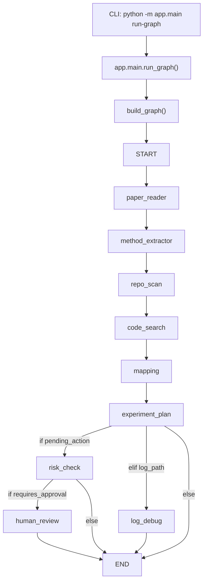

# 12. `run-graph` 命令执行全流程拆解

本文专门解释下面这条命令在当前项目里的真实执行路径、每个阶段的输入输出、会触发的文件与函数，以及最终会产出什么结果。

```bash
python -m app.main run-graph \
  "pdf/Point 4D Transformer Networks for Spatio-Temporal Modeling.pdf" \
  /data/tianshaoqi24/P4Transformer \
  /tmp/test_oom.log \
  --thread-id debug-001 \
  --goal "复现论文 main result"
```

## 1. 一句话结论

这条命令会走 `app.main` 里的 `run_graph()` 入口，把输入组装成一份初始 `state`，再交给 `LangGraph` 图执行。

对这条具体命令来说，真实运行路径是：

```text
START
  -> paper_reader
  -> method_extractor
  -> repo_scan
  -> code_search
  -> mapping
  -> experiment_plan
  -> log_debug
  -> END
```

不会进入的分支是：

```text
experiment_plan
  -> risk_check
  -> human_review
```

原因很简单：这条命令提供了 `log_path`，但没有提供 `pending_action`。因此计划生成完以后，图会进入 `log_debug`，而不是进入安全审批链。

## 2. 先看命令行参数是怎么落地的

命令对应的 CLI 入口在 `app/main.py` 的 `run_graph()` 函数中。

### 2.1 命令参数和 Python 形参的对应关系

这条命令会被 Typer 解析成下面几个参数：

- `paper_path`
  - 值：`pdf/Point 4D Transformer Networks for Spatio-Temporal Modeling.pdf`
- `repo_path`
  - 值：`/data/tianshaoqi24/P4Transformer`
- `log_path`
  - 值：`/tmp/test_oom.log`
- `thread_id`
  - 值：`debug-001`
- `goal`
  - 值：`复现论文 main result`

`run_graph()` 函数本体大致做了两件事：

1. `build_graph()` 构造 LangGraph 工作流。
2. `graph.invoke(...)` 把初始状态和 `thread_id` 送入图执行。

### 2.2 初始输入 state 长什么样

在 `graph.invoke(...)` 里，真正送进图的初始状态是：

```python
{
    "paper_path": "pdf/Point 4D Transformer Networks for Spatio-Temporal Modeling.pdf",
    "repo_path": "/data/tianshaoqi24/P4Transformer",
    "log_path": "/tmp/test_oom.log",
    "experiment_goal": "复现论文 main result",
    "output_files": [],
    "step_count": 0,
    "max_steps": 20,
}
```

这意味着图一开始已经知道三类核心输入：

- 论文文件位置
- 代码仓库位置
- 日志文件位置

同时还带有：

- 本次复现目标 `experiment_goal`
- 空的输出文件列表 `output_files`
- 运行控制字段 `step_count` 和 `max_steps`

## 3. 图是怎么搭起来的

图构建逻辑在 `app/graph.py` 的 `build_graph()` 中。

### 3.1 图里注册了哪些节点

`build_graph()` 一共注册了 9 个节点：

- `paper_reader`
- `method_extractor`
- `repo_scan`
- `code_search`
- `mapping`
- `experiment_plan`
- `log_debug`
- `risk_check`
- `human_review`

### 3.2 固定主链

图里的固定主链是：

```text
START
  -> paper_reader
  -> method_extractor
  -> repo_scan
  -> code_search
  -> mapping
  -> experiment_plan
```

也就是说，不管有没有日志，不管后面要不要审批，前六步都会先跑完。

### 3.3 条件路由

`experiment_plan` 之后不是写死的，而是走 `route_after_plan(state)`：

```python
def route_after_plan(state):
    if state.get("pending_action"):
        return "risk_check"
    if state.get("log_path"):
        return "log_debug"
    return END
```

这段逻辑很关键，优先级是：

1. 只要有 `pending_action`，优先去 `risk_check`
2. 否则，只要有 `log_path`，去 `log_debug`
3. 两者都没有，直接结束

对你这条命令来说：

- `pending_action` 一开始没有
- `log_path` 明确提供了 `/tmp/test_oom.log`

所以 `experiment_plan` 后一定会跳去 `log_debug`。

### 3.4 Mermaid 视图



## 4. 这条命令依赖哪些基础设施

在逐节点分析之前，先把运行依赖说清楚。

### 4.1 环境配置

配置由 `app/config.py` 里的 `Settings` 负责，主要读取：

- `OPENAI_API_KEY`
- `OPENAI_BASE_URL`
- `OPENAI_MODEL`
- `EMBEDDING_API_KEY`
- `EMBEDDING_BASE_URL`
- `EMBEDDING_MODEL`
- `OUTPUT_DIR`
- `MAX_STEPS`

其中这条命令的主链实际会用到的是：

- 聊天模型配置
- `OUTPUT_DIR`
- `MAX_STEPS`

### 4.2 模型封装

模型入口在 `app/model.py`：

- `get_chat_model()`
  - 用于 `method_extractor`、`mapping`、`experiment_plan`、`log_debug`
- `get_embedding_model()`
  - 当前这条链路里没有用到

### 4.3 State 结构

图状态结构定义在 `app/state.py` 的 `ReproductionState` 里。和这条命令最相关的字段包括：

- 输入类字段
  - `paper_path`
  - `repo_path`
  - `log_path`
  - `experiment_goal`
- 论文理解中间结果
  - `paper_text_chunks`
  - `paper_summary`
  - `method_modules`
- 仓库理解中间结果
  - `repo_map`
  - `code_search_results`
  - `paper_code_mapping`
- 计划与调试结果
  - `experiment_plan`
  - `debug_report`
- 控制和产物
  - `output_files`
  - `step_count`
  - `max_steps`
  - `error`

### 4.4 Checkpoint

图编译时会挂一个 checkpointer：

- 文件：`app/memory/checkpoint.py`
- 函数：`build_checkpointer()`
- 实现：`InMemorySaver()`

这意味着：

- `thread_id=debug-001` 会参与 LangGraph 的线程身份识别
- 但 checkpoint 只保存在当前 Python 进程内存里
- 进程结束后，这个状态不会自动持久化到磁盘或数据库

换句话说，这个 `thread_id` 现在更像“当前进程里的会话标识”，不是强持久化恢复方案。

## 5. 每个阶段的输入输出总览

先看一张总表，再逐个展开。

| 阶段 | 节点函数 | 主要读取 | 主要写回 state | 落盘文件 |
|---|---|---|---|---|
| 0 | `run_graph()` | CLI 参数 | 初始 state | 无 |
| 1 | `paper_reader_node()` | `paper_path` | `paper_text_chunks` | 无 |
| 2 | `method_extractor_node()` | `paper_text_chunks` | `paper_summary`, `method_modules` | `paper_summary.json`, `method_modules.json` |
| 3 | `repo_scan_node()` | `repo_path` | `repo_tree`, `repo_map` | `repo_map.json`, `repo_summary.md` |
| 4 | `code_search_node()` | `repo_path`, `method_modules` | `code_search_results` | 无 |
| 5 | `mapping_node()` | `method_modules`, `code_search_results` | `paper_code_mapping` | `paper_code_mapping.json`, `paper_code_mapping.md` |
| 6 | `experiment_plan_node()` | `paper_summary`, `repo_map`, `paper_code_mapping`, `experiment_goal` | `experiment_plan`, `run_commands` | `experiment_plan.json`, `experiment_plan.md` |
| 7 | `route_after_plan()` | `pending_action`, `log_path` | 路由决定 | 无 |
| 8 | `log_debug_node()` | `log_path`, `repo_map`, `experiment_plan` | `debug_report` | `debug_report.json`, `debug_report.md` |
| 9 | `END` | 当前 state | 最终返回 state | 无 |

## 6. 详细阶段拆解

## 6.1 阶段 0：CLI 入口和图启动

### 入口文件与函数

- 文件：`app/main.py`
- 函数：`run_graph(paper_path, repo_path, log_path, thread_id, goal)`

### 它做了什么

1. 调用 `build_graph()` 构建图。
2. 组装 `config = {"configurable": {"thread_id": thread_id}}`
3. 组装初始 `state`
4. 执行 `graph.invoke(initial_state, config=config)`
5. 打印 `result.get("output_files", [])`

### 这一阶段的输入

- `paper_path`
- `repo_path`
- `log_path`
- `thread_id`
- `goal`

### 这一阶段的输出

- 一份图的最终 `result` 状态
- 命令行里打印 `graph finished`
- 命令行里打印 `output_files` 列表

### 重要说明

这一步还没有真正分析论文、仓库或日志，它只是把所有输入塞进图。

## 6.2 阶段 1：`paper_reader_node` 读取论文并切块

### 入口文件与函数

- 节点文件：`app/nodes/paper_reader_node.py`
- 节点函数：`paper_reader_node(state)`
- 工具文件：`app/tools/paper_tools.py`
- 工具函数：
  - `read_paper(path)`
  - `read_pdf(path)`
  - `read_text_file(path)`
  - `split_text(text, chunk_size=5000, overlap=500)`

### 输入

读取 `state["paper_path"]`

对这条命令来说，输入是：

```text
pdf/Point 4D Transformer Networks for Spatio-Temporal Modeling.pdf
```

### 运行逻辑

1. 检查 `paper_path` 是否存在
2. 根据后缀选择读取方式
3. 因为这是 `.pdf`，所以会走 `read_pdf()`
4. `read_pdf()` 使用 `fitz` 按页读取文本
5. 每页会被拼成带页码标记的文本块，例如：

```text
[page 1]
...

[page 2]
...
```

6. 整篇论文读取后再送入 `split_text()`
7. `split_text()` 会按：
   - `chunk_size=5000`
   - `overlap=500`
   切成多个 chunk

### 输出到 state 的字段

写回：

```python
{
    "paper_text_chunks": [
        {
            "chunk_id": 0,
            "start": 0,
            "end": 5000,
            "text": "..."
        },
        ...
    ],
    "output_files": state.get("output_files", [])
}
```

### 落盘文件

无

### 这一阶段的作用

这一阶段只负责把论文变成“后续可以交给 LLM 的结构化 chunk 列表”，还没有开始摘要和方法抽取。

### 潜在失败点

- `paper_path` 为空
- PDF 文件不存在
- PDF 无法解析
- 文本过长导致后续阶段只能取前部分 chunk

## 6.3 阶段 2：`method_extractor_node` 提取论文结构化摘要

### 入口文件与函数

- 节点文件：`app/nodes/method_extractor_node.py`
- 节点函数：`method_extractor_node(state)`
- Prompt 文件：`app/prompts/paper_prompt.py`
- Prompt 常量：`PAPER_SUMMARY_PROMPT`
- Schema 文件：`app/schemas.py`
- Schema：
  - `Evidence`
  - `MethodModule`
  - `PaperSummary`
- 模型入口：`app/model.py -> get_chat_model()`

### 输入

读取：

- `paper_text_chunks`

### 运行逻辑

1. `_merge_chunks(chunks, max_chars=24000)` 会把前若干个 chunk 合并成一个长字符串
2. 这个函数不是把全部 chunk 都送进模型，而是最多拼到 24000 个字符左右
3. 调用 `get_chat_model(temperature=0)`
4. 用 `PAPER_SUMMARY_PROMPT.format(paper_text=paper_text)` 生成 prompt
5. 通过：

```python
llm.with_structured_output(PaperSummary, include_raw=True).invoke(prompt)
```

强制模型按 `PaperSummary` schema 输出

### `PaperSummary` 里期望拿到什么

结构化摘要至少包括：

- `title`
- `research_problem`
- `core_idea`
- `method_modules`
- `datasets`
- `metrics`
- `experiment_settings`
- `reproduction_risks`
- `unresolved_questions`

其中 `method_modules` 又是后续 code search 和 mapping 的关键输入。

### 输出到 state 的字段

写回：

- `paper_summary`
- `method_modules`
- `output_files`

### 落盘文件

- `outputs/paper_summary.json`
- `outputs/method_modules.json`

### 这一阶段的作用

这是整条链第一次调用 LLM，它把论文文本压成一份“机器可读的复现摘要”。

如果这一阶段出错，后面所有与论文相关的节点都会受到影响。

### 潜在失败点

- `paper_text_chunks` 为空
- 模型 API 配置错误
- 模型输出不符合 `PaperSummary` schema
- 论文过长，前 24000 字符没覆盖关键实验信息

## 6.4 阶段 3：`repo_scan_node` 建立仓库地图

### 入口文件与函数

- 节点文件：`app/nodes/repo_scan_node.py`
- 节点函数：`repo_scan_node(state)`
- 工具文件：`app/tools/repo_tools.py`
- 工具函数：
  - `get_file_tree(repo_path, max_depth=3)`
  - `list_files(repo_path, suffixes=None)`
  - `classify_repo_file(repo_path)`
- Schema 文件：`app/schemas.py`
- Schema：`RepoMap`

### 输入

读取：

- `repo_path`

对这条命令来说是：

```text
/data/tianshaoqi24/P4Transformer
```

### 运行逻辑

1. `get_file_tree()` 生成一个文本树
2. 递归扫描仓库，但会跳过 `IGNORE_DIRS`
3. 当前忽略目录包括：
   - `.git`
   - `__pycache__`
   - `.venv`
   - `node_modules`
   - `outputs`
   - `checkpoints`
   - `wandb`
4. `classify_repo_file()` 按启发式规则对文件分类
5. 它会找出：
   - `readme_files`
   - `train_entries`
   - `eval_entries`
   - `config_files`
   - `model_files`
   - `dataset_files`
   - `loss_files`
6. `repo_scan_node()` 再把这些集合合并成 `important_files`
7. 用这些信息构造 `RepoMap`

### 输出到 state 的字段

写回：

- `repo_tree`
- `repo_map`
- `output_files`

### `RepoMap` 大概长什么样

它至少包含：

- `repo_path`
- `readme_files`
- `train_entries`
- `eval_entries`
- `config_files`
- `model_files`
- `dataset_files`
- `loss_files`
- `important_files`
- `warnings`

### 落盘文件

- `outputs/repo_map.json`
- `outputs/repo_summary.md`

### 这一阶段的作用

它不是“完整理解仓库”，而是先建立一个可导航的全局索引，让后续节点知道重点文件在哪里。

### 潜在失败点

- `repo_path` 为空
- 仓库路径不存在
- 文件命名不规范导致启发式分类召回不足
- 目录太大但有重要文件藏在被忽略路径里

## 6.5 阶段 4：`code_search_node` 为每个论文模块搜索候选代码证据

### 入口文件与函数

- 节点文件：`app/nodes/code_search_node.py`
- 节点函数：`code_search_node(state)`
- 工具文件：`app/tools/search_tools.py`
- 工具函数：
  - `search_text(repo_path, query, max_results=20)`
  - `search_keywords(repo_path, keywords, max_per_keyword=10)`
- 工具文件：`app/tools/code_tools.py`
- 工具函数：
  - `read_file_slice(path, start_line=1, end_line=120)`

### 输入

读取：

- `repo_path`
- `method_modules`

### 运行逻辑

对每一个 `method_module`，它会做下面几步：

1. 取 `module["name"]`
2. 拼上 `module["possible_keywords"]`
3. 构成关键词列表：

```python
[module_name, *possible_keywords]
```

4. 调 `search_keywords()` 逐个关键词搜索仓库
5. `search_keywords()` 内部会调用 `search_text()`
6. `search_text()` 真正使用外部命令 `rg`
7. `rg` 会返回：
   - 命中文件
   - 行号
   - 行文本
8. `_candidate_file_from_matched()` 用“命中次数”给文件做一个简单排序
9. 取前若干个文件作为候选
10. 对前 5 个候选文件读取最多前 160 行片段

### `search_text()` 这一步在做什么

这是本阶段最重要的检索工具之一。

它执行的命令大致等价于：

```bash
rg --line-number --no-heading --glob '!{.git,__pycache__,outputs,checkpoints,wandb}/**' QUERY REPO_ROOT
```

也就是说，它不是用 Python 自己全文遍历，而是借助 `ripgrep` 在本地 repo 上做快速文本召回。

### 输出到 state 的字段

写回：

- `code_search_results`

这个字段的形状大致是：

```python
{
    "模块名A": {
        "keywords": [...],
        "matches": [...],
        "candidate_files": [...],
        "code_slices": [...]
    },
    "模块名B": {
        ...
    }
}
```

### 落盘文件

无

### 这一阶段的作用

它负责“候选证据召回”，还不负责最终判断。

可以把它理解成：

```text
论文模块
  -> 搜索关键词
  -> 仓库命中
  -> 候选文件排序
  -> 局部代码片段采样
```

### 潜在失败点

- 机器上没有安装 `rg`
- 模块关键词和仓库命名差异太大
- 只读前 160 行，可能错过真正实现位置
- 只按命中频次排序，语义相关性还比较弱

## 6.6 阶段 5：`mapping_node` 生成论文模块到代码的结构化映射

### 入口文件与函数

- 节点文件：`app/nodes/mapping_node.py`
- 节点函数：`mapping_node(state)`
- Prompt 文件：`app/prompts/mapping_prompt.py`
- Prompt 常量：`MAPPING_PROMPT`
- Schema 文件：`app/schemas.py`
- Schema：
  - `CodeCandidate`
  - `ModuleMapping`
- 模型入口：`app/model.py -> get_chat_model()`

### 输入

读取：

- `method_modules`
- `code_search_results`

### 运行逻辑

1. 创建聊天模型
2. 用：

```python
llm.with_structured_output(ModuleMapping)
```

要求模型按 `ModuleMapping` 输出

3. 对每个论文模块单独构造一次 prompt
4. prompt 里会带入三部分证据：
   - 模块本身
   - 搜索结果 `matches`
   - 代码片段 `code_slices`
5. 模型输出每个模块对应的候选实现、证据和未解问题
6. 最后把多个模块的结果汇总成 `mappings`

### 输出到 state 的字段

写回：

- `paper_code_mapping`
- `output_files`

### 落盘文件

- `outputs/paper_code_mapping.json`
- `outputs/paper_code_mapping.md`

### 这一阶段的作用

这是“论文”和“代码”真正对上的那一步。

前面 `code_search` 只是在仓库里找像的地方；这里才由 LLM 在有限证据上做结构化判断。

### 典型输出内容

每个 `ModuleMapping` 通常包含：

- `module_name`
- `candidates`
  - `file_path`
  - `symbols`
  - `reason`
  - `evidence`
  - `confidence`
- `unresolved_questions`

### 潜在失败点

- `method_modules` 为空
- `code_search_results` 为空
- 检索召回不准导致模型没证据可用
- 模型因为证据不足返回空候选

## 6.7 阶段 6：`experiment_plan_node` 生成实验计划

### 入口文件与函数

- 节点文件：`app/nodes/experiment_plan_node.py`
- 节点函数：`experiment_plan_node(state)`
- Prompt 文件：`app/prompts/plan_prompt.py`
- Prompt 常量：`EXPERIMENT_PLAN_PROMPT`
- Schema 文件：`app/schemas.py`
- Schema：
  - `ExperimentStep`
  - `RunCommand`
  - `ExperimentPlan`
- 模型入口：`app/model.py -> get_chat_model()`

### 输入

读取：

- `paper_summary`
- `repo_map`
- `paper_code_mapping`
- `experiment_goal`

### 运行逻辑

1. 检查前面三份结构化结果是否已经存在
2. 调用聊天模型
3. 用：

```python
llm.with_structured_output(ExperimentPlan)
```

强制按 `ExperimentPlan` 输出

4. prompt 会把前几阶段的产物全部序列化成 JSON 再注入
5. 模型需要生成：
   - 环境步骤
   - 数据步骤
   - 训练步骤
   - 评测步骤
   - 推荐命令
   - 风险
   - 未解问题

### 输出到 state 的字段

写回：

- `experiment_plan`
- `run_commands`
- `output_files`

### 落盘文件

- `outputs/experiment_plan.json`
- `outputs/experiment_plan.md`

### 这一阶段的作用

这一步把“论文理解 + 仓库理解 + 代码映射”转成一份执行计划。

注意：它只是“生成计划”，不是“执行计划”。

### 对这条命令最关键的一个事实

当前实现里，`experiment_plan_node()` 会把 `run_commands` 写进 state，但不会自动构造 `pending_action`。

因此虽然图中有 `risk_check` 和 `human_review`，但这次运行到这里以后：

- `state["run_commands"]` 可能已经有内容
- `state["pending_action"]` 依然是空

这就是为什么这次不会进入审批链。

### 潜在失败点

- 上游三份结构化结果缺失
- 模型生成的计划不够具体
- `run_commands` 只是建议，不等于真实可运行

## 6.8 阶段 7：`route_after_plan` 做分支决策

### 入口文件与函数

- 文件：`app/graph.py`
- 函数：`route_after_plan(state)`

### 输入

读取：

- `pending_action`
- `log_path`

### 对这条命令的实际判断过程

判断顺序是：

1. `state.get("pending_action")`
   - 结果：没有
2. `state.get("log_path")`
   - 结果：有，值为 `/tmp/test_oom.log`
3. 返回 `"log_debug"`

### 输出

- 不是写回新字段
- 而是决定下一跳节点是 `log_debug`

### 这一阶段的作用

这是从“正常分析主链”进入“失败诊断分支”的转折点。

## 6.9 阶段 8：`log_debug_node` 对日志做结构化 Debug

### 入口文件与函数

- 节点文件：`app/nodes/log_debug_node.py`
- 节点函数：`log_debug_node(state)`
- 工具文件：`app/tools/log_tools.py`
- 工具函数：
  - `read_log(path, max_chars=30000)`
  - `extract_traceback(log_text)`
  - `classify_error_heuristic(traceback)`
- Prompt 文件：`app/prompts/debug_prompt.py`
- Prompt 常量：`DEBUG_PROMPT`
- Schema 文件：`app/schemas.py`
- Schema：`DebugReport`
- 模型入口：`app/model.py -> get_chat_model()`

### 输入

读取：

- `log_path`
- `repo_map`
- `experiment_plan`

### 运行逻辑

1. `read_log(log_path, max_chars=30000)` 读取日志尾部
2. `extract_traceback(log_text)` 优先找最后一个 `Traceback`
3. 如果找不到 `Traceback`，就从日志里抽取可疑错误行
4. `classify_error_heuristic(traceback)` 做第一轮启发式分类
5. 再把：
   - `error_type`
   - `traceback`
   - `repo_map`
   - `experiment_plan`
   一起送进 `DEBUG_PROMPT`
6. LLM 以 `DebugReport` schema 输出结构化诊断

### 如果 `/tmp/test_oom.log` 真的包含 OOM 报错

如果日志里出现类似：

```text
CUDA out of memory
```

那么 `classify_error_heuristic()` 很可能会把 `error_type` 判成：

```text
cuda_oom
```

之后 LLM 会结合：

- 仓库结构
- 已生成的实验计划
- 抽取出的 traceback

来给出更完整的诊断建议。

### 输出到 state 的字段

写回：

- `debug_report`
- `output_files`

### 落盘文件

- `outputs/debug_report.json`
- `outputs/debug_report.md`

### 这一阶段的作用

前六步是在回答：

```text
论文怎么读
代码在哪
接下来怎么复现
```

而这一步在回答：

```text
如果实验跑崩了，系统怎么先帮你做第一轮排查
```

### 潜在失败点

- `log_path` 不存在
- 日志里没有足够的错误上下文
- 启发式分类过粗
- 模型给出过于泛化的诊断

## 6.10 阶段 9：END 和最终返回

### 入口

- 图节点：`END`

### 发生了什么

`log_debug` 执行完成后，图会到达 `END`。

然后：

- `graph.invoke(...)` 返回最终 `state`
- `run_graph()` 打印：
  - `graph finished`
  - 最终 `output_files` 列表

### 这条命令理论上会新增哪些产物

如果整条链都跑通，这次理论上会得到：

- `outputs/paper_summary.json`
- `outputs/method_modules.json`
- `outputs/repo_map.json`
- `outputs/repo_summary.md`
- `outputs/paper_code_mapping.json`
- `outputs/paper_code_mapping.md`
- `outputs/experiment_plan.json`
- `outputs/experiment_plan.md`
- `outputs/debug_report.json`
- `outputs/debug_report.md`

其中：

- `code_search_node()` 不会直接落盘
- 但它生成的 `code_search_results` 会被后面 `mapping_node()` 消费

## 7. 本次运行里哪些文件、函数、Prompt、Schema 会被用到

## 7.1 文件清单

### 入口和图层

- `app/main.py`
- `app/graph.py`
- `app/state.py`
- `app/config.py`
- `app/model.py`
- `app/memory/checkpoint.py`

### 节点层

- `app/nodes/paper_reader_node.py`
- `app/nodes/method_extractor_node.py`
- `app/nodes/repo_scan_node.py`
- `app/nodes/code_search_node.py`
- `app/nodes/mapping_node.py`
- `app/nodes/experiment_plan_node.py`
- `app/nodes/log_debug_node.py`

### 工具层

- `app/tools/paper_tools.py`
- `app/tools/repo_tools.py`
- `app/tools/search_tools.py`
- `app/tools/code_tools.py`
- `app/tools/log_tools.py`

### Prompt 层

- `app/prompts/paper_prompt.py`
- `app/prompts/mapping_prompt.py`
- `app/prompts/plan_prompt.py`
- `app/prompts/debug_prompt.py`

### Schema 层

- `app/schemas.py`

### 输入文件

- `pdf/Point 4D Transformer Networks for Spatio-Temporal Modeling.pdf`
- `/data/tianshaoqi24/P4Transformer`
- `/tmp/test_oom.log`

### 输出文件

- `outputs/paper_summary.json`
- `outputs/method_modules.json`
- `outputs/repo_map.json`
- `outputs/repo_summary.md`
- `outputs/paper_code_mapping.json`
- `outputs/paper_code_mapping.md`
- `outputs/experiment_plan.json`
- `outputs/experiment_plan.md`
- `outputs/debug_report.json`
- `outputs/debug_report.md`

## 7.2 关键函数清单

### 图入口与路由

- `run_graph()`
- `build_graph()`
- `route_after_plan()`

### 论文处理

- `paper_reader_node()`
- `read_paper()`
- `read_pdf()`
- `split_text()`
- `method_extractor_node()`
- `_merge_chunks()`

### 仓库分析

- `repo_scan_node()`
- `get_file_tree()`
- `classify_repo_file()`
- `list_files()`

### 检索与映射

- `code_search_node()`
- `_candidate_file_from_matched()`
- `search_keywords()`
- `search_text()`
- `read_file_slice()`
- `mapping_node()`

### 计划生成

- `experiment_plan_node()`
- `_render_plan_markdown()`

### 日志调试

- `log_debug_node()`
- `read_log()`
- `extract_traceback()`
- `classify_error_heuristic()`
- `_render_debug_markdown()`

## 7.3 本次会用到的 Schema

### 论文摘要相关

- `Evidence`
- `MethodModule`
- `PaperSummary`

### 仓库地图相关

- `RepoMap`

### 论文代码映射相关

- `CodeCandidate`
- `ModuleMapping`

### 实验计划相关

- `ExperimentStep`
- `RunCommand`
- `ExperimentPlan`

### Debug 相关

- `DebugReport`

## 8. 状态是怎么一步步长出来的

下面用“字段增长”的方式看整条链。

### 初始状态

```python
{
    "paper_path": "...pdf",
    "repo_path": "/data/tianshaoqi24/P4Transformer",
    "log_path": "/tmp/test_oom.log",
    "experiment_goal": "复现论文 main result",
    "output_files": [],
    "step_count": 0,
    "max_steps": 20
}
```

### `paper_reader` 之后新增

- `paper_text_chunks`

### `method_extractor` 之后新增

- `paper_summary`
- `method_modules`
- `output_files += [paper_summary.json, method_modules.json]`

### `repo_scan` 之后新增

- `repo_tree`
- `repo_map`
- `output_files += [repo_map.json, repo_summary.md]`

### `code_search` 之后新增

- `code_search_results`

### `mapping` 之后新增

- `paper_code_mapping`
- `output_files += [paper_code_mapping.json, paper_code_mapping.md]`

### `experiment_plan` 之后新增

- `experiment_plan`
- `run_commands`
- `output_files += [experiment_plan.json, experiment_plan.md]`

### `log_debug` 之后新增

- `debug_report`
- `output_files += [debug_report.json, debug_report.md]`

### 结束时你手里会同时有三层信息

1. 论文层
   - `paper_summary`
   - `method_modules`
2. 代码层
   - `repo_map`
   - `code_search_results`
   - `paper_code_mapping`
3. 行动与诊断层
   - `experiment_plan`
   - `run_commands`
   - `debug_report`

## 9. 这次不会触发，但图里已经存在的审批支路

虽然这条命令不会走到这里，但为了你后面理解整个图，还是要把这条分支说清楚。

### 9.1 `risk_check_node`

- 文件：`app/nodes/risk_check_node.py`
- 作用：检查 `pending_action` 的风险
- 依赖：`app/tools/safe_shell_tools.py -> assess_command_risk()`

如果某个上游节点在 state 中写入：

```python
{
    "pending_action": {
        "type": "run_command",
        "command": "python train.py"
    }
}
```

那么图在 `experiment_plan` 后就会进入 `risk_check`，而不是进入 `log_debug`。

### 9.2 `human_review_node`

- 文件：`app/nodes/human_review_node.py`
- 作用：如果 `requires_approval=True`，就触发 `interrupt(...)`

也就是说，这条支路是为“未来真的执行命令或改配置”准备的。

### 9.3 为什么这次不走审批链

因为当前主链节点只会产出：

- `run_commands`

不会自动产出：

- `pending_action`

所以图对这条命令的判断仍然是：

```text
有 log_path
-> 去 log_debug
```

而不是：

```text
有待执行动作
-> 去 risk_check
```

## 10. 你这条命令在业务上的真实意义

这条命令不是单纯“读论文”或“读日志”，而是在同一条图里串了两件事：

1. 先做复现前分析
   - 论文理解
   - 仓库理解
   - 论文代码映射
   - 实验计划
2. 再做失败后分析
   - 日志读取
   - traceback 抽取
   - 错误类型初判
   - LLM 结构化诊断

所以它更像一个：

```text
复现辅助 + 失败排查
```

的一站式入口。

## 11. 当前实现里几个值得记住的细节和限制

这些不是主流程的一部分，但对你真正理解源码很重要。

### 11.1 `step_count` 和 `max_steps` 目前几乎没有被真正消费

虽然 `run_graph()` 初始 state 里写了：

- `step_count = 0`
- `max_steps = 20`

但当前节点实现里并没有看到统一的步数递增和硬性截断逻辑。

所以它们现在更像“预留字段”，不是严格的执行控制器。

### 11.2 Checkpoint 目前是内存版

`InMemorySaver()` 的特点是：

- 同进程里可以保留
- 跨进程不持久

这意味着如果你跑完命令后另开一个全新进程，再去查同一个 `thread_id`，很可能取不到之前的状态。

### 11.3 `run_graph` 是分析链，不是执行链

虽然 `experiment_plan` 会生成 `run_commands`，但当前图不会真的执行这些命令。

所以现在的项目能力更准确地说是：

- 分析
- 规划
- 调试

而不是：

- 自动训练
- 自动修复
- 自动改代码

### 11.4 `log_debug` 的质量高度依赖日志内容

如果 `/tmp/test_oom.log`：

- 太短
- 没有 traceback
- 没有真实错误信息

那么最后的 `debug_report` 质量也会明显下降。

### 11.5 `search_text()` 依赖系统安装 `rg`

如果系统里没有 `ripgrep`，`code_search_node()` 这一段会直接受影响。

也就是说，这条图链不仅依赖 Python 包，也依赖外部命令行工具。

### 11.6 当前存在少量实现层不完全统一的地方

例如：

- `code_search_node()` 缺输入时返回的是 `{"errors": ...}`，不是 `{"error": ...}`
- `ReproductionState` 里 `experiment_plan` 的类型注解是 `list[dict[str, Any]]`，但节点实际写回的是一个字典

这些不会改变主流程的理解，但说明当前代码还处在持续打磨阶段。

## 12. 如果你以后要继续跟这个命令打交道，最重要的观察点是什么

建议你以后重点盯住下面 5 个输出文件，因为它们分别对应图里的关键阶段：

- `outputs/paper_summary.json`
  - 看论文是否被正确结构化
- `outputs/repo_map.json`
  - 看仓库地图是否靠谱
- `outputs/paper_code_mapping.json`
  - 看论文模块和代码有没有真正对上
- `outputs/experiment_plan.json`
  - 看计划是否足够可执行
- `outputs/debug_report.json`
  - 看日志诊断是否抓到核心问题

如果这 5 个文件中某一个质量明显下降，你基本就能反推是哪一段节点出了问题。

## 13. 最后用一句话概括这条命令

这条 `run-graph` 命令做的事情是：

```text
输入论文 + 本地代码仓库 + 失败日志
-> 先建立论文和代码的结构化理解
-> 再生成复现实验计划
-> 最后结合日志生成一份结构化 Debug 报告
```

如果把整个项目当成一个 Phase 1 原型，那么这条命令就是当前最接近“端到端复现辅助”的入口。
