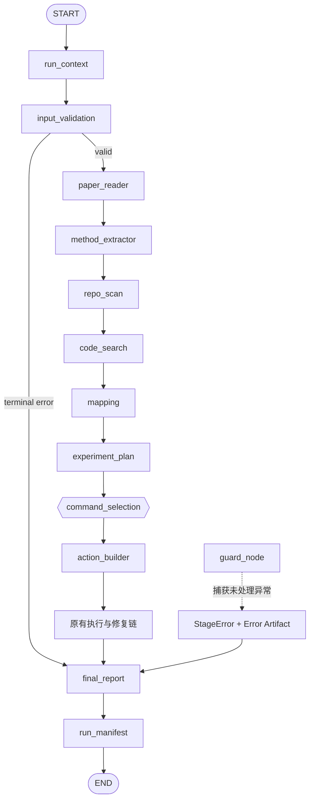

# 26. Phase 15：统一异常模型与 Run 原生 Artifact

Phase 14 已经把文件修复链收口到：

```text
路由唯一
验证语义准确
审批绑定当前事实
仓库修改互斥
Patch apply 可幂等恢复
Worktree 可审计、可清理
```

下一步不应急着增加网络、异步训练或 Web 页面，而应先解决当前系统的另一个
P0 问题：

```text
节点异常有时直接打断 Python 进程
不同类型的失败都塞进 error: str
多数节点仍先写共享 outputs/
run_manifest 最后才复制文件
两个 run 可能覆盖彼此的 Artifact
失败 run 不一定留下完整报告
```

本阶段要把系统升级为：

```text
任何 run 从开始就拥有独立目录
每个 Artifact 直接写入当前 run
每个 Artifact 在生成时登记来源和哈希
可预期错误进入结构化 StageError
未处理异常由统一节点边界转换
失败也进入 final_report 和 run_manifest
Agent 故障不冒充论文程序失败
```

根据
`a_implementation_guides/agent_project_analysis_and_technical_roadmap.md`，
这是 Phase 14 之后优先级最高的 Phase 15。

---

## 一、本阶段解决什么问题

### 1. 当前 `error` 字段没有明确语义

目前不同节点可能返回：

```python
{"error": "必须提供 repo_path"}
{"error": "审批记录与当前操作不匹配"}
{"error": "模型调用失败"}
{"error": "git command failed"}
```

它们实际上分别可能属于：

```text
用户输入错误
安全策略阻断
Provider 故障
Agent 内部错误
宿主环境错误
论文程序运行失败
```

如果只保存一个字符串，下游无法可靠决定：

- 是否应该重试。
- 是否应该进入 Debug。
- 是否应该要求用户补充输入。
- 是否应该标记为论文复现失败。
- 是否属于 Agent 自身缺陷。

### 2. 未处理异常会绕过报告链

例如：

```text
paper_reader_node
  -> FileNotFoundError
  -> graph.invoke() 抛出
  -> CLI 显示 traceback
  -> final_report 没有执行
  -> run_manifest 没有执行
```

用户只能看到 Python traceback，却没有稳定的机器可读错误记录。

### 3. 共享 `outputs/` 会污染不同 run

当前很多节点仍然写：

```text
outputs/paper_summary.json
outputs/preflight_report.json
outputs/execution.log
outputs/debug_report.json
outputs/final_report.md
```

`run_manifest_node` 最后再把这些文件复制到：

```text
runs/<run_id>/
```

如果两个 run 交错执行：

```text
Run A 写 outputs/paper_summary.json
Run B 覆盖 outputs/paper_summary.json
Run A 最后复制
```

Run A 的 Manifest 可能归档 Run B 的结果。

### 4. Artifact 只有文件路径，没有完整 provenance

目前 `output_files` 主要是字符串列表：

```python
[
    "outputs/paper_summary.json",
    "outputs/execution.log",
]
```

它不能直接回答：

- 文件由哪个节点生成。
- 文件属于哪个 run。
- 文件生成时的 SHA-256 是什么。
- 文件后来是否被修改。
- 文件是什么类型。
- 文件何时生成。

### 5. Eval 仍读取共享输出

当前：

```python
OUTPUT_DIR = Path("outputs")
mapping_path = OUTPUT_DIR / "paper_code_mapping.json"
```

这意味着 Eval case 可能读取上一个 case 或另一个 run 的结果，评分不可信。

---

## 二、本阶段目标

本阶段要完成：

1. 定义统一的 `StageError`。
2. 区分 user、agent、environment、provider 和 paper_program。
3. 增加输入验证节点。
4. 为所有 Graph 节点增加统一异常边界。
5. 保留 LangGraph `interrupt()`，不能被错误边界吞掉。
6. 让 terminal error 进入 `final_report`。
7. 让失败 run 仍然生成 `error_report.json`、`error_report.md` 和 Manifest。
8. 扩展标准 run 目录。
9. 所有节点直接写当前 `run_dir`。
10. Artifact 生成时立即登记路径、SHA-256、producer 和时间。
11. Manifest 不再从共享 `outputs/` 复制文件。
12. Eval 每个 case 使用独立 run。
13. CLI 的直接节点命令也先创建 run context。
14. 增加多 run 隔离、失败报告和 Artifact 完整性测试。

本阶段明确不做：

```text
不实现进程组和 cancel
不实现流式 stdout/stderr
不实现 CPU、内存、GPU 限额
不实现 Docker/Podman 沙箱
不实现异步 Job Runtime
不实现网络下载
不实现 Web API
不自动判断论文指标是否复现成功
```

这些属于 Phase 16 及之后。

---

## 三、核心语义：三种“失败”不能混在一起

### 3.1 Stage Error

Stage Error 表示 Agent 流程某个阶段无法可靠完成，例如：

```text
论文路径不存在
执行环境 profile 不存在
Provider 连接失败
Git 命令不可用
Pydantic 校验失败
Agent 代码抛出未处理异常
```

它进入：

```text
StageError
  -> error_report
  -> final_report
  -> run_manifest
```

### 3.2 Paper Program Failure

论文命令返回非零码属于复现对象本身的运行失败，例如：

```text
CUDA OOM
shape mismatch
ModuleNotFoundError
训练脚本参数错误
```

它应继续走：

```text
executor/smoke failed
  -> log_debug
  -> repair_planner
```

不能因为它也叫“错误”，就在统一异常边界处直接结束 Graph。

因此这类 `StageError` 即使记录，也应当：

```text
category = paper_program
terminal = false
```

### 3.3 Policy Block

风险策略、审批哈希和 Patch 边界拒绝属于安全阻断：

```text
危险命令被禁止
审批记录过期
Patch hash 不匹配
Promotion 未批准
```

它不是 Python 异常，也不是论文程序失败。

第一版可以归入：

```text
category = user 或 agent
code = POLICY_BLOCKED / STALE_APPROVAL / PATCH_AUTHORIZATION_FAILED
terminal = true
```

并保留原来的细粒度 `final_status`。

---

## 四、目标流程



每个节点写 Artifact 时采用：

```text
state.run_dir
  -> resolve_artifact_path()
  -> atomic write
  -> SHA-256
  -> ArtifactRecord
  -> state.artifact_records
```

---

## 五、最终 Run 目录

本阶段统一为：

```text
runs/<run_id>/
├── inputs/
│   ├── run_request.json
│   └── input_validation_report.json
├── analysis/
│   ├── paper_summary.json
│   ├── method_modules.json
│   ├── repo_map.json
│   ├── repo_summary.md
│   ├── paper_code_mapping.json
│   └── paper_code_mapping.md
├── planning/
│   ├── experiment_plan.json
│   ├── experiment_plan.md
│   ├── command_selection_input.json
│   ├── command_selection_record.json
│   ├── effective_run_commands.json
│   ├── preflight_report.json
│   ├── preflight_report.md
│   ├── action_approval_record.json
│   ├── patch_approval_record.json
│   └── patch_promotion_record.json
├── execution/
│   ├── smoke_test.log
│   ├── smoke_test_report.json
│   ├── smoke_test_report.md
│   ├── execution.log
│   ├── patch_verification_report.json
│   ├── patch_application_record.json
│   └── patch_worktrees/
├── debug/
│   ├── debug_report.json
│   ├── debug_report.md
│   ├── repair_proposal.json
│   ├── repair_proposal.md
│   └── file_repair_proposal.json
├── patches/
│   └── <patch_id>/
│       ├── patch.diff
│       └── patch_bundle.json
├── traces/
│   ├── structured/
│   └── errors/
└── reports/
    ├── error_report.json
    ├── error_report.md
    ├── final_report.md
    ├── artifact_index.json
    └── run_manifest.json
```

这里不再有：

```text
先写 outputs/，最后再 copy
```

`outputs/` 可以在未来作为“最近一次运行”的只读便捷链接，但不能再作为真实
Artifact Store。

---

## 六、涉及文件

建议新增：

```text
app/tools/error_tools.py
app/nodes/input_validation_node.py

tests/test_stage_error_tools.py
tests/test_input_validation_node.py
tests/test_run_native_artifacts.py
tests/test_failed_run_manifest.py
tests/test_multi_run_artifact_isolation.py
tests/test_no_shared_outputs.py
```

建议修改：

```text
app/schemas.py
app/state.py
app/config.py
app/graph.py
app/main.py

app/tools/artifact_tools.py
app/tools/structured_output_tools.py

app/nodes/run_context_node.py
app/nodes/method_extractor_node.py
app/nodes/repo_scan_node.py
app/nodes/mapping_node.py
app/nodes/experiment_plan_node.py
app/nodes/command_selection_node.py
app/nodes/human_review_node.py
app/nodes/preflight_check_node.py
app/nodes/smoke_test_node.py
app/nodes/executor_node.py
app/nodes/log_debug_node.py
app/nodes/repair_planner_node.py
app/nodes/file_repair_planner_node.py
app/nodes/patch_builder_node.py
app/nodes/patch_review_node.py
app/nodes/patch_verifier_node.py
app/nodes/patch_promotion_review_node.py
app/nodes/patch_apply_node.py
app/nodes/final_report_node.py
app/nodes/run_manifest_node.py

app/evaluation/run_eval.py
tests/conftest.py
```

通常不需要修改：

```text
app/execution/*
app/tools/patch_tools.py
app/tools/repository_lock_tools.py
app/tools/patch_journal_tools.py
```

Phase 16 才集中处理执行环境、进程树和日志流。

---

## 七、实现顺序

不要一次把所有节点改完再运行测试。建议分成六个小批次：

```text
批次 1：Schema + Artifact Tool
批次 2：StageError + input_validation + guard_node
批次 3：分析与规划节点迁移
批次 4：执行、Debug 和 Patch 节点迁移
批次 5：final_report + manifest + CLI + Eval
批次 6：多 run、失败和完整性验收
```

每完成一批就运行对应测试，避免同时排查路径、Graph 和错误语义。

---

## 八、先记录当前基线

所有测试临时目录和缓存继续放在 `/data/tianshaoqi24/` 下：

```bash
cd /data/tianshaoqi24/agent/paper_reproduction_copilot

export PHASE15_TEST_ROOT="$(
  mktemp -d \
    -p /data/tianshaoqi24 \
    paper-reproduction-phase15-tests.XXXXXX
)"
export PHASE15_ORIGINAL_HOME="$HOME"
export HOME="$PHASE15_TEST_ROOT/home"
export TMPDIR="$PHASE15_TEST_ROOT/tmp"
export TMP="$TMPDIR"
export TEMP="$TMPDIR"
export XDG_CACHE_HOME="$PHASE15_TEST_ROOT/cache"
export PYTHONPYCACHEPREFIX="$PHASE15_TEST_ROOT/pycache"
export PYTEST_ADDOPTS="--basetemp=$PHASE15_TEST_ROOT/pytest-tmp"

mkdir -p \
  "$HOME" \
  "$TMPDIR" \
  "$XDG_CACHE_HOME" \
  "$PYTHONPYCACHEPREFIX" \
  "$PHASE15_TEST_ROOT/pytest-tmp"

python -m pytest -q
```

记录：

```text
测试数量
通过数量
失败数量
总耗时
```

再记录仍依赖共享输出的文件：

```bash
rg -n \
  'settings\.output_dir|Path\("outputs"\)|OUTPUT_DIR = Path\("outputs"\)' \
  app tests
```

Phase 15 完成后，Graph 节点和 Eval 中不应再出现这些写入方式。

---

## 九、增加统一 Schema

修改：

```text
app/schemas.py
```

在通用 Schema 区域增加：

```python
from typing import Any, Literal, Optional

from pydantic import BaseModel, Field, model_validator


ArtifactLayer = Literal[
    "inputs",
    "analysis",
    "planning",
    "execution",
    "debug",
    "patches",
    "reports",
    "traces",
]

ErrorCategory = Literal[
    "user",
    "agent",
    "environment",
    "provider",
    "paper_program",
]


class ArtifactRecord(BaseModel):
    """
    一个 Artifact 在“生成完成时”的不可变元数据。

    relative_path 是相对 run_dir 的 POSIX 路径，是索引中的稳定身份。
    absolute_path 方便本地 CLI 使用，但仍必须经过 run_dir 边界校验。
    """

    artifact_id: str
    run_id: str
    layer: ArtifactLayer
    relative_path: str
    absolute_path: str
    media_type: str
    sha256: str
    size_bytes: int = Field(ge=0)
    producer_node: str
    created_at: str


class StageError(BaseModel):
    """
    Graph 某个阶段的结构化错误。

    terminal 决定是否停止当前业务链。
    retryable 只是事实描述，不能让 Graph 自动重放有副作用的整个节点。
    """

    error_id: str
    code: str
    category: ErrorCategory
    stage: str
    message: str
    retryable: bool = False
    terminal: bool = True
    exception_type: str | None = None
    traceback_artifact_path: str | None = None
    context: dict[str, Any] = Field(default_factory=dict)
    occurred_at: str


class InputCheck(BaseModel):
    """输入验证中的一个确定性检查项。"""

    name: str
    status: Literal["passed", "failed", "warning"]
    category: Literal["user", "environment"]
    code: str
    message: str
    path: str | None = None


class InputValidationReport(BaseModel):
    """进入论文读取和仓库扫描之前的输入验证结果。"""

    valid: bool
    checks: list[InputCheck] = Field(default_factory=list)
    generated_at: str
```

注意：

```text
StageError 不是 Python Exception 子类
```

它是可以进入 checkpoint、JSON 和 Manifest 的数据模型。

Python 异常仍然由 `guard_node()` 捕获，然后转换成 `StageError`。

---

## 十、扩展 State

修改：

```text
app/state.py
```

在 run 字段附近增加：

```python
class ReproductionState(TypedDict, total=False):
    # ...保留已有字段...

    run_id: Optional[str]
    run_dir: Optional[str]
    run_started_at: Optional[str]

    # 输入验证必须发生在 paper_reader 之前。
    input_validation_report: Optional[dict[str, Any]]
    inputs_validated: bool

    # StageError 是新的错误事实；error 字符串暂时保留兼容旧报告。
    stage_errors: list[dict[str, Any]]
    active_stage_error: Optional[dict[str, Any]]
    error_report_json_path: Optional[str]
    error_report_md_path: Optional[str]

    # 每个节点写文件后立即登记，不再等 manifest 节点复制。
    artifact_records: list[dict[str, Any]]
    artifact_index_path: Optional[str]
    run_manifest_path: Optional[str]

    # prepare node 在 interrupt 前保存并登记模板。
    command_selection_input_path: Optional[str]
    command_selection_input_status: Optional[str]
```

第一版继续让节点返回完整列表：

```text
"stage_errors": [
    *state.get("stage_errors", []),
    new_error,
]
```

不要同时给这两个字段增加 `operator.add` reducer，否则旧的“返回完整列表”写法会
导致重复累加。

---

## 十一、重写 Run Artifact Tool

修改：

```text
app/tools/artifact_tools.py
```

建议先保留旧函数的 Git commit 和 Manifest 业务字段，再把文件写入部分替换为
下面的实现。

### 11.1 完整的路径与写入基础

```python
import hashlib
import json
import mimetypes
import os
import re
import subprocess
import uuid
from datetime import datetime, timezone
from pathlib import Path, PurePosixPath
from typing import Any

from app.config import settings
from app.schemas import ArtifactRecord


ARTIFACT_LAYERS = {
    "inputs",
    "analysis",
    "planning",
    "execution",
    "debug",
    "patches",
    "reports",
    "traces",
}


def utc_now() -> str:
    """统一使用 UTC ISO-8601，便于跨时区比较和排序。"""

    return datetime.now(timezone.utc).isoformat()


def _slugify(value: str) -> str:
    lowered = value.strip().lower()
    lowered = re.sub(r"[^a-z0-9]+", "-", lowered)
    return lowered.strip("-") or "run"


def build_run_id(task_id: str | None) -> str:
    """生成可读前缀 + 时间 + 随机后缀，避免不同进程碰撞。"""

    prefix = _slugify(task_id or "run")
    timestamp = datetime.now(timezone.utc).strftime("%Y%m%d-%H%M%S")
    suffix = uuid.uuid4().hex[:8]
    return f"{prefix}-{timestamp}-{suffix}"


def create_run_layout(run_id: str) -> dict[str, str]:
    """
    创建当前 run 的标准目录。

    run_id 只允许作为一个目录名，不能携带 /、.. 或绝对路径。
    """

    if not run_id or Path(run_id).name != run_id or run_id in {".", ".."}:
        raise ValueError(f"无效的 run_id：{run_id!r}")

    run_root = (settings.runs_dir / run_id).resolve()
    runs_root = settings.runs_dir.resolve()
    if run_root == runs_root or runs_root not in run_root.parents:
        raise ValueError("run 目录逃逸 RUNS_DIR")

    layout = {
        "run_root": str(run_root),
        "inputs_dir": str(run_root / "inputs"),
        "analysis_dir": str(run_root / "analysis"),
        "planning_dir": str(run_root / "planning"),
        "execution_dir": str(run_root / "execution"),
        "debug_dir": str(run_root / "debug"),
        "patches_dir": str(run_root / "patches"),
        "reports_dir": str(run_root / "reports"),
        "traces_dir": str(run_root / "traces"),
    }

    for raw_path in layout.values():
        Path(raw_path).mkdir(parents=True, exist_ok=True)

    return layout


def require_run_root(state: dict[str, Any]) -> Path:
    """
    读取并校验 state.run_dir。

    Phase 15 之后不允许节点在没有 run context 时回退到 outputs/。
    """

    raw_run_dir = state.get("run_dir")
    if not raw_run_dir:
        raise ValueError("当前 state 缺少 run_dir")

    run_root = Path(str(raw_run_dir)).resolve()
    runs_root = settings.runs_dir.resolve()

    if run_root == runs_root or runs_root not in run_root.parents:
        raise ValueError(
            f"run_dir 不在 RUNS_DIR 内：run_dir={run_root}, "
            f"runs_dir={runs_root}"
        )

    run_root.mkdir(parents=True, exist_ok=True)
    return run_root


def resolve_artifact_path(
    state: dict[str, Any],
    relative_path: str,
) -> Path:
    """
    把 run 内相对路径解析为绝对路径。

    只允许：
      analysis/paper_summary.json
      execution/execution.log

    拒绝：
      /absolute/path
      ../outside
      reports/../../outside
      unknown_layer/file.json
    """

    posix_path = PurePosixPath(relative_path)
    if posix_path.is_absolute():
        raise ValueError("Artifact relative_path 不能是绝对路径")
    if ".." in posix_path.parts:
        raise ValueError("Artifact relative_path 不能包含 ..")
    if len(posix_path.parts) < 2:
        raise ValueError("Artifact 路径必须包含 layer 和文件名")
    if posix_path.parts[0] not in ARTIFACT_LAYERS:
        raise ValueError(
            f"未知 Artifact layer：{posix_path.parts[0]}"
        )

    run_root = require_run_root(state)
    target = run_root.joinpath(*posix_path.parts).resolve()
    if target == run_root or run_root not in target.parents:
        raise ValueError("Artifact 路径逃逸当前 run")

    return target


def artifact_dir(
    state: dict[str, Any],
    layer: str,
    *parts: str,
) -> Path:
    """给需要自行生成多个文件的旧工具提供受控目录。"""

    suffix = "/".join((layer, *parts, ".directory-marker"))
    marker = resolve_artifact_path(state, suffix)
    directory = marker.parent
    directory.mkdir(parents=True, exist_ok=True)
    return directory


def sha256_file(path: Path) -> str:
    """计算磁盘文件 SHA-256；文件不存在时直接报错。"""

    digest = hashlib.sha256()
    with path.open("rb") as file_obj:
        for chunk in iter(lambda: file_obj.read(1024 * 1024), b""):
            digest.update(chunk)
    return digest.hexdigest()


def _atomic_write_bytes(path: Path, data: bytes) -> None:
    """
    在目标目录内写临时文件，再使用 os.replace 原子替换。

    临时文件与目标位于同一文件系统，避免跨设备 rename。
    """

    path.parent.mkdir(parents=True, exist_ok=True)
    temp_path = path.with_name(
        f".{path.name}.{uuid.uuid4().hex}.tmp"
    )

    try:
        with temp_path.open("xb") as file_obj:
            file_obj.write(data)
            file_obj.flush()
            os.fsync(file_obj.fileno())
        os.replace(temp_path, path)
    finally:
        if temp_path.exists():
            temp_path.unlink()


def _guess_media_type(path: Path) -> str:
    media_type, _ = mimetypes.guess_type(path.name)
    if media_type:
        return media_type
    if path.suffix == ".log":
        return "text/plain"
    return "application/octet-stream"


def _artifact_id(run_id: str, relative_path: str) -> str:
    material = f"{run_id}:{relative_path}".encode("utf-8")
    return "artifact_" + hashlib.sha256(material).hexdigest()[:20]


def build_artifact_record(
    *,
    state: dict[str, Any],
    path: Path,
    producer_node: str,
    media_type: str | None = None,
) -> ArtifactRecord:
    """为已经完整写入磁盘的文件生成元数据。"""

    run_root = require_run_root(state)
    resolved_path = path.resolve()
    if run_root not in resolved_path.parents:
        raise ValueError("不能登记当前 run 之外的 Artifact")
    if not resolved_path.is_file():
        raise FileNotFoundError(f"Artifact 文件不存在：{resolved_path}")

    relative_path = resolved_path.relative_to(run_root).as_posix()
    layer = relative_path.split("/", 1)[0]
    if layer not in ARTIFACT_LAYERS:
        raise ValueError(f"未知 Artifact layer：{layer}")

    run_id = str(state.get("run_id") or "")
    if not run_id:
        raise ValueError("登记 Artifact 时缺少 run_id")

    return ArtifactRecord(
        artifact_id=_artifact_id(run_id, relative_path),
        run_id=run_id,
        layer=layer,
        relative_path=relative_path,
        absolute_path=str(resolved_path),
        media_type=media_type or _guess_media_type(resolved_path),
        sha256=sha256_file(resolved_path),
        size_bytes=resolved_path.stat().st_size,
        producer_node=producer_node,
        created_at=utc_now(),
    )


def write_bytes_artifact(
    *,
    state: dict[str, Any],
    relative_path: str,
    data: bytes,
    producer_node: str,
    media_type: str | None = None,
) -> tuple[Path, ArtifactRecord]:
    """原子写入并立即生成 ArtifactRecord。"""

    path = resolve_artifact_path(state, relative_path)
    _atomic_write_bytes(path, data)
    record = build_artifact_record(
        state=state,
        path=path,
        producer_node=producer_node,
        media_type=media_type,
    )
    return path, record


def write_text_artifact(
    *,
    state: dict[str, Any],
    relative_path: str,
    text: str,
    producer_node: str,
    media_type: str = "text/plain",
) -> tuple[Path, ArtifactRecord]:
    return write_bytes_artifact(
        state=state,
        relative_path=relative_path,
        data=text.encode("utf-8"),
        producer_node=producer_node,
        media_type=media_type,
    )


def write_json_artifact(
    *,
    state: dict[str, Any],
    relative_path: str,
    payload: Any,
    producer_node: str,
) -> tuple[Path, ArtifactRecord]:
    text = json.dumps(
        payload,
        ensure_ascii=False,
        indent=2,
        default=str,
    ) + "\n"
    return write_text_artifact(
        state=state,
        relative_path=relative_path,
        text=text,
        producer_node=producer_node,
        media_type="application/json",
    )


def register_existing_artifact(
    *,
    state: dict[str, Any],
    path: str | Path,
    producer_node: str,
    media_type: str | None = None,
) -> ArtifactRecord:
    """
    登记由已有工具生成的文件。

    例如 patch_tools 一次生成 patch.diff 和 patch_bundle.json，
    节点无需复制文件，只需在生成后登记。
    """

    return build_artifact_record(
        state=state,
        path=Path(path),
        producer_node=producer_node,
        media_type=media_type,
    )
```

### 11.2 合并 Artifact State

继续增加：

```python
def merge_artifact_records(
    existing: list[dict[str, Any]],
    new_records: list[ArtifactRecord | dict[str, Any]],
) -> list[dict[str, Any]]:
    """
    按 relative_path upsert。

    LangGraph 从 interrupt 恢复时会重新执行节点开头。固定路径 Artifact
    不能因此在 state 中无限重复。
    """

    ordered_paths: list[str] = []
    by_path: dict[str, dict[str, Any]] = {}

    for raw_record in [*existing, *new_records]:
        record = ArtifactRecord.model_validate(raw_record).model_dump()
        relative_path = record["relative_path"]
        if relative_path not in by_path:
            ordered_paths.append(relative_path)
        by_path[relative_path] = record

    return [by_path[path] for path in ordered_paths]


def artifact_state_update(
    state: dict[str, Any],
    records: list[ArtifactRecord | dict[str, Any]],
) -> dict[str, Any]:
    """同时维护新 artifact_records 和兼容字段 output_files。"""

    merged_records = merge_artifact_records(
        list(state.get("artifact_records", [])),
        records,
    )

    output_files: list[str] = []
    seen: set[str] = set()
    for path in [
        *state.get("output_files", []),
        *[record["absolute_path"] for record in merged_records],
    ]:
        if path not in seen:
            seen.add(path)
            output_files.append(path)

    return {
        "artifact_records": merged_records,
        "output_files": output_files,
    }
```

为什么暂时保留 `output_files`？

因为已有测试、CLI 和少量代码仍在读取它。Phase 15 把
`artifact_records` 变成事实来源，`output_files` 只作为兼容视图。

### 11.3 检查 Artifact 完整性

继续增加：

```python
def inspect_artifact_records(
    state: dict[str, Any],
) -> tuple[list[dict[str, Any]], list[dict[str, str]]]:
    """
    在生成 Artifact Index 前重新检查路径和 hash。

    不直接抛出第一个错误，而是收集全部 issue，使失败 Manifest 仍能生成。
    """

    run_root = require_run_root(state)
    inspected: list[dict[str, Any]] = []
    issues: list[dict[str, str]] = []

    for raw_record in state.get("artifact_records", []):
        try:
            record = ArtifactRecord.model_validate(raw_record)
        except Exception as exc:
            issues.append(
                {
                    "code": "INVALID_ARTIFACT_RECORD",
                    "message": str(exc),
                }
            )
            continue

        path = Path(record.absolute_path).resolve()
        status = "current"
        detail = ""

        if path == run_root or run_root not in path.parents:
            status = "outside_run"
            detail = "Artifact path is outside current run"
        elif not path.is_file():
            status = "missing"
            detail = "Artifact file does not exist"
        else:
            current_hash = sha256_file(path)
            if current_hash != record.sha256:
                status = "hash_mismatch"
                detail = (
                    f"recorded={record.sha256}, current={current_hash}"
                )

        inspected.append(
            {
                **record.model_dump(),
                "integrity_status": status,
                "integrity_detail": detail,
            }
        )

        if status != "current":
            issues.append(
                {
                    "code": f"ARTIFACT_{status.upper()}",
                    "message": (
                        f"{record.relative_path}: {detail or status}"
                    ),
                }
            )

    return inspected, issues
```

这里采用：

```text
发现 Artifact 异常
  -> 记录 issue
  -> 生成失败 Manifest
```

而不是在 Manifest 阶段抛异常后什么都不留下。

---

## 十二、实现统一 StageError Tool

新增：

```text
app/tools/error_tools.py
```

下面给出完整文件参考：

```python
from __future__ import annotations

import json
import re
import traceback
from datetime import datetime, timezone
from functools import wraps
from typing import Any, Callable
from uuid import uuid4

from langgraph.errors import GraphInterrupt
from pydantic import ValidationError

from app.schemas import StageError
from app.tools.artifact_tools import (
    artifact_state_update,
    write_json_artifact,
    write_text_artifact,
)


NodeCallable = Callable[[dict[str, Any]], dict[str, Any]]

PROVIDER_STAGES = {
    "method_extractor",
    "mapping",
    "experiment_plan",
    "log_debug",
    "repair_planner",
    "file_repair_planner",
}

SENSITIVE_ASSIGNMENT = re.compile(
    r"(?i)"
    r"([A-Z0-9_]*(?:KEY|TOKEN|SECRET|PASSWORD|CREDENTIAL)[A-Z0-9_]*)"
    r"\s*=\s*"
    r"([^\s,;]+)"
)


def utc_now() -> str:
    return datetime.now(timezone.utc).isoformat()


def sanitize_error_message(value: object, max_chars: int = 4000) -> str:
    """
    错误报告不能把 API Key 等值原样写入 Artifact。

    这里只做基础兜底。Phase 16 还会从子进程环境层彻底隔离 secret。
    """

    text = str(value)
    text = SENSITIVE_ASSIGNMENT.sub(r"\1=<redacted>", text)
    return text[:max_chars]


def is_transient_provider_error(exc: BaseException) -> bool:
    """只识别常见传输、限流和服务端瞬时错误。"""

    material = (
        f"{type(exc).__module__}.{type(exc).__name__}: {exc}"
    ).lower()
    markers = (
        "timeout",
        "timed out",
        "connection",
        "ratelimit",
        "rate_limit",
        "429",
        "502",
        "503",
        "504",
        "temporarily unavailable",
    )
    return any(marker in material for marker in markers)


def classify_exception(
    *,
    stage: str,
    exc: BaseException,
) -> tuple[str, str, bool]:
    """
    返回 category、code、retryable。

    分类必须是确定性的，不把最终安全决定交给 LLM。
    """

    if isinstance(exc, FileNotFoundError):
        if stage in {"input_validation", "paper_reader", "repo_scan"}:
            return "user", "INPUT_NOT_FOUND", False
        return "environment", "FILE_NOT_FOUND", False

    if isinstance(exc, PermissionError):
        return "environment", "PERMISSION_DENIED", False

    if isinstance(exc, ValidationError):
        return "agent", "SCHEMA_VALIDATION_FAILED", False

    if isinstance(exc, (UnicodeDecodeError, json.JSONDecodeError)):
        return "user", "INVALID_INPUT_FORMAT", False

    if stage in PROVIDER_STAGES:
        return (
            "provider",
            "PROVIDER_TRANSIENT_ERROR"
            if is_transient_provider_error(exc)
            else "PROVIDER_ERROR",
            is_transient_provider_error(exc),
        )

    if isinstance(exc, OSError):
        return "environment", "OS_ERROR", False

    return "agent", "UNHANDLED_AGENT_EXCEPTION", False


def final_status_for_category(category: str) -> str:
    return {
        "user": "invalid_input",
        "agent": "agent_failed",
        "environment": "environment_blocked",
        "provider": "provider_failed",
        "paper_program": "failed",
    }.get(category, "agent_failed")


def build_stage_error(
    *,
    stage: str,
    code: str,
    category: str,
    message: str,
    retryable: bool = False,
    terminal: bool = True,
    exception_type: str | None = None,
    context: dict[str, Any] | None = None,
) -> StageError:
    """构造不包含完整 traceback 的错误记录。"""

    return StageError(
        error_id=f"error_{uuid4().hex[:16]}",
        code=code,
        category=category,
        stage=stage,
        message=sanitize_error_message(message),
        retryable=retryable,
        terminal=terminal,
        exception_type=exception_type,
        context=context or {},
        occurred_at=utc_now(),
    )


def render_error_report_markdown(
    errors: list[dict[str, Any]],
) -> str:
    lines = ["# Error Report", ""]

    if not errors:
        lines.extend(["当前 run 没有记录 StageError。", ""])
        return "\n".join(lines)

    for index, raw_error in enumerate(errors, 1):
        error = StageError.model_validate(raw_error)
        lines.extend(
            [
                f"## {index}. {error.code}",
                "",
                f"- Error ID：`{error.error_id}`",
                f"- Stage：`{error.stage}`",
                f"- Category：`{error.category}`",
                f"- Terminal：`{error.terminal}`",
                f"- Retryable：`{error.retryable}`",
                f"- Exception：`{error.exception_type or 'not_recorded'}`",
                f"- Time：`{error.occurred_at}`",
                f"- Message：{error.message}",
            ]
        )
        if error.traceback_artifact_path:
            lines.append(
                "- Traceback Artifact："
                f"`{error.traceback_artifact_path}`"
            )
        lines.append("")

    return "\n".join(lines)


def persist_stage_errors(
    *,
    state: dict[str, Any],
    new_errors: list[StageError],
    tracebacks: dict[str, str] | None = None,
) -> dict[str, Any]:
    """
    把新错误追加到 state，并重写当前 run 的汇总 Error Report。

    Error Artifact 写入失败时不能递归抛出另一个 guard error。
    """

    tracebacks = tracebacks or {}
    working_errors = [
        StageError.model_validate(item)
        for item in state.get("stage_errors", [])
    ]
    records = []

    for error in new_errors:
        traceback_text = tracebacks.get(error.error_id)
        if traceback_text:
            try:
                trace_path, trace_record = write_text_artifact(
                    state=state,
                    relative_path=(
                        f"traces/errors/{error.error_id}.traceback.txt"
                    ),
                    text=sanitize_error_message(
                        traceback_text,
                        max_chars=20000,
                    ),
                    producer_node=f"error_boundary:{error.stage}",
                )
                records.append(trace_record)
                error = error.model_copy(
                    update={
                        "traceback_artifact_path": str(trace_path),
                    }
                )
            except (OSError, ValueError):
                # run 存储本身不可写时只能保留 checkpoint 中的结构化错误。
                pass

        working_errors.append(error)

    serialized_errors = [item.model_dump() for item in working_errors]
    working_state = {
        **state,
        "stage_errors": serialized_errors,
    }

    try:
        json_path, json_record = write_json_artifact(
            state=working_state,
            relative_path="reports/error_report.json",
            payload={
                "run_id": state.get("run_id"),
                "error_count": len(serialized_errors),
                "errors": serialized_errors,
                "generated_at": utc_now(),
            },
            producer_node="error_report",
        )
        md_path, md_record = write_text_artifact(
            state=working_state,
            relative_path="reports/error_report.md",
            text=render_error_report_markdown(serialized_errors),
            producer_node="error_report",
            media_type="text/markdown",
        )
        records.extend([json_record, md_record])
        report_paths = {
            "error_report_json_path": str(json_path),
            "error_report_md_path": str(md_path),
        }
    except (OSError, ValueError):
        report_paths = {}

    active_error = working_errors[-1]
    update = {
        "stage_errors": serialized_errors,
        "active_stage_error": active_error.model_dump(),
        # 兼容旧 final_report；新的判断必须读取 stage_errors。
        "error": active_error.message,
        **report_paths,
    }

    if active_error.terminal:
        update["final_status"] = final_status_for_category(
            active_error.category
        )

    if records:
        update.update(artifact_state_update(working_state, records))

    return update


def exception_to_stage_error_update(
    *,
    state: dict[str, Any],
    stage: str,
    exc: BaseException,
) -> dict[str, Any]:
    category, code, retryable = classify_exception(
        stage=stage,
        exc=exc,
    )
    error = build_stage_error(
        stage=stage,
        code=code,
        category=category,
        message=str(exc),
        retryable=retryable,
        terminal=True,
        exception_type=type(exc).__name__,
    )
    return persist_stage_errors(
        state=state,
        new_errors=[error],
        tracebacks={
            error.error_id: "".join(
                traceback.format_exception(
                    type(exc),
                    exc,
                    exc.__traceback__,
                )
            )
        },
    )


def has_terminal_stage_error(state: dict[str, Any]) -> bool:
    for item in state.get("stage_errors", []):
        try:
            if StageError.model_validate(item).terminal:
                return True
        except ValidationError:
            # 无效错误记录本身就是 Agent 状态损坏，路由必须 fail closed。
            return True
    return False


def guard_node(
    node_name: str,
    node: NodeCallable,
) -> NodeCallable:
    """
    为 Graph 节点增加统一异常边界。

    只捕获 Exception，不捕获 KeyboardInterrupt/SystemExit。
    GraphInterrupt 必须原样抛出，否则人工审批无法暂停。
    """

    @wraps(node)
    def wrapped(state: dict[str, Any]) -> dict[str, Any]:
        try:
            return node(state)
        except GraphInterrupt:
            raise
        except Exception as exc:
            return exception_to_stage_error_update(
                state=state,
                stage=node_name,
                exc=exc,
            )

    return wrapped
```

### 12.1 为什么不在 `guard_node()` 中自动重试整个节点

节点可能已经：

```text
调用了模型
写了文件
运行了论文命令
应用了 Patch
```

盲目重放整个节点可能重复副作用。

因此：

```text
Provider transport retry
```

只能放在具体 Provider adapter 内，并且发生在任何外部副作用之前。Phase 15
第一版先准确标记 `retryable`，不在 Graph 错误边界自动重试。

### 12.2 关于 `GraphInterrupt`

务必使用当前环境中的 LangGraph 版本检查：

```bash
python - <<'PY'
from langgraph.errors import GraphInterrupt

print(GraphInterrupt.__mro__)
PY
```

`command_selection`、`human_review`、`patch_review` 和
`patch_promotion_review` 都依赖 `interrupt()`。如果 `guard_node()` 吞掉
`GraphInterrupt`，Graph 会把正常人工中断误记为 Agent 失败。

---

## 十三、增加输入验证节点

新增：

```text
app/nodes/input_validation_node.py
```

完整文件参考：

```python
from datetime import datetime, timezone
from pathlib import Path
from typing import Any

from app.execution.profile_store import get_execution_profile
from app.schemas import InputCheck, InputValidationReport
from app.tools.artifact_tools import (
    artifact_state_update,
    write_json_artifact,
)
from app.tools.error_tools import (
    build_stage_error,
    persist_stage_errors,
)


SUPPORTED_PAPER_SUFFIXES = {".pdf", ".md", ".txt"}


def _check_required_file(
    *,
    name: str,
    raw_path: str | None,
    missing_code: str,
) -> InputCheck:
    if not raw_path:
        return InputCheck(
            name=name,
            status="failed",
            category="user",
            code=missing_code,
            message=f"必须提供 {name}",
        )

    path = Path(raw_path).expanduser().resolve()
    if not path.exists():
        return InputCheck(
            name=name,
            status="failed",
            category="user",
            code="INPUT_NOT_FOUND",
            message=f"{name} 不存在",
            path=str(path),
        )
    if not path.is_file():
        return InputCheck(
            name=name,
            status="failed",
            category="user",
            code="INPUT_NOT_FILE",
            message=f"{name} 不是普通文件",
            path=str(path),
        )

    return InputCheck(
        name=name,
        status="passed",
        category="user",
        code="OK",
        message=f"{name} 可读取",
        path=str(path),
    )


def _check_paper(path: str | None) -> list[InputCheck]:
    check = _check_required_file(
        name="paper_path",
        raw_path=path,
        missing_code="PAPER_PATH_REQUIRED",
    )
    checks = [check]

    if check.status == "passed" and check.path:
        suffix = Path(check.path).suffix.lower()
        if suffix not in SUPPORTED_PAPER_SUFFIXES:
            checks.append(
                InputCheck(
                    name="paper_format",
                    status="failed",
                    category="user",
                    code="UNSUPPORTED_PAPER_FORMAT",
                    message=f"不支持的论文格式：{suffix}",
                    path=check.path,
                )
            )
        else:
            checks.append(
                InputCheck(
                    name="paper_format",
                    status="passed",
                    category="user",
                    code="OK",
                    message=f"论文格式受支持：{suffix}",
                    path=check.path,
                )
            )

    return checks


def _check_repo(path: str | None) -> InputCheck:
    if not path:
        return InputCheck(
            name="repo_path",
            status="failed",
            category="user",
            code="REPO_PATH_REQUIRED",
            message="必须提供 repo_path",
        )

    repo = Path(path).expanduser().resolve()
    if not repo.exists():
        return InputCheck(
            name="repo_path",
            status="failed",
            category="user",
            code="REPO_NOT_FOUND",
            message="代码仓库目录不存在",
            path=str(repo),
        )
    if not repo.is_dir():
        return InputCheck(
            name="repo_path",
            status="failed",
            category="user",
            code="REPO_NOT_DIRECTORY",
            message="repo_path 不是目录",
            path=str(repo),
        )

    return InputCheck(
        name="repo_path",
        status="passed",
        category="user",
        code="OK",
        message="代码仓库目录存在",
        path=str(repo),
    )


def _check_optional_log(path: str | None) -> InputCheck:
    if not path:
        return InputCheck(
            name="log_path",
            status="passed",
            category="user",
            code="NOT_PROVIDED",
            message="本次未提供外部日志",
        )
    return _check_required_file(
        name="log_path",
        raw_path=path,
        missing_code="LOG_PATH_REQUIRED",
    )


def _check_execution_profile(
    *,
    profile_id: str | None,
    repo_path: str | None,
) -> InputCheck:
    if not profile_id:
        return InputCheck(
            name="execution_profile",
            status="failed",
            category="environment",
            code="EXECUTION_PROFILE_REQUIRED",
            message="缺少 execution_profile_id",
        )

    try:
        profile = get_execution_profile(profile_id)
    except (FileNotFoundError, ValueError) as exc:
        return InputCheck(
            name="execution_profile",
            status="failed",
            category="environment",
            code="EXECUTION_PROFILE_INVALID",
            message=str(exc),
        )

    workspace = Path(profile.workspace_root).expanduser().resolve()
    if not workspace.is_dir():
        return InputCheck(
            name="execution_profile",
            status="failed",
            category="environment",
            code="PROFILE_WORKSPACE_NOT_FOUND",
            message="execution profile workspace_root 不存在",
            path=str(workspace),
        )

    if repo_path:
        repo = Path(repo_path).expanduser().resolve()
        if repo != workspace and workspace not in repo.parents:
            return InputCheck(
                name="execution_profile",
                status="failed",
                category="environment",
                code="REPO_OUTSIDE_PROFILE_WORKSPACE",
                message=(
                    "repo_path 不在 execution profile workspace_root 内"
                ),
                path=str(workspace),
            )

    return InputCheck(
        name="execution_profile",
        status="passed",
        category="environment",
        code="OK",
        message=f"execution profile 可用：{profile.profile_id}",
        path=str(workspace),
    )


def input_validation_node(state: dict[str, Any]) -> dict[str, Any]:
    """
    在任何 PDF、Git、rg、LLM 或论文命令之前检查外部输入。
    """

    checks = [
        *_check_paper(state.get("paper_path")),
        _check_repo(state.get("repo_path")),
        _check_optional_log(state.get("log_path")),
        _check_execution_profile(
            profile_id=state.get("execution_profile_id"),
            repo_path=state.get("repo_path"),
        ),
    ]

    valid = all(check.status != "failed" for check in checks)
    report = InputValidationReport(
        valid=valid,
        checks=checks,
        generated_at=datetime.now(timezone.utc).isoformat(),
    )

    report_path, report_record = write_json_artifact(
        state=state,
        relative_path="inputs/input_validation_report.json",
        payload=report.model_dump(),
        producer_node="input_validation",
    )

    update: dict[str, Any] = {
        "input_validation_report": report.model_dump(),
        "inputs_validated": valid,
        **artifact_state_update(state, [report_record]),
    }

    if valid:
        return update

    errors = [
        build_stage_error(
            stage="input_validation",
            code=check.code,
            category=check.category,
            message=check.message,
            terminal=True,
            context={
                "check_name": check.name,
                "path": check.path,
            },
        )
        for check in checks
        if check.status == "failed"
    ]

    working_state = {**state, **update}
    return {
        **update,
        **persist_stage_errors(
            state=working_state,
            new_errors=errors,
        ),
    }
```

输入验证节点只检查：

```text
路径、类型、格式、profile 和 workspace 关系
```

它不负责：

```text
安装依赖
修改环境
下载数据
运行训练
```

---

## 十四、修改 Run Context

修改：

```text
app/nodes/run_context_node.py
```

建议替换为完整文件：

```python
from datetime import datetime, timezone
from pathlib import Path
from typing import Any

from app.tools.artifact_tools import (
    artifact_state_update,
    build_run_id,
    create_run_layout,
    write_json_artifact,
)


def run_context_node(state: dict[str, Any]) -> dict[str, Any]:
    """
    为新 run 创建目录；checkpoint resume 时复用原 run。

    run_request 只保存任务元数据，不保存 API Key 或完整 Prompt。
    """

    existing_run_id = state.get("run_id")
    existing_run_dir = state.get("run_dir")
    existing_started_at = state.get("run_started_at")

    run_id = existing_run_id or build_run_id(state.get("task_id"))
    layout = create_run_layout(run_id)
    expected_run_dir = Path(layout["run_root"]).resolve()
    if (
        existing_run_dir
        and Path(existing_run_dir).resolve() != expected_run_dir
    ):
        raise ValueError(
            "checkpoint 中的 run_id 与 run_dir 不匹配"
        )
    run_dir = str(expected_run_dir)
    run_started_at = (
        existing_started_at
        or datetime.now(timezone.utc).isoformat()
    )

    context_state = {
        **state,
        "run_id": run_id,
        "run_dir": run_dir,
        "run_started_at": run_started_at,
    }

    request_payload = {
        "run_id": run_id,
        "task_id": state.get("task_id"),
        "paper_path": state.get("paper_path"),
        "repo_path": state.get("repo_path"),
        "log_path": state.get("log_path"),
        "experiment_goal": state.get("experiment_goal"),
        "execution_profile_id": state.get("execution_profile_id"),
        "run_started_at": run_started_at,
    }

    request_path, request_record = write_json_artifact(
        state=context_state,
        relative_path="inputs/run_request.json",
        payload=request_payload,
        producer_node="run_context",
    )

    return {
        "run_id": run_id,
        "run_dir": run_dir,
        "run_started_at": run_started_at,
        "stage_errors": list(state.get("stage_errors", [])),
        "artifact_records": list(
            state.get("artifact_records", [])
        ),
        **artifact_state_update(
            context_state,
            [request_record],
        ),
    }
```

注意：

```text
create_run_layout(existing_run_id)
```

仍会确保 resume 后缺失的标准子目录被补齐，但不会创建新的 run id。

---

## 十五、让错误边界兼容普通返回值

当前不少节点不是抛异常，而是返回：

```python
{
    "final_status": "invalid_action",
    "error": "selected_run_command_index 超出范围",
}
```

如果只捕获 exception，这些旧错误不会进入 `StageError`。

### 15.1 增加显式错误结果 helper

在：

```text
app/tools/error_tools.py
```

的 `persist_stage_errors()` 后增加：

```python
def stage_error_result(
    *,
    state: dict[str, Any],
    stage: str,
    code: str,
    category: str,
    message: str,
    terminal: bool = True,
    retryable: bool = False,
    context: dict[str, Any] | None = None,
    extra_update: dict[str, Any] | None = None,
) -> dict[str, Any]:
    """
    给可预期业务错误使用，不需要先抛 Python Exception。

    extra_update 用于保留节点自己的字段，例如 pending_action=None。
    """

    error = build_stage_error(
        stage=stage,
        code=code,
        category=category,
        message=message,
        terminal=terminal,
        retryable=retryable,
        context=context,
    )
    base_update = extra_update or {}
    working_state = {**state, **base_update}
    persisted = persist_stage_errors(
        state=working_state,
        new_errors=[error],
    )
    return {
        **persisted,
        # 更细粒度业务状态应覆盖通用 category 状态。
        **base_update,
    }
```

节点中的可预期错误应逐步改成：

```text
return stage_error_result(
    state=state,
    stage="action_builder",
    code="SELECTED_COMMAND_OUT_OF_RANGE",
    category="user",
    message=(
        "selected_run_command_index 超出范围："
        f"{selected_index}"
    ),
    extra_update={
        "pending_action": None,
        "pending_action_hash": None,
        "final_status": "invalid_action",
    },
)
```

### 15.2 增加迁移期兜底

把 `guard_node()` 中：

```text
try:
    return node(state)
```

替换为：

```text
try:
    result = node(state)

    # 迁移期兜底：旧节点返回 error 字符串时也要生成 StageError。
    # 完成 Phase 15 后，应尽量由节点使用 stage_error_result 显式分类。
    legacy_error = result.get("error")
    if legacy_error and not result.get("active_stage_error"):
        error = build_stage_error(
            stage=node_name,
            code="LEGACY_NODE_ERROR",
            category="agent",
            message=str(legacy_error),
            terminal=True,
            context={
                "legacy_final_status": result.get("final_status"),
            },
        )
        working_state = {**state, **result}
        return {
            **result,
            **persist_stage_errors(
                state=working_state,
                new_errors=[error],
            ),
        }

    return result
```

这个兜底的目标是：

```text
迁移过程中不漏错误
```

不是让所有错误永远都叫 `LEGACY_NODE_ERROR`。完成阶段后，关键节点应当都有明确
code 和 category。

### 15.3 让 run_context 异常也尽量可记录

`run_context` 是第一个节点。如果它抛异常，原 state 可能还没有 `run_dir`。

在 `error_tools.py` 中增加：

```python
from app.tools.artifact_tools import build_run_id, create_run_layout
```

然后增加：

```python
def ensure_error_run_context(
    state: dict[str, Any],
) -> dict[str, Any]:
    """
    错误边界的应急 run context。

    如果 RUNS_DIR 本身不可写，文件报告客观上无法生成，但 StageError 仍应
    尽量返回给 LangGraph/CLI。
    """

    if state.get("run_id") and state.get("run_dir"):
        return state

    run_id = str(
        state.get("run_id")
        or build_run_id(state.get("task_id"))
    )
    layout = create_run_layout(run_id)
    return {
        **state,
        "run_id": run_id,
        "run_dir": layout["run_root"],
        "run_started_at": (
            state.get("run_started_at")
            or utc_now()
        ),
    }
```

再修改 `exception_to_stage_error_update()`：

```python
def exception_to_stage_error_update(
    *,
    state: dict[str, Any],
    stage: str,
    exc: BaseException,
) -> dict[str, Any]:
    category, code, retryable = classify_exception(
        stage=stage,
        exc=exc,
    )
    error = build_stage_error(
        stage=stage,
        code=code,
        category=category,
        message=str(exc),
        retryable=retryable,
        terminal=True,
        exception_type=type(exc).__name__,
    )
    traceback_text = "".join(
        traceback.format_exception(
            type(exc),
            exc,
            exc.__traceback__,
        )
    )

    try:
        working_state = ensure_error_run_context(state)
        return {
            **{
                key: value
                for key, value in working_state.items()
                if key in {
                    "run_id",
                    "run_dir",
                    "run_started_at",
                }
            },
            **persist_stage_errors(
                state=working_state,
                new_errors=[error],
                tracebacks={error.error_id: traceback_text},
            ),
        }
    except Exception as persistence_exc:
        # 连错误目录都无法创建时，至少不丢失结构化事实。
        fallback_error = error.model_copy(
            update={
                "context": {
                    **error.context,
                    "error_persistence_failed": sanitize_error_message(
                        persistence_exc
                    ),
                }
            }
        )
        return {
            "stage_errors": [
                *state.get("stage_errors", []),
                fallback_error.model_dump(),
            ],
            "active_stage_error": fallback_error.model_dump(),
            "error": fallback_error.message,
            "final_status": final_status_for_category(category),
        }
```

如果连 `RUNS_DIR` 都不可写，任何方案都无法凭空生成磁盘 Manifest。此时最低保证
是：

```text
不显示未处理 traceback
返回结构化 StageError
CLI 给出明确的存储故障
```

---

## 十六、拆分 Command Selection Prepare

`command_selection_node` 有一个特殊点：

```text
写 command_selection_input.json
  -> interrupt()
```

LangGraph 在 interrupt 时保存的是“进入当前节点前”的 state。节点在 interrupt
前写入的文件虽然存在，但本节点尚未 return，因此 ArtifactRecord 不会进入
checkpoint。

最清晰的解决方案是拆成两个节点：

```text
experiment_plan
  -> command_selection_prepare
  -> command_selection interrupt
```

### 16.1 State 增加输入文件路径

在 `app/state.py` 增加：

```python
command_selection_input_path: Optional[str]
command_selection_input_status: Optional[str]
```

### 16.2 新增 prepare node

在：

```text
app/nodes/command_selection_node.py
```

保留 `ensure_command_selection_input_file()`，增加：

```python
from app.tools.artifact_tools import (
    artifact_state_update,
    register_existing_artifact,
    resolve_artifact_path,
)


def command_selection_prepare_node(state: dict) -> dict:
    """
    在 interrupt 节点之前落盘并登记命令选择模板。

    这样 checkpoint 到达 command_selection 时，模板已经是当前 run 的
    正式 Artifact。
    """

    run_commands = state.get("run_commands", [])
    if not run_commands:
        return {
            "command_selection_input_path": None,
            "selected_run_command_index": None,
            "edited_run_commands": [],
        }

    input_path = resolve_artifact_path(
        state,
        "planning/command_selection_input.json",
    )
    status, stale_backup_path = ensure_command_selection_input_file(
        input_path,
        run_commands,
    )

    records = [
        register_existing_artifact(
            state=state,
            path=input_path,
            producer_node="command_selection_prepare",
            media_type="application/json",
        )
    ]
    if stale_backup_path is not None:
        records.append(
            register_existing_artifact(
                state=state,
                path=stale_backup_path,
                producer_node="command_selection_prepare",
                media_type="application/json",
            )
        )

    return {
        "command_selection_input_path": str(input_path),
        "command_selection_input_status": status,
        **artifact_state_update(state, records),
    }
```

### 16.3 修改 interrupt 节点

把 `command_selection_node()` 开头的：

```python
input_path, input_status, stale_backup_path = _ensure_command_selection_input(
    state,
    run_commands,
)
```

替换为：

```text
raw_input_path = state.get("command_selection_input_path")
if not raw_input_path:
    return stage_error_result(
        state=state,
        stage="command_selection",
        code="COMMAND_SELECTION_INPUT_MISSING",
        category="agent",
        message="checkpoint 中缺少 command_selection_input_path",
        extra_update={
            "selected_run_command_index": None,
            "edited_run_commands": [],
        },
    )

input_path = Path(raw_input_path)
input_status = state.get("command_selection_input_status", "current")
stale_backup_path = None
```

恢复后写选择记录时，不再使用 `settings.output_dir`：

```text
record_path, record_artifact = write_json_artifact(
    state=state,
    relative_path="planning/command_selection_record.json",
    payload=record.model_dump(),
    producer_node="command_selection",
)
effective_path, effective_artifact = write_json_artifact(
    state=state,
    relative_path="planning/effective_run_commands.json",
    payload=effective_commands,
    producer_node="command_selection",
)

return {
    # ...保留原返回字段...
    **artifact_state_update(
        state,
        [record_artifact, effective_artifact],
    ),
}
```

模板已经由 prepare node 登记，不要在 interrupt 恢复后重复把它当成新文件。

完成拆分后删除旧 helper：

```python
_command_selection_input_path()
_ensure_command_selection_input()
```

同时删除该文件中仅为 fallback 使用的：

```python
from app.config import settings
```

否则 `tests/test_no_shared_outputs.py` 会正确指出这个节点仍然保留共享输出路径。

---

## 十七、修改 Graph

修改：

```text
app/graph.py
```

### 17.1 增加 import

```python
from collections.abc import Callable
from typing import Literal

from app.nodes.input_validation_node import input_validation_node
from app.nodes.command_selection_node import (
    command_selection_node,
    command_selection_prepare_node,
)
from app.tools.error_tools import guard_node, has_terminal_stage_error
```

删除原来单独的：

```python
from app.nodes.command_selection_node import command_selection_node
```

### 17.2 增加通用 early-stage route

```python
def route_to_next_or_final(
    state: ReproductionState,
    *,
    next_node: str,
) -> str:
    """早期线性节点发生 terminal StageError 时统一转 Final Report。"""

    if has_terminal_stage_error(state):
        return "final_report"
    return next_node


def route_after_run_context(
    state: ReproductionState,
) -> Literal["input_validation", "final_report"]:
    if has_terminal_stage_error(state):
        return "final_report"
    return "input_validation"


def route_after_input_validation(
    state: ReproductionState,
) -> Literal["paper_reader", "final_report"]:
    if (
        has_terminal_stage_error(state)
        or not state.get("inputs_validated")
    ):
        return "final_report"
    return "paper_reader"
```

### 17.3 修改已有条件 route

每个已有 route 的第一段都增加：

```text
if has_terminal_stage_error(state):
    return "final_report"
```

例如：

```python
def route_after_action_builder(
    state: ReproductionState,
) -> Literal["risk_check", "log_debug", "final_report"]:
    if has_terminal_stage_error(state):
        return "final_report"
    if state.get("pending_action"):
        return "risk_check"
    if state.get("log_path"):
        return "log_debug"
    return "final_report"
```

下面这些 route 都要检查：

```text
route_after_action_builder
route_after_risk_check
route_after_human_review
route_after_preflight
route_after_smoke_test
route_after_executor
route_after_log_debug
route_after_repair_planner
route_after_repair_action_builder
route_after_file_repair_planner
route_after_patch_builder
route_after_patch_review
route_after_patch_verifier
route_after_patch_promotion_review
route_after_patch_apply
```

不要给 `paper_program` 的非 terminal error 设置 `terminal=true`，否则
`executor -> log_debug` 会被提前截断。

### 17.4 所有节点通过 guard 注册

在 `build_graph()` 内增加局部 helper：

```python
def add_guarded(
    builder: StateGraph,
    name: str,
    node: Callable,
) -> None:
    builder.add_node(name, guard_node(name, node))
```

把节点注册统一替换为：

```python
add_guarded(builder, "run_context", run_context_node)
add_guarded(builder, "input_validation", input_validation_node)
add_guarded(builder, "paper_reader", paper_reader_node)
add_guarded(builder, "method_extractor", method_extractor_node)
add_guarded(builder, "repo_scan", repo_scan_node)
add_guarded(builder, "code_search", code_search_node)
add_guarded(builder, "mapping", mapping_node)
add_guarded(builder, "experiment_plan", experiment_plan_node)
add_guarded(
    builder,
    "command_selection_prepare",
    command_selection_prepare_node,
)
add_guarded(builder, "command_selection", command_selection_node)
add_guarded(builder, "action_builder", action_builder_node)
add_guarded(builder, "risk_check", risk_check_node)
add_guarded(builder, "human_review", human_review_node)
add_guarded(builder, "preflight_check", preflight_check_node)
add_guarded(builder, "smoke_test", smoke_test_node)
add_guarded(builder, "executor", executor_node)
add_guarded(builder, "log_debug", log_debug_node)
add_guarded(builder, "repair_planner", repair_planner_node)
add_guarded(
    builder,
    "repair_action_builder",
    repair_action_builder_node,
)
add_guarded(
    builder,
    "file_repair_planner",
    file_repair_planner_node,
)
add_guarded(builder, "patch_builder", patch_builder_node)
add_guarded(builder, "patch_review", patch_review_node)
add_guarded(builder, "patch_verifier", patch_verifier_node)
add_guarded(
    builder,
    "patch_promotion_review",
    patch_promotion_review_node,
)
add_guarded(builder, "patch_apply", patch_apply_node)
add_guarded(builder, "final_report", final_report_node)
add_guarded(builder, "run_manifest", run_manifest_node)
```

### 17.5 替换早期无条件边

原来的分析链是无条件边。改为：

```python
builder.add_edge(START, "run_context")

builder.add_conditional_edges(
    "run_context",
    route_after_run_context,
    {
        "input_validation": "input_validation",
        "final_report": "final_report",
    },
)
builder.add_conditional_edges(
    "input_validation",
    route_after_input_validation,
    {
        "paper_reader": "paper_reader",
        "final_report": "final_report",
    },
)

for source, target in [
    ("paper_reader", "method_extractor"),
    ("method_extractor", "repo_scan"),
    ("repo_scan", "code_search"),
    ("code_search", "mapping"),
    ("mapping", "experiment_plan"),
    ("experiment_plan", "command_selection_prepare"),
    ("command_selection_prepare", "command_selection"),
    ("command_selection", "action_builder"),
]:
    builder.add_conditional_edges(
        source,
        lambda state, next_node=target: route_to_next_or_final(
            state,
            next_node=next_node,
        ),
        {
            target: target,
            "final_report": "final_report",
        },
    )
```

这里显式提供了 `path_map`，因此即使闭包 route 返回类型不是 `Literal`，
LangGraph 仍能确定可能目标。

如果当前 LangGraph 版本不接受带默认参数的 lambda，改为给每条边写独立 route
函数。不要退回无条件边。

### 17.6 Final 和 Manifest 保持兜底链

保留：

```python
builder.add_edge("final_report", "run_manifest")
builder.add_edge("run_manifest", END)
```

即使 `final_report_node` 自身被 guard 转成 StageError，仍会进入 Manifest。

如果 `run_manifest_node` 自身发生不可恢复的存储异常，Graph 到 END 时至少应在
checkpoint 中保留对应 `StageError`。

---

## 十八、Artifact 迁移统一写法

所有节点都采用同一种模式：

```text
json_path, json_record = write_json_artifact(
    state=state,
    relative_path="analysis/example.json",
    payload=payload,
    producer_node="example_node",
)
md_path, md_record = write_text_artifact(
    state=state,
    relative_path="analysis/example.md",
    text=markdown,
    producer_node="example_node",
    media_type="text/markdown",
)

return {
    "example": payload,
    **artifact_state_update(
        state,
        [json_record, md_record],
    ),
}
```

不要再写：

```python
settings.output_dir.mkdir(...)
path = settings.output_dir / "example.json"
path.write_text(...)
```

### 18.1 迁移表

| Producer Node | Run 原生路径 |
|---|---|
| `run_context` | `inputs/run_request.json` |
| `input_validation` | `inputs/input_validation_report.json` |
| `method_extractor` | `analysis/paper_summary.json` |
| `method_extractor` | `analysis/method_modules.json` |
| `repo_scan` | `analysis/repo_map.json` |
| `repo_scan` | `analysis/repo_summary.md` |
| `mapping` | `analysis/paper_code_mapping.json/.md` |
| `experiment_plan` | `planning/experiment_plan.json/.md` |
| `command_selection_prepare` | `planning/command_selection_input.json` |
| `command_selection` | `planning/command_selection_record.json` |
| `command_selection` | `planning/effective_run_commands.json` |
| `human_review` | `planning/action_approval_record.json` |
| `preflight_check` | `planning/preflight_report.json/.md` |
| `smoke_test` | `execution/smoke_test.log` |
| `smoke_test` | `execution/smoke_test_report.json/.md` |
| `executor` | `execution/execution.log` |
| `log_debug` | `debug/debug_report.json/.md` |
| `repair_planner` | `debug/repair_proposal.json/.md` |
| `file_repair_planner` | `debug/file_repair_proposal.json` |
| `patch_builder` | `patches/<patch_id>/patch.diff` |
| `patch_builder` | `patches/<patch_id>/patch_bundle.json` |
| `patch_review` | `planning/patch_approval_record.json` |
| `patch_verifier` | `execution/patch_verification_report.json` |
| `patch_promotion_review` | `planning/patch_promotion_record.json` |
| `patch_apply` | `execution/patch_application_record.json` |
| Structured output nodes | `traces/structured/*.json` |
| Error boundary | `traces/errors/*.traceback.txt` |
| Error report | `reports/error_report.json/.md` |
| `final_report` | `reports/final_report.md` |
| `run_manifest` | `reports/artifact_index.json` |
| `run_manifest` | `reports/run_manifest.json` |

---

## 十九、迁移分析与规划节点

### 19.1 `method_extractor_node.py`

保留 `_merge_chunks()` 和 fallback，修改 import：

```python
from app.tools.artifact_tools import (
    artifact_dir,
    artifact_state_update,
    register_existing_artifact,
    write_json_artifact,
)
```

完整替换 `method_extractor_node()`：

```python
def method_extractor_node(state: dict) -> dict:
    chunks = state.get("paper_text_chunks", [])
    if not chunks:
        return stage_error_result(
            state=state,
            stage="method_extractor",
            code="PAPER_TEXT_CHUNKS_EMPTY",
            category="agent",
            message="paper_text_chunks 为空",
            extra_update={
                "paper_summary": {},
                "method_modules": [],
            },
        )

    paper_text = _merge_chunks(chunks)
    prompt = PAPER_SUMMARY_PROMPT.format(paper_text=paper_text)

    invocation = invoke_structured_with_retry(
        llm=get_chat_model(temperature=0),
        schema=PaperSummary,
        prompt=prompt,
        method=settings.structured_output_method,
        strict=settings.structured_output_strict,
        max_retries=settings.structured_output_max_retries,
        raw_preview_chars=settings.structured_output_raw_preview_chars,
    )

    if invocation.value is not None:
        summary = invocation.value
    else:
        summary = _build_method_extraction_fallback()

    trace_path = write_structured_output_trace(
        result=invocation,
        node_name="method_extractor",
        schema_name="PaperSummary",
        output_dir=artifact_dir(
            state,
            "traces",
            "structured",
        ),
        fallback_used=invocation.value is None,
    )

    summary_path, summary_record = write_json_artifact(
        state=state,
        relative_path="analysis/paper_summary.json",
        payload=summary.model_dump(),
        producer_node="method_extractor",
    )
    modules_path, modules_record = write_json_artifact(
        state=state,
        relative_path="analysis/method_modules.json",
        payload=[
            module.model_dump()
            for module in summary.method_modules
        ],
        producer_node="method_extractor",
    )
    trace_record = register_existing_artifact(
        state=state,
        path=trace_path,
        producer_node="method_extractor",
        media_type="application/json",
    )

    payload = {
        "paper_summary": summary.model_dump(),
        "method_modules": [
            module.model_dump()
            for module in summary.method_modules
        ],
        **artifact_state_update(
            state,
            [summary_record, modules_record, trace_record],
        ),
    }

    if invocation.value is None:
        # 方法抽取是后续映射和实验计划的基础。
        # 保守 fallback 会落盘，但当前 run 不应继续生成执行动作。
        working_state = {**state, **payload}
        return {
            **payload,
            **structured_failure_update(
                state=working_state,
                stage="method_extractor",
                invocation=invocation,
                terminal=True,
            ),
        }

    return payload
```

这里使用了下一小节的 `structured_failure_update()`。

### 19.2 给 Structured Output 失败增加 StageError

在 `app/tools/error_tools.py` 增加：

```python
def build_structured_stage_error(
    *,
    stage: str,
    invocation: Any,
    terminal: bool,
    context: dict[str, Any] | None = None,
) -> StageError:
    """
    把 StructuredInvocationResult 的最终失败转换成 StageError。

    validation retry 与 transport retry 是不同概念：
    - validation_error：模型输出没有满足 schema；
    - invoke_error：Provider/API 调用失败；
    - configuration_error：客户端、method 或 strict 配置失败。
    """

    attempts = list(getattr(invocation, "attempts", []))
    last_attempt = attempts[-1] if attempts else None
    status = getattr(last_attempt, "status", "unknown")
    message = getattr(
        last_attempt,
        "error_message",
        "structured output failed",
    )
    exception_type = getattr(last_attempt, "error_type", None)

    if status == "invoke_error":
        category = "provider"
        code = "PROVIDER_INVOKE_FAILED"
        retryable = any(
            marker in str(message).lower()
            for marker in (
                "timeout",
                "connection",
                "429",
                "502",
                "503",
                "504",
            )
        )
    elif status == "configuration_error":
        category = "agent"
        code = "STRUCTURED_OUTPUT_CONFIGURATION_ERROR"
        retryable = False
    else:
        category = "provider"
        code = "STRUCTURED_OUTPUT_VALIDATION_FAILED"
        retryable = False

    return build_stage_error(
        stage=stage,
        code=code,
        category=category,
        message=str(message),
        retryable=retryable,
        terminal=terminal,
        exception_type=exception_type,
        context={
            "attempt_count": len(attempts),
            "method": getattr(invocation, "method", None),
            "strict": getattr(invocation, "strict", None),
            **(context or {}),
        },
    )


def structured_failure_update(
    *,
    state: dict[str, Any],
    stage: str,
    invocation: Any,
    terminal: bool,
) -> dict[str, Any]:
    error = build_structured_stage_error(
        stage=stage,
        invocation=invocation,
        terminal=terminal,
    )
    return persist_stage_errors(
        state=state,
        new_errors=[error],
    )
```

建议的 terminal 语义：

| 节点 | Structured Output 最终失败 |
|---|---|
| `method_extractor` | `terminal=true` |
| 单个 `mapping` module | `terminal=false`，允许其他模块完成 |
| `experiment_plan` | `terminal=true`，禁止进入执行 |
| `log_debug` | `terminal=false`，保留确定性 fallback |
| `repair_planner` | `terminal=false`，安全降级 `no_repair` |
| `file_repair_planner` | `terminal=false`，安全降级 `no_patch` |

### 19.3 `repo_scan_node.py`

这个节点不再需要 `from app.config import settings`。

完整函数可以改为：

```python
def repo_scan_node(state: dict) -> dict:
    repo_path = state.get("repo_path")
    if not repo_path:
        return stage_error_result(
            state=state,
            stage="repo_scan",
            code="REPO_PATH_REQUIRED",
            category="user",
            message="必须提供 repo_path",
            extra_update={"repo_map": {}},
        )

    tree = get_file_tree(repo_path)
    classified = classify_repo_file(repo_path)
    important_files = sorted(
        set(
            classified["readme_files"]
            + classified["train_entries"]
            + classified["eval_entries"]
            + classified["config_files"]
            + classified["model_files"]
            + classified["dataset_files"]
            + classified["loss_files"]
        )
    )
    repo_map = RepoMap(
        repo_path=repo_path,
        important_files=important_files,
        **classified,
    )

    repo_map_path, repo_map_record = write_json_artifact(
        state=state,
        relative_path="analysis/repo_map.json",
        payload=repo_map.model_dump(),
        producer_node="repo_scan",
    )
    summary_text = (
        "# 仓库摘要\n\n"
        "## 文件树\n\n"
        f"```text\n{tree}\n```\n\n"
        "## 重要文件\n\n"
        "```json\n"
        f"{json.dumps(repo_map.model_dump(), ensure_ascii=False, indent=2)}"
        "\n```\n"
    )
    summary_path, summary_record = write_text_artifact(
        state=state,
        relative_path="analysis/repo_summary.md",
        text=summary_text,
        producer_node="repo_scan",
        media_type="text/markdown",
    )

    return {
        "repo_tree": tree,
        "repo_map": repo_map.model_dump(),
        **artifact_state_update(
            state,
            [repo_map_record, summary_record],
        ),
    }
```

对应 import：

```python
import json

from app.schemas import RepoMap
from app.tools.artifact_tools import (
    artifact_state_update,
    write_json_artifact,
    write_text_artifact,
)
from app.tools.error_tools import stage_error_result
from app.tools.repo_tools import classify_repo_file, get_file_tree
```

### 19.4 `mapping_node.py`

循环中的 trace 改为：

```python
trace_path = write_structured_output_trace(
    result=invocation,
    node_name=f"mapping_{index:02d}_{_trace_slug(module_name)}",
    schema_name="ModuleMapping",
    output_dir=artifact_dir(
        state,
        "traces",
        "structured",
    ),
    fallback_used=invocation.value is None,
)
trace_records.append(
    register_existing_artifact(
        state=state,
        path=trace_path,
        producer_node="mapping",
        media_type="application/json",
    )
)
```

模型失败时，把非 terminal error 暂存在列表：

```python
structured_errors = []

# 在 invocation.value is None 分支：
structured_errors.append(
    build_structured_stage_error(
        stage="mapping",
        invocation=invocation,
        terminal=False,
        context={"module_name": module_name},
    )
)
```

这里直接使用上一节已经定义的 `build_structured_stage_error()`，避免在循环中每次
先写一次 Error Report。

循环结束后写：

```text
json_path, json_record = write_json_artifact(
    state=state,
    relative_path="analysis/paper_code_mapping.json",
    payload=mappings,
    producer_node="mapping",
)
md_path, md_record = write_text_artifact(
    state=state,
    relative_path="analysis/paper_code_mapping.md",
    text=_render_mapping_markdown(mappings),
    producer_node="mapping",
    media_type="text/markdown",
)

payload = {
    "paper_code_mapping": mappings,
    **artifact_state_update(
        state,
        [
            json_record,
            md_record,
            *trace_records,
        ],
    ),
}

if structured_errors:
    working_state = {**state, **payload}
    payload.update(
        persist_stage_errors(
            state=working_state,
            new_errors=structured_errors,
        )
    )

return payload
```

注意：

```text
一个 module 失败
```

不应覆盖其他成功 module，也不应立刻终止整个 Mapping。

### 19.5 `experiment_plan_node.py`

输出部分替换为：

```python
json_path, json_record = write_json_artifact(
    state=state,
    relative_path="planning/experiment_plan.json",
    payload=plan.model_dump(),
    producer_node="experiment_plan",
)
md_path, md_record = write_text_artifact(
    state=state,
    relative_path="planning/experiment_plan.md",
    text=_render_plan_markdown(plan),
    producer_node="experiment_plan",
    media_type="text/markdown",
)

records = [json_record, md_record]
if trace_path is not None:
    records.append(
        register_existing_artifact(
            state=state,
            path=trace_path,
            producer_node="experiment_plan",
            media_type="application/json",
        )
    )

payload = {
    "experiment_plan": plan.model_dump(),
    "run_commands": [
        command.model_dump()
        for command in plan.run_commands
    ],
    **artifact_state_update(state, records),
}
```

`trace_path` 的 `output_dir` 同样改为：

```python
artifact_dir(state, "traces", "structured")
```

如果 invocation 失败，返回前增加 terminal StageError。输入缺失导致的 fallback
应使用明确 code：

```text
return stage_error_result(
    state={**state, **payload},
    stage="experiment_plan",
    code="EXPERIMENT_PLAN_INPUT_MISSING",
    category="agent",
    message="缺少实验规划输入：" + ", ".join(missing_inputs),
    extra_update=payload,
)
```

这样不会产生空 `run_commands` 后又悄悄继续。

---

## 二十、迁移审批和 Preflight

### 20.1 Human Review 记录也要落盘

当前 `human_review_node` 只把审批记录放在 state。恢复后增加：

```text
from app.tools.artifact_tools import (
    artifact_state_update,
    write_json_artifact,
)


record_path, record_artifact = write_json_artifact(
    state=state,
    relative_path="planning/action_approval_record.json",
    payload=approval_record,
    producer_node="human_review",
)

return {
    "user_approval": decision,
    "human_feedback": feedback,
    "approval_record": approval_record,
    "pending_action_hash": action_hash,
    **artifact_state_update(state, [record_artifact]),
}
```

`interrupt()` 之前不要写“已批准”记录。只有用户真正 resume 后才能生成。

### 20.2 完整修改 `preflight_check_node()`

```python
from app.tools.artifact_tools import (
    artifact_state_update,
    write_json_artifact,
    write_text_artifact,
)
from app.tools.error_tools import stage_error_result
from app.tools.preflight_tools import (
    build_preflight_report,
    render_preflight_report_md,
)


def preflight_check_node(state: dict) -> dict:
    pending_action = state.get("pending_action")
    if not pending_action:
        return stage_error_result(
            state=state,
            stage="preflight_check",
            code="PENDING_ACTION_REQUIRED",
            category="agent",
            message="预检前缺少 pending_action",
            extra_update={
                "preflight_report": None,
                "preflight_passed": False,
                "final_status": "blocked",
            },
        )

    report = build_preflight_report(
        pending_action,
        repo_path=state.get("repo_path"),
        action_hash=state.get("pending_action_hash"),
    )

    json_path, json_record = write_json_artifact(
        state=state,
        relative_path="planning/preflight_report.json",
        payload=report.model_dump(),
        producer_node="preflight_check",
    )
    md_path, md_record = write_text_artifact(
        state=state,
        relative_path="planning/preflight_report.md",
        text=render_preflight_report_md(report),
        producer_node="preflight_check",
        media_type="text/markdown",
    )

    payload = {
        "preflight_report": report.model_dump(),
        "preflight_passed": report.ready_to_execute,
        "preflight_report_path": str(json_path),
        **artifact_state_update(
            state,
            [json_record, md_record],
        ),
    }

    if not state.get("requires_approval") and not state.get(
        "user_approval"
    ):
        payload["user_approval"] = "not_required"

    if report.ready_to_execute:
        return payload

    return stage_error_result(
        state={**state, **payload},
        stage="preflight_check",
        code="PREFLIGHT_BLOCKED",
        category="environment",
        message=report.summary,
        extra_update={
            **payload,
            "final_status": "blocked",
            "last_action_result": {
                "status": "blocked_by_preflight",
                "pending_action": pending_action,
                "blocking_items": report.blocking_items,
            },
        },
    )
```

Preflight block 不应标记：

```text
论文程序执行失败
```

因为论文命令还没有开始运行。

---

## 二十一、迁移 Smoke Test 和 Executor

### 21.1 完整修改 `smoke_test_node()`

保留现有 smoke action 推导逻辑，完整函数改为：

```python
from app.tools.action_tools import compute_action_hash
from app.tools.artifact_tools import (
    artifact_state_update,
    write_json_artifact,
    write_text_artifact,
)
from app.tools.error_tools import (
    build_stage_error,
    persist_stage_errors,
    stage_error_result,
)
from app.tools.exec_tools import run_action_safe
from app.tools.smoke_test_tools import (
    build_smoke_test_report,
    derive_smoke_test_action,
    render_smoke_test_report_md,
)


def smoke_test_node(state: dict) -> dict:
    pending_action = state.get("pending_action")
    if not pending_action:
        return stage_error_result(
            state=state,
            stage="smoke_test",
            code="PENDING_ACTION_REQUIRED",
            category="agent",
            message="冒烟测试前缺少 pending_action",
            extra_update={
                "smoke_test_report": None,
                "smoke_test_status": "blocked",
                "smoke_test_passed": False,
                "final_status": "blocked",
            },
        )

    smoke_action, overrides, summary = derive_smoke_test_action(
        pending_action
    )

    if smoke_action is None:
        report = build_smoke_test_report(
            action=pending_action,
            action_hash=state.get("pending_action_hash"),
            status="skipped",
            summary=summary,
            applied_overrides=[],
            result={},
            log_path=None,
        )
        json_path, json_record = write_json_artifact(
            state=state,
            relative_path="execution/smoke_test_report.json",
            payload=report.model_dump(),
            producer_node="smoke_test",
        )
        md_path, md_record = write_text_artifact(
            state=state,
            relative_path="execution/smoke_test_report.md",
            text=render_smoke_test_report_md(report),
            producer_node="smoke_test",
            media_type="text/markdown",
        )

        return {
            "smoke_test_report": report.model_dump(),
            "smoke_test_status": "skipped",
            # 保留现有语义：无法安全缩减时允许进入 full executor。
            "smoke_test_passed": True,
            **artifact_state_update(
                state,
                [json_record, md_record],
            ),
        }

    smoke_action_hash = compute_action_hash(smoke_action)
    result = run_action_safe(smoke_action)

    log_path, log_record = write_text_artifact(
        state=state,
        relative_path="execution/smoke_test.log",
        text=result["combined_output"],
        producer_node="smoke_test",
    )

    status = "passed" if result["ok"] else "failed"
    report = build_smoke_test_report(
        action=smoke_action,
        action_hash=smoke_action_hash,
        status=status,
        summary=summary,
        applied_overrides=overrides,
        result=result,
        log_path=str(log_path),
    )
    json_path, json_record = write_json_artifact(
        state=state,
        relative_path="execution/smoke_test_report.json",
        payload=report.model_dump(),
        producer_node="smoke_test",
    )
    md_path, md_record = write_text_artifact(
        state=state,
        relative_path="execution/smoke_test_report.md",
        text=render_smoke_test_report_md(report),
        producer_node="smoke_test",
        media_type="text/markdown",
    )

    payload = {
        "active_execution_mode": "smoke",
        "smoke_test_report": report.model_dump(),
        "smoke_test_status": status,
        "smoke_test_passed": status == "passed",
        "smoke_test_log_path": str(log_path),
        **artifact_state_update(
            state,
            [log_record, json_record, md_record],
        ),
    }

    if status == "passed":
        return payload

    payload.update(
        {
            "log_path": str(log_path),
            "final_status": "failed",
            "last_action_result": {
                "status": "smoke_failed",
                "pending_action": smoke_action,
                "returncode": result["returncode"],
            },
        }
    )
    paper_error = build_stage_error(
        stage="smoke_test",
        code="PAPER_PROGRAM_SMOKE_FAILED",
        category="paper_program",
        message=(
            "论文程序的 smoke test 返回非零状态："
            f"{result['returncode']}"
        ),
        # 必须允许 route_after_smoke_test 进入 log_debug。
        terminal=False,
        context={
            "returncode": result["returncode"],
            "log_path": str(log_path),
        },
    )
    working_state = {**state, **payload}
    return {
        **payload,
        **persist_stage_errors(
            state=working_state,
            new_errors=[paper_error],
        ),
        # 非 terminal 错误不能覆盖业务失败状态。
        "final_status": "failed",
    }
```

### 21.2 完整修改 `executor_node()`

```python
from app.tools.action_tools import compute_action_hash
from app.tools.artifact_tools import (
    artifact_state_update,
    write_text_artifact,
)
from app.tools.error_tools import (
    build_stage_error,
    persist_stage_errors,
    stage_error_result,
)
from app.tools.exec_tools import run_action_safe


def executor_node(state: dict) -> dict:
    pending_action = state.get("pending_action")
    if not pending_action:
        return stage_error_result(
            state=state,
            stage="executor",
            code="PENDING_ACTION_REQUIRED",
            category="agent",
            message="执行前缺少 pending_action",
            extra_update={"final_status": "no_pending_action"},
        )

    decision = state.get("user_approval")
    if decision == "rejected":
        return {
            "final_status": "rejected",
            "last_action_result": {
                "status": "rejected",
                "pending_action": pending_action,
            },
        }

    if decision == "revise":
        return {
            "final_status": "revise_requested",
            "last_action_result": {
                "status": "revise_requested",
                "pending_action": pending_action,
                "human_feedback": state.get("human_feedback"),
            },
        }

    if decision not in {"approved", "not_required"}:
        return stage_error_result(
            state=state,
            stage="executor",
            code="EXECUTION_NOT_APPROVED",
            category="user",
            message=f"不支持的审批状态：{decision}",
            extra_update={
                "final_status": "not_executed",
                "last_action_result": {
                    "status": "not_executed",
                    "pending_action": pending_action,
                    "reason": f"不支持的审批状态：{decision}",
                },
            },
        )

    action_type = pending_action.get("action_type")
    if action_type != "run_command":
        return stage_error_result(
            state=state,
            stage="executor",
            code="UNSUPPORTED_ACTION_TYPE",
            category="agent",
            message=f"不支持的操作类型：{action_type}",
            extra_update={
                "final_status": "unsupported_action",
                "last_action_result": {
                    "status": "unsupported_action",
                    "pending_action": pending_action,
                },
            },
        )

    current_action_hash = compute_action_hash(pending_action)
    if decision == "approved":
        approval_record = state.get("approval_record")
        if not approval_record:
            return stage_error_result(
                state=state,
                stage="executor",
                code="APPROVAL_RECORD_MISSING",
                category="agent",
                message="approved action 缺少 approval_record",
                extra_update={
                    "final_status": "missing_approval_record",
                },
            )

        approved_hash = approval_record.get("action_hash")
        if approved_hash != current_action_hash:
            return stage_error_result(
                state=state,
                stage="executor",
                code="STALE_ACTION_APPROVAL",
                category="user",
                message="审批记录与当前操作不匹配",
                extra_update={
                    "final_status": "stale_approval",
                    "last_action_result": {
                        "status": "stale_approval",
                        "pending_action": pending_action,
                        "approved_hash": approved_hash,
                        "current_hash": current_action_hash,
                    },
                },
            )

    result = run_action_safe(pending_action)
    log_path, log_record = write_text_artifact(
        state=state,
        relative_path="execution/execution.log",
        text=result["combined_output"],
        producer_node="executor",
    )
    final_status = "succeeded" if result["ok"] else "failed"

    payload = {
        "active_execution_mode": "full",
        "execution_result": result,
        "execution_log_path": str(log_path),
        "last_action_result": {
            "status": final_status,
            "pending_action": pending_action,
            "returncode": result["returncode"],
        },
        "final_status": final_status,
        **artifact_state_update(state, [log_record]),
    }

    if final_status == "succeeded":
        return payload

    payload["log_path"] = str(log_path)
    paper_error = build_stage_error(
        stage="executor",
        code="PAPER_PROGRAM_NONZERO_EXIT",
        category="paper_program",
        message=(
            "论文程序返回非零状态："
            f"{result['returncode']}"
        ),
        terminal=False,
        context={
            "returncode": result["returncode"],
            "log_path": str(log_path),
            "action_hash": current_action_hash,
        },
    )
    working_state = {**state, **payload}
    return {
        **payload,
        **persist_stage_errors(
            state=working_state,
            new_errors=[paper_error],
        ),
        "final_status": "failed",
    }
```

### 21.3 验证路由语义

下面两条必须同时成立：

```text
StageError(category=paper_program, terminal=false)
  -> route_after_executor
  -> log_debug

StageError(category=environment, terminal=true)
  -> route_after_executor
  -> final_report
```

不要简单写成：

```text
if state.get("stage_errors"):
    return "final_report"
```

必须检查 `terminal`。

---

## 二十二、迁移 Debug、Repair 和 Structured Trace

### 22.1 `log_debug_node.py`

将 trace 输出目录改为：

```python
output_dir=artifact_dir(
    state,
    "traces",
    "structured",
),
```

报告写入改为：

```python
json_path, json_record = write_json_artifact(
    state=state,
    relative_path="debug/debug_report.json",
    payload=report.model_dump(),
    producer_node="log_debug",
)
md_path, md_record = write_text_artifact(
    state=state,
    relative_path="debug/debug_report.md",
    text=_render_debug_markdown(report),
    producer_node="log_debug",
    media_type="text/markdown",
)

records = [json_record, md_record]
if trace_path is not None:
    records.append(
        register_existing_artifact(
            state=state,
            path=trace_path,
            producer_node="log_debug",
            media_type="application/json",
        )
    )

payload = {
    "debug_report": report.model_dump(),
    **artifact_state_update(state, records),
}
```

如果模型调用失败但 fallback 可用：

```python
payload.update(
    structured_failure_update(
        state={**state, **payload},
        stage="log_debug",
        invocation=invocation,
        terminal=False,
    )
)
```

`log_path` 缺失改为：

```text
return stage_error_result(
    state=state,
    stage="log_debug",
    code="LOG_PATH_REQUIRED",
    category="agent",
    message="必须提供 log_path",
)
```

### 22.2 `repair_planner_node.py`

Artifact 改为：

```python
json_path, json_record = write_json_artifact(
    state=state,
    relative_path="debug/repair_proposal.json",
    payload=proposal.model_dump(),
    producer_node="repair_planner",
)
md_path, md_record = write_text_artifact(
    state=state,
    relative_path="debug/repair_proposal.md",
    text=render_repair_proposal_md(proposal.model_dump()),
    producer_node="repair_planner",
    media_type="text/markdown",
)
```

Structured trace 使用 `traces/structured/` 并登记。模型失败返回 `no_repair`
时增加：

```text
category=provider
terminal=false
```

因为安全 fallback 已经阻止自动修复，不需要让 Error Boundary 再抛异常。

### 22.3 `file_repair_planner_node.py`

提案写入：

```python
proposal_path, proposal_record = write_json_artifact(
    state=state,
    relative_path="debug/file_repair_proposal.json",
    payload=proposal.model_dump(),
    producer_node="file_repair_planner",
)
```

Trace 同样迁移。功能关闭、预算耗尽或证据不足是有界业务结果：

```text
kind=no_patch
```

它们不一定需要 terminal StageError；只有输入状态违反 Graph 不变量时才记录
Agent error。

### 22.4 不要让错误报告包含完整 Prompt

Structured attempt Artifact 继续只保存：

```text
错误类型
错误消息
有限 raw preview
attempt 数量
method
strict
fallback_used
```

不要把完整论文正文、完整 Prompt 或 API 请求头写入
`traces/structured/`。

---

## 二十三、迁移 Patch Artifact

Phase 14 已经让部分 Patch Artifact 写入 `run_dir`，本阶段只统一登记方式。

### 23.1 `patch_builder_node.py`

删除：

```python
run_dir = state.get("run_dir")
bundle_root = (
    Path(run_dir) / "debug" / "patches"
    if run_dir
    else settings.output_dir / "patches"
)
```

替换为：

```python
bundle_root = artifact_dir(state, "patches")
```

构建成功后：

```text
bundle_path = Path(bundle.patch_path).with_name(
    "patch_bundle.json"
)
patch_record = register_existing_artifact(
    state=state,
    path=bundle.patch_path,
    producer_node="patch_builder",
    media_type="text/x-diff",
)
bundle_record = register_existing_artifact(
    state=state,
    path=bundle_path,
    producer_node="patch_builder",
    media_type="application/json",
)

return {
    # ...保留 pending_patch 和审批清空字段...
    **artifact_state_update(
        state,
        [patch_record, bundle_record],
    ),
}
```

`build_patch_bundle()` 已经会在 `bundle_root/<patch_id>/` 中创建文件，不需要复制。

### 23.2 Patch Review

第一次审批记录改为：

```python
record_path, record_artifact = write_json_artifact(
    state=state,
    relative_path="planning/patch_approval_record.json",
    payload=record.model_dump(),
    producer_node="patch_review",
)
```

返回时：

```text
**artifact_state_update(state, [record_artifact])
```

Patch 校验失败应使用明确 code：

```text
STALE_PATCH_BEFORE_REVIEW
STALE_PATCH_AFTER_REVIEW
```

### 23.3 Patch Verifier

工作目录获取改为：

```python
run_dir = require_run_root(state)
```

并从 `app.tools.artifact_tools` 导入 `require_run_root`。

不要继续使用：

```python
Path(state.get("run_dir") or settings.output_dir)
```

报告改为：

```python
report_path, report_record = write_json_artifact(
    state=state,
    relative_path="execution/patch_verification_report.json",
    payload=report.model_dump(),
    producer_node="patch_verifier",
)
```

验证失败属于安全边界阻断，不属于论文程序运行失败：

```text
category=agent
terminal=true
```

### 23.4 Promotion Review

删除 `settings.output_dir` fallback，改为：

```python
record_path, record_artifact = write_json_artifact(
    state=state,
    relative_path="planning/patch_promotion_record.json",
    payload=record.model_dump(),
    producer_node="patch_promotion_review",
)
```

### 23.5 Patch Apply

删除 `settings.output_dir` fallback，改为：

```python
application_path, application_record = write_json_artifact(
    state=state,
    relative_path="execution/patch_application_record.json",
    payload=application.model_dump(),
    producer_node="patch_apply",
)
```

Phase 14 的 repository lock、journal 和 exact-after 恢复逻辑保持不变。

特别注意：

```text
Patch application journal
```

仍然属于跨 run 的 coordination 事实，不应该强行移动到某一个 run 内，否则两个
run 无法共同判断仓库副作用状态。Manifest 记录它的路径即可。

---

## 二十四、修改 Final Report

修改：

```text
app/nodes/final_report_node.py
```

### 24.1 节点直接写当前 run

替换文件开头和 `final_report_node()`：

```python
from app.schemas import StageError
from app.tools.artifact_tools import (
    artifact_state_update,
    write_text_artifact,
)


def final_report_node(state: dict) -> dict:
    report_text = _render_final_report(state)
    report_path, report_record = write_text_artifact(
        state=state,
        relative_path="reports/final_report.md",
        text=report_text,
        producer_node="final_report",
        media_type="text/markdown",
    )

    return {
        "final_report": report_text,
        **artifact_state_update(state, [report_record]),
    }
```

删除：

```python
from app.config import settings
settings.output_dir.mkdir(...)
```

### 24.2 增加错误归属摘要

在 `_render_final_report()` 的运行摘要后插入：

```python
stage_errors = [
    StageError.model_validate(item)
    for item in state.get("stage_errors", [])
]
error_items: list[str] = []

for error in stage_errors:
    error_items.extend(
        [
            (
                f"`{error.code}`：category=`{error.category}`，"
                f"stage=`{error.stage}`，terminal=`{error.terminal}`"
            ),
            f"说明：{error.message}",
        ]
    )

lines += _render_section("结构化错误摘要", error_items)
```

再增加结论说明：

```python
terminal_agent_errors = [
    error
    for error in stage_errors
    if error.terminal and error.category != "paper_program"
]

if terminal_agent_errors:
    lines += _render_section(
        "结果解释",
        [
            "当前 run 因 Agent、输入、环境或 Provider 阶段错误结束。",
            "这不等价于论文方法复现失败。",
            "应先解决 Error Report 中的阻断项，再重新运行。",
        ],
    )
elif any(
    error.category == "paper_program"
    for error in stage_errors
):
    lines += _render_section(
        "结果解释",
        [
            "论文程序发生运行失败，Agent 已保留日志和调试证据。",
            "运行失败也不自动等价于论文结论无法复现。",
        ],
    )
```

最终报告不能把：

```text
Provider timeout
```

写成：

```text
论文复现失败
```

---

## 二十五、重写 Run Manifest

### 25.1 更新 `build_run_manifest()`

在：

```text
app/tools/artifact_tools.py
```

保留 `try_get_git_commit()`，把 Manifest builder 改成：

```python
def build_run_manifest(
    state: dict[str, Any],
    artifact_records: list[dict[str, Any]],
) -> dict[str, Any]:
    selected_index = state.get("selected_run_command_index")
    effective_commands = (
        state.get("edited_run_commands")
        or state.get("run_commands")
        or []
    )

    selected_command = None
    if (
        isinstance(selected_index, int)
        and 0 <= selected_index < len(effective_commands)
    ):
        selected_command = effective_commands[selected_index]

    stage_errors = list(state.get("stage_errors", []))
    terminal_errors = [
        item
        for item in stage_errors
        if item.get("terminal") is True
    ]
    current_count = sum(
        1
        for item in artifact_records
        if item.get("integrity_status", "current") == "current"
    )

    return {
        "manifest_version": 2,
        "run_id": state.get("run_id"),
        "task_id": state.get("task_id"),
        "run_dir": state.get("run_dir"),
        "run_started_at": state.get("run_started_at"),
        "manifest_generated_at": utc_now(),
        "paper_path": state.get("paper_path"),
        "repo_path": state.get("repo_path"),
        "repo_git_commit": try_get_git_commit(
            state.get("repo_path")
        ),
        "experiment_goal": state.get("experiment_goal"),
        "final_status": state.get("final_status"),
        "inputs_validated": state.get("inputs_validated", False),
        "execution_profile": {
            "profile_id": state.get("execution_profile_id"),
            "fingerprint": state.get(
                "execution_profile_fingerprint"
            ),
        },
        "selected_run_command_index": selected_index,
        "selected_run_command": selected_command,
        "command_selection_record": state.get(
            "command_selection_record"
        ),
        "pending_action_hash": state.get("pending_action_hash"),
        "approval": {
            "decision": state.get("user_approval"),
            "feedback": state.get("human_feedback"),
            "record": state.get("approval_record"),
        },
        "execution": {
            "log_path": (
                state.get("execution_log_path")
                or state.get("log_path")
            ),
            "result": state.get("execution_result"),
        },
        "errors": {
            "count": len(stage_errors),
            "terminal_count": len(terminal_errors),
            "items": stage_errors,
        },
        "artifacts": {
            "count": len(artifact_records),
            "current_count": current_count,
            "issue_count": len(artifact_records) - current_count,
            "items": artifact_records,
        },
        "smoke_test": {
            "status": state.get("smoke_test_status"),
            "passed": state.get("smoke_test_passed"),
            "log_path": state.get("smoke_test_log_path"),
            "report": state.get("smoke_test_report"),
        },
        "repair": {
            "attempt_count": state.get("repair_attempt_count", 0),
            "history": state.get("repair_history", []),
            "proposal": state.get("repair_proposal"),
        },
        "file_repair": {
            "attempt_count": state.get(
                "file_repair_attempt_count",
                0,
            ),
            "history": state.get("file_repair_history", []),
            "proposal": state.get("file_repair_proposal"),
            "pending_patch": state.get("pending_patch"),
            "patch_approval": state.get("patch_approval_record"),
            "verification": state.get(
                "patch_verification_report"
            ),
            "promotion": state.get("patch_promotion_record"),
            "application": state.get(
                "patch_application_record"
            ),
        },
    }
```

删除旧的：

```text
copied_count
missing_count
snapshot_output_files()
classify_output_file()
shutil.copy2()
```

### 25.2 完整替换 `run_manifest_node.py`

```python
from typing import Any

from app.tools.artifact_tools import (
    artifact_state_update,
    build_run_manifest,
    inspect_artifact_records,
    write_json_artifact,
)
from app.tools.error_tools import (
    build_stage_error,
    persist_stage_errors,
)


def run_manifest_node(state: dict[str, Any]) -> dict[str, Any]:
    """
    只索引当前 run 已登记的 Artifact，不从 outputs/ 复制。

    Artifact 不完整时仍生成 Manifest，并把问题标记为 StageError。
    """

    working_state = dict(state)
    inspected, issues = inspect_artifact_records(working_state)

    if issues:
        integrity_errors = [
            build_stage_error(
                stage="run_manifest",
                code=issue["code"],
                category="agent",
                message=issue["message"],
                terminal=True,
            )
            for issue in issues
        ]
        error_update = persist_stage_errors(
            state=working_state,
            new_errors=integrity_errors,
        )
        working_state.update(error_update)

        # Error Report 已被重新写入并登记，因此重新做一次完整性检查。
        inspected, _ = inspect_artifact_records(working_state)

    index_path, index_record = write_json_artifact(
        state=working_state,
        relative_path="reports/artifact_index.json",
        payload={
            "run_id": working_state.get("run_id"),
            "artifact_count": len(inspected),
            "artifacts": inspected,
        },
        producer_node="run_manifest",
    )

    index_item = {
        **index_record.model_dump(),
        "integrity_status": "current",
        "integrity_detail": "",
    }
    manifest_artifacts = [*inspected, index_item]
    manifest = build_run_manifest(
        working_state,
        manifest_artifacts,
    )

    manifest_path, manifest_record = write_json_artifact(
        state=working_state,
        relative_path="reports/run_manifest.json",
        payload=manifest,
        producer_node="run_manifest",
    )

    final_artifact_update = artifact_state_update(
        working_state,
        [index_record, manifest_record],
    )
    return {
        "run_id": working_state["run_id"],
        "run_dir": working_state["run_dir"],
        "stage_errors": working_state.get("stage_errors", []),
        "active_stage_error": working_state.get(
            "active_stage_error"
        ),
        "error": working_state.get("error"),
        "final_status": working_state.get("final_status"),
        "artifact_index_path": str(index_path),
        "run_manifest_path": str(manifest_path),
        **final_artifact_update,
    }
```

### 25.3 为什么 Manifest 不包含自己的 SHA-256

如果 `run_manifest.json` 内写入自己的 hash：

```text
写 Manifest
  -> 计算 hash
  -> 把 hash 写回 Manifest
  -> 文件内容变化
  -> hash 再次变化
```

会形成自引用。

本阶段采用：

```text
Artifact Index 索引普通 Artifact
Manifest 索引 Artifact Index
checkpoint state 登记 Manifest 文件本身
```

如果未来需要 Manifest 防篡改，应生成独立：

```text
run_manifest.sha256
```

或签名文件，而不是把自哈希塞回 Manifest。

---

## 二十六、修改 Config，停止自动创建共享 outputs

修改：

```text
app/config.py
```

底部当前有：

```python
settings.output_dir.mkdir(parents=True, exist_ok=True)
```

Phase 15 完成所有节点迁移后删除这一行。

保留：

```python
settings.runs_dir.mkdir(parents=True, exist_ok=True)
settings.checkpoint_db_path.parent.mkdir(
    parents=True,
    exist_ok=True,
)
settings.patch_coordination_dir.mkdir(
    parents=True,
    exist_ok=True,
)
```

`output_dir` 字段可以临时保留一个版本，供旧 CLI 或外部脚本发现迁移错误，但 Graph
节点不能再写它。

建议在字段上增加注释：

```python
# Phase 15 兼容字段。Graph Artifact 必须写 state.run_dir。
output_dir: Path = Path(os.getenv("OUTPUT_DIR", "outputs"))
```

完成所有兼容迁移后，再在后续小版本删除。

---

## 二十七、修改 CLI

### 27.1 增加直接节点命令的 run 初始化 helper

在：

```text
app/main.py
```

增加：

```python
from typing import Any

from app.nodes.run_context_node import run_context_node


def _initialize_cli_run(
    *,
    task_id: str,
    values: dict[str, Any],
) -> dict[str, Any]:
    """
    read-paper、scan-repo 等直接节点命令也必须有独立 run。
    """

    state = {
        "task_id": task_id,
        "output_files": [],
        "artifact_records": [],
        "stage_errors": [],
        **values,
    }
    state.update(run_context_node(state))
    return state
```

再增加统一的直接节点执行 helper：

```python
from collections.abc import Callable

from app.tools.error_tools import guard_node, has_terminal_stage_error


def _run_cli_pipeline(
    state: dict[str, Any],
    stages: list[tuple[str, Callable]],
) -> dict[str, Any]:
    """
    直接 CLI 也复用 Graph 的错误边界，并在结束时生成报告和 Manifest。
    """

    for stage_name, node in stages:
        state.update(guard_node(stage_name, node)(state))
        if has_terminal_stage_error(state):
            break

    if not state.get("final_status"):
        state["final_status"] = "succeeded"

    state.update(final_report_node(state))
    state.update(run_manifest_node(state))
    return state
```

这样直接命令的 `FileNotFoundError` 也不会绕过 Error Report。

### 27.2 修改 `read-paper`

```python
@app.command()
def read_paper(paper_path: str):
    state = _initialize_cli_run(
        task_id="read-paper",
        values={"paper_path": paper_path},
    )
    state = _run_cli_pipeline(
        state,
        [
            ("paper_reader", paper_reader_node),
            ("method_extractor", method_extractor_node),
        ],
    )
    print(
        {
            "run_id": state["run_id"],
            "run_dir": state["run_dir"],
            "final_status": state["final_status"],
        }
    )
    print(state["output_files"])
    if has_terminal_stage_error(state):
        raise typer.Exit(code=1)
```

`scan-repo`、`map-code`、`plan-experiment`、`run-preflight`、`run-smoke` 和
`plan-repair` 使用同样模式。

只要节点会写 Artifact，就必须先有：

```text
run_id
run_dir
artifact_records
stage_errors
```

### 27.3 修改 `run-graph`

初始 state 增加：

```python
{
    "task_id": thread_id,
    "paper_path": paper_path,
    "repo_path": repo_path,
    "execution_profile_id": profile_id,
    "log_path": log_path,
    "experiment_goal": goal,
    "output_files": [],
    "artifact_records": [],
    "stage_errors": [],
    "inputs_validated": False,
    "step_count": 0,
    "max_steps": 20,
}
```

`task_id=thread_id` 可以让 run id 前缀与 checkpoint thread 容易关联，但：

```text
thread_id != run_id
```

一个 thread resume 时复用同一 run；重新开始的新 thread 生成新 run。

在 `build_graph()` 前先初始化一次 run context：

```python
initial_state.update(run_context_node(initial_state))
```

Graph 内的 `run_context` 会校验并复用同一个 run。这样 Checkpointer 或 Graph
初始化在节点执行前失败时，CLI 仍有位置保存错误报告。

CLI 完成后打印：

```python
print(
    {
        "run_id": result.get("run_id"),
        "run_dir": result.get("run_dir"),
        "final_status": result.get("final_status"),
        "run_manifest_path": result.get("run_manifest_path"),
    }
)

if has_terminal_stage_error(result):
    raise typer.Exit(code=1)
```

### 27.4 修改 `probe-structured-output`

不要再写 `settings.output_dir`：

```python
state = _initialize_cli_run(
    task_id="structured-output-probe",
    values={},
)

trace_path = write_structured_output_trace(
    result=result,
    node_name="structured_output_probe",
    schema_name="StructuredOutputProbe",
    output_dir=artifact_dir(
        state,
        "traces",
        "structured",
    ),
    fallback_used=False,
)
trace_record = register_existing_artifact(
    state=state,
    path=trace_path,
    producer_node="structured_output_probe",
    media_type="application/json",
)
state.update(artifact_state_update(state, [trace_record]))
```

### 27.5 增强 `show-run`

```python
@app.command()
def show_run(run_id: str):
    run_dir = settings.runs_dir / run_id
    manifest_path = run_dir / "reports" / "run_manifest.json"
    error_path = run_dir / "reports" / "error_report.json"

    if not manifest_path.exists():
        raise typer.BadParameter(f"未找到运行清单：{manifest_path}")

    payload = {
        "manifest": json.loads(
            manifest_path.read_text(encoding="utf-8")
        ),
        "errors": (
            json.loads(error_path.read_text(encoding="utf-8"))
            if error_path.exists()
            else None
        ),
    }
    print(payload)
```

### 27.6 CLI 外层异常

`build_graph()` 和 Checkpointer 初始化可能发生在节点边界之外。`run_graph()` 最外层
仍应捕获 `Exception`，并使用刚创建的 run 保存失败：

```python
try:
    graph = build_graph()
    result = graph.invoke(initial_state, config=config)
except Exception as exc:
    initial_state.update(
        exception_to_stage_error_update(
            state=initial_state,
            stage="cli.run_graph",
            exc=exc,
        )
    )
    initial_state.update(final_report_node(initial_state))
    initial_state.update(run_manifest_node(initial_state))

    print(
        "[red]工作流基础设施初始化失败：[/red]"
        f"{sanitize_error_message(exc)}"
    )
    print(
        {
            "run_id": initial_state.get("run_id"),
            "run_dir": initial_state.get("run_dir"),
            "run_manifest_path": initial_state.get(
                "run_manifest_path"
            ),
        }
    )
    raise typer.Exit(code=1) from None
```

补充 import：

```python
from app.nodes.final_report_node import final_report_node
from app.nodes.run_manifest_node import run_manifest_node
from app.tools.error_tools import (
    exception_to_stage_error_update,
    sanitize_error_message,
)
```

这里不应打印完整 traceback。开发调试时通过受控 trace Artifact 查看。

---

## 二十八、只重试瞬时 Provider 故障

当前 Structured Output 工具会：

```text
validation error -> 带 schema 错误做有限格式修正
invoke error -> 立即停止
```

Phase 15 增加一条独立规则：

```text
Timeout、连接中断、429、502、503、504
  -> 原请求做少量 transport retry

认证失败、模型不存在、schema 不支持、普通 4xx
  -> 不重试
```

### 28.1 Config

在 `app/config.py` 增加：

```python
# Provider 瞬时传输错误额外重试次数，不包含第一次调用。
provider_max_retries: int = int(
    os.getenv("PROVIDER_MAX_RETRIES", "2")
)

# 指数退避基础秒数：0.5、1.0、2.0 ...
provider_retry_base_seconds: float = float(
    os.getenv("PROVIDER_RETRY_BASE_SECONDS", "0.5")
)
```

`.env.example` 增加：

```dotenv
PROVIDER_MAX_RETRIES=2
PROVIDER_RETRY_BASE_SECONDS=0.5
```

### 28.2 Structured Output Tool

在 `app/tools/structured_output_tools.py` 增加：

```python
import time
from collections.abc import Callable


def _is_transient_provider_exception(exc: Exception) -> bool:
    material = (
        f"{type(exc).__module__}.{type(exc).__name__}: {exc}"
    ).lower()
    return any(
        marker in material
        for marker in (
            "timeout",
            "timed out",
            "connection",
            "ratelimit",
            "rate_limit",
            "429",
            "502",
            "503",
            "504",
            "temporarily unavailable",
        )
    )


def _invoke_with_transport_retry(
    *,
    invoke: Callable[[], Any],
    prompt_kind: str,
    attempt_number_start: int,
    max_retries: int,
    base_seconds: float,
) -> tuple[
    Any | None,
    list[StructuredOutputAttempt],
    Exception | None,
]:
    """
    只负责 Provider transport retry。

    Pydantic ValidationError 必须交还外层 schema 修正循环，不能在这里当成
    网络错误重复相同请求。
    """

    provider_attempts: list[StructuredOutputAttempt] = []

    for retry_index in range(max_retries + 1):
        try:
            return invoke(), provider_attempts, None
        except ValidationError:
            raise
        except Exception as exc:
            retryable = _is_transient_provider_exception(exc)
            will_retry = retryable and retry_index < max_retries
            provider_attempts.append(
                StructuredOutputAttempt(
                    attempt_number=(
                        attempt_number_start
                        + len(provider_attempts)
                    ),
                    status=(
                        "provider_retry"
                        if will_retry
                        else "invoke_error"
                    ),
                    prompt_kind=prompt_kind,
                    error_type=type(exc).__name__,
                    error_message=str(exc),
                )
            )

            if not will_retry:
                return None, provider_attempts, exc

            time.sleep(base_seconds * (2 ** retry_index))

    raise AssertionError("transport retry loop reached invalid state")
```

同时给 `StructuredInvocationResult` 增加配置记录：

```python
@dataclass
class StructuredInvocationResult(Generic[SchemaT]):
    value: SchemaT | None
    attempts: list[StructuredOutputAttempt]
    method: str
    strict: bool
    max_retries: int
    provider_max_retries: int
    provider_retry_base_seconds: float
```

该类的每个构造位置都要传入新字段，`write_structured_output_trace()` 的 payload
也增加：

```text
"provider_max_retries": result.provider_max_retries,
"provider_retry_base_seconds": result.provider_retry_base_seconds,
```

扩展函数签名：

```python
def invoke_structured_with_retry(
    *,
    llm: Any,
    schema: type[SchemaT],
    prompt: str,
    method: str = "json_schema",
    strict: bool = True,
    max_retries: int = 2,
    raw_preview_chars: int = 2000,
    provider_max_retries: int = 2,
    provider_retry_base_seconds: float = 0.5,
) -> StructuredInvocationResult[SchemaT]:
    ...
```

增加参数校验：

```python
if provider_max_retries < 0:
    raise ValueError("provider_max_retries 必须大于或等于 0")
if provider_retry_base_seconds < 0:
    raise ValueError(
        "provider_retry_base_seconds 必须大于或等于 0"
    )
```

把原来的：

```python
try:
    response = structured_llm.invoke(current_prompt)
except ValidationError as exc:
    ...
except Exception as exc:
    ...
```

改为：

```text
try:
    response, transport_attempts, invoke_error = (
        _invoke_with_transport_retry(
            invoke=lambda: structured_llm.invoke(current_prompt),
            prompt_kind=prompt_kind,
            attempt_number_start=len(attempts) + 1,
            max_retries=provider_max_retries,
            base_seconds=provider_retry_base_seconds,
        )
    )
    attempts.extend(transport_attempts)
except ValidationError as exc:
    # 保留原来的 schema validation retry 分支。
    error_message = str(exc)
    attempts.append(
        StructuredOutputAttempt(
            attempt_number=len(attempts) + 1,
            status="validation_error",
            prompt_kind=prompt_kind,
            error_type=type(exc).__name__,
            error_message=error_message,
        )
    )
    if attempt_index >= max_retries:
        break
    current_prompt = _build_validation_retry_prompt(
        original_prompt=prompt,
        schema=schema,
        validation_error=error_message,
        previous_raw_preview=None,
    )
    continue

if invoke_error is not None:
    break
```

后面的 parsed/Pydantic 校验逻辑保持不变。

所有节点调用时增加：

```python
provider_max_retries=settings.provider_max_retries,
provider_retry_base_seconds=settings.provider_retry_base_seconds,
```

### 28.3 两种 retry 必须分别计数

```text
provider_retry
```

表示同一个请求发生瞬时传输故障。

```text
validation_retry
```

表示 Provider 已经返回结果，但结果不符合 Schema，需要携带校验错误重新生成。

它们不能共用一个模糊的 `retry_count`。

---

## 二十九、迁移 Eval

修改：

```text
app/evaluation/run_eval.py
```

### 29.1 评分读取当前 case run

把：

```python
OUTPUT_DIR = Path("outputs")

def score_mapping_case(case: dict) -> dict:
    mapping_path = OUTPUT_DIR / "paper_code_mapping.json"
```

改为：

```python
def score_mapping_case(
    case: dict,
    *,
    run_dir: str,
) -> dict:
    mapping_path = (
        Path(run_dir)
        / "analysis"
        / "paper_code_mapping.json"
    )
```

调用改为：

```python
score = score_mapping_case(
    case,
    run_dir=result["run_dir"],
)
```

### 29.2 每个 case 使用唯一 thread 和 run

```python
from uuid import uuid4


def run_case(case: dict, *, eval_id: str) -> dict:
    graph = build_graph()
    case_id = case["case_id"]
    thread_id = f"{eval_id}-{case_id}-{uuid4().hex[:8]}"
    config = {"configurable": {"thread_id": thread_id}}
    inputs = case["input"]

    result = graph.invoke(
        {
            "task_id": thread_id,
            "paper_path": inputs.get("paper_path"),
            "repo_path": inputs.get("repo_path"),
            "log_path": inputs.get("log_path"),
            "experiment_goal": inputs.get(
                "experiment_goal",
                "复现论文 main result",
            ),
            "execution_profile_id": inputs.get(
                "execution_profile_id",
                settings.default_execution_profile,
            ),
            "output_files": [],
            "artifact_records": [],
            "stage_errors": [],
            "inputs_validated": False,
            "step_count": 0,
            "max_steps": 20,
        },
        config=config,
    )

    if case["type"] == "paper_code_mapping":
        score = score_mapping_case(
            case,
            run_dir=result["run_dir"],
        )
    else:
        score = {"score": None, "reason": "需要人工审核"}

    return {
        "case_id": case_id,
        "type": case["type"],
        "thread_id": thread_id,
        "run_id": result.get("run_id"),
        "run_dir": result.get("run_dir"),
        "final_status": result.get("final_status"),
        "artifact_records": result.get("artifact_records", []),
        "stage_errors": result.get("stage_errors", []),
        "score": score,
    }
```

### 29.3 Eval 汇总本身也使用一个 run

```python
def main():
    eval_id = f"eval-{uuid4().hex[:12]}"
    reports = [
        run_case(case, eval_id=eval_id)
        for case in load_cases()
    ]

    eval_state = {
        "task_id": eval_id,
        "output_files": [],
        "artifact_records": [],
        "stage_errors": [],
    }
    eval_state.update(run_context_node(eval_state))

    json_path, json_record = write_json_artifact(
        state=eval_state,
        relative_path="reports/eval_report.json",
        payload=reports,
        producer_node="run_eval",
    )
    md_path, md_record = write_text_artifact(
        state=eval_state,
        relative_path="reports/eval_report.md",
        text=render_eval_report_md(reports),
        producer_node="run_eval",
        media_type="text/markdown",
    )
    eval_state.update(
        artifact_state_update(
            eval_state,
            [json_record, md_record],
        )
    )
    eval_state["final_status"] = "succeeded"
    eval_state.update(run_manifest_node(eval_state))

    print(
        json.dumps(
            {
                "eval_id": eval_id,
                "run_dir": eval_state["run_dir"],
                "reports": reports,
            },
            ensure_ascii=False,
            indent=2,
        )
    )
```

这样每个 case 和汇总报告都拥有独立 run，不再读取共享 `outputs/`。

---

## 三十、增加测试 Fixture

修改：

```text
tests/conftest.py
```

在现有 Patch fixture 后增加：

```python
@pytest.fixture
def run_state(
    tmp_path: Path,
    monkeypatch: pytest.MonkeyPatch,
) -> dict:
    """
    为节点测试创建真实、隔离的 run context。

    pytest 的 --basetemp 已在本教程测试命令中指向
    /data/tianshaoqi24/，因此 tmp_path 不会落到系统临时目录。
    """

    monkeypatch.setattr(settings, "runs_dir", tmp_path / "runs")
    state = {
        "task_id": "phase15-test",
        "output_files": [],
        "artifact_records": [],
        "stage_errors": [],
    }
    state.update(run_context_node(state))
    return state
```

补充 import：

```python
from app.nodes.run_context_node import run_context_node
```

以后测试会写 Artifact 的节点时，不要只传：

```python
{"output_files": []}
```

而应使用：

```python
state = {
    **run_state,
    # 当前测试需要的业务字段
}
```

---

## 三十一、Artifact Tool 测试

新增：

```text
tests/test_run_native_artifacts.py
```

完整文件：

```python
from pathlib import Path

import pytest

from app.schemas import ArtifactRecord
from app.tools.artifact_tools import (
    artifact_state_update,
    inspect_artifact_records,
    resolve_artifact_path,
    write_json_artifact,
    write_text_artifact,
)


def test_write_artifact_is_inside_current_run(run_state):
    path, record = write_json_artifact(
        state=run_state,
        relative_path="analysis/demo.json",
        payload={"value": 1},
        producer_node="test_node",
    )

    run_dir = Path(run_state["run_dir"]).resolve()
    assert run_dir in path.resolve().parents
    assert record.relative_path == "analysis/demo.json"
    assert record.layer == "analysis"
    assert record.producer_node == "test_node"
    assert record.sha256
    assert record.size_bytes > 0


@pytest.mark.parametrize(
    "relative_path",
    [
        "/data/tianshaoqi24/outside.json",
        "../outside.json",
        "analysis/../../outside.json",
        "unknown/file.json",
        "single-file.json",
    ],
)
def test_artifact_path_escape_is_rejected(
    run_state,
    relative_path,
):
    with pytest.raises(ValueError):
        resolve_artifact_path(run_state, relative_path)


def test_artifact_records_are_upserted_by_relative_path(run_state):
    _, first_record = write_text_artifact(
        state=run_state,
        relative_path="analysis/demo.txt",
        text="first",
        producer_node="first_node",
    )
    first_update = artifact_state_update(
        run_state,
        [first_record],
    )
    working_state = {**run_state, **first_update}

    _, second_record = write_text_artifact(
        state=working_state,
        relative_path="analysis/demo.txt",
        text="second",
        producer_node="second_node",
    )
    second_update = artifact_state_update(
        working_state,
        [second_record],
    )

    matching = [
        item
        for item in second_update["artifact_records"]
        if item["relative_path"] == "analysis/demo.txt"
    ]
    assert len(matching) == 1
    assert matching[0]["producer_node"] == "second_node"
    assert Path(matching[0]["absolute_path"]).read_text() == "second"


def test_inspect_artifact_detects_hash_mismatch(run_state):
    path, record = write_text_artifact(
        state=run_state,
        relative_path="analysis/tamper.txt",
        text="before",
        producer_node="test_node",
    )
    working_state = {
        **run_state,
        **artifact_state_update(run_state, [record]),
    }

    path.write_text("after", encoding="utf-8")
    inspected, issues = inspect_artifact_records(working_state)

    item = next(
        entry
        for entry in inspected
        if entry["relative_path"] == "analysis/tamper.txt"
    )
    assert item["integrity_status"] == "hash_mismatch"
    assert any(
        issue["code"] == "ARTIFACT_HASH_MISMATCH"
        for issue in issues
    )


def test_artifact_record_schema_rejects_negative_size():
    with pytest.raises(ValueError):
        ArtifactRecord(
            artifact_id="artifact_demo",
            run_id="run_demo",
            layer="analysis",
            relative_path="analysis/demo.json",
            absolute_path=(
                "/data/tianshaoqi24/demo/analysis/demo.json"
            ),
            media_type="application/json",
            sha256="a" * 64,
            size_bytes=-1,
            producer_node="test",
            created_at="2026-07-24T00:00:00+00:00",
        )
```

---

## 三十二、StageError 和 Guard 测试

新增：

```text
tests/test_stage_error_tools.py
```

完整文件：

```python
from pathlib import Path

import pytest
from langgraph.errors import GraphInterrupt

from app.tools.error_tools import (
    build_stage_error,
    guard_node,
    has_terminal_stage_error,
    persist_stage_errors,
    sanitize_error_message,
)


def test_persist_stage_error_writes_json_and_markdown(run_state):
    error = build_stage_error(
        stage="paper_reader",
        code="INPUT_NOT_FOUND",
        category="user",
        message="paper file does not exist",
        terminal=True,
    )

    result = persist_stage_errors(
        state=run_state,
        new_errors=[error],
    )

    assert result["final_status"] == "invalid_input"
    assert has_terminal_stage_error(result) is True
    assert (
        Path(run_state["run_dir"])
        / "reports"
        / "error_report.json"
    ).exists()
    assert (
        Path(run_state["run_dir"])
        / "reports"
        / "error_report.md"
    ).exists()


def test_nonterminal_paper_program_error_does_not_stop(run_state):
    error = build_stage_error(
        stage="executor",
        code="PAPER_PROGRAM_NONZERO_EXIT",
        category="paper_program",
        message="return code 1",
        terminal=False,
    )

    result = persist_stage_errors(
        state=run_state,
        new_errors=[error],
    )

    assert has_terminal_stage_error(result) is False
    assert "final_status" not in result


def test_guard_converts_unhandled_exception(run_state):
    def broken_node(state):
        raise RuntimeError("controlled failure")

    result = guard_node("broken_node", broken_node)(run_state)

    assert result["final_status"] == "agent_failed"
    assert result["active_stage_error"]["code"] == (
        "UNHANDLED_AGENT_EXCEPTION"
    )
    assert result["active_stage_error"]["stage"] == "broken_node"
    trace_path = result["active_stage_error"][
        "traceback_artifact_path"
    ]
    assert trace_path
    assert Path(trace_path).exists()


def test_guard_does_not_swallow_graph_interrupt(run_state):
    def interrupted_node(state):
        # 当前 LangGraph 版本的构造参数是 interrupts 序列。
        raise GraphInterrupt(())

    with pytest.raises(GraphInterrupt):
        guard_node(
            "interrupted_node",
            interrupted_node,
        )(run_state)


def test_error_message_redacts_secret_assignment():
    message = sanitize_error_message(
        "OPENAI_API_KEY=secret-value connection failed"
    )
    assert "secret-value" not in message
    assert "OPENAI_API_KEY=<redacted>" in message
```

如果当前 LangGraph 版本不允许直接构造 `GraphInterrupt(())`，改成从一个最小编译
Graph 中触发真实 `interrupt()`，但不能删除这项测试。

---

## 三十三、Input Validation 测试

新增：

```text
tests/test_input_validation_node.py
```

完整文件：

```python
from pathlib import Path

from app.nodes.input_validation_node import input_validation_node
from app.schemas import ExecutionProfile


def _profile(workspace: Path) -> ExecutionProfile:
    return ExecutionProfile(
        profile_id="test-profile",
        backend="local",
        workspace_root=str(workspace),
        artifact_root=str(workspace / "artifacts"),
        env={},
    )


def test_input_validation_accepts_valid_inputs(
    run_state,
    tmp_path,
    monkeypatch,
):
    paper = tmp_path / "paper.pdf"
    paper.write_bytes(b"%PDF-controlled-fixture")
    repo = tmp_path / "repo"
    repo.mkdir()

    monkeypatch.setattr(
        "app.nodes.input_validation_node.get_execution_profile",
        lambda profile_id: _profile(repo),
    )

    state = {
        **run_state,
        "paper_path": str(paper),
        "repo_path": str(repo),
        "execution_profile_id": "test-profile",
    }
    result = input_validation_node(state)

    assert result["inputs_validated"] is True
    assert result["input_validation_report"]["valid"] is True
    assert not result.get("stage_errors")


def test_missing_paper_becomes_user_stage_error(
    run_state,
    tmp_path,
    monkeypatch,
):
    repo = tmp_path / "repo"
    repo.mkdir()
    missing_paper = tmp_path / "missing.pdf"

    monkeypatch.setattr(
        "app.nodes.input_validation_node.get_execution_profile",
        lambda profile_id: _profile(repo),
    )

    state = {
        **run_state,
        "paper_path": str(missing_paper),
        "repo_path": str(repo),
        "execution_profile_id": "test-profile",
    }
    result = input_validation_node(state)

    assert result["inputs_validated"] is False
    assert result["final_status"] == "invalid_input"
    assert any(
        item["code"] == "INPUT_NOT_FOUND"
        and item["category"] == "user"
        for item in result["stage_errors"]
    )


def test_repo_outside_profile_workspace_is_blocked(
    run_state,
    tmp_path,
    monkeypatch,
):
    paper = tmp_path / "paper.txt"
    paper.write_text("paper", encoding="utf-8")
    workspace = tmp_path / "workspace"
    workspace.mkdir()
    other_repo = tmp_path / "other-repo"
    other_repo.mkdir()

    monkeypatch.setattr(
        "app.nodes.input_validation_node.get_execution_profile",
        lambda profile_id: _profile(workspace),
    )

    state = {
        **run_state,
        "paper_path": str(paper),
        "repo_path": str(other_repo),
        "execution_profile_id": "test-profile",
    }
    result = input_validation_node(state)

    assert result["inputs_validated"] is False
    assert result["final_status"] == "environment_blocked"
    assert any(
        item["code"] == "REPO_OUTSIDE_PROFILE_WORKSPACE"
        for item in result["stage_errors"]
    )
```

---

## 三十四、失败 Manifest 测试

新增：

```text
tests/test_failed_run_manifest.py
```

完整文件：

```python
import json
from pathlib import Path

from app.nodes.final_report_node import final_report_node
from app.nodes.run_manifest_node import run_manifest_node
from app.tools.artifact_tools import (
    artifact_state_update,
    write_text_artifact,
)
from app.tools.error_tools import (
    build_stage_error,
    persist_stage_errors,
)


def test_failed_run_still_has_error_final_and_manifest(run_state):
    error = build_stage_error(
        stage="input_validation",
        code="PAPER_NOT_FOUND",
        category="user",
        message="paper is missing",
        terminal=True,
    )
    state = {
        **run_state,
        **persist_stage_errors(
            state=run_state,
            new_errors=[error],
        ),
    }
    state.update(final_report_node(state))
    state.update(run_manifest_node(state))

    run_dir = Path(state["run_dir"])
    assert (run_dir / "reports" / "error_report.json").exists()
    assert (run_dir / "reports" / "error_report.md").exists()
    assert (run_dir / "reports" / "final_report.md").exists()
    assert (run_dir / "reports" / "artifact_index.json").exists()
    assert (run_dir / "reports" / "run_manifest.json").exists()

    manifest = json.loads(
        (run_dir / "reports" / "run_manifest.json").read_text(
            encoding="utf-8"
        )
    )
    assert manifest["final_status"] == "invalid_input"
    assert manifest["errors"]["terminal_count"] == 1
    assert all(
        Path(item["absolute_path"]).resolve().is_relative_to(
            run_dir.resolve()
        )
        for item in manifest["artifacts"]["items"]
    )


def test_manifest_records_tampered_artifact_and_still_writes(
    run_state,
):
    path, record = write_text_artifact(
        state=run_state,
        relative_path="analysis/source.txt",
        text="original",
        producer_node="fixture",
    )
    state = {
        **run_state,
        **artifact_state_update(run_state, [record]),
        "final_status": "succeeded",
    }
    path.write_text("tampered", encoding="utf-8")

    result = run_manifest_node(state)
    manifest_path = Path(result["run_manifest_path"])

    assert manifest_path.exists()
    assert result["final_status"] == "agent_failed"
    assert any(
        item["code"] == "ARTIFACT_HASH_MISMATCH"
        for item in result["stage_errors"]
    )

    manifest = json.loads(
        manifest_path.read_text(encoding="utf-8")
    )
    tampered = next(
        item
        for item in manifest["artifacts"]["items"]
        if item["relative_path"] == "analysis/source.txt"
    )
    assert tampered["integrity_status"] == "hash_mismatch"
```

Python 3.10 已支持 `Path.is_relative_to()`。

---

## 三十五、多 Run 隔离测试

新增：

```text
tests/test_multi_run_artifact_isolation.py
```

完整文件：

```python
from pathlib import Path

from app.config import settings
from app.nodes.run_context_node import run_context_node
from app.tools.artifact_tools import write_text_artifact


def _new_run(task_id: str) -> dict:
    state = {
        "task_id": task_id,
        "output_files": [],
        "artifact_records": [],
        "stage_errors": [],
    }
    state.update(run_context_node(state))
    return state


def test_two_runs_do_not_overwrite_same_artifact_name(
    tmp_path,
    monkeypatch,
):
    monkeypatch.setattr(settings, "runs_dir", tmp_path / "runs")

    run_a = _new_run("run-a")
    run_b = _new_run("run-b")

    path_a, record_a = write_text_artifact(
        state=run_a,
        relative_path="execution/execution.log",
        text="output from A",
        producer_node="executor",
    )
    path_b, record_b = write_text_artifact(
        state=run_b,
        relative_path="execution/execution.log",
        text="output from B",
        producer_node="executor",
    )

    assert run_a["run_id"] != run_b["run_id"]
    assert run_a["run_dir"] != run_b["run_dir"]
    assert path_a != path_b
    assert path_a.read_text(encoding="utf-8") == "output from A"
    assert path_b.read_text(encoding="utf-8") == "output from B"
    assert record_a.run_id == run_a["run_id"]
    assert record_b.run_id == run_b["run_id"]
    assert record_a.sha256 != record_b.sha256
```

---

## 三十六、禁止共享 outputs 回归测试

新增：

```text
tests/test_no_shared_outputs.py
```

完整文件：

```python
from pathlib import Path


def test_graph_nodes_do_not_write_settings_output_dir():
    offenders = []
    for path in sorted(Path("app/nodes").glob("*.py")):
        source = path.read_text(encoding="utf-8")
        if "settings.output_dir" in source:
            offenders.append(str(path))

    assert offenders == [], (
        "以下 Graph 节点仍在写共享 outputs："
        + ", ".join(offenders)
    )


def test_eval_does_not_read_shared_outputs():
    source = Path("app/evaluation/run_eval.py").read_text(
        encoding="utf-8"
    )
    assert 'Path("outputs")' not in source
    assert "OUTPUT_DIR" not in source
```

迁移期内 `app/main.py` 和 `app/config.py` 可以暂时保留 `output_dir` 兼容字段，
但 Graph 节点和 Eval 不允许继续依赖它。

---

## 三十七、Provider Retry 测试

新增：

```text
tests/test_provider_retry.py
```

完整文件：

```python
from app.tools.structured_output_tools import (
    _invoke_with_transport_retry,
)


def test_transient_provider_error_is_retried(monkeypatch):
    calls = {"count": 0}
    monkeypatch.setattr(
        "app.tools.structured_output_tools.time.sleep",
        lambda seconds: None,
    )

    def invoke():
        calls["count"] += 1
        if calls["count"] < 3:
            raise TimeoutError("provider timed out")
        return {"parsed": {"status": "ok"}}

    response, attempts, error = _invoke_with_transport_retry(
        invoke=invoke,
        prompt_kind="original",
        attempt_number_start=1,
        max_retries=2,
        base_seconds=0,
    )

    assert error is None
    assert response == {"parsed": {"status": "ok"}}
    assert calls["count"] == 3
    assert [item.status for item in attempts] == [
        "provider_retry",
        "provider_retry",
    ]


def test_nontransient_provider_error_is_not_retried(
    monkeypatch,
):
    calls = {"count": 0}
    monkeypatch.setattr(
        "app.tools.structured_output_tools.time.sleep",
        lambda seconds: None,
    )

    def invoke():
        calls["count"] += 1
        raise RuntimeError("model does not exist")

    response, attempts, error = _invoke_with_transport_retry(
        invoke=invoke,
        prompt_kind="original",
        attempt_number_start=1,
        max_retries=2,
        base_seconds=0,
    )

    assert response is None
    assert isinstance(error, RuntimeError)
    assert calls["count"] == 1
    assert [item.status for item in attempts] == [
        "invoke_error",
    ]
```

不要把测试写成真实网络调用。普通单元测试必须离线、确定性运行。

---

## 三十八、Graph 路由测试

扩展：

```text
tests/test_compiled_graph_routes.py
```

增加：

```python
from app.graph import (
    build_graph,
    route_after_executor,
    route_after_input_validation,
)


def test_terminal_input_error_routes_to_final_report():
    state = {
        "inputs_validated": False,
        "stage_errors": [
            {
                "error_id": "error_fixture",
                "code": "PAPER_NOT_FOUND",
                "category": "user",
                "stage": "input_validation",
                "message": "missing",
                "retryable": False,
                "terminal": True,
                "context": {},
                "occurred_at": "2026-07-24T00:00:00+00:00",
            }
        ],
    }

    assert route_after_input_validation(state) == "final_report"


def test_nonterminal_paper_error_still_routes_to_debug():
    state = {
        "final_status": "failed",
        "log_path": (
            "/data/tianshaoqi24/phase15-fixture/execution.log"
        ),
        "stage_errors": [
            {
                "error_id": "error_fixture",
                "code": "PAPER_PROGRAM_NONZERO_EXIT",
                "category": "paper_program",
                "stage": "executor",
                "message": "return code 1",
                "retryable": False,
                "terminal": False,
                "context": {},
                "occurred_at": "2026-07-24T00:00:00+00:00",
            }
        ],
    }

    assert route_after_executor(state) == "log_debug"


def test_compiled_graph_contains_input_and_prepare_nodes():
    graph = build_graph(checkpointer=MemorySaver())
    drawable = graph.get_graph()

    assert "input_validation" in drawable.nodes
    assert "command_selection_prepare" in drawable.nodes

    run_context_targets = {
        edge.target
        for edge in drawable.edges
        if edge.source == "run_context"
    }
    assert run_context_targets == {
        "input_validation",
        "final_report",
    }
```

原来的 `log_debug` 唯一路由测试继续保留。

---

## 三十九、更新已有测试

Phase 15 会让一批旧测试因为没有 `run_dir` 而失败，这是正常迁移信号。

### 39.1 Final Report 测试

把：

```python
with patch("app.nodes.final_report_node.settings.output_dir", tmp_path):
    result = final_report_node(state)
```

改成使用 `run_state`：

```python
state = {
    **run_state,
    # ...原业务 fixture...
}
result = final_report_node(state)

assert (
    Path(run_state["run_dir"])
    / "reports"
    / "final_report.md"
).exists()
```

删除不再需要的：

```python
from unittest.mock import patch
```

### 39.2 Executor、Smoke、Preflight 测试

所有 state 都以：

```python
state = {
    **run_state,
    # 原字段
}
```

开始。

路径断言改为：

```python
Path(run_state["run_dir"]) / "execution" / "execution.log"
Path(run_state["run_dir"]) / "execution" / "smoke_test.log"
Path(run_state["run_dir"]) / "planning" / "preflight_report.json"
```

### 39.3 Analysis Structured Nodes 测试

删除对 `settings.output_dir` 的 monkeypatch。Trace 断言改为：

```python
Path(run_state["run_dir"]) / "traces" / "structured"
```

### 39.4 Command Selection 测试

先执行：

```python
prepare_result = command_selection_prepare_node(state)
state.update(prepare_result)
```

再调用或编译运行 `command_selection_node`。

需要验证：

```text
prepare 后模板已进入 artifact_records
interrupt checkpoint 中有 command_selection_input_path
resume 后记录和 effective commands 位于同一 run
```

### 39.5 Run Manifest 旧复制测试

删除下面这些预期：

```text
outputs 文件被 copy 到 run
artifact status=copied
source_path/dest_path
```

替换为：

```text
节点从开始直接写 run
Manifest 不执行 copy
Artifact record 的 run_id 一致
absolute_path 位于当前 run
sha256 与磁盘一致
```

### 39.6 Eval 测试

`score_mapping_case()` 测试显式传入：

```python
run_dir=str(run_dir)
```

并在：

```text
run_dir/analysis/paper_code_mapping.json
```

创建 fixture。

---

## 四十、测试命令

先确保所有临时文件仍位于 `/data/tianshaoqi24/`。如果第八节的变量已经失效，
重新执行：

```bash
cd /data/tianshaoqi24/agent/paper_reproduction_copilot

export PHASE15_TEST_ROOT="$(
  mktemp -d \
    -p /data/tianshaoqi24 \
    paper-reproduction-phase15-tests.XXXXXX
)"
export PHASE15_ORIGINAL_HOME="$HOME"
export HOME="$PHASE15_TEST_ROOT/home"
export TMPDIR="$PHASE15_TEST_ROOT/tmp"
export TMP="$TMPDIR"
export TEMP="$TMPDIR"
export XDG_CACHE_HOME="$PHASE15_TEST_ROOT/cache"
export PYTHONPYCACHEPREFIX="$PHASE15_TEST_ROOT/pycache"
export PYTEST_ADDOPTS="--basetemp=$PHASE15_TEST_ROOT/pytest-tmp"

mkdir -p \
  "$HOME" \
  "$TMPDIR" \
  "$XDG_CACHE_HOME" \
  "$PYTHONPYCACHEPREFIX" \
  "$PHASE15_TEST_ROOT/pytest-tmp"
```

### 40.1 基础工具

```bash
python -m pytest \
  tests/test_run_native_artifacts.py \
  tests/test_stage_error_tools.py \
  tests/test_provider_retry.py \
  -q
```

### 40.2 输入和 Graph

```bash
python -m pytest \
  tests/test_input_validation_node.py \
  tests/test_compiled_graph_routes.py \
  -q
```

### 40.3 Artifact 和 Manifest

```bash
python -m pytest \
  tests/test_failed_run_manifest.py \
  tests/test_multi_run_artifact_isolation.py \
  tests/test_no_shared_outputs.py \
  tests/test_run_manifest_node.py \
  -q
```

### 40.4 节点回归

```bash
python -m pytest \
  tests/test_analysis_planning_structured_nodes.py \
  tests/test_command_selection_node.py \
  tests/test_command_selection_cli.py \
  tests/test_preflight_check_node.py \
  tests/test_smoke_test_node.py \
  tests/test_executor_node.py \
  tests/test_final_report_node.py \
  -q
```

### 40.5 Patch 和 Resume 回归

```bash
python -m pytest \
  tests/test_durable_checkpoint_resume.py \
  tests/test_patch_review_nodes.py \
  tests/test_patch_verifier_node.py \
  tests/test_patch_authorization_boundaries.py \
  tests/test_patch_application_recovery.py \
  tests/test_repository_lock.py \
  tests/test_patch_worktree_cleanup.py \
  -q
```

### 40.6 Eval

```bash
python -m pytest tests/test_eval_reporting.py -q
```

### 40.7 全量

```bash
python -m pytest -q
```

测试结束后恢复 shell：

```bash
if [ -n "${PHASE15_ORIGINAL_HOME:-}" ]; then
  export HOME="$PHASE15_ORIGINAL_HOME"
fi

unset PHASE15_ORIGINAL_HOME PHASE15_TEST_ROOT
unset TMPDIR TMP TEMP XDG_CACHE_HOME
unset PYTHONPYCACHEPREFIX PYTEST_ADDOPTS
```

不要只比较“全部通过”，还要确认测试数量没有因为误删测试而下降。

---

## 四十一、手工验收准备

本节继续使用：

```text
论文：
/data/tianshaoqi24/agent/paper_reproduction_copilot/pdf/PSTNet—Point Spatio-Temporal Convolution on Point Cloud Sequences.pdf

仓库：
/data/tianshaoqi24/PST-Convolution-main/
```

Phase 15 验收只读取仓库。不要恢复到 Action 执行阶段，因此不会修改 PSTNet
源码。

### 41.1 创建根目录内验收环境

```bash
cd /data/tianshaoqi24/agent/paper_reproduction_copilot

export ALLOWED_ROOT="/data/tianshaoqi24"
export PROJECT_ROOT="/data/tianshaoqi24/agent/paper_reproduction_copilot"
export PAPER="$PROJECT_ROOT/pdf/PSTNet—Point Spatio-Temporal Convolution on Point Cloud Sequences.pdf"
export REPO="/data/tianshaoqi24/PST-Convolution-main"
export ACCEPTANCE_ID="$(
  date -u +%Y%m%dT%H%M%SZ
)"
export SESSION_ROOT="$ALLOWED_ROOT/phase15-acceptance-$ACCEPTANCE_ID"

export RUNS_DIR="$SESSION_ROOT/runs"
export OUTPUT_DIR="$SESSION_ROOT/legacy-outputs"
export CHECKPOINT_DB_PATH="$SESSION_ROOT/checkpoints/langgraph.sqlite"
export PATCH_COORDINATION_DIR="$SESSION_ROOT/coordination"
export EXECUTION_PROFILES_PATH="$SESSION_ROOT/execution_profiles.json"

mkdir -p \
  "$SESSION_ROOT/home" \
  "$SESSION_ROOT/tmp" \
  "$SESSION_ROOT/cache" \
  "$SESSION_ROOT/pycache" \
  "$SESSION_ROOT/pytest-tmp" \
  "$SESSION_ROOT/runner-artifacts"

export PHASE15_ACCEPTANCE_ORIGINAL_HOME="$HOME"
export HOME="$SESSION_ROOT/home"
export TMPDIR="$SESSION_ROOT/tmp"
export TMP="$TMPDIR"
export TEMP="$TMPDIR"
export XDG_CACHE_HOME="$SESSION_ROOT/cache"
export PYTHONPYCACHEPREFIX="$SESSION_ROOT/pycache"
export PYTEST_ADDOPTS="--basetemp=$SESSION_ROOT/pytest-tmp"

export ENABLE_FILE_REPAIR="false"
```

定义路径守卫：

```bash
assert_under_allowed_root() {
  local resolved
  resolved="$(realpath -m "$1")"
  case "$resolved" in
    "$ALLOWED_ROOT"|"$ALLOWED_ROOT"/*)
      printf 'allowed: %s\n' "$resolved"
      ;;
    *)
      printf 'ERROR: path escapes allowed root: %s\n' \
        "$resolved" >&2
      return 1
      ;;
  esac
}

for path in \
  "$PROJECT_ROOT" \
  "$PAPER" \
  "$REPO" \
  "$SESSION_ROOT" \
  "$RUNS_DIR" \
  "$OUTPUT_DIR" \
  "$CHECKPOINT_DB_PATH" \
  "$PATCH_COORDINATION_DIR" \
  "$EXECUTION_PROFILES_PATH" \
  "$HOME" \
  "$TMPDIR"
do
  assert_under_allowed_root "$path" || {
    return 1 2>/dev/null || exit 1
  }
done
```

所有输出都应位于 `/data/tianshaoqi24/`。

### 41.2 创建只用于本次验收的 profile

```bash
cat > "$EXECUTION_PROFILES_PATH" <<JSON
{
  "profiles": [
    {
      "profile_id": "phase15-local",
      "backend": "local",
      "workspace_root": "$REPO",
      "artifact_root": "$SESSION_ROOT/runner-artifacts",
      "env": {
        "HOME": "$HOME",
        "TMPDIR": "$TMPDIR",
        "TMP": "$TMP",
        "TEMP": "$TEMP",
        "XDG_CACHE_HOME": "$XDG_CACHE_HOME",
        "PYTHONPYCACHEPREFIX": "$PYTHONPYCACHEPREFIX"
      }
    }
  ]
}
JSON

python -m json.tool "$EXECUTION_PROFILES_PATH"
```

本阶段不会真正运行这个 profile 中的论文命令，但输入验证会确认：

```text
profile 存在
workspace_root 存在
repo_path 位于 workspace_root
```

### 41.3 定义状态读取 helper

```bash
show_phase15_state() {
  python - "$1" <<'PY'
import json
import sys

from app.graph import build_graph


thread_id = sys.argv[1]
snapshot = build_graph().get_state(
    {"configurable": {"thread_id": thread_id}}
)
values = snapshot.values
print(
    json.dumps(
        {
            "thread_id": thread_id,
            "next": list(snapshot.next),
            "run_id": values.get("run_id"),
            "run_dir": values.get("run_dir"),
            "final_status": values.get("final_status"),
            "inputs_validated": values.get("inputs_validated"),
            "stage_errors": values.get("stage_errors", []),
            "artifact_count": len(
                values.get("artifact_records", [])
            ),
            "artifact_index_path": values.get(
                "artifact_index_path"
            ),
            "run_manifest_path": values.get(
                "run_manifest_path"
            ),
        },
        ensure_ascii=False,
        indent=2,
    )
)
PY
}
```

---

## 四十二、验收 1：论文不存在时仍形成完整失败 run

### 42.1 启动

```bash
export THREAD_MISSING_PAPER="phase15-missing-paper-$ACCEPTANCE_ID"

python -m app.main run-graph \
  "$SESSION_ROOT/not-existing-paper.pdf" \
  "$REPO" \
  --thread-id "$THREAD_MISSING_PAPER" \
  --execution-profile phase15-local

MISSING_PAPER_RC=$?
printf 'return code: %s\n' "$MISSING_PAPER_RC"
test "$MISSING_PAPER_RC" -eq 1
```

预期：

```text
CLI 不显示未处理 Python traceback
不调用论文读取、rg、LLM 或 executor
最终状态为 invalid_input
Graph 正常进入 END
```

### 42.2 查看 checkpoint

```bash
show_phase15_state "$THREAD_MISSING_PAPER"
```

应看到：

```text
next=[]
inputs_validated=false
final_status=invalid_input
stage_errors 至少包含 INPUT_NOT_FOUND
stage_errors.category=user
run_manifest_path 非空
```

提取 run id 和目录：

```bash
export MISSING_PAPER_RUN_ID="$(
  python - "$THREAD_MISSING_PAPER" <<'PY'
import sys
from app.graph import build_graph

snapshot = build_graph().get_state(
    {"configurable": {"thread_id": sys.argv[1]}}
)
print(snapshot.values["run_id"])
PY
)"
export MISSING_PAPER_RUN_DIR="$RUNS_DIR/$MISSING_PAPER_RUN_ID"

printf 'run_id: %s\n' "$MISSING_PAPER_RUN_ID"
printf 'run_dir: %s\n' "$MISSING_PAPER_RUN_DIR"
assert_under_allowed_root "$MISSING_PAPER_RUN_DIR"
```

### 42.3 检查失败报告

```bash
test -f "$MISSING_PAPER_RUN_DIR/inputs/run_request.json"
test -f "$MISSING_PAPER_RUN_DIR/inputs/input_validation_report.json"
test -f "$MISSING_PAPER_RUN_DIR/reports/error_report.json"
test -f "$MISSING_PAPER_RUN_DIR/reports/error_report.md"
test -f "$MISSING_PAPER_RUN_DIR/reports/final_report.md"
test -f "$MISSING_PAPER_RUN_DIR/reports/artifact_index.json"
test -f "$MISSING_PAPER_RUN_DIR/reports/run_manifest.json"

python -m json.tool \
  "$MISSING_PAPER_RUN_DIR/reports/error_report.json"
python -m json.tool \
  "$MISSING_PAPER_RUN_DIR/reports/run_manifest.json"
```

重点确认：

```text
错误属于 user/input_validation
Manifest final_status=invalid_input
Final Report 明确说明这不等价于论文复现失败
```

### 42.4 检查 Artifact 全部属于当前 run

```bash
python - "$MISSING_PAPER_RUN_DIR" <<'PY'
import json
import sys
from pathlib import Path


run_dir = Path(sys.argv[1]).resolve()
manifest = json.loads(
    (run_dir / "reports" / "run_manifest.json").read_text(
        encoding="utf-8"
    )
)

for artifact in manifest["artifacts"]["items"]:
    path = Path(artifact["absolute_path"]).resolve()
    if run_dir not in path.parents:
        raise SystemExit(
            f"artifact escaped current run: {path}"
        )
    if artifact["run_id"] != manifest["run_id"]:
        raise SystemExit(
            f"artifact run_id mismatch: {artifact}"
        )

print("all manifest artifacts belong to current run")
PY
```

### 42.5 共享 outputs 不应收到文件

```bash
if [ -d "$OUTPUT_DIR" ]; then
  find "$OUTPUT_DIR" -type f -print
fi
```

预期没有输出。

---

## 四十三、验收 2：仓库不存在时错误归属正确

```bash
export THREAD_MISSING_REPO="phase15-missing-repo-$ACCEPTANCE_ID"

python -m app.main run-graph \
  "$PAPER" \
  "$SESSION_ROOT/not-existing-repo" \
  --thread-id "$THREAD_MISSING_REPO" \
  --execution-profile phase15-local

MISSING_REPO_RC=$?
printf 'return code: %s\n' "$MISSING_REPO_RC"
test "$MISSING_REPO_RC" -eq 1

show_phase15_state "$THREAD_MISSING_REPO"
```

预期：

```text
final_status=invalid_input
stage_errors 包含 REPO_NOT_FOUND
没有进入 paper_reader
没有 Provider 调用
没有 executor 日志
仍有 Error Report、Final Report 和 Manifest
```

虽然论文路径有效，输入验证必须先一次性收集输入问题，再决定是否进入后续阶段。

---

## 四十四、验收 3：Execution Profile 边界

创建一个 workspace 不匹配的 profile：

```bash
python - "$EXECUTION_PROFILES_PATH" "$SESSION_ROOT" <<'PY'
import json
import sys
from pathlib import Path


path = Path(sys.argv[1])
session_root = Path(sys.argv[2])
payload = json.loads(path.read_text(encoding="utf-8"))
payload["profiles"].append(
    {
        "profile_id": "phase15-wrong-workspace",
        "backend": "local",
        "workspace_root": str(
            session_root / "unrelated-workspace"
        ),
        "artifact_root": str(
            session_root / "runner-artifacts"
        ),
        "env": {},
    }
)
(session_root / "unrelated-workspace").mkdir(
    parents=True,
    exist_ok=True,
)
path.write_text(
    json.dumps(payload, ensure_ascii=False, indent=2) + "\n",
    encoding="utf-8",
)
PY
```

运行：

```bash
export THREAD_WRONG_PROFILE="phase15-wrong-profile-$ACCEPTANCE_ID"

python -m app.main run-graph \
  "$PAPER" \
  "$REPO" \
  --thread-id "$THREAD_WRONG_PROFILE" \
  --execution-profile phase15-wrong-workspace

WRONG_PROFILE_RC=$?
printf 'return code: %s\n' "$WRONG_PROFILE_RC"
test "$WRONG_PROFILE_RC" -eq 1

show_phase15_state "$THREAD_WRONG_PROFILE"
```

预期：

```text
final_status=environment_blocked
error code=REPO_OUTSIDE_PROFILE_WORKSPACE
category=environment
没有把它标记为 paper_program
```

---

## 四十五、验收 4：有效输入的 Artifact 从第一步就隔离

这一步会调用真实模型，但不要恢复命令选择，因此不会执行论文代码。

```bash
export THREAD_VALID="phase15-valid-$ACCEPTANCE_ID"

python -m app.main run-graph \
  "$PAPER" \
  "$REPO" \
  --thread-id "$THREAD_VALID" \
  --execution-profile phase15-local
```

Provider 正常时，Graph 应停在：

```text
command_selection
```

查看状态：

```bash
show_phase15_state "$THREAD_VALID"
```

提取 run 目录：

```bash
export VALID_RUN_DIR="$(
  python - "$THREAD_VALID" <<'PY'
import sys
from app.graph import build_graph

snapshot = build_graph().get_state(
    {"configurable": {"thread_id": sys.argv[1]}}
)
print(snapshot.values["run_dir"])
PY
)"

assert_under_allowed_root "$VALID_RUN_DIR"
find "$VALID_RUN_DIR" -maxdepth 3 -type f -print | sort
```

应至少看到：

```text
inputs/run_request.json
inputs/input_validation_report.json
analysis/paper_summary.json
analysis/method_modules.json
analysis/repo_map.json
analysis/repo_summary.md
analysis/paper_code_mapping.json
analysis/paper_code_mapping.md
planning/experiment_plan.json
planning/experiment_plan.md
planning/command_selection_input.json
traces/structured/*.json
```

验证模板已经进入 checkpoint：

```bash
python - "$THREAD_VALID" <<'PY'
import sys
from pathlib import Path

from app.graph import build_graph


snapshot = build_graph().get_state(
    {"configurable": {"thread_id": sys.argv[1]}}
)
values = snapshot.values
assert "command_selection" in snapshot.next

input_path = values.get("command_selection_input_path")
assert input_path
assert Path(input_path).is_file()

record = next(
    item
    for item in values.get("artifact_records", [])
    if item["relative_path"]
    == "planning/command_selection_input.json"
)
assert record["absolute_path"] == input_path
assert record["run_id"] == values["run_id"]
print("command selection template is checkpointed")
PY
```

不要执行：

```text
resume-command-selection
resume-review
```

本验收只验证分析阶段 Artifact 隔离，不进入论文命令执行。

如果真实 Provider 失败，Graph 应生成 `provider_failed` 的完整失败 Manifest，而不是
未处理 traceback。先检查 Error Report，再修复 Provider 后换一个 thread 重试。

---

## 四十六、验收 5：两个失败 Run 不互相覆盖

再启动一次相同的缺失论文输入：

```bash
export THREAD_MISSING_PAPER_2="phase15-missing-paper-2-$ACCEPTANCE_ID"

python -m app.main run-graph \
  "$SESSION_ROOT/not-existing-paper.pdf" \
  "$REPO" \
  --thread-id "$THREAD_MISSING_PAPER_2" \
  --execution-profile phase15-local

MISSING_PAPER_2_RC=$?
printf 'return code: %s\n' "$MISSING_PAPER_2_RC"
test "$MISSING_PAPER_2_RC" -eq 1
```

比较两个 run：

```bash
python - "$THREAD_MISSING_PAPER" "$THREAD_MISSING_PAPER_2" <<'PY'
import sys
from pathlib import Path

from app.graph import build_graph


graph = build_graph()
snapshots = [
    graph.get_state(
        {"configurable": {"thread_id": thread_id}}
    )
    for thread_id in sys.argv[1:]
]
run_dirs = [
    Path(snapshot.values["run_dir"]).resolve()
    for snapshot in snapshots
]

assert run_dirs[0] != run_dirs[1]
for run_dir in run_dirs:
    assert (run_dir / "reports" / "error_report.json").is_file()
    assert (run_dir / "reports" / "run_manifest.json").is_file()

print(run_dirs[0])
print(run_dirs[1])
print("two runs are isolated")
PY
```

两个目录中都可以有同名：

```text
reports/error_report.json
```

但绝不能是同一个绝对路径。

---

## 四十七、验收 6：专项故障和完整性测试

### 47.1 未处理异常转换

```bash
python -m pytest \
  tests/test_stage_error_tools.py \
  -q
```

确认：

```text
RuntimeError 被转换
Traceback Artifact 存在
GraphInterrupt 被重新抛出
Secret assignment 被脱敏
```

### 47.2 Artifact 篡改

```bash
python -m pytest \
  tests/test_run_native_artifacts.py \
  tests/test_failed_run_manifest.py \
  -q
```

确认：

```text
hash mismatch 被识别
Manifest 仍生成
final_status 变成 agent_failed
```

### 47.3 Provider retry

```bash
python -m pytest tests/test_provider_retry.py -q
```

确认：

```text
瞬时错误有限重试
永久错误不重试
测试不访问真实网络
```

### 47.4 多 run

```bash
python -m pytest \
  tests/test_multi_run_artifact_isolation.py \
  tests/test_no_shared_outputs.py \
  -q
```

---

## 四十八、手工验收清单

```text
[ ] 所有验收目录都位于 /data/tianshaoqi24/
[ ] 缺失论文不会显示未处理 traceback
[ ] 缺失论文生成 Error Report、Final Report 和 Manifest
[ ] 缺失仓库在 input_validation 阶段停止
[ ] Profile workspace 不匹配归类为 environment
[ ] Agent/环境错误没有标记成论文复现失败
[ ] 有效 run 的分析 Artifact 全部直接位于当前 run
[ ] command_selection_input 在 interrupt 前已经进入 checkpoint
[ ] 两个 run 的同名 Artifact 绝对路径不同
[ ] Manifest 只引用本 run 的 Artifact
[ ] 每条 Artifact 记录都有 run_id、relative_path、hash、producer 和时间
[ ] Artifact 篡改会被 Manifest 检测
[ ] GraphInterrupt 没有被 guard_node 吞掉
[ ] Provider 永久错误不会被无意义重试
[ ] Graph 节点和 Eval 不再读写共享 outputs
[ ] 全量测试通过且测试数量没有下降
```

### 48.1 恢复 shell

```bash
if [ -n "${PHASE15_ACCEPTANCE_ORIGINAL_HOME:-}" ]; then
  export HOME="$PHASE15_ACCEPTANCE_ORIGINAL_HOME"
fi

unset ALLOWED_ROOT PROJECT_ROOT PAPER REPO ACCEPTANCE_ID
unset SESSION_ROOT RUNS_DIR OUTPUT_DIR CHECKPOINT_DB_PATH
unset PATCH_COORDINATION_DIR EXECUTION_PROFILES_PATH
unset PHASE15_ACCEPTANCE_ORIGINAL_HOME
unset TMPDIR TMP TEMP XDG_CACHE_HOME
unset PYTHONPYCACHEPREFIX PYTEST_ADDOPTS ENABLE_FILE_REPAIR
unset THREAD_MISSING_PAPER THREAD_MISSING_REPO
unset THREAD_WRONG_PROFILE THREAD_VALID THREAD_MISSING_PAPER_2
unset MISSING_PAPER_RUN_ID MISSING_PAPER_RUN_DIR VALID_RUN_DIR
unset MISSING_PAPER_RC MISSING_REPO_RC
unset WRONG_PROFILE_RC MISSING_PAPER_2_RC
unset -f assert_under_allowed_root show_phase15_state
```

验收目录中保存了错误报告和 Manifest。确认不再需要后，再由你人工决定是否清理；
教程不自动删除。

---

## 四十九、常见问题

### 49.1 `ValueError: 当前 state 缺少 run_dir`

原因：

```text
直接调用了会写 Artifact 的节点
但没有先执行 run_context_node
```

测试中使用 `run_state` fixture；CLI 中使用 `_initialize_cli_run()`。

不要恢复：

```python
state.get("run_dir") or settings.output_dir
```

这种 fallback 会重新引入共享输出。

### 49.2 `run_id 与 run_dir 不匹配`

Checkpoint 中的 run identity 不能被人工拼接替换。

检查：

```bash
THREAD_ID="your-thread-id"
python -m app.main show-state --thread-id "$THREAD_ID"
```

确认：

```text
run_dir == RUNS_DIR / run_id
```

如果旧 Phase 14 checkpoint 使用了另一套 `RUNS_DIR`，不要在新配置下继续复用它。
保留旧记录，使用新 thread 开始 Phase 15 run。

### 49.3 人工审批不再 interrupt

检查 `guard_node()`：

```text
except GraphInterrupt:
    raise
except Exception as exc:
    ...
```

顺序不能反。

如果当前 LangGraph 版本中的控制异常基类不同，执行：

```bash
python - <<'PY'
from langgraph.errors import GraphInterrupt
print(GraphInterrupt.__mro__)
PY
```

然后只对正常 `interrupt()` 控制流做原样重抛。

### 49.4 有效 run 停在 command selection，没有 Manifest

这是正常的。

Manifest 是 run 结束时的报告；人工 interrupt 表示 run 尚未结束。此时应通过：

```text
checkpoint state
run_dir 中已登记的 Artifact
```

检查当前进度。

Phase 20 的异步 Job Runtime 会进一步增加运行中状态接口。

### 49.5 `command_selection_input.json` 存在，但 state 没有记录

说明仍然在同一个 interrupt 节点中：

```text
先写模板，再 interrupt
```

必须增加独立：

```text
command_selection_prepare
```

并让 Graph 先 checkpoint prepare node 的返回结果。

### 49.6 Error Report 写入失败后递归报错

`persist_stage_errors()` 自己处于错误处理路径，不能无限递归。

它的文件写入分支应捕获：

```text
except (OSError, ValueError):
    ...
```

并至少返回 checkpoint 内的 `StageError`。

### 49.7 `Artifact path is outside current run`

不要把原论文、代码仓库或 application journal 强行登记成当前 run 内 Artifact。

外部输入应记录：

```text
原路径
Git commit
可选内容 hash
```

但不伪装成 run 内文件。

如果需要归档输入副本，应明确复制到：

```text
run_dir/inputs/
```

并考虑文件大小和许可证。

### 49.8 Manifest 发现 `hash_mismatch`

先确认是否有代码在 Artifact 写完并登记后又修改同一个文件。

常见原因：

- 同一节点后半段再次 `write_text()`。
- interrupt resume 时旧逻辑覆盖模板。
- 测试手工篡改。
- 两个节点错误地共用同一 relative path。

修复 producer，不要手工更新 index 中的 hash。

### 49.9 Error Report 被多次重写是否正常

正常。

`reports/error_report.json` 是当前 run 的错误汇总视图。每增加一条 StageError，
它会原子重写并更新 ArtifactRecord。

如果未来需要不可变事件流，可增加：

```text
traces/errors/<error_id>.json
```

本阶段先保留汇总报告和 traceback 文件。

### 49.10 `LEGACY_NODE_ERROR` 太多

说明节点仍在返回裸：

```python
{"error": "..."}
```

逐个迁移为：

```python
stage_error_result(
    code=...,
    category=...,
)
```

迁移完成后可增加测试，要求主链不再产生 `LEGACY_NODE_ERROR`。

### 49.11 Provider validation error 被重试太多次

分别检查：

```text
STRUCTURED_OUTPUT_MAX_RETRIES
PROVIDER_MAX_RETRIES
```

最坏调用次数不能简单相乘到不可控。建议第一版：

```text
schema 修正最多 2 次
单次请求 transport retry 最多 2 次
```

并通过 attempt Artifact 观察真实调用量。

### 49.12 `outputs/` 仍然出现文件

运行：

```bash
rg -n \
  'settings\.output_dir|Path\("outputs"\)|OUTPUT_DIR' \
  app
```

重点检查：

```text
Structured output trace
probe command
direct CLI commands
Eval
Patch review
Final report
```

不能只迁移主图的一半节点。

### 49.13 Final Report 把 Provider 故障写成论文失败

Final Report 必须先读取：

```text
stage_errors[].category
```

只有：

```text
paper_program
```

表示论文程序实际运行失败。即便如此，也不能自动推出论文方法无法复现。

### 49.14 Artifact Index 为什么没有索引 Manifest 自己

这是为了避免自引用 hash。需要外部完整性时，新增：

```text
run_manifest.sha256
```

或签名文件。

---

## 五十、本阶段的 Agent 知识点

### 50.1 Error taxonomy

可靠 Agent 不能只有：

```text
success / failed
```

它需要知道失败发生在哪个信任边界：

```text
用户
Agent
环境
Provider
论文程序
```

分类决定路由、重试、报告和责任归属。

### 50.2 Exception boundary

节点错误边界类似服务端 middleware：

```text
node input
  -> node execution
  -> normalize error
  -> persist diagnostics
  -> deterministic route
```

它减少每个节点重复的 `try/except`，但不能吞掉 LangGraph 控制流。

### 50.3 Control-flow exception

`interrupt()` 看起来像异常，但它不是失败。

它表达：

```text
暂停当前任务
保存 checkpoint
等待外部输入
```

通用异常处理必须区分控制流和故障。

### 50.4 Run isolation

Checkpoint 的 `thread_id` 隔离状态；`run_dir` 隔离文件。

只做前者不做后者，两个任务仍会通过共享磁盘文件互相污染。

### 50.5 Artifact provenance

一个 Artifact 不只是文件，还包括：

```text
谁生成
属于哪个 run
相对路径
内容 hash
大小
媒体类型
生成时间
```

这些信息是审计、Eval、恢复和未来 API 的基础。

### 50.6 Content-addressed integrity

SHA-256 不代表文件内容一定正确，但可以证明：

```text
当前文件是否仍是登记时看到的内容
```

它解决的是完整性，不是业务正确性。

### 50.7 Atomic write

直接写目标文件可能留下半个 JSON：

```text
进程写到一半崩溃
```

同目录临时文件加 `os.replace()` 可以让读者看到旧版本或新版本，而不是中间状态。

### 50.8 Graceful failure

Graceful failure 不是把异常静默吞掉。

它应当：

```text
保留错误事实
保留 traceback
停止不安全后续动作
生成最终报告
生成 Manifest
给出非零或失败状态
```

### 50.9 Retry boundary

重试必须发生在幂等、可识别的边界：

```text
瞬时 Provider 请求
```

不能把整个可能有副作用的 Agent 节点当成一个可以任意重放的函数。

### 50.10 Failure is data

StageError、Error Report 和失败 Manifest 让失败成为可查询、可评测、可比较的数据，
而不是终端中转瞬即逝的一段 traceback。

---

## 五十一、本阶段暂不继续扩大的范围

即使 Phase 15 完成，也不要立即认为 local/conda runner 已经安全。

它仍然可能：

```text
继承 Agent secret
读取 workspace 外文件
写入任意有权限目录
启动子进程
访问网络
输出无限日志
占用全部资源
超时后残留进程
```

因此仍建议：

```dotenv
ENABLE_FILE_REPAIR=false
```

作为默认值。只有在受控验收时临时开启。

---

## 五十二、完成标准

Phase 15 完成后至少满足：

- `StageError` 有稳定 Schema。
- user、agent、environment、provider、paper_program 可以区分。
- 输入路径和 execution profile 在读取论文前验证。
- 未处理节点异常被 `guard_node()` 转换。
- `GraphInterrupt` 不被错误边界吞掉。
- terminal StageError 进入 Final Report。
- paper_program 非 terminal failure 继续进入 Debug。
- 错误消息进行基础 secret 脱敏。
- 错误 traceback 以受控 Artifact 保存。
- 失败 run 仍有 Error Report、Final Report 和 Manifest。
- `run_id` 与 `run_dir` 一一绑定。
- 所有 Graph 节点直接写当前 `run_dir`。
- Graph 节点不再写 `settings.output_dir`。
- Eval 不再读取 `outputs/`。
- Artifact 写入前检查路径逃逸。
- Artifact 使用原子替换。
- Artifact 生成时记录 SHA-256、producer 和时间。
- Manifest 只引用当前 run。
- Artifact 缺失或被篡改时仍能生成失败 Manifest。
- Command selection 模板在 interrupt 前已经由独立节点登记。
- Human、Patch 和 Promotion 审批记录都属于当前 run。
- Structured Output transport retry 只针对瞬时 Provider 错误。
- 两个 run 的同名 Artifact 不覆盖。
- 旧节点测试全部迁移到 `run_state`。
- Phase 14 Patch 安全和 Resume 回归保持通过。
- 全量测试数量不少于阶段开始前。

---

## 五十三、下一阶段

完成后按照最新路线进入：

```text
Phase 16：安全执行边界与受监管进程
```

下一阶段重点解决：

```text
最小安全环境变量
Agent API Key 隔离
Popen 增量日志
PID/PGID
超时后终止整个进程树
cancel
日志大小限制
明确退出原因
CPU/内存/PID/磁盘/GPU 预算模型
network 和 writable path capability policy
为 rootless container/remote worker 留接口
```

Phase 15 让“每次运行都有独立、完整、可诊断的记录”。

Phase 16 才让“论文代码在最小权限、可监管的进程边界中运行”。

---

## 最后总结

```text
错误不是一个字符串
失败不一定属于论文程序
interrupt 不是异常失败
thread 隔离状态
run 隔离文件
Artifact 生成时就登记
Manifest 不再复制共享 outputs
失败也必须留下报告
重试只发生在受控边界
```

完成本阶段后，Agent 才具备继续建设安全执行、异步任务和系统级评测的可靠数据
基础。
