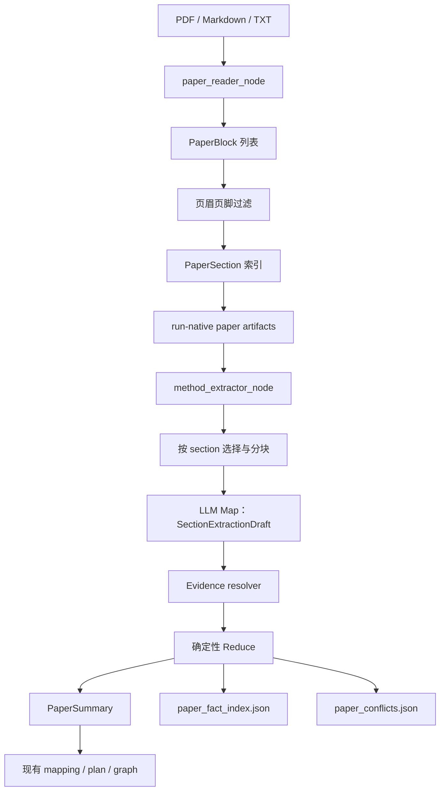

# 29. Phase 18：章节感知的论文理解

> 本阶段建立在 Phase 17 的 Agent 回归评测体系之上。
>
> 目标不是继续增加新的执行动作，而是先把 Agent 的“论文输入层”做可靠：完整索引论文的页、文本块和章节，按章节抽取事实，为实验设置保留可验证的 Evidence，并避免当前“只把前 24000 个字符交给模型”的截断问题。
>
> 本教程只给出实现步骤、代码和测试。请按照顺序自行修改项目代码。

> **章节标识说明**
>
> - 标注“需要新增/修改项目代码”的章节必须落实到其列出的文件。
> - 标注“运行、验收、调试或原理说明”的章节本身不要求修改代码。
> - 一个章节同时包含代码与解释时，会分别写明“需要修改”和“仅作说明”的边界。
> - 示例中的 helper 名称必须与项目现有工具对齐，不能为照抄教程重复实现同类基础设施。

---

## 一、本阶段要解决什么问题

> **本节类型：原理说明，不修改项目代码。**

当前论文读取链路大致是：

```text
PDF
  -> read_pdf()
  -> 一个很长的字符串
  -> split_text()
  -> paper_text_chunks
  -> _merge_chunks(max_chars=24000)
  -> LLM
  -> PaperSummary
```

这个方案在短论文上可能工作，但面对完整会议论文、附录和补充材料时有几个明显问题。

### 1. 后半篇论文实际没有被模型读取

以本项目中的 PSTNet 论文为例：

```text
pdf/PSTNet—Point Spatio-Temporal Convolution on Point Cloud Sequences.pdf
```

当前读取结果大约为：

```text
总页数：23 页
read_paper() 文本长度：约 70000 字符
split_text()：约 16 个 chunk
_merge_chunks(max_chars=24000)：只保留约 20000 字符
```

合并后的内容大约在第 5 页附近结束，而真正影响复现的实现细节位于附录第 14 页：

```text
C Implementation Details
```

因此，即使模型本身能力足够，也不可能从没有收到的文本中正确抽取：

- 训练 35 个 epoch；
- 优化器为 SGD；
- 初始学习率为 0.01；
- 在第 10、20 个 epoch 将学习率乘以 0.1；
- MSR-Action3D 的 batch size 为 16；
- NTU 的 batch size 为 32；
- Synthia 的 batch size 为 12。

### 2. 页码只是字符串标签，不是结构化来源

当前的 `[page 14]` 只是普通文本。模型可能：

- 忽略页码；
- 把相邻页内容混在一起；
- 输出不存在的页码；
- 给事实附上无法复查的位置。

### 3. 章节边界丢失

当前 `split_text()` 按字符数切分，不理解：

- `Abstract`；
- `3.2.1 Spatial Convolution`；
- `4 Experiments`；
- `4.3 Ablation Study`；
- `C Implementation Details`；
- `O Limitation`。

一个 chunk 可能同时包含两个章节，也可能把一个表格、标题或段落从中间切开。

### 4. 表格和解析失败没有明确状态

实验结果、消融和超参数经常位于表格中。如果表格解析失败，系统不能把表格标题当成表格内容，也不能静默猜测单元格。

### 5. 多处证据冲突时容易“后值覆盖前值”

论文正文、附录和 README 可能给出不同配置。正确行为应当是：

```text
保留两个值
  + 保留各自 Evidence
  + 标记 conflict
  + 交给后续决策或人工确认
```

而不是简单使用最后一个值覆盖前面的值。

---

## 二、完成本阶段后应具备的能力

> **本节类型：目标说明，不修改项目代码。**

完成后，Agent 应当能够：

1. 保留 PDF 的页、文本块、标题、表格、图注和公式等基本结构；
2. 建立完整的章节索引，包括正文和附录；
3. 按章节而不是按整篇论文调用 LLM；
4. 对长章节做不破坏 block 的分块；
5. 让 LLM 只引用系统提供的 `block_id`；
6. 由确定性代码计算页码、章节、Evidence ID 和内容哈希；
7. 将多个章节的局部抽取结果规约为现有 `PaperSummary`；
8. 将数据集、指标、实验设置和风险写入单独的事实索引；
9. 保留互相冲突的实验设置；
10. 把表格解析失败和 OCR 需求显式记录为 warning；
11. 不把完整论文 block 塞进 LangGraph checkpoint；
12. 使用 Phase 17 的评测框架检测解析和抽取回归。

---

## 三、本阶段不做什么

> **本节类型：范围说明，不修改项目代码。**

为了控制范围，Phase 18 暂时不做：

- 不判断复现实验是否最终成功；
- 不计算论文复现分数；
- 不自动下载数据集；
- 不根据常识猜测论文没有给出的参数；
- 不实现完整 OCR 流程；
- 不实现向量数据库和混合检索；
- 不把论文 Evidence 与仓库 Evidence 做统一排序。

其中：

- OCR 可以在后续作为可选 fallback；
- 向量检索和论文/仓库混合 Evidence 检索是下一阶段 Phase 19 的重点。

---

## 四、核心设计原则

> **本节类型：架构原理说明，不修改项目代码。**

### 4.1 结构化索引与业务摘要分离

论文解析层负责：

```text
PDF -> PaperBlock -> PaperSection -> SectionChunk
```

业务抽取层负责：

```text
SectionChunk -> SectionExtractionDraft -> PaperSummary
```

不要让 PDF 解析代码直接构造最终摘要，也不要让 LLM 自己解析页码和哈希。

### 4.2 大对象进入 Artifact，小对象进入 State

完整 block 和 section 索引可能很大，应写入 run-native Artifact：

```text
runs/<run_id>/analysis/paper_blocks.json
runs/<run_id>/analysis/paper_sections.json
runs/<run_id>/analysis/paper_parse_report.json
runs/<run_id>/analysis/paper_document.json
```

LangGraph state 只保存：

- `PaperDocument` 的紧凑元数据；
- Artifact 相对路径；
- 最终 `PaperSummary`；
- 必要的控制字段。

这样可以避免 SQLite checkpoint：

- 被数万字符正文撑大；
- 每次节点更新都复制完整论文；
- resume 时反序列化大量无关内容。

### 4.3 LLM 只提出引用，系统负责验证引用

提示词中的 block：

```text
[p14-b007][page 14] We train all networks for 35 epochs ...
```

LLM 只返回：

```json
{
  "value": "35 epochs",
  "evidence": {
    "block_ids": ["p14-b007"],
    "summary": "论文说明所有网络训练 35 个 epoch。",
    "confidence": 0.99
  }
}
```

LLM 不返回：

- 自己生成的 page；
- 自己生成的 section ID；
- 自己生成的 hash；
- 任意自由文本位置。

这些字段由 Evidence resolver 根据 `block_id` 确定性生成。

### 4.4 保持 `PaperSummary` 下游兼容

已有 mapping、plan、report 节点已经依赖 `PaperSummary`。本阶段不要突然把：

```python
datasets: list[str]
```

改成：

```python
datasets: list[DatasetWithEvidence]
```

否则会把本阶段演变成全图迁移。

推荐做法：

- `PaperSummary` 的字段和基本类型保持兼容；
- 扩展现有 `Evidence`，新增字段全部为可选；
- 额外写出 `paper_fact_index.json`，保存数据集、指标和实验设置的完整 Evidence。

---

## 五、目标数据流

> **本节类型：数据流说明，不修改项目代码。**



---

## 六、建议的文件结构

> **本节类型：文件规划说明，本节本身不修改项目代码。**

新增：

```text
app/
├── paper/
│   ├── __init__.py
│   ├── schemas.py
│   ├── normalization.py
│   ├── pdf_parser.py
│   ├── sectioning.py
│   ├── chunking.py
│   ├── evidence.py
│   ├── extraction_cache.py
│   ├── indexer.py
│   └── reducer.py
├── prompts/
│   └── paper_section_prompt.py
└── evaluation/
    └── cases/
        ├── offline/
        │   └── pstnet_paper_parser.json
        └── provider/
            └── pstnet_section_understanding.json

tests/
├── test_paper_normalization.py
├── test_pdf_block_parser.py
├── test_paper_sectioning.py
├── test_paper_chunking.py
├── test_paper_evidence.py
├── test_paper_extraction_cache.py
├── test_paper_reducer.py
├── test_paper_reader_node_v2.py
├── test_method_extractor_hierarchical.py
└── test_paper_eval.py
```

修改：

```text
app/schemas.py
app/state.py
app/config.py
app/tools/paper_tools.py
app/nodes/paper_reader_node.py
app/nodes/method_extractor_node.py
app/evaluation/schemas.py
app/evaluation/runners.py
app/evaluation/observation.py
app/evaluation/scorers.py
app/main.py
.env.example
```

---

## 七、开始前先固定 Phase 17 baseline

> **本节类型：运行与记录步骤，不修改项目代码。**

在修改论文理解链路前，先执行现有离线评测：

```bash
python -m app.evaluation.run_eval run \
  --suite offline
```

评测报告会写入命令输出所示的 `runs/<eval_run_id>/reports/`。此时不要使用 `--update-baseline`，先保存并检查改造前结果。

再执行当前完整测试：

```bash
python -m pytest
```

目的不是证明 Phase 18 已经工作，而是保存改造前的稳定状态。后面出现失败时，可以区分：

- 旧能力回归；
- 新增 parser 测试失败；
- provider 模型输出不稳定。

建议额外记录当前截断现象：

```bash
python - <<'PY'
from app.nodes.method_extractor_node import _merge_chunks
from app.tools.paper_tools import read_paper, split_text

path = "pdf/PSTNet—Point Spatio-Temporal Convolution on Point Cloud Sequences.pdf"
text = read_paper(path)
chunks = split_text(text)
merged = _merge_chunks(chunks)

print("paper chars:", len(text))
print("chunk count:", len(chunks))
print("merged chars:", len(merged))
print("merged tail:", merged[-500:])
PY
```

你应当看到：

- 原文约 70000 字符；
- 当前只向模型发送约 20000 字符；
- 合并文本没有覆盖第 14 页的 `Implementation Details`。

这条结果是本阶段最直观的改造前证据。

---

## 八、增加配置项

> **本节类型：需要修改项目代码。**
>
> **需要修改：** `app/config.py`、`.env.example`

在 `app/config.py` 的 `Settings` 中增加以下字段。请放在已有 LLM、Artifact 或执行配置附近，不要重新定义第二个 `Settings`。

```python
@dataclass
class Settings:
    # ...保留已有字段...

    # 单个章节 chunk 允许交给模型的目标字符数。
    paper_section_chunk_chars: int = int(
        os.getenv("PAPER_SECTION_CHUNK_CHARS", "12000")
    )

    # 防止一次 run 发起无限 section LLM 请求。
    paper_max_section_llm_calls: int = int(
        os.getenv("PAPER_MAX_SECTION_LLM_CALLS", "24")
    )

    # 页面提取字符数低于该值时标记 OCR_REQUIRED。
    paper_min_extracted_chars: int = int(
        os.getenv("PAPER_MIN_EXTRACTED_CHARS", "20")
    )

    # parser、Prompt 或 schema 变化时用于缓存失效。
    paper_parser_version: str = os.getenv(
        "PAPER_PARSER_VERSION",
        "phase18-v1",
    )
    paper_extraction_version: str = os.getenv(
        "PAPER_EXTRACTION_VERSION",
        "phase18-v1",
    )
```

同步修改 `.env.example`：

```dotenv
PAPER_SECTION_CHUNK_CHARS=12000
PAPER_MAX_SECTION_LLM_CALLS=24
PAPER_MIN_EXTRACTED_CHARS=20
PAPER_PARSER_VERSION=phase18-v1
PAPER_EXTRACTION_VERSION=phase18-v1
```

注意：

- `paper_max_section_llm_calls` 是运行预算，不是只读取前 24 个章节；
- parser 仍应索引所有章节；
- 超过预算时，应优先抽取 method、experiments、implementation、ablation 等章节；
- 未调用 LLM 的章节仍然存在于 `paper_sections.json` 中。

---

## 九、建立论文解析层 Schema

> **本节类型：需要新增项目代码。**
>
> **需要新增：** `app/paper/__init__.py`、`app/paper/schemas.py`

新建 `app/paper/__init__.py`：

```python
"""Section-aware paper parsing and evidence resolution."""
```

新建 `app/paper/schemas.py`：

```python
from __future__ import annotations

from typing import Literal

from pydantic import BaseModel, ConfigDict, Field


BlockType = Literal[
    "title",
    "heading",
    "paragraph",
    "table",
    "caption",
    "formula",
    "header",
    "footer",
    "unknown",
]

SectionKind = Literal[
    "abstract",
    "introduction",
    "related_work",
    "method",
    "experiments",
    "datasets",
    "implementation",
    "results",
    "ablation",
    "conclusion",
    "appendix",
    "references",
    "limitations",
    "other",
]


class PaperBlock(BaseModel):
    """PDF 页面上的最小可追踪文本单元。"""

    model_config = ConfigDict(extra="forbid")

    # ID 必须由 page、order 和 text_hash 确定性生成，不能使用随机 UUID。
    block_id: str
    page: int = Field(ge=1)
    order: int = Field(ge=0)
    block_type: BlockType = "unknown"
    text: str
    bbox: tuple[float, float, float, float] | None = None
    font_size: float | None = None
    font_name: str | None = None
    is_bold: bool = False
    text_hash: str

    # 重复页眉页脚等噪声不删除，保留原始可审计记录，但不参与 section 正文。
    excluded: bool = False
    exclusion_reason: str | None = None


class PaperSection(BaseModel):
    """由 heading 和连续 block 组成的层级章节。"""

    model_config = ConfigDict(extra="forbid")

    section_id: str
    number: str | None = None
    title: str
    normalized_title: str
    level: int = Field(ge=1)
    kind: SectionKind = "other"
    parent_id: str | None = None
    page_start: int = Field(ge=1)
    page_end: int = Field(ge=1)
    heading_block_id: str | None = None
    block_ids: list[str] = Field(default_factory=list)
    content_hash: str


class PaperParseWarning(BaseModel):
    """不阻断索引、但需要下游知道的解析异常。"""

    model_config = ConfigDict(extra="forbid")

    code: Literal[
        "EMPTY_PAGE",
        "OCR_REQUIRED",
        "TABLE_PARSE_FAILED",
        "NO_HEADINGS",
        "HEADING_AMBIGUOUS",
        "UNSUPPORTED_FORMAT",
    ]
    message: str
    page: int | None = None
    block_id: str | None = None


class PaperParseReport(BaseModel):
    """本次确定性解析的覆盖率和 warning。"""

    model_config = ConfigDict(extra="forbid")

    status: Literal["succeeded", "partial", "failed"]
    page_count: int = Field(ge=0)
    indexed_pages: list[int] = Field(default_factory=list)
    empty_pages: list[int] = Field(default_factory=list)
    ocr_required_pages: list[int] = Field(default_factory=list)
    block_count: int = Field(ge=0)
    section_count: int = Field(ge=0)
    warnings: list[PaperParseWarning] = Field(default_factory=list)


class PaperDocument(BaseModel):
    """适合存入 Graph state 的紧凑论文文档元数据。"""

    model_config = ConfigDict(extra="forbid")

    document_id: str
    source_path: str
    source_sha256: str
    parser_version: str
    page_count: int = Field(ge=0)
    indexed_page_count: int = Field(ge=0)
    block_count: int = Field(ge=0)
    section_count: int = Field(ge=0)

    # 这些路径相对于本次 run 的 artifact 根目录。
    blocks_artifact: str
    sections_artifact: str
    parse_report_artifact: str


class SectionChunk(BaseModel):
    """交给一次 LLM map 调用的章节片段。"""

    model_config = ConfigDict(extra="forbid")

    chunk_id: str
    section_id: str
    section_title: str
    section_kind: SectionKind
    page_start: int
    page_end: int
    block_ids: list[str]
    text: str
    content_hash: str


class EvidenceDraft(BaseModel):
    """模型可生成的 Evidence 草稿，只允许引用已有 block。"""

    model_config = ConfigDict(extra="forbid")

    block_ids: list[str] = Field(min_length=1)
    summary: str = Field(min_length=1)
    confidence: float = Field(default=0.8, ge=0.0, le=1.0)


class TextFactDraft(BaseModel):
    """带 Evidence 的普通文本事实。"""

    model_config = ConfigDict(extra="forbid")

    value: str
    evidence: EvidenceDraft


class NamedFactDraft(BaseModel):
    """数据集、指标等具名事实。"""

    model_config = ConfigDict(extra="forbid")

    name: str
    evidence: EvidenceDraft


class MethodModuleDraft(BaseModel):
    """单章节抽取到的方法模块候选。"""

    model_config = ConfigDict(extra="forbid")

    name: str
    description: str
    possible_keywords: list[str] = Field(default_factory=list)
    evidence: EvidenceDraft


class ExperimentSettingDraft(BaseModel):
    """单章节抽取到的实验设置候选。"""

    model_config = ConfigDict(extra="forbid")

    name: str
    value: str
    evidence: EvidenceDraft


class SectionExtractionDraft(BaseModel):
    """一次 section map 调用的严格结构化输出。"""

    model_config = ConfigDict(extra="forbid")

    section_id: str
    chunk_id: str
    summary: str
    research_problem_candidates: list[TextFactDraft] = Field(default_factory=list)
    core_idea_candidates: list[TextFactDraft] = Field(default_factory=list)
    method_modules: list[MethodModuleDraft] = Field(default_factory=list)
    datasets: list[NamedFactDraft] = Field(default_factory=list)
    metrics: list[NamedFactDraft] = Field(default_factory=list)
    experiment_settings: list[ExperimentSettingDraft] = Field(default_factory=list)
    reproduction_risks: list[TextFactDraft] = Field(default_factory=list)
    unresolved_questions: list[str] = Field(default_factory=list)

    # 表格存在但无法可靠抽取单元格时，必须把问题写在这里。
    table_claims_unresolved: list[str] = Field(default_factory=list)


class PaperEvidence(BaseModel):
    """EvidenceDraft 经过确定性解析后的完整来源记录。"""

    model_config = ConfigDict(extra="forbid")

    evidence_id: str
    document_id: str
    section_id: str
    block_ids: list[str]
    page_start: int
    page_end: int
    text: str
    summary: str
    content_hash: str
    confidence: float = Field(ge=0.0, le=1.0)


class PaperFactRecord(BaseModel):
    """独立事实索引中的一条事实。"""

    model_config = ConfigDict(extra="forbid")

    fact_id: str
    category: Literal[
        "research_problem",
        "core_idea",
        "method_module",
        "dataset",
        "metric",
        "experiment_setting",
        "reproduction_risk",
    ]
    name: str
    value: str
    normalized_key: str
    evidence: PaperEvidence


class PaperConflict(BaseModel):
    """同一规范化配置键出现多个不同值。"""

    model_config = ConfigDict(extra="forbid")

    conflict_id: str
    normalized_key: str
    fact_ids: list[str] = Field(min_length=2)
    values: list[str] = Field(min_length=2)
    reason: str
```

这里有两个重要约束：

1. 所有 schema 都使用 `extra="forbid"`，尽早暴露 LLM 或代码输出漂移；
2. `EvidenceDraft` 不允许模型填写页码和 hash，减少“看起来可追踪、实际不可追踪”的假 Evidence。

---

## 十、兼容性扩展现有 Evidence

> **本节类型：需要修改项目代码。**
>
> **需要修改：** `app/schemas.py`

找到 `app/schemas.py` 中已有的 `Evidence`，不要删除原字段，在类末尾增加可选来源字段。

示意代码：

```python
class Evidence(BaseModel):
    # ...保留原有配置和字段...
    source_type: str
    source_path: str
    location: str
    quote_or_summary: str
    confidence: float

    # Phase 18：全部提供默认值，保证旧 JSON 仍然可以加载。
    evidence_id: str | None = None
    document_id: str | None = None
    section_id: str | None = None
    page_start: int | None = None
    page_end: int | None = None
    block_ids: list[str] = Field(default_factory=list)
    content_hash: str | None = None
```

不要把新字段改成 required，否则：

- Phase 17 baseline fixture 会失效；
- 旧 checkpoint 无法恢复；
- 旧 Artifact 无法反序列化；
- repo mapping 产生的 Evidence 也会被迫填写论文字段。

---

## 十一、增加规范化工具

> **本节类型：需要新增项目代码和测试。**
>
> **需要新增：** `app/paper/normalization.py`、`tests/test_paper_normalization.py`

PDF 中的标题常被抽取成：

```text
P ROPOSED P OINT S PATIO -T EMPORAL C ONVOLUTIONAL N ETWORK
```

如果不先规范化，标题分类和 Golden Case 会很脆弱。

新建 `app/paper/normalization.py`：

```python
from __future__ import annotations

import re
import unicodedata


_MULTI_SPACE_RE = re.compile(r"\s+")
_LETTER_SPACING_RE = re.compile(r"\b([A-Z])\s+([A-Z][A-Z0-9a-z-]+)\b")
_SPACE_BEFORE_PUNCT_RE = re.compile(r"\s+([,.;:!?])")
_SPACE_AROUND_HYPHEN_RE = re.compile(r"\s*-\s*")


def normalize_pdf_text(text: str) -> str:
    """清理 PDF 抽取产生的空白，但不改变事实内容。"""

    value = unicodedata.normalize("NFKC", text)
    value = value.replace("\u00ad", "")
    value = value.replace("\u00a0", " ")
    value = _MULTI_SPACE_RE.sub(" ", value).strip()
    value = _SPACE_BEFORE_PUNCT_RE.sub(r"\1", value)
    return value


def normalize_heading(text: str) -> str:
    """把分散的大写标题恢复为适合匹配的形式。"""

    value = normalize_pdf_text(text)

    # 连续执行是因为一个标题中可能存在多个 “P ROPOSED” 形式的单词。
    previous = None
    while previous != value:
        previous = value
        value = _LETTER_SPACING_RE.sub(r"\1\2", value)

    value = _SPACE_AROUND_HYPHEN_RE.sub("-", value)
    return value.strip()


def normalize_key(text: str) -> str:
    """生成去格式差异的比较键，用于去重和冲突识别。"""

    value = normalize_heading(text).casefold()
    value = re.sub(r"[^a-z0-9\u4e00-\u9fff]+", " ", value)
    return _MULTI_SPACE_RE.sub(" ", value).strip()


def looks_like_arxiv_overlay(text: str) -> bool:
    """过滤首页上字号很大、但并非论文标题的 arXiv 叠加信息。"""

    value = normalize_pdf_text(text).casefold()
    return value.startswith("arxiv:") or bool(
        re.search(r"\barxiv:\d{4}\.\d+", value)
    )
```

对应测试 `tests/test_paper_normalization.py`：

```python
from app.paper.normalization import (
    looks_like_arxiv_overlay,
    normalize_heading,
    normalize_key,
    normalize_pdf_text,
)


def test_normalize_spaced_uppercase_heading() -> None:
    raw = "P ROPOSED P OINT S PATIO -T EMPORAL C ONVOLUTIONAL N ETWORK"

    normalized = normalize_heading(raw)

    assert normalized == (
        "PROPOSED POINT SPATIO-TEMPORAL CONVOLUTIONAL NETWORK"
    )


def test_normalize_key_ignores_formatting_differences() -> None:
    assert normalize_key("Batch Size") == normalize_key("batch-size")


def test_arxiv_overlay_is_not_paper_title() -> None:
    assert looks_like_arxiv_overlay(
        "arXiv:2205.13713v1 [cs.CV] 27 May 2022"
    )
```

先运行：

```bash
python -m pytest tests/test_paper_normalization.py -q
```

---

## 十二、实现 PDF block 解析器

> **本节类型：需要新增项目代码。**
>
> **需要新增：** `app/paper/pdf_parser.py`

新建 `app/paper/pdf_parser.py`。

第一版不需要追求完美还原 PDF 排版，重点是：

- 页码不丢；
- block 顺序稳定；
- block ID 稳定；
- 字号和 bbox 可用于标题识别；
- 解析失败显式记录；
- 不把页眉、页脚直接删除。

```python
from __future__ import annotations

import hashlib
from collections import Counter
from pathlib import Path
from statistics import median
from typing import Any

import fitz

from app.paper.normalization import (
    looks_like_arxiv_overlay,
    normalize_pdf_text,
)
from app.paper.schemas import PaperBlock, PaperParseWarning


def sha256_text(value: str) -> str:
    return hashlib.sha256(value.encode("utf-8")).hexdigest()


def _stable_block_id(page: int, order: int, text: str) -> str:
    """相同 PDF 和 parser 规则应始终得到相同 block_id。"""

    short_hash = sha256_text(text)[:10]
    return f"p{page:03d}-b{order:04d}-{short_hash}"


def _span_style(line: dict[str, Any]) -> tuple[float | None, str | None, bool]:
    """从 line 的 spans 中提取主要字号、字体和粗体信息。"""

    spans = line.get("spans", [])
    if not spans:
        return None, None, False

    # 选择字符数最多的 span 作为该 line 的主要样式。
    dominant = max(
        spans,
        key=lambda span: len(str(span.get("text", ""))),
    )
    font_name = str(dominant.get("font", "")) or None
    font_size = float(dominant.get("size", 0.0)) or None
    is_bold = bool(font_name and "bold" in font_name.casefold())
    return font_size, font_name, is_bold


def _line_text(line: dict[str, Any]) -> str:
    """合并同一视觉行中的所有 span。"""

    return normalize_pdf_text(
        "".join(str(span.get("text", "")) for span in line.get("spans", []))
    )


def _looks_like_caption(text: str) -> bool:
    value = text.casefold()
    return value.startswith(("figure ", "fig. ", "table "))


def _provisional_type(
    *,
    text: str,
    font_size: float | None,
    body_font_size: float,
    is_bold: bool,
) -> str:
    """只做视觉层初判，真正 heading 判断在 sectioning 阶段完成。"""

    if _looks_like_caption(text):
        return "caption"
    if looks_like_arxiv_overlay(text):
        return "unknown"
    if font_size and font_size >= body_font_size * 1.45:
        return "title"
    if is_bold or (font_size and font_size >= body_font_size * 1.15):
        return "heading"
    return "paragraph"


def _estimate_body_font(raw_pages: list[dict[str, Any]]) -> float:
    """使用正文候选 span 的字号中位数，避免标题字号拉高平均值。"""

    sizes: list[float] = []
    for page in raw_pages:
        for block in page.get("blocks", []):
            for line in block.get("lines", []):
                for span in line.get("spans", []):
                    text = normalize_pdf_text(str(span.get("text", "")))
                    size = float(span.get("size", 0.0))
                    if len(text) >= 20 and 5.0 <= size <= 20.0:
                        sizes.extend([size] * min(len(text), 200))
    return float(median(sizes)) if sizes else 10.0


def extract_pdf_blocks(
    path: str | Path,
    *,
    min_extracted_chars: int = 20,
) -> tuple[list[PaperBlock], list[PaperParseWarning], int]:
    """将 PDF 提取为按页排序的 PaperBlock。"""

    source = Path(path).expanduser().resolve()
    warnings: list[PaperParseWarning] = []
    blocks: list[PaperBlock] = []

    with fitz.open(source) as document:
        page_count = document.page_count
        raw_pages = [
            document.load_page(index).get_text("dict", sort=True)
            for index in range(page_count)
        ]
        body_font_size = _estimate_body_font(raw_pages)

        for page_index, raw_page in enumerate(raw_pages):
            page_number = page_index + 1
            page_char_count = 0
            order = 0

            for raw_block in raw_page.get("blocks", []):
                # PyMuPDF type=0 是文本；图像等对象留给后续多模态阶段。
                if raw_block.get("type", 0) != 0:
                    continue

                for line in raw_block.get("lines", []):
                    text = _line_text(line)
                    if not text:
                        continue

                    font_size, font_name, is_bold = _span_style(line)
                    block_type = _provisional_type(
                        text=text,
                        font_size=font_size,
                        body_font_size=body_font_size,
                        is_bold=is_bold,
                    )
                    bbox_value = line.get("bbox")
                    bbox = (
                        tuple(float(value) for value in bbox_value)
                        if bbox_value and len(bbox_value) == 4
                        else None
                    )

                    block = PaperBlock(
                        block_id=_stable_block_id(page_number, order, text),
                        page=page_number,
                        order=order,
                        block_type=block_type,
                        text=text,
                        bbox=bbox,
                        font_size=font_size,
                        font_name=font_name,
                        is_bold=is_bold,
                        text_hash=sha256_text(text),
                    )
                    blocks.append(block)
                    page_char_count += len(text)
                    order += 1

            if page_char_count == 0:
                warnings.append(
                    PaperParseWarning(
                        code="EMPTY_PAGE",
                        page=page_number,
                        message="No text blocks were extracted from this page.",
                    )
                )
                warnings.append(
                    PaperParseWarning(
                        code="OCR_REQUIRED",
                        page=page_number,
                        message="The page may be image-only and requires OCR.",
                    )
                )
            elif page_char_count < min_extracted_chars:
                warnings.append(
                    PaperParseWarning(
                        code="OCR_REQUIRED",
                        page=page_number,
                        message=(
                            "Very little text was extracted; verify whether "
                            "the page requires OCR."
                        ),
                    )
                )

    return blocks, warnings, page_count
```

### 为什么先按 line 建 block

使用 line 的优点：

- 标题样式更容易识别；
- block ID 粒度足够细；
- Evidence 定位更准确。

缺点是正文可能产生很多 block。后续可以增加“相邻同样式行合并”，但第一版先保证：

- 顺序正确；
- 不把标题与正文合并；
- Evidence 可以定位。

不要在这一阶段直接按句号切句，因为：

- 公式和缩写会误切；
- PDF 行末断词需要额外处理；
- block ID 会对微小规则变化非常敏感。

---

## 十三、检测并标记重复页眉页脚

> **本节类型：需要修改项目代码。**
>
> **需要修改：** `app/paper/pdf_parser.py`

PSTNet PDF 多页重复出现：

```text
Published as a conference paper at ICLR 2021
```

如果不处理，这行可能被识别为每一页的新标题。

继续在 `app/paper/pdf_parser.py` 中增加：

```python
from app.paper.normalization import normalize_key


def mark_repeated_marginalia(
    blocks: list[PaperBlock],
    *,
    page_count: int,
    repetition_ratio: float = 0.35,
) -> list[PaperBlock]:
    """标记在多页顶部/底部重复出现的页眉页脚。"""

    if page_count <= 1:
        return blocks

    pages_by_text: dict[str, set[int]] = {}
    candidates: dict[str, list[PaperBlock]] = {}

    for block in blocks:
        if block.bbox is None:
            continue

        # PDF 坐标原点通常位于页面左上角。
        top = block.bbox[1]
        bottom = block.bbox[3]

        # 第一版使用较保守的绝对坐标；后续可改为页面高度比例。
        if top > 90.0 and bottom < 700.0:
            continue

        key = normalize_key(block.text)
        if not key:
            continue
        pages_by_text.setdefault(key, set()).add(block.page)
        candidates.setdefault(key, []).append(block)

    repeated_keys = {
        key
        for key, pages in pages_by_text.items()
        if len(pages) / page_count >= repetition_ratio
    }

    updated: list[PaperBlock] = []
    for block in blocks:
        key = normalize_key(block.text)
        if key not in repeated_keys:
            updated.append(block)
            continue

        if block.bbox and block.bbox[1] <= 90.0:
            block_type = "header"
            reason = "repeated_page_header"
        else:
            block_type = "footer"
            reason = "repeated_page_footer"

        updated.append(
            block.model_copy(
                update={
                    "block_type": block_type,
                    "excluded": True,
                    "exclusion_reason": reason,
                }
            )
        )

    return updated
```

不要直接从 `blocks` 中删除页眉页脚。保留并标记有两个好处：

- 可以审计为什么某段文本没有进入章节；
- parser 规则变化时，可以比较前后差异。

---

## 十四、表格解析失败必须显式化

> **本节类型：需要修改项目代码。**
>
> **需要修改：** `app/paper/pdf_parser.py`

PyMuPDF 的不同版本对 `page.find_tables()` 支持可能不同，而且复杂表格不一定能恢复。

在 `app/paper/pdf_parser.py` 中增加一个保守的表格提取函数：

```python
def extract_pdf_tables(
    path: str | Path,
) -> tuple[list[PaperBlock], list[PaperParseWarning]]:
    """尝试提取表格；失败时只记录 warning，不猜测单元格。"""

    source = Path(path).expanduser().resolve()
    table_blocks: list[PaperBlock] = []
    warnings: list[PaperParseWarning] = []

    with fitz.open(source) as document:
        for page_index in range(document.page_count):
            page = document.load_page(page_index)
            page_number = page_index + 1

            if not hasattr(page, "find_tables"):
                # 当前 PyMuPDF 不支持时，不把每页都记成失败。
                continue

            try:
                finder = page.find_tables()
                tables = list(getattr(finder, "tables", []))
            except Exception as exc:
                warnings.append(
                    PaperParseWarning(
                        code="TABLE_PARSE_FAILED",
                        page=page_number,
                        message=f"Table extraction failed: {type(exc).__name__}: {exc}",
                    )
                )
                continue

            for table_index, table in enumerate(tables):
                try:
                    rows = table.extract()
                    normalized_rows = [
                        [
                            normalize_pdf_text(str(cell or ""))
                            for cell in row
                        ]
                        for row in rows
                    ]
                    text = "\n".join(
                        " | ".join(row) for row in normalized_rows
                    ).strip()
                    if not text:
                        raise ValueError("table extractor returned no cells")

                    order = 100_000 + table_index
                    table_blocks.append(
                        PaperBlock(
                            block_id=_stable_block_id(
                                page_number,
                                order,
                                text,
                            ),
                            page=page_number,
                            order=order,
                            block_type="table",
                            text=text,
                            bbox=tuple(float(value) for value in table.bbox),
                            text_hash=sha256_text(text),
                        )
                    )
                except Exception as exc:
                    warnings.append(
                        PaperParseWarning(
                            code="TABLE_PARSE_FAILED",
                            page=page_number,
                            message=(
                                "A table was detected but its cells could not "
                                f"be recovered: {type(exc).__name__}: {exc}"
                            ),
                        )
                    )

    return table_blocks, warnings
```

第一版允许表格文本与普通 page text 有部分重复。后续可以用 bbox 去重，但当前最重要的行为是：

```text
解析成功 -> 生成 block_type=table
解析失败 -> TABLE_PARSE_FAILED
```

绝对不要：

```text
检测到 “Table 4” caption
  -> 根据 caption 猜 Table 4 的全部结果
```

---

## 十五、建立章节索引

> **本节类型：需要新增项目代码。**
>
> **需要新增：** `app/paper/sectioning.py`

新建 `app/paper/sectioning.py`：

```python
from __future__ import annotations

import hashlib
import re
from collections.abc import Iterable

from app.paper.normalization import (
    looks_like_arxiv_overlay,
    normalize_heading,
    normalize_key,
)
from app.paper.schemas import PaperBlock, PaperSection, SectionKind


_NUMBERED_HEADING_RE = re.compile(
    r"^(?P<number>\d+(?:\.\d+)*)(?:[.)])?\s+(?P<title>.+)$"
)
_APPENDIX_HEADING_RE = re.compile(
    r"^(?P<number>[A-Z](?:\.\d+)*)(?:[.)])?\s+(?P<title>.+)$"
)
_SPLIT_HEADING_NUMBER_RE = re.compile(
    r"^(?P<number>(?:\d+(?:\.\d+)*|[A-Z](?:\.\d+)*))(?:[.)])?$"
)
_TITLE_WORD_RE = re.compile(r"[A-Za-z][A-Za-z0-9-]*")

_UNNUMBERED_HEADINGS = {
    "abstract",
    "acknowledgment",
    "acknowledgments",
    "conclusion",
    "conclusions",
    "references",
    "appendix",
    "limitations",
    "limitation",
}


def _sha256(value: str) -> str:
    return hashlib.sha256(value.encode("utf-8")).hexdigest()


def _heading_parts(block: PaperBlock) -> tuple[str | None, str] | None:
    """返回 (section_number, title)，不是标题则返回 None。"""

    if block.excluded or looks_like_arxiv_overlay(block.text):
        return None

    raw_text = normalize_pdf_text(block.text)
    text = normalize_heading(raw_text)
    if not text or len(text) > 180:
        return None

    # 先从未执行字母间距修复的文本中提取编号。否则
    # “C Implementation Details” 会被误合并为 “CImplementation Details”。
    numbered = _NUMBERED_HEADING_RE.match(raw_text)
    if numbered:
        return (
            numbered.group("number"),
            normalize_heading(numbered.group("title")).strip(),
        )

    appendix = _APPENDIX_HEADING_RE.match(raw_text)
    if appendix and (
        block.block_type == "heading"
        or block.is_bold
        or len(text) <= 100
    ):
        return (
            appendix.group("number"),
            normalize_heading(appendix.group("title")).strip(),
        )

    key = normalize_key(text)
    if key in _UNNUMBERED_HEADINGS:
        return None, text

    # 视觉上明确是标题时，也允许没有编号的标题。
    if block.block_type == "heading" and 1 <= len(text.split()) <= 12:
        return None, text

    return None


def _same_visual_line(left: PaperBlock, right: PaperBlock) -> bool:
    """判断相邻 block 是否属于同一行且水平距离合理。"""

    if left.bbox is None or right.bbox is None:
        return False

    left_x0, left_y0, left_x1, left_y1 = left.bbox
    right_x0, right_y0, _, right_y1 = right.bbox
    left_height = max(left_y1 - left_y0, 1.0)
    right_height = max(right_y1 - right_y0, 1.0)
    center_delta = abs(
        ((left_y0 + left_y1) / 2.0)
        - ((right_y0 + right_y1) / 2.0)
    )
    vertical_tolerance = max(
        2.0,
        min(left_height, right_height) * 0.35,
    )
    horizontal_gap = right_x0 - left_x1
    return (
        center_delta <= vertical_tolerance
        and -2.0 <= horizontal_gap <= 48.0
        and right_x0 >= left_x0
    )


def _looks_like_split_title(block: PaperBlock) -> bool:
    """保守识别编号右侧被单独抽取的短标题。"""

    if (
        block.excluded
        or block.block_type in {"caption", "table", "header", "footer"}
        or looks_like_arxiv_overlay(block.text)
    ):
        return False

    text = normalize_heading(block.text)
    if not text or len(text) > 120 or text.endswith((".", "?", "!")):
        return False

    words = _TITLE_WORD_RE.findall(text)
    if not 1 <= len(words) <= 12:
        return False

    letters = [character for character in text if character.isalpha()]
    if len(letters) < 3:
        return False

    uppercase_ratio = sum(
        character.isupper() for character in letters
    ) / len(letters)
    return (
        block.block_type in {"heading", "title"}
        or uppercase_ratio >= 0.8
    )


def _split_heading_parts(
    number_block: PaperBlock,
    title_block: PaperBlock,
) -> tuple[str, str] | None:
    """合并 PDF 拆开的“编号 block + 同行标题 block”逻辑标题。"""

    if (
        number_block.excluded
        or number_block.page != title_block.page
        or title_block.order != number_block.order + 1
        or not _same_visual_line(number_block, title_block)
        or not _looks_like_split_title(title_block)
    ):
        return None

    number_text = normalize_pdf_text(number_block.text)
    match = _SPLIT_HEADING_NUMBER_RE.fullmatch(number_text)
    if match is None:
        return None

    return (
        match.group("number"),
        normalize_heading(title_block.text),
    )


def _heading_level(number: str | None, title: str) -> int:
    if number and number[0].isdigit():
        return number.count(".") + 1
    if number and number[0].isalpha():
        # A 是附录一级标题，B.2 是附录二级标题。
        return number.count(".") + 1
    if normalize_key(title) == "abstract":
        return 1
    return 1


def classify_section(title: str) -> SectionKind:
    """根据规范化标题给 section 分类。"""

    key = normalize_key(title)

    if "abstract" in key:
        return "abstract"
    if "introduction" in key:
        return "introduction"
    if "related work" in key:
        return "related_work"
    if any(word in key for word in ("implementation detail", "training detail")):
        return "implementation"
    if any(word in key for word in ("ablation", "influence of", "impact of")):
        return "ablation"
    if any(word in key for word in ("experiment", "evaluation")):
        return "experiments"
    if any(word in key for word in ("dataset", "benchmark")):
        return "datasets"
    if any(word in key for word in ("result", "performance")):
        return "results"
    if any(word in key for word in ("method", "network", "convolution", "model")):
        return "method"
    if "conclusion" in key:
        return "conclusion"
    if "reference" in key:
        return "references"
    if "limitation" in key:
        return "limitations"
    if key.startswith("appendix"):
        return "appendix"
    return "other"


def _section_id(
    *,
    number: str | None,
    title: str,
    heading_block_id: str,
) -> str:
    key = f"{number or ''}|{normalize_key(title)}|{heading_block_id}"
    return f"sec-{_sha256(key)[:12]}"


def build_sections(blocks: Iterable[PaperBlock]) -> list[PaperSection]:
    """按标题边界把 block 分配给层级 section。"""

    ordered = sorted(blocks, key=lambda item: (item.page, item.order))
    headings: list[tuple[int, PaperBlock, str | None, str]] = []

    index = 0
    while index < len(ordered):
        block = ordered[index]
        if index + 1 < len(ordered):
            split_parts = _split_heading_parts(
                block,
                ordered[index + 1],
            )
            if split_parts is not None:
                number, title = split_parts
                headings.append((index, block, number, title))
                # title_block 已并入逻辑标题，不能再单独创建 section。
                index += 2
                continue

        parts = _heading_parts(block)
        if parts is not None:
            number, title = parts
            headings.append((index, block, number, title))
        index += 1

    if not headings:
        content_blocks = [block for block in ordered if not block.excluded]
        if not content_blocks:
            return []
        content_hash = _sha256(
            "\n".join(block.text_hash for block in content_blocks)
        )
        return [
            PaperSection(
                section_id=f"sec-{content_hash[:12]}",
                title="Document",
                normalized_title="document",
                level=1,
                kind="other",
                page_start=content_blocks[0].page,
                page_end=content_blocks[-1].page,
                block_ids=[block.block_id for block in content_blocks],
                content_hash=content_hash,
            )
        ]

    sections: list[PaperSection] = []
    parent_stack: list[tuple[int, str]] = []

    for heading_pos, (start, heading, number, title) in enumerate(headings):
        end = (
            headings[heading_pos + 1][0]
            if heading_pos + 1 < len(headings)
            else len(ordered)
        )
        section_blocks = [
            block
            for block in ordered[start:end]
            if not block.excluded
        ]
        if not section_blocks:
            continue

        level = _heading_level(number, title)
        while parent_stack and parent_stack[-1][0] >= level:
            parent_stack.pop()
        parent_id = parent_stack[-1][1] if parent_stack else None

        section_id = _section_id(
            number=number,
            title=title,
            heading_block_id=heading.block_id,
        )
        content_hash = _sha256(
            "\n".join(block.text_hash for block in section_blocks)
        )
        section = PaperSection(
            section_id=section_id,
            number=number,
            title=title,
            normalized_title=normalize_key(title),
            level=level,
            kind=classify_section(title),
            parent_id=parent_id,
            page_start=section_blocks[0].page,
            page_end=section_blocks[-1].page,
            heading_block_id=heading.block_id,
            block_ids=[block.block_id for block in section_blocks],
            content_hash=content_hash,
        )
        sections.append(section)
        parent_stack.append((level, section_id))

    return sections
```

### 关于被 PDF 拆开的同行标题

真实 PDF 不保证一个视觉标题对应一个文本 block。PSTNet 中至少存在：

```text
"4"   + "EXPERIMENTS"
"4.3" + "ABLATION STUDY"
"C"   + "IMPLEMENTATION DETAILS"
```

这些 pair 的编号与标题文字位于同一页、相邻 order、相同基线，但标题
文字的字号可能小于正文，甚至会被 PyMuPDF 初判为 `paragraph`。

因此：

- 原始 `PaperBlock` 必须保持不变，确保 block ID 和 Evidence 可追踪；
- 在 `build_sections()` 中把 pair 解释为一个逻辑标题；
- 合并必须同时满足编号格式、同页、相邻、同行、合理水平间距和短标题特征；
- 合并后跳过 title block 的独立 heading 判断，避免产生重复 section；
- 不允许只根据短文本或单个大写字母拼接，否则公式符号会变成假章节。

### 关于附录分类

`C Implementation Details` 应分类为 `implementation`，而不是笼统的 `appendix`。

原因是下游选择器需要优先抽取实现细节。如果所有附录都只标记为 `appendix`，在章节很多、调用预算有限时，最有价值的配置可能再次被跳过。

### 关于首页标题

首页论文标题不等于 section heading。第一版可以：

- 保留为 `block_type=title`；
- 不把它当成 section；
- 从 `Abstract` 开始建立业务 section。

arXiv overlay 即使字号很大，也必须被 `looks_like_arxiv_overlay()` 排除。

---

## 十六、章节索引测试

> **本节类型：需要新增测试代码。**
>
> **需要新增：** `tests/test_paper_sectioning.py`

新建 `tests/test_paper_sectioning.py`：

```python
import hashlib

from app.paper.schemas import PaperBlock
from app.paper.sectioning import build_sections


def _block(
    block_id: str,
    page: int,
    order: int,
    text: str,
    block_type: str = "paragraph",
    bbox: tuple[float, float, float, float] | None = None,
) -> PaperBlock:
    return PaperBlock(
        block_id=block_id,
        page=page,
        order=order,
        block_type=block_type,
        text=text,
        bbox=bbox,
        text_hash=hashlib.sha256(text.encode("utf-8")).hexdigest(),
    )


def test_build_sections_recognizes_body_and_appendix() -> None:
    blocks = [
        _block("b1", 1, 0, "Abstract", "heading"),
        _block("b2", 1, 1, "We study point cloud sequences."),
        _block("b3", 6, 0, "4 Experiments", "heading"),
        _block("b4", 6, 1, "We evaluate on three datasets."),
        _block("b5", 14, 0, "C Implementation Details", "heading"),
        _block("b6", 14, 1, "We train all networks for 35 epochs."),
    ]

    sections = build_sections(blocks)

    assert [section.kind for section in sections] == [
        "abstract",
        "experiments",
        "implementation",
    ]
    assert sections[-1].number == "C"
    assert sections[-1].page_start == 14
    assert "b6" in sections[-1].block_ids


def test_build_sections_merges_split_number_and_title_blocks() -> None:
    blocks = [
        _block(
            "experiments-number",
            6,
            90,
            "4",
            "heading",
            (108.3, 666.2, 114.3, 678.1),
        ),
        _block(
            "experiments-title",
            6,
            91,
            "EXPERIMENTS",
            bbox=(126.8, 666.2, 200.1, 678.1),
        ),
        _block("experiments-body", 6, 92, "Experiment body."),
        _block(
            "ablation-number",
            9,
            56,
            "4.3",
            bbox=(108.2, 310.6, 121.7, 320.5),
        ),
        _block(
            "ablation-title",
            9,
            57,
            "ABLATION STUDY",
            bbox=(132.2, 310.6, 209.1, 320.5),
        ),
        _block("ablation-body", 9, 58, "Ablation body."),
        _block(
            "implementation-number",
            14,
            129,
            "C",
            "heading",
            (108.3, 368.2, 116.3, 380.2),
        ),
        _block(
            "implementation-title",
            14,
            130,
            "IMPLEMENTATION DETAILS",
            bbox=(128.8, 368.2, 268.7, 380.2),
        ),
        _block("implementation-body", 14, 131, "Training details."),
    ]

    sections = build_sections(blocks)

    assert [
        (section.number, section.title, section.kind)
        for section in sections
    ] == [
        ("4", "EXPERIMENTS", "experiments"),
        ("4.3", "ABLATION STUDY", "ablation"),
        ("C", "IMPLEMENTATION DETAILS", "implementation"),
    ]
    assert sections[1].parent_id == sections[0].section_id
    assert "experiments-title" in sections[0].block_ids
    assert "implementation-title" in sections[2].block_ids


def test_split_heading_does_not_merge_formula_fragment() -> None:
    blocks = [
        _block(
            "symbol",
            4,
            10,
            "W",
            "heading",
            (108.0, 200.0, 116.0, 212.0),
        ),
        _block(
            "formula",
            4,
            11,
            "(x, y, z)",
            bbox=(126.0, 200.0, 170.0, 212.0),
        ),
        _block("body", 4, 12, "Formula explanation."),
    ]

    sections = build_sections(blocks)

    assert len(sections) == 1
    assert sections[0].title == "W"
    assert sections[0].number is None


def test_repeated_header_is_not_a_section() -> None:
    blocks = [
        _block(
            "header",
            1,
            0,
            "Published as a conference paper at ICLR 2021",
            "header",
        ).model_copy(
            update={
                "excluded": True,
                "exclusion_reason": "repeated_page_header",
            }
        ),
        _block("abstract", 1, 1, "Abstract", "heading"),
        _block("body", 1, 2, "Paper body."),
    ]

    sections = build_sections(blocks)

    assert len(sections) == 1
    assert sections[0].title == "Abstract"


def test_arxiv_overlay_is_not_a_section() -> None:
    blocks = [
        _block(
            "overlay",
            1,
            0,
            "arXiv:2205.13713v1 [cs.CV] 27 May 2022",
            "title",
        ),
        _block("abstract", 1, 1, "Abstract", "heading"),
        _block("body", 1, 2, "Paper body."),
    ]

    sections = build_sections(blocks)

    assert [section.title for section in sections] == ["Abstract"]
```

运行：

```bash
python -m pytest \
  tests/test_paper_normalization.py \
  tests/test_paper_sectioning.py \
  -q
```

---

## 十七、为纯文本和 Markdown 保留兼容入口

> **本节类型：需要修改项目代码。**
>
> **需要修改：** `app/paper/pdf_parser.py`、`app/tools/paper_tools.py`

`read-paper` 可能收到 `.txt` 或 `.md`，不能把新 parser 写成只支持 PDF。

第一版建议：

- Markdown 使用 `#`、`##`、`###` 识别 heading；
- TXT 识别常见编号标题；
- 所有内容视为第 1 页；
- 仍生成 `PaperBlock` 和 `PaperSection`；
- bbox 和字体字段为 `None`。

可以在 `app/paper/pdf_parser.py` 同级新增一个简单的 `parse_text_blocks()`，或放在 `app/tools/paper_tools.py` 的兼容层中：

```python
def parse_text_blocks(text: str) -> list[PaperBlock]:
    blocks: list[PaperBlock] = []

    for order, raw_line in enumerate(text.splitlines()):
        line = normalize_pdf_text(raw_line)
        if not line:
            continue

        markdown_heading = line.startswith("#")
        clean_text = line.lstrip("#").strip() if markdown_heading else line
        text_hash = sha256_text(clean_text)

        blocks.append(
            PaperBlock(
                block_id=_stable_block_id(1, order, clean_text),
                page=1,
                order=order,
                block_type="heading" if markdown_heading else "paragraph",
                text=clean_text,
                text_hash=text_hash,
            )
        )

    return blocks
```

注意不要让旧的 `read_paper()` 立刻消失。可以先让它继续返回字符串，供尚未迁移的代码使用；新的 `paper_reader_node` 调用结构化 parser。


---

## 十八、按 block 对章节分块

> **本节类型：需要新增项目代码和测试。**
>
> **需要新增：** `app/paper/chunking.py`、`tests/test_paper_chunking.py`

新建 `app/paper/chunking.py`：

```python
from __future__ import annotations

import hashlib

from app.paper.schemas import PaperBlock, PaperSection, SectionChunk


def _sha256(value: str) -> str:
    return hashlib.sha256(value.encode("utf-8")).hexdigest()


def _render_block(block: PaperBlock) -> str:
    """把来源 ID 和页码放进 prompt 文本。"""

    return f"[{block.block_id}][page {block.page}] {block.text}"


def chunk_section(
    section: PaperSection,
    blocks_by_id: dict[str, PaperBlock],
    *,
    target_chars: int,
) -> list[SectionChunk]:
    """按完整 block 将一个 section 切成一个或多个 chunk。"""

    if target_chars <= 0:
        raise ValueError("target_chars must be positive")

    source_blocks = [
        blocks_by_id[block_id]
        for block_id in section.block_ids
        if block_id in blocks_by_id
        and not blocks_by_id[block_id].excluded
    ]
    if not source_blocks:
        return []

    groups: list[list[PaperBlock]] = []
    current: list[PaperBlock] = []
    current_chars = 0

    for block in source_blocks:
        rendered = _render_block(block)

        # 当前组非空且再加入会超限时，先提交当前组。
        # 单个超长 block 不从中间切开，而是单独成为一个 chunk。
        if current and current_chars + len(rendered) > target_chars:
            groups.append(current)
            current = []
            current_chars = 0

        current.append(block)
        current_chars += len(rendered) + 1

    if current:
        groups.append(current)

    chunks: list[SectionChunk] = []
    for index, group in enumerate(groups):
        text = "\n".join(_render_block(block) for block in group)
        content_hash = _sha256(
            "\n".join(block.text_hash for block in group)
        )
        chunk_id = f"{section.section_id}-c{index:03d}-{content_hash[:10]}"

        chunks.append(
            SectionChunk(
                chunk_id=chunk_id,
                section_id=section.section_id,
                section_title=section.title,
                section_kind=section.kind,
                page_start=min(block.page for block in group),
                page_end=max(block.page for block in group),
                block_ids=[block.block_id for block in group],
                text=text,
                content_hash=content_hash,
            )
        )

    return chunks


def build_section_chunks(
    sections: list[PaperSection],
    blocks: list[PaperBlock],
    *,
    target_chars: int,
) -> list[SectionChunk]:
    blocks_by_id = {block.block_id: block for block in blocks}
    return [
        chunk
        for section in sections
        for chunk in chunk_section(
            section,
            blocks_by_id,
            target_chars=target_chars,
        )
    ]
```

对应测试 `tests/test_paper_chunking.py`：

```python
import hashlib

from app.paper.chunking import chunk_section
from app.paper.schemas import PaperBlock, PaperSection


def _block(block_id: str, order: int, text: str) -> PaperBlock:
    return PaperBlock(
        block_id=block_id,
        page=14,
        order=order,
        block_type="paragraph",
        text=text,
        text_hash=hashlib.sha256(text.encode()).hexdigest(),
    )


def test_chunking_never_splits_or_loses_a_block() -> None:
    blocks = [
        _block("b1", 0, "A" * 60),
        _block("b2", 1, "B" * 60),
        _block("b3", 2, "C" * 60),
    ]
    section = PaperSection(
        section_id="sec-impl",
        number="C",
        title="Implementation Details",
        normalized_title="implementation details",
        level=1,
        kind="implementation",
        page_start=14,
        page_end=14,
        block_ids=["b1", "b2", "b3"],
        content_hash="section-hash",
    )

    chunks = chunk_section(
        section,
        {block.block_id: block for block in blocks},
        target_chars=100,
    )

    actual_ids = [
        block_id
        for chunk in chunks
        for block_id in chunk.block_ids
    ]
    assert actual_ids == ["b1", "b2", "b3"]
    assert all(
        block.text in "\n".join(chunk.text for chunk in chunks)
        for block in blocks
    )
```

这里不要继续使用旧 `split_text()` 的 overlap。block 是 Evidence 的最小来源，如果把同一个 block 重复放到两个 chunk：

- 同一事实会重复抽取；
- LLM 调用数增加；
- reducer 去重更困难。

章节级 chunk 默认不重叠。后续如需跨 block 上下文，可以增加“只读上下文”，但必须明确哪些 block 允许作为 Evidence。

---

## 十九、选择需要交给 LLM 的章节

> **本节类型：需要修改项目代码。**
>
> **需要修改：** `app/paper/chunking.py`

parser 必须索引全部章节，但 `References` 等章节通常不值得占用模型预算。

在 `app/paper/chunking.py` 中继续增加：

```python
_SECTION_PRIORITY = {
    "implementation": 0,
    "experiments": 1,
    "datasets": 2,
    "ablation": 3,
    "method": 4,
    "abstract": 5,
    "introduction": 6,
    "results": 7,
    "limitations": 8,
    "conclusion": 9,
    "appendix": 10,
    "other": 11,
    "related_work": 12,
    "references": 99,
}


def select_extraction_chunks(
    chunks: list[SectionChunk],
    *,
    max_calls: int,
) -> list[SectionChunk]:
    """在调用预算内优先保留最有复现价值的 section chunk。"""

    if max_calls <= 0:
        return []

    candidates = [
        chunk
        for chunk in chunks
        if chunk.section_kind != "references"
    ]
    candidates.sort(
        key=lambda chunk: (
            _SECTION_PRIORITY.get(chunk.section_kind, 50),
            chunk.page_start,
            chunk.chunk_id,
        )
    )
    return candidates[:max_calls]
```

必须区分：

```text
paper_sections.json：完整章节索引
selected chunks：受 LLM 调用预算约束的抽取集合
```

验收“所有章节被索引”时检查前者。

---

## 二十、实现确定性 Evidence resolver

> **本节类型：需要新增项目代码和测试。**
>
> **需要新增：** `app/paper/evidence.py`、`tests/test_paper_evidence.py`

新建 `app/paper/evidence.py`：

```python
from __future__ import annotations

import hashlib

from app.paper.schemas import (
    EvidenceDraft,
    PaperBlock,
    PaperDocument,
    PaperEvidence,
    PaperSection,
    SectionChunk,
    SectionExtractionDraft,
)
from app.schemas import Confidence, Evidence


class InvalidEvidenceReference(ValueError):
    """LLM 引用了当前 chunk 之外或不存在的 block。"""


def _sha256(value: str) -> str:
    return hashlib.sha256(value.encode("utf-8")).hexdigest()


def resolve_evidence(
    *,
    draft: EvidenceDraft,
    document: PaperDocument,
    section: PaperSection,
    chunk: SectionChunk,
    blocks_by_id: dict[str, PaperBlock],
) -> PaperEvidence:
    """验证 block 引用并补齐不可由 LLM 生成的来源字段。"""

    allowed_ids = set(chunk.block_ids)
    requested_ids = list(dict.fromkeys(draft.block_ids))

    unknown_ids = [
        block_id
        for block_id in requested_ids
        if block_id not in blocks_by_id
    ]
    outside_ids = [
        block_id
        for block_id in requested_ids
        if block_id in blocks_by_id and block_id not in allowed_ids
    ]

    if unknown_ids:
        raise InvalidEvidenceReference(
            f"Unknown evidence block_ids: {unknown_ids}"
        )
    if outside_ids:
        raise InvalidEvidenceReference(
            "Evidence block_ids are outside the current section chunk: "
            f"{outside_ids}"
        )

    resolved_blocks = [blocks_by_id[block_id] for block_id in requested_ids]
    if not resolved_blocks:
        raise InvalidEvidenceReference("Evidence must reference at least one block")

    text = "\n".join(block.text for block in resolved_blocks)
    content_hash = _sha256(text)
    page_start = min(block.page for block in resolved_blocks)
    page_end = max(block.page for block in resolved_blocks)
    evidence_seed = (
        f"{document.document_id}|{section.section_id}|"
        f"{','.join(requested_ids)}|{content_hash}"
    )

    return PaperEvidence(
        evidence_id=f"pev-{_sha256(evidence_seed)[:16]}",
        document_id=document.document_id,
        section_id=section.section_id,
        block_ids=requested_ids,
        page_start=page_start,
        page_end=page_end,
        text=text,
        summary=draft.summary,
        content_hash=content_hash,
        confidence=draft.confidence,
    )


def _confidence_label(value: float) -> Confidence:
    if value >= 0.85:
        return "high"
    if value >= 0.60:
        return "medium"
    return "low"


def to_legacy_evidence(
    paper_evidence: PaperEvidence,
    *,
    source_path: str,
    section_title: str,
) -> Evidence:
    """转换为当前 PaperSummary 使用的兼容 Evidence。"""

    if paper_evidence.page_start == paper_evidence.page_end:
        page_label = f"page {paper_evidence.page_start}"
    else:
        page_label = (
            f"pages {paper_evidence.page_start}-{paper_evidence.page_end}"
        )

    return Evidence(
        source_type="paper",
        source_path=source_path,
        location=f"{section_title}, {page_label}",
        quote_or_summary=paper_evidence.summary,
        confidence=_confidence_label(paper_evidence.confidence),
        evidence_id=paper_evidence.evidence_id,
        document_id=paper_evidence.document_id,
        section_id=paper_evidence.section_id,
        page_start=paper_evidence.page_start,
        page_end=paper_evidence.page_end,
        block_ids=paper_evidence.block_ids,
        content_hash=paper_evidence.content_hash,
    )
```

`content_hash` 必须基于原始 block 文本，而不是 `draft.summary`。摘要可能被模型换一种说法，真正需要验证的是原始论文内容是否变化。

对应测试 `tests/test_paper_evidence.py`：

```python
import hashlib

import pytest

from app.paper.evidence import InvalidEvidenceReference, resolve_evidence
from app.paper.schemas import (
    EvidenceDraft,
    PaperBlock,
    PaperDocument,
    PaperSection,
    SectionChunk,
)


def _fixture():
    text = "We train all networks for 35 epochs."
    block = PaperBlock(
        block_id="p014-b0007",
        page=14,
        order=7,
        block_type="paragraph",
        text=text,
        text_hash=hashlib.sha256(text.encode()).hexdigest(),
    )
    section = PaperSection(
        section_id="sec-impl",
        number="C",
        title="Implementation Details",
        normalized_title="implementation details",
        level=1,
        kind="implementation",
        page_start=14,
        page_end=14,
        block_ids=[block.block_id],
        content_hash="section-hash",
    )
    chunk = SectionChunk(
        chunk_id="sec-impl-c000",
        section_id=section.section_id,
        section_title=section.title,
        section_kind=section.kind,
        page_start=14,
        page_end=14,
        block_ids=[block.block_id],
        text=f"[{block.block_id}][page 14] {text}",
        content_hash="chunk-hash",
    )
    document = PaperDocument(
        document_id="paper-pstnet",
        source_path="pdf/pstnet.pdf",
        source_sha256="source-hash",
        parser_version="phase18-v1",
        page_count=23,
        indexed_page_count=23,
        block_count=1,
        section_count=1,
        blocks_artifact="analysis/paper_blocks.json",
        sections_artifact="analysis/paper_sections.json",
        parse_report_artifact="analysis/paper_parse_report.json",
    )
    return block, section, chunk, document


def test_resolver_computes_page_and_hash_from_block() -> None:
    block, section, chunk, document = _fixture()

    resolved = resolve_evidence(
        draft=EvidenceDraft(
            block_ids=[block.block_id],
            summary="All networks are trained for 35 epochs.",
            confidence=0.99,
        ),
        document=document,
        section=section,
        chunk=chunk,
        blocks_by_id={block.block_id: block},
    )

    assert resolved.page_start == 14
    assert resolved.section_id == "sec-impl"
    assert resolved.content_hash == hashlib.sha256(
        block.text.encode()
    ).hexdigest()


def test_resolver_rejects_unknown_block_id() -> None:
    block, section, chunk, document = _fixture()

    with pytest.raises(InvalidEvidenceReference):
        resolve_evidence(
            draft=EvidenceDraft(
                block_ids=["invented-block"],
                summary="Invented evidence.",
            ),
            document=document,
            section=section,
            chunk=chunk,
            blocks_by_id={block.block_id: block},
        )
```

---

## 二十一、编写章节抽取 Prompt

> **本节类型：需要新增/修改项目代码，并包含调用原理说明。**
>
> **需要新增：** `app/prompts/paper_section_prompt.py`
>
> **需要修改：** `app/paper/evidence.py`（增加章节身份校验）
>
> **本节暂不修改：** `app/nodes/method_extractor_node.py`；正式接线统一在第二十六节完成。

新建 `app/prompts/paper_section_prompt.py`：

```python
PAPER_SECTION_EXTRACTION_PROMPT_VERSION = "phase18-v1"


PAPER_SECTION_EXTRACTION_PROMPT = """
你是一个论文复现信息抽取助手。当前输入只包含论文中的一个章节片段，
请从该片段中提取有原文证据支持的复现事实。

章节元数据：
- section_id: {section_id}
- chunk_id: {chunk_id}
- 章节标题: {section_title}
- 章节类型: {section_kind}
- 页码范围: {page_start}-{page_end}

每个原文 block 的格式如下：
[block_id][page N] 原始论文文本

严格要求：
1. 只能提取下方原文 block 明确支持的事实。
2. 每条事实都必须引用当前章节片段中实际出现的一个或多个 block_id。
3. 不得编造页码、哈希、section_id、block_id、数据集、指标、超参数或实验结果。
4. 原文没有提供某个值时，应省略该事实，不得根据常识或其他论文进行猜测。
5. 不同数据集、模型变体或实验使用不同设置时，必须分别保留，不能合并或相互覆盖。
6. 实验设置的名称必须包含必要的数据集、模型变体或实验作用域，
   例如“NTU batch size”，不能只写“batch size”。
7. 不得把 Related Work 中描述的其他论文方法当作本文的方法或实验设置。
8. 表格标题不能作为表格单元格内容的证据。如果表格单元格缺失、解析失败或含义不明确，
   必须将问题写入 table_claims_unresolved，不得猜测表格结果。
9. 输出中的 section_id 和 chunk_id 必须与上方章节元数据完全一致。
10. 只返回调用方要求的结构化结果，不要添加 Markdown 代码围栏或 schema 之外的说明文字。

原文 blocks：
{section_text}
""".strip()
```

调用原理说明（这里不修改 `method_extractor_node.py`）：

下面代码只用于解释 LangChain 底层的 `raw`、`parsed` 和 `parsing_error`。项目正式接线时不要原样复制；第二十六节会使用已有的 `invoke_structured_with_retry()`。

```python
structured_llm = llm.with_structured_output(
    SectionExtractionDraft,
    include_raw=True,
)
result = structured_llm.invoke(prompt)
```

`include_raw=True` 的底层作用是保留 `raw`、`parsed` 和 `parsing_error`。当前项目的 `app/tools/structured_output_tools.py::invoke_structured_with_retry()` 已经统一设置该参数并处理重试；trace 仍通过 `write_structured_output_trace()` 写出，不要在节点中再实现一套。

继续修改 `app/paper/evidence.py`，增加业务身份校验。模型返回 Pydantic 对象后仍需检查输出是否属于当前 chunk：

```python
def validate_extraction_identity(
    extraction: SectionExtractionDraft,
    chunk: SectionChunk,
) -> None:
    if extraction.section_id != chunk.section_id:
        raise ValueError(
            "Structured output returned a different section_id: "
            f"{extraction.section_id!r}"
        )
    if extraction.chunk_id != chunk.chunk_id:
        raise ValueError(
            "Structured output returned a different chunk_id: "
            f"{extraction.chunk_id!r}"
        )
```

无效 block 引用不能静默删除。应写 trace、记录非 terminal `StageError`，让其他 section 继续。

---

## 二十二、实现事实规约和冲突保留

> **本节类型：需要新增项目代码和测试。**
>
> **需要新增：** `app/paper/reducer.py`、`tests/test_paper_reducer.py`

新建 `app/paper/reducer.py`。这一层尽量使用确定性代码，不再让第二个 LLM 自由重写整篇摘要。

```python
from __future__ import annotations

import hashlib
from collections import defaultdict

from app.paper.normalization import normalize_key
from app.paper.schemas import PaperConflict, PaperFactRecord


def _sha256(value: str) -> str:
    return hashlib.sha256(value.encode("utf-8")).hexdigest()


def make_fact_id(
    *,
    category: str,
    name: str,
    value: str,
    evidence_id: str,
) -> str:
    seed = (
        f"{category}|{normalize_key(name)}|"
        f"{normalize_key(value)}|{evidence_id}"
    )
    return f"pfact-{_sha256(seed)[:16]}"


def deduplicate_facts(
    facts: list[PaperFactRecord],
) -> list[PaperFactRecord]:
    """仅删除值和来源都相同的完全重复项。"""

    unique: dict[tuple[str, str, str, str], PaperFactRecord] = {}
    for fact in facts:
        key = (
            fact.category,
            fact.normalized_key,
            normalize_key(fact.value),
            fact.evidence.content_hash,
        )
        unique.setdefault(key, fact)
    return list(unique.values())


def find_experiment_setting_conflicts(
    facts: list[PaperFactRecord],
) -> list[PaperConflict]:
    """同名设置出现不同值时保留所有来源并产生 conflict。"""

    groups: dict[str, list[PaperFactRecord]] = defaultdict(list)
    for fact in facts:
        if fact.category == "experiment_setting":
            groups[fact.normalized_key].append(fact)

    conflicts: list[PaperConflict] = []
    for normalized_key, group in groups.items():
        values = {
            normalize_key(fact.value)
            for fact in group
            if normalize_key(fact.value)
        }
        if len(values) <= 1:
            continue

        ordered = sorted(
            group,
            key=lambda fact: (
                fact.evidence.page_start,
                fact.fact_id,
            ),
        )
        seed = "|".join(fact.fact_id for fact in ordered)
        conflicts.append(
            PaperConflict(
                conflict_id=f"pconf-{_sha256(seed)[:16]}",
                normalized_key=normalized_key,
                fact_ids=[fact.fact_id for fact in ordered],
                values=[fact.value for fact in ordered],
                reason=(
                    "Multiple explicitly supported values were found for "
                    "the same normalized experiment setting. Values are "
                    "preserved for downstream resolution."
                ),
            )
        )

    return conflicts
```

“不同数据集使用不同 batch size”不是冲突，因此设置名应包含作用域：

```text
MSR-Action3D batch size = 16
NTU batch size = 32
Synthia batch size = 12
```

真正的冲突是同一规范化键存在两个明确值。禁止使用最后值覆盖：

```python
# 错误示例
settings[normalize_key(item.name)] = item
```

---

## 二十三、从局部结果生成现有 PaperSummary

> **本节类型：需要修改项目代码和测试。**
>
> **需要修改：** `app/paper/reducer.py`、`tests/test_paper_reducer.py`
>
> **本节说明：** 本节给出 `app/paper/reducer.py` 的完整最终版本。它包含第二十二节的事实去重与冲突检测，不要把下面代码只追加到文件末尾，否则会留下重复函数或缺失导入。

### 23.1 为什么 reducer 必须是确定性的

Map 阶段的每个 `SectionExtractionDraft` 只负责抽取当前 chunk 中有证据支持的候选事实。Reduce 阶段不再调用第二个 LLM，而是用确定性代码完成：

1. 将每个 `EvidenceDraft` 解析成带页码、block 和 hash 的 `PaperEvidence`；
2. 将候选项展开成可审计的 `PaperFactRecord`；
3. 只删除“名称、值和 Evidence 都相同”的完全重复项；
4. 保留同一实验设置的多个不同值，并生成 `PaperConflict`；
5. 将事实索引转换成当前项目仍在使用的 `PaperSummary`；
6. 把模型没有解决的问题和冲突写入 `unresolved_questions`。

这样做可以避免第二次自由生成把局部事实改写、覆盖或丢失。

### 23.2 完整替换 app/paper/reducer.py

将 `app/paper/reducer.py` 完整替换为：

```python
from __future__ import annotations

import hashlib
from collections import defaultdict
from typing import Literal

from app.paper.evidence import resolve_evidence, to_legacy_evidence
from app.paper.normalization import normalize_key
from app.paper.schemas import (
    EvidenceDraft,
    PaperBlock,
    PaperConflict,
    PaperDocument,
    PaperFactRecord,
    PaperSection,
    SectionChunk,
    SectionExtractionDraft,
)
from app.schemas import (
    Evidence,
    ExperimentSetting,
    MethodModule,
    PaperSummary,
)


FactCategory = Literal[
    "research_problem",
    "core_idea",
    "method_module",
    "dataset",
    "metric",
    "experiment_setting",
    "reproduction_risk",
]

# 同一类别有多个候选时，优先使用更适合支持该事实的章节。
_SECTION_KIND_PRIORITY = {
    "abstract": 0,
    "introduction": 1,
    "method": 2,
    "implementation": 3,
    "datasets": 4,
    "experiments": 5,
    "results": 6,
    "ablation": 7,
    "conclusion": 8,
    "appendix": 9,
    "limitations": 10,
    "related_work": 50,
    "references": 60,
    "other": 70,
}


def _sha256(value: str) -> str:
    return hashlib.sha256(value.encode("utf-8")).hexdigest()


def make_fact_id(
    *,
    category: FactCategory,
    name: str,
    value: str,
    evidence_id: str,
) -> str:
    """用事实内容和 Evidence 身份生成稳定 ID。"""

    seed = (
        f"{category}|{normalize_key(name)}|"
        f"{normalize_key(value)}|{evidence_id}"
    )
    return f"pfact-{_sha256(seed)[:16]}"


def deduplicate_facts(
    facts: list[PaperFactRecord],
) -> list[PaperFactRecord]:
    """仅删除类别、名称、值和证据来源都相同的完全重复项。"""

    unique: dict[
        tuple[str, str, str, str],
        PaperFactRecord,
    ] = {}
    for fact in facts:
        key = (
            fact.category,
            fact.normalized_key,
            normalize_key(fact.value),
            fact.evidence.content_hash,
        )
        unique.setdefault(key, fact)
    return list(unique.values())


def find_experiment_setting_conflicts(
    facts: list[PaperFactRecord],
) -> list[PaperConflict]:
    """同名设置出现不同值时保留所有事实，并生成冲突记录。"""

    groups: dict[str, list[PaperFactRecord]] = defaultdict(list)
    for fact in facts:
        if fact.category == "experiment_setting":
            groups[fact.normalized_key].append(fact)

    conflicts: list[PaperConflict] = []
    for normalized_key, group in groups.items():
        normalized_values = {
            normalize_key(fact.value)
            for fact in group
            if normalize_key(fact.value)
        }
        if len(normalized_values) <= 1:
            continue

        ordered = sorted(
            group,
            key=lambda fact: (
                fact.evidence.page_start,
                fact.fact_id,
            ),
        )
        seed = "|".join(fact.fact_id for fact in ordered)
        values = list(
            dict.fromkeys(fact.value for fact in ordered)
        )
        conflicts.append(
            PaperConflict(
                conflict_id=f"pconf-{_sha256(seed)[:16]}",
                normalized_key=normalized_key,
                fact_ids=[fact.fact_id for fact in ordered],
                values=values,
                reason=(
                    "同一规范化实验设置存在多个有原文证据支持的值；"
                    "系统保留全部值，等待后续结合数据集、模型变体或"
                    "人工信息消解。"
                ),
            )
        )

    return conflicts


def _make_fact(
    *,
    category: FactCategory,
    name: str,
    value: str,
    evidence_draft: EvidenceDraft,
    document: PaperDocument,
    section: PaperSection,
    chunk: SectionChunk,
    blocks_by_id: dict[str, PaperBlock],
) -> PaperFactRecord:
    """把模型草稿解析成不可伪造来源字段的事实记录。"""

    evidence = resolve_evidence(
        draft=evidence_draft,
        document=document,
        section=section,
        chunk=chunk,
        blocks_by_id=blocks_by_id,
    )
    return PaperFactRecord(
        fact_id=make_fact_id(
            category=category,
            name=name,
            value=value,
            evidence_id=evidence.evidence_id,
        ),
        category=category,
        name=name,
        value=value,
        normalized_key=normalize_key(name),
        evidence=evidence,
    )


def _fact_sort_key(
    fact: PaperFactRecord,
    sections_by_id: dict[str, PaperSection],
) -> tuple[int, int, str]:
    """让摘要输出不受字典顺序或 provider 返回顺序影响。"""

    section = sections_by_id.get(fact.evidence.section_id)
    priority = _SECTION_KIND_PRIORITY.get(
        section.kind if section else "other",
        70,
    )
    return (
        priority,
        fact.evidence.page_start,
        fact.fact_id,
    )


def _unique_values(
    facts: list[PaperFactRecord],
) -> list[str]:
    """按首次出现顺序返回非空且规范化后唯一的值。"""

    values: list[str] = []
    seen: set[str] = set()
    for fact in facts:
        value = fact.value.strip()
        key = normalize_key(value)
        if not value or not key or key in seen:
            continue
        seen.add(key)
        values.append(value)
    return values


def _legacy_evidence_list(
    facts: list[PaperFactRecord],
    *,
    document: PaperDocument,
    sections_by_id: dict[str, PaperSection],
) -> list[Evidence]:
    """转换并按 evidence_id 去重当前 PaperSummary 的 Evidence。"""

    result: list[Evidence] = []
    seen: set[str] = set()
    for fact in facts:
        evidence_id = fact.evidence.evidence_id
        if evidence_id in seen:
            continue
        seen.add(evidence_id)
        section = sections_by_id.get(fact.evidence.section_id)
        section_title = section.title if section else "Unknown section"
        result.append(
            to_legacy_evidence(
                fact.evidence,
                source_path=document.source_path,
                section_title=section_title,
            )
        )
    return result


def build_compatible_paper_summary(
    *,
    document: PaperDocument,
    blocks: list[PaperBlock],
    sections: list[PaperSection],
    facts: list[PaperFactRecord],
    conflicts: list[PaperConflict],
    extractions: list[SectionExtractionDraft],
    method_keywords: dict[str, list[str]],
) -> PaperSummary:
    """将事实索引确定性地投影为项目已有的 PaperSummary。"""

    sections_by_id = {
        section.section_id: section for section in sections
    }
    ordered_facts = sorted(
        facts,
        key=lambda fact: _fact_sort_key(fact, sections_by_id),
    )

    def category_facts(category: FactCategory) -> list[PaperFactRecord]:
        return [
            fact
            for fact in ordered_facts
            if fact.category == category
        ]

    research_values = _unique_values(
        category_facts("research_problem")
    )
    core_values = _unique_values(category_facts("core_idea"))

    # 当前 PaperSummary 没有 title Evidence 字段，标题只从确定性解析出的
    # title block 获取；找不到时保持 None，不让 LLM 猜测。
    title = next(
        (
            block.text.strip()
            for block in blocks
            if block.block_type == "title"
            and not block.excluded
            and block.text.strip()
        ),
        None,
    )

    method_groups: dict[str, list[PaperFactRecord]] = defaultdict(list)
    for fact in category_facts("method_module"):
        method_groups[fact.normalized_key].append(fact)

    method_modules: list[MethodModule] = []
    for normalized_name, group in method_groups.items():
        descriptions = _unique_values(group)
        missing_info: list[str] = []
        if len(descriptions) > 1:
            missing_info.append(
                "同一方法模块存在多个描述，完整事实已保留在 "
                "paper_fact_index.json。"
            )
        method_modules.append(
            MethodModule(
                name=group[0].name,
                description=(
                    descriptions[0]
                    if descriptions
                    else "论文中未抽取到有证据支持的模块描述。"
                ),
                possible_keywords=method_keywords.get(
                    normalized_name,
                    [],
                ),
                evidence=_legacy_evidence_list(
                    group,
                    document=document,
                    sections_by_id=sections_by_id,
                ),
                missing_info=missing_info,
            )
        )

    setting_groups: dict[
        tuple[str, str],
        list[PaperFactRecord],
    ] = defaultdict(list)
    for fact in category_facts("experiment_setting"):
        # name 相同但 value 不同的设置不能互相覆盖。
        key = (fact.normalized_key, normalize_key(fact.value))
        setting_groups[key].append(fact)

    experiment_settings = [
        ExperimentSetting(
            name=group[0].name,
            value=group[0].value,
            evidence=_legacy_evidence_list(
                group,
                document=document,
                sections_by_id=sections_by_id,
            ),
        )
        for group in setting_groups.values()
    ]

    unresolved: list[str] = []
    for extraction in extractions:
        unresolved.extend(extraction.unresolved_questions)
        unresolved.extend(extraction.table_claims_unresolved)
    unresolved.extend(
        (
            f"实验设置冲突 {conflict.normalized_key!r}："
            f"{', '.join(conflict.values)}"
        )
        for conflict in conflicts
    )
    unresolved = list(
        dict.fromkeys(
            item.strip()
            for item in unresolved
            if item.strip()
        )
    )

    return PaperSummary(
        title=title,
        research_problem=(
            "；".join(research_values[:3])
            if research_values
            else "论文中未抽取到有原文证据支持的研究问题。"
        ),
        core_idea=(
            "；".join(core_values[:3])
            if core_values
            else "论文中未抽取到有原文证据支持的核心思路。"
        ),
        method_modules=method_modules,
        datasets=_unique_values(category_facts("dataset")),
        metrics=_unique_values(category_facts("metric")),
        experiment_settings=experiment_settings,
        reproduction_risks=_unique_values(
            category_facts("reproduction_risk")
        ),
        unresolved_questions=unresolved,
    )


def reduce_section_extractions(
    *,
    document: PaperDocument,
    sections: list[PaperSection],
    chunks: list[SectionChunk],
    blocks: list[PaperBlock],
    extractions: list[SectionExtractionDraft],
) -> tuple[
    PaperSummary,
    list[PaperFactRecord],
    list[PaperConflict],
]:
    """规约局部抽取，返回兼容摘要、事实索引和冲突索引。"""

    sections_by_id = {
        section.section_id: section for section in sections
    }
    chunks_by_id = {
        chunk.chunk_id: chunk for chunk in chunks
    }
    blocks_by_id = {
        block.block_id: block for block in blocks
    }

    facts: list[PaperFactRecord] = []
    method_keywords: dict[str, list[str]] = defaultdict(list)

    for extraction in extractions:
        chunk = chunks_by_id.get(extraction.chunk_id)
        section = sections_by_id.get(extraction.section_id)
        if chunk is None or section is None:
            raise ValueError(
                "SectionExtractionDraft 引用了不属于当前论文索引的 "
                f"section/chunk：{extraction.section_id}/"
                f"{extraction.chunk_id}"
            )
        if chunk.section_id != section.section_id:
            raise ValueError(
                f"chunk {chunk.chunk_id!r} 不属于 "
                f"section {section.section_id!r}"
            )

        candidates = [
            (
                "research_problem",
                "research problem",
                item.value,
                item.evidence,
            )
            for item in extraction.research_problem_candidates
        ]
        candidates.extend(
            (
                "core_idea",
                "core idea",
                item.value,
                item.evidence,
            )
            for item in extraction.core_idea_candidates
        )
        candidates.extend(
            (
                "dataset",
                item.name,
                item.name,
                item.evidence,
            )
            for item in extraction.datasets
        )
        candidates.extend(
            (
                "metric",
                item.name,
                item.name,
                item.evidence,
            )
            for item in extraction.metrics
        )
        candidates.extend(
            (
                "experiment_setting",
                item.name,
                item.value,
                item.evidence,
            )
            for item in extraction.experiment_settings
        )
        candidates.extend(
            (
                "reproduction_risk",
                "reproduction risk",
                item.value,
                item.evidence,
            )
            for item in extraction.reproduction_risks
        )

        for category, name, value, evidence_draft in candidates:
            facts.append(
                _make_fact(
                    category=category,
                    name=name,
                    value=value,
                    evidence_draft=evidence_draft,
                    document=document,
                    section=section,
                    chunk=chunk,
                    blocks_by_id=blocks_by_id,
                )
            )

        for item in extraction.method_modules:
            normalized_name = normalize_key(item.name)
            for keyword in item.possible_keywords:
                if keyword and keyword not in method_keywords[normalized_name]:
                    method_keywords[normalized_name].append(keyword)
            facts.append(
                _make_fact(
                    category="method_module",
                    name=item.name,
                    value=item.description,
                    evidence_draft=item.evidence,
                    document=document,
                    section=section,
                    chunk=chunk,
                    blocks_by_id=blocks_by_id,
                )
            )

    facts = deduplicate_facts(facts)
    conflicts = find_experiment_setting_conflicts(facts)
    summary = build_compatible_paper_summary(
        document=document,
        blocks=blocks,
        sections=sections,
        facts=facts,
        conflicts=conflicts,
        extractions=extractions,
        method_keywords=dict(method_keywords),
    )
    return summary, facts, conflicts
```

`category` 在上面的 `candidates` 循环中由固定字面量构造，运行时符合 `FactCategory`。如果项目启用了严格静态类型检查，可以把该列表显式标注为：

```python
candidates: list[
    tuple[FactCategory, str, str, EvidenceDraft]
] = []
```

再分别使用 `append()`/`extend()` 填充，避免类型检查器把第一个元素扩大推断成普通 `str`。

### 23.3 完整 reducer 测试

将 `tests/test_paper_reducer.py` 调整为下面的完整版本：

```python
from app.paper.reducer import (
    find_experiment_setting_conflicts,
    reduce_section_extractions,
)
from app.paper.schemas import (
    EvidenceDraft,
    ExperimentSettingDraft,
    NamedFactDraft,
    PaperBlock,
    PaperDocument,
    PaperEvidence,
    PaperFactRecord,
    PaperSection,
    SectionChunk,
    SectionExtractionDraft,
    TextFactDraft,
)


def _paper_objects():
    block = PaperBlock(
        block_id="p1-b0-aaaaaaaaaaaa",
        page=1,
        order=0,
        block_type="paragraph",
        text="We use NTU RGB+D with batch size 32.",
        text_hash="a" * 64,
    )
    section = PaperSection(
        section_id="sec-experiments",
        number="4",
        title="Experiments",
        normalized_title="experiments",
        level=1,
        kind="experiments",
        page_start=1,
        page_end=1,
        block_ids=[block.block_id],
        content_hash="b" * 64,
    )
    chunk = SectionChunk(
        chunk_id="chunk-experiments-0",
        section_id=section.section_id,
        section_title=section.title,
        section_kind=section.kind,
        page_start=1,
        page_end=1,
        block_ids=[block.block_id],
        text=f"[{block.block_id}][page 1] {block.text}",
        content_hash="c" * 64,
    )
    document = PaperDocument(
        document_id="paper-test",
        source_path="/data/tianshaoqi24/fixtures/paper.pdf",
        source_sha256="d" * 64,
        parser_version="phase18-v1",
        page_count=1,
        indexed_page_count=1,
        block_count=1,
        section_count=1,
        blocks_artifact="analysis/paper_blocks.json",
        sections_artifact="analysis/paper_sections.json",
        parse_report_artifact="analysis/paper_parse_report.json",
    )
    return document, block, section, chunk


def _evidence(block_id: str) -> EvidenceDraft:
    return EvidenceDraft(
        block_ids=[block_id],
        summary="The experiment uses NTU RGB+D and batch size 32.",
        confidence=0.9,
    )


def _setting_fact(
    fact_id: str,
    *,
    name: str,
    value: str,
    page: int,
) -> PaperFactRecord:
    evidence = PaperEvidence(
        evidence_id=f"e-{fact_id}",
        document_id="paper-test",
        section_id="sec-experiments",
        block_ids=[f"block-{fact_id}"],
        page_start=page,
        page_end=page,
        text=value,
        summary=value,
        content_hash=fact_id.ljust(64, "0")[:64],
        confidence=0.9,
    )
    return PaperFactRecord(
        fact_id=fact_id,
        category="experiment_setting",
        name=name,
        value=value,
        normalized_key=name.casefold(),
        evidence=evidence,
    )


def test_reduce_builds_compatible_summary_and_provenance() -> None:
    document, block, section, chunk = _paper_objects()
    evidence = _evidence(block.block_id)
    extraction = SectionExtractionDraft(
        section_id=section.section_id,
        chunk_id=chunk.chunk_id,
        summary="Experiment setup.",
        research_problem_candidates=[
            TextFactDraft(
                value="Recognize actions in dynamic point clouds.",
                evidence=evidence,
            )
        ],
        datasets=[
            NamedFactDraft(name="NTU RGB+D", evidence=evidence)
        ],
        experiment_settings=[
            ExperimentSettingDraft(
                name="NTU batch size",
                value="32",
                evidence=evidence,
            )
        ],
    )

    summary, facts, conflicts = reduce_section_extractions(
        document=document,
        sections=[section],
        chunks=[chunk],
        blocks=[block],
        extractions=[extraction],
    )

    assert "Recognize actions" in summary.research_problem
    assert summary.datasets == ["NTU RGB+D"]
    assert summary.experiment_settings[0].value == "32"
    legacy = summary.experiment_settings[0].evidence[0]
    assert legacy.section_id == section.section_id
    assert legacy.block_ids == [block.block_id]
    assert legacy.confidence == "high"
    assert facts
    assert conflicts == []


def test_conflicting_settings_are_preserved_and_reported() -> None:
    facts = [
        _setting_fact(
            "f1",
            name="NTU batch size",
            value="32",
            page=14,
        ),
        _setting_fact(
            "f2",
            name="NTU batch size",
            value="16",
            page=18,
        ),
    ]

    conflicts = find_experiment_setting_conflicts(facts)

    assert [fact.value for fact in facts] == ["32", "16"]
    assert len(conflicts) == 1
    assert conflicts[0].values == ["32", "16"]


def test_dataset_scoped_batch_sizes_are_not_a_conflict() -> None:
    facts = [
        _setting_fact(
            "f1",
            name="MSR-Action3D batch size",
            value="16",
            page=14,
        ),
        _setting_fact(
            "f2",
            name="NTU batch size",
            value="32",
            page=14,
        ),
    ]

    assert find_experiment_setting_conflicts(facts) == []
```

### 23.4 本节验收

```bash
python -m pytest tests/test_paper_reducer.py -q
```

重点确认：

- `PaperSummary` 能通过当前 `app/schemas.py` 校验；
- `datasets` 和 `metrics` 仍是 `list[str]`；
- legacy `Evidence.confidence` 是 `low/medium/high`，不是 float；
- 同名不同值设置不会被覆盖；
- 不同数据集作用域的设置不会误判为冲突；
- reducer 中不再存在未定义的 `build_compatible_paper_summary()`。

---

## 二十四、为 section extraction 增加缓存

> **本节类型：需要新增缓存代码和测试。**
>
> **需要新增：** `app/paper/extraction_cache.py`、`tests/test_paper_extraction_cache.py`
>
> **本节暂不修改：** `app/nodes/method_extractor_node.py`；缓存接线和“校验后再写入”的顺序统一在第二十六节完成。

### 24.1 本节目标

章节感知抽取会产生多次 LLM 调用。Graph 因 checkpoint resume、节点重试或进程重启而重新执行 `method_extractor_node` 时，不应重复请求已经成功抽取的相同 chunk。

第一版缓存范围限定为：

```text
同一个 run 内的节点重试与 checkpoint resume
```

缓存写入当前 run：

```text
runs/<run_id>/analysis/paper_sections/extractions/<chunk_id>.json
```

它不是跨 run 的全局缓存。不同 run 即使输入相同，也不会自动共享结果；跨 run 缓存留到后续统一 Evidence Store 阶段。

缓存命中必须同时满足：

1. 缓存 JSON 可以读取；
2. 缓存 envelope 符合 schema；
3. `cache_key` 与当前期望完全一致；
4. `chunk_id` 和 `section_id` 与当前 chunk 一致；
5. prompt、schema、model、method、strict 元数据一致；
6. `extraction` 能通过当前 `SectionExtractionDraft` 校验。

任何条件不满足都视为 cache miss，重新调用模型。损坏缓存不能阻断整个 run。

### 24.2 完整实现 extraction_cache.py

新建 `app/paper/extraction_cache.py`：

```python
from __future__ import annotations

import hashlib
import json
import re
from pathlib import Path
from typing import Literal

from pydantic import BaseModel, ConfigDict, Field, ValidationError

from app.paper.schemas import SectionChunk, SectionExtractionDraft
from app.schemas import ArtifactRecord
from app.tools.artifact_tools import (
    resolve_artifact_path,
    write_json_artifact,
)


StructuredMethod = Literal[
    "json_schema",
    "function_calling",
    "json_mode",
]

# 防止损坏或异常缓存文件被无限读入内存。
MAX_SECTION_CACHE_BYTES = 2 * 1024 * 1024

# 当前 chunk_id 由 section_id、序号和 hash 构成，正常情况下只需要
# 字母、数字、点、下划线和连字符。这里再次校验，避免路径逃逸。
_SAFE_CHUNK_ID_RE = re.compile(r"^[A-Za-z0-9][A-Za-z0-9._-]{0,199}$")


class SectionExtractionCacheEntry(BaseModel):
    """一个章节抽取缓存文件的完整 envelope。"""

    model_config = ConfigDict(extra="forbid")

    cache_version: int = Field(default=1, ge=1)
    cache_key: str = Field(min_length=64, max_length=64)
    chunk_id: str
    section_id: str
    prompt_version: str
    schema_version: str
    model_name: str
    method: StructuredMethod
    strict: bool
    extraction: SectionExtractionDraft


def _sha256_json(payload: dict[str, object]) -> str:
    """使用规范 JSON 计算稳定 hash，避免字符串拼接歧义。"""

    serialized = json.dumps(
        payload,
        ensure_ascii=False,
        sort_keys=True,
        separators=(",", ":"),
    )
    return hashlib.sha256(serialized.encode("utf-8")).hexdigest()


def build_section_cache_key(
    *,
    source_sha256: str,
    chunk: SectionChunk,
    prompt_version: str,
    schema_version: str,
    model_name: str,
    method: StructuredMethod,
    strict: bool,
) -> str:
    """
    生成涵盖输入、Prompt、Schema 和 Provider 配置的缓存键。

    chunk_id/section_id 也进入 key，因为结构化输出会原样返回这两个值。
    即使两个 chunk 的正文 hash 相同，也不能互换业务身份。
    """

    return _sha256_json(
        {
            "source_sha256": source_sha256,
            "chunk_content_hash": chunk.content_hash,
            "chunk_id": chunk.chunk_id,
            "section_id": chunk.section_id,
            "prompt_version": prompt_version,
            "schema_version": schema_version,
            "model_name": model_name,
            "method": method,
            "strict": strict,
        }
    )


def section_cache_relative_path(chunk: SectionChunk) -> str:
    """生成受控的 run-relative 缓存路径。"""

    chunk_id = chunk.chunk_id
    if not _SAFE_CHUNK_ID_RE.fullmatch(chunk_id):
        raise ValueError(f"不安全的 section chunk_id：{chunk_id!r}")
    if chunk_id in {".", ".."}:
        raise ValueError(f"不安全的 section chunk_id：{chunk_id!r}")

    return (
        "analysis/paper_sections/extractions/"
        f"{chunk_id}.json"
    )


def load_valid_section_cache(
    *,
    state: dict,
    chunk: SectionChunk,
    expected_cache_key: str,
    prompt_version: str,
    schema_version: str,
    model_name: str,
    method: StructuredMethod,
    strict: bool,
) -> SectionExtractionDraft | None:
    """
    读取并严格校验缓存；不存在、损坏或过期时返回 None。

    路径安全错误不吞掉，因为这代表程序生成了非法 chunk_id；
    文件缺失、JSON 损坏和旧 schema 则属于正常 cache miss。
    """

    relative_path = section_cache_relative_path(chunk)
    path = resolve_artifact_path(state, relative_path)

    if not path.is_file():
        return None

    try:
        if path.stat().st_size > MAX_SECTION_CACHE_BYTES:
            return None
        payload = json.loads(path.read_text(encoding="utf-8"))
        entry = SectionExtractionCacheEntry.model_validate(payload)
    except (
        OSError,
        UnicodeDecodeError,
        json.JSONDecodeError,
        ValidationError,
    ):
        return None

    if entry.cache_key != expected_cache_key:
        return None
    if entry.chunk_id != chunk.chunk_id:
        return None
    if entry.section_id != chunk.section_id:
        return None
    if entry.prompt_version != prompt_version:
        return None
    if entry.schema_version != schema_version:
        return None
    if entry.model_name != model_name:
        return None
    if entry.method != method:
        return None
    if entry.strict is not strict:
        return None

    # extraction 已由 Pydantic 校验；这里再验证它没有篡改业务身份。
    if entry.extraction.section_id != chunk.section_id:
        return None
    if entry.extraction.chunk_id != chunk.chunk_id:
        return None

    return entry.extraction


def write_section_cache(
    *,
    state: dict,
    chunk: SectionChunk,
    cache_key: str,
    prompt_version: str,
    schema_version: str,
    model_name: str,
    method: StructuredMethod,
    strict: bool,
    extraction: SectionExtractionDraft,
) -> tuple[Path, ArtifactRecord]:
    """
    原子写入一个通过业务校验的章节抽取结果。

    write_json_artifact() 已使用项目现有原子写入和路径边界，
    不要在这里再实现 tempfile 或直接写工作区任意路径。
    """

    if extraction.section_id != chunk.section_id:
        raise ValueError(
            "不能缓存 section_id 与当前 chunk 不一致的 extraction"
        )
    if extraction.chunk_id != chunk.chunk_id:
        raise ValueError(
            "不能缓存 chunk_id 与当前 chunk 不一致的 extraction"
        )

    entry = SectionExtractionCacheEntry(
        cache_key=cache_key,
        chunk_id=chunk.chunk_id,
        section_id=chunk.section_id,
        prompt_version=prompt_version,
        schema_version=schema_version,
        model_name=model_name,
        method=method,
        strict=strict,
        extraction=extraction,
    )
    return write_json_artifact(
        state=state,
        relative_path=section_cache_relative_path(chunk),
        payload=entry.model_dump(mode="json"),
        producer_node="method_extractor",
    )
```

### 24.3 为什么使用 write_json_artifact

项目现有 `write_json_artifact()` 已经负责：

- 校验文件必须位于当前 `run_dir`；
- 拒绝绝对路径和 `..`；
- 原子写入；
- 计算 SHA-256；
- 返回 `ArtifactRecord`。

因此缓存模块不要直接：

```python
path.write_text(...)
```

也不要自己创建另一套 `outputs/cache/`。缓存仍是 run-native Artifact。

`write_section_cache()` 返回的 `ArtifactRecord` 必须由第二十六节加入节点最终的 `artifact_state_update()`，否则文件虽然存在，但不会进入 run manifest。

### 24.4 正确的写入时机

缓存只能在以下检查全部通过后写入：

```text
SectionExtractionDraft schema 校验
  -> section_id/chunk_id 身份校验
  -> 所有 EvidenceDraft.block_ids 存在
  -> 所有 block_id 属于当前 chunk
  -> write_section_cache()
```

禁止以下顺序：

```text
身份校验
  -> 先写缓存
  -> 再校验 Evidence block_id
```

否则模型伪造的 block 引用可能被缓存，并在 resume 时持续命中。

### 24.5 完整缓存测试

新建 `tests/test_paper_extraction_cache.py`：

```python
from __future__ import annotations

import json
from pathlib import Path

import pytest

from app.config import settings
from app.paper.extraction_cache import (
    build_section_cache_key,
    load_valid_section_cache,
    section_cache_relative_path,
    write_section_cache,
)
from app.paper.schemas import SectionChunk, SectionExtractionDraft
from app.tools.artifact_tools import create_run_layout


def _chunk() -> SectionChunk:
    return SectionChunk(
        chunk_id="sec-impl-c000-abc123",
        section_id="sec-impl",
        section_title="Implementation Details",
        section_kind="implementation",
        page_start=14,
        page_end=14,
        block_ids=["p014-b0001"],
        text="[p014-b0001][page 14] We train for 35 epochs.",
        content_hash="chunk-content-hash",
    )


def _extraction() -> SectionExtractionDraft:
    return SectionExtractionDraft(
        section_id="sec-impl",
        chunk_id="sec-impl-c000-abc123",
        summary="The paper provides implementation details.",
    )


@pytest.fixture
def cache_state(tmp_path: Path, monkeypatch) -> dict:
    runs_dir = tmp_path / "runs"
    monkeypatch.setattr(settings, "runs_dir", runs_dir)
    layout = create_run_layout("paper-cache-test")
    return {
        "run_id": "paper-cache-test",
        "run_dir": layout["run_root"],
        "output_files": [],
        "artifact_records": [],
        "stage_errors": [],
    }


def _cache_key(chunk: SectionChunk) -> str:
    return build_section_cache_key(
        source_sha256="paper-source-hash",
        chunk=chunk,
        prompt_version="phase18-v1",
        schema_version="phase18-v1",
        model_name="test-model",
        method="json_schema",
        strict=True,
    )


def _write(cache_state: dict, chunk: SectionChunk):
    return write_section_cache(
        state=cache_state,
        chunk=chunk,
        cache_key=_cache_key(chunk),
        prompt_version="phase18-v1",
        schema_version="phase18-v1",
        model_name="test-model",
        method="json_schema",
        strict=True,
        extraction=_extraction(),
    )


def _load(
    cache_state: dict,
    chunk: SectionChunk,
    *,
    expected_cache_key: str | None = None,
) -> SectionExtractionDraft | None:
    return load_valid_section_cache(
        state=cache_state,
        chunk=chunk,
        expected_cache_key=expected_cache_key or _cache_key(chunk),
        prompt_version="phase18-v1",
        schema_version="phase18-v1",
        model_name="test-model",
        method="json_schema",
        strict=True,
    )


def test_cache_round_trip_returns_valid_extraction(
    cache_state: dict,
) -> None:
    chunk = _chunk()

    path, record = _write(cache_state, chunk)
    loaded = _load(cache_state, chunk)

    assert path.is_file()
    assert record.relative_path == section_cache_relative_path(chunk)
    assert loaded == _extraction()


def test_cache_key_change_causes_miss(cache_state: dict) -> None:
    chunk = _chunk()
    _write(cache_state, chunk)

    loaded = _load(
        cache_state,
        chunk,
        expected_cache_key="0" * 64,
    )

    assert loaded is None


def test_corrupt_json_is_a_cache_miss(cache_state: dict) -> None:
    chunk = _chunk()
    path, _ = _write(cache_state, chunk)
    path.write_text("{not-json", encoding="utf-8")

    assert _load(cache_state, chunk) is None


def test_invalid_extraction_schema_is_a_cache_miss(
    cache_state: dict,
) -> None:
    chunk = _chunk()
    path, _ = _write(cache_state, chunk)
    payload = json.loads(path.read_text(encoding="utf-8"))
    payload["extraction"].pop("summary")
    path.write_text(
        json.dumps(payload, ensure_ascii=False),
        encoding="utf-8",
    )

    assert _load(cache_state, chunk) is None


def test_write_rejects_mismatched_chunk_identity(
    cache_state: dict,
) -> None:
    chunk = _chunk()
    wrong = _extraction().model_copy(
        update={"chunk_id": "another-chunk"}
    )

    with pytest.raises(ValueError, match="chunk_id"):
        write_section_cache(
            state=cache_state,
            chunk=chunk,
            cache_key=_cache_key(chunk),
            prompt_version="phase18-v1",
            schema_version="phase18-v1",
            model_name="test-model",
            method="json_schema",
            strict=True,
            extraction=wrong,
        )


def test_unsafe_chunk_id_is_rejected() -> None:
    unsafe = _chunk().model_copy(
        update={"chunk_id": "../../outside"}
    )

    with pytest.raises(ValueError, match="不安全"):
        section_cache_relative_path(unsafe)


@pytest.mark.parametrize(
    ("field", "value"),
    [
        ("prompt_version", "phase18-v2"),
        ("schema_version", "phase18-v2"),
        ("model_name", "another-model"),
        ("method", "function_calling"),
        ("strict", False),
    ],
)
def test_cache_key_covers_extraction_configuration(
    field: str,
    value: object,
) -> None:
    chunk = _chunk()
    base = {
        "source_sha256": "paper-source-hash",
        "chunk": chunk,
        "prompt_version": "phase18-v1",
        "schema_version": "phase18-v1",
        "model_name": "test-model",
        "method": "json_schema",
        "strict": True,
    }
    original = build_section_cache_key(**base)
    changed = build_section_cache_key(
        **{**base, field: value}
    )

    assert changed != original
```

运行：

```bash
python -m pytest tests/test_paper_extraction_cache.py -q
```

本节通过标准：

- 正常缓存能够 round trip；
- key 或配置变化会 miss；
- 损坏 JSON 和旧 schema 不会阻断 run；
- 非法路径被拒绝；
- 身份不一致的 extraction 无法写入；
- `write_section_cache()` 返回可登记的 `ArtifactRecord`。

---

## 二十五、实现论文索引 service 并改造 paper_reader_node

> **本节类型：需要新增并修改项目代码。**
>
> **需要新增：** `app/paper/indexer.py`
>
> **需要修改：** `app/state.py`、`app/nodes/paper_reader_node.py`
>
> **需要复用：** `app/tools/artifact_tools.py`、`app/tools/error_tools.py`

### 25.1 为什么先建立 service

以下入口都需要相同的确定性解析能力：

- Graph 中的 `paper_reader_node`；
- 第二十八节的 `index-paper` CLI；
- 第三十一节的离线 `paper_parser` eval runner。

如果三个入口分别复制 PDF 解析代码，规则和 Artifact 很快会漂移。因此拆成两层：

```text
parse_paper_source()
    只解析内存对象，不写文件，可用于离线 eval

index_paper_to_artifacts()
    调用 parser，并使用现有 Artifact helper 写入当前 run
```

### 25.2 新增 app/paper/indexer.py

```python
from __future__ import annotations

import json
from dataclasses import dataclass
from pathlib import Path
from typing import Literal

from app.config import settings
from app.paper.pdf_parser import (
    extract_pdf_blocks,
    extract_pdf_tables,
    mark_repeated_marginalia,
    parse_text_blocks,
)
from app.paper.schemas import (
    PaperBlock,
    PaperDocument,
    PaperParseReport,
    PaperParseWarning,
    PaperSection,
)
from app.paper.sectioning import build_sections
from app.schemas import ArtifactRecord
from app.tools.artifact_tools import (
    sha256_file,
    write_json_artifact,
)
from app.tools.paper_tools import read_text_file


@dataclass(frozen=True)
class ParsedPaper:
    """不依赖 Graph state 的确定性解析结果。"""

    source_path: Path
    source_sha256: str
    page_count: int
    blocks: list[PaperBlock]
    sections: list[PaperSection]
    report: PaperParseReport


@dataclass(frozen=True)
class PaperIndexResult:
    """解析结果及其 run-native Artifact。"""

    parsed: ParsedPaper
    document: PaperDocument
    document_path: Path
    blocks_path: Path
    sections_path: Path
    report_path: Path
    records: list[ArtifactRecord]


def _parse_status(
    *,
    indexed_pages: list[int],
    warnings: list[PaperParseWarning],
) -> Literal["succeeded", "partial", "failed"]:
    # 只有页眉/页脚等 excluded block 时仍然没有可用正文。
    if not indexed_pages:
        return "failed"
    if warnings:
        return "partial"
    return "succeeded"


def parse_paper_source(paper_path: str | Path) -> ParsedPaper:
    """解析 PDF/Markdown/TXT，但不写 Artifact。"""

    source_path = Path(paper_path).expanduser().resolve()
    if not source_path.is_file():
        raise FileNotFoundError(f"未找到论文文件：{source_path}")

    suffix = source_path.suffix.casefold()
    warnings: list[PaperParseWarning]

    if suffix == ".pdf":
        blocks, warnings, page_count = extract_pdf_blocks(
            source_path,
            min_extracted_chars=settings.paper_min_extracted_chars,
        )
        blocks = mark_repeated_marginalia(
            blocks,
            page_count=page_count,
        )
        table_blocks, table_warnings = extract_pdf_tables(source_path)
        blocks.extend(table_blocks)
        warnings.extend(table_warnings)
    elif suffix in {".md", ".txt"}:
        blocks = parse_text_blocks(read_text_file(str(source_path)))
        warnings = []
        page_count = 1
    else:
        raise ValueError(f"不支持的论文格式：{suffix}")

    blocks.sort(key=lambda item: (item.page, item.order))
    sections = build_sections(blocks)

    # build_sections() 在找不到 heading 时会创建 Document fallback。
    # fallback 可继续使用，但必须在 report 中显式可见。
    if (
        sections
        and len(sections) == 1
        and sections[0].title == "Document"
    ):
        warnings.append(
            PaperParseWarning(
                code="NO_HEADINGS",
                message=(
                    "No reliable headings were detected; "
                    "the document fallback section is used."
                ),
            )
        )

    indexed_pages = sorted(
        {
            block.page
            for block in blocks
            if not block.excluded and block.text.strip()
        }
    )
    report = PaperParseReport(
        status=_parse_status(
            indexed_pages=indexed_pages,
            warnings=warnings,
        ),
        page_count=page_count,
        indexed_pages=indexed_pages,
        empty_pages=sorted(
            {
                warning.page
                for warning in warnings
                if warning.code == "EMPTY_PAGE"
                and warning.page is not None
            }
        ),
        ocr_required_pages=sorted(
            {
                warning.page
                for warning in warnings
                if warning.code == "OCR_REQUIRED"
                and warning.page is not None
            }
        ),
        block_count=len(blocks),
        section_count=len(sections),
        warnings=warnings,
    )
    return ParsedPaper(
        source_path=source_path,
        source_sha256=sha256_file(source_path),
        page_count=page_count,
        blocks=blocks,
        sections=sections,
        report=report,
    )


def persist_paper_index(
    *,
    state: dict,
    parsed: ParsedPaper,
) -> PaperIndexResult:
    """把解析结果写入当前 run，并返回全部 ArtifactRecord。"""

    blocks_relative = "analysis/paper_blocks.json"
    sections_relative = "analysis/paper_sections.json"
    report_relative = "analysis/paper_parse_report.json"

    blocks_path, blocks_record = write_json_artifact(
        state=state,
        relative_path=blocks_relative,
        payload=[
            block.model_dump(mode="json")
            for block in parsed.blocks
        ],
        producer_node="paper_reader",
    )
    sections_path, sections_record = write_json_artifact(
        state=state,
        relative_path=sections_relative,
        payload=[
            section.model_dump(mode="json")
            for section in parsed.sections
        ],
        producer_node="paper_reader",
    )
    report_path, report_record = write_json_artifact(
        state=state,
        relative_path=report_relative,
        payload=parsed.report.model_dump(mode="json"),
        producer_node="paper_reader",
    )

    document = PaperDocument(
        document_id=f"paper-{parsed.source_sha256[:16]}",
        source_path=str(parsed.source_path),
        source_sha256=parsed.source_sha256,
        parser_version=settings.paper_parser_version,
        page_count=parsed.page_count,
        indexed_page_count=len(parsed.report.indexed_pages),
        block_count=len(parsed.blocks),
        section_count=len(parsed.sections),
        blocks_artifact=blocks_relative,
        sections_artifact=sections_relative,
        parse_report_artifact=report_relative,
    )
    document_path, document_record = write_json_artifact(
        state=state,
        relative_path="analysis/paper_document.json",
        payload=document.model_dump(mode="json"),
        producer_node="paper_reader",
    )

    return PaperIndexResult(
        parsed=parsed,
        document=document,
        document_path=document_path,
        blocks_path=blocks_path,
        sections_path=sections_path,
        report_path=report_path,
        records=[
            document_record,
            blocks_record,
            sections_record,
            report_record,
        ],
    )


def index_paper_to_artifacts(
    *,
    state: dict,
    paper_path: str | Path,
) -> PaperIndexResult:
    """Graph 节点和 CLI 共用的 run-native 索引入口。"""

    return persist_paper_index(
        state=state,
        parsed=parse_paper_source(paper_path),
    )


def load_paper_blocks(path: str | Path) -> list[PaperBlock]:
    """从已受控的 Artifact 路径加载并重新校验 block。"""

    payload = json.loads(Path(path).read_text(encoding="utf-8"))
    if not isinstance(payload, list):
        raise ValueError("paper_blocks Artifact 必须是 JSON list")
    return [PaperBlock.model_validate(item) for item in payload]


def load_paper_sections(path: str | Path) -> list[PaperSection]:
    """从已受控的 Artifact 路径加载并重新校验 section。"""

    payload = json.loads(Path(path).read_text(encoding="utf-8"))
    if not isinstance(payload, list):
        raise ValueError("paper_sections Artifact 必须是 JSON list")
    return [PaperSection.model_validate(item) for item in payload]
```

### 25.3 修改 app/state.py

当前项目使用 `ReproductionState`，不是教程早期示意中的 `AgentState`。在现有 `ReproductionState` 中增加：

```python
class ReproductionState(TypedDict, total=False):
    # ...保留现有字段...

    # PaperDocument 使用 JSON dict 存入 checkpoint，恢复后再 model_validate。
    paper_document: dict[str, Any]
    paper_blocks_path: Optional[str]
    paper_sections_path: Optional[str]
    paper_parse_report_path: Optional[str]
```

迁移期保留：

```python
paper_text_chunks: list[dict[str, Any]]
```

但新的 `paper_reader_node` 不再向它写入完整正文。

### 25.4 完整改造 app/nodes/paper_reader_node.py

用下面结构替换旧的 `read_paper() -> split_text()` 实现：

```python
from __future__ import annotations

from app.paper.indexer import index_paper_to_artifacts
from app.tools.artifact_tools import artifact_state_update
from app.tools.error_tools import stage_error_result


def paper_reader_node(state: dict) -> dict:
    paper_path = state.get("paper_path")
    if not paper_path:
        return stage_error_result(
            state=state,
            stage="paper_reader",
            code="PAPER_PATH_MISSING",
            category="user",
            message="必须提供 paper_path",
            terminal=True,
            extra_update={
                "paper_document": {},
                "paper_blocks_path": None,
                "paper_sections_path": None,
                "paper_parse_report_path": None,
            },
        )

    # FileNotFoundError、格式错误和解析异常交给现有 guard_node 统一分类。
    indexed = index_paper_to_artifacts(
        state=state,
        paper_path=str(paper_path),
    )
    update = {
        "paper_document": indexed.document.model_dump(mode="json"),
        "paper_blocks_path": str(indexed.blocks_path),
        "paper_sections_path": str(indexed.sections_path),
        "paper_parse_report_path": str(indexed.report_path),
        **artifact_state_update(state, indexed.records),
    }

    if indexed.parsed.report.status == "failed":
        working_state = {**state, **update}
        return stage_error_result(
            state=working_state,
            stage="paper_reader",
            code="PAPER_PARSE_FAILED",
            category="user",
            message="论文没有提取到任何可用文本 block",
            terminal=True,
            context={
                "paper_path": str(paper_path),
                "page_count": indexed.parsed.report.page_count,
            },
            extra_update=update,
        )

    # partial 不是 terminal。OCR/table warning 已位于 parse report。
    return update
```

注意：

- 不再返回 `paper_text_chunks`；
- 不把 `blocks` 或 `sections` 列表放入 state；
- `paper_document` 使用 `model_dump(mode="json")`；
- Artifact 更新必须使用项目现有 `artifact_state_update()`；
- 不存在 `append_output_files()`、`require_run_context()` 或以 `run_context` 为第一个位置参数的 `write_json_artifact()`。

### 25.5 测试 paper_reader 的 state/Artifact 边界

在 `tests/test_paper_reader_node_v2.py` 至少增加：

```python
def test_paper_reader_writes_index_without_embedding_blocks(
    initialized_run_state: dict,
    fixture_pdf,
) -> None:
    state = {
        **initialized_run_state,
        "paper_path": str(fixture_pdf),
    }

    result = paper_reader_node(state)

    assert result["paper_document"]["page_count"] == 2
    assert Path(result["paper_blocks_path"]).is_file()
    assert Path(result["paper_sections_path"]).is_file()
    assert "paper_blocks" not in result
    assert "paper_sections" not in result
    assert "paper_text_chunks" not in result

    relative_paths = {
        item["relative_path"]
        for item in result["artifact_records"]
    }
    assert {
        "analysis/paper_document.json",
        "analysis/paper_blocks.json",
        "analysis/paper_sections.json",
        "analysis/paper_parse_report.json",
    } <= relative_paths
```

`initialized_run_state` fixture 应调用当前项目的 `run_context_node()`，不要只伪造一个位于 `RUNS_DIR` 之外的 `run_dir`。

运行：

```bash
python -m pytest tests/test_paper_reader_node_v2.py -q
```

---

## 二十六、改造 method_extractor_node

> **本节类型：需要修改项目核心节点代码。**
>
> **需要修改：** `app/nodes/method_extractor_node.py`、`app/paper/evidence.py`
>
> **需要引用但不重复实现：** `app/tools/structured_output_tools.py`、`app/tools/artifact_tools.py`、`app/tools/error_tools.py`、`app/prompts/paper_section_prompt.py`、`app/paper/chunking.py`、`app/paper/reducer.py`、`app/paper/extraction_cache.py`

当前节点仍然：

```text
paper_text_chunks
  -> _merge_chunks(max_chars=24000)
  -> PAPER_SUMMARY_PROMPT
  -> 一次生成 PaperSummary
```

本节要完整替换为：

```text
加载 block/section Artifact
  -> 构造并选择 SectionChunk
  -> cache lookup
  -> cache miss 时调用 SectionExtractionDraft
  -> identity 校验
  -> Evidence block 引用校验
  -> 校验通过后写 cache
  -> 确定性 reducer
  -> 写 summary/facts/conflicts
```

### 26.1 删除旧入口

在 `app/nodes/method_extractor_node.py` 中删除：

```python
from app.prompts.paper_prompt import PAPER_SUMMARY_PROMPT
```

删除：

```python
def _merge_chunks(*args, **kwargs):
    ...
```

并删除节点中：

```python
chunks = state.get("paper_text_chunks", [])
paper_text = _merge_chunks(chunks)
prompt = PAPER_SUMMARY_PROMPT.format(paper_text=paper_text)
```

保留 `_build_method_extraction_fallback()`，但它只用于所有 section 均失败的 terminal fallback。

### 26.2 补全 EvidenceDraft 引用遍历

继续修改 `app/paper/evidence.py`。先确保 import 中包含：

```python
from collections.abc import Iterator

from app.paper.schemas import (
    EvidenceDraft,
    PaperBlock,
    SectionChunk,
    SectionExtractionDraft,
)
```

然后增加：

```python
def iter_extraction_evidence_drafts(
    extraction: SectionExtractionDraft,
) -> Iterator[EvidenceDraft]:
    """统一遍历 SectionExtractionDraft 中所有 EvidenceDraft。"""

    for item in extraction.research_problem_candidates:
        yield item.evidence
    for item in extraction.core_idea_candidates:
        yield item.evidence
    for item in extraction.method_modules:
        yield item.evidence
    for item in extraction.datasets:
        yield item.evidence
    for item in extraction.metrics:
        yield item.evidence
    for item in extraction.experiment_settings:
        yield item.evidence
    for item in extraction.reproduction_risks:
        yield item.evidence


def validate_extraction_evidence_references(
    *,
    extraction: SectionExtractionDraft,
    chunk: SectionChunk,
    blocks_by_id: dict[str, PaperBlock],
) -> None:
    """在写缓存前验证全部 block_id 存在且属于当前 chunk。"""

    allowed_ids = set(chunk.block_ids)

    for draft in iter_extraction_evidence_drafts(extraction):
        requested_ids = list(dict.fromkeys(draft.block_ids))
        unknown_ids = [
            block_id
            for block_id in requested_ids
            if block_id not in blocks_by_id
        ]
        outside_ids = [
            block_id
            for block_id in requested_ids
            if block_id in blocks_by_id
            and block_id not in allowed_ids
        ]

        if unknown_ids:
            raise InvalidEvidenceReference(
                f"Unknown evidence block_ids: {unknown_ids}"
            )
        if outside_ids:
            raise InvalidEvidenceReference(
                "Evidence block_ids are outside the current chunk: "
                f"{outside_ids}"
            )
```

`resolve_evidence()` 在 reducer 中仍会再次验证并生成完整页码/hash。这里的提前校验是为了保证非法结果不会进入缓存。

### 26.3 替换 method_extractor_node.py 的 import

根据当前文件整理为：

```python
from __future__ import annotations

from app.config import settings
from app.model import get_chat_model
from app.paper.chunking import (
    build_section_chunks,
    select_extraction_chunks,
)
from app.paper.evidence import (
    InvalidEvidenceReference,
    validate_extraction_evidence_references,
    validate_extraction_identity,
)
from app.paper.extraction_cache import (
    build_section_cache_key,
    load_valid_section_cache,
    section_cache_relative_path,
    write_section_cache,
)
from app.paper.indexer import (
    load_paper_blocks,
    load_paper_sections,
)
from app.paper.reducer import reduce_section_extractions
from app.paper.schemas import (
    PaperDocument,
    SectionExtractionDraft,
)
from app.prompts.paper_section_prompt import (
    PAPER_SECTION_EXTRACTION_PROMPT,
    PAPER_SECTION_EXTRACTION_PROMPT_VERSION,
)
from app.schemas import PaperSummary
from app.tools.artifact_tools import (
    artifact_dir,
    artifact_state_update,
    register_existing_artifact,
    resolve_artifact_path,
    write_json_artifact,
)
from app.tools.error_tools import (
    build_stage_error,
    build_structured_stage_error,
    persist_stage_errors,
    stage_error_result,
)
from app.tools.structured_output_tools import (
    invoke_structured_with_retry,
    write_structured_output_trace,
)
```

同时删除当前文件中重复出现的 `artifact_tools` import block。

### 26.4 完整节点主流程

下面代码展示完整控制顺序。`reduce_section_extractions()` 和 fallback 的字段构造以第二十三节及当前 `PaperSummary` schema 为准。

```python
def method_extractor_node(state: dict) -> dict:
    document_payload = state.get("paper_document")
    blocks_path = state.get("paper_blocks_path")
    sections_path = state.get("paper_sections_path")

    if not document_payload or not blocks_path or not sections_path:
        return stage_error_result(
            state=state,
            stage="method_extractor",
            code="PAPER_INDEX_MISSING",
            category="agent",
            message="paper_reader 没有提供完整论文索引",
            terminal=True,
            extra_update={
                "paper_summary": {},
                "method_modules": [],
            },
        )

    document = PaperDocument.model_validate(document_payload)
    blocks = load_paper_blocks(str(blocks_path))
    sections = load_paper_sections(str(sections_path))
    blocks_by_id = {
        block.block_id: block
        for block in blocks
    }

    all_chunks = build_section_chunks(
        sections,
        blocks,
        target_chars=settings.paper_section_chunk_chars,
    )
    selected_chunks = select_extraction_chunks(
        all_chunks,
        max_calls=settings.paper_max_section_llm_calls,
    )
    if not selected_chunks:
        return stage_error_result(
            state=state,
            stage="method_extractor",
            code="PAPER_SECTION_CHUNKS_EMPTY",
            category="agent",
            message="论文索引没有生成可抽取的 section chunk",
            terminal=True,
            extra_update={
                "paper_summary": {},
                "method_modules": [],
            },
        )

    llm = get_chat_model(temperature=0)
    extractions: list[SectionExtractionDraft] = []
    section_errors = []
    generated_records = []

    method = settings.structured_output_method
    strict = settings.structured_output_strict
    model_name = settings.openai_model
    schema_version = settings.paper_extraction_version

    for chunk in selected_chunks:
        cache_key = build_section_cache_key(
            source_sha256=document.source_sha256,
            chunk=chunk,
            prompt_version=PAPER_SECTION_EXTRACTION_PROMPT_VERSION,
            schema_version=schema_version,
            model_name=model_name,
            method=method,
            strict=strict,
        )

        cached = load_valid_section_cache(
            state=state,
            chunk=chunk,
            expected_cache_key=cache_key,
            prompt_version=PAPER_SECTION_EXTRACTION_PROMPT_VERSION,
            schema_version=schema_version,
            model_name=model_name,
            method=method,
            strict=strict,
        )
        if cached is not None:
            try:
                validate_extraction_identity(cached, chunk)
                validate_extraction_evidence_references(
                    extraction=cached,
                    chunk=chunk,
                    blocks_by_id=blocks_by_id,
                )
            except (ValueError, InvalidEvidenceReference) as exc:
                # 旧缓存可能来自更宽松的业务规则。记录后重新请求模型，
                # 不能继续使用，也不能让整个文档立即终止。
                section_errors.append(
                    build_stage_error(
                        stage="method_extractor",
                        code="PAPER_SECTION_CACHE_INVALID",
                        category="agent",
                        message=str(exc),
                        terminal=False,
                        context={
                            "section_id": chunk.section_id,
                            "chunk_id": chunk.chunk_id,
                        },
                    )
                )
                cached = None

        if cached is not None:
            # 即使上次进程在“写缓存”和“提交节点 state”之间退出，
            # 恢复后也能把已存在的缓存重新登记进 manifest。
            cache_path = resolve_artifact_path(
                state,
                section_cache_relative_path(chunk),
            )
            generated_records.append(
                register_existing_artifact(
                    state=state,
                    path=cache_path,
                    producer_node="method_extractor",
                    media_type="application/json",
                )
            )
            extractions.append(cached)
            continue

        prompt = PAPER_SECTION_EXTRACTION_PROMPT.format(
            section_id=chunk.section_id,
            chunk_id=chunk.chunk_id,
            section_title=chunk.section_title,
            section_kind=chunk.section_kind,
            page_start=chunk.page_start,
            page_end=chunk.page_end,
            section_text=chunk.text,
        )
        invocation = invoke_structured_with_retry(
            llm=llm,
            schema=SectionExtractionDraft,
            prompt=prompt,
            method=method,
            strict=strict,
            max_retries=settings.structured_output_max_retries,
            raw_preview_chars=(
                settings.structured_output_raw_preview_chars
            ),
            provider_max_retries=settings.provider_max_retries,
            provider_retry_base_seconds=(
                settings.provider_retry_base_seconds
            ),
        )

        trace_path = write_structured_output_trace(
            result=invocation,
            node_name=f"method_extractor_{chunk.chunk_id}",
            schema_name="SectionExtractionDraft",
            output_dir=artifact_dir(
                state,
                "traces",
                "structured",
            ),
            fallback_used=invocation.value is None,
        )
        generated_records.append(
            register_existing_artifact(
                state=state,
                path=trace_path,
                producer_node="method_extractor",
                media_type="application/json",
            )
        )

        if invocation.value is None:
            section_errors.append(
                build_structured_stage_error(
                    stage="method_extractor",
                    invocation=invocation,
                    terminal=False,
                    context={
                        "section_id": chunk.section_id,
                        "chunk_id": chunk.chunk_id,
                        "pages": [
                            chunk.page_start,
                            chunk.page_end,
                        ],
                    },
                )
            )
            continue

        extraction = invocation.value
        try:
            validate_extraction_identity(extraction, chunk)
            validate_extraction_evidence_references(
                extraction=extraction,
                chunk=chunk,
                blocks_by_id=blocks_by_id,
            )
        except (ValueError, InvalidEvidenceReference) as exc:
            section_errors.append(
                build_stage_error(
                    stage="method_extractor",
                    code="PAPER_SECTION_EVIDENCE_INVALID",
                    category="agent",
                    message=str(exc),
                    terminal=False,
                    context={
                        "section_id": chunk.section_id,
                        "chunk_id": chunk.chunk_id,
                    },
                )
            )
            continue

        # 只有 schema、identity 和 Evidence 引用全部通过后才能写缓存。
        _, cache_record = write_section_cache(
            state=state,
            chunk=chunk,
            cache_key=cache_key,
            prompt_version=PAPER_SECTION_EXTRACTION_PROMPT_VERSION,
            schema_version=schema_version,
            model_name=model_name,
            method=method,
            strict=strict,
            extraction=extraction,
        )
        generated_records.append(cache_record)
        extractions.append(extraction)

    if not extractions:
        summary = _build_method_extraction_fallback()
        facts = []
        conflicts = []
        section_errors.append(
            build_stage_error(
                stage="method_extractor",
                code="ALL_PAPER_SECTIONS_FAILED",
                category="agent",
                message="所有选中的论文 section 均抽取失败",
                terminal=True,
                context={
                    "selected_chunk_count": len(selected_chunks),
                },
            )
        )
    else:
        summary, facts, conflicts = reduce_section_extractions(
            document=document,
            sections=sections,
            chunks=selected_chunks,
            blocks=blocks,
            extractions=extractions,
        )

        if section_errors:
            failed_questions = [
                (
                    "章节抽取存在局部失败："
                    f"{error.context.get('chunk_id', error.code)}"
                )
                for error in section_errors
            ]
            summary = summary.model_copy(
                update={
                    "unresolved_questions": [
                        *summary.unresolved_questions,
                        *failed_questions,
                    ]
                }
            )

    # 先持久化 StageError，得到 error report 的 ArtifactRecord。
    error_update = (
        persist_stage_errors(
            state=state,
            new_errors=section_errors,
        )
        if section_errors
        else {}
    )
    working_state = {**state, **error_update}

    summary_path, summary_record = write_json_artifact(
        state=working_state,
        relative_path="analysis/paper_summary.json",
        payload=summary.model_dump(mode="json"),
        producer_node="method_extractor",
    )
    modules_path, modules_record = write_json_artifact(
        state=working_state,
        relative_path="analysis/method_modules.json",
        payload=[
            module.model_dump(mode="json")
            for module in summary.method_modules
        ],
        producer_node="method_extractor",
    )
    facts_path, facts_record = write_json_artifact(
        state=working_state,
        relative_path="analysis/paper_fact_index.json",
        payload=[
            fact.model_dump(mode="json")
            for fact in facts
        ],
        producer_node="method_extractor",
    )
    conflicts_path, conflicts_record = write_json_artifact(
        state=working_state,
        relative_path="analysis/paper_conflicts.json",
        payload=[
            conflict.model_dump(mode="json")
            for conflict in conflicts
        ],
        producer_node="method_extractor",
    )

    output_records = [
        *generated_records,
        summary_record,
        modules_record,
        facts_record,
        conflicts_record,
    ]
    return {
        "paper_summary": summary.model_dump(mode="json"),
        "method_modules": [
            module.model_dump(mode="json")
            for module in summary.method_modules
        ],
        **error_update,
        **artifact_state_update(
            working_state,
            output_records,
        ),
    }
```

### 26.5 关于 StageError 的顺序

局部错误必须先进入 `persist_stage_errors()`，再以合并后的 `working_state` 写最终 Artifact。这样：

- 错误报告的 ArtifactRecord 不会被后续结果覆盖；
- terminal fallback 的 `final_status` 会保留；
- 当前节点生成的 trace/cache/summary 也会进入同一个 state。

不能只返回：

```python
{"errors": stage_errors}
```

当前项目的统一字段是：

```text
stage_errors
active_stage_error
error_report_json_path
error_report_md_path
final_status（仅 terminal）
```

### 26.6 本节测试重点

在 `tests/test_method_extractor_hierarchical.py` 至少覆盖：

1. cache miss 会调用模型并在全部校验后写缓存；
2. cache hit 不调用模型；
3. 无效 Evidence 不会写缓存；
4. 一个 chunk 失败时其他 chunk 继续；
5. 所有 chunk 失败时产生 terminal fallback；
6. partial failure 会进入 `unresolved_questions`；
7. trace、cache、summary、facts、conflicts 都进入 `artifact_records`；
8. state 中不出现完整 block/chunk 文本。

运行：

```bash
python -m pytest \
  tests/test_paper_extraction_cache.py \
  tests/test_method_extractor_hierarchical.py \
  -q
```

---

## 二十七、局部失败与 Artifact 层次

> **本节类型：错误语义和产物验收说明，不单独修改项目代码。**
>
> 如果实际产物不符合本节要求，应回到第二十五、二十六节修改对应节点。

### 27.1 错误语义

| 情况 | 行为 |
|---|---|
| PDF 完全没有可用 block | terminal `PAPER_PARSE_FAILED` |
| 某页需要 OCR | parse report warning，继续 |
| 某个表格解析失败 | parse report warning + unresolved，继续 |
| 某个 section structured output 失败 | non-terminal StageError，其他 section 继续 |
| section/chunk 身份不一致 | 该 section 失败，不写缓存 |
| Evidence 引用无效 block | 该 section 失败，不写缓存 |
| 缓存损坏或过期 | cache miss，重新调用模型 |
| 缓存通过 schema 但业务引用失效 | non-terminal StageError，重新调用模型 |
| 所有 section 均失败 | terminal fallback |
| 同一设置出现多个明确值 | 写 conflict，不自动选择 |

`partial` 必须同时满足：

- 至少有一个可信 section extraction；
- 失败 section 被写入 `stage_errors`；
- 最终摘要的 `unresolved_questions` 能看到局部失败；
- 不可信 extraction 没有进入 reducer 和 cache。

### 27.2 当前项目的真实 Artifact 根目录

当前 `Settings.runs_dir` 默认是：

```text
runs/
```

因此一次成功运行建议包含：

```text
runs/<run_id>/
├── inputs/
│   └── run_request.json
├── analysis/
│   ├── paper_document.json
│   ├── paper_blocks.json
│   ├── paper_sections.json
│   ├── paper_parse_report.json
│   ├── paper_summary.json
│   ├── method_modules.json
│   ├── paper_fact_index.json
│   ├── paper_conflicts.json
│   └── paper_sections/
│       └── extractions/
│           └── <chunk_id>.json
├── traces/
│   └── structured/
│       └── method_extractor_<chunk_id>_structured_attempts.json
└── reports/
    ├── error_report.json
    ├── error_report.md
    └── run_manifest.json
```

不要继续在教程或代码中使用旧目录：

```text
outputs/runs/<run_id>/
```

除非你明确把 `RUNS_DIR` 环境变量配置为 `outputs/runs`。

### 27.3 Artifact 登记检查

文件存在不代表已经进入 manifest。节点返回前检查 `artifact_records` 至少覆盖：

```text
analysis/paper_document.json
analysis/paper_blocks.json
analysis/paper_sections.json
analysis/paper_parse_report.json
analysis/paper_summary.json
analysis/method_modules.json
analysis/paper_fact_index.json
analysis/paper_conflicts.json
```

本次真正调用模型的 chunk 还应包含：

```text
analysis/paper_sections/extractions/<chunk_id>.json
traces/structured/method_extractor_<chunk_id>_structured_attempts.json
```

cache hit 不会生成新的 structured trace，这是正常行为；节点仍会重新登记缓存文件，并由 `merge_artifact_records()` 按 `relative_path` upsert，避免崩溃恢复后 manifest 漏项。

---

## 二十八、增加确定性 index-paper 命令

> **本节类型：需要修改项目代码。**
>
> **需要修改：** `app/main.py`
>
> **需要复用：** `app/nodes/paper_reader_node.py`、`app/paper/indexer.py`

### 28.1 命令边界

`index-paper` 只执行：

```text
run_context
  -> paper_reader
  -> final_report
  -> run_manifest
```

它不执行 `method_extractor_node`，因此不会调用 LLM。

当前项目的直接 CLI 命令通过 `_initialize_cli_run()` 创建独立 run，不使用 LangGraph checkpoint，所以该命令不需要 `--thread-id`。

### 28.2 修改 app/main.py

在现有 `read_paper()` 命令附近增加：

```python
@app.command("index-paper")
def index_paper_command(paper_path: str):
    """只建立论文 block/section 索引，不调用 LLM。"""

    state = _initialize_cli_run(
        task_id="index-paper",
        values={"paper_path": paper_path},
    )
    state = _run_cli_pipeline(
        state,
        [("paper_reader", paper_reader_node)],
    )

    document = state.get("paper_document") or {}
    print(
        {
            "run_id": state["run_id"],
            "run_dir": state["run_dir"],
            "final_status": state["final_status"],
            "document_id": document.get("document_id"),
            "pages": (
                f"{document.get('indexed_page_count', 0)}/"
                f"{document.get('page_count', 0)}"
            ),
            "blocks": document.get("block_count", 0),
            "sections": document.get("section_count", 0),
            "paper_parse_report_path": state.get(
                "paper_parse_report_path"
            ),
            "run_manifest_path": state.get("run_manifest_path"),
        }
    )

    if has_terminal_stage_error(state):
        raise typer.Exit(code=1)
```

这里复用了：

- `_initialize_cli_run()`；
- `_run_cli_pipeline()`；
- `paper_reader_node`；
- `final_report_node`；
- `run_manifest_node`；
- `has_terminal_stage_error()`。

不要复制一份 PDF parser 到 `app/main.py`。

### 28.3 运行命令

```bash
python -m app.main index-paper \
  "pdf/PSTNet—Point Spatio-Temporal Convolution on Point Cloud Sequences.pdf"
```

期望输出：

```text
run_id: index-paper-...
run_dir: .../runs/index-paper-...
pages: 23/23
blocks: <大于 0>
sections: <大于 0>
paper_parse_report_path: .../analysis/paper_parse_report.json
run_manifest_path: .../reports/run_manifest.json
```

### 28.4 与 read-paper 的区别

```text
index-paper：
    只测试确定性 parser，不请求模型。

read-paper：
    paper_reader + method_extractor，会请求模型或读取 section cache。

run-graph：
    执行完整 Agent 图，并可使用 --thread-id checkpoint。
```

---

## 二十九、增加 parser 和层级抽取测试

> **本节类型：需要新增测试代码。**
>
> **需要新增：** `tests/test_pdf_block_parser.py`、`tests/test_method_extractor_hierarchical.py`、`tests/test_paper_reader_node_v2.py`

本节不再只列测试清单，而是给出三个测试文件的完整代码。测试分为三层：

| 文件 | 测试边界 | 是否调用 Provider |
|---|---|---:|
| `test_pdf_block_parser.py` | PDF block、页码、页眉、空白页、表格 warning、section | 否 |
| `test_paper_reader_node_v2.py` | reader state、Artifact、terminal parse failure | 否 |
| `test_method_extractor_hierarchical.py` | 多 section Map、局部失败、Evidence、cache | 否，使用 fake LLM |

这些测试复用 `tests/conftest.py` 已有的 `run_state` fixture。该 fixture 会：

1. 将 `settings.runs_dir` 隔离到 pytest 的 `tmp_path`；
2. 调用真实 `run_context_node()`；
3. 提供有效的 `run_id`、`run_dir`、`artifact_records` 和 `stage_errors`。

如果当前项目中不存在 `run_state`，先回到 Phase 15 补齐 `tests/conftest.py`，不要在每个测试中手工伪造不受路径边界保护的 `run_dir`。

### 29.1 完整新增 tests/test_pdf_block_parser.py

这个文件只测试确定性 parser，不读取真实论文，也不调用模型。

```python
from __future__ import annotations

import hashlib
from pathlib import Path
from unittest.mock import patch

import fitz

from app.paper.indexer import parse_paper_source
from app.paper.pdf_parser import (
    extract_pdf_blocks,
    extract_pdf_tables,
    mark_repeated_marginalia,
)
from app.paper.schemas import PaperBlock
from app.paper.sectioning import build_sections


def _write_fixture_pdf(
    path: Path,
    *,
    blank_second_page: bool = False,
) -> None:
    """动态创建小 PDF，避免 parser 单测依赖真实论文。"""

    document = fitz.open()

    page1 = document.new_page()
    page1.insert_text(
        (72, 40),
        "Repeated Conference Header",
        fontsize=8,
    )
    # 标题放在 y=130，避免进入 parser 的顶部页眉判定区域。
    page1.insert_text((72, 130), "1 Introduction", fontsize=14)
    page1.insert_text(
        (72, 170),
        "Introduction body with enough extracted text.",
        fontsize=10,
    )

    page2 = document.new_page()
    if not blank_second_page:
        page2.insert_text(
            (72, 40),
            "Repeated Conference Header",
            fontsize=8,
        )
        page2.insert_text((72, 130), "2 Experiments", fontsize=14)
        page2.insert_text(
            (72, 170),
            "We train all networks for 35 epochs.",
            fontsize=10,
        )

    document.save(path)
    document.close()


def _block(
    block_id: str,
    *,
    page: int,
    order: int,
    text: str,
    block_type: str,
) -> PaperBlock:
    """构造不依赖 PDF 文件的 sectioning 输入。"""

    return PaperBlock(
        block_id=block_id,
        page=page,
        order=order,
        block_type=block_type,
        text=text,
        text_hash=hashlib.sha256(text.encode("utf-8")).hexdigest(),
    )


def test_pdf_parser_preserves_pages_and_marks_header(
    tmp_path: Path,
) -> None:
    path = tmp_path / "fixture.pdf"
    _write_fixture_pdf(path)

    blocks, warnings, page_count = extract_pdf_blocks(path)
    marked = mark_repeated_marginalia(
        blocks,
        page_count=page_count,
    )

    assert page_count == 2
    assert {block.page for block in marked} == {1, 2}
    assert any(
        block.text == "1 Introduction"
        for block in marked
    )
    assert any(
        block.block_type == "header"
        and block.excluded
        and block.exclusion_reason == "repeated_page_header"
        for block in marked
    )
    assert warnings == []


def test_same_pdf_produces_stable_block_ids(tmp_path: Path) -> None:
    path = tmp_path / "stable.pdf"
    _write_fixture_pdf(path)

    first, _, _ = extract_pdf_blocks(path)
    second, _, _ = extract_pdf_blocks(path)

    assert [
        (block.block_id, block.page, block.order, block.text)
        for block in first
    ] == [
        (block.block_id, block.page, block.order, block.text)
        for block in second
    ]


def test_blank_page_records_warnings_and_is_not_indexed(
    tmp_path: Path,
) -> None:
    path = tmp_path / "blank-page.pdf"
    _write_fixture_pdf(path, blank_second_page=True)

    _, warnings, page_count = extract_pdf_blocks(path)
    warning_keys = {
        (warning.code, warning.page)
        for warning in warnings
    }

    assert page_count == 2
    assert ("EMPTY_PAGE", 2) in warning_keys
    assert ("OCR_REQUIRED", 2) in warning_keys

    parsed = parse_paper_source(path)
    assert parsed.report.page_count == 2
    assert parsed.report.indexed_pages == [1]
    assert parsed.report.empty_pages == [2]
    assert parsed.report.ocr_required_pages == [2]
    assert parsed.report.status == "partial"


def test_arxiv_overlay_does_not_become_section() -> None:
    overlay = _block(
        "overlay",
        page=1,
        order=0,
        text="arXiv:2205.13713v1 [cs.CV] 27 May 2022",
        block_type="heading",
    )
    heading = _block(
        "intro-heading",
        page=1,
        order=1,
        text="1 Introduction",
        block_type="heading",
    )
    body = _block(
        "intro-body",
        page=1,
        order=2,
        text="This paper studies dynamic point clouds.",
        block_type="paragraph",
    )

    sections = build_sections([overlay, heading, body])

    assert [section.title for section in sections] == [
        "Introduction"
    ]
    assert all(
        "arxiv" not in section.normalized_title
        for section in sections
    )


def test_table_extraction_failure_becomes_warning(
    tmp_path: Path,
) -> None:
    """find_tables() 异常只能产生 warning，不能让 parser 崩溃。"""

    class FailingPage:
        def find_tables(self):
            raise RuntimeError("synthetic table failure")

    class FakeDocument:
        page_count = 1

        def __enter__(self):
            return self

        def __exit__(self, exc_type, exc, traceback):
            return False

        def load_page(self, index: int):
            assert index == 0
            return FailingPage()

    with patch(
        "app.paper.pdf_parser.fitz.open",
        return_value=FakeDocument(),
    ):
        blocks, warnings = extract_pdf_tables(
            tmp_path / "not-opened.pdf"
        )

    assert blocks == []
    assert len(warnings) == 1
    assert warnings[0].code == "TABLE_PARSE_FAILED"
    assert warnings[0].page == 1
    assert "synthetic table failure" in warnings[0].message
```

这个文件共 5 个测试，覆盖原清单中的全部 parser 边界。运行：

```bash
python -m pytest tests/test_pdf_block_parser.py -q
```

期望：

```text
5 passed
```

如果空白页测试失败，优先检查 `extract_pdf_blocks()` 和 `parse_paper_source()`；如果 table 测试失败，检查异常是否被 `extract_pdf_tables()` 转换为 `TABLE_PARSE_FAILED`。

### 29.2 完整新增 tests/test_paper_reader_node_v2.py

如果第二十五节已经创建了该文件，用下面内容完整替换，保留成功路径并补上缺参和空白 PDF 的 terminal 路径。

```python
from __future__ import annotations

import json
from pathlib import Path

import fitz
import pytest

from app.nodes.paper_reader_node import paper_reader_node


@pytest.fixture
def fixture_pdf(tmp_path: Path) -> Path:
    """创建两页最小 PDF，避免 reader 测试依赖真实论文。"""

    path = tmp_path / "fixture.pdf"
    document = fitz.open()

    page1 = document.new_page()
    page1.insert_text(
        (72, 40),
        "Repeated Conference Header",
        fontsize=8,
    )
    # 标题放在 y=130，避免进入 parser 的顶部页眉判定区域。
    page1.insert_text((72, 130), "1 Introduction", fontsize=14)
    page1.insert_text(
        (72, 170),
        "Introduction body with enough extracted text.",
        fontsize=10,
    )

    page2 = document.new_page()
    page2.insert_text(
        (72, 40),
        "Repeated Conference Header",
        fontsize=8,
    )
    page2.insert_text((72, 130), "2 Experiments", fontsize=14)
    page2.insert_text(
        (72, 170),
        "We train all networks for 35 epochs.",
        fontsize=10,
    )

    document.save(path)
    document.close()
    return path


@pytest.fixture
def blank_pdf(tmp_path: Path) -> Path:
    """创建完全没有原生文本的 PDF。"""

    path = tmp_path / "blank.pdf"
    document = fitz.open()
    document.new_page()
    document.save(path)
    document.close()
    return path


def _relative_paths(result: dict) -> set[str]:
    return {
        item["relative_path"]
        for item in result.get("artifact_records", [])
    }


def test_paper_reader_writes_index_without_embedding_blocks(
    run_state: dict,
    fixture_pdf: Path,
) -> None:
    state = {
        **run_state,
        "paper_path": str(fixture_pdf),
    }

    result = paper_reader_node(state)

    document = result["paper_document"]
    assert document["page_count"] == 2
    assert document["indexed_page_count"] == 2
    assert document["block_count"] > 0
    assert document["section_count"] >= 2

    assert Path(result["paper_blocks_path"]).is_file()
    assert Path(result["paper_sections_path"]).is_file()
    assert Path(result["paper_parse_report_path"]).is_file()

    assert "paper_blocks" not in result
    assert "paper_sections" not in result
    assert "paper_text_chunks" not in result
    assert "paper_text" not in result

    assert {
        "analysis/paper_document.json",
        "analysis/paper_blocks.json",
        "analysis/paper_sections.json",
        "analysis/paper_parse_report.json",
    } <= _relative_paths(result)

    report = json.loads(
        Path(result["paper_parse_report_path"]).read_text(
            encoding="utf-8"
        )
    )
    assert report["status"] == "succeeded"
    assert report["indexed_pages"] == [1, 2]


def test_paper_reader_missing_path_is_terminal(
    run_state: dict,
) -> None:
    result = paper_reader_node(dict(run_state))

    assert result["paper_document"] == {}
    assert result["paper_blocks_path"] is None
    assert result["paper_sections_path"] is None
    assert result["paper_parse_report_path"] is None
    assert result["final_status"] == "invalid_input"
    assert result["active_stage_error"]["code"] == (
        "PAPER_PATH_MISSING"
    )
    assert result["active_stage_error"]["terminal"] is True
    assert {
        "reports/error_report.json",
        "reports/error_report.md",
    } <= _relative_paths(result)


def test_paper_reader_blank_pdf_persists_failed_index(
    run_state: dict,
    blank_pdf: Path,
) -> None:
    state = {
        **run_state,
        "paper_path": str(blank_pdf),
    }

    result = paper_reader_node(state)

    assert result["paper_document"]["page_count"] == 1
    assert result["paper_document"]["indexed_page_count"] == 0
    assert result["final_status"] == "invalid_input"
    assert result["active_stage_error"]["code"] == (
        "PAPER_PARSE_FAILED"
    )
    assert result["active_stage_error"]["terminal"] is True

    report = json.loads(
        Path(result["paper_parse_report_path"]).read_text(
            encoding="utf-8"
        )
    )
    assert report["status"] == "failed"
    assert report["empty_pages"] == [1]
    assert report["ocr_required_pages"] == [1]

    assert {
        "analysis/paper_document.json",
        "analysis/paper_blocks.json",
        "analysis/paper_sections.json",
        "analysis/paper_parse_report.json",
        "reports/error_report.json",
        "reports/error_report.md",
    } <= _relative_paths(result)
```

运行：

```bash
python -m pytest tests/test_paper_reader_node_v2.py -q
```

期望：

```text
3 passed
```

这三个测试分别证明成功路径保持 state 紧凑、缺少 `paper_path` 产生 user terminal error、空白 PDF 保留 parse report 并明确要求 OCR。

### 29.3 完整新增 tests/test_method_extractor_hierarchical.py

这个文件使用真实 Artifact、chunking、Evidence 校验、reducer、cache 和 StageError，只将 Provider 替换为可记录 prompt 的 fake structured LLM。structured/provider retry 固定为 0，使调用次数断言稳定。

```python
from __future__ import annotations

import hashlib
import re
from pathlib import Path
from types import SimpleNamespace
from unittest.mock import patch

import pytest

from app.config import settings
from app.nodes.method_extractor_node import method_extractor_node
from app.paper.schemas import (
    EvidenceDraft,
    ExperimentSettingDraft,
    PaperBlock,
    PaperDocument,
    PaperParseReport,
    PaperSection,
    SectionExtractionDraft,
    TextFactDraft,
)
from app.tools.artifact_tools import (
    artifact_state_update,
    write_json_artifact,
)


def _sha256(value: str) -> str:
    return hashlib.sha256(value.encode("utf-8")).hexdigest()


def _prompt_metadata(prompt: str, name: str) -> str:
    match = re.search(
        rf"^- {re.escape(name)}: (.+)$",
        prompt,
        flags=re.MULTILINE,
    )
    if match is None:
        raise AssertionError(f"prompt 缺少元数据：{name}")
    return match.group(1).strip()


def _prompt_blocks(prompt: str) -> list[tuple[str, str]]:
    return re.findall(
        r"\[([^\]]+)\]\[page \d+\] ([^\n]+)",
        prompt,
    )


def _success_response(prompt: str) -> dict:
    section_id = _prompt_metadata(prompt, "section_id")
    chunk_id = _prompt_metadata(prompt, "chunk_id")
    blocks = _prompt_blocks(prompt)
    if not blocks:
        raise AssertionError("prompt 中没有可引用的 block")

    evidence_block_id = blocks[0][0]
    for block_id, text in blocks:
        if "35 epochs" in text:
            evidence_block_id = block_id
            break

    evidence = EvidenceDraft(
        block_ids=[evidence_block_id],
        summary="Evidence selected by the deterministic fake LLM.",
        confidence=0.9,
    )
    kwargs = {}

    if "35 epochs" in prompt:
        kwargs["experiment_settings"] = [
            ExperimentSettingDraft(
                name="training epochs",
                value="35",
                evidence=evidence,
            )
        ]
    elif "action recognition" in prompt:
        kwargs["research_problem_candidates"] = [
            TextFactDraft(
                value=(
                    "Recognize actions in dynamic point cloud sequences."
                ),
                evidence=evidence,
            )
        ]

    parsed = SectionExtractionDraft(
        section_id=section_id,
        chunk_id=chunk_id,
        summary="Successful deterministic section extraction.",
        **kwargs,
    )
    return {
        "raw": SimpleNamespace(content='{"status":"ok"}'),
        "parsed": parsed,
        "parsing_error": None,
    }


def _failure_response() -> dict:
    return {
        "raw": SimpleNamespace(content='{"invalid":true}'),
        "parsed": None,
        "parsing_error": ValueError(
            "synthetic structured output failure"
        ),
    }


def _invalid_evidence_response(prompt: str) -> dict:
    parsed = SectionExtractionDraft(
        section_id=_prompt_metadata(prompt, "section_id"),
        chunk_id=_prompt_metadata(prompt, "chunk_id"),
        summary="Invalid evidence response.",
        core_idea_candidates=[
            TextFactDraft(
                value="Unsupported claim.",
                evidence=EvidenceDraft(
                    block_ids=["invented-block-id"],
                    summary="Invented evidence.",
                    confidence=0.9,
                ),
            )
        ],
    )
    return {
        "raw": SimpleNamespace(content='{"status":"invalid"}'),
        "parsed": parsed,
        "parsing_error": None,
    }


class FakeStructuredRunnable:
    """按顺序消费结果，并保存节点实际发送的 prompt。"""

    def __init__(self, outcomes: list[str]):
        self.outcomes = list(outcomes)
        self.prompts: list[str] = []

    def invoke(self, prompt: str) -> dict:
        self.prompts.append(prompt)
        if not self.outcomes:
            raise AssertionError(
                "fake LLM 没有剩余响应，说明发生了意外模型调用"
            )

        outcome = self.outcomes.pop(0)
        if outcome == "success":
            return _success_response(prompt)
        if outcome == "failure":
            return _failure_response()
        if outcome == "invalid_evidence":
            return _invalid_evidence_response(prompt)
        raise AssertionError(f"未知 fake outcome：{outcome}")


class FakeLLM:
    """实现 invoke_structured_with_retry() 需要的最小接口。"""

    def __init__(self, runnable: FakeStructuredRunnable):
        self.runnable = runnable
        self.structured_calls: list[dict] = []

    def with_structured_output(self, schema, **kwargs):
        self.structured_calls.append(
            {
                "schema": schema,
                **kwargs,
            }
        )
        return self.runnable


@pytest.fixture(autouse=True)
def stable_extractor_settings(
    monkeypatch: pytest.MonkeyPatch,
) -> None:
    """关闭重试，使一次 chunk 只消费一个 fake response。"""

    monkeypatch.setattr(
        settings,
        "paper_section_chunk_chars",
        10_000,
    )
    monkeypatch.setattr(
        settings,
        "paper_max_section_llm_calls",
        10,
    )
    monkeypatch.setattr(
        settings,
        "structured_output_max_retries",
        0,
    )
    monkeypatch.setattr(
        settings,
        "provider_max_retries",
        0,
    )


def _block(
    block_id: str,
    *,
    page: int,
    text: str,
) -> PaperBlock:
    return PaperBlock(
        block_id=block_id,
        page=page,
        order=0,
        block_type="paragraph",
        text=text,
        text_hash=_sha256(text),
    )


def _section(
    section_id: str,
    *,
    title: str,
    kind: str,
    page: int,
    block: PaperBlock,
) -> PaperSection:
    return PaperSection(
        section_id=section_id,
        title=title,
        normalized_title=title.casefold(),
        level=1,
        kind=kind,
        page_start=page,
        page_end=page,
        block_ids=[block.block_id],
        content_hash=_sha256(block.text_hash),
    )


def _hierarchical_state(
    run_state: dict,
    tmp_path: Path,
) -> dict:
    """写入三个分散页面的真实 paper index Artifact。"""

    source_path = tmp_path / "hierarchical-paper.pdf"
    source_path.write_bytes(b"deterministic test source")

    abstract = _block(
        "block-abstract",
        page=1,
        text=(
            "We study action recognition in dynamic point cloud "
            "sequences."
        ),
    )
    experiments = _block(
        "block-experiments",
        page=6,
        text="We evaluate the model on a public benchmark.",
    )
    implementation = _block(
        "block-implementation",
        page=14,
        text="We train all networks for 35 epochs.",
    )
    blocks = [abstract, experiments, implementation]

    sections = [
        _section(
            "sec-abstract",
            title="Abstract",
            kind="abstract",
            page=1,
            block=abstract,
        ),
        _section(
            "sec-experiments",
            title="Experiments",
            kind="experiments",
            page=6,
            block=experiments,
        ),
        _section(
            "sec-implementation",
            title="Implementation Details",
            kind="implementation",
            page=14,
            block=implementation,
        ),
    ]
    report = PaperParseReport(
        status="succeeded",
        page_count=14,
        indexed_pages=[1, 6, 14],
        block_count=len(blocks),
        section_count=len(sections),
    )

    blocks_path, blocks_record = write_json_artifact(
        state=run_state,
        relative_path="analysis/paper_blocks.json",
        payload=[item.model_dump(mode="json") for item in blocks],
        producer_node="test_fixture",
    )
    sections_path, sections_record = write_json_artifact(
        state=run_state,
        relative_path="analysis/paper_sections.json",
        payload=[item.model_dump(mode="json") for item in sections],
        producer_node="test_fixture",
    )
    report_path, report_record = write_json_artifact(
        state=run_state,
        relative_path="analysis/paper_parse_report.json",
        payload=report.model_dump(mode="json"),
        producer_node="test_fixture",
    )

    document = PaperDocument(
        document_id="paper-hierarchical-test",
        source_path=str(source_path),
        source_sha256=_sha256(
            source_path.read_text(encoding="utf-8")
        ),
        parser_version="phase18-v1",
        page_count=14,
        indexed_page_count=3,
        block_count=len(blocks),
        section_count=len(sections),
        blocks_artifact="analysis/paper_blocks.json",
        sections_artifact="analysis/paper_sections.json",
        parse_report_artifact="analysis/paper_parse_report.json",
    )
    _, document_record = write_json_artifact(
        state=run_state,
        relative_path="analysis/paper_document.json",
        payload=document.model_dump(mode="json"),
        producer_node="test_fixture",
    )

    artifact_update = artifact_state_update(
        run_state,
        [
            document_record,
            blocks_record,
            sections_record,
            report_record,
        ],
    )
    return {
        **run_state,
        "paper_path": str(source_path),
        "paper_document": document.model_dump(mode="json"),
        "paper_blocks_path": str(blocks_path),
        "paper_sections_path": str(sections_path),
        "paper_parse_report_path": str(report_path),
        **artifact_update,
    }


def _run_extractor(
    state: dict,
    outcomes: list[str],
) -> tuple[dict, FakeStructuredRunnable, FakeLLM]:
    runnable = FakeStructuredRunnable(outcomes)
    llm = FakeLLM(runnable)

    with patch(
        "app.nodes.method_extractor_node.get_chat_model",
        return_value=llm,
    ):
        result = method_extractor_node(state)

    return result, runnable, llm


def _relative_paths(result: dict) -> set[str]:
    return {
        item["relative_path"]
        for item in result.get("artifact_records", [])
    }


def test_extractor_reads_late_implementation_section(
    run_state: dict,
    tmp_path: Path,
) -> None:
    state = _hierarchical_state(run_state, tmp_path)

    result, runnable, llm = _run_extractor(
        state,
        ["success", "success", "success"],
    )

    assert len(runnable.prompts) == 3
    assert "Implementation Details" in runnable.prompts[0]
    assert "page 14" in runnable.prompts[0]
    assert (
        "We train all networks for 35 epochs."
        in runnable.prompts[0]
    )

    settings_by_name = {
        item["name"]: item["value"]
        for item in result["paper_summary"]["experiment_settings"]
    }
    assert settings_by_name["training epochs"] == "35"

    assert len(llm.structured_calls) == 3
    assert all(
        call["schema"] is SectionExtractionDraft
        and call["include_raw"] is True
        for call in llm.structured_calls
    )

    paths = _relative_paths(result)
    assert {
        "analysis/paper_summary.json",
        "analysis/method_modules.json",
        "analysis/paper_fact_index.json",
        "analysis/paper_conflicts.json",
    } <= paths
    assert len(
        {
            item
            for item in paths
            if item.startswith(
                "analysis/paper_sections/extractions/"
            )
        }
    ) == 3
    assert len(
        {
            item
            for item in paths
            if item.startswith("traces/structured/")
        }
    ) == 3


def test_one_section_failure_is_nonterminal_and_visible(
    run_state: dict,
    tmp_path: Path,
) -> None:
    state = _hierarchical_state(run_state, tmp_path)

    result, runnable, _ = _run_extractor(
        state,
        ["failure", "success", "success"],
    )

    assert len(runnable.prompts) == 3
    section_errors = [
        item
        for item in result["stage_errors"]
        if item["code"]
        == "STRUCTURED_OUTPUT_VALIDATION_FAILED"
    ]
    assert len(section_errors) == 1
    assert section_errors[0]["terminal"] is False
    assert section_errors[0]["context"]["section_id"] == (
        "sec-implementation"
    )
    assert "final_status" not in result

    unresolved = result["paper_summary"]["unresolved_questions"]
    assert any(
        "章节抽取存在局部失败" in item
        for item in unresolved
    )
    assert result["paper_summary"]["research_problem"] != "unknown"
    assert result["paper_summary"]["experiment_settings"] == []


def test_all_sections_failed_returns_terminal_fallback(
    run_state: dict,
    tmp_path: Path,
) -> None:
    state = _hierarchical_state(run_state, tmp_path)

    result, runnable, _ = _run_extractor(
        state,
        ["failure", "failure", "failure"],
    )

    assert len(runnable.prompts) == 3
    assert result["paper_summary"]["research_problem"] == "unknown"
    assert result["paper_summary"]["core_idea"] == "unknown"
    assert result["paper_summary"]["method_modules"] == []
    assert result["final_status"] == "agent_failed"
    assert any(
        item["code"] == "ALL_PAPER_SECTIONS_FAILED"
        and item["terminal"] is True
        for item in result["stage_errors"]
    )


def test_invalid_evidence_is_not_cached(
    run_state: dict,
    tmp_path: Path,
) -> None:
    state = _hierarchical_state(run_state, tmp_path)

    result, _, _ = _run_extractor(
        state,
        ["invalid_evidence", "success", "success"],
    )

    error = next(
        item
        for item in result["stage_errors"]
        if item["code"] == "PAPER_SECTION_EVIDENCE_INVALID"
    )
    assert error["terminal"] is False
    invalid_chunk_id = error["context"]["chunk_id"]

    paths = _relative_paths(result)
    assert (
        "analysis/paper_sections/extractions/"
        f"{invalid_chunk_id}.json"
    ) not in paths
    assert (
        "traces/structured/"
        f"method_extractor_{invalid_chunk_id}"
        "_structured_attempts.json"
    ) in paths


def test_cache_hit_skips_llm_and_prompt_version_invalidates(
    run_state: dict,
    tmp_path: Path,
) -> None:
    state = _hierarchical_state(run_state, tmp_path)
    runnable = FakeStructuredRunnable(
        ["success", "success", "success"]
    )
    llm = FakeLLM(runnable)

    with patch(
        "app.nodes.method_extractor_node.get_chat_model",
        return_value=llm,
    ):
        first = method_extractor_node(state)
        assert len(runnable.prompts) == 3

        resumed_state = {**state, **first}
        second = method_extractor_node(resumed_state)

        assert len(runnable.prompts) == 3
        assert second["paper_summary"] == first["paper_summary"]

        runnable.outcomes.extend(
            ["success", "success", "success"]
        )
        with patch(
            "app.nodes.method_extractor_node."
            "PAPER_SECTION_EXTRACTION_PROMPT_VERSION",
            "phase18-v2",
        ):
            third = method_extractor_node(
                {**resumed_state, **second}
            )

    assert len(runnable.prompts) == 6
    assert third["paper_summary"] == first["paper_summary"]
```

运行：

```bash
python -m pytest \
  tests/test_method_extractor_hierarchical.py \
  -q
```

期望：

```text
5 passed
```

关键断言包括 page 14 原文确实进入 prompt、局部失败可见但不中断、全部失败才 terminal、非法 Evidence 有 trace 而无 cache、cache hit 不调用模型，以及 Prompt 版本变化使 cache 失效。

### 29.4 分层运行命令

先分别运行三个新文件，出现失败时容易定位所属层：

```bash
python -m pytest tests/test_pdf_block_parser.py -q

python -m pytest tests/test_paper_reader_node_v2.py -q

python -m pytest \
  tests/test_method_extractor_hierarchical.py \
  -q
```

再运行 Phase 18 确定性组件和层级节点组合：

```bash
python -m pytest \
  tests/test_paper_normalization.py \
  tests/test_pdf_block_parser.py \
  tests/test_paper_sectioning.py \
  tests/test_paper_chunking.py \
  tests/test_paper_evidence.py \
  tests/test_paper_evidence_confidence.py \
  tests/test_paper_extraction_cache.py \
  tests/test_paper_reducer.py \
  tests/test_paper_reader_node_v2.py \
  tests/test_method_extractor_hierarchical.py \
  -q
```

这一组测试不需要 `OPENAI_API_KEY`，也不应发起任何网络请求。

最后运行全量回归：

```bash
python -m pytest
```

### 29.5 单个失败测试的调试命令

使用完整 traceback 和实时输出：

```bash
python -m pytest \
  tests/test_method_extractor_hierarchical.py::test_one_section_failure_is_nonterminal_and_visible \
  -vv -s --tb=long
```

只在第一次失败处停下：

```bash
python -m pytest \
  tests/test_method_extractor_hierarchical.py \
  -x -vv --tb=short
```

进入 Python debugger：

```bash
python -m pytest \
  tests/test_method_extractor_hierarchical.py::test_cache_hit_skips_llm_and_prompt_version_invalidates \
  --pdb -vv
```

推荐断点：

```text
app/paper/pdf_parser.py::extract_pdf_blocks
app/paper/sectioning.py::build_sections
app/nodes/paper_reader_node.py::paper_reader_node
app/nodes/method_extractor_node.py::method_extractor_node
app/paper/evidence.py::validate_extraction_evidence_references
app/paper/extraction_cache.py::load_valid_section_cache
```

完成标准：

- 三个新测试文件分别显示 `5 passed`、`3 passed`、`5 passed`；
- Phase 18 组合测试全部通过；
- 全量测试没有旧 Graph、评测、审批或执行边界回归；
- 测试期间没有真实 Provider 调用；
- 失败场景仍产生可审计 trace、StageError 和 Artifact。

---

## 三十、接入 Phase 17 回归评测

> **本节类型：需要修改评测代码。**
>
> **需要修改：** `app/evaluation/schemas.py`、`app/evaluation/observation.py`

### 30.1 修改 EvalRunnerKind

在 `app/evaluation/schemas.py` 的现有类型中加入 `paper_parser`：

```python
EvalRunnerKind = Literal[
    "fixture",
    "route_function",
    "live_graph",
    "paper_parser",
]
```

`EvalInput` 当前已经包含：

```python
paper_path: str | None = None
```

因此不要重复添加。

### 30.2 补充 runner/input 组合校验

在 `EvalCase.validate_runner_input()` 中，放在 `live_graph` 判断之前增加：

```python
if self.runner == "paper_parser":
    if self.suite != "offline":
        raise ValueError("paper_parser runner 必须放入 offline suite")
    if not self.input.paper_path:
        raise ValueError("paper_parser runner 要求 paper_path")
```

`paper_parser` 不要求 `repo_path`，也不调用 provider。

### 30.3 扩展 EvalExpected

在现有 `EvalExpected` 中增加以下字段，全部提供默认值以兼容 Phase 17 case：

```python
required_section_kinds: list[str] = Field(default_factory=list)
required_section_titles: list[str] = Field(default_factory=list)
min_indexed_page_ratio: float | None = Field(
    default=None,
    ge=0.0,
    le=1.0,
)
required_experiment_setting_names: list[str] = Field(
    default_factory=list
)
max_paper_conflicts: int | None = Field(default=None, ge=0)
max_ocr_required_pages: int | None = Field(default=None, ge=0)
min_paper_evidence_provenance_ratio: float | None = Field(
    default=None,
    ge=0.0,
    le=1.0,
)
```

继续使用项目已有名称：

```text
allowed_final_statuses
required_schemas
required_artifacts
```

不要引入以下不存在的别名：

```text
final_status_any_of
required_structured_schemas
required_output_artifacts
```

### 30.4 扩展 EvidenceObservation

修改现有 `EvidenceObservation`：

```python
class EvidenceObservation(EvalModel):
    source_path: str
    location: str | None = None
    text: str
    content_sha256: str | None = None

    # Phase 18 provenance 字段均为可选，兼容旧 Evidence。
    source_type: str | None = None
    evidence_id: str | None = None
    document_id: str | None = None
    section_id: str | None = None
    block_ids: list[str] = Field(default_factory=list)
    page_start: int | None = None
    page_end: int | None = None
    provenance_complete: bool = False
```

### 30.5 扩展 EvalObservation

在现有 `EvalObservation` 中增加：

```python
paper_page_count: int = Field(default=0, ge=0)
paper_indexed_pages: list[int] = Field(default_factory=list)
paper_section_titles: list[str] = Field(default_factory=list)
paper_section_kinds: list[str] = Field(default_factory=list)
paper_experiment_setting_names: list[str] = Field(
    default_factory=list
)
paper_conflict_count: int = Field(default=0, ge=0)
paper_ocr_required_pages: list[int] = Field(default_factory=list)
paper_evidence_count: int = Field(default=0, ge=0)
paper_provenance_evidence_count: int = Field(default=0, ge=0)
```

时长仍位于：

```python
observation.metrics.duration_ms
```

不要添加顶层 `duration_ms` 或 `output_files`。

### 30.6 修改 Evidence 收集

在 `app/evaluation/observation.py` 中替换 `_collect_evidence()` 的核心识别逻辑：

```python
def _collect_evidence(
    value: Any,
    output: list[EvidenceObservation],
) -> None:
    """兼容旧 Evidence 和 Phase 18 PaperEvidence。"""

    if isinstance(value, dict):
        evidence_id = value.get("evidence_id")
        document_id = value.get("document_id")
        section_id = value.get("section_id")
        block_ids = value.get("block_ids")
        is_paper_evidence = (
            isinstance(evidence_id, str)
            and isinstance(document_id, str)
            and isinstance(section_id, str)
            and isinstance(block_ids, list)
        )

        source_path = value.get("source_path")
        text = value.get("quote_or_summary")

        # paper_fact_index.json 中的 PaperEvidence 使用 text/summary，
        # source_path 则可退化为 document_id。
        if is_paper_evidence:
            source_path = source_path or document_id
            text = text or value.get("summary") or value.get("text")

        if isinstance(source_path, str) and isinstance(text, str):
            content_hash = value.get("content_hash")
            if not isinstance(content_hash, str) or not content_hash:
                content_hash = hashlib.sha256(
                    text.encode("utf-8")
                ).hexdigest()

            page_start = value.get("page_start")
            page_end = value.get("page_end")
            complete = bool(
                is_paper_evidence
                and block_ids
                and isinstance(page_start, int)
                and isinstance(page_end, int)
                and value.get("content_hash")
            )
            output.append(
                EvidenceObservation(
                    source_path=source_path,
                    location=(
                        str(value["location"])
                        if value.get("location") is not None
                        else None
                    ),
                    text=text,
                    content_sha256=content_hash,
                    source_type=(
                        str(value.get("source_type") or "paper")
                        if is_paper_evidence
                        else (
                            str(value["source_type"])
                            if value.get("source_type") is not None
                            else None
                        )
                    ),
                    evidence_id=(
                        str(evidence_id)
                        if evidence_id is not None
                        else None
                    ),
                    document_id=(
                        str(document_id)
                        if document_id is not None
                        else None
                    ),
                    section_id=(
                        str(section_id)
                        if section_id is not None
                        else None
                    ),
                    block_ids=[
                        str(item)
                        for item in (block_ids or [])
                    ],
                    page_start=(
                        page_start
                        if isinstance(page_start, int)
                        else None
                    ),
                    page_end=(
                        page_end
                        if isinstance(page_end, int)
                        else None
                    ),
                    provenance_complete=complete,
                )
            )

        for child in value.values():
            _collect_evidence(child, output)
    elif isinstance(value, list):
        for child in value:
            _collect_evidence(child, output)
```

这里优先使用明确 `content_hash`。旧 Evidence 没有该字段时，才对摘要文本计算兼容 hash。

### 30.7 从 Artifact payload 提取论文评测事实

在 `observation.py` 中增加：

```python
def _paper_observation_fields(
    *,
    payloads: dict[str, Any],
    evidence: list[EvidenceObservation],
) -> dict[str, Any]:
    document = payloads.get("analysis/paper_document.json") or {}
    sections = payloads.get("analysis/paper_sections.json") or []
    report = payloads.get("analysis/paper_parse_report.json") or {}
    facts = payloads.get("analysis/paper_fact_index.json") or []
    conflicts = payloads.get("analysis/paper_conflicts.json") or []

    paper_evidence = [
        item
        for item in evidence
        if item.source_type == "paper"
        or item.document_id is not None
    ]
    setting_names = [
        str(item.get("name"))
        for item in facts
        if isinstance(item, dict)
        and item.get("category") == "experiment_setting"
        and item.get("name")
    ]

    return {
        "paper_page_count": int(document.get("page_count", 0)),
        "paper_indexed_pages": [
            int(item)
            for item in report.get("indexed_pages", [])
        ],
        "paper_section_titles": [
            str(item.get("title"))
            for item in sections
            if isinstance(item, dict) and item.get("title")
        ],
        "paper_section_kinds": [
            str(item.get("kind"))
            for item in sections
            if isinstance(item, dict) and item.get("kind")
        ],
        "paper_experiment_setting_names": setting_names,
        "paper_conflict_count": (
            len(conflicts) if isinstance(conflicts, list) else 0
        ),
        "paper_ocr_required_pages": [
            int(item)
            for item in report.get("ocr_required_pages", [])
        ],
        "paper_evidence_count": len(paper_evidence),
        "paper_provenance_evidence_count": sum(
            item.provenance_complete
            for item in paper_evidence
        ),
    }
```

在 `observation_from_graph_state()` 构造最终 `EvalObservation` 之前：

```python
paper_fields = _paper_observation_fields(
    payloads=payloads,
    evidence=evidence,
)
```

并在返回对象中加入：

```python
return EvalObservation(
    # ...保留原字段...
    **paper_fields,
)
```

---

## 三十一、实现离线 paper_parser runner

> **本节类型：需要修改评测代码。**
>
> **需要修改：** `app/evaluation/runners.py`
>
> **需要复用：** `app/paper/indexer.py::parse_paper_source`

### 31.1 增加确定性 runner

当前 `run_case()` 直接返回 `EvalObservation`，项目中没有 `EvalRunResult`。在 `app/evaluation/runners.py` 增加：

```python
from pathlib import Path

from app.paper.indexer import parse_paper_source


def _resolve_eval_paper_path(raw_path: str) -> Path:
    """限制离线 case 只能读取 ALLOWED_ROOT 内的真实论文。"""

    path = Path(raw_path).expanduser().resolve()
    allowed_root = settings.allowed_root.resolve()
    if path == allowed_root or allowed_root not in path.parents:
        raise ValueError("评测论文路径位于 ALLOWED_ROOT 之外")
    if not path.is_file():
        raise FileNotFoundError(f"未找到评测论文：{path}")
    return path


def run_paper_parser_case(case: EvalCase) -> EvalObservation:
    if not case.input.paper_path:
        raise ValueError("paper_parser case requires paper_path")
    if case.suite != "offline":
        raise ValueError("paper_parser case must use offline suite")

    paper_path = _resolve_eval_paper_path(case.input.paper_path)
    started = time.perf_counter()
    parsed = parse_paper_source(paper_path)
    duration_ms = (time.perf_counter() - started) * 1000

    return EvalObservation(
        case_id=case.case_id,
        runner="paper_parser",
        route=["paper_parser"],
        final_status=parsed.report.status,
        paper_page_count=parsed.report.page_count,
        paper_indexed_pages=parsed.report.indexed_pages,
        paper_section_titles=[
            section.title for section in parsed.sections
        ],
        paper_section_kinds=[
            section.kind for section in parsed.sections
        ],
        paper_ocr_required_pages=(
            parsed.report.ocr_required_pages
        ),
        metrics=EvalMetrics(duration_ms=duration_ms),
    )
```

这个 runner：

- 不创建 Graph；
- 不创建 run-native paper Artifact；
- 不调用模型；
- 只评测 parser 的确定性结构。

### 31.2 接入 run_case

修改 `run_case()`：

```python
def run_case(case: EvalCase) -> EvalObservation:
    if case.runner == "fixture":
        observation = run_fixture_case(case)
    elif case.runner == "route_function":
        observation = run_route_case(case)
    elif case.runner == "paper_parser":
        observation = run_paper_parser_case(case)
    elif case.runner == "live_graph":
        observation = run_live_graph_case(case)
    else:
        raise ValueError(f"不支持的 runner：{case.runner}")

    if observation.case_id != case.case_id:
        raise ValueError(
            "Observation case_id 与 Case 不一致："
            f"{observation.case_id} != {case.case_id}"
        )
    return observation
```

---

## 三十二、增加 Phase 18 scorer

> **本节类型：需要修改评测代码并新增测试。**
>
> **需要修改：** `app/evaluation/scorers.py`
>
> **需要新增：** `tests/test_paper_eval.py`

当前项目使用 `EvalAssertion` 和 `_assertion()`，不存在 `ScoreItem`。Phase 18 的检查应追加到现有 `score_quality()` 和 `score_evidence()`。

### 32.1 标题和设置名的规范化匹配

在 `scorers.py` 中导入：

```python
from app.paper.normalization import normalize_key
```

增加：

```python
def _normalized_name_matches(
    required: str,
    actual_values: list[str],
) -> bool:
    required_key = normalize_key(required)
    for actual in actual_values:
        actual_key = normalize_key(actual)
        if (
            required_key == actual_key
            or required_key in actual_key
            or actual_key in required_key
        ):
            return True
    return False
```

### 32.2 扩展 score_quality

在现有 module/file/forbidden claim 检查之后、`return _finish(...)` 之前加入：

```python
if expected.min_indexed_page_ratio is not None:
    ratio = (
        len(set(actual.paper_indexed_pages))
        / actual.paper_page_count
        if actual.paper_page_count
        else 0.0
    )
    items.append(
        _assertion(
            "QUALITY_PAPER_INDEXED_PAGE_RATIO",
            ratio >= expected.min_indexed_page_ratio,
            "论文页索引覆盖率达到下限",
            expected.min_indexed_page_ratio,
            ratio,
        )
    )

actual_kinds = set(actual.paper_section_kinds)
for required in expected.required_section_kinds:
    items.append(
        _assertion(
            f"QUALITY_PAPER_SECTION_KIND:{required}",
            required in actual_kinds,
            "必须识别指定章节类型",
            required,
            sorted(actual_kinds),
        )
    )

for required in expected.required_section_titles:
    matched = _normalized_name_matches(
        required,
        actual.paper_section_titles,
    )
    items.append(
        _assertion(
            f"QUALITY_PAPER_SECTION_TITLE:{required}",
            matched,
            "必须识别指定章节标题",
            required,
            actual.paper_section_titles,
        )
    )

for required in expected.required_experiment_setting_names:
    matched = _normalized_name_matches(
        required,
        actual.paper_experiment_setting_names,
    )
    items.append(
        _assertion(
            f"QUALITY_PAPER_SETTING:{required}",
            matched,
            "必须抽取指定实验设置",
            required,
            actual.paper_experiment_setting_names,
        )
    )

if expected.max_paper_conflicts is not None:
    items.append(
        _assertion(
            "QUALITY_PAPER_CONFLICTS",
            actual.paper_conflict_count
            <= expected.max_paper_conflicts,
            "论文事实冲突不超过阈值",
            expected.max_paper_conflicts,
            actual.paper_conflict_count,
        )
    )

if expected.max_ocr_required_pages is not None:
    items.append(
        _assertion(
            "QUALITY_PAPER_OCR_REQUIRED",
            len(actual.paper_ocr_required_pages)
            <= expected.max_ocr_required_pages,
            "需要 OCR 的页面数不超过阈值",
            expected.max_ocr_required_pages,
            actual.paper_ocr_required_pages,
        )
    )
```

### 32.3 扩展 score_evidence

在现有 Evidence/Artifact 检查之后、`return _finish(...)` 之前加入：

```python
if expected.min_paper_evidence_provenance_ratio is not None:
    ratio = (
        actual.paper_provenance_evidence_count
        / actual.paper_evidence_count
        if actual.paper_evidence_count
        else 0.0
    )
    items.append(
        _assertion(
            "EVIDENCE_PAPER_PROVENANCE_RATIO",
            ratio
            >= expected.min_paper_evidence_provenance_ratio,
            "论文 Evidence provenance 完整度达到下限",
            expected.min_paper_evidence_provenance_ratio,
            ratio,
        )
    )
```

### 32.4 完整评测测试清单

`tests/test_paper_eval.py` 至少覆盖：

1. `paper_parser` case 可以通过 `EvalCase.model_validate()`；
2. `paper_parser` runner 不调用 `get_chat_model()`；
3. 23/23 页时 page ratio 为 1；
4. 缺少 `implementation` 时 quality 失败；
5. title 使用规范化包含匹配；
6. provenance 比例正确；
7. OCR/conflict 超阈值时失败；
8. 旧 Phase 17 fixture 在新增默认字段后仍能加载。

运行：

```bash
python -m pytest tests/test_paper_eval.py -q
```

---

## 三十三、增加 PSTNet 离线 Golden Case

> **本节类型：需要新增评测 Case 文件。**
>
> **需要新增：** `app/evaluation/cases/offline/pstnet_paper_parser.json`

使用 Phase 17 的真实字段创建：

```json
{
  "schema_version": 1,
  "case_id": "offline_pstnet_paper_parser",
  "description": "PSTNet PDF 应完整索引正文和附录实现细节",
  "suite": "offline",
  "runner": "paper_parser",
  "categories": [
    "route",
    "quality",
    "efficiency"
  ],
  "tags": [
    "offline",
    "paper",
    "parser",
    "phase18"
  ],
  "problem_ids": [],
  "input": {
    "paper_path": "pdf/PSTNet—Point Spatio-Temporal Convolution on Point Cloud Sequences.pdf"
  },
  "expected": {
    "allowed_final_statuses": [
      "succeeded",
      "partial"
    ],
    "required_section_kinds": [
      "abstract",
      "method",
      "experiments",
      "implementation",
      "ablation",
      "conclusion"
    ],
    "required_section_titles": [
      "Abstract",
      "Experiments",
      "Implementation Details",
      "Ablation Study"
    ],
    "min_indexed_page_ratio": 1.0,
    "max_ocr_required_pages": 0,
    "max_duration_ms": 15000
  },
  "thresholds": {
    "min_overall_score": 1.0,
    "max_score_regression": 0.0
  }
}
```

这里：

- `route` 类别通过 `allowed_final_statuses` 检查 parser 状态；
- `quality` 检查页和章节；
- `efficiency` 通过 `max_duration_ms` 保证不会 underspecified；
- 不固定 hash 型 `section_id`；
- 不要求 Artifact，因为该 runner 只执行内存 parser。

运行：

```bash
python -m app.evaluation.run_eval run \
  --suite offline \
  --case-id offline_pstnet_paper_parser
```

---

## 三十四、增加 provider 章节抽取 Case

> **本节类型：需要新增评测 Case 文件。**
>
> **需要新增：** `app/evaluation/cases/provider/pstnet_section_understanding.json`

使用当前 `EvalCase(extra="forbid")` 能直接加载的字段：

```json
{
  "schema_version": 1,
  "case_id": "provider_pstnet_section_understanding",
  "description": "真实 Provider 应从 PSTNet 第 14 页抽取带 block provenance 的实现设置",
  "suite": "provider",
  "runner": "live_graph",
  "categories": [
    "schema",
    "evidence",
    "quality",
    "efficiency"
  ],
  "tags": [
    "provider",
    "paper",
    "structured_output",
    "phase18"
  ],
  "problem_ids": [],
  "input": {
    "paper_path": "pdf/PSTNet—Point Spatio-Temporal Convolution on Point Cloud Sequences.pdf",
    "repo_path": "/data/tianshaoqi24/PST-Convolution-main/",
    "experiment_goal": "复现论文 main result",
    "execution_profile_id": "pstnet-local-supervised",
    "scripted_responses": []
  },
  "expected": {
    "required_schemas": [
      "SectionExtractionDraft"
    ],
    "min_schema_success_rate": 0.9,
    "max_schema_fallbacks": 0,
    "max_schema_retries": 6,
    "required_artifacts": [
      {
        "relative_path": "analysis/paper_document.json"
      },
      {
        "relative_path": "analysis/paper_blocks.json"
      },
      {
        "relative_path": "analysis/paper_sections.json"
      },
      {
        "relative_path": "analysis/paper_parse_report.json"
      },
      {
        "relative_path": "analysis/paper_fact_index.json"
      },
      {
        "relative_path": "analysis/paper_conflicts.json"
      }
    ],
    "required_experiment_setting_names": [
      "training epochs",
      "optimizer",
      "initial learning rate",
      "learning rate decay epochs",
      "MSR-Action3D batch size",
      "NTU batch size",
      "Synthia batch size"
    ],
    "min_paper_evidence_provenance_ratio": 0.95,
    "max_paper_conflicts": 0,
    "max_llm_calls": 30,
    "max_human_interventions": 1
  },
  "thresholds": {
    "min_overall_score": 0.85,
    "max_score_regression": 0.05
  }
}
```

不要在 `input` 中加入 `thread_id`。`run_live_graph_case()` 会为每个
provider case 自动创建唯一 thread ID。

`execution_profile_id` 必须存在于当前 `EXECUTION_PROFILES_PATH` 指向的
配置文件中。本教程对应的 `config/execution_profiles.local.json` 使用：

```text
pstnet-local-supervised
```

如果本机采用其他 profile ID，应同时更新执行环境配置和 provider case。
不要依赖默认的 `local`，除非配置文件确实定义了该 profile；否则 Graph
会在 `input_validation` 阶段以 `EXECUTION_PROFILE_INVALID` 终止，模型
调用数会保持为 0。

运行：

```bash
python -m app.evaluation.run_eval run \
  --suite provider \
  --case-id provider_pstnet_section_understanding
```

---

## 三十五、分批实现顺序

> **本节类型：实施顺序说明，不新增或修改项目代码。**
>
> 按本节顺序完成前面已标注的文件，并在每一批后运行对应测试。

### Batch A：配置和 Schema

实现：

```text
app/config.py
.env.example
app/schemas.py
app/paper/__init__.py
app/paper/schemas.py
```

先确认旧 Artifact 和旧 Evidence 仍能加载，再进入 parser。

### Batch B：确定性 parser

实现：

```text
app/paper/normalization.py
app/paper/pdf_parser.py
app/paper/sectioning.py
```

运行：

```bash
python -m pytest \
  tests/test_paper_normalization.py \
  tests/test_pdf_block_parser.py \
  tests/test_paper_sectioning.py \
  -q
```

### Batch C：chunk、Evidence 和 cache

实现：

```text
app/paper/chunking.py
app/paper/evidence.py
app/paper/extraction_cache.py
```

运行：

```bash
python -m pytest \
  tests/test_paper_chunking.py \
  tests/test_paper_evidence.py \
  tests/test_paper_extraction_cache.py \
  -q
```

这一批结束时只验证确定性组件，不调用 provider。

### Batch D：索引 service、reader 和 CLI

实现：

```text
app/paper/indexer.py
app/state.py
app/nodes/paper_reader_node.py
app/main.py
```

运行：

```bash
python -m pytest \
  tests/test_pdf_block_parser.py \
  tests/test_paper_reader_node_v2.py \
  -q

python -m app.main index-paper \
  "pdf/PSTNet—Point Spatio-Temporal Convolution on Point Cloud Sequences.pdf"
```

确认 parser 和 Artifact 正常后，再接入 LLM。

### Batch E：Prompt、reducer 和 method extractor

实现：

```text
app/prompts/paper_section_prompt.py
app/paper/reducer.py
app/nodes/method_extractor_node.py
```

运行离线 fake-LLM 测试：

```bash
python -m pytest \
  tests/test_paper_reducer.py \
  tests/test_method_extractor_hierarchical.py \
  -q
```

然后再执行一次真实 `read-paper` provider 验收。

### Batch F：统一评测

实现：

```text
app/evaluation/schemas.py
app/evaluation/runners.py
app/evaluation/observation.py
app/evaluation/scorers.py
app/evaluation/cases/offline/pstnet_paper_parser.json
app/evaluation/cases/provider/pstnet_section_understanding.json
```

运行：

```bash
python -m pytest tests/test_paper_eval.py -q

python -m app.evaluation.run_eval run \
  --suite offline \
  --case-id offline_pstnet_paper_parser
```

### Batch G：全量回归

```bash
python -m pytest

python -m app.evaluation.run_eval run \
  --suite offline
```

先检查报告和 baseline diff，再决定是否单独执行：

```bash
python -m app.evaluation.run_eval run \
  --suite offline \
  --update-baseline
```

不能为了让报告变绿直接覆盖 baseline。

---

## 三十六、PSTNet 手工验收

> **本节类型：运行与手工验收步骤，不修改项目代码。**

本节固定使用：

```text
论文：
/data/tianshaoqi24/agent/paper_reproduction_copilot/pdf/PSTNet—Point Spatio-Temporal Convolution on Point Cloud Sequences.pdf

仓库：
/data/tianshaoqi24/PST-Convolution-main/
```

项目修改和输出只放在 `/data/tianshaoqi24/` 范围内。

### 36.1 只测试 parser

```bash
cd /data/tianshaoqi24/agent/paper_reproduction_copilot

python -m app.main index-paper \
  "pdf/PSTNet—Point Spatio-Temporal Convolution on Point Cloud Sequences.pdf"
```

期望：

```text
page_count = 23
indexed_page_count = 23
status = succeeded，或只有明确 warning 的 partial
```

### 36.2 检查解析报告

根据命令输出找到真实 `<run_id>`：

```bash
python -m json.tool \
  runs/<run_id>/analysis/paper_document.json

python -m json.tool \
  runs/<run_id>/analysis/paper_parse_report.json
```

`<run_id>` 必须替换后再执行。

### 36.3 打印章节

```bash
python - <<'PY'
import json
from pathlib import Path

path = Path("runs/<run_id>/analysis/paper_sections.json")
sections = json.loads(path.read_text(encoding="utf-8"))

for section in sections:
    print(
        f"{section['page_start']:>2}-{section['page_end']:<2} "
        f"{section['kind']:<16} "
        f"{section.get('number') or '-':<6} "
        f"{section['title']}"
    )
PY
```

至少找到语义等价章节：

```text
Abstract
1 Introduction
2 Related Work
3 Proposed Point Spatio-Temporal Convolutional Network
4 Experiments
4.1 3D Action Recognition
4.2 4D Semantic Segmentation
4.3 Ablation Study
5 Conclusion
A PST Transposed Convolution
B PSTNet Architectures
C Implementation Details
I Computational Efficiency and Memory Usage
O Limitation
```

重点页码：

```text
4 Experiments：约第 6 页开始
C Implementation Details：第 14 页
```

如果 C 没识别：

1. 查看 page 14 block 原文；
2. 检查编号 `C` 与 `IMPLEMENTATION DETAILS` 是否被拆成两个 block；
3. 如果是两个 block，核对它们是否同页、order 相邻、bbox 位于同一行；
4. 如果是单个 block，再检查是否为 `C I MPLEMENTATION D ETAILS`；
5. 单 block 的字母间距问题先修 `normalize_heading()`；
6. 再检查 appendix regex 和视觉 heading；
7. 不要硬编码 PSTNet 标题，也不要降低 Golden Case 阈值。

### 36.4 检查重复页眉

```bash
python - <<'PY'
import json
from pathlib import Path

path = Path("runs/<run_id>/analysis/paper_blocks.json")
blocks = json.loads(path.read_text(encoding="utf-8"))

for block in blocks:
    if "Published as a conference paper" in block["text"]:
        print(
            block["page"],
            block["block_type"],
            block["excluded"],
            block.get("exclusion_reason"),
        )
PY
```

期望重复行是：

```text
header / true / repeated_page_header
```

首页 `arXiv:2205.13713...` 可以保留在 blocks 中，但不能成为 section。

### 36.5 运行章节感知摘要或完整图

```bash
python -m app.main read-paper \
  "pdf/PSTNet—Point Spatio-Temporal Convolution on Point Cloud Sequences.pdf"
```

`read-paper` 是直接 CLI，会自行创建 run，因此不使用 `--thread-id`。完整图：

```bash
python -m app.main run-graph \
  "pdf/PSTNet—Point Spatio-Temporal Convolution on Point Cloud Sequences.pdf" \
  /data/tianshaoqi24/PST-Convolution-main/ \
  --thread-id phase18-pstnet-graph-001
```

本阶段无需真的训练；进入命令审批前即可检查论文 Artifact。

### 36.6 打印实验设置及 Evidence

```bash
python - <<'PY'
import json
from pathlib import Path

path = Path("runs/<run_id>/analysis/paper_fact_index.json")
facts = json.loads(path.read_text(encoding="utf-8"))

for fact in facts:
    if fact["category"] == "experiment_setting":
        evidence = fact["evidence"]
        print(
            fact["name"],
            "=",
            fact["value"],
            "| pages",
            evidence["page_start"],
            "-",
            evidence["page_end"],
            "| blocks",
            evidence["block_ids"],
        )
PY
```

重点核对第 14 页显式设置：

| 设置 | 期望值 |
|---|---|
| training epochs | 35 |
| optimizer | SGD |
| initial learning rate | 0.01 |
| learning rate decay factor | 0.1 |
| learning rate decay epochs | 10、20 |
| MSR-Action3D batch size | 16 |
| MSR frame stride | 1 |
| MSR radius | 0.5 |
| NTU batch size | 32 |
| NTU clip length | 23 |
| NTU frame stride | 2 |
| NTU radius | 0.1 |
| Synthia batch size | 12 |
| Synthia frame stride | 1 |
| Synthia radius | 0.9 |

每条必须：

- 来自真实论文 block；
- 页码为 14 或准确跨页范围；
- block ID 能在 `paper_blocks.json` 找到；
- `content_hash` 与 block 原文一致。

### 36.7 验证一条 Evidence hash

```bash
python - <<'PY'
import hashlib
import json
from pathlib import Path

root = Path("runs/<run_id>/analysis")
blocks = {
    block["block_id"]: block
    for block in json.loads(
        (root / "paper_blocks.json").read_text(encoding="utf-8")
    )
}
facts = json.loads(
    (root / "paper_fact_index.json").read_text(encoding="utf-8")
)
fact = next(
    item
    for item in facts
    if item["category"] == "experiment_setting"
    and "epoch" in item["name"].casefold()
)
evidence = fact["evidence"]
text = "\n".join(
    blocks[block_id]["text"]
    for block_id in evidence["block_ids"]
)
actual_hash = hashlib.sha256(text.encode("utf-8")).hexdigest()

print("fact:", fact["name"], fact["value"])
print("pages:", evidence["page_start"], evidence["page_end"])
print("expected hash:", evidence["content_hash"])
print("actual hash:  ", actual_hash)
print("match:", actual_hash == evidence["content_hash"])
PY
```

期望 `match: True`。

### 36.8 检查冲突和表格失败

```bash
python -m json.tool \
  runs/<run_id>/analysis/paper_conflicts.json

python -m json.tool \
  runs/<run_id>/analysis/paper_parse_report.json
```

若出现 batch size 16/32/12 的冲突，说明作用域丢失，应修 prompt/reducer，不要放宽阈值。

若有 `TABLE_PARSE_FAILED`：

- run 可以 partial；
- unresolved 必须说明；
- 不能凭 caption 生成单元格结果。

### 36.9 检查 checkpoint

```bash
python -m app.main show-state \
  --thread-id phase18-pstnet-graph-001
```

state 可以有路径和 `paper_document`，但不应有完整 blocks、chunks 或约 70000 字符正文。

### 36.10 执行评测

```bash
python -m app.evaluation.run_eval run \
  --suite offline \
  --case-id offline_pstnet_paper_parser
```

provider 可用时：

```bash
python -m app.evaluation.run_eval run \
  --suite provider \
  --case-id provider_pstnet_section_understanding
```

最后：

```bash
python -m pytest
```

---

## 三十七、推荐调试断点

> **本节类型：调试说明，不修改项目代码。**

parser 断点：

```text
extract_pdf_blocks() 打开 PDF 后
每页 raw_page 完成后
mark_repeated_marginalia() 得到 repeated_keys 后
build_sections() 得到 headings 后
paper_reader_node 写 Artifact 前
```

观察：

```python
page_count
body_font_size
blocks[:20]
repeated_keys
[(s.number, s.title, s.kind) for s in sections]
```

章节节点的主断点打在 `app/nodes/method_extractor_node.py` 中：

```python
invocation = invoke_structured_with_retry(...)
```

的下一行，查看：

```python
chunk.chunk_id
chunk.section_title
chunk.page_start
chunk.block_ids
prompt
invocation.value
[item.model_dump() for item in invocation.attempts]
```

如果必须看 provider 返回的 `raw/parsed/parsing_error`，再进入
`app/tools/structured_output_tools.py`，把断点打在
`_invoke_with_transport_retry(...)` 返回后的下一行，查看 `response`。
节点中已经没有 `structured_llm` 变量，不要按早期原理示例寻找它。

不要在 Debug Console 里重新执行 `.invoke()`，否则会再次请求模型，也可能遇到 debugger evaluation timeout。

Evidence 断点打在 `resolve_evidence()` 计算 `allowed_ids` 后，查看：

```python
requested_ids
unknown_ids
outside_ids
resolved_blocks
content_hash
```

---

## 三十八、常见问题

> **本节类型：排错说明，不直接修改项目代码。**
>
> 根据具体问题返回前面标注的对应文件修改。

### 38.1 Implementation Details 没识别

按顺序检查 page 14 block、标题规范化、excluded 标记、appendix regex、字号/粗体和标题长度。不要写论文专用 `if text == ...`。

### 38.2 普通句子被识别为附录标题

单独使用 `^[A-Z]\s+` 太宽松。必须结合 heading 类型、粗体/字号、标题长度和附录上下文。

### 38.3 大量页眉未过滤

检查 bbox、文本规范化和 repetition ratio。后续可用 y 坐标占页面高度的比例替代绝对坐标。

### 38.4 PaperSummary ValidationError

常见原因：

- datasets 被填成对象列表而旧 schema 仍要求字符串；
- ExperimentSetting 字段名不一致；
- Evidence 新字段被误设为 required；
- 把 SectionExtractionDraft 直接当 PaperSummary。

分别检查：

```python
SectionExtractionDraft.model_json_schema()
PaperSummary.model_json_schema()
summary_payload
```

### 38.5 LLM 调用太多

检查 block 是否太碎、字符阈值、References 是否跳过、同一 block 是否重复、缓存是否命中、普通行是否误判成 section。不要只提高 max calls。

### 38.6 resume 仍重复调用

检查 source/chunk hash、prompt/schema version、model、method、strict，以及缓存是否位于稳定 run Artifact。

### 38.7 表格失败却出现精确结果

确认数值是否有正文 Evidence；检查 caption 是否被误当表格、模型是否引用 chunk 外 block、resolver 是否实际执行。没有原文支持就删除事实并标 unresolved。

### 38.8 checkpoint 变大

检查 state 是否包含 blocks、section text、prompt、raw response。它们应进入 Artifact/trace。

### 38.9 provider case 不稳定

先跑离线 parser case，再查 structured trace。语义断言使用 normalized/contains，不逐字匹配摘要，也不要立即覆盖 baseline。

### 38.10 provider case 得分低且 LLM 调用数为 0

先查看 observation 中的 `route`、`final_status` 和
`inputs/input_validation_report.json`。如果 route 只有：

```text
run_context -> input_validation -> final_report -> run_manifest
```

并且出现 `EXECUTION_PROFILE_INVALID`，说明评测尚未进入论文解析和模型
抽取阶段。检查 case 的 `input.execution_profile_id` 是否存在于当前
`EXECUTION_PROFILES_PATH`，不要把这种环境阻断误判为 structured output
或 Prompt 质量问题。

---

## 三十九、本阶段的 Agent 知识点

> **本节类型：知识总结，不修改项目代码。**

### 39.1 输入协议

Agent 不只有 tool 协议和 structured output 协议，原始输入也需要：

```text
document -> block -> section -> chunk -> evidence
```

### 39.2 Hierarchical Map-Reduce

长文档使用章节 Map，使用确定性 Reduce 合并、去重和检测冲突，避免把整篇论文塞进一次上下文。

### 39.3 Grounding 与 provenance

可靠来源链是：

```text
fact
  -> evidence_id
  -> document_id
  -> section_id
  -> block_ids
  -> original text
  -> content_hash
```

### 39.4 Artifact 与 memory 边界

```text
State：控制流、紧凑结果、Artifact 引用
Artifact：完整输入、索引、trace、缓存、报告
```

Checkpoint 不是大型文档数据库。

### 39.5 Partial failure

局部章节失败时，可信事实继续流动，失败章节显式可见，不可信事实不能进入执行。

### 39.6 Conflict preservation

面对矛盾来源，先保留值、来源、作用域和 conflict reason，不要过早做不可解释裁决。

### 39.7 Deterministic preprocessing

页码、ID、hash、初步 section、引用验证、去重和冲突分组由代码负责；模型负责语义分类和提炼。

### 39.8 Evaluation-driven development

本阶段应形成：

```text
记录 24000 字符截断缺陷
  -> 增加 parser Golden Case
  -> 增加 provider Evidence Case
  -> 实现
  -> 比较 baseline
```

---

## 四十、可继续深挖的方向

> **本节类型：扩展方向说明，不属于 Phase 18 必做代码。**

### 40.1 OCR fallback

为 `OCR_REQUIRED` 页增加页面渲染、OCR block 来源类型、置信度以及原生/OCR 去重。

### 40.2 更强 parser

可研究 Docling、GROBID、Marker、Nougat、LayoutLM 等，但接入时保持 `PaperBlock/PaperSection` 协议，避免重写下游。

### 40.3 表格结构

从纯文本 table block 升级为：

```text
TableBlock
  table_id
  caption
  columns
  rows
  footnotes
  bbox
  page
```

### 40.4 Cross-section coreference

解析 “the same setting”“as described above” 等跨章节引用，同时保留两侧 Evidence。

### 40.5 Claim graph

建立 method、setting、dataset、metric、result 之间的 supports、contradicts、depends_on 关系。

### 40.6 增量版本迁移

parser version 更新时比较 block/section 差异，只重跑受影响章节，并维护旧 Evidence 映射。

---

## 四十一、完成标准

> **本节类型：验收清单，不修改项目代码。**

### 功能

- [ ] 每页都有明确索引状态；
- [ ] 正文和附录均有 section；
- [ ] 不再把前 24000 字符当正常摘要输入；
- [ ] chunk 不切断 block；
- [ ] LLM 只能引用当前 chunk block；
- [ ] Evidence 页码/hash 由代码生成；
- [ ] conflict 被保留；
- [ ] 表格失败和 OCR 显式可见；
- [ ] 下游 `PaperSummary` 兼容。

### Artifact 与恢复

- [ ] 完整 blocks/sections 位于 run-native Artifact；
- [ ] checkpoint 不保存完整论文；
- [ ] section extraction 有稳定缓存；
- [ ] resume 不重复成功 chunk；
- [ ] parser/prompt/schema 版本变化可使缓存失效。

### 测试

- [ ] normalization、parser、sectioning 测试通过；
- [ ] chunking、Evidence resolver 测试通过；
- [ ] reducer conflict 测试通过；
- [ ] hierarchical extractor 测试通过；
- [ ] evaluation integration 测试通过；
- [ ] 全量 `python -m pytest` 通过。

### PSTNet Golden Case

- [ ] 23 页全部索引；
- [ ] 找到 Experiments、Ablation 和第 14 页 Implementation；
- [ ] 抽取 35 epochs、SGD、0.01、10/20 decay；
- [ ] 抽取 MSR/NTU/Synthia 的作用域 batch size；
- [ ] 关键设置具有 page、section、block、hash；
- [ ] 没有 batch size 假冲突；
- [ ] 离线 parser case 通过；
- [ ] provider case 通过或失败原因明确。

### 回归

- [ ] Phase 17 offline baseline 无意外回归；
- [ ] 旧 Artifact 和 checkpoint 可读取；
- [ ] mapping、plan、review、executor、report 仍通过；
- [ ] 没有为了测试通过直接覆盖 baseline。

---

## 四十二、建议提交拆分

> **本节类型：Git 提交建议，不修改项目代码。**

```text
1. feat(paper): add block and section parser schemas
2. feat(paper): add deterministic PDF section indexing
3. feat(paper): add section chunking and evidence resolver
4. feat(paper): add hierarchical extraction and reducer
5. feat(paper): persist paper artifacts and section cache
6. test(eval): add parser and provenance regression cases
7. docs: document phase 18 section-aware understanding
```

---

## 四十三、下一阶段

> **本节类型：路线图说明，不修改项目代码。**

完成后，系统已经拥有论文 block/section 索引、论文事实 Evidence、仓库 map、执行日志和统一回归评测。

下一阶段建议：

```text
Phase 19：Hybrid Evidence Retrieval
```

核心目标：

1. 统一检索论文 block、论文事实、仓库代码、README、配置和运行日志；
2. 结合关键词检索与向量检索；
3. 引入 reranker；
4. 为 mapping、plan、debug 提供统一 Evidence 查询协议；
5. 评测 Recall@K、MRR、nDCG 和 provenance；
6. 在上下文预算内选择最相关证据，而不是重塞整篇论文或仓库。

Phase 18 的 `PaperBlock`、`PaperSection`、`PaperFactRecord` 和 `PaperEvidence` 正是 Phase 19 的数据基础。
