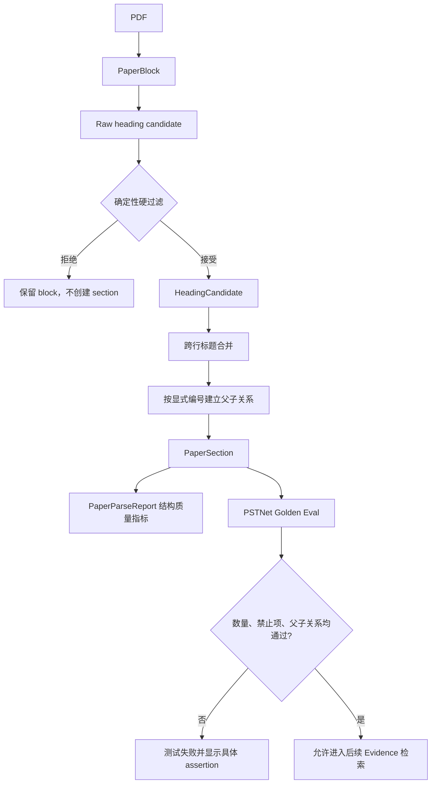

# 30. Phase 19：高精度论文章节结构与 Golden 评测闭环

> 本阶段建立在 Phase 17 的 Agent 回归评测和 Phase 18 的章节感知论文理解之上。
>
> 原路线图把 Phase 19 定义为“混合 Evidence 检索”。但是 Phase 18 完成后的 PSTNet 实测暴露了一个更靠前的阻塞点：23 页正文虽然全部提取成功，parser 却生成了 87 个 section，而论文真实逻辑章节约为 37 个；现有离线评测仍然可以得到满分。
>
> 因此，本阶段先完成论文结构精度闭环。原计划中的混合 Evidence 检索顺延到下一阶段。只有 section 边界、标题和父子关系可信，后续检索、mapping、debug 和 repair 才不会放大错误 Evidence。
>
> 本教程只给出实现步骤、完整代码上下文、测试和验收方法。请按照顺序自行修改项目代码。

> **章节标识说明**
>
> - 标注“需要修改项目代码”的章节必须落实到列出的文件。
> - 标注“需要新增测试或配置”的章节必须创建或更新对应文件。
> - 标注“原理、运行、调试或验收说明”的章节不要求修改代码。
> - 写着“完整替换”的代码块应替换指定文件或函数，不要只复制其中几行。
> - 完成一个小节后先运行该小节测试，不要积累到最后一次性排错。

---

## 一、为什么这一阶段比混合检索更优先

> **本节类型：优先级分析，不修改项目代码。**

当前 PSTNet 解析基线为：

```text
PDF 总页数：23
成功索引页数：23
提取 block：2270
生成 section：87
实际逻辑章节：约 37
离线 parser eval：仍可能为 1.0
```

问题不在“读取不到论文”，而在“把正文、公式、表格和图像标签误当成标题”。

典型误检包括：

```text
2018) and pooling techniques ...
F′(x,y,z)
W
L = 5 frames ...
89.39 97.68 69.43 ...
PSTConv1: N=1024
```

错误 section 会继续污染下游：

```text
错误标题
  -> 错误 section 边界
  -> 错误 chunk
  -> 错误 PaperEvidence
  -> 错误论文代码 mapping
  -> 错误 debug / repair 检索候选
```

几个候选方向的优先级对比如下：

| 候选阶段 | 当前收益 | 前置依赖 | 现在是否适合 |
|---|---:|---|---|
| 高精度章节解析与 Golden 评测 | 很高 | Phase 17、18 已具备 | 最优先 |
| 混合 Evidence 检索 | 很高 | 需要可信 section/Evidence | 暂缓一阶段 |
| OCR fallback | 中 | 当前 PSTNet 无 OCR 页 | 暂不优先 |
| Dense Retrieval | 中 | 需要 Golden 检索基线 | 暂不优先 |
| 异步 Job Runtime | 高但相对独立 | 执行系统 | 可后续并行规划 |

本阶段采用：

```text
先让评测能够发现误检
  -> 再收紧确定性标题规则
  -> 再合并跨行标题
  -> 再修复父子关系
  -> 最后用真实 PSTNet Golden Case 验收
```

不要先修改规则、最后才补评测。否则很容易把规则调成只适配一篇论文。

---

## 二、本阶段完成后应具备的能力

> **本节类型：目标说明，不修改项目代码。**

完成后系统应当能够：

1. 区分“文本提取成功”和“章节结构可信”；
2. 拒绝 paragraph、table、caption、页眉页脚中的伪标题；
3. 拒绝四位引用年份、小数表格行和正文句子；
4. 拒绝公式变量、坐标表达式和竖排图像标签；
5. 保留真正的数字章节和附录章节；
6. 合并论文主标题和附录标题的跨行续接；
7. 根据显式编号建立父子关系，而不是只依赖最近标题栈；
8. 在 parse report 中记录标题候选、拒绝数、跨行合并数和层级 warning；
9. 在离线评测中约束 section 数量、禁止标题和父子关系；
10. 使用真实 PSTNet PDF 完成不调用 LLM 的 Golden 验收。

PSTNet 的目标结构至少满足：

```text
3
├── 3.1
├── 3.2
│   ├── 3.2.1
│   └── 3.2.2
├── 3.3
└── 3.4

4
├── 4.1
│   ├── 4.1.1
│   └── 4.1.2
├── 4.2
└── 4.3

B
├── B.1
└── B.2
```

---

## 三、本阶段不做什么

> **本节类型：范围说明，不修改项目代码。**

本阶段不做：

- 不接入向量数据库；
- 不实现 BM25、RRF 或 Dense Retrieval；
- 不调用 LLM 判断全部标题；
- 不实现扫描 PDF 的 OCR；
- 不处理图片内部的完整文字识别；
- 不判断论文实验是否复现成功；
- 不改变现有 `PaperSummary` 的下游接口；
- 不删除被拒绝的 `PaperBlock`，原始 block 仍保留在 Artifact 中。

标题判断仍然是确定性的。后续可以只对低置信度候选增加 LLM fallback，但不能让模型直接重写整篇论文结构。

---

## 四、目标数据流

> **本节类型：架构说明，不修改项目代码。**



这里最重要的边界是：

```text
PaperBlock 不因标题判断失败而删除
PaperSection 只由通过规则的 HeadingCandidate 生成
Golden Eval 不参与生产解析，只负责验证生产解析
```

---

## 五、涉及文件

> **本节类型：实施清单，不修改项目代码。**

需要修改：

```text
app/config.py
app/paper/schemas.py
app/paper/sectioning.py
app/paper/indexer.py
app/evaluation/schemas.py
app/evaluation/runners.py
app/evaluation/scorers.py
app/evaluation/cases/offline/pstnet_paper_parser.json
tests/test_paper_sectioning.py
tests/test_paper_eval.py
```

建议同时回归但不一定需要修改：

```text
tests/test_pdf_block_parser.py
tests/test_paper_reader_node_v2.py
tests/test_paper_chunking.py
tests/test_paper_reducer.py
tests/test_agent_eval.py
```

本阶段不需要新增 Graph node。修改发生在：

```text
paper_reader_node
  -> indexer
  -> sectioning
```

的确定性内部实现，以及 Phase 17 已有的离线评测层。

---

## 六、先记录修改前基线

> **本节类型：运行和验收说明，不修改项目代码。**

先运行现有 parser：

```bash
python -m app.main index-paper \
  "pdf/PSTNet—Point Spatio-Temporal Convolution on Point Cloud Sequences.pdf"
```

记录终端输出中的：

```text
run_id
run_dir
pages
blocks
sections
paper_parse_report_path
```

当前典型结果是：

```text
pages: 23/23
blocks: 2270
sections: 87
```

再运行当前离线 case：

```bash
python -m app.evaluation.run_eval run \
  --suite offline \
  --case-id offline_pstnet_paper_parser \
  --no-fail-on-regression
```

此时它仍可能通过。这个现象就是本阶段要修复的评测盲区。

不要在本阶段开始前更新 baseline。只有新规则和新 Golden Case 全部通过后，才考虑更新完整离线 baseline。

---

## 七、扩展 parser 结构质量 schema

> **本节类型：需要修改项目代码。**
>
> **需要修改：** `app/paper/schemas.py`

### 7.1 扩展 PaperParseWarning.code

在现有 `PaperParseWarning` 中保留全部旧 code，并增加两个层级 warning：

```python
class PaperParseWarning(BaseModel):
    """不阻断索引、但需要下游知道的解析异常。"""

    model_config = ConfigDict(extra="forbid")

    code: Literal[
        "EMPTY_PAGE",
        "OCR_REQUIRED",
        "TABLE_PARSE_FAILED",
        "NO_HEADINGS",
        "HEADING_AMBIGUOUS",
        "UNSUPPORTED_FORMAT",
        # 子章节出现时没有找到显式父编号。
        "MISSING_SECTION_PARENT",
        # 同一个显式编号被多个标题重复占用。
        "HEADING_SEQUENCE_CONFLICT",
    ]
    message: str
    page: int | None = None
    block_id: str | None = None
```

### 7.2 完整替换 PaperParseReport

用下面版本完整替换现有 `PaperParseReport`：

```python
class PaperParseReport(BaseModel):
    """文本覆盖率和章节结构质量报告。"""

    model_config = ConfigDict(extra="forbid")

    # status 继续表示文本提取是否可用，保持 Phase 18 兼容。
    status: Literal["succeeded", "partial", "failed"]

    # structure_status 单独表达章节结构是否可信。
    structure_status: Literal[
        "reliable",
        "degraded",
        "unknown",
    ] = "unknown"

    page_count: int = Field(ge=0)
    indexed_pages: list[int] = Field(default_factory=list)
    empty_pages: list[int] = Field(default_factory=list)
    ocr_required_pages: list[int] = Field(default_factory=list)
    block_count: int = Field(ge=0)
    section_count: int = Field(ge=0)

    # raw candidate 是“看起来可能像标题”的原始候选。
    heading_candidate_count: int = Field(default=0, ge=0)

    # accepted 是跨行合并完成后的最终逻辑标题数。
    accepted_heading_count: int = Field(default=0, ge=0)

    # rejected 是被确定性硬规则拒绝的原始候选数。
    rejected_heading_count: int = Field(default=0, ge=0)

    # 两个或多个视觉标题行合并成一个逻辑标题的次数。
    multiline_heading_merge_count: int = Field(default=0, ge=0)

    # 缺少父编号、重复编号等层级 warning 数量。
    hierarchy_warning_count: int = Field(default=0, ge=0)

    warnings: list[PaperParseWarning] = Field(default_factory=list)
```

新增字段全部提供默认值，原因是：

- Phase 17 的旧 fixture 仍能反序列化；
- 旧 run Artifact 仍可被读取；
- 不需要一次性迁移所有历史 observation；
- 新 parser 会写出完整值，旧数据则显示默认值。

### 7.3 先运行 schema 相关回归

```bash
python -m pytest \
  tests/test_paper_eval.py \
  tests/test_paper_reader_node_v2.py \
  -q
```

此时新字段还没有生产值，但不应因为 schema 扩展破坏旧测试。

---

## 八、完整替换高精度 sectioning 实现

> **本节类型：需要修改项目代码。**
>
> **需要完整替换：** `app/paper/sectioning.py`

下面代码是完整文件，不是零散 helper。它保留 Phase 18 的：

- 固定无编号标题；
- 同行“编号 + 标题”合并；
- section kind 分类；
- fallback `Document` section；
- 确定性 `section_id`。

同时增加：

- 原始候选统计；
- block 类型硬过滤；
- 数字编号合法性检查；
- 公式和竖排标签过滤；
- 跨行标题合并；
- 显式编号父子关系；
- 层级 warning。

```python
from __future__ import annotations

import hashlib
import re
from collections.abc import Iterable
from dataclasses import dataclass

from app.paper.normalization import (
    looks_like_arxiv_overlay,
    normalize_heading,
    normalize_key,
    normalize_pdf_text,
)
from app.paper.schemas import (
    PaperBlock,
    PaperParseWarning,
    PaperSection,
    SectionKind,
)

_NUMBERED_HEADING_RE = re.compile(
    r"^(?P<number>\d+(?:\.\d+)*)(?:[.)])?\s+(?P<title>.+)$"
)
_APPENDIX_HEADING_RE = re.compile(
    r"^(?P<number>[A-Z](?:\.\d+)*)(?:[.)])?\s+(?P<title>.+)$"
)
_SPLIT_HEADING_NUMBER_RE = re.compile(
    r"^(?P<number>(?:\d+(?:\.\d+)*|[A-Z](?:\.\d+)*))(?:[.)])?$"
)
_TITLE_WORD_RE = re.compile(r"[A-Za-z][A-Za-z0-9+-]*")
_COORDINATE_FORMULA_RE = re.compile(
    r"\([A-Za-z]\s*,\s*[A-Za-z](?:\s*,\s*[A-Za-z])+\)"
)

_NOISE_BLOCK_TYPES = {
    "table",
    "caption",
    "header",
    "footer",
    "formula",
}

_UNNUMBERED_HEADINGS = {
    "abstract",
    "acknowledgment",
    "acknowledgments",
    "conclusion",
    "conclusions",
    "references",
    "appendix",
    "limitations",
    "limitation",
}

_FORMULA_MARKERS = {
    "=",
    "′",
    "″",
    "∑",
    "∏",
    "≤",
    "≥",
    "→",
    "←",
    "|",
}


@dataclass(frozen=True)
class HeadingCandidate:
    """一个已经通过硬过滤的逻辑标题候选。"""

    # start_index/end_index 指向 ordered blocks 的半开区间。
    # 同行拆分标题可能消费两个 block，跨行标题还会继续扩大 end。
    start_index: int
    end_index: int
    heading_block: PaperBlock
    number: str | None
    title: str


@dataclass(frozen=True)
class SectionBuildResult:
    """section 列表及其确定性结构诊断。"""

    sections: list[PaperSection]
    heading_candidate_count: int
    rejected_heading_count: int
    multiline_heading_merge_count: int
    warnings: list[PaperParseWarning]

    @property
    def accepted_heading_count(self) -> int:
        if (
            len(self.sections) == 1
            and self.sections[0].title == "Document"
        ):
            return 0
        return len(self.sections)

    @property
    def hierarchy_warning_count(self) -> int:
        return sum(
            warning.code
            in {
                "MISSING_SECTION_PARENT",
                "HEADING_SEQUENCE_CONFLICT",
            }
            for warning in self.warnings
        )


def _sha256(value: str) -> str:
    return hashlib.sha256(value.encode("utf-8")).hexdigest()


def _has_heading_style(block: PaperBlock) -> bool:
    """正文句子不能仅凭正则成为标题。"""

    return (
        block.block_type in {"heading", "title"}
        or block.is_bold
    )


def _is_vertical_label(block: PaperBlock) -> bool:
    """利用 bbox 排除明显的竖排图像标签。"""

    if block.bbox is None:
        return False

    x0, y0, x1, y1 = block.bbox
    width = max(x1 - x0, 1.0)
    height = max(y1 - y0, 1.0)

    # 同时要求绝对高度大于 24，避免短小字符框被误判。
    return height > 24.0 and height > width * 1.5


def _looks_like_formula_text(text: str) -> bool:
    """拒绝公式变量、坐标表达式和明显数学行。"""

    normalized = normalize_pdf_text(text)
    if any(marker in normalized for marker in _FORMULA_MARKERS):
        return True
    if _COORDINATE_FORMULA_RE.search(normalized):
        return True

    letters = [
        character
        for character in normalized
        if character.isalpha()
    ]
    words = _TITLE_WORD_RE.findall(normalized)

    # W/T/S 这类单字符不能独立成为无编号章节。
    return len(letters) <= 2 and len(words) <= 1


def _valid_numeric_number(number: str) -> bool:
    """接受常见章节编号，拒绝年份和表格小数。"""

    parts = number.split(".")
    if not 1 <= len(parts) <= 4:
        return False
    if any(not part.isdigit() for part in parts):
        return False

    values = [int(part) for part in parts]

    # 0.00、0.6 等更可能是表格值或公式值。
    if values[0] == 0:
        return False

    # 论文一级章节通常不会大于 30。
    # 该限制同时拒绝 89.39、2500 和 2018/2019。
    if values[0] > 30:
        return False

    # 防止异常长的小数/编号分量。
    return all(value <= 99 for value in values[1:])


def _valid_appendix_number(number: str) -> bool:
    """接受 A、B.2 等附录编号。"""

    parts = number.split(".")
    if (
        not parts
        or len(parts[0]) != 1
        or not ("A" <= parts[0] <= "Z")
    ):
        return False
    return all(
        part.isdigit() and int(part) <= 99
        for part in parts[1:]
    )


def _valid_section_number(number: str) -> bool:
    if number[0].isdigit():
        return _valid_numeric_number(number)
    return _valid_appendix_number(number)


def _looks_like_title_phrase(text: str) -> bool:
    """标题文本本身必须像短语，而不是正文或公式。"""

    value = normalize_heading(text).strip()
    if not value or len(value) > 180:
        return False
    if value.endswith((".", "?", "!", ";")):
        return False
    if "#" in value or _looks_like_formula_text(value):
        return False

    words = _TITLE_WORD_RE.findall(value)
    letters = [
        character
        for character in value
        if character.isalpha()
    ]
    return 1 <= len(words) <= 18 and len(letters) >= 3


def _uppercase_ratio(text: str) -> float:
    letters = [
        character
        for character in text
        if character.isalpha()
    ]
    if not letters:
        return 0.0
    return sum(character.isupper() for character in letters) / len(letters)


def _same_visual_line(
    left: PaperBlock,
    right: PaperBlock,
) -> bool:
    """判断相邻 block 是否属于同一视觉行。"""

    if left.bbox is None or right.bbox is None:
        return False

    left_x0, left_y0, left_x1, left_y1 = left.bbox
    right_x0, right_y0, _, right_y1 = right.bbox
    left_height = max(left_y1 - left_y0, 1.0)
    right_height = max(right_y1 - right_y0, 1.0)
    center_delta = abs(
        ((left_y0 + left_y1) / 2.0)
        - ((right_y0 + right_y1) / 2.0)
    )
    vertical_tolerance = max(
        2.0,
        min(left_height, right_height) * 0.35,
    )
    horizontal_gap = right_x0 - left_x1
    return (
        center_delta <= vertical_tolerance
        and -2.0 <= horizontal_gap <= 48.0
        and right_x0 >= left_x0
    )


def _looks_like_split_title(block: PaperBlock) -> bool:
    """识别编号右侧被单独抽取的标题文本。"""

    if (
        block.excluded
        or block.block_type in _NOISE_BLOCK_TYPES
        or looks_like_arxiv_overlay(block.text)
        or _is_vertical_label(block)
        or not _looks_like_title_phrase(block.text)
    ):
        return False

    return (
        _has_heading_style(block)
        or _uppercase_ratio(block.text) >= 0.65
    )


def _split_heading_parts(
    number_block: PaperBlock,
    title_block: PaperBlock,
) -> tuple[str, str] | None:
    """合并 PDF 拆开的“编号 block + 同行标题 block”。"""

    if (
        number_block.excluded
        or number_block.block_type in _NOISE_BLOCK_TYPES
        or number_block.page != title_block.page
        or title_block.order != number_block.order + 1
        or _is_vertical_label(number_block)
        or not _same_visual_line(number_block, title_block)
        or not _looks_like_split_title(title_block)
    ):
        return None

    number_text = normalize_pdf_text(number_block.text)
    match = _SPLIT_HEADING_NUMBER_RE.fullmatch(number_text)
    if match is None:
        return None

    number = match.group("number")
    if not _valid_section_number(number):
        return None

    return number, normalize_heading(title_block.text)


def _heading_parts(
    block: PaperBlock,
) -> tuple[str | None, str] | None:
    """返回合法的 (section_number, title)。"""

    if (
        block.excluded
        or block.block_type in _NOISE_BLOCK_TYPES
        or looks_like_arxiv_overlay(block.text)
        or _is_vertical_label(block)
    ):
        return None

    raw_text = normalize_pdf_text(block.text)
    text = normalize_heading(raw_text)
    if not text or len(text) > 180:
        return None

    numbered = _NUMBERED_HEADING_RE.match(raw_text)
    if numbered:
        number = numbered.group("number")
        title = normalize_heading(
            numbered.group("title")
        ).strip()
        if (
            _valid_numeric_number(number)
            and _has_heading_style(block)
            and _looks_like_title_phrase(title)
        ):
            return number, title
        return None

    appendix = _APPENDIX_HEADING_RE.match(raw_text)
    if appendix:
        number = appendix.group("number")
        title = normalize_heading(
            appendix.group("title")
        ).strip()
        if (
            _valid_appendix_number(number)
            and _has_heading_style(block)
            and _looks_like_title_phrase(title)
        ):
            return number, title
        return None

    key = normalize_key(text)
    if key in _UNNUMBERED_HEADINGS:
        return None, text

    if (
        not _has_heading_style(block)
        or not _looks_like_title_phrase(text)
    ):
        return None

    words = _TITLE_WORD_RE.findall(text)

    # 允许 PSTNET 这类较长全大写续接行，
    # 但拒绝 W/T/S 等单字符公式变量。
    if len(words) == 1:
        letters = [
            character
            for character in text
            if character.isalpha()
        ]
        if len(letters) < 4:
            return None

    return None, text


def _looks_like_raw_heading_candidate(block: PaperBlock) -> bool:
    """只用于统计，不代表最终接受。"""

    if block.excluded or looks_like_arxiv_overlay(block.text):
        return False

    text = normalize_pdf_text(block.text)
    key = normalize_key(text)
    return bool(
        _has_heading_style(block)
        or _NUMBERED_HEADING_RE.match(text)
        or _APPENDIX_HEADING_RE.match(text)
        or key in _UNNUMBERED_HEADINGS
    )


def _font_size_close(
    left: PaperBlock,
    right: PaperBlock,
) -> bool:
    if left.font_size is None or right.font_size is None:
        return False
    maximum = max(left.font_size, right.font_size, 1.0)
    return abs(left.font_size - right.font_size) / maximum <= 0.12


def _can_merge_multiline(
    left: HeadingCandidate,
    right: HeadingCandidate,
) -> bool:
    """严格判断 right 是否为 left 的下一视觉标题行。"""

    if (
        right.number is not None
        or left.end_index != right.start_index
        or left.heading_block.page != right.heading_block.page
        or not _has_heading_style(left.heading_block)
        or not _has_heading_style(right.heading_block)
        or not _font_size_close(
            left.heading_block,
            right.heading_block,
        )
        or normalize_key(right.title) in _UNNUMBERED_HEADINGS
        or _uppercase_ratio(left.title) < 0.65
        or _uppercase_ratio(right.title) < 0.65
    ):
        return False

    left_bbox = left.heading_block.bbox
    right_bbox = right.heading_block.bbox
    if left_bbox is None or right_bbox is None:
        return False

    left_x0, _, _, left_y1 = left_bbox
    right_x0, right_y0, _, _ = right_bbox
    horizontal_start_delta = abs(left_x0 - right_x0)
    vertical_gap = right_y0 - left_y1
    line_height = max(
        left.heading_block.font_size or 1.0,
        right.heading_block.font_size or 1.0,
    )

    if left.heading_block.font_name and right.heading_block.font_name:
        if (
            left.heading_block.font_name.casefold()
            != right.heading_block.font_name.casefold()
        ):
            return False

    return (
        horizontal_start_delta <= 28.0
        and -1.0 <= vertical_gap <= line_height * 1.3
    )


def _merge_multiline_candidates(
    candidates: list[HeadingCandidate],
) -> tuple[list[HeadingCandidate], int]:
    merged: list[HeadingCandidate] = []
    merge_count = 0

    for candidate in candidates:
        if merged and _can_merge_multiline(
            merged[-1],
            candidate,
        ):
            previous = merged.pop()
            merged.append(
                HeadingCandidate(
                    start_index=previous.start_index,
                    end_index=candidate.end_index,
                    heading_block=previous.heading_block,
                    number=previous.number,
                    title=normalize_heading(
                        f"{previous.title} {candidate.title}"
                    ),
                )
            )
            merge_count += 1
            continue

        merged.append(candidate)

    return merged, merge_count


def _collect_heading_candidates(
    ordered: list[PaperBlock],
) -> tuple[list[HeadingCandidate], int, int, int]:
    """收集、过滤并合并标题候选。"""

    candidates: list[HeadingCandidate] = []
    raw_candidate_count = 0
    rejected_candidate_count = 0

    index = 0
    while index < len(ordered):
        block = ordered[index]
        raw_candidate = _looks_like_raw_heading_candidate(block)

        if index + 1 < len(ordered):
            split_parts = _split_heading_parts(
                block,
                ordered[index + 1],
            )
            if split_parts is not None:
                number, title = split_parts
                raw_candidate_count += 1
                candidates.append(
                    HeadingCandidate(
                        start_index=index,
                        end_index=index + 2,
                        heading_block=block,
                        number=number,
                        title=title,
                    )
                )
                index += 2
                continue

        if raw_candidate:
            raw_candidate_count += 1

        parts = _heading_parts(block)
        if parts is None:
            if raw_candidate:
                rejected_candidate_count += 1
            index += 1
            continue

        number, title = parts
        candidates.append(
            HeadingCandidate(
                start_index=index,
                end_index=index + 1,
                heading_block=block,
                number=number,
                title=title,
            )
        )
        index += 1

    merged, merge_count = _merge_multiline_candidates(
        candidates
    )
    return (
        merged,
        raw_candidate_count,
        rejected_candidate_count,
        merge_count,
    )


def _heading_level(number: str | None, title: str) -> int:
    if number:
        return number.count(".") + 1
    if normalize_key(title) == "abstract":
        return 1
    return 1


def _parent_number(number: str) -> str | None:
    if "." not in number:
        return None
    return number.rsplit(".", 1)[0]


def classify_section(title: str) -> SectionKind:
    """根据规范化标题给 section 分类。"""

    key = normalize_key(title)

    if "abstract" in key:
        return "abstract"
    if "introduction" in key:
        return "introduction"
    if "related work" in key:
        return "related_work"
    if any(
        word in key
        for word in (
            "implementation detail",
            "training detail",
        )
    ):
        return "implementation"
    if any(
        word in key
        for word in (
            "ablation",
            "influence of",
            "impact of",
        )
    ):
        return "ablation"
    if any(
        word in key
        for word in ("experiment", "evaluation")
    ):
        return "experiments"
    if any(
        word in key
        for word in ("dataset", "benchmark")
    ):
        return "datasets"
    if any(
        word in key
        for word in ("result", "performance")
    ):
        return "results"
    if any(
        word in key
        for word in (
            "method",
            "network",
            "convolution",
            "model",
        )
    ):
        return "method"
    if "conclusion" in key:
        return "conclusion"
    if "reference" in key:
        return "references"
    if "limitation" in key:
        return "limitations"
    if key.startswith("appendix"):
        return "appendix"
    return "other"


def _section_id(
    *,
    number: str | None,
    title: str,
    heading_block_id: str,
) -> str:
    key = (
        f"{number or ''}|"
        f"{normalize_key(title)}|"
        f"{heading_block_id}"
    )
    return f"sec-{_sha256(key)[:12]}"


def _fallback_section(
    ordered: list[PaperBlock],
) -> list[PaperSection]:
    content_blocks = [
        block
        for block in ordered
        if not block.excluded
    ]
    if not content_blocks:
        return []

    content_hash = _sha256(
        "\n".join(
            block.text_hash
            for block in content_blocks
        )
    )
    return [
        PaperSection(
            section_id=f"sec-{content_hash[:12]}",
            title="Document",
            normalized_title="document",
            level=1,
            kind="other",
            page_start=content_blocks[0].page,
            page_end=content_blocks[-1].page,
            block_ids=[
                block.block_id
                for block in content_blocks
            ],
            content_hash=content_hash,
        )
    ]


def build_sections_with_diagnostics(
    blocks: Iterable[PaperBlock],
) -> SectionBuildResult:
    """构建 section，同时返回结构质量诊断。"""

    ordered = sorted(
        blocks,
        key=lambda item: (item.page, item.order),
    )
    (
        candidates,
        raw_candidate_count,
        rejected_candidate_count,
        merge_count,
    ) = _collect_heading_candidates(ordered)

    if not candidates:
        return SectionBuildResult(
            sections=_fallback_section(ordered),
            heading_candidate_count=raw_candidate_count,
            rejected_heading_count=rejected_candidate_count,
            multiline_heading_merge_count=merge_count,
            warnings=[],
        )

    sections: list[PaperSection] = []
    warnings: list[PaperParseWarning] = []
    section_id_by_number: dict[str, str] = {}
    parent_stack: list[tuple[int, str]] = []

    for position, candidate in enumerate(candidates):
        end = (
            candidates[position + 1].start_index
            if position + 1 < len(candidates)
            else len(ordered)
        )
        section_blocks = [
            block
            for block in ordered[
                candidate.start_index:end
            ]
            if not block.excluded
        ]
        if not section_blocks:
            continue

        level = _heading_level(
            candidate.number,
            candidate.title,
        )
        section_id = _section_id(
            number=candidate.number,
            title=candidate.title,
            heading_block_id=(
                candidate.heading_block.block_id
            ),
        )

        parent_id: str | None = None
        if candidate.number:
            expected_parent_number = _parent_number(
                candidate.number
            )
            if expected_parent_number is not None:
                parent_id = section_id_by_number.get(
                    expected_parent_number
                )
                if parent_id is None:
                    warnings.append(
                        PaperParseWarning(
                            code="MISSING_SECTION_PARENT",
                            message=(
                                "Section "
                                f"{candidate.number} has no "
                                "accepted parent "
                                f"{expected_parent_number}."
                            ),
                            page=(
                                candidate.heading_block.page
                            ),
                            block_id=(
                                candidate.heading_block.block_id
                            ),
                        )
                    )
        else:
            # 无编号标题没有显式父编号，才使用保守的层级栈。
            while (
                parent_stack
                and parent_stack[-1][0] >= level
            ):
                parent_stack.pop()
            parent_id = (
                parent_stack[-1][1]
                if parent_stack
                else None
            )

        content_hash = _sha256(
            "\n".join(
                block.text_hash
                for block in section_blocks
            )
        )
        section = PaperSection(
            section_id=section_id,
            number=candidate.number,
            title=candidate.title,
            normalized_title=normalize_key(
                candidate.title
            ),
            level=level,
            kind=classify_section(candidate.title),
            parent_id=parent_id,
            page_start=section_blocks[0].page,
            page_end=section_blocks[-1].page,
            heading_block_id=(
                candidate.heading_block.block_id
            ),
            block_ids=[
                block.block_id
                for block in section_blocks
            ],
            content_hash=content_hash,
        )
        sections.append(section)

        if candidate.number:
            if candidate.number in section_id_by_number:
                warnings.append(
                    PaperParseWarning(
                        code="HEADING_SEQUENCE_CONFLICT",
                        message=(
                            "Duplicate accepted section number: "
                            f"{candidate.number}."
                        ),
                        page=candidate.heading_block.page,
                        block_id=(
                            candidate.heading_block.block_id
                        ),
                    )
                )
            else:
                section_id_by_number[
                    candidate.number
                ] = section_id

        while (
            parent_stack
            and parent_stack[-1][0] >= level
        ):
            parent_stack.pop()
        parent_stack.append((level, section_id))

    return SectionBuildResult(
        sections=sections,
        heading_candidate_count=raw_candidate_count,
        rejected_heading_count=rejected_candidate_count,
        multiline_heading_merge_count=merge_count,
        warnings=warnings,
    )


def build_sections(
    blocks: Iterable[PaperBlock],
) -> list[PaperSection]:
    """保持 Phase 18 调用接口兼容。"""

    return build_sections_with_diagnostics(blocks).sections
```

### 8.1 为什么不能只改正则

仅把：

```text
\d+
```

改得更复杂，不能解决全部问题，因为误检同时来自：

- block 类型；
- 字号和粗体；
- bbox 方向；
- 标题是否像正文句子；
- 公式符号；
- 同行和跨行关系；
- 父编号是否存在。

因此本实现把“文本模式”和“视觉证据”一起用于确定性决策。

### 8.2 为什么保留 build_sections()

现有测试、indexer 和其他代码已经调用：

```python
build_sections(blocks)
```

直接改变返回类型会扩大迁移范围。新增：

```python
build_sections_with_diagnostics()
```

供 indexer 获取指标，同时保留旧 wrapper 返回 `list[PaperSection]`。

---

## 九、把结构诊断接入 indexer

> **本节类型：需要修改项目代码。**
>
> **需要修改：** `app/paper/indexer.py`

### 9.1 修改 import

把：

```python
from app.paper.sectioning import build_sections
```

替换为：

```python
from app.paper.sectioning import (
    SectionBuildResult,
    build_sections_with_diagnostics,
)
```

### 9.2 在 _parse_status() 后增加结构状态函数

```python
def _structure_status(
    result: SectionBuildResult,
) -> Literal["reliable", "degraded", "unknown"]:
    """结构状态与文本提取状态分开计算。"""

    if (
        not result.sections
        or (
            len(result.sections) == 1
            and result.sections[0].title == "Document"
        )
    ):
        return "unknown"

    if result.hierarchy_warning_count:
        return "degraded"

    return "reliable"
```

### 9.3 修改 parse_paper_source() 的 section 构建部分

找到：

```python
blocks.sort(key=lambda item: (item.page, item.order))
sections = build_sections(blocks)
```

替换为：

```python
blocks.sort(key=lambda item: (item.page, item.order))

section_result = build_sections_with_diagnostics(blocks)
sections = section_result.sections
warnings.extend(section_result.warnings)
```

后面的 fallback 判断继续保留：

```python
if (
    sections
    and len(sections) == 1
    and sections[0].title == "Document"
):
    warnings.append(
        PaperParseWarning(
            code="NO_HEADINGS",
            message=(
                "No reliable headings were detected; "
                "the document fallback section is used."
            ),
        )
    )
```

### 9.4 完整替换 PaperParseReport(...) 构造

```python
report = PaperParseReport(
    status=_parse_status(
        indexed_pages=indexed_pages,
        warnings=warnings,
    ),
    structure_status=_structure_status(
        section_result
    ),
    page_count=page_count,
    indexed_pages=indexed_pages,
    empty_pages=sorted(
        {
            warning.page
            for warning in warnings
            if warning.code == "EMPTY_PAGE"
            and warning.page is not None
        }
    ),
    ocr_required_pages=sorted(
        {
            warning.page
            for warning in warnings
            if warning.code == "OCR_REQUIRED"
            and warning.page is not None
        }
    ),
    block_count=len(blocks),
    section_count=len(sections),
    heading_candidate_count=(
        section_result.heading_candidate_count
    ),
    accepted_heading_count=(
        section_result.accepted_heading_count
    ),
    rejected_heading_count=(
        section_result.rejected_heading_count
    ),
    multiline_heading_merge_count=(
        section_result.multiline_heading_merge_count
    ),
    hierarchy_warning_count=(
        section_result.hierarchy_warning_count
    ),
    warnings=warnings,
)
```

### 9.5 status 与 structure_status 的区别

```text
status=succeeded
```

表示：

- 有可用文本；
- 页面索引成功；
- 没有文本提取 warning。

```text
structure_status=reliable
```

表示：

- 找到了结构化标题；
- 没有缺父节点或重复编号 warning。

即使两个值都是成功，也不代表对任意论文都达到完美 precision。真正的论文级准确率仍由 Golden Case 验证。

---

## 十、更新 parser 版本

> **本节类型：需要修改项目代码。**
>
> **需要修改：** `app/config.py`

找到：

```python
paper_parser_version: str = "phase18-v1"
```

修改为：

```python
# Phase 19 改变标题接受、跨行合并和父子关系规则。
# 更新版本可让依赖 parser 结果的旧缓存自然失效。
paper_parser_version: str = "phase19-v1"
```

不要修改：

```python
paper_extraction_version
```

本阶段没有修改 LLM section extraction prompt 或 schema。parser 版本和 extraction 版本必须分开演进。

---

## 十一、扩展评测 schema

> **本节类型：需要修改项目代码。**
>
> **需要修改：** `app/evaluation/schemas.py`

### 11.1 在 EvalExpected 前新增父子关系期望

放在 `ToolCallExpectation` 后、`EvalExpected` 前：

```python
class SectionParentExpectation(EvalModel):
    """使用显式编号表达稳定的 Golden 父子关系。"""

    child_number: str
    parent_number: str
```

### 11.2 在 EvalExpected 中增加结构质量期望

在现有论文评测字段：

```python
required_section_kinds
required_section_titles
min_indexed_page_ratio
```

附近增加：

```python
    # 继续保留 required_section_titles 的模糊包含匹配，
    # 兼容 Phase 18 已有 case。
    required_exact_section_titles: list[str] = Field(
        default_factory=list
    )

    # 精确禁止独立出现的标题，例如 W、PSTNET。
    forbidden_exact_section_titles: list[str] = Field(
        default_factory=list
    )

    # 禁止标题包含的稳定文本片段，用于年份正文和图表标签。
    forbidden_section_title_terms: list[str] = Field(
        default_factory=list
    )

    min_section_count: int | None = Field(
        default=None,
        ge=0,
    )
    max_section_count: int | None = Field(
        default=None,
        ge=0,
    )

    required_parent_relations: list[
        SectionParentExpectation
    ] = Field(default_factory=list)
```

### 11.3 在 EvalObservation 前新增 section observation

放在 `EvalMetrics` 后、`EvalObservation` 前：

```python
class PaperSectionObservation(EvalModel):
    """Scorer 需要的最小 section 结构，不保存正文。"""

    number: str | None = None
    title: str
    parent_number: str | None = None
    parent_title: str | None = None
```

### 11.4 在 EvalObservation 中增加 paper_sections

在：

```python
paper_section_titles
paper_section_kinds
```

附近增加：

```python
    paper_sections: list[
        PaperSectionObservation
    ] = Field(default_factory=list)
```

不要把完整 `block_ids`、正文或 bbox 放进 EvalObservation。评测 observation 应当保持稳定、有限，只保存 scorer 真正需要的事实。

---

## 十二、让 paper_parser runner 观察父子结构

> **本节类型：需要修改项目代码。**
>
> **需要修改：** `app/evaluation/runners.py`

### 12.1 修改 import

在从 `app.evaluation.schemas` 导入类型的位置加入：

```python
PaperSectionObservation
```

### 12.2 完整替换 run_paper_parser_case()

```python
def run_paper_parser_case(
    case: EvalCase,
) -> EvalObservation:
    """运行确定性 parser，不调用 Provider。"""

    if not case.input.paper_path:
        raise ValueError(
            "paper_parser case requires paper_path"
        )
    if case.suite != "offline":
        raise ValueError(
            "paper_parser case must use offline suite"
        )

    paper_path = _resolve_eval_paper_path(
        case.input.paper_path
    )
    started = time.perf_counter()
    parsed = parse_paper_source(paper_path)
    duration_ms = (
        time.perf_counter() - started
    ) * 1000

    section_by_id = {
        section.section_id: section
        for section in parsed.sections
    }
    section_observations = []

    for section in parsed.sections:
        parent = (
            section_by_id.get(section.parent_id)
            if section.parent_id
            else None
        )
        section_observations.append(
            PaperSectionObservation(
                number=section.number,
                title=section.title,
                parent_number=(
                    parent.number
                    if parent is not None
                    else None
                ),
                parent_title=(
                    parent.title
                    if parent is not None
                    else None
                ),
            )
        )

    return EvalObservation(
        case_id=case.case_id,
        runner="paper_parser",
        route=["paper_parser"],
        final_status=parsed.report.status,
        paper_page_count=parsed.report.page_count,
        paper_indexed_pages=(
            parsed.report.indexed_pages
        ),
        paper_section_titles=[
            section.title
            for section in parsed.sections
        ],
        paper_section_kinds=[
            section.kind
            for section in parsed.sections
        ],
        paper_sections=section_observations,
        paper_ocr_required_pages=(
            parsed.report.ocr_required_pages
        ),
        metrics=EvalMetrics(
            duration_ms=duration_ms
        ),
    )
```

runner 先创建完整 `section_by_id`，再生成 observation。不要在单次顺序遍历中假设 parent 一定已经出现，这样实现对 section 顺序更稳健。

---

## 十三、扩展 quality scorer

> **本节类型：需要修改项目代码。**
>
> **需要修改：** `app/evaluation/scorers.py`

### 13.1 在 _normalized_name_matches() 后增加 helper

```python
def _normalized_exact_matches(
    expected: str,
    actual: str,
) -> bool:
    return normalize_key(expected) == normalize_key(actual)


def _normalized_term_in_title(
    term: str,
    title: str,
) -> bool:
    term_key = normalize_key(term)
    title_key = normalize_key(title)
    return bool(term_key) and term_key in title_key
```

### 13.2 在 score_quality() 的 required_section_titles 后增加检查

把下面代码放在现有：

```python
for required in expected.required_section_titles:
    ...
```

之后，`required_experiment_setting_names` 之前：

```python
    actual_titles = actual.paper_section_titles

    for required in (
        expected.required_exact_section_titles
    ):
        matched = any(
            _normalized_exact_matches(
                required,
                title,
            )
            for title in actual_titles
        )
        items.append(
            _assertion(
                (
                    "QUALITY_PAPER_SECTION_"
                    f"EXACT:{required}"
                ),
                matched,
                "必须识别完整逻辑章节标题",
                required,
                actual_titles,
            )
        )

    for forbidden in (
        expected.forbidden_exact_section_titles
    ):
        matched = any(
            _normalized_exact_matches(
                forbidden,
                title,
            )
            for title in actual_titles
        )
        items.append(
            _assertion(
                (
                    "QUALITY_PAPER_SECTION_"
                    f"FORBIDDEN_EXACT:{forbidden}"
                ),
                not matched,
                "禁止把指定文本识别为独立章节",
                False,
                matched,
            )
        )

    for term in (
        expected.forbidden_section_title_terms
    ):
        matched_titles = [
            title
            for title in actual_titles
            if _normalized_term_in_title(
                term,
                title,
            )
        ]
        items.append(
            _assertion(
                (
                    "QUALITY_PAPER_SECTION_"
                    f"FORBIDDEN_TERM:{term}"
                ),
                not matched_titles,
                "章节标题不得包含禁止文本片段",
                [],
                matched_titles,
            )
        )

    section_count = (
        len(actual.paper_sections)
        if actual.paper_sections
        else len(actual.paper_section_titles)
    )

    if expected.min_section_count is not None:
        items.append(
            _assertion(
                "QUALITY_PAPER_SECTION_COUNT_MIN",
                (
                    section_count
                    >= expected.min_section_count
                ),
                "section 数量不能因过度过滤低于下限",
                expected.min_section_count,
                section_count,
            )
        )

    if expected.max_section_count is not None:
        items.append(
            _assertion(
                "QUALITY_PAPER_SECTION_COUNT_MAX",
                (
                    section_count
                    <= expected.max_section_count
                ),
                "section 数量不能因误检超过上限",
                expected.max_section_count,
                section_count,
            )
        )

    for relation in (
        expected.required_parent_relations
    ):
        matched = any(
            (
                section.number
                == relation.child_number
                and section.parent_number
                == relation.parent_number
            )
            for section in actual.paper_sections
        )
        items.append(
            _assertion(
                (
                    "QUALITY_PAPER_PARENT:"
                    f"{relation.child_number}"
                ),
                matched,
                "子章节必须绑定到显式父编号",
                relation.model_dump(mode="json"),
                [
                    section.model_dump(mode="json")
                    for section in actual.paper_sections
                    if section.number
                    == relation.child_number
                ],
            )
        )
```

### 13.3 为什么同时需要数量下限和上限

只有上限会鼓励 parser 过度过滤：

```text
把所有标题都拒绝
  -> section_count 很小
  -> max_section_count 通过
```

因此必须同时检查：

```text
min_section_count：保护召回率
max_section_count：保护精确率
required titles：保护关键语义章节
forbidden titles：保护典型误检
parent relations：保护层级
```

---

## 十四、升级 PSTNet Golden Case

> **本节类型：需要修改评测配置。**
>
> **需要完整替换：** `app/evaluation/cases/offline/pstnet_paper_parser.json`

```json
{
  "schema_version": 1,
  "case_id": "offline_pstnet_paper_parser",
  "description": "PSTNet PDF 应完整索引正文，并保持高精度章节和父子结构",
  "suite": "offline",
  "runner": "paper_parser",
  "categories": [
    "route",
    "quality",
    "efficiency"
  ],
  "tags": [
    "offline",
    "paper",
    "parser",
    "phase19",
    "golden"
  ],
  "problem_ids": [],
  "input": {
    "paper_path": "pdf/PSTNet—Point Spatio-Temporal Convolution on Point Cloud Sequences.pdf"
  },
  "expected": {
    "allowed_final_statuses": [
      "succeeded",
      "partial"
    ],
    "required_section_kinds": [
      "abstract",
      "method",
      "experiments",
      "implementation",
      "ablation",
      "conclusion"
    ],
    "required_section_titles": [
      "Abstract",
      "Introduction",
      "Related Work",
      "Point Tube",
      "Experiments",
      "Implementation Details",
      "Ablation Study",
      "Limitation"
    ],
    "required_exact_section_titles": [
      "PSTNET: POINT SPATIO-TEMPORAL CONVOLUTION ON POINT CLOUD SEQUENCES",
      "VISUALIZATION OF THE OUTPUT OF EACH PST CONVOLUTION LAYER IN PSTNET"
    ],
    "forbidden_exact_section_titles": [
      "W",
      "T",
      "S",
      "PSTNET",
      "′(x,y,z)",
      "′′(x,y,z)",
      "(x,y,z)"
    ],
    "forbidden_section_title_terms": [
      "and pooling techniques",
      "converts a point cloud sequence",
      "frames with N = 8 points per frame",
      "CPU 2205 GPU",
      "89.39 97.68",
      "0.00 44.61",
      "PSTConv1: N=1024"
    ],
    "min_section_count": 35,
    "max_section_count": 45,
    "required_parent_relations": [
      {
        "child_number": "3.1",
        "parent_number": "3"
      },
      {
        "child_number": "3.2.1",
        "parent_number": "3.2"
      },
      {
        "child_number": "3.2.2",
        "parent_number": "3.2"
      },
      {
        "child_number": "3.3",
        "parent_number": "3"
      },
      {
        "child_number": "3.4",
        "parent_number": "3"
      },
      {
        "child_number": "4.1.1",
        "parent_number": "4.1"
      },
      {
        "child_number": "4.1.2",
        "parent_number": "4.1"
      },
      {
        "child_number": "B.1",
        "parent_number": "B"
      },
      {
        "child_number": "B.2",
        "parent_number": "B"
      }
    ],
    "min_indexed_page_ratio": 1.0,
    "max_ocr_required_pages": 0,
    "max_duration_ms": 15000
  },
  "thresholds": {
    "min_overall_score": 1.0,
    "max_score_regression": 0.0
  }
}
```

`35～45` 是针对当前 PSTNet Golden PDF 的验收窗口，不是写入生产 parser 的通用阈值。生产 parser 不应因为某篇论文超过 45 个章节就删除 section；不同论文的合理章节数量不同，阈值应留在 case 中。

---

## 十五、补全 sectioning 单元测试

> **本节类型：需要修改测试代码。**
>
> **需要修改：** `tests/test_paper_sectioning.py`

### 15.1 修改 import

替换为：

```python
import hashlib

from app.paper.schemas import PaperBlock
from app.paper.sectioning import (
    build_sections,
    build_sections_with_diagnostics,
)
```

### 15.2 完整替换 _block() helper

```python
def _block(
    block_id: str,
    page: int,
    order: int,
    text: str,
    block_type: str = "paragraph",
    bbox: tuple[float, float, float, float] | None = None,
    *,
    font_size: float | None = None,
    font_name: str | None = None,
    is_bold: bool = False,
) -> PaperBlock:
    return PaperBlock(
        block_id=block_id,
        page=page,
        order=order,
        block_type=block_type,
        text=text,
        bbox=bbox,
        font_size=font_size,
        font_name=font_name,
        is_bold=is_bold,
        text_hash=hashlib.sha256(
            text.encode("utf-8")
        ).hexdigest(),
    )
```

### 15.3 修改原公式测试

原测试允许 `W` 自己成为 section。把：

```python
assert len(sections) == 1
assert sections[0].title == "W"
assert sections[0].number is None
```

替换为：

```python
assert len(sections) == 1
assert sections[0].title == "Document"
assert sections[0].number is None
```

`Document` 是没有可靠标题时的安全 fallback，不代表把 `W` 当作标题。

### 15.4 在文件末尾追加完整边界测试

```python
def test_numbered_paragraph_and_table_values_are_rejected() -> None:
    blocks = [
        _block(
            "year",
            2,
            0,
            (
                "2018) and pooling techniques "
                "(Fan et al., 2017) are employed."
            ),
        ),
        _block(
            "table-row",
            2,
            1,
            "89.39 97.68 69.43 86.52",
            "table",
        ),
        _block(
            "experiments",
            6,
            0,
            "4 EXPERIMENTS",
            "heading",
        ),
        _block(
            "body",
            6,
            1,
            "We evaluate the model.",
        ),
    ]

    sections = build_sections(blocks)

    assert [
        (section.number, section.title)
        for section in sections
    ] == [("4", "EXPERIMENTS")]


def test_formula_and_single_symbol_are_not_sections() -> None:
    blocks = [
        _block(
            "formula-f",
            4,
            0,
            "F ′(x,y,z)",
            "heading",
        ),
        _block(
            "formula-m",
            4,
            1,
            "M (x,y,z)",
            "heading",
        ),
        _block(
            "symbol-w",
            4,
            2,
            "W",
            "heading",
        ),
        _block(
            "real-heading",
            4,
            3,
            "3.2.2 POINT TUBE",
            "heading",
        ),
        _block(
            "body",
            4,
            4,
            "Point tube description.",
        ),
    ]

    sections = build_sections(blocks)

    assert [
        (section.number, section.title)
        for section in sections
    ] == [("3.2.2", "POINT TUBE")]


def test_vertical_figure_label_is_not_a_section() -> None:
    blocks = [
        _block(
            "vertical-label",
            21,
            0,
            "PSTConv1: N=1024",
            "heading",
            (100.0, 100.0, 109.0, 181.0),
        ),
        _block(
            "limitation",
            21,
            1,
            "O LIMITATION",
            "heading",
            (120.0, 200.0, 220.0, 214.0),
        ),
        _block(
            "body",
            21,
            2,
            "Limitation body.",
        ),
    ]

    sections = build_sections(blocks)

    assert [
        (section.number, section.title)
        for section in sections
    ] == [("O", "LIMITATION")]


def test_multiline_main_title_is_merged() -> None:
    blocks = [
        _block(
            "title-line-1",
            1,
            0,
            "PSTNET: POINT SPATIO-TEMPORAL CONVOLUTION",
            "heading",
            (108.4, 80.5, 503.6, 97.7),
            font_size=13.77,
            font_name="NimbusRomNo9L-Regu",
        ),
        _block(
            "title-line-2",
            1,
            1,
            "ON POINT CLOUD SEQUENCES",
            "heading",
            (108.4, 100.4, 331.8, 117.6),
            font_size=13.77,
            font_name="NimbusRomNo9L-Regu",
        ),
        _block(
            "abstract",
            1,
            2,
            "ABSTRACT",
            "heading",
            (108.0, 150.0, 180.0, 164.0),
            font_size=11.0,
            font_name="NimbusRomNo9L-Regu",
        ),
        _block(
            "body",
            1,
            3,
            "Abstract body.",
        ),
    ]

    result = build_sections_with_diagnostics(blocks)

    assert result.sections[0].title == (
        "PSTNET: POINT SPATIO-TEMPORAL CONVOLUTION "
        "ON POINT CLOUD SEQUENCES"
    )
    assert result.multiline_heading_merge_count == 1
    assert result.sections[1].title == "ABSTRACT"


def test_multiline_split_appendix_title_is_merged() -> None:
    blocks = [
        _block(
            "appendix-number",
            19,
            28,
            "M",
            "heading",
            (108.3, 568.6, 118.9, 580.6),
            font_size=11.96,
            font_name="NimbusRomNo9L-Regu",
        ),
        _block(
            "appendix-title",
            19,
            29,
            (
                "VISUALIZATION OF THE OUTPUT OF EACH "
                "PST CONVOLUTION LAYER IN"
            ),
            "paragraph",
            (131.5, 568.6, 503.7, 580.6),
            font_size=9.54,
            font_name="NimbusRomNo9L-Regu",
        ),
        _block(
            "appendix-title-continuation",
            19,
            30,
            "PSTNET",
            "heading",
            (131.5, 582.6, 175.4, 594.5),
            font_size=11.96,
            font_name="NimbusRomNo9L-Regu",
        ),
        _block(
            "body",
            19,
            31,
            "We visualize each layer.",
        ),
    ]

    result = build_sections_with_diagnostics(blocks)

    assert len(result.sections) == 1
    assert result.sections[0].number == "M"
    assert result.sections[0].title == (
        "VISUALIZATION OF THE OUTPUT OF EACH "
        "PST CONVOLUTION LAYER IN PSTNET"
    )
    assert result.multiline_heading_merge_count == 1


def test_numbered_parent_is_not_taken_from_recent_stack() -> None:
    blocks = [
        _block(
            "section-3",
            3,
            0,
            "3 METHOD",
            "heading",
        ),
        _block(
            "section-3-2",
            3,
            1,
            "3.2 PST CONVOLUTION",
            "heading",
        ),
        _block(
            "intermediate",
            3,
            2,
            "INTERMEDIATE NOTE",
            "heading",
        ),
        _block(
            "section-3-2-2",
            3,
            3,
            "3.2.2 POINT TUBE",
            "heading",
        ),
        _block(
            "body",
            3,
            4,
            "Point tube body.",
        ),
    ]

    sections = build_sections(blocks)
    by_number = {
        section.number: section
        for section in sections
        if section.number
    }

    assert by_number["3.2.2"].parent_id == (
        by_number["3.2"].section_id
    )


def test_missing_numbered_parent_is_reported() -> None:
    blocks = [
        _block(
            "orphan",
            6,
            0,
            "4.1 ACTION RECOGNITION",
            "heading",
        ),
        _block(
            "body",
            6,
            1,
            "Experiment body.",
        ),
    ]

    result = build_sections_with_diagnostics(blocks)

    assert result.sections[0].parent_id is None
    assert result.hierarchy_warning_count == 1
    assert result.warnings[0].code == (
        "MISSING_SECTION_PARENT"
    )
    assert result.warnings[0].block_id == "orphan"
```

### 15.5 运行 sectioning 测试

```bash
python -m pytest \
  tests/test_paper_sectioning.py \
  -q
```

失败定位：

```text
年份或表格仍成为 section
  -> 检查 _valid_numeric_number() 和 _has_heading_style()

W/F/M 公式仍成为 section
  -> 检查 _looks_like_formula_text()

跨行标题未合并
  -> 检查 bbox、font_size、font_name 和 end_index/start_index

3.2.2 parent 错误
  -> 检查 section_id_by_number，不要重新退回纯 stack
```

---

## 十六、补全评测单元测试

> **本节类型：需要修改测试代码。**
>
> **需要修改：** `tests/test_paper_eval.py`

### 16.1 修改 schema import

把：

```python
from app.evaluation.schemas import EvalCase, EvalObservation
```

替换为：

```python
from app.evaluation.schemas import (
    EvalCase,
    EvalObservation,
    PaperSectionObservation,
)
```

### 16.2 更新 runner fake section

在 `test_paper_parser_runner_does_not_call_chat_model` 中，原 fake section 只有 `title` 和 `kind`。runner 现在还读取 ID、编号和 parent。

把 fake `sections` 替换为：

```python
sections=[
    SimpleNamespace(
        section_id="sec-abstract",
        number=None,
        title="Abstract",
        kind="abstract",
        parent_id=None,
    )
],
```

并在该测试末尾增加：

```python
assert observation.paper_sections == [
    PaperSectionObservation(
        number=None,
        title="Abstract",
        parent_number=None,
        parent_title=None,
    )
]
```

### 16.3 在文件末尾追加 quality scorer 测试

```python
def test_quality_fails_when_section_count_is_too_large() -> None:
    case = _paper_parser_case(
        expected={
            "min_section_count": 35,
            "max_section_count": 45,
        }
    )
    observation = EvalObservation(
        case_id=case.case_id,
        runner="paper_parser",
        paper_section_titles=[
            f"Section {index}"
            for index in range(87)
        ],
    )

    result = score_quality(case, observation)

    assert result.passed is False
    assert (
        "QUALITY_PAPER_SECTION_COUNT_MAX"
        in _failed_codes(result)
    )


def test_quality_rejects_exact_and_term_titles() -> None:
    case = _paper_parser_case(
        expected={
            "forbidden_exact_section_titles": [
                "W",
            ],
            "forbidden_section_title_terms": [
                "and pooling techniques",
            ],
        }
    )
    observation = EvalObservation(
        case_id=case.case_id,
        runner="paper_parser",
        paper_section_titles=[
            "W",
            (
                "and pooling techniques "
                "(Fan et al., 2017) are employed"
            ),
        ],
    )

    result = score_quality(case, observation)

    assert result.passed is False
    failed = _failed_codes(result)
    assert any(
        code.startswith(
            "QUALITY_PAPER_SECTION_FORBIDDEN_EXACT"
        )
        for code in failed
    )
    assert any(
        code.startswith(
            "QUALITY_PAPER_SECTION_FORBIDDEN_TERM"
        )
        for code in failed
    )


def test_quality_requires_exact_multiline_title() -> None:
    case = _paper_parser_case(
        expected={
            "required_exact_section_titles": [
                (
                    "PSTNET: POINT SPATIO-TEMPORAL "
                    "CONVOLUTION ON POINT CLOUD SEQUENCES"
                )
            ],
        }
    )
    observation = EvalObservation(
        case_id=case.case_id,
        runner="paper_parser",
        paper_section_titles=[
            (
                "PSTNET: POINT SPATIO-TEMPORAL "
                "CONVOLUTION"
            ),
            "ON POINT CLOUD SEQUENCES",
        ],
    )

    result = score_quality(case, observation)

    assert result.passed is False


def test_quality_checks_numbered_parent_relation() -> None:
    case = _paper_parser_case(
        expected={
            "required_parent_relations": [
                {
                    "child_number": "3.2.2",
                    "parent_number": "3.2",
                }
            ],
        }
    )
    observation = EvalObservation(
        case_id=case.case_id,
        runner="paper_parser",
        paper_sections=[
            PaperSectionObservation(
                number="3.2.2",
                title="POINT TUBE",
                parent_number="3",
                parent_title="METHOD",
            )
        ],
    )

    result = score_quality(case, observation)

    assert result.passed is False
    assert "QUALITY_PAPER_PARENT:3.2.2" in (
        _failed_codes(result)
    )


def test_quality_accepts_complete_section_structure() -> None:
    case = _paper_parser_case(
        expected={
            "required_exact_section_titles": [
                (
                    "PSTNET: POINT SPATIO-TEMPORAL "
                    "CONVOLUTION ON POINT CLOUD SEQUENCES"
                )
            ],
            "forbidden_exact_section_titles": ["W"],
            "min_section_count": 2,
            "max_section_count": 4,
            "required_parent_relations": [
                {
                    "child_number": "3.2.2",
                    "parent_number": "3.2",
                }
            ],
        }
    )
    observation = EvalObservation(
        case_id=case.case_id,
        runner="paper_parser",
        paper_section_titles=[
            (
                "PSTNET: POINT SPATIO-TEMPORAL "
                "CONVOLUTION ON POINT CLOUD SEQUENCES"
            ),
            "PST CONVOLUTION",
            "POINT TUBE",
        ],
        paper_sections=[
            PaperSectionObservation(
                number=None,
                title=(
                    "PSTNET: POINT SPATIO-TEMPORAL "
                    "CONVOLUTION ON POINT CLOUD SEQUENCES"
                ),
            ),
            PaperSectionObservation(
                number="3.2",
                title="PST CONVOLUTION",
                parent_number="3",
                parent_title="METHOD",
            ),
            PaperSectionObservation(
                number="3.2.2",
                title="POINT TUBE",
                parent_number="3.2",
                parent_title="PST CONVOLUTION",
            ),
        ],
    )

    result = score_quality(case, observation)

    assert result.passed is True
```

### 16.4 扩展旧 fixture 默认值测试

在 `test_phase17_fixture_loads_with_phase18_defaults` 末尾增加：

```python
assert observation.paper_sections == []
```

### 16.5 运行评测测试

```bash
python -m pytest \
  tests/test_paper_eval.py \
  -q
```

---

## 十七、运行 Phase 19 确定性回归

> **本节类型：运行和验收说明，不修改项目代码。**

先运行核心测试：

```bash
python -m pytest \
  tests/test_paper_sectioning.py \
  tests/test_paper_eval.py \
  -q
```

再运行 Phase 18/19 组合：

```bash
python -m pytest \
  tests/test_paper_normalization.py \
  tests/test_pdf_block_parser.py \
  tests/test_paper_sectioning.py \
  tests/test_paper_chunking.py \
  tests/test_paper_evidence.py \
  tests/test_paper_evidence_confidence.py \
  tests/test_paper_extraction_cache.py \
  tests/test_paper_reducer.py \
  tests/test_paper_reader_node_v2.py \
  tests/test_method_extractor_hierarchical.py \
  tests/test_paper_eval.py \
  -q
```

如果尚未按照 Phase 18 第 29 节创建其中某个测试文件，先补齐对应文件，不要从命令中永久删除。

这一组测试不需要：

```text
OPENAI_API_KEY
网络访问
真实 Provider
GPU
PSTNet 仓库
```

---

## 十八、真实 PSTNet Golden 验收

> **本节类型：手工验收，不修改项目代码。**

### 18.1 重新生成 index

```bash
python -m app.main index-paper \
  "pdf/PSTNet—Point Spatio-Temporal Convolution on Point Cloud Sequences.pdf"
```

记录新的 `run_dir`，不要继续检查 Phase 18 的旧 run。parser version 已变化，验收必须针对新产物。

### 18.2 检查 parse report

把下面的路径替换为刚才输出的真实 run_dir：

```bash
python - <<'PY'
import json
from pathlib import Path

run_dir = Path(
    "/data/tianshaoqi24/agent/"
    "paper_reproduction_copilot/runs/"
    "<替换为本次真实 run_id>"
)
report_path = (
    run_dir
    / "analysis"
    / "paper_parse_report.json"
)
report = json.loads(
    report_path.read_text(encoding="utf-8")
)

keys = [
    "status",
    "structure_status",
    "page_count",
    "indexed_pages",
    "block_count",
    "section_count",
    "heading_candidate_count",
    "accepted_heading_count",
    "rejected_heading_count",
    "multiline_heading_merge_count",
    "hierarchy_warning_count",
]
for key in keys:
    print(f"{key}: {report.get(key)}")

print("warnings:")
for warning in report.get("warnings", []):
    print(
        warning.get("code"),
        warning.get("page"),
        warning.get("block_id"),
        warning.get("message"),
    )
PY
```

目标：

```text
page_count: 23
indexed_pages: 1..23
section_count: 35～45
multiline_heading_merge_count: 至少 2
hierarchy_warning_count: 0
structure_status: reliable
```

### 18.3 检查全部 section 和 parent

```bash
python - <<'PY'
import json
from pathlib import Path

run_dir = Path(
    "/data/tianshaoqi24/agent/"
    "paper_reproduction_copilot/runs/"
    "<替换为本次真实 run_id>"
)
sections_path = (
    run_dir
    / "analysis"
    / "paper_sections.json"
)
sections = json.loads(
    sections_path.read_text(encoding="utf-8")
)
by_id = {
    item["section_id"]: item
    for item in sections
}

for item in sections:
    parent = by_id.get(item.get("parent_id"))
    print(
        item.get("number") or "-",
        "|",
        item["title"],
        "| parent:",
        (
            parent.get("number")
            if parent
            else "-"
        ),
    )
PY
```

必须人工确认：

- 主标题只有一个完整 section；
- `M ... PSTNET` 是一个完整附录标题；
- `2018`、`2019` 不存在；
- `W`、`T`、`S` 不存在；
- `F′(x,y,z)`、`M(x,y,z)` 不存在；
- 表格小数行不再成为 section；
- `PSTConv1` 到 `PSTConv4` 不再成为 section；
- `3.2.2` 的 parent 是 `3.2`；
- `3.3` 和 `3.4` 的 parent 是 `3`；
- `B.2` 的 parent 是 `B`。

### 18.4 运行单个 Golden Case

```bash
python -m app.evaluation.run_eval run \
  --suite offline \
  --case-id offline_pstnet_paper_parser
```

期望：

```text
passed: True
score: 1.0
```

如果失败，不要立即放宽 Golden Case。先查看本次 eval run 中的：

```text
traces/eval_cases/offline_pstnet_paper_parser/observation.json
reports/eval_report.md
reports/eval_suite.json
```

失败 assertion 会明确指出：

```text
缺少哪个标题
出现哪个禁止标题
section 数量是否越界
哪个 child 的 parent 错误
是否超过执行时间
```

---

## 十九、全量离线评测和 baseline

> **本节类型：运行和验收说明，不修改项目代码。**

先运行全量离线评测，但不更新 baseline：

```bash
python -m app.evaluation.run_eval run \
  --suite offline
```

再运行全量 pytest：

```bash
python -m pytest
```

只有以下条件同时成立时，才更新 baseline：

- 单元测试通过；
- PSTNet Golden Case 通过；
- 全量 offline suite 通过；
- 没有 Provider 调用；
- 没有旧 Graph、审批、执行安全或 repair 回归；
- 人工检查 `paper_sections.json` 没有明显误检。

然后运行：

```bash
python -m app.evaluation.run_eval run \
  --suite offline \
  --update-baseline
```

不要对单个 case 使用 `--update-baseline`。当前 CLI 明确禁止这样做，因为局部 case 不能代表完整离线基线。

---

## 二十、VS Code launch.json 调试

> **本节类型：调试配置说明，不修改应用代码。**
>
> **可选修改：** `.vscode/launch.json`

可以增加两个配置。若文件中已经有 `version` 和 `configurations`，只把两个对象加入现有 `configurations` 数组，不要重复创建顶层 JSON。

```json
{
  "name": "Phase 19: index PSTNet paper",
  "type": "debugpy",
  "request": "launch",
  "module": "app.main",
  "args": [
    "index-paper",
    "pdf/PSTNet—Point Spatio-Temporal Convolution on Point Cloud Sequences.pdf"
  ],
  "cwd": "/data/tianshaoqi24/agent/paper_reproduction_copilot",
  "console": "integratedTerminal",
  "justMyCode": true
}
```

```json
{
  "name": "Phase 19: PSTNet parser eval",
  "type": "debugpy",
  "request": "launch",
  "module": "app.evaluation.run_eval",
  "args": [
    "run",
    "--suite",
    "offline",
    "--case-id",
    "offline_pstnet_paper_parser",
    "--no-fail-on-regression"
  ],
  "cwd": "/data/tianshaoqi24/agent/paper_reproduction_copilot",
  "console": "integratedTerminal",
  "justMyCode": true
}
```

推荐断点：

```text
app/paper/sectioning.py::_heading_parts
app/paper/sectioning.py::_split_heading_parts
app/paper/sectioning.py::_can_merge_multiline
app/paper/sectioning.py::_collect_heading_candidates
app/paper/sectioning.py::build_sections_with_diagnostics
app/paper/indexer.py::parse_paper_source
app/evaluation/runners.py::run_paper_parser_case
app/evaluation/scorers.py::score_quality
```

调试某个误检 block 时，在 Debug Console 中查看：

```python
block.model_dump()
_looks_like_raw_heading_candidate(block)
_heading_parts(block)
_is_vertical_label(block)
_looks_like_formula_text(block.text)
```

跨行标题调试：

```python
left
right
left.heading_block.model_dump()
right.heading_block.model_dump()
_can_merge_multiline(left, right)
```

父子关系调试：

```python
candidate.number
_parent_number(candidate.number)
section_id_by_number
parent_id
```

---

## 二十一、常见失败及处理方式

> **本节类型：排错说明，不修改项目代码。**

### 21.1 section 数仍接近 87

检查：

```text
是否真的把 indexer 切换到 build_sections_with_diagnostics
是否运行了新的 run，而不是读取旧 Artifact
是否修改了 paper_parser_version
paragraph/table 是否在 _heading_parts 入口被拒绝
```

### 21.2 section 数低于 35

说明规则可能过严。优先检查：

- 真正的数字标题是否被 PyMuPDF 标成 `heading` 或 `title`；
- 同行拆分标题是否仍允许编号 block 为 paragraph；
- `C Implementation Details` 是否被公式规则误伤；
- 附录标题是否采用“编号 block + 大写标题 block”；
- `first section number <= 30` 是否适合新增 Golden PDF。

不要直接删除 `min_section_count`。

### 21.3 M 标题仍被拆成两个 section

检查真实 block：

```text
M 的 bbox/font_size/font_name
标题第一行是否由 split heading 消费
PSTNET 的 start_index 是否等于前一 candidate.end_index
两个 heading block 的字号差是否超过 12%
x0 差是否超过 28
```

阈值调整必须同时增加或更新单元测试，不能只针对运行产物改数字。

### 21.4 parse report status 变成 partial

如果存在：

```text
MISSING_SECTION_PARENT
HEADING_SEQUENCE_CONFLICT
```

`warnings` 不为空，当前 `_parse_status()` 会返回 `partial`。这不是 Graph 崩溃，而是结构 warning 可见。

先修复层级，不要把 `partial` 强行改回 `succeeded`。

### 21.5 Golden Case 提示 forbidden term

打开 observation：

```text
traces/eval_cases/offline_pstnet_paper_parser/observation.json
```

搜索 assertion 中给出的实际标题。然后定位：

```text
title
  -> section.heading_block_id
  -> paper_blocks.json 中对应 block
  -> block_type/font_size/bbox/text
```

不要只在 scorer 中忽略该标题。scorer 的职责是发现问题，parser 才是修复位置。

### 21.6 旧 fixture ValidationError

确认新增字段都有默认值：

```python
Field(default_factory=list)
Field(default=0, ge=0)
None
```

不要把 Phase 19 的 observation 字段改成无默认值的必填字段，否则 Phase 17 fixture 会全部失效。

### 21.7 runner 测试 AttributeError

如果提示：

```text
SimpleNamespace has no attribute section_id
```

说明 `tests/test_paper_eval.py` 中的 fake section 没按第 16.2 节补齐。

---

## 二十二、本阶段涉及的 Agent 知识点

> **本节类型：知识总结，不修改项目代码。**

### 22.1 Evaluation-first Development

Agent 的输出通常不是单个布尔值，而是：

- 结构；
- 轨迹；
- Evidence；
- 路由；
- 工具副作用。

因此必须先定义“什么算正确”，再修改启发式规则。本阶段的 Golden Case 同时约束 recall、precision 和 hierarchy。

### 22.2 上游错误会在 Agent 中级联放大

普通程序中的一个 parser 误差可能只影响一个页面；Agent 中的错误会进入后续推理上下文，产生新的决策和副作用。

因此：

```text
可靠的感知层
  > 更复杂的检索器
  > 更强的模型
```

### 22.3 Deterministic Guardrail

年份、表格、公式和竖排标签属于高置信度可拒绝区域，适合确定性 guardrail。

未来 LLM fallback 只应处理：

```text
规则无法高置信度接受
且
规则无法高置信度拒绝
```

的中间候选。

### 22.4 Artifact 与 Observation 分层

`paper_sections.json` 保存完整可审计结构；`EvalObservation.paper_sections` 只保存 scorer 需要的有限字段。

这样可以避免：

- eval trace 复制大段正文；
- scorer 与生产 schema 过度耦合；
- Artifact schema 变化导致全部 scorer 重写。

### 22.5 Backward-compatible Schema Evolution

新增 report 和 observation 字段时提供默认值，使旧 run 和 fixture 继续可读。这是 durable Agent 系统中非常重要的迁移策略。

### 22.6 Precision、Recall 与层级准确率

只检查 required title 相当于主要检查 recall。一个 parser 可以在识别出全部正确标题的同时，多识别 50 个错误标题。

本阶段增加：

```text
required title            -> recall
forbidden title           -> precision 边界
min/max section count     -> 总体结构约束
required parent relation  -> hierarchy accuracy
```

---

## 二十三、完成标准

> **本节类型：验收清单，不修改项目代码。**

### 代码

- [ ] `PaperParseReport` 区分文本状态和结构状态；
- [ ] `build_sections()` 保持旧接口；
- [ ] indexer 使用带 diagnostics 的新入口；
- [ ] paragraph/table/caption/header/footer/formula 不直接成为标题；
- [ ] 四位年份和表格小数被拒绝；
- [ ] 公式变量和竖排标签被拒绝；
- [ ] 主标题和附录 M 跨行标题被合并；
- [ ] 编号 section 使用显式父编号；
- [ ] parser version 更新为 `phase19-v1`。

### 测试

- [ ] `tests/test_paper_sectioning.py` 通过；
- [ ] `tests/test_paper_eval.py` 通过；
- [ ] Phase 18/19 组合测试通过；
- [ ] 全量 pytest 通过；
- [ ] 测试不调用 Provider。

### PSTNet Golden

- [ ] 23/23 页索引；
- [ ] OCR required 页为 0；
- [ ] section 数在 35～45；
- [ ] 主标题完整合并；
- [ ] 附录 M 标题完整合并；
- [ ] 年份、公式、表格和 PSTConv 标签不再成为 section；
- [ ] `3.2.2 -> 3.2`；
- [ ] `3.3 -> 3`；
- [ ] `3.4 -> 3`；
- [ ] `4.1.2 -> 4.1`；
- [ ] `B.2 -> B`；
- [ ] `offline_pstnet_paper_parser` 得分为 1.0。

### 可审计性

- [ ] 被拒绝 block 仍保留在 `paper_blocks.json`；
- [ ] parse report 包含候选、接受、拒绝和合并指标；
- [ ] 层级异常有 page 和 block_id；
- [ ] eval observation 能显示失败的标题或 parent。

---

## 二十四、完成本阶段后的下一步

> **本节类型：后续路线说明，不修改项目代码。**

完成本阶段后，再进入原路线中的“混合 Evidence 检索”。

推荐顺序：

```text
Phase 19 高精度论文结构
  -> 关键词检索错误语义收口
  -> Symbol / AST Index
  -> Import Graph
  -> CLI / Config Index
  -> BM25
  -> RRF 融合
  -> Golden Retrieval Case
  -> 有量化收益后再考虑 Dense Retrieval
```

下一阶段检索系统可以直接使用本阶段稳定下来的：

```text
section_id
section kind
parent relation
page range
block_id
PaperEvidence
content_hash
```

作为论文侧 Evidence 索引键。这样 Hybrid Retrieval 不再从一个充满伪 section 的输入集合开始。

---

## 二十五、阶段结论

> **本节类型：总结，不修改项目代码。**

Phase 18 解决了：

```text
论文后半部分没有进入模型
```

Phase 19 进一步解决：

```text
全文虽然进入索引，但章节边界和层级不够可信
```

本阶段最重要的成果不是增加更多正则，而是形成一个闭环：

```text
真实失败样本
  -> Golden 约束
  -> 确定性修复
  -> 单元测试
  -> 真实 PDF 离线评测
  -> Artifact 人工复核
```

只有完成这个闭环，后续混合检索和 Agent 推理能力的提升才建立在可靠 Evidence 上，而不是建立在被误解析的论文结构上。
