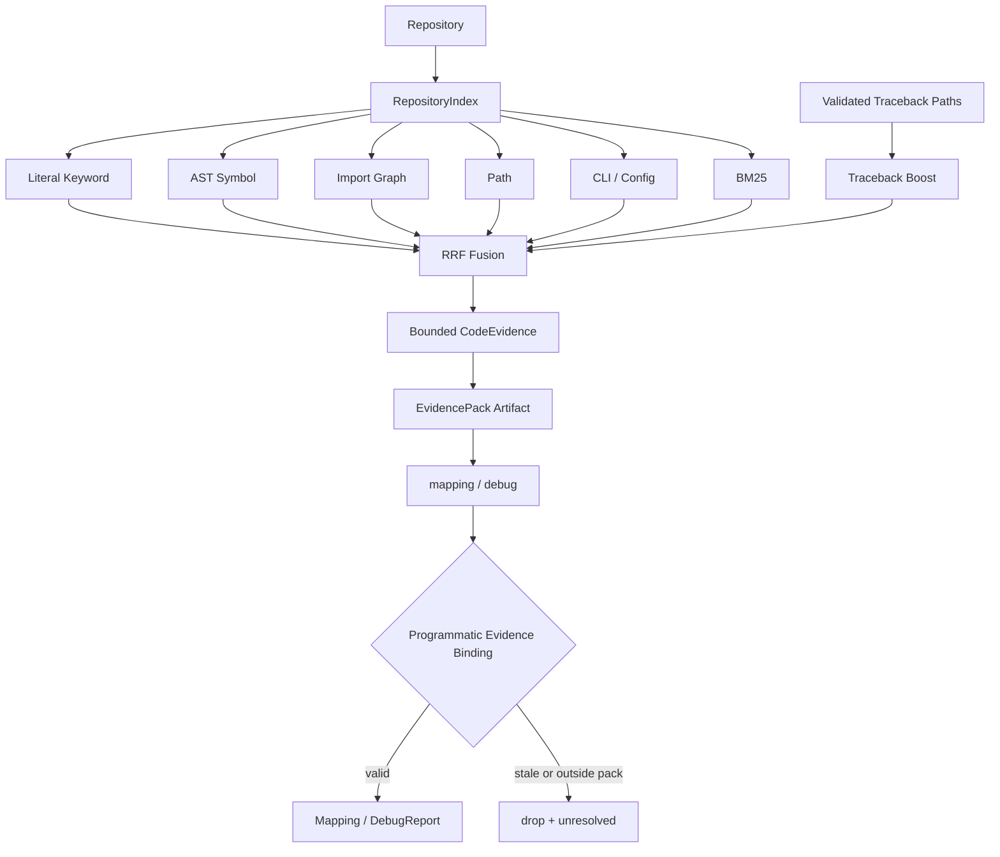

# 31. Phase 20：混合 Code Evidence 检索与可验证映射

> 本阶段建立在 Phase 17 的 Agent 回归评测、Phase 18 的章节感知论文理解和 Phase 19 的高精度论文结构之上。
>
> Phase 19 已经让论文侧的 section、parent 和 PaperEvidence 更可信。下一步应升级代码仓库侧的 Evidence：不再只执行几次 `rg`、按命中次数排序文件并固定读取文件前 160 行，而是建立确定性仓库索引，融合关键词、AST Symbol、Import Graph、路径、CLI/Config 和 BM25 多个检索通道。
>
> 本阶段不立即引入向量数据库。先用无网络、无 Provider、可重复的 Hybrid Retrieval v1 建立 Golden 基线；只有 Dense Retrieval 在 Golden Case 上稳定优于该基线，才允许增加 embedding、向量存储和 reranker。
>
> 本教程只给出实现步骤、完整代码、测试和验收方法。请按照顺序自行修改项目代码。

> **章节标识说明**
>
> - “需要新增”表示创建完整文件，代码块可直接作为文件内容。
> - “需要完整替换”表示替换指定文件或函数，不要只复制其中几行。
> - “需要局部修改”会给出明确锚点、修改前后上下文。
> - “原理、运行、调试或验收说明”不要求修改项目代码。
> - 本教程中的临时验证内容只允许放在项目内 `.codex_tmp/`，验证完成后删除。

---

## 一、当前检索链路的问题

> **本节类型：问题分析，不修改项目代码。**

当前代码检索链路是：

```text
MethodModule.name + possible_keywords
  -> 对每个 keyword 调用 rg
  -> 截取每个 keyword 前 N 条结果
  -> 按文件命中次数排序
  -> 选择前 5 个文件
  -> 固定读取每个文件 1～160 行
  -> 交给 mapping LLM
```

涉及：

```text
app/tools/search_tools.py
app/tools/code_tools.py
app/nodes/code_search_node.py
app/nodes/mapping_node.py
```

主要问题如下。

### 1.1 rg 缺失会直接抛 FileNotFoundError

当前直接执行：

```python
subprocess.run(["rg", ...])
```

如果环境没有安装 ripgrep，整个节点失败。项目之前已经遇到：

```text
FileNotFoundError: [Errno 2] No such file or directory: 'rg'
```

### 1.2 普通关键词被当作正则

模型模块名、配置参数和错误文本通常只是普通字符串。直接作为正则会产生：

- `[`、`(`、`+` 等字符改变语义；
- 非法正则返回非零状态；
- 关键词和代码符号的精确匹配变得不稳定。

默认行为应当是 literal search，只有调用者明确声明时才使用 regex。

### 1.3 rg 错误被静默当成“没有结果”

ripgrep 返回码含义：

```text
0：找到结果
1：正常，但没有找到结果
2 或其他：命令、参数、权限或正则错误
```

当前 `check=False` 后没有检查 return code，因此：

```text
搜索工具故障
```

会被误表示为：

```text
仓库中没有相关实现
```

这会直接污染 Agent 的 epistemic state。

### 1.4 只按命中次数排序

以下命中在当前排序中可能权重相同：

```text
README 中提到 PSTConv
modules/pst_convolutions.py 中定义 class PSTConv
models/sequence_classification.py 中 import PSTConv
```

但它们的证据强度明显不同。

### 1.5 固定读取文件前 160 行

如果真实 symbol 位于第 500 行，LLM 只会看到文件开头。正确做法应当是：

```text
检索命中行或 symbol 起止行
  -> 向前后扩展有限上下文
  -> 生成带精确行号的 CodeEvidence
```

### 1.6 mapping 没有程序级 Evidence 白名单

即使 prompt 要求模型只使用搜索结果，模型仍可能返回：

- Evidence Pack 之外的文件；
- 不存在的 symbol；
- 与文件不对应的 evidence；
- 已经因为仓库变化而过期的代码片段。

Prompt 约束不是安全边界。mapping 返回后必须由确定性代码重新绑定 Evidence。

---

## 二、本阶段目标

> **本节类型：目标说明，不修改项目代码。**

完成后系统应当能够：

1. `rg` 可用时使用 `rg --fixed-strings --json`；
2. `rg` 不存在时使用 Python literal fallback；
3. 区分“没有命中”和“搜索工具失败”；
4. 为 Python 文件建立 class、function、method、import 和 CLI 参数索引；
5. 为文本文件建立不保存全文的 BM25 term-frequency 索引；
6. 融合 keyword、symbol、import graph、path、CLI/config、BM25 通道；
7. debug 场景将经过仓库边界校验的 traceback 文件放在最高优先级；
8. 使用 RRF 进行可解释、确定性的通道融合；
9. 每条 CodeEvidence 保留文件、行号、symbol、hash、revision 和通道；
10. 文件内容或 Git revision 变化后，旧 Evidence 自动失效；
11. mapping 只能返回 Evidence Pack 中的文件和 evidence ID；
12. 将 repo index 和每个 Evidence Pack 写成 run-native Artifact；
13. 使用离线 Golden Case 比较关键文件排名和通道覆盖；
14. 整个离线检索过程不调用 LLM、不访问网络。

---

## 三、本阶段不做什么

> **本节类型：范围说明，不修改项目代码。**

本阶段明确不做：

- 不引入 FAISS、pgvector、Milvus 或 Elasticsearch；
- 不下载 embedding 模型；
- 不调用 Provider 生成向量；
- 不实现 Cross Encoder reranker；
- 不把整个仓库源码复制进 Artifact；
- 不让 LLM 决定最终可访问文件范围；
- 不因为语义相似就允许 file repair 修改新文件；
- 不替代 traceback 路径的确定性优先级；
- 不根据检索结果自动执行代码。

Dense Retrieval 的进入条件是：

```text
在固定 Golden Cases 上
  Dense/Hybrid 新方案的 MRR、Recall@K 或 required path rank
  稳定优于本阶段 BM25 + Symbol + Graph + RRF 基线
```

---

## 四、目标架构

> **本节类型：架构说明，不修改项目代码。**



Artifact 分层：

```text
runs/<run_id>/analysis/retrieval/repo_index.json
runs/<run_id>/analysis/retrieval/evidence_packs/<module>.json
runs/<run_id>/debug/debug_evidence_pack.json
```

State 只保存：

```text
repo_index_path
code_evidence_pack_paths
有限 top-k 的 code_evidence_packs
debug_evidence_pack
```

不要把所有仓库源码或完整 inverted index 塞进 LangGraph checkpoint。

---

## 五、涉及文件

> **本节类型：实施清单，不修改项目代码。**

需要新增：

```text
app/retrieval/__init__.py
app/retrieval/schemas.py
app/retrieval/indexer.py
app/retrieval/ranking.py
app/retrieval/service.py

tests/test_search_tools_v2.py
tests/test_retrieval_index.py
tests/test_hybrid_retrieval.py
tests/test_mapping_evidence_boundary.py
tests/test_retrieval_eval.py

app/evaluation/fixtures/retrieval_repo/modules/pst_convolutions.py
app/evaluation/fixtures/retrieval_repo/models/sequence_classification.py
app/evaluation/fixtures/retrieval_repo/datasets/msr.py
app/evaluation/fixtures/retrieval_repo/train_msr.py
app/evaluation/fixtures/retrieval_repo/notes/pstconv_overview.md

app/evaluation/cases/offline/retrieval_pstconv.json
app/evaluation/cases/offline/retrieval_training_config.json
```

需要修改：

```text
app/config.py
app/state.py
app/schemas.py
app/tools/search_tools.py
app/nodes/code_search_node.py
app/prompts/mapping_prompt.py
app/nodes/mapping_node.py
app/prompts/debug_prompt.py
app/nodes/log_debug_node.py
app/main.py

app/evaluation/schemas.py
app/evaluation/runners.py
app/evaluation/scorers.py
```

Graph 拓扑不需要增加节点：

```text
repo_scan -> code_search -> mapping
```

仍然有效。`code_search_node` 的内部实现从简单 `rg` 升级为 Evidence Pack builder。

---

## 六、先记录旧检索基线

> **本节类型：运行说明，不修改项目代码。**

先运行旧搜索：

```bash
python - <<'PY'
from app.tools.search_tools import search_keywords

repo = "/data/tianshaoqi24/PST-Convolution-main"
keywords = [
    "PSTConv",
    "spatio temporal convolution",
]

for item in search_keywords(repo, keywords):
    print(item)
PY
```

再记录关键目标：

| Query | 应优先出现 |
|---|---|
| `PSTConv point spatio temporal convolution` | `modules/pst_convolutions.py` |
| `PSTConv sequence classification` | `models/sequence_classification.py` |
| `MSRAction action recognition` | `models/sequence_classification.py` |
| `epochs batch size learning rate MSR` | `train-msr.py` |
| `MSRAction3D dataset` | `datasets/msr.py` |

当前旧实现可能：

- 因没有 `rg` 直接失败；
- 只返回直接字符串命中的文件；
- 无法通过 import graph 找到调用方；
- 无法精确切到 `class PSTConv`；
- 无法解释每个文件由哪些通道召回。

---

## 七、新增 retrieval schema

> **本节类型：需要新增项目代码。**
>
> **需要新增：** `app/retrieval/schemas.py`

完整文件：

```python
from __future__ import annotations

from typing import Literal

from pydantic import BaseModel, ConfigDict, Field


RetrievalChannel = Literal[
    "keyword",
    "symbol",
    "import_graph",
    "path",
    "cli_config",
    "bm25",
    "traceback",
]


class RetrievalModel(BaseModel):
    model_config = ConfigDict(extra="forbid")


class IndexedDocument(RetrievalModel):
    file_path: str
    file_sha256: str
    size_bytes: int = Field(ge=0)
    line_count: int = Field(ge=0)
    token_count: int = Field(ge=0)
    term_frequencies: dict[str, int] = Field(
        default_factory=dict
    )


class SymbolRecord(RetrievalModel):
    file_path: str
    name: str
    qualified_name: str
    kind: Literal[
        "class",
        "function",
        "async_function",
        "method",
        "async_method",
    ]
    start_line: int = Field(ge=1)
    end_line: int = Field(ge=1)


class ImportRecord(RetrievalModel):
    file_path: str
    imported_module: str
    imported_names: list[str] = Field(default_factory=list)
    line: int = Field(ge=1)


class CliOptionRecord(RetrievalModel):
    file_path: str
    flags: list[str] = Field(default_factory=list)
    dest: str | None = None
    default_repr: str | None = None
    help_text: str | None = None
    line: int = Field(ge=1)


class RepositoryIndex(RetrievalModel):
    index_version: str
    repo_root: str
    repo_revision: str | None = None
    repo_fingerprint: str
    documents: list[IndexedDocument] = Field(
        default_factory=list
    )
    symbols: list[SymbolRecord] = Field(
        default_factory=list
    )
    imports: list[ImportRecord] = Field(
        default_factory=list
    )
    cli_options: list[CliOptionRecord] = Field(
        default_factory=list
    )
    warnings: list[str] = Field(default_factory=list)


class ChannelHit(RetrievalModel):
    channel: RetrievalChannel
    file_path: str
    raw_score: float = Field(ge=0.0)
    anchor_line: int = Field(default=1, ge=1)
    anchor_end_line: int | None = Field(
        default=None,
        ge=1,
    )
    symbol: str | None = None


class RetrievalSignal(RetrievalModel):
    channel: RetrievalChannel
    rank: int = Field(ge=1)
    raw_score: float = Field(ge=0.0)
    anchor_line: int = Field(ge=1)
    anchor_end_line: int | None = Field(
        default=None,
        ge=1,
    )
    symbol: str | None = None


class FusedCandidate(RetrievalModel):
    file_path: str
    fused_score: float = Field(ge=0.0)
    signals: list[RetrievalSignal] = Field(
        default_factory=list
    )


class CodeEvidence(RetrievalModel):
    evidence_id: str
    repo_revision: str | None = None
    repo_fingerprint: str
    file_path: str
    file_sha256: str
    start_line: int = Field(ge=1)
    end_line: int = Field(ge=1)
    symbol: str | None = None
    retrieval_channels: list[RetrievalChannel] = Field(
        default_factory=list
    )
    retrieval_signals: list[RetrievalSignal] = Field(
        default_factory=list
    )
    fused_score: float = Field(ge=0.0)
    content_hash: str
    text: str


class EvidencePack(RetrievalModel):
    query: str
    keywords: list[str] = Field(default_factory=list)
    repo_revision: str | None = None
    repo_fingerprint: str
    items: list[CodeEvidence] = Field(default_factory=list)
```

设计要点：

- `RepositoryIndex` 不保存源码全文，只保存文件 hash、symbol 和 term frequency；
- `CodeEvidence.text` 只保存 top-k 的有限行号片段；
- `retrieval_signals` 让最终排名可解释；
- `repo_revision + file_sha256` 用于过期检测；
- `content_hash` 绑定当前编号代码片段；
- 所有模型 `extra="forbid"`，防止 Artifact 字段悄悄漂移。

---

## 八、新增 retrieval 包入口

> **本节类型：需要新增项目代码。**
>
> **需要新增：** `app/retrieval/__init__.py`

```python
from app.retrieval.indexer import (
    build_repository_index,
    load_repository_index,
)
from app.retrieval.schemas import (
    CodeEvidence,
    EvidencePack,
    RepositoryIndex,
)
from app.retrieval.service import (
    build_evidence_pack,
    validate_code_evidence,
)

__all__ = [
    "CodeEvidence",
    "EvidencePack",
    "RepositoryIndex",
    "build_evidence_pack",
    "build_repository_index",
    "load_repository_index",
    "validate_code_evidence",
]
```

---

## 九、完整替换可靠 literal search

> **本节类型：需要完整替换项目代码。**
>
> **需要完整替换：** `app/tools/search_tools.py`

```python
from __future__ import annotations

import json
import re
import shutil
import subprocess
from pathlib import Path

from app.tools.repo_tools import IGNORE_DIRS

_FALLBACK_SUFFIXES = {
    ".py",
    ".md",
    ".rst",
    ".txt",
    ".yaml",
    ".yml",
    ".json",
    ".toml",
    ".ini",
    ".cfg",
    ".sh",
}


class SearchToolError(RuntimeError):
    """搜索工具执行失败，而不是正常的零命中。"""


def _resolve_repo(repo_path: str) -> Path:
    root = Path(repo_path).expanduser().resolve()
    if not root.is_dir():
        raise FileNotFoundError(
            f"未找到代码仓库：{repo_path}"
        )
    return root


def _relative_path(root: Path, raw_path: str) -> str:
    path = Path(raw_path)
    resolved = (
        path.resolve()
        if path.is_absolute()
        else (root / path).resolve()
    )
    if resolved == root or root not in resolved.parents:
        raise SearchToolError(
            f"rg 返回了仓库边界外路径：{raw_path}"
        )
    return resolved.relative_to(root).as_posix()


def _parse_rg_json(
    *,
    root: Path,
    stdout: str,
    max_results: int,
) -> list[dict]:
    matches: list[dict] = []

    for raw_line in stdout.splitlines():
        if len(matches) >= max_results:
            break
        try:
            event = json.loads(raw_line)
        except json.JSONDecodeError as exc:
            raise SearchToolError(
                "无法解析 rg --json 输出"
            ) from exc

        if event.get("type") != "match":
            continue

        data = event.get("data") or {}
        path_data = data.get("path") or {}
        lines_data = data.get("lines") or {}
        raw_path = str(path_data.get("text") or "")
        line_number = int(data.get("line_number") or 0)
        if not raw_path or line_number < 1:
            continue

        matches.append(
            {
                "file_path": _relative_path(
                    root,
                    raw_path,
                ),
                "line": line_number,
                "text": str(
                    lines_data.get("text") or ""
                ).strip(),
            }
        )

    return matches


def _python_literal_search(
    *,
    root: Path,
    query: str,
    max_results: int,
    ignore_case: bool,
) -> list[dict]:
    """rg 不存在时的确定性 fallback。"""

    needle = query.casefold() if ignore_case else query
    matches: list[dict] = []

    for path in sorted(root.rglob("*")):
        if len(matches) >= max_results:
            break
        if (
            path.is_symlink()
            or not path.is_file()
            or path.suffix.casefold()
            not in _FALLBACK_SUFFIXES
            or any(
                part in IGNORE_DIRS
                or part == ".pytest_cache"
                for part in path.relative_to(root).parts
            )
        ):
            continue

        try:
            if path.stat().st_size > 2 * 1024 * 1024:
                continue
            lines = path.read_text(
                encoding="utf-8",
                errors="ignore",
            ).splitlines()
        except OSError as exc:
            raise SearchToolError(
                f"读取搜索文件失败：{path}"
            ) from exc

        for line_number, line in enumerate(
            lines,
            start=1,
        ):
            haystack = (
                line.casefold()
                if ignore_case
                else line
            )
            if needle not in haystack:
                continue
            matches.append(
                {
                    "file_path": (
                        path.relative_to(root).as_posix()
                    ),
                    "line": line_number,
                    "text": line.strip(),
                }
            )
            if len(matches) >= max_results:
                break

    return matches


def search_text(
    repo_path: str,
    query: str,
    max_results: int = 20,
    *,
    literal: bool = True,
    ignore_case: bool = True,
) -> list[dict]:
    """搜索文本，并区分零命中与工具错误。"""

    root = _resolve_repo(repo_path)
    value = query.strip()
    if not value or max_results <= 0:
        return []

    rg = shutil.which("rg")
    if rg is None:
        if not literal:
            raise SearchToolError(
                "regex 搜索要求安装 rg；"
                "Python fallback 只支持 literal"
            )
        return _python_literal_search(
            root=root,
            query=value,
            max_results=max_results,
            ignore_case=ignore_case,
        )

    args = [
        rg,
        "--json",
        "--line-number",
        "--color",
        "never",
    ]
    if literal:
        args.append("--fixed-strings")
    if ignore_case:
        args.append("--ignore-case")

    for ignored in sorted(
        {*IGNORE_DIRS, ".pytest_cache"}
    ):
        args.extend(
            ["--glob", f"!{ignored}/**"]
        )

    args.extend(["--", value, str(root)])

    try:
        result = subprocess.run(
            args,
            check=False,
            capture_output=True,
            text=True,
        )
    except OSError as exc:
        if literal:
            return _python_literal_search(
                root=root,
                query=value,
                max_results=max_results,
                ignore_case=ignore_case,
            )
        raise SearchToolError(
            f"无法启动 rg：{exc}"
        ) from exc

    if result.returncode == 1:
        return []
    if result.returncode != 0:
        message = result.stderr.strip() or (
            f"rg exited with {result.returncode}"
        )
        raise SearchToolError(message)

    return _parse_rg_json(
        root=root,
        stdout=result.stdout,
        max_results=max_results,
    )


def search_keywords(
    repo_path: str,
    keywords: list[str],
    max_per_keyword: int = 10,
) -> list[dict]:
    all_matches: list[dict] = []
    seen: set[tuple[str, int, str]] = set()

    for keyword in keywords:
        value = keyword.strip()
        if not value:
            continue
        for match in search_text(
            repo_path,
            value,
            max_results=max_per_keyword,
            literal=True,
        ):
            key = (
                match["file_path"],
                match["line"],
                match["text"],
            )
            if key in seen:
                continue
            seen.add(key)
            all_matches.append(
                {
                    **match,
                    "keyword": value,
                }
            )

    return all_matches
```

关键语义：

```text
returncode == 1 -> []
returncode != 0/1 -> SearchToolError
rg 不存在 + literal -> Python fallback
rg 不存在 + regex -> SearchToolError
```

---

## 十、建立确定性仓库索引

> **本节类型：需要新增项目代码。**
>
> **需要新增：** `app/retrieval/indexer.py`

完整文件：

```python
from __future__ import annotations

import ast
import hashlib
import json
import re
import subprocess
from collections import Counter
from pathlib import Path
from typing import Any

from app.retrieval.schemas import (
    CliOptionRecord,
    ImportRecord,
    IndexedDocument,
    RepositoryIndex,
    SymbolRecord,
)
from app.tools.repo_tools import IGNORE_DIRS

INDEXABLE_SUFFIXES = {
    ".py",
    ".md",
    ".rst",
    ".txt",
    ".yaml",
    ".yml",
    ".json",
    ".toml",
    ".ini",
    ".cfg",
    ".sh",
}

_RAW_TOKEN_RE = re.compile(
    r"[A-Za-z0-9_+.-]+"
)
_CAMEL_BOUNDARY_RE = re.compile(
    r"(?<=[a-z0-9])(?=[A-Z])"
)


def sha256_text(value: str) -> str:
    return hashlib.sha256(
        value.encode("utf-8")
    ).hexdigest()


def sha256_path(path: Path) -> str:
    digest = hashlib.sha256()
    with path.open("rb") as handle:
        for chunk in iter(
            lambda: handle.read(1024 * 1024),
            b"",
        ):
            digest.update(chunk)
    return digest.hexdigest()


def tokenize(value: str) -> list[str]:
    """
    同时保留完整 identifier 和 snake/camel 子词。

    PSTConv -> pstconv, pst, conv
    batch_size -> batch_size, batch, size
    """

    tokens: list[str] = []

    for raw in _RAW_TOKEN_RE.findall(value):
        whole = raw.casefold()
        if whole:
            tokens.append(whole)

        camel_parts = _CAMEL_BOUNDARY_RE.split(raw)
        for camel_part in camel_parts:
            for piece in re.split(
                r"[_+.-]+",
                camel_part,
            ):
                normalized = piece.casefold().strip()
                if normalized and normalized != whole:
                    tokens.append(normalized)

    return tokens


def repository_revision(root: Path) -> str | None:
    try:
        result = subprocess.run(
            [
                "git",
                "-C",
                str(root),
                "rev-parse",
                "HEAD",
            ],
            check=True,
            capture_output=True,
            text=True,
            timeout=3,
        )
    except (
        OSError,
        subprocess.SubprocessError,
    ):
        return None

    revision = result.stdout.strip()
    return revision or None


def _literal_value(node: ast.AST) -> Any:
    try:
        return ast.literal_eval(node)
    except (ValueError, TypeError):
        return None


class _PythonMetadataVisitor(ast.NodeVisitor):
    def __init__(self, file_path: str):
        self.file_path = file_path
        self.class_stack: list[str] = []
        self.symbols: list[SymbolRecord] = []
        self.imports: list[ImportRecord] = []
        self.cli_options: list[CliOptionRecord] = []

    def _record_function(
        self,
        node: ast.FunctionDef | ast.AsyncFunctionDef,
        *,
        is_async: bool,
    ) -> None:
        in_class = bool(self.class_stack)
        if is_async:
            kind = (
                "async_method"
                if in_class
                else "async_function"
            )
        else:
            kind = "method" if in_class else "function"

        qualified = ".".join(
            [*self.class_stack, node.name]
        )
        self.symbols.append(
            SymbolRecord(
                file_path=self.file_path,
                name=node.name,
                qualified_name=qualified,
                kind=kind,
                start_line=node.lineno,
                end_line=getattr(
                    node,
                    "end_lineno",
                    node.lineno,
                ),
            )
        )

    def visit_ClassDef(
        self,
        node: ast.ClassDef,
    ) -> None:
        qualified = ".".join(
            [*self.class_stack, node.name]
        )
        self.symbols.append(
            SymbolRecord(
                file_path=self.file_path,
                name=node.name,
                qualified_name=qualified,
                kind="class",
                start_line=node.lineno,
                end_line=getattr(
                    node,
                    "end_lineno",
                    node.lineno,
                ),
            )
        )
        self.class_stack.append(node.name)
        self.generic_visit(node)
        self.class_stack.pop()

    def visit_FunctionDef(
        self,
        node: ast.FunctionDef,
    ) -> None:
        self._record_function(
            node,
            is_async=False,
        )
        self.generic_visit(node)

    def visit_AsyncFunctionDef(
        self,
        node: ast.AsyncFunctionDef,
    ) -> None:
        self._record_function(
            node,
            is_async=True,
        )
        self.generic_visit(node)

    def visit_Import(
        self,
        node: ast.Import,
    ) -> None:
        for alias in node.names:
            self.imports.append(
                ImportRecord(
                    file_path=self.file_path,
                    imported_module=alias.name,
                    imported_names=[],
                    line=node.lineno,
                )
            )
        self.generic_visit(node)

    def visit_ImportFrom(
        self,
        node: ast.ImportFrom,
    ) -> None:
        self.imports.append(
            ImportRecord(
                file_path=self.file_path,
                imported_module=node.module or "",
                imported_names=[
                    alias.name
                    for alias in node.names
                ],
                line=node.lineno,
            )
        )
        self.generic_visit(node)

    def visit_Call(
        self,
        node: ast.Call,
    ) -> None:
        is_add_argument = (
            isinstance(node.func, ast.Attribute)
            and node.func.attr == "add_argument"
        )
        if is_add_argument:
            flags = [
                value
                for argument in node.args
                if isinstance(
                    (value := _literal_value(argument)),
                    str,
                )
            ]
            keywords = {
                item.arg: _literal_value(item.value)
                for item in node.keywords
                if item.arg
            }
            self.cli_options.append(
                CliOptionRecord(
                    file_path=self.file_path,
                    flags=flags,
                    dest=(
                        str(keywords["dest"])
                        if keywords.get("dest")
                        is not None
                        else None
                    ),
                    default_repr=(
                        repr(keywords["default"])
                        if "default" in keywords
                        else None
                    ),
                    help_text=(
                        str(keywords["help"])
                        if keywords.get("help")
                        is not None
                        else None
                    ),
                    line=node.lineno,
                )
            )
        self.generic_visit(node)


def _iter_indexable_files(
    root: Path,
) -> list[Path]:
    files: list[Path] = []
    for path in root.rglob("*"):
        if path.is_symlink() or not path.is_file():
            continue
        relative = path.relative_to(root)
        if any(
            part in IGNORE_DIRS
            or part == ".pytest_cache"
            for part in relative.parts
        ):
            continue
        if path.suffix.casefold() not in INDEXABLE_SUFFIXES:
            continue
        files.append(path)
    return sorted(
        files,
        key=lambda item: item.relative_to(root).as_posix(),
    )


def _repo_fingerprint(
    documents: list[IndexedDocument],
) -> str:
    payload = "\n".join(
        (
            f"{document.file_path}:"
            f"{document.file_sha256}"
        )
        for document in documents
    )
    return sha256_text(payload)


def build_repository_index(
    repo_path: str | Path,
    *,
    index_version: str,
    max_file_bytes: int = 1024 * 1024,
) -> RepositoryIndex:
    root = Path(repo_path).expanduser().resolve()
    if not root.is_dir():
        raise FileNotFoundError(
            f"未找到代码仓库：{root}"
        )

    documents: list[IndexedDocument] = []
    symbols: list[SymbolRecord] = []
    imports: list[ImportRecord] = []
    cli_options: list[CliOptionRecord] = []
    warnings: list[str] = []

    for path in _iter_indexable_files(root):
        relative = path.relative_to(root).as_posix()
        size_bytes = path.stat().st_size
        if size_bytes > max_file_bytes:
            warnings.append(
                f"SKIPPED_LARGE_FILE:{relative}:{size_bytes}"
            )
            continue

        source = path.read_text(
            encoding="utf-8",
            errors="ignore",
        )
        file_symbols: list[SymbolRecord] = []

        if path.suffix.casefold() == ".py":
            try:
                tree = ast.parse(
                    source,
                    filename=relative,
                )
            except SyntaxError as exc:
                warnings.append(
                    (
                        f"PYTHON_AST_FAILED:{relative}:"
                        f"{exc.lineno}:{exc.msg}"
                    )
                )
            else:
                visitor = _PythonMetadataVisitor(relative)
                visitor.visit(tree)
                file_symbols = visitor.symbols
                symbols.extend(visitor.symbols)
                imports.extend(visitor.imports)
                cli_options.extend(visitor.cli_options)

        document_tokens = [
            *tokenize(relative),
            *tokenize(source),
            *[
                token
                for symbol in file_symbols
                for token in tokenize(
                    symbol.qualified_name
                )
            ],
        ]
        frequencies = Counter(document_tokens)

        documents.append(
            IndexedDocument(
                file_path=relative,
                file_sha256=sha256_path(path),
                size_bytes=size_bytes,
                line_count=len(source.splitlines()),
                token_count=sum(frequencies.values()),
                term_frequencies=dict(frequencies),
            )
        )

    return RepositoryIndex(
        index_version=index_version,
        repo_root=str(root),
        repo_revision=repository_revision(root),
        repo_fingerprint=_repo_fingerprint(documents),
        documents=documents,
        symbols=sorted(
            symbols,
            key=lambda item: (
                item.file_path,
                item.start_line,
                item.qualified_name,
            ),
        ),
        imports=sorted(
            imports,
            key=lambda item: (
                item.file_path,
                item.line,
                item.imported_module,
            ),
        ),
        cli_options=sorted(
            cli_options,
            key=lambda item: (
                item.file_path,
                item.line,
            ),
        ),
        warnings=warnings,
    )


def load_repository_index(
    path: str | Path,
) -> RepositoryIndex:
    payload = json.loads(
        Path(path).read_text(encoding="utf-8")
    )
    return RepositoryIndex.model_validate(payload)
```

索引 Artifact 不保存源码全文，因此仓库较大时仍然需要：

- 限制文件后缀；
- 限制单文件大小；
- 忽略缓存、checkpoint、wandb 和 Git；
- 对 AST 失败记录 warning，而不是终止全部索引；
- top-k Evidence 再按需读取有限源码片段。

---

## 十一、实现多通道排名与 RRF

> **本节类型：需要新增项目代码。**
>
> **需要新增：** `app/retrieval/ranking.py`

完整文件：

```python
from __future__ import annotations

import math
import re
from collections import defaultdict

from app.retrieval.indexer import tokenize
from app.retrieval.schemas import (
    ChannelHit,
    FusedCandidate,
    RepositoryIndex,
    RetrievalChannel,
    RetrievalSignal,
)
from app.tools.search_tools import search_keywords

DEFAULT_CHANNEL_WEIGHTS: dict[
    RetrievalChannel,
    float,
] = {
    "traceback": 3.0,
    "symbol": 2.4,
    "keyword": 2.0,
    "import_graph": 1.7,
    "cli_config": 1.6,
    "path": 1.2,
    "bm25": 1.0,
}

_ANCHOR_PRIORITY: dict[RetrievalChannel, int] = {
    "traceback": 7,
    "symbol": 6,
    "keyword": 5,
    "cli_config": 4,
    "import_graph": 3,
    "path": 2,
    "bm25": 1,
}


def _identifier_key(value: str) -> str:
    return re.sub(
        r"[^a-z0-9]+",
        "",
        value.casefold(),
    )


def _query_values(
    query: str,
    keywords: list[str],
) -> list[str]:
    values: list[str] = []
    for value in [*keywords, query]:
        normalized = value.strip()
        if (
            normalized
            and len(normalized) <= 160
            and normalized not in values
        ):
            values.append(normalized)
    return values


def _best_per_file(
    hits: list[ChannelHit],
) -> list[ChannelHit]:
    best: dict[str, ChannelHit] = {}
    for hit in hits:
        previous = best.get(hit.file_path)
        if previous is None or (
            hit.raw_score,
            -hit.anchor_line,
        ) > (
            previous.raw_score,
            -previous.anchor_line,
        ):
            best[hit.file_path] = hit

    return sorted(
        best.values(),
        key=lambda item: (
            -item.raw_score,
            item.file_path,
            item.anchor_line,
        ),
    )


def rank_keyword(
    index: RepositoryIndex,
    *,
    query: str,
    keywords: list[str],
) -> list[ChannelHit]:
    values = _query_values(query, keywords)
    if not values:
        return []

    known_paths = {
        document.file_path
        for document in index.documents
    }
    matches = search_keywords(
        index.repo_root,
        values,
        max_per_keyword=30,
    )
    hits = []

    for match in matches:
        file_path = str(match["file_path"])
        if file_path not in known_paths:
            continue
        keyword = str(match.get("keyword") or "")
        # 更长的 literal 通常比单字符命中更有区分度。
        score = 1.0 + min(len(keyword), 80) / 80.0
        hits.append(
            ChannelHit(
                channel="keyword",
                file_path=file_path,
                raw_score=score,
                anchor_line=int(match["line"]),
            )
        )

    return _best_per_file(hits)


def rank_symbol(
    index: RepositoryIndex,
    *,
    query: str,
    keywords: list[str],
) -> list[ChannelHit]:
    values = _query_values(query, keywords)
    value_keys = {
        _identifier_key(value)
        for value in values
        if _identifier_key(value)
    }
    query_tokens = set(
        tokenize(" ".join(values))
    )
    hits: list[ChannelHit] = []

    for symbol in index.symbols:
        symbol_key = _identifier_key(symbol.name)
        qualified_key = _identifier_key(
            symbol.qualified_name
        )
        symbol_tokens = set(
            tokenize(symbol.qualified_name)
        )

        exact = any(
            key in {symbol_key, qualified_key}
            for key in value_keys
        )
        contains = any(
            key in symbol_key
            or symbol_key in key
            for key in value_keys
        )
        overlap = len(query_tokens & symbol_tokens)

        if exact:
            score = 4.0
        elif contains and symbol_key:
            score = 2.5
        elif overlap:
            score = 1.0 + overlap
        else:
            continue

        hits.append(
            ChannelHit(
                channel="symbol",
                file_path=symbol.file_path,
                raw_score=score,
                anchor_line=symbol.start_line,
                anchor_end_line=symbol.end_line,
                symbol=symbol.qualified_name,
            )
        )

    return _best_per_file(hits)


def _module_name_from_path(file_path: str) -> str:
    value = file_path
    if value.endswith(".py"):
        value = value[:-3]
    return value.replace("/", ".")


def rank_import_graph(
    index: RepositoryIndex,
    *,
    symbol_hits: list[ChannelHit],
    query: str,
    keywords: list[str],
) -> list[ChannelHit]:
    target_modules = {
        _module_name_from_path(hit.file_path)
        for hit in symbol_hits
    }
    target_names = {
        _identifier_key(hit.symbol or "")
        for hit in symbol_hits
        if hit.symbol
    }
    target_names.update(
        _identifier_key(value)
        for value in _query_values(query, keywords)
    )
    target_names.discard("")

    hits: list[ChannelHit] = []

    for record in index.imports:
        module_match = any(
            (
                record.imported_module == module
                or module.endswith(
                    f".{record.imported_module}"
                )
                or record.imported_module.endswith(
                    f".{module}"
                )
            )
            for module in target_modules
            if record.imported_module
        )
        imported_name_keys = {
            _identifier_key(name)
            for name in record.imported_names
        }
        name_match = bool(
            imported_name_keys & target_names
        )

        if not module_match and not name_match:
            continue

        hits.append(
            ChannelHit(
                channel="import_graph",
                file_path=record.file_path,
                raw_score=(
                    2.0
                    if module_match and name_match
                    else 1.0
                ),
                anchor_line=record.line,
            )
        )

    return _best_per_file(hits)


def rank_path(
    index: RepositoryIndex,
    *,
    query: str,
    keywords: list[str],
) -> list[ChannelHit]:
    query_tokens = set(
        tokenize(
            " ".join(
                _query_values(query, keywords)
            )
        )
    )
    hits: list[ChannelHit] = []

    for document in index.documents:
        path_tokens = set(
            tokenize(document.file_path)
        )
        overlap = query_tokens & path_tokens
        if not overlap:
            continue
        hits.append(
            ChannelHit(
                channel="path",
                file_path=document.file_path,
                raw_score=float(len(overlap)),
                anchor_line=1,
            )
        )

    return _best_per_file(hits)


def rank_cli_config(
    index: RepositoryIndex,
    *,
    query: str,
    keywords: list[str],
) -> list[ChannelHit]:
    query_tokens = set(
        tokenize(
            " ".join(
                _query_values(query, keywords)
            )
        )
    )
    hits: list[ChannelHit] = []

    for option in index.cli_options:
        option_text = " ".join(
            [
                *option.flags,
                option.dest or "",
                option.default_repr or "",
                option.help_text or "",
            ]
        )
        option_tokens = set(tokenize(option_text))
        overlap = query_tokens & option_tokens
        if not overlap:
            continue
        hits.append(
            ChannelHit(
                channel="cli_config",
                file_path=option.file_path,
                raw_score=(
                    1.0 + float(len(overlap))
                ),
                anchor_line=option.line,
            )
        )

    return _best_per_file(hits)


def rank_bm25(
    index: RepositoryIndex,
    *,
    query: str,
    keywords: list[str],
    k1: float = 1.5,
    b: float = 0.75,
) -> list[ChannelHit]:
    query_terms = list(
        dict.fromkeys(
            tokenize(
                " ".join(
                    _query_values(query, keywords)
                )
            )
        )
    )
    documents = index.documents
    if not query_terms or not documents:
        return []

    document_count = len(documents)
    average_length = (
        sum(
            document.token_count
            for document in documents
        )
        / document_count
    ) or 1.0

    document_frequency = {
        term: sum(
            term in document.term_frequencies
            for document in documents
        )
        for term in query_terms
    }
    hits: list[ChannelHit] = []

    for document in documents:
        score = 0.0
        length = max(document.token_count, 1)

        for term in query_terms:
            frequency = document.term_frequencies.get(
                term,
                0,
            )
            if frequency == 0:
                continue

            df = document_frequency[term]
            inverse_document_frequency = math.log(
                1.0
                + (
                    document_count - df + 0.5
                )
                / (df + 0.5)
            )
            denominator = frequency + k1 * (
                1.0
                - b
                + b * length / average_length
            )
            score += (
                inverse_document_frequency
                * frequency
                * (k1 + 1.0)
                / denominator
            )

        if score <= 0:
            continue
        hits.append(
            ChannelHit(
                channel="bm25",
                file_path=document.file_path,
                raw_score=score,
                anchor_line=1,
            )
        )

    return _best_per_file(hits)


def rank_traceback_paths(
    index: RepositoryIndex,
    *,
    preferred_paths: list[str],
) -> list[ChannelHit]:
    documents = {
        document.file_path
        for document in index.documents
    }
    hits: list[ChannelHit] = []

    for position, file_path in enumerate(
        preferred_paths
    ):
        if file_path not in documents:
            continue
        hits.append(
            ChannelHit(
                channel="traceback",
                file_path=file_path,
                raw_score=max(
                    1.0,
                    10.0 - position,
                ),
                anchor_line=1,
            )
        )

    return _best_per_file(hits)


def build_channel_rankings(
    index: RepositoryIndex,
    *,
    query: str,
    keywords: list[str],
    preferred_paths: list[str] | None = None,
) -> dict[RetrievalChannel, list[ChannelHit]]:
    symbol_hits = rank_symbol(
        index,
        query=query,
        keywords=keywords,
    )
    return {
        "traceback": rank_traceback_paths(
            index,
            preferred_paths=preferred_paths or [],
        ),
        "symbol": symbol_hits,
        "keyword": rank_keyword(
            index,
            query=query,
            keywords=keywords,
        ),
        "import_graph": rank_import_graph(
            index,
            symbol_hits=symbol_hits,
            query=query,
            keywords=keywords,
        ),
        "cli_config": rank_cli_config(
            index,
            query=query,
            keywords=keywords,
        ),
        "path": rank_path(
            index,
            query=query,
            keywords=keywords,
        ),
        "bm25": rank_bm25(
            index,
            query=query,
            keywords=keywords,
        ),
    }


def fuse_rankings(
    rankings: dict[
        RetrievalChannel,
        list[ChannelHit],
    ],
    *,
    rrf_k: int = 60,
    weights: dict[
        RetrievalChannel,
        float,
    ] | None = None,
) -> list[FusedCandidate]:
    if rrf_k < 1:
        raise ValueError("rrf_k 必须大于 0")

    active_weights = {
        **DEFAULT_CHANNEL_WEIGHTS,
        **(weights or {}),
    }
    scores: dict[str, float] = defaultdict(float)
    signals: dict[
        str,
        list[RetrievalSignal],
    ] = defaultdict(list)

    for channel, hits in rankings.items():
        for rank, hit in enumerate(hits, start=1):
            scores[hit.file_path] += (
                active_weights[channel]
                / (rrf_k + rank)
            )
            signals[hit.file_path].append(
                RetrievalSignal(
                    channel=channel,
                    rank=rank,
                    raw_score=hit.raw_score,
                    anchor_line=hit.anchor_line,
                    anchor_end_line=(
                        hit.anchor_end_line
                    ),
                    symbol=hit.symbol,
                )
            )

    candidates = [
        FusedCandidate(
            file_path=file_path,
            fused_score=score,
            signals=sorted(
                signals[file_path],
                key=lambda item: (
                    -_ANCHOR_PRIORITY[
                        item.channel
                    ],
                    item.rank,
                ),
            ),
        )
        for file_path, score in scores.items()
    ]
    return sorted(
        candidates,
        key=lambda item: (
            -item.fused_score,
            item.file_path,
        ),
    )
```

RRF 使用排名而不是直接相加原始分数，因为各通道的分数尺度不同：

```text
AST exact symbol score
BM25 score
路径 token overlap
CLI overlap
```

不能直接比较。RRF 公式：

```text
score(file) = Σ channel_weight / (rrf_k + rank_in_channel)
```

---

## 十二、构建有限 CodeEvidence

> **本节类型：需要新增项目代码。**
>
> **需要新增：** `app/retrieval/service.py`

完整文件：

```python
from __future__ import annotations

import hashlib
from pathlib import Path

from app.retrieval.indexer import (
    build_repository_index,
    repository_revision,
    sha256_path,
)
from app.retrieval.ranking import (
    build_channel_rankings,
    fuse_rankings,
)
from app.retrieval.schemas import (
    CodeEvidence,
    EvidencePack,
    FusedCandidate,
    RepositoryIndex,
    RetrievalSignal,
)
from app.tools.code_tools import read_file_slice


def _sha256(value: str) -> str:
    return hashlib.sha256(
        value.encode("utf-8")
    ).hexdigest()


def _safe_file(
    root: Path,
    relative_path: str,
) -> Path:
    candidate = (root / relative_path).resolve()
    if (
        candidate == root
        or root not in candidate.parents
        or not candidate.is_file()
    ):
        raise ValueError(
            f"Evidence 文件越界或不存在：{relative_path}"
        )
    return candidate


def _anchor_signal(
    candidate: FusedCandidate,
) -> RetrievalSignal:
    if not candidate.signals:
        raise ValueError(
            "FusedCandidate 缺少 retrieval signal"
        )
    # ranking.py 已按确定性 anchor priority 排序。
    return candidate.signals[0]


def _line_window(
    *,
    candidate: FusedCandidate,
    line_count: int,
    context_lines: int,
    max_span_lines: int,
) -> tuple[int, int, str | None]:
    signal = _anchor_signal(candidate)
    start = max(
        1,
        signal.anchor_line - context_lines,
    )
    anchor_end = (
        signal.anchor_end_line
        or signal.anchor_line
    )
    end = min(
        line_count,
        anchor_end + context_lines,
    )

    if end - start + 1 > max_span_lines:
        end = min(
            line_count,
            start + max_span_lines - 1,
        )

    return start, max(start, end), signal.symbol


def _evidence_id(
    *,
    repo_fingerprint: str,
    file_path: str,
    start_line: int,
    end_line: int,
    content_hash: str,
) -> str:
    payload = "|".join(
        [
            repo_fingerprint,
            file_path,
            str(start_line),
            str(end_line),
            content_hash,
        ]
    )
    return f"code-{_sha256(payload)[:20]}"


def build_evidence_pack(
    *,
    repo_path: str | Path,
    query: str,
    keywords: list[str],
    index: RepositoryIndex | None = None,
    index_version: str = "phase20-v1",
    max_file_bytes: int = 1024 * 1024,
    top_k: int = 8,
    context_lines: int = 20,
    max_span_lines: int = 120,
    rrf_k: int = 60,
    preferred_paths: list[str] | None = None,
) -> tuple[RepositoryIndex, EvidencePack]:
    root = Path(repo_path).expanduser().resolve()
    active_index = index or build_repository_index(
        root,
        index_version=index_version,
        max_file_bytes=max_file_bytes,
    )
    if Path(active_index.repo_root).resolve() != root:
        raise ValueError(
            "RepositoryIndex 与 repo_path 不一致"
        )

    normalized_keywords = list(
        dict.fromkeys(
            value.strip()
            for value in keywords
            if value.strip()
        )
    )
    rankings = build_channel_rankings(
        active_index,
        query=query,
        keywords=normalized_keywords,
        preferred_paths=preferred_paths,
    )
    fused = fuse_rankings(
        rankings,
        rrf_k=rrf_k,
    )
    documents = {
        document.file_path: document
        for document in active_index.documents
    }
    evidence_items: list[CodeEvidence] = []

    for candidate in fused[: max(top_k, 0)]:
        document = documents.get(candidate.file_path)
        if document is None:
            continue
        path = _safe_file(root, candidate.file_path)

        # 索引后文件发生变化时，不允许继续产生旧 Evidence。
        current_file_sha256 = sha256_path(path)
        if current_file_sha256 != document.file_sha256:
            continue

        start_line, end_line, symbol = _line_window(
            candidate=candidate,
            line_count=document.line_count,
            context_lines=context_lines,
            max_span_lines=max_span_lines,
        )
        text = read_file_slice(
            str(path),
            start_line,
            end_line,
        )
        content_hash = _sha256(text)
        channels = list(
            dict.fromkeys(
                signal.channel
                for signal in candidate.signals
            )
        )

        evidence_items.append(
            CodeEvidence(
                evidence_id=_evidence_id(
                    repo_fingerprint=(
                        active_index.repo_fingerprint
                    ),
                    file_path=candidate.file_path,
                    start_line=start_line,
                    end_line=end_line,
                    content_hash=content_hash,
                ),
                repo_revision=(
                    active_index.repo_revision
                ),
                repo_fingerprint=(
                    active_index.repo_fingerprint
                ),
                file_path=candidate.file_path,
                file_sha256=current_file_sha256,
                start_line=start_line,
                end_line=end_line,
                symbol=symbol,
                retrieval_channels=channels,
                retrieval_signals=(
                    candidate.signals
                ),
                fused_score=candidate.fused_score,
                content_hash=content_hash,
                text=text,
            )
        )

    return active_index, EvidencePack(
        query=query,
        keywords=normalized_keywords,
        repo_revision=active_index.repo_revision,
        repo_fingerprint=(
            active_index.repo_fingerprint
        ),
        items=evidence_items,
    )


def validate_code_evidence(
    *,
    repo_path: str | Path,
    evidence: CodeEvidence,
) -> bool:
    root = Path(repo_path).expanduser().resolve()
    try:
        path = _safe_file(root, evidence.file_path)
    except ValueError:
        return False

    if sha256_path(path) != evidence.file_sha256:
        return False

    current_revision = repository_revision(root)
    if (
        evidence.repo_revision is not None
        and current_revision != evidence.repo_revision
    ):
        return False

    text = read_file_slice(
        str(path),
        evidence.start_line,
        evidence.end_line,
    )
    return _sha256(text) == evidence.content_hash
```

过期语义：

```text
Evidence 文件内容变化 -> file_sha256 或 content_hash 不匹配
Git revision 变化      -> repo_revision 不匹配
路径被删除或越界       -> false
```

mapping 和 debug 在使用 pack 前仍要调用 `validate_code_evidence()`。Artifact 有 hash 不代表仓库源码仍然没有变化。

---

## 十三、增加检索配置

> **本节类型：需要修改项目代码。**
>
> **需要修改：** `app/config.py`

在论文 parser 配置之后、`settings = Settings()` 之前增加：

```python
    # RepositoryIndex 结构发生变化时更新。
    retrieval_index_version: str = os.getenv(
        "RETRIEVAL_INDEX_VERSION",
        "phase20-v1",
    )

    retrieval_max_file_bytes: int = int(
        os.getenv(
            "RETRIEVAL_MAX_FILE_BYTES",
            str(1024 * 1024),
        )
    )

    retrieval_top_k: int = int(
        os.getenv("RETRIEVAL_TOP_K", "8")
    )

    retrieval_context_lines: int = int(
        os.getenv(
            "RETRIEVAL_CONTEXT_LINES",
            "20",
        )
    )

    retrieval_max_span_lines: int = int(
        os.getenv(
            "RETRIEVAL_MAX_SPAN_LINES",
            "120",
        )
    )

    retrieval_rrf_k: int = int(
        os.getenv("RETRIEVAL_RRF_K", "60")
    )
```

不要在第一版把 channel weights 全部暴露成环境变量。权重先在 `ranking.py` 中版本化并由 Golden Case 约束，避免部署环境中的隐式配置让排名不可复现。

---

## 十四、扩展 Graph state

> **本节类型：需要修改项目代码。**
>
> **需要修改：** `app/state.py`

在现有：

```python
code_search_results: dict[str, Any]
```

之后增加：

```python
    # RepositoryIndex 本体写 Artifact，state 只保存路径。
    repo_index_path: Optional[str]

    # module_name -> EvidencePack Artifact 绝对路径。
    code_evidence_pack_paths: dict[str, str]

    # module_name -> 有限 top-k pack，供紧邻的 mapping 节点使用。
    code_evidence_packs: dict[str, dict[str, Any]]

    # log_debug 使用的 traceback-boosted Evidence Pack。
    debug_evidence_pack: Optional[dict[str, Any]]
    debug_evidence_pack_path: Optional[str]
```

这里保留 `code_search_results` 是为了兼容旧报告和旧测试。Phase 20 的可信输入是 `code_evidence_packs`，旧字段只作为迁移层。

---

## 十五、完整替换 code_search_node

> **本节类型：需要完整替换项目代码。**
>
> **需要完整替换：** `app/nodes/code_search_node.py`

```python
from __future__ import annotations

import re

from app.config import settings
from app.retrieval import (
    build_evidence_pack,
    build_repository_index,
)
from app.tools.artifact_tools import (
    artifact_state_update,
    write_json_artifact,
)
from app.tools.error_tools import stage_error_result
from app.tools.search_tools import SearchToolError


def _slug(value: str) -> str:
    slug = re.sub(
        r"[^a-z0-9]+",
        "-",
        value.casefold(),
    ).strip("-")
    return (slug or "module")[:60]


def _legacy_search_result(pack: dict) -> dict:
    """保持旧 mapping/report fixture 可读取。"""

    items = list(pack.get("items") or [])
    return {
        "keywords": list(pack.get("keywords") or []),
        "matches": [
            {
                "file_path": item["file_path"],
                "line": item["start_line"],
                "text": (
                    item["text"].splitlines()[0]
                    if item.get("text")
                    else ""
                ),
                "keyword": "hybrid",
            }
            for item in items
        ],
        "candidate_files": [
            item["file_path"]
            for item in items
        ],
        "code_slices": [
            {
                "file_path": item["file_path"],
                "content": item["text"],
            }
            for item in items
        ],
    }


def code_search_node(state: dict) -> dict:
    repo_path = state.get("repo_path")
    modules = list(
        state.get("method_modules") or []
    )
    if not repo_path:
        return stage_error_result(
            state=state,
            stage="code_search",
            code="REPO_PATH_REQUIRED",
            category="user",
            message="代码检索必须提供 repo_path",
            extra_update={
                "code_search_results": {},
                "code_evidence_packs": {},
            },
        )
    if not modules:
        return stage_error_result(
            state=state,
            stage="code_search",
            code="METHOD_MODULES_REQUIRED",
            category="agent",
            message="代码检索需要 method_modules",
            extra_update={
                "code_search_results": {},
                "code_evidence_packs": {},
            },
        )

    try:
        index = build_repository_index(
            repo_path,
            index_version=(
                settings.retrieval_index_version
            ),
            max_file_bytes=(
                settings.retrieval_max_file_bytes
            ),
        )
    except (FileNotFoundError, OSError) as exc:
        return stage_error_result(
            state=state,
            stage="code_search",
            code="REPO_INDEX_FAILED",
            category="environment",
            message=str(exc),
            extra_update={
                "code_search_results": {},
                "code_evidence_packs": {},
            },
        )

    index_path, index_record = write_json_artifact(
        state=state,
        relative_path=(
            "analysis/retrieval/repo_index.json"
        ),
        payload=index.model_dump(mode="json"),
        producer_node="code_search",
    )

    packs: dict[str, dict] = {}
    pack_paths: dict[str, str] = {}
    legacy_results: dict[str, dict] = {}
    records = [index_record]

    for position, module in enumerate(modules):
        module_name = str(
            module.get("name")
            or f"unnamed_module_{position}"
        )
        description = str(
            module.get("description") or ""
        )
        keywords = [
            module_name,
            *[
                str(value)
                for value in (
                    module.get(
                        "possible_keywords"
                    )
                    or []
                )
            ],
        ]
        query = "\n".join(
            value
            for value in [
                module_name,
                description,
            ]
            if value.strip()
        )

        try:
            _, pack = build_evidence_pack(
                repo_path=repo_path,
                query=query,
                keywords=keywords,
                index=index,
                index_version=(
                    settings.retrieval_index_version
                ),
                max_file_bytes=(
                    settings.retrieval_max_file_bytes
                ),
                top_k=settings.retrieval_top_k,
                context_lines=(
                    settings.retrieval_context_lines
                ),
                max_span_lines=(
                    settings.retrieval_max_span_lines
                ),
                rrf_k=settings.retrieval_rrf_k,
            )
        except (
            SearchToolError,
            OSError,
            ValueError,
        ) as exc:
            return stage_error_result(
                state=state,
                stage="code_search",
                code="HYBRID_RETRIEVAL_FAILED",
                category="environment",
                message=(
                    f"{module_name}: {exc}"
                ),
                extra_update={
                    "code_search_results": (
                        legacy_results
                    ),
                    "code_evidence_packs": packs,
                },
            )

        pack_payload = pack.model_dump(mode="json")
        relative_path = (
            "analysis/retrieval/evidence_packs/"
            f"{position:02d}_{_slug(module_name)}.json"
        )
        pack_path, pack_record = write_json_artifact(
            state=state,
            relative_path=relative_path,
            payload=pack_payload,
            producer_node="code_search",
        )
        packs[module_name] = pack_payload
        pack_paths[module_name] = str(pack_path)
        legacy_results[module_name] = (
            _legacy_search_result(pack_payload)
        )
        records.append(pack_record)

    return {
        "repo_index_path": str(index_path),
        "code_evidence_pack_paths": pack_paths,
        "code_evidence_packs": packs,
        "code_search_results": legacy_results,
        **artifact_state_update(state, records),
    }
```

这个节点仍然只执行确定性工作，不调用 Provider。

---

## 十六、让映射结果显式引用 Code Evidence

> **本节类型：需要修改项目代码。**
>
> **需要修改：** `app/schemas.py`

Phase 18 已经给公共 `Evidence` 增加了论文 provenance。本阶段继续追加代码 provenance，并保持所有字段都有默认值，避免旧 Artifact 无法加载。

找到 `Evidence`，在 `content_hash` 后增加：

```python
class Evidence(BaseModel):
    source_type: Literal["paper", "code", "readme", "config", "log"]
    source_path: str
    location: str | None = None
    quote_or_summary: str
    confidence: Confidence = "medium"

    # Phase 18：论文 Evidence provenance。
    evidence_id: str | None = None
    document_id: str | None = None
    section_id: str | None = None
    page_start: int | None = None
    page_end: int | None = None
    block_ids: list[str] = Field(default_factory=list)
    content_hash: str | None = None

    # Phase 20：代码 Evidence provenance。
    # 这些字段全部保留默认值，以兼容 Phase 20 之前的 JSON。
    repo_revision: str | None = None
    repo_fingerprint: str | None = None
    file_sha256: str | None = None
    start_line: int | None = Field(default=None, ge=1)
    end_line: int | None = Field(default=None, ge=1)
    retrieval_channels: list[str] = Field(default_factory=list)
    retrieval_score: float | None = Field(default=None, ge=0.0)
```

然后给 `CodeCandidate` 增加 `evidence_ids`：

```python
class CodeCandidate(BaseModel):
    file_path: str
    symbols: list[str] = Field(default_factory=list)
    reason: str

    # 模型只能引用 Evidence Pack 中已有的 ID。
    # mapping_node 会再次验证，不会直接信任模型返回。
    evidence_ids: list[str] = Field(default_factory=list)

    # evidence 最终由程序根据 evidence_ids 重建，
    # 不直接接受模型编造的 quote、hash 或行号。
    evidence: list[Evidence] = Field(default_factory=list)
    confidence: Confidence = "medium"
```

这里有两层对象：

```text
CodeEvidence
    检索层的不可伪造事实，保存真实代码、hash、行号和检索通道

Evidence
    业务输出中的统一引用，可同时表达 paper/code/readme/log
```

不要让模型直接负责把 `CodeEvidence` 转成 `Evidence`。模型只选 `evidence_ids`，转换工作由确定性 Python 完成。

---

## 十七、完整替换 mapping prompt

> **本节类型：需要完整替换项目代码。**
>
> **需要替换：** `app/prompts/mapping_prompt.py`

完整文件如下：

```python
MAPPING_PROMPT = """
你是论文方法模块与代码实现的映射助手。

你的输入只有：
1. 一个论文方法模块；
2. 一个由确定性检索器生成的 Evidence Pack。

你必须只根据 Evidence Pack 做判断。不得使用输入之外的文件、符号、
行号、代码内容或仓库知识。

强约束：
1. 只输出一个 JSON 对象。
2. 不要输出 Markdown 代码块或解释性文字。
3. 顶层只能包含：
   - module_name
   - candidates
   - unresolved_questions
4. module_name 必须与输入模块的 name 完全一致。
5. candidates 必须是对象列表；证据不足时返回空列表。
6. 每个 candidate 只能包含：
   - file_path
   - symbols
   - reason
   - evidence_ids
   - evidence
   - confidence
7. file_path 必须来自 Evidence Pack items[].file_path。
8. symbols 只能来自对应 Evidence item 的 symbol；没有 symbol 时返回 []。
9. evidence_ids 必须来自 Evidence Pack items[].evidence_id。
10. evidence 固定返回 []。真实 Evidence 将由程序根据 evidence_ids 重建。
11. confidence 只能是 "low"、"medium" 或 "high"。
12. 只有多种检索通道共同支持，且代码片段与论文语义明确一致时，
    才能返回 "high"。
13. 只有文件名相似或单个普通关键词命中时，confidence 最多为 "medium"。
14. 不确定点必须放进 unresolved_questions，不得编造结论。

输出结构：
{{
  "module_name": "PST convolution",
  "candidates": [
    {{
      "file_path": "modules/pst_convolutions.py",
      "symbols": ["PSTConv"],
      "reason": "该片段定义 PSTConv，并包含与时空邻域聚合一致的前向计算。",
      "evidence_ids": ["code-0123456789abcdef0123"],
      "evidence": [],
      "confidence": "high"
    }}
  ],
  "unresolved_questions": []
}}

论文方法模块：
{module}

唯一允许使用的 Evidence Pack：
{evidence_pack}
"""
```

因为这里使用 `MAPPING_PROMPT.format(...)`，示例 JSON 的 `{` 和 `}` 必须写成 `{{` 和 `}}`。占位符 `{module}` 与 `{evidence_pack}` 保留单层大括号。

本阶段不再把旧 `search_results` 和 `code_slices` 分别塞进 prompt。否则模型可能把迁移兼容字段误认为另一份可信证据。

---

## 十八、完整替换 mapping_node 并增加程序级证据边界

> **本节类型：需要完整替换项目代码。**
>
> **需要替换：** `app/nodes/mapping_node.py`

完整文件如下：

```python
from __future__ import annotations

import json
import re

from app.config import settings
from app.model import get_chat_model
from app.prompts.mapping_prompt import MAPPING_PROMPT
from app.retrieval.schemas import (
    CodeEvidence,
    EvidencePack,
)
from app.retrieval.service import validate_code_evidence
from app.schemas import (
    CodeCandidate,
    Evidence,
    ModuleMapping,
)
from app.tools.artifact_tools import (
    artifact_dir,
    artifact_state_update,
    register_existing_artifact,
    write_json_artifact,
    write_text_artifact,
)
from app.tools.error_tools import (
    build_structured_stage_error,
    persist_stage_errors,
    stage_error_result,
)
from app.tools.structured_output_tools import (
    invoke_structured_with_retry,
    write_structured_output_trace,
)


def _trace_slug(value: str) -> str:
    slug = re.sub(
        r"[^a-z0-9]+",
        "-",
        value.lower(),
    ).strip("-")
    return (slug or "module")[:60]


def _build_mapping_fallback(
    module_name: str,
) -> ModuleMapping:
    return ModuleMapping(
        module_name=module_name,
        candidates=[],
        unresolved_questions=[
            "该模块的结构化映射调用失败，未生成可信代码候选。",
        ],
    )


def _render_mapping_markdown(
    mappings: list[dict],
) -> str:
    lines = ["# 论文与代码映射", ""]
    for mapping in mappings:
        lines.append(
            f"## {mapping['module_name']}"
        )
        lines.append("")
        unresolved = mapping.get(
            "unresolved_questions",
            [],
        )
        if unresolved:
            lines.append("### 待解决问题")
            for item in unresolved:
                lines.append(f"- {item}")
            lines.append("")

        lines.append(
            "| 候选文件 | 符号 | Evidence IDs | 置信度 | 原因 |"
        )
        lines.append("|---|---|---|---|---|")
        for candidate in mapping.get(
            "candidates",
            [],
        ):
            symbols = ", ".join(
                candidate.get("symbols", [])
            )
            evidence_ids = ", ".join(
                candidate.get("evidence_ids", [])
            )
            reason = candidate.get(
                "reason",
                "",
            ).replace("\n", " ")
            lines.append(
                f"| `{candidate['file_path']}` | "
                f"{symbols} | {evidence_ids} | "
                f"{candidate.get('confidence', 'medium')} | "
                f"{reason} |"
            )
        lines.append("")
    return "\n".join(lines)


def _compact_excerpt(
    text: str,
    limit: int = 800,
) -> str:
    """业务输出保存有限引用，完整片段仍在 Evidence Pack Artifact。"""

    normalized = "\n".join(
        line.rstrip()
        for line in text.strip().splitlines()
    )
    if len(normalized) <= limit:
        return normalized
    return normalized[:limit].rstrip() + "\n...[truncated]"


def _to_business_evidence(
    evidence: CodeEvidence,
) -> Evidence:
    """只根据已验证 CodeEvidence 构造业务 Evidence。"""

    return Evidence(
        source_type="code",
        source_path=evidence.file_path,
        location=(
            f"lines {evidence.start_line}-"
            f"{evidence.end_line}"
        ),
        quote_or_summary=_compact_excerpt(
            evidence.text
        ),
        confidence=(
            "high"
            if len(evidence.retrieval_channels) >= 2
            else "medium"
        ),
        evidence_id=evidence.evidence_id,
        content_hash=evidence.content_hash,
        repo_revision=evidence.repo_revision,
        repo_fingerprint=(
            evidence.repo_fingerprint
        ),
        file_sha256=evidence.file_sha256,
        start_line=evidence.start_line,
        end_line=evidence.end_line,
        retrieval_channels=list(
            evidence.retrieval_channels
        ),
        retrieval_score=evidence.fused_score,
    )


def bind_mapping_to_evidence_pack(
    *,
    mapping: ModuleMapping,
    pack_payload: dict,
    repo_path: str,
) -> ModuleMapping:
    """
    将不可信模型选择绑定到当前仓库中的有效 Evidence。

    安全语义：
    - 不在 pack 中的文件直接删除；
    - 不存在的 evidence_id 直接忽略；
    - 已过期 Evidence 直接忽略；
    - symbols 只能来自被选 Evidence；
    - 最终 evidence 由程序重建。
    """

    pack = EvidencePack.model_validate(
        pack_payload
    )
    valid_items = [
        item
        for item in pack.items
        if validate_code_evidence(
            repo_path=repo_path,
            evidence=item,
        )
    ]
    by_id = {
        item.evidence_id: item
        for item in valid_items
    }
    by_path: dict[str, list[CodeEvidence]] = {}
    for item in valid_items:
        by_path.setdefault(
            item.file_path,
            [],
        ).append(item)

    bound_candidates: list[CodeCandidate] = []
    dropped: list[str] = []

    for candidate in mapping.candidates:
        if candidate.file_path not in by_path:
            dropped.append(
                f"{candidate.file_path} 不在有效 Evidence Pack 中"
            )
            continue

        selected = [
            by_id[evidence_id]
            for evidence_id in dict.fromkeys(
                candidate.evidence_ids
            )
            if evidence_id in by_id
            and by_id[evidence_id].file_path
            == candidate.file_path
        ]

        # 兼容模型漏填 evidence_ids：只允许退化到同一 pack 中
        # 同一路径的 Evidence，绝不在仓库中自行扩大读取范围。
        if not selected:
            selected = by_path[
                candidate.file_path
            ][:1]

        if not selected:
            dropped.append(
                f"{candidate.file_path} 没有可用 Evidence"
            )
            continue

        allowed_symbols = {
            item.symbol
            for item in selected
            if item.symbol
        }
        symbols = [
            symbol
            for symbol in dict.fromkeys(
                candidate.symbols
            )
            if symbol in allowed_symbols
        ]

        bound_candidates.append(
            candidate.model_copy(
                update={
                    "symbols": symbols,
                    "evidence_ids": [
                        item.evidence_id
                        for item in selected
                    ],
                    "evidence": [
                        _to_business_evidence(item)
                        for item in selected
                    ],
                }
            )
        )

    unresolved = list(
        mapping.unresolved_questions
    )
    if len(valid_items) < len(pack.items):
        unresolved.append(
            "部分 Code Evidence 因仓库 revision、文件 hash "
            "或片段 hash 变化而失效，已停止使用。"
        )
    unresolved.extend(
        f"已丢弃无依据候选：{message}"
        for message in dropped
    )

    return mapping.model_copy(
        update={
            "candidates": bound_candidates,
            "unresolved_questions": list(
                dict.fromkeys(unresolved)
            ),
        }
    )


def mapping_node(state: dict) -> dict:
    modules = state.get("method_modules", [])
    evidence_packs = state.get(
        "code_evidence_packs",
        {},
    )
    repo_path = state.get("repo_path")
    if (
        not modules
        or not evidence_packs
        or not repo_path
    ):
        return stage_error_result(
            state=state,
            stage="mapping",
            code="MAPPING_INPUT_MISSING",
            category="agent",
            message=(
                "代码映射需要 method_modules、"
                "code_evidence_packs 和 repo_path"
            ),
            extra_update={
                "paper_code_mapping": [],
            },
        )

    llm = get_chat_model(temperature=0)
    mappings: list[dict] = []
    trace_records = []
    structured_errors = []

    for index, module in enumerate(modules):
        module_name = str(
            module.get("name")
            or f"unnamed_module_{index}"
        )
        pack_payload = evidence_packs.get(
            module_name
        )
        if not isinstance(pack_payload, dict):
            mappings.append(
                _build_mapping_fallback(
                    module_name
                ).model_dump()
            )
            continue

        prompt = MAPPING_PROMPT.format(
            module=json.dumps(
                module,
                ensure_ascii=False,
                indent=2,
            ),
            evidence_pack=json.dumps(
                pack_payload,
                ensure_ascii=False,
                indent=2,
            ),
        )

        invocation = invoke_structured_with_retry(
            llm=llm,
            schema=ModuleMapping,
            prompt=prompt,
            method=(
                settings.structured_output_method
            ),
            strict=(
                settings.structured_output_strict
            ),
            max_retries=(
                settings.structured_output_max_retries
            ),
            raw_preview_chars=(
                settings
                .structured_output_raw_preview_chars
            ),
            provider_max_retries=(
                settings.provider_max_retries
            ),
            provider_retry_base_seconds=(
                settings.provider_retry_base_seconds
            ),
        )

        if invocation.value is not None:
            mapping = invocation.value
            if mapping.module_name != module_name:
                mapping = mapping.model_copy(
                    update={
                        "module_name": module_name,
                        "unresolved_questions": [
                            *mapping.unresolved_questions,
                            "模型返回的 module_name 与输入不一致，"
                            "已使用输入模块名覆盖。",
                        ],
                    }
                )

            # 结构校验成功不等于业务可信。
            # 此步骤执行文件、symbol、ID、hash 四重绑定。
            mapping = bind_mapping_to_evidence_pack(
                mapping=mapping,
                pack_payload=pack_payload,
                repo_path=str(repo_path),
            )
        else:
            mapping = _build_mapping_fallback(
                module_name
            )
            structured_errors.append(
                build_structured_stage_error(
                    stage="mapping",
                    invocation=invocation,
                    terminal=False,
                    context={
                        "module_name": module_name,
                    },
                )
            )

        trace_path = write_structured_output_trace(
            result=invocation,
            node_name=(
                f"mapping_{index:02d}_"
                f"{_trace_slug(module_name)}"
            ),
            schema_name="ModuleMapping",
            output_dir=artifact_dir(
                state,
                "traces",
                "structured",
            ),
            fallback_used=(
                invocation.value is None
            ),
        )

        mappings.append(
            mapping.model_dump(mode="json")
        )
        trace_records.append(
            register_existing_artifact(
                state=state,
                path=trace_path,
                producer_node="mapping",
                media_type="application/json",
            )
        )

    _, json_record = write_json_artifact(
        state=state,
        relative_path=(
            "analysis/paper_code_mapping.json"
        ),
        payload=mappings,
        producer_node="mapping",
    )
    _, md_record = write_text_artifact(
        state=state,
        relative_path=(
            "analysis/paper_code_mapping.md"
        ),
        text=_render_mapping_markdown(mappings),
        producer_node="mapping",
        media_type="text/markdown",
    )

    payload = {
        "paper_code_mapping": mappings,
        **artifact_state_update(
            state,
            [
                json_record,
                md_record,
                *trace_records,
            ],
        ),
    }

    if structured_errors:
        working_state = {
            **state,
            **payload,
        }
        payload.update(
            persist_stage_errors(
                state=working_state,
                new_errors=structured_errors,
            )
        )

    return payload
```

为什么还要保留 Pydantic 结构化输出：

```text
with_structured_output / retry
    解决 JSON 语法和字段类型问题

bind_mapping_to_evidence_pack
    解决模型是否有权引用这个文件、symbol 和片段的问题
```

两者不能互相替代。Pydantic 能证明“格式正确”，不能证明“事实来自允许的证据”。

---

## 十九、让 Debug 使用 traceback-boosted Evidence Pack

> **本节类型：需要修改项目代码。**
>
> **需要修改：**
>
> - `app/prompts/debug_prompt.py`
> - `app/nodes/log_debug_node.py`

### 19.1 完整替换 debug prompt

完整替换 `app/prompts/debug_prompt.py`：

```python
DEBUG_PROMPT = """
你是一个深度学习实验 Debug 助手。

请根据错误类型、traceback、实验计划和 Debug Evidence Pack，
输出严格符合 DebugReport 的结果。

强约束：
1. 只输出一个合法 JSON 对象，不要输出 Markdown 或解释文字。
2. 顶层只能包含：
   - error_type
   - most_likely_causes
   - related_files
   - check_order
   - suggested_fixes
   - risks
   - unresolved_questions
3. error_type 必须与“错误类型初判”完全一致。
4. related_files 只能来自 Debug Evidence Pack items[].file_path。
5. 不得引用 Evidence Pack 之外的仓库文件。
6. 不要只翻译异常，要给出从高置信证据到低置信假设的排查顺序。
7. 修复建议必须保守。不要声称已经修改、安装或执行任何内容。
8. 证据不足时使用空数组，并在 unresolved_questions 说明缺失信息。
9. traceback 路径和代码片段冲突时，不得猜测，必须记录冲突。

输出结构：
{{
  "error_type": "{error_type}",
  "most_likely_causes": ["..."],
  "related_files": ["models/example.py"],
  "check_order": ["..."],
  "suggested_fixes": ["..."],
  "risks": ["..."],
  "unresolved_questions": ["..."]
}}

错误类型初判：
{error_type}

错误堆栈：
{traceback}

实验计划：
{experiment_plan}

唯一允许引用的 Debug Evidence Pack：
{debug_evidence_pack}
"""
```

`repo_map` 仍可保留在 state 和报告中，但不再作为 Debug 模型的源码依据。Repo Map 只有文件分类，没有当前文件 hash、行号和代码片段。

### 19.2 给 log_debug_node 增加 import

在 `app/nodes/log_debug_node.py` 顶部增加：

```python
import re
from pathlib import Path

from app.retrieval.indexer import (
    build_repository_index,
    load_repository_index,
)
from app.retrieval.service import build_evidence_pack
from app.tools.search_tools import SearchToolError
```

原有 import 保留。

### 19.3 增加 Debug Evidence Pack helper

把下面 helper 放在 `_build_cuda_oom_report()` 后、`log_debug_node()` 前：

```python
def _debug_keywords(
    *,
    error_type: str,
    traceback: str,
    traceback_paths: list[str],
) -> list[str]:
    """从本地错误事实提取有限关键词，不调用模型。"""

    exception_names = re.findall(
        r"\b[A-Z][A-Za-z0-9_]*(?:Error|Exception)\b",
        traceback,
    )
    quoted_identifiers = re.findall(
        r"""["']([A-Za-z_][A-Za-z0-9_.-]{2,80})["']""",
        traceback,
    )
    path_terms = [
        Path(path).stem
        for path in traceback_paths
    ]
    return list(
        dict.fromkeys(
            value
            for value in [
                error_type,
                *exception_names,
                *quoted_identifiers,
                *path_terms,
            ]
            if value.strip()
        )
    )[:24]


def _build_debug_evidence(
    *,
    state: dict,
    error_type: str,
    traceback: str,
    traceback_paths: list[str],
) -> tuple[dict | None, str | None, list, str | None]:
    """
    返回：
    pack payload、pack path、新 ArtifactRecord、可恢复 warning。

    检索失败不应掩盖原始实验错误，所以这里返回 warning，
    由 DebugReport.unresolved_questions 记录，而不是终止节点。
    """

    repo_path = state.get("repo_path")
    if not repo_path:
        return (
            None,
            None,
            [],
            "未提供 repo_path，无法建立 Debug Evidence Pack。",
        )

    records = []
    try:
        index_path = state.get("repo_index_path")
        if (
            index_path
            and Path(str(index_path)).is_file()
        ):
            index = load_repository_index(
                str(index_path)
            )
        else:
            index = build_repository_index(
                repo_path,
                index_version=(
                    settings.retrieval_index_version
                ),
                max_file_bytes=(
                    settings.retrieval_max_file_bytes
                ),
            )
            generated_index_path, index_record = (
                write_json_artifact(
                    state=state,
                    relative_path=(
                        "debug/repository_index.json"
                    ),
                    payload=index.model_dump(
                        mode="json"
                    ),
                    producer_node="log_debug",
                )
            )
            index_path = str(
                generated_index_path
            )
            records.append(index_record)

        _, pack = build_evidence_pack(
            repo_path=repo_path,
            query=(
                f"{error_type}\n"
                f"{traceback[-12000:]}"
            ),
            keywords=_debug_keywords(
                error_type=error_type,
                traceback=traceback,
                traceback_paths=traceback_paths,
            ),
            index=index,
            index_version=(
                settings.retrieval_index_version
            ),
            max_file_bytes=(
                settings.retrieval_max_file_bytes
            ),
            top_k=settings.retrieval_top_k,
            context_lines=(
                settings.retrieval_context_lines
            ),
            max_span_lines=(
                settings.retrieval_max_span_lines
            ),
            rrf_k=settings.retrieval_rrf_k,
            preferred_paths=traceback_paths,
        )

        pack_path, pack_record = write_json_artifact(
            state=state,
            relative_path=(
                "debug/debug_evidence_pack.json"
            ),
            payload=pack.model_dump(mode="json"),
            producer_node="log_debug",
        )
        records.append(pack_record)
        return (
            pack.model_dump(mode="json"),
            str(pack_path),
            records,
            None,
        )
    except (
        OSError,
        SearchToolError,
        ValueError,
    ) as exc:
        return (
            None,
            None,
            records,
            (
                "Debug Evidence 检索失败："
                f"{type(exc).__name__}: {exc}"
            ),
        )
```

这里故意把 Evidence 检索失败定义为**可恢复降级**。原始日志仍然可以被启发式和人工使用，不能因为辅助检索失败而丢失真正的实验异常。

### 19.4 完整替换 log_debug_node 函数

只替换 `log_debug_node()`，文件中已有的 fallback、CUDA OOM 和 Markdown renderer 保留：

```python
def log_debug_node(state: dict) -> dict:
    log_path = state.get("log_path")
    if not log_path:
        return stage_error_result(
            state=state,
            stage="log_debug",
            code="LOG_PATH_REQUIRED",
            category="agent",
            message="必须提供 log_path",
        )

    log_text = read_log(log_path)
    traceback = extract_traceback(log_text)
    error_type = classify_error_heuristic(
        traceback
    )
    traceback_paths = extract_repo_traceback_paths(
        traceback,
        repo_path=state.get("repo_path"),
    )
    (
        debug_pack,
        debug_pack_path,
        retrieval_records,
        retrieval_warning,
    ) = _build_debug_evidence(
        state=state,
        error_type=error_type,
        traceback=traceback,
        traceback_paths=traceback_paths,
    )

    trace_path = None
    invocation = None

    # 高置信度规则优先，不浪费 LLM 调用。
    if error_type == "cuda_oom":
        report = _build_cuda_oom_report()
    elif not traceback.strip():
        report = _build_fallback_report(
            error_type=error_type,
            traceback=traceback,
            log_path=log_path,
        )
    else:
        prompt = DEBUG_PROMPT.format(
            error_type=error_type,
            traceback=traceback,
            experiment_plan=json.dumps(
                state.get(
                    "experiment_plan",
                    {},
                ),
                ensure_ascii=False,
                indent=2,
            ),
            debug_evidence_pack=json.dumps(
                debug_pack or {
                    "items": [],
                    "warning": retrieval_warning,
                },
                ensure_ascii=False,
                indent=2,
            ),
        )
        invocation = invoke_structured_with_retry(
            llm=get_chat_model(temperature=0),
            schema=DebugReport,
            prompt=prompt,
            method=(
                settings.structured_output_method
            ),
            strict=(
                settings.structured_output_strict
            ),
            max_retries=(
                settings.structured_output_max_retries
            ),
            raw_preview_chars=(
                settings
                .structured_output_raw_preview_chars
            ),
            provider_max_retries=(
                settings.provider_max_retries
            ),
            provider_retry_base_seconds=(
                settings.provider_retry_base_seconds
            ),
        )

        if invocation.value is not None:
            report = invocation.value
            if report.error_type != error_type:
                report = report.model_copy(
                    update={
                        "error_type": error_type,
                    }
                )
        else:
            report = _build_fallback_report(
                error_type=error_type,
                traceback=traceback,
                log_path=log_path,
            )

        trace_path = write_structured_output_trace(
            result=invocation,
            node_name="log_debug",
            schema_name="DebugReport",
            output_dir=artifact_dir(
                state,
                "traces",
                "structured",
            ),
            fallback_used=(
                invocation.value is None
            ),
        )

    allowed_paths = {
        str(item["file_path"])
        for item in (
            (debug_pack or {}).get("items", [])
        )
        if isinstance(item, dict)
        and item.get("file_path")
    }

    # 模型输出的 related_files 必须落入 pack 白名单。
    # traceback 路径已在 log_tools 中通过真实仓库边界校验，
    # 但若 pack 可用，仍要求它进入当前检索结果。
    trusted_traceback_paths = [
        path
        for path in traceback_paths
        if not allowed_paths
        or path in allowed_paths
    ]
    trusted_model_paths = [
        path
        for path in report.related_files
        if path in allowed_paths
    ]
    unresolved = list(
        report.unresolved_questions
    )
    if retrieval_warning:
        unresolved.append(retrieval_warning)

    report = report.model_copy(
        update={
            "related_files": list(
                dict.fromkeys(
                    [
                        *trusted_traceback_paths,
                        *trusted_model_paths,
                    ]
                )
            ),
            "unresolved_questions": list(
                dict.fromkeys(unresolved)
            ),
        }
    )

    _, json_record = write_json_artifact(
        state=state,
        relative_path="debug/debug_report.json",
        payload=report.model_dump(
            mode="json"
        ),
        producer_node="log_debug",
    )
    _, md_record = write_text_artifact(
        state=state,
        relative_path="debug/debug_report.md",
        text=_render_debug_markdown(report),
        producer_node="log_debug",
        media_type="text/markdown",
    )

    records = [
        *retrieval_records,
        json_record,
        md_record,
    ]
    if trace_path is not None:
        records.append(
            register_existing_artifact(
                state=state,
                path=trace_path,
                producer_node="log_debug",
                media_type="application/json",
            )
        )

    payload = {
        "debug_report": report.model_dump(
            mode="json"
        ),
        "debug_evidence_pack": debug_pack,
        "debug_evidence_pack_path": (
            debug_pack_path
        ),
        **artifact_state_update(
            state,
            records,
        ),
    }

    if (
        invocation is not None
        and invocation.value is None
    ):
        payload.update(
            structured_failure_update(
                state={
                    **state,
                    **payload,
                },
                stage="log_debug",
                invocation=invocation,
                terminal=False,
            )
        )

    return payload
```

Debug 的新数据流是：

```text
traceback
  -> 仓库边界内真实路径
  -> traceback channel 强 boost
  -> 与 symbol/import/BM25 等通道融合
  -> 有限 Debug Evidence Pack
  -> LLM 诊断
  -> 程序过滤 related_files
```

这使 `file_repair_planner_node` 后续拿到的 `debug_report.related_files` 不再只是模型自由生成的文件名。

---

## 二十、增加独立 retrieve-code CLI

> **本节类型：需要修改项目代码。**
>
> **需要修改：** `app/main.py`

在现有 `scan_repo()` 后、`map_code()` 前增加：

```python
@app.command("retrieve-code")
def retrieve_code(
    repo_path: str,
    query: str,
    keyword: list[str] | None = typer.Option(
        None,
        "--keyword",
        "-k",
        help="可重复传入的精确检索词",
    ),
):
    """
    只运行确定性仓库索引和混合检索，不调用 LLM。

    这个命令用于：
    - 调整 RRF 前记录检索基线；
    - 在真实仓库手工检查 top-k；
    - 判断错误来自 retrieval 还是 mapping LLM。
    """

    module_name = "ad_hoc_retrieval"
    state = _initialize_cli_run(
        task_id="retrieve-code",
        values={
            "repo_path": repo_path,
            "method_modules": [
                {
                    "name": module_name,
                    "description": query,
                    "possible_keywords": (
                        keyword or []
                    ),
                }
            ],
        },
    )
    state = _run_cli_pipeline(
        state,
        [
            ("repo_scan", repo_scan_node),
            ("code_search", code_search_node),
        ],
    )

    pack = (
        state.get(
            "code_evidence_packs",
            {},
        ).get(module_name, {})
    )
    print("[bold]Hybrid code retrieval[/bold]")
    print(
        {
            "run_id": state.get("run_id"),
            "run_dir": state.get("run_dir"),
            "final_status": state.get(
                "final_status"
            ),
            "repo_index_path": state.get(
                "repo_index_path"
            ),
            "evidence_pack_path": (
                state.get(
                    "code_evidence_pack_paths",
                    {},
                ).get(module_name)
            ),
        }
    )

    for rank, item in enumerate(
        pack.get("items", []),
        start=1,
    ):
        print(
            {
                "rank": rank,
                "file_path": item.get(
                    "file_path"
                ),
                "symbol": item.get("symbol"),
                "lines": (
                    f"{item.get('start_line')}-"
                    f"{item.get('end_line')}"
                ),
                "channels": item.get(
                    "retrieval_channels",
                    [],
                ),
                "score": item.get(
                    "fused_score"
                ),
                "evidence_id": item.get(
                    "evidence_id"
                ),
            }
        )

    if has_terminal_stage_error(state):
        raise typer.Exit(code=1)
```

手工运行：

```bash
python -m app.main retrieve-code \
  /data/tianshaoqi24/PST-Convolution-main/ \
  "PST convolution spatio temporal point tube" \
  -k PSTConv \
  -k PSTConvTranspose
```

再检查训练参数：

```bash
python -m app.main retrieve-code \
  /data/tianshaoqi24/PST-Convolution-main/ \
  "MSRAction3D training epochs batch size dataset path" \
  -k MSRAction3D \
  -k epochs \
  -k batch-size
```

第一条命令的合理结果应包括：

```text
modules/pst_convolutions.py
models/sequence_classification.py
```

第二条应包括：

```text
train-msr.py
datasets/msr.py
```

不要把具体 fused score 写成固定 Golden。score 会随着仓库文件数量变化，稳定约束应该是“目标路径是否进入 top-k、最大允许 rank、provenance 是否完整”。

---

## 二十一、扩展离线评测 Schema

> **本节类型：需要修改项目代码。**
>
> **需要修改：** `app/evaluation/schemas.py`

当前 `app/schemas.py` 中还保留了一套早期 Eval 类型，但正式评测代码导入的是 `app.evaluation.schemas`。本节只扩展后者；`app/schemas.py` 在第十六节只修改业务 `Evidence/CodeCandidate`。不要同时维护两套新 runner，后续可单独做 legacy Eval schema 清理。

### 21.1 增加 runner 类型

将：

```python
EvalRunnerKind = Literal[
    "fixture",
    "route_function",
    "live_graph",
    "paper_parser",
]
```

改为：

```python
EvalRunnerKind = Literal[
    "fixture",
    "route_function",
    "live_graph",
    "paper_parser",
    "code_retrieval",
]
```

### 21.2 扩展 EvalInput

在 `paper_path`、`repo_path` 附近增加：

```python
class EvalInput(EvalModel):
    # ...保留原字段...
    paper_path: str | None = None
    repo_path: str | None = None

    # code_retrieval 是纯确定性 runner，不调用 Provider。
    retrieval_query: str | None = None
    retrieval_keywords: list[str] = Field(
        default_factory=list
    )

    log_path: str | None = None
    # ...保留后续字段...
```

### 21.3 扩展 EvalExpected

在现有 Evidence 期望字段之后增加：

```python
class EvalExpected(EvalModel):
    # ...保留原字段...
    required_evidence_paths: list[str] = Field(
        default_factory=list
    )

    # Phase 20：只约束稳定检索事实，不锁死浮点 score。
    required_retrieval_paths: list[str] = Field(
        default_factory=list
    )
    forbidden_retrieval_paths: list[str] = Field(
        default_factory=list
    )
    max_retrieval_rank_by_path: dict[str, int] = Field(
        default_factory=dict
    )
    required_retrieval_channels: list[str] = Field(
        default_factory=list
    )
    min_retrieval_provenance_ratio: float | None = Field(
        default=None,
        ge=0.0,
        le=1.0,
    )

    required_evidence_terms: list[str] = Field(
        default_factory=list
    )
    # ...保留后续字段...
```

### 21.4 增加 Observation item

放在 `PaperSectionObservation` 前：

```python
class CodeRetrievalObservation(EvalModel):
    """Scorer 需要的有限代码检索事实，不复制源码全文。"""

    rank: int = Field(ge=1)
    file_path: str
    symbol: str | None = None
    retrieval_channels: list[str] = Field(
        default_factory=list
    )
    fused_score: float = Field(ge=0.0)
    evidence_id: str
    repo_revision: str | None = None
    repo_fingerprint: str
    file_sha256: str
    start_line: int = Field(ge=1)
    end_line: int = Field(ge=1)
    content_hash: str
    provenance_complete: bool = False
```

然后在 `EvalObservation` 的 paper 字段之前增加：

```python
class EvalObservation(EvalModel):
    # ...保留原字段...
    run_id: str | None = None
    run_dir: str | None = None

    code_retrieval: list[
        CodeRetrievalObservation
    ] = Field(default_factory=list)

    paper_page_count: int = Field(
        default=0,
        ge=0,
    )
    # ...保留后续字段...
```

### 21.5 验证 runner 输入

在 `EvalCase.validate_runner_input()` 中、`live_graph` 判断前增加：

```python
        if self.runner == "code_retrieval":
            if self.suite != "offline":
                raise ValueError(
                    "code_retrieval runner 必须放入 offline suite"
                )
            if (
                not self.input.repo_path
                or not self.input.retrieval_query
            ):
                raise ValueError(
                    "code_retrieval runner 要求 "
                    "repo_path 和 retrieval_query"
                )
```

这样可防止一个被误放进 provider suite 的检索 case 意外改变评测成本语义。

---

## 二十二、实现 code_retrieval 离线 runner

> **本节类型：需要修改项目代码。**
>
> **需要修改：** `app/evaluation/runners.py`

### 22.1 增加 import

在 schema import 中增加 `CodeRetrievalObservation`：

```python
from app.evaluation.schemas import (
    CodeRetrievalObservation,
    EvalCase,
    EvalMetrics,
    EvalObservation,
    PaperSectionObservation,
)
```

再增加：

```python
from app.retrieval.indexer import (
    build_repository_index,
)
from app.retrieval.service import (
    build_evidence_pack,
)
```

### 22.2 增加安全路径解析和 runner

把下面代码放在 `run_paper_parser_case()` 后、`run_case()` 前：

```python
def _resolve_eval_repo_path(
    raw_path: str,
) -> Path:
    """
    相对路径只允许指向 app/evaluation 内的 fixture repo；
    绝对路径只允许位于 ALLOWED_ROOT 内，用于本机手工 Golden。
    """

    candidate = Path(raw_path).expanduser()
    if candidate.is_absolute():
        path = candidate.resolve()
        allowed_root = settings.allowed_root.resolve()
        if (
            path == allowed_root
            or allowed_root not in path.parents
        ):
            raise ValueError(
                "评测仓库位于 ALLOWED_ROOT 之外"
            )
    else:
        path = resolve_evaluation_path(
            raw_path
        ).resolve()

    if not path.is_dir():
        raise FileNotFoundError(
            f"未找到评测仓库：{path}"
        )
    return path


def run_code_retrieval_case(
    case: EvalCase,
) -> EvalObservation:
    """运行确定性索引、混合排名和 Evidence 构造，不调用 Provider。"""

    if case.suite != "offline":
        raise ValueError(
            "code_retrieval case must use offline suite"
        )
    if (
        not case.input.repo_path
        or not case.input.retrieval_query
    ):
        raise ValueError(
            "code_retrieval case requires "
            "repo_path and retrieval_query"
        )

    repo_path = _resolve_eval_repo_path(
        case.input.repo_path
    )
    started = time.perf_counter()
    index = build_repository_index(
        repo_path,
        index_version=(
            settings.retrieval_index_version
        ),
        max_file_bytes=(
            settings.retrieval_max_file_bytes
        ),
    )
    _, pack = build_evidence_pack(
        repo_path=repo_path,
        query=case.input.retrieval_query,
        keywords=(
            case.input.retrieval_keywords
        ),
        index=index,
        index_version=(
            settings.retrieval_index_version
        ),
        max_file_bytes=(
            settings.retrieval_max_file_bytes
        ),
        top_k=settings.retrieval_top_k,
        context_lines=(
            settings.retrieval_context_lines
        ),
        max_span_lines=(
            settings.retrieval_max_span_lines
        ),
        rrf_k=settings.retrieval_rrf_k,
    )
    duration_ms = (
        time.perf_counter() - started
    ) * 1000

    observations = []
    for rank, item in enumerate(
        pack.items,
        start=1,
    ):
        complete = bool(
            item.evidence_id
            and item.repo_fingerprint
            and item.file_sha256
            and item.content_hash
            and item.start_line <= item.end_line
        )
        observations.append(
            CodeRetrievalObservation(
                rank=rank,
                file_path=item.file_path,
                symbol=item.symbol,
                retrieval_channels=list(
                    item.retrieval_channels
                ),
                fused_score=item.fused_score,
                evidence_id=item.evidence_id,
                repo_revision=(
                    item.repo_revision
                ),
                repo_fingerprint=(
                    item.repo_fingerprint
                ),
                file_sha256=item.file_sha256,
                start_line=item.start_line,
                end_line=item.end_line,
                content_hash=item.content_hash,
                provenance_complete=complete,
            )
        )

    return EvalObservation(
        case_id=case.case_id,
        runner="code_retrieval",
        route=[
            "repository_index",
            "hybrid_retrieval",
        ],
        final_status="succeeded",
        code_retrieval=observations,
        metrics=EvalMetrics(
            duration_ms=duration_ms
        ),
    )
```

### 22.3 接入 run_case

完整替换 `run_case()`：

```python
def run_case(
    case: EvalCase,
) -> EvalObservation:
    if case.runner == "fixture":
        observation = run_fixture_case(case)
    elif case.runner == "route_function":
        observation = run_route_case(case)
    elif case.runner == "paper_parser":
        observation = run_paper_parser_case(
            case
        )
    elif case.runner == "code_retrieval":
        observation = run_code_retrieval_case(
            case
        )
    elif case.runner == "live_graph":
        observation = run_live_graph_case(case)
    else:
        raise ValueError(
            f"不支持的 runner：{case.runner}"
        )

    if observation.case_id != case.case_id:
        raise ValueError(
            "Observation case_id 与 Case 不一致："
            f"{observation.case_id} != "
            f"{case.case_id}"
        )
    return observation
```

这个 runner 直接返回 Observation，不创建生产 run，也不写源码全文。正式 `agent-eval` 命令仍会把有限 Observation 登记到自己的 eval run 中。

---

## 二十三、给 Evidence Scorer 增加检索断言

> **本节类型：需要修改项目代码。**
>
> **需要修改：** `app/evaluation/scorers.py`

在 `score_evidence()` 前增加：

```python
def _retrieval_path_key(
    value: str,
) -> str:
    """统一 Windows 分隔符和无意义的 ./ 前缀。"""

    return value.replace("\\", "/").lstrip("./")
```

然后在 `score_evidence()` 的 `return _finish("evidence", items)` 前增加：

```python
    retrieval_by_path = {
        _retrieval_path_key(item.file_path): item
        for item in actual.code_retrieval
    }
    observed_paths = list(
        retrieval_by_path
    )

    for required_path in (
        expected.required_retrieval_paths
    ):
        key = _retrieval_path_key(
            required_path
        )
        items.append(
            _assertion(
                f"EVIDENCE_RETRIEVAL_PATH:{key}",
                key in retrieval_by_path,
                "目标文件必须进入检索 top-k",
                key,
                observed_paths,
            )
        )

    for forbidden_path in (
        expected.forbidden_retrieval_paths
    ):
        key = _retrieval_path_key(
            forbidden_path
        )
        items.append(
            _assertion(
                f"EVIDENCE_RETRIEVAL_FORBIDDEN:{key}",
                key not in retrieval_by_path,
                "禁止文件不得进入检索 top-k",
                False,
                key in retrieval_by_path,
            )
        )

    for raw_path, max_rank in (
        expected
        .max_retrieval_rank_by_path
        .items()
    ):
        key = _retrieval_path_key(raw_path)
        item = retrieval_by_path.get(key)
        observed_rank = (
            item.rank
            if item is not None
            else None
        )
        items.append(
            _assertion(
                f"EVIDENCE_RETRIEVAL_RANK:{key}",
                (
                    observed_rank is not None
                    and observed_rank <= max_rank
                ),
                "目标文件排名必须达到上限",
                max_rank,
                observed_rank,
            )
        )

    observed_channels = {
        channel
        for item in actual.code_retrieval
        for channel in item.retrieval_channels
    }
    for channel in (
        expected.required_retrieval_channels
    ):
        items.append(
            _assertion(
                (
                    "EVIDENCE_RETRIEVAL_CHANNEL:"
                    f"{channel}"
                ),
                channel in observed_channels,
                "必须观察到指定检索通道",
                channel,
                sorted(observed_channels),
            )
        )

    if (
        expected
        .min_retrieval_provenance_ratio
        is not None
    ):
        ratio = (
            sum(
                item.provenance_complete
                for item in actual.code_retrieval
            )
            / len(actual.code_retrieval)
            if actual.code_retrieval
            else 0.0
        )
        items.append(
            _assertion(
                (
                    "EVIDENCE_RETRIEVAL_"
                    "PROVENANCE_RATIO"
                ),
                ratio
                >= expected
                .min_retrieval_provenance_ratio,
                "Code Evidence provenance 达到下限",
                (
                    expected
                    .min_retrieval_provenance_ratio
                ),
                ratio,
            )
        )
```

第一版 scorer 不比较 `fused_score` 的绝对值，因为 RRF score 与通道候选数有关。更稳定的契约是：

```text
目标是否进入 top-k
目标最大 rank
必要通道是否实际工作
所有 Evidence 是否有 hash、行号和身份
```

---

## 二十四、新增固定检索仓库与 Golden Cases

> **本节类型：需要新增测试配置和 fixture。**
>
> **需要新增：**
>
> - `app/evaluation/fixtures/retrieval_repo/modules/pst_convolutions.py`
> - `app/evaluation/fixtures/retrieval_repo/models/sequence_classification.py`
> - `app/evaluation/fixtures/retrieval_repo/datasets/msr.py`
> - `app/evaluation/fixtures/retrieval_repo/train_msr.py`
> - `app/evaluation/fixtures/retrieval_repo/notes/pstconv_overview.md`
> - `app/evaluation/cases/offline/retrieval_pstconv.json`
> - `app/evaluation/cases/offline/retrieval_training_config.json`

### 24.1 核心算子 fixture

`app/evaluation/fixtures/retrieval_repo/modules/pst_convolutions.py`：

```python
class PSTConv:
    """Point spatio-temporal convolution over a point tube."""

    def __init__(
        self,
        spatial_radius: float,
        temporal_kernel_size: int,
    ) -> None:
        self.spatial_radius = spatial_radius
        self.temporal_kernel_size = temporal_kernel_size

    def forward(self, point_cloud_sequence):
        """Aggregate neighboring points over space and time."""
        return point_cloud_sequence


class PSTConvTranspose:
    """Upsample point features in space and time."""

    def forward(self, point_cloud_sequence):
        return point_cloud_sequence
```

### 24.2 模型调用 fixture

`app/evaluation/fixtures/retrieval_repo/models/sequence_classification.py`：

```python
from modules.pst_convolutions import PSTConv


class MSRAction:
    def __init__(self) -> None:
        self.stem = PSTConv(
            spatial_radius=0.5,
            temporal_kernel_size=3,
        )

    def forward(self, point_cloud_sequence):
        return self.stem.forward(
            point_cloud_sequence
        )
```

### 24.3 数据集 fixture

`app/evaluation/fixtures/retrieval_repo/datasets/msr.py`：

```python
class MSRAction3D:
    """Minimal dataset fixture for retrieval evaluation."""

    def __init__(self, dataset_path: str) -> None:
        self.dataset_path = dataset_path
```

### 24.4 训练 CLI fixture

`app/evaluation/fixtures/retrieval_repo/train_msr.py`：

```python
import argparse

from datasets.msr import MSRAction3D
from models.sequence_classification import MSRAction


def build_parser() -> argparse.ArgumentParser:
    parser = argparse.ArgumentParser()
    parser.add_argument(
        "--dataset-path",
        required=True,
        help="Path to MSRAction3D dataset",
    )
    parser.add_argument(
        "--epochs",
        type=int,
        default=35,
    )
    parser.add_argument(
        "--batch-size",
        type=int,
        default=16,
    )
    return parser


def main() -> None:
    args = build_parser().parse_args()
    dataset = MSRAction3D(args.dataset_path)
    model = MSRAction()
    print(dataset, model, args.epochs)


if __name__ == "__main__":
    main()
```

### 24.5 干扰文件 fixture

`app/evaluation/fixtures/retrieval_repo/notes/pstconv_overview.md`：

```markdown
# PSTConv overview

This note mentions PSTConv and point spatio-temporal convolution, but it does
not contain an executable operator implementation.
```

它用于验证路径/关键词相似的文档不会压过 exact AST symbol。

### 24.6 算子 Golden Case

`app/evaluation/cases/offline/retrieval_pstconv.json`：

```json
{
  "schema_version": 1,
  "case_id": "offline_retrieval_pstconv",
  "description": "PSTConv exact symbol 应优先于说明文档，并找到导入调用方",
  "suite": "offline",
  "runner": "code_retrieval",
  "categories": [
    "evidence",
    "efficiency"
  ],
  "tags": [
    "offline",
    "retrieval",
    "phase20",
    "golden"
  ],
  "problem_ids": [],
  "input": {
    "repo_path": "fixtures/retrieval_repo",
    "retrieval_query": "PST convolution spatio temporal point tube",
    "retrieval_keywords": [
      "PSTConv",
      "PSTConvTranspose"
    ]
  },
  "expected": {
    "required_retrieval_paths": [
      "modules/pst_convolutions.py",
      "models/sequence_classification.py"
    ],
    "max_retrieval_rank_by_path": {
      "modules/pst_convolutions.py": 1,
      "models/sequence_classification.py": 4
    },
    "required_retrieval_channels": [
      "symbol",
      "import_graph",
      "bm25"
    ],
    "min_retrieval_provenance_ratio": 1.0,
    "max_duration_ms": 3000
  },
  "thresholds": {
    "min_overall_score": 1.0,
    "max_score_regression": 0.0
  }
}
```

### 24.7 训练参数 Golden Case

`app/evaluation/cases/offline/retrieval_training_config.json`：

```json
{
  "schema_version": 1,
  "case_id": "offline_retrieval_training_config",
  "description": "训练配置查询应定位 argparse 入口和数据集定义",
  "suite": "offline",
  "runner": "code_retrieval",
  "categories": [
    "evidence",
    "efficiency"
  ],
  "tags": [
    "offline",
    "retrieval",
    "cli",
    "phase20"
  ],
  "problem_ids": [],
  "input": {
    "repo_path": "fixtures/retrieval_repo",
    "retrieval_query": "MSRAction3D training epochs batch size dataset path",
    "retrieval_keywords": [
      "MSRAction3D",
      "--epochs",
      "--batch-size",
      "--dataset-path"
    ]
  },
  "expected": {
    "required_retrieval_paths": [
      "train_msr.py",
      "datasets/msr.py"
    ],
    "max_retrieval_rank_by_path": {
      "train_msr.py": 2,
      "datasets/msr.py": 4
    },
    "required_retrieval_channels": [
      "cli_config",
      "symbol",
      "bm25"
    ],
    "min_retrieval_provenance_ratio": 1.0,
    "max_duration_ms": 3000
  },
  "thresholds": {
    "min_overall_score": 1.0,
    "max_score_regression": 0.0
  }
}
```

真实 PST 仓库用于手工验收，小型 fixture 用于 CI。两者职责不同：

```text
fixture repo：稳定、快速、能精确构造反例
真实 repo：发现规模、命名和工程结构中的真实问题
```

---

## 二十五、增加可靠搜索工具测试

> **本节类型：需要新增测试代码。**
>
> **需要新增：** `tests/test_search_tools_v2.py`

完整文件：

```python
from types import SimpleNamespace

import pytest

from app.tools import search_tools
from app.tools.search_tools import (
    SearchToolError,
    search_text,
)


def test_literal_search_falls_back_without_rg(
    tmp_path,
    monkeypatch,
):
    source = tmp_path / "model.py"
    source.write_text(
        "value = '[PSTConv]'\n",
        encoding="utf-8",
    )
    monkeypatch.setattr(
        search_tools.shutil,
        "which",
        lambda _: None,
    )

    result = search_text(
        str(tmp_path),
        "[PSTConv]",
    )

    assert result == [
        {
            "file_path": "model.py",
            "line": 1,
            "text": "value = '[PSTConv]'",
        }
    ]


def test_regex_without_rg_is_explicit_error(
    tmp_path,
    monkeypatch,
):
    monkeypatch.setattr(
        search_tools.shutil,
        "which",
        lambda _: None,
    )

    with pytest.raises(
        SearchToolError,
        match="regex 搜索要求安装 rg",
    ):
        search_text(
            str(tmp_path),
            "PST.*Conv",
            literal=False,
        )


def test_rg_no_match_is_not_tool_failure(
    tmp_path,
    monkeypatch,
):
    monkeypatch.setattr(
        search_tools.shutil,
        "which",
        lambda _: "/usr/bin/rg",
    )
    monkeypatch.setattr(
        search_tools.subprocess,
        "run",
        lambda *args, **kwargs: SimpleNamespace(
            returncode=1,
            stdout="",
            stderr="",
        ),
    )

    assert search_text(
        str(tmp_path),
        "missing",
    ) == []


def test_rg_failure_is_not_silently_empty(
    tmp_path,
    monkeypatch,
):
    monkeypatch.setattr(
        search_tools.shutil,
        "which",
        lambda _: "/usr/bin/rg",
    )
    monkeypatch.setattr(
        search_tools.subprocess,
        "run",
        lambda *args, **kwargs: SimpleNamespace(
            returncode=2,
            stdout="",
            stderr="permission denied",
        ),
    )

    with pytest.raises(
        SearchToolError,
        match="permission denied",
    ):
        search_text(
            str(tmp_path),
            "PSTConv",
        )
```

运行：

```bash
python -m pytest tests/test_search_tools_v2.py -q
```

---

## 二十六、增加仓库索引测试

> **本节类型：需要新增测试代码。**
>
> **需要新增：** `tests/test_retrieval_index.py`

完整文件：

```python
from app.retrieval.indexer import (
    build_repository_index,
)


def test_repository_index_collects_code_metadata(
    tmp_path,
):
    module_dir = tmp_path / "modules"
    model_dir = tmp_path / "models"
    module_dir.mkdir()
    model_dir.mkdir()

    (module_dir / "pst.py").write_text(
        "\n".join(
            [
                "class PSTConv:",
                "    def forward(self, points):",
                "        return points",
                "",
            ]
        ),
        encoding="utf-8",
    )
    (model_dir / "network.py").write_text(
        "\n".join(
            [
                "from modules.pst import PSTConv",
                "",
                "def build_model():",
                "    return PSTConv()",
                "",
            ]
        ),
        encoding="utf-8",
    )
    (tmp_path / "train.py").write_text(
        "\n".join(
            [
                "import argparse",
                "parser = argparse.ArgumentParser()",
                "parser.add_argument(",
                "    '--epochs',",
                "    type=int,",
                "    default=35,",
                ")",
                "",
            ]
        ),
        encoding="utf-8",
    )

    index = build_repository_index(
        tmp_path,
        index_version="test-v1",
    )

    assert {
        item.file_path
        for item in index.documents
    } == {
        "models/network.py",
        "modules/pst.py",
        "train.py",
    }
    assert any(
        item.qualified_name == "PSTConv.forward"
        for item in index.symbols
    )
    assert any(
        item.imported_module == "modules.pst"
        and item.imported_names == ["PSTConv"]
        for item in index.imports
    )
    assert any(
        "--epochs" in item.flags
        and item.default_repr == "35"
        for item in index.cli_options
    )
    assert index.repo_fingerprint
    assert all(
        item.file_sha256
        for item in index.documents
    )


def test_repository_index_skips_large_file(
    tmp_path,
):
    (tmp_path / "small.py").write_text(
        "VALUE = 1\n",
        encoding="utf-8",
    )
    (tmp_path / "large.py").write_text(
        "x" * 200,
        encoding="utf-8",
    )

    index = build_repository_index(
        tmp_path,
        index_version="test-v1",
        max_file_bytes=100,
    )

    assert [
        item.file_path
        for item in index.documents
    ] == ["small.py"]
    assert any(
        warning.startswith(
            "SKIPPED_LARGE_FILE:large.py:"
        )
        for warning in index.warnings
    )
```

运行：

```bash
python -m pytest tests/test_retrieval_index.py -q
```

---

## 二十七、增加混合排名与 stale Evidence 测试

> **本节类型：需要新增测试代码。**
>
> **需要新增：** `tests/test_hybrid_retrieval.py`

完整文件：

```python
from app.retrieval.indexer import (
    build_repository_index,
)
from app.retrieval.service import (
    build_evidence_pack,
    validate_code_evidence,
)


def _write_fixture_repo(root) -> None:
    (root / "modules").mkdir()
    (root / "models").mkdir()
    (root / "notes").mkdir()

    (root / "modules" / "pst.py").write_text(
        "\n".join(
            [
                "class PSTConv:",
                "    def forward(self, points):",
                "        # spatio temporal point tube",
                "        return points",
                "",
            ]
        ),
        encoding="utf-8",
    )
    (
        root
        / "models"
        / "classification.py"
    ).write_text(
        "\n".join(
            [
                "from modules.pst import PSTConv",
                "",
                "class Network:",
                "    def __init__(self):",
                "        self.layer = PSTConv()",
                "",
            ]
        ),
        encoding="utf-8",
    )
    (
        root
        / "notes"
        / "pstconv.md"
    ).write_text(
        "# PSTConv\nspatio temporal point tube\n",
        encoding="utf-8",
    )


def test_exact_symbol_and_import_graph_rank_high(
    tmp_path,
):
    _write_fixture_repo(tmp_path)
    index = build_repository_index(
        tmp_path,
        index_version="test-v1",
    )

    _, pack = build_evidence_pack(
        repo_path=tmp_path,
        query="PST convolution spatio temporal",
        keywords=["PSTConv"],
        index=index,
        top_k=5,
    )

    paths = [
        item.file_path
        for item in pack.items
    ]
    assert paths[0] == "modules/pst.py"
    assert "models/classification.py" in paths

    operator = pack.items[0]
    assert "symbol" in operator.retrieval_channels
    assert operator.symbol == "PSTConv"
    assert validate_code_evidence(
        repo_path=tmp_path,
        evidence=operator,
    )


def test_evidence_becomes_stale_after_source_change(
    tmp_path,
):
    _write_fixture_repo(tmp_path)
    _, pack = build_evidence_pack(
        repo_path=tmp_path,
        query="PSTConv",
        keywords=["PSTConv"],
        top_k=3,
    )
    evidence = next(
        item
        for item in pack.items
        if item.file_path == "modules/pst.py"
    )

    (tmp_path / "modules" / "pst.py").write_text(
        "class PSTConvV2:\n    pass\n",
        encoding="utf-8",
    )

    assert not validate_code_evidence(
        repo_path=tmp_path,
        evidence=evidence,
    )


def test_traceback_path_receives_strong_channel(
    tmp_path,
):
    _write_fixture_repo(tmp_path)

    _, pack = build_evidence_pack(
        repo_path=tmp_path,
        query="RuntimeError unexpected tensor shape",
        keywords=["RuntimeError"],
        preferred_paths=[
            "models/classification.py"
        ],
        top_k=3,
    )

    assert pack.items[0].file_path == (
        "models/classification.py"
    )
    assert "traceback" in (
        pack.items[0].retrieval_channels
    )
```

运行：

```bash
python -m pytest tests/test_hybrid_retrieval.py -q
```

---

## 二十八、增加 Mapping Evidence 边界测试

> **本节类型：需要新增测试代码。**
>
> **需要新增：** `tests/test_mapping_evidence_boundary.py`

完整文件：

```python
from app.nodes.mapping_node import (
    bind_mapping_to_evidence_pack,
)
from app.retrieval.service import (
    build_evidence_pack,
)
from app.schemas import (
    CodeCandidate,
    ModuleMapping,
)


def _build_pack(tmp_path):
    (tmp_path / "operator.py").write_text(
        "\n".join(
            [
                "class PSTConv:",
                "    def forward(self, points):",
                "        return points",
                "",
            ]
        ),
        encoding="utf-8",
    )
    _, pack = build_evidence_pack(
        repo_path=tmp_path,
        query="PSTConv",
        keywords=["PSTConv"],
        top_k=3,
    )
    return pack


def test_mapping_drops_candidate_outside_pack(
    tmp_path,
):
    pack = _build_pack(tmp_path)
    mapping = ModuleMapping(
        module_name="PST convolution",
        candidates=[
            CodeCandidate(
                file_path="invented.py",
                symbols=["InventedLayer"],
                reason="model guessed it",
                evidence_ids=["fake-id"],
                confidence="high",
            )
        ],
    )

    bound = bind_mapping_to_evidence_pack(
        mapping=mapping,
        pack_payload=pack.model_dump(
            mode="json"
        ),
        repo_path=str(tmp_path),
    )

    assert bound.candidates == []
    assert any(
        "已丢弃无依据候选" in value
        for value in bound.unresolved_questions
    )


def test_mapping_rebuilds_evidence_from_valid_id(
    tmp_path,
):
    pack = _build_pack(tmp_path)
    item = next(
        value
        for value in pack.items
        if value.file_path == "operator.py"
    )
    mapping = ModuleMapping(
        module_name="PST convolution",
        candidates=[
            CodeCandidate(
                file_path="operator.py",
                symbols=[
                    "PSTConv",
                    "InventedSymbol",
                ],
                reason="exact class match",
                evidence_ids=[
                    item.evidence_id,
                    "fake-id",
                ],
                confidence="high",
            )
        ],
    )

    bound = bind_mapping_to_evidence_pack(
        mapping=mapping,
        pack_payload=pack.model_dump(
            mode="json"
        ),
        repo_path=str(tmp_path),
    )

    candidate = bound.candidates[0]
    assert candidate.file_path == "operator.py"
    assert candidate.symbols == ["PSTConv"]
    assert candidate.evidence_ids == [
        item.evidence_id
    ]
    assert len(candidate.evidence) == 1
    assert (
        candidate.evidence[0].file_sha256
        == item.file_sha256
    )
    assert candidate.evidence[0].start_line
    assert candidate.evidence[0].end_line


def test_mapping_drops_stale_pack_item(
    tmp_path,
):
    pack = _build_pack(tmp_path)
    item = pack.items[0]
    mapping = ModuleMapping(
        module_name="PST convolution",
        candidates=[
            CodeCandidate(
                file_path=item.file_path,
                symbols=[item.symbol]
                if item.symbol
                else [],
                reason="previous evidence",
                evidence_ids=[item.evidence_id],
                confidence="high",
            )
        ],
    )
    (tmp_path / item.file_path).write_text(
        "# source changed after retrieval\n",
        encoding="utf-8",
    )

    bound = bind_mapping_to_evidence_pack(
        mapping=mapping,
        pack_payload=pack.model_dump(
            mode="json"
        ),
        repo_path=str(tmp_path),
    )

    assert bound.candidates == []
    assert any(
        "失效" in value
        for value in bound.unresolved_questions
    )
```

运行：

```bash
python -m pytest \
  tests/test_mapping_evidence_boundary.py \
  -q
```

这个测试不调用真实 LLM。它直接测试最重要的信任边界：即使模型返回了格式完全正确的对象，程序仍会删除 pack 外或已过期的候选。

---

## 二十九、增加检索评测测试

> **本节类型：需要新增测试代码。**
>
> **需要新增：** `tests/test_retrieval_eval.py`

完整文件：

```python
from pathlib import Path

import pytest

from app.evaluation.case_loader import (
    load_case_file,
)
from app.evaluation.runners import run_case
from app.evaluation.schemas import EvalCase
from app.evaluation.scorers import score_case


PROJECT_ROOT = Path(__file__).resolve().parents[1]
CASE_ROOT = (
    PROJECT_ROOT
    / "app"
    / "evaluation"
    / "cases"
    / "offline"
)


@pytest.mark.parametrize(
    "case_name",
    [
        "retrieval_pstconv.json",
        "retrieval_training_config.json",
    ],
)
def test_retrieval_golden_case_passes(
    case_name,
):
    case = load_case_file(
        CASE_ROOT / case_name
    )

    observation = run_case(case)
    result = score_case(
        case,
        observation,
    )

    assert observation.metrics.llm_calls == 0
    assert observation.code_retrieval
    assert result.passed, [
        assertion.model_dump()
        for scorer in result.scorer_results
        for assertion in scorer.assertions
        if not assertion.passed
    ]


def test_code_retrieval_rejects_provider_suite():
    payload = {
        "case_id": "invalid_provider_retrieval",
        "description": "must be rejected",
        "suite": "provider",
        "runner": "code_retrieval",
        "categories": ["evidence"],
        "input": {
            "repo_path": "fixtures/retrieval_repo",
            "retrieval_query": "PSTConv",
        },
        "expected": {},
    }

    with pytest.raises(
        ValueError,
        match="必须放入 offline suite",
    ):
        EvalCase.model_validate(payload)
```

运行：

```bash
python -m pytest tests/test_retrieval_eval.py -q
```

---

## 三十、按层运行测试

> **本节类型：运行和验收说明，不修改项目代码。**

不要一上来直接运行全量测试。建议按以下顺序定位问题。

### 30.1 先做导入和语法检查

```bash
python -m compileall \
  app/retrieval \
  app/tools/search_tools.py \
  app/nodes/code_search_node.py \
  app/nodes/mapping_node.py \
  app/nodes/log_debug_node.py \
  app/evaluation
```

### 30.2 检索底层

```bash
python -m pytest \
  tests/test_search_tools_v2.py \
  tests/test_retrieval_index.py \
  tests/test_hybrid_retrieval.py \
  -q
```

这一层失败时不要先排查 LLM、Graph 或 checkpoint，因为它们都没有参与。

### 30.3 证据边界

```bash
python -m pytest \
  tests/test_mapping_evidence_boundary.py \
  -q
```

应验证：

```text
pack 外文件被删除
伪造 evidence_id 被删除
伪造 symbol 被删除
真实 Evidence 由程序重建
源码变化后旧 Evidence 失效
```

### 30.4 离线 Golden Eval

```bash
python -m pytest \
  tests/test_retrieval_eval.py \
  -q
```

再从正式评测 CLI 运行：

```bash
python -m app.evaluation.run_eval run \
  --suite offline \
  --case-id offline_retrieval_pstconv \
  --case-id offline_retrieval_training_config
```

终端至少应显示：

```text
passed: True
score: 1.0
```

因为只选择了两个 case，命令不会要求覆盖全部八个评测类别。

### 30.5 Phase 20 相关回归

```bash
python -m pytest \
  tests/test_analysis_planning_structured_nodes.py \
  tests/test_file_repair_planner_node.py \
  tests/test_paper_eval.py \
  tests/test_retrieval_eval.py \
  -q
```

### 30.6 全量回归

```bash
python -m pytest
```

如果全量测试失败，先确认失败是否来自本阶段改动，不要删除旧测试来“让测试变绿”。本阶段保留了 `code_search_results` 兼容字段，旧 mapping fixture 应逐步迁移，而不是立即全部删除。

---

## 三十一、真实 PST 仓库手工验收

> **本节类型：手工验收，不修改项目代码。**
>
> **论文：** `pdf/PSTNet—Point Spatio-Temporal Convolution on Point Cloud Sequences.pdf`
>
> **仓库：** `/data/tianshaoqi24/PST-Convolution-main/`

### 31.1 验证核心算子定位

```bash
python -m app.main retrieve-code \
  /data/tianshaoqi24/PST-Convolution-main/ \
  "PST convolution point tube spatial radius temporal kernel" \
  -k PSTConv \
  -k PSTConvTranspose
```

检查：

1. `modules/pst_convolutions.py` 应排在第 1 位或非常靠前；
2. 其 `retrieval_channels` 应包含 `symbol`；
3. `models/sequence_classification.py` 应通过 `import_graph` 或 BM25 进入 top-k；
4. 每项必须有 `evidence_id`、行号和非空 hash；
5. 代码片段应围绕 `PSTConv` 或 `PSTConvTranspose`，而不是固定文件前 160 行。

### 31.2 验证模型入口定位

```bash
python -m app.main retrieve-code \
  /data/tianshaoqi24/PST-Convolution-main/ \
  "PSTNet sequence classification network forward" \
  -k MSRAction \
  -k NTU \
  -k PSTConv
```

检查：

```text
models/sequence_classification.py
```

应进入 top-k，且 snippet 应靠近 `MSRAction`、`NTU` 或对应 import。

### 31.3 验证训练参数定位

```bash
python -m app.main retrieve-code \
  /data/tianshaoqi24/PST-Convolution-main/ \
  "MSRAction3D training epochs batch size dataset path" \
  -k MSRAction3D \
  -k epochs \
  -k batch-size
```

检查：

```text
train-msr.py
datasets/msr.py
```

`train-msr.py` 的通道应包含 `cli_config` 或 `bm25`，snippet 应靠近 `add_argument`。

### 31.4 验证完整 paper-to-code mapping

这一步会调用当前 Provider：

```bash
python -m app.main map-code \
  "pdf/PSTNet—Point Spatio-Temporal Convolution on Point Cloud Sequences.pdf" \
  /data/tianshaoqi24/PST-Convolution-main/
```

终端记录新的：

```text
run_id
run_dir
run_manifest_path
```

在该 `run_dir` 中检查：

```text
analysis/retrieval/repo_index.json
analysis/retrieval/evidence_packs/*.json
analysis/paper_code_mapping.json
analysis/paper_code_mapping.md
traces/structured/*mapping*_structured_attempts.json
reports/run_manifest.json
```

对每个 mapping candidate 手工核对：

```text
candidate.file_path
    必须出现在对应 Evidence Pack

candidate.evidence_ids
    必须能在 pack items 中找到

candidate.evidence[].file_sha256
    必须等于 pack 中的值

candidate.evidence[].location
    必须与 pack 行号一致

candidate.symbols
    必须来自被选 CodeEvidence.symbol
```

### 31.5 验证 stale Evidence

不要为了这个测试修改真实 PST 仓库。正式 stale 行为已经由 `tmp_path` 单测覆盖。手工验收只需观察每个 pack 保存了：

```text
repo_revision
repo_fingerprint
file_sha256
content_hash
```

如果后续在中断期间真实仓库发生改变，重新恢复 mapping 时，`bind_mapping_to_evidence_pack()` 应删除旧候选并记录 unresolved，而不是继续沿用旧结论。

---

## 三十二、验证 Debug Evidence 检索

> **本节类型：手工验收，不修改项目代码。**

先在项目目录内创建一个演示日志，路径不超出 `/data/tianshaoqi24/`：

```bash
printf '%s\n' \
  'Traceback (most recent call last):' \
  '  File "/data/tianshaoqi24/PST-Convolution-main/models/sequence_classification.py", line 45, in forward' \
  '    output = self.conv(points)' \
  'RuntimeError: shape mismatch for PSTConv output' \
  > outputs/phase20_debug_demo.log
```

然后运行：

```bash
python -m app.main plan-repair \
  /data/tianshaoqi24/PST-Convolution-main/ \
  outputs/phase20_debug_demo.log \
  "python train-msr.py --help" \
  --execution-profile local
```

在新 `run_dir` 检查：

```text
debug/repository_index.json
debug/debug_evidence_pack.json
debug/debug_report.json
debug/debug_report.md
```

预期：

1. `models/sequence_classification.py` 有 `traceback` 通道；
2. `debug_report.related_files` 只包含 Evidence Pack 中的路径；
3. Provider 即使返回一个不存在的文件，也会被程序过滤；
4. 检索失败时仍生成保守 DebugReport，并在 `unresolved_questions` 记录 warning；
5. 这个命令只生成修复计划，不执行修复命令。

演示完成后可删除项目内的：

```text
outputs/phase20_debug_demo.log
```

不要删除对应 run，至少保留一个作为本阶段验收 Artifact。

---

## 三十三、使用 VS Code Debug

> **本节类型：调试配置说明。**
>
> **如需保存配置，需要修改：** `.vscode/launch.json`

如果当前还没有 `.vscode/launch.json`，可使用下面的完整文件；如果已经存在，则只把两个配置对象合并进原有 `configurations` 数组：

```json
{
  "version": "0.2.0",
  "configurations": [
    {
      "name": "Phase 20: retrieve PSTConv",
      "type": "debugpy",
      "request": "launch",
      "module": "app.main",
      "console": "integratedTerminal",
      "justMyCode": true,
      "args": [
        "retrieve-code",
        "/data/tianshaoqi24/PST-Convolution-main/",
        "PST convolution spatio temporal point tube",
        "-k",
        "PSTConv",
        "-k",
        "PSTConvTranspose"
      ]
    },
    {
      "name": "Phase 20: retrieval eval",
      "type": "debugpy",
      "request": "launch",
      "module": "app.evaluation.run_eval",
      "console": "integratedTerminal",
      "justMyCode": true,
      "args": [
        "run",
        "--suite",
        "offline",
        "--case-id",
        "offline_retrieval_pstconv"
      ]
    }
  ]
}
```

推荐断点：

```text
app/retrieval/indexer.py
    build_repository_index()

app/retrieval/ranking.py
    build_channel_rankings()
    fuse_rankings()

app/retrieval/service.py
    build_evidence_pack()
    validate_code_evidence()

app/nodes/mapping_node.py
    bind_mapping_to_evidence_pack()

app/evaluation/runners.py
    run_code_retrieval_case()
```

在 Debug Console 中适合查看纯内存对象：

```python
[(item.file_path, item.fused_score) for item in fused[:10]]

[
    (item.file_path, item.retrieval_channels)
    for item in pack.items
]

[
    (item.file_path, item.evidence_ids)
    for item in mapping.candidates
]
```

不要在断点处通过 Debug Console 再执行一次完整 Provider 调用。网络调用可能需要其他线程运行，也可能触发 pydevd evaluation timeout。Provider 返回应通过 structured trace Artifact 查看。

---

## 三十四、常见问题与处理方式

> **本节类型：排错说明，不修改项目代码。**

### 34.1 `ModuleNotFoundError: app.retrieval`

检查是否创建：

```text
app/retrieval/__init__.py
app/retrieval/schemas.py
app/retrieval/indexer.py
app/retrieval/ranking.py
app/retrieval/service.py
```

并从项目根目录运行 `python -m ...`，不要直接运行某个内部 `.py` 文件。

### 34.2 `KeyError` 出现在 `MAPPING_PROMPT.format`

原因通常是 prompt 示例 JSON 使用了单层 `{}`。示例 JSON 必须使用 `{{`、`}}`，只有 `{module}` 和 `{evidence_pack}` 保留单层。

### 34.3 没安装 `rg`

literal search 会自动使用 Python fallback，不应再出现：

```text
FileNotFoundError: [Errno 2] No such file or directory: 'rg'
```

fallback 较慢，但语义正确。regex 模式没有可靠 fallback，会明确抛 `SearchToolError`。

### 34.4 `rg` 明明失败却显示零结果

检查 `search_text()` 是否严格区分：

```text
returncode 1：正常零命中
其他非零：SearchToolError
```

不要恢复旧的 `check=False` 后直接解析 stdout 的写法。

### 34.5 `cli_config` 通道没有结果

第一版 AST visitor 支持直接形式：

```python
parser.add_argument("--epochs", default=35)
```

如果仓库通过自定义 wrapper、Hydra、Click 或 Typer 定义配置，AST visitor 可能无法识别。先让 BM25/config 文件通道提供召回，再把框架专用解析器作为后续扩展，不要在本阶段用 `eval()` 执行仓库代码。

### 34.6 mapping 返回候选但最终被清空

依次检查：

1. `file_path` 是否真的在对应 pack；
2. `evidence_id` 是否属于同一文件；
3. 仓库源码是否在检索后发生变化；
4. `repo_revision`、`file_sha256`、`content_hash` 哪一项不匹配；
5. `repo_path` 是否与建索引时一致。

被清空是安全行为，不应通过跳过 `validate_code_evidence()` 修复。

### 34.7 Golden Case 在机器上偶尔排名变化

先确认：

```text
fixture repo 没有生成 __pycache__
IGNORE_DIRS 生效
文件迭代和最终排序都有确定性 tie-break
没有把绝对路径写进 token
没有使用 Python hash() 作为持久 identity
```

同一 fixture 和同一代码版本下排名应稳定。

### 34.8 真实 PST 仓库与 fixture 排名不同

这是正常现象。真实仓库有更多近似文件。Golden 约束应关注目标是否进入合理 top-k，不应要求所有真实仓库都具有完全相同的第 2 到第 8 名。

### 34.9 Evidence 因 Git dirty 状态失效吗

`repo_revision` 只能表达当前 commit。未提交修改通过每个文件的 `file_sha256` 和片段 `content_hash` 检测。因此 dirty worktree 仍可检索，但源码改变后旧 Evidence 会失效。

---

## 三十五、本阶段涉及的 Agent 知识

> **本节类型：知识总结，不修改项目代码。**

### 35.1 Retrieval 不是一次全文搜索

本阶段把召回拆成多个互补通道：

```text
literal keyword：查明确术语
AST symbol：查类和函数定义
import graph：查调用与依赖关系
path：利用工程命名
CLI/config：查实验入口参数
BM25：查词频相关文档
traceback：利用失败执行的强路径证据
```

一个通道失败不应让所有信息消失，多通道结果通过 RRF 统一融合。

### 35.2 RRF 是异构排序融合

不同通道的 raw score 没有共同量纲。RRF 只使用各通道内部 rank：

```text
fused_score(file)
    = Σ weight(channel) / (rrf_k + rank)
```

因此无需把 BM25、AST exact match 和路径 overlap 强行归一化成同一种分数。

### 35.3 Evidence Pack 是模型上下文的能力边界

Evidence Pack 不只是“给模型看的上下文”，还定义模型当前被授权引用的文件、symbol 和代码片段：

```text
Retriever 决定可见集合
LLM 在集合内做语义判断
Binder 再验证模型选择
```

这比“在 prompt 中要求不要幻觉”更可靠。

### 35.4 Structured Output 不等于 Grounded Output

```text
Pydantic：
    字段和类型正确

Evidence binding：
    文件、ID、行号和 hash 有真实依据
```

Agent 生产系统需要同时具备 schema reliability 和 grounding reliability。

### 35.5 Provenance 必须可重新验证

可验证 Code Evidence 至少包含：

```text
仓库身份
仓库 revision
文件相对路径
文件 SHA-256
起止行号
片段 content hash
检索通道
稳定 evidence_id
```

只有文本摘要而没有身份和 hash，无法判断 checkpoint 恢复后证据是否已经过期。

### 35.6 Retrieval 也需要 Golden Eval

不能只用“看起来搜到了”验收。离线 case 应明确表达：

```text
应召回哪些路径
不应召回哪些路径
最大允许 rank
哪些通道必须工作
provenance 完整度
耗时预算
```

这样未来调整权重、增加 dense retrieval 或重写索引时，才能发现真实回归。

---

## 三十六、完成标准

> **本节类型：最终验收清单，不修改项目代码。**

只有以下各项全部满足，才算 Phase 20 完成：

- `rg` 缺失时 literal search 有 Python fallback；
- `rg` 返回 1 与真正工具错误被明确区分；
- RepositoryIndex 包含文件 hash、symbol、import、CLI 和 BM25 元数据；
- 索引不保存整个仓库源码全文；
- 至少六个通道进入确定性 RRF；
- traceback 文件具有独立高权重通道；
- top-k 片段围绕命中行或 symbol，而不是固定文件开头；
- 每个 CodeEvidence 有稳定 ID、行号和 hash；
- 源码变化后 `validate_code_evidence()` 返回 false；
- `code_search_node` 生成 run-native index 和 pack Artifacts；
- mapping prompt 只接收 Evidence Pack；
- mapping 返回后经过程序级文件、symbol、ID 和 hash 绑定；
- DebugReport 的 `related_files` 被 Evidence Pack 白名单过滤；
- `retrieve-code` 命令完全不调用 LLM；
- 两个固定检索 Golden Case 通过；
- 真实 PST 仓库能定位核心算子、模型入口和训练参数；
- 原有 mapping、debug、repair 和全量测试没有行为回归；
- 至少保留一个真实 `map-code` run 作为验收记录。

---

## 三十七、下一阶段建议

> **本节类型：路线说明，不修改项目代码。**

完成本阶段后，最值得优先做的是：

```text
Phase 21：Dense Semantic Retrieval 与 Embedding Cache
```

原因：

1. Phase 20 的精确检索已经建立可测基线；
2. 命名不规则或与论文术语完全不一致的代码仍可能无法被 sparse 通道召回；
3. Dense Retrieval 可以按局部代码行为与论文模块语义对齐；
4. 新通道必须继续受 Evidence Pack、hash 和 Golden Eval 约束。

推荐的 Phase 21 边界：

```text
Symbol-aware semantic chunks
OpenAI-compatible Embedding Backend
SQLite content-addressed cache
Dense ChannelHit + RRF
远程源码上传显式授权
Fake Backend 离线测试
Provider Golden Case
```

异步 Job Runtime 顺延到 Phase 22。Cross Encoder reranker 暂不提前实现：

```text
先用 Phase 20 Golden 建立 sparse 基线
再证明 Dense 能修复哪些 semantic-gap case
最后根据 false-positive Case 决定是否增加 reranker
```

本阶段完成后的主链路是：

```text
高精度 Paper Evidence
  -> Hybrid Code Retrieval
  -> Bounded Evidence Pack
  -> Verified Mapping / Debug
  -> Safe Planning / Execution / Repair
  -> Phase 21 Dense Semantic Retrieval
  -> Phase 22 Durable Async Job Runtime
```
