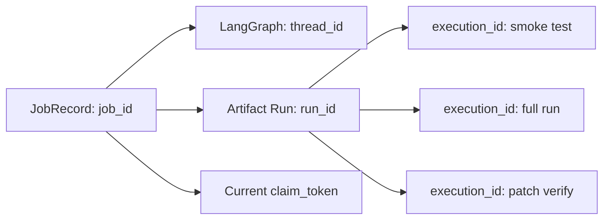
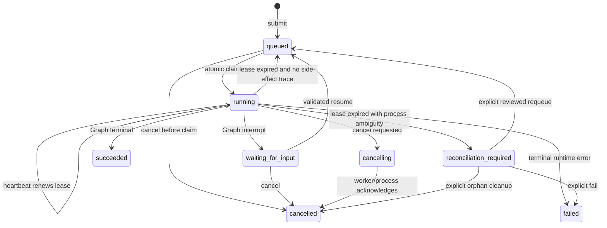
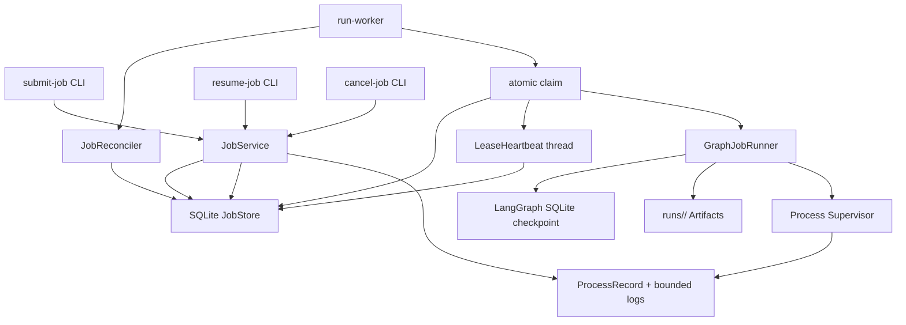

# 33. Phase 22：异步 Job Runtime、Heartbeat、Lease 与崩溃恢复

> 本阶段建立在 Phase 16 的受监管进程、Phase 17 的回归评测、Phase 21 的
> Dense Retrieval，以及现有 LangGraph SQLite checkpoint 之上。
>
> 当前 `run-graph` 是同步命令：CLI 进程既负责推进 LangGraph，又负责等待
> LLM、Embedding 和实验子进程。CLI 一旦退出，系统缺少统一任务身份、worker
> ownership、heartbeat、lease、崩溃判定和安全重领机制。
>
> 本阶段新增一个独立的单机 Job Runtime。提交命令只负责写入 SQLite Job
> Store；worker 独立 claim 任务并推进 Graph；用户可以从另一个终端查询、
> 取消、恢复人工中断或等待任务结束。
>
> 本教程只给出实现步骤、完整代码、测试和验收方法。请按顺序自行修改项目
> 代码。

> **章节标识说明**
>
> - “需要新增”表示创建完整文件；
> - “需要完整替换”表示替换指定文件或函数；
> - “需要局部修改”会给出插入位置和上下文；
> - “原理、运行、调试或验收说明”不要求修改代码；
> - 本阶段不会直接替你修改 `app/` 或 `tests/`；
> - 临时验证内容只能放在项目内 `.codex_tmp/`，完成后删除。

---

## 一、为什么现在优先做 Job Runtime

> **本节类型：优先级分析，不修改项目代码。**

前面的阶段已经形成了完整质量闭环：

```text
论文结构解析
  -> Paper Evidence
  -> Sparse + Dense Code Retrieval
  -> 论文-代码 Mapping
  -> 实验计划
  -> 命令选择
  -> 风险审批
  -> Preflight / Smoke Test
  -> 受监管执行
  -> Debug / Repair
  -> Final Report / Eval
```

但整个闭环目前仍依附于一次前台 CLI 调用：

```python
result = graph.invoke(initial_state, config=config)
```

这会产生几个现实问题：

1. LLM、Embedding、编译和训练都可能持续很久；
2. 终端断开后无法可靠判断任务到底在运行、暂停还是已经丢失；
3. 不能由另一个进程安全接管一个未完成任务；
4. 没有 worker claim，两个进程可能同时推进同一个 `thread_id`；
5. 没有 heartbeat，无法区分“运行很慢”和“worker 已崩溃”；
6. 没有 lease fencing，旧 worker 恢复后可能覆盖新 worker 的结果；
7. 现有 `cancel-run` 只面向已经启动的受监管子进程，不覆盖 LLM、Graph 和排队任务；
8. Web/API 如果现在直接建立在同步 CLI 上，后续会被迫重写。

因此下一步不是简单写：

```python
async def executor_node(state: dict):
    ...
```

真正需要的是独立运行时：

```text
LangGraph：
    负责业务状态、节点路由、checkpoint 和 interrupt。

Job Runtime：
    负责排队、claim、heartbeat、lease、cancel、retry 和 worker 生命周期。

Process Supervisor：
    负责具体实验子进程、进程组、资源预算、日志和进程级取消。

Artifact Store：
    负责 runs/<run_id>/ 内的可审计产物。
```

---

## 二、本阶段目标

> **本节类型：目标说明，不修改项目代码。**

完成后系统应具备：

1. `submit-job` 提交后立即返回，CLI 不等待 Graph 完成；
2. `run-worker` 从 SQLite 原子 claim 一个任务；
3. 每次 claim 生成不可复用的 `claim_token`；
4. worker 在 Graph 阻塞期间由独立线程持续 heartbeat；
5. lease 只能由当前 token 延长；
6. 旧 token 不能完成、失败或重新排队当前任务；
7. Job、LangGraph thread、run Artifact 和实验进程使用不同身份；
8. worker 重启后能从 LangGraph SQLite checkpoint 继续；
9. Graph 到达 `interrupt()` 时 Job 进入 `waiting_for_input`；
10. command selection、action review、patch review 和 promotion review 都能通过统一
    `resume-job` 恢复；
11. resume 请求有 idempotency key，并绑定当前等待代次和节点；
12. 排队任务可以直接取消；
13. 运行任务取消时同时通知 Job Runtime 和 Process Supervisor；
14. lease 过期后先 reconcile 受监管进程，不能直接重复启动训练；
15. 无副作用运行痕迹的 stale job 可以重新入队；
16. 存在活动或结果不明的进程记录时进入 `reconciliation_required`；
17. 两个 worker 不能同时 claim 同一 Job；
18. 两个不同 Job 的 run_dir、checkpoint 和 Artifact 不互相污染；
19. Job Event 保存审计事实，但不保存 API key、完整日志或向量；
20. 崩溃、重领、stale token、cancel 和 interrupt/resume 都有离线测试。

---

## 三、本阶段不做什么

> **本节类型：范围说明，不修改项目代码。**

本阶段不做：

- 不引入 Celery、Redis、RabbitMQ、Kafka 或 Kubernetes；
- 不实现 HTTP API 和 Web 页面；
- 不把所有节点改成 `async def`；
- 不把 LangGraph checkpoint 塞进 Job Store；
- 不把完整 stdout/stderr、论文正文、源码或向量写入 Job Store；
- 不允许两个 worker 同时推进同一 `thread_id`；
- 不把 lease 过期直接等价为“可以重跑”；
- 不宣称分布式事务或 exactly-once；
- 不自动接管失去原 Supervisor 的 stdout/stderr pipe；
- 不自动重跑状态不明的训练、下载或外部副作用；
- 不用 LLM 判断 PID 是否属于当前任务；
- 不让 `resume-job` 绕过 action hash、patch hash 或原有审批节点；
- 不删除旧的同步 `run-graph`，它仍可用于教学和短流程调试。

第一版保持单机 SQLite 是有意的：

```text
先验证：
    状态机
    claim 原子性
    lease fencing
    checkpoint resume
    副作用 reconcile

再考虑：
    远程 worker
    服务 API
    Redis/PostgreSQL
    WebSocket/SSE
```

---

## 四、四类身份必须分开

> **本节类型：核心概念，不修改项目代码。**

本阶段最容易犯的错误，是把 `job_id`、`thread_id`、`run_id` 和
`execution_id` 当成同一个字段。

| 身份 | 管理对象 | 生命周期 | 持久化位置 |
|---|---|---|---|
| `job_id` | worker 如何推进整张 Graph | 从提交到任务终态 | Job Store |
| `thread_id` | LangGraph checkpoint 时间线 | 可跨进程 resume | checkpoint SQLite |
| `run_id` | 本次复现的 Artifact 根目录 | 一次业务 run | `runs/<run_id>/` |
| `execution_id` | 一次具体受监管子进程 | 一次 command attempt | `execution/control/` |
| `claim_token` | 当前 worker 对 Job 的临时所有权 | 一次 lease | Job Store |

关系如下：



关键规则：

```text
job_id != thread_id != run_id != execution_id

一个 Job：
    固定绑定一个 thread_id 和一个 run_id。

一个 Job：
    可以经历多次 claim，因此有多个 claim_token。

一个 run：
    可以产生多个 execution_id。
```

---

## 五、Job 状态机

> **本节类型：状态设计，不修改项目代码。**

第一版使用以下状态：

```text
queued
running
waiting_for_input
cancelling
succeeded
failed
cancelled
reconciliation_required
```

状态图：



`succeeded` 的含义需要特别说明：

```text
Job succeeded：
    worker 成功把 Graph 推进到业务终点，并持久化了最终 checkpoint。

Graph final_status：
    业务结果，可能是 succeeded、rejected、preflight_failed、
    execution_failed、repair_exhausted 等。
```

因此以下情况是允许的：

```json
{
  "job_status": "succeeded",
  "result": {
    "final_status": "preflight_failed"
  }
}
```

这表示 Job Runtime 本身正常完成，但复现业务没有通过预检。不要把运行时故障和
业务结果混成一个状态。

---

## 六、Lease 不是普通超时

> **本节类型：并发原理，不修改项目代码。**

claim 后 Job Store 保存：

```text
worker_id
claim_token
claimed_at
heartbeat_at
lease_expires_at
```

heartbeat 只能执行类似：

```sql
UPDATE jobs
SET heartbeat_at = ?, lease_expires_at = ?
WHERE job_id = ?
  AND status IN ('running', 'cancelling')
  AND claim_token = ?;
```

如果 `rowcount == 0`，当前 worker 已经失去所有权，必须停止推进 Graph。

为什么不能只比较 `worker_id`：

```text
worker-1 claim，token=A
worker-1 进程崩溃
lease 过期
新启动的 worker-1 claim，token=B
旧进程意外恢复
```

两个进程的 `worker_id` 相同，但只有 token B 有效。token A 必须被 fencing。

---

## 七、崩溃恢复为什么必须先 Reconcile

> **本节类型：安全原理，不修改项目代码。**

最危险的场景：

```text
worker 启动训练进程
  -> Process Supervisor 写入 PID/PGID
  -> worker 被 kill -9
  -> 训练子进程因为 start_new_session=True 仍然存活
  -> Job lease 过期
```

如果新 worker 直接把 Job 重新入队，就可能启动第二份训练。

因此 lease 过期后必须先检查当前 run 的 ProcessRecord：

```text
没有本次 claim 之后的进程记录：
    可以自动重新入队。

有 active 记录，PID + create_time + PGID 仍匹配：
    reconciliation_required，禁止重跑。

记录声称 active，但 PID 已消失：
    结果不确定，reconciliation_required。

存在本次 claim 之后的 finished 记录，但 Graph checkpoint 未确认：
    可能“进程已完成、节点结果未 checkpoint”，仍然禁止自动重跑。
```

这意味着本阶段保证的是：

```text
at-least-once Graph progression
+ lease fencing
+ ambiguous side effect fail closed
```

而不是不现实的：

```text
任意 Python、文件系统和外部训练进程的全局 exactly-once
```

---

## 八、目标架构

> **本节类型：架构说明，不修改项目代码。**



建议目录：

```text
app/job_runtime/
├── __init__.py
├── schemas.py
├── store.py
├── heartbeat.py
├── process_reconcile.py
├── graph_runner.py
├── worker.py
└── service.py
```

---

## 九、需要新增和修改的文件

> **本节类型：文件清单，不修改项目代码。**

需要新增：

```text
app/job_runtime/__init__.py
app/job_runtime/schemas.py
app/job_runtime/store.py
app/job_runtime/heartbeat.py
app/job_runtime/process_reconcile.py
app/job_runtime/graph_runner.py
app/job_runtime/worker.py
app/job_runtime/service.py

tests/test_job_store.py
tests/test_job_heartbeat.py
tests/test_job_process_reconcile.py
tests/test_job_graph_runner.py
tests/test_job_worker.py
tests/test_job_cli.py
```

需要局部修改：

```text
app/config.py
app/state.py
app/nodes/run_context_node.py
app/tools/artifact_tools.py
app/memory/checkpoint.py
app/main.py
tests/test_run_manifest_node.py
.gitignore
a_implementation_guides/README.md
```

本阶段不要求修改：

```text
app/graph.py
app/nodes/executor_node.py
app/nodes/human_review_node.py
app/nodes/command_selection_node.py
app/nodes/patch_review_node.py
app/nodes/patch_promotion_review_node.py
```

原因是 Job Runtime 在 Graph 外层驱动已有节点，原有 interrupt 和 hash
校验继续作为业务安全边界。

本阶段不需要修改 `pyproject.toml`：

```text
sqlite3：
    Python 标准库。

threading：
    Python 标准库。

psutil：
    Phase 16 已经加入项目依赖。

langgraph-checkpoint-sqlite：
    Phase 5 已经加入项目依赖。
```

---

## 十、增加 Job Runtime 配置

> **本节类型：需要局部修改代码。**
>
> 需要修改：`app/config.py`

在 `Settings` 的 Embedding/检索配置之后、`settings = Settings()` 之前加入：

```python
    # Job Runtime 与 LangGraph checkpoint 使用不同 SQLite 文件。
    # checkpoint 保存业务状态；job DB 保存排队和 worker ownership。
    job_db_path: Path = Path(
        os.getenv(
            "JOB_DB_PATH",
            "jobs/runtime.sqlite",
        )
    )

    # worker 没有续租超过该时间后，Job 才进入 reconcile。
    # 它必须明显大于 heartbeat 间隔。
    job_lease_seconds: float = float(
        os.getenv("JOB_LEASE_SECONDS", "30")
    )

    # heartbeat 在独立线程中运行，因此 Graph 卡在 LLM 或 subprocess 时
    # 仍然可以续租。
    job_heartbeat_seconds: float = float(
        os.getenv("JOB_HEARTBEAT_SECONDS", "5")
    )

    # 没有任务时 worker 的轮询间隔。
    job_poll_seconds: float = float(
        os.getenv("JOB_POLL_SECONDS", "1")
    )

    # 这里只限制 worker claim 次数，不替代节点内部 provider retry。
    job_max_attempts: int = int(
        os.getenv("JOB_MAX_ATTEMPTS", "3")
    )

    # show-job 只保存 bounded interrupt preview；完整大对象仍在 checkpoint
    # 或 run Artifact 中。
    job_interrupt_preview_chars: int = int(
        os.getenv(
            "JOB_INTERRUPT_PREVIEW_CHARS",
            "12000",
        )
    )
```

在文件底部现有目录初始化代码之后加入：

```python
settings.job_db_path.parent.mkdir(
    parents=True,
    exist_ok=True,
)

if settings.job_heartbeat_seconds <= 0:
    raise ValueError(
        "JOB_HEARTBEAT_SECONDS 必须大于 0"
    )

if (
    settings.job_lease_seconds
    <= settings.job_heartbeat_seconds * 2
):
    raise ValueError(
        "JOB_LEASE_SECONDS 必须大于 "
        "2 * JOB_HEARTBEAT_SECONDS"
    )

if settings.job_max_attempts < 1:
    raise ValueError(
        "JOB_MAX_ATTEMPTS 必须至少为 1"
    )
```

推荐 `.env`：

```dotenv
JOB_DB_PATH=jobs/runtime.sqlite
JOB_LEASE_SECONDS=30
JOB_HEARTBEAT_SECONDS=5
JOB_POLL_SECONDS=1
JOB_MAX_ATTEMPTS=3
JOB_INTERRUPT_PREVIEW_CHARS=12000
```

---

## 十一、定义 Job Schema

> **本节类型：需要新增完整代码。**
>
> 需要新增：`app/job_runtime/schemas.py`

```python
from __future__ import annotations

from typing import Any, Literal

from pydantic import (
    BaseModel,
    ConfigDict,
    Field,
    model_validator,
)


JobStatus = Literal[
    "queued",
    "running",
    "waiting_for_input",
    "cancelling",
    "succeeded",
    "failed",
    "cancelled",
    "reconciliation_required",
]

TERMINAL_JOB_STATUSES = {
    "succeeded",
    "failed",
    "cancelled",
}

WAITABLE_JOB_STATUSES = {
    *TERMINAL_JOB_STATUSES,
    "waiting_for_input",
    "reconciliation_required",
}


class JobModel(BaseModel):
    """Job Runtime 的所有持久化对象都拒绝未知字段。"""

    model_config = ConfigDict(extra="forbid")


class JobRequest(JobModel):
    """提交任务所需的业务输入，不保存 API key 或完整 Prompt。"""

    paper_path: str = Field(min_length=1)
    repo_path: str = Field(min_length=1)
    log_path: str | None = None
    experiment_goal: str = "复现论文 main result"
    execution_profile_id: str = Field(min_length=1)


class JobInterrupt(JobModel):
    """
    Job Store 只保存 interrupt 的节点身份和有界 preview。

    完整业务状态仍由 LangGraph checkpoint 保存。
    """

    node: str
    interrupt_id: str | None = None
    value_preview: Any = None


class JobResumeRequest(JobModel):
    resume_id: str
    job_id: str
    wait_generation: int = Field(ge=1)
    idempotency_key: str
    expected_node: str
    value: Any
    value_hash: str
    status: Literal["pending", "consumed"]
    created_at: str
    consumed_at: str | None = None


class JobRecord(JobModel):
    job_id: str
    idempotency_key: str
    request_hash: str

    thread_id: str
    run_id: str
    run_dir: str
    request: JobRequest

    status: JobStatus
    version: int = Field(ge=0)
    attempt_count: int = Field(ge=0)
    max_attempts: int = Field(ge=1)
    wait_generation: int = Field(ge=0)

    worker_id: str | None = None
    claim_token: str | None = None
    claimed_at: str | None = None
    heartbeat_at: str | None = None
    lease_expires_at: str | None = None
    available_at: str

    interrupt_nodes: list[str] = Field(
        default_factory=list
    )
    interrupts: list[JobInterrupt] = Field(
        default_factory=list
    )
    pending_resume_id: str | None = None

    cancel_requested: bool = False
    cancellation_reason: str | None = None

    result: dict[str, Any] | None = None
    error: dict[str, Any] | None = None
    reconciliation: dict[str, Any] | None = None

    created_at: str
    updated_at: str

    @model_validator(mode="after")
    def validate_ownership(self) -> JobRecord:
        owned = self.status in {
            "running",
            "cancelling",
        }
        ownership = (
            self.worker_id,
            self.claim_token,
            self.claimed_at,
            self.heartbeat_at,
            self.lease_expires_at,
        )
        if owned and any(value is None for value in ownership):
            raise ValueError(
                "running/cancelling Job 必须有完整 ownership"
            )
        return self


class JobClaim(JobModel):
    """worker 本次 claim 的不可变快照。"""

    job: JobRecord
    claim_token: str
    resume_request: JobResumeRequest | None = None


class HeartbeatResult(JobModel):
    lease_renewed: bool
    cancel_requested: bool
    cancellation_reason: str | None = None
    lease_expires_at: str


class JobExecutionOutcome(JobModel):
    status: Literal[
        "succeeded",
        "waiting_for_input",
        "cancelled",
    ]
    result: dict[str, Any] = Field(default_factory=dict)
    interrupts: list[JobInterrupt] = Field(
        default_factory=list
    )


class JobEvent(JobModel):
    event_id: int
    job_id: str
    event_type: str
    actor: str
    payload: dict[str, Any] = Field(default_factory=dict)
    created_at: str


class ReconcileDecision(JobModel):
    disposition: Literal[
        "safe_to_requeue",
        "active_process",
        "ambiguous_process",
        "finished_process_without_checkpoint",
    ]
    detail: str
    process_records: list[dict[str, Any]] = Field(
        default_factory=list
    )
```

新增最小导出文件 `app/job_runtime/__init__.py`：

```python
from app.job_runtime.schemas import (
    JobClaim,
    JobEvent,
    JobExecutionOutcome,
    JobInterrupt,
    JobRecord,
    JobRequest,
    JobResumeRequest,
    JobStatus,
)

__all__ = [
    "JobClaim",
    "JobEvent",
    "JobExecutionOutcome",
    "JobInterrupt",
    "JobRecord",
    "JobRequest",
    "JobResumeRequest",
    "JobStatus",
]
```

---

## 十二、实现 SQLite Job Store

> **本节类型：需要新增完整代码。**
>
> 需要新增：`app/job_runtime/store.py`

Job Store 必须满足：

```text
一条 SQL transaction 内：
    select queued job
    update ownership
    写 claim event

所有 owned transition：
    必须带 job_id + claim_token

所有 resume：
    必须带 wait_generation + expected_node
```

完整实现：

```python
from __future__ import annotations

import hashlib
import json
import sqlite3
import time
from pathlib import Path
from typing import Any
from uuid import uuid4

from app.job_runtime.schemas import (
    HeartbeatResult,
    JobClaim,
    JobEvent,
    JobInterrupt,
    JobRecord,
    JobRequest,
    JobResumeRequest,
)


class JobStoreError(RuntimeError):
    pass


class JobNotFoundError(JobStoreError):
    pass


class JobConflictError(JobStoreError):
    pass


class LeaseLostError(JobStoreError):
    pass


def _canonical_json(value: Any) -> str:
    return json.dumps(
        value,
        ensure_ascii=False,
        sort_keys=True,
        separators=(",", ":"),
        default=str,
    )


def _json_hash(value: Any) -> str:
    return hashlib.sha256(
        _canonical_json(value).encode("utf-8")
    ).hexdigest()


def _dump_json(value: Any) -> str:
    return json.dumps(
        value,
        ensure_ascii=False,
        separators=(",", ":"),
        default=str,
    )


def _load_json(
    value: str | None,
    default: Any,
) -> Any:
    if value is None:
        return default
    return json.loads(value)


def _iso(timestamp: float | None) -> str | None:
    if timestamp is None:
        return None

    from datetime import datetime, timezone

    return datetime.fromtimestamp(
        timestamp,
        tz=timezone.utc,
    ).isoformat()


class SqliteJobStore:
    """
    每个方法创建自己的 SQLite connection。

    这样 heartbeat thread、worker 主线程和 CLI 可以安全并发使用同一个
    store 对象，不共享 sqlite3.Connection。
    """

    def __init__(self, db_path: str | Path):
        self.db_path = Path(db_path)

    def _connect(self) -> sqlite3.Connection:
        self.db_path.parent.mkdir(
            parents=True,
            exist_ok=True,
        )
        connection = sqlite3.connect(
            self.db_path,
            timeout=30,
            isolation_level=None,
        )
        connection.row_factory = sqlite3.Row
        connection.execute(
            "PRAGMA journal_mode=WAL"
        )
        connection.execute(
            "PRAGMA synchronous=NORMAL"
        )
        connection.execute(
            "PRAGMA busy_timeout=30000"
        )
        connection.execute(
            "PRAGMA foreign_keys=ON"
        )
        return connection

    def initialize(self) -> None:
        with self._connect() as connection:
            connection.executescript(
                """
                CREATE TABLE IF NOT EXISTS jobs (
                    job_id TEXT PRIMARY KEY,
                    idempotency_key TEXT NOT NULL UNIQUE,
                    request_hash TEXT NOT NULL,

                    thread_id TEXT NOT NULL UNIQUE,
                    run_id TEXT NOT NULL UNIQUE,
                    run_dir TEXT NOT NULL UNIQUE,
                    request_json TEXT NOT NULL,

                    status TEXT NOT NULL CHECK (
                        status IN (
                            'queued',
                            'running',
                            'waiting_for_input',
                            'cancelling',
                            'succeeded',
                            'failed',
                            'cancelled',
                            'reconciliation_required'
                        )
                    ),
                    version INTEGER NOT NULL DEFAULT 0,
                    attempt_count INTEGER NOT NULL DEFAULT 0,
                    max_attempts INTEGER NOT NULL,
                    wait_generation INTEGER NOT NULL DEFAULT 0,

                    worker_id TEXT,
                    claim_token TEXT,
                    claimed_at REAL,
                    heartbeat_at REAL,
                    lease_expires_at REAL,
                    available_at REAL NOT NULL,

                    interrupt_nodes_json TEXT NOT NULL DEFAULT '[]',
                    interrupts_json TEXT NOT NULL DEFAULT '[]',
                    pending_resume_id TEXT,

                    cancel_requested INTEGER NOT NULL DEFAULT 0,
                    cancellation_reason TEXT,

                    result_json TEXT,
                    error_json TEXT,
                    reconciliation_json TEXT,

                    created_at REAL NOT NULL,
                    updated_at REAL NOT NULL
                );

                CREATE INDEX IF NOT EXISTS idx_jobs_claim
                ON jobs (
                    status,
                    cancel_requested,
                    available_at,
                    created_at
                );

                CREATE INDEX IF NOT EXISTS idx_jobs_lease
                ON jobs (
                    status,
                    lease_expires_at
                );

                CREATE TABLE IF NOT EXISTS job_resumes (
                    resume_id TEXT PRIMARY KEY,
                    job_id TEXT NOT NULL,
                    wait_generation INTEGER NOT NULL,
                    idempotency_key TEXT NOT NULL UNIQUE,
                    expected_node TEXT NOT NULL,
                    value_json TEXT NOT NULL,
                    value_hash TEXT NOT NULL,
                    status TEXT NOT NULL CHECK (
                        status IN ('pending', 'consumed')
                    ),
                    created_at REAL NOT NULL,
                    consumed_at REAL,
                    FOREIGN KEY(job_id)
                        REFERENCES jobs(job_id)
                        ON DELETE CASCADE,
                    UNIQUE(job_id, wait_generation)
                );

                CREATE TABLE IF NOT EXISTS job_events (
                    event_id INTEGER PRIMARY KEY AUTOINCREMENT,
                    job_id TEXT NOT NULL,
                    event_type TEXT NOT NULL,
                    actor TEXT NOT NULL,
                    payload_json TEXT NOT NULL,
                    created_at REAL NOT NULL,
                    FOREIGN KEY(job_id)
                        REFERENCES jobs(job_id)
                        ON DELETE CASCADE
                );

                CREATE INDEX IF NOT EXISTS idx_job_events_job
                ON job_events(job_id, event_id);
                """
            )

    def _append_event(
        self,
        connection: sqlite3.Connection,
        *,
        job_id: str,
        event_type: str,
        actor: str,
        payload: dict[str, Any],
        now: float,
    ) -> None:
        connection.execute(
            """
            INSERT INTO job_events (
                job_id,
                event_type,
                actor,
                payload_json,
                created_at
            )
            VALUES (?, ?, ?, ?, ?)
            """,
            (
                job_id,
                event_type,
                actor[:100],
                _dump_json(payload),
                now,
            ),
        )

    def _row_to_record(
        self,
        row: sqlite3.Row,
    ) -> JobRecord:
        return JobRecord(
            job_id=row["job_id"],
            idempotency_key=row["idempotency_key"],
            request_hash=row["request_hash"],
            thread_id=row["thread_id"],
            run_id=row["run_id"],
            run_dir=row["run_dir"],
            request=JobRequest.model_validate(
                _load_json(
                    row["request_json"],
                    {},
                )
            ),
            status=row["status"],
            version=row["version"],
            attempt_count=row["attempt_count"],
            max_attempts=row["max_attempts"],
            wait_generation=row["wait_generation"],
            worker_id=row["worker_id"],
            claim_token=row["claim_token"],
            claimed_at=_iso(row["claimed_at"]),
            heartbeat_at=_iso(row["heartbeat_at"]),
            lease_expires_at=_iso(
                row["lease_expires_at"]
            ),
            available_at=_iso(
                row["available_at"]
            ),
            interrupt_nodes=_load_json(
                row["interrupt_nodes_json"],
                [],
            ),
            interrupts=[
                JobInterrupt.model_validate(item)
                for item in _load_json(
                    row["interrupts_json"],
                    [],
                )
            ],
            pending_resume_id=row[
                "pending_resume_id"
            ],
            cancel_requested=bool(
                row["cancel_requested"]
            ),
            cancellation_reason=row[
                "cancellation_reason"
            ],
            result=_load_json(
                row["result_json"],
                None,
            ),
            error=_load_json(
                row["error_json"],
                None,
            ),
            reconciliation=_load_json(
                row["reconciliation_json"],
                None,
            ),
            created_at=_iso(row["created_at"]),
            updated_at=_iso(row["updated_at"]),
        )

    def _row_to_resume(
        self,
        row: sqlite3.Row,
    ) -> JobResumeRequest:
        return JobResumeRequest(
            resume_id=row["resume_id"],
            job_id=row["job_id"],
            wait_generation=row[
                "wait_generation"
            ],
            idempotency_key=row[
                "idempotency_key"
            ],
            expected_node=row["expected_node"],
            value=_load_json(
                row["value_json"],
                None,
            ),
            value_hash=row["value_hash"],
            status=row["status"],
            created_at=_iso(row["created_at"]),
            consumed_at=_iso(
                row["consumed_at"]
            ),
        )

    def submit(
        self,
        *,
        job_id: str,
        idempotency_key: str,
        thread_id: str,
        run_id: str,
        run_dir: str,
        request: JobRequest,
        max_attempts: int,
        now: float | None = None,
    ) -> tuple[JobRecord, bool]:
        """
        返回 ``(record, created)``。

        同一个 idempotency key + 同一个请求返回旧 Job；
        同 key 不同请求必须冲突，不能悄悄复用。
        """

        current = time.time() if now is None else now
        request_payload = request.model_dump()
        request_hash = _json_hash(
            {
                "thread_id": thread_id,
                "request": request_payload,
            }
        )

        connection = self._connect()
        try:
            connection.execute("BEGIN IMMEDIATE")
            existing = connection.execute(
                """
                SELECT *
                FROM jobs
                WHERE idempotency_key = ?
                """,
                (idempotency_key,),
            ).fetchone()
            if existing is not None:
                if (
                    existing["request_hash"]
                    != request_hash
                ):
                    raise JobConflictError(
                        "相同 idempotency_key "
                        "对应了不同 Job 请求"
                    )
                connection.commit()
                return (
                    self._row_to_record(existing),
                    False,
                )

            try:
                connection.execute(
                    """
                    INSERT INTO jobs (
                        job_id,
                        idempotency_key,
                        request_hash,
                        thread_id,
                        run_id,
                        run_dir,
                        request_json,
                        status,
                        version,
                        attempt_count,
                        max_attempts,
                        wait_generation,
                        available_at,
                        created_at,
                        updated_at
                    )
                    VALUES (
                        ?, ?, ?, ?, ?, ?, ?,
                        'queued', 0, 0, ?, 0,
                        ?, ?, ?
                    )
                    """,
                    (
                        job_id,
                        idempotency_key,
                        request_hash,
                        thread_id,
                        run_id,
                        run_dir,
                        _dump_json(request_payload),
                        max_attempts,
                        current,
                        current,
                        current,
                    ),
                )
            except sqlite3.IntegrityError as exc:
                raise JobConflictError(
                    "thread_id、run_id、run_dir 或 "
                    "idempotency_key 已被其他 Job 使用"
                ) from exc

            self._append_event(
                connection,
                job_id=job_id,
                event_type="job_submitted",
                actor="service",
                payload={
                    "thread_id": thread_id,
                    "run_id": run_id,
                },
                now=current,
            )
            row = connection.execute(
                "SELECT * FROM jobs WHERE job_id = ?",
                (job_id,),
            ).fetchone()
            connection.commit()
            assert row is not None
            return self._row_to_record(row), True
        except Exception:
            connection.rollback()
            raise
        finally:
            connection.close()

    def get(self, job_id: str) -> JobRecord:
        with self._connect() as connection:
            row = connection.execute(
                "SELECT * FROM jobs WHERE job_id = ?",
                (job_id,),
            ).fetchone()
        if row is None:
            raise JobNotFoundError(
                f"未找到 job_id={job_id}"
            )
        return self._row_to_record(row)

    def list_jobs(
        self,
        *,
        status: str | None = None,
        limit: int = 50,
    ) -> list[JobRecord]:
        bounded_limit = max(1, min(limit, 500))
        with self._connect() as connection:
            if status is None:
                rows = connection.execute(
                    """
                    SELECT *
                    FROM jobs
                    ORDER BY created_at DESC
                    LIMIT ?
                    """,
                    (bounded_limit,),
                ).fetchall()
            else:
                rows = connection.execute(
                    """
                    SELECT *
                    FROM jobs
                    WHERE status = ?
                    ORDER BY created_at DESC
                    LIMIT ?
                    """,
                    (status, bounded_limit),
                ).fetchall()
        return [
            self._row_to_record(row)
            for row in rows
        ]

    def list_events(
        self,
        job_id: str,
        *,
        limit: int = 200,
    ) -> list[JobEvent]:
        # 先确认 Job 存在，使拼错 ID 得到明确错误。
        self.get(job_id)
        bounded_limit = max(1, min(limit, 1000))
        with self._connect() as connection:
            rows = connection.execute(
                """
                SELECT *
                FROM job_events
                WHERE job_id = ?
                ORDER BY event_id ASC
                LIMIT ?
                """,
                (job_id, bounded_limit),
            ).fetchall()
        return [
            JobEvent(
                event_id=row["event_id"],
                job_id=row["job_id"],
                event_type=row["event_type"],
                actor=row["actor"],
                payload=_load_json(
                    row["payload_json"],
                    {},
                ),
                created_at=_iso(
                    row["created_at"]
                ),
            )
            for row in rows
        ]

    def _load_pending_resume(
        self,
        connection: sqlite3.Connection,
        resume_id: str | None,
    ) -> JobResumeRequest | None:
        if resume_id is None:
            return None
        row = connection.execute(
            """
            SELECT *
            FROM job_resumes
            WHERE resume_id = ?
            """,
            (resume_id,),
        ).fetchone()
        if row is None:
            raise JobStoreError(
                "Job 指向不存在的 pending resume"
            )
        return self._row_to_resume(row)

    def claim_next(
        self,
        *,
        worker_id: str,
        lease_seconds: float,
        now: float | None = None,
    ) -> JobClaim | None:
        """
        只 claim 已经是 queued 的 Job。

        stale running Job 必须先由 JobReconciler 判定，不能在这里盲目重排。
        """

        current = time.time() if now is None else now
        token = f"claim_{uuid4().hex}"
        lease_expires = current + lease_seconds

        connection = self._connect()
        try:
            connection.execute("BEGIN IMMEDIATE")
            row = connection.execute(
                """
                SELECT *
                FROM jobs
                WHERE status = 'queued'
                  AND cancel_requested = 0
                  AND available_at <= ?
                ORDER BY available_at ASC, created_at ASC
                LIMIT 1
                """,
                (current,),
            ).fetchone()
            if row is None:
                connection.commit()
                return None

            updated = connection.execute(
                """
                UPDATE jobs
                SET status = 'running',
                    version = version + 1,
                    attempt_count = attempt_count + 1,
                    worker_id = ?,
                    claim_token = ?,
                    claimed_at = ?,
                    heartbeat_at = ?,
                    lease_expires_at = ?,
                    interrupt_nodes_json = '[]',
                    interrupts_json = '[]',
                    error_json = NULL,
                    reconciliation_json = NULL,
                    updated_at = ?
                WHERE job_id = ?
                  AND status = 'queued'
                  AND cancel_requested = 0
                """,
                (
                    worker_id,
                    token,
                    current,
                    current,
                    lease_expires,
                    current,
                    row["job_id"],
                ),
            )
            if updated.rowcount != 1:
                raise JobConflictError(
                    "Job claim 竞争失败"
                )

            self._append_event(
                connection,
                job_id=row["job_id"],
                event_type="job_claimed",
                actor=worker_id,
                payload={
                    "claim_token_suffix": token[-12:],
                    "lease_expires_at": _iso(
                        lease_expires
                    ),
                },
                now=current,
            )
            claimed_row = connection.execute(
                "SELECT * FROM jobs WHERE job_id = ?",
                (row["job_id"],),
            ).fetchone()
            assert claimed_row is not None
            resume = self._load_pending_resume(
                connection,
                claimed_row["pending_resume_id"],
            )
            connection.commit()
            record = self._row_to_record(
                claimed_row
            )
            return JobClaim(
                job=record,
                claim_token=token,
                resume_request=resume,
            )
        except Exception:
            connection.rollback()
            raise
        finally:
            connection.close()

    def heartbeat(
        self,
        *,
        job_id: str,
        claim_token: str,
        lease_seconds: float,
        now: float | None = None,
    ) -> HeartbeatResult:
        current = time.time() if now is None else now
        lease_expires = current + lease_seconds

        connection = self._connect()
        try:
            connection.execute("BEGIN IMMEDIATE")
            updated = connection.execute(
                """
                UPDATE jobs
                SET heartbeat_at = ?,
                    lease_expires_at = ?,
                    updated_at = ?
                WHERE job_id = ?
                  AND status IN (
                      'running',
                      'cancelling'
                  )
                  AND claim_token = ?
                """,
                (
                    current,
                    lease_expires,
                    current,
                    job_id,
                    claim_token,
                ),
            )
            if updated.rowcount != 1:
                raise LeaseLostError(
                    "heartbeat 被拒绝：claim 已失效"
                )
            row = connection.execute(
                "SELECT * FROM jobs WHERE job_id = ?",
                (job_id,),
            ).fetchone()
            connection.commit()
            assert row is not None
            return HeartbeatResult(
                lease_renewed=True,
                cancel_requested=bool(
                    row["cancel_requested"]
                ),
                cancellation_reason=row[
                    "cancellation_reason"
                ],
                lease_expires_at=_iso(
                    lease_expires
                ),
            )
        except Exception:
            connection.rollback()
            raise
        finally:
            connection.close()

    def _consume_pending_resume(
        self,
        connection: sqlite3.Connection,
        *,
        resume_id: str | None,
        now: float,
    ) -> None:
        if resume_id is None:
            return
        connection.execute(
            """
            UPDATE job_resumes
            SET status = 'consumed',
                consumed_at = COALESCE(
                    consumed_at,
                    ?
                )
            WHERE resume_id = ?
            """,
            (now, resume_id),
        )

    def mark_waiting(
        self,
        *,
        job_id: str,
        claim_token: str,
        interrupts: list[JobInterrupt],
        result: dict[str, Any],
        actor: str,
        now: float | None = None,
    ) -> JobRecord:
        current = time.time() if now is None else now
        nodes = list(
            dict.fromkeys(
                item.node for item in interrupts
            )
        )

        connection = self._connect()
        try:
            connection.execute("BEGIN IMMEDIATE")
            row = connection.execute(
                "SELECT * FROM jobs WHERE job_id = ?",
                (job_id,),
            ).fetchone()
            if (
                row is None
                or row["status"]
                not in {"running", "cancelling"}
                or row["claim_token"] != claim_token
            ):
                raise LeaseLostError(
                    "mark_waiting 被拒绝：claim 已失效"
                )

            self._consume_pending_resume(
                connection,
                resume_id=row["pending_resume_id"],
                now=current,
            )

            # Graph 刚返回 interrupt、Job 同时收到 cancel 时，取消优先。
            # 不能生成带 cancel_requested=true 的 waiting Job。
            if row["cancel_requested"]:
                connection.execute(
                    """
                    UPDATE jobs
                    SET status = 'cancelled',
                        version = version + 1,
                        worker_id = NULL,
                        claim_token = NULL,
                        claimed_at = NULL,
                        heartbeat_at = NULL,
                        lease_expires_at = NULL,
                        interrupt_nodes_json = '[]',
                        interrupts_json = '[]',
                        pending_resume_id = NULL,
                        updated_at = ?
                    WHERE job_id = ?
                      AND claim_token = ?
                    """,
                    (
                        current,
                        job_id,
                        claim_token,
                    ),
                )
                self._append_event(
                    connection,
                    job_id=job_id,
                    event_type="job_cancelled",
                    actor=actor,
                    payload={
                        "reason": row[
                            "cancellation_reason"
                        ]
                    },
                    now=current,
                )
                cancelled = connection.execute(
                    """
                    SELECT *
                    FROM jobs
                    WHERE job_id = ?
                    """,
                    (job_id,),
                ).fetchone()
                connection.commit()
                assert cancelled is not None
                return self._row_to_record(
                    cancelled
                )

            connection.execute(
                """
                UPDATE jobs
                SET status = 'waiting_for_input',
                    version = version + 1,
                    wait_generation = wait_generation + 1,
                    worker_id = NULL,
                    claim_token = NULL,
                    claimed_at = NULL,
                    heartbeat_at = NULL,
                    lease_expires_at = NULL,
                    interrupt_nodes_json = ?,
                    interrupts_json = ?,
                    pending_resume_id = NULL,
                    result_json = ?,
                    updated_at = ?
                WHERE job_id = ?
                  AND claim_token = ?
                """,
                (
                    _dump_json(nodes),
                    _dump_json(
                        [
                            item.model_dump()
                            for item in interrupts
                        ]
                    ),
                    _dump_json(result),
                    current,
                    job_id,
                    claim_token,
                ),
            )
            self._append_event(
                connection,
                job_id=job_id,
                event_type="job_waiting_for_input",
                actor=actor,
                payload={
                    "interrupt_nodes": nodes,
                },
                now=current,
            )
            updated = connection.execute(
                "SELECT * FROM jobs WHERE job_id = ?",
                (job_id,),
            ).fetchone()
            connection.commit()
            assert updated is not None
            return self._row_to_record(updated)
        except Exception:
            connection.rollback()
            raise
        finally:
            connection.close()

    def mark_succeeded(
        self,
        *,
        job_id: str,
        claim_token: str,
        result: dict[str, Any],
        actor: str,
        now: float | None = None,
    ) -> JobRecord:
        current = time.time() if now is None else now

        connection = self._connect()
        try:
            connection.execute("BEGIN IMMEDIATE")
            row = connection.execute(
                "SELECT * FROM jobs WHERE job_id = ?",
                (job_id,),
            ).fetchone()
            if (
                row is None
                or row["status"]
                not in {"running", "cancelling"}
                or row["claim_token"] != claim_token
            ):
                raise LeaseLostError(
                    "mark_succeeded 被拒绝：claim 已失效"
                )

            target_status = (
                "cancelled"
                if row["cancel_requested"]
                else "succeeded"
            )
            self._consume_pending_resume(
                connection,
                resume_id=row["pending_resume_id"],
                now=current,
            )
            connection.execute(
                """
                UPDATE jobs
                SET status = ?,
                    version = version + 1,
                    worker_id = NULL,
                    claim_token = NULL,
                    claimed_at = NULL,
                    heartbeat_at = NULL,
                    lease_expires_at = NULL,
                    interrupt_nodes_json = '[]',
                    interrupts_json = '[]',
                    pending_resume_id = NULL,
                    result_json = ?,
                    updated_at = ?
                WHERE job_id = ?
                  AND claim_token = ?
                """,
                (
                    target_status,
                    _dump_json(result),
                    current,
                    job_id,
                    claim_token,
                ),
            )
            self._append_event(
                connection,
                job_id=job_id,
                event_type=(
                    "job_cancelled"
                    if target_status == "cancelled"
                    else "job_succeeded"
                ),
                actor=actor,
                payload={
                    "final_status": result.get(
                        "final_status"
                    )
                },
                now=current,
            )
            updated = connection.execute(
                "SELECT * FROM jobs WHERE job_id = ?",
                (job_id,),
            ).fetchone()
            connection.commit()
            assert updated is not None
            return self._row_to_record(updated)
        except Exception:
            connection.rollback()
            raise
        finally:
            connection.close()

    def mark_cancelled(
        self,
        *,
        job_id: str,
        claim_token: str,
        reason: str,
        actor: str,
        now: float | None = None,
    ) -> JobRecord:
        current = time.time() if now is None else now

        connection = self._connect()
        try:
            connection.execute("BEGIN IMMEDIATE")
            row = connection.execute(
                "SELECT * FROM jobs WHERE job_id = ?",
                (job_id,),
            ).fetchone()
            if (
                row is None
                or row["status"]
                not in {"running", "cancelling"}
                or row["claim_token"] != claim_token
            ):
                raise LeaseLostError(
                    "mark_cancelled 被拒绝：claim 已失效"
                )
            self._consume_pending_resume(
                connection,
                resume_id=row["pending_resume_id"],
                now=current,
            )
            connection.execute(
                """
                UPDATE jobs
                SET status = 'cancelled',
                    version = version + 1,
                    worker_id = NULL,
                    claim_token = NULL,
                    claimed_at = NULL,
                    heartbeat_at = NULL,
                    lease_expires_at = NULL,
                    pending_resume_id = NULL,
                    cancel_requested = 1,
                    cancellation_reason = ?,
                    updated_at = ?
                WHERE job_id = ?
                  AND claim_token = ?
                """,
                (
                    reason[:500],
                    current,
                    job_id,
                    claim_token,
                ),
            )
            self._append_event(
                connection,
                job_id=job_id,
                event_type="job_cancelled",
                actor=actor,
                payload={"reason": reason[:500]},
                now=current,
            )
            updated = connection.execute(
                "SELECT * FROM jobs WHERE job_id = ?",
                (job_id,),
            ).fetchone()
            connection.commit()
            assert updated is not None
            return self._row_to_record(updated)
        except Exception:
            connection.rollback()
            raise
        finally:
            connection.close()

    def mark_failed(
        self,
        *,
        job_id: str,
        claim_token: str,
        error: dict[str, Any],
        actor: str,
        retryable: bool = False,
        now: float | None = None,
    ) -> JobRecord:
        """
        只有明确的 Job Runtime 瞬时错误才允许 retryable=True。

        未知 Graph 异常默认进入 failed；worker crash 由 lease reconcile 处理。
        """

        current = time.time() if now is None else now
        connection = self._connect()
        try:
            connection.execute("BEGIN IMMEDIATE")
            row = connection.execute(
                "SELECT * FROM jobs WHERE job_id = ?",
                (job_id,),
            ).fetchone()
            if (
                row is None
                or row["status"]
                not in {"running", "cancelling"}
                or row["claim_token"] != claim_token
            ):
                raise LeaseLostError(
                    "mark_failed 被拒绝：claim 已失效"
                )

            can_retry = (
                retryable
                and not row["cancel_requested"]
                and row["attempt_count"]
                < row["max_attempts"]
            )
            if can_retry:
                # Job-level retry 使用有上限的指数退避。
                delay = min(
                    60.0,
                    2.0 ** max(
                        row["attempt_count"] - 1,
                        0,
                    ),
                )
                target_status = "queued"
                available_at = current + delay
                event_type = "job_retry_scheduled"
            else:
                target_status = (
                    "cancelled"
                    if row["cancel_requested"]
                    else "failed"
                )
                available_at = current
                event_type = (
                    "job_cancelled"
                    if target_status == "cancelled"
                    else "job_failed"
                )

            if not can_retry:
                self._consume_pending_resume(
                    connection,
                    resume_id=row[
                        "pending_resume_id"
                    ],
                    now=current,
                )

            connection.execute(
                """
                UPDATE jobs
                SET status = ?,
                    version = version + 1,
                    worker_id = NULL,
                    claim_token = NULL,
                    claimed_at = NULL,
                    heartbeat_at = NULL,
                    lease_expires_at = NULL,
                    pending_resume_id = CASE
                        WHEN ? = 1
                        THEN pending_resume_id
                        ELSE NULL
                    END,
                    available_at = ?,
                    error_json = ?,
                    updated_at = ?
                WHERE job_id = ?
                  AND claim_token = ?
                """,
                (
                    target_status,
                    int(can_retry),
                    available_at,
                    _dump_json(error),
                    current,
                    job_id,
                    claim_token,
                ),
            )
            self._append_event(
                connection,
                job_id=job_id,
                event_type=event_type,
                actor=actor,
                payload={
                    "retryable": retryable,
                    "error_type": error.get("type"),
                    "available_at": _iso(
                        available_at
                    ),
                },
                now=current,
            )
            updated = connection.execute(
                "SELECT * FROM jobs WHERE job_id = ?",
                (job_id,),
            ).fetchone()
            connection.commit()
            assert updated is not None
            return self._row_to_record(updated)
        except Exception:
            connection.rollback()
            raise
        finally:
            connection.close()
```

`store.py` 还没有结束。继续在同一个类中添加 resume、cancel 和 reconcile
相关方法：

```python
    def queue_resume(
        self,
        *,
        job_id: str,
        expected_node: str,
        value: Any,
        idempotency_key: str,
        actor: str,
        now: float | None = None,
    ) -> tuple[JobRecord, bool]:
        """
        返回 ``(job, created)``。

        resume 同时绑定：
        - job_id
        - 当前 wait_generation
        - expected_node
        - value hash
        """

        current = time.time() if now is None else now
        value_hash = _json_hash(value)

        connection = self._connect()
        try:
            connection.execute("BEGIN IMMEDIATE")
            existing = connection.execute(
                """
                SELECT *
                FROM job_resumes
                WHERE idempotency_key = ?
                """,
                (idempotency_key,),
            ).fetchone()
            if existing is not None:
                if (
                    existing["job_id"] != job_id
                    or existing["expected_node"]
                    != expected_node
                    or existing["value_hash"]
                    != value_hash
                ):
                    raise JobConflictError(
                        "相同 resume idempotency_key "
                        "对应不同输入"
                    )
                job_row = connection.execute(
                    "SELECT * FROM jobs WHERE job_id = ?",
                    (job_id,),
                ).fetchone()
                connection.commit()
                assert job_row is not None
                return (
                    self._row_to_record(job_row),
                    False,
                )

            row = connection.execute(
                "SELECT * FROM jobs WHERE job_id = ?",
                (job_id,),
            ).fetchone()
            if row is None:
                raise JobNotFoundError(
                    f"未找到 job_id={job_id}"
                )
            if row["status"] != "waiting_for_input":
                raise JobConflictError(
                    "只有 waiting_for_input Job "
                    "可以 queue resume"
                )

            interrupt_nodes = _load_json(
                row["interrupt_nodes_json"],
                [],
            )
            if expected_node not in interrupt_nodes:
                raise JobConflictError(
                    f"resume 节点不匹配："
                    f"expected={expected_node}, "
                    f"current={interrupt_nodes}"
                )

            resume_id = f"resume_{uuid4().hex}"
            try:
                connection.execute(
                    """
                    INSERT INTO job_resumes (
                        resume_id,
                        job_id,
                        wait_generation,
                        idempotency_key,
                        expected_node,
                        value_json,
                        value_hash,
                        status,
                        created_at
                    )
                    VALUES (
                        ?, ?, ?, ?, ?, ?, ?,
                        'pending', ?
                    )
                    """,
                    (
                        resume_id,
                        job_id,
                        row["wait_generation"],
                        idempotency_key,
                        expected_node,
                        _dump_json(value),
                        value_hash,
                        current,
                    ),
                )
            except sqlite3.IntegrityError as exc:
                raise JobConflictError(
                    "当前 interrupt generation "
                    "已经存在 resume"
                ) from exc

            connection.execute(
                """
                UPDATE jobs
                SET status = 'queued',
                    version = version + 1,
                    pending_resume_id = ?,
                    available_at = ?,
                    updated_at = ?
                WHERE job_id = ?
                  AND status = 'waiting_for_input'
                """,
                (
                    resume_id,
                    current,
                    current,
                    job_id,
                ),
            )
            self._append_event(
                connection,
                job_id=job_id,
                event_type="job_resume_queued",
                actor=actor,
                payload={
                    "resume_id": resume_id,
                    "wait_generation": row[
                        "wait_generation"
                    ],
                    "expected_node": expected_node,
                    "value_hash": value_hash,
                },
                now=current,
            )
            updated = connection.execute(
                "SELECT * FROM jobs WHERE job_id = ?",
                (job_id,),
            ).fetchone()
            connection.commit()
            assert updated is not None
            return self._row_to_record(updated), True
        except Exception:
            connection.rollback()
            raise
        finally:
            connection.close()

    def request_cancel(
        self,
        *,
        job_id: str,
        reason: str,
        actor: str,
        now: float | None = None,
    ) -> JobRecord:
        current = time.time() if now is None else now
        bounded_reason = (
            reason.strip()
            or "user requested cancellation"
        )[:500]

        connection = self._connect()
        try:
            connection.execute("BEGIN IMMEDIATE")
            row = connection.execute(
                "SELECT * FROM jobs WHERE job_id = ?",
                (job_id,),
            ).fetchone()
            if row is None:
                raise JobNotFoundError(
                    f"未找到 job_id={job_id}"
                )

            if row["status"] in {
                "succeeded",
                "failed",
                "cancelled",
            }:
                connection.commit()
                return self._row_to_record(row)

            if row["status"] in {
                "queued",
                "waiting_for_input",
            }:
                target_status = "cancelled"
                clear_ownership = True
            elif row["status"] in {
                "running",
                "cancelling",
            }:
                target_status = "cancelling"
                clear_ownership = False
            else:
                # reconciliation_required 不能靠一个 DB flag 猜测如何处理
                # 可能仍存活的孤儿进程。由 resolve-reconciliation 显式处理。
                target_status = (
                    "reconciliation_required"
                )
                clear_ownership = True

            if clear_ownership:
                self._consume_pending_resume(
                    connection,
                    resume_id=row[
                        "pending_resume_id"
                    ],
                    now=current,
                )
                ownership_sql = """
                    worker_id = NULL,
                    claim_token = NULL,
                    claimed_at = NULL,
                    heartbeat_at = NULL,
                    lease_expires_at = NULL,
                    pending_resume_id = NULL,
                """
            else:
                ownership_sql = ""

            connection.execute(
                f"""
                UPDATE jobs
                SET status = ?,
                    version = version + 1,
                    {ownership_sql}
                    cancel_requested = 1,
                    cancellation_reason = ?,
                    updated_at = ?
                WHERE job_id = ?
                """,
                (
                    target_status,
                    bounded_reason,
                    current,
                    job_id,
                ),
            )
            self._append_event(
                connection,
                job_id=job_id,
                event_type=(
                    "job_cancelled"
                    if target_status == "cancelled"
                    else "job_cancel_requested"
                ),
                actor=actor,
                payload={"reason": bounded_reason},
                now=current,
            )
            updated = connection.execute(
                "SELECT * FROM jobs WHERE job_id = ?",
                (job_id,),
            ).fetchone()
            connection.commit()
            assert updated is not None
            return self._row_to_record(updated)
        except Exception:
            connection.rollback()
            raise
        finally:
            connection.close()

    def list_expired_running(
        self,
        *,
        now: float | None = None,
        limit: int = 100,
    ) -> list[JobRecord]:
        current = time.time() if now is None else now
        with self._connect() as connection:
            rows = connection.execute(
                """
                SELECT *
                FROM jobs
                WHERE status IN (
                    'running',
                    'cancelling'
                )
                  AND lease_expires_at <= ?
                ORDER BY lease_expires_at ASC
                LIMIT ?
                """,
                (current, max(1, min(limit, 500))),
            ).fetchall()
        return [
            self._row_to_record(row)
            for row in rows
        ]

    def requeue_expired(
        self,
        *,
        job_id: str,
        expired_claim_token: str,
        detail: str,
        actor: str,
        now: float | None = None,
    ) -> JobRecord:
        current = time.time() if now is None else now
        connection = self._connect()
        try:
            connection.execute("BEGIN IMMEDIATE")
            row = connection.execute(
                "SELECT * FROM jobs WHERE job_id = ?",
                (job_id,),
            ).fetchone()
            if (
                row is None
                or row["claim_token"]
                != expired_claim_token
                or row["status"]
                not in {"running", "cancelling"}
                or row["lease_expires_at"] > current
            ):
                raise LeaseLostError(
                    "stale Job 已被其他 worker 处理"
                )

            if row["cancel_requested"]:
                status = "cancelled"
            elif (
                row["attempt_count"]
                >= row["max_attempts"]
            ):
                status = "failed"
            else:
                status = "queued"

            error = None
            if status == "failed":
                error = {
                    "type": "LeaseAttemptsExhausted",
                    "message": detail[:1000],
                }

            connection.execute(
                """
                UPDATE jobs
                SET status = ?,
                    version = version + 1,
                    worker_id = NULL,
                    claim_token = NULL,
                    claimed_at = NULL,
                    heartbeat_at = NULL,
                    lease_expires_at = NULL,
                    available_at = ?,
                    error_json = ?,
                    updated_at = ?
                WHERE job_id = ?
                  AND claim_token = ?
                """,
                (
                    status,
                    current,
                    (
                        _dump_json(error)
                        if error is not None
                        else None
                    ),
                    current,
                    job_id,
                    expired_claim_token,
                ),
            )
            self._append_event(
                connection,
                job_id=job_id,
                event_type=(
                    "job_lease_requeued"
                    if status == "queued"
                    else f"job_{status}"
                ),
                actor=actor,
                payload={"detail": detail[:1000]},
                now=current,
            )
            updated = connection.execute(
                "SELECT * FROM jobs WHERE job_id = ?",
                (job_id,),
            ).fetchone()
            connection.commit()
            assert updated is not None
            return self._row_to_record(updated)
        except Exception:
            connection.rollback()
            raise
        finally:
            connection.close()

    def require_reconciliation(
        self,
        *,
        job_id: str,
        expired_claim_token: str,
        reconciliation: dict[str, Any],
        actor: str,
        now: float | None = None,
    ) -> JobRecord:
        current = time.time() if now is None else now
        connection = self._connect()
        try:
            connection.execute("BEGIN IMMEDIATE")
            updated_count = connection.execute(
                """
                UPDATE jobs
                SET status = 'reconciliation_required',
                    version = version + 1,
                    worker_id = NULL,
                    claim_token = NULL,
                    claimed_at = NULL,
                    heartbeat_at = NULL,
                    lease_expires_at = NULL,
                    reconciliation_json = ?,
                    updated_at = ?
                WHERE job_id = ?
                  AND claim_token = ?
                  AND status IN (
                      'running',
                      'cancelling'
                  )
                  AND lease_expires_at <= ?
                """,
                (
                    _dump_json(reconciliation),
                    current,
                    job_id,
                    expired_claim_token,
                    current,
                ),
            ).rowcount
            if updated_count != 1:
                raise LeaseLostError(
                    "require_reconciliation 被拒绝："
                    "stale claim 已变化"
                )
            self._append_event(
                connection,
                job_id=job_id,
                event_type=(
                    "job_reconciliation_required"
                ),
                actor=actor,
                payload=reconciliation,
                now=current,
            )
            row = connection.execute(
                "SELECT * FROM jobs WHERE job_id = ?",
                (job_id,),
            ).fetchone()
            connection.commit()
            assert row is not None
            return self._row_to_record(row)
        except Exception:
            connection.rollback()
            raise
        finally:
            connection.close()

    def resolve_reconciliation(
        self,
        *,
        job_id: str,
        decision: str,
        detail: str,
        actor: str,
        now: float | None = None,
    ) -> JobRecord:
        """
        process_reconcile.py 完成进程身份检查后才能调用。

        decision 只允许：
        - requeue
        - failed
        - cancelled
        """

        if decision not in {
            "requeue",
            "failed",
            "cancelled",
        }:
            raise ValueError(
                f"无效 reconciliation decision：{decision}"
            )

        current = time.time() if now is None else now
        target_status = (
            "queued"
            if decision == "requeue"
            else decision
        )
        connection = self._connect()
        try:
            connection.execute("BEGIN IMMEDIATE")
            updated_count = connection.execute(
                """
                UPDATE jobs
                SET status = ?,
                    version = version + 1,
                    available_at = ?,
                    reconciliation_json = NULL,
                    error_json = CASE
                        WHEN ? = 'failed'
                        THEN ?
                        ELSE error_json
                    END,
                    updated_at = ?
                WHERE job_id = ?
                  AND status = 'reconciliation_required'
                """,
                (
                    target_status,
                    current,
                    target_status,
                    _dump_json(
                        {
                            "type": (
                                "ManualReconciliation"
                            ),
                            "message": detail[:1000],
                        }
                    ),
                    current,
                    job_id,
                ),
            ).rowcount
            if updated_count != 1:
                raise JobConflictError(
                    "Job 当前不在 "
                    "reconciliation_required"
                )
            self._append_event(
                connection,
                job_id=job_id,
                event_type=(
                    "job_reconciliation_resolved"
                ),
                actor=actor,
                payload={
                    "decision": decision,
                    "detail": detail[:1000],
                },
                now=current,
            )
            row = connection.execute(
                "SELECT * FROM jobs WHERE job_id = ?",
                (job_id,),
            ).fetchone()
            connection.commit()
            assert row is not None
            return self._row_to_record(row)
        except Exception:
            connection.rollback()
            raise
        finally:
            connection.close()
```

### 12.1 为什么 `request_cancel` 中可以使用动态 SQL

上面唯一的动态片段 `ownership_sql` 只来自代码内两个固定常量，不包含用户输入。
所有用户值仍通过 `?` 参数绑定。

绝对不要这样写：

```python
# 错误：status 来自外部输入并被直接拼接。
connection.execute(
    f"UPDATE jobs SET status = '{user_status}' ..."
)
```

### 12.2 为什么 `claim_next` 不自动处理过期 Job

错误实现：

```sql
UPDATE jobs
SET status = 'queued'
WHERE status = 'running'
  AND lease_expires_at < now;
```

这会跳过 ProcessRecord reconcile，可能重复启动训练。正确顺序是：

```text
worker loop
  -> reconciler.inspect_expired()
  -> safe_to_requeue 或 reconciliation_required
  -> claim_next(queued only)
```

---

## 十三、实现独立 Heartbeat Controller

> **本节类型：需要新增完整代码。**
>
> 需要新增：`app/job_runtime/heartbeat.py`

heartbeat 不能依赖 Graph 每产生一个 chunk 才执行。LLM 或
`ProcessSupervisor.execute()` 可能长时间不返回，所以必须使用独立线程。

```python
from __future__ import annotations

import threading
from collections.abc import Callable

from app.job_runtime.store import (
    LeaseLostError,
    SqliteJobStore,
)


class JobCancellationRequested(RuntimeError):
    pass


class LeaseHeartbeat:
    """
    为一次 claim 维护 lease。

    线程本身不抛异常到 worker 主线程，而是保存错误；Graph runner 在节点
    chunk 边界调用 raise_if_unhealthy()，以协作方式停止。
    """

    def __init__(
        self,
        *,
        store: SqliteJobStore,
        job_id: str,
        claim_token: str,
        lease_seconds: float,
        interval_seconds: float,
        on_cancel_requested: (
            Callable[[str], None] | None
        ) = None,
    ):
        if interval_seconds <= 0:
            raise ValueError(
                "heartbeat interval 必须大于 0"
            )
        if lease_seconds <= interval_seconds * 2:
            raise ValueError(
                "lease 必须大于两倍 heartbeat interval"
            )

        self.store = store
        self.job_id = job_id
        self.claim_token = claim_token
        self.lease_seconds = lease_seconds
        self.interval_seconds = interval_seconds
        self.on_cancel_requested = (
            on_cancel_requested
        )

        self._stop_event = threading.Event()
        self._cancel_event = threading.Event()
        self._thread: threading.Thread | None = None
        self._error: BaseException | None = None
        self._cancellation_reason: str | None = None
        self._cancel_callback_called = False

    @property
    def cancellation_requested(self) -> bool:
        return self._cancel_event.is_set()

    @property
    def cancellation_reason(self) -> str | None:
        return self._cancellation_reason

    def start(self) -> None:
        if self._thread is not None:
            raise RuntimeError(
                "heartbeat 已经启动"
            )
        self._thread = threading.Thread(
            target=self._run,
            name=f"job-heartbeat-{self.job_id}",
            daemon=True,
        )
        self._thread.start()

    def _run(self) -> None:
        while not self._stop_event.wait(
            self.interval_seconds
        ):
            try:
                result = self.store.heartbeat(
                    job_id=self.job_id,
                    claim_token=self.claim_token,
                    lease_seconds=self.lease_seconds,
                )
            except BaseException as exc:  # noqa: BLE001
                self._error = exc
                self._stop_event.set()
                return

            if result.cancel_requested:
                self._cancellation_reason = (
                    result.cancellation_reason
                    or "job cancellation requested"
                )
                self._cancel_event.set()

                if (
                    self.on_cancel_requested
                    is not None
                    and not self._cancel_callback_called
                ):
                    self._cancel_callback_called = True
                    try:
                        self.on_cancel_requested(
                            self._cancellation_reason
                        )
                    except BaseException as exc:  # noqa: BLE001
                        # 无法通知 Supervisor 时不能假装取消已经生效。
                        self._error = exc
                        self._stop_event.set()
                        return

    def raise_if_unhealthy(self) -> None:
        if self._error is not None:
            if isinstance(
                self._error,
                LeaseLostError,
            ):
                raise self._error
            raise RuntimeError(
                "Job heartbeat 失败"
            ) from self._error

        if self._cancel_event.is_set():
            raise JobCancellationRequested(
                self._cancellation_reason
                or "job cancellation requested"
            )

    def stop(self) -> None:
        self._stop_event.set()
        if self._thread is not None:
            self._thread.join(
                timeout=max(
                    self.interval_seconds * 2,
                    1.0,
                )
            )

    def __enter__(self) -> LeaseHeartbeat:
        self.start()
        return self

    def __exit__(
        self,
        exc_type,
        exc,
        traceback,
    ) -> None:
        self.stop()
```

### 13.1 为什么线程设为 daemon

daemon 只用于避免异常退出时 heartbeat 线程阻止 Python 进程结束。它不代表
heartbeat 可以被忽略：

```text
正常路径：
    with 退出 -> stop -> join。

worker crash：
    heartbeat 消失 -> lease 最终过期 -> reconcile。
```

### 13.2 取消不是瞬时抢占

取消是协作式的：

```text
Graph 正在调用 LLM：
    等当前 Provider 调用返回后，在 chunk 边界停止。

Graph 正在运行受监管进程：
    on_cancel_requested 写 Process Supervisor cancel 文件，
    Supervisor 在轮询周期内终止进程组。
```

本阶段不使用不安全的 Python thread kill。

---

## 十四、实现进程级 Reconcile

> **本节类型：需要新增完整代码。**
>
> 需要新增：`app/job_runtime/process_reconcile.py`

该模块只根据确定性事实判断：

- ProcessRecord 状态；
- PID；
- `process_create_time`；
- PGID；
- Job 本次 `claimed_at`；
- lease 是否已过期。

不调用 LLM。

```python
from __future__ import annotations

import os
import signal
import time
from datetime import datetime, timezone
from pathlib import Path
from typing import Any

import psutil

from app.execution.cancellation import (
    list_runtime_records,
    write_runtime_record,
)
from app.job_runtime.schemas import (
    JobRecord,
    ReconcileDecision,
)
from app.job_runtime.store import (
    JobConflictError,
    LeaseLostError,
    SqliteJobStore,
)


ACTIVE_PROCESS_STATUSES = {
    "starting",
    "running",
    "terminating",
}


def _parse_iso(value: str | None) -> float:
    if not value:
        return 0.0
    return datetime.fromisoformat(
        value.replace("Z", "+00:00")
    ).timestamp()


def _record_started_after_claim(
    record: dict[str, Any],
    claimed_at: str | None,
) -> bool:
    # 缺时间戳时采用保守语义，不能因字段缺失自动重跑。
    started_at = record.get("started_at")
    if not started_at or not claimed_at:
        return True
    return _parse_iso(
        str(started_at)
    ) >= _parse_iso(claimed_at)


def _process_identity_is_alive(
    record: dict[str, Any],
) -> bool:
    pid = record.get("pid")
    expected_create_time = record.get(
        "process_create_time"
    )
    expected_pgid = record.get("pgid")
    if (
        not isinstance(pid, int)
        or not isinstance(
            expected_create_time,
            (int, float),
        )
        or not isinstance(expected_pgid, int)
    ):
        return False

    try:
        process = psutil.Process(pid)
        actual_create_time = process.create_time()
        actual_pgid = os.getpgid(pid)
    except (
        psutil.NoSuchProcess,
        psutil.AccessDenied,
        ProcessLookupError,
        PermissionError,
    ):
        return False

    return (
        abs(
            actual_create_time
            - float(expected_create_time)
        )
        < 1e-3
        and actual_pgid == expected_pgid
    )


def inspect_job_processes(
    job: JobRecord,
) -> ReconcileDecision:
    run_dir = Path(job.run_dir)
    if not run_dir.is_dir():
        return ReconcileDecision(
            disposition="safe_to_requeue",
            detail="run_dir 尚未创建，没有进程副作用记录",
            process_records=[],
        )

    records = [
        item
        for item in list_runtime_records(run_dir)
        if _record_started_after_claim(
            item,
            job.claimed_at,
        )
    ]
    if not records:
        return ReconcileDecision(
            disposition="safe_to_requeue",
            detail="本次 claim 后没有受监管进程记录",
            process_records=[],
        )

    active_records = [
        item
        for item in records
        if item.get("status")
        in ACTIVE_PROCESS_STATUSES
    ]
    live_records = [
        item
        for item in active_records
        if _process_identity_is_alive(item)
    ]

    if live_records:
        return ReconcileDecision(
            disposition="active_process",
            detail=(
                "worker lease 已过期，但精确 PID/create_time/PGID "
                "对应的受监管进程仍存活"
            ),
            process_records=live_records,
        )

    if active_records:
        return ReconcileDecision(
            disposition="ambiguous_process",
            detail=(
                "存在 active ProcessRecord，但无法确认对应进程仍存活；"
                "副作用结果不确定"
            ),
            process_records=active_records,
        )

    finished_records = [
        item
        for item in records
        if item.get("status") == "finished"
    ]
    if finished_records:
        return ReconcileDecision(
            disposition=(
                "finished_process_without_checkpoint"
            ),
            detail=(
                "本次 claim 后已有 finished ProcessRecord，"
                "但 Job 未提交终态；禁止自动重复执行"
            ),
            process_records=finished_records,
        )

    return ReconcileDecision(
        disposition="ambiguous_process",
        detail="发现无法识别的进程记录状态",
        process_records=records,
    )


class JobReconciler:
    def __init__(
        self,
        *,
        store: SqliteJobStore,
        actor: str,
    ):
        self.store = store
        self.actor = actor

    def reconcile_expired(
        self,
        *,
        now: float | None = None,
    ) -> int:
        jobs = self.store.list_expired_running(
            now=now
        )
        changed = 0
        for job in jobs:
            token = job.claim_token
            if token is None:
                continue

            decision = inspect_job_processes(job)
            try:
                if (
                    decision.disposition
                    == "safe_to_requeue"
                ):
                    self.store.requeue_expired(
                        job_id=job.job_id,
                        expired_claim_token=token,
                        detail=decision.detail,
                        actor=self.actor,
                        now=now,
                    )
                else:
                    self.store.require_reconciliation(
                        job_id=job.job_id,
                        expired_claim_token=token,
                        reconciliation=(
                            decision.model_dump()
                        ),
                        actor=self.actor,
                        now=now,
                    )
                changed += 1
            except LeaseLostError:
                # heartbeat 与 reconcile 竞争是正常并发结果。
                continue
        return changed

    def resolve(
        self,
        *,
        job_id: str,
        decision: str,
        confirm_requeue: bool = False,
    ) -> JobRecord:
        """
        - failed：人工判定失败；
        - cancelled：精确进程仍活着时先终止进程组；
        - requeue：确认没有活动进程并显式承担重跑风险。
        """

        job = self.store.get(job_id)
        if job.status != "reconciliation_required":
            raise JobConflictError(
                "Job 当前不需要 reconciliation"
            )

        current = inspect_job_processes(job)

        if decision == "requeue":
            if not confirm_requeue:
                raise JobConflictError(
                    "requeue 可能重复副作用，必须显式确认"
                )
            if (
                current.disposition
                == "active_process"
            ):
                raise JobConflictError(
                    "仍有精确匹配的活动进程，禁止 requeue"
                )
            return self.store.resolve_reconciliation(
                job_id=job_id,
                decision="requeue",
                detail=(
                    "operator confirmed requeue; "
                    + current.detail
                ),
                actor=self.actor,
            )

        if decision == "failed":
            return self.store.resolve_reconciliation(
                job_id=job_id,
                decision="failed",
                detail=current.detail,
                actor=self.actor,
            )

        if decision == "cancelled":
            for record in current.process_records:
                if _process_identity_is_alive(
                    record
                ):
                    terminate_recorded_process_group(
                        job=job,
                        record=record,
                    )
            return self.store.resolve_reconciliation(
                job_id=job_id,
                decision="cancelled",
                detail=(
                    "operator cancelled ambiguous "
                    "or orphaned process"
                ),
                actor=self.actor,
            )

        raise ValueError(
            f"不支持的 reconciliation decision：{decision}"
        )


def terminate_recorded_process_group(
    *,
    job: JobRecord,
    record: dict[str, Any],
    grace_seconds: float = 5.0,
) -> None:
    """
    只终止 ProcessRecord 中经过 PID/create_time/PGID 校验的进程组。
    """

    if not _process_identity_is_alive(record):
        return

    pid = int(record["pid"])
    pgid = int(record["pgid"])

    # Supervisor 使用 start_new_session=True，正常情况下 pid == pgid。
    if pid != pgid:
        raise JobConflictError(
            "记录中的 pid != pgid，拒绝终止未知进程组"
        )

    os.killpg(pgid, signal.SIGTERM)
    deadline = time.monotonic() + grace_seconds
    while time.monotonic() < deadline:
        if not _process_identity_is_alive(record):
            break
        time.sleep(0.1)
    else:
        # SIGKILL 前再次校验，避免等待期间 PID 被复用。
        if _process_identity_is_alive(record):
            os.killpg(pgid, signal.SIGKILL)

    kill_deadline = time.monotonic() + 2.0
    while (
        _process_identity_is_alive(record)
        and time.monotonic() < kill_deadline
    ):
        time.sleep(0.05)
    if _process_identity_is_alive(record):
        raise JobConflictError(
            "进程组在终止请求后仍然存活"
        )

    updated = {
        **record,
        "status": "finished",
        "finished_at": (
            datetime.now(
                timezone.utc
            ).isoformat()
        ),
        "end_reason": "orphan_cleanup",
        "cancellation_requested": True,
        "cancellation_reason": (
            "job reconciliation cancelled orphan"
        ),
    }
    write_runtime_record(
        run_dir=job.run_dir,
        execution_id=str(record["execution_id"]),
        payload=updated,
    )
```

### 14.1 一个必须注意的边界

`reconciliation_required` 会清空 `job.claimed_at`。再次检查时，
`_record_started_after_claim()` 对缺失时间采用保守语义：所有记录都算相关。
这样可能多拦截一次人工处理，但不会漏掉已经发生的副作用。

### 14.2 为什么 finished 也不能直接重跑

崩溃窗口可能是：

```text
训练进程 returncode=0
  -> ProcessRecord 已写 finished
  -> executor_node 尚未把 ExecutionResult 写入 checkpoint
  -> worker crash
```

此时再跑一次命令会重复训练。第一版宁可进入人工 reconciliation，也不猜测。
后续可增加 `action_hash` 级 SideEffect Ledger，把这个窗口进一步自动化。

---

## 十五、把 Job 身份写入 Graph State 和 Manifest

> **本节类型：需要局部修改代码。**
>
> 需要修改：
>
> - `app/state.py`
> - `app/nodes/run_context_node.py`
> - `app/tools/artifact_tools.py`

### 15.1 修改 `app/state.py`

在 `ReproductionState` 开头现有 `task_id` 附近加入：

```python
class ReproductionState(TypedDict, total=False):
    task_id: str

    # Phase 22：只有异步 Job 运行时才存在。
    # 旧同步 CLI 不提供时保持兼容。
    job_id: Optional[str]
    thread_id: Optional[str]

    user_query: str
```

不要把 `claim_token` 写入 Graph state。原因：

```text
claim_token：
    是 worker ownership，不是业务状态。

如果写入 checkpoint：
    resume 后旧 token 可能被业务节点误用；
    也会把运行时租约和长期业务状态耦合。
```

### 15.2 修改 `app/nodes/run_context_node.py`

在 `request_payload` 中加入上下文字段，保留周围代码：

```python
    request_payload = {
        "job_id": state.get("job_id"),
        "thread_id": state.get("thread_id"),
        "run_id": run_id,
        "task_id": state.get("task_id"),
        "paper_path": state.get("paper_path"),
        "repo_path": state.get("repo_path"),
        "log_path": state.get("log_path"),
        "experiment_goal": state.get("experiment_goal"),
        "execution_profile_id": state.get("execution_profile_id"),
        "run_started_at": run_started_at,
    }
```

返回值不需要单独重复 `job_id`，因为 LangGraph 会保留未覆盖的 state 字段。

### 15.3 修改 `app/tools/artifact_tools.py`

在 `build_run_manifest()` 返回字典的身份字段附近加入：

```python
    return {
        "manifest_version": 4,
        "job_id": state.get("job_id"),
        "thread_id": state.get("thread_id"),
        "run_id": state.get("run_id"),
        "task_id": state.get("task_id"),
        "run_dir": state.get("run_dir"),
        # 后续字段保持原样。
```

旧同步 CLI 的 `job_id` 和 `thread_id` 可以为 `null`。异步路径中必须都有值。

### 15.4 更新 Manifest 旧测试

需要修改：`tests/test_run_manifest_node.py`

在测试 `state` 中加入：

```python
    state = {
        **run_state,
        "job_id": "job-manifest-test",
        "thread_id": "thread-manifest-test",
        "task_id": "paper-001",
        # 其余测试字段保持原样。
```

把旧断言：

```python
    assert manifest["manifest_version"] == 3
```

改为：

```python
    assert manifest["manifest_version"] == 4
    assert manifest["job_id"] == "job-manifest-test"
    assert (
        manifest["thread_id"]
        == "thread-manifest-test"
    )
```

再增加一个兼容性测试，确保同步 CLI 不提供 Job 身份时仍能生成 Manifest：

```python
def test_manifest_allows_legacy_sync_run_without_job_identity(
    tmp_path,
    monkeypatch,
) -> None:
    monkeypatch.setattr(
        settings,
        "runs_dir",
        tmp_path / "runs",
    )
    state = {
        "task_id": "legacy-sync",
        "output_files": [],
        "artifact_records": [],
        "stage_errors": [],
        "final_status": "succeeded",
    }
    state.update(run_context_node(state))

    result = run_manifest_node(state)
    manifest = json.loads(
        Path(
            result["run_manifest_path"]
        ).read_text(encoding="utf-8")
    )

    assert manifest["manifest_version"] == 4
    assert manifest["job_id"] is None
    assert manifest["thread_id"] is None
```

---

## 十六、增强 Checkpoint SQLite 并发配置

> **本节类型：需要局部修改代码。**
>
> 需要修改：`app/memory/checkpoint.py`

多个 worker 进程会各自创建 SQLite connection。把现有 `_conn =
sqlite3.connect(...)` 替换为：

```python
    _conn = sqlite3.connect(
        settings.checkpoint_db_path,
        check_same_thread=False,
        timeout=30,
    )

    # WAL 允许 reader 与 writer 更好地并发；SQLite 仍然是单 writer。
    _conn.execute("PRAGMA journal_mode=WAL")
    _conn.execute("PRAGMA synchronous=NORMAL")
    _conn.execute("PRAGMA busy_timeout=30000")

    _checkpointer = SqliteSaver(_conn)
```

这一修改只提高 SQLite 等待和并发行为，不替代 Job claim。即使 checkpoint
启用了 WAL，也绝不能让两个 worker 同时推进同一 `thread_id`。

---

## 十七、实现 Graph Job Runner

> **本节类型：需要新增完整代码。**
>
> 需要新增：`app/job_runtime/graph_runner.py`

Runner 的恢复决策：

```text
没有 checkpoint：
    使用 initial_state 启动。

checkpoint 已 terminal：
    不再 invoke，直接恢复 Job 成功事实。

checkpoint 有 interrupt，且没有 resume：
    waiting_for_input。

checkpoint 有 interrupt，resume node 匹配：
    Command(resume=value)。

checkpoint 有普通 next、没有 interrupt：
    graph.stream(None, config)，从 checkpoint 继续。
```

完整代码：

```python
from __future__ import annotations

import json
from collections.abc import Callable
from typing import Any

from langgraph.types import Command

from app.config import settings
from app.graph import build_graph
from app.job_runtime.heartbeat import (
    LeaseHeartbeat,
)
from app.job_runtime.schemas import (
    JobClaim,
    JobExecutionOutcome,
    JobInterrupt,
)


class JobGraphStateError(RuntimeError):
    pass


def _bounded_preview(
    value: Any,
    *,
    max_chars: int,
) -> Any:
    """
    preview 必须可 JSON 序列化并有大小上限。

    超限时不截断 JSON 字符串再反解析，而是保存明确 summary。
    """

    serialized = json.dumps(
        value,
        ensure_ascii=False,
        default=str,
    )
    if len(serialized) <= max_chars:
        return json.loads(serialized)
    return {
        "truncated": True,
        "preview": serialized[:max_chars],
        "original_chars": len(serialized),
    }


def extract_snapshot_interrupts(
    snapshot: Any,
    *,
    max_preview_chars: int,
) -> list[JobInterrupt]:
    interruptions: list[JobInterrupt] = []

    for task in getattr(
        snapshot,
        "tasks",
        (),
    ):
        node_name = str(
            getattr(task, "name", "unknown")
        )
        for item in getattr(
            task,
            "interrupts",
            (),
        ):
            interruptions.append(
                JobInterrupt(
                    node=node_name,
                    interrupt_id=(
                        str(getattr(item, "id"))
                        if getattr(
                            item,
                            "id",
                            None,
                        )
                        is not None
                        else None
                    ),
                    value_preview=_bounded_preview(
                        getattr(
                            item,
                            "value",
                            None,
                        ),
                        max_chars=(
                            max_preview_chars
                        ),
                    ),
                )
            )
    return interruptions


def _result_summary(
    *,
    claim: JobClaim,
    state: dict[str, Any],
) -> dict[str, Any]:
    return {
        "job_id": claim.job.job_id,
        "thread_id": claim.job.thread_id,
        "run_id": state.get(
            "run_id",
            claim.job.run_id,
        ),
        "run_dir": state.get(
            "run_dir",
            claim.job.run_dir,
        ),
        "final_status": state.get(
            "final_status"
        ),
        "run_manifest_path": state.get(
            "run_manifest_path"
        ),
        "stage_error_count": len(
            state.get("stage_errors", [])
        ),
        "output_file_count": len(
            state.get("output_files", [])
        ),
    }


class GraphJobRunner:
    def __init__(
        self,
        *,
        graph_factory: Callable[[], Any] = build_graph,
        interrupt_preview_chars: int | None = None,
    ):
        self.graph_factory = graph_factory
        self.interrupt_preview_chars = (
            interrupt_preview_chars
            if interrupt_preview_chars is not None
            else settings.job_interrupt_preview_chars
        )

    def _config(
        self,
        thread_id: str,
    ) -> dict[str, Any]:
        return {
            "configurable": {
                "thread_id": thread_id,
            },
            # 修复闭环包含回边，显式预算比 LangGraph 默认值更稳妥。
            "recursion_limit": max(
                settings.max_steps * 3,
                60,
            ),
        }

    def _initial_state(
        self,
        claim: JobClaim,
    ) -> dict[str, Any]:
        request = claim.job.request
        return {
            "job_id": claim.job.job_id,
            "thread_id": claim.job.thread_id,
            "task_id": claim.job.thread_id,
            "run_id": claim.job.run_id,
            "run_dir": claim.job.run_dir,
            "paper_path": request.paper_path,
            "repo_path": request.repo_path,
            "execution_profile_id": (
                request.execution_profile_id
            ),
            "log_path": request.log_path,
            "experiment_goal": (
                request.experiment_goal
            ),
            "output_files": [],
            "artifact_records": [],
            "stage_errors": [],
            "inputs_validated": False,
            "step_count": 0,
            "max_steps": settings.max_steps,
        }

    def _interrupts(
        self,
        snapshot: Any,
    ) -> list[JobInterrupt]:
        return extract_snapshot_interrupts(
            snapshot,
            max_preview_chars=(
                self.interrupt_preview_chars
            ),
        )

    def execute(
        self,
        claim: JobClaim,
        heartbeat: LeaseHeartbeat,
    ) -> JobExecutionOutcome:
        graph = self.graph_factory()
        config = self._config(
            claim.job.thread_id
        )
        snapshot = graph.get_state(config)
        values = dict(
            getattr(snapshot, "values", {}) or {}
        )
        next_nodes = tuple(
            getattr(snapshot, "next", ()) or ()
        )
        interrupts = self._interrupts(snapshot)

        heartbeat.raise_if_unhealthy()

        # thread_id 可能曾被同步 CLI 或另一套 Job DB 使用。
        # 只要已有 checkpoint，就必须精确绑定当前 job_id/run_id。
        if values:
            checkpoint_job_id = values.get(
                "job_id"
            )
            checkpoint_run_id = values.get(
                "run_id"
            )
            if (
                checkpoint_job_id
                != claim.job.job_id
                or checkpoint_run_id
                != claim.job.run_id
            ):
                raise JobGraphStateError(
                    "thread_id 已绑定其他 checkpoint："
                    f"checkpoint_job_id={checkpoint_job_id!r}, "
                    f"checkpoint_run_id={checkpoint_run_id!r}"
                )

        # worker 可能在 Graph terminal checkpoint 已写入、Job Store 终态
        # 尚未提交时崩溃。此时不能再次 invoke。
        if values and not next_nodes:
            return JobExecutionOutcome(
                status="succeeded",
                result=_result_summary(
                    claim=claim,
                    state=values,
                ),
            )

        if interrupts:
            if claim.resume_request is None:
                return JobExecutionOutcome(
                    status="waiting_for_input",
                    result=_result_summary(
                        claim=claim,
                        state=values,
                    ),
                    interrupts=interrupts,
                )

            current_nodes = {
                item.node for item in interrupts
            }
            expected_node = (
                claim.resume_request.expected_node
            )
            if expected_node not in current_nodes:
                # 典型情况：Graph 已消费旧 resume 并到达下一个 interrupt，
                # 但 worker 在更新 Job Store 前崩溃。不能把旧输入喂给新节点。
                return JobExecutionOutcome(
                    status="waiting_for_input",
                    result=_result_summary(
                        claim=claim,
                        state=values,
                    ),
                    interrupts=interrupts,
                )

            graph_input: (
                dict[str, Any] | Command | None
            ) = Command(
                resume=claim.resume_request.value
            )
        elif values:
            # checkpoint 有普通待执行节点，但没有 interrupt。
            # 使用 None 从 checkpoint 继续，而不是重新注入 initial_state。
            graph_input = None
        else:
            if claim.resume_request is not None:
                raise JobGraphStateError(
                    "没有 Graph checkpoint，"
                    "却存在 pending resume"
                )
            graph_input = self._initial_state(claim)

        for _chunk in graph.stream(
            graph_input,
            config=config,
            stream_mode="updates",
        ):
            # chunk 内容由 Graph/Artifact 体系处理，Job Store 不复制大 state。
            heartbeat.raise_if_unhealthy()

        heartbeat.raise_if_unhealthy()
        final_snapshot = graph.get_state(config)
        final_values = dict(
            getattr(
                final_snapshot,
                "values",
                {},
            )
            or {}
        )
        final_next = tuple(
            getattr(
                final_snapshot,
                "next",
                (),
            )
            or ()
        )
        final_interrupts = self._interrupts(
            final_snapshot
        )

        if final_interrupts:
            return JobExecutionOutcome(
                status="waiting_for_input",
                result=_result_summary(
                    claim=claim,
                    state=final_values,
                ),
                interrupts=final_interrupts,
            )

        if not final_next:
            return JobExecutionOutcome(
                status="succeeded",
                result=_result_summary(
                    claim=claim,
                    state=final_values,
                ),
            )

        raise JobGraphStateError(
            "Graph stream 已返回，但 checkpoint "
            f"仍有 next={final_next} 且没有 interrupt"
        )
```

### 17.1 为什么不使用 `graph.invoke()` 返回值

Job Runtime 需要在节点边界检查取消和 lease：

```python
for chunk in graph.stream(...):
    heartbeat.raise_if_unhealthy()
```

但 heartbeat 本身仍在独立线程续租，所以即使某个节点 10 分钟不产生 chunk，
lease 也不会过期。

### 17.2 为什么 terminal checkpoint 优先于 pending resume

可能发生：

```text
Graph 已处理 resume 并完成
  -> terminal checkpoint 已写
  -> Job Store 尚未 mark_succeeded
  -> worker crash
```

重领后先检查 `values and not next`，可以直接补写 Job 终态，不会再次消费
resume。

---

## 十八、实现 Worker

> **本节类型：需要新增完整代码。**
>
> 需要新增：`app/job_runtime/worker.py`

```python
from __future__ import annotations

import threading
import time
from typing import Any

from app.config import settings
from app.execution.cancellation import (
    request_run_cancellation,
)
from app.job_runtime.graph_runner import (
    GraphJobRunner,
)
from app.job_runtime.heartbeat import (
    JobCancellationRequested,
    LeaseHeartbeat,
)
from app.job_runtime.process_reconcile import (
    JobReconciler,
)
from app.job_runtime.schemas import JobClaim
from app.job_runtime.store import (
    LeaseLostError,
    SqliteJobStore,
)
from app.tools.error_tools import (
    sanitize_error_message,
)


class JobWorker:
    def __init__(
        self,
        *,
        worker_id: str,
        store: SqliteJobStore,
        runner: GraphJobRunner | None = None,
        lease_seconds: float | None = None,
        heartbeat_seconds: float | None = None,
        poll_seconds: float | None = None,
    ):
        if not worker_id.strip():
            raise ValueError(
                "worker_id 不能为空"
            )

        self.worker_id = worker_id
        self.store = store
        self.runner = runner or GraphJobRunner()
        self.lease_seconds = (
            lease_seconds
            if lease_seconds is not None
            else settings.job_lease_seconds
        )
        self.heartbeat_seconds = (
            heartbeat_seconds
            if heartbeat_seconds is not None
            else settings.job_heartbeat_seconds
        )
        self.poll_seconds = (
            poll_seconds
            if poll_seconds is not None
            else settings.job_poll_seconds
        )
        self.reconciler = JobReconciler(
            store=store,
            actor=worker_id,
        )

    def _notify_process_cancel(
        self,
        claim: JobClaim,
        reason: str,
    ) -> None:
        """
        Process Supervisor 可能尚未启动，此时没有 active record 是正常的。
        Job cancellation flag 仍会让 Graph 在下一个 chunk 边界停止。
        """

        try:
            request_run_cancellation(
                run_dir=claim.job.run_dir,
                reason=reason,
                requested_by=self.worker_id,
            )
        except (ValueError, FileNotFoundError):
            return

    def _error_payload(
        self,
        exc: BaseException,
    ) -> dict[str, Any]:
        return {
            "type": type(exc).__name__,
            "message": sanitize_error_message(exc),
        }

    def run_once(self) -> bool:
        """
        最多处理一个 Job。

        返回 False 表示当前没有可 claim 的 Job。
        """

        # claim 前先处理 stale lease；claim_next 自身不会盲目重排。
        self.reconciler.reconcile_expired()
        claim = self.store.claim_next(
            worker_id=self.worker_id,
            lease_seconds=self.lease_seconds,
        )
        if claim is None:
            return False

        heartbeat = LeaseHeartbeat(
            store=self.store,
            job_id=claim.job.job_id,
            claim_token=claim.claim_token,
            lease_seconds=self.lease_seconds,
            interval_seconds=(
                self.heartbeat_seconds
            ),
            on_cancel_requested=lambda reason: (
                self._notify_process_cancel(
                    claim,
                    reason,
                )
            ),
        )

        try:
            with heartbeat:
                outcome = self.runner.execute(
                    claim,
                    heartbeat,
                )
                heartbeat.raise_if_unhealthy()

            if outcome.status == "waiting_for_input":
                self.store.mark_waiting(
                    job_id=claim.job.job_id,
                    claim_token=claim.claim_token,
                    interrupts=outcome.interrupts,
                    result=outcome.result,
                    actor=self.worker_id,
                )
            elif outcome.status == "cancelled":
                self.store.mark_cancelled(
                    job_id=claim.job.job_id,
                    claim_token=claim.claim_token,
                    reason=(
                        heartbeat.cancellation_reason
                        or "runner cancelled"
                    ),
                    actor=self.worker_id,
                )
            else:
                self.store.mark_succeeded(
                    job_id=claim.job.job_id,
                    claim_token=claim.claim_token,
                    result=outcome.result,
                    actor=self.worker_id,
                )
        except JobCancellationRequested as exc:
            try:
                self.store.mark_cancelled(
                    job_id=claim.job.job_id,
                    claim_token=claim.claim_token,
                    reason=str(exc),
                    actor=self.worker_id,
                )
            except LeaseLostError:
                # 新 owner 已接管时，旧 worker 不能覆盖。
                pass
        except LeaseLostError:
            # Fencing 生效：旧 worker 立即放弃，不写任何终态。
            pass
        except Exception as exc:  # noqa: BLE001
            try:
                self.store.mark_failed(
                    job_id=claim.job.job_id,
                    claim_token=claim.claim_token,
                    error=self._error_payload(exc),
                    actor=self.worker_id,
                    # 未知 Graph 异常可能跨越副作用边界，默认不自动 retry。
                    retryable=False,
                )
            except LeaseLostError:
                pass

        return True

    def run_forever(
        self,
        *,
        stop_event: threading.Event | None = None,
    ) -> None:
        stop = stop_event or threading.Event()
        while not stop.is_set():
            handled = self.run_once()
            if not handled:
                stop.wait(self.poll_seconds)
```

### 18.1 为什么未知异常不自动 retry

Provider 瞬时错误已经在 structured output、Embedding backend 等层处理。Job
Runtime 看见的未知异常可能发生在副作用附近。

因此：

```text
worker 正常抛出的未知异常：
    failed。

worker 整体崩溃、无法提交异常：
    lease expiry + process reconcile。
```

以后如果增加明确的 `RetryableJobRuntimeError`，只能对已证明无副作用的基础设施
错误设置 `retryable=True`。

---

## 十九、实现 Job Service

> **本节类型：需要新增完整代码。**
>
> 需要新增：`app/job_runtime/service.py`

CLI 和下一阶段的 HTTP API 必须复用同一个 service 层，不能各自直接拼 SQL。

```python
from __future__ import annotations

import hashlib
import json
import time
from pathlib import Path
from typing import Any
from uuid import uuid4

from app.config import settings
from app.execution.cancellation import (
    request_run_cancellation,
)
from app.job_runtime.process_reconcile import (
    JobReconciler,
)
from app.job_runtime.schemas import (
    JobEvent,
    JobRecord,
    JobRequest,
    WAITABLE_JOB_STATUSES,
)
from app.job_runtime.store import (
    JobConflictError,
    SqliteJobStore,
)
from app.tools.artifact_tools import build_run_id


def _value_hash(value: Any) -> str:
    payload = json.dumps(
        value,
        ensure_ascii=False,
        sort_keys=True,
        separators=(",", ":"),
        default=str,
    )
    return hashlib.sha256(
        payload.encode("utf-8")
    ).hexdigest()


class JobService:
    def __init__(self, store: SqliteJobStore):
        self.store = store
        self.store.initialize()

    def submit(
        self,
        *,
        request: JobRequest,
        thread_id: str | None = None,
        idempotency_key: str | None = None,
    ) -> tuple[JobRecord, bool]:
        job_id = f"job_{uuid4().hex}"
        effective_thread_id = (
            thread_id.strip()
            if thread_id
            else job_id
        )
        if (
            not effective_thread_id
            or len(effective_thread_id) > 200
        ):
            raise ValueError(
                "thread_id 长度必须为 1..200"
            )

        effective_idempotency_key = (
            idempotency_key.strip()
            if idempotency_key
            else f"submit:{effective_thread_id}"
        )
        if (
            not effective_idempotency_key
            or len(effective_idempotency_key)
            > 300
        ):
            raise ValueError(
                "idempotency_key 长度必须为 1..300"
            )

        run_id = build_run_id(
            effective_thread_id
        )
        runs_root = settings.runs_dir.resolve()
        run_dir = (
            runs_root / run_id
        ).resolve()
        if (
            run_dir == runs_root
            or runs_root not in run_dir.parents
        ):
            raise ValueError(
                "生成的 run_dir 逃逸 RUNS_DIR"
            )

        return self.store.submit(
            job_id=job_id,
            idempotency_key=(
                effective_idempotency_key
            ),
            thread_id=effective_thread_id,
            run_id=run_id,
            run_dir=str(run_dir),
            request=request,
            max_attempts=settings.job_max_attempts,
        )

    def get(self, job_id: str) -> JobRecord:
        return self.store.get(job_id)

    def list(
        self,
        *,
        status: str | None = None,
        limit: int = 50,
    ) -> list[JobRecord]:
        return self.store.list_jobs(
            status=status,
            limit=limit,
        )

    def events(
        self,
        job_id: str,
        *,
        limit: int = 200,
    ) -> list[JobEvent]:
        return self.store.list_events(
            job_id,
            limit=limit,
        )

    def resume(
        self,
        *,
        job_id: str,
        expected_node: str,
        value: Any,
        idempotency_key: str | None = None,
        actor: str = "cli",
    ) -> tuple[JobRecord, bool]:
        current = self.store.get(job_id)
        key = (
            idempotency_key.strip()
            if idempotency_key
            else (
                f"resume:{job_id}:"
                f"{current.wait_generation}:"
                f"{_value_hash(value)}"
            )
        )
        return self.store.queue_resume(
            job_id=job_id,
            expected_node=expected_node,
            value=value,
            idempotency_key=key,
            actor=actor,
        )

    def cancel(
        self,
        *,
        job_id: str,
        reason: str,
        actor: str = "cli",
    ) -> JobRecord:
        record = self.store.request_cancel(
            job_id=job_id,
            reason=reason,
            actor=actor,
        )

        # running/cancelling 时立即桥接已有 Process Supervisor。
        # 没有活动进程可能意味着当前在 LLM 节点，不算错误。
        if record.status == "cancelling":
            try:
                request_run_cancellation(
                    run_dir=record.run_dir,
                    reason=reason,
                    requested_by=actor,
                )
            except (ValueError, FileNotFoundError):
                pass
        return record

    def wait(
        self,
        *,
        job_id: str,
        timeout_seconds: float | None,
        poll_seconds: float = 0.5,
    ) -> JobRecord:
        deadline = (
            None
            if timeout_seconds is None
            else time.monotonic()
            + timeout_seconds
        )
        while True:
            record = self.store.get(job_id)
            if record.status in WAITABLE_JOB_STATUSES:
                return record
            if (
                deadline is not None
                and time.monotonic() >= deadline
            ):
                return record
            time.sleep(poll_seconds)

    def resolve_reconciliation(
        self,
        *,
        job_id: str,
        decision: str,
        confirm_requeue: bool,
        actor: str = "cli",
    ) -> JobRecord:
        reconciler = JobReconciler(
            store=self.store,
            actor=actor,
        )
        return reconciler.resolve(
            job_id=job_id,
            decision=decision,
            confirm_requeue=confirm_requeue,
        )

    def tail_log(
        self,
        *,
        job_id: str,
        lines: int = 100,
        max_bytes: int = 256 * 1024,
    ) -> tuple[str | None, str]:
        record = self.store.get(job_id)
        run_root = Path(record.run_dir).resolve()
        runs_root = settings.runs_dir.resolve()
        if (
            run_root == runs_root
            or runs_root not in run_root.parents
        ):
            raise JobConflictError(
                "Job run_dir 位于 RUNS_DIR 之外"
            )

        execution_dir = run_root / "execution"
        candidates = []
        legacy = execution_dir / "execution.log"
        if legacy.is_file():
            candidates.append(legacy)
        candidates.extend(
            execution_dir.glob(
                "processes/*/combined.log"
            )
        )
        candidates = [
            path.resolve()
            for path in candidates
            if path.is_file()
            and run_root in path.resolve().parents
        ]
        if not candidates:
            return None, ""

        latest = max(
            candidates,
            key=lambda path: path.stat().st_mtime,
        )
        size = latest.stat().st_size
        with latest.open("rb") as file_obj:
            file_obj.seek(
                max(0, size - max_bytes)
            )
            data = file_obj.read(max_bytes)

        text = data.decode(
            "utf-8",
            errors="replace",
        )
        return str(latest), "\n".join(
            text.splitlines()[-max(1, lines):]
        )


def build_job_service() -> JobService:
    """
    每次 CLI 调用创建轻量 service/store。

    Store 每个操作单独开 connection，所以不需要跨进程 singleton。
    """

    return JobService(
        SqliteJobStore(
            settings.job_db_path
        )
    )
```

---

## 二十、增加 Job CLI

> **本节类型：需要局部修改代码。**
>
> 需要修改：`app/main.py`

### 20.1 增加 import

在文件顶部现有 import 附近加入：

```python
import socket
from uuid import uuid4

from app.job_runtime.schemas import JobRequest
from app.job_runtime.service import (
    build_job_service,
)
from app.job_runtime.store import JobStoreError
from app.job_runtime.worker import JobWorker
```

### 20.2 增加提交、查询和 worker 命令

在 `run_graph()` 之前或所有现有命令之后加入：

```python
@app.command("submit-job")
def submit_job_command(
    paper_path: str,
    repo_path: str,
    thread_id: str | None = typer.Option(
        None,
        "--thread-id",
    ),
    goal: str = typer.Option(
        "复现论文 main result",
        "--goal",
    ),
    log_path: str | None = typer.Option(
        None,
        "--log-path",
    ),
    execution_profile: str | None = typer.Option(
        None,
        "--execution-profile",
    ),
    idempotency_key: str | None = typer.Option(
        None,
        "--idempotency-key",
    ),
):
    """提交异步 Graph Job，不在当前 CLI 中运行 Graph。"""

    service = build_job_service()
    request = JobRequest(
        paper_path=paper_path,
        repo_path=repo_path,
        log_path=log_path,
        experiment_goal=goal,
        execution_profile_id=(
            execution_profile
            or settings.default_execution_profile
        ),
    )
    try:
        record, created = service.submit(
            request=request,
            thread_id=thread_id,
            idempotency_key=idempotency_key,
        )
    except (ValueError, JobStoreError) as exc:
        raise typer.BadParameter(
            str(exc)
        ) from None

    print(
        {
            "created": created,
            "job_id": record.job_id,
            "status": record.status,
            "thread_id": record.thread_id,
            "run_id": record.run_id,
            "run_dir": record.run_dir,
        }
    )


@app.command("run-worker")
def run_worker_command(
    worker_id: str | None = typer.Option(
        None,
        "--worker-id",
    ),
    once: bool = typer.Option(
        False,
        "--once",
        help="最多处理一个 Job 后退出",
    ),
):
    service = build_job_service()
    effective_worker_id = (
        worker_id
        or (
            f"{socket.gethostname()}-"
            f"{uuid4().hex[:8]}"
        )
    )
    worker = JobWorker(
        worker_id=effective_worker_id,
        store=service.store,
    )
    print(
        {
            "worker_id": effective_worker_id,
            "once": once,
            "job_db_path": str(
                settings.job_db_path
            ),
        }
    )

    if once:
        handled = worker.run_once()
        print({"handled": handled})
        return

    try:
        worker.run_forever()
    except KeyboardInterrupt:
        print(
            "[yellow]worker 已收到 Ctrl+C，"
            "当前安全边界处理结束后退出[/yellow]"
        )


@app.command("show-job")
def show_job_command(job_id: str):
    service = build_job_service()
    try:
        record = service.get(job_id)
    except JobStoreError as exc:
        raise typer.BadParameter(
            str(exc)
        ) from None
    print(record.model_dump())


@app.command("list-jobs")
def list_jobs_command(
    status: str | None = typer.Option(
        None,
        "--status",
    ),
    limit: int = typer.Option(
        50,
        "--limit",
    ),
):
    service = build_job_service()
    records = service.list(
        status=status,
        limit=limit,
    )
    print(
        [
            {
                "job_id": item.job_id,
                "status": item.status,
                "thread_id": item.thread_id,
                "run_id": item.run_id,
                "attempt_count": (
                    item.attempt_count
                ),
                "updated_at": item.updated_at,
            }
            for item in records
        ]
    )


@app.command("show-job-events")
def show_job_events_command(
    job_id: str,
    limit: int = typer.Option(
        200,
        "--limit",
    ),
):
    service = build_job_service()
    try:
        events = service.events(
            job_id,
            limit=limit,
        )
    except JobStoreError as exc:
        raise typer.BadParameter(
            str(exc)
        ) from None
    print(
        [
            item.model_dump()
            for item in events
        ]
    )
```

### 20.3 增加 resume、cancel、wait 和日志命令

继续加入：

```python
@app.command("resume-job")
def resume_job_command(
    job_id: str,
    expected_node: str = typer.Option(
        ...,
        "--expected-node",
        help=(
            "必须与 show-job.interrupt_nodes "
            "中的当前节点一致"
        ),
    ),
    input_path: str | None = typer.Option(
        None,
        "--input",
        help="JSON 文件；command_selection 推荐使用",
    ),
    decision: str | None = typer.Option(
        None,
        "--decision",
        help="审批节点的 approved/rejected/revise",
    ),
    feedback: str | None = typer.Option(
        None,
        "--feedback",
    ),
    idempotency_key: str | None = typer.Option(
        None,
        "--idempotency-key",
    ),
):
    if bool(input_path) == bool(decision):
        raise typer.BadParameter(
            "必须且只能提供 --input 或 --decision"
        )

    if input_path:
        try:
            value = json.loads(
                Path(input_path).read_text(
                    encoding="utf-8"
                )
            )
        except (
            OSError,
            json.JSONDecodeError,
        ) as exc:
            raise typer.BadParameter(
                f"无法读取 resume JSON：{exc}"
            ) from None
    else:
        value = {
            "decision": decision,
            "feedback": feedback,
        }

    service = build_job_service()
    try:
        record, created = service.resume(
            job_id=job_id,
            expected_node=expected_node,
            value=value,
            idempotency_key=idempotency_key,
            actor="cli",
        )
    except (ValueError, JobStoreError) as exc:
        raise typer.BadParameter(
            str(exc)
        ) from None

    print(
        {
            "created": created,
            "job_id": record.job_id,
            "status": record.status,
            "pending_resume_id": (
                record.pending_resume_id
            ),
        }
    )


@app.command("cancel-job")
def cancel_job_command(
    job_id: str,
    reason: str = typer.Option(
        "user requested cancellation",
        "--reason",
    ),
):
    service = build_job_service()
    try:
        record = service.cancel(
            job_id=job_id,
            reason=reason,
            actor="cli",
        )
    except JobStoreError as exc:
        raise typer.BadParameter(
            str(exc)
        ) from None
    print(
        {
            "job_id": record.job_id,
            "status": record.status,
            "cancel_requested": (
                record.cancel_requested
            ),
            "reason": (
                record.cancellation_reason
            ),
        }
    )


@app.command("wait-job")
def wait_job_command(
    job_id: str,
    timeout: float | None = typer.Option(
        None,
        "--timeout",
    ),
):
    service = build_job_service()
    try:
        record = service.wait(
            job_id=job_id,
            timeout_seconds=timeout,
        )
    except JobStoreError as exc:
        raise typer.BadParameter(
            str(exc)
        ) from None
    print(record.model_dump())


@app.command("tail-job-log")
def tail_job_log_command(
    job_id: str,
    lines: int = typer.Option(
        100,
        "--lines",
    ),
):
    service = build_job_service()
    try:
        path, content = service.tail_log(
            job_id=job_id,
            lines=lines,
        )
    except JobStoreError as exc:
        raise typer.BadParameter(
            str(exc)
        ) from None
    print({"log_path": path})
    if content:
        print(content)


@app.command("resolve-job")
def resolve_job_command(
    job_id: str,
    decision: str = typer.Option(
        ...,
        "--decision",
        help="requeue、failed 或 cancelled",
    ),
    confirm_requeue: bool = typer.Option(
        False,
        "--confirm-requeue",
        help="确认可能重复外部副作用",
    ),
):
    service = build_job_service()
    try:
        record = service.resolve_reconciliation(
            job_id=job_id,
            decision=decision,
            confirm_requeue=confirm_requeue,
            actor="cli",
        )
    except (ValueError, JobStoreError) as exc:
        raise typer.BadParameter(
            str(exc)
        ) from None
    print(record.model_dump())
```

### 20.4 旧 resume 命令是否删除

不要删除：

```text
resume-command-selection
resume-review
resume-patch-review
resume-patch-promotion
```

它们仍用于同步 `run-graph` 教学路径。异步 Job 路径统一使用 `resume-job`。

---

## 二十一、忽略 Job SQLite 运行文件

> **本节类型：需要局部修改代码。**
>
> 需要修改：`.gitignore`

加入：

```gitignore
# Phase 22 local Job Runtime database and SQLite side files
jobs/runtime.sqlite*
```

不要忽略整个 `jobs/`，以后可能在该目录保存受版本控制的 schema migration
说明。这里只忽略本地数据库及 `-wal`、`-shm`。

---

## 二十二、增加 Job Store 单元测试

> **本节类型：需要新增完整测试代码。**
>
> 需要新增：`tests/test_job_store.py`

```python
from concurrent.futures import ThreadPoolExecutor

import pytest

from app.job_runtime.schemas import (
    JobInterrupt,
    JobRequest,
)
from app.job_runtime.store import (
    JobConflictError,
    LeaseLostError,
    SqliteJobStore,
)


def _request() -> JobRequest:
    return JobRequest(
        paper_path="/data/paper.pdf",
        repo_path="/data/repo",
        experiment_goal="test",
        execution_profile_id="local",
    )


def _submit(
    store: SqliteJobStore,
    *,
    suffix: str = "1",
    now: float = 100.0,
):
    return store.submit(
        job_id=f"job_{suffix}",
        idempotency_key=f"submit_{suffix}",
        thread_id=f"thread_{suffix}",
        run_id=f"run_{suffix}",
        run_dir=f"/data/runs/run_{suffix}",
        request=_request(),
        max_attempts=3,
        now=now,
    )


def test_submit_is_idempotent(
    tmp_path,
) -> None:
    store = SqliteJobStore(
        tmp_path / "jobs.sqlite"
    )
    store.initialize()

    first, first_created = _submit(store)
    second, second_created = _submit(store)

    assert first_created is True
    assert second_created is False
    assert first.job_id == second.job_id
    assert first.request_hash == second.request_hash


def test_same_idempotency_key_rejects_different_request(
    tmp_path,
) -> None:
    store = SqliteJobStore(
        tmp_path / "jobs.sqlite"
    )
    store.initialize()
    _submit(store)

    with pytest.raises(JobConflictError):
        store.submit(
            job_id="job_other",
            idempotency_key="submit_1",
            thread_id="thread_other",
            run_id="run_other",
            run_dir="/data/runs/run_other",
            request=JobRequest(
                paper_path="/data/other.pdf",
                repo_path="/data/repo",
                execution_profile_id="local",
            ),
            max_attempts=3,
            now=100.0,
        )


def test_two_workers_only_one_can_claim(
    tmp_path,
) -> None:
    store = SqliteJobStore(
        tmp_path / "jobs.sqlite"
    )
    store.initialize()
    _submit(store)

    def claim(worker_id: str):
        return store.claim_next(
            worker_id=worker_id,
            lease_seconds=30,
            now=101.0,
        )

    with ThreadPoolExecutor(
        max_workers=2
    ) as pool:
        claims = list(
            pool.map(
                claim,
                ["worker-a", "worker-b"],
            )
        )

    claimed = [
        item for item in claims
        if item is not None
    ]
    assert len(claimed) == 1
    assert claimed[0].job.attempt_count == 1
    assert store.get("job_1").status == "running"


def test_heartbeat_requires_current_claim_token(
    tmp_path,
) -> None:
    store = SqliteJobStore(
        tmp_path / "jobs.sqlite"
    )
    store.initialize()
    _submit(store)
    claim = store.claim_next(
        worker_id="worker-a",
        lease_seconds=10,
        now=101.0,
    )
    assert claim is not None

    heartbeat = store.heartbeat(
        job_id="job_1",
        claim_token=claim.claim_token,
        lease_seconds=10,
        now=105.0,
    )
    assert heartbeat.lease_renewed is True
    assert heartbeat.lease_expires_at.startswith(
        "1970-01-01T00:01:55"
    )

    with pytest.raises(LeaseLostError):
        store.heartbeat(
            job_id="job_1",
            claim_token="stale-token",
            lease_seconds=10,
            now=106.0,
        )


def test_expired_claim_can_be_requeued_and_old_token_is_fenced(
    tmp_path,
) -> None:
    store = SqliteJobStore(
        tmp_path / "jobs.sqlite"
    )
    store.initialize()
    _submit(store)
    first = store.claim_next(
        worker_id="worker-a",
        lease_seconds=10,
        now=101.0,
    )
    assert first is not None

    expired = store.list_expired_running(
        now=112.0
    )
    assert [item.job_id for item in expired] == [
        "job_1"
    ]

    store.requeue_expired(
        job_id="job_1",
        expired_claim_token=first.claim_token,
        detail="no process records",
        actor="reconciler",
        now=112.0,
    )
    second = store.claim_next(
        worker_id="worker-b",
        lease_seconds=10,
        now=113.0,
    )
    assert second is not None
    assert second.claim_token != first.claim_token

    with pytest.raises(LeaseLostError):
        store.mark_succeeded(
            job_id="job_1",
            claim_token=first.claim_token,
            result={"final_status": "succeeded"},
            actor="stale-worker",
            now=114.0,
        )

    current = store.get("job_1")
    assert current.worker_id == "worker-b"
    assert current.status == "running"


def test_waiting_resume_is_bound_to_node_and_generation(
    tmp_path,
) -> None:
    store = SqliteJobStore(
        tmp_path / "jobs.sqlite"
    )
    store.initialize()
    _submit(store)
    first = store.claim_next(
        worker_id="worker-a",
        lease_seconds=10,
        now=101.0,
    )
    assert first is not None

    waiting = store.mark_waiting(
        job_id="job_1",
        claim_token=first.claim_token,
        interrupts=[
            JobInterrupt(
                node="command_selection",
                value_preview={"message": "choose"},
            )
        ],
        result={"run_id": "run_1"},
        actor="worker-a",
        now=102.0,
    )
    assert waiting.status == "waiting_for_input"
    assert waiting.wait_generation == 1

    with pytest.raises(JobConflictError):
        store.queue_resume(
            job_id="job_1",
            expected_node="human_review",
            value={"decision": "approved"},
            idempotency_key="resume-wrong",
            actor="cli",
            now=103.0,
        )

    resumed, created = store.queue_resume(
        job_id="job_1",
        expected_node="command_selection",
        value={
            "run_commands_hash": "abc",
            "selected_index": 0,
            "edits": [],
        },
        idempotency_key="resume-right",
        actor="cli",
        now=103.0,
    )
    assert created is True
    assert resumed.status == "queued"

    duplicate, duplicate_created = (
        store.queue_resume(
            job_id="job_1",
            expected_node="command_selection",
            value={
                "run_commands_hash": "abc",
                "selected_index": 0,
                "edits": [],
            },
            idempotency_key="resume-right",
            actor="cli",
            now=104.0,
        )
    )
    assert duplicate_created is False
    assert duplicate.job_id == "job_1"

    second = store.claim_next(
        worker_id="worker-b",
        lease_seconds=10,
        now=105.0,
    )
    assert second is not None
    assert second.resume_request is not None
    assert (
        second.resume_request.expected_node
        == "command_selection"
    )
    assert second.resume_request.wait_generation == 1


def test_cancel_queued_is_terminal_but_running_is_cooperative(
    tmp_path,
) -> None:
    store = SqliteJobStore(
        tmp_path / "jobs.sqlite"
    )
    store.initialize()
    _submit(store, suffix="queued")
    queued = store.request_cancel(
        job_id="job_queued",
        reason="stop queued",
        actor="test",
        now=101.0,
    )
    assert queued.status == "cancelled"

    _submit(store, suffix="running")
    claim = store.claim_next(
        worker_id="worker",
        lease_seconds=10,
        now=101.0,
    )
    assert claim is not None
    running = store.request_cancel(
        job_id=claim.job.job_id,
        reason="stop running",
        actor="test",
        now=102.0,
    )
    assert running.status == "cancelling"

    heartbeat = store.heartbeat(
        job_id=claim.job.job_id,
        claim_token=claim.claim_token,
        lease_seconds=10,
        now=103.0,
    )
    assert heartbeat.cancel_requested is True
    assert heartbeat.cancellation_reason == (
        "stop running"
    )
```

运行：

```bash
python -m pytest tests/test_job_store.py -q
```

---

## 二十三、增加 Heartbeat 测试

> **本节类型：需要新增完整测试代码。**
>
> 需要新增：`tests/test_job_heartbeat.py`

```python
import time

import pytest

from app.job_runtime.heartbeat import (
    JobCancellationRequested,
    LeaseHeartbeat,
)
from app.job_runtime.schemas import JobRequest
from app.job_runtime.store import SqliteJobStore


def _claimed_job(tmp_path):
    store = SqliteJobStore(
        tmp_path / "jobs.sqlite"
    )
    store.initialize()
    now = time.time()
    store.submit(
        job_id="job-heartbeat",
        idempotency_key="submit-heartbeat",
        thread_id="thread-heartbeat",
        run_id="run-heartbeat",
        run_dir="/data/runs/run-heartbeat",
        request=JobRequest(
            paper_path="/data/paper.pdf",
            repo_path="/data/repo",
            execution_profile_id="local",
        ),
        max_attempts=3,
        now=now,
    )
    claim = store.claim_next(
        worker_id="worker-a",
        lease_seconds=0.3,
        now=now,
    )
    assert claim is not None
    return store, claim


def test_heartbeat_thread_renews_lease(
    tmp_path,
) -> None:
    store, claim = _claimed_job(tmp_path)
    original = store.get(
        claim.job.job_id
    ).heartbeat_at

    heartbeat = LeaseHeartbeat(
        store=store,
        job_id=claim.job.job_id,
        claim_token=claim.claim_token,
        lease_seconds=0.3,
        interval_seconds=0.05,
    )
    with heartbeat:
        deadline = time.monotonic() + 2
        while time.monotonic() < deadline:
            current = store.get(
                claim.job.job_id
            ).heartbeat_at
            if current != original:
                break
            time.sleep(0.01)
        else:
            raise AssertionError(
                "heartbeat did not renew lease"
            )


def test_heartbeat_observes_cancel_request(
    tmp_path,
) -> None:
    store, claim = _claimed_job(tmp_path)
    heartbeat = LeaseHeartbeat(
        store=store,
        job_id=claim.job.job_id,
        claim_token=claim.claim_token,
        lease_seconds=0.3,
        interval_seconds=0.05,
    )

    with heartbeat:
        store.request_cancel(
            job_id=claim.job.job_id,
            reason="test stop",
            actor="test",
        )
        deadline = time.monotonic() + 2
        while (
            not heartbeat.cancellation_requested
            and time.monotonic() < deadline
        ):
            time.sleep(0.01)

        with pytest.raises(
            JobCancellationRequested
        ):
            heartbeat.raise_if_unhealthy()
```

运行：

```bash
python -m pytest tests/test_job_heartbeat.py -q
```

---

## 二十四、增加 Reconcile 测试

> **本节类型：需要新增完整测试代码。**
>
> 需要新增：`tests/test_job_process_reconcile.py`

```python
import os

import psutil

from app.execution.cancellation import (
    write_runtime_record,
)
from app.job_runtime.process_reconcile import (
    JobReconciler,
)
from app.job_runtime.schemas import JobRequest
from app.job_runtime.store import SqliteJobStore


def _expired_job(
    tmp_path,
    monkeypatch,
    *,
    suffix: str,
):
    runs_dir = tmp_path / "runs"
    run_dir = runs_dir / f"run-{suffix}"
    run_dir.mkdir(parents=True)
    monkeypatch.setattr(
        "app.execution.cancellation.settings.runs_dir",
        runs_dir,
    )

    store = SqliteJobStore(
        tmp_path / f"{suffix}.sqlite"
    )
    store.initialize()
    store.submit(
        job_id=f"job-{suffix}",
        idempotency_key=f"submit-{suffix}",
        thread_id=f"thread-{suffix}",
        run_id=f"run-{suffix}",
        run_dir=str(run_dir),
        request=JobRequest(
            paper_path="/data/paper.pdf",
            repo_path="/data/repo",
            execution_profile_id="local",
        ),
        max_attempts=3,
        now=100.0,
    )
    claim = store.claim_next(
        worker_id="dead-worker",
        lease_seconds=10,
        now=101.0,
    )
    assert claim is not None
    return store, claim, run_dir


def test_expired_job_without_process_record_is_requeued(
    tmp_path,
    monkeypatch,
) -> None:
    store, claim, _ = _expired_job(
        tmp_path,
        monkeypatch,
        suffix="none",
    )
    changed = JobReconciler(
        store=store,
        actor="reconciler",
    ).reconcile_expired(now=112.0)

    assert changed == 1
    record = store.get(claim.job.job_id)
    assert record.status == "queued"
    assert record.claim_token is None


def test_finished_process_record_requires_reconciliation(
    tmp_path,
    monkeypatch,
) -> None:
    store, claim, run_dir = _expired_job(
        tmp_path,
        monkeypatch,
        suffix="finished",
    )
    write_runtime_record(
        run_dir=run_dir,
        execution_id="exec-finished",
        payload={
            "execution_id": "exec-finished",
            "status": "finished",
            "started_at": claim.job.claimed_at,
            "finished_at": (
                "1970-01-01T00:01:50+00:00"
            ),
            "returncode": 0,
        },
    )

    JobReconciler(
        store=store,
        actor="reconciler",
    ).reconcile_expired(now=112.0)

    record = store.get(claim.job.job_id)
    assert (
        record.status
        == "reconciliation_required"
    )
    assert (
        record.reconciliation["disposition"]
        == "finished_process_without_checkpoint"
    )


def test_live_exact_process_is_never_auto_requeued(
    tmp_path,
    monkeypatch,
) -> None:
    store, claim, run_dir = _expired_job(
        tmp_path,
        monkeypatch,
        suffix="active",
    )
    pid = os.getpid()
    write_runtime_record(
        run_dir=run_dir,
        execution_id="exec-active",
        payload={
            "execution_id": "exec-active",
            "status": "running",
            "started_at": claim.job.claimed_at,
            "pid": pid,
            "pgid": os.getpgid(pid),
            "process_create_time": (
                psutil.Process(pid).create_time()
            ),
        },
    )

    JobReconciler(
        store=store,
        actor="reconciler",
    ).reconcile_expired(now=112.0)

    record = store.get(claim.job.job_id)
    assert (
        record.status
        == "reconciliation_required"
    )
    assert (
        record.reconciliation["disposition"]
        == "active_process"
    )
```

运行：

```bash
python -m pytest tests/test_job_process_reconcile.py -q
```

---

## 二十五、增加 Graph Runner 测试

> **本节类型：需要新增完整测试代码。**
>
> 需要新增：`tests/test_job_graph_runner.py`

测试使用 Fake Graph，不调用 LLM，也不写正式 checkpoint。

```python
from dataclasses import dataclass, field
from typing import Any

import pytest
from langgraph.types import Command

from app.job_runtime.graph_runner import (
    GraphJobRunner,
    JobGraphStateError,
)
from app.job_runtime.schemas import (
    JobInterrupt,
    JobRequest,
)
from app.job_runtime.store import SqliteJobStore


@dataclass
class FakeInterrupt:
    value: Any
    id: str = "interrupt-1"


@dataclass
class FakeTask:
    name: str
    interrupts: tuple[FakeInterrupt, ...]


@dataclass
class FakeSnapshot:
    values: dict[str, Any] = field(
        default_factory=dict
    )
    next: tuple[str, ...] = ()
    tasks: tuple[FakeTask, ...] = ()


class FakeGraph:
    def __init__(
        self,
        before: FakeSnapshot,
        after: FakeSnapshot | None = None,
    ):
        self.current = before
        self.after = after or before
        self.stream_calls = []

    def get_state(self, config):
        return self.current

    def stream(
        self,
        graph_input,
        *,
        config,
        stream_mode,
    ):
        self.stream_calls.append(graph_input)
        self.current = self.after
        yield {"fake_node": {"ok": True}}


class HealthyHeartbeat:
    def raise_if_unhealthy(self) -> None:
        return None


def _claim(
    tmp_path,
    *,
    with_resume: bool,
):
    store = SqliteJobStore(
        tmp_path / "jobs.sqlite"
    )
    store.initialize()
    store.submit(
        job_id="job-graph",
        idempotency_key="submit-graph",
        thread_id="thread-graph",
        run_id="run-graph",
        run_dir=str(tmp_path / "runs/run-graph"),
        request=JobRequest(
            paper_path="/data/paper.pdf",
            repo_path="/data/repo",
            execution_profile_id="local",
        ),
        max_attempts=3,
        now=100.0,
    )
    first = store.claim_next(
        worker_id="worker-a",
        lease_seconds=10,
        now=101.0,
    )
    assert first is not None
    if not with_resume:
        return first

    store.mark_waiting(
        job_id=first.job.job_id,
        claim_token=first.claim_token,
        interrupts=[
            JobInterrupt(
                node="human_review",
                value_preview={},
            )
        ],
        result={},
        actor="worker-a",
        now=102.0,
    )
    store.queue_resume(
        job_id=first.job.job_id,
        expected_node="human_review",
        value={
            "decision": "approved",
            "feedback": None,
        },
        idempotency_key="resume-graph",
        actor="cli",
        now=103.0,
    )
    second = store.claim_next(
        worker_id="worker-b",
        lease_seconds=10,
        now=104.0,
    )
    assert second is not None
    return second


def test_terminal_checkpoint_is_not_invoked_again(
    tmp_path,
) -> None:
    claim = _claim(
        tmp_path,
        with_resume=False,
    )
    graph = FakeGraph(
        FakeSnapshot(
            values={
                "job_id": "job-graph",
                "run_id": "run-graph",
                "final_status": "succeeded",
            },
            next=(),
        )
    )
    runner = GraphJobRunner(
        graph_factory=lambda: graph
    )

    outcome = runner.execute(
        claim,
        HealthyHeartbeat(),
    )

    assert outcome.status == "succeeded"
    assert graph.stream_calls == []


def test_checkpoint_identity_must_match_job(
    tmp_path,
) -> None:
    claim = _claim(
        tmp_path,
        with_resume=False,
    )
    graph = FakeGraph(
        FakeSnapshot(
            values={
                "job_id": "another-job",
                "run_id": "another-run",
            },
            next=("some_node",),
        )
    )
    runner = GraphJobRunner(
        graph_factory=lambda: graph
    )

    with pytest.raises(JobGraphStateError):
        runner.execute(
            claim,
            HealthyHeartbeat(),
        )

    assert graph.stream_calls == []


def test_interrupt_without_resume_becomes_waiting(
    tmp_path,
) -> None:
    claim = _claim(
        tmp_path,
        with_resume=False,
    )
    graph = FakeGraph(
        FakeSnapshot(
            values={
                "job_id": "job-graph",
                "run_id": "run-graph",
            },
            next=("command_selection",),
            tasks=(
                FakeTask(
                    name="command_selection",
                    interrupts=(
                        FakeInterrupt(
                            {"message": "choose"}
                        ),
                    ),
                ),
            ),
        )
    )
    runner = GraphJobRunner(
        graph_factory=lambda: graph
    )

    outcome = runner.execute(
        claim,
        HealthyHeartbeat(),
    )

    assert (
        outcome.status
        == "waiting_for_input"
    )
    assert outcome.interrupts[0].node == (
        "command_selection"
    )
    assert graph.stream_calls == []


def test_matching_resume_uses_langgraph_command(
    tmp_path,
) -> None:
    claim = _claim(
        tmp_path,
        with_resume=True,
    )
    graph = FakeGraph(
        before=FakeSnapshot(
            values={
                "job_id": "job-graph",
                "run_id": "run-graph",
            },
            next=("human_review",),
            tasks=(
                FakeTask(
                    name="human_review",
                    interrupts=(
                        FakeInterrupt(
                            {"message": "approve"}
                        ),
                    ),
                ),
            ),
        ),
        after=FakeSnapshot(
            values={
                "job_id": "job-graph",
                "run_id": "run-graph",
                "final_status": "succeeded",
            },
            next=(),
        ),
    )
    runner = GraphJobRunner(
        graph_factory=lambda: graph
    )

    outcome = runner.execute(
        claim,
        HealthyHeartbeat(),
    )

    assert outcome.status == "succeeded"
    assert len(graph.stream_calls) == 1
    assert isinstance(
        graph.stream_calls[0],
        Command,
    )
```

运行：

```bash
python -m pytest tests/test_job_graph_runner.py -q
```

---

## 二十六、增加 Worker 测试

> **本节类型：需要新增完整测试代码。**
>
> 需要新增：`tests/test_job_worker.py`

```python
from app.job_runtime.schemas import (
    JobExecutionOutcome,
    JobInterrupt,
    JobRequest,
)
from app.job_runtime.store import SqliteJobStore
from app.job_runtime.worker import JobWorker


class OutcomeRunner:
    def __init__(self, outcome):
        self.outcome = outcome
        self.calls = 0

    def execute(self, claim, heartbeat):
        self.calls += 1
        heartbeat.raise_if_unhealthy()
        return self.outcome


class FailingRunner:
    def execute(self, claim, heartbeat):
        raise RuntimeError(
            "controlled runner failure"
        )


def _queued_store(tmp_path):
    store = SqliteJobStore(
        tmp_path / "jobs.sqlite"
    )
    store.initialize()
    store.submit(
        job_id="job-worker",
        idempotency_key="submit-worker",
        thread_id="thread-worker",
        run_id="run-worker",
        run_dir=str(tmp_path / "runs/run-worker"),
        request=JobRequest(
            paper_path="/data/paper.pdf",
            repo_path="/data/repo",
            execution_profile_id="local",
        ),
        max_attempts=3,
    )
    return store


def _worker(store, runner):
    return JobWorker(
        worker_id="worker-test",
        store=store,
        runner=runner,
        lease_seconds=1.0,
        heartbeat_seconds=0.1,
        poll_seconds=0.01,
    )


def test_worker_marks_graph_terminal_as_job_succeeded(
    tmp_path,
) -> None:
    store = _queued_store(tmp_path)
    runner = OutcomeRunner(
        JobExecutionOutcome(
            status="succeeded",
            result={
                "final_status": "preflight_failed",
                "run_id": "run-worker",
            },
        )
    )

    handled = _worker(
        store,
        runner,
    ).run_once()

    assert handled is True
    assert runner.calls == 1
    record = store.get("job-worker")
    assert record.status == "succeeded"
    # Job 成功与业务 final_status 分层。
    assert (
        record.result["final_status"]
        == "preflight_failed"
    )


def test_worker_persists_interrupt_as_waiting(
    tmp_path,
) -> None:
    store = _queued_store(tmp_path)
    runner = OutcomeRunner(
        JobExecutionOutcome(
            status="waiting_for_input",
            result={"run_id": "run-worker"},
            interrupts=[
                JobInterrupt(
                    node="patch_review",
                    value_preview={
                        "patch_sha256": "abc"
                    },
                )
            ],
        )
    )

    _worker(store, runner).run_once()

    record = store.get("job-worker")
    assert (
        record.status
        == "waiting_for_input"
    )
    assert record.interrupt_nodes == [
        "patch_review"
    ]
    assert record.wait_generation == 1


def test_worker_records_unhandled_runner_error(
    tmp_path,
) -> None:
    store = _queued_store(tmp_path)

    _worker(
        store,
        FailingRunner(),
    ).run_once()

    record = store.get("job-worker")
    assert record.status == "failed"
    assert record.error["type"] == (
        "RuntimeError"
    )
    assert "controlled runner failure" in (
        record.error["message"]
    )
```

运行：

```bash
python -m pytest tests/test_job_worker.py -q
```

---

## 二十七、增加 CLI 测试

> **本节类型：需要新增完整测试代码。**
>
> 需要新增：`tests/test_job_cli.py`

```python
import json

from typer.testing import CliRunner

from app.config import settings
from app.job_runtime.schemas import (
    JobInterrupt,
    JobRequest,
)
from app.job_runtime.service import (
    build_job_service,
)
from app.main import app


def _configure_runtime(
    tmp_path,
    monkeypatch,
) -> None:
    monkeypatch.setattr(
        settings,
        "job_db_path",
        tmp_path / "jobs/runtime.sqlite",
    )
    monkeypatch.setattr(
        settings,
        "runs_dir",
        tmp_path / "runs",
    )


def test_submit_and_show_job_cli(
    tmp_path,
    monkeypatch,
) -> None:
    _configure_runtime(
        tmp_path,
        monkeypatch,
    )
    runner = CliRunner()

    submitted = runner.invoke(
        app,
        [
            "submit-job",
            "/data/paper.pdf",
            "/data/repo",
            "--thread-id",
            "cli-job-thread",
            "--idempotency-key",
            "cli-submit-1",
        ],
    )
    assert submitted.exit_code == 0
    assert "job_id" in submitted.stdout
    assert "queued" in submitted.stdout

    record = build_job_service().list()[0]
    shown = runner.invoke(
        app,
        ["show-job", record.job_id],
    )
    assert shown.exit_code == 0
    assert "cli-job-thread" in shown.stdout
    assert record.run_id in shown.stdout


def test_cancel_queued_job_cli(
    tmp_path,
    monkeypatch,
) -> None:
    _configure_runtime(
        tmp_path,
        monkeypatch,
    )
    runner = CliRunner()
    runner.invoke(
        app,
        [
            "submit-job",
            "/data/paper.pdf",
            "/data/repo",
            "--thread-id",
            "cancel-thread",
        ],
    )
    record = build_job_service().list()[0]

    cancelled = runner.invoke(
        app,
        [
            "cancel-job",
            record.job_id,
            "--reason",
            "cli test stop",
        ],
    )

    assert cancelled.exit_code == 0
    assert "cancelled" in cancelled.stdout
    assert (
        build_job_service()
        .get(record.job_id)
        .status
        == "cancelled"
    )


def test_resume_job_cli_reads_json_input(
    tmp_path,
    monkeypatch,
) -> None:
    _configure_runtime(
        tmp_path,
        monkeypatch,
    )
    service = build_job_service()
    record, _ = service.submit(
        request=JobRequest(
            paper_path="/data/paper.pdf",
            repo_path="/data/repo",
            execution_profile_id="local",
        ),
        thread_id="resume-thread",
    )
    claim = service.store.claim_next(
        worker_id="test-worker",
        lease_seconds=30,
    )
    assert claim is not None
    service.store.mark_waiting(
        job_id=record.job_id,
        claim_token=claim.claim_token,
        interrupts=[
            JobInterrupt(
                node="command_selection",
                value_preview={},
            )
        ],
        result={},
        actor="test-worker",
    )

    input_path = (
        tmp_path
        / "command_selection_input.json"
    )
    input_path.write_text(
        json.dumps(
            {
                "run_commands_hash": "abc",
                "selected_index": 0,
                "edits": [],
            }
        ),
        encoding="utf-8",
    )

    resumed = CliRunner().invoke(
        app,
        [
            "resume-job",
            record.job_id,
            "--expected-node",
            "command_selection",
            "--input",
            str(input_path),
        ],
    )

    assert resumed.exit_code == 0
    current = service.get(record.job_id)
    assert current.status == "queued"
    assert current.pending_resume_id is not None
```

运行：

```bash
python -m pytest tests/test_job_cli.py -q
```

---

## 二十八、增加跨 Graph 实例的 Durable Resume 测试

> **本节类型：需要新增完整测试代码。**
>
> 需要新增：`tests/test_job_durable_resume.py`

这个测试使用真实 LangGraph SQLite checkpointer，但使用最小测试 Graph，不调用
Provider 和实验命令。

```python
import sqlite3
from pathlib import Path
from typing import Any, TypedDict

import pytest
from langgraph.graph import END, START, StateGraph
from langgraph.types import interrupt

from app.job_runtime.graph_runner import (
    GraphJobRunner,
)
from app.job_runtime.heartbeat import (
    LeaseHeartbeat,
)
from app.job_runtime.schemas import JobRequest
from app.job_runtime.store import SqliteJobStore


SqliteSaver = pytest.importorskip(
    "langgraph.checkpoint.sqlite"
).SqliteSaver


class MiniState(TypedDict, total=False):
    job_id: str
    thread_id: str
    task_id: str
    run_id: str
    run_dir: str
    decision: str
    final_status: str


def review_node(
    state: MiniState,
) -> MiniState:
    response = interrupt(
        {"message": "approve test"}
    )
    return {
        "decision": str(
            response.get(
                "decision",
                "rejected",
            )
        )
    }


def finish_node(
    state: MiniState,
) -> MiniState:
    return {
        "final_status": (
            "succeeded"
            if state.get("decision")
            == "approved"
            else "rejected"
        )
    }


def build_mini_graph(
    db_path: Path,
):
    connection = sqlite3.connect(
        db_path,
        check_same_thread=False,
    )
    saver = SqliteSaver(connection)
    builder = StateGraph(MiniState)
    builder.add_node("review", review_node)
    builder.add_node("finish", finish_node)
    builder.add_edge(START, "review")
    builder.add_edge("review", "finish")
    builder.add_edge("finish", END)
    return (
        builder.compile(checkpointer=saver),
        connection,
    )


def _heartbeat(
    store,
    claim,
) -> LeaseHeartbeat:
    # 测试直接调用 runner，不启动 heartbeat thread；
    # raise_if_unhealthy 仍可检查本地状态。
    return LeaseHeartbeat(
        store=store,
        job_id=claim.job.job_id,
        claim_token=claim.claim_token,
        lease_seconds=30,
        interval_seconds=5,
    )


def test_job_resume_across_graph_process_instances(
    tmp_path,
) -> None:
    checkpoint_path = (
        tmp_path / "langgraph.sqlite"
    )
    store = SqliteJobStore(
        tmp_path / "jobs.sqlite"
    )
    store.initialize()
    store.submit(
        job_id="job-durable",
        idempotency_key="submit-durable",
        thread_id="thread-durable",
        run_id="run-durable",
        run_dir=str(tmp_path / "runs/run-durable"),
        request=JobRequest(
            paper_path="/data/paper.pdf",
            repo_path="/data/repo",
            execution_profile_id="local",
        ),
        max_attempts=3,
    )

    first_claim = store.claim_next(
        worker_id="worker-1",
        lease_seconds=30,
    )
    assert first_claim is not None
    graph1, connection1 = build_mini_graph(
        checkpoint_path
    )
    try:
        first_outcome = GraphJobRunner(
            graph_factory=lambda: graph1
        ).execute(
            first_claim,
            _heartbeat(
                store,
                first_claim,
            ),
        )
    finally:
        connection1.close()

    assert (
        first_outcome.status
        == "waiting_for_input"
    )
    store.mark_waiting(
        job_id=first_claim.job.job_id,
        claim_token=first_claim.claim_token,
        interrupts=first_outcome.interrupts,
        result=first_outcome.result,
        actor="worker-1",
    )
    store.queue_resume(
        job_id="job-durable",
        expected_node="review",
        value={"decision": "approved"},
        idempotency_key="resume-durable",
        actor="test",
    )

    second_claim = store.claim_next(
        worker_id="worker-2",
        lease_seconds=30,
    )
    assert second_claim is not None
    graph2, connection2 = build_mini_graph(
        checkpoint_path
    )
    try:
        second_outcome = GraphJobRunner(
            graph_factory=lambda: graph2
        ).execute(
            second_claim,
            _heartbeat(
                store,
                second_claim,
            ),
        )
    finally:
        connection2.close()

    assert second_outcome.status == "succeeded"
    assert (
        second_outcome.result["final_status"]
        == "succeeded"
    )
    store.mark_succeeded(
        job_id=second_claim.job.job_id,
        claim_token=second_claim.claim_token,
        result=second_outcome.result,
        actor="worker-2",
    )
    assert (
        store.get("job-durable").status
        == "succeeded"
    )
```

注意：这里没有 `with heartbeat:`，所以测试对象不会启动后台线程；它只被 Runner
调用 `raise_if_unhealthy()`。heartbeat 线程行为已经由上一组测试单独覆盖。

运行：

```bash
python -m pytest tests/test_job_durable_resume.py -q
```

---

## 二十九、把 Job Recovery 纳入 Phase 17 Eval

> **本节类型：需要新增评测数据，不修改评测运行代码。**
>
> 需要新增：
>
> - `app/evaluation/fixtures/job_lease_recovery_observation.json`
> - `app/evaluation/cases/offline/job_lease_recovery.json`

本阶段真正的并发事实由前面的动态单测验证。这里再增加一个稳定 Eval
Observation，使恢复能力进入统一报告和 baseline。

`app/evaluation/fixtures/job_lease_recovery_observation.json`：

```json
{
  "case_id": "job_lease_recovery",
  "runner": "fixture",
  "route": [
    "job_submitted",
    "job_claimed",
    "lease_expired",
    "process_reconciled",
    "job_reclaimed",
    "graph_resumed",
    "job_succeeded"
  ],
  "final_status": "succeeded",
  "structured_calls": [],
  "tool_calls": [],
  "evidence": [],
  "artifacts": [],
  "output_payloads": {
    "job_runtime": {
      "old_claim_fenced": true,
      "side_effect_restarted": false,
      "checkpoint_reused": true
    }
  },
  "stage_errors": [],
  "execution_started": false,
  "policy_denied": false,
  "secret_leaks": [],
  "path_escapes": [],
  "resume_succeeded": true,
  "duplicate_side_effect_count": 0,
  "metrics": {
    "duration_ms": 20,
    "llm_calls": 0,
    "human_interventions": 0,
    "tool_calls": 0
  }
}
```

`app/evaluation/cases/offline/job_lease_recovery.json`：

```json
{
  "schema_version": 1,
  "case_id": "job_lease_recovery",
  "description": "stale lease 经 reconcile 后恢复，旧 claim 不得提交结果",
  "suite": "offline",
  "runner": "fixture",
  "categories": [
    "recovery"
  ],
  "tags": [
    "job-runtime",
    "lease",
    "heartbeat",
    "fencing",
    "checkpoint"
  ],
  "problem_ids": [
    4,
    6,
    8
  ],
  "input": {
    "fixture_path": "fixtures/job_lease_recovery_observation.json"
  },
  "expected": {
    "resume_must_succeed": true,
    "max_duplicate_side_effects": 0
  },
  "thresholds": {
    "min_overall_score": 1.0
  }
}
```

先单独运行：

```bash
python -m app.evaluation.run_eval run \
  --suite offline \
  --case-id job_lease_recovery \
  --no-fail-on-regression
```

然后运行完整离线 suite：

```bash
python -m app.evaluation.run_eval run \
  --suite offline \
  --no-fail-on-regression
```

确认新增 case 和其他 case 全部通过后，再更新 baseline：

```bash
python -m app.evaluation.run_eval run \
  --suite offline \
  --update-baseline
```

不要用静态 fixture 代替动态测试。它负责统一报告，以下测试才负责证明实现：

```text
test_two_workers_only_one_can_claim
test_expired_claim_can_be_requeued_and_old_token_is_fenced
test_finished_process_record_requires_reconciliation
test_job_resume_across_graph_process_instances
```

---

## 三十、完整测试命令

> **本节类型：运行说明，不修改项目代码。**

### 30.1 先运行本阶段测试

```bash
python -m pytest \
  tests/test_job_store.py \
  tests/test_job_heartbeat.py \
  tests/test_job_process_reconcile.py \
  tests/test_job_graph_runner.py \
  tests/test_job_worker.py \
  tests/test_job_cli.py \
  tests/test_job_durable_resume.py \
  -q
```

### 30.2 再运行直接相关旧测试

```bash
python -m pytest \
  tests/test_durable_checkpoint_resume.py \
  tests/test_run_graph_cli.py \
  tests/test_process_control_cli.py \
  tests/test_execution_cancellation.py \
  tests/test_supervised_execution_integration.py \
  tests/test_run_manifest_node.py \
  tests/test_command_selection_cli.py \
  tests/test_review_flow.py \
  tests/test_patch_review_nodes.py \
  -q
```

### 30.3 最后运行全量离线回归

```bash
python -m pytest -q
```

```bash
python -m app.evaluation.run_eval run \
  --suite offline
```

如果全量 provider 测试需要真实 API，不要混入普通 pytest：

```bash
python -m pytest -q -m "not provider"
```

---

## 三十一、手工验收前准备

> **本节类型：运行说明，不修改项目代码。**

本节使用：

```text
项目：
    /data/tianshaoqi24/agent/paper_reproduction_copilot

论文：
    /data/tianshaoqi24/agent/paper_reproduction_copilot/
    pdf/PSTNet—Point Spatio-Temporal Convolution on Point Cloud Sequences.pdf

仓库：
    /data/tianshaoqi24/PST-Convolution-main/
```

先进入项目和环境：

```bash
cd /data/tianshaoqi24/agent/paper_reproduction_copilot
conda activate agent
```

确认关键路径：

```bash
test -f \
  "pdf/PSTNet—Point Spatio-Temporal Convolution on Point Cloud Sequences.pdf"

test -d \
  /data/tianshaoqi24/PST-Convolution-main/
```

确认两个 SQLite 使用不同文件：

```bash
python - <<'PY'
from app.config import settings

print("checkpoint:", settings.checkpoint_db_path.resolve())
print("job store:", settings.job_db_path.resolve())
print("runs:", settings.runs_dir.resolve())

assert (
    settings.checkpoint_db_path.resolve()
    != settings.job_db_path.resolve()
)
PY
```

确认配置关系：

```bash
python - <<'PY'
from app.config import settings

print("lease:", settings.job_lease_seconds)
print("heartbeat:", settings.job_heartbeat_seconds)
assert (
    settings.job_lease_seconds
    > 2 * settings.job_heartbeat_seconds
)
PY
```

首次实现期间如果 `jobs/runtime.sqlite` 是你用旧 schema 创建的测试数据库，可以在
确认没有需要保留的 Job 后手工删除：

```bash
rm -f jobs/runtime.sqlite \
  jobs/runtime.sqlite-wal \
  jobs/runtime.sqlite-shm
```

这条命令只能用于本阶段首次开发时清理本地 Job DB。不要删除
`checkpoints/langgraph.sqlite`，否则已有 thread 无法 resume。

---

## 三十二、手工验收：提交后 CLI 立即退出

> **本节类型：运行说明，不修改项目代码。**

提交：

```bash
python -m app.main submit-job \
  "pdf/PSTNet—Point Spatio-Temporal Convolution on Point Cloud Sequences.pdf" \
  /data/tianshaoqi24/PST-Convolution-main/ \
  --thread-id phase22-pstnet-001 \
  --idempotency-key phase22-submit-pstnet-001
```

预期立即返回：

```text
created: true
job_id: job_...
status: queued
thread_id: phase22-pstnet-001
run_id: phase22-pstnet-001-...
run_dir: .../runs/phase22-pstnet-001-...
```

记录输出中的 `job_id`。后续示例使用：

```bash
export JOB_ID=job_请替换为真实值
```

查询：

```bash
python -m app.main show-job "$JOB_ID"
```

此时：

```text
status = queued
attempt_count = 0
worker_id = null
claim_token = null
```

用同一个 idempotency key 再提交一次：

```bash
python -m app.main submit-job \
  "pdf/PSTNet—Point Spatio-Temporal Convolution on Point Cloud Sequences.pdf" \
  /data/tianshaoqi24/PST-Convolution-main/ \
  --thread-id phase22-pstnet-001 \
  --idempotency-key phase22-submit-pstnet-001
```

预期：

```text
created = false
job_id 与第一次完全相同
```

这验证 submit 幂等，不会创建第二个 run。

---

## 三十三、手工验收：独立 Worker 推进到 Interrupt

> **本节类型：运行说明，不修改项目代码。**

打开第二个终端：

```bash
cd /data/tianshaoqi24/agent/paper_reproduction_copilot
conda activate agent

python -m app.main run-worker \
  --worker-id phase22-worker-1
```

worker 会持续运行。第一个终端查询：

```bash
python -m app.main show-job "$JOB_ID"
```

运行中应看到：

```text
status = running
worker_id = phase22-worker-1
claim_token = claim_...
heartbeat_at 持续更新
lease_expires_at 始终晚于当前时间
attempt_count = 1
```

Graph 首次通常会在 `command_selection` 暂停。等待：

```bash
python -m app.main wait-job \
  "$JOB_ID" \
  --timeout 1800
```

预期 Job 进入：

```text
status = waiting_for_input
interrupt_nodes = ["command_selection"]
worker_id = null
claim_token = null
wait_generation = 1
```

注意：

```text
waiting_for_input 不是失败
worker 也没有“丢掉任务”
这是 LangGraph interrupt 的正常持久化状态
```

---

## 三十四、手工验收：恢复 Command Selection

> **本节类型：运行说明，不修改项目代码。**

先从 `show-job` 中找到 `run_dir`，例如：

```bash
python -m app.main show-job "$JOB_ID"
```

设置：

```bash
export RUN_DIR=/data/tianshaoqi24/agent/paper_reproduction_copilot/runs/请替换真实run_id
```

查看由现有 `command_selection_prepare_node` 生成的文件：

```bash
sed -n '1,220p' \
  "$RUN_DIR/planning/command_selection_input.json"
```

按原教程修改：

```json
{
  "run_commands_hash": "必须保留当前真实 hash",
  "selected_index": 0,
  "edits": [
    {
      "index": 0,
      "command": "请填写你确认要运行的真实命令"
    }
  ]
}
```

不要修改 `run_commands_hash`。它用于拒绝过期输入。

提交 resume：

```bash
python -m app.main resume-job \
  "$JOB_ID" \
  --expected-node command_selection \
  --input "$RUN_DIR/planning/command_selection_input.json" \
  --idempotency-key phase22-command-selection-001
```

预期：

```text
status = queued
pending_resume_id = resume_...
```

持续运行的 worker 会自动重新 claim。如果你使用的是：

```bash
python -m app.main run-worker \
  --worker-id phase22-worker-once \
  --once
```

则每次 Job 重新进入 `queued` 都要再执行一次 `--once`。

---

## 三十五、手工验收：恢复三类审批 Interrupt

> **本节类型：运行说明，不修改项目代码。**

每次先查询：

```bash
python -m app.main show-job "$JOB_ID"
```

只使用当前 `interrupt_nodes` 中真实存在的节点。

### 35.1 Action 审批

```bash
python -m app.main resume-job \
  "$JOB_ID" \
  --expected-node human_review \
  --decision approved \
  --feedback "Phase 22 manual acceptance" \
  --idempotency-key phase22-action-review-001
```

这不会绕过现有 `pending_action_hash` 校验。`human_review_node` 仍会生成
`approval_record`，executor 仍会再次核对 action hash。

### 35.2 Patch Review

只有 Job 确实停在 `patch_review` 时才执行：

```bash
python -m app.main resume-job \
  "$JOB_ID" \
  --expected-node patch_review \
  --decision approved \
  --feedback "允许在隔离 worktree 中验证" \
  --idempotency-key phase22-patch-review-001
```

这一审批只允许隔离验证，不修改原仓库。

### 35.3 Patch Promotion Review

只有 Job 确实停在 `patch_promotion_review`，并且你已经检查 patch、验证报告和
hash 后才执行：

```bash
python -m app.main resume-job \
  "$JOB_ID" \
  --expected-node patch_promotion_review \
  --decision approved \
  --feedback "确认应用到原始 PST-Convolution-main 仓库" \
  --idempotency-key phase22-patch-promotion-001
```

这一步可能修改：

```text
/data/tianshaoqi24/PST-Convolution-main/
```

Job Runtime 只负责传递 resume 输入，不能替代 Phase 14 的 patch hash、
verification hash、repository lock 和二次审批。

---

## 三十六、手工验收：查询事件、日志和最终结果

> **本节类型：运行说明，不修改项目代码。**

查看事件：

```bash
python -m app.main show-job-events "$JOB_ID"
```

典型事件序列：

```text
job_submitted
job_claimed
job_waiting_for_input
job_resume_queued
job_claimed
job_waiting_for_input
job_resume_queued
job_claimed
job_succeeded
```

查看最新受监管进程日志：

```bash
python -m app.main tail-job-log \
  "$JOB_ID" \
  --lines 120
```

等待终态或下一次 interrupt：

```bash
python -m app.main wait-job \
  "$JOB_ID" \
  --timeout 3600
```

如果：

```text
job.status = succeeded
result.final_status = execution_failed
```

含义是：

```text
Job Runtime 正常完成
实验执行本身失败
Graph 已进入 Debug/Report 并保存结果
```

继续查看：

```bash
python -m app.main show-run \
  "$(basename "$RUN_DIR")"
```

以及：

```bash
sed -n '1,260p' \
  "$RUN_DIR/reports/run_manifest.json"
```

Manifest 应包含：

```text
job_id
thread_id
run_id
task_id
```

---

## 三十七、手工验收：取消

> **本节类型：运行说明，不修改项目代码。**

### 37.1 取消 queued Job

新建一个不启动 worker 的 Job：

```bash
python -m app.main submit-job \
  "pdf/PSTNet—Point Spatio-Temporal Convolution on Point Cloud Sequences.pdf" \
  /data/tianshaoqi24/PST-Convolution-main/ \
  --thread-id phase22-cancel-queued \
  --idempotency-key phase22-cancel-queued
```

记录新的 Job ID，然后：

```bash
python -m app.main cancel-job \
  新的JOB_ID \
  --reason "queued cancellation acceptance"
```

预期立即：

```text
status = cancelled
attempt_count = 0
```

### 37.2 取消 running Job

只在你已经确认当前动作可以安全中止时：

```bash
python -m app.main cancel-job \
  "$JOB_ID" \
  --reason "operator requested stop"
```

状态先变成：

```text
cancelling
```

如果当前存在受监管进程：

```text
JobService 写 job cancel flag
  + request_run_cancellation 写 execution cancel file
  + Process Supervisor SIGTERM/SIGKILL 进程组
```

最终：

```text
cancelled
```

如果当前在 LLM 调用中，取消会在 Provider 返回后的下一个 Graph chunk 边界生效，
不会强杀 Python 线程。

---

## 三十八、手工验收：Worker 崩溃和 Lease Recovery

> **本节类型：高风险运行说明，不修改项目代码。**

动态单测已经覆盖这一功能。真实手工测试只建议在 Graph 尚未进入
`smoke_test`、`executor`、`patch_verifier` 或 `patch_apply` 时进行。

先提交独立 Job：

```bash
python -m app.main submit-job \
  "pdf/PSTNet—Point Spatio-Temporal Convolution on Point Cloud Sequences.pdf" \
  /data/tianshaoqi24/PST-Convolution-main/ \
  --thread-id phase22-crash-safe \
  --idempotency-key phase22-crash-safe
```

在第二终端启动：

```bash
python -m app.main run-worker \
  --worker-id phase22-crash-worker
```

在第一终端确认 Job 仍处于论文读取或 Mapping 阶段，且不存在活动进程：

```bash
python -m app.main show-job 崩溃测试JOB_ID
```

```bash
python -m app.main show-process \
  --run-id 崩溃测试RUN_ID
```

只有 `processes` 为空时，才在测试机器上找到 worker PID：

```bash
pgrep -af \
  "run-worker --worker-id phase22-crash-worker"
```

确认 PID 后模拟不可恢复崩溃：

```bash
kill -9 真实WORKER_PID
```

等待超过 `JOB_LEASE_SECONDS`，然后启动新 worker：

```bash
python -m app.main run-worker \
  --worker-id phase22-recovery-worker \
  --once
```

预期事件：

```text
job_lease_requeued
job_claimed
```

并且：

```text
attempt_count = 2
worker_id = phase22-recovery-worker
thread_id 没变
run_id 没变
```

原 worker 的 token 即使后来恢复，也不能 heartbeat 或提交结果。

不要在真实训练进程运行时用这个步骤测试自动 requeue。那种场景应进入下一节的
`reconciliation_required`。

---

## 三十九、手工验收：Reconciliation Required

> **本节类型：运行说明，不修改项目代码。**

真实 orphan 测试会启动和终止进程组，不建议在论文仓库上人为制造。优先运行：

```bash
python -m pytest \
  tests/test_job_process_reconcile.py \
  -q
```

当实际 Job 出现：

```text
status = reconciliation_required
```

先检查：

```bash
python -m app.main show-job "$JOB_ID"
python -m app.main show-job-events "$JOB_ID"
python -m app.main show-process --run-id 真实RUN_ID
```

处理选项：

### 39.1 明确失败

```bash
python -m app.main resolve-job \
  "$JOB_ID" \
  --decision failed
```

### 39.2 终止精确匹配的 orphan 并取消

```bash
python -m app.main resolve-job \
  "$JOB_ID" \
  --decision cancelled
```

这会在 PID、create_time、PGID 全部匹配后终止进程组。

### 39.3 人工确认重排

只有你已经检查进程、日志、目标文件和外部副作用，确认允许再次执行时：

```bash
python -m app.main resolve-job \
  "$JOB_ID" \
  --decision requeue \
  --confirm-requeue
```

没有 `--confirm-requeue` 必须拒绝。仍有精确活动进程时，即使加了该参数也必须
拒绝。

---

## 四十、直接检查 SQLite 事实

> **本节类型：调试说明，不修改项目代码。**

如果系统安装了 `sqlite3`：

```bash
sqlite3 jobs/runtime.sqlite \
  "SELECT job_id,status,attempt_count,worker_id,heartbeat_at,lease_expires_at FROM jobs;"
```

查看事件：

```bash
sqlite3 jobs/runtime.sqlite \
  "SELECT event_id,event_type,actor,created_at FROM job_events ORDER BY event_id;"
```

查看 resume：

```bash
sqlite3 jobs/runtime.sqlite \
  "SELECT resume_id,job_id,wait_generation,expected_node,status FROM job_resumes;"
```

如果没有 `sqlite3` 命令，不需要安装额外依赖，可使用项目 Python：

```bash
python - <<'PY'
import sqlite3
from app.config import settings

connection = sqlite3.connect(settings.job_db_path)
connection.row_factory = sqlite3.Row
for row in connection.execute(
    """
    SELECT
        job_id,
        status,
        attempt_count,
        worker_id,
        heartbeat_at,
        lease_expires_at
    FROM jobs
    ORDER BY created_at
    """
):
    print(dict(row))
connection.close()
PY
```

Job DB 中不应出现：

```text
OPENAI_API_KEY
EMBEDDING_API_KEY
完整 stdout/stderr
完整论文文本
完整源码
embedding vector
```

---

## 四十一、常见问题排查

> **本节类型：调试说明，不修改项目代码。**

### 41.1 Job 一直是 queued

检查：

```bash
python -m app.main list-jobs --status queued
```

```bash
ps -ef | rg "app.main run-worker"
```

确认 submit CLI 和 worker 使用相同：

```text
当前项目目录
conda 环境
JOB_DB_PATH
CHECKPOINT_DB_PATH
RUNS_DIR
```

最常见原因是两个终端加载了不同 `.env`。

### 41.2 worker 显示 handled=false

表示当前没有满足以下条件的任务：

```text
status = queued
cancel_requested = false
available_at <= now
```

`waiting_for_input` 需要先 `resume-job`，不会被 worker 自动批准。

### 41.3 heartbeat 正常但 Job 看起来不动

这通常表示当前 Graph 节点仍在：

```text
LLM Provider
Embedding Provider
编译
受监管实验进程
```

查看：

```bash
python -m app.main show-job "$JOB_ID"
python -m app.main show-process --run-id 真实RUN_ID
python -m app.main tail-job-log "$JOB_ID"
```

heartbeat 只证明 worker 活着，不证明业务阶段一定在取得进展。下一阶段可增加
`current_stage` 和结构化 progress event。

### 41.4 `database is locked`

检查：

```text
job DB 和 checkpoint DB 是否位于本机文件系统
是否错误地放在不支持可靠锁的网络挂载
是否有进程持有超长 SQLite transaction
WAL 和 busy_timeout 是否生效
```

Job Store 的 transaction 只包含短 SQL，不允许在 transaction 内调用 LLM、
读取 PDF 或运行进程。

### 41.5 Job 进入 reconciliation_required

这不是普通失败，也不要直接改数据库状态。它表示：

```text
系统发现可能已经发生外部副作用
但缺少足够事实安全自动恢复
```

按第三十九节检查并显式处理。

### 41.6 `resume 节点不匹配`

先运行：

```bash
python -m app.main show-job "$JOB_ID"
```

使用当前 `interrupt_nodes`，不要根据上一次终端输出猜测。Job 可能已经推进到下
一个审批节点。

### 41.7 Command Selection 输入过期

现有节点仍会检查：

```text
run_commands_hash
```

重新读取当前 run 中：

```text
planning/command_selection_input.json
```

不要复用另一个 run 的文件。

### 41.8 Job succeeded，但实验失败

看两个字段：

```text
JobRecord.status
JobRecord.result.final_status
```

前者是运行时结果，后者是业务结果。

### 41.9 cancel 后没有立刻退出

可能处于不可抢占的 Provider 调用。当前语义是：

```text
子进程：
    进程级协作取消。

Graph/LLM：
    chunk 边界协作取消。
```

不要用 thread kill。后续 API 阶段可以增加 cancellable provider timeout 和阶段进度。

### 41.10 两个 worker 是否可以同时运行

可以：

```bash
python -m app.main run-worker --worker-id worker-a
python -m app.main run-worker --worker-id worker-b
```

它们可以处理不同 Job。SQLite `BEGIN IMMEDIATE` 和 claim token 保证同一个 Job
只被一个 worker claim。

但两个 Job 如果指向同一个代码仓库，仍受现有 repository lock、patch lock 和
执行资源限制约束。Job claim 不是 GPU scheduler。

---

## 四十二、本阶段 Agent 知识点

> **本节类型：知识总结，不修改项目代码。**

### 42.1 Agent State 与 Runtime State 分层

```text
Graph State：
    业务事实和可恢复推理状态。

Job State：
    排队、worker ownership 和运行生命周期。

Process State：
    PID、PGID、资源和日志。
```

把三者混在一个大 Pydantic 对象中，会导致 checkpoint 过大、职责不清和恢复
语义错误。

### 42.2 Durable Execution

Durable 不等于“函数永不失败”，而是：

```text
失败后能定位最后可信 checkpoint
知道哪些输入已经消费
知道谁拥有继续执行权
知道外部副作用是否可安全重放
```

### 42.3 Lease 与 Fencing Token

lease 解决“owner 多久算失效”；fencing token 解决“旧 owner 恢复后怎么办”。
只实现 lease、不实现 token，仍会有 stale writer。

### 42.4 Idempotency Key

提交和 resume 都是可能被 CLI/API 重试的写操作：

```text
相同 key + 相同 payload：
    返回旧结果。

相同 key + 不同 payload：
    conflict。
```

### 42.5 Interrupt 是正常状态

Human-in-the-loop 不应映射为异常：

```text
Graph interrupt
  -> Job waiting_for_input
  -> worker 释放 lease
  -> 用户提交受约束 resume
  -> Job 回到 queued
```

### 42.6 At-least-once 与副作用边界

Graph 节点可以从 checkpoint 重放，但训练、下载和 patch 不是纯函数。正确做法
不是宣称 exactly-once，而是：

```text
幂等 key
进程记录
hash
journal
lock
reconcile
ambiguous fail closed
```

### 42.7 Backpressure

本阶段的 SQLite queue 已经建立最小 backpressure：

```text
提交速度 > worker 消费速度
    -> queued 增长
```

但还没有优先级、配额、GPU 资源和租户隔离。这些是后续调度层能力。

---

## 四十三、安全边界复核

> **本节类型：安全清单，不修改项目代码。**

本阶段必须保持：

- Job Store 不保存 secret；
- resume 不能绕过原节点 hash 校验；
- claim token 不进入 Graph checkpoint；
- worker 只能完成自己 token 对应的 Job；
- lease 过期不直接重跑外部进程；
- orphan 终止必须校验 PID、create_time 和 PGID；
- `pid != pgid` 时 fail closed；
- Job 日志读取必须限制在当前 run_dir；
- Job DB transaction 中不能调用外部工具；
- `resolve-job --decision requeue` 必须显式确认；
- `waiting_for_input` 不自动批准；
- 取消只作用于当前 Job/run 的受监管进程；
- 不把 heartbeat 当作业务进度；
- Job succeeded 与业务 final_status 分层；
- 多 worker 不等于多 GPU 调度；
- 不在网络不可靠挂载上假设 SQLite 锁一定可靠。

---

## 四十四、完成标准

> **本节类型：最终验收清单，不修改项目代码。**

只有以下各项全部满足，才算 Phase 22 完成：

- `submit-job` 立即返回 queued Job；
- 相同 submit idempotency key 不创建第二个 Job；
- 同 key 不同请求被拒绝；
- 两个 worker 同时 claim 时只有一个成功；
- claim 生成独立 token；
- heartbeat 能延长 lease；
- 非当前 token heartbeat 被拒绝；
- 旧 token 不能提交 succeeded/failed/waiting；
- worker 可以从普通 checkpoint `None` resume；
- terminal checkpoint 不会再次 invoke；
- command selection interrupt 映射为 waiting；
- action review interrupt 映射为 waiting；
- patch review interrupt 映射为 waiting；
- patch promotion interrupt 映射为 waiting；
- resume 绑定当前 wait generation；
- resume 绑定 expected node；
- resume idempotency 生效；
- stale resume 不会喂给新的 interrupt；
- queued Job 可以直接取消；
- running Job 取消会桥接 Process Supervisor；
- lease 过期且无进程记录时可安全 requeue；
- lease 过期且有 active 进程时不自动 requeue；
- lease 过期且有 finished 记录时不自动 requeue；
- reconciliation 的 requeue 需要显式确认；
- orphan kill 校验 PID/create_time/PGID；
- job_id/thread_id/run_id/execution_id 明确分层；
- Manifest 包含 job_id 和 thread_id；
- Job Event 不保存完整日志和 secret；
- 跨 Graph/connection resume 测试通过；
- Phase 16 进程取消旧测试通过；
- Phase 17 offline Eval 通过；
- Phase 20/21 检索旧回归没有下降；
- PSTNet 手工流程至少到达并恢复一次 command selection；
- 至少保留一个异步 Job run 的 Manifest 和 event 查询结果。

---

## 四十五、下一阶段建议

> **本节类型：路线说明，不修改项目代码。**

Phase 22 完成后，最值得优先做的是：

```text
Phase 23：统一任务交互 API、Decision Protocol 与 Event Stream
```

原因：

1. 现在已有稳定的 Job identity、状态机、claim、heartbeat、cancel 和 resume；
2. command selection、action review、patch review 和 promotion review 仍分散在不同
   CLI 参数中；
3. Web 页面不应直接猜测当前允许哪些操作；
4. API 重试必须复用本阶段 idempotency 语义；
5. 日志、Artifact、interrupt 和 progress 需要统一事件模型。

下一阶段推荐边界：

```text
POST /jobs
GET  /jobs/{job_id}
GET  /jobs/{job_id}/events
GET  /jobs/{job_id}/artifacts
GET  /jobs/{job_id}/logs
POST /jobs/{job_id}/decisions
POST /jobs/{job_id}/cancel

DecisionEnvelope
allowed_operations
expected_job_version
idempotency_key
SSE event stream
CLI/API 共用 JobService
```

仍然不急着做复杂 Web UI。先让 API、Decision schema 和 event stream 稳定，再做
前端，能避免把当前 CLI 的偶然细节固化成页面协议。
