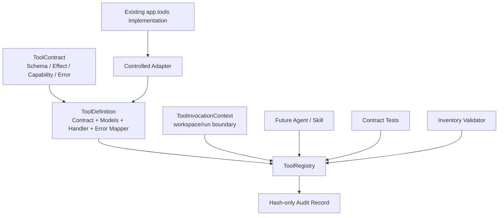

# Phase 40：Tool Contract Testing 与受控工具目录

> 本章是在 Phase 39 已完成之后的下一阶段实现教程。
>
> **本教程中的源码均为待实现代码。**教程会明确指出需要新增或修改的文件，并给出带上下文的完整代码、测试命令、故障注入和手工验收步骤；教程本身不会直接修改 `app/`、`tests/` 或配置文件。
>
> 当前继续面向**单机、单用户**。本阶段不增加新的自动执行能力，而是先为已有工具建立可以验证的输入、输出、副作用、权限、错误和审计契约。

---

## 一、为什么 Phase 40 先做工具契约

> **本节类型：背景解释，不修改代码。**

当前项目已经存在很多名字中带 `tools` 的函数，例如：

```text
repo_tools.get_file_tree()
search_tools.search_text()
code_tools.read_file_slice()
log_tools.read_log()
safe_shell_tools.assess_action_risk()
patch_tools.apply_verified_patch_to_source()
exec_tools.run_action_safe()
```

但这些函数目前不是同一种“工具”：

```text
有的只做纯文本转换；
有的读取 Workspace；
有的读取 Run 日志；
有的启动 rg 子进程；
有的修改仓库；
有的启动论文训练程序；
有的只是节点内部 helper，不应该暴露给模型。
```

如果未来直接把这些函数注册给 Chat Agent 或 Skill/Plugin，会出现几个问题：

1. 模型看不到工具真正的副作用；
2. `dict`、dataclass、字符串和异常的返回约定不一致；
3. 新增工具时可能忘记声明权限和错误；
4. 文件路径可能越过 Workspace 或 Run 边界；
5. `rg` 等外部进程没有统一超时；
6. 测试只验证“函数能运行”，没有验证“实现仍满足公开契约”；
7. Patch、Executor 等安全边界可能被错误地包装成普通 Agent Tool；
8. 后续 Secret、Plugin 和 Browser Agent 无法依赖稳定的工具协议。

Phase 40 要建立的关系是：

```text
现有实现函数
    ↓ 受控 Adapter
ToolDefinition
    ├── Input Model
    ├── Output Model
    ├── Side Effects
    ├── Required Capabilities
    ├── Stable Errors
    ├── Timeout
    └── Audit Identity
    ↓
ToolRegistry
    ↓
Contract Tests / CLI Validation / Future Skill Runtime
```

这里的重点不是“把函数改名叫 Tool”，而是让系统可以回答：

```text
它能读什么？
它会改什么？
它会启动进程或访问网络吗？
谁有权调用？
失败时返回哪个稳定错误？
输入输出变更是否破坏兼容性？
调用记录是否泄漏原始参数？
```

---

## 二、本阶段完成后的能力

> **本节类型：目标说明，不修改代码。**

完成 Phase 40 后，系统应具备：

1. `ToolContract` 统一描述名称、版本、输入、输出、副作用和权限；
2. `ToolDefinition` 将公开契约绑定到真实 Adapter；
3. `ToolRegistry` 拒绝重名工具和结构漂移；
4. 所有 Contract 输入都经过 Pydantic 严格校验；
5. 所有 Contract 输出都经过 Pydantic 二次校验；
6. 已声明异常映射为稳定的 `ToolFailure`；
7. 未声明异常不会伪装成正常业务失败；
8. 文件工具通过 `ToolInvocationContext` 限制在 Workspace 或 Run 根目录；
9. 审计记录只保存输入/输出 Hash，不保存原始参数；
10. `rg` 搜索具有明确超时；
11. Repo 扫描忽略符号链接，不能沿链接读到 Workspace 外；
12. 工具模块 Inventory 明确区分可登记工具、内部 helper 和安全边界；
13. 新增 `app/tools/*.py` 模块但未登记用途时，测试会失败；
14. Cataloged 模块新增公开函数但未建立契约时，测试会失败；
15. CLI 可以离线检查整个 Tool Contract 系统；
16. 现有 Graph 和 Node 调用行为不被本阶段强制重写；
17. 后续 Secret、职责分离、Plugin 和 Browser Agent 可以复用同一 Registry。

---

## 三、本阶段明确不做

> **本节类型：范围说明，不修改代码。**

```text
不把所有 app/tools 函数暴露给 LLM
不让模型动态 import 任意 Python 函数
不让 Registry 绕过 Risk Check 和 Human Review
不把 Patch Apply 包装成可直接调用工具
不把 Executor 包装成普通 Chat Tool
不修改现有 Graph 的节点顺序
不一次性把所有 Node 改为 registry.invoke()
不实现 Secret Store（Phase 41）
不实现 Planner / Executor / Verifier 拆分（Phase 43）
不实现 Plugin 动态安装（Phase 48）
不实现 Browser Agent（Phase 51）
不增加网络访问
不引入 Redis、消息队列或新的数据库
```

本阶段只建立**契约目录和验证入口**。当前 Node 继续直接调用经过验证的内部函数；未来真正允许
Skill 或 Agent 调用的工具，必须通过本阶段的受控 Adapter 和 Registry。

---

## 四、先区分四个容易混淆的概念

> **本节类型：概念解释，不修改代码。**

### 4.1 Helper Function

普通内部函数，例如：

```python
def sha256_file(path: Path) -> str:
    ...
```

它不需要成为 Agent Tool，也不需要被模型发现。

### 4.2 Agent-Readable Tool

只允许在受控范围内读取或转换信息，例如：

```text
repo.list_files
code.read_file_slice
log.extract_traceback
```

即使是只读工具，也必须有限制，因为读取 Workspace 外文件同样属于越权。

### 4.3 Security Boundary

负责审批、执行、Patch 应用、资源下载或进程控制的模块，例如：

```text
exec_tools
patch_tools
preflight_tools
repository_lock_tools
```

它们不能因为位于 `app/tools/` 就自动变成 Agent Tool。它们应继续由 Graph、Policy、Hash 和
Human Review 控制。

### 4.4 Contract Test

契约测试不是只断言某个实现返回预期值，而是验证任何实现都必须满足相同协议：

```text
输入不合法 -> TOOL_INPUT_INVALID
路径越界   -> TOOL_PATH_OUTSIDE_SCOPE
文件不存在 -> TOOL_INPUT_NOT_FOUND
输出漂移   -> TOOL_OUTPUT_INVALID
未知异常   -> TOOL_UNDECLARED_EXCEPTION
```

未来即使把 `search.text` 从 `rg` 换成其他后端，只要仍通过同一组契约测试，调用方就不需要改变。

---

## 五、Phase 40 的安全边界

> **本节类型：架构约束，不修改代码。**

### 5.1 Contract 不是 Authority

契约描述工具的能力，不授予调用权限：

```text
Contract says what a tool can do
Policy decides whether it may be called
Approval authorizes a concrete side effect
Executor performs the side effect
```

### 5.2 Catalog 不自动扫描并执行函数

禁止使用下面这种实现：

```python
# 错误示例：把模块中的所有公开函数自动暴露给 Agent。
for name in dir(app.tools):
    registry.register(getattr(app.tools, name))
```

正确方式是显式登记 `ToolDefinition`，自动扫描只用于发现**遗漏**，不能用于自动授权。

### 5.3 审计记录不保存原始 Payload

Phase 41 才会实现统一 Secret Redactor。本阶段为了不提前制造泄漏面，审计只保存：

```text
tool name/version
input SHA-256
output SHA-256
status/error code
actor/request id
duration
```

### 5.4 高风险工具继续留在原安全图中

`apply_verified_patch_to_source()` 和 `run_action_safe()` 不进入第一版 Registry。原因不是它们没有
契约，而是它们已经属于更强的 Action/Approval 安全协议：

```text
Proposal -> content hash -> policy -> approval -> executor
```

未来 Plugin 只能产生 Proposal，不能直接得到这些函数的 handler。

### 5.5 Contract Version 与实现版本分开

```text
Tool Contract version：调用方可见协议
Implementation version：内部实现、依赖或提交版本
```

内部从 `rg` 改成 Python fallback，不一定需要升级 Contract；输入字段、输出字段或错误语义变化时，
必须升级 Contract version。

---

## 六、总体架构

> **本节类型：架构说明，不修改代码。**



第一版只登记十二个工具：

| Contract Name | 实现来源 | 副作用 | 调用范围 |
|---|---|---|---|
| `repo.get_file_tree` | `repo_tools` | 读取 Workspace | Agent read-only |
| `repo.list_files` | `repo_tools` | 读取 Workspace | Agent read-only |
| `repo.classify_repo_file` | `repo_tools` | 读取 Workspace | Agent read-only |
| `search.search_text` | `search_tools` | 读取 Workspace、启动 `rg` | Agent read-only |
| `search.search_keywords` | `search_tools` | 读取 Workspace、启动 `rg` | Agent read-only |
| `code.read_file_slice` | `code_tools` | 读取 Workspace | Agent read-only |
| `code.extract_python_symbols` | `code_tools` | 读取 Workspace | Agent read-only |
| `log.read_log` | `log_tools` | 读取 Run | Agent read-only |
| `log.extract_traceback` | `log_tools` | 无 | Agent read-only |
| `log.classify_error_heuristic` | `log_tools` | 无 | Agent read-only |
| `log.extract_repo_traceback_paths` | `log_tools` | 读取 Workspace 元数据 | Agent read-only |
| `risk.assess_action_risk` | `safe_shell_tools` | 无 | Trusted node only |

`risk.assess_action_risk` 只供策略节点使用，不能让 LLM 通过调用它来自行宣布动作安全。

---

## 七、涉及文件与推荐顺序

> **本节类型：实施清单，不修改代码。**

### 7.1 需要新增

```text
app/tool_contracts/__init__.py
app/tool_contracts/schemas.py
app/tool_contracts/errors.py
app/tool_contracts/models.py
app/tool_contracts/adapters.py
app/tool_contracts/registry.py
app/tool_contracts/catalog.py
app/tool_contracts/inventory.py
app/tool_contracts/checks.py

tests/test_tool_contract_schemas.py
tests/test_tool_contract_registry.py
tests/test_tool_contract_catalog.py
tests/test_tool_contract_inventory.py
```

### 7.2 需要修改

```text
app/tools/repo_tools.py
app/tools/search_tools.py
app/main.py
tests/test_search_tools_v2.py
a_implementation_guides/README.md
```

### 7.3 本阶段不修改

```text
app/graph.py
app/state.py
app/nodes/*.py
app/execution/*.py
app/resources/*.py
app/chat/*.py
app/schemas.py
web/*
```

### 7.4 推荐实施顺序

```text
修复 repo/search 的基础边界
  -> schemas/errors/models
  -> controlled adapters
  -> registry
  -> catalog
  -> inventory/checks
  -> CLI
  -> unit tests
  -> regression tests
  -> manual acceptance
```

---

## 八、先收紧 Repo 扫描边界

> **本节类型：需要修改源码和测试。**
>
> 需要修改：`app/tools/repo_tools.py`

当前 `get_file_tree()` 会把符号链接目录当作普通目录递归，`list_files()` 也可能把符号链接文件
作为普通文件返回。Contract 声称“只读 Workspace”之前，必须先让底层实现满足这个边界。

请将 `app/tools/repo_tools.py` 替换为下面的完整版本：

```python
from __future__ import annotations

from pathlib import Path


IGNORE_DIRS = {
    ".git",
    "__pycache__",
    ".venv",
    "node_modules",
    "outputs",
    "checkpoints",
    "wandb",
}


def _resolve_repo(repo_path: str) -> Path:
    """解析并验证仓库根目录，供本模块三个公开函数复用。"""

    root = Path(repo_path).expanduser().resolve()
    if not root.is_dir():
        raise FileNotFoundError(f"未找到代码仓库：{repo_path}")
    return root


def _ignored(relative_path: Path) -> bool:
    """只检查仓库相对路径，避免宿主机父目录名称影响过滤结果。"""

    return any(part in IGNORE_DIRS for part in relative_path.parts)


def get_file_tree(repo_path: str, max_depth: int = 3) -> str:
    root = _resolve_repo(repo_path)
    if max_depth < 1:
        return root.name + "/"

    lines: list[str] = [root.name + "/"]

    def walk(path: Path, depth: int, prefix: str = "") -> None:
        if depth > max_depth:
            return

        children = []
        for candidate in path.iterdir():
            relative = candidate.relative_to(root)
            if _ignored(relative) or candidate.is_symlink():
                # 即使链接最终仍位于仓库内，也不递归符号链接；这样行为更容易审计。
                continue
            children.append(candidate)

        children.sort(
            key=lambda item: (item.is_file(), item.name.lower())
        )
        for index, child in enumerate(children):
            last = index == len(children) - 1
            connector = "└── " if last else "├── "
            lines.append(
                prefix
                + connector
                + child.name
                + ("/" if child.is_dir() else "")
            )
            if child.is_dir():
                extension = "    " if last else "│   "
                walk(child, depth + 1, prefix + extension)

    walk(root, 1)
    return "\n".join(lines)


def list_files(
    repo_path: str,
    suffixes: tuple[str, ...] | None = None,
) -> list[str]:
    root = _resolve_repo(repo_path)
    normalized_suffixes = (
        tuple(value.lower() for value in suffixes)
        if suffixes is not None
        else None
    )

    files: list[str] = []
    for path in root.rglob("*"):
        relative = path.relative_to(root)
        if _ignored(relative) or path.is_symlink():
            continue
        if not path.is_file():
            continue
        if (
            normalized_suffixes is not None
            and path.suffix.lower() not in normalized_suffixes
        ):
            continue
        files.append(relative.as_posix())
    return sorted(files)


def classify_repo_file(repo_path: str) -> dict[str, list[str]]:
    files = list_files(repo_path)

    def contains_any(path: str, keywords: list[str]) -> bool:
        lower = path.lower()
        return any(keyword in lower for keyword in keywords)

    return {
        "readme_files": [
            item
            for item in files
            if Path(item).name.lower().startswith("readme")
        ],
        "train_entries": [
            item
            for item in files
            if contains_any(item, ["train", "finetune"])
        ],
        "eval_entries": [
            item
            for item in files
            if contains_any(item, ["eval", "test", "infer"])
        ],
        "config_files": [
            item
            for item in files
            if item.endswith(
                (".yaml", ".yml", ".json", ".toml", ".ini", ".cfg")
            )
            or contains_any(item, ["config", "configs"])
        ],
        "model_files": [
            item
            for item in files
            if contains_any(item, ["model", "models", "network", "net"])
        ],
        "dataset_files": [
            item
            for item in files
            if contains_any(item, ["dataset", "data", "dataloader"])
        ],
        "loss_files": [
            item
            for item in files
            if contains_any(item, ["loss", "criterion"])
        ],
    }
```

这里没有使用 `Path.is_relative_to()`，因为项目仍要求兼容 Python 3.10，但 `_resolve_repo()` 与
后续 Adapter 会统一执行 `resolve()` 和父目录边界检查。

---

## 九、为 `rg` 搜索增加确定性超时

> **本节类型：需要修改源码和测试。**
>
> 需要修改：`app/tools/search_tools.py`

Contract 如果声明工具有超时，真实实现就必须使用这个超时。只在 metadata 中写
`timeout_seconds=10`，但底层 `subprocess.run()` 可以无限等待，是一个虚假契约。

### 9.1 修改 `search_text()`

保留文件其他代码不变，将函数签名和 `subprocess.run()` 区域修改为：

```python
def search_text(
    repo_path: str,
    query: str,
    max_results: int = 20,
    *,
    literal: bool = True,
    ignore_case: bool = True,
    timeout_seconds: int = 10,
) -> list[dict]:
    """搜索文本，并区分零命中、工具错误和工具超时。"""

    root = _resolve_repo(repo_path)
    value = query.strip()
    if not value or max_results <= 0:
        return []
    if timeout_seconds < 1 or timeout_seconds > 60:
        raise ValueError("timeout_seconds 必须位于 1 到 60 秒之间")

    rg = shutil.which("rg")
    if rg is None:
        if not literal:
            raise SearchToolError(
                "regex 搜索要求安装 rg；"
                "Python fallback 只支持 literal"
            )
        return _python_literal_search(
            root=root,
            query=value,
            max_results=max_results,
            ignore_case=ignore_case,
        )

    args = [
        rg,
        "--json",
        "--line-number",
        "--color",
        "never",
    ]
    if literal:
        args.append("--fixed-strings")
    if ignore_case:
        args.append("--ignore-case")

    for ignored in sorted({*IGNORE_DIRS, ".pytest_cache"}):
        args.extend(["--glob", f"!{ignored}/**"])

    args.extend(["--", value, str(root)])

    try:
        result = subprocess.run(
            args,
            check=False,
            capture_output=True,
            text=True,
            timeout=timeout_seconds,
        )
    except subprocess.TimeoutExpired as exc:
        raise SearchToolError(
            f"rg 搜索在 {timeout_seconds} 秒后超时"
        ) from exc
    except OSError as exc:
        if literal:
            return _python_literal_search(
                root=root,
                query=value,
                max_results=max_results,
                ignore_case=ignore_case,
            )
        raise SearchToolError(f"无法启动 rg：{exc}") from exc

    if result.returncode == 1:
        return []
    if result.returncode != 0:
        message = result.stderr.strip() or (
            f"rg exited with {result.returncode}"
        )
        raise SearchToolError(message)

    return _parse_rg_json(
        root=root,
        stdout=result.stdout,
        max_results=max_results,
    )
```

### 9.2 修改 `search_keywords()`

让批量搜索也把相同超时传给每次底层调用：

```python
def search_keywords(
    repo_path: str,
    keywords: list[str],
    max_per_keyword: int = 10,
    *,
    timeout_seconds: int = 10,
) -> list[dict]:
    all_matches: list[dict] = []
    seen: set[tuple[str, int, str]] = set()

    for keyword in keywords:
        value = keyword.strip()
        if not value:
            continue
        for match in search_text(
            repo_path,
            value,
            max_results=max_per_keyword,
            literal=True,
            timeout_seconds=timeout_seconds,
        ):
            key = (
                match["file_path"],
                match["line"],
                match["text"],
            )
            if key in seen:
                continue
            seen.add(key)
            all_matches.append(
                {
                    **match,
                    "keyword": value,
                }
            )

    return all_matches
```

### 9.3 给现有搜索测试补超时分支

在 `tests/test_search_tools_v2.py` 末尾新增：

```python
def test_rg_timeout_is_explicit_tool_failure(
    tmp_path,
    monkeypatch,
):
    monkeypatch.setattr(
        search_tools.shutil,
        "which",
        lambda _: "/usr/bin/rg",
    )

    def timeout(*args, **kwargs):
        raise search_tools.subprocess.TimeoutExpired(
            cmd=args[0],
            timeout=kwargs["timeout"],
        )

    monkeypatch.setattr(
        search_tools.subprocess,
        "run",
        timeout,
    )

    with pytest.raises(
        SearchToolError,
        match="rg 搜索在 3 秒后超时",
    ):
        search_text(
            str(tmp_path),
            "PSTConv",
            timeout_seconds=3,
        )
```

---

## 十、定义 Tool Contract Schema

> **本节类型：需要新增源码。**
>
> 新增：`app/tool_contracts/schemas.py`

新建完整文件：

```python
from __future__ import annotations

from enum import Enum
from typing import Any, Literal

from pydantic import BaseModel, ConfigDict, Field, model_validator


class ContractModel(BaseModel):
    """所有公开契约对象都拒绝未知字段，避免协议静默漂移。"""

    model_config = ConfigDict(extra="forbid")


class ToolEffect(str, Enum):
    NONE = "none"
    FILESYSTEM_READ = "filesystem_read"
    FILESYSTEM_WRITE = "filesystem_write"
    PROCESS_SPAWN = "process_spawn"
    PROCESS_CONTROL = "process_control"
    NETWORK_READ = "network_read"
    NETWORK_WRITE = "network_write"
    REPOSITORY_WRITE = "repository_write"
    ENVIRONMENT_WRITE = "environment_write"


class ToolExposure(str, Enum):
    AGENT_READ_ONLY = "agent_read_only"
    TRUSTED_NODE_ONLY = "trusted_node_only"
    CONTROLLED_ACTION_ONLY = "controlled_action_only"


class ToolRisk(str, Enum):
    LOW = "low"
    MEDIUM = "medium"
    HIGH = "high"


class ToolDeterminism(str, Enum):
    DETERMINISTIC = "deterministic"
    ENVIRONMENT_DEPENDENT = "environment_dependent"
    PROVIDER_DEPENDENT = "provider_dependent"


class ToolErrorSpec(ContractModel):
    code: str = Field(pattern=r"^[A-Z][A-Z0-9_]{2,63}$")
    category: Literal["user", "environment", "policy", "tool"]
    retryable: bool = False
    summary: str = Field(min_length=1, max_length=300)


class ToolContract(ContractModel):
    name: str = Field(
        pattern=r"^[a-z][a-z0-9_]*(\.[a-z][a-z0-9_]*)+$"
    )
    version: str = Field(pattern=r"^phase40-v[1-9][0-9]*$")
    summary: str = Field(min_length=1, max_length=300)
    input_schema: dict[str, Any]
    output_schema: dict[str, Any]
    effects: list[ToolEffect] = Field(min_length=1)
    required_capabilities: list[str] = Field(default_factory=list)
    exposure: ToolExposure
    risk_level: ToolRisk
    determinism: ToolDeterminism
    idempotent: bool
    timeout_seconds: int | None = Field(default=None, ge=1, le=300)
    audit_event: str = Field(
        pattern=r"^tool\.[a-z][a-z0-9_.]*$"
    )
    path_scopes: list[Literal["workspace", "run"]] = Field(
        default_factory=list
    )
    declared_errors: list[ToolErrorSpec] = Field(default_factory=list)

    @model_validator(mode="after")
    def validate_security_metadata(self) -> "ToolContract":
        effect_set = set(self.effects)
        if ToolEffect.NONE in effect_set and len(effect_set) != 1:
            raise ValueError("none 不能与其他副作用同时声明")

        if effect_set != {ToolEffect.NONE} and not self.required_capabilities:
            raise ValueError("存在副作用的工具必须声明 required_capabilities")

        if (
            ToolEffect.PROCESS_SPAWN in effect_set
            or ToolEffect.NETWORK_READ in effect_set
            or ToolEffect.NETWORK_WRITE in effect_set
        ) and self.timeout_seconds is None:
            raise ValueError("进程或网络工具必须声明 timeout_seconds")

        write_effects = {
            ToolEffect.FILESYSTEM_WRITE,
            ToolEffect.PROCESS_CONTROL,
            ToolEffect.NETWORK_WRITE,
            ToolEffect.REPOSITORY_WRITE,
            ToolEffect.ENVIRONMENT_WRITE,
        }
        if (
            self.exposure == ToolExposure.AGENT_READ_ONLY
            and effect_set.intersection(write_effects)
        ):
            raise ValueError("agent_read_only 工具不能声明写或控制副作用")

        if (
            self.exposure == ToolExposure.AGENT_READ_ONLY
            and self.risk_level == ToolRisk.HIGH
        ):
            raise ValueError("高风险工具不能直接标记为 agent_read_only")

        error_codes = [item.code for item in self.declared_errors]
        if len(error_codes) != len(set(error_codes)):
            raise ValueError("declared_errors code 不能重复")
        return self


class ToolInvocationContext(ContractModel):
    """调用方提供的边界，而不是由模型放进 Tool 输入。"""

    actor: str = Field(min_length=1, max_length=200)
    request_id: str = Field(min_length=1, max_length=200)
    caller_kind: Literal["agent", "trusted_node", "operator"]
    workspace_root: str | None = None
    run_root: str | None = None


class ToolFailure(ContractModel):
    code: str = Field(pattern=r"^[A-Z][A-Z0-9_]{2,63}$")
    category: Literal["user", "environment", "policy", "tool"]
    retryable: bool = False
    message: str = Field(min_length=1, max_length=1000)


class ToolCallRecord(ContractModel):
    call_id: str = Field(pattern=r"^toolcall_[0-9a-f]{16}$")
    tool_name: str
    tool_version: str
    status: Literal["succeeded", "failed"]
    input_sha256: str = Field(pattern=r"^[0-9a-f]{64}$")
    output_sha256: str | None = Field(
        default=None,
        pattern=r"^[0-9a-f]{64}$",
    )
    error_code: str | None = None
    effects: list[ToolEffect]
    actor: str
    request_id: str
    caller_kind: Literal["agent", "trusted_node", "operator"]
    started_at: str
    finished_at: str
    duration_ms: float = Field(ge=0)


class ToolExecutionResult(ContractModel):
    output: dict[str, Any] | None = None
    failure: ToolFailure | None = None
    record: ToolCallRecord

    @model_validator(mode="after")
    def validate_result_shape(self) -> "ToolExecutionResult":
        if self.record.status == "succeeded":
            if self.output is None or self.failure is not None:
                raise ValueError("成功结果必须只有 output")
        else:
            if self.failure is None or self.output is not None:
                raise ValueError("失败结果必须只有 failure")
        return self


class ContractIssue(ContractModel):
    code: str
    target: str
    message: str


class ContractValidationReport(ContractModel):
    ok: bool
    contracts_checked: int = Field(ge=0)
    modules_checked: int = Field(ge=0)
    issues: list[ContractIssue] = Field(default_factory=list)
```

这里故意没有 `raw_input`、`raw_output` 或异常 traceback 字段。Phase 40 的审计目标是证明调用发生过，
不是把工具所有数据复制到另一个可能泄漏的日志系统。

---

## 十一、定义 Contract 错误类型

> **本节类型：需要新增源码。**
>
> 新增：`app/tool_contracts/errors.py`

```python
from __future__ import annotations


class ToolContractError(RuntimeError):
    """Tool Contract 子系统的基础异常。"""


class ToolRegistryError(ToolContractError):
    """重名、缺失或定义不合法。"""


class ToolBoundaryError(ToolContractError):
    """受控 Adapter 检测到 Workspace/Run 路径越界。"""
```

普通工具失败通过 `ToolFailure` 返回；上面两个异常用于 Contract 系统自身和 Adapter 边界，之后由
Registry 映射成稳定错误。

---

## 十二、定义第一批输入输出模型

> **本节类型：需要新增源码。**
>
> 新增：`app/tool_contracts/models.py`

新建完整文件：

```python
from __future__ import annotations

import json
from pathlib import PurePosixPath
from typing import Any, Literal

from pydantic import Field, field_validator, model_validator

from app.tool_contracts.schemas import ContractModel


def _validate_relative_path(value: str) -> str:
    path = PurePosixPath(value)
    if path.is_absolute() or ".." in path.parts or value in {"", "."}:
        raise ValueError("输出路径必须是安全的仓库相对路径")
    return path.as_posix()


class RepoTreeInput(ContractModel):
    repo_path: str = Field(min_length=1, max_length=4096)
    max_depth: int = Field(default=3, ge=1, le=8)


class RepoTreeOutput(ContractModel):
    tree: str = Field(max_length=200_000)


class RepoPathInput(ContractModel):
    repo_path: str = Field(min_length=1, max_length=4096)


class RepoListFilesInput(ContractModel):
    repo_path: str = Field(min_length=1, max_length=4096)
    suffixes: list[str] | None = Field(default=None, max_length=32)

    @field_validator("suffixes")
    @classmethod
    def validate_suffixes(
        cls,
        value: list[str] | None,
    ) -> list[str] | None:
        if value is None:
            return None
        normalized: list[str] = []
        for suffix in value:
            item = suffix.strip().lower()
            if not item.startswith(".") or len(item) > 20:
                raise ValueError("suffix 必须是类似 .py 的短扩展名")
            if item not in normalized:
                normalized.append(item)
        return normalized


class RelativeFilesOutput(ContractModel):
    files: list[str] = Field(max_length=20_000)

    @field_validator("files")
    @classmethod
    def validate_files(cls, value: list[str]) -> list[str]:
        return [_validate_relative_path(item) for item in value]


class RepoClassificationOutput(ContractModel):
    readme_files: list[str]
    train_entries: list[str]
    eval_entries: list[str]
    config_files: list[str]
    model_files: list[str]
    dataset_files: list[str]
    loss_files: list[str]

    @field_validator("*", mode="after")
    @classmethod
    def validate_paths(cls, value: list[str]) -> list[str]:
        return [_validate_relative_path(item) for item in value]


class SearchTextInput(ContractModel):
    repo_path: str = Field(min_length=1, max_length=4096)
    query: str = Field(min_length=1, max_length=1000)
    max_results: int = Field(default=20, ge=1, le=200)
    literal: bool = True
    ignore_case: bool = True
    timeout_seconds: int = Field(default=10, ge=1, le=60)


class SearchKeywordsInput(ContractModel):
    repo_path: str = Field(min_length=1, max_length=4096)
    # 最多 5 个关键词，每个最多等待 10 秒，使整个 Adapter 保持在 60 秒契约上限内。
    keywords: list[str] = Field(min_length=1, max_length=5)
    max_per_keyword: int = Field(default=10, ge=1, le=100)
    timeout_seconds: int = Field(default=10, ge=1, le=10)

    @field_validator("keywords")
    @classmethod
    def normalize_keywords(cls, value: list[str]) -> list[str]:
        normalized = [item.strip() for item in value if item.strip()]
        if not normalized:
            raise ValueError("keywords 不能全部为空")
        if any(len(item) > 1000 for item in normalized):
            raise ValueError("单个 keyword 不能超过 1000 字符")
        return normalized


class SearchMatch(ContractModel):
    file_path: str
    line: int = Field(ge=1)
    text: str = Field(max_length=20_000)

    @field_validator("file_path")
    @classmethod
    def validate_file_path(cls, value: str) -> str:
        return _validate_relative_path(value)


class KeywordSearchMatch(SearchMatch):
    keyword: str = Field(min_length=1, max_length=1000)


class SearchTextOutput(ContractModel):
    matches: list[SearchMatch] = Field(max_length=200)


class SearchKeywordsOutput(ContractModel):
    matches: list[KeywordSearchMatch] = Field(max_length=500)


class CodeSliceInput(ContractModel):
    path: str = Field(min_length=1, max_length=4096)
    start_line: int = Field(default=1, ge=1)
    end_line: int = Field(default=120, ge=1)

    @model_validator(mode="after")
    def validate_window(self) -> "CodeSliceInput":
        if self.end_line < self.start_line:
            raise ValueError("end_line 不能小于 start_line")
        if self.end_line - self.start_line + 1 > 500:
            raise ValueError("单次最多读取 500 行")
        return self


class CodeSliceOutput(ContractModel):
    text: str = Field(max_length=200_000)


class PythonSymbolsInput(ContractModel):
    path: str = Field(min_length=1, max_length=4096)


class PythonSymbol(ContractModel):
    type: Literal["class", "function"]
    name: str = Field(min_length=1, max_length=300)
    line: int = Field(ge=1)


class PythonSymbolsOutput(ContractModel):
    symbols: list[PythonSymbol] = Field(max_length=10_000)


class ReadLogInput(ContractModel):
    path: str = Field(min_length=1, max_length=4096)
    max_chars: int = Field(default=30_000, ge=1, le=100_000)


class TextTransformInput(ContractModel):
    text: str = Field(max_length=200_000)


class TextOutput(ContractModel):
    text: str = Field(max_length=200_000)


class ErrorClassificationOutput(ContractModel):
    category: Literal[
        "dependency_missing",
        "data_or_path_error",
        "cuda_oom",
        "shape_mismatch",
        "permission_error",
        "unknown",
    ]


class TracebackPathsInput(ContractModel):
    traceback: str = Field(max_length=200_000)
    repo_path: str | None = Field(default=None, max_length=4096)


class TracebackPathsOutput(ContractModel):
    paths: list[str] = Field(max_length=200)

    @field_validator("paths")
    @classmethod
    def validate_paths(cls, value: list[str]) -> list[str]:
        return [_validate_relative_path(item) for item in value]


class ActionRiskInput(ContractModel):
    action: dict[str, Any]

    @model_validator(mode="after")
    def limit_action_size(self) -> "ActionRiskInput":
        payload = json.dumps(
            self.action,
            ensure_ascii=False,
            default=str,
        )
        if len(payload) > 20_000:
            raise ValueError("action payload 过大")
        return self


class ActionRiskOutput(ContractModel):
    program: str
    args: list[str]
    risk_level: Literal["low", "medium", "high", "blocked"]
    reason: str
    blocked: bool
```

这些模型不是为了取代项目已有的 `ExecutableAction` 等业务 Schema，而是定义 **Tool Adapter 的
公开边界**。例如 `CodeSliceInput` 限制一次最多 500 行，即使底层 helper 本身允许更大范围。

---

## 十三、实现受控 Adapter

> **本节类型：需要新增源码。**
>
> 新增：`app/tool_contracts/adapters.py`

Adapter 的职责是：

```text
校验调用上下文
解析受控路径
转换输入类型
调用现有实现
转换为输出 Model
```

新建完整文件：

```python
from __future__ import annotations

from dataclasses import asdict
from pathlib import Path

from app.tool_contracts.errors import ToolBoundaryError
from app.tool_contracts.models import (
    ActionRiskInput,
    ActionRiskOutput,
    CodeSliceInput,
    CodeSliceOutput,
    ErrorClassificationOutput,
    PythonSymbolsInput,
    PythonSymbolsOutput,
    ReadLogInput,
    RelativeFilesOutput,
    RepoClassificationOutput,
    RepoListFilesInput,
    RepoPathInput,
    RepoTreeInput,
    RepoTreeOutput,
    SearchKeywordsInput,
    SearchKeywordsOutput,
    SearchTextInput,
    SearchTextOutput,
    TextOutput,
    TextTransformInput,
    TracebackPathsInput,
    TracebackPathsOutput,
)
from app.tool_contracts.schemas import ToolInvocationContext
from app.tools import (
    code_tools,
    log_tools,
    repo_tools,
    safe_shell_tools,
    search_tools,
)


def _context_root(
    context: ToolInvocationContext,
    scope: str,
) -> Path:
    raw_root = (
        context.workspace_root
        if scope == "workspace"
        else context.run_root
    )
    if not raw_root:
        raise ToolBoundaryError(f"调用上下文缺少 {scope}_root")

    root = Path(raw_root).expanduser().resolve()
    if not root.is_dir():
        raise FileNotFoundError(f"{scope}_root 不存在")
    return root


def _resolve_scoped_path(
    raw_path: str,
    *,
    context: ToolInvocationContext,
    scope: str,
    expected: str,
) -> Path:
    root = _context_root(context, scope)
    candidate = Path(raw_path).expanduser()
    unresolved = candidate if candidate.is_absolute() else root / candidate
    resolved = unresolved.resolve()

    if resolved != root and root not in resolved.parents:
        raise ToolBoundaryError(f"路径位于 {scope}_root 之外")
    if unresolved.is_symlink():
        raise ToolBoundaryError("不允许把符号链接作为工具输入")

    if expected == "file" and not resolved.is_file():
        raise FileNotFoundError("工具输入文件不存在")
    if expected == "directory" and not resolved.is_dir():
        raise FileNotFoundError("工具输入目录不存在")
    return resolved


def repo_tree_adapter(
    payload: RepoTreeInput,
    context: ToolInvocationContext,
) -> RepoTreeOutput:
    repo = _resolve_scoped_path(
        payload.repo_path,
        context=context,
        scope="workspace",
        expected="directory",
    )
    return RepoTreeOutput(
        tree=repo_tools.get_file_tree(
            str(repo),
            max_depth=payload.max_depth,
        )
    )


def repo_list_files_adapter(
    payload: RepoListFilesInput,
    context: ToolInvocationContext,
) -> RelativeFilesOutput:
    repo = _resolve_scoped_path(
        payload.repo_path,
        context=context,
        scope="workspace",
        expected="directory",
    )
    suffixes = (
        tuple(payload.suffixes)
        if payload.suffixes is not None
        else None
    )
    return RelativeFilesOutput(
        files=repo_tools.list_files(
            str(repo),
            suffixes=suffixes,
        )
    )


def repo_classify_adapter(
    payload: RepoPathInput,
    context: ToolInvocationContext,
) -> RepoClassificationOutput:
    repo = _resolve_scoped_path(
        payload.repo_path,
        context=context,
        scope="workspace",
        expected="directory",
    )
    return RepoClassificationOutput.model_validate(
        repo_tools.classify_repo_file(str(repo))
    )


def search_text_adapter(
    payload: SearchTextInput,
    context: ToolInvocationContext,
) -> SearchTextOutput:
    repo = _resolve_scoped_path(
        payload.repo_path,
        context=context,
        scope="workspace",
        expected="directory",
    )
    return SearchTextOutput(
        matches=search_tools.search_text(
            str(repo),
            payload.query,
            max_results=payload.max_results,
            literal=payload.literal,
            ignore_case=payload.ignore_case,
            timeout_seconds=payload.timeout_seconds,
        )
    )


def search_keywords_adapter(
    payload: SearchKeywordsInput,
    context: ToolInvocationContext,
) -> SearchKeywordsOutput:
    repo = _resolve_scoped_path(
        payload.repo_path,
        context=context,
        scope="workspace",
        expected="directory",
    )
    return SearchKeywordsOutput(
        matches=search_tools.search_keywords(
            str(repo),
            payload.keywords,
            max_per_keyword=payload.max_per_keyword,
            timeout_seconds=payload.timeout_seconds,
        )
    )


def code_slice_adapter(
    payload: CodeSliceInput,
    context: ToolInvocationContext,
) -> CodeSliceOutput:
    path = _resolve_scoped_path(
        payload.path,
        context=context,
        scope="workspace",
        expected="file",
    )
    if path.stat().st_size > 2 * 1024 * 1024:
        raise ValueError("代码文件超过 2 MiB 读取上限")
    return CodeSliceOutput(
        text=code_tools.read_file_slice(
            str(path),
            start_line=payload.start_line,
            end_line=payload.end_line,
        )
    )


def python_symbols_adapter(
    payload: PythonSymbolsInput,
    context: ToolInvocationContext,
) -> PythonSymbolsOutput:
    path = _resolve_scoped_path(
        payload.path,
        context=context,
        scope="workspace",
        expected="file",
    )
    if path.suffix.lower() != ".py":
        raise ValueError("符号抽取只接受 .py 文件")
    if path.stat().st_size > 2 * 1024 * 1024:
        raise ValueError("Python 文件超过 2 MiB 解析上限")
    return PythonSymbolsOutput(
        symbols=code_tools.extract_python_symbols(str(path))
    )


def read_log_adapter(
    payload: ReadLogInput,
    context: ToolInvocationContext,
) -> TextOutput:
    path = _resolve_scoped_path(
        payload.path,
        context=context,
        scope="run",
        expected="file",
    )
    if path.stat().st_size > 50 * 1024 * 1024:
        raise ValueError("日志文件超过 50 MiB 读取上限")
    return TextOutput(
        text=log_tools.read_log(
            str(path),
            max_chars=payload.max_chars,
        )
    )


def extract_traceback_adapter(
    payload: TextTransformInput,
    context: ToolInvocationContext,
) -> TextOutput:
    del context
    return TextOutput(
        text=log_tools.extract_traceback(payload.text)
    )


def classify_error_adapter(
    payload: TextTransformInput,
    context: ToolInvocationContext,
) -> ErrorClassificationOutput:
    del context
    return ErrorClassificationOutput(
        category=log_tools.classify_error_heuristic(payload.text)
    )


def traceback_paths_adapter(
    payload: TracebackPathsInput,
    context: ToolInvocationContext,
) -> TracebackPathsOutput:
    if payload.repo_path is None:
        return TracebackPathsOutput(paths=[])
    repo = _resolve_scoped_path(
        payload.repo_path,
        context=context,
        scope="workspace",
        expected="directory",
    )
    return TracebackPathsOutput(
        paths=log_tools.extract_repo_traceback_paths(
            payload.traceback,
            repo_path=str(repo),
        )
    )


def assess_action_risk_adapter(
    payload: ActionRiskInput,
    context: ToolInvocationContext,
) -> ActionRiskOutput:
    del context
    risk = safe_shell_tools.assess_action_risk(payload.action)
    return ActionRiskOutput.model_validate(asdict(risk))
```

注意：`ToolInvocationContext` 由服务端构造，不能让模型在 JSON 输入里自行指定
`workspace_root=/`。这就是 Context 与 Payload 分离的原因。

---

## 十四、实现 Registry 与统一调用结果

> **本节类型：需要新增源码。**
>
> 新增：`app/tool_contracts/registry.py`

新建完整文件：

```python
from __future__ import annotations

import hashlib
import inspect
import json
from collections.abc import Callable
from dataclasses import dataclass
from datetime import datetime, timezone
from time import perf_counter
from typing import Any, Optional, Protocol
from uuid import uuid4

from pydantic import BaseModel, ValidationError

from app.tool_contracts.errors import ToolRegistryError
from app.tool_contracts.schemas import (
    ContractIssue,
    ToolCallRecord,
    ToolContract,
    ToolDeterminism,
    ToolEffect,
    ToolErrorSpec,
    ToolExecutionResult,
    ToolExposure,
    ToolFailure,
    ToolInvocationContext,
    ToolRisk,
)


ToolHandler = Callable[[BaseModel, ToolInvocationContext], object]
ToolErrorMapper = Callable[[BaseException], Optional[ToolFailure]]


def _utc_now() -> str:
    return datetime.now(timezone.utc).isoformat()


def _canonical_payload(value: object) -> bytes:
    if isinstance(value, BaseModel):
        material = value.model_dump(mode="json")
    else:
        material = value
    return json.dumps(
        material,
        ensure_ascii=False,
        sort_keys=True,
        separators=(",", ":"),
        default=str,
    ).encode("utf-8")


def _sha256(value: object) -> str:
    return hashlib.sha256(_canonical_payload(value)).hexdigest()


@dataclass(frozen=True)
class ToolDefinition:
    contract: ToolContract
    input_model: type[BaseModel]
    output_model: type[BaseModel]
    handler: ToolHandler
    error_mapper: ToolErrorMapper


class ToolAuditSink(Protocol):
    def write(self, record: ToolCallRecord) -> None:
        ...


class InMemoryToolAuditSink:
    """测试和未来单进程 Skill Runtime 使用的最小审计 Sink。"""

    def __init__(self) -> None:
        self.records: list[ToolCallRecord] = []

    def write(self, record: ToolCallRecord) -> None:
        self.records.append(record)


class NullToolAuditSink:
    def write(self, record: ToolCallRecord) -> None:
        del record


def build_tool_definition(
    *,
    name: str,
    version: str,
    summary: str,
    input_model: type[BaseModel],
    output_model: type[BaseModel],
    handler: ToolHandler,
    error_mapper: ToolErrorMapper,
    effects: list[ToolEffect],
    required_capabilities: list[str],
    exposure: ToolExposure,
    risk_level: ToolRisk,
    determinism: ToolDeterminism,
    idempotent: bool,
    timeout_seconds: int | None,
    audit_event: str,
    path_scopes: list[str],
    declared_errors: list[ToolErrorSpec],
) -> ToolDefinition:
    contract = ToolContract(
        name=name,
        version=version,
        summary=summary,
        input_schema=input_model.model_json_schema(),
        output_schema=output_model.model_json_schema(),
        effects=effects,
        required_capabilities=required_capabilities,
        exposure=exposure,
        risk_level=risk_level,
        determinism=determinism,
        idempotent=idempotent,
        timeout_seconds=timeout_seconds,
        audit_event=audit_event,
        path_scopes=path_scopes,
        declared_errors=declared_errors,
    )
    return ToolDefinition(
        contract=contract,
        input_model=input_model,
        output_model=output_model,
        handler=handler,
        error_mapper=error_mapper,
    )


class ToolRegistry:
    def __init__(self) -> None:
        self._definitions: dict[str, ToolDefinition] = {}

    def register(self, definition: ToolDefinition) -> None:
        name = definition.contract.name
        if name in self._definitions:
            raise ToolRegistryError(f"工具重复注册：{name}")
        self._definitions[name] = definition

    def get(self, name: str) -> ToolDefinition:
        try:
            return self._definitions[name]
        except KeyError as exc:
            raise ToolRegistryError(f"工具未注册：{name}") from exc

    def names(self) -> list[str]:
        return sorted(self._definitions)

    def catalog_snapshot(self) -> list[dict[str, Any]]:
        """导出内部契约快照；它不是可以直接交给模型的授权列表。"""

        return [
            self._definitions[name].contract.model_dump(mode="json")
            for name in self.names()
        ]

    def validate_definitions(self) -> list[ContractIssue]:
        issues: list[ContractIssue] = []
        for name in self.names():
            definition = self._definitions[name]
            contract = definition.contract

            if contract.input_schema != definition.input_model.model_json_schema():
                issues.append(
                    ContractIssue(
                        code="INPUT_SCHEMA_DRIFT",
                        target=name,
                        message="contract input_schema 与 input_model 不一致",
                    )
                )
            if contract.output_schema != definition.output_model.model_json_schema():
                issues.append(
                    ContractIssue(
                        code="OUTPUT_SCHEMA_DRIFT",
                        target=name,
                        message="contract output_schema 与 output_model 不一致",
                    )
                )

            parameters = list(inspect.signature(definition.handler).parameters.values())
            if (
                len(parameters) != 2
                or any(
                    item.kind
                    in {
                        inspect.Parameter.VAR_POSITIONAL,
                        inspect.Parameter.VAR_KEYWORD,
                    }
                    for item in parameters
                )
            ):
                issues.append(
                    ContractIssue(
                        code="INVALID_HANDLER_SIGNATURE",
                        target=name,
                        message="handler 必须接收 payload 和 context 两个参数",
                    )
                )
        return issues

    def invoke(
        self,
        *,
        name: str,
        raw_input: dict[str, Any],
        context: ToolInvocationContext,
        audit_sink: ToolAuditSink | None = None,
    ) -> ToolExecutionResult:
        definition = self.get(name)
        sink = audit_sink or NullToolAuditSink()
        started_at = _utc_now()
        started = perf_counter()
        input_sha256 = _sha256(raw_input)

        allowed_exposures = {
            "agent": {ToolExposure.AGENT_READ_ONLY},
            "trusted_node": {
                ToolExposure.AGENT_READ_ONLY,
                ToolExposure.TRUSTED_NODE_ONLY,
            },
            "operator": set(ToolExposure),
        }
        if definition.contract.exposure not in allowed_exposures[
            context.caller_kind
        ]:
            return self._failed_result(
                definition=definition,
                context=context,
                sink=sink,
                started=started,
                started_at=started_at,
                input_sha256=input_sha256,
                failure=ToolFailure(
                    code="TOOL_ACCESS_DENIED",
                    category="policy",
                    retryable=False,
                    message="当前调用方类型无权使用该工具",
                ),
            )

        try:
            payload = definition.input_model.model_validate(raw_input)
        except ValidationError:
            return self._failed_result(
                definition=definition,
                context=context,
                sink=sink,
                started=started,
                started_at=started_at,
                input_sha256=input_sha256,
                failure=ToolFailure(
                    code="TOOL_INPUT_INVALID",
                    category="user",
                    retryable=False,
                    message="工具输入不符合公开 Schema",
                ),
            )

        try:
            raw_output = definition.handler(payload, context)
        except Exception as exc:
            mapper_failed = False
            try:
                mapped = definition.error_mapper(exc)
            except Exception:
                # 错误映射器本身也是受契约约束的代码，不能泄漏第二个异常。
                mapper_failed = True
                mapped = ToolFailure(
                    code="TOOL_ERROR_MAPPER_FAILED",
                    category="tool",
                    retryable=False,
                    message="工具错误映射器执行失败",
                )
            declared_codes = {
                item.code for item in definition.contract.declared_errors
            }
            if mapped is None:
                mapped = ToolFailure(
                    code="TOOL_UNDECLARED_EXCEPTION",
                    category="tool",
                    retryable=False,
                    message="工具抛出了契约未声明的异常",
                )
            elif not mapper_failed and mapped.code not in declared_codes:
                mapped = ToolFailure(
                    code="TOOL_ERROR_NOT_DECLARED",
                    category="tool",
                    retryable=False,
                    message="错误映射器返回了契约未声明的错误码",
                )
            return self._failed_result(
                definition=definition,
                context=context,
                sink=sink,
                started=started,
                started_at=started_at,
                input_sha256=input_sha256,
                failure=mapped,
            )

        try:
            output = definition.output_model.model_validate(raw_output)
        except ValidationError:
            return self._failed_result(
                definition=definition,
                context=context,
                sink=sink,
                started=started,
                started_at=started_at,
                input_sha256=input_sha256,
                failure=ToolFailure(
                    code="TOOL_OUTPUT_INVALID",
                    category="tool",
                    retryable=False,
                    message="工具输出不符合公开 Schema",
                ),
            )

        output_payload = output.model_dump(mode="json")
        record = ToolCallRecord(
            call_id=f"toolcall_{uuid4().hex[:16]}",
            tool_name=definition.contract.name,
            tool_version=definition.contract.version,
            status="succeeded",
            input_sha256=input_sha256,
            output_sha256=_sha256(output_payload),
            effects=definition.contract.effects,
            actor=context.actor,
            request_id=context.request_id,
            caller_kind=context.caller_kind,
            started_at=started_at,
            finished_at=_utc_now(),
            duration_ms=(perf_counter() - started) * 1000,
        )
        sink.write(record)
        return ToolExecutionResult(
            output=output_payload,
            record=record,
        )

    @staticmethod
    def _failed_result(
        *,
        definition: ToolDefinition,
        context: ToolInvocationContext,
        sink: ToolAuditSink,
        started: float,
        started_at: str,
        input_sha256: str,
        failure: ToolFailure,
    ) -> ToolExecutionResult:
        record = ToolCallRecord(
            call_id=f"toolcall_{uuid4().hex[:16]}",
            tool_name=definition.contract.name,
            tool_version=definition.contract.version,
            status="failed",
            input_sha256=input_sha256,
            error_code=failure.code,
            effects=definition.contract.effects,
            actor=context.actor,
            request_id=context.request_id,
            caller_kind=context.caller_kind,
            started_at=started_at,
            finished_at=_utc_now(),
            duration_ms=(perf_counter() - started) * 1000,
        )
        sink.write(record)
        return ToolExecutionResult(
            failure=failure,
            record=record,
        )
```

Registry 只捕获 `Exception`。`KeyboardInterrupt` 和 `SystemExit` 等进程控制信号必须继续向上
传播，不能被伪装成普通 `TOOL_UNDECLARED_EXCEPTION`。

---

## 十五、建立显式 Tool Catalog

> **本节类型：需要新增源码。**
>
> 新增：`app/tool_contracts/catalog.py`

### 15.1 确认专用输入模型

前面的完整 `models.py` 已定义 `RepoPathInput`，完整 `adapters.py` 也已经让
`repo_classify_adapter()` 使用它。不要为了复用而让 `repo.classify_repo_file` 暴露一个实际不支持的
`suffixes` 字段；公开 Schema 应该表达真实能力，而不是 Adapter 内部的便利。

### 15.2 完整 Catalog

新建 `app/tool_contracts/catalog.py`：

```python
from __future__ import annotations

import app.tool_contracts.adapters as adapters
from app.tool_contracts.errors import ToolBoundaryError
from app.tool_contracts.models import (
    ActionRiskInput,
    ActionRiskOutput,
    CodeSliceInput,
    CodeSliceOutput,
    ErrorClassificationOutput,
    PythonSymbolsInput,
    PythonSymbolsOutput,
    ReadLogInput,
    RelativeFilesOutput,
    RepoClassificationOutput,
    RepoListFilesInput,
    RepoPathInput,
    RepoTreeInput,
    RepoTreeOutput,
    SearchKeywordsInput,
    SearchKeywordsOutput,
    SearchTextInput,
    SearchTextOutput,
    TextOutput,
    TextTransformInput,
    TracebackPathsInput,
    TracebackPathsOutput,
)
from app.tool_contracts.registry import (
    ToolRegistry,
    build_tool_definition,
)
from app.tool_contracts.schemas import (
    ToolDeterminism,
    ToolEffect,
    ToolErrorSpec,
    ToolExposure,
    ToolFailure,
    ToolRisk,
)
from app.tools.search_tools import SearchToolError


VERSION = "phase40-v1"


COMMON_READ_ERRORS = [
    ToolErrorSpec(
        code="TOOL_PATH_OUTSIDE_SCOPE",
        category="policy",
        retryable=False,
        summary="输入路径位于受控根目录之外",
    ),
    ToolErrorSpec(
        code="TOOL_INPUT_NOT_FOUND",
        category="user",
        retryable=False,
        summary="输入文件或目录不存在",
    ),
    ToolErrorSpec(
        code="TOOL_PERMISSION_DENIED",
        category="environment",
        retryable=False,
        summary="当前进程无权读取输入",
    ),
    ToolErrorSpec(
        code="TOOL_INPUT_REJECTED",
        category="policy",
        retryable=False,
        summary="输入违反 Adapter 的大小、类型或范围限制",
    ),
    ToolErrorSpec(
        code="TOOL_IO_ERROR",
        category="environment",
        retryable=False,
        summary="读取文件系统时发生错误",
    ),
]


SEARCH_ERRORS = [
    *COMMON_READ_ERRORS,
    ToolErrorSpec(
        code="TOOL_SEARCH_BACKEND_FAILED",
        category="tool",
        retryable=False,
        summary="rg 或搜索 fallback 执行失败",
    ),
]


PYTHON_ERRORS = [
    *COMMON_READ_ERRORS,
    ToolErrorSpec(
        code="TOOL_PYTHON_PARSE_FAILED",
        category="user",
        retryable=False,
        summary="Python 文件无法通过 ast 解析",
    ),
]


def map_read_error(exc: BaseException) -> ToolFailure | None:
    """只返回固定安全文案，不把原始异常文本写入审计结果。"""

    if isinstance(exc, ToolBoundaryError):
        return ToolFailure(
            code="TOOL_PATH_OUTSIDE_SCOPE",
            category="policy",
            message="工具输入路径位于允许范围之外",
        )
    if isinstance(exc, FileNotFoundError):
        return ToolFailure(
            code="TOOL_INPUT_NOT_FOUND",
            category="user",
            message="工具输入文件或目录不存在",
        )
    if isinstance(exc, PermissionError):
        return ToolFailure(
            code="TOOL_PERMISSION_DENIED",
            category="environment",
            message="当前进程无权读取工具输入",
        )
    if isinstance(exc, ValueError):
        return ToolFailure(
            code="TOOL_INPUT_REJECTED",
            category="policy",
            message="工具输入违反受控 Adapter 限制",
        )
    if isinstance(exc, OSError):
        return ToolFailure(
            code="TOOL_IO_ERROR",
            category="environment",
            message="读取工具输入时发生文件系统错误",
        )
    return None


def map_search_error(exc: BaseException) -> ToolFailure | None:
    if isinstance(exc, SearchToolError):
        return ToolFailure(
            code="TOOL_SEARCH_BACKEND_FAILED",
            category="tool",
            retryable=False,
            message="搜索后端执行失败或超时",
        )
    return map_read_error(exc)


def map_python_error(exc: BaseException) -> ToolFailure | None:
    if isinstance(exc, SyntaxError):
        return ToolFailure(
            code="TOOL_PYTHON_PARSE_FAILED",
            category="user",
            message="Python 文件语法无法解析",
        )
    return map_read_error(exc)


def no_declared_error(exc: BaseException) -> ToolFailure | None:
    del exc
    return None


def _register_repo_tools(registry: ToolRegistry) -> None:
    registry.register(
        build_tool_definition(
            name="repo.get_file_tree",
            version=VERSION,
            summary="读取受控 Workspace 中的仓库目录树",
            input_model=RepoTreeInput,
            output_model=RepoTreeOutput,
            handler=adapters.repo_tree_adapter,
            error_mapper=map_read_error,
            effects=[ToolEffect.FILESYSTEM_READ],
            required_capabilities=["filesystem.read.workspace"],
            exposure=ToolExposure.AGENT_READ_ONLY,
            risk_level=ToolRisk.LOW,
            determinism=ToolDeterminism.ENVIRONMENT_DEPENDENT,
            idempotent=True,
            timeout_seconds=None,
            audit_event="tool.repo.get_file_tree",
            path_scopes=["workspace"],
            declared_errors=COMMON_READ_ERRORS,
        )
    )
    registry.register(
        build_tool_definition(
            name="repo.list_files",
            version=VERSION,
            summary="列出受控 Workspace 中的仓库相对文件路径",
            input_model=RepoListFilesInput,
            output_model=RelativeFilesOutput,
            handler=adapters.repo_list_files_adapter,
            error_mapper=map_read_error,
            effects=[ToolEffect.FILESYSTEM_READ],
            required_capabilities=["filesystem.read.workspace"],
            exposure=ToolExposure.AGENT_READ_ONLY,
            risk_level=ToolRisk.LOW,
            determinism=ToolDeterminism.ENVIRONMENT_DEPENDENT,
            idempotent=True,
            timeout_seconds=None,
            audit_event="tool.repo.list_files",
            path_scopes=["workspace"],
            declared_errors=COMMON_READ_ERRORS,
        )
    )
    registry.register(
        build_tool_definition(
            name="repo.classify_repo_file",
            version=VERSION,
            summary="按训练、配置、模型和数据集等类别归类仓库文件",
            input_model=RepoPathInput,
            output_model=RepoClassificationOutput,
            handler=adapters.repo_classify_adapter,
            error_mapper=map_read_error,
            effects=[ToolEffect.FILESYSTEM_READ],
            required_capabilities=["filesystem.read.workspace"],
            exposure=ToolExposure.AGENT_READ_ONLY,
            risk_level=ToolRisk.LOW,
            determinism=ToolDeterminism.ENVIRONMENT_DEPENDENT,
            idempotent=True,
            timeout_seconds=None,
            audit_event="tool.repo.classify_repo_file",
            path_scopes=["workspace"],
            declared_errors=COMMON_READ_ERRORS,
        )
    )


def _register_search_tools(registry: ToolRegistry) -> None:
    registry.register(
        build_tool_definition(
            name="search.search_text",
            version=VERSION,
            summary="在受控 Workspace 中执行有数量和超时限制的文本搜索",
            input_model=SearchTextInput,
            output_model=SearchTextOutput,
            handler=adapters.search_text_adapter,
            error_mapper=map_search_error,
            effects=[
                ToolEffect.FILESYSTEM_READ,
                ToolEffect.PROCESS_SPAWN,
            ],
            required_capabilities=[
                "filesystem.read.workspace",
                "process.spawn.rg",
            ],
            exposure=ToolExposure.AGENT_READ_ONLY,
            risk_level=ToolRisk.MEDIUM,
            determinism=ToolDeterminism.ENVIRONMENT_DEPENDENT,
            idempotent=True,
            timeout_seconds=60,
            audit_event="tool.search.search_text",
            path_scopes=["workspace"],
            declared_errors=SEARCH_ERRORS,
        )
    )
    registry.register(
        build_tool_definition(
            name="search.search_keywords",
            version=VERSION,
            summary="在受控 Workspace 中对多个关键词执行去重搜索",
            input_model=SearchKeywordsInput,
            output_model=SearchKeywordsOutput,
            handler=adapters.search_keywords_adapter,
            error_mapper=map_search_error,
            effects=[
                ToolEffect.FILESYSTEM_READ,
                ToolEffect.PROCESS_SPAWN,
            ],
            required_capabilities=[
                "filesystem.read.workspace",
                "process.spawn.rg",
            ],
            exposure=ToolExposure.AGENT_READ_ONLY,
            risk_level=ToolRisk.MEDIUM,
            determinism=ToolDeterminism.ENVIRONMENT_DEPENDENT,
            idempotent=True,
            timeout_seconds=60,
            audit_event="tool.search.search_keywords",
            path_scopes=["workspace"],
            declared_errors=SEARCH_ERRORS,
        )
    )


def _register_code_tools(registry: ToolRegistry) -> None:
    registry.register(
        build_tool_definition(
            name="code.read_file_slice",
            version=VERSION,
            summary="读取受控 Workspace 中文件的有限行窗口",
            input_model=CodeSliceInput,
            output_model=CodeSliceOutput,
            handler=adapters.code_slice_adapter,
            error_mapper=map_read_error,
            effects=[ToolEffect.FILESYSTEM_READ],
            required_capabilities=["filesystem.read.workspace"],
            exposure=ToolExposure.AGENT_READ_ONLY,
            risk_level=ToolRisk.LOW,
            determinism=ToolDeterminism.ENVIRONMENT_DEPENDENT,
            idempotent=True,
            timeout_seconds=None,
            audit_event="tool.code.read_file_slice",
            path_scopes=["workspace"],
            declared_errors=COMMON_READ_ERRORS,
        )
    )
    registry.register(
        build_tool_definition(
            name="code.extract_python_symbols",
            version=VERSION,
            summary="从受控 Workspace 的 Python 文件抽取类和函数符号",
            input_model=PythonSymbolsInput,
            output_model=PythonSymbolsOutput,
            handler=adapters.python_symbols_adapter,
            error_mapper=map_python_error,
            effects=[ToolEffect.FILESYSTEM_READ],
            required_capabilities=["filesystem.read.workspace"],
            exposure=ToolExposure.AGENT_READ_ONLY,
            risk_level=ToolRisk.LOW,
            determinism=ToolDeterminism.ENVIRONMENT_DEPENDENT,
            idempotent=True,
            timeout_seconds=None,
            audit_event="tool.code.extract_python_symbols",
            path_scopes=["workspace"],
            declared_errors=PYTHON_ERRORS,
        )
    )


def _register_log_tools(registry: ToolRegistry) -> None:
    registry.register(
        build_tool_definition(
            name="log.read_log",
            version=VERSION,
            summary="读取受控 Run 目录中的有限日志尾部",
            input_model=ReadLogInput,
            output_model=TextOutput,
            handler=adapters.read_log_adapter,
            error_mapper=map_read_error,
            effects=[ToolEffect.FILESYSTEM_READ],
            required_capabilities=["filesystem.read.run"],
            exposure=ToolExposure.AGENT_READ_ONLY,
            risk_level=ToolRisk.LOW,
            determinism=ToolDeterminism.ENVIRONMENT_DEPENDENT,
            idempotent=True,
            timeout_seconds=None,
            audit_event="tool.log.read_log",
            path_scopes=["run"],
            declared_errors=COMMON_READ_ERRORS,
        )
    )
    registry.register(
        build_tool_definition(
            name="log.extract_traceback",
            version=VERSION,
            summary="从日志文本中确定性提取 traceback 或错误行",
            input_model=TextTransformInput,
            output_model=TextOutput,
            handler=adapters.extract_traceback_adapter,
            error_mapper=no_declared_error,
            effects=[ToolEffect.NONE],
            required_capabilities=[],
            exposure=ToolExposure.AGENT_READ_ONLY,
            risk_level=ToolRisk.LOW,
            determinism=ToolDeterminism.DETERMINISTIC,
            idempotent=True,
            timeout_seconds=None,
            audit_event="tool.log.extract_traceback",
            path_scopes=[],
            declared_errors=[],
        )
    )
    registry.register(
        build_tool_definition(
            name="log.classify_error_heuristic",
            version=VERSION,
            summary="使用确定性规则对 traceback 进行粗粒度分类",
            input_model=TextTransformInput,
            output_model=ErrorClassificationOutput,
            handler=adapters.classify_error_adapter,
            error_mapper=no_declared_error,
            effects=[ToolEffect.NONE],
            required_capabilities=[],
            exposure=ToolExposure.AGENT_READ_ONLY,
            risk_level=ToolRisk.LOW,
            determinism=ToolDeterminism.DETERMINISTIC,
            idempotent=True,
            timeout_seconds=None,
            audit_event="tool.log.classify_error_heuristic",
            path_scopes=[],
            declared_errors=[],
        )
    )
    registry.register(
        build_tool_definition(
            name="log.extract_repo_traceback_paths",
            version=VERSION,
            summary="从 traceback 中提取经过 Workspace 边界验证的仓库相对路径",
            input_model=TracebackPathsInput,
            output_model=TracebackPathsOutput,
            handler=adapters.traceback_paths_adapter,
            error_mapper=map_read_error,
            effects=[ToolEffect.FILESYSTEM_READ],
            required_capabilities=["filesystem.read.workspace"],
            exposure=ToolExposure.AGENT_READ_ONLY,
            risk_level=ToolRisk.LOW,
            determinism=ToolDeterminism.ENVIRONMENT_DEPENDENT,
            idempotent=True,
            timeout_seconds=None,
            audit_event="tool.log.extract_repo_traceback_paths",
            path_scopes=["workspace"],
            declared_errors=COMMON_READ_ERRORS,
        )
    )


def _register_policy_tools(registry: ToolRegistry) -> None:
    registry.register(
        build_tool_definition(
            name="risk.assess_action_risk",
            version=VERSION,
            summary="由受信任策略节点对结构化 Action 进行启发式风险分类",
            input_model=ActionRiskInput,
            output_model=ActionRiskOutput,
            handler=adapters.assess_action_risk_adapter,
            error_mapper=no_declared_error,
            effects=[ToolEffect.NONE],
            required_capabilities=[],
            exposure=ToolExposure.TRUSTED_NODE_ONLY,
            risk_level=ToolRisk.MEDIUM,
            determinism=ToolDeterminism.DETERMINISTIC,
            idempotent=True,
            timeout_seconds=None,
            audit_event="tool.risk.assess_action_risk",
            path_scopes=[],
            declared_errors=[],
        )
    )


def build_tool_registry() -> ToolRegistry:
    registry = ToolRegistry()
    _register_repo_tools(registry)
    _register_search_tools(registry)
    _register_code_tools(registry)
    _register_log_tools(registry)
    _register_policy_tools(registry)
    return registry
```

为什么 Search Contract 的 `timeout_seconds=60`，而输入默认是 10？

```text
Contract timeout_seconds：这类工具允许的绝对上限
Input timeout_seconds：单次调用实际请求值
```

`SearchTextInput` 已把实际值限制为 `1..60`，所以调用方不能扩大到 Contract 上限之外。

---

## 十六、建立工具模块 Inventory

> **本节类型：需要新增源码。**
>
> 新增：`app/tool_contracts/inventory.py`

Catalog 只能防止已注册定义漂移，不能发现开发者新建 `app/tools/browser_tools.py` 后忘记做安全评审。
Inventory 为每个工具模块声明处置方式：

```text
cataloged          已有可供 Agent/Skill 使用的 Contract
pipeline_internal  仅供现有 pipeline 内部调用
security_boundary  由更强的 Policy/Approval 协议保护
```

新建完整文件：

```python
from __future__ import annotations

import ast
from dataclasses import dataclass, field
from enum import Enum
from pathlib import Path

from app.tool_contracts.registry import ToolRegistry
from app.tool_contracts.schemas import ContractIssue


class ModuleDisposition(str, Enum):
    CATALOGED = "cataloged"
    PIPELINE_INTERNAL = "pipeline_internal"
    SECURITY_BOUNDARY = "security_boundary"


@dataclass(frozen=True)
class ToolModulePolicy:
    disposition: ModuleDisposition
    reason: str
    # 只有 CATALOGED 模块需要逐个绑定公开函数与 Contract name。
    exported_functions: dict[str, str] = field(default_factory=dict)


TOOL_MODULE_POLICIES: dict[str, ToolModulePolicy] = {
    "action_tools": ToolModulePolicy(
        ModuleDisposition.SECURITY_BOUNDARY,
        "Action 构造和 Approval Hash 由 Graph 安全协议控制",
    ),
    "artifact_tools": ToolModulePolicy(
        ModuleDisposition.PIPELINE_INTERNAL,
        "Run-native Artifact 内部持久化 helper",
    ),
    "code_tools": ToolModulePolicy(
        ModuleDisposition.CATALOGED,
        "受控代码读取能力",
        {
            "read_file_slice": "code.read_file_slice",
            "extract_python_symbols": "code.extract_python_symbols",
        },
    ),
    "error_tools": ToolModulePolicy(
        ModuleDisposition.PIPELINE_INTERNAL,
        "Graph 错误边界和 StageError 持久化",
    ),
    "exec_tools": ToolModulePolicy(
        ModuleDisposition.SECURITY_BOUNDARY,
        "真实执行必须经过 Action Hash、Policy 和 Approval",
    ),
    "log_tools": ToolModulePolicy(
        ModuleDisposition.CATALOGED,
        "受控日志读取和确定性诊断 helper",
        {
            "read_log": "log.read_log",
            "extract_traceback": "log.extract_traceback",
            "classify_error_heuristic": "log.classify_error_heuristic",
            "extract_repo_traceback_paths": "log.extract_repo_traceback_paths",
        },
    ),
    "mapping_target_tools": ToolModulePolicy(
        ModuleDisposition.PIPELINE_INTERNAL,
        "论文代码映射内部 reducer",
    ),
    "paper_tools": ToolModulePolicy(
        ModuleDisposition.PIPELINE_INTERNAL,
        "论文入口由 Paper Reader 与输入验证节点控制",
    ),
    "patch_journal_tools": ToolModulePolicy(
        ModuleDisposition.SECURITY_BOUNDARY,
        "Patch Journal 只服务于受控修复事务",
    ),
    "patch_tools": ToolModulePolicy(
        ModuleDisposition.SECURITY_BOUNDARY,
        "补丁构建、验证和应用必须经过两次审批",
    ),
    "preflight_tools": ToolModulePolicy(
        ModuleDisposition.SECURITY_BOUNDARY,
        "预检会启动受监管 probe，不向 Agent 直接暴露",
    ),
    "repair_tools": ToolModulePolicy(
        ModuleDisposition.SECURITY_BOUNDARY,
        "修复动作只能生成 Proposal 并重新审批",
    ),
    "repo_tools": ToolModulePolicy(
        ModuleDisposition.CATALOGED,
        "受控仓库结构读取能力",
        {
            "get_file_tree": "repo.get_file_tree",
            "list_files": "repo.list_files",
            "classify_repo_file": "repo.classify_repo_file",
        },
    ),
    "repository_lock_tools": ToolModulePolicy(
        ModuleDisposition.SECURITY_BOUNDARY,
        "仓库锁是并发写安全边界",
    ),
    "safe_shell_tools": ToolModulePolicy(
        ModuleDisposition.CATALOGED,
        "只向受信任 Risk Node 暴露风险分类",
        {
            "assess_action_risk": "risk.assess_action_risk",
        },
    ),
    "search_tools": ToolModulePolicy(
        ModuleDisposition.CATALOGED,
        "受控 Workspace 搜索能力",
        {
            "search_text": "search.search_text",
            "search_keywords": "search.search_keywords",
        },
    ),
    "smoke_test_tools": ToolModulePolicy(
        ModuleDisposition.SECURITY_BOUNDARY,
        "Smoke Action 仍属于执行与审批协议",
    ),
    "structured_output_tools": ToolModulePolicy(
        ModuleDisposition.PIPELINE_INTERNAL,
        "Provider structured-output transport 与重试 helper",
    ),
}


def _public_functions(path: Path) -> set[str]:
    tree = ast.parse(path.read_text(encoding="utf-8"))
    return {
        node.name
        for node in tree.body
        if isinstance(node, (ast.FunctionDef, ast.AsyncFunctionDef))
        and not node.name.startswith("_")
    }


def validate_tool_inventory(
    registry: ToolRegistry,
    *,
    tools_dir: Path | None = None,
) -> tuple[list[ContractIssue], int]:
    root = tools_dir or (
        Path(__file__).resolve().parents[1] / "tools"
    )
    discovered = {
        path.stem: path
        for path in root.glob("*.py")
        if path.name != "__init__.py" and not path.name.startswith("_")
    }
    issues: list[ContractIssue] = []

    for module_name in sorted(discovered.keys() - TOOL_MODULE_POLICIES.keys()):
        issues.append(
            ContractIssue(
                code="TOOL_MODULE_NOT_IN_INVENTORY",
                target=module_name,
                message="新工具模块尚未声明 disposition",
            )
        )

    for module_name in sorted(TOOL_MODULE_POLICIES.keys() - discovered.keys()):
        issues.append(
            ContractIssue(
                code="TOOL_INVENTORY_MODULE_MISSING",
                target=module_name,
                message="Inventory 声明的工具模块不存在",
            )
        )

    expected_contracts: set[str] = set()
    for module_name, policy in TOOL_MODULE_POLICIES.items():
        if policy.disposition != ModuleDisposition.CATALOGED:
            if policy.exported_functions:
                issues.append(
                    ContractIssue(
                        code="INTERNAL_MODULE_EXPORTS_CONTRACTS",
                        target=module_name,
                        message="非 cataloged 模块不能声明 exported_functions",
                    )
                )
            continue
        path = discovered.get(module_name)
        if path is None:
            continue

        actual_functions = _public_functions(path)
        expected_functions = set(policy.exported_functions)
        for function_name in sorted(actual_functions - expected_functions):
            issues.append(
                ContractIssue(
                    code="PUBLIC_TOOL_FUNCTION_NOT_REVIEWED",
                    target=f"{module_name}.{function_name}",
                    message="cataloged 模块新增公开函数但未建立处置记录",
                )
            )
        for function_name in sorted(expected_functions - actual_functions):
            issues.append(
                ContractIssue(
                    code="INVENTORY_FUNCTION_MISSING",
                    target=f"{module_name}.{function_name}",
                    message="Inventory 声明的公开函数不存在",
                )
            )

        for function_name, contract_name in policy.exported_functions.items():
            if contract_name in expected_contracts:
                issues.append(
                    ContractIssue(
                        code="DUPLICATE_INVENTORY_CONTRACT",
                        target=contract_name,
                        message="一个 Contract 被多个函数重复绑定",
                    )
                )
            expected_contracts.add(contract_name)

    actual_contracts = set(registry.names())
    for name in sorted(expected_contracts - actual_contracts):
        issues.append(
            ContractIssue(
                code="INVENTORY_CONTRACT_NOT_REGISTERED",
                target=name,
                message="Inventory 引用的 Contract 未注册",
            )
        )
    for name in sorted(actual_contracts - expected_contracts):
        issues.append(
            ContractIssue(
                code="REGISTERED_CONTRACT_NOT_IN_INVENTORY",
                target=name,
                message="已注册 Contract 没有来源函数处置记录",
            )
        )

    return issues, len(discovered)
```

Inventory 不是权限白名单本身，而是代码评审门禁。它强迫新增模块先回答：

```text
这是 Agent Tool、内部 helper，还是安全边界？
```

---

## 十七、实现统一检查入口

> **本节类型：需要新增源码。**
>
> 新增：`app/tool_contracts/checks.py`

```python
from __future__ import annotations

from pathlib import Path

from app.tool_contracts.catalog import build_tool_registry
from app.tool_contracts.inventory import validate_tool_inventory
from app.tool_contracts.schemas import ContractValidationReport


def validate_tool_contract_system(
    *,
    tools_dir: Path | None = None,
) -> ContractValidationReport:
    registry = build_tool_registry()
    definition_issues = registry.validate_definitions()
    inventory_issues, modules_checked = validate_tool_inventory(
        registry,
        tools_dir=tools_dir,
    )
    issues = [*definition_issues, *inventory_issues]
    return ContractValidationReport(
        ok=not issues,
        contracts_checked=len(registry.names()),
        modules_checked=modules_checked,
        issues=issues,
    )
```

---

## 十八、公开 Package API

> **本节类型：需要新增源码。**
>
> 新增：`app/tool_contracts/__init__.py`

```python
from app.tool_contracts.catalog import build_tool_registry
from app.tool_contracts.checks import validate_tool_contract_system
from app.tool_contracts.registry import (
    InMemoryToolAuditSink,
    ToolDefinition,
    ToolRegistry,
)
from app.tool_contracts.schemas import (
    ContractValidationReport,
    ToolContract,
    ToolExecutionResult,
    ToolInvocationContext,
)

__all__ = [
    "ContractValidationReport",
    "InMemoryToolAuditSink",
    "ToolContract",
    "ToolDefinition",
    "ToolExecutionResult",
    "ToolInvocationContext",
    "ToolRegistry",
    "build_tool_registry",
    "validate_tool_contract_system",
]
```

---

## 十九、增加 CLI 验证命令

> **本节类型：需要修改源码。**
>
> 需要修改：`app/main.py`

本阶段不需要 API。Tool Catalog 仍是开发与内部运行时协议，先提供离线 CLI 门禁即可。

在 `if __name__ == "__main__":` 之前、其他 `@app.command()` 函数附近增加：

```python
@app.command("validate-tool-contracts")
def validate_tool_contracts_command() -> None:
    """离线验证 Contract、Adapter 绑定和 app/tools Inventory。"""

    # 使用局部 import，避免普通 CLI 命令无条件构建 Tool Catalog。
    from app.tool_contracts import (
        build_tool_registry,
        validate_tool_contract_system,
    )

    report = validate_tool_contract_system()
    registry = build_tool_registry()
    print(
        {
            "report": report.model_dump(mode="json"),
            "contracts": registry.catalog_snapshot(),
        }
    )
    if not report.ok:
        raise typer.Exit(code=1)
```

CLI 只输出 Contract，不输出 handler、绝对实现路径或原始测试 Payload。

---


## 二十、测试 Contract Schema

> **本节类型：需要新增测试。**
>
> 新增：`tests/test_tool_contract_schemas.py`

```python
from __future__ import annotations

import pytest
from pydantic import ValidationError

from app.tool_contracts.schemas import (
    ToolContract,
    ToolDeterminism,
    ToolEffect,
    ToolExposure,
    ToolRisk,
)


def _contract(**updates) -> ToolContract:
    values = {
        "name": "demo.echo",
        "version": "phase40-v1",
        "summary": "test contract",
        "input_schema": {"type": "object"},
        "output_schema": {"type": "object"},
        "effects": [ToolEffect.NONE],
        "required_capabilities": [],
        "exposure": ToolExposure.AGENT_READ_ONLY,
        "risk_level": ToolRisk.LOW,
        "determinism": ToolDeterminism.DETERMINISTIC,
        "idempotent": True,
        "timeout_seconds": None,
        "audit_event": "tool.demo.echo",
        "path_scopes": [],
        "declared_errors": [],
    }
    values.update(updates)
    return ToolContract.model_validate(values)


def test_pure_read_only_contract_is_valid() -> None:
    contract = _contract()

    assert contract.name == "demo.echo"
    assert contract.effects == [ToolEffect.NONE]


def test_none_cannot_be_combined_with_other_effects() -> None:
    with pytest.raises(ValidationError, match="none 不能与其他副作用"):
        _contract(
            effects=[
                ToolEffect.NONE,
                ToolEffect.FILESYSTEM_READ,
            ],
            required_capabilities=["filesystem.read.workspace"],
        )


def test_effectful_tool_requires_capability() -> None:
    with pytest.raises(ValidationError, match="required_capabilities"):
        _contract(effects=[ToolEffect.FILESYSTEM_READ])


def test_process_tool_requires_timeout() -> None:
    with pytest.raises(ValidationError, match="timeout_seconds"):
        _contract(
            effects=[ToolEffect.PROCESS_SPAWN],
            required_capabilities=["process.spawn.rg"],
        )


def test_agent_read_only_cannot_write() -> None:
    with pytest.raises(ValidationError, match="不能声明写或控制副作用"):
        _contract(
            effects=[ToolEffect.FILESYSTEM_WRITE],
            required_capabilities=["filesystem.write.workspace"],
        )


def test_high_risk_tool_cannot_be_agent_read_only() -> None:
    with pytest.raises(ValidationError, match="高风险工具"):
        _contract(risk_level=ToolRisk.HIGH)
```

---

## 二十一、测试 Registry 的统一语义

> **本节类型：需要新增测试。**
>
> 新增：`tests/test_tool_contract_registry.py`

```python
from __future__ import annotations

from dataclasses import replace

import pytest
from pydantic import Field

from app.tool_contracts.errors import ToolRegistryError
from app.tool_contracts.registry import (
    InMemoryToolAuditSink,
    ToolRegistry,
    build_tool_definition,
)
from app.tool_contracts.schemas import (
    ContractModel,
    ToolDeterminism,
    ToolEffect,
    ToolErrorSpec,
    ToolExposure,
    ToolFailure,
    ToolInvocationContext,
    ToolRisk,
)


class EchoInput(ContractModel):
    value: str = Field(min_length=1)


class EchoOutput(ContractModel):
    echoed: str


class DemoFailure(RuntimeError):
    pass


def _context() -> ToolInvocationContext:
    return ToolInvocationContext(
        actor="test",
        request_id="request-1",
        caller_kind="agent",
    )


def _definition(handler, error_mapper=lambda exc: None):
    return build_tool_definition(
        name="demo.echo",
        version="phase40-v1",
        summary="echo fixture",
        input_model=EchoInput,
        output_model=EchoOutput,
        handler=handler,
        error_mapper=error_mapper,
        effects=[ToolEffect.NONE],
        required_capabilities=[],
        exposure=ToolExposure.AGENT_READ_ONLY,
        risk_level=ToolRisk.LOW,
        determinism=ToolDeterminism.DETERMINISTIC,
        idempotent=True,
        timeout_seconds=None,
        audit_event="tool.demo.echo",
        path_scopes=[],
        declared_errors=[
            ToolErrorSpec(
                code="DEMO_FAILED",
                category="tool",
                summary="demo failure",
            )
        ],
    )


def test_registry_success_validates_output_and_writes_hash_only_audit() -> None:
    def handler(payload, context):
        assert context.actor == "test"
        return {"echoed": payload.value}

    registry = ToolRegistry()
    registry.register(_definition(handler))
    audit = InMemoryToolAuditSink()

    result = registry.invoke(
        name="demo.echo",
        raw_input={"value": "secret-canary-value"},
        context=_context(),
        audit_sink=audit,
    )

    assert result.failure is None
    assert result.output == {"echoed": "secret-canary-value"}
    assert result.record.status == "succeeded"
    assert len(audit.records) == 1
    # Audit 只保存 hash；真实输出返回调用方，但不复制进审计记录。
    assert "secret-canary-value" not in audit.records[0].model_dump_json()


def test_registry_rejects_invalid_input_before_handler() -> None:
    called = False

    def handler(payload, context):
        nonlocal called
        called = True
        return {"echoed": payload.value}

    registry = ToolRegistry()
    registry.register(_definition(handler))

    result = registry.invoke(
        name="demo.echo",
        raw_input={},
        context=_context(),
    )

    assert called is False
    assert result.failure is not None
    assert result.failure.code == "TOOL_INPUT_INVALID"


def test_registry_detects_output_schema_drift() -> None:
    registry = ToolRegistry()
    registry.register(
        _definition(lambda payload, context: {"unexpected": payload.value})
    )

    result = registry.invoke(
        name="demo.echo",
        raw_input={"value": "hello"},
        context=_context(),
    )

    assert result.failure is not None
    assert result.failure.code == "TOOL_OUTPUT_INVALID"


def test_registry_maps_declared_error() -> None:
    def handler(payload, context):
        raise DemoFailure("do not expose this raw detail")

    def mapper(exc):
        if isinstance(exc, DemoFailure):
            return ToolFailure(
                code="DEMO_FAILED",
                category="tool",
                message="demo failed safely",
            )
        return None

    registry = ToolRegistry()
    registry.register(_definition(handler, mapper))

    result = registry.invoke(
        name="demo.echo",
        raw_input={"value": "hello"},
        context=_context(),
    )

    assert result.failure is not None
    assert result.failure.code == "DEMO_FAILED"
    assert "raw detail" not in result.failure.message


def test_registry_marks_unknown_exception_as_undeclared() -> None:
    def handler(payload, context):
        raise RuntimeError("unexpected")

    registry = ToolRegistry()
    registry.register(_definition(handler))

    result = registry.invoke(
        name="demo.echo",
        raw_input={"value": "hello"},
        context=_context(),
    )

    assert result.failure is not None
    assert result.failure.code == "TOOL_UNDECLARED_EXCEPTION"


def test_registry_contains_broken_error_mapper() -> None:
    def handler(payload, context):
        raise DemoFailure("original")

    def broken_mapper(exc):
        raise RuntimeError("mapper is broken")

    registry = ToolRegistry()
    registry.register(_definition(handler, broken_mapper))

    result = registry.invoke(
        name="demo.echo",
        raw_input={"value": "hello"},
        context=_context(),
    )

    assert result.failure is not None
    assert result.failure.code == "TOOL_ERROR_MAPPER_FAILED"


def test_registry_does_not_swallow_process_control_signal() -> None:
    def handler(payload, context):
        raise KeyboardInterrupt()

    registry = ToolRegistry()
    registry.register(_definition(handler))

    with pytest.raises(KeyboardInterrupt):
        registry.invoke(
            name="demo.echo",
            raw_input={"value": "hello"},
            context=_context(),
        )


def test_registry_rejects_duplicate_name() -> None:
    definition = _definition(
        lambda payload, context: {"echoed": payload.value}
    )
    registry = ToolRegistry()
    registry.register(definition)

    with pytest.raises(ToolRegistryError, match="重复注册"):
        registry.register(definition)


def test_definition_validation_detects_frozen_schema_drift() -> None:
    definition = _definition(
        lambda payload, context: {"echoed": payload.value}
    )
    drifted = replace(
        definition,
        contract=definition.contract.model_copy(
            update={"input_schema": {"type": "object"}}
        ),
    )
    registry = ToolRegistry()
    registry.register(drifted)

    issues = registry.validate_definitions()

    assert [item.code for item in issues] == ["INPUT_SCHEMA_DRIFT"]
```

---

## 二十二、测试真实 Catalog 与安全边界

> **本节类型：需要新增测试。**
>
> 新增：`tests/test_tool_contract_catalog.py`

```python
from __future__ import annotations

from pathlib import Path

from app.tool_contracts import (
    ToolInvocationContext,
    build_tool_registry,
)
from app.tool_contracts.schemas import (
    ToolEffect,
    ToolExposure,
)
from app.tools import search_tools


def _fixture(tmp_path: Path):
    workspace = tmp_path / "workspace"
    repo = workspace / "repo"
    run = tmp_path / "runs" / "run-1"
    repo.mkdir(parents=True)
    run.mkdir(parents=True)
    (repo / "README.md").write_text("PSTNet demo\n", encoding="utf-8")
    (repo / "train.py").write_text(
        "class Model:\n"
        "    pass\n\n"
        "def train():\n"
        "    return 'PSTConv'\n",
        encoding="utf-8",
    )
    (run / "execution.log").write_text(
        "Traceback (most recent call last):\n"
        "ModuleNotFoundError: missing_demo\n",
        encoding="utf-8",
    )
    context = ToolInvocationContext(
        actor="test",
        request_id="catalog-test",
        caller_kind="agent",
        workspace_root=str(workspace),
        run_root=str(run),
    )
    return workspace, repo, run, context


def test_catalog_contains_exact_first_wave_tools() -> None:
    registry = build_tool_registry()

    assert registry.names() == [
        "code.extract_python_symbols",
        "code.read_file_slice",
        "log.classify_error_heuristic",
        "log.extract_repo_traceback_paths",
        "log.extract_traceback",
        "log.read_log",
        "repo.classify_repo_file",
        "repo.get_file_tree",
        "repo.list_files",
        "risk.assess_action_risk",
        "search.search_keywords",
        "search.search_text",
    ]
    assert registry.validate_definitions() == []


def test_agent_read_only_contracts_never_declare_write_effects() -> None:
    registry = build_tool_registry()
    forbidden = {
        ToolEffect.FILESYSTEM_WRITE,
        ToolEffect.PROCESS_CONTROL,
        ToolEffect.NETWORK_WRITE,
        ToolEffect.REPOSITORY_WRITE,
        ToolEffect.ENVIRONMENT_WRITE,
    }

    for name in registry.names():
        contract = registry.get(name).contract
        if contract.exposure == ToolExposure.AGENT_READ_ONLY:
            assert not forbidden.intersection(contract.effects), name


def test_repo_tool_returns_only_relative_files(tmp_path: Path) -> None:
    _, _, _, context = _fixture(tmp_path)
    registry = build_tool_registry()

    result = registry.invoke(
        name="repo.list_files",
        raw_input={
            "repo_path": "repo",
            "suffixes": [".py"],
        },
        context=context,
    )

    assert result.failure is None
    assert result.output == {"files": ["train.py"]}


def test_workspace_path_escape_is_policy_failure(tmp_path: Path) -> None:
    _, _, _, context = _fixture(tmp_path)
    outside = tmp_path / "outside"
    outside.mkdir()
    registry = build_tool_registry()

    result = registry.invoke(
        name="repo.list_files",
        raw_input={"repo_path": str(outside)},
        context=context,
    )

    assert result.failure is not None
    assert result.failure.code == "TOOL_PATH_OUTSIDE_SCOPE"


def test_repo_scan_does_not_follow_symlink(tmp_path: Path) -> None:
    workspace, repo, _, context = _fixture(tmp_path)
    outside = tmp_path / "outside-secret"
    outside.mkdir()
    (outside / "secret.py").write_text("TOKEN = 'secret'\n", encoding="utf-8")
    (repo / "linked").symlink_to(outside, target_is_directory=True)
    registry = build_tool_registry()

    result = registry.invoke(
        name="repo.list_files",
        raw_input={"repo_path": str(repo)},
        context=context,
    )

    assert result.failure is None
    assert "linked/secret.py" not in result.output["files"]
    assert str(workspace) not in result.output["files"]


def test_search_contract_uses_deterministic_fallback(
    tmp_path: Path,
    monkeypatch,
) -> None:
    _, _, _, context = _fixture(tmp_path)
    monkeypatch.setattr(search_tools.shutil, "which", lambda _: None)
    registry = build_tool_registry()

    result = registry.invoke(
        name="search.search_text",
        raw_input={
            "repo_path": "repo",
            "query": "PSTConv",
            "max_results": 10,
        },
        context=context,
    )

    assert result.failure is None
    assert result.output["matches"] == [
        {
            "file_path": "train.py",
            "line": 5,
            "text": "return 'PSTConv'",
        }
    ]


def test_code_and_log_tools_use_different_roots(tmp_path: Path) -> None:
    _, _, _, context = _fixture(tmp_path)
    registry = build_tool_registry()

    code_result = registry.invoke(
        name="code.extract_python_symbols",
        raw_input={"path": "repo/train.py"},
        context=context,
    )
    log_result = registry.invoke(
        name="log.read_log",
        raw_input={"path": "execution.log", "max_chars": 1000},
        context=context,
    )

    assert code_result.failure is None
    assert code_result.output["symbols"] == [
        {"type": "class", "name": "Model", "line": 1},
        {"type": "function", "name": "train", "line": 4},
    ]
    assert log_result.failure is None
    assert "ModuleNotFoundError" in log_result.output["text"]


def test_risk_tool_is_not_agent_exposed() -> None:
    registry = build_tool_registry()
    definition = registry.get("risk.assess_action_risk")

    assert definition.contract.exposure == ToolExposure.TRUSTED_NODE_ONLY
    denied = registry.invoke(
        name="risk.assess_action_risk",
        raw_input={
            "action": {
                "program": "pip",
                "args": ["install", "demo"],
            }
        },
        context=ToolInvocationContext(
            actor="chat-agent",
            request_id="risk-denied-test",
            caller_kind="agent",
        ),
    )
    assert denied.failure is not None
    assert denied.failure.code == "TOOL_ACCESS_DENIED"

    result = registry.invoke(
        name="risk.assess_action_risk",
        raw_input={
            "action": {
                "program": "pip",
                "args": ["install", "demo"],
            }
        },
        context=ToolInvocationContext(
            actor="trusted-risk-node",
            request_id="risk-test",
            caller_kind="trusted_node",
        ),
    )
    assert result.failure is None
    assert result.output["risk_level"] == "high"
```

`ToolRegistry.invoke()` 当前没有独立 Policy 参数，所以测试可以直接调用 trusted-only 工具；真正
Registry 已根据 `caller_kind` 执行最小 exposure 门禁，但 Agent Runtime 仍不应把拒绝项放进模型
可见 Catalog。Phase 43/48 接线时必须结合 `exposure` 和 Policy 生成调用时允许列表，而不是把
`catalog_snapshot()` 整体交给模型。

---

## 二十三、测试 Inventory 与 CLI

> **本节类型：需要新增测试。**
>
> 新增：`tests/test_tool_contract_inventory.py`

```python
from __future__ import annotations

from pathlib import Path

from typer.testing import CliRunner

from app.main import app
from app.tool_contracts import (
    build_tool_registry,
    validate_tool_contract_system,
)
from app.tool_contracts.inventory import (
    TOOL_MODULE_POLICIES,
    validate_tool_inventory,
)


def test_real_tool_inventory_is_complete() -> None:
    report = validate_tool_contract_system()

    assert report.ok is True
    assert report.contracts_checked == 12
    assert report.modules_checked == len(TOOL_MODULE_POLICIES)
    assert report.issues == []


def test_inventory_detects_unreviewed_module(tmp_path: Path) -> None:
    # 为所有已声明模块创建占位文件，再额外增加 forgotten_tools.py。
    # 此测试只关心模块级遗漏，因此不要求占位模块具备真实公开函数。
    for module_name in TOOL_MODULE_POLICIES:
        (tmp_path / f"{module_name}.py").write_text("", encoding="utf-8")
    (tmp_path / "forgotten_tools.py").write_text(
        "def unsafe_tool():\n"
        "    return 'unexpected'\n",
        encoding="utf-8",
    )

    issues, _ = validate_tool_inventory(
        build_tool_registry(),
        tools_dir=tmp_path,
    )

    assert any(
        item.code == "TOOL_MODULE_NOT_IN_INVENTORY"
        and item.target == "forgotten_tools"
        for item in issues
    )


def test_inventory_detects_unreviewed_public_function(
    tmp_path: Path,
) -> None:
    for module_name in TOOL_MODULE_POLICIES:
        content = ""
        policy = TOOL_MODULE_POLICIES[module_name]
        for function_name in policy.exported_functions:
            content += f"def {function_name}():\n    pass\n\n"
        if module_name == "code_tools":
            content += "def forgotten_reader():\n    pass\n"
        (tmp_path / f"{module_name}.py").write_text(
            content,
            encoding="utf-8",
        )

    issues, _ = validate_tool_inventory(
        build_tool_registry(),
        tools_dir=tmp_path,
    )

    assert any(
        item.code == "PUBLIC_TOOL_FUNCTION_NOT_REVIEWED"
        and item.target == "code_tools.forgotten_reader"
        for item in issues
    )


def test_validate_tool_contracts_cli() -> None:
    result = CliRunner().invoke(
        app,
        ["validate-tool-contracts"],
    )

    assert result.exit_code == 0
    assert "contracts_checked" in result.stdout
    assert "phase40-v1" in result.stdout
    assert "TOOL_MODULE_NOT_IN_INVENTORY" not in result.stdout
```

占位模块测试会产生很多 `INVENTORY_FUNCTION_MISSING`，这是预期的；测试只验证新的遗漏错误一定
存在，不要求这个故障注入目录整体通过。

---

## 二十四、为什么当前 Node 暂时不改为 Registry 调用

> **本节类型：设计解释，不修改代码。**

当前节点已经通过固定 Python import 调用工具：

```python
from app.tools.search_tools import search_text
```

如果 Phase 40 立刻把所有调用改为：

```python
registry.invoke(...)
```

会同时改变：

```text
异常类型
返回结构
路径解析方式
审计行为
节点测试 fixture
错误边界
```

这会把“建立契约”和“迁移生产调用”混成一次大改动。正确渐进方式是：

```text
Phase 40：建立并验证旁路 Contract
Phase 41：统一 Secret/Redaction 后再确定审计落盘格式
Phase 43：职责分离时让 Planner/Verifier 使用 Registry
Phase 48：所有动态 Skill 必须使用 Registry
Phase 51：Browser Tool 只能通过 Registry 注册
```

现有安全关键路径继续使用已经测试过的专用接口，不代表 Contract 没有价值。Phase 40 先形成
可验证边界，后续迁移可以逐个工具完成。

---

## 二十五、运行最小测试集

> **本节类型：测试命令，不修改代码。**

先运行 Phase 40 新增测试：

```bash
python -m pytest \
  tests/test_tool_contract_schemas.py \
  tests/test_tool_contract_registry.py \
  tests/test_tool_contract_catalog.py \
  tests/test_tool_contract_inventory.py
```

预期：

```text
所有测试通过
没有 network marker
没有 container_runtime marker
没有真实模型 Provider 调用
```

再运行底层工具回归：

```bash
python -m pytest \
  tests/test_search_tools_v2.py \
  tests/test_code_search_mapping_targets.py \
  tests/test_stage_error_tools.py \
  tests/test_action_capability_policy.py
```

---

## 二十六、运行 CLI 验证

> **本节类型：手工验收，不修改代码。**

执行：

```bash
python -m app.main validate-tool-contracts
```

预期关键结果：

```text
report.ok = true
report.contracts_checked = 12
report.modules_checked = 18
report.issues = []
```

Catalog 中应能看到：

```text
name
version
input_schema
output_schema
effects
required_capabilities
exposure
risk_level
timeout_seconds
audit_event
declared_errors
```

不应看到：

```text
handler function repr
Python 模块绝对路径
测试输入原文
API Key
异常 traceback
```

如果 `modules_checked` 不是 18，先执行：

```bash
find app/tools -maxdepth 1 -type f -name '*.py' -printf '%f\n' | sort
```

检查是否已经新增了本教程未覆盖的工具模块。不要为了让测试通过而直接忽略它，应该明确选择：

```text
CATALOGED
PIPELINE_INTERNAL
SECURITY_BOUNDARY
```

---

## 二十七、手工验证路径边界

> **本节类型：手工验收，不修改正式源码。**

所有临时验收文件都放在项目根目录下的 `.phase40-manual/`，不使用系统 `/tmp`。

### 27.1 准备目录

```bash
mkdir -p .phase40-manual/workspace/repo
mkdir -p .phase40-manual/outside
mkdir -p .phase40-manual/run
printf 'def train():\n    return "PSTConv"\n' \
  > .phase40-manual/workspace/repo/train.py
printf 'TOKEN = "must-not-be-read"\n' \
  > .phase40-manual/outside/secret.py
printf 'ModuleNotFoundError: demo\n' \
  > .phase40-manual/run/execution.log
ln -s ../../outside .phase40-manual/workspace/repo/linked-outside
```

### 27.2 通过 Registry 调用受控工具

```bash
python - <<'PY'
from pathlib import Path

from app.tool_contracts import (
    ToolInvocationContext,
    build_tool_registry,
)

root = Path(".phase40-manual").resolve()
context = ToolInvocationContext(
    actor="manual-check",
    request_id="phase40-manual",
    caller_kind="agent",
    workspace_root=str(root / "workspace"),
    run_root=str(root / "run"),
)
registry = build_tool_registry()

listed = registry.invoke(
    name="repo.list_files",
    raw_input={"repo_path": "repo"},
    context=context,
)
escaped = registry.invoke(
    name="repo.list_files",
    raw_input={"repo_path": str(root / "outside")},
    context=context,
)
log = registry.invoke(
    name="log.read_log",
    raw_input={"path": "execution.log"},
    context=context,
)

print("listed:", listed.model_dump(mode="json"))
print("escaped:", escaped.model_dump(mode="json"))
print("log:", log.model_dump(mode="json"))
PY
```

预期：

```text
listed.output.files 包含 train.py
listed.output.files 不包含 linked-outside/secret.py
escaped.failure.code == TOOL_PATH_OUTSIDE_SCOPE
log.output.text 包含 ModuleNotFoundError
```

### 27.3 清理验收目录

确认结果后执行：

```bash
rm -rf .phase40-manual
```

这里只删除项目内明确创建的 `.phase40-manual`，不要使用模糊通配符，也不要删除项目外目录。

---

## 二十八、故障注入验收

> **本节类型：手工故障注入，不修改最终源码。**

### 28.1 新模块未登记

临时创建：

```bash
printf 'def forgotten_tool():\n    return 1\n' \
  > app/tools/forgotten_tools.py
python -m app.main validate-tool-contracts
```

预期命令退出码为 1，并包含：

```text
TOOL_MODULE_NOT_IN_INVENTORY
```

立即删除测试文件：

```bash
rm app/tools/forgotten_tools.py
```

### 28.2 Cataloged 模块新增函数但未登记

不要直接污染真实文件。这个故障已经由
`test_inventory_detects_unreviewed_public_function` 在项目内 pytest 临时目录中完成，运行：

```bash
python -m pytest \
  tests/test_tool_contract_inventory.py::test_inventory_detects_unreviewed_public_function
```

### 28.3 输出 Schema 漂移

运行：

```bash
python -m pytest \
  tests/test_tool_contract_registry.py::test_registry_detects_output_schema_drift
```

这个测试证明 handler 返回错误字段时，Registry 不会把结果继续交给 Agent。

### 28.4 未声明异常

运行：

```bash
python -m pytest \
  tests/test_tool_contract_registry.py::test_registry_marks_unknown_exception_as_undeclared
```

预期稳定错误为：

```text
TOOL_UNDECLARED_EXCEPTION
```

未知异常不能自动变成 `retryable=true`，否则 Agent 可能对程序缺陷进行无限重试。

---

## 二十九、运行静态和全量回归

> **本节类型：验证命令，不修改代码。**

### 29.1 Ruff

```bash
python -m ruff check \
  app/tool_contracts \
  app/tools/repo_tools.py \
  app/tools/search_tools.py \
  tests/test_tool_contract_schemas.py \
  tests/test_tool_contract_registry.py \
  tests/test_tool_contract_catalog.py \
  tests/test_tool_contract_inventory.py \
  tests/test_search_tools_v2.py
```

### 29.2 语法检查

```bash
python -m compileall \
  app/tool_contracts \
  app/tools/repo_tools.py \
  app/tools/search_tools.py
```

### 29.3 全量离线测试

```bash
python -m pytest -m "not provider and not postgres and not network and not container_runtime"
```

Phase 40 不需要真实 Provider、PostgreSQL、网络和 Podman。如果普通离线测试意外发起网络请求，
应把它视为测试隔离问题，而不是打开网络后继续。

---

## 三十、常见问题与排查

> **本节类型：问题排查，不修改代码。**

### 30.1 `TOOL_MODULE_NOT_IN_INVENTORY`

含义：`app/tools` 新增了模块，但尚未明确它属于哪种安全边界。

处理方式：

```text
如果未来 Agent/Skill 可调用：建立 Contract、Adapter 和测试；
如果仅供 pipeline：标记 PIPELINE_INTERNAL 并写明原因；
如果涉及执行或写入：标记 SECURITY_BOUNDARY，不能直接注册 handler。
```

### 30.2 `PUBLIC_TOOL_FUNCTION_NOT_REVIEWED`

含义：已 Cataloged 的模块新增了公开函数。

不要简单把函数名追加到 Inventory。先判断它是否真的应该成为 Tool；如果只是内部 helper，使用
下划线前缀并保持模块内私有，或者把它放入更合适的内部模块。

### 30.3 `TOOL_INPUT_INVALID`

输入甚至没有进入 Adapter，通常是字段缺失、未知字段、长度或数值范围不合法。

检查 `input_schema`，不要在 handler 中用 `payload.get()` 静默补救协议错误。

### 30.4 `TOOL_INPUT_REJECTED`

Pydantic Schema 合法，但 Adapter 的业务边界拒绝，例如：

```text
代码文件超过 2 MiB
日志超过 50 MiB
非 .py 文件请求符号解析
```

### 30.5 `TOOL_OUTPUT_INVALID`

实现返回结构与 Contract 不一致。这通常是开发回归，不能把原始返回交给模型继续猜测。

检查：

```text
Adapter 是否返回正确 Output Model
底层函数字段是否发生变化
Contract version 是否应该升级
```

### 30.6 `TOOL_ERROR_NOT_DECLARED`

错误映射器返回了一个未出现在 `declared_errors` 的 code。必须同时更新公开 Contract 和测试，
不能只改 mapper。

### 30.7 `TOOL_UNDECLARED_EXCEPTION`

handler 抛出了未预期异常。应先修实现或增加明确映射，不要默认重试。

### 30.8 `rg` 超时

返回 `TOOL_SEARCH_BACKEND_FAILED`。先检查查询范围和仓库大小；不应把超时无限增大。复杂仓库应
优先缩小路径范围或使用已有索引，而不是让外部搜索进程长期占用 Worker。

### 30.9 符号链接测试在特殊文件系统失败

确认当前文件系统允许创建 symlink。生产边界仍应依赖 `resolve()` 后的父目录检查，不能因为测试
环境不支持 symlink 就删除越界测试；可以在不支持的环境中显式 skip，并在 Linux CI 保留。

### 30.10 CLI 输出很长

这是因为 CLI 导出了完整 JSON Schema。第一版用于开发验收，长度可接受。不要直接把完整 Catalog
放进每次 LLM Prompt；未来 Skill Runtime 应按允许列表只投影当前可见工具的精简 Schema。

---

## 三十一、完成标准

> **本节类型：验收清单，不修改代码。**

```text
[ ] app/tool_contracts 包可以独立 import
[ ] ToolContract 拒绝未知字段
[ ] none 副作用不能和其他 effect 混用
[ ] 进程/网络工具必须声明 timeout
[ ] agent_read_only 不能声明写或控制副作用
[ ] ToolDefinition 自动从 Pydantic Model 生成 JSON Schema
[ ] Registry 拒绝重名工具
[ ] Registry 在 handler 前验证输入
[ ] Registry 在 handler 前验证 caller_kind 与 exposure
[ ] Registry 在返回调用方前验证输出
[ ] 已声明错误映射为稳定 ToolFailure
[ ] 未声明错误变成 TOOL_UNDECLARED_EXCEPTION
[ ] 错误映射器异常变成 TOOL_ERROR_MAPPER_FAILED
[ ] mapper 漂移变成 TOOL_ERROR_NOT_DECLARED
[ ] 审计记录只包含输入/输出 Hash
[ ] Workspace 与 Run 根目录由 Context 提供
[ ] Payload 不能自定义允许根目录
[ ] Repo 工具拒绝路径越界
[ ] Code 工具拒绝路径越界和超大文件
[ ] Log 工具只能读取 Run 根目录
[ ] Repo 扫描不跟随符号链接
[ ] rg 调用有 1..60 秒超时
[ ] 零搜索结果仍是成功，不是工具失败
[ ] 第一版 Catalog 精确包含 12 个工具
[ ] risk.assess_action_risk 为 trusted_node_only
[ ] Patch/Executor/Resource 工具没有进入 Agent Catalog
[ ] app/tools 的 18 个模块都有 disposition
[ ] 新模块未登记时 CLI 退出 1
[ ] Cataloged 模块新增公开函数未登记时测试失败
[ ] validate-tool-contracts 离线成功
[ ] Phase 40 最小测试集通过
[ ] 搜索与 Capability 回归通过
[ ] Ruff、compileall 和全量离线 pytest 通过
```

---

## 三十二、本阶段涉及的 Agent 知识点

> **本节类型：知识总结，不修改代码。**

### 32.1 Tool Use 不等于 Function Calling

Function Calling 只解决模型如何生成函数名和 JSON 参数，不能自动解决：

```text
权限
副作用
路径边界
超时
幂等
审计
错误语义
```

Tool Contract 才是 Agent 工程中的能力协议。

### 32.2 Capability 与 Authority 分离

工具具备某种 capability，不代表当前 Agent 拥有调用 authority。例如风险分类函数存在，但不能
允许模型通过调用它自己批准自己的动作。

### 32.3 Design by Contract

调用前验证 precondition，调用后验证 postcondition：

```text
Pydantic Input  = precondition
Controlled Path = security precondition
Pydantic Output = postcondition
Declared Error  = failure contract
```

### 32.4 Adapter Pattern

现有实现可以保持不变，Adapter 将它转换为稳定接口。这样既避免大范围重构，也为未来替换底层
实现保留空间。

### 32.5 Negative Capability

成熟 Agent 的能力不仅是“能调用什么”，还包括明确知道：

```text
哪些模块永远不能直接暴露给模型；
哪些错误不能自动重试；
哪些输出不符合 Schema 时必须停止；
哪些路径即使存在也不能读取。
```

### 32.6 Contract Test 与 Unit Test 的区别

Unit Test 关注当前实现细节；Contract Test 关注所有实现必须维持的外部行为。未来有多个搜索后端时，
同一组 Contract Test 可以验证每个实现是否兼容。

### 32.7 Fail Closed

未知模块、未知公开函数、未知异常和未知输出结构都默认失败，而不是自动暴露、自动接受或自动重试。
这对能够接触文件、进程和网络的 Agent 尤其重要。

---

## 三十三、推荐实施顺序

> **本节类型：执行建议，不修改代码。**

建议按下面顺序逐步实现，每一步通过对应测试后再继续：

```text
1. 修改 repo_tools 并验证 symlink 行为
2. 修改 search_tools 并验证 timeout
3. 新增 schemas/errors/models
4. 新增 adapters
5. 新增 registry 并运行 registry tests
6. 新增 catalog 并运行 catalog tests
7. 新增 inventory/checks
8. 新增 CLI 并运行 inventory/CLI tests
9. 运行底层工具回归
10. 运行 Ruff、compileall 和全量离线测试
11. 完成路径越界手工验收
12. 记录 Phase 40 完成结果
```

不要先改现有 Node 调用。只有 Contract、Secret 和对话评测基础稳定后，再开始让动态 Agent/Skill
使用 Registry。

---

## 三十四、下一阶段建议

> **本节类型：路线建议，不修改代码。**

Phase 40 完成后，下一阶段进入：

```text
Phase 41：Local Secret Management + Unified Redaction
```

Phase 40 已经保证 Tool Audit 不保存原始 Payload，Phase 41 应进一步统一：

```text
Secret source and identity
short-lived injection
environment allowlist
Prompt / Event / Log / Artifact redaction
secret canary tests
support bundle redaction
provider and resource credentials
```

Phase 41 完成前，不要把 Tool Audit 扩展为记录原始输入输出，也不要开始 Browser Agent。

---

## 三十五、本章总结

Phase 40 将当前零散的工具函数组织成一套可验证但不会扩大权限的契约层：

```text
Existing Helper
  -> Controlled Adapter
  -> Typed Input / Output
  -> Declared Effect / Capability / Error
  -> Registry
  -> Hash-only Audit
  -> Contract + Inventory Tests
```

本阶段最重要的结果不是“注册了十二个函数”，而是建立了四条长期边界：

```text
只有显式登记的能力才能成为 Agent Tool；
安全边界模块不会因为位于 app/tools 就暴露给模型；
工具实现必须同时满足输入、输出、错误和副作用契约；
未来 Secret、Plugin 和 Browser Agent 必须复用同一套受控入口。
```
