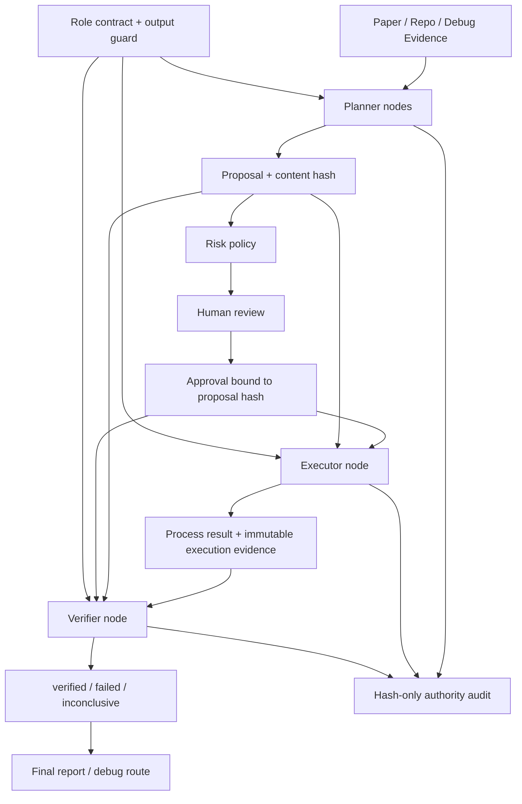

# Phase 43：Planner / Executor / Verifier 职责分离

> 本阶段目标：在**不拆成多个进程、不引入多 Agent 通信、不改变单机单用户边界**的前提下，
> 把“提出方案”“执行副作用”“依据证据给出结论”拆成三种不同 authority。
>
> 本阶段是 Phase 42 对话决策评测之后的安全重构。Phase 42 保证 Chat 不能把自然语言直接变成
> Decision；Phase 43 继续保证 Planner 不能执行、Executor 不能自证成功、Verifier 不能修改方案
> 或补做执行。
>
> **重要说明**：本文是实现教程。按照本文操作时才修改 `app/` 和 `tests/`；仅阅读本节不会改变
> 当前项目代码。

---

## 一、为什么下一阶段先做职责分离

当前主流程已经具备 Proposal、审批、执行、日志、Patch 验证和最终报告，但部分节点仍同时承担
多种职责。例如当前 `executor_node` 会：

```text
校验审批
  -> 启动命令
  -> 收集进程结果
  -> 判断 succeeded / failed
  -> 写 final_status
  -> 生成 StageError
```

当前 `patch_verifier_node` 也会：

```text
校验 Patch 审批
  -> 创建 worktree
  -> 应用 Patch
  -> 启动 py_compile / pytest
  -> 判断是否 behaviorally_verified
  -> 决定能否进入 promotion review
```

这两种写法在功能较少时很直接，但随着 Agent 增长会出现几个问题。

第一，**执行者自证成功**。如果 Executor 既生成事实又生成最终结论，后续很难判断“测试真的执行并
通过”还是“节点根据内部布尔值写了 succeeded”。

第二，**Planner 的自然语言容易被当成事实**。Planner 可以说“该命令会验证修复”，但这句话只能
是 Proposal 的预期，不能成为“修复已验证”的证据。

第三，**权限边界无法自动测试**。如果所有节点都可以写 `final_status`、`execution_result`、
`patch_verification_passed`，代码评审很难发现某次重构把执行权交给了 Planner。

第四，**后续 Skill、失败记忆和模型路由缺少可信输入**。Phase 45 的失败案例记忆只能保存经过
Verifier 确认的失败和解决结果，不能直接保存 Planner 的猜测。因此职责分离是后续长期记忆的
前置条件。

---

## 二、本阶段完成后的能力

> **本节类型：目标说明，不修改代码。**

完成后应具备：

1. 每个参与职责分离的 Graph Node 都有明确 `planner / executor / verifier` 角色；
2. Planner 只能生成 Proposal、Action 草稿和 Evidence 引用，不能写执行或验证字段；
3. Executor 只能消费结构化且满足审批条件的 Action，并输出不可变 Execution Evidence；
4. Executor 不再根据自己刚得到的 `ok` 直接写成功 `final_status`；
5. Verifier 只读取 Action、Approval、Execution Evidence、Process Result 和 Artifact；
6. Verifier 根据确定性检查生成 `verified / failed / inconclusive`；
7. `verified` 明确限定为“执行协议证据完整且进程正常退出”，不代表论文科学结论复现成功；
8. Patch 验证拆成 `patch_verification_executor -> patch_verdict`；
9. Patch Executor 运行 worktree 检查，Patch Verifier 独立重算 verdict；
10. 每次角色节点调用都生成 Hash-only Authority Audit Record；
11. Role Guard 能阻止 Planner 写执行字段、Executor 写验证字段、Verifier 写 Action/Approval；
12. AST 测试能阻止 Verifier 导入进程 Runner、`subprocess` 或 Patch 执行函数；
13. 原有 Action Hash、Approval Hash、Patch Hash 和 Promotion Approval 继续生效；
14. Phase 42 决策评测在职责重构后仍全部通过；
15. 旧 `patch_verifier` Checkpoint 节点名在迁移期仍可恢复。

---

## 三、本阶段明确不做

> **本节类型：范围约束，不修改代码。**

本阶段不做：

- 把 Planner、Executor、Verifier 拆成三个服务或三个容器；
- 为三个角色分别配置三个 LLM；
- 引入 Agent 间消息总线、Redis 或消息队列；
- 让 Verifier 使用 Judge LLM 决定执行是否成功；
- 自动判断论文指标是否达到原论文结果；
- 取消 Human Review 或让 Verifier 自动批准；
- 让 Planner 直接创建 `ApprovalRecord`；
- 让 Executor 修改 Planner Proposal；
- 让 Verifier 为了补证据自行重跑命令；
- 立即重构所有历史节点；
- 删除旧 Checkpoint 或强制所有已有 Job 从头开始。

第一版继续使用单张 LangGraph。这里的“职责分离”指 authority、Schema、State 字段和测试边界分离，
不是部署拓扑分离。

---

## 四、需要长期保持的不变量

> **本节类型：架构约束，不修改代码。**

```text
Invariant 1：Planner 不能启动进程、应用 Patch、批准动作或写验证结论。
Invariant 2：Executor 只能执行结构化 Action，不能执行 Planner 自然语言。
Invariant 3：高风险 Action 在 Executor 前仍必须经过 Risk Check 和 Human Review。
Invariant 4：Executor 输出的是 Evidence，不是“我已经验证成功”的权威声明。
Invariant 5：Verifier 不能调用 Runner、subprocess、Patch apply 或任何 mutation Tool。
Invariant 6：Verifier 不能修改 pending_action、Approval、Proposal 或 Patch 内容。
Invariant 7：Verifier 必须重新计算 Evidence Hash 和 Action/Patch identity。
Invariant 8：Evidence 缺失、损坏或身份不匹配时只能 inconclusive，不能猜测成功。
Invariant 9：只有 Verifier 可以把 full executor Evidence 投影成 succeeded / failed；
             smoke 或执行准入节点只能报告本阶段 gate/blocked 状态。
Invariant 10：verified 只描述 claim_scope 内的事实，不自动代表科学复现成功。
Invariant 11：Authority Audit 只保存字段名和 Hash，不保存命令、Secret 或原始日志。
Invariant 12：Chat、Planner 和 Verifier 都不能构造真实 DecisionEnvelope。
Invariant 13：旧审批不能用于新 Action，新验证不能用于新 Patch。
Invariant 14：职责重构后 Phase 42 所有安全回归仍必须 100% 通过。
```

---

## 五、三个角色分别负责什么

### 5.1 Planner

Planner 读取论文、仓库、日志和已经发布的 Evidence，输出 Proposal。当前第一批纳入 Planner
authority 的节点包括：

```text
experiment_plan
action_builder
repair_planner
file_repair_planner
```

`repair_action_builder` 和 `patch_builder` 还负责失效旧 Approval、Execution 或 Verification 字段，
第一版继续作为确定性状态迁移控制节点，不套用通用 Planner Contract。不能为了把名称归类整齐而
允许所有 Planner 清理审批字段。

Planner 可以输出：

```text
ExperimentPlan
ExecutableAction proposal
RepairProposal
FileRepairProposal
PatchBundle proposal
Evidence reference
```

Planner 不可以输出：

```text
execution_result
execution_evidence
execution_verification
patch_verification_report
patch_verification_passed
ApprovalRecord
“测试已经通过”的权威状态
```

### 5.2 Executor

Executor 消费已通过控制面的结构化对象，执行受控副作用。第一批包括：

```text
smoke_test
executor
patch_verification_executor
```

`patch_apply` 继续使用 Phase 14 的专用 Patch Hash、Promotion Approval、Journal 和 Repository
Lock 边界。它应用完成后必须更新 Action identity 并失效旧审批，因此不套用通用 Executor
Contract。

`smoke_test` 中的 `passed/failed` 只描述冒烟进程事实，并用于决定是否进入 full executor；它不能
写 `execution_verification`，也不能把冒烟退出码解释为论文复现结论。完整命令产生 Evidence 后，
仍必须经过 `execution_verifier`。

Executor 可以输出：

```text
Process Result
Execution Evidence
日志和 Process Record Artifact
Patch worktree 检查 Evidence
Patch Application Record
```

Executor 不可以输出：

```text
ApprovalRecord
新的 Planner Proposal
execution_verification
patch_verification_passed
“科学复现成功”结论
```

### 5.3 Verifier

Verifier 只读取已经存在的事实，运行确定性校验并给出限定作用域的结论。第一批包括：

```text
execution_verifier
patch_verdict
```

Verifier 可以输出：

```text
ExecutionVerificationRecord
PatchVerificationReport
verification hash
基于证据的 final_status projection
```

Verifier 不可以输出：

```text
pending_action
run_commands
ApprovalRecord
新的 Patch
新的 Process Result
任何通过重新执行补出来的 Evidence
```

Risk Check、Human Review、Decision Protocol 仍属于确定性控制面，不强行归入上述三个 Agent
角色。它们负责授权，而不是规划、执行或验证。

---

## 六、总体架构

> **本节类型：架构说明，不修改代码。**



普通命令执行的新数据流：

```text
ExecutableAction
  -> ApprovalRecord(action_hash)
  -> Executor
  -> ExecutionResult + ExecutionEvidence(evidence_sha256)
  -> ExecutionVerifier
  -> ExecutionVerificationRecord(verification_sha256)
  -> final_status / log_debug / final_report
```

Patch 验证的新数据流：

```text
PatchBundle
  -> PatchApprovalRecord(patch_sha256)
  -> PatchVerificationExecutor
  -> PatchVerificationEvidence(checks + evidence_sha256)
  -> PatchVerdict
  -> PatchVerificationReport(verification_sha256)
  -> PatchPromotionReview
```

---

## 七、涉及文件与推荐顺序

> **本节类型：实施清单，不修改代码。**

### 7.1 需要新增

```text
app/authority/__init__.py
app/authority/schemas.py
app/authority/evidence.py
app/authority/policy.py

app/nodes/execution_verifier_node.py
app/nodes/patch_verification_executor_node.py
app/nodes/patch_verdict_node.py

tests/test_authority_schemas.py
tests/test_authority_role_guard.py
tests/test_execution_verifier_node.py
tests/test_patch_authority_separation.py
tests/test_role_separation_graph.py
tests/test_role_separation_end_to_end.py
tests/test_verifier_import_boundary.py

app/evaluation/cases/offline/route_executor_evidence_to_verifier.json
app/evaluation/cases/offline/route_execution_verifier_failure.json
app/evaluation/cases/offline/route_patch_evidence_to_verdict.json
```

### 7.2 需要修改

```text
app/state.py
app/nodes/executor_node.py
app/nodes/patch_verifier_node.py       # 迁移期兼容入口
app/nodes/final_report_node.py
app/tools/artifact_tools.py
app/evaluation/runners.py
app/graph.py

tests/test_executor_node.py
tests/test_fail_to_debug_flow.py
tests/test_patch_review_nodes.py
tests/test_compiled_graph_routes.py
tests/test_run_manifest_node.py

a_implementation_guides/README.md
a_implementation_guides/agent_project_analysis_and_technical_roadmap.md
a_implementation_guides/project_phase_capability_summary.md
a_implementation_guides/python_source_code_reference.md  # 源码实现后更新
```

### 7.3 推荐实施顺序

```text
Authority Schema
  -> Evidence Hash Helper
  -> Role Policy / Guard
  -> State 字段
  -> Executor 只产 Evidence
  -> Execution Verifier
  -> Patch Verification Executor
  -> Patch Verdict
  -> Graph 路由
  -> Final Report
  -> Unit / AST / Graph / Phase 42 Regression
```

不要先改 Graph 再补 Schema。Graph 一旦指向尚未稳定的字段，Checkpoint 中会留下难以解释的
半成品状态。

---

## 八、实施前先固定测试基线

> **本节类型：运行验证，不修改代码。**

先确认使用 Python 3.10 环境：

```bash
conda activate agent
python --version
```

执行与本阶段直接相关的旧测试：

```bash
python -m pytest \
  tests/test_executor_node.py \
  tests/test_fail_to_debug_flow.py \
  tests/test_patch_verifier_node.py \
  tests/test_patch_review_nodes.py \
  tests/test_compiled_graph_routes.py \
  tests/test_review_flow.py \
  tests/test_low_risk_route.py
```

执行 Phase 42 安全基线：

```bash
python -m pytest \
  tests/test_chat_decision_schema.py \
  tests/test_conversation_decision_runner.py \
  tests/test_conversation_decision_scorers.py \
  tests/test_decision_protocol_regression.py \
  tests/test_decision_route_exactly_once.py \
  tests/test_chat_secret_boundary.py
```

先保存通过数量。Phase 43 修改后，旧测试不能通过删除断言来“适配”；应把只属于 Executor 的
结论断言迁移到 Verifier 测试。

---

## 九、新建 authority 包

> **本节类型：需要新增代码。**
>
> **新增文件**：`app/authority/__init__.py`

```python
"""Planner / Executor / Verifier authority boundary。"""

from app.authority.schemas import (
    AuthorityAuditRecord,
    ExecutionEvidence,
    ExecutionVerificationRecord,
    NodeAuthorityContract,
    PatchVerificationEvidence,
)

__all__ = [
    "AuthorityAuditRecord",
    "ExecutionEvidence",
    "ExecutionVerificationRecord",
    "NodeAuthorityContract",
    "PatchVerificationEvidence",
]
```

这个 `__init__.py` 只导出稳定领域对象，不在包导入时创建 Graph、模型或数据库连接。

---

## 十、定义 authority、Evidence 和 Verification Schema

> **本节类型：需要新增代码。**
>
> **新增文件**：`app/authority/schemas.py`

```python
from __future__ import annotations

from typing import Any, Literal

from pydantic import (
    BaseModel,
    ConfigDict,
    Field,
    model_validator,
)

from app.schemas import PatchVerificationCheck


AuthorityRole = Literal["planner", "executor", "verifier"]

AuthorityCapability = Literal[
    "read_evidence",
    "create_proposal",
    "execute_action",
    "apply_repository_change",
    "verify_evidence",
    "project_terminal_status",
]

VerificationVerdict = Literal[
    "verified",
    "failed",
    "inconclusive",
]

SHA256_PATTERN = r"^[0-9a-f]{64}$"


class AuthorityModel(BaseModel):
    """Authority 数据默认拒绝未知字段，防止权限字段静默扩张。"""

    model_config = ConfigDict(extra="forbid")


class NodeAuthorityContract(AuthorityModel):
    """声明某类节点拥有的角色和能力。"""

    role: AuthorityRole
    capabilities: set[AuthorityCapability] = Field(
        default_factory=set
    )
    forbidden_output_fields: set[str] = Field(
        default_factory=set
    )


class AuthorityAuditRecord(AuthorityModel):
    """只记录 authority 元数据和 Hash，不记录节点原始输入输出。"""

    schema_version: Literal["phase43-v1"] = "phase43-v1"
    node_name: str = Field(min_length=1, max_length=128)
    role: AuthorityRole
    capabilities: list[AuthorityCapability] = Field(
        default_factory=list
    )
    output_fields: list[str] = Field(default_factory=list)
    output_sha256: str = Field(pattern=SHA256_PATTERN)
    recorded_at: str


class ExecutionEvidence(AuthorityModel):
    """Executor 对一次受监管进程执行所保留的不可变事实摘要。

    这里不保存完整 stdout/stderr。完整内容继续位于 Artifact，避免
    Checkpoint 膨胀，也避免把日志中的潜在敏感信息复制到控制状态。
    """

    schema_version: Literal["phase43-v1"] = "phase43-v1"
    evidence_id: str = Field(min_length=1, max_length=160)

    action_id: str = Field(min_length=1, max_length=160)
    action_sha256: str = Field(pattern=SHA256_PATTERN)

    execution_id: str | None = None
    execution_profile_id: str | None = None
    execution_profile_fingerprint: str | None = None
    execution_backend: str | None = None

    end_reason: str = Field(min_length=1, max_length=80)
    returncode: int | None = None

    process_record_path: str | None = None
    combined_log_path: str | None = None
    artifact_ids: list[str] = Field(default_factory=list)
    resource_usage: dict[str, Any] = Field(default_factory=dict)

    recorded_at: str
    evidence_sha256: str = Field(pattern=SHA256_PATTERN)


class VerificationCheck(AuthorityModel):
    """Verifier 的单项确定性检查。"""

    name: str = Field(min_length=1, max_length=128)
    passed: bool
    detail: str = Field(default="", max_length=2000)


class ExecutionVerificationRecord(AuthorityModel):
    """对 ExecutionEvidence 的限定作用域结论。

    claim_scope 固定为 execution_protocol。即使 verdict=verified，也只说明
    Action/证据身份一致且受监管进程正常退出，不说明论文指标已复现。
    """

    schema_version: Literal["phase43-v1"] = "phase43-v1"
    verification_id: str = Field(min_length=1, max_length=180)
    claim_scope: Literal["execution_protocol"] = (
        "execution_protocol"
    )

    action_id: str
    action_sha256: str = Field(pattern=SHA256_PATTERN)
    evidence_id: str
    evidence_sha256: str = Field(pattern=SHA256_PATTERN)

    verdict: VerificationVerdict
    projected_final_status: str
    checks: list[VerificationCheck] = Field(default_factory=list)
    summary: str = Field(min_length=1, max_length=4000)

    verified_at: str
    verification_sha256: str = Field(pattern=SHA256_PATTERN)

    @model_validator(mode="after")
    def validate_scope_semantics(
        self,
    ) -> "ExecutionVerificationRecord":
        if self.verdict == "verified":
            if self.projected_final_status != "succeeded":
                raise ValueError(
                    "verified execution_protocol 必须投影为 succeeded"
                )
            if not self.checks or not all(
                item.passed for item in self.checks
            ):
                raise ValueError(
                    "verified 要求所有确定性检查通过"
                )
        return self


class PatchVerificationEvidence(AuthorityModel):
    """Patch Executor 运行检查后的原始证据，不包含 promotion verdict。"""

    schema_version: Literal["phase43-v1"] = "phase43-v1"
    evidence_id: str = Field(min_length=1, max_length=180)

    patch_id: str
    patch_sha256: str = Field(pattern=SHA256_PATTERN)
    execution_profile_id: str
    execution_profile_fingerprint: str
    execution_backend: Literal["local", "conda"]

    worktree_path: str | None = None
    worktree_diff_sha256: str | None = Field(
        default=None,
        pattern=SHA256_PATTERN,
    )
    checks: list[PatchVerificationCheck] = Field(
        default_factory=list
    )

    collected_at: str
    evidence_sha256: str = Field(pattern=SHA256_PATTERN)
```

这里有三个重要设计点：

1. `ExecutionEvidence` 不直接复用 `ExecutionResult.ok` 作为身份字段，Verifier 必须根据
   `end_reason + returncode` 独立判断；
2. `ExecutionVerificationRecord.claim_scope` 固定为 `execution_protocol`，避免把 return code 0
   写成“论文复现成功”；
3. `PatchVerificationEvidence` 不包含 `promotion_allowed`，该字段只能由 Patch Verifier 依据
   checks 重新计算。

---
## 十一、实现 Evidence Hash 和独立执行判定

> **本节类型：需要新增代码。**
>
> **新增文件**：`app/authority/evidence.py`

```python
from __future__ import annotations

import hashlib
import json
from datetime import datetime, timezone
from typing import Any

from app.authority.schemas import (
    ExecutionEvidence,
    ExecutionVerificationRecord,
    PatchVerificationEvidence,
    VerificationCheck,
)
from app.schemas import (
    ApprovalRecord,
    ExecutableAction,
    ExecutionResult,
    PatchVerificationReport,
)
from app.tools.action_tools import compute_action_hash


def utc_now() -> str:
    return datetime.now(timezone.utc).isoformat()


def canonical_sha256(payload: dict[str, Any]) -> str:
    """对 JSON 业务字段计算稳定 Hash。

    所有传入对象必须已经通过 Pydantic 转为 JSON-compatible dict。
    不要在这里使用 repr()，因为对象地址和集合顺序不稳定。
    """

    encoded = json.dumps(
        payload,
        ensure_ascii=False,
        sort_keys=True,
        separators=(",", ":"),
    ).encode("utf-8")
    return hashlib.sha256(encoded).hexdigest()


def _artifact_ids(records: list[Any]) -> list[str]:
    """同时兼容 ArtifactRecord 对象和 checkpoint 中的 dict。"""

    result: list[str] = []
    for record in records:
        if hasattr(record, "artifact_id"):
            value = getattr(record, "artifact_id")
        elif isinstance(record, dict):
            value = record.get("artifact_id")
        else:
            value = None
        if value:
            result.append(str(value))
    return sorted(set(result))


def _execution_evidence_payload(
    evidence: ExecutionEvidence,
) -> dict[str, Any]:
    """时间和自身 Hash 不参与内容身份。"""

    return evidence.model_dump(
        exclude={"recorded_at", "evidence_sha256"}
    )


def compute_execution_evidence_hash(
    evidence: ExecutionEvidence,
) -> str:
    return canonical_sha256(
        _execution_evidence_payload(evidence)
    )


def build_execution_evidence(
    *,
    action: ExecutableAction,
    result: ExecutionResult,
    artifact_records: list[Any],
) -> ExecutionEvidence:
    """由 Executor 把 Process Result 投影成不可变证据摘要。"""

    execution_id = result.execution_id or "not-started"
    evidence_identity = canonical_sha256(
        {
            "action_id": action.action_id,
            "execution_id": execution_id,
        }
    )
    draft = ExecutionEvidence(
        # 使用固定长度身份，避免长 action_id 使领域对象越过长度上限。
        evidence_id=f"exec-evidence:{evidence_identity}",
        action_id=action.action_id,
        action_sha256=compute_action_hash(action.model_dump()),
        execution_id=result.execution_id,
        execution_profile_id=result.execution_profile_id,
        execution_profile_fingerprint=(
            action.execution_profile_fingerprint
        ),
        execution_backend=result.execution_backend,
        end_reason=result.end_reason,
        returncode=result.returncode,
        process_record_path=result.process_record_path,
        combined_log_path=result.combined_log_path,
        artifact_ids=_artifact_ids(artifact_records),
        resource_usage=result.resource_usage.model_dump(),
        recorded_at=utc_now(),
        # 先使用合法占位值构造严格模型，随后立刻替换为真实 Hash。
        evidence_sha256="0" * 64,
    )
    return draft.model_copy(
        update={
            "evidence_sha256": compute_execution_evidence_hash(
                draft
            )
        }
    )


def validate_execution_evidence_hash(
    evidence: ExecutionEvidence,
) -> None:
    actual = compute_execution_evidence_hash(evidence)
    if actual != evidence.evidence_sha256:
        raise ValueError("execution evidence hash mismatch")


def _project_final_status(
    result: ExecutionResult,
) -> str:
    """保持 Phase 15/16 已有终态语义，不在 Executor 内投影。"""

    reason = result.end_reason
    if reason == "exited" and result.returncode == 0:
        return "succeeded"
    if reason in {
        "exited",
        "timeout",
        "cpu_limit",
        "memory_limit",
        "process_limit",
        "write_limit",
        "gpu_limit",
    }:
        return "failed"
    if reason in {"cancelled", "interrupted"}:
        return "cancelled"
    if reason == "policy_denied":
        return "policy_blocked"
    if reason == "launch_error":
        return "environment_blocked"
    return "agent_failed"


def _verification_payload(
    record: ExecutionVerificationRecord,
) -> dict[str, Any]:
    return record.model_dump(
        exclude={"verified_at", "verification_sha256"}
    )


def compute_execution_verification_hash(
    record: ExecutionVerificationRecord,
) -> str:
    return canonical_sha256(_verification_payload(record))


def build_execution_verification(
    *,
    action: ExecutableAction,
    result: ExecutionResult,
    evidence: ExecutionEvidence,
    decision: str,
    approval: ApprovalRecord | None,
) -> ExecutionVerificationRecord:
    """Verifier 只根据输入事实构造结论，不启动任何进程。"""

    expected_action_hash = compute_action_hash(
        action.model_dump()
    )
    expected_evidence_hash = compute_execution_evidence_hash(
        evidence
    )

    observed_success = (
        result.end_reason == "exited"
        and result.returncode == 0
    )
    authorization_valid = (
        decision == "not_required"
        or (
            decision == "approved"
            and approval is not None
            and approval.decision == "approved"
            and approval.action_id == action.action_id
            and approval.action_hash == expected_action_hash
        )
    )
    checks = [
        VerificationCheck(
            name="evidence_hash",
            passed=(
                expected_evidence_hash
                == evidence.evidence_sha256
            ),
            detail="ExecutionEvidence 内容身份必须可重算",
        ),
        VerificationCheck(
            name="action_identity",
            passed=(
                evidence.action_id == action.action_id
                and evidence.action_sha256
                == expected_action_hash
            ),
            detail="Evidence 必须绑定当前 ExecutableAction",
        ),
        VerificationCheck(
            name="authorization_identity",
            passed=authorization_valid,
            detail=(
                "高风险 Action 必须绑定 approved record；"
                "低风险 Action 必须明确标记 not_required"
            ),
        ),
        VerificationCheck(
            name="process_identity",
            passed=(
                evidence.execution_id == result.execution_id
                and evidence.end_reason == result.end_reason
                and evidence.returncode == result.returncode
            ),
            detail="Evidence 与 Process Result 必须描述同一次执行",
        ),
        VerificationCheck(
            name="runtime_identity",
            passed=(
                evidence.execution_profile_id
                == action.execution_profile_id
                == result.execution_profile_id
                and evidence.execution_profile_fingerprint
                == action.execution_profile_fingerprint
                and evidence.execution_backend
                == result.execution_backend
            ),
            detail=(
                "Action、Evidence 与 Process Result 必须绑定同一运行环境"
            ),
        ),
        VerificationCheck(
            name="result_consistency",
            passed=(result.ok is observed_success),
            detail=(
                "ok 必须与 end_reason=exited 且 returncode=0 一致"
            ),
        ),
    ]

    identity_valid = all(item.passed for item in checks)
    projected_status = _project_final_status(result)

    if not identity_valid:
        verdict = "inconclusive"
        projected_status = "agent_failed"
        summary = (
            "执行证据身份或结果语义不一致，不能确认执行结论"
        )
    elif observed_success:
        verdict = "verified"
        summary = (
            "执行协议证据完整，受监管进程以 return code 0 退出；"
            "该结论不代表论文科学指标已经复现"
        )
    else:
        verdict = "failed"
        summary = (
            "执行证据完整，但进程未以成功协议状态结束"
        )

    draft = ExecutionVerificationRecord(
        verification_id=(
            f"exec-verification:{evidence.evidence_sha256}"
        ),
        action_id=action.action_id,
        action_sha256=expected_action_hash,
        evidence_id=evidence.evidence_id,
        evidence_sha256=evidence.evidence_sha256,
        verdict=verdict,
        projected_final_status=projected_status,
        checks=checks,
        summary=summary,
        verified_at=utc_now(),
        verification_sha256="0" * 64,
    )
    return draft.model_copy(
        update={
            "verification_sha256": (
                compute_execution_verification_hash(draft)
            )
        }
    )


def _patch_evidence_payload(
    evidence: PatchVerificationEvidence,
) -> dict[str, Any]:
    return evidence.model_dump(
        exclude={"collected_at", "evidence_sha256"}
    )


def compute_patch_evidence_hash(
    evidence: PatchVerificationEvidence,
) -> str:
    return canonical_sha256(_patch_evidence_payload(evidence))


def build_patch_verification_evidence(
    report: PatchVerificationReport,
) -> PatchVerificationEvidence:
    """只提取检查事实，故意丢弃 report 中原有 verdict 字段。"""

    evidence_identity = canonical_sha256(
        {
            "patch_id": report.patch_id,
            "patch_sha256": report.patch_sha256,
            "execution_profile_id": report.execution_profile_id,
            "execution_profile_fingerprint": (
                report.execution_profile_fingerprint
            ),
        }
    )
    draft = PatchVerificationEvidence(
        evidence_id=f"patch-evidence:{evidence_identity}",
        patch_id=report.patch_id,
        patch_sha256=report.patch_sha256,
        execution_profile_id=report.execution_profile_id,
        execution_profile_fingerprint=(
            report.execution_profile_fingerprint
        ),
        execution_backend=report.execution_backend,
        worktree_path=report.worktree_path,
        worktree_diff_sha256=report.worktree_diff_sha256,
        checks=report.checks,
        collected_at=utc_now(),
        evidence_sha256="0" * 64,
    )
    return draft.model_copy(
        update={
            "evidence_sha256": compute_patch_evidence_hash(
                draft
            )
        }
    )


def validate_patch_evidence_hash(
    evidence: PatchVerificationEvidence,
) -> None:
    actual = compute_patch_evidence_hash(evidence)
    if actual != evidence.evidence_sha256:
        raise ValueError("patch verification evidence hash mismatch")
```

注意：`build_patch_verification_evidence()` 暂时调用旧 `verify_patch_in_worktree()` 返回的 Report，
但只保留 checks 和身份字段，主动丢弃旧函数给出的 `status` 与 `promotion_allowed`。后面的
`patch_verdict_node` 必须根据 checks 独立重算结论。这样第一版不需要立即重写两百多行稳定的
worktree 执行逻辑，同时 Graph authority 已经真实分开。

---

## 十二、实现 Role Contract 和输出门禁

> **本节类型：需要新增代码。**
>
> **新增文件**：`app/authority/policy.py`

```python
from __future__ import annotations

import hashlib
import json
from collections.abc import Callable
from datetime import datetime, timezone
from typing import Any

from app.authority.schemas import (
    AuthorityAuditRecord,
    AuthorityRole,
    NodeAuthorityContract,
)


NodeCallable = Callable[[dict[str, Any]], dict[str, Any]]


class AuthorityViolation(RuntimeError):
    """节点尝试写入当前角色不拥有的 authority 字段。"""


DECISION_FIELDS = {
    "user_approval",
    "approval_record",
    "patch_approval",
    "patch_approval_record",
    "patch_promotion_decision",
    "patch_promotion_record",
}

PROPOSAL_FIELDS = {
    "experiment_plan",
    "run_commands",
    "pending_action",
    "pending_action_hash",
    "repair_proposal",
    "file_repair_proposal",
    "pending_patch",
    "pending_patch_hash",
}

EXECUTION_FIELDS = {
    "execution_result",
    "execution_evidence",
    "active_execution_id",
    "active_process_record_path",
    "execution_end_reason",
    "execution_resource_usage",
    "patch_verification_evidence",
    "patch_application_record",
    "applied_patch_hash",
}

VERIFICATION_FIELDS = {
    "execution_verification",
    "execution_verification_hash",
    "patch_verification_report",
    "patch_verification_passed",
    "patch_verification_hash",
}


ROLE_CONTRACTS: dict[AuthorityRole, NodeAuthorityContract] = {
    "planner": NodeAuthorityContract(
        role="planner",
        capabilities={"read_evidence", "create_proposal"},
        forbidden_output_fields=(
            DECISION_FIELDS
            | EXECUTION_FIELDS
            | VERIFICATION_FIELDS
        ),
    ),
    "executor": NodeAuthorityContract(
        role="executor",
        capabilities={
            "read_evidence",
            "execute_action",
            "apply_repository_change",
        },
        forbidden_output_fields=(
            DECISION_FIELDS
            | PROPOSAL_FIELDS
            | VERIFICATION_FIELDS
        ),
    ),
    "verifier": NodeAuthorityContract(
        role="verifier",
        capabilities={
            "read_evidence",
            "verify_evidence",
            "project_terminal_status",
        },
        forbidden_output_fields=(
            DECISION_FIELDS
            | PROPOSAL_FIELDS
            | EXECUTION_FIELDS
        ),
    ),
}


def _hash_update(update: dict[str, Any]) -> str:
    """只把 Hash 持久化；序列化字符串不会进入 Audit Record。"""

    payload = json.dumps(
        update,
        ensure_ascii=False,
        sort_keys=True,
        separators=(",", ":"),
        default=str,
    ).encode("utf-8")
    return hashlib.sha256(payload).hexdigest()


def validate_role_update(
    *,
    role: AuthorityRole,
    update: dict[str, Any],
) -> None:
    contract = ROLE_CONTRACTS[role]
    forbidden = sorted(
        set(update).intersection(
            contract.forbidden_output_fields
        )
    )
    if forbidden:
        raise AuthorityViolation(
            f"{role} attempted forbidden state writes: "
            + ", ".join(forbidden)
        )

    # Planner 可以报告“没有 Action”或输入/规划失败，但不能把建议直接
    # 投影为执行成功。终态 succeeded 只能来自 Verifier。
    if role == "planner" and update.get("final_status") == "succeeded":
        raise AuthorityViolation(
            "planner cannot project succeeded final_status"
        )

    # Executor 可以在“执行准入失败”时返回 terminal StageError；但一旦已经
    # 产出正常执行 Evidence，就不能同时自证 final_status。
    if role == "executor" and "final_status" in update:
        if update.get("final_status") == "succeeded":
            raise AuthorityViolation(
                "executor cannot project succeeded final_status"
            )
        produced_evidence = bool(
            {
                "execution_evidence",
                "patch_verification_evidence",
            }.intersection(update)
        )
        if produced_evidence:
            raise AuthorityViolation(
                "executor cannot write final_status with evidence"
            )


def build_authority_audit_record(
    *,
    node_name: str,
    role: AuthorityRole,
    update: dict[str, Any],
) -> AuthorityAuditRecord:
    contract = ROLE_CONTRACTS[role]
    return AuthorityAuditRecord(
        node_name=node_name,
        role=role,
        capabilities=sorted(contract.capabilities),
        output_fields=sorted(update),
        output_sha256=_hash_update(update),
        recorded_at=datetime.now(timezone.utc).isoformat(),
    )


def role_guarded_node(
    *,
    node_name: str,
    role: AuthorityRole,
    node: NodeCallable,
) -> NodeCallable:
    """包装 LangGraph Node，在 update 进入 State 前执行 authority 校验。"""

    def invoke(state: dict[str, Any]) -> dict[str, Any]:
        update = node(state)
        if not isinstance(update, dict):
            raise AuthorityViolation(
                f"{node_name} must return a dict update"
            )

        validate_role_update(role=role, update=update)
        record = build_authority_audit_record(
            node_name=node_name,
            role=role,
            update=update,
        )

        # 当前 Graph 是线性的，第一版直接保留完整审计列表。后续如果数量增长，
        # 应改为 Run-native Artifact，而不是无限扩大 Checkpoint。
        history = list(
            state.get("authority_audit_records", [])
        )
        return {
            **update,
            "authority_audit_records": [
                *history,
                record.model_dump(),
            ],
        }

    return invoke
```

Role Guard 不是用来替代 Risk Check。二者保护不同边界：

```text
Risk Check：这个 Action 是否允许执行、是否需要审批。
Role Guard：这个节点是否有权写某类 State 事实。
```

---

## 十三、扩展 Graph State

> **本节类型：需要修改代码。**
>
> **修改文件**：`app/state.py`

在现有执行字段附近加入：

```python
class ReproductionState(TypedDict, total=False):
    # ... 保留前面的现有字段 ...

    execution_result: dict[str, Any]
    execution_log_path: str | None

    # Phase 43：Executor 只生产 Evidence；Verifier 独立生成结论。
    execution_evidence: dict[str, Any] | None
    execution_verification: dict[str, Any] | None
    execution_verification_hash: str | None

    last_action_result: dict[str, Any]
    final_status: str | None

    # ... 保留中间的现有字段 ...

    # Patch Executor 运行 worktree 检查后先写原始证据。
    patch_verification_evidence: dict[str, Any] | None

    # Patch Verifier 才能写下面三个既有字段。
    patch_verification_report: dict[str, Any] | None
    patch_verification_passed: bool
    patch_verification_hash: str | None

    # Role Guard 写入的 Hash-only 审计记录。
    authority_audit_records: list[dict[str, Any]]
```

不要删除原来的 `execution_result`。它仍保存受监管 Runner 的原始有界结果；
`execution_evidence` 是用于跨角色交接和 Hash 校验的稳定摘要。

---

## 十四、让 Executor 只产出执行证据

> **本节类型：需要修改代码。**
>
> **修改文件**：`app/nodes/executor_node.py`

用下面版本替换文件。它保留原有审批、Action Hash 和 Runner 安全检查，但 `_run_approved_action()`
不再写成功/失败 `final_status`，也不再把非零退出直接分类为最终错误。

```python
from __future__ import annotations

from pydantic import ValidationError

from app.authority.evidence import build_execution_evidence
from app.schemas import (
    ApprovalRecord,
    ExecutableAction,
    ExecutionResult,
)
from app.tools.action_tools import compute_action_hash
from app.tools.artifact_tools import (
    artifact_state_update,
    write_json_artifact,
)
from app.tools.error_tools import stage_error_result
from app.tools.exec_tools import (
    register_execution_artifacts,
    run_action_safe,
)


def _run_approved_action(
    *,
    state: dict,
    pending_action: ExecutableAction,
) -> dict:
    """Executor 运行已批准 Action，并只返回 Process 事实和 Evidence。"""

    raw_result = run_action_safe(
        pending_action.model_dump(),
        state=state,
        stage="executor",
    )

    try:
        result = ExecutionResult.model_validate(raw_result)
    except ValidationError as exc:
        return stage_error_result(
            state=state,
            stage="executor",
            code="EXECUTION_RESULT_INVALID",
            category="agent",
            message=f"Runner 返回无效 ExecutionResult：{exc}",
            extra_update={
                "final_status": "agent_failed",
            },
        )

    process_records = register_execution_artifacts(
        state=state,
        result=result.model_dump(),
        producer_node="executor",
    )
    evidence = build_execution_evidence(
        action=pending_action,
        result=result,
        artifact_records=process_records,
    )

    # Evidence 自身也成为 Run-native Artifact。Evidence 中的 artifact_ids
    # 只绑定先前的进程文件，避免产生“Evidence 引用自身”的循环身份。
    _, evidence_record = write_json_artifact(
        state=state,
        relative_path=(
            "execution/execution_evidence.json"
        ),
        payload=evidence.model_dump(),
        producer_node="executor",
    )
    all_records = [*process_records, evidence_record]

    log_path = result.combined_log_path
    update = {
        "active_execution_mode": "full",
        "active_execution_id": result.execution_id,
        "active_process_record_path": (
            result.process_record_path
        ),
        "execution_end_reason": result.end_reason,
        "execution_resource_usage": (
            result.resource_usage.model_dump()
        ),
        "cancellation_requested": result.cancelled,
        "cancellation_reason": result.cancellation_reason,
        "execution_result": result.model_dump(),
        "execution_evidence": evidence.model_dump(),
        "execution_log_path": log_path,
        "last_action_result": {
            # 这里故意不写 succeeded/failed。Executor 只声明证据已记录。
            "status": "evidence_recorded",
            "pending_action": pending_action.model_dump(),
            "returncode": result.returncode,
            "end_reason": result.end_reason,
            "execution_id": result.execution_id,
            "evidence_sha256": evidence.evidence_sha256,
        },
        **artifact_state_update(state, all_records),
    }

    # 非成功结果先提供日志入口，真正错误类别由 Verifier 根据证据投影。
    if not result.ok and log_path:
        update["log_path"] = log_path

    return update


def executor_node(state: dict) -> dict:
    raw_action = state.get("pending_action")
    if not raw_action:
        return stage_error_result(
            state=state,
            stage="executor",
            code="PENDING_ACTION_REQUIRED",
            category="agent",
            message="执行前缺少 pending_action",
            extra_update={"final_status": "no_pending_action"},
        )

    try:
        pending_action = ExecutableAction.model_validate(raw_action)
    except ValidationError as exc:
        return stage_error_result(
            state=state,
            stage="executor",
            code="PENDING_ACTION_INVALID",
            category="agent",
            message=f"pending_action 无效：{exc}",
            extra_update={"final_status": "invalid_action"},
        )

    decision = state.get("user_approval")

    # 正常 Graph 不会把 rejected/revise 送入 Executor；这里保留 fail-closed
    # 兼容，防止直接调用节点时意外运行命令。
    if decision == "rejected":
        return {
            "final_status": "rejected",
            "last_action_result": {
                "status": "rejected",
                "pending_action": pending_action.model_dump(),
            },
        }

    if decision == "revise":
        return {
            "final_status": "revise_requested",
            "last_action_result": {
                "status": "revise_requested",
                "pending_action": pending_action.model_dump(),
                "human_feedback": state.get("human_feedback"),
            },
        }

    if decision not in {"approved", "not_required"}:
        return stage_error_result(
            state=state,
            stage="executor",
            code="EXECUTION_NOT_APPROVED",
            category="user",
            message=f"不支持的审批状态：{decision}",
            extra_update={
                "final_status": "not_executed",
                "last_action_result": {
                    "status": "not_executed",
                    "pending_action": pending_action.model_dump(),
                },
            },
        )

    if pending_action.action_type != "run_command":
        return stage_error_result(
            state=state,
            stage="executor",
            code="UNSUPPORTED_ACTION_TYPE",
            category="agent",
            message=(
                "不支持的操作类型："
                f"{pending_action.action_type}"
            ),
            extra_update={
                "final_status": "unsupported_action",
            },
        )

    current_action_hash = compute_action_hash(
        pending_action.model_dump()
    )

    if decision == "approved":
        approval_record = state.get("approval_record")
        if not approval_record:
            return stage_error_result(
                state=state,
                stage="executor",
                code="APPROVAL_RECORD_MISSING",
                category="agent",
                message="approved action 缺少 approval_record",
                extra_update={
                    "final_status": "missing_approval_record",
                },
            )

        approved_hash = approval_record.get("action_hash")
        if approved_hash != current_action_hash:
            return stage_error_result(
                state=state,
                stage="executor",
                code="STALE_ACTION_APPROVAL",
                category="user",
                message="审批记录与当前操作不匹配",
                extra_update={
                    "final_status": "stale_approval",
                    "last_action_result": {
                        "status": "stale_approval",
                        "pending_action": pending_action.model_dump(),
                        "approved_hash": approved_hash,
                        "current_hash": current_action_hash,
                    },
                },
            )

    return _run_approved_action(
        state=state,
        pending_action=pending_action,
    )
```

这里保留了“执行准入失败可以产生终态”的兼容行为，例如 stale approval 根本没有启动进程，
因此无需先产生 Evidence 再交给 Verifier。Role Guard 只禁止 Executor 在**已经产出 Evidence**时
同时自证 `final_status`。

---

## 十五、新增 Execution Verifier

> **本节类型：需要新增代码。**
>
> **新增文件**：`app/nodes/execution_verifier_node.py`

```python
from __future__ import annotations

from pydantic import ValidationError

from app.authority.evidence import (
    build_execution_verification,
)
from app.authority.schemas import ExecutionEvidence
from app.schemas import ExecutableAction, ExecutionResult
from app.tools.artifact_tools import (
    artifact_state_update,
    write_json_artifact,
)
from app.tools.error_tools import (
    persist_stage_errors,
    stage_error_result,
)
from app.tools.exec_tools import build_execution_stage_error


def _invalid_verification_input(
    state: dict,
    message: str,
) -> dict:
    return stage_error_result(
        state=state,
        stage="execution_verifier",
        code="EXECUTION_EVIDENCE_INVALID",
        category="agent",
        message=message,
        extra_update={
            "execution_verification": None,
            "execution_verification_hash": None,
            "final_status": "agent_failed",
        },
    )


def execution_verifier_node(state: dict) -> dict:
    """只读取既有执行事实，不调用 Runner，也不修改 Action。"""

    try:
        action = ExecutableAction.model_validate(
            state.get("pending_action")
        )
        result = ExecutionResult.model_validate(
            state.get("execution_result")
        )
        evidence = ExecutionEvidence.model_validate(
            state.get("execution_evidence")
        )
        decision = str(state.get("user_approval") or "")
        approval = (
            ApprovalRecord.model_validate(
                state.get("approval_record")
            )
            if decision == "approved"
            else None
        )
    except ValidationError as exc:
        return _invalid_verification_input(
            state,
            f"执行验证输入不完整或无效：{exc}",
        )

    verification = build_execution_verification(
        action=action,
        result=result,
        evidence=evidence,
        decision=decision,
        approval=approval,
    )

    _, record = write_json_artifact(
        state=state,
        relative_path=(
            "execution/execution_verification.json"
        ),
        payload=verification.model_dump(),
        producer_node="execution_verifier",
    )

    base_update = {
        "execution_verification": verification.model_dump(),
        "execution_verification_hash": (
            verification.verification_sha256
        ),
        "final_status": verification.projected_final_status,
        "last_action_result": {
            **dict(state.get("last_action_result") or {}),
            "status": verification.projected_final_status,
            "verification_sha256": (
                verification.verification_sha256
            ),
            "verification_scope": verification.claim_scope,
        },
        **artifact_state_update(state, [record]),
    }

    if verification.verdict == "verified":
        return {
            **base_update,
            "error": None,
        }

    if verification.verdict == "inconclusive":
        return stage_error_result(
            state={**state, **base_update},
            stage="execution_verifier",
            code="EXECUTION_VERIFICATION_INCONCLUSIVE",
            category="agent",
            message=verification.summary,
            extra_update=base_update,
        )

    # Evidence 完整但执行没有成功时，复用 Phase 15 已有错误分类；
    # 分类发生在 Verifier，而不是刚启动进程的 Executor。
    error, final_status = build_execution_stage_error(
        stage="execution_verifier",
        result=result.model_dump(),
        log_path=evidence.combined_log_path,
    )
    working_state = {
        **state,
        **base_update,
    }
    error_update = persist_stage_errors(
        state=working_state,
        new_errors=[error],
    )
    return {
        **base_update,
        **error_update,
        # persist_stage_errors 对 terminal error 会写通用状态；这里恢复
        # Phase 15 对具体 end_reason 的精确投影。
        "final_status": final_status,
        "log_path": (
            evidence.combined_log_path
            or state.get("log_path")
        ),
        "last_action_result": {
            **base_update["last_action_result"],
            "status": final_status,
        },
    }
```

Verifier 没有导入以下任何模块或函数：

```text
subprocess
build_execution_runner
run_action_safe
verify_patch_in_worktree
apply_patch
```

这一点后面使用 AST 测试固定，不能只依赖代码评审。

---

## 十六、拆分 Patch Verification Executor

> **本节类型：需要新增代码。**
>
> **新增文件**：`app/nodes/patch_verification_executor_node.py`

```python
from __future__ import annotations

from pydantic import ValidationError

from app.authority.evidence import (
    build_patch_verification_evidence,
)
from app.schemas import (
    FileRepairProposal,
    PatchApprovalRecord,
    PatchBundle,
)
from app.tools.artifact_tools import (
    artifact_state_update,
    require_run_root,
    write_json_artifact,
)
from app.tools.error_tools import stage_error_result
from app.tools.patch_tools import verify_patch_in_worktree


def _patch_execution_error(
    state: dict,
    *,
    final_status: str,
    message: str,
) -> dict:
    """输入或执行环境不足时不会伪造 Patch Evidence。"""

    return stage_error_result(
        state=state,
        stage="patch_verification_executor",
        code="PATCH_VERIFICATION_EXECUTION_BLOCKED",
        category="agent",
        message=message,
        extra_update={
            "patch_verification_evidence": None,
            "final_status": final_status,
        },
    )


def patch_verification_executor_node(state: dict) -> dict:
    """执行 worktree 检查，只输出 Evidence，不输出 promotion verdict。"""

    try:
        bundle = PatchBundle.model_validate(
            state.get("pending_patch")
        )
        approval = PatchApprovalRecord.model_validate(
            state.get("patch_approval_record")
        )
        proposal = FileRepairProposal.model_validate(
            state.get("file_repair_proposal")
        )
    except ValidationError as exc:
        return _patch_execution_error(
            state,
            final_status="patch_verification_blocked",
            message=f"无效的 Patch 验证执行输入：{exc}",
        )

    # Executor 在副作用发生前仍负责最后一次 approval identity 校验。
    if approval.decision != "approved":
        return _patch_execution_error(
            state,
            final_status="patch_not_approved",
            message="Patch 验证审批未获批准",
        )
    if (
        approval.patch_id != bundle.patch_id
        or approval.patch_sha256 != bundle.patch_sha256
    ):
        return _patch_execution_error(
            state,
            final_status="stale_patch_approval",
            message="审批记录与当前 Patch 不匹配",
        )

    profile_id = state.get("execution_profile_id")
    profile_fingerprint = state.get(
        "execution_profile_fingerprint"
    )
    if not profile_id or not profile_fingerprint:
        return _patch_execution_error(
            state,
            final_status="patch_verification_blocked",
            message="缺少执行环境配置绑定",
        )

    run_dir = require_run_root(state)
    worktree_path = (
        run_dir
        / "execution"
        / "patch_worktrees"
        / bundle.patch_id
    )

    try:
        # 旧工具内部仍会计算一个 Report，但本节点不会信任或持久化其中的
        # status/promotion_allowed，只提取原始 checks。
        runner_report = verify_patch_in_worktree(
            bundle=bundle,
            worktree_path=worktree_path,
            verification_targets=proposal.verification_targets,
            execution_profile_id=str(profile_id),
            execution_profile_fingerprint=str(
                profile_fingerprint
            ),
            run_dir=run_dir,
        )
    except (OSError, ValueError) as exc:
        return _patch_execution_error(
            state,
            final_status="patch_verification_blocked",
            message=str(exc),
        )

    evidence = build_patch_verification_evidence(
        runner_report
    )
    _, evidence_record = write_json_artifact(
        state=state,
        relative_path=(
            "execution/patch_verification_evidence.json"
        ),
        payload=evidence.model_dump(),
        producer_node="patch_verification_executor",
    )

    return {
        "patch_verification_evidence": evidence.model_dump(),
        **artifact_state_update(state, [evidence_record]),
    }
```

不要在这个 Executor 中通过写 `patch_verification_report=None` 清理旧 verdict；这些字段也属于
Verifier authority，Role Guard 应当拒绝。新 Job 本来没有旧 verdict，旧 Checkpoint 的清理由
专用迁移/Bridge 处理，不能为了兼容而放宽 Executor Contract。

---

## 十七、新增 Patch Verdict Node

> **本节类型：需要新增代码。**
>
> **新增文件**：`app/nodes/patch_verdict_node.py`

```python
from __future__ import annotations

from datetime import datetime, timezone

from pydantic import ValidationError

from app.authority.evidence import (
    validate_patch_evidence_hash,
)
from app.authority.schemas import PatchVerificationEvidence
from app.schemas import (
    PatchApprovalRecord,
    PatchBundle,
    PatchVerificationReport,
)
from app.tools.artifact_tools import (
    artifact_state_update,
    write_json_artifact,
)
from app.tools.error_tools import stage_error_result
from app.tools.patch_tools import (
    compute_verification_hash,
    summarize_patch_verification,
)


def _patch_verdict_error(
    state: dict,
    *,
    final_status: str,
    message: str,
) -> dict:
    return stage_error_result(
        state=state,
        stage="patch_verdict",
        code="PATCH_VERDICT_INCONCLUSIVE",
        category="agent",
        message=message,
        extra_update={
            "patch_verification_report": None,
            "patch_verification_passed": False,
            "patch_verification_hash": None,
            "final_status": final_status,
        },
    )


def patch_verdict_node(state: dict) -> dict:
    """依据 Patch Evidence 重算 verdict；绝不调用 worktree Runner。"""

    try:
        bundle = PatchBundle.model_validate(
            state.get("pending_patch")
        )
        approval = PatchApprovalRecord.model_validate(
            state.get("patch_approval_record")
        )
        evidence = PatchVerificationEvidence.model_validate(
            state.get("patch_verification_evidence")
        )
    except ValidationError as exc:
        return _patch_verdict_error(
            state,
            final_status="patch_verification_inconclusive",
            message=f"Patch verdict 输入无效：{exc}",
        )

    try:
        validate_patch_evidence_hash(evidence)
    except ValueError as exc:
        return _patch_verdict_error(
            state,
            final_status="patch_verification_inconclusive",
            message=str(exc),
        )

    identities_match = (
        evidence.patch_id == bundle.patch_id
        and evidence.patch_sha256 == bundle.patch_sha256
        and approval.decision == "approved"
        and approval.patch_id == bundle.patch_id
        and approval.patch_sha256 == bundle.patch_sha256
        and evidence.execution_profile_id
        == state.get("execution_profile_id")
        and evidence.execution_profile_fingerprint
        == state.get("execution_profile_fingerprint")
    )
    if not identities_match:
        return _patch_verdict_error(
            state,
            final_status="patch_verification_inconclusive",
            message=(
                "Patch、审批、执行环境或 Evidence identity 不一致"
            ),
        )

    (
        status,
        promotion_allowed,
        structural_checks_passed,
        behavioral_checks_run,
        behavioral_checks_passed,
    ) = summarize_patch_verification(evidence.checks)

    if status == "behaviorally_verified":
        summary = "补丁已通过结构检查和至少一项行为检查"
    elif status == "structurally_valid":
        summary = "补丁结构检查通过，但没有可信行为检查"
    elif status == "failed":
        summary = "补丁的一项或多项验证检查失败"
    else:
        summary = "补丁验证证据不足，无法形成可提升结论"

    draft = PatchVerificationReport(
        patch_id=evidence.patch_id,
        patch_sha256=evidence.patch_sha256,
        execution_profile_id=evidence.execution_profile_id,
        execution_profile_fingerprint=(
            evidence.execution_profile_fingerprint
        ),
        execution_backend=evidence.execution_backend,
        status=status,
        promotion_allowed=promotion_allowed,
        structural_checks_passed=structural_checks_passed,
        behavioral_checks_run=behavioral_checks_run,
        behavioral_checks_passed=behavioral_checks_passed,
        worktree_path=evidence.worktree_path,
        worktree_diff_sha256=evidence.worktree_diff_sha256,
        checks=evidence.checks,
        summary=summary,
        generated_at=datetime.now(timezone.utc).isoformat(),
    )
    report = draft.model_copy(
        update={
            "verification_sha256": compute_verification_hash(
                draft
            )
        }
    )

    _, report_record = write_json_artifact(
        state=state,
        relative_path=(
            "execution/patch_verification_report.json"
        ),
        payload=report.model_dump(),
        producer_node="patch_verdict",
    )

    passed = (
        report.status == "behaviorally_verified"
        and report.promotion_allowed is True
    )
    return {
        "patch_verification_report": report.model_dump(),
        "patch_verification_passed": passed,
        "patch_verification_hash": report.verification_sha256,
        "final_status": report.status,
        "error": None if passed else report.summary,
        **artifact_state_update(state, [report_record]),
    }
```

`patch_verdict_node.py` 只允许导入：

```text
Schema
Evidence hash validator
summarize_patch_verification
Artifact writer
StageError helper
```

它不能导入 `verify_patch_in_worktree()`。否则职责会重新合并。

---

## 十八、保留旧 Patch 节点名的兼容入口

> **本节类型：需要修改代码。**
>
> **修改文件**：`app/nodes/patch_verifier_node.py`

将旧文件改为迁移期别名：

```python
"""Phase 43 迁移兼容入口。

旧 Checkpoint 可能把 next node 保存为 patch_verifier。该名字在迁移期
仍执行 Patch Verification Executor，然后由 Graph 路由到 patch_verdict。
新代码不要再把这个函数理解成最终 Verifier。
"""

from app.nodes.patch_verification_executor_node import (
    patch_verification_executor_node,
)


def patch_verifier_node(state: dict) -> dict:
    return patch_verification_executor_node(state)
```

兼容入口至少保留一个发布周期。删除前必须确认：

1. 没有 `waiting/running` Job 的 Checkpoint 指向 `patch_verifier`；
2. 旧 Eval Case 不再把该名称解释成最终 verdict；
3. Graph migration 测试已经覆盖旧节点名恢复。

---

## 十九、修改 Graph 路由

> **本节类型：需要修改代码。**
>
> **修改文件**：`app/graph.py`

### 19.1 增加 import

在文件顶部增加：

```python
from app.authority.policy import role_guarded_node
from app.nodes.execution_verifier_node import (
    execution_verifier_node,
)
from app.nodes.patch_verdict_node import patch_verdict_node
from app.nodes.patch_verification_executor_node import (
    patch_verification_executor_node,
)
```

旧 import 继续保留：

```python
from app.nodes.patch_verifier_node import patch_verifier_node
```

它只用于旧 Checkpoint 节点名兼容。

### 19.2 替换普通 Executor 路由

用下面两个函数替换原 `route_after_executor()`：

```python
def route_after_executor(
    state: ReproductionState,
) -> Literal[
    "execution_verifier",
    "log_debug",
    "final_report",
]:
    """新 Evidence 必须进入 Verifier；后两项只兼容旧 checkpoint。"""

    if has_terminal_stage_error(state):
        return "final_report"

    if state.get("execution_evidence"):
        return "execution_verifier"

    # Phase 43 部署前已经执行完 Executor 的旧 Checkpoint 没有 Evidence。
    # 迁移期按旧状态收尾，不能要求它重新执行命令来补 Evidence。
    if (
        state.get("final_status") == "failed"
        and state.get("log_path")
    ):
        return "log_debug"
    return "final_report"


def route_after_execution_verifier(
    state: ReproductionState,
) -> Literal["log_debug", "final_report"]:
    if has_terminal_stage_error(state):
        return "final_report"
    if (
        state.get("final_status") == "failed"
        and state.get("log_path")
    ):
        return "log_debug"
    return "final_report"
```

新 Executor 不会进入上面的 legacy 分支，因为它一定返回 `execution_evidence`。不要为了让测试少改
而让新 Executor 继续写 `final_status`。

### 19.3 增加 Patch 两段路由

把原 `route_after_patch_verifier()` 改成以下三个函数：

```python
def route_after_patch_verification_executor(
    state: ReproductionState,
) -> Literal["patch_verdict", "final_report"]:
    if has_terminal_stage_error(state):
        return "final_report"
    if state.get("patch_verification_evidence"):
        return "patch_verdict"
    return "final_report"


def route_after_patch_verdict(
    state: ReproductionState,
) -> Literal["patch_promotion_review", "final_report"]:
    if has_terminal_stage_error(state):
        return "final_report"
    report = state.get("patch_verification_report") or {}
    if (
        state.get("patch_verification_passed")
        and report.get("status") == "behaviorally_verified"
        and report.get("promotion_allowed") is True
    ):
        return "patch_promotion_review"
    return "final_report"


# Eval Case 和外部测试在一个迁移周期内仍可使用旧函数名。
def route_after_patch_verifier(
    state: ReproductionState,
) -> Literal["patch_promotion_review", "final_report"]:
    return route_after_patch_verdict(state)
```

### 19.4 增加角色节点注册辅助函数

在 `build_graph()` 内现有 `add_guarded()` 后增加：

```python
def build_graph(*, checkpointer=None):
    builder = StateGraph(ReproductionState)

    def add_guarded(
        builder: StateGraph,
        name: str,
        node: Callable,
    ) -> None:
        builder.add_node(name, guard_node(name, node))

    def add_role_guarded(
        builder: StateGraph,
        name: str,
        node: Callable,
        *,
        role: Literal["planner", "executor", "verifier"],
    ) -> None:
        """先做 authority 校验，再由统一 Error Guard 捕获违规。"""

        wrapped = role_guarded_node(
            node_name=name,
            role=role,
            node=node,
        )
        builder.add_node(name, guard_node(name, wrapped))
```

顺序必须是：

```text
node
  -> role_guarded_node
  -> guard_node
  -> LangGraph
```

这样 `AuthorityViolation` 才会被 Phase 15 的统一 Error Guard 转成 terminal `StageError`，而不是让
Graph 直接抛异常。

### 19.5 替换节点注册区

保留分析节点和控制节点的 `add_guarded()`，把第一批角色节点改成：

```python
    # Analysis / control nodes：不是本阶段三个 Agent authority 之一。
    add_guarded(builder, "run_context", run_context_node)
    add_guarded(builder, "input_validation", input_validation_node)
    add_guarded(builder, "paper_reader", paper_reader_node)
    add_guarded(builder, "method_extractor", method_extractor_node)
    add_guarded(builder, "repo_scan", repo_scan_node)
    add_guarded(builder, "code_search", code_search_node)
    add_guarded(builder, "mapping", mapping_node)
    add_guarded(builder, "rerun_seed", rerun_seed_node)
    add_guarded(
        builder,
        "command_selection_prepare",
        command_selection_prepare_node,
    )
    add_guarded(
        builder,
        "command_selection",
        command_selection_node,
    )

    # Planner：只能构造 Proposal/Action 草稿。
    add_role_guarded(
        builder,
        "experiment_plan",
        experiment_plan_node,
        role="planner",
    )
    add_role_guarded(
        builder,
        "action_builder",
        action_builder_node,
        role="planner",
    )
    add_role_guarded(
        builder,
        "repair_planner",
        repair_planner_node,
        role="planner",
    )
    add_role_guarded(
        builder,
        "file_repair_planner",
        file_repair_planner_node,
        role="planner",
    )

    # 这两个节点会显式失效旧 Approval/Execution/Verification，属于
    # 确定性状态迁移控制，不向普通 Planner 放宽字段权限。
    add_guarded(
        builder,
        "repair_action_builder",
        repair_action_builder_node,
    )
    add_guarded(
        builder,
        "patch_builder",
        patch_builder_node,
    )

    # Deterministic policy / human authority。
    add_guarded(builder, "risk_check", risk_check_node)
    add_guarded(builder, "human_review", human_review_node)
    add_guarded(builder, "preflight_check", preflight_check_node)
    add_guarded(builder, "patch_review", patch_review_node)
    add_guarded(
        builder,
        "patch_promotion_review",
        patch_promotion_review_node,
    )

    # Executor：启动进程或收集 Patch 检查 Evidence。
    add_role_guarded(
        builder,
        "smoke_test",
        smoke_test_node,
        role="executor",
    )
    add_role_guarded(
        builder,
        "executor",
        executor_node,
        role="executor",
    )
    add_role_guarded(
        builder,
        "patch_verification_executor",
        patch_verification_executor_node,
        role="executor",
    )
    # 旧 checkpoint 节点名仍指向相同 Executor 行为。
    add_role_guarded(
        builder,
        "patch_verifier",
        patch_verifier_node,
        role="executor",
    )

    # Verifier：只能读取事实并形成限定作用域结论。
    add_role_guarded(
        builder,
        "execution_verifier",
        execution_verifier_node,
        role="verifier",
    )
    add_role_guarded(
        builder,
        "patch_verdict",
        patch_verdict_node,
        role="verifier",
    )

    add_guarded(builder, "log_debug", log_debug_node)

    # patch_apply 是 Phase 14 已有的专用事务控制节点：它既写仓库，
    # 又必须失效旧 Action/Approval。第一版不套用通用 Executor Contract，
    # 继续由 Patch Hash、Promotion Approval、Journal 和 Repository Lock 控制。
    add_guarded(builder, "patch_apply", patch_apply_node)

    add_guarded(builder, "final_report", final_report_node)
    add_guarded(builder, "run_manifest", run_manifest_node)
```

这里没有把 `patch_apply` 假装成普通 Executor。它会在应用成功后更新 `pending_action` 并清空旧审批，
与通用 Executor forbidden fields 冲突。第一版保留其 Phase 14 专用事务边界，比给通用 Executor
增加例外更安全。

### 19.6 替换 Executor 边

把原 `executor` 条件边替换为：

```python
    builder.add_conditional_edges(
        "executor",
        route_after_executor,
        {
            "execution_verifier": "execution_verifier",
            # 以下两个只用于 legacy checkpoint 路由。
            "log_debug": "log_debug",
            "final_report": "final_report",
        },
    )
    builder.add_conditional_edges(
        "execution_verifier",
        route_after_execution_verifier,
        {
            "log_debug": "log_debug",
            "final_report": "final_report",
        },
    )
```

### 19.7 替换 Patch 边

用下面内容替换 `patch_review -> patch_verifier -> promotion`：

```python
    builder.add_conditional_edges(
        "patch_review",
        route_after_patch_review,
        {
            "patch_verification_executor": (
                "patch_verification_executor"
            ),
            "final_report": "final_report",
        },
    )
    builder.add_conditional_edges(
        "patch_verification_executor",
        route_after_patch_verification_executor,
        {
            "patch_verdict": "patch_verdict",
            "final_report": "final_report",
        },
    )
    # 只服务旧 checkpoint 中保存的 next=patch_verifier。
    builder.add_conditional_edges(
        "patch_verifier",
        route_after_patch_verification_executor,
        {
            "patch_verdict": "patch_verdict",
            "final_report": "final_report",
        },
    )
    builder.add_conditional_edges(
        "patch_verdict",
        route_after_patch_verdict,
        {
            "patch_promotion_review": "patch_promotion_review",
            "final_report": "final_report",
        },
    )
```

同时修改 `route_after_patch_review()` 的返回类型和成功分支：

```python
def route_after_patch_review(
    state: ReproductionState,
) -> Literal["patch_verification_executor", "final_report"]:
    if has_terminal_stage_error(state):
        return "final_report"
    if state.get("patch_approval") == "approved":
        return "patch_verification_executor"
    return "final_report"
```

---

## 二十、在 Final Report 中区分执行事实与验证结论

> **本节类型：需要修改代码。**
>
> **修改文件**：`app/nodes/final_report_node.py`

在现有“执行摘要”后增加：

```python
    # Phase 43：执行事实和验证结论分开展示。
    verification = state.get("execution_verification") or {}
    verification_items: list[str] = []
    if verification:
        verification_items.extend(
            [
                (
                    "验证作用域："
                    f"`{verification.get('claim_scope', 'unknown')}`"
                ),
                (
                    "验证结论："
                    f"`{verification.get('verdict', 'unknown')}`"
                ),
                (
                    "投影终态："
                    f"`{verification.get('projected_final_status', 'unknown')}`"
                ),
                (
                    "Evidence SHA-256："
                    f"`{verification.get('evidence_sha256', '')}`"
                ),
                (
                    "Verification SHA-256："
                    f"`{verification.get('verification_sha256', '')}`"
                ),
                str(verification.get("summary", "")),
            ]
        )
    lines += _render_section(
        "Execution Verification",
        verification_items,
    )
```

并把 `_execution_status_items()` 中成功说明改为：

```python
if status == "succeeded":
    return [
        "Verifier 确认执行协议证据完整，论文程序以 return code 0 退出。",
        "该状态不自动等价于论文科学结果已经复现。",
    ]
```

报告中不要继续只根据 `execution_result.ok` 写“执行成功”。`ok` 是 Executor 事实字段，最终状态
应读取 Verifier 投影。

---

## 二十一、让 Run Manifest 保存 Evidence 和 Verdict 身份

> **本节类型：需要修改代码。**
>
> **修改文件**：`app/tools/artifact_tools.py`

在 `build_run_manifest()` 的 `execution` 对象中增加：

```python
"execution": {
    "log_path": (
        state.get("execution_log_path")
        or state.get("log_path")
    ),
    "result": state.get("execution_result"),
    "evidence": state.get("execution_evidence"),
    "verification": state.get("execution_verification"),
    "verification_sha256": state.get(
        "execution_verification_hash"
    ),
},
```

把 `manifest_version` 从 `4` 提升为 `5`：

```python
"manifest_version": 5,
```

在 `file_repair` 中同时保留 Patch Evidence：

```python
"file_repair": {
    # ... 保留已有字段 ...
    "verification_evidence": state.get(
        "patch_verification_evidence"
    ),
    "verification": state.get(
        "patch_verification_report"
    ),
    # ... 保留 promotion/application ...
},
```

Manifest 中保存完整结构是为了单机审计。后续如果字段过大，可以只保存 Artifact id 与 Hash，
但不能只保存一个 `succeeded=True`。

---

## 二十二、增加 Authority Schema 与 Hash 测试

> **本节类型：需要新增测试代码。**
>
> **新增文件**：`tests/test_authority_schemas.py`

```python
from __future__ import annotations

import pytest

from app.authority.evidence import (
    build_execution_evidence,
    build_execution_verification,
    validate_execution_evidence_hash,
)
from app.schemas import ExecutableAction, ExecutionResult


def _action() -> ExecutableAction:
    return ExecutableAction(
        action_id="action-phase43",
        program="python",
        args=["train.py"],
        cwd="/workspace/repo",
        source="script",
        reason="run bounded training command",
        execution_profile_id="local-test",
        execution_profile_fingerprint="profile-sha",
    )


def _result(*, ok: bool = True) -> ExecutionResult:
    return ExecutionResult(
        ok=ok,
        returncode=0 if ok else 1,
        end_reason="exited",
        execution_id="exec-phase43",
        execution_profile_id="local-test",
        execution_backend="local",
        process_record_path=(
            "/workspace/run/process_record.json"
        ),
        combined_log_path="/workspace/run/combined.log",
    )


def test_execution_evidence_hash_round_trip() -> None:
    evidence = build_execution_evidence(
        action=_action(),
        result=_result(),
        artifact_records=[
            {"artifact_id": "artifact-process-record"},
            {"artifact_id": "artifact-combined-log"},
        ],
    )

    validate_execution_evidence_hash(evidence)
    assert len(evidence.evidence_sha256) == 64
    assert evidence.artifact_ids == [
        "artifact-combined-log",
        "artifact-process-record",
    ]


def test_execution_evidence_detects_tampering() -> None:
    evidence = build_execution_evidence(
        action=_action(),
        result=_result(),
        artifact_records=[],
    )
    tampered = evidence.model_copy(update={"returncode": 9})

    with pytest.raises(ValueError, match="hash mismatch"):
        validate_execution_evidence_hash(tampered)


def test_verified_scope_does_not_claim_scientific_success() -> None:
    action = _action()
    result = _result()
    evidence = build_execution_evidence(
        action=action,
        result=result,
        artifact_records=[],
    )

    verification = build_execution_verification(
        action=action,
        result=result,
        evidence=evidence,
        decision="not_required",
        approval=None,
    )

    assert verification.verdict == "verified"
    assert verification.claim_scope == "execution_protocol"
    assert verification.projected_final_status == "succeeded"
    assert "科学指标" in verification.summary
```

运行：

```bash
python -m pytest tests/test_authority_schemas.py -q
```

---

## 二十三、增加 Role Guard 测试

> **本节类型：需要新增测试代码。**
>
> **新增文件**：`tests/test_authority_role_guard.py`

```python
from __future__ import annotations

import pytest

from app.authority.policy import (
    AuthorityViolation,
    role_guarded_node,
    validate_role_update,
)


def test_planner_cannot_write_execution_result() -> None:
    with pytest.raises(
        AuthorityViolation,
        match="execution_result",
    ):
        validate_role_update(
            role="planner",
            update={"execution_result": {"ok": True}},
        )


def test_executor_cannot_write_verification() -> None:
    with pytest.raises(
        AuthorityViolation,
        match="execution_verification",
    ):
        validate_role_update(
            role="executor",
            update={
                "execution_verification": {
                    "verdict": "verified"
                }
            },
        )


def test_executor_cannot_self_certify_with_evidence() -> None:
    with pytest.raises(
        AuthorityViolation,
        match="final_status",
    ):
        validate_role_update(
            role="executor",
            update={
                "execution_evidence": {"evidence_id": "x"},
                "final_status": "succeeded",
            },
        )


def test_planner_and_executor_cannot_claim_success() -> None:
    with pytest.raises(AuthorityViolation, match="planner"):
        validate_role_update(
            role="planner",
            update={"final_status": "succeeded"},
        )

    with pytest.raises(AuthorityViolation, match="executor"):
        validate_role_update(
            role="executor",
            update={"final_status": "succeeded"},
        )


def test_verifier_cannot_replace_action() -> None:
    with pytest.raises(
        AuthorityViolation,
        match="pending_action",
    ):
        validate_role_update(
            role="verifier",
            update={
                "pending_action": {
                    "program": "python",
                    "args": ["different.py"],
                }
            },
        )


def test_valid_planner_update_writes_hash_only_audit() -> None:
    wrapped = role_guarded_node(
        node_name="planner-fixture",
        role="planner",
        node=lambda _state: {
            "pending_action": {
                "action_id": "proposal-only"
            }
        },
    )

    update = wrapped({"authority_audit_records": []})

    assert update["pending_action"]["action_id"] == (
        "proposal-only"
    )
    record = update["authority_audit_records"][0]
    assert record["role"] == "planner"
    assert record["output_fields"] == ["pending_action"]
    assert len(record["output_sha256"]) == 64
    # Audit 不复制完整 Proposal。
    assert "proposal-only" not in str(record)
```

运行：

```bash
python -m pytest tests/test_authority_role_guard.py -q
```

---

## 二十四、增加 Execution Verifier 测试

> **本节类型：需要新增测试代码。**
>
> **新增文件**：`tests/test_execution_verifier_node.py`

```python
from __future__ import annotations

from app.authority.evidence import build_execution_evidence
from app.nodes.execution_verifier_node import (
    execution_verifier_node,
)
from app.schemas import ExecutableAction, ExecutionResult


def _action() -> ExecutableAction:
    return ExecutableAction(
        action_id="action-verifier-test",
        program="python",
        args=["train.py"],
        cwd="/workspace/repo",
        source="script",
        reason="verify execution authority",
        execution_profile_id="local-test",
        execution_profile_fingerprint="profile-test",
    )


def _result(*, ok: bool) -> ExecutionResult:
    return ExecutionResult(
        ok=ok,
        returncode=0 if ok else 2,
        end_reason="exited",
        stderr="" if ok else "RuntimeError: failure",
        execution_id="exec-verifier-test",
        execution_profile_id="local-test",
        execution_backend="local",
        combined_log_path="/run/combined.log",
    )


def _state(run_state: dict, *, ok: bool) -> dict:
    action = _action()
    result = _result(ok=ok)
    evidence = build_execution_evidence(
        action=action,
        result=result,
        artifact_records=[],
    )
    return {
        **run_state,
        "pending_action": action.model_dump(),
        "user_approval": "not_required",
        "execution_result": result.model_dump(),
        "execution_evidence": evidence.model_dump(),
        "last_action_result": {
            "status": "evidence_recorded"
        },
    }


def test_execution_verifier_projects_success(run_state) -> None:
    result = execution_verifier_node(
        _state(run_state, ok=True)
    )

    assert result["final_status"] == "succeeded"
    assert result["execution_verification"]["verdict"] == (
        "verified"
    )
    assert result["execution_verification"]["claim_scope"] == (
        "execution_protocol"
    )
    assert result["last_action_result"]["status"] == (
        "succeeded"
    )


def test_execution_verifier_classifies_nonzero_exit(
    run_state,
) -> None:
    result = execution_verifier_node(
        _state(run_state, ok=False)
    )

    assert result["final_status"] == "failed"
    assert result["execution_verification"]["verdict"] == (
        "failed"
    )
    assert result["active_stage_error"]["category"] == (
        "paper_program"
    )
    assert result["active_stage_error"]["terminal"] is False


def test_execution_verifier_fails_closed_on_tampering(
    run_state,
) -> None:
    state = _state(run_state, ok=True)
    state["execution_evidence"]["returncode"] = 99

    result = execution_verifier_node(state)

    assert result["final_status"] == "agent_failed"
    assert result["execution_verification"]["verdict"] == (
        "inconclusive"
    )
    assert result["active_stage_error"]["terminal"] is True


def test_execution_verifier_rejects_stale_approval(
    run_state,
) -> None:
    state = _state(run_state, ok=True)
    state["user_approval"] = "approved"
    state["approval_record"] = {
        "approval_id": "approval-stale",
        "action_id": _action().action_id,
        "action_hash": "stale-action-hash",
        "decision": "approved",
        "reviewer": "human",
        "risk_level": "high",
        "reviewed_at": "2026-08-10T00:00:00+00:00",
    }

    result = execution_verifier_node(state)

    assert result["final_status"] == "agent_failed"
    assert result["execution_verification"]["verdict"] == (
        "inconclusive"
    )
    checks = {
        item["name"]: item["passed"]
        for item in result["execution_verification"]["checks"]
    }
    assert checks["authorization_identity"] is False
```

运行：

```bash
python -m pytest tests/test_execution_verifier_node.py -q
```

---

## 二十五、增加 Patch 职责分离测试

> **本节类型：需要新增测试代码。**
>
> **新增文件**：`tests/test_patch_authority_separation.py`

```python
from __future__ import annotations

from app.nodes.patch_verdict_node import patch_verdict_node
from app.nodes.patch_verification_executor_node import (
    patch_verification_executor_node,
)
from app.schemas import PatchVerificationReport


PATCH_SHA = "a" * 64
PROFILE_SHA = "profile-phase43"


def _state(run_state: dict) -> dict:
    return {
        **run_state,
        "repo_path": "/workspace/repo",
        "execution_profile_id": "local-test",
        "execution_profile_fingerprint": PROFILE_SHA,
        "pending_patch": {
            "patch_id": "patch-phase43",
            "proposal_id": "proposal-phase43",
            "repo_path": "/workspace/repo",
            "base_git_commit": "deadbeef",
            "patch_path": "/workspace/patch.diff",
            "patch_sha256": PATCH_SHA,
            "files": [],
            "summary": "bounded patch",
            "generated_at": "2026-08-10T00:00:00+00:00",
        },
        "patch_approval_record": {
            "approval_id": "approval-phase43",
            "patch_id": "patch-phase43",
            "patch_sha256": PATCH_SHA,
            "decision": "approved",
            "reviewed_at": "2026-08-10T00:01:00+00:00",
        },
        "file_repair_proposal": {
            "proposal_id": "proposal-phase43",
            "kind": "patch",
            "summary": "replace unsafe view",
            "root_cause": "non-contiguous input",
            "edits": [
                {
                    "relative_path": "model.py",
                    "reason": "use reshape",
                    "replacements": [
                        {
                            "old_text": "x.view(-1)",
                            "new_text": "x.reshape(-1)",
                            "reason": "support non-contiguous input",
                        }
                    ],
                }
            ],
            "verification_targets": ["tests/test_model.py"],
            "risks": [],
            "bounded": True,
        },
    }


def _runner_report() -> PatchVerificationReport:
    checks = [
        {
            "name": "git_apply_check",
            "status": "passed",
        },
        {"name": "git_apply", "status": "passed"},
        {"name": "after_sha256", "status": "passed"},
        {
            "name": "worktree_diff_scope",
            "status": "passed",
        },
        {
            "name": "targeted_tests",
            "status": "passed",
            "command": [
                "python",
                "-m",
                "pytest",
                "-q",
                "tests/test_model.py",
            ],
            "returncode": 0,
        },
    ]
    return PatchVerificationReport(
        patch_id="patch-phase43",
        patch_sha256=PATCH_SHA,
        execution_profile_id="local-test",
        execution_profile_fingerprint=PROFILE_SHA,
        execution_backend="local",
        status="behaviorally_verified",
        promotion_allowed=True,
        structural_checks_passed=True,
        behavioral_checks_run=1,
        behavioral_checks_passed=1,
        worktree_path="/workspace/worktree",
        worktree_diff_sha256="b" * 64,
        checks=checks,
        summary="legacy runner report",
        generated_at="2026-08-10T00:02:00+00:00",
    )


def test_patch_executor_outputs_evidence_not_verdict(
    run_state,
    monkeypatch,
) -> None:
    monkeypatch.setattr(
        "app.nodes.patch_verification_executor_node."
        "verify_patch_in_worktree",
        lambda **_kwargs: _runner_report(),
    )

    result = patch_verification_executor_node(
        _state(run_state)
    )

    assert result["patch_verification_evidence"]
    assert "patch_verification_report" not in result
    assert "patch_verification_passed" not in result
    assert "final_status" not in result


def test_patch_verdict_recomputes_promotion_result(
    run_state,
    monkeypatch,
) -> None:
    monkeypatch.setattr(
        "app.nodes.patch_verification_executor_node."
        "verify_patch_in_worktree",
        lambda **_kwargs: _runner_report(),
    )
    state = _state(run_state)
    execution_update = patch_verification_executor_node(state)

    verdict = patch_verdict_node(
        {**state, **execution_update}
    )

    assert verdict["patch_verification_passed"] is True
    assert verdict["patch_verification_report"]["status"] == (
        "behaviorally_verified"
    )
    assert verdict["patch_verification_report"][
        "promotion_allowed"
    ] is True


def test_patch_verdict_rejects_tampered_evidence(
    run_state,
    monkeypatch,
) -> None:
    monkeypatch.setattr(
        "app.nodes.patch_verification_executor_node."
        "verify_patch_in_worktree",
        lambda **_kwargs: _runner_report(),
    )
    state = _state(run_state)
    execution_update = patch_verification_executor_node(state)
    evidence = execution_update["patch_verification_evidence"]
    evidence["checks"][0]["status"] = "failed"

    verdict = patch_verdict_node(
        {**state, **execution_update}
    )

    assert verdict["patch_verification_passed"] is False
    assert verdict["final_status"] == (
        "patch_verification_inconclusive"
    )
```

运行：

```bash
python -m pytest tests/test_patch_authority_separation.py -q
```

---

## 二十六、增加 Verifier Import Boundary 测试

> **本节类型：需要新增测试代码。**
>
> **新增文件**：`tests/test_verifier_import_boundary.py`

```python
from __future__ import annotations

import ast
from pathlib import Path


VERIFIER_FILES = [
    Path("app/nodes/execution_verifier_node.py"),
    Path("app/nodes/patch_verdict_node.py"),
]

FORBIDDEN_IMPORTED_NAMES = {
    "subprocess",
    "run_action_safe",
    "build_execution_runner",
    "verify_patch_in_worktree",
    "apply_verified_patch_to_source",
}


def _imported_names(path: Path) -> set[str]:
    tree = ast.parse(path.read_text(encoding="utf-8"))
    names: set[str] = set()
    for node in ast.walk(tree):
        if isinstance(node, ast.Import):
            names.update(alias.name for alias in node.names)
        elif isinstance(node, ast.ImportFrom):
            names.update(alias.name for alias in node.names)
    return names


def test_verifiers_do_not_import_execution_capabilities() -> None:
    for path in VERIFIER_FILES:
        imported = _imported_names(path)
        forbidden = sorted(
            imported.intersection(FORBIDDEN_IMPORTED_NAMES)
        )
        assert forbidden == [], (
            f"{path} imported execution authority: {forbidden}"
        )
```

这个 AST 测试不是完整安全沙箱，但能防止最常见的职责回退。如果 Verifier 以后需要新的 helper，
应增加只读 Evidence Adapter，而不是把 Runner 放入允许列表。

运行：

```bash
python -m pytest tests/test_verifier_import_boundary.py -q
```

---

## 二十七、增加 Graph 职责路由测试

> **本节类型：需要新增测试代码。**
>
> **新增文件**：`tests/test_role_separation_graph.py`

```python
from __future__ import annotations

from langgraph.checkpoint.memory import MemorySaver

from app.graph import (
    build_graph,
    route_after_execution_verifier,
    route_after_executor,
    route_after_patch_verdict,
    route_after_patch_verification_executor,
)


def test_new_execution_evidence_always_routes_to_verifier() -> None:
    state = {
        "execution_evidence": {
            "evidence_id": "exec-evidence"
        },
        # 即使某个旧字段错误地残留 succeeded，也必须先验证新 Evidence。
        "final_status": "succeeded",
    }

    assert route_after_executor(state) == "execution_verifier"


def test_verified_failure_routes_to_debug() -> None:
    state = {
        "execution_verification": {"verdict": "failed"},
        "final_status": "failed",
        "log_path": "/run/combined.log",
    }

    assert route_after_execution_verifier(state) == "log_debug"


def test_patch_evidence_routes_to_patch_verdict() -> None:
    state = {
        "patch_verification_evidence": {
            "evidence_id": "patch-evidence"
        }
    }

    assert route_after_patch_verification_executor(state) == (
        "patch_verdict"
    )


def test_only_verified_patch_routes_to_promotion() -> None:
    state = {
        "patch_verification_passed": True,
        "patch_verification_report": {
            "status": "behaviorally_verified",
            "promotion_allowed": True,
        },
    }

    assert route_after_patch_verdict(state) == (
        "patch_promotion_review"
    )


def test_compiled_graph_contains_authority_handoffs() -> None:
    graph = build_graph(checkpointer=MemorySaver())
    nodes = set(graph.get_graph().nodes)

    assert "executor" in nodes
    assert "execution_verifier" in nodes
    assert "patch_verification_executor" in nodes
    assert "patch_verdict" in nodes
    # 迁移期保留旧 Checkpoint 节点名。
    assert "patch_verifier" in nodes
```

运行：

```bash
python -m pytest tests/test_role_separation_graph.py -q
```

---

## 二十八、迁移已有 Executor 和路由测试

> **本节类型：需要修改测试代码。**

### 28.1 修改 `tests/test_executor_node.py`

原测试中的这类断言：

```python
assert result["final_status"] == "succeeded"
```

应改成：

```python
assert "final_status" not in result
assert result["execution_result"]["ok"] is True
assert result["execution_evidence"]
assert result["last_action_result"]["status"] == (
    "evidence_recorded"
)
```

Mock 的调用参数改为经过 Schema 规范化的 Action，因为新 Executor 会补齐
`secret_bindings=[]` 等默认字段：

```python
from app.schemas import ExecutableAction

expected_action = ExecutableAction.model_validate(
    pending_action
).model_dump()
mocked_run.assert_called_once_with(
    expected_action,
    state=state,
    stage="executor",
)
```

原“非零退出后 Executor 直接生成 StageError”测试改为只检查 Evidence：

```python
assert "final_status" not in result
assert result["execution_result"]["returncode"] == 1
assert result["execution_evidence"]["returncode"] == 1
assert "active_stage_error" not in result
```

错误分类已经迁移到 `tests/test_execution_verifier_node.py`，不能在两个角色中重复断言。

### 28.2 修改 `tests/test_fail_to_debug_flow.py`

保留旧 Checkpoint 兼容测试，同时增加新路由：

```python
from app.graph import (
    route_after_execution_verifier,
    route_after_executor,
)


def test_route_after_new_executor_requires_verifier() -> None:
    state = {
        "execution_evidence": {
            "evidence_id": "exec-evidence"
        }
    }
    assert route_after_executor(state) == "execution_verifier"


def test_route_after_verifier_debugs_verified_failure() -> None:
    state = {
        "final_status": "failed",
        "log_path": "runs/run-1/execution/combined.log",
        "execution_verification": {"verdict": "failed"},
    }
    assert route_after_execution_verifier(state) == "log_debug"


def test_route_after_verifier_finishes_verified_success() -> None:
    state = {
        "final_status": "succeeded",
        "execution_verification": {"verdict": "verified"},
    }
    assert route_after_execution_verifier(state) == "final_report"
```

原有的以下三个测试可以保留，它们现在说明 legacy Checkpoint 行为：

```text
旧 failed + log_path -> log_debug
旧 succeeded -> final_report
旧 failed 无 log -> final_report
```

把函数名加上 `legacy_checkpoint`，避免以后误以为新 Executor 可以绕过 Verifier。

### 28.3 修改 `tests/test_patch_review_nodes.py`

新增两段路由测试：

```python
from app.graph import (
    route_after_patch_verdict,
    route_after_patch_verification_executor,
)


def test_patch_execution_evidence_goes_to_verdict() -> None:
    assert route_after_patch_verification_executor(
        {"patch_verification_evidence": {"evidence_id": "x"}}
    ) == "patch_verdict"


def test_patch_verdict_goes_to_promotion_review() -> None:
    assert route_after_patch_verdict(
        {
            "patch_verification_passed": True,
            "patch_verification_report": {
                "status": "behaviorally_verified",
                "promotion_allowed": True,
            },
        }
    ) == "patch_promotion_review"
```

### 28.4 保留底层 Worktree Helper 回归

`tests/test_patch_verifier_node.py` 当前实际直接测试的是
`app.tools.patch_tools.verify_patch_in_worktree()`，而不是 Graph Node。这个测试通常不需要修改，
也不要因为节点拆分就删除。它继续证明：

```text
隔离 worktree 能创建
原仓库文件保持不变
Patch 能正确应用
结构与行为 checks 能被真实收集
旧 helper 返回的 report hash 仍可复算
```

Phase 43 新增的 `tests/test_patch_authority_separation.py` 则负责证明 Graph 层不会信任 helper 的旧
verdict。两组测试职责不同：前者验证执行机制，后者验证 authority 分离。

单独回归：

```bash
python -m pytest tests/test_patch_verifier_node.py -q
```

### 28.5 修改 `tests/test_compiled_graph_routes.py`

在 import 中增加：

```python
from app.graph import (
    build_graph,
    route_after_execution_verifier,
    route_after_executor,
    route_after_input_validation,
    route_after_patch_verdict,
    route_after_patch_verification_executor,
    route_after_smoke_test,
)
```

原 `test_nonterminal_paper_error_still_routes_to_debug()` 描述的是 Phase 43 之前已经保存
`final_status`、但没有 Evidence 的 legacy Checkpoint，可以保留并把名字改成：

```python
def test_legacy_nonterminal_paper_error_routes_to_debug():
    # ... 原 state 和断言保持不变 ...
    ...
```

再增加新路径断言：

```python
def test_new_executor_evidence_cannot_skip_verifier():
    assert route_after_executor(
        {
            "execution_evidence": {
                "evidence_id": "phase43-evidence"
            },
            # 故意残留旧值，Evidence 路由仍应优先。
            "final_status": "succeeded",
        }
    ) == "execution_verifier"


def test_execution_verifier_failure_routes_to_debug():
    assert route_after_execution_verifier(
        {
            "execution_verification": {"verdict": "failed"},
            "final_status": "failed",
            "log_path": "/run/combined.log",
        }
    ) == "log_debug"


def test_compiled_graph_contains_two_stage_verifiers():
    graph = build_graph(checkpointer=MemorySaver())
    drawable = graph.get_graph()

    assert "execution_verifier" in drawable.nodes
    assert "patch_verification_executor" in drawable.nodes
    assert "patch_verdict" in drawable.nodes

    executor_targets = {
        edge.target
        for edge in drawable.edges
        if edge.source == "executor"
    }
    assert "execution_verifier" in executor_targets

    patch_executor_targets = {
        edge.target
        for edge in drawable.edges
        if edge.source == "patch_verification_executor"
    }
    assert patch_executor_targets == {
        "patch_verdict",
        "final_report",
    }
```

不要删除原 terminal input、smoke failure 和重复 route 定义检查，它们用于证明职责重构没有破坏
Phase 15/22 的异常路由。

### 28.6 修改 `tests/test_run_manifest_node.py`

在主 Manifest Fixture 中增加最小 Evidence 和 Verification：

```python
"execution_evidence": {
    "evidence_id": "exec-evidence-fixture",
    "evidence_sha256": "a" * 64,
    "action_id": "action-fixture",
    "action_sha256": "b" * 64,
    "end_reason": "exited",
    "returncode": 0,
},
"execution_verification": {
    "verification_id": "exec-verification-fixture",
    "claim_scope": "execution_protocol",
    "verdict": "verified",
    "projected_final_status": "succeeded",
    "evidence_sha256": "a" * 64,
    "verification_sha256": "c" * 64,
},
"execution_verification_hash": "c" * 64,
```

把两个版本断言都从 `4` 改为 `5`，并在主测试增加：

```python
assert manifest["manifest_version"] == 5
assert manifest["execution"]["evidence"][
    "evidence_sha256"
] == "a" * 64
assert manifest["execution"]["verification"][
    "claim_scope"
] == "execution_protocol"
assert manifest["execution"][
    "verification_sha256"
] == "c" * 64
```

Legacy Manifest 测试仍然不提供 Phase 43 字段，但应断言字段存在且为 `None`：

```python
assert manifest["manifest_version"] == 5
assert manifest["execution"]["evidence"] is None
assert manifest["execution"]["verification"] is None
assert manifest["execution"]["verification_sha256"] is None
```

这能保证 Schema 升级对旧同步 Run 是向后可读的，而不是要求旧 Run 伪造 Evidence。

### 28.7 查找所有旧成功断言

执行：

```bash
rg -n "executor_node\(|route_after_executor|final_status.*succeeded" tests
```

处理原则：

```text
直接调用 executor_node 的测试
  -> 只检查 Process Result / Evidence

测试完整 Graph 的测试
  -> 可以继续检查 final_status=succeeded
  -> 但 route 中必须出现 execution_verifier

测试 Verifier 的测试
  -> 检查 verification + final_status
```

不要机械删除所有 `final_status` 断言。Final Report、Manifest 和完整 Graph 仍然需要稳定终态。

---

## 二十九、把新路由加入 Eval Registry 和 Golden Case

> **本节类型：需要修改和新增评测文件。**

### 29.1 修改 `app/evaluation/runners.py`

在 Graph route import 中增加：

```python
from app.graph import (
    # ... 保留现有 route ...
    route_after_execution_verifier,
    route_after_patch_verdict,
    route_after_patch_verification_executor,
)
```

在 route allowlist 中增加：

```python
ROUTE_FUNCTIONS = {
    # ... 保留现有映射 ...
    "route_after_execution_verifier": (
        route_after_execution_verifier
    ),
    "route_after_patch_verification_executor": (
        route_after_patch_verification_executor
    ),
    "route_after_patch_verdict": route_after_patch_verdict,
}
```

不要使用动态 import 字符串，继续保持 Phase 17 的显式 allowlist。

### 29.2 新增 Executor 到 Verifier Case

> **新增文件**：`app/evaluation/cases/offline/route_executor_evidence_to_verifier.json`

```json
{
  "schema_version": 1,
  "case_id": "route_executor_evidence_to_verifier",
  "description": "新 Executor Evidence 必须先进入 Verifier",
  "suite": "offline",
  "runner": "route_function",
  "categories": ["route", "safety"],
  "tags": ["phase43", "authority", "executor"],
  "problem_ids": [6, 8],
  "input": {
    "route_name": "route_after_executor",
    "source_node": "executor",
    "state": {
      "execution_evidence": {
        "evidence_id": "fixture-evidence"
      },
      "final_status": "succeeded"
    }
  },
  "expected": {
    "exact_route": ["executor", "execution_verifier"],
    "required_nodes": ["execution_verifier"],
    "forbidden_nodes": ["log_debug", "final_report"],
    "max_secret_leaks": 0,
    "max_path_escapes": 0
  },
  "thresholds": {
    "min_overall_score": 1.0,
    "max_score_regression": 0.0
  }
}
```

这里故意残留 `final_status=succeeded`，用来证明新 Evidence 的优先级高于旧状态。

### 29.3 新增 Verifier 到 Debug Case

> **新增文件**：`app/evaluation/cases/offline/route_execution_verifier_failure.json`

```json
{
  "schema_version": 1,
  "case_id": "route_execution_verifier_failure_to_debug",
  "description": "Verifier 确认的论文程序失败进入日志诊断",
  "suite": "offline",
  "runner": "route_function",
  "categories": ["route"],
  "tags": ["phase43", "authority", "verifier"],
  "problem_ids": [6, 8],
  "input": {
    "route_name": "route_after_execution_verifier",
    "source_node": "execution_verifier",
    "state": {
      "final_status": "failed",
      "log_path": "runs/fixture/execution/combined.log",
      "execution_verification": {
        "verdict": "failed"
      }
    }
  },
  "expected": {
    "exact_route": ["execution_verifier", "log_debug"],
    "required_nodes": ["log_debug"],
    "forbidden_nodes": ["executor", "human_review"]
  },
  "thresholds": {
    "min_overall_score": 1.0,
    "max_score_regression": 0.0
  }
}
```

### 29.4 新增 Patch Evidence 到 Verdict Case

> **新增文件**：`app/evaluation/cases/offline/route_patch_evidence_to_verdict.json`

```json
{
  "schema_version": 1,
  "case_id": "route_patch_evidence_to_verdict",
  "description": "Patch 检查 Evidence 必须进入独立 Verdict",
  "suite": "offline",
  "runner": "route_function",
  "categories": ["route", "safety"],
  "tags": ["phase43", "patch", "authority"],
  "problem_ids": [6, 8],
  "input": {
    "route_name": "route_after_patch_verification_executor",
    "source_node": "patch_verification_executor",
    "state": {
      "patch_verification_evidence": {
        "evidence_id": "fixture-patch-evidence"
      }
    }
  },
  "expected": {
    "exact_route": [
      "patch_verification_executor",
      "patch_verdict"
    ],
    "required_nodes": ["patch_verdict"],
    "forbidden_nodes": ["patch_promotion_review"],
    "max_secret_leaks": 0,
    "max_path_escapes": 0
  },
  "thresholds": {
    "min_overall_score": 1.0,
    "max_score_regression": 0.0
  }
}
```

先运行离线评测但不更新 Baseline：

```bash
python -m app.evaluation.run_eval run --suite offline
```

确认新增 Case 通过、旧 Case 没有异常回归后，再人工更新：

```bash
python -m app.evaluation.run_eval run \
  --suite offline \
  --update-baseline
```

不能为了让 Baseline 变绿直接删除失败 Case。先查看 Report 中是哪条 route 或 safety assertion 变化。

---

## 三十、增加无 Provider 的端到端 Authority 测试

> **本节类型：需要新增测试代码。**
>
> **新增文件**：`tests/test_role_separation_end_to_end.py`

这个测试不调用 LLM，也不真正启动训练，只验证：

```text
approved Action
  -> Executor Evidence
  -> Verifier Verdict
  -> succeeded projection
  -> 两条 authority audit
```

```python
from __future__ import annotations

from pathlib import Path

from app.authority.policy import role_guarded_node
from app.nodes.execution_verifier_node import (
    execution_verifier_node,
)
from app.nodes.executor_node import executor_node
from app.schemas import ExecutableAction
from app.tools.action_tools import compute_action_hash


def _runner_result(run_state: dict) -> dict:
    attempt = (
        Path(run_state["run_dir"])
        / "execution"
        / "attempts"
        / "phase43-e2e"
    )
    attempt.mkdir(parents=True)
    stdout = attempt / "stdout.log"
    stderr = attempt / "stderr.log"
    combined = attempt / "combined.log"
    process = attempt / "process_record.json"
    stdout.write_text("phase43 ok\n", encoding="utf-8")
    stderr.write_text("", encoding="utf-8")
    combined.write_text("phase43 ok\n", encoding="utf-8")
    process.write_text("{}\n", encoding="utf-8")

    return {
        "ok": True,
        "returncode": 0,
        "end_reason": "exited",
        "stdout": "phase43 ok",
        "stderr": "",
        "combined_output": "phase43 ok",
        "timeout": False,
        "cancelled": False,
        "log_truncated": False,
        "execution_id": "phase43-e2e",
        "execution_profile_id": "local-test",
        "execution_backend": "local",
        "resource_usage": {},
        "stdout_path": str(stdout),
        "stderr_path": str(stderr),
        "combined_log_path": str(combined),
        "process_record_path": str(process),
    }


def test_executor_to_verifier_authority_handoff(
    run_state,
    monkeypatch,
) -> None:
    action = ExecutableAction(
        action_id="phase43-e2e-action",
        program="python",
        args=["-c", "print('phase43 ok')"],
        cwd="/workspace/repo",
        source="inferred",
        reason="authority integration fixture",
        execution_profile_id="local-test",
        execution_profile_fingerprint="profile-test",
    )
    action_hash = compute_action_hash(action.model_dump())
    state = {
        **run_state,
        "pending_action": action.model_dump(),
        "pending_action_hash": action_hash,
        "user_approval": "approved",
        "approval_record": {
            "approval_id": "phase43-e2e-approval",
            "action_id": action.action_id,
            "action_hash": action_hash,
            "decision": "approved",
            "reviewer": "human",
            "risk_level": "medium",
            "reviewed_at": "2026-08-10T00:00:00+00:00",
        },
        "authority_audit_records": [],
    }
    monkeypatch.setattr(
        "app.nodes.executor_node.run_action_safe",
        lambda *_args, **_kwargs: _runner_result(run_state),
    )

    guarded_executor = role_guarded_node(
        node_name="executor",
        role="executor",
        node=executor_node,
    )
    guarded_verifier = role_guarded_node(
        node_name="execution_verifier",
        role="verifier",
        node=execution_verifier_node,
    )

    execution_update = guarded_executor(state)
    assert "execution_evidence" in execution_update
    assert "final_status" not in execution_update

    after_execution = {**state, **execution_update}
    verification_update = guarded_verifier(after_execution)

    assert verification_update["final_status"] == "succeeded"
    assert verification_update["execution_verification"][
        "verdict"
    ] == "verified"
    roles = [
        item["role"]
        for item in verification_update[
            "authority_audit_records"
        ]
    ]
    assert roles == ["executor", "verifier"]
```

运行：

```bash
python -m pytest tests/test_role_separation_end_to_end.py -q
```

---

## 三十一、分层执行完整测试

> **本节类型：运行验证，不修改代码。**

### 31.1 第一层：新模块

```bash
python -m pytest \
  tests/test_authority_schemas.py \
  tests/test_authority_role_guard.py \
  tests/test_execution_verifier_node.py \
  tests/test_patch_authority_separation.py \
  tests/test_role_separation_graph.py \
  tests/test_role_separation_end_to_end.py \
  tests/test_verifier_import_boundary.py
```

### 31.2 第二层：受影响旧模块

```bash
python -m pytest \
  tests/test_executor_node.py \
  tests/test_fail_to_debug_flow.py \
  tests/test_patch_verifier_node.py \
  tests/test_patch_review_nodes.py \
  tests/test_compiled_graph_routes.py \
  tests/test_review_flow.py \
  tests/test_low_risk_route.py \
  tests/test_final_report_node.py \
  tests/test_run_manifest_node.py
```

### 31.3 第三层：Phase 40-42 安全回归

```bash
python -m pytest \
  tests/test_tool_contract_schemas.py \
  tests/test_tool_contract_registry.py \
  tests/test_chat_decision_schema.py \
  tests/test_conversation_decision_runner.py \
  tests/test_conversation_decision_scorers.py \
  tests/test_decision_protocol_regression.py \
  tests/test_decision_route_exactly_once.py \
  tests/test_chat_secret_boundary.py
```

### 31.4 离线 Eval

```bash
python -m app.evaluation.run_eval run --suite offline
```

### 31.5 全量测试

```bash
python -m pytest
```

### 31.6 静态检查

```bash
python -m ruff check app tests
```

测试失败时按层定位，不要一开始只跑全量后在大量输出中寻找第一个职责错误。

---

## 三十二、详细手工验收

> **本节类型：运行验证，不修改代码。**

手工验收分为安全的本地 Artifact 检查和可选真实 Graph 检查。先完成 32.1-32.4；只有确实想让
论文仓库执行命令时才做 32.5。

### 32.1 检查 Authority Artifact

运行 `tests/test_role_separation_end_to_end.py` 后，pytest 的隔离目录会被自动管理。更适合手工查看
的是一次真实 CLI Run 产生的 Run 目录。完成一条低风险命令后，应存在：

```text
<run_dir>/execution/execution_evidence.json
<run_dir>/execution/execution_verification.json
<run_dir>/reports/final_report.md
<run_dir>/reports/run_manifest.json
```

在 Evidence 中确认：

```text
有 action_id / action_sha256
有 end_reason / returncode
有 evidence_sha256
没有 verdict
没有 promotion_allowed
没有“论文复现成功”文本
```

在 Verification 中确认：

```text
claim_scope = execution_protocol
verdict = verified / failed / inconclusive
有 evidence_sha256 / verification_sha256
有逐项 checks
summary 明确不代表科学指标复现
```

### 32.2 检查 State 中的角色交接顺序

```bash
python -m app.main show-state --thread-id phase43-manual-001
```

在 `values` 中检查：

```text
execution_result
execution_evidence
execution_verification
authority_audit_records
final_status
```

`authority_audit_records` 的末尾应按顺序包含：

```text
executor
execution_verifier
```

Audit Record 只能看到：

```text
node_name
role
capabilities
output_fields
output_sha256
recorded_at
```

不能看到命令正文、Provider Key、stdout 或 stderr。

### 32.3 手工篡改副本验证 fail closed

不要修改真实 Checkpoint。复制 `execution_evidence.json` 到项目内的学习用副本，修改
`returncode`，然后在 Python Debug Console 中执行：

```python
import json
from pathlib import Path

from app.authority.evidence import validate_execution_evidence_hash
from app.authority.schemas import ExecutionEvidence

path = Path("<学习副本路径>")
evidence = ExecutionEvidence.model_validate(
    json.loads(path.read_text(encoding="utf-8"))
)
validate_execution_evidence_hash(evidence)
```

预期得到：

```text
ValueError: execution evidence hash mismatch
```

### 32.4 验证 Verifier 没有执行能力

```bash
python -m pytest tests/test_verifier_import_boundary.py -q
```

再人工搜索：

```bash
rg -n \
  "subprocess|run_action_safe|build_execution_runner|verify_patch_in_worktree|apply_verified_patch" \
  app/nodes/execution_verifier_node.py \
  app/nodes/patch_verdict_node.py
```

预期没有输出。`summarize_patch_verification` 是纯确定性归纳函数，允许出现在 Patch Verifier。

### 32.5 可选：使用真实论文和仓库观察 Graph

只有确认仓库命令和环境安全后再做。本项目已有示例输入：

```bash
python -m app.main run-graph \
  "pdf/PSTNet—Point Spatio-Temporal Convolution on Point Cloud Sequences.pdf" \
  /data/tianshaoqi24/PST-Convolution-main/ \
  --thread-id phase43-manual-001
```

Graph 通常先停在命令选择：

```bash
python -m app.main show-state --thread-id phase43-manual-001
```

根据展示的候选命令选择：

```bash
python -m app.main resume-command-selection \
  phase43-manual-001 \
  --selected-index 0
```

如果进入人工审批，先检查完整 Action，确认没有数据集占位符、错误 Conda 环境或危险命令，再执行：

```bash
python -m app.main resume-review \
  phase43-manual-001 \
  --decision approved
```

如果候选命令仍包含 `<dataset_path>`、不存在的环境或正式训练参数，应选择拒绝或编辑，**不要为了
测试 Phase 43 而批准不可运行命令**。职责分离的核心验收由前面的 Fake Runner 测试完成，不要求
真实训练成功。

终态后检查：

```bash
python -m app.main show-state --thread-id phase43-manual-001
```

新执行路径应满足：

```text
executor
  -> execution_verifier
  -> final_report
```

失败且有日志时应满足：

```text
executor
  -> execution_verifier
  -> log_debug
```

不能出现：

```text
executor -> final_report   # 新 Evidence 路径绕过 Verifier
planner -> executor        # 绕过 Risk/Human Review
verifier -> executor       # Verifier 为自己补做执行
```

---

## 三十三、Checkpoint 与部署迁移顺序

> **本节类型：部署说明，不修改代码。**

本阶段改变了 Graph 节点集合，部署前按以下顺序处理：

1. 停止接收新 Job，但不要删除 Checkpoint；
2. 列出 `running/waiting` Job 和对应 `snapshot.next`；
3. 保存数据库与 Runs 目录备份；
4. 部署同时包含新节点和旧 `patch_verifier` 兼容节点的版本；
5. 先用新 thread 执行离线/假 Runner 验收；
6. 恢复旧 waiting Job，确认旧 human review 和 command selection 不受影响；
7. 对旧 Executor 已完成但无 Evidence 的状态使用 legacy route，禁止重新执行补 Evidence；
8. 等所有旧 `patch_verifier` Checkpoint 结束后，再计划下一发布周期删除别名。

为什么不能自动为旧执行补 Evidence：

```text
旧进程可能已经结束
日志或 Process Record 可能不完整
重新运行可能产生第二次副作用
新 Evidence 不能伪装成旧执行的当时事实
```

旧 Run 可以标记为 legacy/unverified，但不能重新包装成 Phase 43 verified。

---

## 三十四、常见错误与排查方式

> **本节类型：故障排查，不修改代码。**

### 34.1 `executor cannot write final_status with evidence`

说明 Executor 仍在成功/失败执行路径中写 `final_status`。检查 `_run_approved_action()` 是否保留了：

```python
"final_status": "succeeded"
```

或失败后的 `build_execution_stage_error()`。这两部分应迁移到 `execution_verifier_node.py`。

准入失败分支可以保留终态，例如 stale approval，因为该分支没有启动进程，也没有 Evidence。

### 34.2 Planner 被 Role Guard 拒绝 approval 字段

如果错误来自 `repair_action_builder` 或 `patch_builder`，不要把 approval 字段加入 Planner allowlist。
这两个节点是确定性状态迁移控制节点，应继续用普通 `add_guarded()`。

如果错误来自 LLM Planner，则说明它确实越权写入 Decision，必须删除该输出。

### 34.3 Patch Executor 被拒绝 verification 字段

检查 `patch_verification_executor_node` return 是否包含：

```text
patch_verification_report
patch_verification_passed
patch_verification_hash
```

这些字段只能由 `patch_verdict_node` 写。Executor 只返回
`patch_verification_evidence`。

### 34.4 Evidence 每次重算 Hash 都不同

检查 Hash payload 是否包含：

```text
recorded_at
verified_at
evidence_sha256
verification_sha256
```

时间和自身 Hash 必须从内容身份中排除。业务字段、Action identity、结果和 Artifact id 必须参与。

### 34.5 `verified` 但某一 check 是 false

`ExecutionVerificationRecord` 的 model validator 应拒绝这种对象。如果没有报错，检查是否使用
`model_construct()` 绕过了 Pydantic 验证。生产路径禁止使用 `model_construct()`。

### 34.6 Verifier Import Boundary 失败

不要简单把新函数加入 `FORBIDDEN_IMPORTED_NAMES` 的例外。先判断它是否会：

```text
启动进程
写仓库
发网络请求
修改 Action/Approval
```

如果会，应移动到 Executor 或只读 Adapter；Verifier 只消费其 Evidence。

### 34.7 新 Executor 仍直接路由 Final Report

检查 `route_after_executor()` 是否先判断：

```python
if state.get("execution_evidence"):
    return "execution_verifier"
```

这个判断必须位于 legacy `final_status` 分支之前。

### 34.8 Patch 没有进入 promotion review

检查 `PatchVerificationEvidence.checks` 是否同时满足：

```text
git_apply_check passed
git_apply passed
after_sha256 passed
worktree_diff_scope passed
至少一个可信行为检查 passed
```

只有结构检查没有行为检查时，正确状态是 `structurally_valid`，不能放宽为
`behaviorally_verified`。

### 34.9 旧 Checkpoint 报 unknown node `patch_verifier`

说明部署时删除了兼容节点注册。恢复 `patch_verifier` 名称并让它执行
`patch_verification_executor_node`，直到旧等待任务全部结束。

### 34.10 Manifest 测试因版本变化失败

Phase 43 将 `manifest_version` 从 4 提升到 5。更新 Fixture 时必须同时增加 Evidence/Verification
字段断言，不能只改版本数字。

### 34.11 Final Report 仍根据 `execution_result.ok` 声称成功

报告可以展示 `ok` 作为原始事实，但“最终状态/验证结论”必须读取
`execution_verification`。无 Verification 的 legacy Run 应明确标记为 legacy/unverified。

---

## 三十五、完成标准

> **本节类型：验收标准，不修改代码。**

只有同时满足以下条件，Phase 43 才算完成：

- Authority Schema、Evidence Schema 和 Verification Schema 使用 `extra="forbid"`；
- Planner、Executor、Verifier 有明确 Role Contract；
- Role Guard 位于 Node 与统一 Error Guard 之间；
- Planner 不能写 Execution、Verification 或 Decision 字段；
- Executor 产出 Evidence 后不能写 `final_status`；
- Verifier 不能写 Proposal、Approval 或 Execution Evidence；
- full executor 启动进程后的成功与失败都先产生 `ExecutionEvidence`；
- `execution_verifier` 独立重算 Evidence Hash、Action identity 和结果一致性；
- Evidence 损坏时 verdict 为 `inconclusive` 且 fail closed；
- `verified` 的 claim scope 固定为 `execution_protocol`；
- Final Report 不把进程成功等同于科学复现成功；
- Patch 检查执行与 Patch verdict 已拆为两个节点；
- Patch Executor 不写 promotion verdict；
- Patch Verifier 不导入任何执行能力；
- Patch Evidence Hash 或 identity 不匹配时不能进入 promotion review；
- 旧 `patch_verifier` Checkpoint 名称在迁移期可恢复；
- 新 Graph 路由包含 `executor -> execution_verifier`；
- 新 Patch 路由包含 `patch_verification_executor -> patch_verdict`；
- Run Manifest 保存 Evidence 和 Verification identity；
- Authority Audit 不保存命令、日志或 Secret；
- 新增 Unit、AST、Graph 和无 Provider 端到端测试全部通过；
- 受影响旧测试全部通过；
- Phase 42 对话决策安全回归全部通过；
- Offline Eval 通过并经人工审阅后更新 Baseline；
- 全量 pytest 和 Ruff 通过；
- README、路线图、阶段总览和 Python 源码参考同步更新。

---

## 三十六、本阶段涉及的 Agent 知识点

> **本节类型：知识总结，不修改代码。**

### 36.1 Separation of Duties

同一主体不应同时提出高风险动作、执行动作并证明动作正确。即使三个角色仍在同一 Python 进程，
通过 Schema、状态字段和 Guard 分开 authority，也能显著降低意外越权。

### 36.2 Evidence 与 Claim 分离

Executor 输出的是可验证事实，Verifier 输出的是基于这些事实的限定 claim。`returncode=0` 是
Evidence；“执行协议成功”是 Claim；“论文结论复现成功”则是另一个当前明确不做的科学 Claim。

### 36.3 Attestation Chain

本项目形成如下身份链：

```text
Proposal Hash
  -> Approval Hash
  -> Execution Evidence Hash
  -> Verification Hash
  -> Report / Manifest
```

链中任何内容变化都要求从对应边界重新确认，不能复用后续结论。

### 36.4 Reference Monitor

Role Guard 类似一个轻量 Reference Monitor：节点输出进入共享 State 前，统一检查它是否有权写这些
字段。安全边界必须始终执行、不可由节点绕过，并且行为可测试。

### 36.5 Fail Closed

证据缺失或 Hash 不匹配时，Verifier 返回 inconclusive，而不是根据 `ok`、日志关键词或 Planner
描述猜测成功。对安全关键 Agent，未知状态不应被自动解释为成功。

### 36.6 CQRS 思想

Proposal/Command 表达“希望改变什么”，Execution Evidence 表达“发生了什么”，Verification 表达
“依据事实能得出什么结论”。写意图、执行副作用和查询事实分开后，系统更容易审计与恢复。

### 36.7 TOCTOU 与内容身份

审批时看到的 Action 和执行时的 Action 之间存在时间窗口。Action Hash、Patch Hash、Profile
Fingerprint 和 Evidence Hash 共同防止“检查的是 A、实际使用的是 B”。

### 36.8 多 Agent 不等于职责分离

即使创建三个 LLM，如果它们共享同一组 mutation Tool 和任意 State 写权限，仍然没有真正分离。
相反，单 Graph 中明确 authority 的确定性边界已经能获得主要安全收益。

---

## 三十七、下一阶段建议

> **本节类型：路线说明，不修改代码。**

Phase 43 完成后进入 **Phase 44：长任务通知与恢复**。

第一版继续保持单机单用户，只做站内持久通知：

```text
approval_required
input_required
job_failed
job_succeeded
worker_lost
job_recovered
```

每条通知绑定：

```text
notification_id
job_id
event_id
expected_job_version
expected_wait_generation
allowed_operation kind
read / unread
created_at
```

Phase 43 的价值会直接体现在通知中：通知只能报告 Planner Proposal、Executor Evidence 或 Verifier
Verdict 中真实存在的阶段事实，不能把“Planner 建议修复”通知成“修复已经验证成功”。

Phase 44 暂不接邮件、短信、Web Push 或消息队列，先把持久通知箱、断线重连和恢复入口做正确。
