# Phase 44：长任务持久通知与安全恢复

> 本阶段建立在 Phase 22 的异步 Job Runtime、Phase 23 的 Interaction API 与 SSE、Phase 35 的
> Retention，以及 Phase 42/43 的决策评测和职责分离之上。
>
> 本阶段目标：在**单机、单用户、站内通知**边界内，让用户关闭页面或断开连接后，仍能看到任务
> 在离线期间发生的等待、失败、完成、Worker 丢失和恢复事件，并安全返回当前可执行的恢复入口。
>
> **重要说明**：本文是实现教程。只有按照明确标记为“需要新增/修改代码”的章节操作时才修改
> `app/` 和 `tests/`；知识说明和验收说明本身不要求修改源码。

---

## 一、为什么 Phase 44 优先做长任务通知

> **本节类型：优先级说明，不修改代码。**

项目已经能够把任务放入 Job Runtime，由 Worker 在后台推进，并通过 Heartbeat、Lease 和
Checkpoint 处理长时间运行。但当前用户仍需要主动打开某个 Job 才能知道：

```text
任务是否已等待人工审批
任务是否缺少命令选择输入
训练是否已经失败或结束
Worker 是否失联并触发恢复
页面断线期间发生了哪些重要变化
```

现有 `/v1/jobs/{job_id}/events/stream` 解决的是“已打开某个 Job 页面时持续读取该 Job 的事件”，
它还不是通知箱：

1. 用户必须预先知道并打开 `job_id`；
2. SSE 连接关闭后，界面没有跨 Job 的未读状态；
3. 原始 Job Event 是内部事实，不适合直接作为用户通知文案；
4. 旧 Event 中的审批入口可能已经 stale；
5. Worker 失联后自动 requeue 与需要人工 reconciliation 的语义不同；
6. 任务被 GC 时，通知也需要跟随生命周期清理。

因此本阶段不是简单地在 Worker 中调用：

```python
send_notification("job finished")
```

正确方案是把已经持久化的 `job_events` 当作唯一事实源，建立可重放投影：

```text
Job State Transaction
  -> durable JobEvent
  -> Notification Projector
  -> durable Notification Inbox
  -> API / SSE / unread badge
  -> refresh current Job
  -> match current AllowedOperation
  -> existing Decision Protocol
```

这样通知投影崩溃不会丢业务事实；用户第二天重新打开页面时，Projector 可以从事件游标继续补齐。

---

## 二、本阶段完成后的能力

> **本节类型：目标说明，不修改代码。**

完成后应具备：

1. 跨 Job 的持久通知箱；
2. `approval_required`、`input_required`、`job_failed`、`job_succeeded`、`worker_lost`、
   `job_recovered` 六类通知；
3. 通知由 Job Event 确定性投影，不由 LLM 或 Worker 自由生成；
4. Projector 使用全局 `event_id` 游标，可崩溃恢复和重复执行；
5. `source_event_id` 唯一约束防止重复通知；
6. 未读数量、分页列表、单条已读和“读到某一游标”为止的批量已读；
7. Notification SSE 支持 `Last-Event-ID` 断线续读；
8. 用户离线期间没有 Projector 运行也不会丢通知，重新读取时可以 catch up；
9. 等待通知保存当时的 Job version、wait generation、node 和 operation kind；
10. API 返回操作按钮前必须重新匹配当前 `AllowedOperation`；
11. 旧 generation、旧 version 或已恢复的通知只能展示历史，不能继续审批；
12. `job_resume_queued`、新 waiting generation 和终态事件会使旧等待通知失效；
13. Lease requeue 生成 `worker_lost`，之后重新 claim 生成 `job_recovered`；
14. `reconciliation_required` 只提示人工运维，不提供危险的自动 requeue 按钮；
15. 通知正文不保存命令、Secret、绝对路径、日志正文或完整错误 payload；
16. Job GC 时同步删除对应通知；
17. API、Repository、Projection、SSE、stale recovery 和 lease recovery 都有测试。

---

## 三、本阶段明确不做

> **本节类型：范围说明，不修改代码。**

第一版不做：

- 邮件、短信、企业微信、钉钉或 Slack 通知；
- Web Push、Service Worker 和浏览器系统通知；
- Redis Pub/Sub、Kafka、RabbitMQ 或 Celery；
- 多用户通知归属、租户、RBAC 或订阅偏好；
- 由 LLM 编写通知标题和正文；
- 在通知中内联 stdout、stderr、Prompt、命令或 Patch；
- 点击通知后绕过 `DecisionEnvelope` 直接恢复 Graph；
- 根据旧通知自动批准 Action 或 Patch；
- 对 Worker 丢失后状态不明的进程自动重跑；
- 保证外部消息渠道 exactly-once；
- 替换现有按 Job 的 Event API。

本阶段的通知是 Job Event 的**用户交互投影**，不是新的业务事实源。

---

## 四、必须长期保持的不变量

> **本节类型：安全约束，不修改代码。**

```text
Invariant 1：JobRecord 和 JobEvent 仍是任务事实；Notification 只是可重建投影。
Invariant 2：Worker 不直接写通知，避免业务提交成功但通知写入失败形成双写歧义。
Invariant 3：每条通知必须绑定唯一 source_event_id。
Invariant 4：Projector 的通知写入与 projection cursor 更新必须在同一通知库事务中完成。
Invariant 5：旧通知不得成为权威 AllowedOperation。
Invariant 6：操作按钮必须根据最新 JobRecord 重新投影并精确匹配 version/generation/node。
Invariant 7：stale 通知仍可作为历史展示，但 current_operation 必须为空。
Invariant 8：通知正文使用固定模板，不能复制 Event payload、日志、命令或 Secret。
Invariant 9：approval_required 只表示正在等待审批，不表示已经批准。
Invariant 10：job_succeeded 只表示 Job Runtime 到达终点，正文必须区分业务 final_status。
Invariant 11：worker_lost 不自动等价于执行失败，也不代表可以安全重复副作用。
Invariant 12：reconciliation_required 只能指向人工检查，不提供自动恢复 mutation。
Invariant 13：Last-Event-ID 是 notification_seq，不是数组下标、时间戳或 Job event_id。
Invariant 14：批量已读必须带 through_sequence，不能误读请求期间刚到达的新通知。
Invariant 15：Retention 删除 Job 前必须先清理 Chat、Notification、Checkpoint 和 Artifact 引用。
Invariant 16：Phase 42 Decision Safety Gate 与 Phase 43 Authority 测试必须继续通过。
```

---

## 五、总体架构

> **本节类型：架构说明，不修改代码。**

```mermaid
flowchart LR
    WORKER["Job Worker / Reconciler"] --> STORE["JobStore transaction"]
    STORE --> EVENT["durable job_events"]
    EVENT --> GLOBAL["global event cursor"]
    GLOBAL --> PROJECTOR["NotificationProjector"]
    PROJECTOR --> INBOX["SQLite Notification Inbox"]
    INBOX --> API["Notification API / SSE"]
    API --> UI["Inbox + unread badge"]
    UI --> REFRESH["refresh current JobView"]
    REFRESH --> POLICY["match current AllowedOperation"]
    POLICY --> DECISION["existing Decision API"]
    DECISION --> STORE
```



### 5.1 为什么不用 Worker 直接写通知

以下双写没有共同事务：

```text
JobStore.mark_waiting() 成功
NotificationStore.insert() 失败
```

如果 Worker 直接执行这两步，Job 已经进入等待，但通知可能永久丢失。反过来先写通知，也可能产生
“通知说等待审批，但 Job 事务已经回滚”的假消息。

本阶段使用 Transactional Event + Replayable Projection：

```text
业务事务只负责 Job + JobEvent
通知投影可以晚到，但可以根据 Event 重建
```

### 5.2 为什么仍保存通知数据库

可以每次打开页面时临时把所有 Job Event 渲染成通知，但那样无法稳定保存：

```text
read/unread
notification_seq
superseded/resolved
projection cursor
分页位置
```

因此 Notification Inbox 是持久化 Materialized View，而不是新的业务源。

### 5.3 恢复入口不是通知自己的按钮

通知只保存“事件发生时”的操作身份快照：

```text
expected_job_version
expected_wait_generation
expected_node
operation_kind
```

真正返回给前端的 `current_operation` 必须来自：

```text
latest JobRecord
  -> interaction.policy.allowed_operations()
  -> 与通知快照逐字段匹配
```

如果 Job 已经恢复、进入下一代 interrupt 或结束，匹配失败，通知仍显示，但不再带操作按钮。

---

## 六、通知状态与生命周期

> **本节类型：领域设计，不修改代码。**

### 6.1 六类通知

| kind | 来源事件 | 含义 | 是否可能带操作 |
|---|---|---|---|
| `approval_required` | `job_waiting_for_input` | 等待 Action/Patch 审批 | 当前仍同代等待时可以 |
| `input_required` | `job_waiting_for_input` | 等待命令选择等输入 | 当前仍同代等待时可以 |
| `job_failed` | `job_failed` | Job Runtime 进入 failed | 不直接恢复 |
| `job_succeeded` | `job_succeeded` | Job Runtime 到达终点 | 不直接执行新动作 |
| `worker_lost` | `job_lease_requeued` / `job_reconciliation_required` | Worker lease 丢失 | reconciliation 只提示运维 |
| `job_recovered` | 重领后的 `job_claimed` | Job 已由新 claim 接管 | 无 mutation |

### 6.2 Read 与 Superseded 分开

```text
read_at：用户是否看过。
superseded_at：通知中的操作身份是否已不再是当前状态。
```

旧审批通知在 Job 恢复后应该：

```text
仍可查询历史
不再计入需要处理的 unread badge
current_operation = None
```

因此公开 `unread` 定义为：

```text
read_at is None AND superseded_at is None
```

### 6.3 状态示例

```text
event 101: waiting human_review generation=1
  -> notification 1 approval_required actionable

event 102: job_resume_queued generation=1
  -> notification 1 superseded

event 110: waiting patch_review generation=2
  -> notification 2 approval_required actionable

用户拿 notification 1 的旧参数提交：
  -> 当前 Decision Protocol 因 version/generation 不匹配拒绝
```

---

## 七、涉及文件与推荐实施顺序

> **本节类型：实施清单，不修改代码。**

### 7.1 需要新增

```text
app/notifications/__init__.py
app/notifications/errors.py
app/notifications/schemas.py
app/notifications/ports.py
app/notifications/repository.py
app/notifications/projector.py
app/notifications/service.py
app/notifications/factory.py
app/api/notification_routes.py

tests/test_notification_repository.py
tests/test_notification_projector.py
tests/test_notification_service.py
tests/helpers/notification.py
tests/test_notification_api.py
tests/test_notification_sse.py
tests/test_notification_lease_recovery.py
tests/test_notification_retention.py
```

### 7.2 需要修改

```text
app/config.py
app/job_runtime/ports.py
app/job_runtime/store.py
app/job_runtime/postgres_store.py
app/job_runtime/service.py
app/api/app.py
app/retention/ports.py
app/retention/service.py
app/retention/factory.py

tests/job_store_contract.py
tests/test_sqlite_job_store_contract.py
tests/test_postgres_job_store.py
a_implementation_guides/README.md
a_implementation_guides/agent_project_analysis_and_technical_roadmap.md
a_implementation_guides/project_phase_capability_summary.md
a_implementation_guides/python_source_code_reference.md  # 源码实现后更新
```

### 7.3 只运行回归、不修改

```text
tests/test_interaction_sse.py
tests/test_service_host.py
```

### 7.4 推荐顺序

```text
Global Job Event cursor
  -> Event payload identity
  -> Notification Schema / Port
  -> SQLite Notification Repository
  -> deterministic Projector
  -> Notification Service + current operation matching
  -> API / SSE
  -> Retention
  -> Unit / Contract / Recovery / Regression tests
```

不要先写前端按钮。没有持久化、游标和 stale operation 校验时，按钮越方便，误审批风险越高。

---

## 八、实施前固定基线

> **本节类型：运行验证，不修改代码。**

先确认 Python 版本：

```bash
python --version
```

项目需要 Python 3.10。若看到 Python 3.9，`dataclass(slots=True)` 会在测试收集阶段失败；应先进入
项目的 Python 3.10 环境，而不是修改源码删除 `slots=True`。

运行 Phase 22/23、35、42、43 相关基线：

```bash
python -m pytest \
  tests/test_job_store.py \
  tests/test_job_worker.py \
  tests/test_job_heartbeat.py \
  tests/test_job_process_reconcile.py \
  tests/test_interaction_api.py \
  tests/test_interaction_policy.py \
  tests/test_interaction_sse.py \
  tests/test_decision_protocol_regression.py \
  tests/test_decision_route_exactly_once.py \
  tests/test_authority_role_guard.py \
  tests/test_execution_verifier_node.py \
  tests/test_role_separation_end_to_end.py
```

记录通过数量。Phase 44 不能通过放宽 version/generation 校验让旧测试“适配”。

---

## 九、增加跨 Job 的全局 Event Cursor

> **本节类型：需要修改代码。**
>
> **修改文件**：`app/job_runtime/ports.py`、`app/job_runtime/store.py`、
> `app/job_runtime/postgres_store.py`、`app/job_runtime/service.py`

当前 `list_events_after()` 必须先提供 `job_id`。Notification Projector 需要按数据库全局递增的
`event_id` 扫描所有 Job，因此增加独立端口；不要让 Projector 直接判断后端并写 SQL。

### 9.1 修改 `app/job_runtime/ports.py`

在 `list_events_after()` 后加入：

```python
    def list_events_global_after(
        self,
        *,
        after_event_id: int = 0,
        limit: int = 200,
    ) -> list[JobEvent]:
        """按全局 event_id 增序返回跨 Job 事件。"""
        ...
```

### 9.2 修改 `app/job_runtime/store.py`

在现有 `list_events_after()` 后加入：

```python
    def list_events_global_after(
        self,
        *,
        after_event_id: int = 0,
        limit: int = 200,
    ) -> list[JobEvent]:
        """Notification 等派生投影使用的全局持久游标。"""

        bounded_after = max(0, after_event_id)
        bounded_limit = max(1, min(limit, 1000))
        with self._connect() as connection:
            rows = connection.execute(
                """
                SELECT *
                FROM job_events
                WHERE event_id > ?
                ORDER BY event_id ASC
                LIMIT ?
                """,
                (bounded_after, bounded_limit),
            ).fetchall()

        return [
            JobEvent(
                event_id=row["event_id"],
                job_id=row["job_id"],
                event_type=row["event_type"],
                actor=row["actor"],
                payload=_load_json(row["payload_json"], {}),
                created_at=_iso(row["created_at"]),
            )
            for row in rows
        ]
```

这里故意不先调用 `get(job_id)`。全局流中可能包含随后被 Retention 删除的历史 Job；Projection
只需要 Event 自身，不应产生 N+1 查询。

### 9.3 修改 `app/job_runtime/postgres_store.py`

在 Postgres 实现中加入：

```python
    def list_events_global_after(
        self,
        *,
        after_event_id: int = 0,
        limit: int = 200,
    ) -> list[JobEvent]:
        statement = (
            sa.select(job_events)
            .where(
                job_events.c.event_id > max(0, after_event_id)
            )
            .order_by(job_events.c.event_id.asc())
            .limit(max(1, min(limit, 1000)))
        )
        with self.engine.connect() as connection:
            rows = connection.execute(statement).mappings().all()
        return [self._event_from_row(row) for row in rows]
```

SQLite `AUTOINCREMENT` 和 PostgreSQL `Identity` 都只保证单调身份，不保证无间隙。Projector 不能
要求 `next_event_id == cursor + 1`。

### 9.4 修改 `app/job_runtime/service.py`

在 `events_after()` 后增加转发：

```python
    def events_global_after(
        self,
        *,
        after_event_id: int = 0,
        limit: int = 200,
    ) -> list[JobEvent]:
        """供可重放派生投影使用；API 不直接访问 Store。"""

        return self.store.list_events_global_after(
            after_event_id=after_event_id,
            limit=limit,
        )
```

### 9.5 扩展 JobStore Contract Test

在 `tests/job_store_contract.py` 的事件测试中增加：

```python
def assert_global_event_cursor(store) -> None:
    # 使用现有 helper 提交两个 Job，并让它们各产生事件。
    first = store.list_events_global_after(
        after_event_id=0,
        limit=100,
    )
    assert first == sorted(
        first,
        key=lambda item: item.event_id,
    )
    assert len({item.job_id for item in first}) >= 2

    cursor = first[0].event_id
    tail = store.list_events_global_after(
        after_event_id=cursor,
        limit=100,
    )
    assert all(item.event_id > cursor for item in tail)
```

把它接入 SQLite 和 PostgreSQL Contract；PostgreSQL 集成测试仍按项目已有环境变量决定是否跳过。

---

## 十、为通知所需事件补充身份快照

> **本节类型：需要修改代码。**
>
> **修改文件**：`app/job_runtime/store.py`、`app/job_runtime/postgres_store.py`

Notification Projector 不能延迟读取“当前 Job”再假装那是事件发生时的状态。因此，对 Phase 44
关心的事件补充**事务内的 post-transition identity**：

```text
job_version
wait_generation
attempt_count
interrupt_nodes
final_status / error_type（仅安全摘要）
```

### 10.1 waiting 事件

SQLite `mark_waiting()` 当前已经持有更新前 row。在 Event payload 中改为：

```python
payload={
    "job_version": int(row["version"]) + 1,
    "wait_generation": int(row["wait_generation"]) + 1,
    "interrupt_nodes": nodes,
},
```

PostgreSQL 版本使用更新后重新读取的 row：

```python
updated = self._get_row(connection, job_id)
self._append_event(
    connection,
    job_id=job_id,
    event_type="job_waiting_for_input",
    actor=actor,
    payload={
        "job_version": updated["version"],
        "wait_generation": updated["wait_generation"],
        "interrupt_nodes": nodes,
    },
    now=current,
)
```

如果现有代码先 `_append_event()` 后读取 updated row，应只调整同一事务内的语句顺序，不要额外
提交事务。

### 10.2 terminal 事件

`job_succeeded` payload：

```python
{
    "job_version": int(row["version"]) + 1,
    "final_status": result.get("final_status"),
}
```

`job_failed` payload：

```python
{
    "job_version": int(row["version"]) + 1,
    "retryable": retryable,
    "error_type": error.get("type"),
    "available_at": _iso(available_at),
}
```

只允许稳定错误类型，不复制 `error.message`、traceback、日志和 context。

### 10.3 lease lost 与 recovery 事件

`requeue_expired()`：

```python
payload={
    "job_version": int(row["version"]) + 1,
    "attempt_count": int(row["attempt_count"]),
    "detail_code": "lease_expired_requeued",
},
```

不要把自由文本 `detail` 原样写进通知。Job Event 如果为了运维仍保留 bounded detail，Projector
也不得复制它。

`require_reconciliation()`：

```python
payload={
    "job_version": int(row["version"]) + 1,
    "detail_code": "lease_expired_reconciliation_required",
    "disposition": reconciliation.get("disposition"),
},
```

`claim_next()` 的 `job_claimed` payload 在两个后端统一增加：

```python
{
    # ... 保留已有 host/lease 安全字段 ...
    "job_version": updated_version,
    "attempt_count": updated_attempt_count,
}
```

`attempt_count > 1` 不能单独证明 Worker 恢复，因为一次正常 interrupt/resume 也会产生下一次 claim。
Projector 只有在该 Job 仍存在 active `worker_lost` 通知时，才把后续 `job_claimed` 投影为
`job_recovered`；`attempt_count` 只作为安全摘要，不作为恢复 authority。

### 10.4 不重写旧 Event

数据库中 Phase 44 之前的 Event 不需要迁移。Projector 处理旧 Event 时：

```text
缺少 version/generation
  -> 仍可创建历史通知
  -> operation snapshot 为空
  -> 不可操作
```

不能读取当前 Job 后把当前 version 写回旧通知，因为那会伪造事件时身份。

---

## 十一、创建 Notification 领域 Schema

> **本节类型：需要新增代码。**
>
> **新增文件**：`app/notifications/schemas.py`

```python
from __future__ import annotations

from typing import Literal

from pydantic import BaseModel, ConfigDict, Field

from app.interaction.schemas import AllowedOperation


NotificationKind = Literal[
    "approval_required",
    "input_required",
    "job_failed",
    "job_succeeded",
    "worker_lost",
    "job_recovered",
]

NotificationSeverity = Literal[
    "info",
    "success",
    "warning",
    "error",
]

NotificationOperationKind = Literal[
    "submit_decision",
    "operator_reconciliation_required",
]


class NotificationModel(BaseModel):
    """通知协议拒绝未知字段，防止操作身份静默扩张。"""

    model_config = ConfigDict(extra="forbid")


class NotificationDraft(NotificationModel):
    """Projector 根据一个 JobEvent 产生的安全投影草稿。"""

    notification_id: str = Field(min_length=1, max_length=100)
    source_event_id: int = Field(ge=1)
    job_id: str = Field(min_length=1, max_length=200)
    kind: NotificationKind
    severity: NotificationSeverity
    title: str = Field(min_length=1, max_length=200)
    message: str = Field(min_length=1, max_length=1000)

    # 这些是事件发生时的身份快照，不是永久有效的操作授权。
    job_version: int | None = Field(default=None, ge=0)
    wait_generation: int | None = Field(default=None, ge=1)
    expected_node: str | None = Field(
        default=None,
        max_length=100,
    )
    operation_kind: NotificationOperationKind | None = None
    created_at: str


class NotificationRecord(NotificationDraft):
    """Notification Repository 的完整持久化对象。"""

    notification_seq: int = Field(ge=1)
    version: int = Field(ge=0)
    read_at: str | None = None
    superseded_at: str | None = None
    updated_at: str


class NotificationProjection(NotificationModel):
    """一个 JobEvent 对通知 Materialized View 的确定性变更。"""

    source_event_id: int = Field(ge=1)
    job_id: str
    event_type: str
    event_created_at: str
    notification: NotificationDraft | None = None

    # 新等待代次、resume 或终态会让旧操作通知不再 actionable。
    supersede_operation_notifications: bool = False
    # recovery/terminal 可以关闭旧 worker_lost 提醒。
    supersede_worker_lost: bool = False


class NotificationView(NotificationModel):
    """公开 API 视图，不包含原始 JobEvent payload。"""

    notification_seq: int
    notification_id: str
    version: int
    source_event_id: int
    job_id: str
    kind: NotificationKind
    severity: NotificationSeverity
    title: str
    message: str
    unread: bool
    superseded: bool
    created_at: str
    updated_at: str

    # 只有与最新 JobView 精确匹配时才非空。
    current_operation: AllowedOperation | None = None
    stale_reason: str | None = None


class NotificationPage(NotificationModel):
    items: list[NotificationView] = Field(default_factory=list)
    next_after: int = Field(ge=0)
    unread_count: int = Field(ge=0)


class NotificationUnreadCount(NotificationModel):
    count: int = Field(ge=0)


class MarkNotificationReadRequest(NotificationModel):
    expected_notification_version: int = Field(ge=0)


class MarkNotificationsReadRequest(NotificationModel):
    """只把客户端已经观察到的游标范围标为已读。"""

    through_sequence: int = Field(ge=0)


class MarkNotificationsReadResponse(NotificationModel):
    updated_count: int = Field(ge=0)
    through_sequence: int = Field(ge=0)
    unread_count: int = Field(ge=0)
```

`NotificationView.current_operation` 复用 Phase 23 的 `AllowedOperation`，但持久化 Record 不保存
完整 endpoint 和 allowed decisions。这些内容必须由最新 Job 状态重新生成。

---

## 十二、创建错误与 Repository Port

> **本节类型：需要新增代码。**
>
> **新增文件**：`app/notifications/errors.py`、`app/notifications/ports.py`

### 12.1 `app/notifications/errors.py`

```python
class NotificationError(RuntimeError):
    """通知领域错误基类。"""


class NotificationNotFoundError(NotificationError):
    """通知不存在或已被 Retention 清理。"""


class NotificationConflictError(NotificationError):
    """通知 version 已变化。"""
```

### 12.2 `app/notifications/ports.py`

```python
from __future__ import annotations

from typing import Protocol, runtime_checkable

from app.notifications.schemas import (
    NotificationProjection,
    NotificationRecord,
)


@runtime_checkable
class NotificationRepository(Protocol):
    def initialize(self) -> None:
        ...

    def ping(self) -> None:
        ...

    def close(self) -> None:
        ...

    def projection_cursor(self) -> int:
        ...

    def apply_projection(
        self,
        projection: NotificationProjection,
    ) -> bool:
        """原子应用投影并推进 cursor；返回是否首次处理。"""
        ...

    def get(
        self,
        notification_id: str,
    ) -> NotificationRecord:
        ...

    def list_after(
        self,
        *,
        after_sequence: int = 0,
        unread_only: bool = False,
        limit: int = 100,
    ) -> list[NotificationRecord]:
        ...

    def unread_count(self) -> int:
        ...

    def has_active_kind(
        self,
        *,
        job_id: str,
        kind: str,
    ) -> bool:
        ...

    def mark_read(
        self,
        *,
        notification_id: str,
        expected_version: int,
    ) -> NotificationRecord:
        ...

    def mark_all_read(
        self,
        *,
        through_sequence: int,
    ) -> int:
        ...

    def delete_for_job(self, job_id: str) -> int:
        ...
```

Port 不提供 `create_notification()`。只有 `apply_projection()` 可以创建通知，防止 API、Chat 或
LLM 绕过 Job Event 直接伪造任务状态。

---

## 十三、实现 SQLite Notification Repository

> **本节类型：需要新增代码。**
>
> **新增文件**：`app/notifications/repository.py`

```python
from __future__ import annotations

import sqlite3
from datetime import datetime, timezone
from pathlib import Path

from app.notifications.errors import (
    NotificationConflictError,
    NotificationNotFoundError,
)
from app.notifications.schemas import (
    NotificationProjection,
    NotificationRecord,
)


def _utc_now() -> str:
    return datetime.now(timezone.utc).isoformat()


class SqliteNotificationRepository:
    """单机通知箱；每个方法独立连接，支持 API/SSE 线程并发读取。"""

    def __init__(self, db_path: str | Path):
        self.db_path = Path(db_path)

    def _connect(self) -> sqlite3.Connection:
        self.db_path.parent.mkdir(parents=True, exist_ok=True)
        connection = sqlite3.connect(
            self.db_path,
            timeout=30,
            isolation_level=None,
        )
        connection.row_factory = sqlite3.Row
        connection.execute("PRAGMA journal_mode=WAL")
        connection.execute("PRAGMA synchronous=NORMAL")
        connection.execute("PRAGMA busy_timeout=30000")
        return connection

    def initialize(self) -> None:
        with self._connect() as connection:
            connection.executescript(
                """
                CREATE TABLE IF NOT EXISTS notifications (
                    notification_seq INTEGER PRIMARY KEY AUTOINCREMENT,
                    notification_id TEXT NOT NULL UNIQUE,
                    source_event_id INTEGER NOT NULL UNIQUE,
                    job_id TEXT NOT NULL,
                    kind TEXT NOT NULL CHECK (
                        kind IN (
                            'approval_required',
                            'input_required',
                            'job_failed',
                            'job_succeeded',
                            'worker_lost',
                            'job_recovered'
                        )
                    ),
                    severity TEXT NOT NULL CHECK (
                        severity IN ('info','success','warning','error')
                    ),
                    title TEXT NOT NULL,
                    message TEXT NOT NULL,
                    job_version INTEGER,
                    wait_generation INTEGER,
                    expected_node TEXT,
                    operation_kind TEXT,
                    version INTEGER NOT NULL DEFAULT 0,
                    read_at TEXT,
                    superseded_at TEXT,
                    created_at TEXT NOT NULL,
                    updated_at TEXT NOT NULL
                );

                CREATE INDEX IF NOT EXISTS idx_notifications_inbox
                ON notifications (
                    superseded_at,
                    read_at,
                    notification_seq
                );

                CREATE INDEX IF NOT EXISTS idx_notifications_job
                ON notifications (job_id, notification_seq);

                CREATE TABLE IF NOT EXISTS notification_projection_meta (
                    singleton_id INTEGER PRIMARY KEY CHECK (singleton_id = 1),
                    last_event_id INTEGER NOT NULL CHECK (last_event_id >= 0)
                );

                INSERT OR IGNORE INTO notification_projection_meta (
                    singleton_id,
                    last_event_id
                ) VALUES (1, 0);
                """
            )

    def ping(self) -> None:
        with self._connect() as connection:
            connection.execute("SELECT 1").fetchone()

    def close(self) -> None:
        return None

    @staticmethod
    def _record(row: sqlite3.Row) -> NotificationRecord:
        return NotificationRecord(
            notification_seq=row["notification_seq"],
            notification_id=row["notification_id"],
            source_event_id=row["source_event_id"],
            job_id=row["job_id"],
            kind=row["kind"],
            severity=row["severity"],
            title=row["title"],
            message=row["message"],
            job_version=row["job_version"],
            wait_generation=row["wait_generation"],
            expected_node=row["expected_node"],
            operation_kind=row["operation_kind"],
            version=row["version"],
            read_at=row["read_at"],
            superseded_at=row["superseded_at"],
            created_at=row["created_at"],
            updated_at=row["updated_at"],
        )

    def projection_cursor(self) -> int:
        with self._connect() as connection:
            row = connection.execute(
                """
                SELECT last_event_id
                FROM notification_projection_meta
                WHERE singleton_id = 1
                """
            ).fetchone()
        return int(row["last_event_id"])

    def apply_projection(
        self,
        projection: NotificationProjection,
    ) -> bool:
        """通知、失效变更和 cursor 在一个 SQLite 事务中提交。"""

        connection = self._connect()
        try:
            connection.execute("BEGIN IMMEDIATE")
            cursor_row = connection.execute(
                """
                SELECT last_event_id
                FROM notification_projection_meta
                WHERE singleton_id = 1
                """
            ).fetchone()
            cursor = int(cursor_row["last_event_id"])
            if projection.source_event_id <= cursor:
                connection.commit()
                return False

            updated_at = _utc_now()

            if projection.supersede_operation_notifications:
                connection.execute(
                    """
                    UPDATE notifications
                    SET superseded_at = ?,
                        updated_at = ?,
                        version = version + 1
                    WHERE job_id = ?
                      AND kind IN ('approval_required','input_required')
                      AND superseded_at IS NULL
                    """,
                    (
                        projection.event_created_at,
                        updated_at,
                        projection.job_id,
                    ),
                )

            if projection.supersede_worker_lost:
                connection.execute(
                    """
                    UPDATE notifications
                    SET superseded_at = ?,
                        updated_at = ?,
                        version = version + 1
                    WHERE job_id = ?
                      AND kind = 'worker_lost'
                      AND superseded_at IS NULL
                    """,
                    (
                        projection.event_created_at,
                        updated_at,
                        projection.job_id,
                    ),
                )

            draft = projection.notification
            if draft is not None:
                connection.execute(
                    """
                    INSERT OR IGNORE INTO notifications (
                        notification_id,
                        source_event_id,
                        job_id,
                        kind,
                        severity,
                        title,
                        message,
                        job_version,
                        wait_generation,
                        expected_node,
                        operation_kind,
                        created_at,
                        updated_at
                    ) VALUES (?, ?, ?, ?, ?, ?, ?, ?, ?, ?, ?, ?, ?)
                    """,
                    (
                        draft.notification_id,
                        draft.source_event_id,
                        draft.job_id,
                        draft.kind,
                        draft.severity,
                        draft.title,
                        draft.message,
                        draft.job_version,
                        draft.wait_generation,
                        draft.expected_node,
                        draft.operation_kind,
                        draft.created_at,
                        updated_at,
                    ),
                )

            connection.execute(
                """
                UPDATE notification_projection_meta
                SET last_event_id = ?
                WHERE singleton_id = 1
                  AND last_event_id < ?
                """,
                (
                    projection.source_event_id,
                    projection.source_event_id,
                ),
            )
            connection.commit()
            return True
        except Exception:
            connection.rollback()
            raise
        finally:
            connection.close()

    def get(
        self,
        notification_id: str,
    ) -> NotificationRecord:
        with self._connect() as connection:
            row = connection.execute(
                """
                SELECT * FROM notifications
                WHERE notification_id = ?
                """,
                (notification_id,),
            ).fetchone()
        if row is None:
            raise NotificationNotFoundError(
                f"notification 不存在：{notification_id}"
            )
        return self._record(row)

    def list_after(
        self,
        *,
        after_sequence: int = 0,
        unread_only: bool = False,
        limit: int = 100,
    ) -> list[NotificationRecord]:
        clauses = ["notification_seq > ?"]
        parameters: list[object] = [max(0, after_sequence)]
        if unread_only:
            clauses.extend(
                ["read_at IS NULL", "superseded_at IS NULL"]
            )
        parameters.append(max(1, min(limit, 500)))
        where = " AND ".join(clauses)

        with self._connect() as connection:
            rows = connection.execute(
                f"""
                SELECT * FROM notifications
                WHERE {where}
                ORDER BY notification_seq ASC
                LIMIT ?
                """,
                parameters,
            ).fetchall()
        return [self._record(row) for row in rows]

    def unread_count(self) -> int:
        with self._connect() as connection:
            row = connection.execute(
                """
                SELECT COUNT(*) AS total
                FROM notifications
                WHERE read_at IS NULL
                  AND superseded_at IS NULL
                """
            ).fetchone()
        return int(row["total"])

    def has_active_kind(
        self,
        *,
        job_id: str,
        kind: str,
    ) -> bool:
        with self._connect() as connection:
            row = connection.execute(
                """
                SELECT 1
                FROM notifications
                WHERE job_id = ?
                  AND kind = ?
                  AND superseded_at IS NULL
                LIMIT 1
                """,
                (job_id, kind),
            ).fetchone()
        return row is not None

    def mark_read(
        self,
        *,
        notification_id: str,
        expected_version: int,
    ) -> NotificationRecord:
        connection = self._connect()
        try:
            connection.execute("BEGIN IMMEDIATE")
            row = connection.execute(
                """
                SELECT * FROM notifications
                WHERE notification_id = ?
                """,
                (notification_id,),
            ).fetchone()
            if row is None:
                raise NotificationNotFoundError(
                    f"notification 不存在：{notification_id}"
                )

            # mark read 是幂等低风险 mutation；已经读取时直接返回。
            if row["read_at"] is not None:
                connection.commit()
                return self._record(row)

            if int(row["version"]) != expected_version:
                raise NotificationConflictError(
                    "notification version 已变化"
                )

            now = _utc_now()
            connection.execute(
                """
                UPDATE notifications
                SET read_at = ?,
                    updated_at = ?,
                    version = version + 1
                WHERE notification_id = ?
                  AND version = ?
                """,
                (
                    now,
                    now,
                    notification_id,
                    expected_version,
                ),
            )
            updated = connection.execute(
                """
                SELECT * FROM notifications
                WHERE notification_id = ?
                """,
                (notification_id,),
            ).fetchone()
            connection.commit()
            assert updated is not None
            return self._record(updated)
        except Exception:
            connection.rollback()
            raise
        finally:
            connection.close()

    def mark_all_read(
        self,
        *,
        through_sequence: int,
    ) -> int:
        now = _utc_now()
        with self._connect() as connection:
            cursor = connection.execute(
                """
                UPDATE notifications
                SET read_at = ?,
                    updated_at = ?,
                    version = version + 1
                WHERE notification_seq <= ?
                  AND read_at IS NULL
                  AND superseded_at IS NULL
                """,
                (now, now, max(0, through_sequence)),
            )
        return int(cursor.rowcount)

    def delete_for_job(self, job_id: str) -> int:
        with self._connect() as connection:
            cursor = connection.execute(
                """
                DELETE FROM notifications
                WHERE job_id = ?
                """,
                (job_id,),
            )
        return int(cursor.rowcount)
```

### 13.1 关于动态 SQL

上面 `where` 只由程序内固定字符串拼接，用户输入仍通过参数绑定；不要把 query 参数直接拼进 SQL。

### 13.2 Cursor 为什么不因 Retention 回退

删除某个 Job 的通知后，`last_event_id` 继续保持。Job Event ID 是全局单调身份；回退 Cursor 会让
旧 Event 被重新投影，并可能重新创建已删除通知。

---

## 十四、实现确定性 Notification Projector

> **本节类型：需要新增代码。**
>
> **新增文件**：`app/notifications/projector.py`

```python
from __future__ import annotations

import hashlib
from typing import Any

from app.job_runtime.schemas import JobEvent
from app.job_runtime.service import JobService
from app.notifications.ports import NotificationRepository
from app.notifications.schemas import (
    NotificationDraft,
    NotificationProjection,
)


APPROVAL_NODES = {
    "human_review",
    "patch_review",
    "patch_promotion_review",
}

INPUT_NODES = {
    "command_selection",
}

INVALIDATES_OPERATION = {
    "job_resume_queued",
    "job_claimed",
    "job_succeeded",
    "job_failed",
    "job_cancelled",
    "job_lease_requeued",
    "job_reconciliation_required",
}


def _optional_int(
    payload: dict[str, Any],
    key: str,
    *,
    minimum: int,
) -> int | None:
    value = payload.get(key)
    if isinstance(value, bool) or not isinstance(value, int):
        return None
    return value if value >= minimum else None


def _notification_id(event: JobEvent, kind: str) -> str:
    material = (
        f"phase44-v1:{event.event_id}:{event.job_id}:{kind}"
    ).encode("utf-8")
    digest = hashlib.sha256(material).hexdigest()[:32]
    return f"notice_{digest}"


def _draft(
    event: JobEvent,
    *,
    kind: str,
    severity: str,
    title: str,
    message: str,
    operation_kind: str | None = None,
    expected_node: str | None = None,
) -> NotificationDraft:
    payload = event.payload
    return NotificationDraft(
        notification_id=_notification_id(event, kind),
        source_event_id=event.event_id,
        job_id=event.job_id,
        kind=kind,
        severity=severity,
        title=title,
        message=message,
        job_version=_optional_int(
            payload,
            "job_version",
            minimum=0,
        ),
        wait_generation=_optional_int(
            payload,
            "wait_generation",
            minimum=1,
        ),
        expected_node=expected_node,
        operation_kind=operation_kind,
        created_at=event.created_at,
    )


def build_notification_projection(
    event: JobEvent,
    *,
    worker_lost_active: bool,
) -> NotificationProjection:
    """纯确定性映射；不读取 LLM、日志、Artifact 或当前 Job。"""

    notification = None
    supersede_operation = (
        event.event_type in INVALIDATES_OPERATION
    )
    supersede_worker_lost = event.event_type in {
        "job_succeeded",
        "job_failed",
        "job_cancelled",
    }

    if event.event_type == "job_waiting_for_input":
        # 新 generation 先关闭旧等待通知，再插入当前通知。
        supersede_operation = True
        nodes = event.payload.get("interrupt_nodes")
        unique_nodes = (
            sorted(set(nodes))
            if isinstance(nodes, list)
            and all(isinstance(item, str) for item in nodes)
            else []
        )
        node = unique_nodes[0] if len(unique_nodes) == 1 else None

        if node in APPROVAL_NODES:
            notification = _draft(
                event,
                kind="approval_required",
                severity="warning",
                title="任务正在等待人工审批",
                message="请打开任务并核对当前提案、风险和内容身份。",
                operation_kind="submit_decision",
                expected_node=node,
            )
        elif node in INPUT_NODES:
            notification = _draft(
                event,
                kind="input_required",
                severity="warning",
                title="任务正在等待输入",
                message="请打开任务并完成当前命令选择。",
                operation_kind="submit_decision",
                expected_node=node,
            )
        else:
            # 未知或多 interrupt 不猜测 Decision 类型。
            notification = _draft(
                event,
                kind="input_required",
                severity="warning",
                title="任务需要人工检查",
                message="当前等待节点无法安全映射，请刷新任务详情。",
            )

    elif event.event_type == "job_succeeded":
        final_status = event.payload.get("final_status")
        suffix = (
            f"业务终态为 {final_status}。"
            if isinstance(final_status, str)
            and 0 < len(final_status) <= 100
            else "请打开最终报告查看业务终态。"
        )
        notification = _draft(
            event,
            kind="job_succeeded",
            severity="success",
            title="后台任务已经结束",
            message=(
                "Job Runtime 已安全推进到终点；"
                f"{suffix}"
            ),
        )

    elif event.event_type == "job_failed":
        notification = _draft(
            event,
            kind="job_failed",
            severity="error",
            title="后台任务执行失败",
            message="请打开任务查看结构化错误和已发布日志 Artifact。",
        )

    elif event.event_type == "job_lease_requeued":
        # 如果上一次 worker_lost 尚未关闭，先 supersede 后再写当前一次。
        supersede_worker_lost = True
        notification = _draft(
            event,
            kind="worker_lost",
            severity="warning",
            title="Worker 失联，任务等待恢复",
            message="Lease 已过期，系统确认可安全重新排队。",
        )

    elif event.event_type == "job_reconciliation_required":
        supersede_worker_lost = True
        notification = _draft(
            event,
            kind="worker_lost",
            severity="error",
            title="Worker 失联，需要人工核对",
            message=(
                "检测到可能存在外部副作用，系统不会自动重跑。"
            ),
            operation_kind=(
                "operator_reconciliation_required"
            ),
        )

    elif (
        event.event_type == "job_claimed"
        and worker_lost_active
    ):
        supersede_worker_lost = True
        notification = _draft(
            event,
            kind="job_recovered",
            severity="info",
            title="任务已由 Worker 恢复",
            message="新的 fenced claim 已接管任务并继续推进。",
        )

    return NotificationProjection(
        source_event_id=event.event_id,
        job_id=event.job_id,
        event_type=event.event_type,
        event_created_at=event.created_at,
        notification=notification,
        supersede_operation_notifications=(
            supersede_operation
        ),
        supersede_worker_lost=supersede_worker_lost,
    )


class NotificationProjector:
    """从全局 Job Event cursor 推进通知 Materialized View。"""

    def __init__(
        self,
        *,
        jobs: JobService,
        repository: NotificationRepository,
        batch_size: int = 200,
    ):
        self.jobs = jobs
        self.repository = repository
        self.batch_size = max(1, min(batch_size, 1000))

    def project_once(self) -> int:
        cursor = self.repository.projection_cursor()
        events = self.jobs.events_global_after(
            after_event_id=cursor,
            limit=self.batch_size,
        )
        for event in events:
            worker_lost_active = (
                self.repository.has_active_kind(
                    job_id=event.job_id,
                    kind="worker_lost",
                )
            )
            projection = build_notification_projection(
                event,
                worker_lost_active=worker_lost_active,
            )
            self.repository.apply_projection(projection)
        return len(events)

    def catch_up(
        self,
        *,
        max_batches: int = 50,
    ) -> int:
        """有界 catch-up；避免一次 HTTP 请求无限占用线程。"""

        processed = 0
        for _ in range(max(1, max_batches)):
            count = self.project_once()
            processed += count
            if count < self.batch_size:
                break
        return processed
```

### 14.1 为什么 ignored Event 也要推进 Cursor

`job_submitted`、普通 `job_claimed` 和 Heartbeat 等事件可能不产生通知，但仍必须调用
`apply_projection(notification=None)` 推进 Cursor。否则 Projector 会永远重复读取同一批无关事件。

### 14.2 为什么不使用 `attempt_count > 1`

Job 从 `waiting_for_input` 正常 resume 后也会再次 claim。只有持久通知视图中仍有 active
`worker_lost` 时，新的 `job_claimed` 才表示恢复了之前的 lease 丢失。

---

## 十五、创建 Notification 包导出

> **本节类型：需要新增代码。**
>
> **新增文件**：`app/notifications/__init__.py`

```python
"""Phase 44：由 Job Event 投影的持久站内通知。"""

from app.notifications.projector import NotificationProjector
from app.notifications.repository import (
    SqliteNotificationRepository,
)
from app.notifications.schemas import (
    NotificationPage,
    NotificationRecord,
    NotificationView,
)

__all__ = [
    "NotificationPage",
    "NotificationProjector",
    "NotificationRecord",
    "NotificationView",
    "SqliteNotificationRepository",
]
```

包导入不能初始化数据库或读取 Settings；Composition Root 在后面的 Factory 中完成。

---

## 十六、实现 Notification Service 与当前操作重新绑定

> **本节类型：需要新增代码。**
>
> **新增文件**：`app/notifications/service.py`

```python
from __future__ import annotations

from app.interaction.policy import allowed_operations
from app.job_runtime.errors import JobNotFoundError
from app.job_runtime.service import JobService
from app.notifications.ports import NotificationRepository
from app.notifications.projector import NotificationProjector
from app.notifications.schemas import (
    MarkNotificationsReadResponse,
    NotificationPage,
    NotificationRecord,
    NotificationUnreadCount,
    NotificationView,
)


class NotificationService:
    """通知用例层：先补投影，再公开安全视图。"""

    def __init__(
        self,
        *,
        jobs: JobService,
        repository: NotificationRepository,
        projector: NotificationProjector,
        max_sync_batches: int = 50,
    ):
        self.jobs = jobs
        self.repository = repository
        self.projector = projector
        self.max_sync_batches = max(1, max_sync_batches)

    def ping(self) -> None:
        self.repository.ping()

    def sync(self) -> int:
        return self.projector.catch_up(
            max_batches=self.max_sync_batches
        )

    def _current_operation(
        self,
        record: NotificationRecord,
    ):
        if record.operation_kind is None:
            return None, None
        if record.superseded_at is not None:
            return None, "通知对应的任务状态已经变化"
        if record.job_version is None:
            return None, "旧通知缺少 Job version，不能用于恢复"

        try:
            job = self.jobs.get(record.job_id)
        except JobNotFoundError:
            return None, "任务已经被清理"

        candidates = allowed_operations(job)
        for operation in candidates:
            if operation.kind != record.operation_kind:
                continue
            if (
                operation.expected_job_version
                != record.job_version
            ):
                continue
            if (
                operation.expected_wait_generation
                != record.wait_generation
            ):
                continue
            if operation.expected_node != record.expected_node:
                continue
            return operation, None

        return None, "当前任务不再提供该操作，请刷新任务详情"

    def _view(
        self,
        record: NotificationRecord,
    ) -> NotificationView:
        operation, stale_reason = self._current_operation(record)
        unread = (
            record.read_at is None
            and record.superseded_at is None
        )
        return NotificationView(
            notification_seq=record.notification_seq,
            notification_id=record.notification_id,
            version=record.version,
            source_event_id=record.source_event_id,
            job_id=record.job_id,
            kind=record.kind,
            severity=record.severity,
            title=record.title,
            message=record.message,
            unread=unread,
            superseded=(record.superseded_at is not None),
            created_at=record.created_at,
            updated_at=record.updated_at,
            current_operation=operation,
            stale_reason=stale_reason,
        )

    def list_notifications(
        self,
        *,
        after_sequence: int = 0,
        unread_only: bool = False,
        limit: int = 100,
    ) -> NotificationPage:
        self.sync()
        records = self.repository.list_after(
            after_sequence=after_sequence,
            unread_only=unread_only,
            limit=limit,
        )
        items = [self._view(record) for record in records]
        return NotificationPage(
            items=items,
            next_after=(
                items[-1].notification_seq
                if items
                else after_sequence
            ),
            unread_count=self.repository.unread_count(),
        )

    def unread_count(self) -> NotificationUnreadCount:
        self.sync()
        return NotificationUnreadCount(
            count=self.repository.unread_count()
        )

    def mark_read(
        self,
        *,
        notification_id: str,
        expected_version: int,
    ) -> NotificationView:
        # 先同步，避免把刚刚 supersede 的旧版本当成当前版本。
        self.sync()
        record = self.repository.mark_read(
            notification_id=notification_id,
            expected_version=expected_version,
        )
        return self._view(record)

    def mark_all_read(
        self,
        *,
        through_sequence: int,
    ) -> MarkNotificationsReadResponse:
        self.sync()
        updated = self.repository.mark_all_read(
            through_sequence=through_sequence
        )
        return MarkNotificationsReadResponse(
            updated_count=updated,
            through_sequence=through_sequence,
            unread_count=self.repository.unread_count(),
        )
```

### 16.1 为什么读取时执行 sync

单机第一版不新增 Notification Worker。读取列表和 SSE 轮询前先 catch up：

```text
用户在线：SSE poll 周期内看到新通知。
用户离线：Job Event 持久存在，重连后的第一次 GET 补齐。
API 崩溃：Notification cursor 从上一次事务提交位置继续。
```

这比增加第三条后台线程更简单，也不会让 `serve-api` 与 `serve-stack` 的行为不同。以后通知量明显
增大，再把同一个 Projector 放入独立 Worker，不需要改变 Schema 和 API。

### 16.2 为什么 mark read 前也要 sync

用户页面可能仍显示 version 0，但此时 `job_resume_queued` 已把通知 supersede 并将 version 提升为
1。先同步后再执行 CAS，可以避免旧页面覆盖新的投影状态。

---

## 十七、增加配置与 Composition Root

> **本节类型：需要新增和修改代码。**
>
> **修改文件**：`app/config.py`
>
> **新增文件**：`app/notifications/factory.py`

### 17.1 修改 `app/config.py`

在 Job/API 配置附近增加：

```python
    # Phase 44：单机持久通知 Materialized View。
    notification_db_path: Path = Path(
        os.getenv(
            "NOTIFICATION_DB_PATH",
            "notifications/notifications.sqlite",
        )
    )

    notification_projection_batch_size: int = int(
        os.getenv(
            "NOTIFICATION_PROJECTION_BATCH_SIZE",
            "200",
        )
    )

    notification_projection_max_batches: int = int(
        os.getenv(
            "NOTIFICATION_PROJECTION_MAX_BATCHES",
            "50",
        )
    )
```

在路径规范化区增加：

```python
notification_db_path = (
    settings.notification_db_path.expanduser().resolve()
)
if (
    notification_db_path == allowed_root
    or allowed_root not in notification_db_path.parents
):
    raise ValueError(
        "NOTIFICATION_DB_PATH 必须是 ALLOWED_ROOT 内的文件路径"
    )
settings.notification_db_path = notification_db_path
settings.notification_db_path.parent.mkdir(
    parents=True,
    exist_ok=True,
)
```

注意：这一段应放在 `allowed_root` 已经解析之后。不要重复定义局部 `allowed_root`。

增加数值校验：

```python
if settings.notification_projection_batch_size < 1:
    raise ValueError(
        "NOTIFICATION_PROJECTION_BATCH_SIZE 必须至少为 1"
    )
if settings.notification_projection_max_batches < 1:
    raise ValueError(
        "NOTIFICATION_PROJECTION_MAX_BATCHES 必须至少为 1"
    )
```

### 17.2 新建 `app/notifications/factory.py`

```python
from __future__ import annotations

from app.config import settings
from app.job_runtime.service import JobService
from app.notifications.projector import NotificationProjector
from app.notifications.repository import (
    SqliteNotificationRepository,
)
from app.notifications.service import NotificationService


def build_notification_service(
    *,
    jobs: JobService,
) -> NotificationService:
    """Phase 44 单机 Composition Root。"""

    repository = SqliteNotificationRepository(
        settings.notification_db_path
    )
    repository.initialize()
    projector = NotificationProjector(
        jobs=jobs,
        repository=repository,
        batch_size=(
            settings.notification_projection_batch_size
        ),
    )
    return NotificationService(
        jobs=jobs,
        repository=repository,
        projector=projector,
        max_sync_batches=(
            settings.notification_projection_max_batches
        ),
    )
```

第一版即使 JobStore 使用 PostgreSQL，Notification Inbox 仍位于 API 主机本地 SQLite。这与当前
“单主机单用户、Uvicorn workers=1”边界一致；多 API 实例前必须实现共享 NotificationRepository，
不能把本实现冒充为多主机通知系统。

---

## 十八、增加 Notification API 与 SSE

> **本节类型：需要新增代码。**
>
> **新增文件**：`app/api/notification_routes.py`

```python
from __future__ import annotations

import asyncio
import json
import time
from typing import Annotated, Optional

from fastapi import (
    APIRouter,
    Depends,
    Header,
    Query,
    Request,
)
from fastapi.responses import StreamingResponse

from app.api.auth import require_api_auth
from app.config import settings
from app.notifications.schemas import (
    MarkNotificationReadRequest,
    MarkNotificationsReadRequest,
    MarkNotificationsReadResponse,
    NotificationPage,
    NotificationUnreadCount,
    NotificationView,
)
from app.notifications.service import NotificationService


router = APIRouter(prefix="/v1/notifications")

Actor = Annotated[str, Depends(require_api_auth)]
AfterQuery = Annotated[int, Query(ge=0)]
LimitQuery = Annotated[int, Query(ge=1)]
UnreadOnlyQuery = Annotated[bool, Query()]
FollowQuery = Annotated[bool, Query()]
LastEventIdHeader = Annotated[
    Optional[int],
    Header(alias="Last-Event-ID", ge=0),
]


def notification_service(
    request: Request,
) -> NotificationService:
    return request.app.state.notification_service


NotificationDependency = Annotated[
    NotificationService,
    Depends(notification_service),
]


def _sse(notification: NotificationView) -> str:
    payload = json.dumps(
        notification.model_dump(mode="json"),
        ensure_ascii=False,
        separators=(",", ":"),
    )
    return (
        f"id: {notification.notification_seq}\n"
        "event: notification\n"
        f"data: {payload}\n\n"
    )


@router.get("", response_model=NotificationPage)
def list_notifications(
    _actor: Actor,
    service: NotificationDependency,
    after: AfterQuery = 0,
    unread_only: UnreadOnlyQuery = False,
    limit: LimitQuery = 100,
) -> NotificationPage:
    return service.list_notifications(
        after_sequence=after,
        unread_only=unread_only,
        limit=min(limit, settings.api_max_page_size),
    )


@router.get(
    "/unread-count",
    response_model=NotificationUnreadCount,
)
def unread_count(
    _actor: Actor,
    service: NotificationDependency,
) -> NotificationUnreadCount:
    return service.unread_count()


# 固定路径必须定义在 /{notification_id}/read 之前。
@router.post(
    "/read-all",
    response_model=MarkNotificationsReadResponse,
)
def mark_all_read(
    body: MarkNotificationsReadRequest,
    _actor: Actor,
    service: NotificationDependency,
) -> MarkNotificationsReadResponse:
    return service.mark_all_read(
        through_sequence=body.through_sequence
    )


@router.post(
    "/{notification_id}/read",
    response_model=NotificationView,
)
def mark_read(
    notification_id: str,
    body: MarkNotificationReadRequest,
    _actor: Actor,
    service: NotificationDependency,
) -> NotificationView:
    return service.mark_read(
        notification_id=notification_id,
        expected_version=(
            body.expected_notification_version
        ),
    )


@router.get("/stream")
async def stream_notifications(
    request: Request,
    _actor: Actor,
    service: NotificationDependency,
    after: AfterQuery = 0,
    last_event_id: LastEventIdHeader = None,
    follow: FollowQuery = True,
) -> StreamingResponse:
    """SSE id 使用 notification_seq；follow=false 便于测试 backlog。"""

    # 在响应头发送前检查 Repository 和 Job Event 源。
    await asyncio.to_thread(service.sync)

    async def generate():
        cursor = max(after, last_event_id or 0)
        last_heartbeat = time.monotonic()

        while True:
            page = await asyncio.to_thread(
                service.list_notifications,
                after_sequence=cursor,
                unread_only=False,
                limit=settings.api_max_page_size,
            )
            for item in page.items:
                cursor = item.notification_seq
                yield _sse(item)

            if not follow:
                return
            if await request.is_disconnected():
                return

            now = time.monotonic()
            if (
                now - last_heartbeat
                >= settings.api_sse_heartbeat_seconds
            ):
                # 只是连接 keep-alive，不是 Job heartbeat。
                yield ": keep-alive\n\n"
                last_heartbeat = now

            await asyncio.sleep(
                settings.api_event_poll_seconds
            )

    return StreamingResponse(
        generate(),
        media_type="text/event-stream",
        headers={
            "Cache-Control": "no-cache",
            "X-Accel-Buffering": "no",
        },
    )
```

### 18.1 路由顺序问题

如果 `/{notification_id}/read` 定义在 `/read-all` 前，FastAPI 可能把 `read-all` 当作
`notification_id`。固定路径应先注册。

### 18.2 SSE Cursor 不能混用

```text
Job Event SSE：Last-Event-ID = job_events.event_id
Notification SSE：Last-Event-ID = notifications.notification_seq
```

两者都是整数，但属于不同命名空间。前端必须分别保存。

---

## 十九、增加稳定错误映射

> **本节类型：需要修改代码。**
>
> **修改文件**：`app/api/errors.py`

在 import 区增加：

```python
from app.notifications.errors import (
    NotificationConflictError,
    NotificationNotFoundError,
)
```

在 `install_error_handlers()` 内增加：

```python
    @app.exception_handler(NotificationNotFoundError)
    async def handle_notification_not_found(
        request: Request,
        exc: NotificationNotFoundError,
    ) -> JSONResponse:
        return _response(
            request,
            status_code=404,
            code="NOTIFICATION_NOT_FOUND",
            message=str(exc),
        )

    @app.exception_handler(NotificationConflictError)
    async def handle_notification_conflict(
        request: Request,
        exc: NotificationConflictError,
    ) -> JSONResponse:
        return _response(
            request,
            status_code=409,
            code="NOTIFICATION_CONFLICT",
            message=str(exc),
        )
```

不要把 version 冲突映射成 422。请求结构是合法的，只是客户端观察到的资源版本已过期。

---

## 二十、在 API App 中装配 Notification Service

> **本节类型：需要修改代码。**
>
> **修改文件**：`app/api/app.py`

### 20.1 增加 import

```python
from app.api.notification_routes import (
    router as notification_router,
)
from app.notifications.factory import (
    build_notification_service,
)
from app.notifications.service import NotificationService
```

### 20.2 扩展 App Factory 参数

在 `create_api_app()` 参数末尾增加测试注入点：

```python
def create_api_app(
    *,
    # ... 保留现有参数 ...
    rerun_service: RerunService | None = None,
    notification_service: NotificationService | None = None,
) -> FastAPI:
```

### 20.3 构造并保存 Service

在 `selected_job_service` 确定后、创建 Readiness Probe 前增加：

```python
    selected_notification_service = (
        notification_service
        if notification_service is not None
        else build_notification_service(
            jobs=selected_job_service
        )
    )
    app.state.notification_service = (
        selected_notification_service
    )
```

### 20.4 增加 Readiness Probe

```python
    def notification_db_check() -> str:
        try:
            selected_notification_service.ping()
            return "ready"
        except Exception:
            return "not_ready"

    probes.append(
        ReadinessProbe(
            name="notification_db_readiness",
            is_critical=True,
            check=notification_db_check,
            timeout_seconds=(
                settings.readiness_timeout_seconds
            ),
        )
    )
```

通知库不可用时，Job 执行事实仍不会丢失，但当前 API 无法兑现通知箱协议，因此本地部署把它视为
critical readiness failure，而不是静默降级。

### 20.5 注册 Router

在 SPA mount 之前加入：

```python
    app.include_router(notification_router)
```

推荐与其他 `/v1` Router 放在一起：

```python
    app.include_router(router)
    app.include_router(notification_router)
    app.include_router(resource_router)
    # ... 其他 router ...
    install_error_handlers(app)
```

不需要修改 `ServiceHost`。Notification Projector 由 API GET/SSE 以有界方式推进；
`tests/test_service_host.py` 只需作为回归测试确认原两个 Worker 生命周期没有变化。

---

## 二十一、把 Notification 纳入 Retention

> **本节类型：需要修改代码。**
>
> **修改文件**：`app/retention/ports.py`、`app/retention/service.py`、
> `app/retention/factory.py`

通知库与 Job DB 是两个 SQLite 文件，不能依赖跨库 Foreign Key。Phase 35 的删除 Saga 必须显式
清理通知，并在 Journal 中记录步骤。

### 21.1 修改 `app/retention/ports.py`

在 `ChatRetentionPort` 后增加：

```python
class NotificationRetentionPort(Protocol):
    def delete_for_job(self, job_id: str) -> int: ...
```

### 21.2 修改 `RetentionService.__init__()`

增加参数并保存：

```python
from app.retention.ports import (
    # ... 保留现有 import ...
    NotificationRetentionPort,
)


class RetentionService:
    def __init__(
        self,
        *,
        # ... 保留现有参数 ...
        chats: ChatRetentionPort,
        notifications: NotificationRetentionPort,
        resources: ResourceReferencePort,
        # ...
    ):
        # ...
        self.chats = chats
        self.notifications = notifications
        self.resources = resources
```

### 21.3 修改 Crash Preflight 前置步骤

在 `_preflight()` 中处理“Job 已删除但 Journal 需要恢复”的 prerequisites：

```python
prerequisites = (
    "chat",
    "notification",
    "checkpoint",
    "artifact_metadata",
    "filesystem",
)
```

### 21.4 在 Sweep 中增加步骤

放在 `chat` 后、`job_metadata` 前：

```python
self._run_step(
    plan_id=plan.plan_id,
    job_id=target.job_id,
    step_name="notification",
    operation=lambda target=target: (
        self.notifications.delete_for_job(
            target.job_id
        )
    ),
)
```

不能在删除 Job 后再依赖 `job_id` 查询通知。通知删除是幂等的，崩溃重试时返回 0 也应记为完成。

### 21.5 修改 `app/retention/factory.py`

增加 import：

```python
from app.notifications.repository import (
    SqliteNotificationRepository,
)
```

在 `build_retention()` 中创建：

```python
notification_repository = SqliteNotificationRepository(
    settings.notification_db_path
)
notification_repository.initialize()
```

传给 `RetentionService`：

```python
notifications=notification_repository,
```

在 `build_inventory()` 的 SQLite roots 中增加：

```python
("notification_db", settings.notification_db_path.resolve()),
```

这样容量统计包含 DB、WAL 和 SHM；Retention 不会直接删除整个 Notification DB，只按 Job 清理行。

---

## 二十二、最小前端接线

> **本节类型：需要修改前端；后端实现不依赖本节。**

本阶段不做复杂 UI，只增加：

```text
顶部通知按钮 + unread count
通知抽屉/列表
read all
点击通知打开对应 Job
current_operation 非空时显示“继续处理”
stale_reason 非空时显示“状态已变化，请刷新”
```

推荐前端数据流：

```text
页面启动
  -> GET /v1/notifications?unread_only=true
  -> 建立 /v1/notifications/stream
  -> 使用 notification_seq 去重
  -> 更新 badge

点击通知
  -> POST /v1/notifications/{id}/read
  -> 打开 /jobs/{job_id}
  -> 如果 current_operation 存在，渲染现有 Decision Card
  -> 提交仍走 /v1/jobs/{job_id}/decisions
```

前端禁止：

```text
根据 notification.kind 自己拼 DecisionEnvelope
缓存旧 current_operation 后跳过 Job refresh
把 stale_reason 隐藏并继续提交
用 source_event_id 作为 Notification SSE cursor
```

如果当前主要学习后端，可以先不修改 React 页面；API、SSE 和测试完成后 Phase 44 的核心能力已经
成立，手工使用 `curl` 验收即可。

---

## 二十三、增加 Notification Repository 测试

> **本节类型：需要新增测试代码。**
>
> **新增文件**：`tests/test_notification_repository.py`

```python
from __future__ import annotations

import pytest

from app.notifications.errors import NotificationConflictError
from app.notifications.repository import (
    SqliteNotificationRepository,
)
from app.notifications.schemas import (
    NotificationDraft,
    NotificationProjection,
)


NOW = "2026-08-10T00:00:00+00:00"


def _repository(tmp_path) -> SqliteNotificationRepository:
    repository = SqliteNotificationRepository(
        tmp_path / "notifications.sqlite"
    )
    repository.initialize()
    return repository


def _projection(
    event_id: int,
    *,
    job_id: str = "job-notice",
    kind: str = "approval_required",
) -> NotificationProjection:
    draft = NotificationDraft(
        notification_id=f"notice-{event_id}",
        source_event_id=event_id,
        job_id=job_id,
        kind=kind,
        severity="warning",
        title="waiting",
        message="review current state",
        job_version=4,
        wait_generation=2,
        expected_node="human_review",
        operation_kind="submit_decision",
        created_at=NOW,
    )
    return NotificationProjection(
        source_event_id=event_id,
        job_id=job_id,
        event_type="job_waiting_for_input",
        event_created_at=NOW,
        notification=draft,
        supersede_operation_notifications=True,
    )


def test_projection_and_cursor_are_idempotent(tmp_path) -> None:
    repository = _repository(tmp_path)
    projection = _projection(10)

    assert repository.apply_projection(projection) is True
    assert repository.projection_cursor() == 10
    assert repository.apply_projection(projection) is False

    records = repository.list_after()
    assert len(records) == 1
    assert records[0].source_event_id == 10


def test_new_generation_supersedes_old_operation(tmp_path) -> None:
    repository = _repository(tmp_path)
    repository.apply_projection(_projection(10))
    repository.apply_projection(_projection(11))

    records = repository.list_after()
    assert len(records) == 2
    assert records[0].superseded_at is not None
    assert records[1].superseded_at is None
    assert repository.unread_count() == 1


def test_mark_read_uses_version_cas(tmp_path) -> None:
    repository = _repository(tmp_path)
    repository.apply_projection(_projection(10))

    record = repository.get("notice-10")
    updated = repository.mark_read(
        notification_id=record.notification_id,
        expected_version=record.version,
    )
    assert updated.read_at is not None
    assert repository.unread_count() == 0

    # 已读重复提交是幂等的，即使客户端仍带旧 version。
    replay = repository.mark_read(
        notification_id=record.notification_id,
        expected_version=record.version,
    )
    assert replay.read_at == updated.read_at


def test_supersede_makes_old_mark_read_version_stale(tmp_path) -> None:
    repository = _repository(tmp_path)
    repository.apply_projection(_projection(10))
    old = repository.get("notice-10")
    repository.apply_projection(_projection(11))

    with pytest.raises(
        NotificationConflictError,
        match="version",
    ):
        repository.mark_read(
            notification_id=old.notification_id,
            expected_version=old.version,
        )


def test_mark_all_does_not_touch_future_notifications(tmp_path) -> None:
    repository = _repository(tmp_path)
    repository.apply_projection(
        _projection(10, job_id="job-a")
    )
    first_seq = repository.list_after()[0].notification_seq
    repository.apply_projection(
        _projection(11, job_id="job-b")
    )

    assert repository.mark_all_read(
        through_sequence=first_seq
    ) == 1
    assert repository.unread_count() == 1
```

运行：

```bash
python -m pytest tests/test_notification_repository.py -q
```

---

## 二十四、增加 Projector 重放与 Worker 恢复测试

> **本节类型：需要新增测试代码。**
>
> **新增文件**：`tests/test_notification_projector.py`

```python
from __future__ import annotations

from app.job_runtime.schemas import JobEvent
from app.notifications.projector import NotificationProjector
from app.notifications.repository import (
    SqliteNotificationRepository,
)


NOW = "2026-08-10T00:00:00+00:00"


class FakeJobEvents:
    def __init__(self, events: list[JobEvent]):
        self.events = events

    def events_global_after(
        self,
        *,
        after_event_id: int,
        limit: int,
    ) -> list[JobEvent]:
        return [
            event
            for event in self.events
            if event.event_id > after_event_id
        ][:limit]


def _event(
    event_id: int,
    event_type: str,
    payload: dict | None = None,
) -> JobEvent:
    return JobEvent(
        event_id=event_id,
        job_id="job-projector",
        event_type=event_type,
        actor="fixture",
        payload=payload or {},
        created_at=NOW,
    )


def _repository(tmp_path):
    repository = SqliteNotificationRepository(
        tmp_path / "notifications.sqlite"
    )
    repository.initialize()
    return repository


def test_waiting_and_resume_create_then_supersede(tmp_path) -> None:
    events = [
        _event(1, "job_submitted"),
        _event(
            2,
            "job_waiting_for_input",
            {
                "job_version": 4,
                "wait_generation": 2,
                "interrupt_nodes": ["human_review"],
            },
        ),
        _event(3, "job_resume_queued"),
    ]
    repository = _repository(tmp_path)
    projector = NotificationProjector(
        jobs=FakeJobEvents(events),
        repository=repository,
        batch_size=2,
    )

    assert projector.catch_up() == 3
    assert repository.projection_cursor() == 3
    records = repository.list_after()
    assert len(records) == 1
    assert records[0].kind == "approval_required"
    assert records[0].superseded_at is not None
    assert repository.unread_count() == 0

    # 第二次从持久 cursor 继续，不产生重复通知。
    assert projector.catch_up() == 0
    assert len(repository.list_after()) == 1


def test_worker_lost_then_claimed_creates_recovery(tmp_path) -> None:
    events = [
        _event(
            10,
            "job_lease_requeued",
            {
                "job_version": 3,
                "attempt_count": 1,
            },
        ),
        _event(
            11,
            "job_claimed",
            {
                "job_version": 4,
                "attempt_count": 2,
            },
        ),
    ]
    repository = _repository(tmp_path)
    projector = NotificationProjector(
        jobs=FakeJobEvents(events),
        repository=repository,
    )

    projector.catch_up()

    records = repository.list_after()
    assert [item.kind for item in records] == [
        "worker_lost",
        "job_recovered",
    ]
    assert records[0].superseded_at is not None
    assert records[1].superseded_at is None
    assert repository.unread_count() == 1


def test_normal_resume_claim_is_not_worker_recovery(tmp_path) -> None:
    events = [
        _event(
            20,
            "job_waiting_for_input",
            {
                "job_version": 2,
                "wait_generation": 1,
                "interrupt_nodes": ["human_review"],
            },
        ),
        _event(21, "job_resume_queued"),
        _event(
            22,
            "job_claimed",
            {
                "job_version": 4,
                "attempt_count": 2,
            },
        ),
    ]
    repository = _repository(tmp_path)
    NotificationProjector(
        jobs=FakeJobEvents(events),
        repository=repository,
    ).catch_up()

    assert all(
        item.kind != "job_recovered"
        for item in repository.list_after()
    )
```

运行：

```bash
python -m pytest tests/test_notification_projector.py -q
```

---

## 二十五、增加 Current Operation 与 Stale Recovery 测试

> **本节类型：需要新增测试代码。**
>
> **新增文件**：`tests/test_notification_service.py`

测试中构造真实 `JobRecord`，不能只用 dict，因为 `allowed_operations()` 的安全语义依赖结构化状态。

```python
from __future__ import annotations

from datetime import datetime, timezone

from app.job_runtime.schemas import (
    JobEvent,
    JobInterrupt,
    JobRecord,
    JobRequest,
)
from app.notifications.projector import NotificationProjector
from app.notifications.repository import (
    SqliteNotificationRepository,
)
from app.notifications.service import NotificationService
from tests.workspace_helpers import requirements_fixture


NOW = datetime.now(timezone.utc).isoformat()


def _waiting_job(
    *,
    version: int = 4,
    generation: int = 2,
) -> JobRecord:
    return JobRecord(
        job_id="job-notification-service",
        idempotency_key="submit-notification-service",
        request_hash="request-hash",
        thread_id="thread-notification-service",
        run_id="run-notification-service",
        run_dir="/data/runs/run-notification-service",
        request=JobRequest(
            paper_path="/data/paper.pdf",
            repo_path="/data/repo",
            execution_profile_id="local",
        ),
        requirements=requirements_fixture(),
        workspace_manifest_id="manifest-notification-service",
        workspace_manifest_generation=1,
        workspace_assignment_epoch=1,
        status="waiting_for_input",
        version=version,
        attempt_count=1,
        max_attempts=3,
        wait_generation=generation,
        available_at=NOW,
        interrupt_nodes=["human_review"],
        interrupts=[
            JobInterrupt(
                node="human_review",
                value_preview={"message": "review"},
            )
        ],
        created_at=NOW,
        updated_at=NOW,
    )


class FakeJobs:
    def __init__(self):
        self.current = _waiting_job()
        self.events = [
            JobEvent(
                event_id=1,
                job_id=self.current.job_id,
                event_type="job_waiting_for_input",
                actor="worker",
                payload={
                    "job_version": 4,
                    "wait_generation": 2,
                    "interrupt_nodes": ["human_review"],
                },
                created_at=NOW,
            )
        ]

    def get(self, job_id: str) -> JobRecord:
        assert job_id == self.current.job_id
        return self.current

    def events_global_after(
        self,
        *,
        after_event_id: int,
        limit: int,
    ):
        return [
            item
            for item in self.events
            if item.event_id > after_event_id
        ][:limit]


def _service(tmp_path):
    jobs = FakeJobs()
    repository = SqliteNotificationRepository(
        tmp_path / "notifications.sqlite"
    )
    repository.initialize()
    projector = NotificationProjector(
        jobs=jobs,
        repository=repository,
    )
    return (
        NotificationService(
            jobs=jobs,
            repository=repository,
            projector=projector,
        ),
        jobs,
    )


def test_matching_wait_identity_returns_current_operation(
    tmp_path,
) -> None:
    service, _jobs = _service(tmp_path)

    item = service.list_notifications().items[0]

    assert item.current_operation is not None
    assert item.current_operation.kind == "submit_decision"
    assert item.current_operation.expected_job_version == 4
    assert item.current_operation.expected_wait_generation == 2
    assert item.current_operation.expected_node == "human_review"


def test_stale_job_generation_removes_operation(tmp_path) -> None:
    service, jobs = _service(tmp_path)
    first = service.list_notifications().items[0]
    assert first.current_operation is not None

    jobs.current = _waiting_job(version=6, generation=3)
    stale = service.list_notifications().items[0]

    assert stale.current_operation is None
    assert stale.stale_reason


def test_mark_read_updates_public_unread(tmp_path) -> None:
    service, _jobs = _service(tmp_path)
    item = service.list_notifications().items[0]

    updated = service.mark_read(
        notification_id=item.notification_id,
        expected_version=item.version,
    )

    assert updated.unread is False
    assert service.unread_count().count == 0
```

运行：

```bash
python -m pytest tests/test_notification_service.py -q
```

---

## 二十六、增加 Notification API 与安全恢复测试

> **本节类型：需要新增测试代码。**
>
> **新增文件**：`tests/helpers/notification.py`、`tests/test_notification_api.py`

先新增 `tests/helpers/notification.py`。这个 helper 使用真实 SQLite JobStore、真实
Interaction Policy 和真实 Notification Repository，只把 Workspace Snapshot 隔离为测试
Fake；API 与 SSE 测试必须共用它，不能各自维护一份运行时构造代码。

```python
from __future__ import annotations

from pathlib import Path

from fastapi.testclient import TestClient
from pytest import MonkeyPatch

from app.api.app import create_api_app
from app.config import settings
from app.interaction.artifacts import LocalArtifactCatalog
from app.job_runtime.schemas import (
    JobInterrupt,
    JobRecord,
    JobRequest,
)
from app.job_runtime.service import JobService
from app.job_runtime.store import SqliteJobStore
from app.notifications.projector import NotificationProjector
from app.notifications.repository import (
    SqliteNotificationRepository,
)
from app.notifications.service import NotificationService
from tests.workspace_helpers import (
    FakeWorkspaceSnapshotter,
    setup_local_execution_profile,
    worker_fixture,
)


AUTH = {"Authorization": "Bearer test-token"}


def build_notification_runtime(
    tmp_path: Path,
    monkeypatch: MonkeyPatch,
) -> tuple[TestClient, JobService, str]:
    """创建与生产装配边界一致的本地通知测试运行时。"""
    monkeypatch.setattr(settings, "runs_dir", tmp_path / "runs")
    monkeypatch.setattr(
        settings,
        "notification_db_path",
        tmp_path / "notifications.sqlite",
    )
    policy_hash = setup_local_execution_profile(
        tmp_path,
        monkeypatch,
    )
    jobs = JobService(
        SqliteJobStore(tmp_path / "jobs.sqlite"),
        workspace_snapshotter=FakeWorkspaceSnapshotter(),
    )
    notifications = SqliteNotificationRepository(
        tmp_path / "notifications.sqlite"
    )
    notifications.initialize()
    notification_service = NotificationService(
        jobs=jobs,
        repository=notifications,
        projector=NotificationProjector(
            jobs=jobs,
            repository=notifications,
        ),
    )
    app = create_api_app(
        job_service=jobs,
        artifact_catalog=LocalArtifactCatalog(
            state_reader=lambda _: {}
        ),
        api_token="test-token",
        notification_service=notification_service,
    )
    return (
        TestClient(app),
        jobs,
        policy_hash,
    )


def waiting_notification_runtime(
    tmp_path: Path,
    monkeypatch: MonkeyPatch,
) -> tuple[TestClient, JobService, JobRecord]:
    """创建一个正等待 human_review 决策的 Job。"""
    client, jobs, policy_hash = build_notification_runtime(
        tmp_path,
        monkeypatch,
    )
    job, _ = jobs.submit(
        request=JobRequest(
            paper_path="/data/paper.pdf",
            repo_path="/data/repo",
            execution_profile_id=(
                settings.default_execution_profile
            ),
        ),
        thread_id="notification-api-thread",
        idempotency_key="notification-api-submit",
    )
    worker = worker_fixture(
        worker_id="notification-api-worker",
        policy_hash=policy_hash,
    )
    jobs.store.register_worker(
        worker=worker,
        lease_seconds=30,
    )
    claim = jobs.store.claim_next(
        worker=worker,
        lease_seconds=30,
    )
    assert claim is not None
    waiting = jobs.store.mark_waiting(
        job_id=job.job_id,
        claim_token=claim.claim_token,
        interrupts=[
            JobInterrupt(
                node="human_review",
                value_preview={"summary": "review action"},
            )
        ],
        result={},
        actor=worker.worker_id,
    )
    return client, jobs, waiting
```

然后新增 `tests/test_notification_api.py`：

```python
from __future__ import annotations

from tests.helpers.notification import (
    AUTH,
    waiting_notification_runtime,
)


def test_notification_api_exposes_current_operation(
    tmp_path,
    monkeypatch,
) -> None:
    client, _jobs, waiting = waiting_notification_runtime(
        tmp_path,
        monkeypatch,
    )

    response = client.get("/v1/notifications", headers=AUTH)

    assert response.status_code == 200
    body = response.json()
    assert body["unread_count"] == 1
    item = body["items"][0]
    assert item["kind"] == "approval_required"
    assert item["current_operation"][
        "expected_job_version"
    ] == waiting.version
    assert item["current_operation"][
        "expected_wait_generation"
    ] == waiting.wait_generation


def test_mark_read_is_versioned_and_idempotent(
    tmp_path,
    monkeypatch,
) -> None:
    client, _jobs, _waiting = waiting_notification_runtime(
        tmp_path,
        monkeypatch,
    )
    item = client.get(
        "/v1/notifications",
        headers=AUTH,
    ).json()["items"][0]

    first = client.post(
        f"/v1/notifications/{item['notification_id']}/read",
        headers=AUTH,
        json={
            "expected_notification_version": item["version"]
        },
    )
    replay = client.post(
        f"/v1/notifications/{item['notification_id']}/read",
        headers=AUTH,
        json={
            "expected_notification_version": item["version"]
        },
    )

    assert first.status_code == 200
    assert replay.status_code == 200
    assert first.json()["unread"] is False
    assert replay.json()["unread"] is False


def test_resume_supersedes_notification_operation(
    tmp_path,
    monkeypatch,
) -> None:
    client, _jobs, waiting = waiting_notification_runtime(
        tmp_path,
        monkeypatch,
    )
    notice = client.get(
        "/v1/notifications",
        headers=AUTH,
    ).json()["items"][0]
    operation = notice["current_operation"]

    decision = client.post(
        f"/v1/jobs/{waiting.job_id}/decisions",
        headers={
            **AUTH,
            "Idempotency-Key": "notification-resume-1",
        },
        json={
            "expected_job_version": operation[
                "expected_job_version"
            ],
            "expected_wait_generation": operation[
                "expected_wait_generation"
            ],
            "decision": {
                "kind": "action_approval",
                "decision": "approved",
            },
        },
    )
    assert decision.status_code == 200

    refreshed = client.get(
        "/v1/notifications",
        headers=AUTH,
    ).json()["items"][0]
    assert refreshed["superseded"] is True
    assert refreshed["current_operation"] is None

    # 即使客户端保存了旧 DecisionEnvelope，现有协议仍会拒绝重放。
    stale = client.post(
        f"/v1/jobs/{waiting.job_id}/decisions",
        headers={
            **AUTH,
            "Idempotency-Key": "notification-resume-stale",
        },
        json={
            "expected_job_version": operation[
                "expected_job_version"
            ],
            "expected_wait_generation": operation[
                "expected_wait_generation"
            ],
            "decision": {
                "kind": "action_approval",
                "decision": "approved",
            },
        },
    )
    assert stale.status_code == 409
```

运行：

```bash
python -m pytest tests/test_notification_api.py -q
```

---

## 二十七、增加 Notification SSE 断线续读测试

> **本节类型：需要新增测试代码。**
>
> **新增文件**：`tests/test_notification_sse.py`

复用上一节已经创建的 `tests/helpers/notification.py`，不要从产品源码暴露测试 helper，
也不要在 SSE 测试里复制一份运行时构造逻辑。

```python
from __future__ import annotations

from tests.helpers.notification import AUTH, waiting_notification_runtime


def test_notification_sse_returns_backlog(
    tmp_path,
    monkeypatch,
) -> None:
    client, _jobs, _waiting = waiting_notification_runtime(
        tmp_path,
        monkeypatch,
    )

    response = client.get(
        "/v1/notifications/stream?after=0&follow=false",
        headers=AUTH,
    )

    assert response.status_code == 200
    assert "event: notification" in response.text
    assert "approval_required" in response.text
    assert "id: " in response.text


def test_last_event_id_does_not_repeat_notification(
    tmp_path,
    monkeypatch,
) -> None:
    client, _jobs, _waiting = waiting_notification_runtime(
        tmp_path,
        monkeypatch,
    )
    page = client.get(
        "/v1/notifications",
        headers=AUTH,
    ).json()
    cursor = page["next_after"]

    response = client.get(
        "/v1/notifications/stream?after=0&follow=false",
        headers={
            **AUTH,
            "Last-Event-ID": str(cursor),
        },
    )

    assert response.status_code == 200
    assert "event: notification" not in response.text
```

运行：

```bash
python -m pytest tests/test_notification_sse.py -q
```

---

## 二十八、增加真实 Lease Recovery 通知测试

> **本节类型：需要新增测试代码。**
>
> **新增文件**：`tests/test_notification_lease_recovery.py`

这个测试使用真实 SQLite Lease 状态转换，不启动论文 Graph 或子进程。

```python
from __future__ import annotations

import time

from app.config import settings
from app.job_runtime.schemas import JobRequest
from app.job_runtime.service import JobService
from app.job_runtime.store import SqliteJobStore
from app.notifications.projector import NotificationProjector
from app.notifications.repository import (
    SqliteNotificationRepository,
)
from app.notifications.service import NotificationService
from tests.workspace_helpers import (
    FakeWorkspaceSnapshotter,
    setup_local_execution_profile,
    worker_fixture,
)


def test_lease_requeue_then_claim_emits_lost_and_recovered(
    tmp_path,
    monkeypatch,
) -> None:
    monkeypatch.setattr(settings, "runs_dir", tmp_path / "runs")
    policy_hash = setup_local_execution_profile(
        tmp_path,
        monkeypatch,
    )
    jobs = JobService(
        SqliteJobStore(tmp_path / "jobs.sqlite"),
        workspace_snapshotter=FakeWorkspaceSnapshotter(),
    )
    job, _ = jobs.submit(
        request=JobRequest(
            paper_path="/data/paper.pdf",
            repo_path="/data/repo",
            execution_profile_id=(
                settings.default_execution_profile
            ),
        ),
        thread_id="lease-notification-thread",
        idempotency_key="lease-notification-submit",
    )
    worker = worker_fixture(
        worker_id="lease-notification-worker",
        policy_hash=policy_hash,
    )
    jobs.store.register_worker(
        worker=worker,
        lease_seconds=30,
    )

    now = time.time()
    first_claim = jobs.store.claim_next(
        worker=worker,
        lease_seconds=1,
        now=now,
    )
    assert first_claim is not None

    jobs.store.requeue_expired(
        job_id=job.job_id,
        expired_claim_token=first_claim.claim_token,
        detail="fixture lease expired without process side effect",
        actor="test-reconciler",
        now=now + 2,
    )
    second_claim = jobs.store.claim_next(
        worker=worker,
        lease_seconds=30,
        now=now + 3,
    )
    assert second_claim is not None
    assert second_claim.claim_token != first_claim.claim_token

    repository = SqliteNotificationRepository(
        tmp_path / "notifications.sqlite"
    )
    repository.initialize()
    service = NotificationService(
        jobs=jobs,
        repository=repository,
        projector=NotificationProjector(
            jobs=jobs,
            repository=repository,
        ),
    )
    page = service.list_notifications()

    assert [item.kind for item in page.items] == [
        "worker_lost",
        "job_recovered",
    ]
    assert page.items[0].superseded is True
    assert page.items[1].unread is True
```

这个测试不使用 `ProcessReconciler`，只验证 Store 已经确定 `safe_to_requeue` 后的通知语义。
“存在活动或不明进程时必须进入 reconciliation”仍由 `tests/test_job_process_reconcile.py` 负责。

运行：

```bash
python -m pytest tests/test_notification_lease_recovery.py -q
```

---

## 二十九、补齐 Retention 与 JobStore Contract 测试

> **本节类型：需要新增和修改测试代码。**
>
> **新增文件**：`tests/test_notification_retention.py`
>
> **修改文件**：`tests/job_store_contract.py`、`tests/test_sqlite_job_store_contract.py`、
> `tests/test_postgres_job_store.py`

### 29.1 Notification Repository 删除边界

新增 `tests/test_notification_retention.py`：

```python
from __future__ import annotations

from pathlib import Path
from types import SimpleNamespace

from app.config import settings
from app.notifications.repository import (
    SqliteNotificationRepository,
)
from app.notifications.schemas import (
    NotificationDraft,
    NotificationProjection,
)
from app.retention.factory import build_inventory
from app.retention.service import RetentionService


def _project(
    repository: SqliteNotificationRepository,
    *,
    event_id: int,
    job_id: str,
) -> None:
    repository.apply_projection(
        NotificationProjection(
            source_event_id=event_id,
            job_id=job_id,
            event_type="job_failed",
            event_created_at=(
                "2026-08-10T00:00:00+00:00"
            ),
            notification=NotificationDraft(
                notification_id=f"n-{event_id}",
                source_event_id=event_id,
                job_id=job_id,
                kind="job_failed",
                severity="error",
                title="任务失败",
                message="fixture",
                created_at="2026-08-10T00:00:00+00:00",
                job_version=3,
            ),
        )
    )


def test_delete_for_job_does_not_delete_other_jobs(
    tmp_path,
) -> None:
    repository = SqliteNotificationRepository(
        tmp_path / "notifications.sqlite"
    )
    repository.initialize()
    _project(repository, event_id=1, job_id="job-a")
    _project(repository, event_id=2, job_id="job-b")

    assert repository.delete_for_job("job-a") == 1
    assert repository.delete_for_job("job-a") == 0

    page = repository.list_after(
        after_sequence=0,
        limit=20,
        unread_only=False,
    )
    assert [item.job_id for item in page] == ["job-b"]
```

这里验证两个重要边界：

1. 删除使用稳定的 `job_id`，不会误删其他任务的通知。
2. 删除是幂等的，Retention Saga 崩溃重跑时第二次返回 0，而不是报错。

### 29.2 给 Retention Saga 增加顺序断言

在同一文件末尾增加下面的完整聚焦测试。这里不重新搭建 Phase 35 的全部 Plan/Confirm fixture，
而是把 `_sweep_locked()` 的外部端口替换为记录调用的 Fake，专门固定删除 Saga 的顺序：

```python
class _Journal:
    def __init__(self, plan):
        self.plan = plan
        self.steps: list[tuple[str, str]] = []

    def claim_sweep(self, *, plan_id: str, plan_hash: str):
        assert plan_id == self.plan.plan_id
        assert plan_hash == self.plan.plan_hash
        return self.plan

    def step_completed(
        self,
        *,
        plan_id: str,
        job_id: str,
        step_name: str,
    ) -> bool:
        del plan_id, job_id, step_name
        return False

    def record_step(
        self,
        *,
        plan_id: str,
        job_id: str,
        step_name: str,
        status: str,
        detail: str,
    ) -> None:
        del plan_id, job_id, detail
        self.steps.append((step_name, status))

    def finish_plan(self, *, plan_id: str):
        assert plan_id == self.plan.plan_id
        return self.plan

    def fail_plan(self, *, plan_id: str, code: str) -> None:
        raise AssertionError(
            f"unexpected retention failure: {plan_id}: {code}"
        )


class _DeletionPorts:
    def __init__(self):
        self.calls: list[str] = []

    def delete_job_messages(self, job_id: str) -> int:
        self.calls.append(f"chat:{job_id}")
        return 1

    def delete_for_job(self, job_id: str) -> int:
        self.calls.append(f"notification:{job_id}")
        return 1

    def delete_thread(self, thread_id: str) -> None:
        self.calls.append(f"checkpoint:{thread_id}")

    def delete_job_artifacts(self, job_id: str) -> int:
        self.calls.append(f"artifact:{job_id}")
        return 1

    def delete_job_for_retention(
        self,
        *,
        job_id: str,
        expected_version: int,
        expected_status: str,
    ) -> bool:
        del expected_version, expected_status
        self.calls.append(f"job_metadata:{job_id}")
        return True


def test_retention_deletes_notification_before_job_metadata() -> None:
    target = SimpleNamespace(
        job_id="job-retention-order",
        thread_id="thread-retention-order",
        job_version=7,
        job_status="succeeded",
        artifact_blobs=[],
        workspace_blobs=[],
    )
    plan = SimpleNamespace(
        plan_id="gc-notification-order",
        plan_hash="a" * 64,
        targets=[target],
    )
    journal = _Journal(plan)
    ports = _DeletionPorts()

    # 本测试只隔离 _sweep_locked 的 Saga 编排；初始化、Plan Hash 和
    # 路径边界仍由 Phase 35 的 Retention 测试负责。
    service = object.__new__(RetentionService)
    service.repository = journal
    service.chats = ports
    service.notifications = ports
    service.checkpoints = ports
    service.artifacts = ports
    service.jobs = ports
    def skip_preflight(_plan) -> None:
        return None

    def remove_paths(_target) -> int:
        ports.calls.append("filesystem:job-retention-order")
        return 0

    def result_from_journal(_plan) -> list[str]:
        return ports.calls

    service._preflight = skip_preflight
    service._remove_paths = remove_paths
    service._result_from_journal = result_from_journal

    result = service._sweep_locked(
        plan_id=plan.plan_id,
        plan_hash=plan.plan_hash,
    )

    assert result == [
        "chat:job-retention-order",
        "notification:job-retention-order",
        "checkpoint:thread-retention-order",
        "artifact:job-retention-order",
        "filesystem:job-retention-order",
        "job_metadata:job-retention-order",
    ]


def test_notification_database_is_in_storage_inventory(
    tmp_path,
    monkeypatch,
) -> None:
    db_path = tmp_path / "notifications.sqlite"
    monkeypatch.setattr(
        settings,
        "notification_db_path",
        db_path,
    )

    inventory = build_inventory(
        destructive_supported=False
    )
    roots = dict(inventory.config.roots)

    assert roots["notification_db"] == db_path.resolve()
    assert roots["notification_db_wal"] == Path(
        f"{db_path.resolve()}-wal"
    )
    assert roots["notification_db_shm"] == Path(
        f"{db_path.resolve()}-shm"
    )
```

这里允许直接调用 `_sweep_locked()`，因为这个测试的目的就是固定内部 Saga 步骤顺序；公共
`create_plan -> confirm_plan -> sweep` 的 Hash、hold、crash replay 和 Blob 引用协议仍由 Phase 35
测试负责，不能用本测试替代。

### 29.3 固定全局 Event Cursor Contract

在 `tests/job_store_contract.py` 新增：

```python
def contract_global_event_cursor_is_monotonic(store) -> None:
    first, _ = submit_fixture(store, suffix="event-a")
    second, _ = submit_fixture(store, suffix="event-b")

    page = store.list_events_global_after(
        after_event_id=0,
        limit=100,
    )
    ids = [item.event_id for item in page]

    assert ids == sorted(ids)
    assert len(ids) == len(set(ids))
    assert {item.job_id for item in page} >= {
        first.job_id,
        second.job_id,
    }

    cursor = page[-1].event_id
    assert store.list_events_global_after(
        after_event_id=cursor,
        limit=100,
    ) == []


def contract_notification_event_identity_is_frozen(store) -> None:
    submit_fixture(store, suffix="event-identity")
    claim = _register_and_claim(
        store,
        worker_id="worker-event-identity",
    )
    assert claim is not None
    waiting = store.mark_waiting(
        job_id=claim.job.job_id,
        claim_token=claim.claim_token,
        interrupts=[JobInterrupt(node="human_review")],
        result={},
        actor="worker-event-identity",
    )

    events = store.list_events_global_after(
        after_event_id=0,
        limit=100,
    )
    event = next(
        item
        for item in events
        if item.job_id == waiting.job_id
        and item.event_type == "job_waiting_for_input"
    )

    assert event.payload["job_version"] == waiting.version
    assert (
        event.payload["wait_generation"]
        == waiting.wait_generation
    )
    assert event.payload["interrupt_nodes"] == [
        "human_review"
    ]
```

然后在 SQLite 与 PostgreSQL contract 参数列表中都注册这两个函数。不能只测 SQLite，
否则以后切换 Control Plane 后 Notification Projector 会悄悄失去全局事件输入。

运行：

```bash
python -m pytest \
  tests/test_notification_retention.py \
  tests/test_sqlite_job_store_contract.py \
  tests/test_postgres_job_store.py -q
```

没有 PostgreSQL 测试环境时，可以先运行前两个文件；但在合并前仍应让 CI 的 PostgreSQL job
执行同一 contract。

---

## 三十、分层运行完整回归

> **本节类型：运行验证，不修改代码。**

### 30.1 第一层：纯 Notification 单元测试

```bash
python -m pytest \
  tests/test_notification_repository.py \
  tests/test_notification_projector.py \
  tests/test_notification_service.py -q
```

这一层失败时先不要启动 Web。Repository、Projector 和 stale operation 的确定性必须先成立。

### 30.2 第二层：API、SSE、恢复与 Retention

```bash
python -m pytest \
  tests/test_notification_api.py \
  tests/test_notification_sse.py \
  tests/test_notification_lease_recovery.py \
  tests/test_notification_retention.py -q
```

### 30.3 第三层：相邻阶段回归

```bash
python -m pytest \
  tests/test_interaction_api.py \
  tests/test_interaction_sse.py \
  tests/test_job_durable_resume.py \
  tests/test_job_heartbeat.py \
  tests/test_job_process_reconcile.py \
  tests/test_service_host.py \
  tests/test_authority_role_guard.py \
  tests/test_role_separation_graph.py \
  tests/test_role_separation_end_to_end.py -q
```

Phase 44 不能让通知层成为新的 Job 状态写入者，也不能绕过 Phase 43 的角色权限边界。

### 30.4 第四层：全量检查

请使用项目要求的 Python 3.10 环境：

```bash
python --version
python -m pytest -q
python -m ruff check app tests
```

若 `python --version` 低于 3.10，先切换到项目环境再判断测试结果。项目已有
`@dataclass(slots=True)`，Python 3.9 会在测试收集阶段报错，这与 Notification 逻辑无关。

---

## 三十一、手工端到端验收

> **本节类型：运行验证，不修改代码。**

本节直接使用当前项目、指定论文和原始仓库：

```text
项目：/data/tianshaoqi24/agent/paper_reproduction_copilot
论文：/data/tianshaoqi24/agent/paper_reproduction_copilot/pdf/PSTNet—Point Spatio-Temporal Convolution on Point Cloud Sequences.pdf
仓库：/data/tianshaoqi24/PST-Convolution-main/
```

不要修改 `/data/tianshaoqi24/` 之外的内容。

### 31.1 启动单机服务

进入项目使用的 Python 3.10 环境，然后在终端 A 执行：

```bash
cd /data/tianshaoqi24/agent/paper_reproduction_copilot

unset AGENT_API_TOKEN
export ALLOWED_ROOT=/data/tianshaoqi24
export NOTIFICATION_DB_PATH=/data/tianshaoqi24/agent/paper_reproduction_copilot/jobs/notifications.sqlite

python -m app.main serve-stack \
  --host 127.0.0.1 \
  --port 8000
```

`serve-stack` 已包含 API、Job Worker 和 Resource Worker，本阶段不再单独启动一个 Notification
线程。浏览器或请求到达时，`NotificationService` 会先从持久化 Job Event Cursor 增量追平。

终端 B 设置：

```bash
export API_BASE=http://127.0.0.1:8000
curl --fail --silent "$API_BASE/healthz"
curl --fail --silent "$API_BASE/readyz"
```

预期两个接口都返回成功；`readyz` 中应包含 Notification DB 已初始化的信息。

### 31.2 提交真实 PSTNet Job

```bash
curl --fail --silent \
  --request POST \
  --header "Idempotency-Key: phase44-pstnet-submit-001" \
  --header "Content-Type: application/json" \
  --data '{
    "paper_path": "/data/tianshaoqi24/agent/paper_reproduction_copilot/pdf/PSTNet—Point Spatio-Temporal Convolution on Point Cloud Sequences.pdf",
    "repo_path": "/data/tianshaoqi24/PST-Convolution-main/",
    "thread_id": "phase44-pstnet-001",
    "experiment_goal": "验证长任务通知、审批与恢复闭环",
    "execution_profile_id": "local"
  }' \
  "$API_BASE/v1/jobs"
```

从响应中记录：

```bash
export JOB_ID=job_实际值
```

轮询 Job，直到状态进入 `waiting_for_input`、`succeeded` 或 `failed`：

```bash
curl --fail --silent "$API_BASE/v1/jobs/$JOB_ID"
```

### 31.3 查看通知 Inbox

```bash
curl --fail --silent \
  "$API_BASE/v1/notifications?after=0&limit=50"
```

若 Job 正在等待 `command_selection` 或 `human_review`，应看到：

```json
{
  "kind": "approval_required",
  "unread": true,
  "superseded": false,
  "current_operation": {
    "kind": "submit_decision",
    "expected_job_version": 0,
    "expected_wait_generation": 1
  }
}
```

版本值以真实响应为准。若任务已经终止，则应看到 `job_succeeded` 或 `job_failed`，且不会提供
`submit_decision` 操作。

### 31.4 验证已读是持久的

从 Inbox 响应记录 `notification_id` 和 `version`：

```bash
export NOTIFICATION_ID=n_实际值
export NOTIFICATION_VERSION=0

curl --fail --silent \
  --request POST \
  --header "Content-Type: application/json" \
  --data "{\"expected_notification_version\":$NOTIFICATION_VERSION}" \
  "$API_BASE/v1/notifications/$NOTIFICATION_ID/read"
```

再次请求 Inbox，目标通知应为 `unread=false`。停止并重新启动 `serve-stack` 后再查一次，已读状态
仍应保留，证明它不是浏览器内存状态。

### 31.5 验证 SSE 断线续读

先建立一次非持续连接，读取当前 backlog：

```bash
curl --no-buffer \
  "$API_BASE/v1/notifications/stream?after=0&follow=false"
```

记录最后一条 `id:`，例如 `12`：

```bash
export LAST_NOTIFICATION_SEQ=12

curl --no-buffer \
  --header "Last-Event-ID: $LAST_NOTIFICATION_SEQ" \
  "$API_BASE/v1/notifications/stream?follow=false"
```

在没有新通知时，不应重复返回旧 `notification` event。这里的 `id` 是
`notification_seq`，不能填 Job Event 的 `event_id`。

### 31.6 验证安全恢复与旧通知失效

若当前通知含 `current_operation`：

1. 把整个 `current_operation` 保存下来。
2. 按该操作给出的 endpoint、Job version、wait generation 和 decision kind 提交一次合法决策。
3. 再次查询同一条通知。
4. 确认它仍作为历史保留，但 `superseded=true` 且 `current_operation=null`。
5. 使用第一次保存的旧 envelope 再提交一次，并换一个新的 `Idempotency-Key`。
6. 预期 API 返回 `409 Conflict`，而不是第二次恢复任务。

不要手工根据通知标题猜 endpoint 或 expected version；只能使用服务端当前返回的
`current_operation`。这一步正是本阶段最重要的安全验收。

### 31.7 验证浏览器关闭期间不会漏通知

1. 关闭浏览器页面或断开 SSE。
2. 保持 `serve-stack` 运行，让任务继续推进到下一次等待或终态。
3. 重新打开页面。
4. 前端先请求 Inbox，再用最后持久 cursor 重连 SSE。
5. 确认离线期间产生的通知出现在列表中，而且不会重复创建。

`job_events` 与 `notification_projection_meta.last_event_id` 都在本地数据库中，所以恢复不依赖
浏览器一直在线。

### 31.8 Worker 丢失恢复的验收边界

不要为了制造 lease 过期而对正在运行真实训练命令的 Worker 使用 `kill -9`，这可能留下未知的
GPU/CUDA 子进程。第一版用以下自动化测试作为安全验收：

```bash
python -m pytest \
  tests/test_notification_lease_recovery.py \
  tests/test_job_process_reconcile.py -q
```

必须同时成立：

1. 已确定无外部副作用时，旧 `worker_lost` 被后续 `job_recovered` supersede。
2. 外部进程仍活动或身份不明时，Job 进入 `reconciliation_required`，系统不能自动声称“已恢复”。

---

## 三十二、已有数据升级与部署约束

> **本节类型：实施说明，不修改代码。**

### 32.1 已有 Job Event 的兼容策略

第一次启动后，Projector 会从 cursor 0 重放已有 Job Event。旧事件可能没有
`job_version`、`wait_generation` 或 `expected_node`，处理原则是：

1. 可以生成不带操作的历史通知。
2. 缺少完整身份时 `operation_kind=None`。
3. 绝不能读取“当前 Job version”补写到旧通知，伪造事件发生时身份。
4. 当前仍在等待的 Job，可由现有状态同步逻辑产生一条新的、身份完整的通知；若没有该逻辑，
   用户从 Job 详情页继续操作，而不是让通知层猜测。

### 32.2 单机部署约束

当前阶段只承诺单机单用户：

```text
一个受管 Job Event Store
一个 Notification SQLite DB
一个 loopback Web/API 实例
一个或多个同进程/同主机 Worker
```

不要用多个 Uvicorn 进程共享一个 Notification SQLite DB 来模拟分布式广播。未来多实例部署应把
projection claim、通知数据库和广播通道迁移到 PostgreSQL/消息系统，而不是放宽 SQLite 锁。

### 32.3 Projection 可重建但已读状态不可随意丢弃

通知正文可由 `job_events` 重建，但 `read_at` 是用户产生的新状态。删除 Notification DB 后重放会
恢复通知，却无法恢复已读状态。因此：

1. Notification DB 属于受管持久数据，必须进入备份与容量盘点。
2. 只允许通过 Retention 按 Job 清理，不把它当普通缓存随手删除。
3. 若未来确实要支持完全重建，应把 `notification_read` 也记录为独立事件。

---

## 三十三、常见问题排查

> **本节类型：排错说明，不修改代码。**

### 33.1 Job 已终止但没有通知

按顺序检查：

1. `list_events_global_after(0, ...)` 是否能看到对应终态事件。
2. `notification_projection_meta.last_event_id` 是否已经越过该事件。
3. 该事件是否被 `apply_projection(notification=None)` 错误跳过。
4. `source_event_id` 是否与另一条通知冲突。
5. API 是否装配了真实 `NotificationService`，而不是 `None`。

不要直接向 notifications 表插行补数据。先修复确定性 projector，再从安全 cursor 重放。

### 33.2 通知重复出现

重点检查：

1. `notifications.source_event_id` 是否有 UNIQUE 约束。
2. `apply_projection()` 是否在同一事务里插入通知并推进 cursor。
3. Projector 是否使用事件稳定 ID 生成 `notification_id`。
4. 前端是否把 SSE backlog 和 Inbox 结果按 `notification_id` 去重。

### 33.3 老通知仍显示可审批按钮

这是安全缺陷，检查 `NotificationService._current_operation()` 是否同时比较：

```text
job_id
job_version
wait_generation
expected_node
operation kind
```

只比较 `job_id` 或只看 `waiting_for_input` 都不够。

### 33.4 Worker 重启后出现 recovered，但其实是普通审批恢复

检查 Projector 是否仅以 `attempt_count > 1` 判断恢复。正确条件必须是：同一 Job 之前存在活动的
`worker_lost` 通知，之后又出现新 claim/运行事件。普通 interrupt/resume 也会重新 claim，但不是
故障恢复。

### 33.5 SSE 重连后重复全部消息

检查客户端传的是 `Last-Event-ID` 或 `after`，值必须来自通知 SSE 的 `id:`。Job timeline SSE 的
event id 与 Notification SSE cursor 是两个命名空间，不能混用。

### 33.6 SQLite 报 locked

第一版先检查：

1. Repository 是否启用了 WAL 和 `busy_timeout`。
2. Projection 的读取、写入事务是否短小。
3. 是否错误启动了多个 Web 进程。
4. 是否在事务中执行网络请求、LLM 调用或长轮询。

不要通过把事务无限加长来“避免竞争”。

### 33.7 测试收集时报 `dataclass() got an unexpected keyword argument 'slots'`

这是 Python 版本问题。确认：

```bash
python --version
```

本项目需要 Python 3.10 或更高版本；Python 3.9 不支持这里使用的 `dataclass(slots=True)`。

---

## 三十四、完成标准

> **本节类型：验收清单，不修改代码。**

Phase 44 只有在以下条件全部满足时才算完成：

- [ ] SQLite 与 PostgreSQL JobStore 都实现单调的全局 Event Cursor contract。
- [ ] 通知由持久 Job Event 确定性投影，不由节点或前端临时发送。
- [ ] 无关事件也会原子推进 Projection cursor。
- [ ] 相同 Event 重放不会产生重复通知。
- [ ] 审批、输入、成功、失败、Worker 丢失和恢复均有稳定通知类型。
- [ ] 通知保存事件发生时的 Job version、wait generation 与 node 身份。
- [ ] API 每次返回前重新计算 `current_operation`，通知快照不直接授权操作。
- [ ] 旧通知在 Job 推进后仍可审计，但变为 superseded 且不计入未读。
- [ ] 旧 DecisionEnvelope 重放返回 409，不会重复恢复 Job。
- [ ] SSE 使用独立 `notification_seq`，支持 backlog 与 Last-Event-ID 续读。
- [ ] 浏览器关闭、API 重启和 Projector 重放都不会漏通知或重复通知。
- [ ] Worker recovery 不会把普通 interrupt/resume 误判成故障恢复。
- [ ] 未知外部进程副作用仍进入 reconciliation，而不是自动恢复。
- [ ] 已读状态持久化，Retention 按 Job 幂等清理通知。
- [ ] Notification DB、WAL 与 SHM 纳入 Storage Inventory。
- [ ] `/readyz` 能暴露 Notification Store 初始化失败。
- [ ] Phase 42 对话决策评测与 Phase 43 权限分离测试保持通过。
- [ ] 使用 Python 3.10 完成新增测试、相邻回归、全量 pytest 与 Ruff。

---

## 三十五、本阶段涉及的 Agent 核心知识

> **本节类型：知识总结，不修改代码。**

### 35.1 Event-driven Materialized View

通知不是第二套业务状态机，而是 Job Event 的物化视图。它可以独立查询、分页和标记已读，同时
又能通过 source event 重放恢复。这比在每个 Graph node 中散落 `send_notification()` 更容易审计。

### 35.2 Durable Cursor 与 Exactly-once Effect

系统通常无法保证消息只被读取一次，但可以通过“稳定 source id + UNIQUE 约束 + 通知写入与 cursor
推进同事务”实现业务效果只落地一次。这是 Agent 长任务恢复中比内存队列更重要的可靠性模式。

### 35.3 Snapshot Is Evidence, Not Authority

通知记录的 operation snapshot 说明“事件发生时系统允许什么”，但不能证明“现在仍允许”。执行前
必须回到当前 Job 状态和 Policy 重新计算授权。这和 Phase 43 的 Planner/Executor/Verifier 分权是
同一思想：一个角色提供的信息不能自动获得另一个角色的权限。

### 35.4 Optimistic Concurrency 与 Stale Decision

`job_version + wait_generation + expected_node` 共同构成一次人机交互的身份。用户稍后点击旧通知时，
409 是正确的安全结果，不是需要被前端偷偷重试掉的异常。

### 35.5 Lease、Reconciliation 与恢复语义

“Worker 不再心跳”只说明 lease 失效，不等于外部命令没有继续运行。只有监督进程证据确认无副作用时
才能 requeue；否则必须进入 reconciliation。通知层只能忠实展示这个判定，不能自行扩大恢复权限。

### 35.6 Pull Catch-up 与 Push Delivery

本阶段先用 pull catch-up 保证正确性，再用 SSE 降低延迟。SSE 断开不会影响事实写入，重连后通过
cursor 补齐，因此“实时”是体验属性，“可恢复”才是正确性属性。

---

## 三十六、下一阶段建议

> **本节类型：路线说明，不修改代码。**

Phase 44 完成后，下一阶段建议实现：

```text
Phase 45：已验证失败案例记忆与诊断检索
```

原因是项目已经具备：

```text
结构化错误与 StageError
受监督执行日志
Planner / Executor / Verifier 权限边界
持久 Job/Run/Artifact/Event
长任务失败通知与恢复入口
```

下一步最有价值的能力，是把过去 Run 中“已经由 Verifier 确认的失败原因、修复动作、环境身份和
最终结果”沉淀为可检索 Case。新任务失败时，Agent 先检索相似已验证案例，再生成诊断建议。

必须继续保持两条边界：

1. 检索结果只是诊断证据，不能直接获得执行或文件修改权限。
2. 只有 verifier 确认、来源可追溯、环境身份匹配的案例才能进入高置信记忆。

它会把当前 Agent 从“每次失败都从零分析”推进到“能利用历史经验，但不会把旧经验当成当前事实”。

---

完成本阶段后，请同步更新：

```text
a_implementation_guides/project_phase_capability_summary.md
a_implementation_guides/python_source_code_reference.md
a_implementation_guides/agent_project_analysis_and_technical_roadmap.md
```
