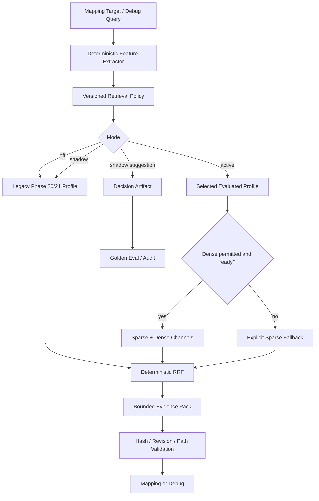

# Phase 47：检索质量自适应优化与可评测策略路由

> 本阶段建立在 Phase 20 Hybrid Evidence Retrieval、Phase 21 Dense Semantic Retrieval、Phase 37
> Grounding Golden Eval、Phase 45 Verified Failure Memory 和 Phase 46 Project Memory 之上。
>
> 当前系统已经有 keyword、symbol、import graph、path、CLI/config、BM25、traceback、dense 和
> deterministic RRF，但运行时仍主要依赖一组固定权重。Phase 47 不再增加新的向量数据库或模型，
> 而是把“不同查询应该采用什么检索组合”变成版本化、可解释、可离线评测和可安全回滚的策略。
>
> 本教程只提供实现步骤、代码和验收方法，请按顺序自行修改项目源码。

> **章节标识说明**
>
> - “需要新增”表示创建完整文件，代码块给出该文件的完整第一版内容。
> - “需要局部修改”会标明文件、锚点以及修改前后的上下文。
> - “原理、运行、调试或验收说明”不需要修改项目代码。
> - 本阶段默认 `RETRIEVAL_POLICY_MODE=off`，完成测试前不会改变现有检索结果。
> - 临时验证内容只能放在项目内 `.codex_tmp/`，不要写入系统 `/tmp`。

---

## 一、为什么 Phase 47 现在值得优先做

> **本节类型：优先级分析，不修改项目代码。**

现有检索器已经能产生多个通道：

```text
keyword / symbol / import_graph / path
cli_config / bm25 / traceback / dense
```

但“所有查询都使用同一组通道和同一组权重”会带来两个问题。

### 1.1 精确查询可能被语义结果稀释

用户或日志已经给出：

```text
ImportError: undefined symbol: _ZN3c104cuda...
```

这类查询最重要的是精确错误码、符号、traceback 路径和构建文件。若无条件加入 Dense，既增加
Provider 调用和延迟，也可能让“语义相似但无关”的说明文件进入前排。

### 1.2 论文术语和代码命名不一致时需要 Dense

论文写：

```text
跨连续帧构造点邻域，并联合聚合空间与时间特征
```

代码却只有：

```python
class Block(nn.Module):
    ...
```

这时仅依赖 symbol/path 很可能没有种子，Dense + sparse fusion 更有价值。

### 1.3 “自适应”不能等于让 LLM 自由决定工具

不安全的实现是：

```text
LLM 看完 query
  -> 自由决定开启远程 embedding
  -> 自由决定检索哪些目录
  -> 自由修改 top_k 和权重
```

本阶段采用：

```text
确定性 Query Feature
  -> 版本化 Policy Rule
  -> 已评测 Retrieval Profile
  -> 安全能力检查
  -> Evidence Pack
```

LLM 产生的论文模块描述可以作为检索数据，但不能修改 Policy、启用源码上传或扩大可访问目录。

---

## 二、本阶段目标

> **本节类型：目标说明，不修改项目代码。**

完成后系统应具备：

1. 从 query、keywords、论文 Evidence 数量和可信 traceback path 提取确定性特征；
2. 将查询分为 `exact_error`、`symbol_path`、`semantic_alignment`、`diagnostic` 或 `mixed`；
3. 用版本化 Retrieval Profile 声明启用通道、权重、RRF、Top-K 和 Dense 要求；
4. 用本地 JSON Policy 把 Query Kind 映射到 Profile；
5. Policy、Profile、Query 和 Decision 都保留 SHA-256 身份；
6. `off` 模式完全保持 Phase 20/21 旧行为；
7. `shadow` 模式只记录建议，不改变实际 Evidence Pack；
8. `active` 模式才应用已通过评测的 Profile；
9. Policy 不能绕过 `ENABLE_DENSE_RETRIEVAL` 和 `ALLOW_CODE_EMBEDDING_UPLOAD`；
10. Dense 不可用时按显式 fallback profile 降级，并记录原因；
11. `build_evidence_pack()` 支持受限通道和 profile 权重，但继续执行路径与 Hash 校验；
12. 每个 mapping target 写入独立 Retrieval Decision Artifact；
13. 用 Golden Case 比较 Recall@K、MRR、provenance、禁用文件、延迟和资源消耗；
14. Challenger 只能生成 promotion proposal，不能自动修改生产 Policy；
15. 任何回归都能通过 `RETRIEVAL_POLICY_MODE=off` 立即回滚。

---

## 三、本阶段明确不做什么

> **本节类型：范围说明，不修改项目代码。**

本阶段不做：

- 不增加 FAISS、pgvector、Milvus 或 Elasticsearch；
- 不下载新的 embedding 或 reranker 模型；
- 不实现在线强化学习、bandit 或基于点击的自动调参；
- 不把用户是否点击某文件直接当作正确标签；
- 不让 LLM 生成或修改生产 Policy；
- 不由 Policy 自动开启网络、Secret 或源码上传权限；
- 不把 Dense 相似度当作文件修改授权；
- 不让 retrieval score 替代 Evidence Hash、repo revision 和路径边界；
- 不自动覆盖 baseline 或生产配置；
- 不把完整源码、向量或原始 Prompt 写入 Decision Artifact；
- 不把 Failure Memory、Project Memory 和 Code Retrieval 混成一个无类型知识池。

跨论文知识库和 Skill/Plugin 机制仍放在后续阶段。

---

## 四、必须保持的安全与正确性不变量

> **本节类型：设计约束，不修改项目代码。**

```text
Invariant 1：Policy 只改变候选通道和排序参数，不改变 repo_root。

Invariant 2：Policy 不能把 Dense 从 disabled 变成 enabled。

Invariant 3：ALLOW_CODE_EMBEDDING_UPLOAD=false 时绝不能发送源码。

Invariant 4：shadow 模式的实际 Evidence Pack 必须与 off 模式一致。

Invariant 5：Profile 只能使用 RetrievalChannel allowlist 中的通道。

Invariant 6：import_graph profile 必须同时启用 symbol，避免失去图种子。

Invariant 7：requires_dense profile 在 Dense 不可用时必须显式 fallback。

Invariant 8：所有 CodeEvidence 继续校验 repo revision、file hash 和 content hash。

Invariant 9：Golden Eval 中 provenance 或 forbidden path 回归属于硬失败。

Invariant 10：promotion proposal 不能自动改写 config/retrieval_policy.json。

Invariant 11：Policy 决策不包含完整源码、Secret、向量或可执行命令。

Invariant 12：LLM、Chat Agent 和 Project Fact 都不能写 retrieval_policy_mode。
```

---

## 五、目标架构

> **本节类型：架构说明，不修改项目代码。**



离线晋升链路：

```text
固定 Golden Cases
  -> baseline profile
  -> challenger profile
  -> Recall / MRR / provenance / latency / cost
  -> hard safety gate
  -> promotion_proposal.json
  -> 人工检查
  -> 手工更新版本化 Policy
```

---

## 六、涉及文件

> **本节类型：实施清单，不修改项目代码。**

需要新增：

```text
app/retrieval/policy_schemas.py
app/retrieval/policy.py
app/retrieval/policy_eval.py
config/retrieval_policy.json

app/evaluation/retrieval_policy_cases/exact_symbol.json
app/evaluation/retrieval_policy_cases/semantic_gap.json

tests/test_retrieval_policy_schemas.py
tests/test_retrieval_policy_router.py
tests/test_retrieval_policy_eval.py
tests/test_retrieval_policy_integration.py
```

需要修改：

```text
app/retrieval/ranking.py
app/retrieval/service.py
app/retrieval/__init__.py
app/nodes/code_search_node.py
app/config.py
app/state.py
.env.example
a_implementation_guides/README.md
a_implementation_guides/project_phase_capability_summary.md
a_implementation_guides/python_source_code_reference.md
```

本阶段不增加第三方依赖，不需要修改 `pyproject.toml`。

---

## 七、新增 Retrieval Policy Schema

> **本节类型：需要新增代码。**
>
> 新增：`app/retrieval/policy_schemas.py`

```python
from __future__ import annotations

from typing import Literal

from pydantic import (
    BaseModel,
    ConfigDict,
    Field,
    model_validator,
)

from app.retrieval.schemas import (
    ChannelHit,
    RetrievalChannel,
)


RetrievalPolicyMode = Literal[
    "off",
    "shadow",
    "active",
]

RetrievalQueryKind = Literal[
    "exact_error",
    "symbol_path",
    "semantic_alignment",
    "diagnostic",
    "mixed",
]


class RetrievalPolicyModel(BaseModel):
    """所有策略对象拒绝未知字段，避免配置拼写错误被静默忽略。"""

    model_config = ConfigDict(extra="forbid")


class RetrievalQueryFeatures(RetrievalPolicyModel):
    """只保存确定性特征和 query hash，不复制原始查询正文。"""

    query_sha256: str = Field(
        pattern=r"^[0-9a-f]{64}$",
    )
    query_kind: RetrievalQueryKind
    token_count: int = Field(ge=0)
    keyword_count: int = Field(ge=0)
    paper_evidence_count: int = Field(ge=0)
    preferred_path_count: int = Field(ge=0)

    has_error_signature: bool = False
    has_symbol_hint: bool = False
    has_path_hint: bool = False
    has_traceback_path: bool = False
    has_semantic_description: bool = False

    feature_version: str = "phase47-v1"


class RetrievalProfile(RetrievalPolicyModel):
    """一组经过评测的检索通道、融合权重和资源上限。"""

    profile_id: str = Field(
        pattern=r"^[a-z][a-z0-9_]{2,63}$",
    )
    profile_version: str
    description: str

    enabled_channels: list[RetrievalChannel] = Field(
        min_length=1,
    )
    channel_weights: dict[RetrievalChannel, float]

    top_k: int = Field(default=8, ge=1, le=50)
    rrf_k: int = Field(default=60, ge=1, le=500)
    requires_dense: bool = False

    # 这些预算同时用于离线门禁和运行时审计。
    max_duration_ms: float = Field(default=3000, gt=0)
    max_embedding_query_calls: int = Field(default=0, ge=0)

    @model_validator(mode="after")
    def validate_profile(self) -> RetrievalProfile:
        if len(set(self.enabled_channels)) != len(
            self.enabled_channels
        ):
            raise ValueError("enabled_channels 不能重复")

        unknown_weights = set(self.channel_weights) - set(
            self.enabled_channels
        )
        if unknown_weights:
            raise ValueError(
                "channel_weights 包含未启用通道："
                f"{sorted(unknown_weights)}"
            )
        if any(value <= 0 for value in self.channel_weights.values()):
            raise ValueError("所有 channel weight 必须大于 0")

        if self.requires_dense and "dense" not in self.enabled_channels:
            raise ValueError(
                "requires_dense=true 时必须启用 dense 通道"
            )
        if (
            "dense" not in self.enabled_channels
            and self.max_embedding_query_calls != 0
        ):
            raise ValueError(
                "不含 dense 的 profile 不能声明 embedding 调用预算"
            )
        if (
            "import_graph" in self.enabled_channels
            and "symbol" not in self.enabled_channels
        ):
            raise ValueError(
                "import_graph 依赖 symbol 种子，必须同时启用 symbol"
            )
        return self


class RetrievalPolicyRule(RetrievalPolicyModel):
    rule_id: str = Field(
        pattern=r"^[a-z][a-z0-9_]{2,63}$",
    )
    priority: int = Field(ge=0, le=10000)
    query_kinds: list[RetrievalQueryKind] = Field(min_length=1)
    profile_id: str
    requires_dense_available: bool = False

    @model_validator(mode="after")
    def validate_query_kinds(self) -> RetrievalPolicyRule:
        if len(set(self.query_kinds)) != len(self.query_kinds):
            raise ValueError("rule query_kinds 不能重复")
        return self


class RetrievalPolicyConfig(RetrievalPolicyModel):
    schema_version: str = "phase47-v1"
    policy_version: str
    default_profile_id: str
    fallback_profile_id: str
    profiles: list[RetrievalProfile] = Field(min_length=1)
    rules: list[RetrievalPolicyRule] = Field(default_factory=list)

    @model_validator(mode="after")
    def validate_references(self) -> RetrievalPolicyConfig:
        profile_ids = [item.profile_id for item in self.profiles]
        if len(set(profile_ids)) != len(profile_ids):
            raise ValueError("profile_id 不能重复")

        known = set(profile_ids)
        if self.default_profile_id not in known:
            raise ValueError("default_profile_id 不存在")
        if self.fallback_profile_id not in known:
            raise ValueError("fallback_profile_id 不存在")

        fallback = next(
            item
            for item in self.profiles
            if item.profile_id == self.fallback_profile_id
        )
        if fallback.requires_dense or "dense" in fallback.enabled_channels:
            raise ValueError("fallback profile 必须完全离线可用")

        rule_ids = [item.rule_id for item in self.rules]
        if len(set(rule_ids)) != len(rule_ids):
            raise ValueError("rule_id 不能重复")
        for rule in self.rules:
            if rule.profile_id not in known:
                raise ValueError(
                    f"rule 引用了未知 profile：{rule.profile_id}"
                )
        return self


class RetrievalDecision(RetrievalPolicyModel):
    """运行时可持久化审计记录，不保存 query 正文和源码。"""

    decision_sha256: str = Field(
        pattern=r"^[0-9a-f]{64}$",
    )
    policy_sha256: str = Field(
        pattern=r"^[0-9a-f]{64}$",
    )
    profile_sha256: str = Field(
        pattern=r"^[0-9a-f]{64}$",
    )

    policy_version: str
    mode: RetrievalPolicyMode
    applied: bool
    selected_profile: RetrievalProfile
    query_features: RetrievalQueryFeatures
    reason_codes: list[str] = Field(default_factory=list)
    dense_available: bool
    fallback_used: bool = False


class RetrievalPolicyGoldenCase(RetrievalPolicyModel):
    """独立于通用 EvalCase 的窄型检索策略 Golden Case。"""

    case_id: str
    description: str
    repo_path: str
    query: str
    keywords: list[str] = Field(default_factory=list)
    preferred_paths: list[str] = Field(default_factory=list)
    paper_evidence_count: int = Field(default=0, ge=0)
    expected_query_kind: RetrievalQueryKind

    required_paths: list[str] = Field(min_length=1)
    forbidden_paths: list[str] = Field(default_factory=list)
    baseline_profile_id: str
    challenger_profile_ids: list[str] = Field(min_length=1)

    # 离线 Case 可以提供固定 dense hit，只评测 fusion，不调用 Provider。
    simulated_dense_hits: list[ChannelHit] = Field(default_factory=list)


class RetrievalProfileCaseMetrics(RetrievalPolicyModel):
    case_id: str
    profile_id: str
    query_kind: RetrievalQueryKind
    recall_at_k: float = Field(ge=0, le=1)
    mean_reciprocal_rank: float = Field(ge=0, le=1)
    citation_coverage: float = Field(ge=0, le=1)
    provenance_ratio: float = Field(ge=0, le=1)
    forbidden_path_count: int = Field(ge=0)
    duration_ms: float = Field(ge=0)
    observed_paths: list[str] = Field(default_factory=list)
    passed_hard_gate: bool


class RetrievalProfileAggregate(RetrievalPolicyModel):
    profile_id: str
    case_count: int = Field(ge=1)
    mean_recall_at_k: float = Field(ge=0, le=1)
    mean_reciprocal_rank: float = Field(ge=0, le=1)
    mean_citation_coverage: float = Field(ge=0, le=1)
    mean_provenance_ratio: float = Field(ge=0, le=1)
    mean_duration_ms: float = Field(ge=0)
    hard_gate_passed: bool


class RetrievalPromotionProposal(RetrievalPolicyModel):
    proposal_sha256: str = Field(
        pattern=r"^[0-9a-f]{64}$",
    )
    policy_sha256: str = Field(
        pattern=r"^[0-9a-f]{64}$",
    )
    case_id: str
    baseline_profile_id: str
    challenger_profile_id: str
    eligible: bool
    reason_codes: list[str] = Field(default_factory=list)
    # proposed 只表示等待人工检查，不能自动写生产配置。
    status: Literal["proposed"] = "proposed"


class RetrievalPolicyEvalReport(RetrievalPolicyModel):
    eval_sha256: str = Field(
        pattern=r"^[0-9a-f]{64}$",
    )
    policy_sha256: str = Field(
        pattern=r"^[0-9a-f]{64}$",
    )
    generated_at: str
    case_metrics: list[RetrievalProfileCaseMetrics]
    profile_aggregates: list[RetrievalProfileAggregate]
    promotion_proposals: list[RetrievalPromotionProposal]
```

### 7.1 这些 Schema 分别解决什么问题

| Schema | 输入含义 | 输出/记录含义 |
|---|---|---|
| `RetrievalQueryFeatures` | query 的 Hash 和确定性特征 | 不含原文的路由依据 |
| `RetrievalProfile` | 通道、权重、Top-K、预算 | 一种可单独评测的检索策略 |
| `RetrievalPolicyRule` | Query Kind 与 dense readiness | profile 选择规则 |
| `RetrievalPolicyConfig` | 版本化本地配置 | 当前策略全集及 fallback |
| `RetrievalDecision` | Policy、Feature、运行能力 | 一次 target 的可审计决策 |
| `RetrievalPolicyGoldenCase` | 固定仓库、查询和 Oracle | 离线策略评测输入 |
| `RetrievalProfileCaseMetrics` | 一个 Case 的实际排名 | Recall、MRR、provenance 等结果 |
| `RetrievalPromotionProposal` | baseline/challenger 对比 | 只读晋升建议，不是自动发布 |

---

## 八、实现确定性 Feature、Policy Hash 与路由

> **本节类型：需要新增代码。**
>
> 新增：`app/retrieval/policy.py`

```python
from __future__ import annotations

import hashlib
import json
import re
from pathlib import Path
from typing import Any

from app.retrieval.policy_schemas import (
    RetrievalDecision,
    RetrievalPolicyConfig,
    RetrievalPolicyMode,
    RetrievalProfile,
    RetrievalQueryFeatures,
)


MAX_POLICY_BYTES = 256 * 1024
FEATURE_VERSION = "phase47-v1"

_ERROR_PATTERN = re.compile(
    r"(?:\b[A-Z][A-Z0-9_]{3,}\b|"
    r"\b[A-Za-z]+(?:Error|Exception)\b|"
    r"undefined symbol|no such file|exit code|traceback)",
    re.IGNORECASE,
)
_PATH_PATTERN = re.compile(
    r"(?:^|\s)(?:[A-Za-z0-9_.-]+/)+[A-Za-z0-9_.-]+"
)
_SYMBOL_PATTERN = re.compile(
    r"^(?:[A-Za-z_][A-Za-z0-9_]*|"
    r"[A-Za-z_][A-Za-z0-9_]*\.[A-Za-z_][A-Za-z0-9_]*)$"
)


def canonical_json(value: Any) -> str:
    """生成稳定 JSON；Hash 身份不能依赖字典插入顺序。"""

    if hasattr(value, "model_dump"):
        value = value.model_dump(mode="json")
    return json.dumps(
        value,
        ensure_ascii=False,
        sort_keys=True,
        separators=(",", ":"),
    )


def sha256_value(value: Any) -> str:
    """返回领域对象的 SHA-256 内容身份，不返回或隐藏原文。"""

    return hashlib.sha256(
        canonical_json(value).encode("utf-8")
    ).hexdigest()


def load_retrieval_policy(path: str | Path) -> RetrievalPolicyConfig:
    """从有界本地 JSON 加载 Policy，并由 Pydantic 拒绝未知字段。"""

    candidate = Path(path).expanduser().resolve()
    if not candidate.is_file():
        raise FileNotFoundError(f"Retrieval Policy 不存在：{candidate}")
    if candidate.stat().st_size > MAX_POLICY_BYTES:
        raise ValueError("Retrieval Policy 文件过大")

    payload = json.loads(candidate.read_text(encoding="utf-8"))
    return RetrievalPolicyConfig.model_validate(payload)


def profile_by_id(
    policy: RetrievalPolicyConfig,
    profile_id: str,
) -> RetrievalProfile:
    """按稳定 ID 查询 profile；不存在时失败，不静默使用相似名称。"""

    for profile in policy.profiles:
        if profile.profile_id == profile_id:
            return profile
    raise KeyError(f"未知 retrieval profile：{profile_id}")


def _normalized_values(query: str, keywords: list[str]) -> list[str]:
    output: list[str] = []
    for raw in [query, *keywords]:
        normalized = " ".join(str(raw or "").split())
        if normalized and normalized not in output:
            output.append(normalized)
    return output


def build_query_features(
    *,
    query: str,
    keywords: list[str],
    preferred_paths: list[str] | None = None,
    paper_evidence_count: int = 0,
) -> RetrievalQueryFeatures:
    """
    只用确定性规则提取特征。

    query/keywords 是待检索文本；返回值只保存 query_sha256 和布尔/计数，
    不把潜在敏感 query 复制到 Decision Artifact。
    """

    values = _normalized_values(query, keywords)
    combined = "\n".join(values)
    tokens = re.findall(r"[A-Za-z0-9_]+|[\u4e00-\u9fff]", combined)
    paths = [
        " ".join(str(value or "").split())
        for value in (preferred_paths or [])
        if str(value or "").strip()
    ]

    has_error = bool(_ERROR_PATTERN.search(combined))
    has_path = bool(paths) or bool(_PATH_PATTERN.search(combined))
    has_traceback = bool(paths)
    has_symbol = any(
        bool(_SYMBOL_PATTERN.fullmatch(value))
        and (
            "_" in value
            or "." in value
            or any(character.isupper() for character in value[1:])
        )
        for value in keywords
    )
    has_semantic = (
        paper_evidence_count > 0
        or len(combined) >= 180
        or len(tokens) >= 28
    )

    # 优先级本身就是策略契约：可信 traceback > 精确错误 > symbol/path > 语义。
    if has_traceback:
        query_kind = "diagnostic"
    elif has_error:
        query_kind = "exact_error"
    elif (has_symbol or has_path) and not has_semantic:
        query_kind = "symbol_path"
    elif has_semantic and not (has_symbol or has_path):
        query_kind = "semantic_alignment"
    else:
        query_kind = "mixed"

    return RetrievalQueryFeatures(
        query_sha256=sha256_value(
            {
                "query": query,
                "keywords": keywords,
                "preferred_paths": paths,
            }
        ),
        query_kind=query_kind,
        token_count=len(tokens),
        keyword_count=len(keywords),
        paper_evidence_count=paper_evidence_count,
        preferred_path_count=len(paths),
        has_error_signature=has_error,
        has_symbol_hint=has_symbol,
        has_path_hint=has_path,
        has_traceback_path=has_traceback,
        has_semantic_description=has_semantic,
        feature_version=FEATURE_VERSION,
    )


def select_retrieval_profile(
    *,
    policy: RetrievalPolicyConfig,
    features: RetrievalQueryFeatures,
    dense_available: bool,
    mode: RetrievalPolicyMode,
) -> RetrievalDecision:
    """
    返回可审计决策。

    dense_available 必须由 Settings + capability/readiness 计算，不能由 query、
    LLM 或 Project Fact 提供。off 模式不会调用本函数。
    """

    reason_codes: list[str] = []
    selected_profile_id = policy.default_profile_id

    for rule in sorted(
        policy.rules,
        key=lambda item: (-item.priority, item.rule_id),
    ):
        if features.query_kind not in rule.query_kinds:
            continue
        if rule.requires_dense_available and not dense_available:
            reason_codes.append(
                f"RULE_SKIPPED_DENSE_UNAVAILABLE:{rule.rule_id}"
            )
            continue
        selected_profile_id = rule.profile_id
        reason_codes.append(f"RULE_MATCHED:{rule.rule_id}")
        break
    else:
        reason_codes.append("DEFAULT_PROFILE")

    selected = profile_by_id(policy, selected_profile_id)
    fallback_used = False
    if selected.requires_dense and not dense_available:
        selected = profile_by_id(policy, policy.fallback_profile_id)
        fallback_used = True
        reason_codes.append("FALLBACK_DENSE_UNAVAILABLE")

    policy_sha256 = sha256_value(policy)
    profile_sha256 = sha256_value(selected)
    decision_payload = {
        "policy_sha256": policy_sha256,
        "profile_sha256": profile_sha256,
        "policy_version": policy.policy_version,
        "mode": mode,
        "applied": mode == "active",
        "query_features": features.model_dump(mode="json"),
        "reason_codes": reason_codes,
        "dense_available": dense_available,
        "fallback_used": fallback_used,
    }

    return RetrievalDecision(
        decision_sha256=sha256_value(decision_payload),
        policy_sha256=policy_sha256,
        profile_sha256=profile_sha256,
        policy_version=policy.policy_version,
        mode=mode,
        applied=mode == "active",
        selected_profile=selected,
        query_features=features,
        reason_codes=reason_codes,
        dense_available=dense_available,
        fallback_used=fallback_used,
    )
```

### 8.1 核心函数输入输出

| 函数 | 输入 | 输出 |
|---|---|---|
| `canonical_json` | 任意可 JSON 化领域对象 | 排序稳定的 JSON 文本，用于 Hash，不是加密文本 |
| `sha256_value` | Policy/Profile/Query/Decision 载荷 | 64 位内容身份 Hash |
| `load_retrieval_policy` | 本地 JSON 文件路径 | 校验后的 `RetrievalPolicyConfig` |
| `profile_by_id` | Policy 和稳定 profile ID | 对应 `RetrievalProfile`，不存在则抛异常 |
| `build_query_features` | 查询文本、关键词、可信路径和 Evidence 数量 | 不含查询原文的确定性特征 |
| `select_retrieval_profile` | Policy、特征、Dense 可用性和模式 | 带 Policy/Profile/Decision Hash 的审计决策 |

---

## 九、增加默认版本化 Policy

> **本节类型：需要新增配置。**
>
> 新增：`config/retrieval_policy.json`

```json
{
  "schema_version": "phase47-v1",
  "policy_version": "phase47-policy-v1",
  "default_profile_id": "balanced_sparse_v1",
  "fallback_profile_id": "balanced_sparse_v1",
  "profiles": [
    {
      "profile_id": "balanced_sparse_v1",
      "profile_version": "1",
      "description": "Phase 20 稳定 sparse 基线",
      "enabled_channels": [
        "keyword",
        "symbol",
        "import_graph",
        "path",
        "cli_config",
        "bm25"
      ],
      "channel_weights": {
        "keyword": 2.0,
        "symbol": 2.4,
        "import_graph": 1.7,
        "path": 1.2,
        "cli_config": 1.6,
        "bm25": 1.0
      },
      "top_k": 8,
      "rrf_k": 60,
      "requires_dense": false,
      "max_duration_ms": 3000,
      "max_embedding_query_calls": 0
    },
    {
      "profile_id": "exact_lexical_v1",
      "profile_version": "1",
      "description": "精确错误码和长 literal 优先",
      "enabled_channels": ["keyword", "bm25"],
      "channel_weights": {
        "keyword": 3.2,
        "bm25": 1.0
      },
      "top_k": 8,
      "rrf_k": 40,
      "requires_dense": false,
      "max_duration_ms": 2500,
      "max_embedding_query_calls": 0
    },
    {
      "profile_id": "symbol_path_v1",
      "profile_version": "1",
      "description": "符号、路径和 import caller 优先",
      "enabled_channels": [
        "symbol",
        "path",
        "keyword",
        "import_graph",
        "bm25"
      ],
      "channel_weights": {
        "symbol": 3.2,
        "path": 2.0,
        "keyword": 2.0,
        "import_graph": 2.2,
        "bm25": 0.8
      },
      "top_k": 8,
      "rrf_k": 50,
      "requires_dense": false,
      "max_duration_ms": 3000,
      "max_embedding_query_calls": 0
    },
    {
      "profile_id": "semantic_hybrid_v1",
      "profile_version": "1",
      "description": "论文语义与命名不一致时使用 dense + sparse fusion",
      "enabled_channels": [
        "dense",
        "keyword",
        "symbol",
        "import_graph",
        "path",
        "bm25"
      ],
      "channel_weights": {
        "dense": 3.0,
        "keyword": 1.6,
        "symbol": 2.0,
        "import_graph": 1.4,
        "path": 1.0,
        "bm25": 1.2
      },
      "top_k": 8,
      "rrf_k": 60,
      "requires_dense": true,
      "max_duration_ms": 120000,
      "max_embedding_query_calls": 1
    },
    {
      "profile_id": "diagnostic_sparse_v1",
      "profile_version": "1",
      "description": "可信 traceback path 和错误文本优先",
      "enabled_channels": [
        "traceback",
        "keyword",
        "symbol",
        "path",
        "bm25"
      ],
      "channel_weights": {
        "traceback": 4.0,
        "keyword": 2.6,
        "symbol": 2.4,
        "path": 1.8,
        "bm25": 1.0
      },
      "top_k": 8,
      "rrf_k": 40,
      "requires_dense": false,
      "max_duration_ms": 3000,
      "max_embedding_query_calls": 0
    }
  ],
  "rules": [
    {
      "rule_id": "diagnostic_first",
      "priority": 500,
      "query_kinds": ["diagnostic"],
      "profile_id": "diagnostic_sparse_v1",
      "requires_dense_available": false
    },
    {
      "rule_id": "exact_error_first",
      "priority": 400,
      "query_kinds": ["exact_error"],
      "profile_id": "exact_lexical_v1",
      "requires_dense_available": false
    },
    {
      "rule_id": "symbol_path_first",
      "priority": 300,
      "query_kinds": ["symbol_path"],
      "profile_id": "symbol_path_v1",
      "requires_dense_available": false
    },
    {
      "rule_id": "semantic_when_dense_ready",
      "priority": 200,
      "query_kinds": ["semantic_alignment"],
      "profile_id": "semantic_hybrid_v1",
      "requires_dense_available": true
    }
  ]
}
```

注意：配置中出现 `semantic_hybrid_v1` 不代表系统有权调用 Provider。是否允许 Dense 仍由：

```text
ENABLE_DENSE_RETRIEVAL
ALLOW_CODE_EMBEDDING_UPLOAD
Embedding Provider readiness
```

共同决定。

---

## 十、让 Ranking 支持显式通道集合

> **本节类型：需要局部修改代码。**
>
> 修改：`app/retrieval/ranking.py`

现有 `build_channel_rankings()` 总是构造全部 sparse 通道。将该函数完整替换为下面版本；其他
`rank_*()` 函数保持不变。

```python
def build_channel_rankings(
    index: RepositoryIndex,
    *,
    query: str,
    keywords: list[str],
    preferred_paths: list[str] | None = None,
    dense_hits: list[ChannelHit] | None = None,
    enabled_channels: list[RetrievalChannel] | None = None,
) -> dict[
    RetrievalChannel,
    list[ChannelHit],
]:
    """
    只构造 profile 允许的通道。

    enabled_channels=None 保持 Phase 20/21 的全部通道行为，供 off/shadow
    模式和旧调用方使用。函数只控制候选生成，不改变 repo/path 边界。
    """

    all_channels: list[RetrievalChannel] = [
        "traceback",
        "symbol",
        "dense",
        "keyword",
        "import_graph",
        "cli_config",
        "path",
        "bm25",
    ]
    active = set(enabled_channels or all_channels)

    unknown = active - set(all_channels)
    if unknown:
        raise ValueError(
            f"未知 retrieval channel：{sorted(unknown)}"
        )
    if "import_graph" in active and "symbol" not in active:
        raise ValueError(
            "import_graph 依赖 symbol，不能单独启用"
        )

    # import graph 依赖 symbol seed，因此只在确实需要时计算。
    symbol_hits = (
        rank_symbol(
            index,
            query=query,
            keywords=keywords,
        )
        if "symbol" in active
        else []
    )

    rankings: dict[
        RetrievalChannel,
        list[ChannelHit],
    ] = {}

    if "traceback" in active:
        rankings["traceback"] = rank_traceback_paths(
            index,
            preferred_paths=preferred_paths or [],
        )
    if "symbol" in active:
        rankings["symbol"] = symbol_hits
    if "dense" in active:
        rankings["dense"] = list(dense_hits or [])
    if "keyword" in active:
        rankings["keyword"] = rank_keyword(
            index,
            query=query,
            keywords=keywords,
        )
    if "import_graph" in active:
        rankings["import_graph"] = rank_import_graph(
            index,
            symbol_hits=symbol_hits,
            query=query,
            keywords=keywords,
        )
    if "cli_config" in active:
        rankings["cli_config"] = rank_cli_config(
            index,
            query=query,
            keywords=keywords,
        )
    if "path" in active:
        rankings["path"] = rank_path(
            index,
            query=query,
            keywords=keywords,
        )
    if "bm25" in active:
        rankings["bm25"] = rank_bm25(
            index,
            query=query,
            keywords=keywords,
        )

    return rankings
```

`fuse_rankings()` 已经支持 `weights` 参数，不需要重写。它会把 Profile 的权重覆盖到
`DEFAULT_CHANNEL_WEIGHTS` 上；由于输入 rankings 只包含已启用通道，未启用通道不会进入结果。

### 10.1 为什么不直接删除默认权重

保留 `DEFAULT_CHANNEL_WEIGHTS` 有两个作用：

1. `enabled_channels=None` 的旧调用继续获得 Phase 20/21 行为；
2. Profile 可以只覆盖关心的通道，但 Schema 已阻止给未启用通道配置权重。

---

## 十一、让 Evidence Service 接收 Profile 参数

> **本节类型：需要局部修改代码。**
>
> 修改：`app/retrieval/service.py`

### 11.1 修改 import

在现有 `from app.retrieval.schemas import (...)` 中增加 `RetrievalChannel`：

```python
from app.retrieval.schemas import (
    ChannelHit,
    CodeEvidence,
    EvidencePack,
    FusedCandidate,
    RepositoryIndex,
    RetrievalChannel,
    RetrievalSignal,
)
```

### 11.2 扩展 `build_evidence_pack()` 签名

保留原参数顺序，在 `dense_hits` 后增加两个可选参数：

```python
def build_evidence_pack(
    *,
    repo_path: str | Path,
    query: str,
    keywords: list[str],
    index: RepositoryIndex | None = None,
    index_version: str = "phase20-v1",
    max_file_bytes: int = 1024 * 1024,
    top_k: int = 8,
    context_lines: int = 20,
    max_span_lines: int = 120,
    rrf_k: int = 60,
    preferred_paths: list[str] | None = None,
    dense_hits: list[ChannelHit] | None = None,
    enabled_channels: list[RetrievalChannel] | None = None,
    channel_weights: dict[RetrievalChannel, float] | None = None,
) -> tuple[RepositoryIndex, EvidencePack]:
    # 这里只展示扩展后的签名；函数体继续使用当前 service.py 的实现，
    # 并按下一小节修改 rankings/fusion 两处调用。
    ...
```

### 11.3 修改 ranking 调用

找到：

```python
    rankings = build_channel_rankings(
        active_index,
        query=query,
        keywords=normalized_keywords,
        preferred_paths=preferred_paths,
        dense_hits=dense_hits,
    )
    fused = fuse_rankings(
        rankings,
        rrf_k=rrf_k,
    )
```

替换为：

```python
    rankings = build_channel_rankings(
        active_index,
        query=query,
        keywords=normalized_keywords,
        preferred_paths=preferred_paths,
        dense_hits=dense_hits,
        enabled_channels=enabled_channels,
    )
    fused = fuse_rankings(
        rankings,
        rrf_k=rrf_k,
        weights=channel_weights,
    )
```

后面的 `_safe_file()`、file SHA、revision、line window、content hash 和 Evidence ID 逻辑必须保持
原样。Profile 只影响 `rankings` 和 `fused`，不能绕过 provenance 校验。

---

## 十二、导出 Policy API

> **本节类型：需要局部修改代码。**
>
> 修改：`app/retrieval/__init__.py`

在现有 import 后增加：

```python
from app.retrieval.policy import (
    build_query_features,
    load_retrieval_policy,
    select_retrieval_profile,
    sha256_value,
)
from app.retrieval.policy_schemas import (
    RetrievalDecision,
    RetrievalPolicyConfig,
    RetrievalPolicyMode,
    RetrievalProfile,
    RetrievalQueryFeatures,
)
```

在 `__all__` 增加：

```python
    "RetrievalDecision",
    "RetrievalPolicyConfig",
    "RetrievalPolicyMode",
    "RetrievalProfile",
    "RetrievalQueryFeatures",
    "build_query_features",
    "load_retrieval_policy",
    "select_retrieval_profile",
    "sha256_value",
```

---

## 十三、增加 Settings、环境变量和 State 字段

### 13.1 修改 `app/config.py`

> **本节类型：需要局部修改代码。**

在现有 `retrieval_rrf_k` 后、Job Runtime 配置前增加：

```python
    # Phase 47：默认 off，确保升级后检索结果完全兼容。
    retrieval_policy_mode: str = os.getenv(
        "RETRIEVAL_POLICY_MODE",
        "off",
    ).strip().lower()

    # Policy 是版本化本地配置，不由 LLM、Chat 或 Graph State 覆盖。
    retrieval_policy_path: Path = Path(
        os.getenv(
            "RETRIEVAL_POLICY_PATH",
            "config/retrieval_policy.json",
        )
    )
```

在 `settings = Settings()` 后、创建目录前增加 fail-fast 校验：

```python
if settings.retrieval_policy_mode not in {
    "off",
    "shadow",
    "active",
}:
    raise ValueError(
        "RETRIEVAL_POLICY_MODE 必须是 off、shadow 或 active"
    )
```

不要把 `retrieval_policy_mode` 放入可由请求、LLM 或 Project Fact 改写的 State override allowlist。

### 13.2 修改 `.env.example`

> **本节类型：需要局部修改配置。**

在 Dense Retrieval 配置附近增加：

```dotenv
# Phase 47 默认关闭；shadow 只记录建议；active 才改变检索 profile。
RETRIEVAL_POLICY_MODE=off
RETRIEVAL_POLICY_PATH=config/retrieval_policy.json
```

### 13.3 修改 `app/state.py`

> **本节类型：需要局部修改代码。**

在 `dense_retrieval_report_paths` 后增加：

```python
    # Phase 47：mapping target_id -> RetrievalDecision Artifact 路径。
    retrieval_policy_decision_paths: dict[str, str]

    # 实际加载的 Policy 内容身份，不保存完整配置到 checkpoint。
    retrieval_policy_sha256: str | None
```

旧 checkpoint 没有这些字段时，节点一律使用 `.get(..., {})` 或 `.get(...)`，不能直接下标读取。

---

## 十四、把 Policy 接入 `code_search_node`

> **本节类型：需要局部修改代码。**
>
> 修改：`app/nodes/code_search_node.py`

本节给出需要插入的完整辅助函数和关键上下文。不要完整覆盖现有节点，否则容易丢失 Phase 20/21
已有 Artifact、fallback 和 StageError 处理。

### 14.1 扩展 import

把 `from app.retrieval import (...)` 扩展为：

```python
from app.retrieval import (
    EmbeddingProviderError,
    PreparedDenseRetriever,
    SQLiteEmbeddingCache,
    build_evidence_pack,
    build_lexical_query,
    build_query_features,
    build_repository_index,
    build_semantic_chunks,
    build_semantic_query,
    get_embedding_backend,
    load_retrieval_policy,
    select_retrieval_profile,
    sha256_value,
)
from app.retrieval.policy_schemas import (
    RetrievalDecision,
    RetrievalPolicyConfig,
    RetrievalPolicyMode,
)
```

### 14.2 新增局部规划辅助函数

把下面函数放在 `_mapping_targets()` 后、`code_search_node()` 前：

```python
def _policy_mode() -> RetrievalPolicyMode:
    """Settings 已在启动时验证，这里只做类型收窄。"""

    return settings.retrieval_policy_mode  # type: ignore[return-value]


def _paper_evidence_count(target: dict) -> int:
    """只统计结构化 Evidence 项数，不解析或信任其自然语言内容。"""

    values = target.get("evidence") or []
    return sum(isinstance(item, dict) for item in values)


def _target_keywords(target: dict, target_name: str) -> list[str]:
    """保持当前节点的关键词构造顺序，并确定性去重。"""

    values = [
        target_name,
        *[
            str(value)
            for value in target.get("possible_keywords") or []
        ],
        *[
            str(value)
            for value in target.get("aliases") or []
        ],
    ]
    return list(
        dict.fromkeys(
            value.strip()
            for value in values
            if value.strip()
        )
    )


def _policy_decision(
    *,
    policy: RetrievalPolicyConfig,
    mode: RetrievalPolicyMode,
    target_payload: dict,
    lexical_query: str,
    keywords: list[str],
    dense_available: bool,
) -> RetrievalDecision:
    """为一个 mapping target 生成不含 query 原文的 Decision。"""

    features = build_query_features(
        query=lexical_query,
        keywords=keywords,
        preferred_paths=[],
        paper_evidence_count=_paper_evidence_count(target_payload),
    )
    return select_retrieval_profile(
        policy=policy,
        features=features,
        dense_available=dense_available,
        mode=mode,
    )
```

Debug Retrieval 若已有经过仓库边界校验的 traceback paths，应调用同一个 `build_query_features()`，
并通过 `preferred_paths` 传入。不要从未经校验的日志字符串直接产生可信路径。

### 14.3 在 index Artifact 写入后加载 Policy

当前节点原本在 Dense 局部变量附近才执行 `records = [index_record]`。先把这行移动到
`write_json_artifact(...repo_index.json...)` 成功之后：

```python
    index_path, index_record = write_json_artifact(
        # 保持现有参数不变。
        ...
    )
    records = [index_record]
```

并删除后面原有的重复 `records = [index_record]`。这样 Policy 加载失败时也能把已经生成的
Repository Index 纳入 StageError Artifact 状态。

找到：

```python
    dense_enabled, dense_required = (
        _dense_flags(state)
    )
```

在它前面增加：

```python
    mode = _policy_mode()
    policy: RetrievalPolicyConfig | None = None
    policy_sha256: str | None = None

    if mode != "off":
        try:
            policy = load_retrieval_policy(
                settings.retrieval_policy_path
            )
            policy_sha256 = sha256_value(policy)
        except (OSError, ValueError, KeyError) as exc:
            # shadow/active 都要求操作员配置可审计；配置损坏不能悄悄忽略。
            return stage_error_result(
                state=state,
                stage="code_search",
                code="RETRIEVAL_POLICY_INVALID",
                category="agent",
                message=f"{type(exc).__name__}: {exc}",
                extra_update={
                    "repo_index_path": str(index_path),
                    "code_search_results": {},
                    "code_evidence_packs": {},
                    "retrieval_policy_decision_paths": {},
                    **artifact_state_update(state, records),
                },
            )
```

### 14.4 决定是否需要准备 Dense 文档向量

现有代码在 `dense_enabled=true` 时无条件准备 Dense。为了让 active profile 节省 Provider 调用，
在调用 `_prepare_dense()` 前先做一次不持久化的预判：

```python
    dense_enabled, dense_required = _dense_flags(state)

    # Policy 只能在已有 Dense 开关和上传授权内做选择，不能自行开启能力。
    dense_permitted = bool(
        dense_enabled
        and settings.allow_code_embedding_upload
    )

    policy_requests_dense = False
    if mode == "active" and policy is not None:
        for position, target in enumerate(targets):
            target_name = str(
                target.get("name")
                or f"unnamed_target_{position}"
            )
            target_payload = {**target, "name": target_name}
            keywords = _target_keywords(target, target_name)
            lexical_query = build_lexical_query(target_payload)
            preview = _policy_decision(
                policy=policy,
                mode=mode,
                target_payload=target_payload,
                lexical_query=lexical_query,
                keywords=keywords,
                dense_available=dense_permitted,
            )
            if (
                dense_required
                and dense_permitted
                and "dense"
                not in preview.selected_profile.enabled_channels
            ):
                # 显式 --require-dense 与 sparse profile 冲突时不能静默忽略任一方。
                return stage_error_result(
                    state=state,
                    stage="code_search",
                    code="DENSE_REQUIRED_PROFILE_CONFLICT",
                    category="user",
                    message=(
                        f"target={target_name} 要求 Dense，"
                        f"但 profile={preview.selected_profile.profile_id} "
                        "未启用 dense"
                    ),
                    extra_update={
                        "repo_index_path": str(index_path),
                        "code_search_results": {},
                        "code_evidence_packs": {},
                        "retrieval_policy_decision_paths": {},
                        **artifact_state_update(state, records),
                    },
                )
            if "dense" in preview.selected_profile.enabled_channels:
                policy_requests_dense = True
                break

        # 用户明确 required 时仍保留 required 语义；否则仅在 profile 请求时准备。
        dense_enabled = dense_required or policy_requests_dense
```

后面的现有 Dense 权限、Provider preparation 和 required/fallback 代码保留不变。

如果 `dense_required=true` 但 `dense_permitted=false`，继续由现有
`DENSE_UPLOAD_NOT_ALLOWED`/`DENSE_PREPARATION_FAILED` 分支处理；只有能力已允许、但选中 Profile
仍明确排除 Dense 时，才返回 `DENSE_REQUIRED_PROFILE_CONFLICT`。

### 14.5 在 target 循环中生成最终 Decision

在初始化 `dense_report_paths` 后增加：

```python
    policy_decision_paths: dict[str, str] = {}
```

在 target 循环中，把原来的 keywords 构造替换为：

```python
        keywords = _target_keywords(
            target,
            target_name,
        )
        lexical_query = build_lexical_query(
            target_payload
        )

        decision: RetrievalDecision | None = None
        if policy is not None:
            # 使用实际 Dense preparation 结果，而不是预判结果。
            decision = _policy_decision(
                policy=policy,
                mode=mode,
                target_payload=target_payload,
                lexical_query=lexical_query,
                keywords=keywords,
                dense_available=(dense_retriever is not None),
            )

            decision_path, decision_record = write_json_artifact(
                state=state,
                relative_path=(
                    "analysis/retrieval/policy_decisions/"
                    f"{position:02d}_"
                    f"{_slug(target_category)}_"
                    f"{_slug(target_name)}.json"
                ),
                payload=decision.model_dump(mode="json"),
                producer_node="code_search",
            )
            policy_decision_paths[target_id] = str(decision_path)
            records.append(decision_record)
```

### 14.6 只为需要 Dense 的 active target 调用 query embedding

把：

```python
        if dense_retriever is not None:
            # 此处代表当前已有的 Dense rank try/except 代码块。
            ...
```

替换为：

```python
        profile_uses_dense = bool(
            decision is not None
            and decision.applied
            and "dense" in decision.selected_profile.enabled_channels
        )

        # off/shadow 保持旧行为；active 只为选中 dense profile 的 target 调用。
        should_rank_dense = bool(
            dense_retriever is not None
            and (
                mode in {"off", "shadow"}
                or profile_uses_dense
            )
        )

        if should_rank_dense:
            # 原有 semantic query、dense_retriever.rank() 和异常处理完整保留。
            ...
        else:
            profile_reason = (
                "ACTIVE_PROFILE_DENSE_DISABLED"
                if mode == "active" and dense_retriever is not None
                else dense_fallback_reason
            )
            dense_report = _fallback_report(
                enabled=dense_enabled,
                required=dense_required,
                reason=profile_reason,
            )
```

### 14.7 把 Profile 参数传给 Evidence Service

在 `build_evidence_pack()` 前增加：

```python
        active_profile = (
            decision.selected_profile
            if decision is not None and decision.applied
            else None
        )
        active_dense_hits = (
            dense_hits
            if (
                active_profile is None
                or "dense" in active_profile.enabled_channels
            )
            else []
        )
```

然后把现有调用中的 `top_k`、`rrf_k` 和 `dense_hits` 改为：

```python
        _, pack = build_evidence_pack(
            repo_path=repo_path,
            query=lexical_query,
            keywords=keywords,
            index=index,
            index_version=settings.retrieval_index_version,
            max_file_bytes=settings.retrieval_max_file_bytes,
            top_k=(
                active_profile.top_k
                if active_profile is not None
                else settings.retrieval_top_k
            ),
            context_lines=settings.retrieval_context_lines,
            max_span_lines=settings.retrieval_max_span_lines,
            rrf_k=(
                active_profile.rrf_k
                if active_profile is not None
                else settings.retrieval_rrf_k
            ),
            dense_hits=active_dense_hits,
            enabled_channels=(
                active_profile.enabled_channels
                if active_profile is not None
                else None
            ),
            channel_weights=(
                active_profile.channel_weights
                if active_profile is not None
                else None
            ),
        )
```

### 14.8 扩展节点返回值

在最终 `return` 中增加：

```text
        "retrieval_policy_decision_paths": policy_decision_paths,
        "retrieval_policy_sha256": policy_sha256,
```

最终关键返回上下文应类似：

```python
    return {
        "repo_index_path": str(index_path),
        "semantic_index_manifest_path": semantic_manifest_path,
        "dense_retrieval_report_paths": dense_report_paths,
        "retrieval_policy_decision_paths": policy_decision_paths,
        "retrieval_policy_sha256": policy_sha256,
        "code_evidence_pack_paths": pack_paths,
        "code_evidence_packs": packs,
        "code_search_results": legacy_results,
        **artifact_state_update(state, records),
    }
```

### 14.9 三种模式的实际语义

| 模式 | 加载 Policy | 写 Decision | 改变通道/权重 | Dense 行为 |
|---|---:|---:|---:|---|
| `off` | 否 | 否 | 否 | 完全保持 Phase 21 |
| `shadow` | 是 | 是，`applied=false` | 否 | 完全保持 Phase 21 |
| `active` | 是 | 是，`applied=true` | 是 | 只在原有权限内按 profile 使用 |

---

## 十五、先为 Ranking 和 Policy 写单元测试

> **本节类型：需要新增测试代码。**

### 15.1 新增 `tests/test_retrieval_policy_schemas.py`

```python
from __future__ import annotations

import json
from pathlib import Path

import pytest

from app.retrieval.policy import (
    load_retrieval_policy,
    profile_by_id,
    sha256_value,
)


PROJECT_ROOT = Path(__file__).resolve().parents[1]
POLICY_PATH = PROJECT_ROOT / "config" / "retrieval_policy.json"


def test_default_policy_loads_and_has_offline_fallback():
    policy = load_retrieval_policy(POLICY_PATH)
    fallback = profile_by_id(policy, policy.fallback_profile_id)

    assert fallback.requires_dense is False
    assert "dense" not in fallback.enabled_channels
    assert len(sha256_value(policy)) == 64


def test_policy_rejects_import_graph_without_symbol(tmp_path: Path):
    payload = json.loads(POLICY_PATH.read_text(encoding="utf-8"))
    payload["profiles"][0]["enabled_channels"] = ["import_graph"]
    payload["profiles"][0]["channel_weights"] = {
        "import_graph": 1.0,
    }
    path = tmp_path / "invalid.json"
    path.write_text(json.dumps(payload), encoding="utf-8")

    with pytest.raises(ValueError, match="依赖 symbol"):
        load_retrieval_policy(path)


def test_policy_hash_changes_when_weight_changes():
    policy = load_retrieval_policy(POLICY_PATH)
    changed = policy.model_copy(deep=True)
    changed.profiles[0].channel_weights["keyword"] += 0.1

    assert sha256_value(policy) != sha256_value(changed)
```

### 15.2 新增 `tests/test_retrieval_policy_router.py`

```python
from __future__ import annotations

from pathlib import Path

from app.retrieval.policy import (
    build_query_features,
    load_retrieval_policy,
    select_retrieval_profile,
)


PROJECT_ROOT = Path(__file__).resolve().parents[1]
POLICY = load_retrieval_policy(
    PROJECT_ROOT / "config" / "retrieval_policy.json"
)


def test_exact_error_routes_to_lexical_profile():
    features = build_query_features(
        query="ImportError: undefined symbol CUDART_120",
        keywords=["CUDART_120"],
    )
    decision = select_retrieval_profile(
        policy=POLICY,
        features=features,
        dense_available=True,
        mode="active",
    )

    assert features.query_kind == "exact_error"
    assert decision.selected_profile.profile_id == "exact_lexical_v1"
    assert "dense" not in decision.selected_profile.enabled_channels
    assert decision.applied is True


def test_symbol_routes_to_symbol_path_profile():
    features = build_query_features(
        query="PSTConv",
        keywords=["PSTConv"],
    )
    decision = select_retrieval_profile(
        policy=POLICY,
        features=features,
        dense_available=False,
        mode="active",
    )

    assert features.query_kind == "symbol_path"
    assert decision.selected_profile.profile_id == "symbol_path_v1"


def test_semantic_query_uses_dense_only_when_available():
    query = (
        "Locate the module that forms neighborhoods of three dimensional "
        "points over consecutive frames and jointly aggregates spatial "
        "and temporal motion features without relying on matching names."
    )
    features = build_query_features(
        query=query,
        keywords=[],
        paper_evidence_count=2,
    )

    dense = select_retrieval_profile(
        policy=POLICY,
        features=features,
        dense_available=True,
        mode="active",
    )
    sparse = select_retrieval_profile(
        policy=POLICY,
        features=features,
        dense_available=False,
        mode="active",
    )

    assert features.query_kind == "semantic_alignment"
    assert dense.selected_profile.profile_id == "semantic_hybrid_v1"
    assert sparse.selected_profile.profile_id == "balanced_sparse_v1"
    assert sparse.fallback_used is False
    assert any(
        value.startswith("RULE_SKIPPED_DENSE_UNAVAILABLE")
        for value in sparse.reason_codes
    )


def test_shadow_decision_never_applies_profile():
    features = build_query_features(
        query="PSTConv",
        keywords=["PSTConv"],
    )
    decision = select_retrieval_profile(
        policy=POLICY,
        features=features,
        dense_available=True,
        mode="shadow",
    )

    assert decision.applied is False
    assert decision.mode == "shadow"
```

注意语义 Case 的字符串必须足够长，或显式提供 `paper_evidence_count > 0`。这样测试的是稳定规则，
而不是依赖模糊分词结果。

---

## 十六、实现离线 Policy Eval 与 Promotion Gate

> **本节类型：需要新增代码。**
>
> 新增：`app/retrieval/policy_eval.py`

这套评测独立于通用 Agent Eval Case，原因是它需要对同一个 query 重复执行多个 profile 并做成对
比较。评测仍复用 `run_context_node()` 和 Artifact 工具，因此结果是 run-native Artifact。

```python
from __future__ import annotations

import json
from collections import defaultdict
from datetime import datetime, timezone
from pathlib import Path
from time import perf_counter
from typing import Annotated
from uuid import uuid4

import typer

from app.evaluation.case_loader import (
    EVALUATION_ROOT,
    resolve_evaluation_path,
)
from app.nodes.run_context_node import run_context_node
from app.nodes.run_manifest_node import run_manifest_node
from app.retrieval.indexer import build_repository_index
from app.retrieval.policy import (
    build_query_features,
    load_retrieval_policy,
    profile_by_id,
    sha256_value,
)
from app.retrieval.policy_schemas import (
    RetrievalPolicyConfig,
    RetrievalPolicyEvalReport,
    RetrievalPolicyGoldenCase,
    RetrievalProfile,
    RetrievalProfileAggregate,
    RetrievalProfileCaseMetrics,
    RetrievalPromotionProposal,
)
from app.retrieval.service import (
    build_evidence_pack,
    validate_code_evidence,
)
from app.tools.artifact_tools import (
    artifact_state_update,
    write_json_artifact,
    write_text_artifact,
)


app = typer.Typer(help="Phase 47 Retrieval Policy Eval")
DEFAULT_CASE_DIR = EVALUATION_ROOT / "retrieval_policy_cases"


def _path_key(value: str) -> str:
    """统一 Golden Case 与 CodeEvidence 中的相对路径表示。"""

    return value.replace("\\", "/").lstrip("./")


def load_policy_cases(
    case_dir: str | Path = DEFAULT_CASE_DIR,
) -> list[RetrievalPolicyGoldenCase]:
    """按文件名稳定顺序加载 Case，并拒绝重复 case_id。"""

    root = Path(case_dir).expanduser().resolve()
    evaluation_root = EVALUATION_ROOT.resolve()
    if root != evaluation_root and evaluation_root not in root.parents:
        raise ValueError("Policy Case 目录必须位于 app/evaluation 内")
    if not root.is_dir():
        raise FileNotFoundError(f"Policy Case 目录不存在：{root}")

    cases: list[RetrievalPolicyGoldenCase] = []
    seen: set[str] = set()
    for path in sorted(root.glob("*.json")):
        payload = json.loads(path.read_text(encoding="utf-8"))
        case = RetrievalPolicyGoldenCase.model_validate(payload)
        if case.case_id in seen:
            raise ValueError(f"重复 Policy Case：{case.case_id}")
        seen.add(case.case_id)
        cases.append(case)

    if not cases:
        raise ValueError("没有可运行的 Retrieval Policy Case")
    return cases


def evaluate_profile_case(
    *,
    policy: RetrievalPolicyConfig,
    case: RetrievalPolicyGoldenCase,
    profile: RetrievalProfile,
) -> RetrievalProfileCaseMetrics:
    """
    对单个 Case 执行单个 Profile。

    simulated_dense_hits 是 Golden fixture，不是 Provider 输出；它让离线测试只评测
    通道选择和 RRF，不访问网络，也不把伪向量混入生产 cache。
    """

    repo_root = resolve_evaluation_path(case.repo_path)
    if not repo_root.is_dir():
        raise FileNotFoundError(f"Golden repo 不存在：{repo_root}")

    features = build_query_features(
        query=case.query,
        keywords=case.keywords,
        preferred_paths=case.preferred_paths,
        paper_evidence_count=case.paper_evidence_count,
    )
    if features.query_kind != case.expected_query_kind:
        raise ValueError(
            f"case={case.case_id} query kind 漂移："
            f"expected={case.expected_query_kind}, "
            f"actual={features.query_kind}"
        )

    index = build_repository_index(
        repo_root,
        index_version="phase47-eval-v1",
    )
    started = perf_counter()
    _, pack = build_evidence_pack(
        repo_path=repo_root,
        query=case.query,
        keywords=case.keywords,
        index=index,
        top_k=profile.top_k,
        rrf_k=profile.rrf_k,
        preferred_paths=case.preferred_paths,
        dense_hits=case.simulated_dense_hits,
        enabled_channels=profile.enabled_channels,
        channel_weights=profile.channel_weights,
    )
    duration_ms = (perf_counter() - started) * 1000

    observed_paths = [
        _path_key(item.file_path)
        for item in pack.items
    ]
    rank_by_path = {
        path: rank
        for rank, path in enumerate(observed_paths, start=1)
    }
    required = [_path_key(value) for value in case.required_paths]
    forbidden = {_path_key(value) for value in case.forbidden_paths}

    recall = sum(path in rank_by_path for path in required) / len(required)
    mean_reciprocal_rank = sum(
        1.0 / rank_by_path[path]
        if path in rank_by_path
        else 0.0
        for path in required
    ) / len(required)
    validity_by_path = {
        _path_key(item.file_path): validate_code_evidence(
            repo_path=repo_root,
            evidence=item,
        )
        for item in pack.items
    }
    provenance_ratio = (
        sum(validity_by_path.values()) / len(validity_by_path)
        if validity_by_path
        else 0.0
    )
    # Citation Coverage 要求目标路径不仅被召回，而且对应 Evidence 身份仍有效。
    citation_coverage = sum(
        validity_by_path.get(path, False)
        for path in required
    ) / len(required)
    forbidden_count = sum(
        path in forbidden
        for path in observed_paths
    )

    hard_gate = bool(
        recall == 1.0
        and citation_coverage == 1.0
        and provenance_ratio == 1.0
        and forbidden_count == 0
        and duration_ms <= profile.max_duration_ms
    )
    return RetrievalProfileCaseMetrics(
        case_id=case.case_id,
        profile_id=profile.profile_id,
        query_kind=features.query_kind,
        recall_at_k=recall,
        mean_reciprocal_rank=mean_reciprocal_rank,
        citation_coverage=citation_coverage,
        provenance_ratio=provenance_ratio,
        forbidden_path_count=forbidden_count,
        duration_ms=duration_ms,
        observed_paths=observed_paths,
        passed_hard_gate=hard_gate,
    )


def aggregate_profile_metrics(
    metrics: list[RetrievalProfileCaseMetrics],
) -> list[RetrievalProfileAggregate]:
    """按 profile 聚合；聚合值用于报告，晋升仍使用同 Case 成对比较。"""

    grouped: dict[str, list[RetrievalProfileCaseMetrics]] = defaultdict(list)
    for item in metrics:
        grouped[item.profile_id].append(item)

    output: list[RetrievalProfileAggregate] = []
    for profile_id, values in sorted(grouped.items()):
        count = len(values)
        output.append(
            RetrievalProfileAggregate(
                profile_id=profile_id,
                case_count=count,
                mean_recall_at_k=sum(
                    item.recall_at_k for item in values
                ) / count,
                mean_reciprocal_rank=sum(
                    item.mean_reciprocal_rank for item in values
                ) / count,
                mean_citation_coverage=sum(
                    item.citation_coverage for item in values
                ) / count,
                mean_provenance_ratio=sum(
                    item.provenance_ratio for item in values
                ) / count,
                mean_duration_ms=sum(
                    item.duration_ms for item in values
                ) / count,
                hard_gate_passed=all(
                    item.passed_hard_gate for item in values
                ),
            )
        )
    return output


def build_promotion_proposal(
    *,
    policy_sha256: str,
    case_id: str,
    baseline: RetrievalProfileCaseMetrics,
    challenger: RetrievalProfileCaseMetrics,
) -> RetrievalPromotionProposal:
    """产生建议而不是修改配置；Safety/Provenance 回归直接拒绝。"""

    reasons: list[str] = []
    if not challenger.passed_hard_gate:
        reasons.append("CHALLENGER_HARD_GATE_FAILED")
    if challenger.recall_at_k < baseline.recall_at_k:
        reasons.append("RECALL_REGRESSION")
    if challenger.mean_reciprocal_rank < baseline.mean_reciprocal_rank:
        reasons.append("MRR_REGRESSION")
    if challenger.provenance_ratio < 1.0:
        reasons.append("PROVENANCE_INCOMPLETE")
    if challenger.citation_coverage < baseline.citation_coverage:
        reasons.append("CITATION_COVERAGE_REGRESSION")
    if challenger.citation_coverage < 1.0:
        reasons.append("CITATION_COVERAGE_INCOMPLETE")
    if challenger.forbidden_path_count > 0:
        reasons.append("FORBIDDEN_PATH_PRESENT")

    meaningful_gain = bool(
        (
            challenger.recall_at_k
            > baseline.recall_at_k
        )
        or (
            challenger.mean_reciprocal_rank
            >= baseline.mean_reciprocal_rank + 0.02
        )
        or (
            challenger.citation_coverage
            > baseline.citation_coverage
        )
    )
    if not meaningful_gain:
        reasons.append("NO_MEANINGFUL_QUALITY_GAIN")

    eligible = not reasons
    payload = {
        "policy_sha256": policy_sha256,
        "case_id": case_id,
        "baseline_profile_id": baseline.profile_id,
        "challenger_profile_id": challenger.profile_id,
        "eligible": eligible,
        "reason_codes": reasons,
    }
    return RetrievalPromotionProposal(
        proposal_sha256=sha256_value(payload),
        policy_sha256=policy_sha256,
        case_id=case_id,
        baseline_profile_id=baseline.profile_id,
        challenger_profile_id=challenger.profile_id,
        eligible=eligible,
        reason_codes=reasons,
    )


def run_policy_eval(
    *,
    policy: RetrievalPolicyConfig,
    cases: list[RetrievalPolicyGoldenCase],
) -> RetrievalPolicyEvalReport:
    """执行所有 baseline/challenger，并生成确定性的成对晋升建议。"""

    metrics: list[RetrievalProfileCaseMetrics] = []
    proposals: list[RetrievalPromotionProposal] = []
    policy_hash = sha256_value(policy)

    for case in cases:
        profile_ids = list(
            dict.fromkeys(
                [case.baseline_profile_id, *case.challenger_profile_ids]
            )
        )
        by_profile: dict[str, RetrievalProfileCaseMetrics] = {}
        for profile_id in profile_ids:
            profile = profile_by_id(policy, profile_id)
            result = evaluate_profile_case(
                policy=policy,
                case=case,
                profile=profile,
            )
            metrics.append(result)
            by_profile[profile_id] = result

        baseline = by_profile[case.baseline_profile_id]
        for challenger_id in case.challenger_profile_ids:
            proposals.append(
                build_promotion_proposal(
                    policy_sha256=policy_hash,
                    case_id=case.case_id,
                    baseline=baseline,
                    challenger=by_profile[challenger_id],
                )
            )

    aggregates = aggregate_profile_metrics(metrics)
    generated_at = datetime.now(timezone.utc).isoformat()
    report_payload = {
        "policy_sha256": policy_hash,
        "generated_at": generated_at,
        "case_metrics": [item.model_dump(mode="json") for item in metrics],
        "profile_aggregates": [
            item.model_dump(mode="json") for item in aggregates
        ],
        "promotion_proposals": [
            item.model_dump(mode="json") for item in proposals
        ],
    }
    return RetrievalPolicyEvalReport(
        eval_sha256=sha256_value(report_payload),
        **report_payload,
    )


def render_policy_eval_report(report: RetrievalPolicyEvalReport) -> str:
    """生成适合人工审阅的 Markdown，不包含源码正文。"""

    lines = [
        "# Retrieval Policy Evaluation",
        "",
        f"- Eval SHA-256：`{report.eval_sha256}`",
        f"- Policy SHA-256：`{report.policy_sha256}`",
        f"- Generated at：`{report.generated_at}`",
        "",
        "## Case Metrics",
        "",
        "| Case | Profile | Kind | Recall@K | MRR | Citation | Provenance | Forbidden | ms | Hard Gate |",
        "|---|---|---|---:|---:|---:|---:|---:|---:|---|",
    ]
    for item in report.case_metrics:
        lines.append(
            f"| {item.case_id} | {item.profile_id} | {item.query_kind} | "
            f"{item.recall_at_k:.3f} | {item.mean_reciprocal_rank:.3f} | "
            f"{item.citation_coverage:.3f} | {item.provenance_ratio:.3f} | "
            f"{item.forbidden_path_count} | "
            f"{item.duration_ms:.1f} | {item.passed_hard_gate} |"
        )

    lines.extend(["", "## Promotion Proposals", ""])
    for item in report.promotion_proposals:
        lines.append(
            f"- `{item.case_id}` `{item.baseline_profile_id}` -> "
            f"`{item.challenger_profile_id}`：eligible=`{item.eligible}`，"
            f"reasons=`{item.reason_codes}`，sha=`{item.proposal_sha256}`"
        )
    return "\n".join(lines) + "\n"


@app.command("run")
def run(
    policy_path: Annotated[
        Path,
        typer.Option("--policy"),
    ] = Path("config/retrieval_policy.json"),
    case_dir: Annotated[
        Path,
        typer.Option("--case-dir"),
    ] = DEFAULT_CASE_DIR,
) -> None:
    """运行离线策略评测并发布 JSON、Markdown 和 Promotion Proposal。"""

    policy = load_retrieval_policy(policy_path)
    cases = load_policy_cases(case_dir)
    report = run_policy_eval(policy=policy, cases=cases)

    state = {
        "task_id": f"retrieval-policy-eval-{uuid4().hex[:10]}",
        "output_files": [],
        "artifact_records": [],
        "stage_errors": [],
    }
    state.update(run_context_node(state))

    _, json_record = write_json_artifact(
        state=state,
        relative_path="reports/retrieval_policy_eval.json",
        payload=report.model_dump(mode="json"),
        producer_node="retrieval_policy_eval",
    )
    _, markdown_record = write_text_artifact(
        state=state,
        relative_path="reports/retrieval_policy_eval.md",
        text=render_policy_eval_report(report),
        producer_node="retrieval_policy_eval",
        media_type="text/markdown",
    )
    _, proposal_record = write_json_artifact(
        state=state,
        relative_path="planning/retrieval_policy_promotions.json",
        payload={
            "eval_sha256": report.eval_sha256,
            "policy_sha256": report.policy_sha256,
            "proposals": [
                item.model_dump(mode="json")
                for item in report.promotion_proposals
            ],
        },
        producer_node="retrieval_policy_eval",
    )
    state.update(
        artifact_state_update(
            state,
            [json_record, markdown_record, proposal_record],
        )
    )

    # 与通用 Agent Eval 一样生成 Run Manifest，保证 Artifact 可追踪。
    state["final_status"] = "succeeded"
    state.update(run_manifest_node(state))

    typer.echo(
        {
            "run_id": state["run_id"],
            "run_dir": state["run_dir"],
            "eval_sha256": report.eval_sha256,
            "eligible_proposals": sum(
                item.eligible for item in report.promotion_proposals
            ),
        }
    )


if __name__ == "__main__":
    app()
```

### 16.1 为什么 `generated_at` 会让 Eval Hash 每次变化

上述 `eval_sha256` 是一次评测运行的 Artifact 身份，包含 `generated_at`，所以每次运行不同是正常的。
用于 baseline 对比的稳定字段是：

```text
policy_sha256
case_id
profile_id
recall_at_k
mean_reciprocal_rank
citation_coverage
provenance_ratio
forbidden_path_count
```

不要直接用两次 `eval_sha256` 是否相等判断检索结果是否回归。

---

## 十七、增加 Retrieval Policy Golden Cases

> **本节类型：需要新增评测数据。**

### 17.1 新增 `app/evaluation/retrieval_policy_cases/exact_symbol.json`

```json
{
  "case_id": "phase47_exact_symbol",
  "description": "PSTConv 精确 symbol 应优先定位实现和 import caller",
  "repo_path": "fixtures/retrieval_repo",
  "query": "PSTConv",
  "keywords": ["PSTConv", "PSTConvTranspose"],
  "preferred_paths": [],
  "paper_evidence_count": 0,
  "expected_query_kind": "symbol_path",
  "required_paths": [
    "modules/pst_convolutions.py",
    "models/sequence_classification.py"
  ],
  "forbidden_paths": [],
  "baseline_profile_id": "balanced_sparse_v1",
  "challenger_profile_ids": [
    "symbol_path_v1",
    "exact_lexical_v1"
  ],
  "simulated_dense_hits": []
}
```

### 17.2 新增 `app/evaluation/retrieval_policy_cases/semantic_gap.json`

```json
{
  "case_id": "phase47_semantic_gap",
  "description": "命名不一致时 dense fixture 应提升目标局部算子的排名",
  "repo_path": "fixtures/retrieval_repo",
  "query": "Locate the implementation that forms neighborhoods of three dimensional points over consecutive frames, models motion between adjacent frames, and jointly aggregates spatial and temporal point features without relying on matching class names.",
  "keywords": [],
  "preferred_paths": [],
  "paper_evidence_count": 2,
  "expected_query_kind": "semantic_alignment",
  "required_paths": [
    "obfuscated/operator_core.py"
  ],
  "forbidden_paths": [
    "obfuscated/image_filter.py"
  ],
  "baseline_profile_id": "balanced_sparse_v1",
  "challenger_profile_ids": [
    "semantic_hybrid_v1"
  ],
  "simulated_dense_hits": [
    {
      "channel": "dense",
      "file_path": "obfuscated/operator_core.py",
      "raw_score": 0.96,
      "anchor_line": 1,
      "anchor_end_line": 80,
      "symbol": "Block"
    }
  ]
}
```

`simulated_dense_hits` 只能存在于 Golden Case。生产节点的 Dense hit 必须来自
`PreparedDenseRetriever.rank()`，不能读取评测 fixture。

---

## 十八、增加 Policy Eval 与 Service Integration 测试

> **本节类型：需要新增测试代码。**

### 18.1 新增 `tests/test_retrieval_policy_eval.py`

```python
from __future__ import annotations

from pathlib import Path

from app.retrieval.policy import load_retrieval_policy
from app.retrieval.policy_eval import (
    load_policy_cases,
    run_policy_eval,
)


PROJECT_ROOT = Path(__file__).resolve().parents[1]


def test_policy_eval_is_offline_and_produces_proposals():
    policy = load_retrieval_policy(
        PROJECT_ROOT / "config" / "retrieval_policy.json"
    )
    cases = load_policy_cases(
        PROJECT_ROOT
        / "app"
        / "evaluation"
        / "retrieval_policy_cases"
    )

    report = run_policy_eval(policy=policy, cases=cases)

    assert report.case_metrics
    assert report.promotion_proposals
    assert all(
        item.citation_coverage == 1.0
        for item in report.case_metrics
        if item.passed_hard_gate
    )
    assert all(
        item.provenance_ratio == 1.0
        for item in report.case_metrics
        if item.observed_paths
    )
    assert all(
        item.forbidden_path_count == 0
        for item in report.case_metrics
        if item.passed_hard_gate
    )


def test_semantic_challenger_never_loses_to_sparse_baseline():
    policy = load_retrieval_policy(
        PROJECT_ROOT / "config" / "retrieval_policy.json"
    )
    cases = load_policy_cases(
        PROJECT_ROOT
        / "app"
        / "evaluation"
        / "retrieval_policy_cases"
    )
    report = run_policy_eval(policy=policy, cases=cases)

    values = {
        (item.case_id, item.profile_id): item
        for item in report.case_metrics
    }
    baseline = values[
        ("phase47_semantic_gap", "balanced_sparse_v1")
    ]
    challenger = values[
        ("phase47_semantic_gap", "semantic_hybrid_v1")
    ]

    assert challenger.recall_at_k >= baseline.recall_at_k
    assert (
        challenger.mean_reciprocal_rank
        >= baseline.mean_reciprocal_rank
    )
    assert challenger.passed_hard_gate is True
```

### 18.2 新增 `tests/test_retrieval_policy_integration.py`

```python
from __future__ import annotations

from pathlib import Path

import pytest

from app.retrieval.indexer import build_repository_index
from app.retrieval.policy import (
    load_retrieval_policy,
    profile_by_id,
)
from app.retrieval.service import (
    build_evidence_pack,
    validate_code_evidence,
)


PROJECT_ROOT = Path(__file__).resolve().parents[1]
REPO_ROOT = (
    PROJECT_ROOT
    / "app"
    / "evaluation"
    / "fixtures"
    / "retrieval_repo"
)


def test_profile_limits_observed_channels_without_weakening_evidence():
    policy = load_retrieval_policy(
        PROJECT_ROOT / "config" / "retrieval_policy.json"
    )
    profile = profile_by_id(policy, "symbol_path_v1")
    index = build_repository_index(REPO_ROOT)

    _, pack = build_evidence_pack(
        repo_path=REPO_ROOT,
        query="PSTConv",
        keywords=["PSTConv"],
        index=index,
        enabled_channels=profile.enabled_channels,
        channel_weights=profile.channel_weights,
        top_k=profile.top_k,
        rrf_k=profile.rrf_k,
    )

    assert pack.items
    allowed = set(profile.enabled_channels)
    assert all(
        set(item.retrieval_channels) <= allowed
        for item in pack.items
    )
    assert all(
        validate_code_evidence(
            repo_path=REPO_ROOT,
            evidence=item,
        )
        for item in pack.items
    )


def test_import_graph_without_symbol_fails_closed():
    index = build_repository_index(REPO_ROOT)

    with pytest.raises(ValueError, match="依赖 symbol"):
        build_evidence_pack(
            repo_path=REPO_ROOT,
            query="PSTConv",
            keywords=["PSTConv"],
            index=index,
            enabled_channels=["import_graph"],
        )
```

### 18.3 节点模式回归应断言什么

由于 `code_search_node` 需要 Run Context 和 Artifact 写入，建议在现有节点测试 fixture 上再补三条：

```text
off：retrieval_policy_decision_paths 为空，Evidence paths/ranks 与改造前 fixture 相同。

shadow：存在 applied=false Decision，但 Evidence Pack 与 off 完全相同。

active：Decision.applied=true，Evidence 中所有 channel 均属于 selected_profile.enabled_channels。
```

如果直接复用现有 `tests/test_code_search_mapping_targets.py`，不要重新手写一套不一致的 State fixture。

---

## 十九、推荐实施顺序

> **本节类型：实施流程，不修改项目代码。**

不要一次把 mode 切到 active。推荐按以下顺序落地：

1. 新增 `policy_schemas.py`、`policy.py` 和默认 Policy JSON；
2. 只运行 Schema 和 Router 测试，确认分类、Hash、fallback 稳定；
3. 修改 `ranking.py` 与 `service.py`，保持所有新参数默认 `None`；
4. 运行 Phase 20/21 原有检索回归，确认默认调用没有变化；
5. 增加 Policy Eval、Golden Case 和 service integration test；
6. 修改 Settings、State 和 `code_search_node.py`；
7. 保持 `RETRIEVAL_POLICY_MODE=off` 运行完整检索回归；
8. 切到 `shadow`，确认只新增 Decision Artifact，Evidence Pack 不变；
9. 运行 Policy Eval 并人工查看 promotion proposal；
10. 只有 Golden Case 和 shadow 对比通过后，才在本机临时切到 `active`；
11. 观察真实仓库的 Decision、fallback、Dense 调用和 Evidence；
12. 最后才决定是否把 `.env` 的默认运行模式改为 `active`。

---

## 二十、自动化测试命令

> **本节类型：运行与验收，不修改项目代码。**

先运行 Phase 47 专项测试：

```bash
cd /data/tianshaoqi24/agent/paper_reproduction_copilot

/home/tianshaoqi24/miniconda3/envs/agent/bin/python -m pytest \
  tests/test_retrieval_policy_schemas.py \
  tests/test_retrieval_policy_router.py \
  tests/test_retrieval_policy_eval.py \
  tests/test_retrieval_policy_integration.py
```

再运行相邻检索回归：

```bash
/home/tianshaoqi24/miniconda3/envs/agent/bin/python -m pytest \
  tests/test_hybrid_retrieval.py \
  tests/test_retrieval_eval.py \
  tests/test_dense_retrieval.py \
  tests/test_dense_retrieval_safety.py \
  tests/test_semantic_query_builder.py \
  tests/test_semantic_retrieval_eval.py
```

Provider Case 默认应 skip；普通离线测试不能因为 Phase 47 意外访问网络。

最后执行 Ruff：

```bash
/home/tianshaoqi24/miniconda3/envs/agent/bin/python -m ruff check \
  app/retrieval/policy_schemas.py \
  app/retrieval/policy.py \
  app/retrieval/policy_eval.py \
  app/retrieval/ranking.py \
  app/retrieval/service.py \
  app/nodes/code_search_node.py \
  tests/test_retrieval_policy_schemas.py \
  tests/test_retrieval_policy_router.py \
  tests/test_retrieval_policy_eval.py \
  tests/test_retrieval_policy_integration.py
```

---

## 二十一、运行离线 Policy Eval

> **本节类型：运行与验收，不修改项目代码。**

执行：

```bash
cd /data/tianshaoqi24/agent/paper_reproduction_copilot

/home/tianshaoqi24/miniconda3/envs/agent/bin/python \
  -m app.retrieval.policy_eval run \
  --policy config/retrieval_policy.json \
  --case-dir app/evaluation/retrieval_policy_cases
```

终端应输出类似：

```text
{
  'run_id': 'run-...',
  'run_dir': 'runs/run-...',
  'eval_sha256': '...',
  'eligible_proposals': 1
}
```

检查该 `run_dir`：

```text
reports/retrieval_policy_eval.json
reports/retrieval_policy_eval.md
planning/retrieval_policy_promotions.json
```

重点检查：

```text
1. exact_symbol 的 query_kind 是 symbol_path；
2. semantic_gap 的 query_kind 是 semantic_alignment；
3. 所有通过 hard gate 的结果 provenance_ratio=1.0；
4. 所有通过 hard gate 的结果 citation_coverage=1.0；
5. forbidden_path_count=0；
6. semantic_hybrid 的 MRR 不低于 sparse baseline；
7. proposal 绑定当前 policy_sha256 和 eval_sha256；
8. Artifact 中不存在源码正文、向量或 Secret。
```

`eligible=false` 不一定是错误。若 challenger 与 baseline 完全相同，`NO_MEANINGFUL_QUALITY_GAIN`
说明没有足够证据替换现有策略。

---

## 二十二、手工验收三种运行模式

> **本节类型：手工验收，不修改项目代码。**
>
> 以下仓库路径仍位于 `/data/tianshaoqi24/`，不会操作该目录外的文件。

### 22.1 验收 off 模式兼容性

执行：

```bash
cd /data/tianshaoqi24/agent/paper_reproduction_copilot

RETRIEVAL_POLICY_MODE=off \
/home/tianshaoqi24/miniconda3/envs/agent/bin/python -m app.main retrieve-code \
  /data/tianshaoqi24/PST-Convolution-main/ \
  "PST convolution spatio temporal point tube" \
  --keyword PSTConv
```

记录终端给出的 `run_dir`，检查：

```text
analysis/retrieval/repo_index.json               存在
analysis/retrieval/evidence_packs/*.json         存在
analysis/retrieval/policy_decisions/              不存在或为空
```

### 22.2 验收 shadow 模式不改变结果

使用完全相同 query 执行：

```bash
RETRIEVAL_POLICY_MODE=shadow \
/home/tianshaoqi24/miniconda3/envs/agent/bin/python -m app.main retrieve-code \
  /data/tianshaoqi24/PST-Convolution-main/ \
  "PST convolution spatio temporal point tube" \
  --keyword PSTConv
```

此时应多出：

```text
analysis/retrieval/policy_decisions/00_core_method_ad_hoc_retrieval.json
```

打开 Decision，至少检查：

```json
{
  "mode": "shadow",
  "applied": false,
  "policy_sha256": "...",
  "profile_sha256": "...",
  "selected_profile": {
    "profile_id": "symbol_path_v1"
  },
  "query_features": {
    "query_kind": "symbol_path",
    "query_sha256": "..."
  }
}
```

比较 off 与 shadow 的 Evidence Pack：

```text
file_path 顺序相同
start_line / end_line 相同
content_hash 相同
retrieval_channels 相同
```

Run ID、Artifact 路径和创建时间不同是正常的，不要比较整个 JSON 文件的字节 Hash。

### 22.3 验收 active sparse profile

执行：

```bash
RETRIEVAL_POLICY_MODE=active \
/home/tianshaoqi24/miniconda3/envs/agent/bin/python -m app.main retrieve-code \
  /data/tianshaoqi24/PST-Convolution-main/ \
  "PSTConv" \
  --keyword PSTConv
```

预期：

```text
Decision.applied=true
query_kind=symbol_path
selected_profile.profile_id=symbol_path_v1
Evidence retrieval_channels 只属于 symbol/path/keyword/import_graph/bm25
没有 Embedding Provider 调用
```

### 22.4 可选验收 semantic profile

只有已经明确允许代码上传时才执行：

```bash
RETRIEVAL_POLICY_MODE=active \
ENABLE_DENSE_RETRIEVAL=true \
ALLOW_CODE_EMBEDDING_UPLOAD=true \
/home/tianshaoqi24/miniconda3/envs/agent/bin/python -m app.main retrieve-code \
  /data/tianshaoqi24/PST-Convolution-main/ \
  "Locate the implementation that forms neighborhoods of 3D points over consecutive frames and jointly aggregates spatial and temporal point features without relying on matching class names." \
  --dense
```

还必须按 Phase 41 方式配置 Embedding Secret/Provider。若没有上传授权，不要为了通过测试临时把
`ALLOW_CODE_EMBEDDING_UPLOAD` 改为 true；离线 `simulated_dense_hits` 已足以测试 Policy 和 fusion。

### 22.5 验收 Dense 不可用时的 fallback

不传 `--dense`，仍使用长语义 query：

```bash
RETRIEVAL_POLICY_MODE=active \
/home/tianshaoqi24/miniconda3/envs/agent/bin/python -m app.main retrieve-code \
  /data/tianshaoqi24/PST-Convolution-main/ \
  "Locate the implementation that forms neighborhoods of 3D points over consecutive frames and jointly aggregates spatial and temporal point features without relying on matching class names."
```

预期 Decision：

```text
query_kind=semantic_alignment
selected_profile.profile_id=balanced_sparse_v1
dense_available=false
reason_codes 包含 RULE_SKIPPED_DENSE_UNAVAILABLE
```

这是安全降级，不是错误。

---

## 二十三、如何人工处理 Promotion Proposal

> **本节类型：治理流程，不修改项目代码。**

`eligible=true` 只说明固定 Case 上满足当前门禁，不代表可以自动上线。人工检查顺序：

1. 确认 proposal 的 `policy_sha256` 等于当前配置 Hash；
2. 确认 Case 覆盖真实查询类型，而不是只覆盖一个过拟合样例；
3. 检查 Recall、MRR、provenance、forbidden path 和延迟；
4. 对 Dense profile 检查 Provider、上传授权、调用数和 cache 行为；
5. 在 shadow 模式用至少一个真实论文仓库运行；
6. 确认 shadow 没有修改 Evidence Pack；
7. 人工修改 `config/retrieval_policy.json` 的 rule/profile；
8. 每次业务修改都提升 `policy_version` 或 `profile_version`；
9. 重新运行完整 Policy Eval 和相邻检索回归；
10. 最后通过部署环境把 mode 切到 `active`。

不要实现：

```python
if proposal.eligible:
    production_policy.write_text(...)
```

这会把“评测建议”错误升级成“生产配置修改权限”。

---

## 二十四、常见问题与排查方法

### 24.1 `RETRIEVAL_POLICY_INVALID`

检查：

```bash
/home/tianshaoqi24/miniconda3/envs/agent/bin/python -c \
  "from app.retrieval.policy import load_retrieval_policy; print(load_retrieval_policy('config/retrieval_policy.json').policy_version)"
```

常见原因：

- JSON 逗号或引号错误；
- `profile_id` 重复；
- rule 引用不存在的 profile；
- fallback 包含 dense；
- `import_graph` 没有同时启用 `symbol`；
- weight 为 0 或负数；
- 配置出现 Pydantic 不认识的拼写错误字段。

### 24.2 语义查询仍选择 sparse

先看 Decision：

```text
query_kind 是否为 semantic_alignment
dense_available 是否为 true
reason_codes 是否包含 RULE_SKIPPED_DENSE_UNAVAILABLE
```

`dense_available=false` 时选择 sparse 是设计行为。Policy 不负责开启上传授权。

### 24.3 shadow 与 off 的 Evidence 不一致

这是必须修复的回归。检查：

- shadow 是否错误地把 `decision.selected_profile` 传给 `build_evidence_pack()`；
- 判断是否严格使用 `decision.applied`；
- shadow 是否错误跳过 Dense query；
- 旧 `settings.retrieval_top_k` 和 `settings.retrieval_rrf_k` 是否被覆盖。

### 24.4 active 仍然调用 Dense

先确认 query kind。如果是 exact/symbol profile，检查：

```text
profile_uses_dense
should_rank_dense
active_profile.enabled_channels
```

如果只看到 document cache prepare 而没有 query call，说明预判逻辑仍准备了 Dense；检查
`policy_requests_dense` 是否只在 active profile 真正包含 dense 时变为 true。

### 24.5 Policy Eval 的 MRR 波动

MRR 不应受时间影响。检查：

- Repository fixture 是否被修改；
- index version 是否一致；
- Profile channel 顺序和权重是否变化；
- simulated dense hit 的 path、anchor 和 score 是否变化；
- 排序 tie-break 是否仍使用 `file_path`。

`duration_ms` 允许小幅波动，不要用几毫秒差异作为 promotion 的唯一理由。

### 24.6 `NO_MEANINGFUL_QUALITY_GAIN`

表示 challenger 没有提高 Recall 或至少 `0.02` 的 MRR。此时保持 baseline 通常是正确选择，因为
更复杂的 Profile 会增加维护和运行成本。

### 24.7 Golden Case 出现 forbidden path

不要简单删除 Oracle。先判断：

```text
该文件是否真的不相关
是否 top_k 过大
某通道是否被通用词污染
Dense fixture 是否指错文件
RRF weight 是否让低质量单通道结果过强
```

如果 forbidden file 可能是合理候选，应通过证据重新标注 Case，而不是为了绿灯随意调权重。

---

## 二十五、回滚方案

> **本节类型：运行治理，不修改项目代码。**

最快回滚：

```dotenv
RETRIEVAL_POLICY_MODE=off
```

重启进程后：

```text
不加载 Policy
不写 Decision Artifact
build_evidence_pack 使用默认全部通道
top_k / rrf_k 使用原 Settings
Dense 行为回到 Phase 21
```

因为 `ranking.py` 和 `service.py` 的新参数都有默认 `None`，即使保留 Phase 47 源码，off 模式也能
继续使用旧调用路径。不要通过删除历史 Decision Artifact 或修改旧 Run 来“回滚”；历史记录应保持
不可变，用于解释当时为什么得到某组 Evidence。

---

## 二十六、本阶段涉及的 Agent 知识点

> **本节类型：知识总结，不修改项目代码。**

### 26.1 Policy-Based Routing

Agent 路由不一定都由 LLM 完成。对于通道选择、预算和安全能力，确定性 Policy 更可解释，也更容易
写 Golden Case。

### 26.2 Capability 与 Strategy 分离

```text
Capability：系统是否被允许调用 Dense Provider。
Strategy：在已经允许的前提下，本次是否值得使用 Dense。
```

Strategy 不能授予 Capability。

### 26.3 Shadow Deployment

shadow 先观察新策略建议，但实际执行仍使用旧策略。它适合验证路由分布和配置正确性，但只有在
输出完全不变时才算真正 shadow。

### 26.4 Offline Policy Evaluation

固定 Case、明确 Oracle、可重复 ranking 和确定性 tie-break，让策略修改可以量化比较，而不是依赖
“看起来更智能”。

### 26.5 Proposal 不等于 Authority

Promotion Proposal 是证据化建议，不具备写生产配置的权限。这与项目现有 Planner、Executor、
Verifier 和 Human Review 的职责分离原则一致。

### 26.6 Provenance First

Recall 和 MRR 再高，如果 Evidence 不能通过路径、revision 和 Hash 校验，结果仍不可信。

### 26.7 Cost-Aware Retrieval

精确 query 不调用 Dense，本质上是模型路由与成本控制的一个窄场景，也为后续 Phase 50 奠定基础。

---

## 二十七、完成标准

> **本节类型：验收清单，不修改项目代码。**

- [ ] Policy Schema 拒绝未知字段、重复 ID、非法引用和非离线 fallback；
- [ ] Query Feature 不调用 LLM，也不在 Decision 中保存 query 原文；
- [ ] exact error、symbol/path、semantic、diagnostic 分类有单元测试；
- [ ] Policy/Profile/Decision 都有 SHA-256 身份；
- [ ] `build_channel_rankings()` 支持显式通道集合；
- [ ] `build_evidence_pack()` 新参数默认 `None`，旧调用行为不变；
- [ ] import graph 没有 symbol 时 fail closed；
- [ ] off 模式不加载 Policy、不写 Decision、不改变 Evidence；
- [ ] shadow 写 `applied=false` Decision，但 Evidence 与 off 一致；
- [ ] active 只应用选中 Profile；
- [ ] Policy 不能开启 Dense 或源码上传；
- [ ] Dense 实际不可用时产生可解释 fallback；
- [ ] Decision Artifact 不包含源码、向量、Secret 或命令；
- [ ] Golden Eval 比较 Recall、MRR、provenance、forbidden path 和延迟；
- [ ] 普通 Policy Eval 不访问网络或 Provider；
- [ ] Promotion Proposal 不自动修改生产 Policy；
- [ ] Phase 20/21 相邻回归通过；
- [ ] Ruff 通过；
- [ ] 手工完成 off、shadow、active sparse 和 fallback 验收；
- [ ] 更新阶段总览、Python 源码参考、README 和路线图。

---

## 二十八、阶段完成后的下一步

> **本节类型：后续路线，不修改项目代码。**

Phase 47 完成后，当前路线图的下一阶段是 Phase 48 Agent Skill/Plugin 机制。此时抽象 Plugin 才有
足够真实基础：

```text
Tool Contract
Authority Separation
Secret Boundary
Golden Eval
Failure / Project Memory
Retrieval Policy
```

一个 Skill 可以声明自己需要哪些检索 profile 和工具能力，但仍不能绕过主系统的 Policy、Approval、
Execution 和 Evidence 边界。之后再进入跨论文知识库、模型路由与成本控制以及受限浏览器 Agent。
