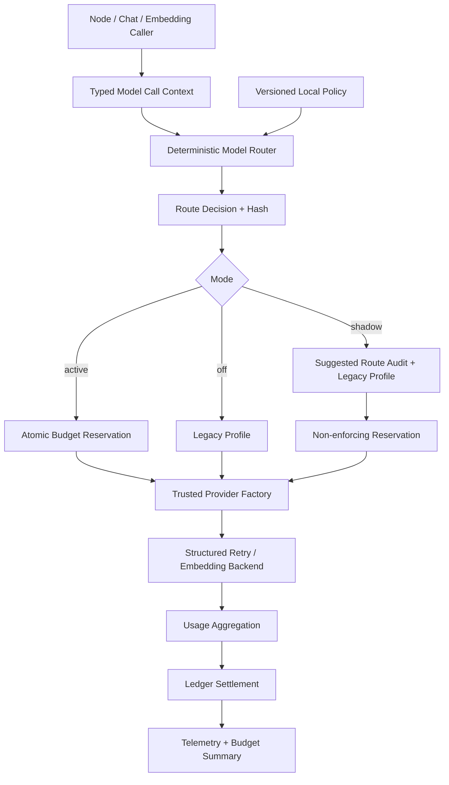

# Phase 50：模型路由、成本预算与 Provider 治理

> 本阶段建立在 Phase 12 Structured Output Reliability、Phase 21 Embedding Cache、Phase 28
> Observability、Phase 41 Secret Management、Phase 42 Conversation Eval、Phase 47 Retrieval Policy
> 和 Phase 49 Cross-Paper Knowledge Base 之上。
>
> Phase 49 源码已经完成。本次复核其 11 个专项测试文件，共 `19 passed`（Python 3.10.20）。
>
> 本教程仍采用“你按文档自行修改源码”的方式：代码块给出完整文件，或给出带前后文的局部修改；
> 当前不直接修改 `app/`、`tests/`、`config/` 和 `.env.example`。

> **章节标识说明**
>
> - “需要新增”表示新建完整文件；
> - “需要局部修改”会明确目标文件、查找锚点和修改后的上下文；
> - “原理、运行或验收说明”不修改源码；
> - 所有临时文件只能放在项目内 `.codex_tmp/phase50/`，不要使用系统 `/tmp`；
> - 第一版面向单机、单用户，使用 SQLite，不引入 Redis、消息队列或远程计费服务；
> - 默认 `MODEL_ROUTING_MODE=off`，完成专项测试和 Shadow 观测前不得切到 `active`；
> - 本阶段的“成本”是根据本地版本化价格快照计算的估算/核算值，不等于 Provider 最终账单。

---

## 一、为什么 Phase 49 之后优先做模型路由与成本控制

> **本节类型：优先级与原理说明，不修改代码。**

当前项目中的模型调用已经不是单一任务。至少包括：

```text
论文 section 结构化抽取
论文方法归并（当前由确定性 reducer 完成，不调用模型）
论文模块与代码 Evidence 映射
实验计划生成
失败日志诊断
普通修复计划
文件修复计划
Artifact-grounded Chat 回答
Conversation Memory 压缩
代码 document/query Embedding
```

这些任务对模型的要求并不相同：

```text
短对话压缩          更关注低成本和稳定 JSON
论文层级抽取        更关注长上下文、身份保持和结构化输出
跨证据代码映射      更关注语义质量和 Evidence 约束
文件修复计划        更关注高质量，但仍只有 Proposal 权限
Embedding           只需要向量能力，不能误路由到 Chat 模型
权限、Hash、路径    必须由确定性代码处理，不应交给模型
```

继续让所有调用固定使用 `settings.openai_model` 会产生四类问题：

1. 无法解释“为什么本次调用选择这个模型”；
2. Validation Retry 与 Provider Retry 可能重复计费，但当前只有瞬时 telemetry，没有持久账本；
3. 无法在调用前判断本日或当前 Job 是否已超过 Token/成本预算；
4. 直接换便宜模型时，没有 Phase 42/47/49 Golden 门禁证明质量没有退化。

因此本阶段不是简单增加一个模型名称环境变量，而是建立完整的调用控制面：

```text
Typed Task Request
  -> Deterministic Router
  -> Capability Gate
  -> Atomic Budget Reservation
  -> Trusted Provider Factory
  -> Existing Structured Retry Engine
  -> Usage Settlement
  -> Audit / Summary / Reconciliation
```

---

## 二、先说明当前项目真实基线

> **本节类型：现状说明，不修改代码。**

### 2.1 Chat/Structured Output 当前入口

当前 `app/model.py::get_chat_model()`：

- 从 Secret Service 解析 `OPENAI_API_KEY_SECRET_NAME`；
- 使用单一 `OPENAI_BASE_URL` 和 `OPENAI_MODEL`；
- 构造 `ChatOpenAI`；
- 不知道调用属于论文抽取、Chat 还是修复计划；
- 不做调用前预算检查；
- 不持久化 route decision。

当前 `app/tools/structured_output_tools.py::invoke_structured_with_retry()` 已经做对了很多事情：

- `with_structured_output(..., include_raw=True)`；
- Pydantic 本地校验；
- Validation Retry 与 Transport Retry 分离；
- 通过 callback 捕获 parser 抛错之前的 `finish_reason` 和 token usage；
- 每个 attempt 都保留结构化诊断；
- 不保存完整 Prompt。

Phase 50 应复用它，而不是重新实现一套 Structured Output parser。

### 2.2 当前缺失的控制能力

当前 token telemetry 是进程内计数器，仍然缺少：

```text
调用属于哪个 task_kind
选择了哪个 profile，候选顺序是什么
policy/pricing 的版本和 Hash
调用前预留了多少预算
所有 validation/provider retry 合计用了多少 token
Provider 没返回 usage 时采用了哪种估算
失败或进程崩溃后的预留如何结算
同一 Job、本日累计使用量和剩余预算
```

Embedding 还走独立 `EmbeddingBackend`，大多数兼容 Provider 不通过 LangChain 接口返回 usage，
所以第一版必须明确标记为 `estimated`，不能伪装成 Provider 精确值。

---

## 三、第一版的关键设计决定

> **本节类型：架构决策说明，不修改代码。**

### 3.1 LLM 不参与路由决策

路由只读取：

```text
task_kind
workload_kind
required_capabilities
estimated_input_tokens
requested_max_output_tokens
quality_tier
本地版本化 policy
```

不把 Prompt 正文交给另一个 LLM 判断“该用哪个模型”。否则每次路由本身也会产生费用、不稳定输出和
Prompt Injection 风险。

### 3.2 Policy 只能选择受信任 Provider Binding

Policy 可以声明：

```text
profile_id
model_name
capability
quality_rank
price snapshot
```

但不能声明：

```text
base_url
api_key
secret_name
任意 HTTP header
Python import path
```

`primary_chat` 和 `primary_embedding` 只在受信任 Python Factory 中映射到 Settings 与 Secret Service。
即使 policy 文件、Chat 或论文文本被污染，也不能把请求重定向到攻击者 endpoint。

### 3.3 调用前必须原子预留预算

如果只在调用后记账，两个并发请求可能同时看到“还剩 1000 token”，然后分别消耗 900 token。
因此 active 模式必须在一个 `BEGIN IMMEDIATE` 事务内：

```text
读取已结算用量 + 未结束预留
计算本次最坏情况预留
检查 daily / per-job 上限
插入 reservation
提交事务
```

只有预留成功后才解析 Secret 并调用 Provider。

### 3.4 预算按最坏重试次数预留，按真实 usage 结算

假设：

```text
estimated_input_tokens = 2000
max_output_tokens = 1000
validation_max_retries = 1
provider_max_retries = 2
```

最大 billable attempt 数：

```text
(1 + validation_max_retries) * (1 + provider_max_retries)
= 2 * 3
= 6
```

预留上限为：

```text
input  = 2000 * 6
output = 1000 * 6
```

其中 `estimated_input_tokens` 不能只统计业务 Prompt，还要包含结构化 Schema、Validation Retry 的 raw
preview/error 预算和固定协议开销。第一版对可见文本按 UTF-8 字节数保守预留；实际 Provider usage 可用时
再结算为更小的真实值。

调用正常返回完整 usage 后，以每个 attempt 的 usage 之和结算；只要发生“已发请求但 usage 缺失”的
不确定情况，就按 reservation upper bound 结算并标记 `reservation_upper_bound`。这会保守高估，
但不会因崩溃或兼容 Provider 不返回 usage 而低估花费。

### 3.5 价格必须是本地版本化快照

不在运行时联网查询价格。每个 Profile 显式记录：

```text
pricing_version
input_price_micro_usd_per_million
output_price_micro_usd_per_million
billing_mode = priced | free | unpriced
```

其中 `1 USD = 1_000_000 micro_usd`。全部计算使用整数，避免浮点累计误差。

如果 `billing_mode=unpriced`，可以在 `off/shadow` 观测 token，但 active 默认 fail closed；用户必须先填入
真实价格，或明确将内部免费 Provider 标为 `free`。

### 3.6 成本账本不保存 Prompt 和模型原文

账本只保存：

```text
prompt_sha256 / prompt_chars / schema_sha256
task_kind / node_name / job_id / run_id
profile_id / model_name / policy_sha256 / pricing_version
reserved/actual token / cost / latency / status
稳定 error_code
```

不保存 Prompt、论文正文、源码、模型输出预览、Secret 或 endpoint。

### 3.7 `off -> shadow -> active` 渐进启用

```text
off     执行 legacy_profile，不写预算账本，不拒绝请求
shadow  计算建议 route，但仍执行 legacy_profile；记账，不执行预算拒绝
active  执行 selected_profile，并在 Provider 前强制预算上限
```

Shadow 的 `selected_profile_id` 与 `executed_profile_id` 可以不同，这正是评估新策略而不改变生产行为的
依据。

### 3.8 路由不改变 Authority

强模型也只能生成原节点允许的结构化对象：

```text
Repair Planner 仍只能提出 Proposal
Chat 仍不能审批、修改预算或执行命令
Memory Compactor 仍不能创造项目事实
Knowledge Retriever 仍不能确认 candidate relation
```

模型质量与执行权限是两条完全独立的轴。

---

## 四、本阶段目标

> **本节类型：目标说明，不修改代码。**

完成后系统应具备：

1. 定义严格 Task、Profile、Route、Decision、Reservation、Usage 和 Ledger Schema；
2. 每种模型调用都提交稳定 `task_kind`，不再只依赖全局模型名；
3. 本地 policy 文件只允许选择受信任 Provider Binding；
4. Profile 声明 workload、capability、上下文、输出上限、质量等级和价格快照；
5. Router 对相同 Request/Policy 产生相同 Decision Hash；
6. 不满足 structured method、context 或 workload 的 Profile 必须被排除；
7. `off/shadow/active` 三种模式语义明确；
8. active 模式在解析 Secret 和请求 Provider 前原子预留预算；
9. daily 与 per-job token/cost 上限都能 fail closed；
10. Validation Retry 和 Provider Retry 都计入同一 Invocation；
11. Provider usage 完整时按真实值结算；缺失时显式使用保守估算；
12. 崩溃遗留 reservation 可由 reconciliation 转为保守终态；
13. 账本不保存 Prompt、模型输出、Secret 或 endpoint；
14. Chat 回答和 Memory Compaction 使用不同 task kind；
15. Paper Extraction、Mapping、Plan、Debug、Repair 分别接入 Gateway；
16. Embedding document/query 进入同一模型治理账本，usage 标记为 estimated；
17. 提供 doctor、route preview、budget summary、invocation list 和 reconcile CLI；
18. API 只提供只读 budget/ledger，不允许 Chat 或普通请求修改 policy；
19. 使用离线 Golden/历史用量比较 baseline/challenger，不在评测中默认调用 Provider；
20. 默认关闭，完成 Shadow 与手工验收后再 active。

---

## 五、本阶段明确不做什么

> **本节类型：范围说明，不修改代码。**

第一版不做：

- 不让 LLM 选择模型；
- 不根据 Prompt 中的“请使用最强模型”改变 route；
- 不动态读取网页价格；
- 不实现 Provider 自动竞价、自动采购或余额充值；
- 不把成本估算声称为最终账单；
- 不自动把便宜模型 promotion 到 active；
- 不在一次失败后偷偷切换未通过 Golden 的模型；
- 不在 Policy 中保存 endpoint、API Key 或 Secret 名称；
- 不把 Prompt、完整输出或论文/源码正文写入 Ledger；
- 不用模型结果决定风险、审批、执行权限或 Verifier 结论；
- 不实现多用户配额、租户账单和团队成本分摊；
- 不引入 Redis 分布式锁或外部 Billing Service；
- 不修改 Provider 官方账单；
- 不因为预算不足而删除历史 Artifact 或 Memory；
- 不把一次低成本调用自动判定为高质量。

---

## 六、必须保持的不变量

> **本节类型：安全设计说明，不修改代码。**

```text
Invariant 1：Route 由确定性 Request + Policy 决定，LLM 文本不能修改 Route。

Invariant 2：Policy 只引用受信任 provider_binding，不包含 endpoint 或 Secret。

Invariant 3：workload=chat 的任务不能选择 embedding profile，反之亦然。

Invariant 4：所需 capability、structured method、context 和 output 上限必须全部满足。

Invariant 5：相同 Request/Policy/Mode 必须产生相同 Decision Hash。

Invariant 6：active 模式必须先预留预算，再解析 Secret，再调用 Provider。

Invariant 7：预算检查必须包含 terminal actual usage 与 active reservation。

Invariant 8：同一 invocation_id 的不同 Request/Decision 必须冲突，不能覆盖。

Invariant 9：所有内部 retry 归属于同一个 invocation，并汇总 usage。

Invariant 10：usage 缺失时必须标记 estimated/upper_bound，不能伪装 provider_reported。

Invariant 11：stale reservation 不能静默释放，必须保守结算并记录原因。

Invariant 12：Ledger 不保存 Prompt、Output、Secret、Headers 或 endpoint。

Invariant 13：unpriced profile 在 active 模式默认拒绝。

Invariant 14：off 模式保持当前 legacy 行为；shadow 不改变执行模型。

Invariant 15：Promotion 只生成 Proposal，不自动写入 Policy。

Invariant 16：Chat/Memory/Knowledge/Skill 内容不能修改预算、价格和 Provider Binding。

Invariant 17：模型路由不增加任何节点的 Authority。

Invariant 18：预算、DB 或 Policy 完整性异常时 active fail closed。
```

---

## 七、目标架构

> **本节类型：架构说明，不修改代码。**



职责拆分：

```text
schemas.py      只定义可持久化契约
identity.py     只计算 canonical hash、token/cost 估算
catalog.py      只读取并校验本地 policy
policy.py       只做确定性 profile 选择
repository.py   只做 reservation、settlement、summary、reconcile
provider.py     只把受信任 binding 解析为 Provider Client
gateway.py      只编排 route -> reserve -> invoke -> settle
embedding.py    把现有 EmbeddingBackend 包装到 Gateway
evaluation.py   只做离线 policy/ledger 比较并生成 promotion proposal
factory.py      生产装配
```

---

## 八、文件变更总览与推荐实施顺序

> **本节类型：实施顺序说明，不修改代码。**

### 8.1 需要新增

```text
app/model_routing/__init__.py
app/model_routing/errors.py
app/model_routing/schemas.py
app/model_routing/identity.py
app/model_routing/catalog.py
app/model_routing/policy.py
app/model_routing/repository.py
app/model_routing/provider.py
app/model_routing/gateway.py
app/model_routing/embedding.py
app/model_routing/factory.py
app/model_routing/evaluation.py
app/api/model_routing_routes.py
config/model_routing_policy.json

tests/test_model_routing_schemas.py
tests/test_model_routing_catalog.py
tests/test_model_router.py
tests/test_model_budget_repository.py
tests/test_model_gateway.py
tests/test_model_embedding_gateway.py
tests/test_model_routing_authority_boundary.py
tests/test_model_routing_eval.py
tests/test_model_routing_api.py
```

### 8.2 需要局部修改

```text
app/config.py
.env.example
app/model.py
app/tools/structured_output_tools.py
app/observability/in_memory.py
app/nodes/method_extractor_node.py
app/nodes/mapping_node.py
app/nodes/experiment_plan_node.py
app/nodes/log_debug_node.py
app/nodes/repair_planner_node.py
app/nodes/file_repair_planner_node.py
app/chat/service.py
app/chat/memory.py
app/retrieval/embedding_backend.py
app/nodes/code_search_node.py
app/evaluation/runners.py
app/api/app.py
app/main.py
```

### 8.3 推荐落地顺序

```text
Step 1  Schema + Identity + Catalog + Router 纯单测
Step 2  SQLite Reservation/Settlement 单测
Step 3  Provider Factory + Gateway Fake Provider 单测
Step 4  Structured Output helper 增加外部 invocation metadata
Step 5  逐个替换 Chat/Node 调用点，保持 mode=off
Step 6  接入 Embedding 估算账本
Step 7  CLI/API/Readiness
Step 8  Shadow 真实观测
Step 9  Offline Golden Promotion Gate
Step 10 填入真实价格后小预算 active
```

---

## 九、新增错误类型

> **本节类型：需要新增代码。**
>
> **需要新增：** `app/model_routing/errors.py`

```python
from __future__ import annotations


class ModelRoutingError(RuntimeError):
    """模型路由、预算和账本错误的稳定基类。"""


class ModelCatalogError(ModelRoutingError):
    """Policy 文件、Profile 或 Route 配置非法。"""


class ModelRouteUnavailable(ModelRoutingError):
    """没有满足 workload、能力、上下文和质量要求的 Profile。"""


class ModelBudgetExceeded(ModelRoutingError):
    """调用前预算预留被拒绝。"""

    def __init__(
        self,
        *,
        scope: str,
        limit: int,
        used_or_reserved: int,
        requested: int,
    ) -> None:
        self.scope = scope
        self.limit = limit
        self.used_or_reserved = used_or_reserved
        self.requested = requested
        super().__init__(
            "MODEL_BUDGET_EXCEEDED: "
            f"scope={scope}, limit={limit}, "
            f"used_or_reserved={used_or_reserved}, requested={requested}"
        )


class ModelLedgerConflict(ModelRoutingError):
    """同一 Invocation 身份被不同 Request 或 Decision 重用。"""


class ModelLedgerIntegrityError(ModelRoutingError):
    """持久化行、Hash 或状态迁移不一致。"""


class ModelProviderBindingError(ModelRoutingError):
    """Profile 试图使用未知或 workload 不匹配的受信任 Provider Binding。"""


class ModelUsageError(ModelRoutingError):
    """Provider usage 为负数、类型错误或不满足守恒关系。"""
```

错误信息不拼接 Provider 原始 response、header、Prompt 或 Secret。节点需要对外返回时，只返回稳定错误码
和安全摘要。

---

## 十、定义模型路由与账本 Schema

> **本节类型：需要新增代码。**
>
> **需要新增：** `app/model_routing/schemas.py`

```python
from __future__ import annotations

from typing import Literal

from pydantic import (
    BaseModel,
    ConfigDict,
    Field,
    field_validator,
    model_validator,
)


SHA256_PATTERN = r"^[0-9a-f]{64}$"

ModelRoutingMode = Literal["off", "shadow", "active"]
ModelWorkloadKind = Literal["chat", "embedding"]
ModelQualityTier = Literal["economy", "balanced", "high"]
ModelCapability = Literal[
    "structured_json_schema",
    "structured_function_calling",
    "structured_json_mode",
    "long_context",
    "embedding",
]
ModelBillingMode = Literal["priced", "free", "unpriced"]
ModelUsageQuality = Literal[
    "provider_reported",
    "estimated",
    "reservation_upper_bound",
    "not_applicable",
]
ModelInvocationStatus = Literal[
    "reserved",
    "succeeded",
    "failed",
    "usage_unknown",
]

# 每个真实模型调用点都必须选择一个稳定 task_kind。
ModelTaskKind = Literal[
    "paper_section_extraction",
    "paper_code_mapping",
    "experiment_plan",
    "failure_debug",
    "repair_plan",
    "file_repair_plan",
    "chat_answer",
    "chat_memory_compaction",
    "code_embedding_document",
    "code_embedding_query",
    "evaluation_probe",
]


class RoutingModel(BaseModel):
    model_config = ConfigDict(extra="forbid")


class ModelPricing(RoutingModel):
    """价格单位是每一百万 Token 对应的 micro USD。"""

    pricing_version: str = Field(min_length=1, max_length=100)
    billing_mode: ModelBillingMode
    input_micro_usd_per_million: int | None = Field(default=None, ge=0)
    output_micro_usd_per_million: int | None = Field(default=None, ge=0)

    @model_validator(mode="after")
    def validate_price_shape(self) -> "ModelPricing":
        if self.billing_mode == "priced":
            if (
                self.input_micro_usd_per_million is None
                or self.output_micro_usd_per_million is None
            ):
                raise ValueError("priced profile 必须提供 input/output 价格")
        elif self.billing_mode == "free":
            if self.input_micro_usd_per_million not in {None, 0}:
                raise ValueError("free profile 的 input 价格必须为 0 或 null")
            if self.output_micro_usd_per_million not in {None, 0}:
                raise ValueError("free profile 的 output 价格必须为 0 或 null")
        else:
            if (
                self.input_micro_usd_per_million is not None
                or self.output_micro_usd_per_million is not None
            ):
                raise ValueError("unpriced profile 不能携带猜测价格")
        return self


class ModelProfile(RoutingModel):
    profile_id: str = Field(pattern=r"^[a-z][a-z0-9_.-]{2,79}$")
    workload_kind: ModelWorkloadKind
    # 第一版只允许这两个 Python 代码内的受信任 binding。
    provider_binding: Literal["primary_chat", "primary_embedding"]
    # Catalog Loader 会把 $OPENAI_MODEL / $EMBEDDING_MODEL 替换成真实值。
    model_name: str = Field(min_length=1, max_length=200)
    quality_tier: ModelQualityTier
    quality_rank: int = Field(ge=0, le=100)
    capabilities: set[ModelCapability] = Field(default_factory=set)
    context_window_tokens: int = Field(ge=1)
    max_output_tokens: int = Field(ge=0)
    thinking_mode: Literal["disabled", "enabled"] | None = None
    enabled: bool = True
    pricing: ModelPricing

    @model_validator(mode="after")
    def validate_workload(self) -> "ModelProfile":
        if self.workload_kind == "embedding":
            if self.provider_binding != "primary_embedding":
                raise ValueError("embedding profile 必须使用 primary_embedding")
            if "embedding" not in self.capabilities:
                raise ValueError("embedding profile 必须声明 embedding capability")
            if self.max_output_tokens != 0:
                raise ValueError("embedding profile 的 max_output_tokens 必须为 0")
            if self.thinking_mode is not None:
                raise ValueError("embedding profile 不支持 thinking_mode")
        else:
            if self.provider_binding != "primary_chat":
                raise ValueError("chat profile 必须使用 primary_chat")
            if "embedding" in self.capabilities:
                raise ValueError("chat profile 不能声明 embedding capability")
            if self.max_output_tokens < 1:
                raise ValueError("chat profile 的 max_output_tokens 必须大于 0")
        return self


class ModelTaskRoute(RoutingModel):
    task_kind: ModelTaskKind
    workload_kind: ModelWorkloadKind
    required_capabilities: set[ModelCapability] = Field(default_factory=set)
    # 顺序即确定性优先级，不按运行时随机排序。
    candidate_profile_ids: list[str] = Field(min_length=1, max_length=20)
    # off/shadow 执行这个 Profile，以保持旧行为。
    legacy_profile_id: str = Field(min_length=1, max_length=80)
    minimum_quality_rank: int = Field(ge=0, le=100)
    max_input_tokens: int = Field(ge=1)
    max_output_tokens: int = Field(ge=0)
    validation_max_retries: int = Field(ge=0, le=5)
    provider_max_retries: int = Field(ge=0, le=5)

    @field_validator("candidate_profile_ids")
    @classmethod
    def validate_candidate_ids(cls, values: list[str]) -> list[str]:
        if len(values) != len(set(values)):
            raise ValueError("candidate_profile_ids 不能重复")
        return values

    @model_validator(mode="after")
    def validate_embedding_limits(self) -> "ModelTaskRoute":
        if self.workload_kind == "embedding":
            if self.max_output_tokens != 0:
                raise ValueError("embedding route 的 max_output_tokens 必须为 0")
            if self.required_capabilities != {"embedding"}:
                raise ValueError("embedding route 必须且只能要求 embedding")
        return self


class ModelBudgetPolicy(RoutingModel):
    # None 表示不设置该维度，而不是无限的价格已知。
    daily_total_token_limit: int | None = Field(default=None, ge=1)
    daily_cost_limit_micro_usd: int | None = Field(default=None, ge=0)
    per_job_total_token_limit: int | None = Field(default=None, ge=1)
    per_job_cost_limit_micro_usd: int | None = Field(default=None, ge=0)
    reservation_ttl_seconds: int = Field(default=900, ge=30, le=86400)
    allow_unpriced_in_active: bool = False


class ModelRoutingDocument(RoutingModel):
    schema_version: Literal["phase50-v1"] = "phase50-v1"
    policy_version: str = Field(min_length=1, max_length=100)
    profiles: list[ModelProfile] = Field(min_length=1, max_length=100)
    routes: list[ModelTaskRoute] = Field(min_length=1, max_length=100)
    budget: ModelBudgetPolicy


class ModelRouteRequest(RoutingModel):
    schema_version: Literal["phase50-v1"] = "phase50-v1"
    task_kind: ModelTaskKind
    workload_kind: ModelWorkloadKind
    required_capabilities: set[ModelCapability] = Field(default_factory=set)
    requested_quality_tier: ModelQualityTier = "balanced"
    estimated_input_tokens: int = Field(ge=1)
    requested_max_output_tokens: int = Field(ge=0)
    prompt_sha256: str = Field(pattern=SHA256_PATTERN)
    prompt_chars: int = Field(ge=0)
    schema_name: str | None = Field(default=None, max_length=200)
    schema_sha256: str | None = Field(default=None, pattern=SHA256_PATTERN)
    job_id: str | None = Field(default=None, max_length=200)
    run_id: str | None = Field(default=None, max_length=300)
    node_name: str = Field(min_length=1, max_length=120)

    @model_validator(mode="after")
    def validate_workload_shape(self) -> "ModelRouteRequest":
        if self.workload_kind == "embedding":
            if self.requested_max_output_tokens != 0:
                raise ValueError("embedding request 不能申请 output token")
            if self.schema_name is not None or self.schema_sha256 is not None:
                raise ValueError("embedding request 不能携带 structured schema")
        elif (self.schema_name is None) != (self.schema_sha256 is None):
            raise ValueError("schema_name 与 schema_sha256 必须同时出现")
        return self


class ModelRouteDecision(RoutingModel):
    schema_version: Literal["phase50-v1"] = "phase50-v1"
    mode: ModelRoutingMode
    request_sha256: str = Field(pattern=SHA256_PATTERN)
    policy_sha256: str = Field(pattern=SHA256_PATTERN)
    selected_profile_id: str
    executed_profile_id: str
    selected_model_name: str
    executed_model_name: str
    pricing_version: str
    reason_codes: list[str] = Field(min_length=1, max_length=20)
    max_billable_attempts: int = Field(ge=1)
    decision_sha256: str = Field(pattern=SHA256_PATTERN)


class ModelReservationRequest(RoutingModel):
    invocation_id: str = Field(pattern=r"^mdl_[0-9a-f]{32}$")
    request_sha256: str = Field(pattern=SHA256_PATTERN)
    decision_sha256: str = Field(pattern=SHA256_PATTERN)
    task_kind: ModelTaskKind
    job_id: str | None = Field(default=None, max_length=200)
    run_id: str | None = Field(default=None, max_length=300)
    node_name: str = Field(min_length=1, max_length=120)
    profile_id: str = Field(min_length=1, max_length=80)
    model_name: str = Field(min_length=1, max_length=200)
    pricing_version: str = Field(min_length=1, max_length=100)
    enforced: bool
    reserved_input_tokens: int = Field(ge=0)
    reserved_output_tokens: int = Field(ge=0)
    reserved_cost_micro_usd: int | None = Field(default=None, ge=0)
    prompt_chars: int = Field(ge=0)
    prompt_sha256: str = Field(pattern=SHA256_PATTERN)
    schema_sha256: str | None = Field(default=None, pattern=SHA256_PATTERN)
    lease_expires_at: str

    @property
    def reserved_total_tokens(self) -> int:
        return self.reserved_input_tokens + self.reserved_output_tokens


class ModelUsage(RoutingModel):
    input_tokens: int = Field(ge=0)
    output_tokens: int = Field(ge=0)
    total_tokens: int = Field(ge=0)
    cost_micro_usd: int | None = Field(default=None, ge=0)
    quality: ModelUsageQuality
    provider_response_count: int = Field(ge=0)

    @model_validator(mode="after")
    def validate_total(self) -> "ModelUsage":
        if self.total_tokens != self.input_tokens + self.output_tokens:
            raise ValueError("total_tokens 必须等于 input_tokens + output_tokens")
        return self


class ModelInvocationRecord(RoutingModel):
    invocation_id: str = Field(pattern=r"^mdl_[0-9a-f]{32}$")
    request_sha256: str = Field(pattern=SHA256_PATTERN)
    decision_sha256: str = Field(pattern=SHA256_PATTERN)
    task_kind: ModelTaskKind
    job_id: str | None
    run_id: str | None
    node_name: str
    profile_id: str
    model_name: str
    pricing_version: str
    enforced: bool
    status: ModelInvocationStatus
    reserved_input_tokens: int = Field(ge=0)
    reserved_output_tokens: int = Field(ge=0)
    reserved_cost_micro_usd: int | None = Field(default=None, ge=0)
    actual_input_tokens: int | None = Field(default=None, ge=0)
    actual_output_tokens: int | None = Field(default=None, ge=0)
    actual_cost_micro_usd: int | None = Field(default=None, ge=0)
    usage_quality: ModelUsageQuality | None = None
    provider_response_count: int | None = Field(default=None, ge=0)
    prompt_chars: int = Field(ge=0)
    prompt_sha256: str = Field(pattern=SHA256_PATTERN)
    schema_sha256: str | None = Field(default=None, pattern=SHA256_PATTERN)
    latency_ms: int | None = Field(default=None, ge=0)
    error_code: str | None = Field(default=None, max_length=120)
    created_at: str
    updated_at: str
    lease_expires_at: str


class ModelBudgetSummary(RoutingModel):
    utc_date: str
    job_id: str | None = None
    settled_input_tokens: int = Field(ge=0)
    settled_output_tokens: int = Field(ge=0)
    active_reserved_tokens: int = Field(ge=0)
    settled_cost_micro_usd: int = Field(ge=0)
    active_reserved_cost_micro_usd: int = Field(ge=0)
    invocation_count: int = Field(ge=0)
    active_reservation_count: int = Field(ge=0)
    unpriced_invocation_count: int = Field(ge=0)


class ModelRoutingEvaluationCase(RoutingModel):
    case_id: str = Field(min_length=1, max_length=200)
    request: ModelRouteRequest
    expected_profile_id: str
    forbidden_profile_ids: list[str] = Field(default_factory=list)


class ModelRoutingEvaluationReport(RoutingModel):
    suite_version: str
    policy_sha256: str = Field(pattern=SHA256_PATTERN)
    total_cases: int = Field(ge=0)
    passed_cases: int = Field(ge=0)
    failed_case_ids: list[str]
    route_accuracy: float = Field(ge=0.0, le=1.0)
    passed: bool


class ModelProfilePromotionProposal(RoutingModel):
    """只是一份 Proposal；不能自动覆盖生产 policy。"""

    proposal_id: str = Field(pattern=r"^mdlprom_[0-9a-f]{24}$")
    task_kind: ModelTaskKind
    baseline_profile_id: str
    challenger_profile_id: str
    baseline_policy_sha256: str = Field(pattern=SHA256_PATTERN)
    eval_report_sha256: str = Field(pattern=SHA256_PATTERN)
    quality_gate_passed: bool
    estimated_saving_percent: float | None = Field(default=None, ge=0.0, le=100.0)
    requires_explicit_user_review: Literal[True] = True
```

### 10.1 输入输出含义

- `ModelRouteRequest.prompt_sha256`：Prompt UTF-8 字节的 SHA-256，不是 Prompt 内容；
- `schema_sha256`：Pydantic JSON Schema 规范化后的 SHA-256，不是模型输出 Hash；
- `quality_rank`：本地评测后由用户维护的顺序，不是 Provider 宣传分数；
- `pricing_version`：本次价格快照版本，便于未来重算和审计；
- `reserved_*`：调用前按最大重试上限占用的预算；
- `actual_*`：调用完成后的结算值，可能是 Provider 报告值，也可能是保守估算；
- `decision_sha256`：Request、Policy、模式、候选与执行 Profile 的内容身份；
- `invocation_id`：一次 Gateway 调用的唯一身份，不用于模型输出缓存。

---

## 十一、实现规范化身份、Token 与成本计算

> **本节类型：需要新增代码。**
>
> **需要新增：** `app/model_routing/identity.py`

```python
from __future__ import annotations

import hashlib
import json
import math
from typing import Any

from pydantic import BaseModel

from app.model_routing.errors import ModelUsageError
from app.model_routing.schemas import (
    ModelPricing,
    ModelRouteDecision,
    ModelRouteRequest,
)


def canonical_json(value: Any) -> str:
    """把模型、集合和普通对象转换成稳定 JSON。"""

    if isinstance(value, BaseModel):
        value = value.model_dump(mode="json")

    def normalize(item: Any) -> Any:
        if isinstance(item, dict):
            return {
                str(key): normalize(item[key])
                for key in sorted(item)
            }
        if isinstance(item, set):
            return sorted(normalize(value) for value in item)
        if isinstance(item, list):
            return [normalize(value) for value in item]
        return item

    return json.dumps(
        normalize(value),
        ensure_ascii=False,
        sort_keys=True,
        separators=(",", ":"),
    )


def sha256_text(value: str) -> str:
    return hashlib.sha256(value.encode("utf-8")).hexdigest()


def sha256_value(value: Any) -> str:
    return sha256_text(canonical_json(value))


def estimate_text_tokens(text: str) -> int:
    """不下载 tokenizer 的保守预留：每个可见 UTF-8 字节预留一个 Token。"""

    byte_count = len(text.encode("utf-8"))
    return max(1, byte_count)


def estimate_texts_tokens(texts: list[str]) -> int:
    if not texts:
        raise ModelUsageError("Embedding texts 不能为空")
    return sum(estimate_text_tokens(text) for text in texts)


def schema_sha256(schema: type[BaseModel]) -> str:
    return sha256_value(schema.model_json_schema())


def request_sha256(request: ModelRouteRequest) -> str:
    return sha256_value(request)


def calculate_cost_micro_usd(
    *,
    input_tokens: int,
    output_tokens: int,
    pricing: ModelPricing,
) -> int | None:
    if input_tokens < 0 or output_tokens < 0:
        raise ModelUsageError("Token 数不能为负数")
    if pricing.billing_mode == "unpriced":
        return None
    if pricing.billing_mode == "free":
        return 0

    input_rate = pricing.input_micro_usd_per_million
    output_rate = pricing.output_micro_usd_per_million
    if input_rate is None or output_rate is None:
        raise ModelUsageError("priced profile 缺少价格")

    numerator = (
        input_tokens * input_rate
        + output_tokens * output_rate
    )
    return math.ceil(numerator / 1_000_000)


def build_decision_sha256(
    decision: ModelRouteDecision,
) -> str:
    payload = decision.model_dump(mode="json")
    payload.pop("decision_sha256", None)
    return sha256_value(payload)


def validate_decision_sha256(
    decision: ModelRouteDecision,
) -> None:
    if build_decision_sha256(decision) != decision.decision_sha256:
        raise ValueError("ModelRouteDecision hash 不一致")
```

### 11.1 伪代码

```text
estimate_text_tokens(text)
    byte_count <- text 的 UTF-8 字节数
    reserved <- max(1, byte_count)
    返回 reserved

calculate_cost_micro_usd(input_tokens, output_tokens, pricing)
    如果 token 为负数
        抛出异常

    如果 billing_mode 为 unpriced
        返回 None

    如果 billing_mode 为 free
        返回 0

    读取每百万 input/output token 的 micro USD 整数价格
    分子 <- input_tokens * input_rate + output_tokens * output_rate
    返回 分子 / 1_000_000 向上取整

build_decision_sha256(decision)
    payload <- Decision 转 JSON
    移除 decision_sha256 自身
    规范化排序并计算 SHA-256
    返回 64 位十六进制 Hash
```

这里的值用于保守预留，不用于声称 Provider 精确分词结果。可见内容按每个 UTF-8 字节一个 Token 预留，
通常会显著高于真实 BPE Token；Provider usage 可用时，结算优先使用真实报告值。私有 tokenizer、Provider
隐藏 system token 或计费规则仍可能超出本地模型，因此本阶段提供的是“对本地 reservation 的硬拒绝”，
不是对 Provider 最终账单的数学保证。

---

## 十二、增加包导出

> **本节类型：需要新增代码。**
>
> **需要新增：** `app/model_routing/__init__.py`

```python
"""Phase 50：确定性模型路由、预算预留和调用审计。"""

from app.model_routing.gateway import ModelGateway
from app.model_routing.policy import ModelRouter
from app.model_routing.repository import SqliteModelLedger

__all__ = [
    "ModelGateway",
    "ModelRouter",
    "SqliteModelLedger",
]
```

在 `gateway.py` 尚未创建前，这个文件会暂时 import 失败。推荐先只创建空 `__init__.py`，完成第十八节后
再补上上述导出；不要因为中间态失败而绕过测试顺序。

---

## 十三、读取和验证版本化 Model Catalog

> **本节类型：需要新增代码。**
>
> **需要新增：** `app/model_routing/catalog.py`

```python
from __future__ import annotations

from dataclasses import dataclass
from pathlib import Path

from pydantic import ValidationError

from app.model_routing.errors import ModelCatalogError
from app.model_routing.identity import sha256_value
from app.model_routing.schemas import (
    ModelProfile,
    ModelRoutingDocument,
    ModelTaskKind,
    ModelTaskRoute,
)


MAX_POLICY_BYTES = 1_000_000


@dataclass(frozen=True)
class LoadedModelCatalog:
    document: ModelRoutingDocument
    policy_sha256: str
    profiles_by_id: dict[str, ModelProfile]
    routes_by_task: dict[ModelTaskKind, ModelTaskRoute]

    def profile(self, profile_id: str) -> ModelProfile:
        try:
            return self.profiles_by_id[profile_id]
        except KeyError as exc:
            raise ModelCatalogError(
                f"未知 model profile：{profile_id}"
            ) from exc

    def route(self, task_kind: ModelTaskKind) -> ModelTaskRoute:
        try:
            return self.routes_by_task[task_kind]
        except KeyError as exc:
            raise ModelCatalogError(
                f"未配置 model task route：{task_kind}"
            ) from exc


def _safe_policy_file(
    path: Path,
    *,
    allowed_root: Path,
) -> Path:
    root = allowed_root.expanduser().resolve()
    candidate = path.expanduser()
    if candidate.is_symlink():
        raise ModelCatalogError("Model policy 不能是 symlink")
    resolved = candidate.resolve()
    if resolved == root or root not in resolved.parents:
        raise ModelCatalogError("Model policy 必须位于 ALLOWED_ROOT 内")
    if not resolved.is_file():
        raise ModelCatalogError(f"Model policy 不存在：{resolved}")
    if resolved.stat().st_size > MAX_POLICY_BYTES:
        raise ModelCatalogError("Model policy 文件过大")
    return resolved


def _resolve_model_placeholders(
    document: ModelRoutingDocument,
    *,
    substitutions: dict[str, str],
) -> ModelRoutingDocument:
    profiles: list[ModelProfile] = []
    for profile in document.profiles:
        model_name = profile.model_name
        if model_name.startswith("$"):
            replacement = substitutions.get(model_name)
            if replacement is None or not replacement.strip():
                raise ModelCatalogError(
                    f"未提供模型占位符：{model_name}"
                )
            model_name = replacement.strip()
        profiles.append(
            profile.model_copy(update={"model_name": model_name})
        )
    return document.model_copy(update={"profiles": profiles})


def _validate_cross_references(
    document: ModelRoutingDocument,
) -> tuple[
    dict[str, ModelProfile],
    dict[ModelTaskKind, ModelTaskRoute],
]:
    profiles_by_id: dict[str, ModelProfile] = {}
    for profile in document.profiles:
        if profile.profile_id in profiles_by_id:
            raise ModelCatalogError(
                f"重复 profile_id：{profile.profile_id}"
            )
        profiles_by_id[profile.profile_id] = profile

    routes_by_task: dict[ModelTaskKind, ModelTaskRoute] = {}
    for route in document.routes:
        if route.task_kind in routes_by_task:
            raise ModelCatalogError(
                f"重复 task route：{route.task_kind}"
            )
        routes_by_task[route.task_kind] = route

        referenced = [
            route.legacy_profile_id,
            *route.candidate_profile_ids,
        ]
        for profile_id in referenced:
            profile = profiles_by_id.get(profile_id)
            if profile is None:
                raise ModelCatalogError(
                    f"Route 引用了未知 profile：{profile_id}"
                )
            if profile.workload_kind != route.workload_kind:
                raise ModelCatalogError(
                    f"Route/Profile workload 不一致：{route.task_kind}"
                )
            if route.max_output_tokens > profile.max_output_tokens:
                raise ModelCatalogError(
                    "Route max_output_tokens 超过 Profile 上限："
                    f"task={route.task_kind}, profile={profile_id}"
                )
    return profiles_by_id, routes_by_task


def load_model_catalog(
    path: Path,
    *,
    allowed_root: Path,
    substitutions: dict[str, str],
) -> LoadedModelCatalog:
    resolved = _safe_policy_file(path, allowed_root=allowed_root)
    try:
        raw = resolved.read_text(encoding="utf-8")
        document = ModelRoutingDocument.model_validate_json(raw)
    except (OSError, UnicodeError, ValidationError) as exc:
        raise ModelCatalogError(
            f"Model policy 无法读取或校验：{type(exc).__name__}"
        ) from exc

    document = _resolve_model_placeholders(
        document,
        substitutions=substitutions,
    )
    profiles, routes = _validate_cross_references(document)
    return LoadedModelCatalog(
        document=document,
        # Hash 使用替换后的真实 model name；环境变化会使旧 Decision 失效。
        policy_sha256=sha256_value(document),
        profiles_by_id=profiles,
        routes_by_task=routes,
    )
```

### 13.1 伪代码

```text
load_model_catalog(path, allowed_root, substitutions)
    拒绝 symlink、越界路径、不存在文件和超大文件
    读取 UTF-8 JSON
    用 ModelRoutingDocument 严格校验
    对每个 Profile
        如果 model_name 以 $ 开头
            只从调用者传入的 substitutions 解析
            缺失时抛出异常
    检查 profile_id 唯一
    检查 task_kind 唯一
    检查 Route 引用的每个 Profile 存在
    检查 Route 与 Profile workload 一致
    检查 Route output 上限不超过 Profile 上限
    对替换后的完整 Document 计算 policy_sha256
    返回 LoadedModelCatalog
```

Loader 不直接调用 `os.getenv()`，因此单元测试可以显式注入模型名，也不会让任意 Policy 字符串变成
环境变量读取能力。

---

## 十四、实现确定性 Model Router

> **本节类型：需要新增代码。**
>
> **需要新增：** `app/model_routing/policy.py`

```python
from __future__ import annotations

from app.model_routing.catalog import LoadedModelCatalog
from app.model_routing.errors import (
    ModelRouteUnavailable,
)
from app.model_routing.identity import (
    build_decision_sha256,
    request_sha256,
)
from app.model_routing.schemas import (
    ModelProfile,
    ModelRouteDecision,
    ModelRouteRequest,
    ModelRoutingMode,
)


QUALITY_ORDER = {
    "economy": 0,
    "balanced": 1,
    "high": 2,
}


class ModelRouter:
    def __init__(self, catalog: LoadedModelCatalog) -> None:
        self.catalog = catalog

    @staticmethod
    def _supports(
        *,
        profile: ModelProfile,
        request: ModelRouteRequest,
        minimum_quality_rank: int,
        required_capabilities: set[str],
        enforce_quality: bool = True,
    ) -> bool:
        if not profile.enabled:
            return False
        if profile.workload_kind != request.workload_kind:
            return False
        if enforce_quality:
            if profile.quality_rank < minimum_quality_rank:
                return False
            if (
                QUALITY_ORDER[profile.quality_tier]
                < QUALITY_ORDER[request.requested_quality_tier]
            ):
                return False
        if not required_capabilities.issubset(profile.capabilities):
            return False
        if request.requested_max_output_tokens > profile.max_output_tokens:
            return False
        required_context = (
            request.estimated_input_tokens
            + request.requested_max_output_tokens
        )
        if required_context > profile.context_window_tokens:
            return False
        return True

    def route(
        self,
        *,
        request: ModelRouteRequest,
        mode: ModelRoutingMode,
    ) -> tuple[ModelRouteDecision, ModelProfile]:
        route = self.catalog.route(request.task_kind)
        if request.workload_kind != route.workload_kind:
            raise ModelRouteUnavailable(
                "MODEL_WORKLOAD_MISMATCH"
            )
        if request.estimated_input_tokens > route.max_input_tokens:
            raise ModelRouteUnavailable(
                "MODEL_ROUTE_INPUT_LIMIT_EXCEEDED"
            )
        if request.requested_max_output_tokens > route.max_output_tokens:
            raise ModelRouteUnavailable(
                "MODEL_ROUTE_OUTPUT_LIMIT_EXCEEDED"
            )

        required_capabilities = set(route.required_capabilities)
        required_capabilities.update(request.required_capabilities)

        selected: ModelProfile | None = None
        for profile_id in route.candidate_profile_ids:
            candidate = self.catalog.profile(profile_id)
            if self._supports(
                profile=candidate,
                request=request,
                minimum_quality_rank=route.minimum_quality_rank,
                required_capabilities=required_capabilities,
                enforce_quality=True,
            ):
                selected = candidate
                break

        if selected is None:
            raise ModelRouteUnavailable(
                f"MODEL_ROUTE_NOT_FOUND:{request.task_kind}"
            )

        legacy = self.catalog.profile(route.legacy_profile_id)
        if not self._supports(
            profile=legacy,
            request=request,
            minimum_quality_rank=route.minimum_quality_rank,
            required_capabilities=required_capabilities,
            # Legacy 是已在旧系统使用的兼容基线。它仍必须满足 workload、
            # capability、context 和 output，但不以 Challenger 质量标签拒绝。
            enforce_quality=False,
        ):
            raise ModelRouteUnavailable(
                f"MODEL_LEGACY_PROFILE_INVALID:{request.task_kind}"
            )

        executed = selected if mode == "active" else legacy
        if (
            mode == "active"
            and executed.pricing.billing_mode == "unpriced"
            and not self.catalog.document.budget.allow_unpriced_in_active
        ):
            raise ModelRouteUnavailable(
                "MODEL_ACTIVE_PROFILE_UNPRICED"
            )

        max_billable_attempts = (
            (route.validation_max_retries + 1)
            * (route.provider_max_retries + 1)
        )
        reasons = [
            "TASK_ROUTE_MATCHED",
            "WORKLOAD_MATCHED",
            "CAPABILITIES_SATISFIED",
            "CONTEXT_LIMIT_SATISFIED",
        ]
        if mode == "shadow":
            reasons.append("SHADOW_EXECUTES_LEGACY")
        elif mode == "off":
            reasons.append("OFF_EXECUTES_LEGACY")
        else:
            reasons.append("ACTIVE_EXECUTES_SELECTED")

        draft = ModelRouteDecision(
            mode=mode,
            request_sha256=request_sha256(request),
            policy_sha256=self.catalog.policy_sha256,
            selected_profile_id=selected.profile_id,
            executed_profile_id=executed.profile_id,
            selected_model_name=selected.model_name,
            executed_model_name=executed.model_name,
            pricing_version=executed.pricing.pricing_version,
            reason_codes=reasons,
            max_billable_attempts=max_billable_attempts,
            decision_sha256="0" * 64,
        )
        decision = draft.model_copy(
            update={"decision_sha256": build_decision_sha256(draft)}
        )
        return decision, executed
```

### 14.1 选择顺序

```text
Router.route(request, mode)
    读取 request.task_kind 对应 Route
    校验 workload、input 和 output 上限
    required <- Route.required 与 Request.required 的并集

    按 candidate_profile_ids 原始顺序遍历
        跳过 disabled Profile
        跳过 workload 不一致 Profile
        跳过 quality 不足 Profile
        跳过 capability 不足 Profile
        跳过 output/context 不足 Profile
        选择第一个满足者

    如果没有候选
        fail closed

    独立验证 legacy Profile 也能处理当前 Request
    active  -> executed = selected
    off/shadow -> executed = legacy

    active 且 executed 为 unpriced 且未显式允许
        fail closed

    计算最大 billable attempts
    构造 Decision 并计算 Decision Hash
    返回 Decision 与实际执行 Profile
```

这里不按实时延迟、随机权重或 Provider 可用性重新排序。Provider 暂时失败应由已有 Transport Retry 处理；
不能在没有 Golden Gate 的情况下临时切换另一个模型。

---

## 十五、增加第一版 Model Policy

> **本节类型：需要新增代码。**
>
> **需要新增：** `config/model_routing_policy.json`

下面是可运行的最小第一版。三个 Chat Profile 默认可以指向同一个模型，先验证控制面；以后准备好不同
模型并通过 Golden 后，再分别设置 `OPENAI_ECONOMY_MODEL` 与 `OPENAI_STRONG_MODEL`。

上下文窗口和价格必须按你实际使用的 Provider/模型核对。示例故意使用 `unpriced`，因此不能直接开启
active。

```json
{
  "schema_version": "phase50-v1",
  "policy_version": "phase50-local-v1",
  "profiles": [
    {
      "profile_id": "legacy_chat",
      "workload_kind": "chat",
      "provider_binding": "primary_chat",
      "model_name": "$OPENAI_MODEL",
      "quality_tier": "balanced",
      "quality_rank": 70,
      "capabilities": [
        "structured_json_schema",
        "structured_function_calling",
        "structured_json_mode",
        "long_context"
      ],
      "context_window_tokens": 32768,
      "max_output_tokens": 4096,
      "thinking_mode": "disabled",
      "enabled": true,
      "pricing": {
        "pricing_version": "verify-before-active-v1",
        "billing_mode": "unpriced",
        "input_micro_usd_per_million": null,
        "output_micro_usd_per_million": null
      }
    },
    {
      "profile_id": "economy_chat",
      "workload_kind": "chat",
      "provider_binding": "primary_chat",
      "model_name": "$OPENAI_ECONOMY_MODEL",
      "quality_tier": "economy",
      "quality_rank": 60,
      "capabilities": [
        "structured_json_schema",
        "structured_function_calling",
        "structured_json_mode"
      ],
      "context_window_tokens": 32768,
      "max_output_tokens": 4096,
      "thinking_mode": "disabled",
      "enabled": true,
      "pricing": {
        "pricing_version": "verify-before-active-v1",
        "billing_mode": "unpriced",
        "input_micro_usd_per_million": null,
        "output_micro_usd_per_million": null
      }
    },
    {
      "profile_id": "strong_chat",
      "workload_kind": "chat",
      "provider_binding": "primary_chat",
      "model_name": "$OPENAI_STRONG_MODEL",
      "quality_tier": "high",
      "quality_rank": 90,
      "capabilities": [
        "structured_json_schema",
        "structured_function_calling",
        "structured_json_mode",
        "long_context"
      ],
      "context_window_tokens": 32768,
      "max_output_tokens": 4096,
      "thinking_mode": "disabled",
      "enabled": true,
      "pricing": {
        "pricing_version": "verify-before-active-v1",
        "billing_mode": "unpriced",
        "input_micro_usd_per_million": null,
        "output_micro_usd_per_million": null
      }
    },
    {
      "profile_id": "legacy_embedding",
      "workload_kind": "embedding",
      "provider_binding": "primary_embedding",
      "model_name": "$EMBEDDING_MODEL",
      "quality_tier": "balanced",
      "quality_rank": 70,
      "capabilities": ["embedding"],
      "context_window_tokens": 8192,
      "max_output_tokens": 0,
      "thinking_mode": null,
      "enabled": true,
      "pricing": {
        "pricing_version": "verify-before-active-v1",
        "billing_mode": "unpriced",
        "input_micro_usd_per_million": null,
        "output_micro_usd_per_million": null
      }
    }
  ],
  "routes": [
    {
      "task_kind": "paper_section_extraction",
      "workload_kind": "chat",
      "required_capabilities": ["long_context"],
      "candidate_profile_ids": ["strong_chat", "legacy_chat"],
      "legacy_profile_id": "legacy_chat",
      "minimum_quality_rank": 70,
      "max_input_tokens": 24000,
      "max_output_tokens": 4096,
      "validation_max_retries": 2,
      "provider_max_retries": 2
    },
    {
      "task_kind": "paper_code_mapping",
      "workload_kind": "chat",
      "required_capabilities": [],
      "candidate_profile_ids": ["strong_chat", "legacy_chat"],
      "legacy_profile_id": "legacy_chat",
      "minimum_quality_rank": 70,
      "max_input_tokens": 20000,
      "max_output_tokens": 4096,
      "validation_max_retries": 2,
      "provider_max_retries": 2
    },
    {
      "task_kind": "experiment_plan",
      "workload_kind": "chat",
      "required_capabilities": [],
      "candidate_profile_ids": ["legacy_chat", "strong_chat"],
      "legacy_profile_id": "legacy_chat",
      "minimum_quality_rank": 70,
      "max_input_tokens": 16000,
      "max_output_tokens": 4096,
      "validation_max_retries": 2,
      "provider_max_retries": 2
    },
    {
      "task_kind": "failure_debug",
      "workload_kind": "chat",
      "required_capabilities": [],
      "candidate_profile_ids": ["strong_chat", "legacy_chat"],
      "legacy_profile_id": "legacy_chat",
      "minimum_quality_rank": 70,
      "max_input_tokens": 16000,
      "max_output_tokens": 4096,
      "validation_max_retries": 2,
      "provider_max_retries": 2
    },
    {
      "task_kind": "repair_plan",
      "workload_kind": "chat",
      "required_capabilities": [],
      "candidate_profile_ids": ["strong_chat", "legacy_chat"],
      "legacy_profile_id": "legacy_chat",
      "minimum_quality_rank": 80,
      "max_input_tokens": 16000,
      "max_output_tokens": 4096,
      "validation_max_retries": 2,
      "provider_max_retries": 2
    },
    {
      "task_kind": "file_repair_plan",
      "workload_kind": "chat",
      "required_capabilities": [],
      "candidate_profile_ids": ["strong_chat"],
      "legacy_profile_id": "legacy_chat",
      "minimum_quality_rank": 80,
      "max_input_tokens": 16000,
      "max_output_tokens": 4096,
      "validation_max_retries": 1,
      "provider_max_retries": 2
    },
    {
      "task_kind": "chat_answer",
      "workload_kind": "chat",
      "required_capabilities": [],
      "candidate_profile_ids": ["legacy_chat", "strong_chat"],
      "legacy_profile_id": "legacy_chat",
      "minimum_quality_rank": 70,
      "max_input_tokens": 20000,
      "max_output_tokens": 4096,
      "validation_max_retries": 1,
      "provider_max_retries": 2
    },
    {
      "task_kind": "chat_memory_compaction",
      "workload_kind": "chat",
      "required_capabilities": [],
      "candidate_profile_ids": ["economy_chat", "legacy_chat"],
      "legacy_profile_id": "legacy_chat",
      "minimum_quality_rank": 50,
      "max_input_tokens": 16000,
      "max_output_tokens": 2048,
      "validation_max_retries": 1,
      "provider_max_retries": 2
    },
    {
      "task_kind": "code_embedding_document",
      "workload_kind": "embedding",
      "required_capabilities": ["embedding"],
      "candidate_profile_ids": ["legacy_embedding"],
      "legacy_profile_id": "legacy_embedding",
      "minimum_quality_rank": 60,
      "max_input_tokens": 8192,
      "max_output_tokens": 0,
      "validation_max_retries": 0,
      "provider_max_retries": 2
    },
    {
      "task_kind": "code_embedding_query",
      "workload_kind": "embedding",
      "required_capabilities": ["embedding"],
      "candidate_profile_ids": ["legacy_embedding"],
      "legacy_profile_id": "legacy_embedding",
      "minimum_quality_rank": 60,
      "max_input_tokens": 8192,
      "max_output_tokens": 0,
      "validation_max_retries": 0,
      "provider_max_retries": 2
    },
    {
      "task_kind": "evaluation_probe",
      "workload_kind": "chat",
      "required_capabilities": [],
      "candidate_profile_ids": ["legacy_chat"],
      "legacy_profile_id": "legacy_chat",
      "minimum_quality_rank": 60,
      "max_input_tokens": 8000,
      "max_output_tokens": 2048,
      "validation_max_retries": 1,
      "provider_max_retries": 1
    }
  ],
  "budget": {
    "daily_total_token_limit": 2000000,
    "daily_cost_limit_micro_usd": null,
    "per_job_total_token_limit": 500000,
    "per_job_cost_limit_micro_usd": null,
    "reservation_ttl_seconds": 900,
    "allow_unpriced_in_active": false
  }
}
```

### 15.1 为什么没有在 JSON 中写注释

标准 JSON 不支持注释。不要改成带注释的伪 JSON 后继续用 `model_validate_json()`；说明写在 Markdown，
Policy 保持严格 JSON。每次修改模型名、能力、上下文或价格，都要更新 `policy_version`。

---

## 十六、实现 SQLite Budget Reservation 与 Settlement

> **本节类型：需要新增代码。**
>
> **需要新增：** `app/model_routing/repository.py`

```python
from __future__ import annotations

import re
import sqlite3
from datetime import datetime, timezone
from pathlib import Path

from app.model_routing.errors import (
    ModelBudgetExceeded,
    ModelLedgerConflict,
    ModelLedgerIntegrityError,
)
from app.model_routing.schemas import (
    ModelBudgetPolicy,
    ModelBudgetSummary,
    ModelInvocationRecord,
    ModelReservationRequest,
    ModelUsage,
)


TERMINAL_STATUSES = {
    "succeeded",
    "failed",
    "usage_unknown",
}
ERROR_CODE_PATTERN = re.compile(r"^[A-Z][A-Z0-9_]{1,119}$")


def utc_now() -> datetime:
    return datetime.now(timezone.utc)


def iso_utc(value: datetime) -> str:
    if value.tzinfo is None:
        raise ValueError("datetime 必须包含 timezone")
    return value.astimezone(timezone.utc).isoformat()


class SqliteModelLedger:
    def __init__(
        self,
        path: Path,
        *,
        budget: ModelBudgetPolicy,
    ) -> None:
        self.path = path
        self.budget = budget
        self.path.parent.mkdir(parents=True, exist_ok=True)
        self._initialize()

    def _connect(self) -> sqlite3.Connection:
        connection = sqlite3.connect(
            self.path,
            timeout=30.0,
            isolation_level=None,
        )
        connection.row_factory = sqlite3.Row
        connection.execute("PRAGMA foreign_keys=ON")
        connection.execute("PRAGMA journal_mode=WAL")
        connection.execute("PRAGMA synchronous=FULL")
        connection.execute("PRAGMA busy_timeout=30000")
        return connection

    def _initialize(self) -> None:
        with self._connect() as connection:
            connection.executescript(
                """
                CREATE TABLE IF NOT EXISTS model_invocations (
                    invocation_id TEXT PRIMARY KEY,
                    request_sha256 TEXT NOT NULL,
                    decision_sha256 TEXT NOT NULL,
                    task_kind TEXT NOT NULL,
                    job_id TEXT,
                    run_id TEXT,
                    node_name TEXT NOT NULL,
                    profile_id TEXT NOT NULL,
                    model_name TEXT NOT NULL,
                    pricing_version TEXT NOT NULL,
                    enforced INTEGER NOT NULL CHECK(enforced IN (0, 1)),
                    status TEXT NOT NULL,
                    reserved_input_tokens INTEGER NOT NULL,
                    reserved_output_tokens INTEGER NOT NULL,
                    reserved_cost_micro_usd INTEGER,
                    actual_input_tokens INTEGER,
                    actual_output_tokens INTEGER,
                    actual_cost_micro_usd INTEGER,
                    usage_quality TEXT,
                    provider_response_count INTEGER,
                    prompt_chars INTEGER NOT NULL,
                    prompt_sha256 TEXT NOT NULL,
                    schema_sha256 TEXT,
                    latency_ms INTEGER,
                    error_code TEXT,
                    created_at TEXT NOT NULL,
                    updated_at TEXT NOT NULL,
                    lease_expires_at TEXT NOT NULL
                );
                CREATE INDEX IF NOT EXISTS idx_model_invocations_date
                    ON model_invocations(created_at, status);
                CREATE INDEX IF NOT EXISTS idx_model_invocations_job
                    ON model_invocations(job_id, created_at, status);
                CREATE INDEX IF NOT EXISTS idx_model_invocations_task
                    ON model_invocations(task_kind, created_at);
                """
            )

    def ping(self) -> None:
        with self._connect() as connection:
            connection.execute("SELECT 1").fetchone()

    @staticmethod
    def _record(row: sqlite3.Row) -> ModelInvocationRecord:
        try:
            record = ModelInvocationRecord(
                invocation_id=row["invocation_id"],
                request_sha256=row["request_sha256"],
                decision_sha256=row["decision_sha256"],
                task_kind=row["task_kind"],
                job_id=row["job_id"],
                run_id=row["run_id"],
                node_name=row["node_name"],
                profile_id=row["profile_id"],
                model_name=row["model_name"],
                pricing_version=row["pricing_version"],
                enforced=bool(row["enforced"]),
                status=row["status"],
                reserved_input_tokens=row["reserved_input_tokens"],
                reserved_output_tokens=row["reserved_output_tokens"],
                reserved_cost_micro_usd=row["reserved_cost_micro_usd"],
                actual_input_tokens=row["actual_input_tokens"],
                actual_output_tokens=row["actual_output_tokens"],
                actual_cost_micro_usd=row["actual_cost_micro_usd"],
                usage_quality=row["usage_quality"],
                provider_response_count=row["provider_response_count"],
                prompt_chars=row["prompt_chars"],
                prompt_sha256=row["prompt_sha256"],
                schema_sha256=row["schema_sha256"],
                latency_ms=row["latency_ms"],
                error_code=row["error_code"],
                created_at=row["created_at"],
                updated_at=row["updated_at"],
                lease_expires_at=row["lease_expires_at"],
            )
        except Exception as exc:
            raise ModelLedgerIntegrityError(
                "Model invocation row 无法通过 Schema"
            ) from exc
        return record

    @staticmethod
    def _load(
        connection: sqlite3.Connection,
        invocation_id: str,
    ) -> ModelInvocationRecord | None:
        row = connection.execute(
            "SELECT * FROM model_invocations WHERE invocation_id=?",
            (invocation_id,),
        ).fetchone()
        return None if row is None else SqliteModelLedger._record(row)

    @staticmethod
    def _usage_totals(
        connection: sqlite3.Connection,
        *,
        utc_date: str,
        job_id: str | None,
    ) -> tuple[int, int]:
        where = "substr(created_at, 1, 10)=?"
        params: list[str] = [utc_date]
        if job_id is not None:
            where += " AND job_id=?"
            params.append(job_id)

        row = connection.execute(
            f"""
            SELECT
              COALESCE(SUM(
                CASE
                  WHEN status='reserved'
                    THEN reserved_input_tokens + reserved_output_tokens
                  ELSE COALESCE(actual_input_tokens, 0)
                     + COALESCE(actual_output_tokens, 0)
                END
              ), 0) AS total_tokens,
              COALESCE(SUM(
                CASE
                  WHEN status='reserved'
                    THEN COALESCE(reserved_cost_micro_usd, 0)
                  ELSE COALESCE(actual_cost_micro_usd, 0)
                END
              ), 0) AS total_cost
            FROM model_invocations
            WHERE {where}
            """,
            tuple(params),
        ).fetchone()
        return int(row["total_tokens"]), int(row["total_cost"])

    @staticmethod
    def _check_limit(
        *,
        scope: str,
        limit: int | None,
        used_or_reserved: int,
        requested: int,
    ) -> None:
        if limit is None:
            return
        if used_or_reserved + requested > limit:
            raise ModelBudgetExceeded(
                scope=scope,
                limit=limit,
                used_or_reserved=used_or_reserved,
                requested=requested,
            )

    def reserve(
        self,
        request: ModelReservationRequest,
        *,
        now: datetime | None = None,
    ) -> ModelInvocationRecord:
        current_time = now or utc_now()
        created_at = iso_utc(current_time)
        utc_date = created_at[:10]

        connection = self._connect()
        try:
            connection.execute("BEGIN IMMEDIATE")
            existing = self._load(connection, request.invocation_id)
            if existing is not None:
                if (
                    existing.request_sha256 != request.request_sha256
                    or existing.decision_sha256 != request.decision_sha256
                ):
                    raise ModelLedgerConflict(
                        "同一 invocation_id 对应不同 request/decision"
                    )
                connection.commit()
                return existing

            if request.enforced:
                daily_tokens, daily_cost = self._usage_totals(
                    connection,
                    utc_date=utc_date,
                    job_id=None,
                )
                self._check_limit(
                    scope="daily_total_tokens",
                    limit=self.budget.daily_total_token_limit,
                    used_or_reserved=daily_tokens,
                    requested=request.reserved_total_tokens,
                )
                if request.reserved_cost_micro_usd is not None:
                    self._check_limit(
                        scope="daily_cost_micro_usd",
                        limit=self.budget.daily_cost_limit_micro_usd,
                        used_or_reserved=daily_cost,
                        requested=request.reserved_cost_micro_usd,
                    )

                if request.job_id is not None:
                    job_tokens, job_cost = self._usage_totals(
                        connection,
                        utc_date=utc_date,
                        job_id=request.job_id,
                    )
                    self._check_limit(
                        scope=f"job:{request.job_id}:total_tokens",
                        limit=self.budget.per_job_total_token_limit,
                        used_or_reserved=job_tokens,
                        requested=request.reserved_total_tokens,
                    )
                    if request.reserved_cost_micro_usd is not None:
                        self._check_limit(
                            scope=f"job:{request.job_id}:cost_micro_usd",
                            limit=self.budget.per_job_cost_limit_micro_usd,
                            used_or_reserved=job_cost,
                            requested=request.reserved_cost_micro_usd,
                        )

            connection.execute(
                """
                INSERT INTO model_invocations(
                  invocation_id, request_sha256, decision_sha256,
                  task_kind, job_id, run_id, node_name,
                  profile_id, model_name, pricing_version, enforced, status,
                  reserved_input_tokens, reserved_output_tokens,
                  reserved_cost_micro_usd,
                  prompt_chars, prompt_sha256, schema_sha256,
                  created_at, updated_at, lease_expires_at
                ) VALUES (
                  ?, ?, ?, ?, ?, ?, ?, ?, ?, ?, ?, 'reserved',
                  ?, ?, ?, ?, ?, ?, ?, ?, ?
                )
                """,
                (
                    request.invocation_id,
                    request.request_sha256,
                    request.decision_sha256,
                    request.task_kind,
                    request.job_id,
                    request.run_id,
                    request.node_name,
                    request.profile_id,
                    request.model_name,
                    request.pricing_version,
                    int(request.enforced),
                    request.reserved_input_tokens,
                    request.reserved_output_tokens,
                    request.reserved_cost_micro_usd,
                    request.prompt_chars,
                    request.prompt_sha256,
                    request.schema_sha256,
                    created_at,
                    created_at,
                    request.lease_expires_at,
                ),
            )
            saved = self._load(connection, request.invocation_id)
            if saved is None:
                raise ModelLedgerIntegrityError("Reservation 写入后不可见")
            connection.commit()
            return saved
        except Exception:
            connection.rollback()
            raise
        finally:
            connection.close()

    def settle(
        self,
        *,
        invocation_id: str,
        status: str,
        usage: ModelUsage,
        latency_ms: int,
        error_code: str | None,
        now: datetime | None = None,
    ) -> ModelInvocationRecord:
        if status not in TERMINAL_STATUSES:
            raise ValueError("settle status 必须是终态")
        if error_code is not None and not ERROR_CODE_PATTERN.fullmatch(error_code):
            raise ValueError("error_code 格式无效")

        updated_at = iso_utc(now or utc_now())
        connection = self._connect()
        try:
            connection.execute("BEGIN IMMEDIATE")
            current = self._load(connection, invocation_id)
            if current is None:
                raise ModelLedgerConflict("待结算 invocation 不存在")

            if current.status in TERMINAL_STATUSES:
                same = (
                    current.status == status
                    and current.actual_input_tokens == usage.input_tokens
                    and current.actual_output_tokens == usage.output_tokens
                    and current.actual_cost_micro_usd == usage.cost_micro_usd
                    and current.usage_quality == usage.quality
                    and current.provider_response_count
                    == usage.provider_response_count
                    and current.latency_ms == latency_ms
                    and current.error_code == error_code
                )
                if not same:
                    raise ModelLedgerConflict(
                        "Invocation 已按不同结果结算"
                    )
                connection.commit()
                return current

            if current.status != "reserved":
                raise ModelLedgerIntegrityError(
                    f"非法 invocation 状态：{current.status}"
                )

            connection.execute(
                """
                UPDATE model_invocations
                SET status=?, actual_input_tokens=?, actual_output_tokens=?,
                    actual_cost_micro_usd=?, usage_quality=?,
                    provider_response_count=?, latency_ms=?, error_code=?,
                    updated_at=?
                WHERE invocation_id=? AND status='reserved'
                """,
                (
                    status,
                    usage.input_tokens,
                    usage.output_tokens,
                    usage.cost_micro_usd,
                    usage.quality,
                    usage.provider_response_count,
                    latency_ms,
                    error_code,
                    updated_at,
                    invocation_id,
                ),
            )
            if connection.total_changes != 1:
                raise ModelLedgerConflict("Invocation 结算 CAS 失败")
            saved = self._load(connection, invocation_id)
            if saved is None:
                raise ModelLedgerIntegrityError("结算后 Invocation 丢失")
            connection.commit()
            return saved
        except Exception:
            connection.rollback()
            raise
        finally:
            connection.close()

    def reconcile_stale(
        self,
        *,
        now: datetime | None = None,
        limit: int = 100,
    ) -> list[ModelInvocationRecord]:
        if limit < 1 or limit > 1000:
            raise ValueError("reconcile limit 必须为 1..1000")
        current_time = now or utc_now()
        current_iso = iso_utc(current_time)

        connection = self._connect()
        try:
            connection.execute("BEGIN IMMEDIATE")
            rows = connection.execute(
                """
                SELECT invocation_id
                FROM model_invocations
                WHERE status='reserved' AND lease_expires_at < ?
                ORDER BY lease_expires_at, invocation_id
                LIMIT ?
                """,
                (current_iso, limit),
            ).fetchall()
            invocation_ids = [str(row["invocation_id"]) for row in rows]

            for invocation_id in invocation_ids:
                connection.execute(
                    """
                    UPDATE model_invocations
                    SET status='usage_unknown',
                        actual_input_tokens=reserved_input_tokens,
                        actual_output_tokens=reserved_output_tokens,
                        actual_cost_micro_usd=reserved_cost_micro_usd,
                        usage_quality='reservation_upper_bound',
                        provider_response_count=0,
                        latency_ms=0,
                        error_code='MODEL_RESERVATION_EXPIRED',
                        updated_at=?
                    WHERE invocation_id=? AND status='reserved'
                    """,
                    (current_iso, invocation_id),
                )

            records = []
            for invocation_id in invocation_ids:
                record = self._load(connection, invocation_id)
                if record is None:
                    raise ModelLedgerIntegrityError(
                        "Reconcile 后 Invocation 丢失"
                    )
                records.append(record)
            connection.commit()
            return records
        except Exception:
            connection.rollback()
            raise
        finally:
            connection.close()

    def summary(
        self,
        *,
        utc_date: str,
        job_id: str | None = None,
    ) -> ModelBudgetSummary:
        with self._connect() as connection:
            where = "substr(created_at, 1, 10)=?"
            params: list[str] = [utc_date]
            if job_id is not None:
                where += " AND job_id=?"
                params.append(job_id)
            row = connection.execute(
                f"""
                SELECT
                  COALESCE(SUM(CASE WHEN status!='reserved'
                    THEN COALESCE(actual_input_tokens, 0) ELSE 0 END), 0)
                    AS settled_input,
                  COALESCE(SUM(CASE WHEN status!='reserved'
                    THEN COALESCE(actual_output_tokens, 0) ELSE 0 END), 0)
                    AS settled_output,
                  COALESCE(SUM(CASE WHEN status='reserved'
                    THEN reserved_input_tokens + reserved_output_tokens
                    ELSE 0 END), 0) AS reserved_tokens,
                  COALESCE(SUM(CASE WHEN status!='reserved'
                    THEN COALESCE(actual_cost_micro_usd, 0) ELSE 0 END), 0)
                    AS settled_cost,
                  COALESCE(SUM(CASE WHEN status='reserved'
                    THEN COALESCE(reserved_cost_micro_usd, 0) ELSE 0 END), 0)
                    AS reserved_cost,
                  COUNT(*) AS invocation_count,
                  COALESCE(SUM(CASE WHEN status='reserved' THEN 1 ELSE 0 END), 0)
                    AS active_count,
                  COALESCE(SUM(CASE
                    WHEN reserved_cost_micro_usd IS NULL THEN 1 ELSE 0 END
                  ), 0) AS unpriced_count
                FROM model_invocations
                WHERE {where}
                """,
                tuple(params),
            ).fetchone()
        return ModelBudgetSummary(
            utc_date=utc_date,
            job_id=job_id,
            settled_input_tokens=int(row["settled_input"]),
            settled_output_tokens=int(row["settled_output"]),
            active_reserved_tokens=int(row["reserved_tokens"]),
            settled_cost_micro_usd=int(row["settled_cost"]),
            active_reserved_cost_micro_usd=int(row["reserved_cost"]),
            invocation_count=int(row["invocation_count"]),
            active_reservation_count=int(row["active_count"]),
            unpriced_invocation_count=int(row["unpriced_count"]),
        )

    def list_invocations(
        self,
        *,
        limit: int = 100,
        job_id: str | None = None,
    ) -> list[ModelInvocationRecord]:
        if limit < 1 or limit > 500:
            raise ValueError("limit 必须为 1..500")
        with self._connect() as connection:
            if job_id is None:
                rows = connection.execute(
                    """
                    SELECT * FROM model_invocations
                    ORDER BY created_at DESC, invocation_id DESC
                    LIMIT ?
                    """,
                    (limit,),
                ).fetchall()
            else:
                rows = connection.execute(
                    """
                    SELECT * FROM model_invocations
                    WHERE job_id=?
                    ORDER BY created_at DESC, invocation_id DESC
                    LIMIT ?
                    """,
                    (job_id, limit),
                ).fetchall()
        return [self._record(row) for row in rows]
```

### 16.1 为什么 stale reservation 不直接释放

进程可能在 Provider 已经完成计费、但 SQLite 尚未结算时崩溃。如果超时后简单删除 reservation，账本会
低估真实成本。第一版因此执行：

```text
reserved
  -- lease 过期 --> usage_unknown
                       actual = reserved upper bound
                       error = MODEL_RESERVATION_EXPIRED
```

这不是说 Provider 一定消耗了全部上限，而是明确记录“无法证明更小”。后续如果 Provider 提供稳定的
request usage 查询 API，可以新增人工核对/校正记录，但不要原地篡改历史终态。

### 16.2 原子性说明

`BEGIN IMMEDIATE` 只包住 SQLite 的快速读写。Catalog 读取、Prompt 构建、Secret 解析和 Provider 调用
都不能放在事务中，否则长时间模型请求会锁住所有预算操作。

---

## 十七、实现 Provider Usage 聚合

> **本节类型：需要新增代码。**
>
> **需要新增：** `app/model_routing/usage.py`

```python
from __future__ import annotations

from typing import Any

from app.model_routing.identity import calculate_cost_micro_usd
from app.model_routing.schemas import (
    ModelPricing,
    ModelUsage,
)


def _usage_int(
    usage: dict[str, Any],
    *names: str,
) -> int | None:
    for name in names:
        value = usage.get(name)
        if value is None:
            continue
        try:
            parsed = int(value)
        except (TypeError, ValueError):
            return None
        return parsed if parsed >= 0 else None
    return None


def usage_from_structured_attempts(
    *,
    attempts: list[Any],
    reserved_input_tokens: int,
    reserved_output_tokens: int,
    reserved_cost_micro_usd: int | None,
    pricing: ModelPricing,
) -> ModelUsage:
    """汇总每个真正收到响应的 Structured Output attempt。"""

    input_tokens = 0
    output_tokens = 0
    response_count = 0
    incomplete = False
    request_may_have_been_sent = False

    for attempt in attempts:
        status = getattr(attempt, "status", "")
        usage = getattr(attempt, "token_usage", None)
        if status in {
            "provider_retry",
            "invoke_error",
            "validation_error",
            "succeeded",
        }:
            request_may_have_been_sent = True

        if not isinstance(usage, dict):
            if status in {"validation_error", "succeeded"}:
                incomplete = True
            if status in {"provider_retry", "invoke_error"}:
                incomplete = True
            continue

        prompt = _usage_int(usage, "prompt_tokens", "input_tokens")
        completion = _usage_int(
            usage,
            "completion_tokens",
            "output_tokens",
        )
        if prompt is None or completion is None:
            incomplete = True
            continue
        input_tokens += prompt
        output_tokens += completion
        response_count += 1

    if request_may_have_been_sent and (incomplete or response_count == 0):
        return ModelUsage(
            input_tokens=reserved_input_tokens,
            output_tokens=reserved_output_tokens,
            total_tokens=reserved_input_tokens + reserved_output_tokens,
            cost_micro_usd=reserved_cost_micro_usd,
            quality="reservation_upper_bound",
            provider_response_count=response_count,
        )

    if not request_may_have_been_sent:
        return ModelUsage(
            input_tokens=0,
            output_tokens=0,
            total_tokens=0,
            cost_micro_usd=calculate_cost_micro_usd(
                input_tokens=0,
                output_tokens=0,
                pricing=pricing,
            ),
            quality="not_applicable",
            provider_response_count=0,
        )

    return ModelUsage(
        input_tokens=input_tokens,
        output_tokens=output_tokens,
        total_tokens=input_tokens + output_tokens,
        cost_micro_usd=calculate_cost_micro_usd(
            input_tokens=input_tokens,
            output_tokens=output_tokens,
            pricing=pricing,
        ),
        quality="provider_reported",
        provider_response_count=response_count,
    )


def estimated_embedding_usage(
    *,
    input_tokens: int,
    pricing: ModelPricing,
) -> ModelUsage:
    return ModelUsage(
        input_tokens=input_tokens,
        output_tokens=0,
        total_tokens=input_tokens,
        cost_micro_usd=calculate_cost_micro_usd(
            input_tokens=input_tokens,
            output_tokens=0,
            pricing=pricing,
        ),
        quality="estimated",
        provider_response_count=1,
    )
```

注意：`configuration_error` 发生在构造 Structured Runnable 阶段，请求尚未发出，因此 usage 为 0；
`provider_retry/invoke_error` 是否已被 Provider 计费通常不可证明，所以使用 reservation upper bound。

---

## 十八、实现受信任 Provider Factory

> **本节类型：需要新增代码。**
>
> **需要新增：** `app/model_routing/provider.py`

```python
from __future__ import annotations

from typing import Any, Protocol

from langchain_openai import ChatOpenAI
from pydantic import SecretStr

from app.config import settings
from app.model_routing.errors import ModelProviderBindingError
from app.model_routing.schemas import ModelProfile
from app.retrieval.embedding_backend import (
    EmbeddingBackend,
    OpenAICompatibleEmbeddingBackend,
)
from app.secrets.schemas import SecretUse
from app.secrets.service import SecretService


class ProviderFactoryPort(Protocol):
    def build_chat(
        self,
        profile: ModelProfile,
        *,
        max_output_tokens: int,
    ) -> Any:
        ...

    def build_embedding(
        self,
        profile: ModelProfile,
    ) -> EmbeddingBackend:
        ...


class TrustedProviderFactory:
    """唯一允许把 profile binding 转成 endpoint + Secret 的边界。"""

    def __init__(self, secret_service: SecretService) -> None:
        self.secret_service = secret_service

    def build_chat(
        self,
        profile: ModelProfile,
        *,
        max_output_tokens: int,
    ) -> Any:
        if (
            profile.workload_kind != "chat"
            or profile.provider_binding != "primary_chat"
        ):
            raise ModelProviderBindingError(
                "MODEL_CHAT_PROVIDER_BINDING_DENIED"
            )
        if max_output_tokens > profile.max_output_tokens:
            raise ModelProviderBindingError(
                "MODEL_OUTPUT_LIMIT_EXCEEDED"
            )

        material = self.secret_service.resolve_current(
            name=settings.openai_api_key_secret_name,
            use=SecretUse.PROVIDER,
            actor=f"model-gateway:{profile.profile_id}",
        )
        options: dict[str, Any] = {
            "model": profile.model_name,
            "api_key": SecretStr(material.reveal()),
            "base_url": settings.openai_base_url,
            "temperature": 0,
            "max_completion_tokens": max_output_tokens,
        }
        # 只有当前受信任 Provider 已配置 MiMo 扩展时才传 extra_body。
        thinking_mode = profile.thinking_mode or settings.openai_thinking_mode
        if settings.openai_thinking_mode is not None and thinking_mode is not None:
            options["extra_body"] = {
                "thinking": {"type": thinking_mode}
            }
        return ChatOpenAI(**options)

    def build_embedding(
        self,
        profile: ModelProfile,
    ) -> EmbeddingBackend:
        if (
            profile.workload_kind != "embedding"
            or profile.provider_binding != "primary_embedding"
        ):
            raise ModelProviderBindingError(
                "MODEL_EMBEDDING_PROVIDER_BINDING_DENIED"
            )
        material = self.secret_service.resolve_current(
            name=settings.embedding_api_key_secret_name,
            use=SecretUse.EMBEDDING,
            actor=f"model-gateway:{profile.profile_id}",
        )
        return OpenAICompatibleEmbeddingBackend(
            api_key=material.reveal(),
            base_url=settings.embedding_base_url or "",
            model=profile.model_name,
            timeout_seconds=settings.embedding_timeout_seconds,
            # Retry 由 Gateway 计数；底层不能再隐藏重试次数。
            max_retries=0,
        )
```

### 18.1 安全边界

```text
Policy profile.provider_binding = primary_chat
    -> Python Factory 读取 settings.openai_base_url
    -> Secret Service 按 SecretUse.PROVIDER 解析当前 Secret
    -> 构造 ChatOpenAI

Policy 永远不能提供：
    base_url
    api_key
    secret_name
    actor
```

`material.reveal()` 只在 Client 构造的最小边界内出现。Decision、Ledger、日志和异常不能持有
`material` 或明文值。

---

## 十九、实现统一 Model Gateway

> **本节类型：需要新增代码。**
>
> **需要新增：** `app/model_routing/gateway.py`

```python
from __future__ import annotations

import time
import uuid
from dataclasses import dataclass
from datetime import timedelta
from typing import Any, Callable, Generic, TypeVar

from pydantic import BaseModel

from app.model_routing.errors import ModelRouteUnavailable
from app.model_routing.identity import (
    canonical_json,
    calculate_cost_micro_usd,
    estimate_text_tokens,
    estimate_texts_tokens,
    request_sha256,
    schema_sha256,
    sha256_text,
    sha256_value,
)
from app.model_routing.policy import ModelRouter
from app.model_routing.provider import ProviderFactoryPort
from app.model_routing.repository import (
    SqliteModelLedger,
    iso_utc,
    utc_now,
)
from app.model_routing.schemas import (
    ModelCapability,
    ModelInvocationRecord,
    ModelProfile,
    ModelQualityTier,
    ModelReservationRequest,
    ModelRouteDecision,
    ModelRouteRequest,
    ModelRoutingMode,
    ModelTaskKind,
    ModelUsage,
)
from app.model_routing.usage import (
    estimated_embedding_usage,
    usage_from_structured_attempts,
)
from app.tools.structured_output_tools import (
    StructuredInvocationResult,
    invoke_structured_with_retry,
)


SchemaT = TypeVar("SchemaT", bound=BaseModel)
EmbeddingT = TypeVar("EmbeddingT")
StructuredInvoker = Callable[..., StructuredInvocationResult[Any]]


@dataclass(frozen=True)
class RoutedStructuredInvocation(Generic[SchemaT]):
    """保持旧 result 属性，降低节点接线改动量。"""

    result: StructuredInvocationResult[SchemaT]
    decision: ModelRouteDecision
    invocation_id: str | None
    ledger_record: ModelInvocationRecord | None

    @property
    def value(self) -> SchemaT | None:
        return self.result.value

    @property
    def attempts(self) -> list[Any]:
        return self.result.attempts

    @property
    def method(self) -> str:
        return self.result.method

    @property
    def strict(self) -> bool | None:
        return self.result.strict

    @property
    def max_retries(self) -> int:
        return self.result.max_retries

    @property
    def provider_max_retries(self) -> int:
        return self.result.provider_max_retries

    @property
    def provider_retry_base_seconds(self) -> float:
        return self.result.provider_retry_base_seconds

    @property
    def succeeded(self) -> bool:
        return self.result.succeeded


@dataclass(frozen=True)
class RoutedEmbeddingInvocation(Generic[EmbeddingT]):
    value: EmbeddingT
    decision: ModelRouteDecision
    invocation_id: str | None
    ledger_record: ModelInvocationRecord | None


def _structured_capability(method: str) -> ModelCapability:
    mapping: dict[str, ModelCapability] = {
        "json_schema": "structured_json_schema",
        "function_calling": "structured_function_calling",
        "json_mode": "structured_json_mode",
    }
    try:
        return mapping[method]
    except KeyError as exc:
        raise ValueError(f"未知 structured output method：{method}") from exc


def _safe_error_code(prefix: str, error: BaseException) -> str:
    # 只保留类型名，绝不保存 Provider 原始 message。
    normalized = "".join(
        character if character.isalnum() else "_"
        for character in type(error).__name__.upper()
    ).strip("_")
    return f"{prefix}_{normalized}"[:120]


def _is_transient_embedding_error(error: BaseException) -> bool:
    material = (
        f"{type(error).__module__}.{type(error).__name__}: {error}"
    ).lower()
    return any(
        marker in material
        for marker in (
            "timeout",
            "connection",
            "rate_limit",
            "ratelimit",
            "429",
            "502",
            "503",
            "504",
            "temporarily unavailable",
        )
    )


class ModelGateway:
    def __init__(
        self,
        *,
        mode: ModelRoutingMode,
        router: ModelRouter,
        ledger: SqliteModelLedger,
        providers: ProviderFactoryPort,
        structured_method: str,
        structured_strict: bool,
        raw_preview_chars: int,
        provider_retry_base_seconds: float,
        structured_invoker: StructuredInvoker = invoke_structured_with_retry,
    ) -> None:
        self.mode = mode
        self.router = router
        self.ledger = ledger
        self.providers = providers
        self.structured_method = structured_method
        self.structured_strict = structured_strict
        self.raw_preview_chars = raw_preview_chars
        self.provider_retry_base_seconds = provider_retry_base_seconds
        self.structured_invoker = structured_invoker

    def _reservation(
        self,
        *,
        request: ModelRouteRequest,
        decision: ModelRouteDecision,
        profile: ModelProfile,
        invocation_id: str,
    ) -> ModelReservationRequest:
        max_attempts = decision.max_billable_attempts
        reserved_input = request.estimated_input_tokens * max_attempts
        reserved_output = request.requested_max_output_tokens * max_attempts
        reserved_cost = calculate_cost_micro_usd(
            input_tokens=reserved_input,
            output_tokens=reserved_output,
            pricing=profile.pricing,
        )
        expires = utc_now() + timedelta(
            seconds=(
                self.router.catalog.document.budget.reservation_ttl_seconds
            )
        )
        return ModelReservationRequest(
            invocation_id=invocation_id,
            request_sha256=request_sha256(request),
            decision_sha256=decision.decision_sha256,
            task_kind=request.task_kind,
            job_id=request.job_id,
            run_id=request.run_id,
            node_name=request.node_name,
            profile_id=profile.profile_id,
            model_name=profile.model_name,
            pricing_version=profile.pricing.pricing_version,
            enforced=self.mode == "active",
            reserved_input_tokens=reserved_input,
            reserved_output_tokens=reserved_output,
            reserved_cost_micro_usd=reserved_cost,
            prompt_chars=request.prompt_chars,
            prompt_sha256=request.prompt_sha256,
            schema_sha256=request.schema_sha256,
            lease_expires_at=iso_utc(expires),
        )

    def _build_structured_request(
        self,
        *,
        task_kind: ModelTaskKind,
        schema: type[BaseModel],
        prompt: str,
        node_name: str,
        job_id: str | None,
        run_id: str | None,
        quality_tier: ModelQualityTier,
        requested_max_output_tokens: int | None,
    ) -> ModelRouteRequest:
        route = self.router.catalog.route(task_kind)
        max_output = (
            route.max_output_tokens
            if requested_max_output_tokens is None
            else requested_max_output_tokens
        )
        # Structured Schema、retry raw preview 和错误说明也会进入请求上下文，
        # 不能只按业务 Prompt 估算 input token。
        schema_text = canonical_json(schema.model_json_schema())
        estimated_input = (
            estimate_text_tokens(prompt)
            + estimate_text_tokens(schema_text)
            + self.raw_preview_chars
            + 2048
        )
        return ModelRouteRequest(
            task_kind=task_kind,
            workload_kind="chat",
            required_capabilities={
                _structured_capability(self.structured_method)
            },
            requested_quality_tier=quality_tier,
            estimated_input_tokens=estimated_input,
            requested_max_output_tokens=max_output,
            prompt_sha256=sha256_text(prompt),
            prompt_chars=len(prompt),
            schema_name=schema.__name__,
            schema_sha256=schema_sha256(schema),
            job_id=job_id,
            run_id=run_id,
            node_name=node_name,
        )

    def preview_structured(
        self,
        *,
        task_kind: ModelTaskKind,
        schema: type[BaseModel],
        prompt: str,
        node_name: str,
        job_id: str | None = None,
        run_id: str | None = None,
        quality_tier: ModelQualityTier = "balanced",
        requested_max_output_tokens: int | None = None,
    ) -> ModelRouteDecision:
        """只做确定性路由，不预留预算、不解析 Secret、不调用 Provider。"""

        request = self._build_structured_request(
            task_kind=task_kind,
            schema=schema,
            prompt=prompt,
            node_name=node_name,
            job_id=job_id,
            run_id=run_id,
            quality_tier=quality_tier,
            requested_max_output_tokens=requested_max_output_tokens,
        )
        decision, _ = self.router.route(request=request, mode=self.mode)
        return decision

    def invoke_structured(
        self,
        *,
        task_kind: ModelTaskKind,
        schema: type[SchemaT],
        prompt: str,
        node_name: str,
        job_id: str | None = None,
        run_id: str | None = None,
        quality_tier: ModelQualityTier = "balanced",
        requested_max_output_tokens: int | None = None,
        expected_decision_sha256: str | None = None,
    ) -> RoutedStructuredInvocation[SchemaT]:
        route = self.router.catalog.route(task_kind)
        request = self._build_structured_request(
            task_kind=task_kind,
            schema=schema,
            prompt=prompt,
            node_name=node_name,
            job_id=job_id,
            run_id=run_id,
            quality_tier=quality_tier,
            requested_max_output_tokens=requested_max_output_tokens,
        )
        max_output = request.requested_max_output_tokens
        decision, profile = self.router.route(
            request=request,
            mode=self.mode,
        )
        if (
            expected_decision_sha256 is not None
            and decision.decision_sha256 != expected_decision_sha256
        ):
            raise ModelRouteUnavailable("MODEL_ROUTE_DECISION_STALE")
        invocation_id = f"mdl_{uuid.uuid4().hex}"
        reservation = self._reservation(
            request=request,
            decision=decision,
            profile=profile,
            invocation_id=invocation_id,
        )

        record: ModelInvocationRecord | None = None
        if self.mode != "off":
            # active 的预算拒绝发生在 Secret 解析和 Provider Client 构造之前。
            record = self.ledger.reserve(reservation)

        started = time.monotonic()
        try:
            llm = self.providers.build_chat(
                profile,
                max_output_tokens=max_output,
            )
        except Exception as exc:
            if self.mode != "off":
                usage = ModelUsage(
                    input_tokens=0,
                    output_tokens=0,
                    total_tokens=0,
                    cost_micro_usd=calculate_cost_micro_usd(
                        input_tokens=0,
                        output_tokens=0,
                        pricing=profile.pricing,
                    ),
                    quality="not_applicable",
                    provider_response_count=0,
                )
                self.ledger.settle(
                    invocation_id=invocation_id,
                    status="failed",
                    usage=usage,
                    latency_ms=int((time.monotonic() - started) * 1000),
                    error_code=_safe_error_code("MODEL_CLIENT", exc),
                )
            raise

        try:
            result = self.structured_invoker(
                llm=llm,
                schema=schema,
                prompt=prompt,
                method=self.structured_method,
                strict=self.structured_strict,
                max_retries=route.validation_max_retries,
                raw_preview_chars=self.raw_preview_chars,
                provider_max_retries=route.provider_max_retries,
                provider_retry_base_seconds=(
                    self.provider_retry_base_seconds
                ),
            )
        except Exception as exc:
            if self.mode != "off":
                upper_bound = ModelUsage(
                    input_tokens=reservation.reserved_input_tokens,
                    output_tokens=reservation.reserved_output_tokens,
                    total_tokens=reservation.reserved_total_tokens,
                    cost_micro_usd=reservation.reserved_cost_micro_usd,
                    quality="reservation_upper_bound",
                    provider_response_count=0,
                )
                record = self.ledger.settle(
                    invocation_id=invocation_id,
                    status="usage_unknown",
                    usage=upper_bound,
                    latency_ms=int((time.monotonic() - started) * 1000),
                    error_code=_safe_error_code("MODEL_INVOKE", exc),
                )
            raise

        if self.mode != "off":
            usage = usage_from_structured_attempts(
                attempts=result.attempts,
                reserved_input_tokens=reservation.reserved_input_tokens,
                reserved_output_tokens=reservation.reserved_output_tokens,
                reserved_cost_micro_usd=(
                    reservation.reserved_cost_micro_usd
                ),
                pricing=profile.pricing,
            )
            status = "succeeded" if result.value is not None else "failed"
            error_code = (
                None
                if result.value is not None
                else "MODEL_STRUCTURED_OUTPUT_FAILED"
            )
            record = self.ledger.settle(
                invocation_id=invocation_id,
                status=status,
                usage=usage,
                latency_ms=int((time.monotonic() - started) * 1000),
                error_code=error_code,
            )

        return RoutedStructuredInvocation(
            result=result,
            decision=decision,
            invocation_id=(None if self.mode == "off" else invocation_id),
            ledger_record=record,
        )

    def invoke_embedding(
        self,
        *,
        task_kind: ModelTaskKind,
        texts: list[str],
        node_name: str,
        invoke: Callable[[ModelProfile], EmbeddingT],
        job_id: str | None = None,
        run_id: str | None = None,
    ) -> RoutedEmbeddingInvocation[EmbeddingT]:
        if task_kind not in {
            "code_embedding_document",
            "code_embedding_query",
        }:
            raise ValueError("invoke_embedding 收到非 Embedding task")
        estimated = estimate_texts_tokens(texts)
        request = ModelRouteRequest(
            task_kind=task_kind,
            workload_kind="embedding",
            required_capabilities={"embedding"},
            requested_quality_tier="balanced",
            estimated_input_tokens=estimated,
            requested_max_output_tokens=0,
            prompt_sha256=sha256_value(texts),
            prompt_chars=sum(len(text) for text in texts),
            schema_name=None,
            schema_sha256=None,
            job_id=job_id,
            run_id=run_id,
            node_name=node_name,
        )
        decision, profile = self.router.route(
            request=request,
            mode=self.mode,
        )
        invocation_id = f"mdl_{uuid.uuid4().hex}"
        reservation = self._reservation(
            request=request,
            decision=decision,
            profile=profile,
            invocation_id=invocation_id,
        )

        record: ModelInvocationRecord | None = None
        if self.mode != "off":
            record = self.ledger.reserve(reservation)

        route = self.router.catalog.route(task_kind)
        started = time.monotonic()
        last_error: BaseException | None = None
        attempted = 0
        for retry_index in range(route.provider_max_retries + 1):
            attempted += 1
            try:
                value = invoke(profile)
                break
            except Exception as exc:
                last_error = exc
                can_retry = (
                    _is_transient_embedding_error(exc)
                    and retry_index < route.provider_max_retries
                )
                if not can_retry:
                    if self.mode != "off":
                        upper_bound = ModelUsage(
                            input_tokens=reservation.reserved_input_tokens,
                            output_tokens=0,
                            total_tokens=reservation.reserved_input_tokens,
                            cost_micro_usd=(
                                reservation.reserved_cost_micro_usd
                            ),
                            quality="reservation_upper_bound",
                            provider_response_count=0,
                        )
                        record = self.ledger.settle(
                            invocation_id=invocation_id,
                            status="usage_unknown",
                            usage=upper_bound,
                            latency_ms=int(
                                (time.monotonic() - started) * 1000
                            ),
                            error_code=_safe_error_code(
                                "MODEL_EMBEDDING",
                                exc,
                            ),
                        )
                    raise
                time.sleep(
                    self.provider_retry_base_seconds * (2**retry_index)
                )
        else:
            raise AssertionError("Embedding retry loop reached invalid state")

        if last_error is not None and attempted > 1:
            usage = ModelUsage(
                input_tokens=reservation.reserved_input_tokens,
                output_tokens=0,
                total_tokens=reservation.reserved_input_tokens,
                cost_micro_usd=reservation.reserved_cost_micro_usd,
                quality="reservation_upper_bound",
                provider_response_count=1,
            )
        else:
            usage = estimated_embedding_usage(
                input_tokens=estimated,
                pricing=profile.pricing,
            )

        if self.mode != "off":
            record = self.ledger.settle(
                invocation_id=invocation_id,
                status="succeeded",
                usage=usage,
                latency_ms=int((time.monotonic() - started) * 1000),
                error_code=None,
            )
        return RoutedEmbeddingInvocation(
            value=value,
            decision=decision,
            invocation_id=(None if self.mode == "off" else invocation_id),
            ledger_record=record,
        )
```

### 19.1 Gateway 的真实顺序

```text
invoke_structured(...)
    从 task route 读取输出和重试上限
    根据 Prompt 和 Schema 构造 Hash-only Request
    Router 产生 Decision 与实际执行 Profile
    计算最大重试次数下的 Reservation

    如果 mode != off
        Ledger.reserve()
        active 在这里可能因预算拒绝

    ProviderFactory.build_chat(profile)
        直到这里才解析 Secret

    调用现有 invoke_structured_with_retry()
    汇总每个 attempt 的 usage
    Ledger.settle()
    返回原 Structured Result + Decision + Invocation ID

invoke_embedding(...)
    对 texts 计算整体 Hash 和 Token 估算
    Route + Reserve
    Gateway 显式执行有限 transport retry
    第一次成功 -> estimated
    发生 retry 或失败 -> reservation_upper_bound
    Settle 并返回向量
```

### 19.2 一个重要限制

SQLite reservation 保证的是“预算账本不会并发超卖”，不是 Provider 的 exactly-once。进程可能在
Provider 返回后、结算前崩溃，Gateway 无法凭 invocation ID 从通用 OpenAI-compatible 接口取回原输出。
所以第一版选择保守结算，而不是自动重放或伪装 exactly-once。需要精确恢复时，必须进一步持久化经过
Schema 校验和脱敏的模型输出 Artifact，并确认 Provider 支持幂等 request key。

---

## 二十、为 EmbeddingBackend 增加预算包装器

> **本节类型：需要新增代码。**
>
> **需要新增：** `app/model_routing/embedding.py`

第一版不允许 document/query 在一次 Dense Retrieval 中切换不同 embedding model，因为现有 cache identity
属于整个 `EmbeddingBackend`。路由仍会对每次调用产生 Decision 和账本，但所有 embedding candidate 必须
解析到相同 `model_name`。未来如果要按 Query 切换模型，必须先把缓存改成 per-invocation identity。

```python
from __future__ import annotations

import hashlib

from app.model_routing.errors import ModelProviderBindingError
from app.model_routing.gateway import ModelGateway
from app.retrieval.embedding_backend import (
    EmbeddingBackend,
    EmbeddingBackendIdentity,
)


class RoutedEmbeddingBackend:
    def __init__(
        self,
        *,
        gateway: ModelGateway,
        model_name: str,
        endpoint_identity: str,
        job_id: str | None,
        run_id: str | None,
        node_name: str,
    ) -> None:
        self.gateway = gateway
        self.model_name = model_name
        self.job_id = job_id
        self.run_id = run_id
        self.node_name = node_name
        endpoint_hash = hashlib.sha256(
            endpoint_identity.rstrip("/").encode("utf-8")
        ).hexdigest()[:16]
        self._identity = EmbeddingBackendIdentity(
            provider_namespace=f"openai-compatible:{endpoint_hash}",
            model=model_name,
        )

    @property
    def identity(self) -> EmbeddingBackendIdentity:
        return self._identity

    def _backend_for_profile(self, profile) -> EmbeddingBackend:
        if profile.model_name != self.model_name:
            raise ModelProviderBindingError(
                "MODEL_EMBEDDING_CACHE_IDENTITY_MISMATCH"
            )
        return self.gateway.providers.build_embedding(profile)

    def embed_documents(
        self,
        texts: list[str],
    ) -> list[list[float]]:
        if not texts:
            return []
        invocation = self.gateway.invoke_embedding(
            task_kind="code_embedding_document",
            texts=texts,
            node_name=self.node_name,
            job_id=self.job_id,
            run_id=self.run_id,
            invoke=lambda profile: self._backend_for_profile(
                profile
            ).embed_documents(texts),
        )
        return invocation.value

    def embed_query(self, text: str) -> list[float]:
        invocation = self.gateway.invoke_embedding(
            task_kind="code_embedding_query",
            texts=[text],
            node_name=self.node_name,
            job_id=self.job_id,
            run_id=self.run_id,
            invoke=lambda profile: self._backend_for_profile(
                profile
            ).embed_query(text),
        )
        return invocation.value
```

输入输出：

- `texts` 是待上传给 Embedding Provider 的代码片段列表；Ledger 只收到列表 Hash、字符数和 Token 估算；
- `EmbeddingBackendIdentity` 仍包含 endpoint hash 与 model name，保证现有向量缓存隔离；
- 输出仍是原有 `list[list[float]]` 或 `list[float]`，不把 Routing 对象写进向量缓存。

---

## 二十一、增加生产装配 Factory

> **本节类型：需要新增代码。**
>
> **需要新增：** `app/model_routing/factory.py`

```python
from __future__ import annotations

from functools import lru_cache

from app.config import settings
from app.model_routing.catalog import load_model_catalog
from app.model_routing.embedding import RoutedEmbeddingBackend
from app.model_routing.errors import ModelCatalogError
from app.model_routing.gateway import ModelGateway
from app.model_routing.policy import ModelRouter
from app.model_routing.provider import TrustedProviderFactory
from app.model_routing.repository import SqliteModelLedger


@lru_cache(maxsize=1)
def build_model_gateway() -> ModelGateway:
    catalog = load_model_catalog(
        settings.model_routing_policy_path,
        allowed_root=settings.allowed_root,
        substitutions={
            "$OPENAI_MODEL": settings.openai_model,
            "$OPENAI_ECONOMY_MODEL": settings.openai_economy_model,
            "$OPENAI_STRONG_MODEL": settings.openai_strong_model,
            "$EMBEDDING_MODEL": settings.embedding_model,
        },
    )
    ledger = SqliteModelLedger(
        settings.model_routing_db_path,
        budget=catalog.document.budget,
    )

    from app.secrets.factory import build_secret_service

    providers = TrustedProviderFactory(build_secret_service())
    return ModelGateway(
        mode=settings.model_routing_mode,
        router=ModelRouter(catalog),
        ledger=ledger,
        providers=providers,
        structured_method=settings.structured_output_method,
        structured_strict=settings.structured_output_strict,
        raw_preview_chars=(
            settings.structured_output_raw_preview_chars
        ),
        provider_retry_base_seconds=(
            settings.provider_retry_base_seconds
        ),
    )


def _embedding_model_name(gateway: ModelGateway) -> str:
    """第一版要求两个 Embedding Route 的所有 Profile 使用同一模型。"""

    catalog = gateway.router.catalog
    model_names: set[str] = set()
    for task_kind in (
        "code_embedding_document",
        "code_embedding_query",
    ):
        route = catalog.route(task_kind)
        profile_ids = {
            route.legacy_profile_id,
            *route.candidate_profile_ids,
        }
        for profile_id in profile_ids:
            profile = catalog.profile(profile_id)
            if profile.enabled:
                model_names.add(profile.model_name)
    if len(model_names) != 1:
        raise ModelCatalogError(
            "Phase 50 第一版要求所有 Embedding Profile 使用同一 model_name"
        )
    return next(iter(model_names))


def build_routed_embedding_backend(
    *,
    job_id: str | None = None,
    run_id: str | None = None,
    node_name: str = "code_search",
) -> RoutedEmbeddingBackend:
    gateway = build_model_gateway()
    return RoutedEmbeddingBackend(
        gateway=gateway,
        model_name=_embedding_model_name(gateway),
        endpoint_identity=settings.embedding_base_url or "",
        job_id=job_id,
        run_id=run_id,
        node_name=node_name,
    )
```

`lru_cache` 使单进程内使用同一份已验证 Policy 和 Ledger。修改 Policy 后必须重启进程；这也是避免一个
长任务中途路由版本漂移的第一版措施。测试中不要修改这个全局缓存，直接构造 `ModelGateway` Fake。

---

## 二十二、增加配置项和环境变量

> **本节类型：需要局部修改代码。**
>
> **需要修改：** `app/config.py`

在 `openai_model` 和 `embedding_model` 附近增加：

```python
    openai_model: str = os.getenv("OPENAI_MODEL", "mimo-v2.5-pro")
    # 未配置时仍回退到旧模型，使 off/shadow 不改变当前行为。
    openai_economy_model: str = os.getenv(
        "OPENAI_ECONOMY_MODEL",
        os.getenv("OPENAI_MODEL", "mimo-v2.5-pro"),
    )
    openai_strong_model: str = os.getenv(
        "OPENAI_STRONG_MODEL",
        os.getenv("OPENAI_MODEL", "mimo-v2.5-pro"),
    )

    # ...保留原有 openai_max_output_tokens / thinking 设置...

    embedding_model: str = os.getenv(
        "EMBEDDING_MODEL",
        "qwen-text-embedding-v4",
    )

    # Phase 50：off 保持旧行为，shadow 只观测，active 强制路由和预算。
    model_routing_mode: str = os.getenv(
        "MODEL_ROUTING_MODE",
        "off",
    ).strip().lower()
    model_routing_policy_path: Path = Path(
        os.getenv(
            "MODEL_ROUTING_POLICY_PATH",
            "config/model_routing_policy.json",
        )
    )
    model_routing_db_path: Path = Path(
        os.getenv(
            "MODEL_ROUTING_DB_PATH",
            "control/model_usage.sqlite",
        )
    )
```

在文件底部 Settings 校验区增加完整路径校验：

```python
if settings.model_routing_mode not in {"off", "shadow", "active"}:
    raise ValueError(
        "MODEL_ROUTING_MODE 必须是 off、shadow 或 active"
    )

model_policy_path = (
    settings.model_routing_policy_path.expanduser().resolve()
)
allowed_root = settings.allowed_root.expanduser().resolve()
if (
    model_policy_path == allowed_root
    or allowed_root not in model_policy_path.parents
):
    raise ValueError(
        "MODEL_ROUTING_POLICY_PATH 必须位于 ALLOWED_ROOT 内"
    )
settings.model_routing_policy_path = model_policy_path

model_db_path = settings.model_routing_db_path.expanduser().resolve()
if (
    model_db_path == allowed_root
    or allowed_root not in model_db_path.parents
):
    raise ValueError(
        "MODEL_ROUTING_DB_PATH 必须是 ALLOWED_ROOT 内的文件路径"
    )
settings.model_routing_db_path = model_db_path
settings.model_routing_db_path.parent.mkdir(
    parents=True,
    exist_ok=True,
)

if not settings.openai_economy_model.strip():
    raise ValueError("OPENAI_ECONOMY_MODEL 不能为空")
if not settings.openai_strong_model.strip():
    raise ValueError("OPENAI_STRONG_MODEL 不能为空")
```

> **需要修改：** `.env.example`

只增加名称与安全默认值，不写真实 Key：

```dotenv
# Phase 50：先 off，再 shadow，最后 active。
MODEL_ROUTING_MODE=off
MODEL_ROUTING_POLICY_PATH=config/model_routing_policy.json
MODEL_ROUTING_DB_PATH=control/model_usage.sqlite

# 第一版不配置时与 OPENAI_MODEL 相同。
OPENAI_ECONOMY_MODEL=mimo-v2.5-pro
OPENAI_STRONG_MODEL=mimo-v2.5-pro
```

不要重新加入 `OPENAI_API_KEY=` 或 `EMBEDDING_API_KEY=` 明文配置；Phase 41 已要求通过 Vault Secret Name
解析。

---

## 二十三、调整现有 Embedding Factory

> **本节类型：需要局部修改代码。**
>
> **需要修改：** `app/retrieval/embedding_backend.py`

保留当前 `OpenAICompatibleEmbeddingBackend` 全部实现，只替换底部
`get_embedding_backend()`。`off` 必须继续走旧路径；`shadow/active` 才使用 Routed Wrapper。

```python
def get_embedding_backend(
    *,
    secret_service=None,
    job_id: str | None = None,
    run_id: str | None = None,
) -> EmbeddingBackend:
    if settings.model_routing_mode != "off":
        from app.model_routing.factory import (
            build_routed_embedding_backend,
        )

        return build_routed_embedding_backend(
            job_id=job_id,
            run_id=run_id,
            node_name="code_search",
        )

    # 下面保留 Phase 21 旧实现，off 模式不改变行为。
    if secret_service is None:
        from app.secrets.factory import build_secret_service
        from app.secrets.schemas import SecretUse

        secret_service = build_secret_service()
        material = secret_service.resolve_current(
            name=settings.embedding_api_key_secret_name,
            use=SecretUse.EMBEDDING,
            actor="embedding:backend",
        )
        api_key_value = material.reveal()
    else:
        from app.secrets.schemas import SecretUse

        material = secret_service.resolve_current(
            name=settings.embedding_api_key_secret_name,
            use=SecretUse.EMBEDDING,
            actor="embedding:backend",
        )
        api_key_value = material.reveal()

    return OpenAICompatibleEmbeddingBackend(
        api_key=api_key_value,
        base_url=settings.embedding_base_url or "",
        model=settings.embedding_model,
        timeout_seconds=settings.embedding_timeout_seconds,
        max_retries=settings.embedding_max_retries,
    )
```

然后在 `app/nodes/code_search_node.py` 原调用处补充上下文：

```python
    backend = get_embedding_backend(
        job_id=state.get("job_id"),
        run_id=state.get("run_id"),
    )
```

`app/evaluation/runners.py` 的离线评测默认不要调用真实 Embedding Provider；如果现有可选 Provider Probe
需要 backend，可继续不传 `job_id/run_id`，账本会记为全局 `evaluation_probe` 上下文，或显式保持
`MODEL_ROUTING_MODE=off`。

---

## 二十四、让 Structured Output Telemetry 使用实际 Profile

> **本节类型：需要局部修改代码。**
>
> **需要修改：** `app/tools/structured_output_tools.py`

当前 `_record_token_usage_safe()` 从全局 `settings.openai_model` 推导标签，active 路由后会记错模型。
不要移除现有 attempt 捕获，只增加两个可选标签参数。

先修改函数签名和标签选择：

```python
def _record_token_usage_safe(
    token_usage: dict[str, Any] | None,
    *,
    telemetry: TelemetryPort | None = None,
    provider_label: str | None = None,
    model_name: str | None = None,
) -> None:
    if not token_usage:
        return
    try:
        tel = telemetry if telemetry is not None else _get_default_telemetry()
    except Exception:
        return
    try:
        prompt_tokens = 0
        completion_tokens = 0
        if isinstance(token_usage, dict):
            prompt_tokens = int(
                token_usage.get("prompt_tokens")
                or token_usage.get("input_tokens")
                or 0
            )
            completion_tokens = int(
                token_usage.get("completion_tokens")
                or token_usage.get("output_tokens")
                or 0
            )
        provider = provider_label or _derive_provider()
        model_family = _derive_model_family(
            model_name or settings.openai_model
        )
        labels = {
            "provider": provider,
            "model_family": model_family,
        }
        if prompt_tokens > 0:
            try:
                # 保留 Phase 28 旧聚合指标，避免现有 Dashboard 断裂。
                tel.counter(
                    "paper_copilot_prompt_completion_tokens_total",
                    prompt_tokens,
                    labels,
                )
                tel.counter(
                    "paper_copilot_prompt_tokens_total",
                    prompt_tokens,
                    labels,
                )
            except Exception:
                pass
        if completion_tokens > 0:
            try:
                tel.counter(
                    "paper_copilot_prompt_completion_tokens_total",
                    completion_tokens,
                    labels,
                )
                tel.counter(
                    "paper_copilot_completion_tokens_total",
                    completion_tokens,
                    labels,
                )
            except Exception:
                pass
    except Exception:
        pass
```

这里保留旧 combined metric 兼容现有 Dashboard，同时增加 input/output 两个独立 metric。

> **需要修改：** `app/observability/in_memory.py`

在 `ALLOWED_METRIC_ATTRIBUTES` 定义后追加低基数 allowlist，否则开发/测试态 Telemetry 会拒绝新指标：

```python
ALLOWED_METRIC_ATTRIBUTES.update({
    "paper_copilot_prompt_tokens_total": frozenset(
        {"provider", "model_family"}
    ),
    "paper_copilot_completion_tokens_total": frozenset(
        {"provider", "model_family"}
    ),
})
```

并在 `tests/observability/test_in_memory.py` 增加两个 metric 的允许标签测试，以及 `job_id`、
`invocation_id` 仍被拒绝的负向测试。

然后给 `invoke_structured_with_retry()` 增加可选参数：

```python
def invoke_structured_with_retry(
    *,
    llm: Any,
    schema: type[SchemaT],
    prompt: str,
    method: str = "json_schema",
    strict: bool = True,
    max_retries: int = 2,
    raw_preview_chars: int = 2000,
    provider_max_retries: int = 2,
    provider_retry_base_seconds: float = 0.5,
    telemetry: TelemetryPort | None = None,
    telemetry_provider_label: str | None = None,
    telemetry_model_name: str | None = None,
) -> StructuredInvocationResult[SchemaT]:
    # 下面保留原函数全部校验、retry 和 result 构造逻辑。
    ...
```

文件中三处 `_record_token_usage_safe(token_usage, telemetry=tel)` 全部替换为：

```python
            _record_token_usage_safe(
                token_usage,
                telemetry=tel,
                provider_label=telemetry_provider_label,
                model_name=telemetry_model_name,
            )
```

最后在 `ModelGateway.invoke_structured()` 调用 `self.structured_invoker(...)` 时增加：

```python
                telemetry_provider_label=profile.provider_binding,
                telemetry_model_name=profile.model_name,
```

如果某些测试 Fake Invoker 没有 `**kwargs`，同步给 Fake 增加这两个命名参数，或使用 `**_kwargs` 接收；
不要为了测试删除真实 telemetry 标签。

---

## 二十五、让 Structured Trace 绑定 Invocation 与 Decision

> **本节类型：需要局部修改代码。**
>
> **需要修改：** `app/tools/structured_output_tools.py`

在 `write_structured_output_trace()` 签名中增加可选参数：

```python
def write_structured_output_trace(
    *,
    result: StructuredInvocationResult[Any],
    node_name: str,
    schema_name: str,
    output_dir: Path,
    fallback_used: bool,
    model_invocation_id: str | None = None,
    model_decision_sha256: str | None = None,
    model_profile_id: str | None = None,
    model_name: str | None = None,
    model_usage_quality: str | None = None,
) -> Path:
    # 下面保留原函数的目录创建、payload 和原子 Artifact 写入逻辑。
    ...
```

在 `payload` 中增加以下字段：

```python
payload = {
    # ...保留已有 Trace 字段...
    "model_routing": {
        "invocation_id": model_invocation_id,
        "decision_sha256": model_decision_sha256,
        "executed_profile_id": model_profile_id,
        "model_name": model_name,
        "usage_quality": model_usage_quality,
    },
}
```

Trace 仍然不能写 Prompt、Secret、endpoint 或完整 raw output。`raw_preview` 沿用 Phase 12 的长度上限和
Artifact 权限边界。

每个 Gateway 调用点写 Trace 时统一传：

```python
            model_invocation_id=invocation.invocation_id,
            model_decision_sha256=(
                invocation.decision.decision_sha256
            ),
            model_profile_id=(
                invocation.decision.executed_profile_id
            ),
            model_name=(
                invocation.decision.executed_model_name
            ),
            model_usage_quality=(
                invocation.ledger_record.usage_quality
                if invocation.ledger_record is not None
                else None
            ),
```

---

## 二十六、接入 Paper Section Extraction，并修正 Cache Identity

> **本节类型：需要局部修改代码。**
>
> **需要修改：** `app/nodes/method_extractor_node.py`

### 26.1 修改 import

删除：

```python
from app.model import get_chat_model
from app.tools.structured_output_tools import (
    invoke_structured_with_retry,
    write_structured_output_trace,
)
```

改为：

```python
from app.model_routing.factory import build_model_gateway
from app.tools.structured_output_tools import (
    write_structured_output_trace,
)
```

### 26.2 删除全局旧模型对象

将：

```python
    llm = get_chat_model(temperature=0)
    extractions: list[SectionExtractionDraft] = []
```

改为：

```python
    model_gateway = build_model_gateway()
    extractions: list[SectionExtractionDraft] = []
```

同时删除循环外的：

```python
    model_name = settings.openai_model
```

### 26.3 把 Prompt 和 Decision Preview 移到 Cache Lookup 之前

原代码在构造 Prompt 前先用全局模型名查询 Cache。将 `for chunk in selected_chunks:` 开头改成：

```python
    for chunk in selected_chunks:
        prompt = PAPER_SECTION_EXTRACTION_PROMPT.format(
            section_id=chunk.section_id,
            chunk_id=chunk.chunk_id,
            section_title=chunk.section_title,
            section_kind=chunk.section_kind,
            page_start=chunk.page_start,
            page_end=chunk.page_end,
            section_text=chunk.text,
        )
        route_preview = model_gateway.preview_structured(
            task_kind="paper_section_extraction",
            schema=SectionExtractionDraft,
            prompt=prompt,
            node_name=f"method_extractor:{chunk.chunk_id}",
            job_id=state.get("job_id"),
            run_id=state.get("run_id"),
            quality_tier="high",
        )
        # Cache 必须绑定实际执行模型，不再绑定全局默认模型。
        model_name = route_preview.executed_model_name
        cache_key = build_section_cache_key(
            source_sha256=document.source_sha256,
            chunk=chunk,
            prompt_version=PAPER_SECTION_EXTRACTION_PROMPT_VERSION,
            schema_version=schema_version,
            model_name=model_name,
            method=method,
            strict=strict,
        )

        # 下面保留原有 load_valid_section_cache(...)、Evidence 校验和
        # cached Artifact 注册逻辑。
```

删除循环后面重复构造 `prompt = PAPER_SECTION_EXTRACTION_PROMPT.format(...)` 的旧代码。

### 26.4 替换真实调用

```python
        invocation = model_gateway.invoke_structured(
            task_kind="paper_section_extraction",
            schema=SectionExtractionDraft,
            prompt=prompt,
            node_name=f"method_extractor:{chunk.chunk_id}",
            job_id=state.get("job_id"),
            run_id=state.get("run_id"),
            quality_tier="high",
            expected_decision_sha256=(
                route_preview.decision_sha256
            ),
        )
```

Trace 调用按第二十五节补齐 route metadata。后面的 `invocation.value`、`invocation.attempts` 和
`build_structured_stage_error(invocation=invocation)` 可以继续工作，因为 Routed Wrapper 保留了旧属性。

### 26.5 为什么不为 reducer 新增模型调用

后面的：

```python
summary, facts, conflicts = reduce_section_extractions(...)
```

继续保持确定性实现。不要把 `paper_method_reduction` 添加为模型任务；能由规则完成的聚合不消耗 Token，
也不会引入新的不确定性。

---

## 二十七、接入 Mapping、Plan、Debug 与 Repair 节点

> **本节类型：需要局部修改代码。**

这些节点遵循同一个替换模板：

```python
# 删除
from app.model import get_chat_model
from app.tools.structured_output_tools import invoke_structured_with_retry

# 增加
from app.model_routing.factory import build_model_gateway
```

然后在节点开始、输入已通过确定性校验后创建：

```python
    model_gateway = build_model_gateway()
```

不要在模块 import 时构造 Gateway，否则 CLI `--help`、离线单测和不调用模型的分支也会初始化 DB/Policy。

### 27.1 `app/nodes/mapping_node.py`

删除循环外 `llm = get_chat_model(temperature=0)`，替换 invocation：

```python
        invocation = model_gateway.invoke_structured(
            task_kind="paper_code_mapping",
            schema=ModuleMapping,
            prompt=prompt,
            node_name=f"mapping:{target.target_id}",
            job_id=state.get("job_id"),
            run_id=state.get("run_id"),
            quality_tier="high",
        )
```

模型返回后现有 file/symbol/ID/hash 四重 Evidence 绑定必须保留；选择更强模型不能替代业务校验。

### 27.2 `app/nodes/experiment_plan_node.py`

只在 `missing_inputs` 为空、即将调用模型的分支创建 Gateway：

```python
        invocation = build_model_gateway().invoke_structured(
            task_kind="experiment_plan",
            schema=ExperimentPlan,
            prompt=prompt,
            node_name="experiment_plan",
            job_id=state.get("job_id"),
            run_id=state.get("run_id"),
            quality_tier="balanced",
        )
```

缺输入时的 deterministic fallback 不产生 Model Invocation，也不消耗预算。

### 27.3 `app/nodes/log_debug_node.py`

在已有 Failure Pack、Retrieval Pack 和 Skill Evidence 全部构造完成后：

```python
        invocation = build_model_gateway().invoke_structured(
            task_kind="failure_debug",
            schema=DebugReport,
            prompt=prompt,
            node_name="log_debug",
            job_id=state.get("job_id"),
            run_id=state.get("run_id"),
            quality_tier="high",
        )
```

Phase 45 Failure Memory 与 Phase 48 Skill 仍只是 Evidence；模型路由不能把候选诊断升级为 Verified
Resolution。

### 27.4 `app/nodes/repair_planner_node.py`

```python
        invocation = build_model_gateway().invoke_structured(
            task_kind="repair_plan",
            schema=RepairProposal,
            prompt=prompt,
            node_name="repair_planner",
            job_id=state.get("job_id"),
            run_id=state.get("run_id"),
            quality_tier="high",
        )
```

修正当前旧代码中 `provider_max_retries` 一段缩进不齐的问题，但不要改变 fallback 与 Proposal Hash 逻辑。

### 27.5 `app/nodes/file_repair_planner_node.py`

```python
    invocation = build_model_gateway().invoke_structured(
        task_kind="file_repair_plan",
        schema=FileRepairProposal,
        prompt=prompt,
        node_name="file_repair_planner",
        job_id=state.get("job_id"),
        run_id=state.get("run_id"),
        quality_tier="high",
    )
```

后面的路径 allowlist、replacement budget、Patch Proposal 与 Human Review 不得删除。

### 27.6 所有 Trace 同步接线

以上五个文件的 `write_structured_output_trace()` 都按第二十五节增加：Invocation ID、Decision Hash、
executed Profile/Model 和 usage quality。不要只修改一个节点，否则成本审计会出现断链。

---

## 二十八、接入 Artifact-grounded Chat

> **本节类型：需要局部修改代码。**
>
> **需要修改：** `app/chat/service.py`

### 28.1 修改 Invoker 协议

```python
ChatDraftInvoker = Callable[[str, str], ChatDraft]
```

第二个 `str` 是 `job_id`，不是 Prompt 或 Secret。

### 28.2 完整替换 `build_chat_draft_invoker()`

```python
def build_chat_draft_invoker() -> ChatDraftInvoker:
    """Chat Provider adapter；只允许结构化回答，不绑定 Tool。"""

    def invoke(prompt: str, job_id: str) -> ChatDraft:
        from app.model_routing.factory import build_model_gateway

        result = build_model_gateway().invoke_structured(
            task_kind="chat_answer",
            schema=ChatDraft,
            prompt=prompt,
            node_name="chat_answer",
            job_id=job_id,
            quality_tier="balanced",
            requested_max_output_tokens=4096,
        )
        if result.value is None:
            statuses = ",".join(
                item.status for item in result.attempts
            )
            raise ChatUnavailableError(
                f"Chat structured output failed: {statuses}"
            )
        return result.value

    return invoke
```

然后将 `ask()` 中：

```python
            draft = self.draft_invoker(safe_prompt)
```

改成：

```python
            draft = self.draft_invoker(safe_prompt, job_id)
```

对应 Chat 单测 Fake 从：

```python
lambda prompt: draft
```

改成：

```python
lambda prompt, job_id: draft
```

预算不足时 `ModelBudgetExceeded` 最终应由现有 API Error Handler 映射成可恢复的 `503` 或 `429`，不能把
Ledger SQL、Provider 或 Secret 细节返回前端。Chat 仍必须经过 citation allowlist 校验；路由到强模型
不代表允许无引用回答。

---

## 二十九、接入 Conversation Memory，并记录真实生成模型

> **本节类型：需要局部修改代码。**
>
> **需要修改：** `app/chat/memory.py`

### 29.1 增加 Invoker Result

在 `MemoryDraftInvoker` 附近改为：

```python
@dataclass(frozen=True)
class MemoryDraftResult:
    draft: MemoryDraft
    model_name: str
    model_invocation_id: str | None


MemoryDraftInvoker = Callable[[str, str], MemoryDraftResult]
```

### 29.2 修改 compaction 调用和 Memory Hash 输入

在 `ensure_memory(job_id)` 中将：

```python
draft = self.invoker(prompt)
body = self._project_body(
    draft=draft,
    previous=previous,
    delta=delta,
)
```

改成：

```python
invocation = self.invoker(prompt, job_id)
draft = invocation.draft
generated_by_model = invocation.model_name
body = self._project_body(
    draft=draft,
    previous=previous,
    delta=delta,
)
```

本函数后面 `_memory_sha256_payload(...)` 和 `ConversationMemory(...)` 中两处：

```python
model_name=self.model_name,
```

都改成：

```python
model_name=generated_by_model,
```

`self.model_name` 暂时保留用于旧测试构造和兼容读取，但新 Memory 的内容身份必须绑定实际执行模型。

### 29.3 完整替换生产 Invoker

```python
def build_memory_draft_invoker() -> MemoryDraftInvoker:
    """Memory Provider adapter；预算失败时由 Compactor 安全降级。"""

    def invoke(prompt: str, job_id: str) -> MemoryDraftResult:
        from app.model_routing.factory import build_model_gateway

        result = build_model_gateway().invoke_structured(
            task_kind="chat_memory_compaction",
            schema=MemoryDraft,
            prompt=prompt,
            node_name="chat_memory_compaction",
            job_id=job_id,
            quality_tier="economy",
            requested_max_output_tokens=2048,
        )
        if result.value is None:
            raise ChatMemoryUnavailable(
                "Conversation Memory structured output failed"
            )
        return MemoryDraftResult(
            draft=result.value,
            model_name=result.decision.executed_model_name,
            model_invocation_id=result.invocation_id,
        )

    return invoke
```

Compaction 失败继续返回 `degraded=True` 并使用最近消息回答，不应因为低优先级 Memory 预算不足而阻断
整个 Chat。但 `chat_answer` 自身预算不足时必须阻断 Provider 调用。

---

## 三十、处理旧 `app/model.py`

> **本节类型：需要局部修改说明。**
>
> **需要检查：** `app/model.py`

第一版不要立即删除 `get_chat_model()` 和 `get_embedding_model()`，因为旧调试命令或第三方脚本可能还在
导入。给两个函数补充弃用说明：

```python
def get_chat_model(
    temperature: float = 0,
    *,
    secret_service: SecretService | None = None,
):
    """Legacy direct client；生产模型调用应改走 ModelGateway。"""
    # 保留旧实现，直到所有 direct call 和第三方入口完成迁移。
    ...
```

完成接线后执行：

```bash
rg -n "get_chat_model\(|invoke_structured_with_retry\(" app \
  --glob '*.py'
```

期望只剩：

```text
app/model.py                 legacy 定义
app/model_routing/gateway.py 统一调用 helper
app/tools/structured_output_tools.py helper 定义
```

若节点、Chat 或 CLI 仍直接构造模型，说明存在绕过预算边界的入口。

---

## 三十一、增加只读 API

> **本节类型：需要新增和局部修改代码。**
>
> **需要新增：** `app/api/model_routing_routes.py`

```python
from __future__ import annotations

from datetime import datetime, timezone
from typing import Annotated

from fastapi import APIRouter, Depends, Query, Request

from app.api.auth import require_api_auth
from app.model_routing.gateway import ModelGateway
from app.model_routing.schemas import (
    ModelBudgetSummary,
    ModelInvocationRecord,
)


router = APIRouter(
    prefix="/v1/model-routing",
    tags=["model-routing"],
)
Actor = Annotated[str, Depends(require_api_auth)]


def gateway(request: Request) -> ModelGateway:
    return request.app.state.model_gateway


Gateway = Annotated[ModelGateway, Depends(gateway)]


@router.get("/budget", response_model=ModelBudgetSummary)
def get_budget_summary(
    actor: Actor,
    model_gateway: Gateway,
    utc_date: str | None = None,
    job_id: str | None = None,
):
    del actor
    selected_date = utc_date or datetime.now(timezone.utc).date().isoformat()
    return model_gateway.ledger.summary(
        utc_date=selected_date,
        job_id=job_id,
    )


@router.get(
    "/invocations",
    response_model=list[ModelInvocationRecord],
)
def list_model_invocations(
    actor: Actor,
    model_gateway: Gateway,
    job_id: str | None = None,
    limit: int = Query(default=100, ge=1, le=500),
):
    del actor
    return model_gateway.ledger.list_invocations(
        job_id=job_id,
        limit=limit,
    )
```

第一版故意不提供：

```text
PUT /policy
POST /budget
POST /profile/enable
POST /pricing
```

这些控制操作只能由本机用户编辑受控配置、运行离线测试并重启服务完成。Chat Agent 也不能调用写预算
工具。

### 31.1 接入 `app/api/app.py`

增加 import：

```python
from app.api.model_routing_routes import (
    router as model_routing_router,
)
from app.model_routing.gateway import ModelGateway
```

给 `create_api_app()` 增加测试注入参数：

```python
    model_gateway: ModelGateway | None = None,
```

在创建 Readiness Probe 之前装配：

```python
    if model_gateway is None:
        from app.model_routing.factory import build_model_gateway

        model_gateway = build_model_gateway()
    app.state.model_gateway = model_gateway

    probes.append(
        ReadinessProbe(
            name="model_ledger_readiness",
            is_critical=(settings.model_routing_mode == "active"),
            check=lambda: (
                model_gateway.ledger.ping() or "ready"
            ),
            timeout_seconds=settings.readiness_timeout_seconds,
        )
    )
```

在 SPA mount 之前增加：

```python
    app.include_router(model_routing_router)
```

### 31.2 稳定错误映射

> **需要修改：** `app/api/errors.py`

增加 import：

```python
from app.model_routing.errors import (
    ModelBudgetExceeded,
    ModelCatalogError,
    ModelLedgerIntegrityError,
    ModelRouteUnavailable,
)
```

在 `install_error_handlers()` 内增加：

```python
    @app.exception_handler(ModelBudgetExceeded)
    async def handle_model_budget_exceeded(
        request: Request,
        exc: ModelBudgetExceeded,
    ) -> JSONResponse:
        del exc
        return _response(
            request,
            status_code=429,
            code="MODEL_BUDGET_EXCEEDED",
            message="当前模型调用预算不足，请稍后重试或调整本地预算。",
        )

    @app.exception_handler(ModelRouteUnavailable)
    async def handle_model_route_unavailable(
        request: Request,
        exc: ModelRouteUnavailable,
    ) -> JSONResponse:
        del exc
        return _response(
            request,
            status_code=503,
            code="MODEL_ROUTE_UNAVAILABLE",
            message="当前没有满足任务要求的可用模型配置。",
        )

    @app.exception_handler(ModelCatalogError)
    async def handle_model_catalog_error(
        request: Request,
        exc: ModelCatalogError,
    ) -> JSONResponse:
        del exc
        return _response(
            request,
            status_code=503,
            code="MODEL_CATALOG_UNAVAILABLE",
            message="模型路由配置当前不可用。",
        )

    @app.exception_handler(ModelLedgerIntegrityError)
    async def handle_model_ledger_integrity(
        request: Request,
        exc: ModelLedgerIntegrityError,
    ) -> JSONResponse:
        del exc
        return _response(
            request,
            status_code=503,
            code="MODEL_LEDGER_UNAVAILABLE",
            message="模型预算账本当前不可用。",
        )
```

不要把 `str(exc)` 返回前端，因为 scope 中可能包含内部 Job ID，Catalog 错误还可能含本地文件路径。

---

## 三十二、增加 CLI Doctor、Preview、Summary 和 Reconcile

> **本节类型：需要局部修改代码。**
>
> **需要修改：** `app/main.py`

增加 import：

```python
from datetime import datetime, timezone

from app.model_routing.factory import build_model_gateway
from app.model_routing.identity import sha256_text
from app.model_routing.schemas import ModelRouteRequest
```

文件已有 `datetime` import 时不要重复。

### 32.1 Doctor

```python
@app.command("model-routing-doctor")
def model_routing_doctor() -> None:
    """只读检查 Policy、Profile、Route 和 Ledger；不解析 Secret。"""

    gateway = build_model_gateway()
    catalog = gateway.router.catalog
    gateway.ledger.ping()
    unpriced = [
        profile.profile_id
        for profile in catalog.document.profiles
        if profile.enabled
        and profile.pricing.billing_mode == "unpriced"
    ]
    active_ready = not (
        unpriced
        and not catalog.document.budget.allow_unpriced_in_active
    )
    print(
        {
            "mode": gateway.mode,
            "policy_version": catalog.document.policy_version,
            "policy_sha256": catalog.policy_sha256,
            "profile_count": len(catalog.document.profiles),
            "route_count": len(catalog.document.routes),
            "unpriced_profiles": unpriced,
            "active_ready": active_ready,
            "ledger": "ready",
        }
    )
    if not active_ready:
        raise typer.Exit(code=2)
```

Doctor 不调用 `providers.build_chat()`，因此不会解析 API Key 或产生费用。

### 32.2 Route Preview

```python
@app.command("model-route-preview")
def model_route_preview(
    task_kind: str,
    estimated_input_tokens: int = typer.Option(..., min=1),
    requested_max_output_tokens: int = typer.Option(0, min=0),
    quality_tier: str = typer.Option("balanced"),
) -> None:
    """用长度和能力元数据预览路由，不接收或读取 Prompt 正文。"""

    gateway = build_model_gateway()
    route = gateway.router.catalog.route(task_kind)
    required = set(route.required_capabilities)
    if route.workload_kind == "chat":
        method_capability = {
            "json_schema": "structured_json_schema",
            "function_calling": "structured_function_calling",
            "json_mode": "structured_json_mode",
        }[settings.structured_output_method]
        required.add(method_capability)
    else:
        required.add("embedding")

    request = ModelRouteRequest(
        task_kind=task_kind,
        workload_kind=route.workload_kind,
        required_capabilities=required,
        requested_quality_tier=quality_tier,
        estimated_input_tokens=estimated_input_tokens,
        requested_max_output_tokens=requested_max_output_tokens,
        # Preview 没有正文，只对稳定占位说明做 Hash。
        prompt_sha256=sha256_text(
            f"preview:{task_kind}:{estimated_input_tokens}"
        ),
        prompt_chars=0,
        schema_name=("PreviewSchema" if route.workload_kind == "chat" else None),
        schema_sha256=("0" * 64 if route.workload_kind == "chat" else None),
        node_name="cli_model_route_preview",
    )
    decision, _ = gateway.router.route(
        request=request,
        mode=gateway.mode,
    )
    print(decision.model_dump(mode="json"))
```

Typer 对 `Literal` 字符串的错误提示不一定友好，Router/Pydantic 仍会拒绝未知 task/quality。

### 32.3 Budget 与 Invocation

```python
@app.command("model-budget-summary")
def model_budget_summary(
    utc_date: str = typer.Option(""),
    job_id: str = typer.Option(""),
) -> None:
    selected_date = (
        utc_date.strip()
        or datetime.now(timezone.utc).date().isoformat()
    )
    summary = build_model_gateway().ledger.summary(
        utc_date=selected_date,
        job_id=job_id.strip() or None,
    )
    print(summary.model_dump(mode="json"))


@app.command("list-model-invocations")
def list_model_invocations(
    limit: int = typer.Option(50, min=1, max=500),
    job_id: str = typer.Option(""),
) -> None:
    records = build_model_gateway().ledger.list_invocations(
        limit=limit,
        job_id=job_id.strip() or None,
    )
    print([item.model_dump(mode="json") for item in records])


@app.command("reconcile-model-reservations")
def reconcile_model_reservations(
    limit: int = typer.Option(100, min=1, max=1000),
) -> None:
    records = build_model_gateway().ledger.reconcile_stale(limit=limit)
    print(
        {
            "reconciled": len(records),
            "invocation_ids": [item.invocation_id for item in records],
        }
    )
```

Reconcile 是安全但不可逆的保守结算操作；不要通过 Chat 自动触发。长任务启动恢复流程可以调用，但必须
先确保只处理已超过 lease 的记录。

### 32.4 修改 Structured Output Probe

原 `structured-output-probe` 的直接 `get_chat_model()` 调用改成：

```python
    result = build_model_gateway().invoke_structured(
        task_kind="evaluation_probe",
        schema=probe_schema,
        prompt=probe_prompt,
        node_name=trace_node_name,
        quality_tier="balanced",
        requested_max_output_tokens=2048,
    )
```

并把示例 Prompt 中 `cwd="/tmp"` 改成：

```text
cwd="/data/tianshaoqi24/example-repository"
```

它只是 Schema 探测内容，不会执行命令，但仍保持项目约定的根目录一致。Trace 同步增加第二十五节字段。

---

## 三十三、实现离线路由 Golden 与 Promotion Proposal

> **本节类型：需要新增代码。**
>
> **需要新增：** `app/model_routing/evaluation.py`

```python
from __future__ import annotations

from app.model_routing.identity import sha256_value
from app.model_routing.policy import ModelRouter
from app.model_routing.schemas import (
    ModelProfilePromotionProposal,
    ModelRoutingEvaluationCase,
    ModelRoutingEvaluationReport,
    ModelRoutingMode,
    ModelTaskKind,
)


def evaluate_routing_cases(
    *,
    router: ModelRouter,
    cases: list[ModelRoutingEvaluationCase],
    suite_version: str,
    mode: ModelRoutingMode = "active",
) -> ModelRoutingEvaluationReport:
    failed: list[str] = []
    for case in cases:
        try:
            decision, _ = router.route(
                request=case.request,
                mode=mode,
            )
            if decision.selected_profile_id != case.expected_profile_id:
                failed.append(case.case_id)
                continue
            if decision.selected_profile_id in case.forbidden_profile_ids:
                failed.append(case.case_id)
        except Exception:
            failed.append(case.case_id)

    total = len(cases)
    passed_count = total - len(failed)
    return ModelRoutingEvaluationReport(
        suite_version=suite_version,
        policy_sha256=router.catalog.policy_sha256,
        total_cases=total,
        passed_cases=passed_count,
        failed_case_ids=failed,
        route_accuracy=(1.0 if total == 0 else passed_count / total),
        passed=total > 0 and not failed,
    )


def build_promotion_proposal(
    *,
    task_kind: ModelTaskKind,
    baseline_profile_id: str,
    challenger_profile_id: str,
    baseline_policy_sha256: str,
    route_report: ModelRoutingEvaluationReport,
    downstream_quality_gate_passed: bool,
    estimated_saving_percent: float | None,
) -> ModelProfilePromotionProposal:
    """Route 命中 + 下游 Golden 同时通过，仍只生成待人工评审 Proposal。"""

    quality_gate_passed = (
        route_report.passed
        and downstream_quality_gate_passed
    )
    report_hash = sha256_value(route_report)
    proposal_payload = {
        "task_kind": task_kind,
        "baseline": baseline_profile_id,
        "challenger": challenger_profile_id,
        "baseline_policy_sha256": baseline_policy_sha256,
        "eval_report_sha256": report_hash,
        "quality_gate_passed": quality_gate_passed,
        "estimated_saving_percent": estimated_saving_percent,
    }
    proposal_id = f"mdlprom_{sha256_value(proposal_payload)[:24]}"
    return ModelProfilePromotionProposal(
        proposal_id=proposal_id,
        task_kind=task_kind,
        baseline_profile_id=baseline_profile_id,
        challenger_profile_id=challenger_profile_id,
        baseline_policy_sha256=baseline_policy_sha256,
        eval_report_sha256=report_hash,
        quality_gate_passed=quality_gate_passed,
        estimated_saving_percent=estimated_saving_percent,
        requires_explicit_user_review=True,
    )
```

### 33.1 Promotion 需要哪些门禁

```text
Route Golden
    正确 task 是否选到预期 profile
    workload/capability/context 是否 fail closed

Structured Output Golden
    schema success rate
    validation retry rate
    truncation rate

业务 Golden
    Chat citation coverage / decision safety（Phase 42/37）
    Retrieval Recall/MRR（Phase 47）
    Knowledge evidence coverage / candidate leak（Phase 49）
    Paper section/evidence identity（Phase 18/19）

成本与性能
    provider-reported 或明确 estimated token
    p50/p95 latency
    retry count
    本地价格快照下的 estimated saving
```

只有路由命中正确而业务质量失败时，`quality_gate_passed=False`。Proposal 不应写 Policy；用户核对报告后
手工修改 candidate 顺序、`policy_version` 和价格快照，再重新运行全部 Golden。

---

## 三十四、增加测试 Fixture

> **本节类型：需要新增测试代码。**

建议在 `tests/helpers/model_routing.py` 集中构造 Catalog，避免九个测试文件复制数百行 JSON。

> **需要新增：** `tests/helpers/model_routing.py`

```python
from __future__ import annotations

from pathlib import Path

from app.model_routing.catalog import load_model_catalog
from app.model_routing.gateway import ModelGateway
from app.model_routing.policy import ModelRouter
from app.model_routing.repository import SqliteModelLedger


class FakeProviders:
    def __init__(self, *, chat=None, embedding=None):
        self.chat = chat
        self.embedding = embedding
        self.chat_builds = 0
        self.embedding_builds = 0

    def build_chat(self, profile, *, max_output_tokens):
        self.chat_builds += 1
        if self.chat is None:
            raise AssertionError("测试不允许构造 Chat Provider")
        return self.chat

    def build_embedding(self, profile):
        self.embedding_builds += 1
        if self.embedding is None:
            raise AssertionError("测试不允许构造 Embedding Provider")
        return self.embedding


def build_test_gateway(
    *,
    tmp_path: Path,
    policy_path: Path,
    mode: str,
    providers: FakeProviders,
    structured_invoker,
) -> ModelGateway:
    catalog = load_model_catalog(
        policy_path,
        allowed_root=tmp_path,
        substitutions={
            "$OPENAI_MODEL": "legacy-model",
            "$OPENAI_ECONOMY_MODEL": "economy-model",
            "$OPENAI_STRONG_MODEL": "strong-model",
            "$EMBEDDING_MODEL": "embedding-model",
        },
    )
    return ModelGateway(
        mode=mode,
        router=ModelRouter(catalog),
        ledger=SqliteModelLedger(
            tmp_path / "usage.sqlite",
            budget=catalog.document.budget,
        ),
        providers=providers,
        structured_method="json_schema",
        structured_strict=True,
        raw_preview_chars=200,
        provider_retry_base_seconds=0,
        structured_invoker=structured_invoker,
    )
```

测试 Policy 可以从生产 JSON 读取后在 `tmp_path` 写入最小版本。测试写临时文件使用 pytest `tmp_path`
是隔离测试机制；日常手工临时文件仍按项目约定写入 `.codex_tmp/phase50/`。

---

## 三十五、Schema、Catalog 与 Router 测试

> **本节类型：需要新增测试代码。**

### 35.1 `tests/test_model_routing_schemas.py`

至少覆盖：

```python
import pytest
from pydantic import ValidationError

from app.model_routing.identity import (
    calculate_cost_micro_usd,
    estimate_text_tokens,
)
from app.model_routing.schemas import ModelPricing


def test_priced_profile_requires_both_prices():
    with pytest.raises(ValidationError):
        ModelPricing(
            pricing_version="v1",
            billing_mode="priced",
            input_micro_usd_per_million=100,
            output_micro_usd_per_million=None,
        )


def test_unpriced_profile_rejects_guessed_price():
    with pytest.raises(ValidationError):
        ModelPricing(
            pricing_version="v1",
            billing_mode="unpriced",
            input_micro_usd_per_million=100,
            output_micro_usd_per_million=None,
        )


def test_cost_uses_integer_micro_usd_round_up():
    pricing = ModelPricing(
        pricing_version="v1",
        billing_mode="priced",
        input_micro_usd_per_million=1000,
        output_micro_usd_per_million=2000,
    )
    assert calculate_cost_micro_usd(
        input_tokens=1,
        output_tokens=1,
        pricing=pricing,
    ) == 1


def test_token_estimator_handles_chinese_and_empty_text():
    assert estimate_text_tokens("时空点云") >= 1
    assert estimate_text_tokens("") == 1
```

并补充：workload/profile binding 不匹配、embedding 有 output token、total token 不守恒、未知字段拒绝。

### 35.2 `tests/test_model_routing_catalog.py`

至少覆盖：

```text
合法 Policy 加载并生成稳定 policy_sha256
重复 profile_id 拒绝
重复 task route 拒绝
未知 profile reference 拒绝
Route/Profile workload 不一致拒绝
Policy symlink 拒绝
Policy 越过 allowed_root 拒绝
超大 Policy 拒绝
未知 $PLACEHOLDER 拒绝
替换后模型名变化导致 policy_sha256 变化
```

### 35.3 `tests/test_model_router.py`

核心测试示例：

```python
def test_shadow_selects_challenger_but_executes_legacy(router, request):
    decision, profile = router.route(
        request=request,
        mode="shadow",
    )
    assert decision.selected_profile_id == "strong_chat"
    assert decision.executed_profile_id == "legacy_chat"
    assert profile.profile_id == "legacy_chat"


def test_active_executes_selected_profile(router, request):
    decision, profile = router.route(
        request=request,
        mode="active",
    )
    assert decision.selected_profile_id == profile.profile_id
    assert decision.executed_profile_id == profile.profile_id


def test_context_overflow_fails_closed(router, request):
    oversized = request.model_copy(
        update={"estimated_input_tokens": 999999}
    )
    with pytest.raises(ModelRouteUnavailable):
        router.route(request=oversized, mode="active")
```

还要覆盖：capability 缺失、quality 不足、disabled profile、unpriced active 拒绝、相同输入 Decision Hash
稳定、不同 Policy Hash 使 Decision Hash 变化。

---

## 三十六、Budget Repository 测试

> **本节类型：需要新增测试代码。**
>
> **需要新增：** `tests/test_model_budget_repository.py`

必须覆盖以下并发与终态语义：

```text
第一次 reserve 写入 reserved
相同 invocation/request/decision reserve 幂等 replay
同 invocation 不同 request 冲突
daily token 超限拒绝
per-job token 超限拒绝
daily/per-job cost 超限拒绝
shadow enforced=false 只记账、不拒绝
settle 从 reserved CAS 到 succeeded
相同 settle 幂等
不同 settle 冲突
stale reservation 转 usage_unknown + upper_bound
summary 区分 settled、active reserved、free 与 unpriced
Ledger row 缺字段或非法状态时 IntegrityError
```

预算拒绝示例：

```python
def test_active_reservation_rejects_before_overspend(
    ledger,
    reservation,
):
    first = reservation.model_copy(
        update={"invocation_id": "mdl_" + "1" * 32}
    )
    second = reservation.model_copy(
        update={"invocation_id": "mdl_" + "2" * 32}
    )
    ledger.reserve(first)

    with pytest.raises(ModelBudgetExceeded):
        ledger.reserve(second)

    assert ledger.list_invocations(limit=10) == [
        ledger.list_invocations(limit=10)[0]
    ]
```

并发测试使用两个线程同时 reserve，每个 Request 都接近剩余上限；断言只允许一个成功。不要通过
`time.sleep()` 猜时序，使用 `threading.Barrier` 同步开始。

---

## 三十七、Gateway 与 Embedding 测试

> **本节类型：需要新增测试代码。**

### 37.1 `tests/test_model_gateway.py`

#### 预算拒绝必须发生在 Provider 之前

```python
def test_budget_denied_does_not_build_provider(gateway, providers):
    # 先填满测试 budget。
    fill_budget(gateway.ledger)

    with pytest.raises(ModelBudgetExceeded):
        gateway.invoke_structured(
            task_kind="chat_answer",
            schema=FakeDraft,
            prompt="grounded question",
            node_name="chat_answer",
            job_id="job-1",
        )

    assert providers.chat_builds == 0
```

这个断言同时证明预算拒绝时不会解析 Secret，因为真实 Secret 解析只存在于 `build_chat()` 内。

#### 结构化重试 usage 必须相加

Fake `StructuredInvocationResult` 构造两个 attempt：第一个 validation error 100/20 token，第二个 success
110/30 token。断言 Ledger：

```text
actual_input_tokens = 210
actual_output_tokens = 50
usage_quality = provider_reported
provider_response_count = 2
```

#### 缺失 usage 使用 upper bound

一个 attempt 已成功但 `token_usage=None` 时断言：

```text
usage_quality = reservation_upper_bound
actual_input_tokens = reserved_input_tokens
actual_output_tokens = reserved_output_tokens
```

还要覆盖：

```text
off 不写 Ledger
shadow 执行 legacy profile
active 执行 selected profile
preview 不调用 Provider、不写 Ledger
expected_decision_sha256 失配时零 Provider 调用
Provider Factory 构造失败按 usage=0 结算
Structured Invoker 抛未知异常按 upper bound 结算
Ledger 记录 Prompt Hash/字符数但没有 Prompt 字段
```

### 37.2 `tests/test_model_embedding_gateway.py`

至少覆盖：

```text
empty document list 直接返回 [] 且不调用 Provider
query 空字符串由底层 Backend 拒绝
document call 成功记录 estimated input token
发生 transport retry 后成功，按 reservation upper bound 结算
失败后 usage_unknown
Embedding Profile 切换 model_name 时 cache identity mismatch
向量输出保持原类型，不把 route metadata 写入 cache
```

---

## 三十八、Authority、Secret 与 API 测试

> **本节类型：需要新增测试代码。**

### 38.1 `tests/test_model_routing_authority_boundary.py`

使用 AST 断言：

```text
catalog.py / policy.py / repository.py / evaluation.py
    不导入 app.execution
    不导入 app.nodes.human_review_node
    不导入 subprocess / socket / requests

gateway.py
    不导入 Executor、Approval、Patch、Shell

provider.py
    可以导入 Secret Service 和 Provider Client
    不导入 Chat、Memory、Knowledge、Tool Registry

API Router
    只有 GET /budget 与 GET /invocations
```

递归检查 `ModelInvocationRecord.model_dump()`，断言键和值中都不存在：

```text
api_key
authorization
secret
base_url
prompt
output
raw_preview
```

`prompt_sha256` 和 `prompt_chars` 是允许字段；检查 forbidden key 时不能把 `prompt_sha256` 误判成原文。

### 38.2 `tests/test_model_routing_api.py`

使用注入 Fake Gateway 创建 FastAPI TestClient，测试：

```text
未认证 -> 401/403（按当前 require_api_auth 语义）
GET budget -> typed summary
GET invocations -> bounded list
limit > 500 -> 422
API 不存在 PUT policy / POST budget -> 405 或 404
ModelBudgetExceeded -> 稳定 429，不泄漏 scope/job/path
Ledger IntegrityError -> 稳定 503
```

### 38.3 Secret 测试

Fake Secret Service 记录 `resolve_current()` 调用次数：

```text
preview               0 次
active budget denied  0 次
successful chat       1 次 PROVIDER
successful embedding  1 次 EMBEDDING
```

把已知假 Secret 放入 Prompt 和 Provider exception，再运行 Phase 41 Redactor/Leak Scanner，确认 Ledger、
Trace 和 API response 都不含该值。

---

## 三十九、Evaluation 测试

> **本节类型：需要新增测试代码。**
>
> **需要新增：** `tests/test_model_routing_eval.py`

至少覆盖：

```python
def test_promotion_requires_route_and_downstream_quality(router, cases):
    report = evaluate_routing_cases(
        router=router,
        cases=cases,
        suite_version="phase50-routing-v1",
    )
    proposal = build_promotion_proposal(
        task_kind="chat_memory_compaction",
        baseline_profile_id="legacy_chat",
        challenger_profile_id="economy_chat",
        baseline_policy_sha256=router.catalog.policy_sha256,
        route_report=report,
        downstream_quality_gate_passed=False,
        estimated_saving_percent=50.0,
    )
    assert proposal.quality_gate_passed is False
    assert proposal.requires_explicit_user_review is True
```

然后让 route 和 downstream 两者都通过，断言 proposal pass；修改任一 Case 的 expected profile，断言
report fail。整个文件不得 import `app.model`、`langchain_openai` 或真实 Secret Service。

---

## 四十、专项测试命令

> **本节类型：运行说明，不修改代码。**

先执行纯单元测试：

```bash
cd /data/tianshaoqi24/agent/paper_reproduction_copilot

/home/tianshaoqi24/miniconda3/envs/agent/bin/python -m pytest \
  tests/test_model_routing_schemas.py \
  tests/test_model_routing_catalog.py \
  tests/test_model_router.py \
  tests/test_model_budget_repository.py \
  tests/test_model_gateway.py \
  tests/test_model_embedding_gateway.py \
  tests/test_model_routing_authority_boundary.py \
  tests/test_model_routing_eval.py \
  tests/test_model_routing_api.py \
  -q
```

这些测试必须全部离线，不能消耗 Provider Token。

再执行受影响回归：

```bash
/home/tianshaoqi24/miniconda3/envs/agent/bin/python -m pytest \
  tests/test_structured_output_tools.py \
  tests/test_method_extractor_node.py \
  tests/test_mapping_node.py \
  tests/test_experiment_plan_node.py \
  tests/test_log_debug_node.py \
  tests/test_repair_planner_node.py \
  tests/test_file_repair_planner_node.py \
  tests/test_chat_service.py \
  tests/test_chat_memory.py \
  tests/test_dense_retrieval.py \
  tests/test_code_search_node.py \
  -q
```

如果实际测试文件名不同，先查找：

```bash
rg --files tests | rg \
  'structured|method_extractor|mapping|experiment_plan|log_debug|repair|chat|dense|code_search'
```

最后执行：

```bash
/home/tianshaoqi24/miniconda3/envs/agent/bin/python -m pytest -q
```

不要只看专项测试；Phase 50 修改了几乎所有 Provider 入口，全量回归是 active 前的硬门禁。

---

## 四十一、手工验收一：Off 模式兼容性

> **本节类型：运行与验收说明，不修改源码。**

### 41.1 确认安全默认值

```bash
cd /data/tianshaoqi24/agent/paper_reproduction_copilot

export MODEL_ROUTING_MODE=off

/home/tianshaoqi24/miniconda3/envs/agent/bin/python -m app.main \
  model-routing-doctor
```

预期至少包含：

```text
mode = off
policy_sha256 = 64 位 Hash
ledger = ready
unpriced_profiles = [...]
active_ready = false
```

`active_ready=false` 在这里是正确结果，表示价格尚未核对，不影响 off 模式。

### 41.2 执行直接调用边界扫描

```bash
rg -n "get_chat_model\(|invoke_structured_with_retry\(" app \
  --glob '*.py'
```

期望只有 legacy 定义、Gateway 和 helper。若 `app/nodes/` 或 `app/chat/` 仍命中，先完成接线，不要进入
Shadow。

### 41.3 跑一个旧流程

```bash
/home/tianshaoqi24/miniconda3/envs/agent/bin/python -m app.main run-graph \
  "pdf/PSTNet—Point Spatio-Temporal Convolution on Point Cloud Sequences.pdf" \
  /data/tianshaoqi24/PST-Convolution-main/ \
  --thread-id phase50-off-pstnet
```

off 模式预期：

```text
仍执行 legacy_chat / legacy_embedding 对应的旧模型
不创建新的 model_invocations 行
原有 Structured Trace、Paper Artifact 和 Checkpoint 行为不变
```

确认账本为空或没有这次 Job：

```bash
/home/tianshaoqi24/miniconda3/envs/agent/bin/python -m app.main \
  list-model-invocations --job-id phase50-off-pstnet --limit 50
```

如果 Job ID 与 thread ID 并非同一字段，以 `show-job`/实际 State 中的 `job_id` 查询。空结果在 off 模式
是正确的。

---

## 四十二、手工验收二：Shadow 路由与账本

> **本节类型：运行与验收说明，不修改源码。**

### 42.1 启用 Shadow

```bash
export MODEL_ROUTING_MODE=shadow

/home/tianshaoqi24/miniconda3/envs/agent/bin/python -m app.main \
  model-routing-doctor
```

Shadow 可以使用 `unpriced` Profile，因为不执行成本硬拒绝；账本中的 `actual_cost_micro_usd` 会是 `null`。
Summary 即使聚合费用为 0，也会通过 `unpriced_invocation_count > 0` 明确表示“存在未知费用”，不能理解为
全部调用免费。

### 42.2 预览不同任务

```bash
/home/tianshaoqi24/miniconda3/envs/agent/bin/python -m app.main \
  model-route-preview paper_section_extraction \
  --estimated-input-tokens 12000 \
  --requested-max-output-tokens 4096 \
  --quality-tier high

/home/tianshaoqi24/miniconda3/envs/agent/bin/python -m app.main \
  model-route-preview chat_memory_compaction \
  --estimated-input-tokens 6000 \
  --requested-max-output-tokens 2048 \
  --quality-tier economy
```

在示例 Policy 下预期：

```text
paper extraction:
    selected_profile_id = strong_chat
    executed_profile_id = legacy_chat

memory compaction:
    selected_profile_id = economy_chat
    executed_profile_id = legacy_chat
```

Preview 不应新增 Invocation：

```bash
/home/tianshaoqi24/miniconda3/envs/agent/bin/python -m app.main \
  model-budget-summary
```

### 42.3 执行 Shadow Graph

```bash
/home/tianshaoqi24/miniconda3/envs/agent/bin/python -m app.main run-graph \
  "pdf/PSTNet—Point Spatio-Temporal Convolution on Point Cloud Sequences.pdf" \
  /data/tianshaoqi24/PST-Convolution-main/ \
  --thread-id phase50-shadow-pstnet
```

本命令会真实调用你原来配置的 Provider，仍会产生实际费用。Shadow 的含义是“不改变模型”，不是“不调用
模型”。

### 42.4 检查账本

```bash
/home/tianshaoqi24/miniconda3/envs/agent/bin/python -m app.main \
  list-model-invocations --limit 100

/home/tianshaoqi24/miniconda3/envs/agent/bin/python -m app.main \
  model-budget-summary
```

逐条检查：

```text
status 不再是 reserved
executed model 对应 legacy profile
task_kind 与节点一致
prompt_sha256 有 64 位，但没有 prompt 正文
pricing_version 存在
usage_quality 为 provider_reported / reservation_upper_bound / estimated
structured validation retry 的 token 已累加
embedding 为 estimated 或 upper_bound
```

### 42.5 检查 Structured Trace 断链

```bash
find runs -path '*traces/structured/*.json' -type f \
  -print | tail -n 20
```

选择本次 Run 的一个 Trace：

```bash
/home/tianshaoqi24/miniconda3/envs/agent/bin/python -m json.tool \
  <本次_run_目录>/analysis/traces/structured/<trace>.json
```

实际 Artifact 路径以 Run Manifest 为准，不要因为示例目录不同就直接拼接猜测。检查
`model_routing.invocation_id` 是否能在 Ledger 中找到同一记录。

---

## 四十三、手工验收三：证明预算拒绝早于 Secret/Provider

> **本节类型：运行与验收说明。只创建项目内临时测试文件，不修改生产 Policy。**

创建隔离目录：

```bash
cd /data/tianshaoqi24/agent/paper_reproduction_copilot
mkdir -p .codex_tmp/phase50
```

从生产 Policy 生成一个“免费但 Token 上限只有 1”的测试 Policy：

```bash
/home/tianshaoqi24/miniconda3/envs/agent/bin/python - <<'PY'
import json
from pathlib import Path

source = Path("config/model_routing_policy.json")
target = Path(".codex_tmp/phase50/budget-deny-policy.json")
payload = json.loads(source.read_text(encoding="utf-8"))
payload["policy_version"] = "phase50-budget-deny-test-v1"
for profile in payload["profiles"]:
    profile["pricing"] = {
        "pricing_version": "phase50-free-test-v1",
        "billing_mode": "free",
        "input_micro_usd_per_million": 0,
        "output_micro_usd_per_million": 0,
    }
payload["budget"]["daily_total_token_limit"] = 1
payload["budget"]["per_job_total_token_limit"] = 1
payload["budget"]["allow_unpriced_in_active"] = False
target.write_text(
    json.dumps(payload, ensure_ascii=False, indent=2) + "\n",
    encoding="utf-8",
)
print(target)
PY
```

使用不存在的 Secret Name 执行一次真实 Probe：

```bash
MODEL_ROUTING_MODE=active \
MODEL_ROUTING_POLICY_PATH=.codex_tmp/phase50/budget-deny-policy.json \
MODEL_ROUTING_DB_PATH=.codex_tmp/phase50/budget-deny.sqlite \
OPENAI_API_KEY_SECRET_NAME=PHASE50_MUST_NOT_BE_RESOLVED \
/home/tianshaoqi24/miniconda3/envs/agent/bin/python -m app.main \
  structured-output-probe --schema minimal
```

预期：

```text
出现 MODEL_BUDGET_EXCEEDED
不出现 Secret not found / authentication / HTTP / Provider 错误
Provider 没有收到请求
Ledger 没有 reserved 残留
```

这个实验同时证明：

```text
Route -> Reserve -> Secret Resolve -> Provider
```

顺序正确。如果出现 Secret 错误，说明某处在 `ledger.reserve()` 前构造了 Provider Client。

验收后可以删除项目内隔离文件：

```bash
rm -f .codex_tmp/phase50/budget-deny-policy.json
rm -f .codex_tmp/phase50/budget-deny.sqlite
rm -f .codex_tmp/phase50/budget-deny.sqlite-wal
rm -f .codex_tmp/phase50/budget-deny.sqlite-shm
```

这些文件完全位于当前项目内，不会修改 `/data/tianshaoqi24/` 之外的目录。

---

## 四十四、如何填写真实价格并切换 Active

> **本节类型：发布说明，不直接修改源码。**

### 44.1 先换算单位

Policy 使用：

```text
micro_usd_per_million_tokens
```

换算示例：

```text
Provider 价格：$2 / 1M input tokens
Policy 数值： 2_000_000 micro USD / 1M input tokens

Provider 价格：$8 / 1M output tokens
Policy 数值： 8_000_000 micro USD / 1M output tokens

每日预算：$5
daily_cost_limit_micro_usd = 5_000_000
```

如果 Provider 套餐无法按 Token 定价：

```text
明确免费内部服务 -> billing_mode = free
价格未知或订阅无法分摊 -> billing_mode = unpriced
```

不要为了开启 active 随便填 0；这会让成本门禁失去意义。

### 44.2 价格与模型能力必须人工核对

对每个真实模型核对：

```text
model_name 是否准确
input/output price 是否区分 cache/思考 token
context window
max output token
json_schema/function_calling/json_mode 支持情况
thinking mode 是否兼容
价格生效日期与区域
```

将来源 URL、核对日期和说明写入项目运维文档，但 Policy 只保存版本和整数价格，不在运行时访问 URL。

### 44.3 跑 Shadow 基线

至少积累：

```text
两篇不同论文的完整读取流程
一次代码映射
一次失败诊断
十轮有/无 Memory Compaction 的 Chat
一次 Dense Retrieval cache miss 和 cache hit
```

检查每种 `task_kind` 的 usage、retry 和 latency 是否合理。大量 `reservation_upper_bound` 表示兼容 Provider
usage 元数据不完整，此时成本账本只能保守估算，不宜使用很小的硬预算。

### 44.4 通过 Golden

```bash
/home/tianshaoqi24/miniconda3/envs/agent/bin/python -m pytest \
  tests/test_model_routing_eval.py \
  tests/test_chat_decision_eval.py \
  tests/test_chat_golden_eval.py \
  tests/test_retrieval_policy_eval.py \
  tests/test_knowledge_golden_eval.py \
  -q
```

测试名以仓库实际文件为准，使用 `rg --files tests | rg 'eval|golden'` 核对。若要真正比较 Challenger 模型，
需显式运行 Provider Eval Harness 并产生新的报告；普通 pytest 仍保持离线。

### 44.5 小预算启用 Active

先只让 `chat_memory_compaction` 的 candidate 指向 economy，其他任务 candidate 第一项仍为 legacy；更新
`policy_version` 后：

```bash
export MODEL_ROUTING_MODE=active

/home/tianshaoqi24/miniconda3/envs/agent/bin/python -m app.main \
  model-routing-doctor
```

只有：

```text
active_ready = true
unpriced_profiles = []
全部专项/回归通过
Shadow 无 direct-call 绕过
```

才继续启动 API/Worker。第一轮 active 建议使用较小但能完成一次 Chat 的 per-job 上限，观察拒绝行为后再
逐步放宽。

---

## 四十五、运行中监控指标

> **本节类型：可观测性说明，不修改代码。**

第一版代码直接发布以下兼容与细分 Token Counter：

```text
paper_copilot_prompt_completion_tokens_total{provider,model_family}
paper_copilot_prompt_tokens_total{provider,model_family}
paper_copilot_completion_tokens_total{provider,model_family}
```

以下数据第一版已经逐调用持久化在 SQLite Ledger，可由后续 Dashboard Collector 聚合；若本阶段同时接入
OTel，也只能使用下面的低基数标签：

```text
paper_copilot_model_invocations_total{task_kind,profile_id,status}
paper_copilot_model_budget_denied_total{scope_kind}
paper_copilot_model_latency_seconds{task_kind,profile_id}
paper_copilot_model_usage_unknown_total{task_kind,profile_id}
paper_copilot_model_validation_retry_total{task_kind,profile_id}
paper_copilot_model_provider_retry_total{task_kind,profile_id}
```

不要把以下值作为 metric label：

```text
job_id / run_id / invocation_id
Prompt Hash
完整 model error
文件路径
用户问题
```

这些高基数/敏感值只放在受控 Ledger 或 Trace 中。Telemetry 是聚合观测，Ledger 才是逐调用审计来源。

---

## 四十六、常见问题排查

> **本节类型：故障排查说明，不修改代码。**

### 46.1 `MODEL_ACTIVE_PROFILE_UNPRICED`

原因：active 选中的 Profile 仍为 `unpriced`。

处理：

```text
回到 shadow
核对 Provider 官方价格
更新 billing_mode/rate/pricing_version/policy_version
重新跑 Golden 和 Doctor
```

不要将 `allow_unpriced_in_active=true` 作为常规绕过；它只适合明确接受“只能限制 token，不能限制费用”的
本地场景。

### 46.2 `MODEL_ROUTE_NOT_FOUND`

依次检查：

```text
task_kind 是否有 Route
workload 是否一致
当前 STRUCTURED_OUTPUT_METHOD 是否在 capability 中
estimated input + output 是否超过 context
requested quality 是否高于所有 candidate
Profile 是否 enabled
```

不要在异常处理里直接退回任意便宜模型；这会绕过路由门禁。

### 46.3 `MODEL_ROUTE_DECISION_STALE`

原因：Preview 后到 Invoke 前 Policy、模型替换或 Request 内容变化。

在单进程 `lru_cache` 下通常只会由代码修改 Prompt 引起。重新 Preview、重算 Cache Key，再调用；不要忽略
expected hash。

### 46.4 `MODEL_BUDGET_EXCEEDED`

先查看：

```bash
/home/tianshaoqi24/miniconda3/envs/agent/bin/python -m app.main \
  model-budget-summary

/home/tianshaoqi24/miniconda3/envs/agent/bin/python -m app.main \
  list-model-invocations --limit 100
```

检查是否存在大量 `reserved`。未过 lease 的请求可能仍在运行；不要手工改 DB。过期后运行 reconcile。

### 46.5 大量 `reservation_upper_bound`

可能原因：

```text
Provider 不返回 token_usage
parser 异常前 callback 没捕获 usage
transport error 发生在 Provider 可能接收请求之后
Embedding 发生 retry
进程在结算前崩溃
```

先修 Provider Adapter/Callback，不要降低上限掩盖。账本宁可保守高估，也不能悄悄记为 0。

### 46.6 Ledger 一直 `database is locked`

检查：

```text
是否把 Provider 调用放在 BEGIN IMMEDIATE 内
SQLite GUI 是否长时间持有写事务
多个测试是否错误共享生产 DB
是否启用 WAL 和 busy_timeout
```

Reservation 与 Settlement 事务都应是毫秒级。

### 46.7 Section Cache 命中错误模型

查看 Cache Artifact 中的 `model_name` 与 Trace 的 `executed_model_name`。两者不一致说明调用前没有使用
`preview_structured()` 生成 Cache Key，或 Preview/Invoke 没有绑定 `expected_decision_sha256`。

### 46.8 Memory Hash 校验失败

检查新 Memory 是否仍写了 `settings.openai_model`。应写
`invocation.decision.executed_model_name`。旧 Memory 的历史 Hash 兼容逻辑不要删除。

### 46.9 Shadow 看起来“没有省钱”

这是正确的。Shadow 始终执行 legacy，只比较建议 Route 并建立真实基线。只有 Challenger 通过 Golden、
Policy 更新且切到 active 后，才会真正改变模型和费用。

---

## 四十七、灰度、回滚和数据生命周期

> **本节类型：发布说明，不修改代码。**

### 47.1 推荐灰度顺序

```text
Stage 1  off：所有专项与全量回归
Stage 2  shadow：只观测 Route/Ledger，不改变模型
Stage 3  active：只切 chat_memory_compaction
Stage 4  active：切 chat_answer，复核 Citation Golden
Stage 5  active：切 experiment_plan / debug
Stage 6  active：切 paper mapping / extraction / repair
Stage 7  embedding：必须保持 cache identity 稳定后再切
```

高风险的 File Repair 并不是因为模型更强就先切；它需要更严格的业务 Golden 和人工 Review 回归。

### 47.2 回滚

```text
1. 设置 MODEL_ROUTING_MODE=off；
2. 重启 API/Worker/CLI 长进程，清除进程内 Catalog cache；
3. 保留 model_usage.sqlite、WAL、SHM，不删除历史 Ledger；
4. 运行 reconcile-model-reservations 处理已过期预留；
5. 重新运行一个旧流程，确认 legacy 行为恢复；
6. 修复 Policy/Gateway 后回到 shadow，不直接重新 active。
```

off 不再新增账本，但旧 Ledger 仍可只读查询。不要因为关闭功能而清空成本历史。

### 47.3 Retention 与 GC

`model_usage.sqlite` 属于控制面数据库，不是某个 Job 的普通 Artifact。第一版：

```text
纳入 storage inventory 和备份
不由单 Job GC 直接删除
保留 Hash-only 调用身份
不作为 Retention hold 阻止论文 Artifact GC
```

Ledger 没有 Prompt/Output，因此 Artifact 被 GC 后仍可保留成本审计。如果未来增加模型输出 Artifact，必须
再建立显式 Retention 引用，而不是把正文塞进 Ledger。

---

## 四十八、本阶段涉及的 Agent 知识点

> **本节类型：知识总结，不修改代码。**

### 48.1 Model Gateway

Gateway 是概率模型与确定性控制面的统一边界。节点只声明任务和业务 Schema，不直接知道 endpoint、
Secret、价格或预算 SQL。这样路由、计费、审计和重试策略不会散落在每个 Agent Node 中。

### 48.2 Task-aware Routing

路由的本质不是“永远选最便宜模型”，而是在 Capability 和业务 Golden 约束内选择第一个合格 Profile。
任务类型、上下文、结构化方法和质量等级是输入，Prompt 中的自然语言要求不是权威输入。

### 48.3 Budget Reservation

模型调用是外部副作用。只做事后记账无法阻止并发超支；调用前原子 Reservation 相当于成本侧的
Capability Check。它必须发生在 Secret 和 Provider 之前，拒绝路径才真正是零外部调用。

### 48.4 Usage Provenance

`provider_reported`、`estimated` 和 `reservation_upper_bound` 代表不同证据质量。Agent 不应把估算冒充事实，
这与论文 Evidence、Failure Memory 和 Knowledge Relation 的 authority 分层是同一思想。

### 48.5 Retry Economics

Validation Retry 和 Transport Retry 都可能消耗 Token。只记录最终成功响应会系统性低估成本。将所有
内部 attempt 归到同一 Invocation，才能回答“这次结构化结果为什么比平时贵”。

### 48.6 Shadow Deployment

Shadow 把“计算新决策”和“改变真实行为”分开。它允许先验证路由命中、成本估算、Policy Hash 和可观测性，
再通过 Promotion Gate 切换 active，是 Agent 策略安全演进的重要方法。

### 48.7 Quality-Cost Pareto Frontier

模型选择不是单指标优化。Memory Compaction 可能接受更低延迟/成本，只要 Citation 和事实保持 Golden
通过；File Repair 则宁愿高成本也要满足严格 Proposal/Evidence 质量。每种 task_kind 都应形成自己的
质量、成本和延迟前沿。

### 48.8 Authority Separation

模型路由只能改变“哪个 Provider 生成候选”，不能改变“候选能做什么”。Planner/Executor/Verifier、
Human Review、Tool Contract 和 Secret Boundary 继续独立生效，最强模型也不能获得执行权限。

### 48.9 Content Identity 与 Reproducibility

Decision 绑定 Request Hash、Policy Hash、Profile、Pricing Version 和模式。未来看到同一业务输出时，可以
解释它由哪种路由策略生成，而不是只知道一个随时可能变化的模型别名。

---

## 四十九、完成检查清单

> **本节类型：验收清单，不修改代码。**

- [ ] `ModelTaskKind` 覆盖所有真实 Provider 调用点；
- [ ] 确定性 reducer、权限、Hash、路径和风险逻辑没有改成 LLM；
- [ ] Policy 不含 endpoint、Secret Name、Header 或 import path；
- [ ] Catalog 拒绝 symlink、越界、超大、重复与未知引用；
- [ ] Profile 严格区分 chat/embedding workload；
- [ ] Router 检查 capability、quality、context 和 output limit；
- [ ] 相同 Request/Policy 产生稳定 Decision Hash；
- [ ] off/shadow 执行 legacy，active 执行 selected；
- [ ] active 拒绝未定价 Profile；
- [ ] 预算预留发生在 Secret/Provider 之前；
- [ ] daily 与 per-job token/cost 都能原子拒绝；
- [ ] 同 invocation 的 reserve/settle 幂等且内容冲突 fail closed；
- [ ] stale reservation 保守结算为 `usage_unknown`；
- [ ] Validation/Provider retry usage 进入同一 Invocation；
- [ ] usage 缺失不会记成 provider-reported；
- [ ] Ledger 不保存 Prompt、Output、Secret 或 endpoint；
- [ ] Structured Trace 可通过 Invocation ID 关联 Ledger；
- [ ] Section Cache 绑定实际执行模型与 Decision；
- [ ] Conversation Memory Hash 绑定实际生成模型；
- [ ] Embedding Cache Identity 与路由模型保持一致；
- [ ] Chat 与 Memory Compaction 使用不同 task kind；
- [ ] Memory 预算失败只降级，Chat Answer 预算失败阻断调用；
- [ ] API 只读，不提供 Policy/Budget 写接口；
- [ ] CLI Preview 不调用 Provider、不写 Ledger；
- [ ] Promotion 同时要求路由与下游 Golden；
- [ ] Promotion 只生成 Proposal，不自动改 Policy；
- [ ] 新增 DB 纳入 readiness、inventory 和备份；
- [ ] Feature Flag 默认 `off`；
- [ ] Phase 50 专项测试、受影响回归和全量测试通过；
- [ ] off、shadow、budget denial 和小预算 active 完成人工验收；
- [ ] 项目能力总结、源码索引、README 和路线图已同步。

---

## 五十、本阶段完成后的系统能力

完成 Phase 50 后，系统能够回答：

```text
这次论文抽取为什么选择这个模型？
实际执行模型与 Shadow 建议模型是否相同？
本次调用经历了几次结构/传输重试？
Token 是 Provider 报告、估算还是保守上限？
当前 Job 和当天还剩多少预算？
为什么某次调用在访问 Provider 前被拒绝？
当前 Policy 与价格快照是什么版本？
便宜模型是否同时通过了 Chat/Retrieval/Knowledge Golden？
```

同时仍然明确做不到：

```text
不能保证本地估算等于 Provider 最终账单
不能保证外部 Provider exactly-once
不能让 LLM 自己修改 Route/Budget/Pricing
不能用强模型绕过审批与执行边界
不能仅凭成本低就自动 promotion
不能在 embedding 模型变化后继续复用旧向量缓存
```

---

## 五十一、下一阶段建议

Phase 50 完成后，当前路线下一阶段建议进入：

```text
Phase 51：Restricted Research Browser Agent
```

此时系统已经具备：

```text
受控资源获取与供应链安全（Phase 29）
Secret 管理与脱敏（Phase 41）
职责分离（Phase 43）
Plugin/Skill Contract（Phase 48）
跨论文 Evidence Knowledge Base（Phase 49）
模型路由与预算（Phase 50）
```

下一步才适合增加外部公开资料检索：

```text
Search -> Open -> Extract -> Cite -> Resource Proposal
```

第一版仍应是只读研究浏览器，不做登录、提交表单、上传文件或任意网页自动化；网页内容是不可信输入，
不能直接进入 Shell、Resource Download、Knowledge confirmed relation 或执行审批。下载资源仍交给 Phase 29，
浏览器只提出带 URL、抓取时间、Content Hash 和 Citation 的候选。
