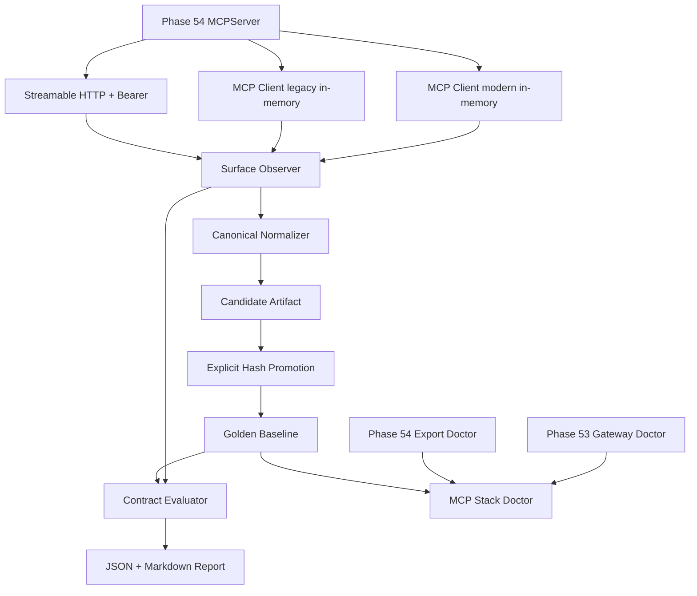

# Phase 55：MCP 互操作契约评测、Client Profile 与单机运行收口

> 本章类型：需要新增和修改项目代码、配置、测试与运行文档。  
> 前置阶段：Phase 40 Tool Contract、Phase 53 MCP Client Gateway、Phase 54 MCP Server Export。  
> 当前部署范围：单机、单用户、字面量 IPv4 loopback。  
> 默认安全状态：`MCP_GATEWAY_ENABLED=false`、`MCP_EXPORT_ENABLED=false`。  
> 本阶段不开放 MCP Mutation，不实现公网 MCP，也不引入多用户 OAuth。

---


## 一、为什么 Phase 55 不继续增加 MCP Tool

Phase 53 和 Phase 54 已经完成了 MCP 的两个协议方向：

```text
Phase 53
当前项目作为 MCP Client
    -> 查询经过固定 Policy 和 Schema Pin 的外部只读证据

Phase 54
当前项目作为 MCP Server
    -> 导出经过公开投影的本地 Job、Artifact、Report 和 Evidence
```

此时继续增加 Tool 的边际收益很低，真正的风险已经变成：

1. MCP SDK 没安装，协议测试被 `pytest.importorskip()` 静默跳过；
2. SDK 升级后 Tool Input/Output Schema 发生变化，但普通业务测试没有发现；
3. modern Client 可以连接，legacy Client 却在初始化或 Resource 上失败；
4. 进程内测试通过，真实 Streamable HTTP、Bearer 和 ASGI lifespan 没有通过；
5. 外部 Client 配置里出现明文 Token；
6. Operator 不知道应该先运行哪个 Doctor、如何启动、如何回滚；
7. 为了让第三方测试工具连接，临时关闭生产认证，留下新的旁路。

Phase 55 的目标不是增加能力，而是建立一个明确的发布门禁：

```text
源码中的 MCP Surface
    -> 真实 SDK Client 观察
    -> 确定性规范化
    -> Golden Baseline 比较
    -> modern / legacy / loopback Profile 评测
    -> 单机 Doctor 与 Runbook
    -> 才允许声明 MCP 已完成
```

---

## 二、Phase 54 完成后的真实基线

当前已经存在：

```text
app/mcp_gateway/
app/mcp_export/
tests/test_mcp_gateway_*.py
tests/test_mcp_export_*.py
```

Phase 54 已导出四个 Tool：

```text
get_reproduction_status
list_reproduction_artifacts
read_reproduction_final_report
search_reproduction_evidence
```

以及两个 Resource Template：

```text
repro://jobs/{job_id}/status
repro://jobs/{job_id}/final-report
```

本章编写前的实际专项回归结果为：

```text
60 passed, 4 skipped
```

四个 skipped 来自 `tests/test_mcp_export_server.py` 中的：

```python
pytest.importorskip("mcp")
```

当前 `agent` 环境是 Python 3.10.20，但尚未安装 `mcp` optional extra。因此这个结果只能说明 Service、Audit、
Authority 等本地逻辑通过，不能证明真实 MCP 协议层通过。Phase 55 必须消除这个假绿状态。

---

## 三、本阶段目标

完成后系统应具备以下能力。

### 3.1 契约快照

通过真实 MCP Client 观察，而不是直接读取 Python 常量：

- Server identity；
- negotiated protocol version；
- server capabilities；
- Tool 名称、描述 Hash、Input Schema、Output Schema 和 Annotation；
- Resource Template；
- 静态 Resource；
- Prompt；
- SDK、Python 和 Pydantic 运行指纹。

### 3.2 Golden Baseline

把稳定的公开 Surface 固化为可审核 Baseline：

```text
config/mcp_export_contract_baseline.json
```

业务 Surface Hash 不包含 SDK patch version。SDK 版本单独进入 Runtime Fingerprint，使下面两类变化可以区分：

```text
SDK 升级但公开 Schema 未变
    -> Surface 仍兼容，只记录 Runtime 变化

Tool/Resource/Schema 改变
    -> Surface Hash 改变，发布门禁失败
```

### 3.3 Client Profile

至少覆盖三种 Profile：

```text
in-memory-modern
    -> MCP Python SDK 默认 modern 协议路径

in-memory-legacy
    -> mode="legacy"，验证旧 initialize 生命周期

loopback-http
    -> 真实 127.0.0.1 Streamable HTTP + Bearer
```

### 3.4 单机运行闭环

提供：

- Candidate 生成；
- 显式 Hash 绑定的 Baseline 晋升；
- offline contract eval；
- release contract eval；
- MCP Stack Doctor；
- 无 Token 的 Client Profile 模板；
- 启动、停止、冒烟、故障注入和回滚步骤。

---

## 四、本阶段明确不做什么

本阶段不实现：

- MCP Shell、Patch、Approval、Cancel 或 Rerun Tool；
- 外部 Client 直接修改 Job；
- 公网监听；
- OAuth Authorization Server；
- 多用户或租户 Scope；
- 自动下载或自动启动第三方 MCP Server；
- 自动信任 `tools/list` 新发现的 Tool；
- 因为 Golden 不一致而自动更新 Baseline；
- 把 MCP Inspector 或 conformance runner Token 写进命令行历史；
- 关闭 Phase 54 Bearer 认证来迁就测试工具；
- 用 LLM 判断 Schema 是否兼容；
- 用 SDK version 相同替代 Surface 相同；
- 把 Phase 53 外部 MCP Evidence 再从 Phase 54 递归导出。

---

## 五、必须保持的不变量

### 5.1 发现不是授权

```text
Client 观察到 Tool
    != Tool 被允许进入 Chat Catalog
    != Tool 获得 Capability
    != Tool 可以产生副作用
```

### 5.2 Golden 只描述公开面

Baseline 不保存：

- Token；
- Authorization Header；
- Job ID；
- query 原文；
- Tool Result；
- Artifact 内容；
-绝对路径；
- Secret Reference 的版本信息。

### 5.3 Candidate 不能自动成为 Baseline

必须经过：

```text
生成 Candidate
    -> 人工查看 Diff
    -> 输入 expected_surface_sha256
    -> 记录 reviewed_by 和 reason
    -> 原子写入 Baseline
```

### 5.4 Offline 与 Release Gate 分离

```text
offline
    -> modern + legacy in-memory
    -> 不需要端口和 Token

release
    -> offline 全部要求
    -> 再要求真实 loopback-http + Bearer
```

### 5.5 测试工具不能削弱生产认证

如果外部 conformance 工具不能注入 Bearer，正确处理是使用隔离的测试 Fixture 或暂缓该检查，而不是给生产
MCP Export 增加无认证模式。

---

## 六、总体架构



关键点：

1. Snapshot 来自真实 MCP Client 看到的协议对象；
2. Candidate 和 Eval Report 是项目内派生文件；
3. Baseline 是受审查配置；
4. Runtime Fingerprint 与 Surface Hash 分离；
5. Doctor 默认不联网、不调用 Tool；
6. Release Eval 只读取目录，不读取业务 Job 内容。

---

## 七、文件变更总览

### 7.1 需要新增

```text
app/mcp_contracts/__init__.py
app/mcp_contracts/errors.py
app/mcp_contracts/schemas.py
app/mcp_contracts/identity.py
app/mcp_contracts/profiles.py
app/mcp_contracts/snapshot.py
app/mcp_contracts/baseline.py
app/mcp_contracts/evaluator.py
app/mcp_contracts/readiness.py
app/mcp_contracts/commands.py

config/mcp_client_profiles.example.json
config/mcp_export_contract_baseline.json       # Candidate 审核后生成

tests/test_mcp_contract_schemas.py
tests/test_mcp_contract_profiles.py
tests/test_mcp_contract_snapshot.py
tests/test_mcp_contract_baseline.py
tests/test_mcp_contract_evaluator.py
tests/test_mcp_contract_readiness.py
tests/test_mcp_contract_authority.py
tests/test_mcp_contract_golden.py
tests/mcp_contract_helpers.py
```

### 7.2 需要修改

```text
pyproject.toml
app/config.py
app/main.py
tests/test_mcp_export_server.py
.env.example
.gitignore
a_implementation_guides/README.md
a_implementation_guides/project_phase_capability_summary.md
a_implementation_guides/agent_project_analysis_and_technical_roadmap.md
```

### 7.3 不需要修改

```text
app/graph.py
app/nodes/executor_node.py
app/nodes/human_review_node.py
app/repair/
app/resources/worker.py
```

Phase 55 是协议测试与运行治理，不应该接触复现执行 Authority。

---

## 八、安装并锁定开发测试依赖

### 8.1 必须修改：`pyproject.toml`

项目运行时仍允许不安装 MCP extra，但开发测试环境必须包含 MCP SDK。把 `dev` 调整为：

```toml
dev = [
    "pytest>=8",
    "ruff>=0.6",
    "httpx2>=2.7,<3",
    # Phase 55：MCP 契约测试不允许因为 optional dependency 缺失而跳过。
    "mcp>=2.0,<3",
    "jsonschema>=4.23,<5",
]
```

保留已有运行 extra：

```toml
mcp = [
    "mcp>=2.0,<3",
    "jsonschema>=4.23,<5",
]
```

这里的重复是有意的：

- `.[mcp]` 用于只运行 MCP 服务的最小环境；
- `.[dev]` 用于保证开发回归一定执行 MCP 协议测试。

安装：

```bash
conda activate agent
python -m pip install -e '.[dev,mcp]'
python -c "import mcp; print(mcp.__file__)"
python -m pip show mcp
```

验收解释器：

```bash
python --version
```

必须满足项目声明的 Python 3.10+。不要在 base Python 3.9 中生成 Baseline，否则 Runtime Fingerprint 与正式环境
不一致。

---

## 九、增加配置

### 9.1 必须修改：`app/config.py`

在 Phase 54 配置块之后增加：

```text
    # Phase 55：MCP 公开契约 Golden、Client Profile 和评测产物。
    mcp_contract_baseline_path: Path = Path(
        os.getenv(
            "MCP_CONTRACT_BASELINE_PATH",
            "config/mcp_export_contract_baseline.json",
        )
    )
    mcp_client_profiles_path: Path = Path(
        os.getenv(
            "MCP_CLIENT_PROFILES_PATH",
            "config/mcp_client_profiles.local.json",
        )
    )
    mcp_contract_report_root: Path = Path(
        os.getenv(
            "MCP_CONTRACT_REPORT_ROOT",
            "analysis/mcp_contract_eval",
        )
    )
    mcp_contract_timeout_seconds: float = float(
        os.getenv("MCP_CONTRACT_TIMEOUT_SECONDS", "15")
    )
```

在配置集中校验区增加：

```python
# Phase 55 MCP Contract 路径必须全部位于项目 ALLOWED_ROOT 内。
for field_name, configured_path in (
    ("MCP_CONTRACT_BASELINE_PATH", settings.mcp_contract_baseline_path),
    ("MCP_CLIENT_PROFILES_PATH", settings.mcp_client_profiles_path),
    ("MCP_CONTRACT_REPORT_ROOT", settings.mcp_contract_report_root),
):
    resolved_path = configured_path.expanduser().resolve()
    if (
        resolved_path == model_allowed_root
        or model_allowed_root not in resolved_path.parents
    ):
        raise ValueError(f"{field_name} 必须位于 ALLOWED_ROOT 内")
    if field_name == "MCP_CONTRACT_BASELINE_PATH":
        settings.mcp_contract_baseline_path = resolved_path
    elif field_name == "MCP_CLIENT_PROFILES_PATH":
        settings.mcp_client_profiles_path = resolved_path
    else:
        settings.mcp_contract_report_root = resolved_path

if not 1 <= settings.mcp_contract_timeout_seconds <= 60:
    raise ValueError("MCP_CONTRACT_TIMEOUT_SECONDS 必须位于 1..60")

settings.mcp_contract_report_root.mkdir(
    parents=True,
    exist_ok=True,
)
```

注意：Baseline 和 Profile 的父目录通常已经存在，不要在 import 配置时创建空文件。只有 Report Root 可以创建。

### 9.2 必须修改：`.env.example`

在 Phase 54 配置后增加：

```dotenv

# Phase 55 MCP contract evaluation. Profiles contain Secret names, never Token values.
MCP_CONTRACT_BASELINE_PATH=config/mcp_export_contract_baseline.json
MCP_CLIENT_PROFILES_PATH=config/mcp_client_profiles.local.json
MCP_CONTRACT_REPORT_ROOT=analysis/mcp_contract_eval
MCP_CONTRACT_TIMEOUT_SECONDS=15
```

### 9.3 必须修改：`.gitignore`

增加：

```gitignore
# Phase 55: local MCP client profile and generated contract reports.
config/mcp_client_profiles.local.json
analysis/mcp_contract_eval/
```

不要忽略：

```text
config/mcp_client_profiles.example.json
config/mcp_export_contract_baseline.json
```

前者是无 Secret 模板，后者是需要进入版本控制的 Golden。

---

## 十、建立包与稳定错误

### 10.1 需要新增：`app/mcp_contracts/__init__.py`

```python
"""Phase 55：MCP 互操作契约、评测与单机运行收口。"""
```

### 10.2 需要新增：`app/mcp_contracts/errors.py`

```python
from __future__ import annotations


class McpContractError(RuntimeError):
    """Phase 55 稳定错误基类；message 不能包含 Token 或协议正文。"""

    code = "MCP_CONTRACT_ERROR"


class McpContractDependencyMissing(McpContractError):
    code = "MCP_CONTRACT_DEPENDENCY_MISSING"


class McpClientProfileInvalid(McpContractError):
    code = "MCP_CLIENT_PROFILE_INVALID"


class McpSurfaceObservationFailed(McpContractError):
    code = "MCP_SURFACE_OBSERVATION_FAILED"


class McpContractBaselineMissing(McpContractError):
    code = "MCP_CONTRACT_BASELINE_MISSING"


class McpContractBaselineInvalid(McpContractError):
    code = "MCP_CONTRACT_BASELINE_INVALID"


class McpContractDrift(McpContractError):
    code = "MCP_CONTRACT_DRIFT"


class McpContractPromotionRejected(McpContractError):
    code = "MCP_CONTRACT_PROMOTION_REJECTED"


class McpLiveProbeFailed(McpContractError):
    code = "MCP_LIVE_PROBE_FAILED"
```

稳定错误用于 CLI、测试和报告。不要把 `repr(exc)`、HTTP body 或 SDK traceback 直接写进报告。

---

## 十一、定义契约 Schema

### 11.1 需要新增：`app/mcp_contracts/schemas.py`

```python
from __future__ import annotations

from typing import Any, Literal

from pydantic import (
    BaseModel,
    ConfigDict,
    Field,
    model_validator,
)


SHA256_PATTERN = r"^[0-9a-f]{64}$"
PROFILE_ID_PATTERN = r"^[a-z][a-z0-9_-]{2,63}$"

McpTransport = Literal["in_memory", "streamable_http"]
McpConnectMode = Literal["auto", "legacy"]
McpEvalMode = Literal["offline", "release"]


class McpContractModel(BaseModel):
    model_config = ConfigDict(extra="forbid")


class McpClientProfile(McpContractModel):
    """不含凭证的 Client 运行模板。"""

    profile_id: str = Field(pattern=PROFILE_ID_PATTERN)
    transport: McpTransport
    mode: McpConnectMode
    enabled: bool = True
    required_for_release: bool = True
    endpoint: str | None = Field(default=None, max_length=500)
    secret_name: str | None = Field(default=None, max_length=200)

    @model_validator(mode="after")
    def validate_transport_fields(self) -> "McpClientProfile":
        if self.transport == "in_memory":
            if self.endpoint is not None or self.secret_name is not None:
                raise ValueError(
                    "in_memory Profile 不能携带 endpoint 或 secret_name"
                )
        elif self.endpoint is None or self.secret_name is None:
            raise ValueError(
                "streamable_http Profile 必须声明 endpoint 和 secret_name"
            )
        return self


class McpToolSurface(McpContractModel):
    name: str = Field(min_length=1, max_length=128)
    description_sha256: str = Field(pattern=SHA256_PATTERN)
    input_schema: dict[str, Any]
    output_schema: dict[str, Any] | None = None
    annotations: dict[str, Any] = Field(default_factory=dict)
    contract_sha256: str = Field(pattern=SHA256_PATTERN)


class McpResourceTemplateSurface(McpContractModel):
    uri_template: str = Field(min_length=1, max_length=500)
    name: str = Field(min_length=1, max_length=200)
    mime_type: str | None = Field(default=None, max_length=200)
    description_sha256: str = Field(pattern=SHA256_PATTERN)
    contract_sha256: str = Field(pattern=SHA256_PATTERN)


class McpSurfaceSnapshot(McpContractModel):
    """与 SDK patch version 无关的公开业务 Surface。"""

    schema_version: Literal["phase55-v1"] = "phase55-v1"
    server_name: str = Field(min_length=1, max_length=200)
    server_version: str = Field(min_length=1, max_length=100)
    capability_names: list[str] = Field(default_factory=list)
    tools: list[McpToolSurface] = Field(default_factory=list)
    resource_templates: list[McpResourceTemplateSurface] = Field(
        default_factory=list
    )
    static_resource_uris: list[str] = Field(default_factory=list)
    prompt_names: list[str] = Field(default_factory=list)
    surface_sha256: str = Field(pattern=SHA256_PATTERN)

    @model_validator(mode="after")
    def validate_deterministic_order(self) -> "McpSurfaceSnapshot":
        if [item.name for item in self.tools] != sorted(
            item.name for item in self.tools
        ):
            raise ValueError("tools 必须按 name 排序")
        if [item.uri_template for item in self.resource_templates] != sorted(
            item.uri_template for item in self.resource_templates
        ):
            raise ValueError("resource_templates 必须按 URI 排序")
        if self.static_resource_uris != sorted(self.static_resource_uris):
            raise ValueError("static_resource_uris 必须排序")
        if self.prompt_names != sorted(self.prompt_names):
            raise ValueError("prompt_names 必须排序")
        return self


class McpRuntimeFingerprint(McpContractModel):
    """记录环境身份，但不参与 Surface Hash。"""

    profile_id: str = Field(pattern=PROFILE_ID_PATTERN)
    transport: McpTransport
    connect_mode: McpConnectMode
    python_version: str = Field(min_length=1, max_length=50)
    mcp_sdk_version: str = Field(min_length=1, max_length=50)
    mcp_sdk_major: int = Field(ge=1)
    pydantic_version: str = Field(min_length=1, max_length=50)
    protocol_version: str = Field(min_length=1, max_length=50)


class McpSurfaceObservation(McpContractModel):
    profile: McpClientProfile
    runtime: McpRuntimeFingerprint
    surface: McpSurfaceSnapshot


class McpContractCandidate(McpContractModel):
    candidate_id: str = Field(pattern=r"^mcpcandidate_[0-9a-f]{16}$")
    generated_at: str
    profile_ids: list[str] = Field(min_length=1)
    observations: list[McpSurfaceObservation] = Field(min_length=1)
    consistent_surface: bool
    surface_sha256: str = Field(pattern=SHA256_PATTERN)
    candidate_sha256: str = Field(pattern=SHA256_PATTERN)


class McpContractBaseline(McpContractModel):
    schema_version: Literal["phase55-v1"] = "phase55-v1"
    baseline_id: str = Field(pattern=r"^mcpbaseline_[0-9a-f]{16}$")
    accepted_at: str
    reviewed_by: str = Field(min_length=1, max_length=100)
    reason: str = Field(min_length=3, max_length=500)
    accepted_surface_sha256: str = Field(pattern=SHA256_PATTERN)
    server_name: str = Field(min_length=1, max_length=200)
    server_version: str = Field(min_length=1, max_length=100)
    required_tool_names: list[str] = Field(min_length=1)
    required_resource_templates: list[str] = Field(min_length=1)
    forbidden_name_fragments: list[str] = Field(default_factory=list)
    require_output_schema: bool = True
    allow_static_resources: bool = False
    allow_prompts: bool = False
    allowed_sdk_majors: list[int] = Field(default_factory=lambda: [2])
    allowed_protocol_versions: list[str] = Field(min_length=1)
    required_profile_ids: list[str] = Field(min_length=1)
    baseline_sha256: str = Field(pattern=SHA256_PATTERN)


class McpContractFinding(McpContractModel):
    code: str = Field(min_length=1, max_length=100)
    severity: Literal["error", "warning"]
    summary: str = Field(min_length=1, max_length=500)


class McpProfileEvalResult(McpContractModel):
    profile_id: str = Field(pattern=PROFILE_ID_PATTERN)
    status: Literal["passed", "failed", "skipped"]
    protocol_version: str | None = Field(default=None, max_length=50)
    surface_sha256: str | None = Field(
        default=None,
        pattern=SHA256_PATTERN,
    )
    findings: list[McpContractFinding] = Field(default_factory=list)


class McpContractEvalReport(McpContractModel):
    eval_id: str = Field(pattern=r"^mcpeval_[0-9a-f]{16}$")
    mode: McpEvalMode
    generated_at: str
    baseline_sha256: str = Field(pattern=SHA256_PATTERN)
    passed: bool
    profile_results: list[McpProfileEvalResult] = Field(min_length=1)
    report_sha256: str = Field(pattern=SHA256_PATTERN)


class McpStackComponent(McpContractModel):
    name: Literal["sdk", "contracts", "gateway", "export"]
    status: Literal["ready", "degraded", "not_ready", "disabled"]
    issues: list[str] = Field(default_factory=list)


class McpStackReadinessReport(McpContractModel):
    schema_version: Literal["phase55-v1"] = "phase55-v1"
    status: Literal["ready", "degraded", "not_ready", "disabled"]
    generated_at: str
    components: list[McpStackComponent]
```

### 11.2 输入输出含义

| Schema | 输入含义 | 输出含义 |
|---|---|---|
| `McpClientProfile` | 如何连接 MCP Server；只含 Secret 逻辑名 | 可审核的连接模板 |
| `McpToolSurface` | `tools/list` 中一个 Tool 的公开协议数据 | 单 Tool 契约及 Hash |
| `McpSurfaceSnapshot` | 整个 Server 的公开目录 | 与 SDK patch 无关的 Surface Hash |
| `McpRuntimeFingerprint` | 实际解释器、SDK 和协商协议 | 环境身份，不是授权 |
| `McpContractCandidate` | 多 Profile 观察结果 | 等待人工审核的候选 |
| `McpContractBaseline` | 已审核 Candidate | 发布门禁 Golden |
| `McpContractEvalReport` | Baseline 与实际观察 | 是否允许发布及稳定 Finding |

---

## 十二、实现确定性身份

### 12.1 需要新增：`app/mcp_contracts/identity.py`

```python
from __future__ import annotations

import hashlib
import json
from typing import Any

from pydantic import BaseModel

from app.mcp_contracts.schemas import (
    McpContractBaseline,
    McpContractCandidate,
    McpContractEvalReport,
    McpResourceTemplateSurface,
    McpSurfaceSnapshot,
    McpToolSurface,
)


def canonical_json_bytes(value: Any) -> bytes:
    """把 Pydantic/JSON 对象转成稳定 UTF-8 字节。"""

    material = (
        value.model_dump(mode="json")
        if isinstance(value, BaseModel)
        else value
    )
    return json.dumps(
        material,
        ensure_ascii=False,
        sort_keys=True,
        separators=(",", ":"),
        default=str,
    ).encode("utf-8")


def sha256_value(value: Any) -> str:
    return hashlib.sha256(canonical_json_bytes(value)).hexdigest()


def sha256_text(value: str) -> str:
    return hashlib.sha256(value.encode("utf-8")).hexdigest()


def tool_surface(
    *,
    name: str,
    description: str,
    input_schema: dict[str, Any],
    output_schema: dict[str, Any] | None,
    annotations: dict[str, Any],
) -> McpToolSurface:
    payload = {
        "name": name,
        # Baseline 不需要保存完整描述，只需要发现描述是否漂移。
        "description_sha256": sha256_text(description),
        "input_schema": input_schema,
        "output_schema": output_schema,
        "annotations": annotations,
    }
    return McpToolSurface(
        **payload,
        contract_sha256=sha256_value(payload),
    )


def resource_template_surface(
    *,
    uri_template: str,
    name: str,
    mime_type: str | None,
    description: str,
) -> McpResourceTemplateSurface:
    payload = {
        "uri_template": uri_template,
        "name": name,
        "mime_type": mime_type,
        "description_sha256": sha256_text(description),
    }
    return McpResourceTemplateSurface(
        **payload,
        contract_sha256=sha256_value(payload),
    )


def surface_snapshot(**payload: Any) -> McpSurfaceSnapshot:
    return McpSurfaceSnapshot(
        **payload,
        surface_sha256=sha256_value(payload),
    )


def candidate_hash(candidate: McpContractCandidate) -> str:
    payload = candidate.model_dump(
        mode="json",
        exclude={"candidate_sha256"},
    )
    return sha256_value(payload)


def baseline_hash(baseline: McpContractBaseline) -> str:
    payload = baseline.model_dump(
        mode="json",
        exclude={"baseline_sha256"},
    )
    return sha256_value(payload)


def report_hash(report: McpContractEvalReport) -> str:
    payload = report.model_dump(
        mode="json",
        exclude={"report_sha256"},
    )
    return sha256_value(payload)
```

不要复用 Python 内置 `hash()`。它不稳定，也不是内容身份。

---

## 十三、定义并加载 Client Profile

### 13.1 需要新增：`config/mcp_client_profiles.example.json`

```json
{
  "schema_version": "phase55-v1",
  "profiles": [
    {
      "profile_id": "in-memory-modern",
      "transport": "in_memory",
      "mode": "auto",
      "enabled": true,
      "required_for_release": true
    },
    {
      "profile_id": "in-memory-legacy",
      "transport": "in_memory",
      "mode": "legacy",
      "enabled": true,
      "required_for_release": true
    },
    {
      "profile_id": "loopback-http",
      "transport": "streamable_http",
      "mode": "auto",
      "enabled": true,
      "required_for_release": true,
      "endpoint": "http://127.0.0.1:8770/mcp",
      "secret_name": "PAPER_COPILOT_MCP_EXPORT_TOKEN"
    }
  ]
}
```

复制为本地配置：

```bash
cp config/mcp_client_profiles.example.json \
  config/mcp_client_profiles.local.json
```

该文件仍然不能包含 Token。`secret_name` 只是 Secret Vault 中的逻辑名称。

### 13.2 需要新增：`app/mcp_contracts/profiles.py`

```python
from __future__ import annotations

import json
from pathlib import Path
from typing import Any

from pydantic import TypeAdapter

from app.mcp_contracts.errors import McpClientProfileInvalid
from app.mcp_contracts.schemas import McpClientProfile
from app.mcp_gateway.policy import validate_loopback_endpoint


MAX_PROFILE_BYTES = 64 * 1024
FORBIDDEN_RAW_KEYS = {
    "token",
    "access_token",
    "authorization",
    "headers",
    "password",
    "secret_value",
}


def _walk_keys(value: Any) -> list[str]:
    keys: list[str] = []
    if isinstance(value, dict):
        for key, item in value.items():
            keys.append(str(key).lower())
            keys.extend(_walk_keys(item))
    elif isinstance(value, list):
        for item in value:
            keys.extend(_walk_keys(item))
    return keys


def load_client_profiles(
    path: Path,
    *,
    allowed_root: Path,
) -> list[McpClientProfile]:
    """读取无凭证 Profile；拒绝越界、symlink、超大和重复身份。"""

    candidate = path.expanduser()
    if candidate.is_symlink():
        raise McpClientProfileInvalid("profile path cannot be a symlink")

    resolved = candidate.resolve()
    root = allowed_root.expanduser().resolve()
    if resolved == root or root not in resolved.parents:
        raise McpClientProfileInvalid("profile path is outside allowed root")
    if not resolved.is_file():
        raise McpClientProfileInvalid("profile file does not exist")
    if resolved.stat().st_size > MAX_PROFILE_BYTES:
        raise McpClientProfileInvalid("profile file is too large")

    try:
        raw = json.loads(resolved.read_text(encoding="utf-8"))
    except (OSError, UnicodeError, json.JSONDecodeError) as exc:
        raise McpClientProfileInvalid("profile JSON is invalid") from exc

    if raw.get("schema_version") != "phase55-v1":
        raise McpClientProfileInvalid("profile schema_version is invalid")
    forbidden = FORBIDDEN_RAW_KEYS.intersection(_walk_keys(raw))
    if forbidden:
        raise McpClientProfileInvalid(
            "profile contains raw credential fields"
        )

    try:
        profiles = TypeAdapter(list[McpClientProfile]).validate_python(
            raw.get("profiles")
        )
    except Exception as exc:
        raise McpClientProfileInvalid("profile schema is invalid") from exc

    ids = [item.profile_id for item in profiles]
    if len(ids) != len(set(ids)):
        raise McpClientProfileInvalid("profile_id must be unique")

    enabled = [item for item in profiles if item.enabled]
    if not enabled:
        raise McpClientProfileInvalid("at least one profile must be enabled")

    for profile in enabled:
        if profile.transport == "streamable_http":
            # 复用 Phase 53 的字面量 loopback、显式端口和 /mcp Policy。
            validate_loopback_endpoint(profile.endpoint or "")
    return enabled
```

### 13.3 Profile 的伪代码

```text
拒绝 symlink
解析并确认路径位于 ALLOWED_ROOT
检查文件存在且大小不超过 64 KiB
读取 JSON
拒绝 token、authorization、headers 等明文字段
使用 Pydantic 验证 Profile
拒绝重复 profile_id
对 HTTP Profile 复用 loopback endpoint Policy
返回启用的 Profile
```

---
## 十四、通过真实 MCP Client 观察公开 Surface

### 14.1 需要新增：`app/mcp_contracts/snapshot.py`

```python
from __future__ import annotations

import sys
from importlib import metadata
from typing import Any, cast

from app.mcp_contracts.errors import (
    McpContractDependencyMissing,
    McpSurfaceObservationFailed,
)
from app.mcp_contracts.identity import (
    resource_template_surface,
    surface_snapshot,
    tool_surface,
)
from app.mcp_contracts.schemas import (
    McpClientProfile,
    McpRuntimeFingerprint,
    McpSurfaceObservation,
)
from app.mcp_export.server import build_mcp_export_server
from app.mcp_export.service import ReadOnlyMcpExportService


def _distribution_version(name: str) -> str:
    try:
        return metadata.version(name)
    except metadata.PackageNotFoundError as exc:
        raise McpContractDependencyMissing(
            f"required distribution is missing: {name}"
        ) from exc


def _major(version: str) -> int:
    raw = version.split(".", 1)[0]
    if not raw.isdigit():
        raise McpSurfaceObservationFailed("SDK version is invalid")
    return int(raw)


def _dump(value: Any) -> dict[str, Any]:
    if value is None:
        return {}
    if hasattr(value, "model_dump"):
        return value.model_dump(mode="json", exclude_none=True)
    if isinstance(value, dict):
        return dict(value)
    raise McpSurfaceObservationFailed("MCP metadata is not serializable")


def _capability_names(value: Any) -> list[str]:
    payload = _dump(value)
    return sorted(
        name
        for name, item in payload.items()
        if item not in (None, False, {}, [])
    )


async def _list_all_tools(client) -> list[Any]:
    items: list[Any] = []
    cursor = None
    while True:
        page = await client.list_tools(cursor=cursor)
        items.extend(page.tools)
        cursor = page.next_cursor
        if cursor is None:
            return items


async def _list_all_templates(client) -> list[Any]:
    items: list[Any] = []
    cursor = None
    while True:
        page = await client.list_resource_templates(cursor=cursor)
        items.extend(page.resource_templates)
        cursor = page.next_cursor
        if cursor is None:
            return items


async def _list_all_resources(client) -> list[Any]:
    items: list[Any] = []
    cursor = None
    while True:
        page = await client.list_resources(cursor=cursor)
        items.extend(page.resources)
        cursor = page.next_cursor
        if cursor is None:
            return items


async def _list_all_prompts(client) -> list[Any]:
    items: list[Any] = []
    cursor = None
    while True:
        page = await client.list_prompts(cursor=cursor)
        items.extend(page.prompts)
        cursor = page.next_cursor
        if cursor is None:
            return items


async def observe_connected_client(
    client,
    *,
    profile: McpClientProfile,
) -> McpSurfaceObservation:
    """观察 Client 真正看到的目录，不调用任何业务 Tool。"""

    try:
        tools = await _list_all_tools(client)
        templates = await _list_all_templates(client)

        capabilities = client.server_capabilities
        static_resources = (
            await _list_all_resources(client)
            if getattr(capabilities, "resources", None) is not None
            else []
        )
        prompts = (
            await _list_all_prompts(client)
            if getattr(capabilities, "prompts", None) is not None
            else []
        )

        server_info = client.server_info
        if server_info is None:
            raise McpSurfaceObservationFailed(
                "MCP Server did not report server_info"
            )

        tool_items = sorted(
            [
                tool_surface(
                    name=item.name,
                    description=item.description or "",
                    input_schema=dict(item.input_schema),
                    output_schema=(
                        dict(item.output_schema)
                        if item.output_schema is not None
                        else None
                    ),
                    annotations=_dump(item.annotations),
                )
                for item in tools
            ],
            key=lambda item: item.name,
        )
        template_items = sorted(
            [
                resource_template_surface(
                    uri_template=str(item.uri_template),
                    name=item.name,
                    mime_type=item.mime_type,
                    description=item.description or "",
                )
                for item in templates
            ],
            key=lambda item: item.uri_template,
        )

        surface = surface_snapshot(
            schema_version="phase55-v1",
            server_name=server_info.name,
            server_version=server_info.version,
            capability_names=_capability_names(capabilities),
            tools=tool_items,
            resource_templates=template_items,
            static_resource_uris=sorted(
                str(item.uri) for item in static_resources
            ),
            prompt_names=sorted(item.name for item in prompts),
        )
        sdk_version = _distribution_version("mcp")
        runtime = McpRuntimeFingerprint(
            profile_id=profile.profile_id,
            transport=profile.transport,
            connect_mode=profile.mode,
            python_version=(
                f"{sys.version_info.major}."
                f"{sys.version_info.minor}."
                f"{sys.version_info.micro}"
            ),
            mcp_sdk_version=sdk_version,
            mcp_sdk_major=_major(sdk_version),
            pydantic_version=_distribution_version("pydantic"),
            protocol_version=str(client.protocol_version),
        )
        return McpSurfaceObservation(
            profile=profile,
            runtime=runtime,
            surface=surface,
        )
    except McpSurfaceObservationFailed:
        raise
    except Exception as exc:
        # 不把远端正文或 Header 写进稳定错误。
        raise McpSurfaceObservationFailed(
            f"surface observation failed: {type(exc).__name__}"
        ) from exc


async def observe_in_memory(
    server,
    *,
    profile: McpClientProfile,
) -> McpSurfaceObservation:
    if profile.transport != "in_memory":
        raise McpSurfaceObservationFailed("profile transport mismatch")

    try:
        from mcp import Client
    except ImportError as exc:
        raise McpContractDependencyMissing(
            "install project dev/mcp extras"
        ) from exc

    async with Client(
        server,
        mode=profile.mode,
        raise_exceptions=True,
    ) as client:
        return await observe_connected_client(client, profile=profile)


async def observe_streamable_http(
    *,
    profile: McpClientProfile,
    token: str,
    timeout_seconds: float,
) -> McpSurfaceObservation:
    """真实 loopback HTTP 观察；Token 只存在于短生命周期 AsyncClient。"""

    if profile.transport != "streamable_http" or profile.endpoint is None:
        raise McpSurfaceObservationFailed("profile transport mismatch")

    try:
        import httpx2
        from mcp import Client
        from mcp.client.streamable_http import streamable_http_client
    except ImportError as exc:
        raise McpContractDependencyMissing(
            "install project dev/mcp extras"
        ) from exc

    # 不继承环境 Proxy，不跟随 Redirect，避免 loopback Policy 被协议层绕过。
    async with httpx2.AsyncClient(
        headers={"Authorization": f"Bearer {token}"},
        timeout=httpx2.Timeout(timeout_seconds),
        follow_redirects=False,
        trust_env=False,
    ) as http_client:
        transport = streamable_http_client(
            profile.endpoint,
            http_client=http_client,
        )
        async with Client(transport, mode=profile.mode) as client:
            return await observe_connected_client(
                client,
                profile=profile,
            )


class CatalogOnlyService:
    """只用于 in-memory tools/list；任何业务调用都确定性失败。"""

    @staticmethod
    def _deny():
        raise RuntimeError("catalog-only service cannot execute tools")

    def get_status(self, **_kwargs):
        return self._deny()

    def list_artifacts(self, **_kwargs):
        return self._deny()

    def read_final_report(self, **_kwargs):
        return self._deny()

    def search_evidence(self, **_kwargs):
        return self._deny()


def build_catalog_only_server():
    """不连接 Job Store、Artifact、Secret 或 Phase 53 Gateway。"""

    service = cast(
        ReadOnlyMcpExportService,
        CatalogOnlyService(),
    )
    return build_mcp_export_server(service)
```

### 14.2 为什么要处理分页

当前 `MCPServer` 可能一次返回全部目录，但 MCP Client API 明确支持 `next_cursor`。如果 Snapshot 只读取第一页，
未来 SDK 或 Server 增加分页后可能漏掉 Tool，Golden 反而给出假稳定。

### 14.3 为什么不调用业务 Tool

契约快照只验证目录与 Schema，不需要 Job ID，也不应产生 Audit、Artifact 读取或 Rate Limit 消耗。业务返回值在
Phase 54 Service 测试和真实 Job 手工验收中验证。

---

## 十五、实现 Candidate 与 Baseline Repository

### 15.1 需要新增：`app/mcp_contracts/baseline.py`

```python
from __future__ import annotations

import json
import os
from datetime import datetime, timezone
from pathlib import Path
from uuid import uuid4

from app.mcp_contracts.errors import (
    McpContractBaselineInvalid,
    McpContractBaselineMissing,
    McpContractPromotionRejected,
)
from app.mcp_contracts.identity import (
    baseline_hash,
    candidate_hash,
)
from app.mcp_contracts.schemas import (
    McpContractBaseline,
    McpContractCandidate,
    McpSurfaceObservation,
)


FORBIDDEN_TOOL_FRAGMENTS = [
    "shell",
    "command",
    "execute",
    "patch",
    "write",
    "delete",
    "approve",
    "decision",
    "cancel",
    "rerun",
]


def utc_now() -> str:
    return datetime.now(timezone.utc).isoformat()


def atomic_write_json(path: Path, payload: dict) -> None:
    """临时文件与目标文件同目录，保证不离开项目挂载。"""

    if path.is_symlink():
        raise McpContractBaselineInvalid(
            "refusing to replace a symlinked contract artifact"
        )
    path.parent.mkdir(parents=True, exist_ok=True, mode=0o700)
    temporary = path.with_name(f".{path.name}.{uuid4().hex}.tmp")
    try:
        with temporary.open("x", encoding="utf-8") as stream:
            json.dump(
                payload,
                stream,
                ensure_ascii=False,
                indent=2,
                sort_keys=True,
            )
            stream.write("\n")
            stream.flush()
            os.fsync(stream.fileno())
        os.replace(temporary, path)
    finally:
        temporary.unlink(missing_ok=True)


def atomic_write_text(path: Path, content: str) -> None:
    if path.is_symlink():
        raise McpContractBaselineInvalid(
            "refusing to replace a symlinked contract artifact"
        )
    path.parent.mkdir(parents=True, exist_ok=True, mode=0o700)
    temporary = path.with_name(f".{path.name}.{uuid4().hex}.tmp")
    try:
        with temporary.open("x", encoding="utf-8") as stream:
            stream.write(content)
            stream.flush()
            os.fsync(stream.fileno())
        os.replace(temporary, path)
    finally:
        temporary.unlink(missing_ok=True)


def build_candidate(
    observations: list[McpSurfaceObservation],
) -> McpContractCandidate:
    if not observations:
        raise McpContractPromotionRejected("candidate has no observations")

    hashes = {item.surface.surface_sha256 for item in observations}
    selected_hash = sorted(hashes)[0]
    payload = {
        "candidate_id": f"mcpcandidate_{uuid4().hex[:16]}",
        "generated_at": utc_now(),
        "profile_ids": sorted(
            item.profile.profile_id for item in observations
        ),
        "observations": observations,
        "consistent_surface": len(hashes) == 1,
        "surface_sha256": selected_hash,
    }
    candidate = McpContractCandidate(
        **payload,
        candidate_sha256="0" * 64,
    )
    return candidate.model_copy(
        update={"candidate_sha256": candidate_hash(candidate)}
    )


def write_candidate(path: Path, candidate: McpContractCandidate) -> None:
    if candidate_hash(candidate) != candidate.candidate_sha256:
        raise McpContractBaselineInvalid("candidate hash mismatch")
    atomic_write_json(path, candidate.model_dump(mode="json"))


def load_candidate(path: Path) -> McpContractCandidate:
    if path.is_symlink():
        raise McpContractBaselineInvalid(
            "candidate must not be a symlink"
        )
    try:
        candidate = McpContractCandidate.model_validate_json(
            path.read_text(encoding="utf-8")
        )
    except (OSError, UnicodeError, ValueError) as exc:
        raise McpContractBaselineInvalid("candidate is invalid") from exc
    if candidate_hash(candidate) != candidate.candidate_sha256:
        raise McpContractBaselineInvalid("candidate hash mismatch")
    return candidate


def load_baseline(path: Path) -> McpContractBaseline:
    if path.is_symlink():
        raise McpContractBaselineInvalid(
            "MCP baseline must not be a symlink"
        )
    if not path.is_file():
        raise McpContractBaselineMissing("MCP baseline does not exist")
    try:
        baseline = McpContractBaseline.model_validate_json(
            path.read_text(encoding="utf-8")
        )
    except (OSError, UnicodeError, ValueError) as exc:
        raise McpContractBaselineInvalid("MCP baseline is invalid") from exc
    if baseline_hash(baseline) != baseline.baseline_sha256:
        raise McpContractBaselineInvalid("MCP baseline hash mismatch")
    return baseline


def promote_candidate(
    *,
    candidate: McpContractCandidate,
    baseline_path: Path,
    expected_surface_sha256: str,
    reviewed_by: str,
    reason: str,
    replace: bool,
    expected_current_baseline_sha256: str | None,
) -> McpContractBaseline:
    """显式 Hash 绑定的人工晋升；绝不根据 drift 自动接受。"""

    if baseline_path.is_symlink():
        raise McpContractPromotionRejected(
            "baseline path must not be a symlink"
        )
    reviewer = reviewed_by.strip()
    normalized_reason = " ".join(reason.strip().split())
    if not reviewer or len(normalized_reason) < 3:
        raise McpContractPromotionRejected("review metadata is invalid")
    if not candidate.consistent_surface:
        raise McpContractPromotionRejected(
            "client profiles observed different surfaces"
        )
    if candidate.surface_sha256 != expected_surface_sha256:
        raise McpContractPromotionRejected("expected surface hash is stale")

    if baseline_path.exists():
        if not replace:
            raise McpContractPromotionRejected(
                "baseline exists; explicit replace is required"
            )
        current = load_baseline(baseline_path)
        if (
            expected_current_baseline_sha256 is None
            or current.baseline_sha256
            != expected_current_baseline_sha256
        ):
            raise McpContractPromotionRejected(
                "current baseline hash is stale"
            )

    surface = candidate.observations[0].surface
    protocol_versions = sorted(
        {item.runtime.protocol_version for item in candidate.observations}
    )
    payload = {
        "schema_version": "phase55-v1",
        "baseline_id": f"mcpbaseline_{uuid4().hex[:16]}",
        "accepted_at": utc_now(),
        "reviewed_by": reviewer,
        "reason": normalized_reason,
        "accepted_surface_sha256": surface.surface_sha256,
        "server_name": surface.server_name,
        "server_version": surface.server_version,
        "required_tool_names": [item.name for item in surface.tools],
        "required_resource_templates": [
            item.uri_template for item in surface.resource_templates
        ],
        "forbidden_name_fragments": list(FORBIDDEN_TOOL_FRAGMENTS),
        "require_output_schema": True,
        "allow_static_resources": False,
        "allow_prompts": False,
        "allowed_sdk_majors": sorted(
            {item.runtime.mcp_sdk_major for item in candidate.observations}
        ),
        "allowed_protocol_versions": protocol_versions,
        "required_profile_ids": list(candidate.profile_ids),
    }
    baseline = McpContractBaseline(
        **payload,
        baseline_sha256="0" * 64,
    )
    baseline = baseline.model_copy(
        update={"baseline_sha256": baseline_hash(baseline)}
    )
    atomic_write_json(
        baseline_path,
        baseline.model_dump(mode="json"),
    )
    return baseline
```

### 15.2 为什么 Candidate 保存完整 Schema

只有 Hash 无法人工判断变化来自哪里。Candidate 保存公开 Input/Output Schema，使 Review 可以明确看到：

```text
新增了哪个参数
删除了哪个 required 字段
Output Schema 是否消失
Resource URI 是否变化
是否意外出现 Mutation Tool
```

Candidate 不含业务数据，因此可以作为短期评测 Artifact；默认放在被 `.gitignore` 的报告目录中。

### 15.3 为什么 Baseline 不能自动更新

如果测试发现 Drift 后自动覆盖 Golden，测试就退化成：

```text
实际输出 == 刚刚从实际输出生成的文件
```

它永远不会失败，也就失去了契约保护作用。

---

## 十六、实现契约比较与多 Profile 评测

### 16.1 需要新增：`app/mcp_contracts/evaluator.py`

```python
from __future__ import annotations

from collections.abc import Callable
from datetime import datetime, timezone
from uuid import uuid4

from app.mcp_contracts.identity import report_hash
from app.mcp_contracts.schemas import (
    McpClientProfile,
    McpContractBaseline,
    McpContractEvalReport,
    McpContractFinding,
    McpEvalMode,
    McpProfileEvalResult,
    McpSurfaceObservation,
)
from app.mcp_contracts.snapshot import (
    build_catalog_only_server,
    observe_in_memory,
    observe_streamable_http,
)


def _finding(code: str, summary: str) -> McpContractFinding:
    return McpContractFinding(
        code=code,
        severity="error",
        summary=summary,
    )


def compare_observation(
    observation: McpSurfaceObservation,
    baseline: McpContractBaseline,
) -> list[McpContractFinding]:
    """完全确定性比较；不调用 LLM。"""

    findings: list[McpContractFinding] = []
    surface = observation.surface
    runtime = observation.runtime

    if surface.surface_sha256 != baseline.accepted_surface_sha256:
        findings.append(
            _finding("surface_hash_drift", "public MCP surface changed")
        )
    if surface.server_name != baseline.server_name:
        findings.append(
            _finding("server_name_drift", "server name changed")
        )
    if surface.server_version != baseline.server_version:
        findings.append(
            _finding("server_version_drift", "server version changed")
        )

    actual_tools = [item.name for item in surface.tools]
    if actual_tools != baseline.required_tool_names:
        findings.append(
            _finding("tool_catalog_drift", "tool catalog changed")
        )
    actual_templates = [
        item.uri_template for item in surface.resource_templates
    ]
    if actual_templates != baseline.required_resource_templates:
        findings.append(
            _finding(
                "resource_template_drift",
                "resource template catalog changed",
            )
        )

    if baseline.require_output_schema and any(
        item.output_schema is None for item in surface.tools
    ):
        findings.append(
            _finding(
                "output_schema_missing",
                "one or more tools have no output schema",
            )
        )
    if not baseline.allow_static_resources and surface.static_resource_uris:
        findings.append(
            _finding(
                "static_resource_exposed",
                "static resources are not approved",
            )
        )
    if not baseline.allow_prompts and surface.prompt_names:
        findings.append(
            _finding("prompt_exposed", "MCP prompts are not approved")
        )

    lowered_names = [item.lower() for item in actual_tools]
    if any(
        fragment.lower() in name
        for fragment in baseline.forbidden_name_fragments
        for name in lowered_names
    ):
        findings.append(
            _finding(
                "forbidden_tool_name",
                "tool catalog contains a mutation-like name",
            )
        )

    if runtime.mcp_sdk_major not in baseline.allowed_sdk_majors:
        findings.append(
            _finding("sdk_major_drift", "MCP SDK major is not approved")
        )
    if runtime.protocol_version not in baseline.allowed_protocol_versions:
        findings.append(
            _finding(
                "protocol_version_drift",
                "negotiated protocol version is not approved",
            )
        )
    return findings


async def evaluate_profiles(
    *,
    profiles: list[McpClientProfile],
    baseline: McpContractBaseline,
    mode: McpEvalMode,
    timeout_seconds: float,
    token_resolver: Callable[[McpClientProfile], str],
) -> McpContractEvalReport:
    server = build_catalog_only_server()
    results: list[McpProfileEvalResult] = []
    observed_hashes: set[str] = set()

    for profile in profiles:
        if mode == "offline" and profile.transport != "in_memory":
            results.append(
                McpProfileEvalResult(
                    profile_id=profile.profile_id,
                    status="skipped",
                    findings=[],
                )
            )
            continue

        try:
            if profile.transport == "in_memory":
                observation = await observe_in_memory(
                    server,
                    profile=profile,
                )
            else:
                # Resolver 返回短生命周期明文，不进入 Report。
                token = token_resolver(profile)
                observation = await observe_streamable_http(
                    profile=profile,
                    token=token,
                    timeout_seconds=timeout_seconds,
                )
            findings = compare_observation(observation, baseline)
            observed_hashes.add(observation.surface.surface_sha256)
            results.append(
                McpProfileEvalResult(
                    profile_id=profile.profile_id,
                    status="failed" if findings else "passed",
                    protocol_version=observation.runtime.protocol_version,
                    surface_sha256=observation.surface.surface_sha256,
                    findings=findings,
                )
            )
        except Exception as exc:
            # 只保留异常类型，不保存连接 body、Header 或 Token。
            results.append(
                McpProfileEvalResult(
                    profile_id=profile.profile_id,
                    status="failed",
                    findings=[
                        _finding(
                            "profile_observation_failed",
                            f"profile failed: {type(exc).__name__}",
                        )
                    ],
                )
            )

    if len(observed_hashes) > 1:
        for result in results:
            if result.status != "skipped":
                result.findings.append(
                    _finding(
                        "cross_profile_surface_mismatch",
                        "profiles observed different public surfaces",
                    )
                )
                result.status = "failed"

    required_ids = set(baseline.required_profile_ids)
    selected_results = [
        item
        for item in results
        if mode == "release"
        or item.profile_id in required_ids
        and item.status != "skipped"
    ]
    if mode == "release":
        result_by_id = {item.profile_id: item for item in results}
        required_ok = all(
            result_by_id.get(profile.profile_id) is not None
            and result_by_id[profile.profile_id].status == "passed"
            for profile in profiles
            if profile.required_for_release
        )
    else:
        required_ok = bool(selected_results) and all(
            item.status == "passed" for item in selected_results
        )

    payload = {
        "eval_id": f"mcpeval_{uuid4().hex[:16]}",
        "mode": mode,
        "generated_at": datetime.now(timezone.utc).isoformat(),
        "baseline_sha256": baseline.baseline_sha256,
        "passed": required_ok,
        "profile_results": results,
    }
    report = McpContractEvalReport(
        **payload,
        report_sha256="0" * 64,
    )
    return report.model_copy(
        update={"report_sha256": report_hash(report)}
    )
```

### 16.2 修正 offline 必需 Profile 的配置原则

第一次生成 Baseline 时 Candidate 只有两个 in-memory Profile，因此 `required_profile_ids` 只会包含这两个。完成
真实 loopback 验收后，应重新生成包含三个 Profile 的 Candidate，再晋升最终 Baseline。最终发布 Baseline 应包含：

```json
"required_profile_ids": [
  "in-memory-legacy",
  "in-memory-modern",
  "loopback-http"
]
```

为了让第一次 bootstrap 不被尚未启动的 HTTP 服务阻塞，本章后面的命令分为 bootstrap 和 final promotion 两步。

### 16.3 `is_error` 与异常不是同一层

本阶段只调用目录方法，因此正常不产生 Tool `is_error`。未来如果增加业务 Smoke，必须先检查：

```text
result.is_error
```

不能只依赖 `try/except`，因为普通 Tool 执行错误会作为结果返回，而不是从 Client 抛出。

---

## 十七、统一 MCP Stack Readiness

### 17.1 需要新增：`app/mcp_contracts/readiness.py`

```python
from __future__ import annotations

from datetime import datetime, timezone
from importlib import metadata, util

from app.config import settings
from app.mcp_contracts.baseline import load_baseline
from app.mcp_contracts.profiles import load_client_profiles
from app.mcp_contracts.schemas import (
    McpStackComponent,
    McpStackReadinessReport,
)


def _sdk_component() -> McpStackComponent:
    if util.find_spec("mcp") is None:
        return McpStackComponent(
            name="sdk",
            status="not_ready",
            issues=["mcp_sdk_missing"],
        )
    try:
        version = metadata.version("mcp")
        major = int(version.split(".", 1)[0])
    except Exception as exc:
        return McpStackComponent(
            name="sdk",
            status="not_ready",
            issues=[f"mcp_sdk_invalid:{type(exc).__name__}"],
        )
    if major != 2:
        return McpStackComponent(
            name="sdk",
            status="not_ready",
            issues=["mcp_sdk_major_not_approved"],
        )
    return McpStackComponent(name="sdk", status="ready")


def _contract_component() -> McpStackComponent:
    issues: list[str] = []
    try:
        load_baseline(settings.mcp_contract_baseline_path)
    except Exception as exc:
        issues.append(f"baseline_invalid:{type(exc).__name__}")
    try:
        load_client_profiles(
            settings.mcp_client_profiles_path,
            allowed_root=settings.allowed_root,
        )
    except Exception as exc:
        issues.append(f"profiles_invalid:{type(exc).__name__}")
    return McpStackComponent(
        name="contracts",
        status="not_ready" if issues else "ready",
        issues=issues,
    )


def _gateway_component(*, connect: bool) -> McpStackComponent:
    if not settings.mcp_gateway_enabled:
        return McpStackComponent(name="gateway", status="disabled")

    from app.mcp_gateway.factory import inspect_mcp_gateway

    report = inspect_mcp_gateway(connect=connect)
    return McpStackComponent(
        name="gateway",
        status="ready" if report.ready else "not_ready",
        issues=list(report.issues),
    )


def _export_component() -> McpStackComponent:
    if not settings.mcp_export_enabled:
        return McpStackComponent(name="export", status="disabled")

    from app.mcp_export.factory import inspect_mcp_export

    report = inspect_mcp_export()
    return McpStackComponent(
        name="export",
        status="ready" if report.ready else "not_ready",
        issues=list(report.issues),
    )


def inspect_mcp_stack(
    *,
    connect_gateway: bool = False,
) -> McpStackReadinessReport:
    """默认不联网；只有显式 connect_gateway 才检查 Phase 53 endpoint。"""

    components = [
        _sdk_component(),
        _contract_component(),
        _gateway_component(connect=connect_gateway),
        _export_component(),
    ]
    statuses = {item.status for item in components}
    if "not_ready" in statuses:
        overall = "not_ready"
    elif "degraded" in statuses:
        overall = "degraded"
    elif statuses == {"disabled"}:
        overall = "disabled"
    else:
        # Feature 可以关闭，但 SDK/Contract 仍可 ready。
        overall = "ready"

    return McpStackReadinessReport(
        status=overall,
        generated_at=datetime.now(timezone.utc).isoformat(),
        components=components,
    )
```

### 17.2 Readiness 与 Liveness 的区别

```text
Liveness
    进程是否仍在运行

Readiness
    当前配置、SDK、Baseline、Secret 和数据库是否允许接收请求

Contract Eval
    公开 MCP Surface 是否与人工接受的 Golden 一致
```

不要在 Liveness 中连接 MCP Server。网络抖动不应该触发进程重启循环。

---

## 十八、增加 Candidate、Promotion 和 Eval 命令服务

### 18.1 复用第 15 节的原子写边界

第 15 节已经给出了最终公开函数 `atomic_write_json()`。命令服务直接复用它，Candidate、Baseline 和 Eval JSON
共享同一个“同目录临时文件、`fsync`、`os.replace`”提交边界，不要再实现第二份写文件逻辑。

### 18.2 需要新增：`app/mcp_contracts/commands.py`

```python
from __future__ import annotations

import asyncio
from pathlib import Path

from app.config import settings
from app.mcp_contracts.baseline import (
    atomic_write_json,
    atomic_write_text,
    build_candidate,
    load_baseline,
    load_candidate,
    promote_candidate,
    write_candidate,
)
from app.mcp_contracts.evaluator import evaluate_profiles
from app.mcp_contracts.profiles import load_client_profiles
from app.mcp_contracts.readiness import inspect_mcp_stack
from app.mcp_contracts.schemas import (
    McpClientProfile,
    McpContractCandidate,
    McpContractEvalReport,
    McpEvalMode,
    McpStackReadinessReport,
)
from app.mcp_contracts.snapshot import (
    build_catalog_only_server,
    observe_in_memory,
    observe_streamable_http,
)
from app.secrets.factory import build_secret_service
from app.secrets.schemas import SecretUse


def _profiles() -> list[McpClientProfile]:
    return load_client_profiles(
        settings.mcp_client_profiles_path,
        allowed_root=settings.allowed_root,
    )


def _report_path(path: Path) -> Path:
    """所有 Candidate/Eval 输出都必须留在 Phase 55 Report Root。"""

    candidate = path.expanduser()
    if candidate.is_symlink():
        raise ValueError("MCP contract output cannot be a symlink")
    resolved = candidate.resolve()
    root = settings.mcp_contract_report_root.resolve()
    if resolved == root or root not in resolved.parents:
        raise ValueError("MCP contract output is outside report root")
    return resolved


def _resolve_profile_token(profile: McpClientProfile) -> str:
    if profile.secret_name is None:
        raise ValueError("HTTP profile has no secret_name")
    material = build_secret_service().resolve_current(
        name=profile.secret_name,
        use=SecretUse.MCP_EXPORT_AUTH,
        actor="runtime:mcp-contract-eval",
    )
    return material.reveal()


async def _observe_candidate_profiles(
    *,
    include_http: bool,
) -> list:
    server = build_catalog_only_server()
    observations = []
    for profile in _profiles():
        if profile.transport == "in_memory":
            observations.append(
                await observe_in_memory(server, profile=profile)
            )
        elif include_http:
            observations.append(
                await observe_streamable_http(
                    profile=profile,
                    token=_resolve_profile_token(profile),
                    timeout_seconds=settings.mcp_contract_timeout_seconds,
                )
            )
    return observations


def generate_candidate(
    *,
    include_http: bool,
    output_path: Path | None,
) -> tuple[Path, McpContractCandidate]:
    observations = asyncio.run(
        _observe_candidate_profiles(include_http=include_http)
    )
    candidate = build_candidate(observations)
    selected_path = _report_path(output_path or (
        settings.mcp_contract_report_root
        / "candidates"
        / f"{candidate.candidate_id}.json"
    ))
    write_candidate(selected_path, candidate)
    return selected_path, candidate


def accept_candidate(
    *,
    candidate_path: Path,
    expected_surface_sha256: str,
    reviewed_by: str,
    reason: str,
    replace: bool,
    expected_current_baseline_sha256: str | None,
):
    candidate = load_candidate(_report_path(candidate_path))
    return promote_candidate(
        candidate=candidate,
        baseline_path=settings.mcp_contract_baseline_path,
        expected_surface_sha256=expected_surface_sha256,
        reviewed_by=reviewed_by,
        reason=reason,
        replace=replace,
        expected_current_baseline_sha256=(
            expected_current_baseline_sha256
        ),
    )


def _render_report(report: McpContractEvalReport) -> str:
    lines = [
        "# MCP Contract Evaluation",
        "",
        f"- Eval ID: `{report.eval_id}`",
        f"- Mode: `{report.mode}`",
        f"- Passed: `{report.passed}`",
        f"- Baseline: `{report.baseline_sha256}`",
        f"- Report: `{report.report_sha256}`",
        "",
        "## Client Profiles",
        "",
        "| Profile | Status | Protocol | Surface |",
        "|---|---|---|---|",
    ]
    for item in report.profile_results:
        lines.append(
            "| "
            f"`{item.profile_id}` | `{item.status}` | "
            f"`{item.protocol_version or '-'}` | "
            f"`{item.surface_sha256 or '-'}` |"
        )
        for finding in item.findings:
            lines.append(
                f"\n- `{item.profile_id}` `{finding.code}`: "
                f"{finding.summary}"
            )
    lines.append("")
    return "\n".join(lines)


def run_contract_eval(
    *,
    mode: McpEvalMode,
) -> tuple[Path, Path, McpContractEvalReport]:
    baseline = load_baseline(settings.mcp_contract_baseline_path)
    report = asyncio.run(
        evaluate_profiles(
            profiles=_profiles(),
            baseline=baseline,
            mode=mode,
            timeout_seconds=settings.mcp_contract_timeout_seconds,
            token_resolver=_resolve_profile_token,
        )
    )
    root = settings.mcp_contract_report_root / "evals" / report.eval_id
    json_path = root / "report.json"
    markdown_path = root / "report.md"
    atomic_write_json(json_path, report.model_dump(mode="json"))
    atomic_write_text(markdown_path, _render_report(report))
    return json_path, markdown_path, report


def stack_doctor(
    *,
    connect_gateway: bool,
) -> McpStackReadinessReport:
    return inspect_mcp_stack(connect_gateway=connect_gateway)
```

### 18.3 命令服务的 Authority

| 函数 | 可以做什么 | 不能做什么 |
|---|---|---|
| `generate_candidate` | `tools/list`、Resource/Prompt 目录读取、写 Candidate | 调用业务 Tool、修改 Baseline |
| `accept_candidate` | 显式 Hash 绑定后写 Baseline | 自动接受 drift |
| `run_contract_eval` | 读取目录并写评测报告 | 执行复现命令、修改 Job |
| `stack_doctor` | 读取配置、DB 健康和可选 Gateway Schema | 调用 LLM、调用 MCP 业务 Tool |

---

## 十九、接入 CLI

### 19.1 必须修改：`app/main.py`

在现有 `serve-mcp-export` 命令之后、`if __name__ == "__main__"` 之前增加：

```python
@app.command("mcp-contract-candidate")
def mcp_contract_candidate(
    include_http: bool = typer.Option(
        False,
        "--include-http",
        help="同时连接已经启动的 loopback MCP Export。",
    ),
    output: Path | None = typer.Option(
        None,
        "--output",
        help="可选项目内 Candidate 路径。",
    ),
) -> None:
    """观察 MCP 公开目录并生成待审核 Candidate，不修改 Baseline。"""

    from app.mcp_contracts.commands import generate_candidate

    path, candidate = generate_candidate(
        include_http=include_http,
        output_path=output,
    )
    typer.echo(
        json.dumps(
            {
                "candidate_path": str(path),
                "candidate_sha256": candidate.candidate_sha256,
                "surface_sha256": candidate.surface_sha256,
                "consistent_surface": candidate.consistent_surface,
                "profile_ids": candidate.profile_ids,
            },
            ensure_ascii=False,
            indent=2,
        )
    )
    if not candidate.consistent_surface:
        raise typer.Exit(code=1)


@app.command("mcp-contract-accept")
def mcp_contract_accept(
    candidate_path: Path = typer.Argument(...),
    expected_surface_sha256: str = typer.Option(
        ...,
        "--expected-surface-sha256",
    ),
    reviewed_by: str = typer.Option(..., "--reviewed-by"),
    reason: str = typer.Option(..., "--reason"),
    replace: bool = typer.Option(False, "--replace"),
    expected_current_baseline_sha256: str | None = typer.Option(
        None,
        "--expected-current-baseline-sha256",
    ),
) -> None:
    """人工确认 Candidate；所有覆盖都需要绑定旧 Baseline Hash。"""

    from app.mcp_contracts.commands import accept_candidate

    baseline = accept_candidate(
        candidate_path=candidate_path,
        expected_surface_sha256=expected_surface_sha256,
        reviewed_by=reviewed_by,
        reason=reason,
        replace=replace,
        expected_current_baseline_sha256=(
            expected_current_baseline_sha256
        ),
    )
    typer.echo(baseline.model_dump_json(indent=2))


@app.command("mcp-contract-eval")
def mcp_contract_eval(
    mode: str = typer.Option(
        "offline",
        "--mode",
        help="offline 或 release。",
    ),
) -> None:
    """将实际 MCP Surface 与已审核 Golden 比较。"""

    if mode not in {"offline", "release"}:
        raise typer.BadParameter("mode 必须是 offline 或 release")

    from app.mcp_contracts.commands import run_contract_eval

    json_path, markdown_path, report = run_contract_eval(
        mode=mode,
    )
    typer.echo(
        json.dumps(
            {
                "passed": report.passed,
                "eval_id": report.eval_id,
                "report_sha256": report.report_sha256,
                "json_path": str(json_path),
                "markdown_path": str(markdown_path),
            },
            ensure_ascii=False,
            indent=2,
        )
    )
    if not report.passed:
        raise typer.Exit(code=1)


@app.command("mcp-stack-doctor")
def mcp_stack_doctor(
    connect_gateway: bool = typer.Option(
        False,
        "--connect-gateway",
        help="显式连接 Phase 53 Server 并验证 Schema Pin。",
    ),
) -> None:
    """统一检查 SDK、Contract、Phase 53 Gateway 与 Phase 54 Export。"""

    from app.mcp_contracts.commands import stack_doctor

    report = stack_doctor(connect_gateway=connect_gateway)
    typer.echo(report.model_dump_json(indent=2))
    if report.status == "not_ready":
        raise typer.Exit(code=1)
```

如果 `app/main.py` 顶部尚未导入 `Path`，补充：

```python
from pathlib import Path
```

如果已有 `Path`，不要重复导入。

---

## 二十、消除 MCP SDK 测试的假绿

### 20.1 必须修改：`tests/test_mcp_export_server.py`

把文件顶部改为直接导入 SDK：

```python
from __future__ import annotations

import mcp
import pytest

from tests.mcp_export_helpers import JOB_ID, build_test_service


pytestmark = pytest.mark.anyio


@pytest.fixture
def anyio_backend() -> str:
    return "asyncio"
```

然后删除每个测试中的：

```python
mcp_module = pytest.importorskip("mcp")
```

并把：

```python
async with mcp_module.Client(server) as client:
    ...
```

统一改为：

```python
async with mcp.Client(server) as client:
    ...
```

这个修改的含义是：

```text
没有安装 MCP SDK
    -> 测试收集失败
    -> 发布门禁失败

而不是

没有安装 MCP SDK
    -> 四个关键协议测试 skipped
    -> 误以为 Phase 54 已完整验证
```

### 20.2 增加 modern 与 legacy 明确测试

在文件末尾增加：

```python
@pytest.mark.parametrize(
    ("profile_id", "mode"),
    [
        ("in-memory-modern", "auto"),
        ("in-memory-legacy", "legacy"),
    ],
)
async def test_export_surface_supports_approved_client_modes(
    tmp_path,
    profile_id: str,
    mode: str,
) -> None:
    from app.mcp_contracts.schemas import McpClientProfile
    from app.mcp_contracts.snapshot import observe_in_memory
    from app.mcp_export.server import build_mcp_export_server

    service, _audit, _delivery, _registry = build_test_service(tmp_path)
    server = build_mcp_export_server(service)
    observation = await observe_in_memory(
        server,
        profile=McpClientProfile(
            profile_id=profile_id,
            transport="in_memory",
            mode=mode,
        ),
    )

    assert observation.surface.surface_sha256
    assert observation.runtime.mcp_sdk_major == 2
    assert len(observation.surface.tools) == 4
```

---

## 二十一、增加测试辅助函数

### 21.1 需要新增：`tests/mcp_contract_helpers.py`

```python
from __future__ import annotations

from pathlib import Path

from app.mcp_contracts.baseline import (
    build_candidate,
    promote_candidate,
)
from app.mcp_contracts.schemas import McpClientProfile
from app.mcp_contracts.snapshot import observe_in_memory
from app.mcp_export.server import build_mcp_export_server
from tests.mcp_export_helpers import build_test_service


MODERN = McpClientProfile(
    profile_id="in-memory-modern",
    transport="in_memory",
    mode="auto",
)
LEGACY = McpClientProfile(
    profile_id="in-memory-legacy",
    transport="in_memory",
    mode="legacy",
)


async def observe_test_surfaces(tmp_path: Path):
    service, _audit, _delivery, _registry = build_test_service(tmp_path)
    server = build_mcp_export_server(service)
    return [
        await observe_in_memory(server, profile=MODERN),
        await observe_in_memory(server, profile=LEGACY),
    ]


def baseline_from_observations(
    *,
    tmp_path: Path,
    observations: list,
):
    candidate = build_candidate(observations)
    return promote_candidate(
        candidate=candidate,
        baseline_path=tmp_path / "mcp_baseline.json",
        expected_surface_sha256=candidate.surface_sha256,
        reviewed_by="pytest",
        reason="deterministic test baseline",
        replace=False,
        expected_current_baseline_sha256=None,
    )
```

该 helper 只在测试目录使用。生产代码和 CLI 不能 import `tests.*`。

---

## 二十二、Schema 与 Profile 测试

### 22.1 需要新增：`tests/test_mcp_contract_schemas.py`

```python
from __future__ import annotations

import pytest
from pydantic import ValidationError

from app.mcp_contracts.schemas import McpClientProfile


def test_in_memory_profile_rejects_endpoint() -> None:
    with pytest.raises(ValidationError):
        McpClientProfile(
            profile_id="in-memory-modern",
            transport="in_memory",
            mode="auto",
            endpoint="http://127.0.0.1:8770/mcp",
        )


def test_http_profile_requires_secret_name() -> None:
    with pytest.raises(ValidationError):
        McpClientProfile(
            profile_id="loopback-http",
            transport="streamable_http",
            mode="auto",
            endpoint="http://127.0.0.1:8770/mcp",
        )


def test_profile_has_no_raw_token_field() -> None:
    fields = set(McpClientProfile.model_fields)
    assert "token" not in fields
    assert "authorization" not in fields
    assert "headers" not in fields
```

### 22.2 需要新增：`tests/test_mcp_contract_profiles.py`

```python
from __future__ import annotations

import json

import pytest

from app.mcp_contracts.errors import McpClientProfileInvalid
from app.mcp_contracts.profiles import load_client_profiles


def _write(path, payload) -> None:
    path.write_text(
        json.dumps(payload, ensure_ascii=False),
        encoding="utf-8",
    )


def test_loads_loopback_profiles_without_credentials(tmp_path) -> None:
    path = tmp_path / "profiles.json"
    _write(
        path,
        {
            "schema_version": "phase55-v1",
            "profiles": [
                {
                    "profile_id": "in-memory-modern",
                    "transport": "in_memory",
                    "mode": "auto",
                },
                {
                    "profile_id": "loopback-http",
                    "transport": "streamable_http",
                    "mode": "auto",
                    "endpoint": "http://127.0.0.1:8770/mcp",
                    "secret_name": "PAPER_COPILOT_MCP_EXPORT_TOKEN",
                },
            ],
        },
    )

    profiles = load_client_profiles(path, allowed_root=tmp_path)

    assert [item.profile_id for item in profiles] == [
        "in-memory-modern",
        "loopback-http",
    ]
    serialized = json.dumps(
        [item.model_dump(mode="json") for item in profiles]
    )
    assert "Bearer " not in serialized


@pytest.mark.parametrize(
    "raw_key",
    ["token", "access_token", "authorization", "headers", "password"],
)
def test_rejects_raw_credential_fields(tmp_path, raw_key: str) -> None:
    path = tmp_path / "profiles.json"
    _write(
        path,
        {
            "schema_version": "phase55-v1",
            "profiles": [
                {
                    "profile_id": "loopback-http",
                    "transport": "streamable_http",
                    "mode": "auto",
                    "endpoint": "http://127.0.0.1:8770/mcp",
                    "secret_name": "SAFE_REFERENCE",
                    raw_key: "must-not-be-stored",
                }
            ],
        },
    )

    with pytest.raises(
        McpClientProfileInvalid,
        match="credential",
    ):
        load_client_profiles(path, allowed_root=tmp_path)


def test_rejects_remote_or_dns_endpoint(tmp_path) -> None:
    path = tmp_path / "profiles.json"
    _write(
        path,
        {
            "schema_version": "phase55-v1",
            "profiles": [
                {
                    "profile_id": "remote-http",
                    "transport": "streamable_http",
                    "mode": "auto",
                    "endpoint": "https://example.com/mcp",
                    "secret_name": "SAFE_REFERENCE",
                }
            ],
        },
    )

    with pytest.raises(Exception):
        load_client_profiles(path, allowed_root=tmp_path)
```

---

## 二十三、Snapshot 与 Golden 测试

### 23.1 需要新增：`tests/test_mcp_contract_snapshot.py`

```python
from __future__ import annotations

import mcp  # noqa: F401  # 缺失 SDK 时必须在收集阶段失败。
import pytest

from tests.mcp_contract_helpers import observe_test_surfaces


pytestmark = pytest.mark.anyio


@pytest.fixture
def anyio_backend() -> str:
    return "asyncio"


async def test_modern_and_legacy_observe_same_public_surface(tmp_path) -> None:
    modern, legacy = await observe_test_surfaces(tmp_path)

    assert modern.surface.surface_sha256 == legacy.surface.surface_sha256
    assert modern.runtime.protocol_version
    assert legacy.runtime.protocol_version
    assert modern.runtime.mcp_sdk_major == 2
    assert legacy.runtime.mcp_sdk_major == 2


async def test_snapshot_contains_exact_read_only_catalog(tmp_path) -> None:
    modern, _legacy = await observe_test_surfaces(tmp_path)
    surface = modern.surface

    assert [item.name for item in surface.tools] == [
        "get_reproduction_status",
        "list_reproduction_artifacts",
        "read_reproduction_final_report",
        "search_reproduction_evidence",
    ]
    assert [item.uri_template for item in surface.resource_templates] == [
        "repro://jobs/{job_id}/final-report",
        "repro://jobs/{job_id}/status",
    ]
    assert surface.static_resource_uris == []
    assert surface.prompt_names == []
    assert all(item.output_schema is not None for item in surface.tools)


async def test_snapshot_contains_no_authority_parameter(tmp_path) -> None:
    modern, _legacy = await observe_test_surfaces(tmp_path)
    serialized = modern.surface.model_dump_json().lower()

    for forbidden in [
        '"token"',
        '"authorization"',
        '"actor"',
        '"capability"',
        '"endpoint"',
        '"path"',
    ]:
        assert forbidden not in serialized
```

### 23.2 需要新增：`tests/test_mcp_contract_baseline.py`

```python
from __future__ import annotations

import json

import pytest

from app.mcp_contracts.baseline import (
    build_candidate,
    load_baseline,
    load_candidate,
    promote_candidate,
    write_candidate,
)
from app.mcp_contracts.errors import (
    McpContractBaselineInvalid,
    McpContractPromotionRejected,
)
from tests.mcp_contract_helpers import observe_test_surfaces


pytestmark = pytest.mark.anyio


@pytest.fixture
def anyio_backend() -> str:
    return "asyncio"


async def test_candidate_round_trip_is_hash_bound(tmp_path) -> None:
    observations = await observe_test_surfaces(tmp_path)
    candidate = build_candidate(observations)
    path = tmp_path / "candidate.json"

    write_candidate(path, candidate)
    loaded = load_candidate(path)

    assert loaded.candidate_sha256 == candidate.candidate_sha256
    assert loaded.consistent_surface is True


async def test_tampered_candidate_is_rejected(tmp_path) -> None:
    candidate = build_candidate(await observe_test_surfaces(tmp_path))
    path = tmp_path / "candidate.json"
    write_candidate(path, candidate)
    payload = json.loads(path.read_text(encoding="utf-8"))
    payload["surface_sha256"] = "f" * 64
    path.write_text(json.dumps(payload), encoding="utf-8")

    with pytest.raises(McpContractBaselineInvalid, match="hash"):
        load_candidate(path)


async def test_symlinked_candidate_is_rejected(tmp_path) -> None:
    candidate = build_candidate(await observe_test_surfaces(tmp_path))
    target = tmp_path / "candidate-target.json"
    link = tmp_path / "candidate-link.json"
    write_candidate(target, candidate)
    link.symlink_to(target)

    with pytest.raises(McpContractBaselineInvalid, match="symlink"):
        load_candidate(link)


async def test_promotion_requires_expected_surface_hash(tmp_path) -> None:
    candidate = build_candidate(await observe_test_surfaces(tmp_path))

    with pytest.raises(
        McpContractPromotionRejected,
        match="stale",
    ):
        promote_candidate(
            candidate=candidate,
            baseline_path=tmp_path / "baseline.json",
            expected_surface_sha256="0" * 64,
            reviewed_by="tester",
            reason="reviewed schema diff",
            replace=False,
            expected_current_baseline_sha256=None,
        )


async def test_replacement_requires_current_baseline_hash(tmp_path) -> None:
    candidate = build_candidate(await observe_test_surfaces(tmp_path))
    path = tmp_path / "baseline.json"
    first = promote_candidate(
        candidate=candidate,
        baseline_path=path,
        expected_surface_sha256=candidate.surface_sha256,
        reviewed_by="tester",
        reason="initial reviewed baseline",
        replace=False,
        expected_current_baseline_sha256=None,
    )
    assert load_baseline(path).baseline_sha256 == first.baseline_sha256

    with pytest.raises(McpContractPromotionRejected, match="stale"):
        promote_candidate(
            candidate=candidate,
            baseline_path=path,
            expected_surface_sha256=candidate.surface_sha256,
            reviewed_by="tester",
            reason="replace reviewed baseline",
            replace=True,
            expected_current_baseline_sha256="0" * 64,
        )
```

---

## 二十四、Evaluator、Readiness 与 Authority 测试

### 24.1 需要新增：`tests/test_mcp_contract_evaluator.py`

```python
from __future__ import annotations

import pytest

from app.mcp_contracts.evaluator import (
    compare_observation,
    evaluate_profiles,
)
from tests.mcp_contract_helpers import (
    LEGACY,
    MODERN,
    baseline_from_observations,
    observe_test_surfaces,
)


pytestmark = pytest.mark.anyio


@pytest.fixture
def anyio_backend() -> str:
    return "asyncio"


async def test_offline_profiles_pass_reviewed_baseline(tmp_path) -> None:
    observations = await observe_test_surfaces(tmp_path)
    baseline = baseline_from_observations(
        tmp_path=tmp_path,
        observations=observations,
    )

    report = await evaluate_profiles(
        profiles=[MODERN, LEGACY],
        baseline=baseline,
        mode="offline",
        timeout_seconds=5,
        token_resolver=lambda _profile: pytest.fail(
            "offline eval must not resolve a token"
        ),
    )

    assert report.passed is True
    assert {item.status for item in report.profile_results} == {"passed"}


async def test_surface_hash_drift_is_release_blocking(tmp_path) -> None:
    observations = await observe_test_surfaces(tmp_path)
    baseline = baseline_from_observations(
        tmp_path=tmp_path,
        observations=observations,
    ).model_copy(
        update={"accepted_surface_sha256": "f" * 64}
    )

    findings = compare_observation(observations[0], baseline)

    assert "surface_hash_drift" in {item.code for item in findings}


async def test_sdk_patch_version_is_not_part_of_surface_hash(tmp_path) -> None:
    modern, legacy = await observe_test_surfaces(tmp_path)

    assert modern.surface.surface_sha256 == legacy.surface.surface_sha256
    assert "mcp_sdk_version" not in modern.surface.model_dump(mode="json")
```

### 24.2 需要新增：`tests/test_mcp_contract_readiness.py`

```python
from __future__ import annotations

import json

import pytest

from app.config import settings
from app.mcp_contracts.baseline import build_candidate, promote_candidate
from app.mcp_contracts.readiness import inspect_mcp_stack
from tests.mcp_contract_helpers import observe_test_surfaces


pytestmark = pytest.mark.anyio


@pytest.fixture
def anyio_backend() -> str:
    return "asyncio"


async def _prepare_contract_files(tmp_path):
    observations = await observe_test_surfaces(tmp_path)
    candidate = build_candidate(observations)
    baseline_path = tmp_path / "baseline.json"
    promote_candidate(
        candidate=candidate,
        baseline_path=baseline_path,
        expected_surface_sha256=candidate.surface_sha256,
        reviewed_by="pytest",
        reason="readiness test baseline",
        replace=False,
        expected_current_baseline_sha256=None,
    )
    profile_path = tmp_path / "profiles.json"
    profile_path.write_text(
        json.dumps(
            {
                "schema_version": "phase55-v1",
                "profiles": [
                    {
                        "profile_id": "in-memory-modern",
                        "transport": "in_memory",
                        "mode": "auto",
                    }
                ],
            }
        ),
        encoding="utf-8",
    )
    return baseline_path, profile_path


async def test_stack_ready_with_valid_contracts_and_disabled_features(
    tmp_path,
    monkeypatch,
) -> None:
    baseline_path, profile_path = await _prepare_contract_files(tmp_path)
    monkeypatch.setattr(settings, "allowed_root", tmp_path)
    monkeypatch.setattr(
        settings,
        "mcp_contract_baseline_path",
        baseline_path,
    )
    monkeypatch.setattr(
        settings,
        "mcp_client_profiles_path",
        profile_path,
    )
    monkeypatch.setattr(settings, "mcp_gateway_enabled", False)
    monkeypatch.setattr(settings, "mcp_export_enabled", False)

    report = inspect_mcp_stack()

    assert report.status == "ready"
    components = {item.name: item.status for item in report.components}
    assert components["sdk"] == "ready"
    assert components["contracts"] == "ready"
    assert components["gateway"] == "disabled"
    assert components["export"] == "disabled"


async def test_missing_baseline_is_not_ready(
    tmp_path,
    monkeypatch,
) -> None:
    _baseline_path, profile_path = await _prepare_contract_files(tmp_path)
    monkeypatch.setattr(settings, "allowed_root", tmp_path)
    monkeypatch.setattr(
        settings,
        "mcp_contract_baseline_path",
        tmp_path / "missing.json",
    )
    monkeypatch.setattr(
        settings,
        "mcp_client_profiles_path",
        profile_path,
    )
    monkeypatch.setattr(settings, "mcp_gateway_enabled", False)
    monkeypatch.setattr(settings, "mcp_export_enabled", False)

    report = inspect_mcp_stack()

    assert report.status == "not_ready"
```

该文件已经在顶部固定 AnyIO 为 asyncio，不要删除 `anyio_backend` Fixture，否则测试环境可能尝试 Trio。

### 24.3 需要新增：`tests/test_mcp_contract_authority.py`

```python
from __future__ import annotations

import ast
from pathlib import Path


ROOT = Path(__file__).resolve().parents[1]
PACKAGE = ROOT / "app" / "mcp_contracts"

FORBIDDEN_IMPORT_PREFIXES = {
    "app.execution",
    "app.nodes.executor_node",
    "app.nodes.human_review_node",
    "app.repair",
    "app.resources.worker",
    "app.research_browser",
    "app.model_routing",
}


def imported_modules(path: Path) -> set[str]:
    tree = ast.parse(path.read_text(encoding="utf-8"))
    modules: set[str] = set()
    for node in ast.walk(tree):
        if isinstance(node, ast.Import):
            modules.update(alias.name for alias in node.names)
        elif isinstance(node, ast.ImportFrom) and node.module:
            modules.add(node.module)
    return modules


def test_contract_package_does_not_import_mutation_runtime() -> None:
    violations = []
    for path in PACKAGE.glob("*.py"):
        for module in imported_modules(path):
            if any(
                module == prefix or module.startswith(prefix + ".")
                for prefix in FORBIDDEN_IMPORT_PREFIXES
            ):
                violations.append(f"{path.name}:{module}")
    assert violations == []


def test_contract_package_has_no_business_tool_invocation() -> None:
    forbidden_calls = {
        "run_command",
        "apply_patch",
        "submit_decision",
        "approve_action",
        "cancel_job",
    }
    source = "\n".join(
        path.read_text(encoding="utf-8")
        for path in PACKAGE.glob("*.py")
    )
    for name in forbidden_calls:
        assert f"{name}(" not in source
```

### 24.4 需要新增：`tests/test_mcp_contract_golden.py`

该测试必须在完成第 29 节 Baseline 生成后再加入，否则没有 Golden 可比较。

```python
from __future__ import annotations

from pathlib import Path

import pytest

from app.mcp_contracts.baseline import load_baseline
from app.mcp_contracts.evaluator import compare_observation
from tests.mcp_contract_helpers import observe_test_surfaces


pytestmark = pytest.mark.anyio


@pytest.fixture
def anyio_backend() -> str:
    return "asyncio"


async def test_committed_mcp_surface_matches_golden(tmp_path) -> None:
    root = Path(__file__).resolve().parents[1]
    baseline = load_baseline(
        root / "config" / "mcp_export_contract_baseline.json"
    )
    observations = await observe_test_surfaces(tmp_path)

    for observation in observations:
        assert compare_observation(observation, baseline) == []
```

---

## 二十五、专项测试命令

### 25.1 先确认依赖不再缺失

```bash
conda activate agent
python -c "import mcp; import pydantic; print('mcp sdk ready')"
```

### 25.2 Phase 55 单元测试

在 Baseline 生成前先不包含 Golden 文件测试：

```bash
python -m pytest -q \
  tests/test_mcp_contract_schemas.py \
  tests/test_mcp_contract_profiles.py \
  tests/test_mcp_contract_snapshot.py \
  tests/test_mcp_contract_baseline.py \
  tests/test_mcp_contract_evaluator.py \
  tests/test_mcp_contract_readiness.py \
  tests/test_mcp_contract_authority.py
```

生成 Baseline 并加入 `test_mcp_contract_golden.py` 后：

```bash
python -m pytest -q \
  tests/test_mcp_contract_schemas.py \
  tests/test_mcp_contract_profiles.py \
  tests/test_mcp_contract_snapshot.py \
  tests/test_mcp_contract_baseline.py \
  tests/test_mcp_contract_evaluator.py \
  tests/test_mcp_contract_readiness.py \
  tests/test_mcp_contract_authority.py \
  tests/test_mcp_contract_golden.py
```

### 25.3 Phase 53/54 相邻回归

```bash
python -m pytest -q \
  tests/test_mcp_export_schemas.py \
  tests/test_mcp_export_audit.py \
  tests/test_mcp_export_rate_limit.py \
  tests/test_mcp_export_service.py \
  tests/test_mcp_export_server.py \
  tests/test_mcp_export_auth.py \
  tests/test_mcp_export_authority.py \
  tests/test_mcp_export_retention.py \
  tests/test_mcp_gateway_schemas.py \
  tests/test_mcp_gateway_policy.py \
  tests/test_mcp_gateway_repository.py \
  tests/test_mcp_gateway_gateway.py \
  tests/test_mcp_gateway_authority.py \
  tests/test_tool_calling_catalog.py \
  tests/test_tool_calling_chat_integration.py \
  tests/test_tool_calling_authority.py \
  -rs
```

验收条件：

```text
0 failed
0 skipped
```

不能只看 `passed` 数量。只要 MCP SDK 测试仍显示 skipped，本阶段就没有完成。

### 25.4 Ruff

```bash
python -m ruff check \
  app/mcp_contracts \
  tests/test_mcp_contract_*.py \
  tests/mcp_contract_helpers.py
```

---

## 二十六、推荐实现顺序

严格按下面顺序修改，能够把错误定位在最小范围：

```text
1. 安装 [dev,mcp]
2. 增加 config/env/gitignore
3. 增加 errors/schemas/identity
4. 增加 profiles/snapshot
5. 增加 baseline/evaluator
6. 增加 readiness/commands
7. 接入 main.py
8. 删除 importorskip 假绿
9. 增加 Phase 55 非 Golden 测试
10. 生成 offline Candidate
11. 人工接受 bootstrap Baseline
12. 增加并运行 Golden 测试
13. 启动真实 MCP Export
14. 生成包含 HTTP Profile 的 Candidate
15. 人工替换为最终 Baseline
16. 运行 release eval
17. 用第二种 Client 手工验收
18. 运行相邻和全量回归
```

不要先手写 `config/mcp_export_contract_baseline.json`。SDK 生成的 Schema 中存在 `$defs`、title 和 required 信息，
手工拼接很容易得到一个看似合理但从未被真实 Client 观察过的 Golden。

---

## 二十七、生成 Offline Candidate

### 27.1 准备环境

```bash
cd /data/tianshaoqi24/agent/paper_reproduction_copilot
conda activate agent
python --version
python -m pip install -e '.[dev,mcp]'
python -c 'import importlib.metadata as m; print(m.version("mcp"))'
```

预期 Python 3.10+、MCP SDK 2.x。

### 27.2 准备本地 Profile

```bash
cp config/mcp_client_profiles.example.json \
  config/mcp_client_profiles.local.json
```

Profile 只能保存连接模式、loopback endpoint 和 Secret 逻辑名，不得出现 Token、Authorization Header 或密码。

### 27.3 运行非 Golden 测试

执行第 25.2 节第一组命令。只有全部通过后再生成 Candidate。

### 27.4 生成 Candidate

```bash
python -m app.main mcp-contract-candidate
```

此时只观察 `in-memory-modern` 与 `in-memory-legacy`，不会打开端口、解析 Token 或调用业务 Tool。输出示例：

```json
{
  "candidate_path": ".../analysis/mcp_contract_eval/candidates/mcpcandidate_xxx.json",
  "candidate_sha256": "...",
  "surface_sha256": "...",
  "consistent_surface": true,
  "profile_ids": [
    "in-memory-legacy",
    "in-memory-modern"
  ]
}
```

### 27.5 人工检查 Candidate

使用输出中的真实路径：

```bash
python -m json.tool \
  analysis/mcp_contract_eval/candidates/mcpcandidate_xxx.json
```

逐项确认：

1. `consistent_surface` 是 `true`；
2. 恰好四个只读 Tool；
3. 每个 Tool 都有 `output_schema`；
4. 恰好两个 Resource Template；
5. `static_resource_uris` 和 `prompt_names` 为空；
6. Schema 中没有 Token、Header、actor、capability、endpoint 或任意 path 参数；
7. modern 和 legacy 的 `surface_sha256` 相同；
8. Runtime 中 SDK major 为 2；
9. 文件中没有 Job ID、业务输出和 Secret。

---

## 二十八、晋升 Bootstrap Baseline 并运行 Offline Eval

### 28.1 第一次人工接受

把 Candidate 路径和 Surface Hash 替换为上一步真实值：

```bash
python -m app.main mcp-contract-accept \
  analysis/mcp_contract_eval/candidates/mcpcandidate_xxx.json \
  --expected-surface-sha256 <64位surface-hash> \
  --reviewed-by local-operator \
  --reason "reviewed Phase 54 read-only MCP surface"
```

这一步生成需要进入版本控制的：

```text
config/mcp_export_contract_baseline.json
```

### 28.2 检查 Baseline 身份

```bash
python -c '
from app.config import settings
from app.mcp_contracts.baseline import load_baseline
b = load_baseline(settings.mcp_contract_baseline_path)
print(b.baseline_sha256)
print(b.accepted_surface_sha256)
print(b.required_profile_ids)
'
```

Bootstrap 阶段 `required_profile_ids` 只有两个 in-memory Profile，这是正常的临时状态。

### 28.3 增加 Golden 测试并执行

现在新增第 24.4 节的 `tests/test_mcp_contract_golden.py`：

```bash
python -m pytest -q tests/test_mcp_contract_golden.py
```

### 28.4 Offline Eval

```bash
python -m app.main mcp-contract-eval --mode offline
```

预期 `passed=true`，并在 `analysis/mcp_contract_eval/evals/<eval_id>/` 生成 JSON 和 Markdown 报告。

---

## 二十九、真实 Loopback HTTP 验收与最终 Baseline

### 29.1 初始化 MCP Export Secret

如果尚未完成 Phase 54 Secret：

```bash
python -m app.main init-secret-store
python -m app.main secret-doctor
python -c 'import secrets; print(secrets.token_urlsafe(48))'
python -m app.main set-secret \
  PAPER_COPILOT_MCP_EXPORT_TOKEN \
  --use mcp_export_auth
```

`set-secret` 通过隐藏提示读取随机值，不要把 Token 直接写到命令参数。

### 29.2 终端 A：启动 Server

```bash
cd /data/tianshaoqi24/agent/paper_reproduction_copilot
conda activate agent
export MCP_EXPORT_ENABLED=true
export MCP_EXPORT_HOST=127.0.0.1
export MCP_EXPORT_PORT=8770
export MCP_GATEWAY_ENABLED=false
python -m app.main mcp-export-doctor
python -m app.main serve-mcp-export
```

保持终端 A 运行。

### 29.3 终端 B：健康检查

```bash
cd /data/tianshaoqi24/agent/paper_reproduction_copilot
conda activate agent
export MCP_EXPORT_ENABLED=true
export MCP_EXPORT_HOST=127.0.0.1
export MCP_EXPORT_PORT=8770
export MCP_GATEWAY_ENABLED=false
curl --fail --silent http://127.0.0.1:8770/healthz
```

Health 只应返回服务名、状态和公开版本，不应包含 Token、路径、Job 或数据库信息。

### 29.4 生成包含 HTTP 的 Candidate

```bash
python -m app.main mcp-contract-candidate --include-http
```

预期 Profile 为 `in-memory-modern`、`in-memory-legacy`、`loopback-http`，三者必须拥有相同 Surface Hash。

### 29.5 取得当前 Baseline Hash

```bash
python -c '
from app.config import settings
from app.mcp_contracts.baseline import load_baseline
print(load_baseline(settings.mcp_contract_baseline_path).baseline_sha256)
'
```

### 29.6 最终晋升

```bash
python -m app.main mcp-contract-accept \
  analysis/mcp_contract_eval/candidates/mcpcandidate_http_xxx.json \
  --expected-surface-sha256 <64位surface-hash> \
  --reviewed-by local-operator \
  --reason "reviewed modern legacy and loopback HTTP interoperability" \
  --replace \
  --expected-current-baseline-sha256 <当前baseline-hash>
```

最终 Baseline 的 `required_profile_ids` 必须包含三个 Profile。

### 29.7 Release Eval

```bash
python -m app.main mcp-contract-eval --mode release
```

验收条件：

```text
passed=true
三个 Profile 都是 passed
三个 Surface Hash 完全相同
loopback-http 有 protocol_version
报告不含 Token
```

### 29.8 停止 Server

回到终端 A 按 `Ctrl+C`，等待 Uvicorn 正常退出，不使用 `kill -9` 作为正常停止方式。

---

## 三十、统一 Doctor 验收

### 30.1 全部 Feature 关闭

```bash
export MCP_GATEWAY_ENABLED=false
export MCP_EXPORT_ENABLED=false
python -m app.main mcp-stack-doctor
```

预期：

```text
sdk=ready
contracts=ready
gateway=disabled
export=disabled
overall=ready
```

Feature 关闭不代表 Contract 可以损坏。SDK 和 Baseline 仍是开发发布门禁。

### 30.2 只启用 Export

```bash
export MCP_EXPORT_ENABLED=true
export MCP_GATEWAY_ENABLED=false
python -m app.main mcp-stack-doctor
```

Export Secret 或 Audit 不可用时应返回 `not_ready`。

### 30.3 显式连接 Gateway

只有 Phase 53 外部 Server 已启动时执行：

```bash
export MCP_GATEWAY_ENABLED=true
python -m app.main mcp-stack-doctor --connect-gateway
```

该选项只做 `tools/list` 与 Schema Pin 检查，不调用远端 Tool。

---

## 三十一、使用第二种 MCP Client 手工验收

自动化使用 Python SDK modern/legacy 和真实 HTTP。为了验证不是“同一 SDK 自己和自己兼容”，再使用官方 MCP
Inspector 做一次手工验收。

### 31.1 启动 Inspector

先按第 29.2 节启动 MCP Export。Inspector 首次运行可能需要联网下载：

```bash
npx @modelcontextprotocol/inspector
```

在 Inspector UI 中配置：

```text
Transport: Streamable HTTP
URL: http://127.0.0.1:8770/mcp
Authorization: Bearer <在 UI 中输入，不写入项目文件>
```

不要把 Token 放在 `npx ... --header` 命令中，它可能进入 Shell history 和进程列表。

### 31.2 验收目录和真实 Job

确认恰好四个 Tool、两个 Resource Template，并且没有 Prompt、Shell、Patch、Approval 或任意文件读取 Tool。

查看一个公开 Job ID：

```bash
python -m app.main list-jobs --limit 20
```

在 Inspector 调用 `get_reproduction_status`，确认 structured content 中没有 `run_dir`、workspace path、
repository path、claim token 或 Secret。再读取 `repro://jobs/<job_id>/status`，Tool 与 Resource 的业务状态应一致。

---

## 三十二、官方 Conformance Runner 的使用边界

官方 conformance runner 能验证 JSON-RPC wire schema、初始化、Tool 和 Resource 协议，例如：

```text
npx @modelcontextprotocol/conformance server --url http://127.0.0.1:8770/mcp
```

但当前 Phase 54 使用独立 Bearer，不能假定 runner 基础 CLI 一定能安全注入该凭证。本阶段遵守：

1. 不为了 conformance 临时关闭生产 Bearer；
2. 不把 Token 写进命令行；
3. 不在真实 Job Store 上运行无认证 Fixture；
4. 当前发布门禁以 modern/legacy、真实 HTTP Auth、Inspector 和 Authority 测试为准；
5. 将来接入 conformance 时使用固定假数据、随机 loopback 端口、短生命周期隔离 Fixture；
6. 固定 conformance 包版本，不使用不可重放的 `latest` 作为 Golden。

Conformance 是协议补充，不替代 Secret、Job Scope、Artifact Hash、Audit 和 Authority 测试。

---

## 三十三、单机运行 Runbook

### 33.1 日常启动顺序

```text
激活 agent Python 3.10 环境
    -> mcp-stack-doctor
    -> mcp-export-doctor
    -> serve-mcp-export
    -> healthz
    -> mcp-contract-eval --mode release
```

### 33.2 日常停止顺序

```text
停止外部 Client 新请求
    -> 等待进行中的目录请求结束
    -> Ctrl+C 停止 Uvicorn
    -> 确认 8770 不再监听
```

检查端口：

```bash
ss -ltnp | rg ':8770'
```

没有输出表示端口已释放。

### 33.3 SDK 升级流程

```text
记录旧 SDK version 和 Baseline Hash
    -> 在独立环境升级 mcp 2.x
    -> 运行 Phase 53/54/55 测试
    -> 生成 Candidate
    -> 比较 Surface Diff
    -> Surface 不变：保留旧 Baseline，记录 Runtime 变化
    -> Surface 改变：人工判断后显式晋升
```

不要仅因为 SDK patch version 改变就更新 Baseline。

### 33.4 Token 轮换流程

```text
停止 MCP Export
    -> 通过 Secret CLI 创建新版本
    -> 重新启动 Server
    -> 更新外部 Client 本地凭证
    -> 运行 release eval
    -> 撤销旧 Secret 版本
```

Token 轮换不应改变 Surface Hash。

### 33.5 备份范围

需要备份：

```text
config/mcp_export_contract_baseline.json
config/mcp_client_profiles.example.json
Secret Vault 的既有安全备份
control/mcp_gateway.sqlite
control/mcp_export_audit.sqlite
```

`analysis/mcp_contract_eval/` 是可重建派生 Artifact，不需要长期备份。

---

## 三十四、故障注入

### 34.1 SDK 缺失

在没有安装 `mcp` 的隔离环境执行 Phase 55 测试。预期是依赖错误或测试收集失败，而不是 skipped。不要从当前
正在使用的 `agent` 环境卸载依赖来做这个测试。

### 34.2 Tool 名称漂移

临时把 Server 中一个 Tool 名称改为测试名称，再运行 Golden Test。预期：

```text
surface_hash_drift
tool_catalog_drift
```

验证后恢复临时修改，不晋升 Baseline。

### 34.3 Output Schema 消失

临时移除一个 Tool 的 Pydantic 返回类型。预期：

```text
output_schema_missing
surface_hash_drift
```

### 34.4 意外新增 Mutation Tool

在测试 Fixture 注册名称包含 `execute` 或 `patch` 的 Tool。预期：

```text
forbidden_tool_name
tool_catalog_drift
```

### 34.5 modern/legacy 不一致

让测试 Observer 对其中一个 Profile 注入不同 Surface。预期：

```text
cross_profile_surface_mismatch
```

### 34.6 Server 未启动

停止 MCP Export 后执行：

```bash
python -m app.main mcp-contract-eval --mode release
```

预期 `loopback-http=failed`，错误和报告中不包含 Token。

### 34.7 Token 错误

复制本地 Profile，使 `secret_name` 指向一个错误但存在的测试 Secret，再运行 release eval。预期失败，不自动
重试其他 Token，也不降级为无认证。

### 34.8 Baseline 被篡改

复制 Baseline 到项目内测试路径，修改字段但不更新 `baseline_sha256`。调用 `load_baseline()`，预期返回稳定的
`MCP_CONTRACT_BASELINE_INVALID`。不要直接破坏正式 Baseline。

### 34.9 Candidate stale

生成 Candidate A，再改变 Surface 生成 Candidate B，尝试使用 B 的 expected hash 晋升 A，预期拒绝。

### 34.10 Redirect

让测试 HTTP endpoint 返回 30x。`httpx2.AsyncClient` 已设置 `follow_redirects=False`，预期失败，不能跳转到
另一个 Host。

---

## 三十五、常见问题

### 35.1 仍然显示 skipped

```bash
which python
python --version
python -m pip show mcp
```

最常见原因是安装到了 base 环境，却在 `agent` 环境运行，或者反过来。

### 35.2 modern 和 legacy Hash 不同

先比较 Candidate 中的 Tool Schema、Resource Template、capability names 和 Server identity，不要立即更新 Baseline。
如果差异只来自不应进入业务契约的协议元数据，应修正 Normalizer，而不是接受两个 Golden。

### 35.3 `MCP_CONTRACT_BASELINE_MISSING`

这是 bootstrap 阶段的正常错误。完成第 27 和 28 节，不要创建空 `{}` 文件。

### 35.4 Profile 路径越界

Profile 必须位于 `/data/tianshaoqi24/` 下且属于项目允许根。不要把本项目 Profile 放到 `/tmp` 或用户主目录。

### 35.5 HTTP 401

依次检查：

1. Profile 的 `secret_name` 是否正确；
2. Secret Use 是否包含 `mcp_export_auth`；
3. Server 与 Client 是否使用同一个 Secret Store；
4. Token 是否已轮换但 Client 未更新；
5. 是否错误地把 Secret 名称当成 Token 明文发送。

### 35.6 HTTP 421

通常是 Host 与 SDK transport security 不一致。当前只使用：

```text
http://127.0.0.1:8770/mcp
```

不要改成 `localhost`、`0.0.0.0` 或其他主机名绕过。

### 35.7 Baseline Hash stale

说明审核 Candidate 期间 Baseline 已变化。重新读取当前 Baseline 和 Candidate，不要盲目复制新 Hash。

### 35.8 Inspector 成功但 release eval 失败

Inspector 和 Python Client 的凭证、协议 mode 或 endpoint 可能不同。以 Eval Report 的 Profile 为单位排查，不要把
Inspector 成功等同于全部兼容。

---

## 三十六、安全复核

### 36.1 Baseline 不是授权文件

Baseline 只能说明公开目录符合审核结果，不能赋予 Tool Capability。Phase 53 Policy、Phase 52 Catalog 和 Phase 54
固定 Server 注册仍是权限来源。

### 36.2 Runtime Fingerprint 不是信任证明

SDK version 相同不代表 Server 安全；Surface Hash 相同也不代表业务数据可信。Artifact Hash、Citation、Job Scope
和 Authority 仍由原系统验证。

### 36.3 不记录原始协议错误

Profile Eval 只记录稳定 Finding code、异常类型、Protocol version 和 Surface Hash，不记录 response body、Header、
Token 或业务输出。

### 36.4 Profile 只保存 Secret 名称

真正的 Secret 只在 `SecretService.resolve_current()` 到 `httpx2.AsyncClient` 的短生命周期内存在，不进入 Profile、
Candidate、Baseline 或 Report。

### 36.5 不允许自动 Baseline Promotion

CI 可以生成 Candidate 和失败报告，但不能自动运行 `mcp-contract-accept`。Promotion 是 Operator Authority。

### 36.6 不允许无认证 Conformance 访问真实数据

测试工具不支持认证时，宁可不运行该工具，也不能把真实 Job/Artifact 暴露给无认证端口。

### 36.7 Client Profile 不能扩大网络范围

Profile Loader 复用 Phase 53 endpoint Policy，只允许字面量 loopback、显式端口和 `/mcp`，不能引入 DNS、Redirect、
Proxy 或公网访问。

---

## 三十七、回滚

### 37.1 最小回滚

```bash
export MCP_GATEWAY_ENABLED=false
export MCP_EXPORT_ENABLED=false
```

停止 `serve-mcp-export`。主 API、Graph、Worker、Chat 和复现流程继续运行。

### 37.2 Baseline 回滚

如果新 Baseline 错误，使用版本控制恢复上一个已审核版本，再运行：

```bash
python -m app.main mcp-contract-eval --mode offline
```

如果旧 Baseline 与当前 Surface 不一致，正确结果应该是失败，不要为了变绿再次自动覆盖。

### 37.3 代码回滚顺序

```text
1. 关闭 MCP Feature
2. 移除 Phase 55 CLI 命令
3. 移除 app/mcp_contracts
4. 移除 Phase 55 测试
5. 移除 Phase 55 config/env/gitignore
6. 保留 Phase 53/54 源码和数据
```

不要删除 Phase 53 Evidence Pack、Phase 54 Audit 或 Secret Vault。

---

## 三十八、本阶段涉及的 Agent 知识点

### 38.1 Protocol Surface 与业务 Authority 分离

MCP 提供可发现接口，但发现结果不能成为授权。Agent Host 必须继续持有固定 Catalog、Capability 和 Policy。

### 38.2 Contract Testing

测试对象不是某个 Python 函数，而是另一个实现真正看到的跨进程协议：名称、Schema、Resource URI、Capability
和 Protocol Version。

### 38.3 Golden Governance

Golden 不是随测试自动更新的 Fixture，而是经过人审、Hash 绑定和版本控制的兼容性决策记录。

### 38.4 Cross-version Evaluation

同一 Server 在 modern 和 legacy 生命周期下应保持相同业务 Surface，但 Runtime Fingerprint 可以不同。

### 38.5 Environment Identity

Python、MCP SDK、Pydantic 和协议版本决定测试语义。解释器选错会让结果不可复现。

### 38.6 Fail Closed

SDK 缺失、Baseline 缺失、Hash stale、认证失败、Server Down 或 Surface Drift 都阻止发布，不能自动降级成无认证
或自动接受新契约。

### 38.7 Derived Artifact

Candidate 和 Eval Report 可以重建，因此放在项目内派生目录并由 GC 清理；Baseline 是控制面配置，需要版本控制。

### 38.8 Compatibility 不等于 Correctness

协议兼容只能证明 Client 能理解 Server，不证明论文复现结果正确。业务 Evidence 和 Verifier 仍是另一判断层。

---

## 三十九、完成检查清单

### 39.1 依赖与配置

- [ ] `agent` 环境使用 Python 3.10+；
- [ ] `mcp` 2.x 已安装；
- [ ] `dev` extra 包含 MCP 测试依赖；
- [ ] Profile 模板不含 Token；
- [ ] 本地 Profile 被 `.gitignore`；
- [ ] Report Root 位于项目内；
- [ ] Baseline 进入版本控制。

### 39.2 契约

- [ ] Snapshot 通过真实 MCP Client 观察；
- [ ] 所有 list 方法处理分页；
- [ ] SDK patch version 不进入 Surface Hash；
- [ ] 四个 Tool 都有 Output Schema；
- [ ] 恰好两个 Resource Template；
- [ ] 没有静态 Resource、Prompt 或 Mutation Tool；
- [ ] Candidate modern/legacy/HTTP Surface 一致。

### 39.3 Baseline Governance

- [ ] Candidate Hash 校验通过；
- [ ] 晋升绑定 expected Surface Hash；
- [ ] 替换绑定 current Baseline Hash；
- [ ] 记录 reviewed_by 和 reason；
- [ ] Drift 不会自动更新 Baseline；
- [ ] Golden Test 使用已提交 Baseline。

### 39.4 运行与测试

- [ ] Offline Eval 和 Release Eval 通过；
- [ ] MCP Stack Doctor 通过；
- [ ] Health 不泄漏私有状态；
- [ ] 错误 Token 被拒绝；
- [ ] Server Down 时 release eval 失败；
- [ ] Inspector 手工验收通过；
- [ ] Phase 55 专项和 Phase 53/54 相邻回归通过；
- [ ] MCP 相关测试为 `0 skipped`；
- [ ] Ruff、全量回归和故障注入通过。

### 39.5 文档

- [ ] `README.md` 已更新 Phase 54/55 状态；
- [ ] `project_phase_capability_summary.md` 已同步；
- [ ] `agent_project_analysis_and_technical_roadmap.md` 已同步；
- [ ] 实现完成后更新 `python_source_code_reference*.md`；
- [ ] 记录真实 SDK、Protocol、Baseline 和 Surface Hash。

---

## 四十、官方资料

- [MCP Python SDK v2 文档](https://github.com/modelcontextprotocol/python-sdk/blob/main/docs/index.md)
- [Python SDK Client 与分页](https://github.com/modelcontextprotocol/python-sdk/blob/main/docs/client/index.md)
- [Python SDK Client Transports](https://github.com/modelcontextprotocol/python-sdk/blob/main/docs/client/transports.md)
- [Python SDK v2 变化与协议兼容](https://github.com/modelcontextprotocol/python-sdk/blob/main/docs/whats-new.md)
- [Streamable HTTP ASGI 生命周期](https://github.com/modelcontextprotocol/python-sdk/blob/main/docs/run/asgi.md)
- [MCP Conformance Test Framework](https://github.com/modelcontextprotocol/conformance)
- [MCP Inspector CLI](https://github.com/modelcontextprotocol/inspector/blob/main/clients/cli/README.md)

不要根据旧博客中的 `FastMCP`、旧 `headers=` transport 参数或只支持旧 initialize 的示例修改 Phase 55。

---

## 四十一、阶段结论与后续方向

Phase 55 完成后，单机单用户场景下的只读 MCP 主线基本收口：

```text
Phase 53：安全消费外部 MCP Evidence
Phase 54：安全导出本地 MCP Evidence
Phase 55：固化协议契约、兼容性和单机运行门禁
```

此时不建议马上实现 MCP Mutation。只有出现“其他独立应用必须通过 MCP 提交复现任务”的真实需求，才考虑受审批
Proposal MCP：外部 Client 只能创建 Proposal，仍需本地 Decision、Approval Hash、stale 校验和 Executor 才能
产生副作用。

如果没有该需求，可以暂停 MCP 专线，把重心放回整个 Agent 的部署、用户体验和真实任务质量。若仍要继续深化 MCP，
下一阶段可做轻量的 **Phase 56：MCP Telemetry、SLO 与 SDK Upgrade Rehearsal**，只增加调用延迟、失败率、协议
版本分布、升级演练和告警，不增加新的 Tool 权限。
