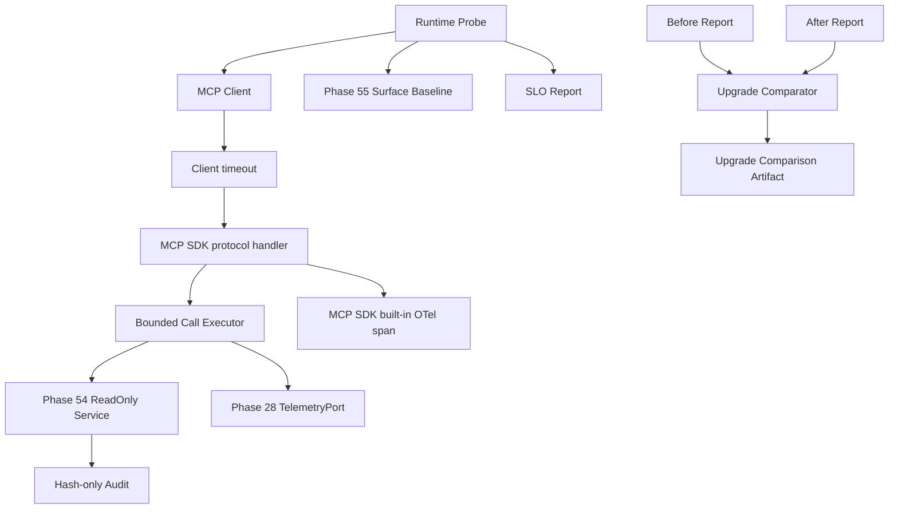

# Phase 56：MCP 业务调用可靠性、运行 SLO 与 SDK 升级演练

> 本章类型：需要修改项目代码、配置和测试，并增加单机运行验收。  
> 前置阶段：Phase 28 Observability、Phase 40 Tool Contract、Phase 53 MCP Client Gateway、
> Phase 54 MCP Server Export、Phase 55 MCP Contract Eval。  
> 当前范围：单机、单用户、字面量 IPv4 loopback。  
> 默认安全状态：不新增 MCP Tool，不开放 Mutation，不自动安装或升级 SDK。  
> 所有新增文件、报告和候选环境都位于
> `/data/tianshaoqi24/agent/paper_reproduction_copilot/` 内。

---

## 一、为什么 Phase 56 不能只做 Telemetry 面板

Phase 55 已经解决“真实 Client 能否发现公开 MCP Surface”：

```text
tools/list
resources/templates/list
resources/list
prompts/list
    -> 规范化 Surface
    -> Golden Baseline
    -> modern / legacy Profile 比较
```

但目录可发现不等于业务调用可靠。编写本章前重新运行实际代码，得到：

```text
Phase 55 专项测试：26 passed

Phase 54 相邻协议测试：
test_server_lists_exactly_four_read_only_tools                 passed
test_status_tool_returns_structured_content                   长时间不结束
```

进一步隔离后确认，在当前环境：

```text
Python      3.10.20
mcp         2.0.0
mcp-types   2.0.0
httpx2      2.9.1
anyio       4.14.0
pydantic    2.13.4
jsonschema  4.26.0
```

观察到两种问题：

1. Client 没有显式读取超时时，`tools/call` 可以无限等待；
2. legacy in-memory 生命周期调用同步 MCP handler 时会超时，而目录读取仍然正常。

第二点是本项目在上述版本组合中的实测结论，不应未经验证推广成所有 MCP SDK 版本都存在的结论。它恰好说明为什么
我们需要业务调用矩阵和 SDK 升级演练，而不能只凭 `tools/list` 判断兼容。

因此 Phase 56 的优先顺序是：

```text
先让调用一定成功或在边界内失败
    -> 再记录延迟、超时和繁忙
    -> 再生成 SLO 报告
    -> 最后做 SDK 升级前后比较
```

---

## 二、本阶段目标

完成后系统应具备以下能力。

### 2.1 有界业务调用

- MCP Client 构造、`tools/call` 和 Resource 读取都有硬超时；
- Server 的同步 Service 不直接交给 SDK 默认线程池；
- 使用 Server lifespan 管理专用、有限大小的线程池；
- 线程池和等待队列满时快速返回稳定 `MCP_EXPORT_BUSY`；
- handler 等待超时时返回稳定 `MCP_EXPORT_TIMEOUT`；
- 超时和取消不会让新的任务无限进入队列；
- Server 停止时拒绝新调用并取消尚未开始的 Future。

### 2.2 业务兼容矩阵

至少验证：

```text
in-memory-modern
    -> 4 个 Tool + 2 个 Resource

in-memory-legacy
    -> 4 个 Tool + 2 个 Resource

loopback-http
    -> Bearer + Streamable HTTP + 4 个 Tool + 2 个 Resource
```

每个调用只保存状态、耗时、稳定错误类型和输出 Hash，不保存报告正文、Evidence、Token 或 Query 原文。

### 2.3 轻量运行 SLO

由确定性 Probe Report 判断：

- 必需 Profile 是否全部运行；
- 必需 Operation 是否全部覆盖；
- 成功率是否达到阈值；
- P95 是否低于阈值；
- Surface 是否仍匹配 Phase 55 Baseline；
- 是否出现超时、繁忙、结构错误或 Secret 泄漏；
- MCP SDK major 和协议版本是否仍在允许范围内。

### 2.4 SDK 升级演练

程序只比较两个已经生成的报告：

```text
before.json  当前受信环境
after.json   候选 SDK 环境
    -> Surface 比较
    -> Profile / Operation 覆盖比较
    -> 成功率比较
    -> 绝对延迟和相对退化比较
    -> 生成 comparison.json
```

程序不执行 `pip install`、不创建 Conda 环境、不修改 `pyproject.toml`，也不自动接受候选 SDK。

---

## 三、本阶段明确不做什么

本阶段不实现：

- MCP Shell、Patch、Approval、Cancel、Rerun 或任意 Mutation Tool；
- 公网 MCP Endpoint；
- Prometheus、Grafana、Jaeger、Tempo 等新服务；
- Redis、消息队列或多主机聚合；
- 使用 Job ID、Request ID、Token 或 Query 作为 Metric Label；
- 在 SLO 报告中保存 Tool/Resource 原始输出；
- 用 LLM 判断 SDK 是否兼容；
- 自动安装候选 SDK；
- 自动覆盖 Phase 55 Contract Baseline；
- 因为 legacy 路径不稳定就直接删除 legacy 测试；
- 为了让测试通过而关闭 Bearer 认证；
- 用没有超时的 `pytest` 命令等待协议测试；
- 创建 `/tmp` 下的项目临时文件或项目外虚拟环境。

---

## 四、必须保持的不变量

### 4.1 Catalog 不是 Invocation

```text
tools/list 成功
    不代表 tools/call 成功

Resource Template 存在
    不代表 resources/read 成功
```

Release 门禁必须同时验证 Surface 和业务调用。

### 4.2 Timeout 是契约，不是测试技巧

每次外部等待必须有上限。测试外层的 `timeout 30s pytest ...` 只能防止整个进程无限挂起，不能替代 Client
和单次 Operation 自己的超时。

### 4.3 指标不是审计

```text
Telemetry
    低成本聚合：调用数、结果、耗时、繁忙、超时

Phase 54 Audit
    调用身份、输入/输出 Hash、稳定错误、Job 绑定

Phase 56 Probe Report
    Client 视角的兼容性和 SLO 证据
```

三者用途不同，不能互相冒充。

### 4.4 超时不能杀死 Python 线程

`asyncio.wait_for()` 可以停止等待，但不能安全终止已经运行的 Python 线程。因此本阶段采用：

```text
有限 worker
+ 有限 queue
+ 快速 busy
+ Client/handler timeout
+ 独立 MCP Export 进程
```

如果底层本地调用永久卡死，最终硬隔离仍是停止独立 MCP Export 进程，而不是在线程中强杀代码。

### 4.5 SDK Upgrade 不能隐式改变 Authority

候选 SDK 即使 Surface 和性能都通过，也不能新增 Tool、扩大参数、允许远程地址或关闭认证。Phase 55 Baseline、
Phase 54 Authority Test 和 Phase 56 Runtime Report 必须同时通过。

---

## 五、真实基线与阶段判断

### 5.1 Phase 55 已完成的部分

当前存在：

```text
app/mcp_contracts/
config/mcp_export_contract_baseline.json
config/mcp_client_profiles.example.json
tests/test_mcp_contract_*.py
```

Phase 55 九组专项测试实际为：

```text
26 passed in 6.05s
```

说明 Surface Snapshot、Candidate/Baseline、Profile、Golden 和 Readiness 已经实现。

### 5.2 仍未闭环的部分

当前已提交 Baseline 的：

```json
"required_profile_ids": [
  "in-memory-legacy",
  "in-memory-modern"
]
```

它还不是包含 `loopback-http` 的最终 Release Baseline。同时，Phase 54 的真实 `tools/call` 测试会卡住。因此本章
必须先完成调用修复，再完成真实 HTTP Candidate 和最终 Promotion。

### 5.3 为什么不把 Phase 55 状态直接写成失败

Phase 55 的“协议目录契约”已经通过；失败的是它没有覆盖的“业务调用生命周期”。正确表述应是：

```text
Phase 55 Contract Surface：已实现
MCP Business Invocation Closure：待 Phase 56 完成
```

这样既不抹掉已有成果，也不把部分通过说成整个 MCP Runtime 已完成。

---

## 六、总体架构



核心调用路径：

```text
MCP request
    -> SDK 校验 Input Schema
    -> async handler
    -> 从 lifespan 取得专用 Call Executor
    -> 非阻塞申请 worker/queue slot
    -> asyncio 专用 ThreadPoolExecutor 执行同步 Service
    -> Phase 54 Service 校验 Job/Artifact/Evidence 并写 Audit
    -> Pydantic 输出
    -> SDK 生成 structured_content
    -> Client 在 deadline 内验证结果
```

---

## 七、文件变更总览

### 7.1 需要新增

```text
app/mcp_export/call_executor.py

app/mcp_operations/__init__.py
app/mcp_operations/errors.py
app/mcp_operations/schemas.py
app/mcp_operations/identity.py
app/mcp_operations/policy.py
app/mcp_operations/probe.py
app/mcp_operations/repository.py
app/mcp_operations/upgrade.py
app/mcp_operations/commands.py

config/mcp_runtime_policy.json
constraints/mcp-runtime.txt

tests/test_mcp_export_call_executor.py
tests/test_mcp_runtime_policy.py
tests/test_mcp_runtime_probe.py
tests/test_mcp_runtime_repository.py
tests/test_mcp_runtime_http.py
tests/test_mcp_runtime_upgrade.py
tests/test_mcp_runtime_authority.py
```

### 7.2 需要修改

```text
app/config.py
app/mcp_export/errors.py
app/mcp_export/server.py
app/mcp_export/factory.py
app/mcp_export/asgi.py
app/observability/in_memory.py
app/mcp_contracts/schemas.py
app/mcp_contracts/readiness.py
app/main.py

tests/test_mcp_export_server.py
tests/test_mcp_contract_readiness.py

.env.example
.gitignore
pyproject.toml
```

### 7.3 不允许修改

```text
app/execution/
app/repair/
app/nodes/human_review_node.py
app/nodes/executor_node.py
app/resources/worker.py
app/research_browser/
```

本阶段只提高只读 MCP Runtime 的可靠性，不能接触复现副作用 Authority。

---

## 八、锁定当前已验证依赖

### 8.1 需要新增：`constraints/mcp-runtime.txt`

```text
# Phase 56 当前受信 MCP Runtime。升级必须先生成 before/after 报告。
mcp==2.0.0
mcp-types==2.0.0
httpx2==2.9.1
anyio==4.14.0
pydantic==2.13.4
jsonschema==4.26.0
uvicorn==0.49.0
```

该文件记录“本项目实际验证过的组合”，不是声称这些版本永远最好。

### 8.2 必须修改：`pyproject.toml`

保留运行时兼容范围：

```toml
mcp = [
    "mcp>=2.0,<3",
    "httpx2>=2.7,<3",
    "jsonschema>=4.23,<5",
    "uvicorn>=0.30,<1",
]
```

开发环境也保留范围，不直接改成永远固定 `2.0.0`：

```toml
dev = [
    "pytest>=8",
    "ruff>=0.6",
    "httpx2>=2.7,<3",
    "mcp>=2.0,<3",
    "jsonschema>=4.23,<5",
    "uvicorn>=0.30,<1",
]
```

日常受信安装使用 constraints：

```bash
cd /data/tianshaoqi24/agent/paper_reproduction_copilot
conda activate agent
python -m pip install -e '.[dev,mcp]' \
  -c constraints/mcp-runtime.txt
```

依赖范围表达代码兼容意图，constraints 表达当前运行身份。两者不能只保留一个。

---

## 九、增加配置

### 9.1 必须修改：`app/config.py`

在 Phase 55 MCP Contract 配置之后增加。下面是 `Settings` 类内部字段，保留一级缩进：

```text
    # Phase 56：MCP handler 有界执行、Runtime Policy 和派生报告。
    mcp_export_handler_workers: int = int(
        os.getenv("MCP_EXPORT_HANDLER_WORKERS", "4")
    )
    mcp_export_handler_queue: int = int(
        os.getenv("MCP_EXPORT_HANDLER_QUEUE", "8")
    )
    mcp_export_handler_timeout_seconds: float = float(
        os.getenv("MCP_EXPORT_HANDLER_TIMEOUT_SECONDS", "10")
    )
    mcp_runtime_policy_path: Path = Path(
        os.getenv(
            "MCP_RUNTIME_POLICY_PATH",
            "config/mcp_runtime_policy.json",
        )
    )
    mcp_runtime_report_root: Path = Path(
        os.getenv(
            "MCP_RUNTIME_REPORT_ROOT",
            "analysis/mcp_runtime",
        )
    )
```

在 Phase 55 集中校验之后增加：

```python
# Phase 56 MCP handler 和 Runtime Policy 校验。
if not 1 <= settings.mcp_export_handler_workers <= 16:
    raise ValueError("MCP_EXPORT_HANDLER_WORKERS 必须位于 1..16")
if not 0 <= settings.mcp_export_handler_queue <= 64:
    raise ValueError("MCP_EXPORT_HANDLER_QUEUE 必须位于 0..64")
if not 0.1 <= settings.mcp_export_handler_timeout_seconds <= 60:
    raise ValueError(
        "MCP_EXPORT_HANDLER_TIMEOUT_SECONDS 必须位于 0.1..60"
    )

for field_name, configured_path in (
    ("MCP_RUNTIME_POLICY_PATH", settings.mcp_runtime_policy_path),
    ("MCP_RUNTIME_REPORT_ROOT", settings.mcp_runtime_report_root),
):
    resolved_path = configured_path.expanduser().resolve()
    if (
        resolved_path == model_allowed_root
        or model_allowed_root not in resolved_path.parents
    ):
        raise ValueError(f"{field_name} 必须位于 ALLOWED_ROOT 内")
    if field_name == "MCP_RUNTIME_POLICY_PATH":
        settings.mcp_runtime_policy_path = resolved_path
    else:
        settings.mcp_runtime_report_root = resolved_path

settings.mcp_runtime_report_root.mkdir(
    parents=True,
    exist_ok=True,
)
```

### 9.2 必须修改：`.env.example`

在 Phase 55 配置后增加：

```dotenv

# Phase 56 bounded MCP invocation and runtime evaluation.
MCP_EXPORT_HANDLER_WORKERS=4
MCP_EXPORT_HANDLER_QUEUE=8
MCP_EXPORT_HANDLER_TIMEOUT_SECONDS=10
MCP_RUNTIME_POLICY_PATH=config/mcp_runtime_policy.json
MCP_RUNTIME_REPORT_ROOT=analysis/mcp_runtime
```

### 9.3 必须修改：`.gitignore`

增加：

```gitignore
# Phase 56: derived runtime reports and project-local candidate environments.
analysis/mcp_runtime/
.runtime_envs/
```

不要忽略：

```text
config/mcp_runtime_policy.json
constraints/mcp-runtime.txt
```

---

## 十、增加稳定错误

### 10.1 必须修改：`app/mcp_export/errors.py`

在 `McpExportRateLimited` 后增加：

```python
class McpExportBusy(McpExportError):
    code = "MCP_EXPORT_BUSY"
    public_message = "MCP Export is temporarily busy"


class McpExportTimedOut(McpExportError):
    code = "MCP_EXPORT_TIMEOUT"
    public_message = "MCP Export request timed out"
```

错误语义：

| 错误 | 含义 | Client 是否可重试 |
|---|---|---|
| `MCP_EXPORT_BUSY` | worker 和有限 queue 已满，本次没有开始业务调用 | 可以退避后重试 |
| `MCP_EXPORT_TIMEOUT` | handler 已超过本地 deadline，底层线程可能仍在收尾 | 可以稍后重试，但不能立即并发轰炸 |
| `MCP_EXPORT_RATE_LIMITED` | actor 的一分钟调用预算已耗尽 | 等待窗口恢复 |
| `MCP_EXPORT_INTERNAL` | 未分类内部故障 | 不应盲目重试 |

Busy 与 Rate Limit 不同：前者保护瞬时执行容量，后者限制长期调用频率。

---

## 十一、实现有界 MCP Call Executor

### 11.1 需要新增：`app/mcp_export/call_executor.py`

```python
from __future__ import annotations

import asyncio
import sys
import threading
from collections.abc import AsyncIterator, Callable
from concurrent.futures import ThreadPoolExecutor
from contextlib import asynccontextmanager, contextmanager
from dataclasses import dataclass
from functools import partial
from time import perf_counter
from typing import TypeVar

from app.mcp_export.errors import (
    McpExportBusy,
    McpExportTimedOut,
)
from app.observability.context import short_secret_hash
from app.observability.instrumentation import (
    increment_counter_safe,
    record_span_exception_safe,
)
from app.observability.noop import NoOpSpan
from app.observability.ports import TelemetryPort


ResultT = TypeVar("ResultT")


@dataclass(frozen=True)
class McpExportServerContext:
    """MCPServer lifespan 向每个 handler 提供的受控运行资源。"""

    calls: "McpExportCallExecutor"


@contextmanager
def _safe_span(
    telemetry: TelemetryPort,
    *,
    attributes: dict[str, str],
):
    """Span 后端完全失败时退回 NoOp，不改变业务结果。"""

    manager = None
    span = NoOpSpan()
    try:
        manager = telemetry.span(
            "mcp.export.invoke",
            attributes=attributes,
        )
        span = manager.__enter__()
    except Exception:
        manager = None

    try:
        yield span
    finally:
        if manager is not None:
            try:
                manager.__exit__(*sys.exc_info())
            except Exception:
                pass


class McpExportCallExecutor:
    """用独立线程池执行同步 Service，并限制 worker 与等待队列。"""

    def __init__(
        self,
        *,
        workers: int,
        queue_capacity: int,
        timeout_seconds: float,
        telemetry: TelemetryPort,
    ) -> None:
        if workers < 1:
            raise ValueError("workers must be positive")
        if queue_capacity < 0:
            raise ValueError("queue_capacity must not be negative")
        if timeout_seconds <= 0:
            raise ValueError("timeout_seconds must be positive")

        self.timeout_seconds = timeout_seconds
        self.telemetry = telemetry
        self._executor = ThreadPoolExecutor(
            max_workers=workers,
            thread_name_prefix="mcp-export-call",
        )
        # slot 数量等于正在执行的 worker 加允许等待的有限 queue。
        self._slots = threading.BoundedSemaphore(
            workers + queue_capacity
        )
        self._state_lock = threading.Lock()
        self._closed = False

    def _is_closed(self) -> bool:
        with self._state_lock:
            return self._closed

    def close(self) -> None:
        """停止接收新任务；不在线程内强杀已经运行的 Python 代码。"""

        with self._state_lock:
            if self._closed:
                return
            self._closed = True
        self._executor.shutdown(
            wait=False,
            cancel_futures=True,
        )

    def _record_metric(
        self,
        *,
        operation: str,
        outcome: str,
        duration_seconds: float,
    ) -> None:
        attributes = {
            "operation": operation,
            "outcome": outcome,
        }
        increment_counter_safe(
            self.telemetry,
            "paper_copilot_mcp_export_calls_total",
            attributes=attributes,
        )
        try:
            self.telemetry.histogram(
                "paper_copilot_mcp_export_duration_seconds",
                value=duration_seconds,
                attributes=attributes,
            )
        except Exception:
            # Telemetry 失败不能改变 MCP 业务结果。
            pass

    async def run(
        self,
        *,
        operation: str,
        request_id: str,
        job_id: str,
        function: Callable[..., ResultT],
        **kwargs: object,
    ) -> ResultT:
        if self._is_closed():
            raise McpExportBusy("MCP Export executor is closed")

        acquired = self._slots.acquire(blocking=False)
        if not acquired:
            self._record_metric(
                operation=operation,
                outcome="busy",
                duration_seconds=0.0,
            )
            raise McpExportBusy("MCP Export executor queue is full")

        started = perf_counter()
        outcome = "succeeded"
        loop = asyncio.get_running_loop()

        try:
            future = loop.run_in_executor(
                self._executor,
                partial(function, **kwargs),
            )
        except Exception:
            self._slots.release()
            raise

        # wait_for 超时只停止等待。slot 必须在真实 Future 结束后释放，
        # 否则超时线程仍在运行时新任务会突破容量边界。
        def release_slot(completed) -> None:
            self._slots.release()
            if completed.cancelled():
                return
            try:
                # 超时后也读取晚到异常，避免 un-retrieved Future 警告。
                completed.exception()
            except Exception:
                pass

        future.add_done_callback(release_slot)

        span_attributes = {
            "mcp.operation": operation,
            "mcp.request_id_hash": short_secret_hash(request_id) or "none",
            "mcp.job_id_hash": short_secret_hash(job_id) or "none",
        }
        with _safe_span(
            self.telemetry,
            attributes=span_attributes,
        ) as span:
            try:
                return await asyncio.wait_for(
                    asyncio.shield(future),
                    timeout=self.timeout_seconds,
                )
            except asyncio.TimeoutError as exc:
                outcome = "timeout"
                try:
                    record_span_exception_safe(
                        span,
                        exc,
                        attributes={
                            "error_code": "MCP_EXPORT_TIMEOUT"
                        },
                    )
                except Exception:
                    pass
                raise McpExportTimedOut(
                    "MCP Export handler deadline exceeded"
                ) from None
            except asyncio.CancelledError:
                outcome = "cancelled"
                try:
                    span.add_event(
                        "mcp.export.cancelled",
                        attributes={"operation": operation},
                    )
                except Exception:
                    pass
                raise
            except Exception as exc:
                outcome = "failed"
                try:
                    record_span_exception_safe(span, exc)
                except Exception:
                    pass
                raise
            finally:
                duration = max(0.0, perf_counter() - started)
                try:
                    span.set_attribute("mcp.outcome", outcome)
                    span.set_attribute(
                        "mcp.duration_seconds",
                        duration,
                    )
                except Exception:
                    pass
                self._record_metric(
                    operation=operation,
                    outcome=outcome,
                    duration_seconds=duration,
                )


def build_mcp_export_lifespan(
    *,
    workers: int,
    queue_capacity: int,
    timeout_seconds: float,
    telemetry: TelemetryPort,
):
    """返回 MCPServer 所需的 async lifespan callback。"""

    @asynccontextmanager
    async def lifespan(_server) -> AsyncIterator[McpExportServerContext]:
        calls = McpExportCallExecutor(
            workers=workers,
            queue_capacity=queue_capacity,
            timeout_seconds=timeout_seconds,
            telemetry=telemetry,
        )
        try:
            yield McpExportServerContext(calls=calls)
        finally:
            calls.close()

    return lifespan
```

### 11.2 执行器伪代码

```text
如果执行器已经关闭
    拒绝调用

尝试非阻塞申请一个容量 slot
如果 worker 和 queue 都已满
    记录 busy 指标
    返回稳定 busy 错误

把同步 Service 提交到专用 ThreadPoolExecutor
Future 真正结束时才释放 slot

在 Telemetry span 中等待 Future
如果在 deadline 内完成
    返回结果
如果超时
    停止等待但不谎称线程已停止
    记录 timeout
    返回稳定 timeout 错误
如果 Client 取消
    记录 cancelled
    继续传播取消
如果业务异常
    记录清洗后的异常类型
    继续交给 Phase 54 公开错误映射

记录低基数调用数和耗时
```

### 11.3 为什么不用 SDK 默认线程池

官方 SDK v2 会把同步 handler 放到 worker thread。当前版本组合下，legacy in-memory 路径调用同步 handler 实测会
超时。把 MCP handler 改成 `async def`，再由本项目自己的 `asyncio` 专用 Executor 调用同步 Service，可以：

- 明确 worker 数量；
- 明确 queue 上限；
- 统一 deadline；
- 在 modern、legacy 和 HTTP 三条路径使用相同业务执行边界；
- 不依赖 SDK 内部线程池的实现细节。

这不是通用地宣称“SDK 默认线程池错误”，而是为当前项目建立可测试、可替换的适配层。

---

## 十二、登记 MCP 低基数指标

### 12.1 必须修改：`app/observability/in_memory.py`

在 `ALLOWED_METRIC_ATTRIBUTES` 定义后增加：

```python
# Phase 56：MCP 指标只允许固定 operation/outcome，不允许 Job 或请求身份。
ALLOWED_METRIC_ATTRIBUTES.update(
    {
        "paper_copilot_mcp_export_calls_total": frozenset(
            {"operation", "outcome"}
        ),
        "paper_copilot_mcp_export_duration_seconds": frozenset(
            {"operation", "outcome"}
        ),
    }
)
```

允许的 `operation` 只能来自代码中的六个固定操作；允许的 `outcome` 为：

```text
succeeded
failed
timeout
busy
cancelled
```

不要加入：

```text
job_id
run_id
request_id
token_hash
query
endpoint
exception_message
```

Metric Label 会参与时序聚合，不能承载高基数或敏感身份。Request/Job 的短 Hash 只进入 Span Attribute，不进入
Metric。

---

## 十三、把 MCP handler 改成受控异步适配层

### 13.1 必须修改：`app/mcp_export/server.py`

该文件涉及六个 handler 和 lifespan，局部修改容易漏掉 Resource。建议用下面内容完整替换：

```python
from __future__ import annotations

import json
from collections.abc import Callable
from typing import Annotated, Any, NoReturn
from uuid import uuid4

from pydantic import Field

from app.config import settings
from app.mcp_export.call_executor import (
    McpExportServerContext,
    build_mcp_export_lifespan,
)
from app.mcp_export.errors import McpExportError
from app.mcp_export.schemas import (
    McpExportArtifactPage,
    McpExportEvidencePack,
    McpExportFinalReport,
    McpExportJobStatus,
)
from app.mcp_export.service import ReadOnlyMcpExportService
from app.observability.ports import TelemetryPort
from app.observability.runtime import build_telemetry_runtime


def _request_id(ctx) -> str:
    raw = getattr(ctx, "request_id", None)
    normalized = str(raw).strip() if raw is not None else ""
    return normalized[:200] or f"mcp_{uuid4().hex[:24]}"


def _resource_request_id(kind: str) -> str:
    return f"mcp_resource_{kind}_{uuid4().hex[:16]}"


def _raise_public_error(exc: BaseException) -> NoReturn:
    """只把稳定 code 和公开消息交给 MCP Client。"""

    if isinstance(exc, McpExportError):
        raise RuntimeError(
            f"{exc.code}: {exc.public_message}"
        ) from None
    raise RuntimeError(
        "MCP_EXPORT_INTERNAL: MCP Export internal error"
    ) from None


async def _invoke(
    ctx,
    *,
    metric_operation: str,
    metric_job_id: str,
    metric_request_id: str,
    function: Callable[..., Any],
    function_kwargs: dict[str, object],
):
    """把观测字段与业务函数参数分开，避免同名关键字冲突。"""

    runtime: McpExportServerContext = (
        ctx.request_context.lifespan_context
    )
    return await runtime.calls.run(
        operation=metric_operation,
        request_id=metric_request_id,
        job_id=metric_job_id,
        function=function,
        **function_kwargs,
    )


def build_mcp_export_server(
    service: ReadOnlyMcpExportService,
    *,
    telemetry: TelemetryPort | None = None,
):
    # 动态 import 保证 MCP_EXPORT_ENABLED=false 时普通 CLI/API 不依赖 SDK。
    from mcp.server import MCPServer
    from mcp.server.mcpserver import Context
    from starlette.requests import Request
    from starlette.responses import JSONResponse, Response

    # from __future__ import annotations 会把 Context 注解保存为字符串。
    # SDK 注册 Tool 时会在模块 globals 中解析它。
    globals()["Context"] = Context

    selected_telemetry = (
        telemetry
        if telemetry is not None
        else build_telemetry_runtime().telemetry
    )
    lifespan = build_mcp_export_lifespan(
        workers=settings.mcp_export_handler_workers,
        queue_capacity=settings.mcp_export_handler_queue,
        timeout_seconds=(
            settings.mcp_export_handler_timeout_seconds
        ),
        telemetry=selected_telemetry,
    )
    mcp = MCPServer(
        "Paper Reproduction Copilot Read-only Export",
        version="phase54-v1",
        lifespan=lifespan,
    )

    @mcp.tool()
    async def get_reproduction_status(
        job_id: Annotated[
            str,
            Field(
                description=(
                    "Server-generated reproduction Job ID: "
                    "job_ followed by 32 lowercase hex characters"
                ),
                pattern=r"^job_[0-9a-f]{32}$",
            ),
        ],
        ctx: Context[McpExportServerContext],
    ) -> McpExportJobStatus:
        """Read a bounded public status snapshot for one known Job."""

        request_id = _request_id(ctx)
        try:
            return await _invoke(
                ctx,
                metric_operation="get_reproduction_status",
                metric_job_id=job_id,
                metric_request_id=request_id,
                function=service.get_status,
                function_kwargs={
                    "job_id": job_id,
                    "request_id": request_id,
                },
            )
        except Exception as exc:
            _raise_public_error(exc)

    @mcp.tool()
    async def list_reproduction_artifacts(
        job_id: Annotated[
            str,
            Field(pattern=r"^job_[0-9a-f]{32}$"),
        ],
        ctx: Context[McpExportServerContext],
        limit: Annotated[int, Field(ge=1, le=100)] = 20,
    ) -> McpExportArtifactPage:
        """List bounded public Artifact metadata without paths."""

        request_id = _request_id(ctx)
        try:
            return await _invoke(
                ctx,
                metric_operation="list_reproduction_artifacts",
                metric_job_id=job_id,
                metric_request_id=request_id,
                function=service.list_artifacts,
                function_kwargs={
                    "job_id": job_id,
                    "limit": limit,
                    "request_id": request_id,
                },
            )
        except Exception as exc:
            _raise_public_error(exc)

    @mcp.tool()
    async def read_reproduction_final_report(
        job_id: Annotated[
            str,
            Field(pattern=r"^job_[0-9a-f]{32}$"),
        ],
        ctx: Context[McpExportServerContext],
    ) -> McpExportFinalReport:
        """Read the server-selected, integrity-checked final report."""

        request_id = _request_id(ctx)
        try:
            return await _invoke(
                ctx,
                metric_operation="read_reproduction_final_report",
                metric_job_id=job_id,
                metric_request_id=request_id,
                function=service.read_final_report,
                function_kwargs={
                    "job_id": job_id,
                    "request_id": request_id,
                },
            )
        except Exception as exc:
            _raise_public_error(exc)

    @mcp.tool()
    async def search_reproduction_evidence(
        job_id: Annotated[
            str,
            Field(pattern=r"^job_[0-9a-f]{32}$"),
        ],
        query: Annotated[
            str,
            Field(
                min_length=1,
                max_length=500,
                description=(
                    "Question used only to rank local Job, Event, "
                    "Artifact and Log evidence"
                ),
            ),
        ],
        ctx: Context[McpExportServerContext],
        limit: Annotated[int, Field(ge=1, le=6)] = 5,
    ) -> McpExportEvidencePack:
        """Search bounded local evidence and return citations."""

        request_id = _request_id(ctx)
        try:
            return await _invoke(
                ctx,
                metric_operation="search_reproduction_evidence",
                metric_job_id=job_id,
                metric_request_id=request_id,
                function=service.search_evidence,
                function_kwargs={
                    "job_id": job_id,
                    "query": query,
                    "limit": limit,
                    "request_id": request_id,
                },
            )
        except Exception as exc:
            _raise_public_error(exc)

    @mcp.resource(
        "repro://jobs/{job_id}/status",
        mime_type="application/json",
    )
    async def job_status_resource(
        job_id: str,
        ctx: Context[McpExportServerContext],
    ) -> str:
        """Public status Resource for one known Job."""

        request_id = _resource_request_id("status")
        try:
            result = await _invoke(
                ctx,
                metric_operation="resource_job_status",
                metric_job_id=job_id,
                metric_request_id=request_id,
                function=service.get_status,
                function_kwargs={
                    "job_id": job_id,
                    "request_id": request_id,
                    "operation": "resource_job_status",
                },
            )
            return json.dumps(
                result.model_dump(mode="json"),
                ensure_ascii=False,
                sort_keys=True,
                separators=(",", ":"),
            )
        except Exception as exc:
            _raise_public_error(exc)

    @mcp.resource(
        "repro://jobs/{job_id}/final-report",
        mime_type="application/json",
    )
    async def final_report_resource(
        job_id: str,
        ctx: Context[McpExportServerContext],
    ) -> str:
        """Integrity-bound JSON projection of one final report."""

        request_id = _resource_request_id("report")
        try:
            result = await _invoke(
                ctx,
                metric_operation="resource_final_report",
                metric_job_id=job_id,
                metric_request_id=request_id,
                function=service.read_final_report,
                function_kwargs={
                    "job_id": job_id,
                    "request_id": request_id,
                    "operation": "resource_final_report",
                },
            )
            return json.dumps(
                result.model_dump(mode="json"),
                ensure_ascii=False,
                sort_keys=True,
                separators=(",", ":"),
            )
        except Exception as exc:
            _raise_public_error(exc)

    @mcp.custom_route("/healthz", methods=["GET"])
    async def healthz(_request: Request) -> Response:
        return JSONResponse(
            {
                "status": "ok",
                "service": "paper-reproduction-mcp-export",
                "version": "phase54-v1",
            }
        )

    return mcp
```

### 13.2 为什么 Resource 也显式接收 `Context`

当前项目锁定并实际验证的 `mcp==2.0.0` 没有公开的 `MCPServer.get_context()`。Resource Template
会识别 `Context` 类型参数，在真正读取 Resource 时注入当前请求上下文，因此直接写成：

```python
async def job_status_resource(
    job_id: str,
    ctx: Context[McpExportServerContext],
) -> str:
    ...
```

`Context` 不会进入 Resource URI 参数 Schema。不要读取 `_lowlevel_server`、ContextVar 或其他 SDK 私有字段，
也不要把 Tool 的 `ctx` 保存到全局变量后供 Resource 复用。

### 13.3 为什么 `_invoke()` 使用 `function_kwargs`

`operation`、`job_id` 和 `request_id` 同时可能是观测字段和业务函数参数。如果把两组参数都通过 `**kwargs`
传入，Python 会因为重复关键字直接报错。这里明确拆成两组：

```text
metric_*        只用于 Span、Metric 和执行器边界
function_kwargs 只传给 ReadOnlyMcpExportService
```

Resource 的 `metric_operation="resource_job_status"` 与业务参数
`function_kwargs["operation"]="resource_job_status"` 值相同，但承担的职责不同，因此必须分别书写。

### 13.4 为什么 Tool Schema 不应变化

本次只把：

```text
def handler(...)
```

改为：

```text
async def handler(...)
```

参数和返回注解保持不变，因此 Phase 55 Surface Hash 理论上不应变化。必须用 Golden Test 证明，不能只靠推断。

---

## 十四、把 Telemetry 实例接入独立 MCP 进程

### 14.1 必须修改：`app/mcp_export/factory.py`

在 import 区增加：

```python
from app.observability.ports import TelemetryPort
from app.observability.runtime import build_telemetry_runtime
```

把 Runtime 模型改为：

```python
@dataclass(frozen=True)
class McpExportRuntime:
    service: ReadOnlyMcpExportService
    audit_repository: SqliteMcpExportAuditRepository
    telemetry: TelemetryPort
```

把工厂签名改为可注入 Telemetry：

```python
def build_mcp_export_runtime(
    *,
    telemetry: TelemetryPort | None = None,
) -> McpExportRuntime:
    if not settings.mcp_export_enabled:
        raise McpExportDisabled("MCP Export is disabled")

    selected_telemetry = (
        telemetry
        if telemetry is not None
        else build_telemetry_runtime().telemetry
    )

    # 保留原有 storage、JobService、InteractionService、ArtifactDelivery、
    # Evidence Registry、Audit、RateLimiter 和 SecretRedactor 构造代码。
    # 本节不改变这些 Authority 依赖。
```

原函数末尾的返回改为：

```text
    return McpExportRuntime(
        service=service,
        audit_repository=audit,
        telemetry=selected_telemetry,
    )
```

不要删除原工厂中对 `MCP_GATEWAY`、Research Browser 和 Mutation 依赖的显式隔离。

### 14.2 必须修改：`app/mcp_export/asgi.py`

找到：

```python
server = build_mcp_export_server(selected_runtime.service)
```

替换为：

```python
server = build_mcp_export_server(
    selected_runtime.service,
    telemetry=selected_runtime.telemetry,
)
```

这样独立 MCP Export 进程和其 handler 使用同一个 Phase 28 Telemetry Runtime。

### 14.3 不重复安装 MCP OpenTelemetry Middleware

MCP SDK v2 已经为每个入站消息创建 OpenTelemetry Server Span。项目自己的 `mcp.export.invoke` Span 位于业务适配层：

```text
SDK span: tools/call get_reproduction_status
    -> app span: mcp.export.invoke
        -> Phase 54 Service
```

不要再手工向 `MCPServer.middleware` 添加第二个 SDK OpenTelemetry Middleware，否则会产生重复 Span。项目已有的
`OTelTelemetry` 负责配置 Provider/Exporter，SDK 内置 Middleware 会复用全局 Provider。

---

## 十五、为所有 Client 调用增加明确 deadline

### 15.1 必须修改：`app/mcp_contracts/snapshot.py`

修改 `observe_in_memory()` 签名：

```python
async def observe_in_memory(
    server,
    *,
    profile: McpClientProfile,
    timeout_seconds: float = 5.0,
) -> McpSurfaceObservation:
    if profile.transport != "in_memory":
        raise McpSurfaceObservationFailed("profile transport mismatch")

    try:
        from mcp import Client
    except ImportError as exc:
        raise McpContractDependencyMissing(
            "install project dev/mcp extras"
        ) from exc

    async with Client(
        server,
        mode=profile.mode,
        raise_exceptions=True,
        read_timeout_seconds=timeout_seconds,
    ) as client:
        return await observe_connected_client(client, profile=profile)
```

`observe_streamable_http()` 中创建 Client 时也传入：

```python
async with Client(
    transport,
    mode=profile.mode,
    read_timeout_seconds=timeout_seconds,
) as client:
    return await observe_connected_client(client, profile=profile)
```

HTTP 的 `httpx2.Timeout` 和 MCP Client 的 `read_timeout_seconds` 是两个边界：

```text
httpx2 timeout
    约束 connect/write/read/pool

MCP Client read timeout
    约束一次协议 request 等待
```

两者都要设置。

### 15.2 必须修改：`tests/test_mcp_export_server.py`

所有 `mcp.Client(server)` 改为：

```python
async with mcp.Client(
    server,
    raise_exceptions=True,
    read_timeout_seconds=3,
) as client:
    ...
```

每次 Tool 调用也显式设置：

```python
result = await client.call_tool(
    "get_reproduction_status",
    {"job_id": JOB_ID},
    read_timeout_seconds=3,
)
```

测试外层仍建议使用：

```bash
timeout 30s python -m pytest -vv \
  tests/test_mcp_export_server.py
```

外层 30 秒负责发现生命周期泄漏，单次 3 秒负责定位具体协议调用。

---

## 十六、增加 modern/legacy 业务调用回归

### 16.1 必须修改：`tests/test_mcp_export_server.py`

在现有 Surface Profile 测试后增加：

```python
@pytest.mark.parametrize(
    "mode",
    ["auto", "legacy"],
)
async def test_status_tool_invokes_in_approved_client_modes(
    tmp_path,
    mode: str,
) -> None:
    from app.mcp_export.server import build_mcp_export_server

    service, _audit, _delivery, _registry = build_test_service(tmp_path)
    server = build_mcp_export_server(service)

    async with mcp.Client(
        server,
        mode=mode,
        raise_exceptions=True,
        read_timeout_seconds=3,
    ) as client:
        # 先读取目录，让 Client 缓存 Tool Output Schema。
        await client.list_tools()
        result = await client.call_tool(
            "get_reproduction_status",
            {"job_id": JOB_ID},
            read_timeout_seconds=3,
        )

    assert result.is_error is not True
    assert result.structured_content is not None
    assert result.structured_content["job_id"] == JOB_ID
```

### 16.2 为什么调用前先 `list_tools()`

Client 会使用 Tool 声明的 Output Schema 重新验证成功结果。显式先列目录有三个好处：

1. 调用前就能发现 Tool 不存在或 Schema 缺失；
2. Client 不需要在结果校验阶段隐式刷新目录；
3. 测试失败时能区分 Catalog 阶段和 Invocation 阶段。

这不是为了绕过协议；真实 Host 本来也会先发现 Tool 再调用。

### 16.3 第一轮验收命令

```bash
cd /data/tianshaoqi24/agent/paper_reproduction_copilot
conda activate agent
timeout 30s python -m pytest -vv \
  tests/test_mcp_export_server.py
```

验收条件：

```text
0 failed
0 skipped
命令在 30 秒内自然退出
auto 和 legacy 的 tools/call 都通过
```

如果 legacy 仍然超时，先检查 Tool 是否已经变成 `async def`，以及它是否确实通过
`McpExportCallExecutor` 的专用 `ThreadPoolExecutor` 执行。不要删除 legacy 参数来让测试变绿。

---

## 十七、定义 Runtime Policy 与 Report Schema

### 17.1 需要新增：`app/mcp_operations/__init__.py`

```python
"""Phase 56 MCP 业务调用探测、SLO 和 SDK 升级演练。"""
```

### 17.2 需要新增：`app/mcp_operations/schemas.py`

本文件同时定义策略、单次调用记录、聚合结果、Runtime Report 和升级比较结果。完整内容如下：

```python
from __future__ import annotations

from typing import Literal

from pydantic import (
    BaseModel,
    ConfigDict,
    Field,
    model_validator,
)

from app.mcp_contracts.schemas import McpRuntimeFingerprint


SHA256_PATTERN = r"^[0-9a-f]{64}$"
PROFILE_ID_PATTERN = r"^[a-z][a-z0-9_-]{2,63}$"

McpOperationKind = Literal["tool", "resource"]
McpOperationStatus = Literal[
    "succeeded",
    "failed",
    "timeout",
    "busy",
    "protocol_error",
    "schema_error",
    "transport_error",
]


class McpOperationModel(BaseModel):
    model_config = ConfigDict(extra="forbid")


class McpRuntimePolicy(McpOperationModel):
    schema_version: Literal["phase56-v1"] = "phase56-v1"
    offline_profile_ids: list[str] = Field(min_length=1)
    release_profile_ids: list[str] = Field(min_length=1)
    required_operation_names: list[str] = Field(min_length=1)
    samples_per_operation: int = Field(ge=1, le=20)
    minimum_success_rate: float = Field(ge=0.0, le=1.0)
    maximum_p95_ms: float = Field(gt=0, le=60_000)
    request_timeout_seconds: float = Field(gt=0, le=60)
    maximum_relative_p95_regression: float = Field(ge=0, le=5)
    maximum_absolute_p95_regression_ms: float = Field(ge=0, le=60_000)
    allowed_sdk_majors: list[int] = Field(min_length=1)
    allowed_protocol_versions: list[str] = Field(min_length=1)
    policy_sha256: str = Field(pattern=SHA256_PATTERN)

    @model_validator(mode="after")
    def validate_deterministic_lists(self) -> McpRuntimePolicy:
        for name, values in (
            ("offline_profile_ids", self.offline_profile_ids),
            ("release_profile_ids", self.release_profile_ids),
            ("required_operation_names", self.required_operation_names),
            ("allowed_sdk_majors", self.allowed_sdk_majors),
            ("allowed_protocol_versions", self.allowed_protocol_versions),
        ):
            if values != sorted(set(values)):
                raise ValueError(f"{name} 必须去重并排序")
        return self


class McpInvocationSample(McpOperationModel):
    profile_id: str = Field(pattern=PROFILE_ID_PATTERN)
    operation: str = Field(min_length=1, max_length=100)
    kind: McpOperationKind
    sample_index: int = Field(ge=0)
    status: McpOperationStatus
    duration_ms: float = Field(ge=0)
    output_sha256: str | None = Field(
        default=None,
        pattern=SHA256_PATTERN,
    )
    error_code: str | None = Field(default=None, max_length=100)

    @model_validator(mode="after")
    def validate_result_identity(self) -> McpInvocationSample:
        if self.status == "succeeded":
            if self.output_sha256 is None or self.error_code is not None:
                raise ValueError("成功样本必须只有 output_sha256")
        elif self.output_sha256 is not None or self.error_code is None:
            raise ValueError("失败样本必须只有稳定 error_code")
        return self


class McpOperationSummary(McpOperationModel):
    profile_id: str = Field(pattern=PROFILE_ID_PATTERN)
    operation: str = Field(min_length=1, max_length=100)
    kind: McpOperationKind
    sample_count: int = Field(ge=0)
    success_count: int = Field(ge=0)
    success_rate: float = Field(ge=0, le=1)
    p95_ms: float = Field(ge=0)
    passed: bool
    finding_codes: list[str] = Field(default_factory=list)


class McpRuntimeProfileResult(McpOperationModel):
    profile_id: str = Field(pattern=PROFILE_ID_PATTERN)
    runtime: McpRuntimeFingerprint | None = None
    surface_sha256: str | None = Field(
        default=None,
        pattern=SHA256_PATTERN,
    )
    operation_summaries: list[McpOperationSummary]
    passed: bool
    finding_codes: list[str] = Field(default_factory=list)


class McpRuntimeReport(McpOperationModel):
    schema_version: Literal["phase56-v1"] = "phase56-v1"
    report_id: str = Field(pattern=r"^mcpruntime_[0-9a-f]{16}$")
    mode: Literal["offline", "release"]
    generated_at: str
    policy_sha256: str = Field(pattern=SHA256_PATTERN)
    baseline_sha256: str = Field(pattern=SHA256_PATTERN)
    passed: bool
    # Coverage 缺失时仍要能生成失败报告，而不是报告层再次崩溃。
    profiles: list[McpRuntimeProfileResult] = Field(
        default_factory=list
    )
    samples: list[McpInvocationSample] = Field(default_factory=list)
    finding_codes: list[str] = Field(default_factory=list)
    report_sha256: str = Field(pattern=SHA256_PATTERN)


class McpUpgradeOperationComparison(McpOperationModel):
    profile_id: str = Field(pattern=PROFILE_ID_PATTERN)
    operation: str = Field(min_length=1, max_length=100)
    before_p95_ms: float = Field(ge=0)
    after_p95_ms: float = Field(ge=0)
    absolute_change_ms: float
    relative_change: float
    passed: bool
    finding_codes: list[str] = Field(default_factory=list)


class McpUpgradeComparison(McpOperationModel):
    schema_version: Literal["phase56-v1"] = "phase56-v1"
    comparison_id: str = Field(pattern=r"^mcpupgrade_[0-9a-f]{16}$")
    generated_at: str
    before_report_sha256: str = Field(pattern=SHA256_PATTERN)
    after_report_sha256: str = Field(pattern=SHA256_PATTERN)
    accepted_surface_sha256: str = Field(pattern=SHA256_PATTERN)
    passed: bool
    operation_comparisons: list[McpUpgradeOperationComparison]
    finding_codes: list[str] = Field(default_factory=list)
    comparison_sha256: str = Field(pattern=SHA256_PATTERN)
```

`McpInvocationSample` 的字段含义：

| 字段 | 含义 |
|---|---|
| `profile_id` | 这次调用走 modern、legacy 还是 loopback HTTP |
| `operation` | 固定 Tool 名或内部规范化后的 Resource 操作名 |
| `sample_index` | 同一 Profile/Operation 下第几次采样，不是请求 ID |
| `duration_ms` | Client 观察到的端到端等待时间 |
| `output_sha256` | 成功结果规范化 JSON 的 SHA-256，不是结果正文 |
| `error_code` | 失败后的固定分类，不是异常 message 或服务端响应正文 |

### 17.3 需要新增：`config/mcp_runtime_policy.json`

```json
{
  "schema_version": "phase56-v1",
  "offline_profile_ids": [
    "in-memory-legacy",
    "in-memory-modern"
  ],
  "release_profile_ids": [
    "in-memory-legacy",
    "in-memory-modern",
    "loopback-http"
  ],
  "required_operation_names": [
    "get_reproduction_status",
    "list_reproduction_artifacts",
    "read_reproduction_final_report",
    "resource_final_report",
    "resource_job_status",
    "search_reproduction_evidence"
  ],
  "samples_per_operation": 2,
  "minimum_success_rate": 1.0,
  "maximum_p95_ms": 5000.0,
  "request_timeout_seconds": 5.0,
  "maximum_relative_p95_regression": 0.5,
  "maximum_absolute_p95_regression_ms": 500.0,
  "allowed_sdk_majors": [2],
  "allowed_protocol_versions": [
    "2025-11-25",
    "2026-07-28"
  ],
  "policy_sha256": "3844b0209f9e527ccf2b98d4eb138fe486c9f91d895e630f609569206adb27de"
}
```

这里使用 2 个样本是单机开发门禁，不是生产统计学基线。其目的首先是发现“第一次成功、第二次生命周期泄漏”这类错误。
将来有稳定 CI 后可以提高样本数，但不要把本地开发测试变成数分钟的压测。

---

## 十八、实现稳定错误、Hash 与 Policy Loader

### 18.1 需要新增：`app/mcp_operations/errors.py`

```python
from __future__ import annotations


class McpOperationError(RuntimeError):
    """Phase 56 稳定错误基类；message 不得包含响应正文或凭证。"""

    code = "MCP_OPERATION_ERROR"


class McpRuntimePolicyInvalid(McpOperationError):
    code = "MCP_RUNTIME_POLICY_INVALID"


class McpRuntimeProbeFailed(McpOperationError):
    code = "MCP_RUNTIME_PROBE_FAILED"


class McpRuntimeReportInvalid(McpOperationError):
    code = "MCP_RUNTIME_REPORT_INVALID"


class McpUpgradeRejected(McpOperationError):
    code = "MCP_UPGRADE_REJECTED"
```

### 18.2 需要新增：`app/mcp_operations/identity.py`

```python
from __future__ import annotations

from app.mcp_contracts.identity import sha256_value
from app.mcp_operations.schemas import (
    McpRuntimePolicy,
    McpRuntimeReport,
    McpUpgradeComparison,
)


def policy_hash(policy: McpRuntimePolicy) -> str:
    payload = policy.model_dump(
        mode="json",
        exclude={"policy_sha256"},
    )
    return sha256_value(payload)


def runtime_report_hash(report: McpRuntimeReport) -> str:
    payload = report.model_dump(
        mode="json",
        exclude={"report_sha256"},
    )
    return sha256_value(payload)


def upgrade_comparison_hash(
    comparison: McpUpgradeComparison,
) -> str:
    payload = comparison.model_dump(
        mode="json",
        exclude={"comparison_sha256"},
    )
    return sha256_value(payload)
```

这些函数的输入不是“原始文件字节”，而是已经通过严格 Schema 的业务对象；输出是 64 位小写十六进制 SHA-256，
用于发现报告或策略字段被修改，不用于认证用户。

### 18.3 需要新增：`app/mcp_operations/policy.py`

```python
from __future__ import annotations

from pathlib import Path

from app.mcp_operations.errors import McpRuntimePolicyInvalid
from app.mcp_operations.identity import policy_hash
from app.mcp_operations.schemas import McpRuntimePolicy


KNOWN_OPERATIONS = {
    "get_reproduction_status",
    "list_reproduction_artifacts",
    "read_reproduction_final_report",
    "search_reproduction_evidence",
    "resource_job_status",
    "resource_final_report",
}


def _inside_allowed_root(path: Path, allowed_root: Path) -> Path:
    if path.is_symlink():
        raise McpRuntimePolicyInvalid(
            "MCP runtime policy must not be a symlink"
        )
    resolved = path.expanduser().resolve()
    root = allowed_root.expanduser().resolve()
    if resolved == root or root not in resolved.parents:
        raise McpRuntimePolicyInvalid(
            "MCP runtime policy is outside allowed root"
        )
    return resolved


def load_runtime_policy(
    path: Path,
    *,
    allowed_root: Path,
) -> McpRuntimePolicy:
    selected = _inside_allowed_root(path, allowed_root)
    if not selected.is_file():
        raise McpRuntimePolicyInvalid(
            "MCP runtime policy does not exist"
        )
    try:
        policy = McpRuntimePolicy.model_validate_json(
            selected.read_text(encoding="utf-8")
        )
    except (OSError, UnicodeError, ValueError) as exc:
        raise McpRuntimePolicyInvalid(
            "MCP runtime policy is invalid"
        ) from exc

    if policy_hash(policy) != policy.policy_sha256:
        raise McpRuntimePolicyInvalid(
            "MCP runtime policy hash mismatch"
        )
    if set(policy.required_operation_names) != KNOWN_OPERATIONS:
        raise McpRuntimePolicyInvalid(
            "MCP runtime policy operation set is not approved"
        )
    if not set(policy.offline_profile_ids).issubset(
        policy.release_profile_ids
    ):
        raise McpRuntimePolicyInvalid(
            "offline profiles must be a subset of release profiles"
        )
    return policy
```

Policy Loader 的流程是：

```text
拒绝符号链接
    -> 解析绝对路径并验证仍位于 ALLOWED_ROOT
    -> 用 Pydantic 严格解析 JSON
    -> 重算 policy_sha256
    -> 验证恰好包含六个只读操作
    -> 返回 McpRuntimePolicy
```

这里不允许在 JSON 中临时加一个 `execute_command` 后只更新 Hash。Hash 证明“内容没被静默修改”，固定操作集合证明
“内容本身仍符合只读 Authority”。

---

## 十九、实现业务调用 Probe

### 19.1 需要新增：`app/mcp_operations/probe.py`

下面给出完整核心实现。它不保存业务输出，只在内存中计算 Hash：

```python
from __future__ import annotations

import asyncio
import math
from collections.abc import (
    AbstractAsyncContextManager,
    Awaitable,
    Callable,
)
from dataclasses import dataclass
from datetime import datetime, timezone
from time import perf_counter
from typing import Any, Literal
from uuid import uuid4

from pydantic import ValidationError

from app.mcp_contracts.identity import sha256_value
from app.mcp_contracts.schemas import (
    McpClientProfile,
    McpContractBaseline,
    McpRuntimeFingerprint,
)
from app.mcp_contracts.snapshot import observe_connected_client
from app.mcp_export.identity import validate_job_id
from app.mcp_operations.identity import runtime_report_hash
from app.mcp_operations.schemas import (
    McpInvocationSample,
    McpOperationKind,
    McpOperationStatus,
    McpOperationSummary,
    McpRuntimePolicy,
    McpRuntimeProfileResult,
    McpRuntimeReport,
)


ProbeMode = Literal["offline", "release"]


class _ProbeSchemaError(RuntimeError):
    pass


class _ProbeToolError(RuntimeError):
    pass


@dataclass(frozen=True)
class McpProbeTarget:
    """一个 Profile 和创建其真实 Client Context 的工厂。"""

    profile: McpClientProfile
    connect: Callable[[], AbstractAsyncContextManager[Any]]


@dataclass(frozen=True)
class _Operation:
    name: str
    kind: McpOperationKind
    invoke: Callable[[Any, float], Awaitable[Any]]


def utc_now() -> str:
    return datetime.now(timezone.utc).isoformat()


def _p95(values: list[float]) -> float:
    """使用 nearest-rank；少量本地样本也能得到确定性结果。"""

    if not values:
        return 0.0
    ordered = sorted(values)
    index = max(0, math.ceil(0.95 * len(ordered)) - 1)
    return ordered[index]


def _classify_exception(
    exc: BaseException,
) -> tuple[McpOperationStatus, str]:
    # 只匹配允许公开的稳定 code；绝不把 str(exc) 写入 Report。
    public_text = str(exc)
    if isinstance(exc, (asyncio.TimeoutError, TimeoutError)):
        return "timeout", "MCP_RUNTIME_TIMEOUT"
    if "MCP_EXPORT_BUSY" in public_text:
        return "busy", "MCP_EXPORT_BUSY"
    if "MCP_EXPORT_TIMEOUT" in public_text:
        return "timeout", "MCP_EXPORT_TIMEOUT"
    if isinstance(exc, (ValidationError, _ProbeSchemaError)):
        return "schema_error", "MCP_RUNTIME_SCHEMA_ERROR"
    if isinstance(exc, _ProbeToolError):
        return "failed", "MCP_RUNTIME_TOOL_ERROR"

    module = type(exc).__module__
    if module.startswith(("httpx", "httpx2")):
        return "transport_error", "MCP_RUNTIME_TRANSPORT_ERROR"
    return "protocol_error", "MCP_RUNTIME_PROTOCOL_ERROR"


async def _call_tool(
    client: Any,
    *,
    name: str,
    arguments: dict[str, Any],
    timeout_seconds: float,
) -> Any:
    result = await asyncio.wait_for(
        client.call_tool(
            name,
            arguments,
            read_timeout_seconds=timeout_seconds,
        ),
        timeout=timeout_seconds + 0.25,
    )
    if result.is_error is True:
        raise _ProbeToolError("tool returned an MCP error")
    if result.structured_content is None:
        raise _ProbeSchemaError("tool omitted structured_content")
    return result.structured_content


async def _read_resource(
    client: Any,
    *,
    uri: str,
    timeout_seconds: float,
) -> Any:
    # Client.read_resource() 没有逐次 timeout 参数，因此再加外层硬 deadline。
    result = await asyncio.wait_for(
        client.read_resource(uri),
        timeout=timeout_seconds,
    )
    if not result.contents:
        raise _ProbeSchemaError("resource returned no content")
    return result.model_dump(mode="json")


def _operations(job_id: str) -> list[_Operation]:
    """固定六个只读操作；闭包只在本次 Probe 生命周期内持有 Job ID。"""

    return [
        _Operation(
            name="get_reproduction_status",
            kind="tool",
            invoke=lambda client, timeout: _call_tool(
                client,
                name="get_reproduction_status",
                arguments={"job_id": job_id},
                timeout_seconds=timeout,
            ),
        ),
        _Operation(
            name="list_reproduction_artifacts",
            kind="tool",
            invoke=lambda client, timeout: _call_tool(
                client,
                name="list_reproduction_artifacts",
                arguments={"job_id": job_id, "limit": 5},
                timeout_seconds=timeout,
            ),
        ),
        _Operation(
            name="read_reproduction_final_report",
            kind="tool",
            invoke=lambda client, timeout: _call_tool(
                client,
                name="read_reproduction_final_report",
                arguments={"job_id": job_id},
                timeout_seconds=timeout,
            ),
        ),
        _Operation(
            name="search_reproduction_evidence",
            kind="tool",
            invoke=lambda client, timeout: _call_tool(
                client,
                name="search_reproduction_evidence",
                # 固定探测语句不来自用户输入，也不会写入 Report。
                arguments={
                    "job_id": job_id,
                    "query": "reproduction status and final result",
                    "limit": 3,
                },
                timeout_seconds=timeout,
            ),
        ),
        _Operation(
            name="resource_job_status",
            kind="resource",
            invoke=lambda client, timeout: _read_resource(
                client,
                uri=f"repro://jobs/{job_id}/status",
                timeout_seconds=timeout,
            ),
        ),
        _Operation(
            name="resource_final_report",
            kind="resource",
            invoke=lambda client, timeout: _read_resource(
                client,
                uri=f"repro://jobs/{job_id}/final-report",
                timeout_seconds=timeout,
            ),
        ),
    ]


async def _sample_operation(
    *,
    client: Any,
    profile_id: str,
    operation: _Operation,
    sample_index: int,
    timeout_seconds: float,
) -> McpInvocationSample:
    started = perf_counter()
    try:
        output = await operation.invoke(client, timeout_seconds)
    except Exception as exc:
        status, error_code = _classify_exception(exc)
        return McpInvocationSample(
            profile_id=profile_id,
            operation=operation.name,
            kind=operation.kind,
            sample_index=sample_index,
            status=status,
            duration_ms=(perf_counter() - started) * 1000,
            error_code=error_code,
        )

    return McpInvocationSample(
        profile_id=profile_id,
        operation=operation.name,
        kind=operation.kind,
        sample_index=sample_index,
        status="succeeded",
        duration_ms=(perf_counter() - started) * 1000,
        output_sha256=sha256_value(output),
    )


def _connection_failure_samples(
    *,
    profile_id: str,
    operations: list[_Operation],
    sample_count: int,
    exc: BaseException,
) -> list[McpInvocationSample]:
    status, error_code = _classify_exception(exc)
    if status not in {"timeout", "transport_error"}:
        status = "transport_error"
        error_code = "MCP_RUNTIME_CONNECT_FAILED"
    return [
        McpInvocationSample(
            profile_id=profile_id,
            operation=operation.name,
            kind=operation.kind,
            sample_index=index,
            status=status,
            duration_ms=0.0,
            error_code=error_code,
        )
        for operation in operations
        for index in range(sample_count)
    ]


def _summarize_operation(
    *,
    profile_id: str,
    operation: _Operation,
    samples: list[McpInvocationSample],
    policy: McpRuntimePolicy,
) -> McpOperationSummary:
    selected = [
        item
        for item in samples
        if item.profile_id == profile_id
        and item.operation == operation.name
    ]
    if not selected:
        return McpOperationSummary(
            profile_id=profile_id,
            operation=operation.name,
            kind=operation.kind,
            sample_count=0,
            success_count=0,
            success_rate=0.0,
            p95_ms=0.0,
            passed=False,
            finding_codes=["mcp_operation_samples_missing"],
        )
    succeeded = sum(item.status == "succeeded" for item in selected)
    success_rate = succeeded / len(selected)
    p95_ms = _p95([item.duration_ms for item in selected])
    findings: list[str] = []
    if success_rate < policy.minimum_success_rate:
        findings.append("mcp_operation_success_rate_below_slo")
    if p95_ms > policy.maximum_p95_ms:
        findings.append("mcp_operation_p95_above_slo")
    for status in sorted({item.status for item in selected} - {"succeeded"}):
        findings.append(f"mcp_operation_{status}")
    return McpOperationSummary(
        profile_id=profile_id,
        operation=operation.name,
        kind=operation.kind,
        sample_count=len(selected),
        success_count=succeeded,
        success_rate=success_rate,
        p95_ms=p95_ms,
        passed=not findings,
        finding_codes=findings,
    )


def _profile_result(
    *,
    profile: McpClientProfile,
    runtime: McpRuntimeFingerprint | None,
    surface_sha256: str | None,
    baseline: McpContractBaseline,
    operations: list[_Operation],
    samples: list[McpInvocationSample],
    policy: McpRuntimePolicy,
    connection_failed: bool,
) -> McpRuntimeProfileResult:
    summaries = [
        _summarize_operation(
            profile_id=profile.profile_id,
            operation=operation,
            samples=samples,
            policy=policy,
        )
        for operation in operations
    ]
    findings: list[str] = []
    if connection_failed:
        findings.append("mcp_profile_connect_failed")
    if surface_sha256 != baseline.accepted_surface_sha256:
        findings.append("mcp_runtime_surface_drift")
    if runtime is None:
        findings.append("mcp_runtime_fingerprint_missing")
    else:
        if runtime.mcp_sdk_major not in policy.allowed_sdk_majors:
            findings.append("mcp_sdk_major_not_allowed")
        if runtime.protocol_version not in policy.allowed_protocol_versions:
            findings.append("mcp_protocol_version_not_allowed")
    if any(not item.passed for item in summaries):
        findings.append("mcp_profile_operation_slo_failed")

    return McpRuntimeProfileResult(
        profile_id=profile.profile_id,
        runtime=runtime,
        surface_sha256=surface_sha256,
        operation_summaries=summaries,
        passed=not findings,
        finding_codes=sorted(set(findings)),
    )


async def run_runtime_probe(
    *,
    mode: ProbeMode,
    policy: McpRuntimePolicy,
    baseline: McpContractBaseline,
    targets: list[McpProbeTarget],
    job_id: str,
) -> McpRuntimeReport:
    """顺序执行，避免 Probe 自己触发 Phase 54 调用速率限制。"""

    selected_job_id = validate_job_id(job_id)
    operations = _operations(selected_job_id)
    expected_operations = set(policy.required_operation_names)
    if {item.name for item in operations} != expected_operations:
        raise ValueError("probe operation registry does not match policy")

    required_profiles = (
        policy.offline_profile_ids
        if mode == "offline"
        else policy.release_profile_ids
    )
    target_by_id = {item.profile.profile_id: item for item in targets}
    samples: list[McpInvocationSample] = []
    profile_results: list[McpRuntimeProfileResult] = []
    global_findings: list[str] = []

    for profile_id in required_profiles:
        target = target_by_id.get(profile_id)
        if target is None:
            global_findings.append(f"missing_profile:{profile_id}")
            continue

        runtime: McpRuntimeFingerprint | None = None
        surface_sha256: str | None = None
        connection_failed = False
        profile_samples: list[McpInvocationSample] = []
        try:
            async with target.connect() as client:
                observation = await asyncio.wait_for(
                    observe_connected_client(
                        client,
                        profile=target.profile,
                    ),
                    timeout=policy.request_timeout_seconds,
                )
                runtime = observation.runtime
                surface_sha256 = observation.surface.surface_sha256

                for operation in operations:
                    for index in range(policy.samples_per_operation):
                        profile_samples.append(
                            await _sample_operation(
                                client=client,
                                profile_id=profile_id,
                                operation=operation,
                                sample_index=index,
                                timeout_seconds=(
                                    policy.request_timeout_seconds
                                ),
                            )
                        )
        except Exception as exc:
            connection_failed = True
            profile_samples = _connection_failure_samples(
                profile_id=profile_id,
                operations=operations,
                sample_count=policy.samples_per_operation,
                exc=exc,
            )

        samples.extend(profile_samples)
        profile_results.append(
            _profile_result(
                profile=target.profile,
                runtime=runtime,
                surface_sha256=surface_sha256,
                baseline=baseline,
                operations=operations,
                samples=profile_samples,
                policy=policy,
                connection_failed=connection_failed,
            )
        )

    if len(profile_results) != len(required_profiles):
        global_findings.append("mcp_required_profile_coverage_missing")
    if any(not item.passed for item in profile_results):
        global_findings.append("mcp_runtime_profile_failed")

    payload = {
        "schema_version": "phase56-v1",
        "report_id": f"mcpruntime_{uuid4().hex[:16]}",
        "mode": mode,
        "generated_at": utc_now(),
        "policy_sha256": policy.policy_sha256,
        "baseline_sha256": baseline.baseline_sha256,
        "passed": not global_findings,
        "profiles": profile_results,
        "samples": samples,
        "finding_codes": sorted(set(global_findings)),
    }
    report = McpRuntimeReport(
        **payload,
        report_sha256="0" * 64,
    )
    return report.model_copy(
        update={"report_sha256": runtime_report_hash(report)}
    )
```

### 19.2 Probe 输入的业务前提

`job_id` 必须指向一个已经存在、并且已经发布 Final Report 的测试 Job。原因是六个操作都必须成功，其中两个操作读取
Final Report。若用仍在执行的 Job，`get_reproduction_status` 成功而 `read_reproduction_final_report` 失败是正确业务结果，
却不适合作为协议运行基线。

Probe 接收的 `job_id` 是业务定位符，不是 Hash。它只用于构造本次调用参数，不进入 Runtime Report；Report 中保存的
`output_sha256` 才是结果内容的不可逆摘要。

### 19.3 为什么顺序采样

本阶段测的是可靠性，不是吞吐压测。并发执行会同时触发 Phase 54 Rate Limiter 和 Phase 56 Executor Queue，导致测量结果
混入人为压力。Busy/Queue 应在专门的边界测试中验证，SLO Probe 默认顺序执行。

---

## 二十、持久化 Runtime Report

### 20.1 需要新增：`app/mcp_operations/repository.py`

```python
from __future__ import annotations

from pathlib import Path

from app.mcp_contracts.baseline import (
    atomic_write_json,
    atomic_write_text,
)
from app.mcp_operations.errors import McpRuntimeReportInvalid
from app.mcp_operations.identity import (
    runtime_report_hash,
    upgrade_comparison_hash,
)
from app.mcp_operations.schemas import (
    McpRuntimeReport,
    McpUpgradeComparison,
)


def _inside_root(path: Path, root: Path) -> Path:
    if path.is_symlink():
        raise McpRuntimeReportInvalid(
            "MCP runtime artifact must not be a symlink"
        )
    selected = path.expanduser().resolve()
    allowed = root.expanduser().resolve()
    if selected == allowed or allowed not in selected.parents:
        raise McpRuntimeReportInvalid(
            "MCP runtime artifact is outside report root"
        )
    return selected


def _render_runtime_report(report: McpRuntimeReport) -> str:
    lines = [
        "# MCP Runtime Evaluation",
        "",
        f"- Report: `{report.report_id}`",
        f"- Mode: `{report.mode}`",
        f"- Passed: `{report.passed}`",
        f"- Policy: `{report.policy_sha256}`",
        f"- Contract baseline: `{report.baseline_sha256}`",
        f"- Report SHA-256: `{report.report_sha256}`",
        "",
        "| Profile | Operation | Success | P95 ms | Passed |",
        "|---|---|---:|---:|---|",
    ]
    for profile in report.profiles:
        for item in profile.operation_summaries:
            lines.append(
                f"| `{profile.profile_id}` | `{item.operation}` | "
                f"{item.success_count}/{item.sample_count} | "
                f"{item.p95_ms:.2f} | `{item.passed}` |"
            )
    if report.finding_codes:
        lines.extend(["", "## Findings", ""])
        lines.extend(f"- `{code}`" for code in report.finding_codes)
    lines.append("")
    return "\n".join(lines)


def write_runtime_report(
    *,
    root: Path,
    report: McpRuntimeReport,
) -> tuple[Path, Path]:
    if runtime_report_hash(report) != report.report_sha256:
        raise McpRuntimeReportInvalid("runtime report hash mismatch")
    report_root = root / "reports" / report.report_id
    json_path = _inside_root(report_root / "report.json", root)
    markdown_path = _inside_root(report_root / "report.md", root)
    atomic_write_json(json_path, report.model_dump(mode="json"))
    atomic_write_text(markdown_path, _render_runtime_report(report))
    return json_path, markdown_path


def load_runtime_report(
    path: Path,
    *,
    root: Path,
) -> McpRuntimeReport:
    selected = _inside_root(path, root)
    if not selected.is_file():
        raise McpRuntimeReportInvalid("runtime report does not exist")
    try:
        report = McpRuntimeReport.model_validate_json(
            selected.read_text(encoding="utf-8")
        )
    except (OSError, UnicodeError, ValueError) as exc:
        raise McpRuntimeReportInvalid(
            "runtime report is invalid"
        ) from exc
    if runtime_report_hash(report) != report.report_sha256:
        raise McpRuntimeReportInvalid("runtime report hash mismatch")
    return report


def write_upgrade_comparison(
    *,
    root: Path,
    comparison: McpUpgradeComparison,
) -> Path:
    if (
        upgrade_comparison_hash(comparison)
        != comparison.comparison_sha256
    ):
        raise McpRuntimeReportInvalid("upgrade comparison hash mismatch")
    path = _inside_root(
        root
        / "upgrades"
        / comparison.comparison_id
        / "comparison.json",
        root,
    )
    atomic_write_json(path, comparison.model_dump(mode="json"))
    return path
```

Report 目录形态：

```text
analysis/mcp_runtime/
├── reports/
│   └── mcpruntime_<id>/
│       ├── report.json
│       └── report.md
└── upgrades/
    └── mcpupgrade_<id>/
        └── comparison.json
```

JSON 是机器判断依据，Markdown 只用于人工查看。不能从 Markdown 反向恢复或接受升级。

---

## 二十一、实现 SDK 升级比较器

### 21.1 需要新增：`app/mcp_operations/upgrade.py`

```python
from __future__ import annotations

from datetime import datetime, timezone
from uuid import uuid4

from app.mcp_operations.identity import upgrade_comparison_hash
from app.mcp_operations.schemas import (
    McpOperationSummary,
    McpRuntimePolicy,
    McpRuntimeReport,
    McpUpgradeComparison,
    McpUpgradeOperationComparison,
)


def utc_now() -> str:
    return datetime.now(timezone.utc).isoformat()


def _summary_map(
    report: McpRuntimeReport,
) -> dict[tuple[str, str], McpOperationSummary]:
    return {
        (profile.profile_id, item.operation): item
        for profile in report.profiles
        for item in profile.operation_summaries
    }


def compare_runtime_reports(
    *,
    before: McpRuntimeReport,
    after: McpRuntimeReport,
    policy: McpRuntimePolicy,
    accepted_surface_sha256: str,
) -> McpUpgradeComparison:
    findings: list[str] = []
    if before.mode != "release" or after.mode != "release":
        findings.append("mcp_upgrade_requires_release_reports")
    if before.policy_sha256 != policy.policy_sha256:
        findings.append("mcp_upgrade_before_policy_mismatch")
    if after.policy_sha256 != policy.policy_sha256:
        findings.append("mcp_upgrade_after_policy_mismatch")
    if before.baseline_sha256 != after.baseline_sha256:
        findings.append("mcp_upgrade_contract_baseline_changed")
    if not before.passed:
        findings.append("mcp_upgrade_before_report_failed")
    if not after.passed:
        findings.append("mcp_upgrade_after_report_failed")

    for report_name, report in (("before", before), ("after", after)):
        if any(
            profile.surface_sha256 != accepted_surface_sha256
            for profile in report.profiles
        ):
            findings.append(f"mcp_upgrade_{report_name}_surface_drift")

    before_items = _summary_map(before)
    after_items = _summary_map(after)
    if set(before_items) != set(after_items):
        findings.append("mcp_upgrade_operation_coverage_changed")

    comparisons: list[McpUpgradeOperationComparison] = []
    for key in sorted(set(before_items) & set(after_items)):
        old = before_items[key]
        new = after_items[key]
        absolute = new.p95_ms - old.p95_ms
        # 本地极快调用可能接近 0 ms；至少以 1 ms 作分母，避免噪声放大。
        relative = absolute / max(old.p95_ms, 1.0)
        operation_findings: list[str] = []
        # 同时超过绝对值和相对值才判定性能退化，减少本地抖动误报。
        if (
            absolute > policy.maximum_absolute_p95_regression_ms
            and relative > policy.maximum_relative_p95_regression
        ):
            operation_findings.append("mcp_upgrade_p95_regressed")
        if not new.passed:
            operation_findings.append("mcp_upgrade_operation_failed")
        comparisons.append(
            McpUpgradeOperationComparison(
                profile_id=key[0],
                operation=key[1],
                before_p95_ms=old.p95_ms,
                after_p95_ms=new.p95_ms,
                absolute_change_ms=absolute,
                relative_change=relative,
                passed=not operation_findings,
                finding_codes=operation_findings,
            )
        )

    if any(not item.passed for item in comparisons):
        findings.append("mcp_upgrade_operation_regression")

    payload = {
        "schema_version": "phase56-v1",
        "comparison_id": f"mcpupgrade_{uuid4().hex[:16]}",
        "generated_at": utc_now(),
        "before_report_sha256": before.report_sha256,
        "after_report_sha256": after.report_sha256,
        "accepted_surface_sha256": accepted_surface_sha256,
        "passed": not findings,
        "operation_comparisons": comparisons,
        "finding_codes": sorted(set(findings)),
    }
    comparison = McpUpgradeComparison(
        **payload,
        comparison_sha256="0" * 64,
    )
    return comparison.model_copy(
        update={
            "comparison_sha256": upgrade_comparison_hash(comparison)
        }
    )
```

升级通过只表示：候选环境在相同 Policy、相同 Contract Baseline、相同业务操作下没有发现兼容性或明显延迟退化。
它不表示候选依赖已获准写入 `pyproject.toml`，更不表示自动部署。

---

## 二十二、组装 Client Target 与命令服务

### 22.1 需要新增：`app/mcp_operations/commands.py`

```python
from __future__ import annotations

import asyncio
from contextlib import asynccontextmanager
from pathlib import Path
from typing import Any, Literal

from app.config import settings
from app.mcp_contracts.baseline import load_baseline
from app.mcp_contracts.profiles import load_client_profiles
from app.mcp_contracts.schemas import McpClientProfile
from app.mcp_export.factory import (
    build_mcp_export_runtime,
)
from app.mcp_export.server import build_mcp_export_server
from app.mcp_operations.errors import McpRuntimePolicyInvalid
from app.mcp_operations.policy import load_runtime_policy
from app.mcp_operations.probe import (
    McpProbeTarget,
    run_runtime_probe,
)
from app.mcp_operations.repository import (
    load_runtime_report,
    write_runtime_report,
    write_upgrade_comparison,
)
from app.mcp_operations.upgrade import compare_runtime_reports
from app.secrets.factory import build_secret_service
from app.secrets.schemas import SecretUse


ProbeMode = Literal["offline", "release"]


def _in_memory_target(
    *,
    profile: McpClientProfile,
    server: Any,
    timeout_seconds: float,
) -> McpProbeTarget:
    def connect():
        from mcp import Client

        return Client(
            server,
            mode=profile.mode,
            raise_exceptions=True,
            read_timeout_seconds=timeout_seconds,
        )

    return McpProbeTarget(profile=profile, connect=connect)


def _resolve_profile_token(profile: McpClientProfile) -> str:
    if profile.secret_name is None:
        raise McpRuntimePolicyInvalid(
            "HTTP Profile has no secret reference"
        )
    material = build_secret_service().resolve_current(
        name=profile.secret_name,
        use=SecretUse.MCP_EXPORT_AUTH,
        actor="runtime:mcp-runtime-probe",
    )
    return material.reveal()


@asynccontextmanager
async def _http_client_context(
    *,
    profile: McpClientProfile,
    token: str,
    timeout_seconds: float,
):
    if profile.endpoint is None:
        raise McpRuntimePolicyInvalid("HTTP Profile has no endpoint")

    import httpx2
    from mcp import Client
    from mcp.client.streamable_http import streamable_http_client

    async with httpx2.AsyncClient(
        headers={"Authorization": f"Bearer {token}"},
        timeout=httpx2.Timeout(timeout_seconds),
        follow_redirects=False,
        trust_env=False,
    ) as http_client:
        transport = streamable_http_client(
            profile.endpoint,
            http_client=http_client,
        )
        async with Client(
            transport,
            mode=profile.mode,
            raise_exceptions=True,
            read_timeout_seconds=timeout_seconds,
        ) as client:
            yield client


def _http_target(
    *,
    profile: McpClientProfile,
    timeout_seconds: float,
) -> McpProbeTarget:
    # Secret 只进入闭包和短生命周期 HTTP Client，不写入 Target Schema。
    token = _resolve_profile_token(profile)

    def connect():
        return _http_client_context(
            profile=profile,
            token=token,
            timeout_seconds=timeout_seconds,
        )

    return McpProbeTarget(profile=profile, connect=connect)


def _build_targets(
    *,
    mode: ProbeMode,
) -> tuple[list[McpProbeTarget], Any, Any]:
    policy = load_runtime_policy(
        settings.mcp_runtime_policy_path,
        allowed_root=settings.allowed_root,
    )
    profiles = load_client_profiles(
        settings.mcp_client_profiles_path,
        allowed_root=settings.allowed_root,
    )
    profile_by_id = {item.profile_id: item for item in profiles}
    required_ids = (
        policy.offline_profile_ids
        if mode == "offline"
        else policy.release_profile_ids
    )
    missing = sorted(set(required_ids) - set(profile_by_id))
    if missing:
        raise McpRuntimePolicyInvalid(
            "required MCP runtime Profile is missing"
        )

    # Offline 和 release 都验证 in-memory；release 额外验证真实 HTTP。
    runtime = build_mcp_export_runtime()
    server = build_mcp_export_server(
        runtime.service,
        telemetry=runtime.telemetry,
    )
    targets: list[McpProbeTarget] = []
    for profile_id in required_ids:
        profile = profile_by_id[profile_id]
        if mode == "offline" and profile.transport != "in_memory":
            raise McpRuntimePolicyInvalid(
                "offline runtime Profile must use in_memory transport"
            )
        if profile.transport == "in_memory":
            targets.append(
                _in_memory_target(
                    profile=profile,
                    server=server,
                    timeout_seconds=policy.request_timeout_seconds,
                )
            )
        elif mode == "release":
            targets.append(
                _http_target(
                    profile=profile,
                    timeout_seconds=policy.request_timeout_seconds,
                )
            )
    # runtime 必须活到 asyncio.run() 结束，故作为返回值保留强引用。
    return targets, policy, runtime


def run_runtime_evaluation(
    *,
    mode: ProbeMode,
    job_id: str,
):
    targets, policy, runtime = _build_targets(mode=mode)
    baseline = load_baseline(settings.mcp_contract_baseline_path)
    report = asyncio.run(
        run_runtime_probe(
            mode=mode,
            policy=policy,
            baseline=baseline,
            targets=targets,
            job_id=job_id,
        )
    )
    # 保留局部变量，明确 runtime 生命周期覆盖整个 Probe。
    _ = runtime
    json_path, markdown_path = write_runtime_report(
        root=settings.mcp_runtime_report_root,
        report=report,
    )
    return json_path, markdown_path, report


def compare_upgrade_reports(
    *,
    before_path: Path,
    after_path: Path,
):
    root = settings.mcp_runtime_report_root
    policy = load_runtime_policy(
        settings.mcp_runtime_policy_path,
        allowed_root=settings.allowed_root,
    )
    baseline = load_baseline(settings.mcp_contract_baseline_path)
    before = load_runtime_report(before_path, root=root)
    after = load_runtime_report(after_path, root=root)
    comparison = compare_runtime_reports(
        before=before,
        after=after,
        policy=policy,
        accepted_surface_sha256=(
            baseline.accepted_surface_sha256
        ),
    )
    output_path = write_upgrade_comparison(
        root=root,
        comparison=comparison,
    )
    return output_path, comparison
```

`_build_targets()` 返回的第三个值不是业务输出，而是 `McpExportRuntime` 强引用。它保证 Service、Audit、Telemetry 等资源
在整个异步 Probe 期间仍然存在；真正的专用 Call Executor 仍由每次 MCP Server lifespan 创建和关闭。

### 22.2 为什么 release 模式不自动启动 Server

Runtime Probe 不应在测试过程中暗中打开监听端口。release 模式要求 Operator 已经通过另一个终端启动
`serve-mcp-export`，这样才能真实验证：

```text
进程边界 + ASGI lifespan + Streamable HTTP + Bearer + Client deadline
```

如果命令自己在进程内 Mount 一个 ASGI app，再称其为“真实 HTTP”，会遗漏启动、认证、端口占用和进程停止问题。

---

## 二十三、增加 CLI

### 23.1 必须修改：`app/main.py`

在 `mcp-stack-doctor` 后、`if __name__ == "__main__":` 前增加：

```python
@app.command("mcp-runtime-probe")
def mcp_runtime_probe(
    job_id: str = typer.Argument(
        ...,
        help="已有 Final Report 的测试 Job ID。",
    ),
    mode: str = typer.Option(
        "offline",
        "--mode",
        help="offline 或 release。",
    ),
) -> None:
    """执行六个只读业务操作并生成项目内 SLO Report。"""

    if mode not in {"offline", "release"}:
        raise typer.BadParameter("mode 必须是 offline 或 release")

    from app.mcp_operations.commands import run_runtime_evaluation

    json_path, markdown_path, report = run_runtime_evaluation(
        mode=mode,
        job_id=job_id,
    )
    typer.echo(
        json.dumps(
            {
                "passed": report.passed,
                "report_id": report.report_id,
                "report_sha256": report.report_sha256,
                "json_path": str(json_path),
                "markdown_path": str(markdown_path),
            },
            ensure_ascii=False,
            indent=2,
        )
    )
    if not report.passed:
        raise typer.Exit(code=1)


@app.command("mcp-runtime-compare")
def mcp_runtime_compare(
    before: Path = typer.Option(..., "--before"),
    after: Path = typer.Option(..., "--after"),
) -> None:
    """比较两个已生成的 release Report，不安装或升级依赖。"""

    from app.mcp_operations.commands import compare_upgrade_reports

    output_path, comparison = compare_upgrade_reports(
        before_path=before,
        after_path=after,
    )
    typer.echo(
        json.dumps(
            {
                "passed": comparison.passed,
                "comparison_id": comparison.comparison_id,
                "comparison_sha256": comparison.comparison_sha256,
                "output_path": str(output_path),
                "finding_codes": comparison.finding_codes,
            },
            ensure_ascii=False,
            indent=2,
        )
    )
    if not comparison.passed:
        raise typer.Exit(code=1)
```

命令输入输出：

| 命令 | 输入 | 输出 |
|---|---|---|
| `mcp-runtime-probe` | 真实 Job ID 和运行模式 | 派生 Report 路径、Report Hash、通过状态 |
| `mcp-runtime-compare` | 两个项目内 Report JSON 路径 | 比较 Artifact 路径、Comparison Hash、通过状态 |

这两个命令都不会修改 Job、Artifact、Baseline、Policy 或依赖文件。

---

## 二十四、把 Runtime Gate 接入 MCP Stack Readiness

### 24.1 必须修改：`app/mcp_contracts/schemas.py`

找到：

```python
class McpStackComponent(McpContractModel):
    name: Literal["sdk", "contracts", "gateway", "export"]
```

改为：

```python
class McpStackComponent(McpContractModel):
    name: Literal[
        "sdk",
        "contracts",
        "gateway",
        "export",
        "runtime",
    ]
```

### 24.2 必须修改：`app/mcp_contracts/readiness.py`

在 `_export_component()` 后增加：

```python
def _runtime_component() -> McpStackComponent:
    """验证策略和最新 release Report；默认不发起 MCP 调用。"""

    if not settings.mcp_export_enabled:
        return McpStackComponent(name="runtime", status="disabled")

    from app.mcp_operations.policy import load_runtime_policy
    from app.mcp_operations.repository import load_runtime_report

    issues: list[str] = []
    try:
        policy = load_runtime_policy(
            settings.mcp_runtime_policy_path,
            allowed_root=settings.allowed_root,
        )
    except Exception as exc:  # noqa: BLE001
        return McpStackComponent(
            name="runtime",
            status="not_ready",
            issues=[f"runtime_policy_invalid:{type(exc).__name__}"],
        )

    try:
        candidates = sorted(
            settings.mcp_runtime_report_root.glob(
                "reports/mcpruntime_*/report.json"
            ),
            key=lambda path: path.stat().st_mtime_ns,
            reverse=True,
        )
    except OSError as exc:
        return McpStackComponent(
            name="runtime",
            status="not_ready",
            issues=[f"runtime_report_scan_failed:{type(exc).__name__}"],
        )
    if not candidates:
        issues.append("runtime_release_report_missing")
    else:
        try:
            report = load_runtime_report(
                candidates[0],
                root=settings.mcp_runtime_report_root,
            )
            baseline = load_baseline(
                settings.mcp_contract_baseline_path
            )
            if report.mode != "release":
                issues.append("latest_runtime_report_not_release")
            if not report.passed:
                issues.append("latest_runtime_report_failed")
            if report.policy_sha256 != policy.policy_sha256:
                issues.append("latest_runtime_policy_stale")
            if report.baseline_sha256 != baseline.baseline_sha256:
                issues.append("latest_runtime_baseline_stale")
        except Exception as exc:  # noqa: BLE001
            issues.append(
                f"runtime_report_invalid:{type(exc).__name__}"
            )

    return McpStackComponent(
        name="runtime",
        status="not_ready" if issues else "ready",
        issues=issues,
    )
```

把 `inspect_mcp_stack()` 的 components 改为：

```text
    components = [
        _sdk_component(),
        _contract_component(),
        _gateway_component(connect=connect_gateway),
        _export_component(),
        _runtime_component(),
    ]
```

`mcp-stack-doctor` 仍然是默认无连接检查。它只验证最近已有的 release Report，没有擅自重跑 Probe。这样 Doctor
适合启动检查，真正的网络与业务测试由显式 `mcp-runtime-probe --mode release` 完成。

### 24.3 必须修改：`tests/test_mcp_contract_readiness.py`

原有测试只验证 Phase 55 组件，新增 Runtime 后应显式隔离该依赖。在两个旧测试中增加：

```python
from app.mcp_contracts.schemas import McpStackComponent
```

并在调用 `inspect_mcp_stack()` 前增加：

```text
    monkeypatch.setattr(
        "app.mcp_contracts.readiness._runtime_component",
        lambda: McpStackComponent(
            name="runtime",
            status="ready",
        ),
    )
```

第一个旧测试再增加：

```text
    assert components["runtime"] == "ready"
```

另加一个只验证 Runtime 缺少 release Report 的测试：

```python
async def test_runtime_component_requires_release_report(
    tmp_path,
    monkeypatch,
) -> None:
    policy_path = tmp_path / "config" / "mcp_runtime_policy.json"
    policy_path.parent.mkdir()
    policy_path.write_text(
        settings.mcp_runtime_policy_path.read_text(encoding="utf-8"),
        encoding="utf-8",
    )
    report_root = tmp_path / "analysis" / "mcp_runtime"
    report_root.mkdir(parents=True)

    monkeypatch.setattr(settings, "allowed_root", tmp_path)
    monkeypatch.setattr(
        settings,
        "mcp_runtime_policy_path",
        policy_path,
    )
    monkeypatch.setattr(
        settings,
        "mcp_runtime_report_root",
        report_root,
    )
    monkeypatch.setattr(settings, "mcp_export_enabled", True)

    from app.mcp_contracts.readiness import _runtime_component

    component = _runtime_component()
    assert component.status == "not_ready"
    assert component.issues == ["runtime_release_report_missing"]
```

这不是为了让旧测试“强行变绿”，而是让每个测试只判断自己的边界：旧测试验证 SDK/Contract/Feature 状态，新测试验证
Runtime Report Readiness。还应在 Repository 测试中覆盖“存在且有效”“Policy stale”“Baseline stale”和“Hash 错误”。

---

## 二十五、增加 Call Executor 边界测试

### 25.1 需要新增：`tests/test_mcp_export_call_executor.py`

```python
from __future__ import annotations

import asyncio
import threading

import pytest

from app.mcp_export.call_executor import McpExportCallExecutor
from app.mcp_export.errors import (
    McpExportBusy,
    McpExportTimedOut,
)
from app.observability.in_memory import InMemoryTelemetry


@pytest.fixture
def anyio_backend() -> str:
    # McpExportCallExecutor 使用 asyncio.run_in_executor。
    return "asyncio"


class BrokenTelemetry:
    def span(self, *args, **kwargs):
        raise RuntimeError("span backend unavailable")

    def counter(self, *args, **kwargs):
        raise RuntimeError("metric backend unavailable")

    def histogram(self, *args, **kwargs):
        raise RuntimeError("metric backend unavailable")

    def gauge(self, *args, **kwargs):
        raise RuntimeError("metric backend unavailable")


@pytest.mark.anyio
async def test_executor_returns_sync_result() -> None:
    executor = McpExportCallExecutor(
        workers=1,
        queue_capacity=0,
        timeout_seconds=1,
        telemetry=InMemoryTelemetry(validate_attributes=True),
    )
    try:
        result = await executor.run(
            operation="get_reproduction_status",
            request_id="request-1",
            job_id="job_" + "1" * 32,
            function=lambda value: value + 1,
            value=2,
        )
    finally:
        executor.close()
    assert result == 3


@pytest.mark.anyio
async def test_telemetry_failure_does_not_change_business_result() -> None:
    executor = McpExportCallExecutor(
        workers=1,
        queue_capacity=0,
        timeout_seconds=1,
        telemetry=BrokenTelemetry(),
    )
    try:
        result = await executor.run(
            operation="get_reproduction_status",
            request_id="request-telemetry-failure",
            job_id="job_" + "4" * 32,
            function=lambda: "business-ok",
        )
    finally:
        executor.close()
    assert result == "business-ok"


@pytest.mark.anyio
async def test_timeout_keeps_slot_until_real_thread_finishes() -> None:
    release = threading.Event()
    started = threading.Event()

    def block() -> str:
        started.set()
        release.wait(timeout=2)
        return "released"

    executor = McpExportCallExecutor(
        workers=1,
        queue_capacity=0,
        timeout_seconds=0.05,
        telemetry=InMemoryTelemetry(validate_attributes=True),
    )
    try:
        with pytest.raises(McpExportTimedOut):
            await executor.run(
                operation="get_reproduction_status",
                request_id="request-timeout",
                job_id="job_" + "2" * 32,
                function=block,
            )
        assert started.is_set()

        # wait_for 已超时，但 block 所在线程还没退出，slot 不能提前复用。
        with pytest.raises(McpExportBusy):
            await executor.run(
                operation="get_reproduction_status",
                request_id="request-busy",
                job_id="job_" + "2" * 32,
                function=lambda: "must-not-run",
            )

        release.set()
        result = None
        for _ in range(50):
            await asyncio.sleep(0.01)
            try:
                result = await executor.run(
                    operation="get_reproduction_status",
                    request_id="request-after-release",
                    job_id="job_" + "2" * 32,
                    function=lambda: "ok",
                )
                break
            except McpExportBusy:
                continue
        assert result == "ok"
    finally:
        release.set()
        executor.close()


@pytest.mark.anyio
async def test_closed_executor_rejects_new_work() -> None:
    executor = McpExportCallExecutor(
        workers=1,
        queue_capacity=1,
        timeout_seconds=1,
        telemetry=InMemoryTelemetry(validate_attributes=True),
    )
    executor.close()
    with pytest.raises(McpExportBusy):
        await executor.run(
            operation="get_reproduction_status",
            request_id="request-closed",
            job_id="job_" + "3" * 32,
            function=lambda: "never",
        )
```

这里最关键的不是“能在线程中执行函数”，而是第二个测试证明：等待超时后，真实线程未退出前不会释放容量。

---

## 二十六、增加 Policy 与 Probe 单元测试

### 26.1 需要新增：`tests/test_mcp_runtime_policy.py`

```python
from __future__ import annotations

import json

import pytest

from app.config import settings
from app.mcp_operations.errors import McpRuntimePolicyInvalid
from app.mcp_operations.identity import policy_hash
from app.mcp_operations.policy import load_runtime_policy
from app.mcp_operations.schemas import McpRuntimePolicy


def test_committed_runtime_policy_is_valid() -> None:
    policy = load_runtime_policy(
        settings.mcp_runtime_policy_path,
        allowed_root=settings.allowed_root,
    )
    assert policy.policy_sha256 == policy_hash(policy)
    assert policy.offline_profile_ids == [
        "in-memory-legacy",
        "in-memory-modern",
    ]
    assert "loopback-http" in policy.release_profile_ids


def test_policy_rejects_hash_mismatch(tmp_path) -> None:
    payload = json.loads(
        settings.mcp_runtime_policy_path.read_text(encoding="utf-8")
    )
    payload["maximum_p95_ms"] = 1234.0
    path = tmp_path / "config" / "policy.json"
    path.parent.mkdir()
    path.write_text(json.dumps(payload), encoding="utf-8")

    with pytest.raises(McpRuntimePolicyInvalid):
        load_runtime_policy(path, allowed_root=tmp_path)


def test_policy_rejects_new_operation_even_with_valid_hash(tmp_path) -> None:
    payload = json.loads(
        settings.mcp_runtime_policy_path.read_text(encoding="utf-8")
    )
    payload["required_operation_names"].append("execute_command")
    payload["required_operation_names"] = sorted(
        payload["required_operation_names"]
    )
    candidate = McpRuntimePolicy.model_validate(payload)
    payload["policy_sha256"] = policy_hash(candidate)

    path = tmp_path / "config" / "policy.json"
    path.parent.mkdir()
    path.write_text(json.dumps(payload), encoding="utf-8")

    with pytest.raises(McpRuntimePolicyInvalid):
        load_runtime_policy(path, allowed_root=tmp_path)
```

### 26.2 需要新增：`tests/test_mcp_runtime_probe.py`

```python
from __future__ import annotations

import asyncio
import json
from contextlib import asynccontextmanager
from types import SimpleNamespace

import pytest

from app.config import settings
from app.mcp_contracts.baseline import load_baseline
from app.mcp_contracts.schemas import (
    McpClientProfile,
    McpRuntimeFingerprint,
)
from app.mcp_operations.identity import runtime_report_hash
from app.mcp_operations.policy import load_runtime_policy
from app.mcp_operations.probe import (
    McpProbeTarget,
    run_runtime_probe,
)


JOB_ID = "job_" + "a" * 32


@pytest.fixture
def anyio_backend() -> str:
    return "asyncio"


class FakeToolResult:
    is_error = False
    structured_content = {"status": "ok"}


class FakeResourceResult:
    contents = [SimpleNamespace(text='{"status":"ok"}')]

    def model_dump(self, *, mode: str):
        assert mode == "json"
        return {"contents": [{"text": '{"status":"ok"}'}]}


class FakeClient:
    def __init__(self, *, timeout_status: bool = False) -> None:
        self.timeout_status = timeout_status

    async def call_tool(
        self,
        name,
        arguments,
        read_timeout_seconds=None,
    ):
        if self.timeout_status and name == "get_reproduction_status":
            await asyncio.sleep(0.2)
        return FakeToolResult()

    async def read_resource(self, uri):
        return FakeResourceResult()


def _target(client: FakeClient) -> McpProbeTarget:
    profile = McpClientProfile(
        profile_id="in-memory-modern",
        transport="in_memory",
        mode="auto",
    )

    @asynccontextmanager
    async def connect():
        yield client

    return McpProbeTarget(profile=profile, connect=connect)


def _policy(*, timeout_seconds: float = 1.0):
    committed = load_runtime_policy(
        settings.mcp_runtime_policy_path,
        allowed_root=settings.allowed_root,
    )
    # 单元测试只运行一个 Profile、每个 Operation 一个样本。
    return committed.model_copy(
        update={
            "offline_profile_ids": ["in-memory-modern"],
            "samples_per_operation": 1,
            "request_timeout_seconds": timeout_seconds,
        }
    )


@pytest.mark.anyio
async def test_probe_hashes_outputs_and_covers_six_operations(
    monkeypatch,
) -> None:
    baseline = load_baseline(settings.mcp_contract_baseline_path)

    async def observe(_client, *, profile):
        return SimpleNamespace(
            runtime=McpRuntimeFingerprint(
                profile_id=profile.profile_id,
                transport=profile.transport,
                connect_mode=profile.mode,
                python_version="3.10.20",
                mcp_sdk_version="2.0.0",
                mcp_sdk_major=2,
                pydantic_version="2.13.4",
                protocol_version="2026-07-28",
            ),
            surface=SimpleNamespace(
                surface_sha256=baseline.accepted_surface_sha256
            ),
        )

    monkeypatch.setattr(
        "app.mcp_operations.probe.observe_connected_client",
        observe,
    )
    report = await run_runtime_probe(
        mode="offline",
        policy=_policy(),
        baseline=baseline,
        targets=[_target(FakeClient())],
        job_id=JOB_ID,
    )

    assert report.passed is True
    assert len(report.samples) == 6
    assert all(item.output_sha256 for item in report.samples)
    assert runtime_report_hash(report) == report.report_sha256
    serialized = json.dumps(report.model_dump(mode="json"))
    assert JOB_ID not in serialized
    assert "reproduction status and final result" not in serialized


@pytest.mark.anyio
async def test_probe_turns_hang_into_timeout_finding(monkeypatch) -> None:
    baseline = load_baseline(settings.mcp_contract_baseline_path)

    async def observe(_client, *, profile):
        return SimpleNamespace(
            runtime=McpRuntimeFingerprint(
                profile_id=profile.profile_id,
                transport=profile.transport,
                connect_mode=profile.mode,
                python_version="3.10.20",
                mcp_sdk_version="2.0.0",
                mcp_sdk_major=2,
                pydantic_version="2.13.4",
                protocol_version="2026-07-28",
            ),
            surface=SimpleNamespace(
                surface_sha256=baseline.accepted_surface_sha256
            ),
        )

    monkeypatch.setattr(
        "app.mcp_operations.probe.observe_connected_client",
        observe,
    )
    report = await run_runtime_probe(
        mode="offline",
        policy=_policy(timeout_seconds=0.01),
        baseline=baseline,
        targets=[_target(FakeClient(timeout_status=True))],
        job_id=JOB_ID,
    )

    assert report.passed is False
    status_samples = [
        item
        for item in report.samples
        if item.operation == "get_reproduction_status"
    ]
    assert status_samples[0].status == "timeout"
    assert status_samples[0].error_code == "MCP_RUNTIME_TIMEOUT"
```

`_policy()` 使用 `model_copy()` 只是构造局部测试输入，不写回配置，也不调用 Policy Loader 校验这个派生对象。
正式 CLI 永远使用已验证 Hash 的原始 Policy。

### 26.3 需要新增：`tests/test_mcp_runtime_repository.py`

```python
from __future__ import annotations

import json
from datetime import datetime, timezone

import pytest

from app.mcp_operations.errors import McpRuntimeReportInvalid
from app.mcp_operations.identity import runtime_report_hash
from app.mcp_operations.repository import (
    load_runtime_report,
    write_runtime_report,
)
from app.mcp_operations.schemas import (
    McpInvocationSample,
    McpOperationSummary,
    McpRuntimeProfileResult,
    McpRuntimeReport,
)


def _report() -> McpRuntimeReport:
    sample = McpInvocationSample(
        profile_id="in-memory-modern",
        operation="get_reproduction_status",
        kind="tool",
        sample_index=0,
        status="succeeded",
        duration_ms=2.0,
        output_sha256="a" * 64,
    )
    summary = McpOperationSummary(
        profile_id="in-memory-modern",
        operation="get_reproduction_status",
        kind="tool",
        sample_count=1,
        success_count=1,
        success_rate=1.0,
        p95_ms=2.0,
        passed=True,
    )
    report = McpRuntimeReport(
        report_id="mcpruntime_1111111111111111",
        mode="release",
        generated_at=datetime.now(timezone.utc).isoformat(),
        policy_sha256="b" * 64,
        baseline_sha256="c" * 64,
        passed=True,
        profiles=[
            McpRuntimeProfileResult(
                profile_id="in-memory-modern",
                surface_sha256="d" * 64,
                operation_summaries=[summary],
                passed=True,
            )
        ],
        samples=[sample],
        report_sha256="0" * 64,
    )
    return report.model_copy(
        update={"report_sha256": runtime_report_hash(report)}
    )


def test_repository_round_trips_hash_bound_report(tmp_path) -> None:
    root = tmp_path / "analysis" / "mcp_runtime"
    report = _report()
    json_path, markdown_path = write_runtime_report(
        root=root,
        report=report,
    )

    loaded = load_runtime_report(json_path, root=root)
    assert loaded == report
    assert markdown_path.is_file()
    assert report.report_sha256 in markdown_path.read_text(
        encoding="utf-8"
    )


def test_repository_rejects_tampered_report(tmp_path) -> None:
    root = tmp_path / "analysis" / "mcp_runtime"
    json_path, _markdown_path = write_runtime_report(
        root=root,
        report=_report(),
    )
    payload = json.loads(json_path.read_text(encoding="utf-8"))
    payload["passed"] = False
    json_path.write_text(json.dumps(payload), encoding="utf-8")

    with pytest.raises(McpRuntimeReportInvalid):
        load_runtime_report(json_path, root=root)


def test_repository_rejects_path_outside_report_root(tmp_path) -> None:
    root = tmp_path / "analysis" / "mcp_runtime"
    outside = tmp_path / "outside" / "report.json"
    outside.parent.mkdir()
    outside.write_text("{}", encoding="utf-8")

    with pytest.raises(McpRuntimeReportInvalid):
        load_runtime_report(outside, root=root)
```

该测试不比较 Markdown 排版，只确认 Markdown 存在并携带 Report Hash。机器可信输入始终是通过 Pydantic 与 Hash
复核的 JSON。

### 26.4 本轮测试命令

```bash
cd /data/tianshaoqi24/agent/paper_reproduction_copilot
conda activate agent
timeout 45s python -m pytest -vv \
  tests/test_mcp_export_call_executor.py \
  tests/test_mcp_runtime_policy.py \
  tests/test_mcp_runtime_probe.py \
  tests/test_mcp_runtime_repository.py
```

预期：`0 failed`、`0 skipped`，且命令自然结束。

---

## 二十七、增加真实 loopback HTTP 业务测试

### 27.1 需要新增：`tests/test_mcp_runtime_http.py`

这个测试不能使用 `ASGITransport` 冒充真实网络；它在随机 loopback 端口启动 Uvicorn：

```python
from __future__ import annotations

import asyncio
import socket
import threading
from contextlib import closing

import httpx2
import mcp
import pytest
import uvicorn
from mcp.client.streamable_http import streamable_http_client

from app.mcp_export.asgi import build_mcp_export_asgi_bundle
from app.mcp_export.factory import McpExportRuntime
from app.observability.in_memory import InMemoryTelemetry
from tests.mcp_export_helpers import JOB_ID, build_test_service


TOKEN = "phase56-loopback-token-" + "x" * 32


@pytest.fixture
def anyio_backend() -> str:
    return "asyncio"


def _unused_loopback_port() -> int:
    with closing(socket.socket(socket.AF_INET, socket.SOCK_STREAM)) as sock:
        sock.bind(("127.0.0.1", 0))
        return int(sock.getsockname()[1])


async def _wait_until_started(server: uvicorn.Server) -> None:
    for _ in range(100):
        if server.started:
            return
        await asyncio.sleep(0.02)
    raise AssertionError("Uvicorn did not start within 2 seconds")


@pytest.mark.anyio
async def test_real_http_invokes_four_tools_and_two_resources(
    tmp_path,
) -> None:
    service, audit, _delivery, _registry = build_test_service(tmp_path)
    runtime = McpExportRuntime(
        service=service,
        audit_repository=audit,
        telemetry=InMemoryTelemetry(validate_attributes=True),
    )
    bundle = build_mcp_export_asgi_bundle(
        runtime=runtime,
        token=TOKEN,
    )
    port = _unused_loopback_port()
    server = uvicorn.Server(
        uvicorn.Config(
            bundle.app,
            host="127.0.0.1",
            port=port,
            log_level="error",
            access_log=False,
            lifespan="on",
        )
    )
    thread = threading.Thread(
        target=server.run,
        name="phase56-test-mcp-http",
        daemon=True,
    )
    thread.start()

    try:
        await _wait_until_started(server)
        async with httpx2.AsyncClient(
            headers={"Authorization": f"Bearer {TOKEN}"},
            timeout=httpx2.Timeout(3),
            follow_redirects=False,
            trust_env=False,
        ) as http_client:
            transport = streamable_http_client(
                f"http://127.0.0.1:{port}/mcp",
                http_client=http_client,
            )
            async with mcp.Client(
                transport,
                mode="auto",
                raise_exceptions=True,
                read_timeout_seconds=3,
            ) as client:
                listed = await client.list_tools()
                assert len(listed.tools) == 4

                tool_calls = [
                    (
                        "get_reproduction_status",
                        {"job_id": JOB_ID},
                    ),
                    (
                        "list_reproduction_artifacts",
                        {"job_id": JOB_ID, "limit": 5},
                    ),
                    (
                        "read_reproduction_final_report",
                        {"job_id": JOB_ID},
                    ),
                    (
                        "search_reproduction_evidence",
                        {
                            "job_id": JOB_ID,
                            "query": "final result",
                            "limit": 3,
                        },
                    ),
                ]
                for name, arguments in tool_calls:
                    result = await client.call_tool(
                        name,
                        arguments,
                        read_timeout_seconds=3,
                    )
                    assert result.is_error is not True
                    assert result.structured_content is not None

                status_resource = await asyncio.wait_for(
                    client.read_resource(
                        f"repro://jobs/{JOB_ID}/status"
                    ),
                    timeout=3,
                )
                report_resource = await asyncio.wait_for(
                    client.read_resource(
                        f"repro://jobs/{JOB_ID}/final-report"
                    ),
                    timeout=3,
                )
                assert status_resource.contents
                assert report_resource.contents
    finally:
        server.should_exit = True
        thread.join(timeout=5)
        assert not thread.is_alive()
```

### 27.2 单独运行真实 HTTP 测试

```bash
timeout 45s python -m pytest -vv tests/test_mcp_runtime_http.py
```

如果测试超时，不能简单增加到 5 分钟。先判断卡在：

```text
Uvicorn startup
Client initialize
tools/list
具体 tools/call
resources/read
ASGI lifespan shutdown
```

测试函数外的 `timeout 45s` 是最后保险；每一个协议等待仍有 3 秒边界。

---

## 二十八、增加 Upgrade 与 Authority 测试

### 28.1 需要新增：`tests/test_mcp_runtime_upgrade.py`

```python
from __future__ import annotations

from datetime import datetime, timezone

from app.config import settings
from app.mcp_operations.identity import runtime_report_hash
from app.mcp_operations.policy import load_runtime_policy
from app.mcp_operations.schemas import (
    McpInvocationSample,
    McpOperationSummary,
    McpRuntimeProfileResult,
    McpRuntimeReport,
)
from app.mcp_operations.upgrade import compare_runtime_reports


SURFACE_SHA256 = "a" * 64
BASELINE_SHA256 = "b" * 64


def _report(*, report_id: str, p95_ms: float) -> McpRuntimeReport:
    sample = McpInvocationSample(
        profile_id="in-memory-modern",
        operation="get_reproduction_status",
        kind="tool",
        sample_index=0,
        status="succeeded",
        duration_ms=p95_ms,
        output_sha256="c" * 64,
    )
    summary = McpOperationSummary(
        profile_id="in-memory-modern",
        operation="get_reproduction_status",
        kind="tool",
        sample_count=1,
        success_count=1,
        success_rate=1.0,
        p95_ms=p95_ms,
        passed=True,
    )
    policy = load_runtime_policy(
        settings.mcp_runtime_policy_path,
        allowed_root=settings.allowed_root,
    )
    report = McpRuntimeReport(
        report_id=report_id,
        mode="release",
        generated_at=datetime.now(timezone.utc).isoformat(),
        policy_sha256=policy.policy_sha256,
        baseline_sha256=BASELINE_SHA256,
        passed=True,
        profiles=[
            McpRuntimeProfileResult(
                profile_id="in-memory-modern",
                surface_sha256=SURFACE_SHA256,
                operation_summaries=[summary],
                passed=True,
            )
        ],
        samples=[sample],
        report_sha256="0" * 64,
    )
    return report.model_copy(
        update={"report_sha256": runtime_report_hash(report)}
    )


def test_upgrade_rejects_large_latency_regression() -> None:
    policy = load_runtime_policy(
        settings.mcp_runtime_policy_path,
        allowed_root=settings.allowed_root,
    )
    comparison = compare_runtime_reports(
        before=_report(
            report_id="mcpruntime_1111111111111111",
            p95_ms=10,
        ),
        after=_report(
            report_id="mcpruntime_2222222222222222",
            p95_ms=800,
        ),
        policy=policy,
        accepted_surface_sha256=SURFACE_SHA256,
    )
    assert comparison.passed is False
    assert "mcp_upgrade_operation_regression" in (
        comparison.finding_codes
    )


def test_upgrade_accepts_small_local_jitter() -> None:
    policy = load_runtime_policy(
        settings.mcp_runtime_policy_path,
        allowed_root=settings.allowed_root,
    )
    comparison = compare_runtime_reports(
        before=_report(
            report_id="mcpruntime_3333333333333333",
            p95_ms=10,
        ),
        after=_report(
            report_id="mcpruntime_4444444444444444",
            p95_ms=15,
        ),
        policy=policy,
        accepted_surface_sha256=SURFACE_SHA256,
    )
    assert comparison.passed is True
```

### 28.2 需要新增：`tests/test_mcp_runtime_authority.py`

```python
from __future__ import annotations

from app.mcp_operations.policy import KNOWN_OPERATIONS
from app.mcp_operations.schemas import McpInvocationSample


def test_runtime_registry_contains_only_six_read_only_operations() -> None:
    assert KNOWN_OPERATIONS == {
        "get_reproduction_status",
        "list_reproduction_artifacts",
        "read_reproduction_final_report",
        "search_reproduction_evidence",
        "resource_job_status",
        "resource_final_report",
    }
    forbidden = {
        "shell",
        "command",
        "execute",
        "patch",
        "write",
        "delete",
        "approve",
        "cancel",
        "rerun",
    }
    assert not any(
        fragment in operation
        for operation in KNOWN_OPERATIONS
        for fragment in forbidden
    )


def test_sample_schema_cannot_store_raw_request_or_response() -> None:
    fields = set(McpInvocationSample.model_fields)
    assert not fields.intersection(
        {
            "job_id",
            "request_id",
            "query",
            "arguments",
            "response",
            "content",
            "token",
            "endpoint",
        }
    )
    assert {"output_sha256", "error_code"}.issubset(fields)
```

### 28.3 测试 Upgrade 与 Authority

```bash
timeout 30s python -m pytest -vv \
  tests/test_mcp_runtime_upgrade.py \
  tests/test_mcp_runtime_authority.py
```

---

## 二十九、推荐实现顺序

不要按文件名排序实现。建议按可验证边界分成六批。

### 29.1 第一批：先让业务调用有界

1. 修改 `app/config.py`、`.env.example` 和 `app/mcp_export/errors.py`；
2. 新增 `app/mcp_export/call_executor.py`；
3. 修改 `app/mcp_export/server.py` 的六个 handler；
4. 修改 `app/mcp_export/factory.py` 和 `app/mcp_export/asgi.py` 接入同一 Telemetry；
5. 增加 `tests/test_mcp_export_call_executor.py`；
6. 先运行 Executor 和 `tests/test_mcp_export_server.py`。

这一批结束时，原先会长时间不结束的 `test_status_tool_returns_structured_content` 必须在明确 deadline 内通过或失败。

### 29.2 第二批：固定 Policy 和 Schema

1. 新增 `app/mcp_operations/schemas.py`；
2. 新增 `identity.py`、`errors.py` 和 `policy.py`；
3. 新增 `config/mcp_runtime_policy.json`；
4. 运行 Policy 测试。

### 29.3 第三批：实现 Client 视角 Probe

1. 新增 `probe.py`；
2. 新增 `repository.py`；
3. 增加 Probe 单元测试；
4. 确认 Report 中不存在 Job ID、Query、Token 和原始输出。

### 29.4 第四批：接真实 Transport

1. 新增 `commands.py`；
2. 修改 `app/main.py`；
3. 增加真实 loopback HTTP 测试；
4. 运行 offline Probe；
5. 启动独立 MCP Export 后运行 release Probe。

### 29.5 第五批：升级与 Readiness

1. 新增 `upgrade.py`；
2. 扩展 `McpStackComponent`；
3. 接入 `_runtime_component()`；
4. 增加 Upgrade、Authority 和 Readiness 测试。

### 29.6 第六批：最终收口

1. 生成包含 HTTP Profile 的 Phase 55 Candidate；
2. 人工审核并更新 Phase 55 Baseline；
3. 重跑 release Contract Eval；
4. 重跑 release Runtime Probe；
5. 运行全量测试和 Ruff；
6. 最后再同步项目能力总结与 Python 源码参考。

---

## 三十、自动化测试总表

### 30.1 Phase 56 专项

```bash
cd /data/tianshaoqi24/agent/paper_reproduction_copilot
conda activate agent
timeout 120s python -m pytest -vv \
  tests/test_mcp_export_call_executor.py \
  tests/test_mcp_runtime_policy.py \
  tests/test_mcp_runtime_probe.py \
  tests/test_mcp_runtime_repository.py \
  tests/test_mcp_runtime_http.py \
  tests/test_mcp_runtime_upgrade.py \
  tests/test_mcp_runtime_authority.py \
  tests/test_mcp_contract_readiness.py
```

### 30.2 MCP 相邻回归

```bash
timeout 180s python -m pytest -vv \
  tests/test_mcp_gateway_schemas.py \
  tests/test_mcp_gateway_policy.py \
  tests/test_mcp_gateway_client.py \
  tests/test_mcp_gateway_repository.py \
  tests/test_mcp_gateway_gateway.py \
  tests/test_mcp_gateway_authority.py \
  tests/test_mcp_gateway_chat_integration.py \
  tests/test_mcp_gateway_tool_integration.py \
  tests/test_mcp_gateway_api.py \
  tests/test_mcp_export_schemas.py \
  tests/test_mcp_export_service.py \
  tests/test_mcp_export_auth.py \
  tests/test_mcp_export_audit.py \
  tests/test_mcp_export_rate_limit.py \
  tests/test_mcp_export_retention.py \
  tests/test_mcp_export_server.py \
  tests/test_mcp_export_authority.py \
  tests/test_mcp_contract_schemas.py \
  tests/test_mcp_contract_profiles.py \
  tests/test_mcp_contract_snapshot.py \
  tests/test_mcp_contract_baseline.py \
  tests/test_mcp_contract_evaluator.py \
  tests/test_mcp_contract_readiness.py \
  tests/test_mcp_contract_authority.py \
  tests/test_mcp_contract_golden.py
```

验收必须为：

```text
0 failed
0 skipped
命令在外层 timeout 前自然退出
```

如果仍有 `pytest.importorskip("mcp")`，应删除跳过逻辑并让开发依赖缺失直接失败。Phase 55 已经把 MCP SDK 设为
dev 测试依赖，协议测试不再允许假绿。

### 30.3 Ruff 与全量测试

```bash
python -m ruff check app tests
timeout 600s python -m pytest -q
```

全量测试中的 `provider`、`network`、`container_runtime` 和 `postgres` 等显式外部环境 Marker 可以按原项目规则处理；
MCP 专项本身必须 `0 skipped`。

---

## 三十一、手工验收前准备测试 Job

### 31.1 查找终态 Job

```bash
python -m app.main list-jobs --status succeeded --limit 20
```

选择一个已经生成并发布 Final Report 的 `job_<32位hex>`，然后检查：

```bash
python -m app.main show-job job_<32位hex>
python -m app.main publish-job-artifacts job_<32位hex>
```

`publish-job-artifacts` 可重复执行时应依赖现有幂等语义；不要手工把任意 Markdown 文件伪装成 Final Report。

设置一个只在当前两个终端中使用的变量：

```bash
export PHASE56_JOB_ID=job_<32位hex>
```

### 31.2 没有合适 Job 时

可以按现有异步闭环提交测试 Job，并让 Worker 运行到终态：

```bash
python -m app.main submit-job \
  "pdf/Point 4D Transformer Networks for Spatio-Temporal Modeling.pdf" \
  /data/tianshaoqi24/P4Transformer/ \
  --thread-id phase56-runtime-fixture

python -m app.main run-worker --once
python -m app.main list-jobs --limit 5
```

如果任务停在人工审批，应继续使用现有 Web/CLI Decision Protocol 完成或拒绝，不能直接修改数据库状态。Phase 56
不要求训练结果科学成功，但要求 Job 的 Final Report 已通过现有流程形成并可由 Phase 54 Service 读取。

---

## 三十二、离线 Runtime Probe

### 32.1 环境准备

```bash
cd /data/tianshaoqi24/agent/paper_reproduction_copilot
conda activate agent
export MCP_EXPORT_ENABLED=true
export MCP_GATEWAY_ENABLED=false
export MCP_EXPORT_HANDLER_WORKERS=4
export MCP_EXPORT_HANDLER_QUEUE=8
export MCP_EXPORT_HANDLER_TIMEOUT_SECONDS=10
```

虽然 offline 不监听端口，但 `build_mcp_export_runtime()` 仍遵守 Phase 54 Feature Gate，因此必须显式启用 Export。

### 32.2 执行

```bash
timeout 60s python -m app.main mcp-runtime-probe \
  "$PHASE56_JOB_ID" \
  --mode offline
```

预期：

```text
passed=true
in-memory-modern: 六个操作全部成功
in-memory-legacy: 六个操作全部成功
每个操作 sample_count=2
没有 timeout/busy/schema_error
进程自然退出
```

检查 JSON 是否泄漏原始输入：

```bash
python -c '
import json
from pathlib import Path
p = sorted(Path("analysis/mcp_runtime/reports").glob("*/report.json"))[-1]
d = json.loads(p.read_text())
text = json.dumps(d, ensure_ascii=False)
assert "reproduction status and final result" not in text
print(p, d["passed"], d["report_sha256"])
'
```

不要用 `grep <真实Token>` 验证泄漏，因为这会把 Token 再次放入 Shell history。

---

## 三十三、真实 HTTP、Release Gate 与 Phase 55 最终 Baseline

### 33.1 初始化 Secret

若 Phase 54 已完成且 Secret Doctor 正常，不要重复生成 Token。否则执行：

```bash
python -m app.main init-secret-store
python -m app.main secret-doctor
python -c 'import secrets; print(secrets.token_urlsafe(48))'
python -m app.main set-secret \
  PAPER_COPILOT_MCP_EXPORT_TOKEN \
  --use mcp_export_auth
```

`set-secret` 从隐藏提示读取上一条命令产生的随机值；不要把 Token 写成命令参数、环境文件或 Profile 字段。

### 33.2 终端 A：启动当前受信 MCP Export

```bash
cd /data/tianshaoqi24/agent/paper_reproduction_copilot
conda activate agent
export MCP_EXPORT_ENABLED=true
export MCP_EXPORT_HOST=127.0.0.1
export MCP_EXPORT_PORT=8770
export MCP_GATEWAY_ENABLED=false
python -m app.main mcp-export-doctor
python -m app.main serve-mcp-export
```

保持终端 A 运行。启动日志中不应出现 Token、Authorization Header、Job ID 或数据库明文路径。

### 33.3 终端 B：Health 与 release Probe

```bash
cd /data/tianshaoqi24/agent/paper_reproduction_copilot
conda activate agent
export MCP_EXPORT_ENABLED=true
export MCP_EXPORT_HOST=127.0.0.1
export MCP_EXPORT_PORT=8770
export MCP_GATEWAY_ENABLED=false
export PHASE56_JOB_ID=job_<32位hex>

curl --fail --silent http://127.0.0.1:8770/healthz
timeout 90s python -m app.main mcp-runtime-probe \
  "$PHASE56_JOB_ID" \
  --mode release
```

Release Report 必须覆盖：

```text
in-memory-modern    6 operations x 2 samples
in-memory-legacy    6 operations x 2 samples
loopback-http       6 operations x 2 samples
```

总计 36 个 Sample。它们全部成功并不代表训练结果正确，只证明六个只读 MCP 业务接口在这三个 Client Profile 下可靠。

### 33.4 生成包含 HTTP 的 Phase 55 Candidate

调用修复后再执行：

```bash
python -m app.main mcp-contract-candidate --include-http
```

检查 Candidate：

```text
profile_ids 恰好包含三个 Profile
consistent_surface=true
三个 Surface Hash 相同
四个 Tool 和两个 Resource Template 未变化
没有 Prompt、静态 Resource 或 Mutation Tool
```

### 33.5 人工晋升最终 Baseline

先取得当前 Baseline Hash：

```bash
python -c '
from app.config import settings
from app.mcp_contracts.baseline import load_baseline
b = load_baseline(settings.mcp_contract_baseline_path)
print(b.baseline_sha256)
print(b.accepted_surface_sha256)
'
```

人工查看 Candidate 后执行：

```bash
python -m app.main mcp-contract-accept \
  analysis/mcp_contract_eval/candidates/mcpcandidate_<id>.json \
  --expected-surface-sha256 <candidate中的surface_sha256> \
  --reviewed-by local-operator \
  --reason "verified bounded invocation on modern legacy and loopback HTTP" \
  --replace \
  --expected-current-baseline-sha256 <上一步baseline_sha256>
```

最终 `config/mcp_export_contract_baseline.json` 的 `required_profile_ids` 必须包含：

```json
[
  "in-memory-legacy",
  "in-memory-modern",
  "loopback-http"
]
```

注意：第 33.3 节刚生成的 Runtime Report 绑定了旧 Baseline Hash。完成 Baseline 晋升后，它会被 Readiness 正确判定为
stale，因此必须重跑一次 release Probe。

### 33.6 重跑最终门禁

```bash
python -m app.main mcp-contract-eval --mode release
timeout 90s python -m app.main mcp-runtime-probe \
  "$PHASE56_JOB_ID" \
  --mode release
python -m app.main mcp-stack-doctor
```

预期：

```text
contract release passed=true
runtime release passed=true
runtime component=ready
overall MCP stack 不为 not_ready
```

### 33.7 正常停止

回到终端 A 按 `Ctrl+C`，等待 ASGI lifespan 关闭 Executor。正常路径不使用 `kill -9`。如果底层同步线程永久卡死，
`ThreadPoolExecutor` 线程不能被 Python 安全强杀，应先保存诊断，再由进程监督边界在宽限期后终止整个 MCP Export 进程。

---

## 三十四、如何阅读 SLO Report

### 34.1 成功率

当前 Policy 是 `minimum_success_rate=1.0`，因为每个操作只有两个样本。若允许 50% 成功，一次卡死也可能被平均掩盖。
样本数未来提高后，才适合讨论 99% 或 99.9% 的统计目标。

### 34.2 P95

当前 `maximum_p95_ms=5000` 是开发门禁，不是面向公网用户的性能承诺。它主要发现：

- 业务调用接近 Client 5 秒 deadline；
- SQLite、Artifact Preview 或 Evidence Search 出现明显阻塞；
- SDK 升级后生命周期等待增加；
- Server handler 在退出时错误地等待其他线程。

### 34.3 输出 Hash

同一操作的输出 Hash 可以因为 Job 状态时间、Audit 相关字段或 Artifact 集合变化而不同，因此 Phase 56 不要求不同 Sample
的输出 Hash 必须相同。Hash 的作用是证明“确实拿到了一个结构化输出而没有把正文落盘”，不是科学结果一致性 Golden。

### 34.4 Finding 定位顺序

```text
mcp_profile_connect_failed
    -> 先查 Server、Bearer、Host、端口和 Client initialize

mcp_runtime_surface_drift
    -> 查 Phase 55 Candidate/Baseline，不先调高 timeout

mcp_operation_schema_error
    -> 查 Tool Output Schema、structured_content 或 Resource contents

mcp_operation_timeout
    -> 查具体 operation、handler Executor 和底层 Service

mcp_operation_p95_above_slo
    -> 调用成功但过慢，再查看 Telemetry span 与 Audit duration
```

### 34.5 Telemetry 与 Audit 的联合排查

```text
Client duration 很高，Service Audit duration 很低
    -> 延迟可能在 Transport、SDK queue 或 response validation

Client duration 和 Audit duration 都很高
    -> 延迟位于 Phase 54 Service 或下游本地存储

Client timeout，没有对应 Audit
    -> 调用可能未取得 slot、未进入 Service 或在协议层失败

Client timeout，之后才出现 succeeded Audit
    -> 等待已超时，但底层线程最终完成；检查 timeout 是否过紧或 Service 是否阻塞
```

Report 不保存 Request ID，所以跨层精确定位应使用 Phase 28 Trace；Report 只做聚合门禁。

---

## 三十五、SDK 升级演练

### 35.1 生成 before Report

使用当前受信环境和当前受信 Server 完成第 33.6 节，记录输出的 `report.json`：

```bash
export MCP_BEFORE_REPORT=/data/tianshaoqi24/agent/paper_reproduction_copilot/analysis/mcp_runtime/reports/mcpruntime_<before-id>/report.json
```

### 35.2 在项目内创建候选环境

```bash
cd /data/tianshaoqi24/agent/paper_reproduction_copilot
python -m venv .runtime_envs/mcp-candidate
.runtime_envs/mcp-candidate/bin/python -m pip install --upgrade pip
.runtime_envs/mcp-candidate/bin/python -m pip install -e '.[dev,mcp]'
```

然后由人工把已经审核过的候选版本填入，例如：

```bash
export MCP_CANDIDATE_SPEC='mcp==<经过审核的候选版本>'
.runtime_envs/mcp-candidate/bin/python -m pip install "$MCP_CANDIDATE_SPEC"
.runtime_envs/mcp-candidate/bin/python -m pip check
.runtime_envs/mcp-candidate/bin/python -c '
import importlib.metadata as m
for name in ("mcp", "mcp-types", "httpx2", "anyio", "pydantic"):
    print(name, m.version(name))
'
```

`<经过审核的候选版本>` 是说明占位符，不能原样执行。依赖下载仍应遵守 Phase 29 的受控资源获取、来源审核和 Hash/版本
记录。候选环境位于项目 `.runtime_envs/`，不污染当前 Conda 环境，也不创建项目外临时目录。

### 35.3 候选环境先跑专项测试

```bash
timeout 180s .runtime_envs/mcp-candidate/bin/python -m pytest -vv \
  tests/test_mcp_export_server.py \
  tests/test_mcp_contract_snapshot.py \
  tests/test_mcp_contract_golden.py \
  tests/test_mcp_runtime_http.py
```

任何失败都先停止升级演练，不修改 constraints。

### 35.4 终端 A 改用候选 Server

先正常停止当前 Server，再执行：

```bash
cd /data/tianshaoqi24/agent/paper_reproduction_copilot
export MCP_EXPORT_ENABLED=true
export MCP_EXPORT_HOST=127.0.0.1
export MCP_EXPORT_PORT=8770
export MCP_GATEWAY_ENABLED=false
.runtime_envs/mcp-candidate/bin/python -m app.main serve-mcp-export
```

### 35.5 终端 B 生成 after Report

```bash
cd /data/tianshaoqi24/agent/paper_reproduction_copilot
export MCP_EXPORT_ENABLED=true
export MCP_EXPORT_HOST=127.0.0.1
export MCP_EXPORT_PORT=8770
export MCP_GATEWAY_ENABLED=false
export PHASE56_JOB_ID=job_<32位hex>

timeout 90s .runtime_envs/mcp-candidate/bin/python -m app.main \
  mcp-runtime-probe "$PHASE56_JOB_ID" --mode release
```

记录 `after` 路径：

```bash
export MCP_AFTER_REPORT=/data/tianshaoqi24/agent/paper_reproduction_copilot/analysis/mcp_runtime/reports/mcpruntime_<after-id>/report.json
```

Client 和 Server 都必须来自候选环境，否则只能证明“候选 Client 对当前 Server”兼容，不能证明候选 Server handler 生命周期。

### 35.6 比较

比较器本身可由当前受信环境执行：

```bash
conda activate agent
python -m app.main mcp-runtime-compare \
  --before "$MCP_BEFORE_REPORT" \
  --after "$MCP_AFTER_REPORT"
```

通过条件：

```text
before/after 都是 release 且 passed
Policy Hash 相同
Contract Baseline Hash 相同
Surface Hash 都等于已接受 Surface
Profile/Operation Coverage 相同
候选 SDK major 和 protocol 被 Policy 允许
没有同时超过绝对与相对阈值的 P95 退化
```

### 35.7 人工接受升级

Comparison 通过后仍需人工完成：

1. 查看候选 SDK release notes 和安全公告；
2. 更新 `constraints/mcp-runtime.txt` 中的实际版本组合；
3. 如代码兼容范围变化，再更新 `pyproject.toml`；
4. 在正式 `agent` 环境重新安装；
5. 重跑全量测试、release Contract Eval 和 release Runtime Probe；
6. 如 Surface 真有审核过的变化，再单独走 Phase 55 Candidate/Promotion。

不要把 `comparison.passed=true` 实现成自动 `pip install`、自动覆盖 constraints 或自动提交 Git。

---

## 三十六、故障注入

### 36.1 Server 未启动

停止终端 A 后运行 release Probe。预期：

```text
loopback-http=mcp_profile_connect_failed
Report passed=false
命令在 timeout 内退出
不会退回无认证 in-memory 结果冒充 HTTP
```

### 36.2 Token 错误

复制 `config/mcp_client_profiles.example.json` 到
`analysis/mcp_runtime/fault_profiles_wrong_token.json`，只把 HTTP Profile 的 `secret_name` 改成一个不存在或不允许
`mcp_export_auth` Use 的测试 Secret，然后临时设置：

```bash
export MCP_CLIENT_PROFILES_PATH=analysis/mcp_runtime/fault_profiles_wrong_token.json
python -m app.main mcp-runtime-probe "$PHASE56_JOB_ID" --mode release
unset MCP_CLIENT_PROFILES_PATH
```

预期失败，且 Report、日志和异常中没有 Token。不要修改正式 Profile 或关闭 Bearer。

### 36.3 Handler 超时

使用 `tests/test_mcp_export_call_executor.py` 的阻塞函数，将 timeout 保持为 0.05 秒。预期返回
`MCP_EXPORT_TIMEOUT`，真实线程退出前第二次调用返回 `MCP_EXPORT_BUSY`。

### 36.4 Queue 满

将测试 Executor 设为 `workers=1, queue_capacity=0`，让第一个任务占用 worker，再提交第二个任务。预期第二个业务函数
从未执行，Busy 指标增加。

### 36.5 Job 不存在

使用格式合法但数据库不存在的 Job ID。预期六个业务调用失败，错误被收敛为公开稳定类型，Report 不保存服务端 traceback。

### 36.6 Final Report 缺失

选择一个仍在执行但已存在的 Job。Status 和 Artifact 可能成功，Final Report Tool/Resource 应失败，整个 Runtime Report
应失败。这证明 Probe 没把“部分接口成功”冒充完整兼容。

### 36.7 Report 篡改

把一个 Report 复制到 `analysis/mcp_runtime/faults/tampered-report.json`，只改 `passed` 或 P95，不更新 Hash，再调用
`load_runtime_report()`。预期 `MCP_RUNTIME_REPORT_INVALID`。

### 36.8 Baseline stale

生成 release Report 后，经正式流程晋升一个新 Baseline。`mcp-stack-doctor` 应报告
`latest_runtime_baseline_stale`，直到重跑 release Probe。

### 36.9 Surface drift

在测试构造的 Observation 中修改 Surface Hash。预期 `mcp_runtime_surface_drift`。不要为了故障注入修改真实 Server Tool。

### 36.10 Telemetry 失败

注入一个 `counter()`、`histogram()` 或 `span` 记录阶段抛错的测试 Telemetry。业务结果不能因此从成功变失败；Telemetry
是旁路观测，不是 Authority。但 SDK/Service 自身的 Audit 持久化失败仍应 fail closed。

---

## 三十七、安全与隐私复核

### 37.1 Secret 生命周期

Token 只能存在于：

```text
SecretMaterial.reveal()
    -> _http_target 闭包
    -> httpx2 Authorization Header
    -> Client Context 退出后释放引用
```

不得进入 Pydantic Report、Target repr、异常 message、日志或 Metric。

### 37.2 低基数 Metric

Metric 只包含固定 `operation` 与固定 `outcome`。Job/Request 的短 Hash 只进入 Span，完整值只在已有 Audit/业务存储中按
原规则治理。

### 37.3 Probe 不是新权限主体

Probe 仍通过 Phase 54 Service、Rate Limit、Job Scope、Artifact Integrity 和 Audit。它不能直接查询 SQLite，也不能绕过
Service 读取文件来让测试更快。

### 37.4 Resource 也必须走 Executor

两个 Resource Template 与四个 Tool 都可能触发同步数据库和 Artifact 操作。只改 Tool 而保留同步 Resource 会留下相同
legacy/timeout 风险。

### 37.5 Timeout 后不能假装撤销成功

Python 线程已开始后无法安全强杀。因此 Timeout 表示“Client 不再等待”，不表示业务函数已停止。Phase 54 接口只读，
即使晚完成也不会执行命令；这也是本阶段坚决不增加 Mutation Tool 的原因之一。

### 37.6 SLO 不能成为自动扩权理由

如果某个调用慢，不能通过绕过认证、直接读路径、扩大 Report 字段或删除 Output Schema 来优化。性能修复仍必须保持
Phase 54/55 Authority 与 Contract。

---

## 三十八、常见问题

### 38.1 `tools/list` 通过，但 `tools/call` 不结束

依次检查：

1. 六个 handler 是否都是 `async def`；
2. 是否通过 lifespan 中的 `McpExportCallExecutor` 调用同步 Service；
3. Client 构造和 `call_tool()` 是否都有 `read_timeout_seconds`；
4. 测试外层是否有 `timeout`；
5. 卡住的是 modern、legacy 还是 HTTP；
6. Service Audit 是否出现对应调用。

不要只保留 `list_tools()` 测试，也不要把 legacy Profile 从 Policy 删除。

### 38.2 `MCP_EXPORT_BUSY`

说明 worker 与有限 queue 都被占用。先查是否有超时后仍在收尾的线程，再查 Service 是否阻塞。不要第一反应把 queue
改成无限大；无限 queue 只是把快速失败变成内存和延迟堆积。

### 38.3 `MCP_EXPORT_TIMEOUT`

Server handler deadline 已到。Client 也可能几乎同时超时，因此 Client Report 可能分类为 `MCP_RUNTIME_TIMEOUT`，而
Service 最终 Audit 稍后成功。结合 Trace 与 Audit 判断，不要假设线程已撤销。

### 38.4 进程停止后仍不退出

`ThreadPoolExecutor` 的正在运行线程不会被 `shutdown(cancel_futures=True)` 强杀。如果同步业务永久卡死，Python 进程可能
无法正常退出。先用线程转储定位，然后由单独 MCP Export 进程的监督边界在宽限期后整体终止。不要在线程内注入异常。

### 38.5 `latest_runtime_baseline_stale`

Phase 55 Baseline 在最近一次 release Probe 后发生了变化。重跑 release Probe 即可；不要手工编辑 Report 中的
`baseline_sha256`。

### 38.6 `runtime_release_report_missing`

这是首次实现 Phase 56 或 GC 清理派生报告后的正常 not-ready。启动真实 MCP Export 并完成 release Probe。Offline Report
不能替代 release Report。

### 38.7 36 次调用触发 Rate Limit

三个 Profile 不共享同一个远端 Rate Limiter：两个 in-memory Profile 共用本地 Service，HTTP Profile 使用独立 Server
进程。默认每分钟 60 次足够当前顺序采样。若项目配置更低，应该为受控验收临时设置合理预算并记录，而不是并发重试。

### 38.8 Resource 有内容但被判 `schema_error`

检查 SDK 返回对象的 `contents` 是否为空，以及当前 SDK 的 `model_dump(mode="json")` 是否可用。不要退回保存原始 response
正文；必要时在 `_read_resource()` 中增加版本无关的规范化函数和边界测试。

### 38.9 Upgrade 比较提示 Coverage Changed

before 和 after 的 Profile/Operation 集合不同。常见原因是 after 没启动 HTTP Server、使用了 offline 模式，或者候选
SDK 提前失败。不能只比较两边的交集后宣称升级通过。

### 38.10 Candidate SDK 测试通过但主环境失败

先比较解释器与依赖身份：

```bash
which python
python --version
python -m pip show mcp mcp-types httpx2 anyio pydantic
.runtime_envs/mcp-candidate/bin/python -m pip show \
  mcp mcp-types httpx2 anyio pydantic
```

确认执行命令时没有混用 Conda Python、候选 venv 的 `pip` 和另一个终端里的旧 Server。

---

## 三十九、回滚

### 39.1 运行时快速回滚

```bash
export MCP_GATEWAY_ENABLED=false
export MCP_EXPORT_ENABLED=false
```

停止 `serve-mcp-export`。Graph、Worker、Web、Chat 和论文复现主流程不依赖 MCP Export，可继续运行。

### 39.2 SDK 候选回滚

停止候选 Server，重新使用 `agent` Conda 环境和 `constraints/mcp-runtime.txt` 启动当前受信版本。候选 venv 保留在
`.runtime_envs/mcp-candidate/` 供诊断或交给后续 GC；不要让程序自动删除尚未分析的失败环境。

### 39.3 Policy 回滚

从版本控制恢复上一版 `config/mcp_runtime_policy.json`，确认 `policy_sha256` 匹配，然后重新生成 release Report。旧 Report
绑定旧 Policy，可以保留作比较，但不能冒充当前 Readiness。

### 39.4 Baseline 回滚

如果最终 HTTP Baseline 晋升错误，按 Phase 55 的人工 Hash 绑定流程恢复已审核版本，再重跑 Contract Eval 和 Runtime
Probe。不要只改 `required_profile_ids` 或只重算 Hash。

### 39.5 代码回滚顺序

```text
1. 关闭 MCP Export Feature
2. 移除 Phase 56 CLI 和 Readiness component
3. 恢复 Phase 54 sync handler 与 factory 结构前，确认旧 hang 风险已接受
4. 移除 app/mcp_operations 和 Phase 56 测试
5. 移除 Runtime Policy、constraints 与配置字段
6. 保留 Phase 53/54/55 数据、Audit、Baseline 和 Secret
```

如果回滚 async handler，会重新暴露本章开头已复现的 legacy 调用超时；必须在回滚记录中明确，而不能称为无损回滚。

---

## 四十、本阶段涉及的 Agent 知识点

### 40.1 Tool Discovery 与 Tool Invocation 分离

Agent 能发现工具，只说明协议目录可读；真正执行还涉及参数校验、调度、业务依赖、输出结构和生命周期。评测必须覆盖
Agent 实际会走的调用路径。

### 40.2 Bounded Concurrency

Agent 外部工具常包含同步 SDK、数据库或文件读取。有限 worker、有限 queue、快速 Busy 和 deadline 能防止一个慢工具拖垮
整个事件循环，是通用 Tool Runtime 能力。

### 40.3 Cancellation Semantics

取消协程不等于终止同步线程。Agent 必须区分“停止等待”“请求取消”“业务副作用已停止”三个概念。只读 MCP 降低了晚完成
风险，但 Mutation Tool 不能直接复用同样假设。

### 40.4 SLO as Code

成功率、延迟、Profile Coverage 和允许版本被固化为严格 Policy 与确定性 Report。Agent 发布判断不再依赖人工翻日志或
LLM 自评。

### 40.5 Cross-layer Evidence

Client Probe、Server Telemetry 和业务 Audit 是三个证据层。单一层无法区分网络等待、SDK 调度、业务阻塞和晚完成。

### 40.6 Upgrade Rehearsal

模型、SDK、工具协议都可能升级。先在隔离环境生成 before/after Evidence，再人工接受，是 Agent 依赖治理的通用模式。

### 40.7 Low-cardinality Observability

Agent 调用天然带大量 Job、Thread、Query 和 Tool 参数。Metric 只使用固定维度，身份放 Trace/Audit，正文不落评测报告，
可以同时控制成本与泄漏风险。

### 40.8 Authority Preservation

可靠性优化不能顺便扩大工具权限。Phase 56 增加执行边界和评测，但操作集合仍被固定为六个只读接口。

---

## 四十一、完成检查清单

### 41.1 有界调用

- [ ] 四个 Tool 和两个 Resource 都是 async handler；
- [ ] 六个 handler 都通过 lifespan 中的专用 Executor；
- [ ] worker 与 queue 都有上限；
- [ ] queue 满返回稳定 Busy；
- [ ] handler 超时返回稳定 Timeout；
- [ ] 超时线程真实结束前不释放 slot；
- [ ] Executor 关闭后拒绝新任务；
- [ ] Client 构造、Tool 调用、Resource 读取和测试外层都有 deadline；
- [ ] Telemetry 后端失败不改变业务结果；
- [ ] Audit 失败仍保持 fail closed。

### 41.2 契约与 Authority

- [ ] Tool/Resource 参数与返回 Schema 未改变；
- [ ] Phase 55 Surface Golden 通过；
- [ ] 恰好四个 Tool 和两个 Resource Template；
- [ ] 没有 Mutation、Prompt 或静态 Resource；
- [ ] Runtime Policy 恰好登记六个只读操作；
- [ ] 即使重算 Policy Hash，也不能加入未知操作；
- [ ] HTTP 仍只允许字面量 `127.0.0.1`、Bearer、无 Redirect、无 Proxy。

### 41.3 Runtime Report

- [ ] offline 覆盖 modern 与 legacy；
- [ ] release 额外覆盖真实 loopback HTTP；
- [ ] 每个 Profile 覆盖六个操作；
- [ ] 每个操作至少两个样本；
- [ ] Report 绑定 Policy Hash 与 Contract Baseline Hash；
- [ ] Report 不包含 Job ID、Request ID、Query、Token、Endpoint 或原始输出；
- [ ] 成功只保存 Output SHA-256；
- [ ] 失败只保存固定状态和稳定错误码；
- [ ] JSON 原子写入项目内目录；
- [ ] Markdown 不作为机器判断输入。

### 41.4 SLO 与 Upgrade

- [ ] 成功率和 P95 由确定性函数计算；
- [ ] Missing Profile/Operation 会失败，不只比较交集；
- [ ] before/after 必须都是 release Report；
- [ ] before/after 使用相同 Policy 与 Baseline；
- [ ] Surface Drift 阻止升级；
- [ ] 延迟退化阈值有绝对值和相对值保护；
- [ ] Candidate 环境位于项目 `.runtime_envs/`；
- [ ] 程序不自动安装、升级、覆盖 constraints 或晋升 Baseline；
- [ ] Upgrade 最终仍由人工审核。

### 41.5 运行与测试

- [ ] 原先挂住的 Phase 54 `tools/call` 测试已在 deadline 内通过；
- [ ] Phase 56 专项 `0 failed, 0 skipped`；
- [ ] Phase 53/54/55 相邻回归通过；
- [ ] 真实 Uvicorn HTTP 测试通过并能正常退出；
- [ ] offline Runtime Probe 通过；
- [ ] release Contract Eval 通过；
- [ ] release Runtime Probe 通过；
- [ ] 最终 Baseline 包含三个 Profile；
- [ ] `mcp-stack-doctor` 的 runtime component 为 ready；
- [ ] Ruff 和全量回归通过；
- [ ] Server Down、Wrong Token、Timeout、Busy、Stale 和 Tamper 故障注入符合预期。

### 41.6 文档同步

- [ ] `README.md` 已更新 Phase 55/56 状态；
- [ ] `project_phase_capability_summary.md` 已增加 Phase 56；
- [ ] `agent_project_analysis_and_technical_roadmap.md` 已更新 MCP 主线；
- [ ] 实现完成后更新对应 `python_source_code_reference*.md`；
- [ ] 记录实际测试数量、SDK 版本、Protocol、Policy Hash、Baseline Hash 和 Report Hash；
- [ ] 未把本教程中的“预期通过”误写成“当前源码已经通过”。

---

## 四十二、官方资料与本章依据

- [MCP Python SDK v2 Client](https://github.com/modelcontextprotocol/python-sdk/blob/main/docs/client/index.md)：
  `Client(server)` 是真实 in-memory 测试路径，`call_tool()` 返回 `structured_content`、`content` 和 `is_error`。
- [MCP Client Transports](https://github.com/modelcontextprotocol/python-sdk/blob/main/docs/client/transports.md)：
  Streamable HTTP 可注入自管 `httpx2.AsyncClient`，认证、连接超时、Redirect 和 Proxy Policy 应在该 Client 上控制。
- [MCP Python SDK v2 What's New](https://github.com/modelcontextprotocol/python-sdk/blob/main/docs/whats-new.md)：
  请求超时会取消服务端 handler；同步函数由 worker thread 执行；modern 与 legacy 生命周期需要分别测试。
- [MCP OpenTelemetry](https://github.com/modelcontextprotocol/python-sdk/blob/main/docs/run/opentelemetry.md)：
  SDK 已为入站 MCP 消息产生 Server Span，并使用标准 Trace Context 传播；项目不应重复安装同类 Middleware。
- [MCP ASGI Deployment](https://github.com/modelcontextprotocol/python-sdk/blob/main/docs/run/asgi.md)：
  Streamable HTTP app 必须正确执行 MCP Server lifespan。
- [MCP Server Error Handling](https://github.com/modelcontextprotocol/python-sdk/blob/main/docs/servers/handling-errors.md)：
  Tool/Resource 的公开错误应保持协议可解释且不泄漏内部信息。
- [MCP SDK 测试约定](https://github.com/modelcontextprotocol/python-sdk/blob/main/AGENTS.md)：
  可能无限等待的异步测试应放在有界 timeout 中。
- [MCP Server Lifespan 示例](https://github.com/modelcontextprotocol/python-sdk/blob/main/examples/snippets/servers/lifespan_example.py)：
  共享运行资源应由 lifespan 构造并通过 Context 提供给 handler。

本章关于“legacy in-memory 调用同步 handler 会超时”的描述，是当前项目在 Python 3.10.20、`mcp==2.0.0` 等已列版本
组合下的本地复现结果，不是 MCP 规范对所有实现的通用结论。教程采用兼容矩阵正是为了持续验证这一事实是否随版本变化。

---

## 四十三、阶段结论与后续方向

Phase 56 完成后，MCP 主线形成四层闭环：

```text
Phase 53：Agent 作为受限 MCP Client 消费外部只读 Evidence
Phase 54：Agent 作为 MCP Server 导出本地公开 Evidence
Phase 55：固定 Surface、Client Profile、Golden 与单机发布门禁
Phase 56：固定真实业务调用、超时/容量、SLO 与 SDK 升级证据
```

最重要的变化不是“多了一个延迟报告”，而是把原先可能无限等待的业务调用变成：

```text
要么在边界内返回结构化结果
要么在边界内返回稳定失败
并且能说明失败位于 Client、Transport、Executor、Service 还是 Contract
```

至此，单机单用户场景下的只读 MCP 互操作主线可以视为工程闭环。下一阶段不建议仅为了继续 MCP 而增加 Mutation Tool。
如果出现“外部 Host 必须请求创建复现任务”的真实需求，应另开 **Proposal-only MCP**：外部调用只能产生受审计 Proposal，
仍需本地 Decision、Approval Hash、stale 校验和 Executor 才能产生副作用。没有该需求时，应把优先级放回真实任务质量、
对话体验和部署验收，而不是扩大协议面。
