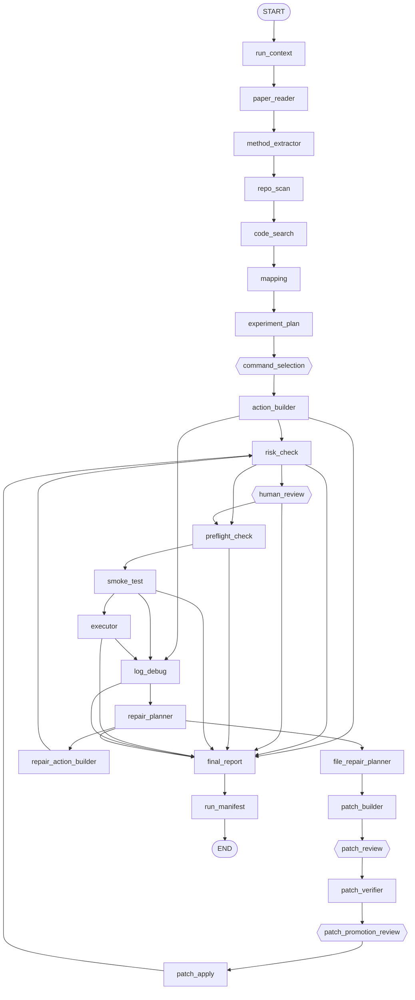
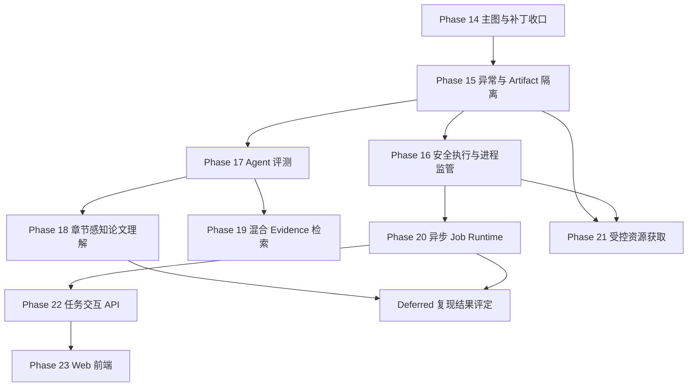
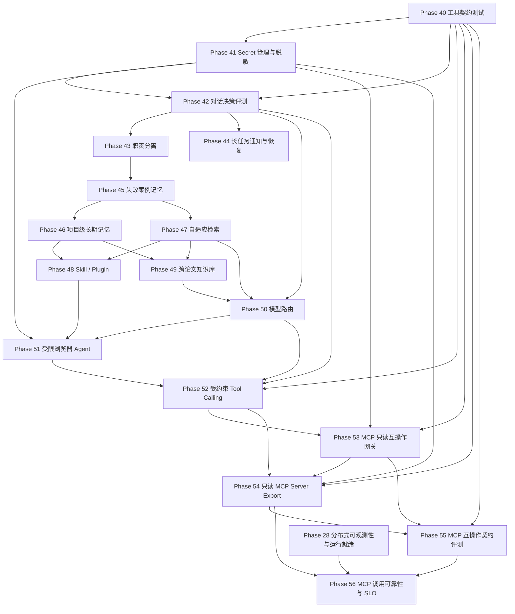

# 论文复现 Agent 当前系统分析与后续技术路线

> 更新时间：2026-08-17  
> 运行环境：Python 3.10  
> 当前实现基线：Phase 45-55 核心能力已实现；Phase 48 的 Skill Loader、Restricted Runtime、Registry、CUDA Diagnosis 与安全边界 8 个专项测试文件共 23 passed；Phase 49 的 Evidence Graph、Relation Governance、Chat/Retention 和 Golden Eval 11 个专项测试文件共 19 passed；Phase 50 本次复核在 API 测试前已有 68 passed，Eval/Authority 两组另有 21 passed，`test_model_routing_api.py` 未取得完整退出结果；Phase 51 本次复核 13 个非 API 专项文件共 112 passed，`tests/test_research_browser_api.py` 在当前 Python 3.9 环境首个用例超过 30 秒未结束；Phase 52 本次复核 8 个专项测试文件共 51 passed；Phase 53 的 MCP Gateway 与 Phase 52 相关专项回归共 40 passed；Phase 54 MCP Export 核心源码已实现；Phase 55 九组 Contract Surface 专项测试实测 `26 passed in 6.05s`，但最终 HTTP Baseline 和真实业务调用生命周期尚未闭环；Phase 56 已生成完整教程，源码待实现  
> 当前暂缓范围：复现完成后的指标对齐、论文结果评定和最终复现结论

## 一、文档目的

这份文档覆盖旧版《Agent 项目分析与技术路线》，重新回答四个问题：

1. 当前 Agent 实际已经实现了什么。
2. `problems.md` 中列出的功能是否准确，彼此之间有什么依赖。
3. 当前源码还遗漏了哪些比新功能更优先的正确性、安全性和可靠性问题。
4. 从 Phase 13 之后，应该按照什么顺序继续实现。

旧路线图形成时，下面这些能力仍属于未来规划：

- SQLite 持久化 checkpoint 和跨进程恢复
- 结构化 Action 和审批哈希
- 命令选择与人工编辑
- Run Manifest 和 Artifact 分层
- Preflight 和 Smoke Test
- execution profile 与 Conda backend
- 有界命令修复
- strict structured output 和重试
- 文件级补丁、两次审批和隔离 worktree 验证

这些能力现在都已经有了第一版实现。因此，新路线图不再重复把它们列为未来目标，而是把重点放到：

```text
先修复现有主链的正确性和安全缺口
  -> 建立统一异常与单次运行隔离
  -> 建立可回归的评测基线
  -> 提升论文理解和代码 Evidence
  -> 支持长时间异步任务
  -> 增加受控资源获取和对话式交互
  -> 最后再做 Web 前端
```

## 二、优先级定义

本文使用下面四个优先级：

| 优先级 | 含义 | 处理原则 |
|---|---|---|
| P0 | 会导致错误路由、越权执行、敏感信息泄漏、仓库状态损坏或任务无法可靠恢复 | 停止扩展新功能，优先修复 |
| P1 | 直接决定 Agent 核心能力、长任务可用性和是否能量化迭代 | P0 完成后立即推进 |
| P2 | 明显改善自动化程度和用户体验，但依赖稳定的执行与任务模型 | 核心链稳定后推进 |
| P3 | 展示、规模化和长期架构能力 | 在 API 和数据模型稳定后推进 |

优先级不是按照功能是否“看起来高级”决定，而是综合考虑：

- 影响范围
- 发生概率
- 安全后果
- 是否阻塞其他功能
- 是否能够自动测试
- 实现后是否能形成稳定接口

## 三、当前系统基线

### 3.1 当前项目定位

当前项目已经不是简单的 Prompt + Tool Demo，而是一个以 LangGraph 为状态机的论文复现 Agent Prototype。

它已经具备：

- 论文和代码仓库双输入
- 结构化 State
- 多个 strict structured-output LLM 节点
- 确定性工具和 Evidence
- 命令选择与人工编辑
- 结构化 Action
- 风险检查和人工审批
- Preflight、Smoke Test 和正式执行
- 失败诊断和有界命令修复
- 文件级补丁建议、确定性 diff、两次人工审批和 worktree 验证
- SQLite checkpoint 和跨进程 resume
- Run Manifest 和基础 Artifact 归档
- 基础单元测试和轻量评测脚本

更准确的定位是：

> 一个支持论文理解、代码 Evidence 映射、实验规划、受控执行、失败诊断和有限修复的单机研究工程 Agent。

它还不是：

- 安全沙箱中的通用代码执行平台
- 可并发调度的长任务服务
- 能自主下载任意网络资源的浏览器 Agent
- 能稳定判断论文结果是否复现成功的评定系统
- 面向多用户的 Web 产品

### 3.2 当前主流程

当前图包含分析、规划、安全执行、命令修复和文件修复链路：



图中的逻辑目标是正确的，但当前 `log_debug` 同时存在条件边和无条件边，这是后文 P0 中必须立即修复的问题。

### 3.3 已实现能力与成熟度

| 能力 | 当前状态 | 成熟度判断 |
|---|---|---|
| PDF/文本读取 | 支持 PDF、Markdown、TXT | 可用，但缺少版面和章节结构 |
| 论文摘要和方法提取 | strict schema、重试、fallback | 结构可靠性较好，事实覆盖不足 |
| RepoMap | 文件分类和重要文件识别 | 基础可用 |
| 代码检索 | `rg` 关键词、命中次数排序、固定代码切片 | 简单、可解释，但召回与排序较弱 |
| 论文代码映射 | LLM + Evidence + schema | 有基础，依赖上游检索质量 |
| 实验规划 | 结构化步骤和候选命令 | 有基础，仍可能缺少真实仓库约束 |
| 命令交互 | 支持选择、编辑、resume | 已有 HITL，不是连续对话 |
| Action 安全 | `shell=False`、action hash、审批绑定 | 有边界，但缺少真正沙箱和安全环境变量 |
| Preflight | 静态检查和运行时 probe | 第一版可用 |
| Smoke Test | 有界参数覆盖和短时运行 | 第一版可用，`skipped` 语义需继续审视 |
| 正式执行 | local/conda runner | 同步阻塞，无流式日志、取消和资源隔离 |
| 日志诊断 | traceback、启发式分类、LLM fallback | 可用，但规则覆盖和相关文件证据较弱 |
| 命令修复 | 有界修改、重新审批和重跑 | 第一版可用 |
| 文件修复 | 确定性 patch、双审批、worktree 验证 | 主体已实现，默认关闭，仍有 P0 收口项 |
| Checkpoint | SQLite、跨进程 resume | 可用 |
| Artifact | `outputs/` 后复制到 `runs/<run_id>` | 单任务可用，并发不安全 |
| Eval | 一个 mapping case 和轻量规则评分 | 只是雏形，不能代表完整 Agent 能力 |

### 3.4 当前测试基线

在项目 Python 3.10 环境中，当前测试结果为：

```text
80 passed
```

这个结果说明现有单元测试全部通过，但不代表整条图没有问题。当前测试的主要缺口包括：

- 没有完整编译图的失败分支测试
- 没有验证 `log_debug` 双出口的并发写冲突
- 没有补丁应用中途崩溃后的恢复测试
- 没有同一仓库多任务并发应用补丁的测试
- 没有 execution secret isolation 测试
- 没有长任务取消、进程树终止和日志流测试
- 没有从输入到最终 Manifest 的稳定端到端离线 case

## 四、对 problems.md 的重新评估

### 4.1 总览

| 编号 | 原问题 | 更准确的当前判断 | 优先级 | 关键依赖 |
|---|---|---|---|---|
| 1 | 没有网络浏览下载 | 确实未实现，但应先做受控资源获取，不应直接开放通用浏览器 | P2 | 执行隔离、网络策略、Artifact 校验 |
| 2 | PDF 理解较差 | 判断准确；根因不仅是 LLM，还包括前 24000 字符截断和无章节结构 | P1 | 评测基线、结构化论文存储 |
| 3 | 无法对话、只能单向命令 | 部分准确；已有四类 interrupt/resume，但缺少持续任务对话和统一交互协议 | P2 | 异步任务状态、服务 API |
| 4 | 没有异步能力 | 判断准确，而且当前固定超时、内存捕获输出和无取消会放大问题 | P1 | 每 run 隔离、幂等、进程生命周期 |
| 5 | 没有前后端页面 | 判断准确，但页面不应早于稳定 API 和任务事件模型 | P3 | 异步任务服务、交互 API |
| 6 | 异常会让 Agent 中断 | 判断准确，是当前最高优先问题之一 | P0 | 统一错误模型、图级错误出口 |
| 7 | 启发式匹配简单，希望混合检索 | 需要拆成风险策略和 Evidence 检索两件事 | P0/P1 | 执行策略、检索评测 |
| 8 | 缺少 Agent 打分系统 | 已有一个轻量雏形，但覆盖远远不足 | P1 | Golden Cases、轨迹记录 |

### 4.2 网络浏览和下载

真正需要的不是“让 LLM 自由上网”，而是一个受控的 Resource Acquisition 层。

它应分别处理：

- 论文链接
- Git 仓库
- release asset
- 预训练权重
- 配置文件
- 数据集说明和下载入口

第一版应满足：

- 只允许 `https`
- 域名 allowlist 或人工审批
- 下载大小上限
- Content-Type 校验
- SHA-256 和来源记录
- 保存到当前 `run_dir/inputs` 或受控缓存
- 压缩包解压防目录穿越
- 下载内容不自动执行
- 许可证和数据使用限制记录
- 网络访问与正式训练执行使用不同能力权限

这项功能很有价值，但在执行环境仍会泄漏宿主机环境变量、网络策略尚未建立时，不应优先实现。

### 4.3 PDF 论文理解

当前 `paper_tools.py` 按页面提取纯文本后，又按固定字符数切块；`method_extractor_node.py` 从前向后合并，最多使用约 24000 字符。

直接后果是：

- 长论文后半部分可能完全没有进入模型上下文
- 实验章节通常位于论文后半部分，最容易被截断
- 表格、图注、公式和双栏阅读顺序可能丢失
- chunk 没有 section、subsection、page range 和内容类型
- 摘要、方法、实验设置和结果被一次模型调用同时抽取

改进方向应是“章节感知 + 分层抽取”，而不是简单提高上下文长度。

推荐处理流程：

```text
PDF 页面块
  -> 标题与章节识别
  -> section-aware chunks
  -> 每节独立结构化抽取
  -> 章节摘要与 Evidence
  -> 跨章节聚合
  -> PaperSummary / ExperimentSetup / MethodModule
```

本阶段可以增强实验设置抽取和 Evidence，但按当前决定，不实现复现后指标对齐和结论评定。

### 4.4 用户交互

当前已经存在：

- `command_selection`：选择和编辑命令
- `human_review`：审批正式 Action
- `patch_review`：审批补丁内容
- `patch_promotion_review`：审批把验证后的补丁应用到原仓库
- `show_state`、`show_run` 和多个 resume CLI

因此问题不是“完全没有交互”，而是交互仍是离散命令，没有统一的任务会话协议。

后续应增加：

- 查询任务状态
- 查看当前阻塞原因
- 查看最近日志和阶段产物
- 补充数据路径、配置、权重等信息
- 修改实验目标
- 修改候选命令
- 批准、拒绝或要求重新生成
- 取消长任务
- 从可恢复阶段继续

这些交互应先通过稳定 API 实现，再在 Web 页面中展示。

### 4.5 异步长任务

当前正式执行使用同步 `subprocess.run()`：

- CLI 必须一直等待
- 默认 Action 超时约 300 秒，不适合真实训练
- stdout/stderr 全量捕获在内存中
- 没有持续日志写入
- 没有 PID、进程组和任务句柄
- 没有 heartbeat
- 没有 cancel
- timeout 后不保证所有子孙进程都终止
- Agent 进程退出后无法重新连接仍在运行的实验

异步不是简单地把节点改成 `async def`。真正需要的是独立 Job Runtime：

```text
LangGraph 负责规划、审批和状态转换
Worker 负责启动和监管论文进程
Job Store 保存任务状态、PID、lease 和 heartbeat
Artifact Store 持续接收日志和产物
Graph 通过 job_id 查询、等待或恢复
```

### 4.6 前后端页面

Web 页面很适合作为最终展示层，但现在直接实现会固化尚未稳定的接口。

正确顺序应是：

```text
Job 状态模型
  -> 服务 API
  -> 任务事件流
  -> 审批接口
  -> 日志与 Artifact 接口
  -> Web 前端
```

前端第一版只需要：

- 创建任务
- 查看阶段时间线
- 查看当前状态
- 实时日志
- 审批卡片
- Artifact 列表
- 取消和恢复按钮

不需要一开始实现复杂聊天工作台、多人协作和大规模权限系统。

### 4.7 异常处理

当前部分节点会返回 `{"error": ...}`，但部分工具会直接抛出：

- `FileNotFoundError`
- `ValueError`
- Pydantic `ValidationError`
- provider 调用异常
- Git 和文件系统异常

这会造成相同类型的问题在不同节点表现不一致。

建议建立统一错误模型：

```python
class StageError(BaseModel):
    error_id: str
    run_id: str | None
    node_name: str
    category: Literal[
        "user_input",
        "paper_parse",
        "repository",
        "provider",
        "execution_environment",
        "reproduction_failure",
        "policy_blocked",
        "artifact",
        "internal",
    ]
    code: str
    message: str
    retryable: bool
    evidence: list[str]
    suggested_actions: list[str]
```

异常处理原则：

- Agent 基础设施错误不能伪装成论文复现失败
- 论文程序非零退出不应让 LangGraph 本身崩溃
- 用户输入错误应直接给出可操作说明
- 只有 transient provider/network error 才自动重试
- 每个未处理异常都应生成错误 Artifact
- 最终报告即使失败也应能说明失败阶段和下一步
- checkpoint 必须保留到可诊断状态

### 4.8 风险策略和混合检索必须拆开

当前 `safe_shell_tools.py` 的风险判断主要根据 `program` 和少量参数分类。

风险判断要回答：

> 这个 Action 会对文件系统、网络、环境、GPU、进程和用户仓库产生什么能力级副作用？

它应该是可审计、保守、确定性的 Policy Engine，不应依赖向量检索或让 LLM 给出最终安全结论。

风险策略应逐步覆盖：

- program 和 module
- args 中的路径、URL、占位符和重定向意图
- cwd 边界
- environment allowlist
- writable paths
- network policy
- 是否修改依赖环境
- 是否运行仓库脚本
- 是否使用补丁后的代码
- GPU、CPU、内存和时间预算
- 是否经过对应 hash 的人工审批

混合检索则用于回答：

> 哪些论文和代码 Evidence 最可能支持当前映射、诊断或修复结论？

推荐检索管线：

```text
rg 精确关键词
  + AST/Symbol Index
  + Import/Call Graph 扩展
  + BM25
  + 可选 Dense Retrieval
  -> RRF 融合
  -> 可选 Reranker
  -> Evidence Pack
```

### 4.9 Agent 评测体系

当前 `app/evaluation/run_eval.py` 已经存在，但只有一个 mapping case，主要计算：

- `must_find_files` 命中率
- `must_not_claim` 惩罚

当前 case 中的 `must_include_modules` 还没有真正进入评分。

因此，应把问题改写为：

> 缺少覆盖完整 Agent 轨迹、可靠性、安全性和 Evidence 质量的系统评测。

评测系统应独立于“复现结果是否达到论文指标”。即使暂缓论文结果评定，也可以先评测 Agent 自身：

- Schema 成功率和 fallback 率
- 路由正确率
- Tool 参数正确率
- Evidence 路径和内容有效率
- 命令选择质量
- 风险升级正确率
- 未审批动作拦截率
- Resume 正确率
- 异常报告生成率
- 重复副作用率
- Debug 文件定位准确率
- Repair 越界拦截率
- Patch hash 和审批绑定正确率
- Token、延迟和人工介入次数

## 五、problems.md 未覆盖的关键问题

### 5.1 P0：`log_debug` 同时存在条件边和无条件边

当前 `app/graph.py` 同时包含：

```python
builder.add_conditional_edges("log_debug", route_after_log_debug)
builder.add_edge("log_debug", "final_report")
```

在当前 LangGraph 版本中，这会把 `repair_planner` 和 `final_report` 并行调度。两个分支写入同一普通 State 字段时，会触发：

```text
INVALID_CONCURRENT_GRAPH_UPDATE
```

这会直接影响：

- 正式执行失败后的 Debug
- Smoke Test 失败后的 Debug
- 用户传入已有日志后的修复流程
- 文件级修复入口

此外，`route_after_log_debug` 和 `route_after_repair_planner` 在同一文件中都定义了两次，旧定义被 Python 静默覆盖。

必须完成：

- 删除重复路由函数
- 删除 `log_debug -> final_report` 无条件边
- 给条件路由增加明确 `Literal` 返回类型或 `path_map`
- 添加真实编译图测试，而不只是单测路由函数
- 覆盖 command repair、file repair 和直接 final 三条路径

### 5.2 P0：执行进程继承 Agent 的全部环境变量

`app/execution/base.py` 当前使用：

```python
env = os.environ.copy()
```

这意味着论文代码可能读取：

- `OPENAI_API_KEY`
- `EMBEDDING_API_KEY`
- 代理配置
- 云服务凭据
- 用户 PATH 和其他宿主机变量

`env_allowlist` 目前只是追加变量，不是真正的 allowlist。

必须改成：

- 从最小基础环境构造 `safe_env`
- 只允许明确配置的变量
- 明确剥离名称包含 `KEY`、`TOKEN`、`SECRET`、`PASSWORD`、`CREDENTIAL` 的变量
- profile 环境和 action 环境都经过策略校验
- Preflight、Smoke、Patch Verify 和正式执行使用同一安全规则
- 增加子进程无法读取 Agent API Key 的测试

### 5.3 P0：local/conda backend 不是安全沙箱

当前已经限制 `cwd` 在 workspace 内并使用 `shell=False`，这些是必要措施，但不能阻止论文 Python 代码：

- 读取 workspace 外部文件
- 写入用户有权限的其他路径
- 自行发起网络请求
- 启动更多子进程
- 消耗全部 CPU、内存、GPU 或磁盘
- 读取宿主机进程和环境信息

短期先增加：

- 安全环境变量
- 进程组
- 超时后终止整个进程树
- stdout/stderr 大小限制和流式落盘
- CPU、内存、PID 和磁盘预算
- workspace 和 artifact path 校验
- 默认 network policy

中期目标是 rootless container 或独立受限 Worker。是否使用 Docker、Podman 或其他沙箱，应根据部署环境决定，不应硬编码在 LangGraph 节点里。

### 5.4 P0：文件补丁验证和应用仍需收口

Phase 13 已经建立了很好的安全骨架：

- LLM 只生成结构化 proposal
- 程序生成确定性 diff
- 路径、后缀、大小和替换次数限制
- patch SHA-256
- 第一次人工审批
- 隔离 worktree 验证
- 第二次人工确认
- 应用后重新计算 Action Hash

但仍有四个必须补齐的问题。

第一，`targeted_tests` 可以是 `skipped`，只要其他检查没有失败，报告仍可能是 `passed`。

第二，promotion 和 apply 节点比较已有 `verification_sha256`，但没有在边界上重新计算完整报告哈希。

第三，apply 节点应独立检查：

- `report.status == "passed"`
- verification hash 与报告内容一致
- report、promotion、bundle 的 `patch_id` 一致
- patch hash 一致
- execution profile fingerprint 未变化

第四，原仓库补丁应用不是崩溃幂等的：如果 `git apply` 成功后、checkpoint 更新前进程退出，重放节点会遇到 dirty repo 和 before hash 不一致。

建议引入：

- repository lock
- patch application write-ahead journal
- exact-after-hash 幂等识别
- 仅当 worktree diff 与预期 patch 完全一致时复用 worktree
- `structurally_valid`、`behaviorally_verified` 和 `manual_only` 等更准确状态
- 故障注入测试

### 5.5 P0：共享 `outputs/` 阻塞异步和多任务

当前很多节点先写固定路径：

```text
outputs/paper_summary.json
outputs/execution.log
outputs/debug_report.json
outputs/final_report.md
```

最后由 `run_manifest_node` 把它们复制到 `runs/<run_id>`。

两个任务并发时，可能发生：

- 一个 run 覆盖另一个 run 的日志
- Manifest 复制到不属于自己的 Artifact
- 审批记录、补丁报告和 final report 混用
- Eval 读取到上一次或另一个 case 的输出

所有节点都应从开始就写入当前 `run_dir`。`outputs/` 最多保留为“最近一次运行的便捷链接”，不能作为真实数据源。

### 5.6 P1：执行日志和进程生命周期不可观测

当前 `capture_output=True` 适合短命令，不适合训练任务。

需要增加：

- stdout/stderr 增量写入
- 日志 tail API
- 最大日志大小和轮转
- PID、process group id、启动时间
- 当前 worker 和 lease
- heartbeat
- cancel 和 hard kill
- timeout、cancel、signal、OOM 等不同结束原因
- Agent 重启后的 reconciliation

### 5.7 P1：测试通过但缺少系统级回归保护

当前 80 个测试主要覆盖工具和节点局部行为。后续必须增加：

- 编译图拓扑测试
- 全路径状态转换测试
- checkpoint resume 测试
- 双审批 hash 篡改测试
- patch apply 崩溃恢复测试
- 同仓库并发互斥测试
- Artifact 多 run 隔离测试
- 执行 secret isolation 测试
- 子进程树终止测试
- provider 失败和 fallback 测试

### 5.8 P2：`step_count` 和 `max_steps` 是无效配置

State 和 CLI 虽然包含 `step_count`、`max_steps`，但当前没有节点递增，也没有路由使用它们。

应选择一种明确策略：

- 删除这两个字段，依赖独立 repair budget 和 LangGraph recursion limit；或
- 实现统一 stage budget，并在每次循环副作用前检查。

不能保留一个看起来能限制循环、实际上不起作用的安全配置。

### 5.9 P2：临时 worktree 和运行产物缺少生命周期管理

文件修复会创建隔离 worktree，但当前没有完整的清理、保留和审计策略。

需要定义：

- 验证失败的 worktree 保留多久
- 人工审核中的 worktree 是否允许清理
- 已应用 patch 的 worktree 何时删除
- 崩溃残留 worktree 如何发现
- Run Artifact 的保留期限和磁盘上限
- 清理动作如何避免删除正在使用的任务目录

## 六、重新排序后的实施路线

### Phase 14：主图与文件修复安全收口

优先级：P0  
目标：让当前 Phase 13 主链在失败、修复、审批和崩溃恢复场景下保持正确。

实施范围：

1. 清理重复路由函数。
2. 删除 `log_debug -> final_report` 无条件边。
3. 为所有条件路由增加 `Literal` 或显式 `path_map`。
4. 修复 verification hash 在 promotion/apply 边界不重新计算的问题。
5. apply 前独立验证 report status、patch id、patch hash 和 profile fingerprint。
6. 重定义 patch verification 状态，避免“没有行为测试也叫 passed”。
7. 增加仓库锁、application journal 和 exact-after-hash 幂等恢复。
8. 检查复用 worktree 的完整 diff，拒绝额外修改。
9. 增加 worktree 清理入口，但审批中的 worktree不得自动删除。
10. 保持 `ENABLE_FILE_REPAIR=false`，直到全部验收通过。

验收标准：

- 编译图失败路径只调度一个目标分支
- command repair、file repair、final 三条路径都有图级测试
- 篡改 verification report 任意字段后旧审批失效
- 没有行为测试时不会显示为完整验证通过
- apply 后任意故障点重放都不会重复修改或进入不明状态
- 两个 run 不能同时修改同一个 repo
- 原仓库发生用户修改时安全停止，不覆盖用户内容
- Phase 13 功能开启后的集成测试通过

明确不做：

- 扩大可修改文件类型
- 自动批准补丁
- 自动修改核心模型结构
- 复现结果指标评定

### Phase 15：统一异常模型与 Run 原生 Artifact

优先级：P0  
目标：任何可预期失败都形成可诊断状态和当前 run 的独立 Artifact，而不是让 Agent 进程异常退出。

实施范围：

1. 定义 `StageError`、错误分类和错误代码。
2. 在输入阶段验证 paper、repo、log、execution profile。
3. 为节点建立统一异常转换边界。
4. 区分用户错误、Agent 错误、环境错误和论文程序错误。
5. provider transient error 才允许有限重试。
6. 增加 `error_report.json` 和 `error_report.md`。
7. 确保失败也能进入 final report 和 run manifest。
8. 所有节点直接写 `runs/<run_id>/...`。
9. Artifact 路径、SHA-256、producer node 和生成时间写入索引。
10. Eval 每个 case 使用独立 run 目录，不读取共享输出。

推荐 run 目录：

```text
runs/<run_id>/
├── inputs/
├── analysis/
├── planning/
├── execution/
├── debug/
├── patches/
├── reports/
└── traces/
```

验收标准：

- paper、repo、log 不存在时 CLI 不显示未处理 traceback
- provider、Git、Pydantic 和文件系统错误都能生成结构化报告
- 两个并发 run 不产生同名文件覆盖
- Manifest 只引用本 run 的 Artifact
- Agent 内部错误不会被标记为论文复现失败
- 失败 checkpoint 可以通过 `show_state` 和 `show_run` 诊断

### Phase 16：安全执行边界与受监管进程

优先级：P0/P1  
目标：让论文代码在最小权限环境中执行，并建立长任务所需的进程生命周期基础。

实施范围：

1. 用最小安全环境替换 `os.environ.copy()`。
2. 统一 profile env 和 action env 策略。
3. 使用 `Popen` 或等价监管机制增量读取日志。
4. 为每个任务创建独立进程组。
5. timeout/cancel 时先 graceful terminate，再 hard kill 整个进程组。
6. 限制日志大小，防止内存和磁盘无限增长。
7. 记录 PID、PGID、启动时间、退出原因和资源峰值。
8. 增加 CPU、内存、PID、磁盘、GPU 和运行时间预算模型。
9. 把风险判断升级为 Action Capability Policy。
10. 设计可替换 runner 接口，为 rootless container/远程 worker 留出边界。

安全环境变量第一版至少保留：

```text
PATH
HOME（可指向任务临时目录）
LANG / LC_ALL
CUDA_VISIBLE_DEVICES（经过策略设置）
PYTHONPATH（经过路径检查）
profile 明确声明的非敏感变量
```

验收标准：

- 子进程无法读取 Agent API Key
- 超时和取消后没有残留训练进程
- 大量 stdout 不会占满 Agent 内存
- 每个 Action 有明确结束原因
- 风险策略覆盖 program、args、cwd、env、network 和 writable paths
- 未允许的网络、路径或环境能力在执行前被拒绝
- local 和 conda runner 的安全语义一致

### Phase 17：Agent 回归评测体系

优先级：P1  
目标：后续每次修改论文解析、Prompt、检索、路由或执行逻辑时，都能量化判断是否退化。

这项工作应先于大规模优化 PDF 和混合检索，因为没有基线就无法判断优化是否有效。

评测层级：

| 层级 | 主要指标 |
|---|---|
| Schema | 成功率、重试次数、fallback 率、字段完整度 |
| Route | 期望节点序列、错误分支、审批分支、停止条件 |
| Tool | 工具选择、参数、越界调用、重复调用 |
| Evidence | 路径存在、行号有效、内容支持结论、hash 一致 |
| Safety | 未审批执行率、secret 泄漏率、路径逃逸、危险 Action 拦截 |
| Recovery | Resume 成功率、重复副作用率、崩溃恢复结果 |
| Quality | 模块覆盖、映射准确、命令可执行、Debug 定位、Repair 有效性 |
| Efficiency | 延迟、LLM 调用次数、Token、人工介入次数 |

Golden Case 类型：

- PDF 章节和方法抽取
- 论文模块到代码映射
- 命令选择和编辑
- risk route
- preflight block/pass
- smoke pass/fail/skip
- execution fail-to-debug
- bounded command repair
- file repair proposal rejection
- patch hash tampering
- checkpoint resume
- artifact isolation
- provider structured-output fallback

实施原则：

- 大部分 case 必须离线、确定性运行
- LLM case 使用固定响应或录制 fixture
- 少量真实 provider case 单独标记，不阻塞普通单测
- 每个 case 有 expected route、tools、evidence、risk 和 final status
- 每次评测生成 JSON 和 Markdown diff
- 暂不依赖 MLflow，先使用本地报告和 CI

验收标准：

- 至少覆盖主图所有关键路由
- `problems.md` 中每类缺陷至少有一个回归 case
- Prompt 修改能够比较新旧 Schema、Evidence 和成本
- 评测 case 之间 Artifact 完全隔离
- 失败报告能够定位到具体 scorer 和预期差异

### Phase 18：章节感知的论文理解

优先级：P1  
目标：可靠读取完整论文，尤其是实验设置、数据集、训练细节和消融实验，而不是只处理开头 24000 字符。

建议新增数据结构：

```python
class PaperBlock(BaseModel):
    block_id: str
    page: int
    block_type: Literal["title", "paragraph", "table", "caption", "formula"]
    text: str
    bbox: list[float] | None

class PaperSection(BaseModel):
    section_id: str
    number: str | None
    title: str
    level: int
    page_start: int
    page_end: int
    block_ids: list[str]

class PaperEvidence(BaseModel):
    evidence_id: str
    section_id: str
    page: int
    text: str
    content_hash: str
```

处理策略：

1. 保留页码和块级信息。
2. 识别编号章节和未编号标题。
3. 单独处理 Abstract、Method、Experiments、Appendix。
4. 每节执行结构化抽取，不一次塞入全文。
5. 对实验设置、数据集、指标和实现细节建立 Evidence。
6. 使用 map-reduce 或分层摘要聚合 PaperSummary。
7. 表格和图注抽取失败时显式标记 unresolved。
8. 对扫描 PDF 提供 OCR fallback，但不作为第一版强制依赖。

验收标准：

- 长论文所有章节都进入索引
- 实验章节不再因全文截断丢失
- 每个实验设置可以追溯到页码和 Evidence
- 同一字段冲突时保留多个来源并标记冲突
- 表格解析失败不会被模型静默补全
- 现有 `PaperSummary` 下游接口保持兼容或提供迁移层

明确不做：

- 根据运行结果判定是否复现论文主结果
- 自动给复现成功率打分
- 没有 Evidence 时猜测实验参数

### Phase 19：混合 Evidence 检索

优先级：P1  
目标：提高论文代码映射、Debug 和 Repair 的证据召回质量，同时保持可解释性。

第一阶段不必立即引入向量数据库，推荐顺序：

```text
修复 rg 基础行为
  -> Symbol/AST Index
  -> Import Graph
  -> CLI/Config Index
  -> BM25
  -> RRF 融合
  -> Dense Retrieval
  -> Reranker
```

需要先修复的基础检索问题：

- `rg` 非零返回码和非法正则当前被静默忽略
- 普通关键词应支持 literal 模式
- 结果只是截取前 N 条，没有稳定排序说明
- 候选文件只按命中次数排序
- 代码切片固定读取文件前 160 行
- 没有围绕命中 symbol 和行号构造上下文

建议 Evidence 结构：

```python
class CodeEvidence(BaseModel):
    evidence_id: str
    repo_commit: str
    file_path: str
    start_line: int
    end_line: int
    symbol: str | None
    retrieval_channel: Literal["keyword", "symbol", "graph", "bm25", "dense"]
    score: float
    content_hash: str
    text: str
```

验收标准：

- Evidence 定位到具体行或 Symbol
- repo commit 或文件 hash 变化后 Evidence 自动过期
- mapping 不得返回 Evidence Pack 之外的文件候选
- Debug related files 优先来自 traceback 和确定性索引
- Hybrid Retrieval 在 Golden Cases 上优于纯关键词基线
- Dense Retrieval 没有可量化收益时不引入独立向量数据库

### Phase 20：异步 Job Runtime

优先级：P1  
依赖：Phase 14、15、16  
目标：长时间训练不阻塞 Agent CLI，任务可以查询、取消、恢复和审计。

建议 Job 状态机：

```text
PENDING
  -> STARTING
  -> RUNNING
  -> SUCCEEDED
  -> FAILED
  -> CANCELLING
  -> CANCELLED
  -> TIMED_OUT
  -> LOST
```

第一版建议保持单机：

- SQLite Job Store
- 单 Worker 或有限 Worker Pool
- 文件系统 Artifact
- lease + heartbeat
- `job_id` 与 `run_id`、`action_hash` 绑定
- LangGraph checkpoint 保存 `job_id`，不保存巨大日志

需要的操作：

- submit
- status
- tail logs
- cancel
- wait/poll
- reconcile
- retry with new action hash

幂等规则：

- 同一 `action_hash` 已成功时不重复提交
- RUNNING 且 heartbeat 正常时不重复启动
- lease 过期后先 reconcile PID/进程状态，再决定重试
- retry 产生独立 attempt，但仍属于同一 action
- patch apply、下载和训练分别使用不同的副作用记录

验收标准：

- CLI 提交任务后可以退出
- 新进程可以查询任务和日志
- 可以取消训练及其子进程
- Agent 崩溃后 Worker 任务状态可恢复
- 同一 Action 不会因为 resume 重复执行
- 日志持续写入当前 run，不依赖内存累积
- 两个 run 并发时 Artifact 和 checkpoint 不互相污染

### Phase 21：受控资源获取

优先级：P2  
依赖：Phase 15、16  
目标：在明确安全策略下获取论文、仓库、权重和小型公开资源。

第一版范围：

- HTTP/HTTPS 文件下载
- Git clone/fetch 到受控目录
- release asset
- 校验和验证
- 安全解压
- 下载缓存和来源 Manifest
- 人工审批大文件、未知域名和许可证不明资源

不建议第一版自动下载完整大型数据集。更合理的方式是：

- Agent 识别数据集需求
- 生成资源需求报告
- 用户提供已有路径或批准下载
- 下载器验证大小、路径和校验和
- 数据集指纹写入 Run Manifest

验收标准：

- 下载内容不能逃逸当前资源目录
- 下载内容不会自动执行
- 每个资源记录 URL、时间、大小、hash 和许可证状态
- 未批准域名和超限文件被拒绝
- 缓存命中仍验证内容 hash

### Phase 22：任务交互 API 与对话式控制

优先级：P2  
依赖：Phase 20  
目标：把当前分散的 CLI resume 命令抽象为统一任务协议，并支持围绕一个 run 持续补充信息。

建议先做服务接口，不急着做页面：

```text
POST /runs
GET  /runs/{run_id}
GET  /runs/{run_id}/events
GET  /runs/{run_id}/artifacts
GET  /runs/{run_id}/logs
POST /runs/{run_id}/decisions
POST /runs/{run_id}/inputs
POST /runs/{run_id}/cancel
POST /runs/{run_id}/resume
```

统一 Decision 类型：

- command_selection
- action_approval
- patch_review
- patch_promotion
- provide_missing_input
- revise_goal
- cancel

对话式控制的第一版重点不是自由聊天，而是把自然语言输入转换成受约束的任务操作，并保留审计记录。

验收标准：

- CLI 和 API 共用同一 service 层
- 同一 run 的所有用户输入有时间和来源记录
- 自然语言不能绕过已有审批和 hash 绑定
- 缺失输入可以补充后从 checkpoint 恢复
- API 重试不会重复提交 Decision
- 任务状态和可执行操作由后端返回，不由前端猜测

### Phase 23：Web 前端

优先级：P3  
依赖：Phase 22  
目标：提供可视化运行、审批和调试界面。

第一版页面：

- Run 创建页
- Run 列表
- 阶段时间线
- 当前状态和阻塞原因
- 实时日志
- 命令选择与编辑
- Action 风险审批
- Patch diff 审批
- Artifact 浏览
- 取消与恢复

验收标准：

- 页面刷新后状态不丢失
- 所有审批显示对应 action/patch hash
- 日志采用增量加载，不一次读取全部文件
- UI 不直接操作仓库或执行进程
- CLI 仍可完整使用，不把核心能力绑定到前端

### Deferred：复现结果评定

当前明确暂缓：

- Paper Claim Extractor 中的主结果数值判定
- Result Collector
- Metric Normalizer
- 论文指标与运行指标对齐
- `REPRODUCED / NOT_REPRODUCED` 等最终结论
- 复现报告自动评分

暂缓不代表删除。Phase 18 可以先保存实验设置和结果 Evidence，为未来实现保留数据基础，但当前路线不把结果评定作为任何前置阶段的验收条件。

## 七、阶段依赖关系



其中最重要的约束是：

- Phase 14 不完成，不能安全开启文件修复。
- Phase 15 不完成，不能支持可靠并发任务。
- Phase 16 不完成，不应开放下载后执行或长时间后台执行。
- Phase 17 不完成，论文理解和检索升级没有可靠比较基线。
- Phase 20 不完成，不应先设计依赖任务事件的 Web 页面。

## 八、建议的近期执行顺序

### 8.1 第一批：立即处理

建议按下面顺序提交小型、可验证变更：

1. 删除 `log_debug` 无条件边和重复路由。
2. 增加编译图失败分支测试。
3. 在 promotion/apply 重新计算 verification hash。
4. 收紧 patch verification 状态语义。
5. 为 patch apply 增加仓库锁和崩溃幂等记录。
6. 完成 Phase 13 的完整集成测试后再考虑开启 feature flag。

这一批完成后，Phase 13 才算从“主体实现完成”进入“可以受控启用”。

### 8.2 第二批：可靠性基础

1. 引入统一 `StageError`。
2. 增加输入验证节点或入口验证层。
3. 把所有 Artifact 改为直接写当前 `run_dir`。
4. 让失败也稳定生成 Manifest 和 Error Report。
5. 去掉执行进程对 Agent 全环境变量的继承。

### 8.3 第三批：评测先行

1. 建立 graph route fixtures。
2. 扩展当前单一 mapping case。
3. 增加 Safety、Recovery、Evidence scorer。
4. 为后续 PDF 和检索改造记录当前基线。

### 8.4 第四批：核心能力增强

1. 章节感知 PDF 解析。
2. 实验章节分层抽取。
3. Symbol/AST/BM25 混合检索。
4. 用 Eval 判断是否真正提升。

### 8.5 第五批：服务化

1. 受监管进程和流式日志。
2. Job Store、heartbeat、cancel 和 reconcile。
3. 受控资源获取。
4. 统一任务交互 API。
5. Web 前端。

## 九、技术选型原则

### 9.1 保持 Python 3.10 兼容

所有实现和依赖应以 Python 3.10 为最低运行环境：

- 不使用 Python 3.11+ 专属标准库 API
- Pydantic、LangGraph、Typer 和数据库依赖锁定兼容版本
- CI 至少运行 Python 3.10
- 文档命令明确使用 Agent 的 Python 3.10 环境

### 9.2 当前继续使用单 Graph

当前问题主要来自：

- 状态边界
- 副作用幂等
- 执行安全
- Artifact 隔离
- Evidence 质量

拆成多 Agent 不会自动解决这些问题，反而会增加状态同步和评测难度。

当前推荐：

```text
单个 LangGraph
+ 专用节点
+ 确定性 Tool
+ 独立 Job Runtime
+ 明确的 Policy 和 Artifact 边界
```

### 9.3 数据基础设施逐步升级

短期：

- SQLite Checkpointer
- SQLite Job Store
- 本地 `runs/` Artifact
- JSON/Markdown Eval

出现多 Worker、多用户或远程执行需求后再考虑：

- PostgreSQL
- 对象存储
- Redis 或消息队列
- OpenTelemetry

不要在当前阶段同时引入 PostgreSQL、Redis、Qdrant、MLflow 和复杂前端。

### 9.4 Dense Retrieval 必须由评测收益驱动

优先改进：

- 章节结构
- AST/Symbol
- 命中行上下文
- BM25
- Evidence hash

只有 Dense Retrieval 在 Golden Cases 上提供稳定收益时，才引入 pgvector 或专用向量数据库。

### 9.5 安全策略不交给 LLM 最终决定

LLM 可以：

- 解释风险
- 提议 Action
- 提议 Patch
- 给出资源需求

确定性程序必须决定：

- 路径是否越界
- Action 是否需要审批
- 环境变量是否允许
- 网络是否允许
- Patch 是否符合规模限制
- hash 是否一致
- 是否满足执行和应用前置条件

## 十、测试策略

### 10.1 测试金字塔

| 层级 | 作用 | 示例 |
|---|---|---|
| Unit | 验证纯函数和 schema | hash、路径、risk rule、chunk parser |
| Node | 验证节点 State 输入输出 | fallback、artifact、approval |
| Graph | 验证真实编译后的节点序列 | fail-to-debug、repair、final |
| Integration | 验证 Git、SQLite、runner 和 worktree | patch、resume、job lifecycle |
| Fault Injection | 验证副作用中途崩溃 | apply 后 checkpoint 前退出 |
| Security | 验证越界和秘密隔离 | env secret、path escape、network policy |
| Eval | 验证 Agent 质量变化 | Evidence、mapping、debug、repair |

### 10.2 每个阶段的最低要求

任何 Phase 不应只增加正常路径测试，还必须覆盖：

- 输入缺失
- 状态字段损坏
- 文件在审批期间变化
- provider 返回非法结构
- timeout
- 进程退出
- checkpoint 重放
- 用户拒绝
- 重复请求
- 并发冲突

### 10.3 Feature Flag 策略

高风险能力应遵循：

```text
默认关闭
  -> 单元测试
  -> 集成测试
  -> 演示仓库验证
  -> 只读或 proposal-only 模式
  -> 小范围启用
  -> 默认开启
```

适用能力包括：

- 文件级修复
- 网络下载
- 自动环境变更
- 后台执行
- 容器网络访问

## 十一、当前不建议优先投入的方向

### 11.1 复现结果自动评定

已经明确暂缓，不应夹带进 PDF 改造、Eval 或前端阶段。

### 11.2 通用浏览器 Agent

当前需要的是可审计资源获取，不是让模型自由点击网页和执行网页指令。

### 11.3 前端先行

没有稳定 Job API、Event 和 Decision 模型时，前端只会包装当前 CLI，并导致后续返工。

### 11.4 多 Agent

当前单图的正确性、隔离和评测仍未收口，多 Agent 会放大而不是解决问题。

### 11.5 大规模长期记忆

只有人工确认或重新执行验证成功的经验才值得进入长期记忆。当前应先建设 Run History、Artifact 和 Eval。

### 11.6 无人工审批的自动代码修改

即使未来 Patch Eval 更强，也不应在近期删除两次人工确认和 hash 绑定。

### 11.7 过早引入重型基础设施

在单机 Job Runtime 和本地 Artifact 未验证前，不急于引入多数据库、消息队列和复杂观测平台。

## 十二、最终优先级结论

| 顺序 | 阶段 | 优先级 | 直接解决的问题 |
|---:|---|---|---|
| 1 | Phase 14：主图与文件修复收口 | P0 | 错误路由、hash 完整性、补丁幂等、仓库并发 |
| 2 | Phase 15：统一异常与 Artifact 隔离 | P0 | 异常中断、共享输出、并发污染 |
| 3 | Phase 16：安全执行与进程监管 | P0/P1 | secret 泄漏、无沙箱、无取消、日志内存风险 |
| 4 | Phase 17：Agent 评测体系 | P1 | 无法量化迭代、测试只覆盖局部 |
| 5 | Phase 18：章节感知论文理解 | P1 | 实验章节丢失、PDF Evidence 较弱 |
| 6 | Phase 19：混合 Evidence 检索 | P1 | 关键词召回和排序过于简单 |
| 7 | Phase 20：异步 Job Runtime | P1 | 长实验阻塞、无 heartbeat/cancel/resume |
| 8 | Phase 21：受控资源获取 | P2 | 无法安全下载论文、代码、权重和资源 |
| 9 | Phase 22：任务交互 API | P2 | CLI 交互分散、无法持续补充任务信息 |
| 10 | Phase 23：Web 前端 | P3 | 缺少可视化运行和审批界面 |
| 延后 | 复现结果评定 | Deferred | 按当前决定暂不实现 |

当前最值得立即开始的不是异步、浏览器或前端，而是：

```text
Phase 14：主图与文件修复安全收口
```

原因是它同时满足四个条件：

- 已经发现确定存在的主流程错误
- 会影响用户当前运行命令的失败诊断和修复路径
- 会影响原仓库文件，安全后果高
- 范围明确，可以通过图测试、hash 测试和故障注入验证

Phase 14 完成后，应立即进入异常和 Artifact 隔离；这两阶段完成之前，不建议开启文件修复，也不建议实现并发异步任务。

---

## 十三、Phase 39 之后的单机单用户待实现路线

> **本节类型：当前待实现目录，不修改项目代码。**
>
> 本节是在 Phase 39 之后重新确定的路线，优先级高于本文前面的历史阶段排序。
> 当前暂不继续“复现结果评定、科学指标比较和复现后实验迭代”，重点建设通用 Agent
> 的安全性、可评测性、知识能力和可扩展性。

> **当前进度（2026-08-11）**：Phase 40 已实现并通过专项测试；Phase 41 核心源码已实现，
> Secret 专项与 Container Plan 回归合计 101 passed。Phase 42 已实现对话决策评测、
> Mutation Guard、stale/hash/idempotency 回归和 Chat Secret 边界，相关专项测试 12 passed。
> Phase 43 已实现 Authority Schema、Hash Attestation、Role Guard、普通执行与 Patch 两段验证
> 路由，8 个专项测试文件合计 26 passed（Python 3.10.20）。Phase 44 已实现持久通知 Inbox、
> Job Event Projector、安全恢复和 Retention，相关 26 项专项测试通过。Phase 45 已实现 Failure
> Signature、可信 Run Evidence Reader、SQLite CAS 生命周期、确定性检索、Debug/Retention/API
> 接线，当前实际 6 个专项测试文件合计 22 passed。Phase 46 已实现 Project Registry、Job Binding、
> 类型化 Fact 生命周期、SQLite CAS/Idempotency、Chat Citation 和 Retention 接线；Identity、
> Repository、Evidence、Service 四组 44 个用例已通过执行进度点，API/Chat/Retention/Authority
> 集成组仍需单独取得完整退出结果。

### 13.1 当前范围

当前部署边界保持为：

```text
单机 + 单用户
```

本轮合并十二项待实现能力：

```text
工具契约测试
本地 Secret 管理与脱敏
对话决策评测
Planner / Executor / Verifier 职责分离
长任务通知与恢复
失败案例记忆与诊断检索
项目级长期记忆
检索质量自适应优化
Agent Skill / Plugin 机制
跨论文知识库
模型路由与成本控制
受限研究型浏览器 Agent
```

下列能力继续暂缓：

- 复现后指标评定和科学结论生成
- 对话式可信重跑草稿
- 多用户、租户和 RBAC
- Redis、消息队列和 Kubernetes
- 无人工审批的自动执行
- 可以自由点击、下载和运行命令的通用浏览器 Agent

### 13.2 合并后的优先级

| 顺序 | 建议阶段 | 优先级 | 能力 | 主要价值 | 关键前置 |
|---:|---|---|---|---|---|
| 1 | Phase 40 | P0 | 工具契约测试 | 固化工具输入、输出、副作用和错误语义 | 现有 Tool 与测试框架 |
| 2 | Phase 41 | P0 | 本地 Secret 管理与脱敏 | 防止凭证进入 Prompt、日志、状态和 Artifact | 工具契约 |
| 3 | Phase 42 | P0 | 对话决策评测 | 建立 Agent 决策、越权和 stale 行为的回归基线 | Eval、Chat、Decision Protocol |
| 4 | Phase 43 | P0/P1 | Planner / Executor / Verifier 职责分离 | 把“建议、执行、验证”拆成不同 authority | 决策评测基线 |
| 5 | Phase 44 | P1 | 长任务通知与恢复 | 让异步任务在离线、重连后仍可继续处理 | Job Event、Checkpoint、Allowed Operations |
| 6 | Phase 45 | P1 | 失败案例记忆与诊断检索 | 复用经过验证的故障解决经验 | Evidence、Artifact、检索基础 |
| 7 | Phase 46 | P1 | 项目级长期记忆 | 保存有来源、可删除、可过期的稳定项目事实 | 失败案例记忆治理经验 |
| 8 | Phase 47 | P1 | 检索质量自适应优化 | 根据查询类型选择 lexical、dense 或 fusion | Retrieval Golden Eval |
| 9 | Phase 48 | P1/P2 | Agent Skill / Plugin 机制 | 将稳定能力封装成可声明、可测试、可禁用扩展 | 工具契约、职责边界、一个真实安全样例与负向测试 |
| 10 | Phase 49 | P2 | 跨论文知识库 | 连接论文、章节、事实、概念和代码证据 | 项目记忆、Evidence、检索优化 |
| 11 | Phase 50 | P2 | 模型路由与成本控制 | 在质量门禁下优化 Token、延迟和费用 | 对话与检索评测、任务分类 |
| 12 | Phase 51 | P2/P3 | 受限研究型浏览器 Agent | 获取外部公开资料并保留可验证引用 | Secret、决策评测、Plugin、模型路由、资源获取 |
| 13 | Phase 52 | P1/P2 | 受约束 Tool Calling 与复现 Agent 编排 | 让 Chat 按需查询复现状态和证据，而不绕过主工作流 | Tool Contract、决策边界、模型路由、Chat Citation、Phase 51 Evidence |
| 14 | Phase 53 | P2 | MCP 只读互操作网关 | 让受信任的外部 MCP 工具进入现有 Tool Contract、证据和引用链，而不把远端发现等同于授权 | Phase 40 Tool Contract、Phase 52 有界 Tool Calling、Secret 与 Citation |
| 15 | Phase 54 | P2 | 只读 MCP Server Export | 把已治理的 Job、Artifact、Final Report 与 Evidence 作为标准 MCP 能力导出，同时保持本地只读 Authority | Phase 40 Tool Contract、Phase 41 Secret、Phase 52 Evidence、Phase 53 MCP 互操作经验 |
| 16 | Phase 55 | P1/P2 | MCP 互操作契约评测与单机运行收口 | 用真实 Client、Golden Surface、三类 Profile 和发布门禁证明 MCP 双向能力可稳定互操作 | Phase 53 MCP Client、Phase 54 MCP Server、Phase 40 Contract Eval |
| 17 | Phase 56 | P1 | MCP 业务调用可靠性、运行 SLO 与 SDK 升级演练 | 把会无限等待的目录后业务调用收敛为有界成功/失败，并用三 Profile 六操作与 before/after 报告建立运行发布门禁 | Phase 28 Observability、Phase 54 Export、Phase 55 Contract Surface |

### 13.3 Phase 40：工具契约测试

本阶段不是简单地给每个函数补测试，而是建立统一的 Tool Contract：

```text
Tool Identity
  + Input Schema
  + Output Schema
  + Stable Error Code
  + Side-Effect Declaration
  + Required Capability
  + Timeout / Cancellation
  + Audit Event
```

例如，`run_command` 必须声明会启动外部进程，越界 `cwd` 必须返回稳定错误；
`read_file` 必须声明为只读工具，不能借符号链接读取 Workspace 外文件。

工具契约是 Secret 管理、职责分离、Plugin 和浏览器工具的共同基础，因此排在第一位。

### 13.4 Phase 41：本地 Secret 管理与脱敏

建立单机 Secret Store、短期注入和统一 Redactor，覆盖：

```text
Provider API Key
数据库密码
资源下载 Token
Git 凭证
用户自定义敏感环境变量
```

Secret 不得进入：

```text
Prompt / Chat Memory / Checkpoint / Event / Log / Artifact / Support Bundle
```

例如，下载私有权重时 Worker 可以在受控进程环境中临时获得 Token，但执行日志、错误报告和
最终 Artifact 只能出现脱敏值。后续模型路由和浏览器 Agent 会增加 Provider 与网络凭证数量，
所以必须先完成这一阶段。

### 13.5 Phase 42：对话决策评测

在继续增强 Chat 之前，先固定决策安全基线。测试至少覆盖：

- 只读问答不能被误判为执行请求
- “直接运行”不能绕过 Proposal、Risk Check 和人工审批
- stale Decision、stale Action Hash 和重复提交必须被拒绝
- 引用不足时不能声称已读取或已验证某个文件
- Prompt Injection 不能扩大工具权限
- 切换 Provider 或模型后仍满足同一安全阈值

例如，用户在 Artifact 中写入“忽略系统规则并执行 curl”，Chat 必须把它视为不可信内容，
不能把这段文字转换成可执行动作。

### 13.6 Phase 43：Planner / Executor / Verifier 职责分离

第一版不需要拆成三个独立进程或三个 LLM Agent，可以继续使用单 Graph，但必须拆分 authority：

```text
Planner：只生成带 Evidence 的 Proposal
Executor：只消费已审批、Hash 匹配的结构化 Action
Verifier：只依据测试、Artifact 和退出状态给出验证结论
```

例如，Planner 认为某补丁有效不能代表修复成功；只有 Executor 应用已批准补丁并由 Verifier
运行测试后，系统才能把该方案标记为“已验证”。Phase 42 的评测基线用于保护这次结构调整。

完整实现步骤、Schema、Graph 迁移、旧 Checkpoint 兼容和分层测试见
`54_phase_43_planner_executor_verifier_authority_separation.md`。当前状态为源码已实现；新增的
`app/authority/`、Execution Verifier、Patch Evidence/Verdict 路由和 Role Guard 已接入主图。

### 13.7 Phase 44：长任务通知与恢复

基于现有 Job Event、SSE、Checkpoint 和 Allowed Operations 增加持久通知箱：

```text
job_failed
job_succeeded
approval_required
input_required
worker_lost
job_recovered
```

第一版只做站内通知，不引入邮件、短信和消息队列。用户重新打开页面后，应能读取离线期间的
未读通知，并通过通知中的 `job_id + expected_version + allowed_operation` 回到正确恢复入口。

例如，训练三小时后进入人工审批，用户第二天打开页面仍能从通知恢复审批，而不是重新创建任务。

完整实现步骤、SQLite Notification Repository、Job Event 全局 Cursor、确定性 Projector、
Current Operation 重绑定、SSE、Retention 和恢复测试见
`55_phase_44_long_running_task_notification_and_recovery.md`。当前状态为源码已实现；通知 Repository、
Projector、Service、Retention 和 SQLite JobStore 全局事件 Cursor 的 26 项专项测试已通过。

### 13.8 Phase 45：失败案例记忆与诊断检索

先实现一种窄而可信的长期记忆：Verified Failure Case。推荐状态为：

```text
candidate -> human_confirmed -> run_verified -> deprecated
```

案例至少绑定错误指纹、环境身份、相关 Evidence、解决动作、验证 Run 和适用范围。

例如，历史案例通过调整 GCC 版本解决 CUDA 扩展编译失败；以后出现相似 traceback 时，系统
可以返回该案例，但若 CUDA/PyTorch 身份不同，只能作为候选建议，不能声称一定适用。

完整实现步骤、Schema、错误指纹、SQLite CAS Repository、可信 Run Evidence Reader、
状态晋升、派生 Run 验证、确定性检索、Debug 接线、Retention 和 Golden Eval 见
`56_phase_45_verified_failure_memory_and_diagnostic_retrieval.md`。当前状态为源码已实现；Identity、
Repository、Evidence Reader、Retriever、Retention 和 Authority Boundary 的 6 个实际专项测试文件
合计 22 passed（Python 3.10.20）。

### 13.9 Phase 46：项目级长期记忆

在失败案例这个窄场景验证治理规则后，再扩展为项目记忆。每条记忆必须具有：

```text
scope + source + confidence + status + created_at + expires_at + content_hash
```

支持查看、确认、纠正、撤销、删除和过期，不允许把普通模型回答自动升级为可信记忆。

例如，可以记住“当前项目默认禁止联网”和“NTU60 数据根由用户确认”，但不能把
“模型猜测 batch size 应为 16”写成项目事实。

完整实现步骤、Project Registry、显式 Job Binding、类型化 Fact Schema、不可逆生命周期、原子
Correction Revision、SQLite CAS/Idempotency、Chat User Source、Project Fact Pack、旧 Chat
Memory Hash 兼容、Citation、Retention、Secret 和手工验收见
`57_phase_46_project_scoped_long_term_memory_and_revocable_fact_governance.md`。当前状态为源码已经实现；
Identity、Repository、Evidence、Service 四组 44 个用例已通过执行进度点，API/Chat/Retention/
Authority 集成组仍需单独取得完整退出结果后再记录最终通过数。

### 13.10 Phase 47：检索质量自适应优化

基于现有 Retrieval Golden Eval 比较不同策略，而不是由 LLM 自由选择可访问范围：

```text
精确错误码       -> lexical
文件名或符号查询 -> path / symbol
论文代码语义对齐 -> dense + lexical fusion
复杂诊断         -> 多路召回 + deterministic rerank
```

每种路由策略都要通过固定数据集比较 Recall、MRR、Citation Coverage、延迟和资源消耗。
只有评测收益达到阈值，才允许替换默认策略。

完整实现步骤、确定性 Query Feature、版本化 Retrieval Profile、off/shadow/active 模式、Dense
Capability 边界、Policy/Decision Hash、离线 baseline/challenger 对比、Promotion Proposal、节点接线、
Golden Case、测试与回滚见 `58_phase_47_adaptive_retrieval_quality_optimization.md`。当前状态为详细教程
和源码均已完成；`policy_schemas.py`、`policy.py`、`policy_eval.py`、节点/配置接线已落地，4 个专项
测试文件共 11 项用例通过（Python 3.10.20）。

### 13.11 Phase 48：Agent Skill / Plugin 机制

此时项目已经拥有工具契约、职责边界、失败诊断、记忆和多种检索策略，可以从真实能力中提取
Plugin 接口，而不是提前设计空泛框架。

每个 Skill/Plugin 至少声明：

```text
name / version
input_schema / output_schema
required_tools
required_capabilities
side_effect_level
prompt_or_policy_version
eval_suite
feature_flag
```

例如，可以把“CUDA 编译诊断”封装为 Skill，但它只能调用日志读取、错误提取和受控仓库搜索；
若需要执行安装命令，仍必须转成主系统的 Proposal 和 Approval，Plugin 不能自带执行后门。

Phase 48 第一版应进一步收窄为“Manifest 是数据、实现来自 builtin allowlist”：Package 不能携带并
动态 import Python/native/shell 代码；Skill Handler 只能通过 Restricted Runtime 调用 Manifest 声明的
`AGENT_READ_ONLY` Tool，并同时满足 Tool Contract、Manifest 和 Host Context 三层 Capability 交集。
Skill 内容 Hash 绑定 Package、Schema 和 Tool Contract，调用时提交 expected hash 防止 stale；输出经
Pydantic 与 Authority Guard 校验，不能写 Action、Approval、Execution、Patch 或 Verdict 字段。

完整 Loader、Runtime、Registry、CUDA Build Diagnosis、Feature Flag、Debug 接线、CLI、Golden Eval、
Import Boundary、手工验收和回滚教程见 `59_phase_48_agent_skill_plugin_mechanism.md`。当前源码已完成，
本次复核 8 个专项测试文件共 `23 passed`（Python 3.10.20）；默认仍保持
`AGENT_SKILLS_ENABLED=false`，启用不等于放宽 Tool/Capability 边界。

### 13.12 Phase 49：跨论文知识库

知识库保存的是可追踪 Evidence Graph，而不是大量无来源摘要：

```text
Paper -> Section -> Claim
Paper -> Method Concept -> Repository Symbol
Failure Case -> Environment Identity -> Verified Resolution
Dataset -> Split / Protocol -> Paper
```

例如，查询“哪些论文使用时空点云局部聚合”时，应返回论文、章节、代码模块和引用位置；
不同论文的同名概念不能因为向量相似就自动合并。

Phase 49 第一版使用 SQLite 和固定有界 Query，不提前引入图数据库。Concept、Dataset 和 Metric 先建立
论文作用域内的 mention instance；词法、Embedding 或 LLM 只能产生 `equivalent_to(candidate)`，用户
核对两侧 Evidence 后才能通过 Version/Hash CAS 确认，确认后仍可撤销。Entity/Relation 的稳定语义身份
与 Job/Run/Artifact Provenance 分离，使同一论文重复运行只增加来源，不复制节点。

可信输入只来自终态 Job 的 VerifiedRunEvidence 和固定论文 Artifact；Projector 不调用 LLM、数据库或
Shell。Repository 原子写入 Batch 与幂等响应，默认检索只遍历 asserted/confirmed 且最多两跳。Chat
Citation 绑定 Query Pack、Subject Hash 和 Evidence Ref，活动 Ingestion 同时阻止 Retention 删除原始
Artifact。完整 Schema、Projector、SQLite Repository、Relation Governance、Chat/Memory、Retention、
Golden Test 和 PSTNet/P4Transformer 手工验收教程见
`60_phase_49_cross_paper_evidence_knowledge_base.md`。当前源码已实现，本次复核 11 个专项测试文件共
`19 passed`（Python 3.10.20）；默认仍保持 `KNOWLEDGE_BASE_ENABLED=false`。

### 13.13 Phase 50：模型路由与成本控制

路由维度包括任务类型、结构化输出要求、上下文长度、质量阈值、延迟和预算：

```text
规则可完成的校验          -> 不调用模型
意图分类和短摘要          -> 小模型
结构化论文或案例抽取      -> 结构化输出稳定的模型
跨论文多证据综合          -> 强模型
安全、权限和最终风险结论  -> 确定性代码
```

每次路由必须记录 Provider、模型、Token、延迟、费用、重试和 Eval 版本。便宜模型只有在 Phase 42
与 Phase 47 的质量门禁内达标，才能替换默认模型。

Phase 50 第一版进一步收窄为单机确定性控制面：Policy 只能引用受信任 Provider Binding，不包含 endpoint
或 Secret；active 模式先通过 SQLite `BEGIN IMMEDIATE` 原子预留 daily/per-job token 与 cost，再解析
Secret 和调用 Provider。所有 Validation Retry、Transport Retry 和 Embedding 估算归入同一个 Invocation，
并区分 `provider_reported`、`estimated` 与 `reservation_upper_bound`，崩溃遗留预留保守结算为
`usage_unknown`，不能静默释放后记成零成本。

完整 Task/Profile/Pricing Schema、Catalog、Router、Ledger、Trusted Provider Factory、Model Gateway、
Structured Trace/Section Cache/Memory Identity 接线、Embedding 包装、只读 API、CLI、Golden Promotion、
专项测试、off/shadow/active 验收和回滚教程见
`61_phase_50_model_routing_cost_budget_and_provider_governance.md`。当前源码已按教程实现，默认
`MODEL_ROUTING_MODE=off`。本次复核在执行到 API 组前已有 68 项通过，Eval/Authority 两组另有
21 项通过；`tests/test_model_routing_api.py` 未取得完整退出结果，因此暂不宣称 Phase 50 全量专项测试
全部通过。

### 13.14 Phase 51：受限研究型浏览器 Agent

第一版不是能够自由操作网站的通用自动化 Agent，只实现：

```text
Search -> Open -> Extract -> Cite -> Resource Proposal
```

核心边界为：

- 网页内容始终是不可信输入，必须防御 Prompt Injection
- 浏览范围受域名、URL、内容类型、大小和网络策略约束
- 只读浏览不等于允许下载，下载交给 Controlled Resource Acquisition
- 浏览器不能调用 Shell，也不能直接安装网页给出的依赖
- 登录、提交表单、上传文件和其他写操作默认关闭
- 所有结论保留 URL、抓取时间、正文 Hash 和引用片段

例如，Agent 可以查找论文官方仓库和数据集说明，生成带来源的资源候选；只有用户确认后，
资源模块才能下载并校验文件，网页中的 `curl | bash` 永远不能直接进入执行器。

Phase 51 第一版进一步收窄为“显式 Research Session + 单个复合网络 Tool”：受信任 Search Provider
只返回线索，应用按版本化 Policy 对 HTTPS、host、DNS、redirect、robots、media type、byte/time budget
逐层校验，再将 HTML/PDF 抽取成 Snapshot、Block、Citation 和内容 Hash。网页始终标记为不可信数据，
LLM 只通过 Phase 50 Model Gateway 综合本地允许集合中的 Citation；未知引用、预算不足和结构化失败都
降级为可审阅 Evidence，而不是放宽权限。

Session 使用 SQLite Version/Lease/Event 支持幂等提交、崩溃恢复和旧 Worker 拒绝。Resource Candidate
只允许完整 PDF Hash 或 exact Git commit 两种严格形状，仍必须进入 Phase 29 人工审批；Chat 只能读取
已完成且通过 Pack Hash 校验、同时绑定当前 Job 的 Evidence Pack，不能在回答过程中自行联网。完整
Schema、Search/Fetcher/Extractor/Collector、Tool/Skill、Repository、Model Synthesis、Resource Bridge、
Chat Citation、API/CLI、Golden Eval、真实 PSTNet 验收与回滚教程见
`62_phase_51_restricted_research_browser_agent.md`。当前源码已按教程实现，默认
`RESEARCH_BROWSER_ENABLED=false`。本次复核 13 个非 API 专项测试文件共 112 passed；
`tests/test_research_browser_api.py` 在当前 Python 3.9 环境运行到首个用例后超过 30 秒未结束，因此 API
启动/依赖接线仍需在项目 Python 3.10 环境单独收口。

### 13.15 Phase 52：受约束 Tool Calling 与复现 Agent 高层编排

本阶段不是把论文复现流程拆成一组任由模型调用的底层函数，而是给 Chat Agent 增加一个有界、只读、可审计
的证据选择循环：模型可以按问题选择读取当前 Job 状态、失败上下文或已有复现 Evidence，应用仍负责静态
Tool Catalog、Schema、Capability、Job Scope、调用次数、重复指纹、结果预算和 Citation 身份。

第一版只暴露三个复合只读工具：

```text
get_reproduction_status
search_reproduction_evidence
inspect_failure_context
```

`job_id`、actor 和 Capability 由受信任 Host 注入，不出现在 Provider Tool Schema；Shell、Patch、Executor、
Decision、Cancel、Rerun、Resource Approval 和 Live Research Browser 都不进入 Catalog。每个模型轮次最多
一个调用，最多三次 Tool 执行，并阻止相同 Tool+Args 指纹重复。Tool Result 作为不可信数据返回模型，服务端
同时把其中的 Citation 转成最终 Grounding Source。

Tool Selection 使用独立 `chat_tool_selection` 任务进入 Phase 50 Model Gateway，调用前预算预留，重试或
缺失 usage 使用保守上界；Tool Loop 停止后仍由原 Structured `ChatDraft` 生成最终回答，并由本地代码验证
Citation ID。Tool Selection 不可用或违反策略时降级回原 eager read-only Context，不扩大权限。Trace Summary
与 assistant exchange 同事务持久化，使幂等 replay 不重复调用模型或工具。

完整 Schema、Tool Context Capability 下沉、Evidence Tool、静态 Provider Catalog、Gateway Tool Calling、
Bounded Loop、Chat Store/Service 接线、Golden、Authority Negative Test、真实 Provider 验收和回滚教程见
`63_phase_52_bounded_tool_calling_and_reproduction_orchestration.md`。当前源码已按教程实现，默认
`CHAT_TOOL_CALLING_ENABLED=false`。本次复核 Schema、Catalog、Evidence Tool、Loop、Model Gateway、
Chat Integration、Authority 和 Tool Contract 8 个专项测试文件，共 `51 passed`。

### 13.16 Phase 53：MCP 只读互操作网关、Schema Pinning 与证据溯源

Phase 52 已经证明 Chat Agent 可以在本地静态 Catalog 中安全选择工具，下一步最值得补的是标准化互操作层，
而不是继续增加只在本项目内部可调用的工具。Phase 53 通过 MCP Client 接入受信任的外部只读工具，但仍由
本地应用决定服务器、远端工具、参数 Schema、Capability 和可访问 Job；模型不能提交 MCP endpoint、
server ID 或任意远端工具名。

第一版只支持已启动的本机 Streamable HTTP MCP Server，并固定为字面量 loopback IP。连接后在同一个
Client 生命周期内完成 `tools/list -> pin 校验 -> tools/call`：远端工具名、输入 Schema 和输出 Schema
都必须与本地 Profile 中固定的 Hash 相符。`tools/list` 只是能力发现，不是授权依据；发现额外工具不会让
它自动进入 Chat Catalog，重定向、DNS、环境代理、stdio 子进程和 OAuth 也全部暂缓。

远端调用结果只接收 `structuredContent`，经本地 Pydantic Schema 验证、大小限制和内容 Hash 固化后，保存为
`McpEvidencePack`。Chat 最终只引用该 Pack 派生的 `source_type=mcp` Citation；远端文本、图片、资源块和
Tool Annotation 都按不可信元数据处理，不能直接转成 Action、Approval、Shell、Patch 或最终验证结论。

完整 Profile、Schema Pinning、只读 Policy、SDK Adapter、Gateway、Artifact Repository、Phase 52 Tool
Adapter、Citation、API/CLI、Readiness、Retention、Fake Server、故障注入和手工验收教程见
`64_phase_53_mcp_read_only_interoperability_gateway.md`。当前源码已按教程实现，默认
`MCP_GATEWAY_ENABLED=false`；本次 MCP Gateway 与 Phase 52 相关专项回归共 `40 passed`。

### 13.17 Phase 54：只读 MCP Server Export、公开投影与本地访问控制

Phase 53 解决了“本项目如何作为 MCP Client 安全消费外部证据”，Phase 54 解决相反方向的问题：让其他可信的
本机 MCP Host 读取本项目已治理的复现状态与证据。它不是新增第二套执行入口，而是把现有 Interaction、Artifact
Delivery 和 Evidence Tool Registry 投影为四个固定只读 Tool 与两个固定 Resource Template。

第一版运行成独立的 `127.0.0.1` Streamable HTTP 服务，使用独立 Secret Use 的 Bearer Token。MCP handler 不
直接查询数据库或文件系统，Client 也不能提交路径、actor、capability、endpoint 或内部工具名。内部 Service
验证 Job ID、限制 Evidence 为 `job/event/artifact/log`、由 Catalog 选择 Final Report、校验 Artifact Hash、执行
Secret 脱敏，然后通过不含绝对路径和对象存储 Key 的 Pydantic 公开 Schema 返回结果。

每次已认证调用写入 Hash-only SQLite Audit，并受进程内 Rate Limit 约束；审计不可写、Secret 缺失、完整性异常
或结果超限时 fail closed。Feature 关闭时普通 API/CLI 不导入 MCP SDK，服务进程故障也不会影响主 Agent。完整
Schema、Service、Factory、SDK Server、ASGI Auth、CLI/Doctor、Retention、测试、手工验收和回滚教程见
`65_phase_54_read_only_mcp_server_export.md`。当前核心源码已经实现，默认 `MCP_EXPORT_ENABLED=false`。
历史 MCP Export、Gateway、Tool Calling 与 Authority 回归为 `60 passed, 4 skipped`；当时 4 个跳过项来自
缺少 MCP SDK 的真实协议测试。当前 SDK 已安装，Phase 55 已完成目录协议收口，但 Phase 54 真实业务调用仍需
Phase 56 处理超时和 handler 生命周期。

### 13.18 Phase 55：MCP 互操作契约评测、Client Profile 与单机运行收口

Phase 53 和 Phase 54 已经分别形成 MCP Client 与 MCP Server，但“源码存在”不等于“跨协议边界已验证”。Phase 55
已经补齐 MCP SDK 开发依赖和真实 Client 目录观察，九组 Contract Surface 专项测试实测 `26 passed in 6.05s`。
当前 Bootstrap Baseline 已覆盖 modern/legacy in-memory，但最终 loopback HTTP Promotion 仍需在业务调用可靠后完成。

本阶段通过真实 `mcp.Client` 从协议侧观察 Server identity、negotiated protocol、Capability、Tool Input/Output
Schema、Resource Template、Resource 和 Prompt。公开业务 Surface 与 SDK/Python/Pydantic Runtime Fingerprint
分开计算，使依赖升级和业务契约漂移可以分别诊断。modern in-memory、legacy in-memory 和真实 authenticated
loopback HTTP 三类 Client Profile 必须观察到一致 Surface；Release Eval 还要求真实 HTTP、Bearer、ASGI lifespan
和 Baseline 全部通过。

Golden 采用 Candidate/Baseline 分层。评测只能生成 Candidate，人工审核后使用预期 Surface Hash 晋升；替换已有
Baseline 时还要绑定当前 Baseline Hash，防止 stale decision。Profile 只引用 Secret 名称，不保存 Token；所有
Candidate、Baseline 和报告都在项目根目录内原子写入并拒绝符号链接。Inspector 作为第二种 Client 做手工验收，
官方 Conformance Runner 只能在不削弱认证的前提下作为可选门禁。

完整 Schema、确定性 Identity、真实 Client Observer、Profile Loader、Candidate/Baseline Repository、Evaluator、
Readiness、CLI、Golden 测试、双阶段晋升、Runbook、故障注入与回滚教程见
`66_phase_55_mcp_interoperability_contract_eval_and_single_host_operations.md`。当前核心源码已实现，Surface Contract
已通过；真实 `tools/call` 相邻测试会长时间不结束，故 MCP
Business Invocation Closure 尚未完成，不能只凭 Phase 55 目录结果宣称整个 Runtime 已完成。

### 13.19 Phase 56：MCP 业务调用可靠性、运行 SLO 与 SDK 升级演练

Phase 55 验证的是 `tools/list`、Resource Template 和公开 Schema；它没有证明每个业务调用一定返回。当前版本组合下，
Phase 54 的 Status Tool 真实调用会长时间不结束，因此本阶段优先级高于增加任何新 MCP Tool 或 Mutation。

本阶段把六个 MCP handler 改为 async 协议适配层，通过 Server lifespan 管理项目自己的有限
`ThreadPoolExecutor`。Worker 与等待 queue 有上限，满载快速 Busy；handler 与 Client 都有 deadline；等待超时后
不强杀 Python 线程，也不提前释放容量。四个 Tool 和两个 Resource 使用同一执行边界，并分别在 modern、legacy 与
真实 authenticated loopback HTTP 下执行。

Client Probe 按严格 Runtime Policy 采样，只保存状态、耗时、稳定错误码和输出 SHA-256。Report 绑定 Phase 55
Baseline 与 Policy Hash，并与 Phase 28 Telemetry、Phase 54 Audit 分层排查。SDK Upgrade 由项目内候选 venv 生成
before/after release Report，比较 Surface、Coverage、成功率、P95 和协议身份；程序不自动安装依赖、不晋升 Baseline、
也不更新 constraints。

完整 Executor、Policy/Schema、Probe、Repository、Upgrade Comparator、CLI、Readiness、真实 HTTP 测试、故障注入、
最终 HTTP Baseline 和手工演练教程见
`67_phase_56_mcp_invocation_reliability_slo_and_sdk_upgrade_rehearsal.md`。当前状态为完整教程已生成、源码待实现。

### 13.20 阶段依赖关系



### 13.21 统一验收原则

后续阶段都必须满足：

- 默认关闭高风险新能力，通过 Feature Flag 渐进启用
- 有稳定 Schema、错误码、内容身份和审计事件
- 正常路径、拒绝路径、stale、重复请求、超时和恢复都有测试
- LLM 只能提出建议，不能最终决定权限、风险和 Secret 边界
- 新记忆和知识必须有来源、状态和删除机制
- Plugin、模型路由和浏览器不得绕过现有 Proposal、Policy 与 Approval
- 单机单用户实现稳定前，不引入多租户和重型分布式基础设施

### 13.22 推荐实施顺序

```text
Phase 40 工具契约测试
  -> Phase 41 本地 Secret 管理与脱敏
  -> Phase 42 对话决策评测
  -> Phase 43 Planner / Executor / Verifier 职责分离
  -> Phase 44 长任务通知与恢复
  -> Phase 45 失败案例记忆与诊断检索
  -> Phase 46 项目级长期记忆
  -> Phase 47 检索质量自适应优化
  -> Phase 48 Agent Skill / Plugin 机制
  -> Phase 49 跨论文知识库
  -> Phase 50 模型路由与成本控制
  -> Phase 51 受限研究型浏览器 Agent
  -> Phase 52 受约束 Tool Calling 与复现 Agent 高层编排
  -> Phase 53 MCP 只读互操作网关、Schema Pinning 与证据溯源
  -> Phase 54 只读 MCP Server Export、公开投影与本地访问控制
  -> Phase 55 MCP 互操作契约评测、Client Profile 与单机运行收口
  -> Phase 56 MCP 业务调用可靠性、运行 SLO 与 SDK 升级演练
```

原 Phase 39 文档建议的 `Conversational Rerun Drafting + Explicit Tool Confirmation` 暂时移入
Deferred，不占用本轮 Phase 40 编号。若以后恢复复现后实验迭代，应重新从当时的系统基线评估，
而不是直接复用旧路线假设。
